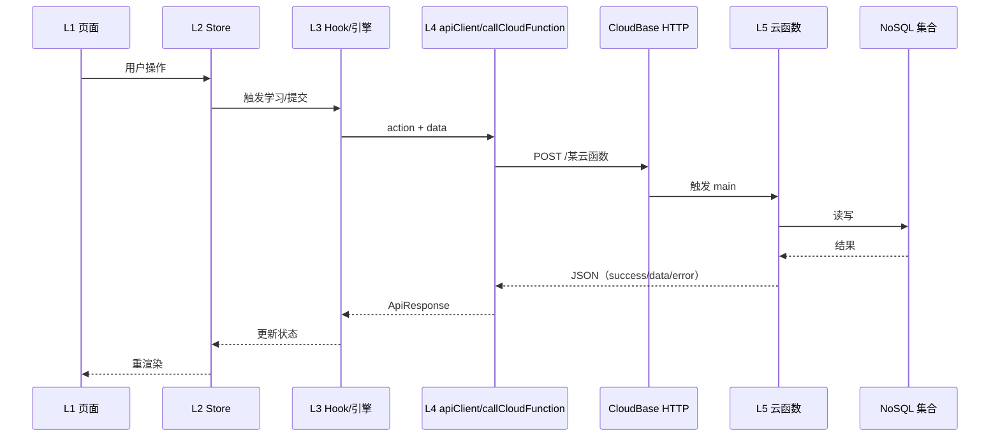

# AI_CONTEXT.md — 架构与数据流速览

> **用途**：给 AI / 新成员快速建立心智模型，**不替代**冻结规格。  
> **权威源（实现与评审以这些为准）**：`docs/project-freeze/PROJECT_OVERVIEW_SPEC.md`、各模块 `*-spec.md`、`docs/project-freeze/database_schema.md`。  
> 若本文与上述文档冲突，以 **project-freeze** 为准，并应同步修正本文。

---

## 1. 五层架构（客户端 → 云端）

本仓库采用「**移动端分层 + CloudBase HTTP 云函数**」结构。五层是**逻辑分层**，便于定位代码；与 `PROJECT_OVERVIEW_SPEC.md` 中的模块划分（Shell / Alphabet / Vocabulary / Memory / AI 等）是**正交关系**——模块可以跨层调用。

| 层 | 职责 | 典型路径 |
|---|------|----------|
| **L1 路由与界面** | Expo Router 页面、布局、展示组件；尽量不写长业务分支 | `app/`、`src/components/` |
| **L2 应用状态** | Zustand：用户、学习偏好、模块进度、字母/词汇会话等 | `src/stores/` |
| **L3 会话与领域逻辑** | 学习流程 Hook、题目引擎、会话状态机、本地持久化配合 | `src/hooks/`、`src/utils/`（生成器/引擎相关） |
| **L4 集成与契约** | 统一 HTTP 调用、后端切换、`{ action, data }` 云函数约定、端点映射 | `src/utils/apiClient.ts`、`src/config/api.endpoints.ts`、`src/config/backend.config.ts` |
| **L5 云函数与数据** | HTTP 触发云函数、`wx-server-sdk`、NoSQL 集合读写 | `cloudbase/functions/`、`cloudbase/cloudbaserc.json` |

**依赖方向（约定）**：L1/L2 → L3 → L4 → 网络；避免 UI 直接拼 URL 绕过 `apiClient` / `callCloudFunction`。

---

## 2. API Gateway 在本项目中的含义

当前后端主线为 **CloudBase**：前端向 **`EXPO_PUBLIC_API_BASE_URL`（或 `backend.config` 默认值）** 发起 **HTTPS**，路径形如 **`/memory-engine`**、**`/ai-engine`** 等，每个路径对应 **一个已部署的云函数**（见 `cloudbase/cloudbaserc.json`）。

- **网关职责**：由 CloudBase 将 **HTTP 路径** 路由到 **对应云函数**；云函数入口再解析 **请求体**。
- **多 action 云函数**：同一 URL 下用 **`{ action, data }`** 区分业务。`apiClient.post` + `callCloudFunction` 负责打包该结构（见 `src/utils/apiClient.ts` 中注释）。
- **HTTP 触发时的 body**：云函数侧通常从 `event.body` 解析 JSON（例如 `memory-engine/index.js`、`ai-engine/index.js`）。
- **鉴权**：通用请求带 `Authorization: Bearer <token>`；部分云函数（如 `ai-engine`）另有业务侧校验（例如 `appSecret`），以对应 handler 为准。
- **双后端占位**：`api.endpoints.ts` 中部分 `cloudbase` 路径为**未实现占位**，仅 `java` 或未来使用；**以注释与 `cloudbaserc.json` 为准**，勿假设所有 `EndpointMap.cloudbase` 均已部署。

**当前 `cloudbaserc.json` 中已登记的云函数名**（与 HTTP 路径一般同名）：`user-register`、`user-login`、`user-reset-password`、`user-update-profile`、`memory-engine`、`alphabet`、`storage-download`、`ai-engine`。

---

## 3. 核心模块（产品视角）

与 `PROJECT_OVERVIEW_SPEC.md` 第 2 节一致，核心模块与规格文档对应关系如下：

| 模块 | 说明 | 规格文档 |
|------|------|----------|
| Frontend Shell & Navigation | Tab、首页、课程入口壳、用户中心与基础设置 | `docs/project-freeze/frontend-shell-module-spec.md` |
| Alphabet Module | 字母课程与训练流程 | `docs/project-freeze/alphabet-module-spec.md` |
| Vocabulary Module | 词汇学习与复习 | `docs/project-freeze/vocabulary-module-spec.md` |
| Courses + LearningStore | 课程列表与学习统计展示 | `docs/project-freeze/courses-and-learningstore-spec.md` |
| Backend Memory Engine | 统一记忆（SM-2）、今日学习内容、进度与模块相关接口 | `docs/project-freeze/backend-memory-engine-spec.md` |
| AI Module (Lite) | 弱项练习、微阅读、词汇解释、发音分析等（MVP 范围以 spec 为准） | `docs/project-freeze/ai-module-spec.md` |

**冻结架构蓝图**：`PROJECT_OVERVIEW_SPEC.md` 第 2.1 节 **Mermaid 类图**（Stores、各屏、ApiClient、云函数、集合关系）为全项目**唯一**顶层组件关系图；扩展功能应在图内职责边界上演进，避免平行体系。

---

## 4. 数据流（高层）

### 4.1 典型请求链

### 4.2 记忆与学习闭环（概念）

- **拉取今日内容**：Store / Hook → `callCloudFunction('getTodayMemories', …)` → **`/memory-engine`** → `getTodayMemories` handler → 读 **`memory_status`** 等集合（细节见 `backend-memory-engine-spec` 与 `database_schema`）。
- **提交单条结果**：`submitMemoryResult` 等 → 更新记忆调度与相关进度字段。
- **字母三轮评估**：`submitRoundEvaluation` 走同一云函数的不同 `action`（见 `memory-engine/index.js` 分支）。

### 4.3 AI 调用（概念）

- 前端通过 **`AI_ENDPOINTS.ENGINE`（`/ai-engine`）** 发起请求；body 内 **`action`** 区分 `explainVocab`、`generateMicroReading` 等（以 `ai-engine/index.js` 的 `switch` 为准）。
- AI **不替代**记忆引擎为唯一真相；是否读记忆状态、是否只读解释，以 **`ai-module-spec.md`** 为准。

### 4.4 字母测试类能力

- 与字母测试相关的独立云函数为 **`alphabet`**（多 `action`），路径映射见 `api.endpoints.ts` 中 `ALPHABET_ENDPOINTS` 注释与 `cloudbase` 字段。

---

## 5. 关键文件索引（便于跳转）

| 主题 | 文件 |
|------|------|
| 后端类型与 Base URL | `src/config/backend.config.ts` |
| 端点映射 / 占位说明 | `src/config/api.endpoints.ts` |
| HTTP + 云函数调用 | `src/utils/apiClient.ts` |
| 云函数清单与运行时 | `cloudbase/cloudbaserc.json` |
| 记忆引擎路由 | `cloudbase/functions/memory-engine/index.js` |
| AI 路由 | `cloudbase/functions/ai-engine/index.js` |
| 顶层模块与类图 | `docs/project-freeze/PROJECT_OVERVIEW_SPEC.md` |

---

## 6. 维护说明

- 新增或更名云函数、变更 **`{ action, data }`** 契约、或改变「进度 / 记忆」唯一写入路径时：先更新 **project-freeze** 中相关 spec 与总纲，再更新本文件摘要。
- 数据库字段与集合以 **`docs/project-freeze/database_schema.md`** 为准。
