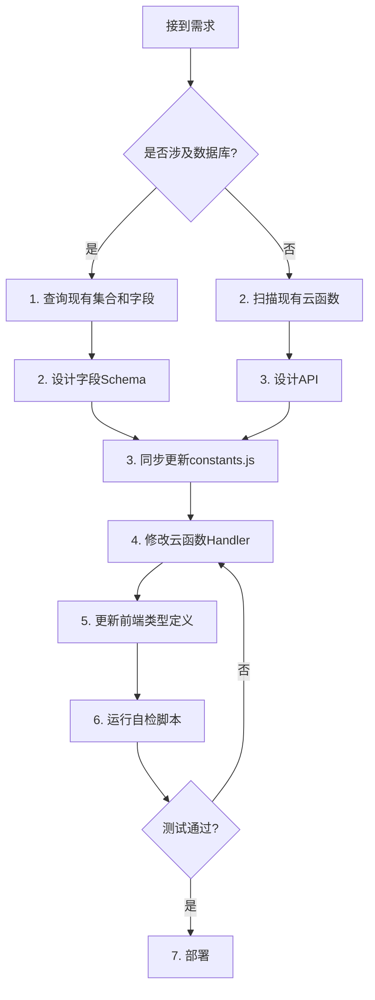

# 📋 Thai Learning App - 工程级项目快照说明书

**版本**: v1.0.7  
**生成日期**: 2025-12-06  
**项目状态**: 活跃开发中

v1.0.7 - Engineering Frozen Version
- 架构冻结
- 表结构冻结
- Action 清单冻结
- 仅允许 Bug 修复，不允许新增模块


---

## 📑 目录

1. [项目真实结构快照](#1-项目真实结构快照)
2. [云函数全量清单](#2-云函数全量清单)
3. [数据库真实结构快照](#3-数据库真实结构快照)
4. [前后端真实通信关系图](#4-前后端真实通信关系图)
5. [系统级风险清单](#5-系统级风险清单)
6. [项目唯一事实源规则](#6-项目唯一事实源规则ssot)
7. [防崩工具](#7-防崩工具)

---

## 1️⃣ 项目真实结构快照

### ✅ 整体技术栈

| 技术层 | 技术选型 | 状态 |
|--------|---------|------|
| **前端框架** | React Native + Expo (v52.0.38) | ✅ 正常 |
| **路由** | expo-router v4.0.20 | ✅ 正常 |
| **状态管理** | Zustand v5.0.8 | ✅ 正常 |
| **后端形式** | CloudBase Serverless (wx-server-sdk) | ✅ 正常 |
| **数据库类型** | CloudBase NoSQL (类MongoDB) | ✅ 正常 |
| **认证方式** | JWT (jsonwebtoken + bcryptjs) | ✅ 正常 |
| **国际化** | i18next + react-i18next | ✅ 正常 |
| **HTTP客户端** | axios v1.13.2 | ✅ 正常 |

### ✅ 项目目录结构

```
ThaiLearningApp/
├── app/                    # Expo Router 页面 (16个文件)
├── src/
│   ├── components/         # React 组件 (14个)
│   ├── config/             # 配置文件 (3个)
│   │   ├── api.endpoints.ts    ✅ API端点统一管理
│   │   ├── backend.config.ts   ✅ 后端环境配置
│   │   └── constants.ts        ✅ 前端常量
│   ├── stores/             # Zustand状态管理 (6个)
│   │   ├── alphabetStore.ts
│   │   ├── vocabularyStore.ts
│   │   ├── learningStore.ts
│   │   ├── moduleAccessStore.ts
│   │   ├── userStore.ts
│   │   └── languageStore.ts
│   ├── i18n/               # 国际化 (中英泰三语)
│   ├── utils/              # 工具函数 (5个)
│   └── entities/           # 类型定义 (12个)
├── cloudbase/
│   └── functions/          # 云函数 (8个)
│       ├── shared/         ⚠️ 共享npm包 (已规范化)
│       ├── alphabet/
│       ├── learn-vocab/
│       ├── memory-engine/
│       ├── user-login/
│       ├── user-register/
│       ├── user-reset-password/
│       └── user-update-profile/
└── docs/                   # 项目文档 (22个)
```

### ⚠️ 共享代码结构 (Critical)

**共享包**: `@thai-app/shared`  
**路径**: `cloudbase/functions/shared/`

| 模块文件 | 用途 | 引用次数 | 风险等级 |
|---------|------|---------|---------|
| `memoryEngine.js` | 统一记忆引擎核心逻辑 | 3个云函数 | ❌ **高危** - 核心逻辑 |
| `sm2.js` | SM-2算法实现 | 1个云函数 | ⚠️ 中等 |
| `database.js` | 数据库集合引用 | 3个云函数 | ⚠️ 中等 |
| `validators.js` | 参数验证工具 | 2个云函数 | ✅ 低风险 |
| `response.js` | 统一响应格式 | 8个云函数 | ❌ **高危** - 全局依赖 |
| `constants.js` | 常量定义 | 4个云函数 | ⚠️ 中等 |

> ❌ **警告**: `shared/` 模块修改会影响所有云函数，必须谨慎测试

---

## 2️⃣ 云函数全量清单

### ✅ 1. **alphabet** (字母学习)

**入口文件**: `index.js`  
**用途**: 字母测试与通关管理  
**HTTP触发器**: ✅ 已配置

#### 支持 Actions:

| Action | 用途 | 参数 | 返回 |
|--------|------|------|------|
| `getLetterTest` | 获取字母测试题 | 无 | `{ questions: [] }` |
| `submitLetterTest` | 提交字母测试答案 | `userId`, `answers[]` | `{ passed: boolean, score: number }` |
| `passLetterTest` | 直接通过测试(调试用) | `userId` | `{ success: boolean }` |

#### 依赖的集合:
- ✅ `letter_test_bank` (读取)
- ✅ `user_progress` (更新 `letterCompleted` 字段)

#### Handler文件:
- `handlers/getLetterTest.js`
- `handlers/submitLetterTest.js`
- `handlers/passLetterTest.js`

---

### ✅ 2. **learn-vocab** (单词学习 - 传统API)

**入口文件**: `index.js`  
**用途**: 单词学习的7个传统API (已部分迁移至memory-engine)  
**HTTP触发器**: ✅ 已配置

#### 支持 Actions:

| Action | 用途 | 参数 | 返回 | 状态 |
|--------|------|------|------|------|
| `getTodayWords` | 获取今日单词 | `userId`, `limit`, `offset` | `{ words[], summary }` | ✅ 正常 |
| `updateMastery` | 更新掌握度 | `userId`, `vocabularyId`, `mastery` | `{ success }` | ✅ 正常 |
| `toggleSkipWord` | 跳过/取消跳过单词 | `userId`, `vocabularyId` | `{ skipped }` | ✅ 正常 |
| `getVocabularyDetail` | 获取单词详情 | `vocabularyId` | `{ vocabulary }` | ✅ 正常 |
| `getReviewStatistics` | 获取复习统计 | `userId` | `{ statistics }` | ✅ 正常 |
| `getVocabularyList` | 获取单词列表 | `level`, `limit` | `{ vocabularies[] }` | ✅ 正常 |
| `getSkippedWords` | 获取已跳过单词 | `userId`, `limit` | `{ words[] }` | ✅ 正常 |
| ~~`getTodayMemories`~~ | (已迁移) | - | - | **❌ MOVED_PERMANENTLY** |
| ~~`submitMemoryResult`~~ | (已迁移) | - | - | **❌ MOVED_PERMANENTLY** |
| ~~`checkModuleAccess`~~ | (已迁移) | - | - | **❌ MOVED_PERMANENTLY** |
| ~~`getUserProgress`~~ | (已迁移) | - | - | **❌ MOVED_PERMANENTLY** |

#### 依赖的集合:
- ✅ `users` (读取)
- ✅ `vocabulary` (读取)
- ✅ `user_vocabulary_progress` (读写)
- ⚠️ `vocabularies` (注意拼写不一致!)

> **⚠️ 风险**: 存在 `vocabulary` 和 `vocabularies` 两个集合名混用问题!

---

### ✅ 3. **memory-engine** (统一记忆引擎)

**入口文件**: `index.js`  
**用途**: 字母/单词/句子的统一记忆管理 (UME架构)  
**HTTP触发器**: ✅ 已配置

#### 支持 Actions:

| Action | 用途 | 参数 | 返回 |
|--------|------|------|------|
| `getTodayMemories` | 获取今日学习内容 | `userId`, `entityType`, `limit`, `includeNew` | `{ items[], summary }` |
| `submitMemoryResult` | 提交学习结果 | `userId`, `results[]` | `{ updatedMemories[] }` |
| `checkModuleAccess` | 检查模块访问权限 | `userId`, `moduleType` | `{ allowed, progress }` |
| `getUserProgress` | 获取用户学习进度 | `userId` | `{ progress }` |

#### 依赖的集合:
- ✅ `memory_status` (核心记忆状态表，读写频繁)
- ✅ `user_progress` (用户进度，更新 `dailyLimit`)
- ✅ `letters` (字母实体)
- ✅ `vocabulary` (单词实体)
- ✅ `sentences` (句子实体)

#### Handler文件:
- `handlers/getTodayMemories.js` ❌ **高复杂度**
- `handlers/submitMemoryResult.js`
- `handlers/checkModuleAccess.js`
- `handlers/getUserProgress.js`

---

### ✅ 4. **user-login** (用户登录)

**入口文件**: `index.js`  
**用途**: JWT认证登录  

#### 参数:
- `email` (必填)
- `password` (必填)

#### 返回:
```json
{
  "success": true,
  "data": {
    "user": { ... },
    "token": "jwt_token",
    "expiresIn": 604800
  }
}
```

#### 依赖的集合:
- ✅ `users` (读取 + 更新 `lastLogin`)

---

### ✅ 5. **user-register** (用户注册)

**入口文件**: `index.js`  
**用途**: 用户注册 + 初始化进度  

#### 参数:
- `email` (必填)
- `password` (必填)
- `displayName` (必填)
- `role` (可选, 默认 "LEARNER")

#### 关键逻辑:
1. 创建 `users` 表记录
2. **同时创建 `user_progress` 初始记录** ❌ **Critical**

#### 依赖的集合:
- ✅ `users` (创建)
- ✅ `user_progress` (创建初始记录)

> **❌ 高危风险**: 若 `user_progress` 创建失败但 `users` 创建成功，会导致用户无法使用系统

---

### ✅ 6. **user-reset-password**

**入口文件**: `index.js`  
**用途**: 重置密码  

#### 依赖的集合:
- ✅ `users` (更新 `passwordHash`)

---

### ✅ 7. **user-update-profile**

**入口文件**: `index.js`  
**用途**: 更新用户资料  

#### 依赖的集合:
- ✅ `users` (更新)

---

### ✅ 8. **shared** (共享npm包)

**入口文件**: `index.js`  
**包名**: `@thai-app/shared`  
**用途**: 所有云函数共用的工具库  

#### 导出模块:
```javascript
module.exports = {
  memoryEngine,   // 记忆引擎核心逻辑
  sm2,            // SM-2算法
  database,       // 数据库集合
  validators,     // 参数验证
  response,       // 响应格式化
  constants       // 常量定义
};
```

---

## 3️⃣ 数据库真实结构快照

### ✅ 3.1 `users` (用户表)

**用途**: 存储用户账号信息

| 字段名 | 类型 | 用途 | 状态 | 风险 |
|--------|------|------|------|------|
| `_id` | String | 数据库自动生成 | ✅ 核心 | - |
| `userId` | String | 业务层用户ID | ✅ 核心 | ❌ **必须唯一** |
| `email` | String | 登录邮箱 | ✅ 核心 | ❌ **必须唯一** |
| `passwordHash` | String | bcrypt哈希密码 | ✅ 核心 | - |
| `displayName` | String | 显示名称 | ✅ 核心 | - |
| `role` | String | 角色 (LEARNER/ADMIN) | ✅ 正常 | - |
| `registrationDate` | ISO String | 注册日期 | ✅ 正常 | - |
| `lastLogin` | ISO String | 最后登录时间 | ✅ 正常 | - |
| `isActive` | Boolean | 账号是否激活 | ✅ 正常 | - |
| `preferences` | Object | 用户偏好设置 | ✅ 正常 | - |
| `preferences.language` | String | 界面语言 | ✅ 正常 | - |
| `preferences.notificationsEnabled` | Boolean | 通知开关 | ✅ 正常 | - |

**索引需求**:
- ✅ `userId` (唯一索引)
- ✅ `email` (唯一索引)

---

### ✅ 3.2 `user_progress` (用户学习进度)

**用途**: 记录用户整体学习进度和模块解锁状态

| 字段名 | 类型 | 用途 | 状态 | 风险 |
|--------|------|------|------|------|
| `_id` | String | 数据库ID | ✅ 核心 | - |
| `userId` | String | 用户ID | ✅ 核心 | ❌ **外键依赖** |
| `letterCompleted` | Boolean | 字母学习是否完成 | ✅ 核心 | ❌ **解锁逻辑关键字段** |
| `debugSkipLetter` | Boolean | 调试用:跳过字母 | ⚠️ 调试 | - |
| `letterProgress` | Float | 字母学习进度(0-1) | ✅ 正常 | - |
| `wordProgress` | Float | 单词学习进度(0-1) | ✅ 正常 | - |
| `sentenceProgress` | Float | 句子学习进度(0-1) | ✅ 正常 | - |
| `wordUnlocked` | Boolean | 单词模块是否解锁 | ⚠️ 历史遗留 | ⚠️ 实际未使用 |
| `sentenceUnlocked` | Boolean | 句子模块是否解锁 | ⚠️ 历史遗留 | ⚠️ 实际未使用 |
| `articleUnlocked` | Boolean | 文章模块是否解锁 | ⚠️ 历史遗留 | ⚠️ 实际未使用 |
| `currentStage` | String | 当前阶段(letter/word/...) | ⚠️ 历史遗留 | ⚠️ 实际未使用 |
| `totalStudyDays` | Integer | 总学习天数 | ✅ 正常 | - |
| `streakDays` | Integer | 连续学习天数 | ✅ 正常 | - |
| `lastStudyDate` | ISO String | 最后学习日期 | ✅ 正常 | - |
| `dailyLimit` | Integer | 每日学习数量限制 | ✅ 新增 | - |
| `createdAt` | ISO String | 创建时间 | ✅ 正常 | - |
| `updatedAt` | ISO String | 更新时间 | ✅ 正常 | - |

**索引需求**:
- ✅ `userId` (唯一索引)

**⚠️ 风险点**:
1. **必须在用户注册时创建**: 若缺失会导致 `checkModuleAccess` 报错
2. **字段混乱**: `wordUnlocked/sentenceUnlocked` 等字段已不使用，但代码仍在初始化
3. **关键依赖**: `letterCompleted` 字段决定是否解锁所有其他模块

---

### ✅ 3.3 `memory_status` (统一记忆状态表)

**用途**: UME核心表，存储用户对每个学习实体的记忆状态

| 字段名 | 类型 | 用途 | 状态 | 风险 |
|--------|------|------|------|------|
| `_id` | String | 数据库ID | ✅ 核心 | - |
| `userId` | String | 用户ID | ✅ 核心 | ❌ **外键** |
| `entityType` | String | 实体类型(letter/word/sentence) | ✅ 核心 | ❌ **必须准确** |
| `entityId` | String | 实体ID | ✅ 核心 | ❌ **必须存在** |
| `masteryLevel` | Float | 掌握度(0.0-1.0) | ✅ 核心 | - |
| `reviewStage` | Integer | SM-2复习阶段 | ✅ 核心 | - |
| `easinessFactor` | Float | SM-2简易因子 | ✅ 核心 | - |
| `intervalDays` | Integer | SM-2复习间隔(天) | ✅ 核心 | - |
| `lastReviewAt` | ISO String | 上次复习时间 | ✅ 核心 | - |
| `nextReviewAt` | ISO String | 下次复习时间 | ✅ 核心 | ❌ **查询关键** |
| `correctCount` | Integer | 正确次数 | ✅ 正常 | - |
| `wrongCount` | Integer | 错误次数 | ✅ 正常 | - |
| `streakCorrect` | Integer | 连续正确次数 | ✅ 正常 | - |
| `isLocked` | Boolean | 是否锁定(未解锁) | ✅ 正常 | - |
| `createdAt` | ISO String | 创建时间 | ✅ 正常 | - |
| `updatedAt` | ISO String | 更新时间 | ✅ 正常 | - |

**索引需求** (Critical):
- ✅ `userId` + `entityType` + `entityId` (复合唯一索引)
- ✅ `userId` + `entityType` + `nextReviewAt` (查询索引)
- ✅ `userId` + `entityType` + `isLocked` (查询索引)

**⚠️ 风险点**:
1. **性能关键**: 此表查询频繁，索引缺失会导致性能问题
2. **字段缺失**: `updateMemoryAfterReview` 更新时若字段为 `undefined` 会导致错误
3. **重复插入**: 需要唯一索引防止重复记录

---

### ✅ 3.4 `user_vocabulary_progress` (单词学习进度 - 传统表)

**用途**: 传统单词学习进度表 (与 `memory_status` 功能重叠)

| 字段名 | 类型 | 用途 | 状态 | 风险 |
|--------|------|------|------|------|
| `_id` | String | 数据库ID | ✅ 核心 | - |
| `userId` | String | 用户ID | ✅ 核心 | ❌ **外键** |
| `vocabularyId` | String | 单词ID | ✅ 核心 | ❌ **外键** |
| `mastery` | String | 掌握度(陌生/模糊/记得) | ✅ 核心 | - |
| `reviewCount` | Integer | 复习次数 | ✅ 正常 | - |
| `lastReviewed` | ISO String | 最后复习时间 | ✅ 正常 | - |
| `nextReviewDate` | ISO String | 下次复习日期 | ✅ 核心 | ❌ **查询关键** |
| `intervalDays` | Integer | 复习间隔(天) | ✅ 正常 | - |
| `skipped` | Boolean | 是否已跳过 | ✅ 正常 | - |
| `easinessFactor` | Float | SM-2简易因子 | ✅ 正常 | - |

**⚠️ 架构问题**:
- **功能重叠**: 与 `memory_status` 功能重复
- **迁移风险**: 若完全迁移至UME，需要数据迁移策略

---

### ✅ 3.5 `vocabulary` (单词实体表)

**用途**: 存储泰语单词数据

| 字段名 | 类型 | 用途 | 状态 |
|--------|------|------|------|
| `_id` | String | 单词ID | ✅ 核心 |
| `thaiWord` | String | 泰语单词 | ✅ 核心 |
| `meaning` | String | 中文含义 | ✅ 核心 |
| `pronunciation` | String | 发音 | ✅ 正常 |
| `audioPath` | String | 音频路径 | ✅ 正常 |
| `partOfSpeech` | String | 词性 | ✅ 正常 |
| `level` | String | 难度等级 | ✅ 正常 |
| `lessonNumber` | Integer | 课程序号 | ✅ 核心 |
| `source` | String | 来源教材(Thai_1/Thai_2...) | ✅ 正常 |

**索引需求**:
- ✅ `lessonNumber` (排序查询)
- ✅ `level` (筛选查询)

**⚠️ 注意**: 存在 `vocabularies` (复数形式) 集合名混用问题

---

### ✅ 3.6 `letters` (字母实体表)

**用途**: 存储泰语字母数据

| 字段名 | 类型 | 用途 | 状态 |
|--------|------|------|------|
| `_id` | String | 字母ID | ✅ 核心 |
| `letter` | String | 字母字符 | ✅ 核心 |
| `pronunciation` | String | 发音 | ✅ 核心 |
| `audioPath` | String | 音频路径 | ✅ 正常 |
| `lessonNumber` | Integer | 课程序号 | ✅ 核心 |
| `type` | String | 类型(consonant/vowel) | ✅ 正常 |

**索引需求**:
- ✅ `lessonNumber` (排序查询)

---

### ✅ 3.7 `sentences` (句子实体表)

**用途**: 存储泰语句子数据

| 字段名 | 类型 | 用途 | 状态 |
|--------|------|------|------|
| `_id` | String | 句子ID | ✅ 核心 |
| `thaiSentence` | String | 泰语句子 | ✅ 核心 |
| `meaning` | String | 中文含义 | ✅ 核心 |
| `audioPath` | String | 音频路径 | ✅ 正常 |
| `lessonNumber` | Integer | 课程序号 | ✅ 核心 |

---

### ✅ 3.8 `letter_test_bank` (字母测试题库)

**用途**: 存储固定的字mother测试题

| 字段名 | 类型 | 用途 | 状态 |
|--------|------|------|------|
| `_id` | String | 题目ID | ✅ 核心 |
| `questions` | Array | 题目数组 | ✅ 核心 |

**⚠️ 使用方式**: `getLetterTest` 直接返回整个 `questions` 数组

---

## 4️⃣ 前后端真实通信关系图

### ✅ 4.1 前端 → 云函数调用清单

#### 📱 字母学习页面 (`app/(tabs)/alphabet.tsx`)

| 调用云函数 | Action | 传参 | 返回 | 绑定Store | 风险 |
|-----------|--------|------|------|-----------|------|
| `alphabet` | `getLetterTest` | 无 | `{ questions[] }` | `alphabetStore` | ✅ 低 |
| `alphabet` | `submitLetterTest` | `userId`, `answers[]` | `{ passed, score }` | `alphabetStore` | ⚠️ 中等 |

**风险**:
- 若 `questions` 字段缺失 → 页面崩溃
- 若 `passed` 字段缺失 → 无法判断通过状态

---

#### 📱 单词学习页面 (`app/(tabs)/vocabulary.tsx`)

| 调用云函数 | Action | 传参 | 返回 | 绑定Store | 风险 |
|-----------|--------|------|------|-----------|------|
| `memory-engine` | `getTodayMemories` | `userId`, `entityType: 'word'`, `limit` | `{ items[], summary }` | `vocabularyStore`, `learningStore` | ❌ **高** |
| `memory-engine` | `submitMemoryResult` | `userId`, `results[]` | `{ updatedMemories[] }` | `vocabularyStore` | ❌ **高** |
| `learn-vocab` | `toggleSkipWord` | `userId`, `vocabularyId` | `{ skipped }` | `vocabularyStore` | ✅ 低 |

**高风险原因**:
1. **`getTodayMemories`**: 复杂的穿插逻辑 (3新:1复习)，若逻辑错误会导致学习流程混乱
2. **`submitMemoryResult`**: 批量更新，若单个失败可能导致数据不一致

---

#### 📱 首页 (`app/(tabs)/home.tsx`)

| 调用云函数 | Action | 传参 | 返回 | 绑定Store |
|-----------|--------|------|------|-----------|
| `memory-engine` | `checkModuleAccess` | `userId`, `moduleType` | `{ allowed, progress }` | `moduleAccessStore` |
| `memory-engine` | `getUserProgress` | `userId` | `{ progress }` | `userStore` |

---

### ✅ 4.2 云函数 → 数据库真实读写行为

#### **alphabet** 云函数

```
submitLetterTest:
  - 读取: letter_test_bank (获取答案)
  - 更新: user_progress.letterCompleted (关键!)
  
风险:
  - 若 user_progress 无该字段 → 更新直接报错
  - 若更新失败但已判定通过 → 用户状态不一致
```

---

#### **memory-engine** 云函数

```
getTodayMemories:
  - 读取: user_progress (获取 dailyLimit)
  - 更新: user_progress.dailyLimit (可选)
  - 读取: memory_status (筛选今日复习)
  - 读取: letters/vocabulary/sentences (获取实体)
  - 创建: memory_status (若新学实体不存在记录)
  
submitMemoryResult:
  - 读取: memory_status (获取当前状态)
  - 更新: memory_status (更新所有SM-2字段)
  
风险:
  - memory_status 表无索引 → 查询性能问题
  - 批量更新若部分失败 → 数据不一致
  - nextReviewAt 计算错误 → 复习时间混乱
```

---

#### **learn-vocab** 云函数

```
getTodayWords:
  - 读取: users
  - 读取: user_vocabulary_progress (获取所有进度)
  - 读取: vocabulary (获取新词 + 复习词)
  
updateMastery:
  - 更新: user_vocabulary_progress (单条记录)
  
风险:
  - vocabulary vs vocabularies 集合名混用
  - mastery 字段值不规范 → 逻辑错误
```

---

## 5️⃣ 系统级风险清单

### ❌ 5.1 结构性风险

| 风险项 | 严重程度 | 描述 | 影响范围 |
|--------|---------|------|---------|
| **共享模块修改** | 🔴 极高 | `shared/` 下任何文件修改都会影响8个云函数 | 全系统 |
| **数据库集合名混用** | 🟡 中等 | `vocabulary` vs `vocabularies` 混用 | learn-vocab |
| **user_progress 缺失** | 🔴 极高 | 用户注册时若未创建 `user_progress` → 系统不可用 | 全系统 |
| **memory_status 无索引** | 🟠 高 | 查询性能问题，用户量增长后系统变慢 | memory-engine |

---

### ❌ 5.2 架构性风险

| 风险项 | 严重程度 | 描述 |
|--------|---------|------|
| **双记忆系统并存** | 🟡 中等 | `memory_status` 和 `user_vocabulary_progress` 功能重叠 |
| **历史遗留字段** | 🟢 低 | `wordUnlocked`, `sentenceUnlocked` 等字段 已不使用但仍在初始化 |
| **环境变量依赖** | 🟠 高 | `FORCE_UNLOCK`, `JWT_SECRET` 等必须在CloudBase环境配置，否则功能异常 |

---

### ❌ 5.3 数据一致性风险

| 风险项 | 严重程度 | 描述 | 解决方案 |
|--------|---------|------|---------|
| **注册时双表创建** | 🔴 极高 | `users` 创建成功但 `user_progress` 创建失败 → 用户无法使用 | 使用事务或补偿机制 |
| **批量更新部分失败** | 🟠 高 | `submitMemoryResult` 批量更新时部分成功 | 添加事务或回滚机制 |
| **字段undefined写入** | 🔴 极高 | `updateMemoryAfterReview` 若SM-2返回 `undefined` → 数据库更新报错 | 添加字段验证 |

---

### ❌ 5.4 团队协作风险

| 风险项 | 严重程度 | 描述 |
|--------|---------|------|
| **无字段文档** | 🟠 高 | 新成员不知道哪些字段已废弃 |
| **action未同步** | 🔴 极高 | 前端调用已迁移的action → `MOVED_PERMANENTLY` 错误 |
| **API端点配置错误** | 🟠 高 | `api.endpoints.ts` 中部分端点仍指向旧云函数 |

---

### ❌ 5.5 AI并行修改冲突风险

| 风险项 | 严重程度 | 描述 |
|--------|---------|------|
| **同时修改shared模块** | 🔴 极高 | 多个AI同时修改 `shared/memoryEngine.js` → 逻辑混乱 |
| **字段名"猜测"** | 🔴 极高 | AI未查询实际数据库直接"猜"字段名 → 运行时报错 |
| **未扫描现有云函数** | 🟠 高 | AI新写云函数与现有函数重复功能 |

---

## 6️⃣ 项目唯一事实源规则(SSOT)

### 📜 6.1 新增字段必须同步到

1. ✅ **数据库字段文档** (此文档第3节)
2. ✅ **云函数Handler验证逻辑** (使用 `validators.js`)
3. ✅ **前端TypeScript类型定义** (`src/entities/*.ts`)
4. ✅ **云函数 `constants.js`** (若为枚举值)

---

### 📜 6.2 任何人/AI **不得**

1. ❌ 直接"猜字段名" → **必须先查询数据库**
2. ❌ 直接"假设action已存在" → **必须先查询云函数 `index.js`**
3. ❌ 未扫描现有云函数就新写函数 → **必须先运行** `find_by_name` **查询**
4. ❌ 修改 `shared/` 模块而不运行全量测试 → **必须测试所有云函数**

---

### 📜 6.3 修改流程(Mandatory)



---

## 7️⃣ 防崩工具

### 📋 7.1 字段对账清单模板

**文件名**: `FIELD_RECONCILIATION.md`

```markdown
# 字段对账清单

## 修改信息
- **修改人**: ___________
- **修改日期**: ___________
- **关联需求**: ___________

## 数据库字段修改

### 集合名: ___________

| 字段名 | 类型 | 必填 | 默认值 | 用途 | 已同步位置 |
|--------|------|------|--------|------|-----------|
| | | ☐是 ☐否 | | | ☐数据库 ☐云函数 ☐前端 ☐文档 |

## 验证清单

- [ ] 已更新 `shared/constants.js`
- [ ] 已更新云函数 `validators.js` 验证规则
- [ ] 已更新前端 TypeScript 类型定义
- [ ] 已更新此文档 (PROJECT_SNAPSHOT_REPORT.md)
- [ ] 已测试所有相关云函数
- [ ] 已测试前端页面

## 影响范围评估

| 云函数 | 是否影响 | 修改内容 | 测试状态 |
|--------|---------|---------|---------|
| alphabet | ☐是 ☐否 | | ☐已测试 ☐未测试 |
| learn-vocab | ☐是 ☐否 | | ☐已测试 ☐未测试 |
| memory-engine | ☐是 ☐否 | | ☐已测试 ☐未测试 |

## 回滚计划

若部署失败，回滚步骤:
1. ___________
2. ___________
```

---

### 📋 7.2 云函数Action对账表

**文件名**: `CLOUD_FUNCTION_ACTION_MAP.md`

```markdown
# 云函数Action对账表

| 云函数 | Action | 参数 | 返回字段 | 前端调用位置 | 状态 |
|--------|--------|------|---------|-------------|------|
| alphabet | getLetterTest | 无 | questions[] | alphabetStore.fetchTest() | ✅ 正常 |
| alphabet | submitLetterTest | userId, answers[] | passed, score | alphabetStore.submitTest() | ✅ 正常 |
| alphabet | passLetterTest | userId | success | alphabetStore.passTest() | ✅ 正常 |
| memory-engine | getTodayMemories | userId, entityType, limit | items[], summary | learningStore.fetchToday() | ✅ 正常 |
| memory-engine | submitMemoryResult | userId, results[] | updatedMemories[] | learningStore.submitResults() | ✅ 正常 |
| memory-engine | checkModuleAccess | userId, moduleType | allowed, progress | moduleAccessStore.check() | ✅ 正常 |
| memory-engine | getUserProgress | userId | progress | userStore.fetchProgress() | ✅ 正常 |
| learn-vocab | getTodayWords | userId, limit, offset | words[], summary | vocabularyStore.fetchWords() | ✅ 正常 |
| learn-vocab | updateMastery | userId, vocabularyId, mastery | success | vocabularyStore.updateMastery() | ✅ 正常 |
| learn-vocab | toggleSkipWord | userId, vocabularyId | skipped | vocabularyStore.toggleSkip() | ✅ 正常 |
| learn-vocab | getVocabularyDetail | vocabularyId | vocabulary | vocabularyStore.fetchDetail() | ✅ 正常 |
| learn-vocab | getVocabularyList | level, limit | vocabularies[] | vocabularyStore.fetchList() | ✅ 正常 |
| learn-vocab | getSkippedWords | userId, limit | words[] | vocabularyStore.fetchSkipped() | ✅ 正常 |
| learn-vocab | ~~getTodayMemories~~ | - | - | - | ❌ MOVED (→ memory-engine) |

## 新增Action流程

1. 在此表格添加一行
2. 修改云函数 `index.js` 添加路由
3. 创建对应的 `handlers/*.js` 文件
4. 更新 `shared/constants.js` 的 `SUPPORTED_ACTIONS`
5. 更新前端 `api.endpoints.ts`
6. 更新前端对应的 Store
7. 全量测试
```

---

### 📋 7.3 前后端调用约束模板

**文件名**: `API_CONTRACT_TEMPLATE.md`

```markdown
# API调用约束

## 云函数: ___________
## Action: ___________

### 请求格式

```json
{
  "action": "___________",
  "data": {
    "param1": "类型: ___ | 必填: ☐是 ☐否 | 说明: ___",
    "param2": "类型: ___ | 必填: ☐是 ☐否 | 说明: ___"
  }
}
```

### 响应格式

#### 成功响应
```json
{
  "success": true,
  "data": {
    "field1": "类型: ___ | 说明: ___",
    "field2": "类型: ___ | 说明: ___"
  },
  "message": "操作成功"
}
```

#### 失败响应
```json
{
  "success": false,
  "data": null,
  "message": "错误描述",
  "errorCode": "ERROR_CODE"
}
```

### 错误码清单

| 错误码 | 说明 | 前端处理方式 |
|--------|------|-------------|
| INVALID_PARAMS | 参数错误 | 提示用户并记录日志 |
| USER_NOT_FOUND | 用户不存在 | 跳转登录页 |
| MODULE_LOCKED | 模块未解锁 | 提示完成前置任务 |

### 依赖的数据库集合

| 集合名 | 操作类型 | 关键字段 |
|--------|---------|---------|
| | ☐读取 ☐写入 ☐更新 ☐删除 | |

### 前端调用示例

```typescript
// Store: ___________
// Method: ___________

const response = await callCloudFunction('/___________', {
  action: '___________',
  data: {
    param1: value1,
    param2: value2
  }
});

if (response.success) {
  // 成功处理
} else {
  // 错误处理
}
```

### 测试用例

- [ ] 正常情况测试
- [ ] 参数缺失测试
- [ ] 参数类型错误测试
- [ ] 数据库记录不存在测试
- [ ] 权限不足测试
```

---

## 📊 附录: 快速参考

### A. 环境变量清单

| 变量名 | 用途 | 必填 | 默认值 |
|--------|------|------|--------|
| `JWT_SECRET` | JWT签名密钥 | ✅ 是 | - |
| `FORCE_UNLOCK` | 调试用:跳过所有学习锁 | ❌ 否 | - |

### B. npm包依赖清单

| 包名 | 版本 | 用途 |
|------|------|------|
| `wx-server-sdk` | latest | CloudBase SDK |
| `bcryptjs` | latest | 密码加密 |
| `jsonwebtoken` | latest | JWT认证 |

### C. 关键文件路径速查

| 文件 | 路径 |
|------|------|
| API端点配置 | `src/config/api.endpoints.ts` |
| 共享常量 | `cloudbase/functions/shared/constants.js` |
| 共享响应格式 | `cloudbase/functions/shared/response.js` |
| 统一记忆引擎 | `cloudbase/functions/shared/memoryEngine.js` |
| SM-2算法 | `cloudbase/functions/shared/sm2.js` |

---

## 🎯 总结

### ✅ 项目健康度评估

| 维度 | 评分 | 说明 |
|------|------|------|
| **代码规范** | 🟢 85/100 | 共享模块已规范化，结构清晰 |
| **数据库设计** | 🟡 70/100 | 存在集合名混用和双记忆系统问题 |
| **风险控制** | 🟠 60/100 | 缺少索引、事务机制和字段验证 |
| **文档完整性** | 🟢 80/100 | 本报告补充后基本完整 |
| **协作规范** | 🟡 65/100 | 缺少强制性的修改流程和对账机制 |

### ⚠️ 紧急待办事项

1. **🔴 极高优先级**
   - [ ] 为 `memory_status` 表添加复合索引
   - [ ] 修复 `vocabulary` vs `vocabularies` 集合名混用
   - [ ] 为用户注册添加事务保护

2. **🟠 高优先级**
   - [ ] 清理 `user_progress` 表的历史遗留字段
   - [ ] 为 `updateMemoryAfterReview` 添加字段验证
   - [ ] 更新前端 `api.endpoints.ts` 中已迁移的端点

3. **🟡 中优先级**
   - [ ] 评估是否需要完全迁移到UME架构
   - [ ] 建立CI/CD自动测试流程

---

**文档维护**: 此文档应在每次重大修改后更新，保证为项目唯一事实源。

**最后更新**: 2025-12-06
