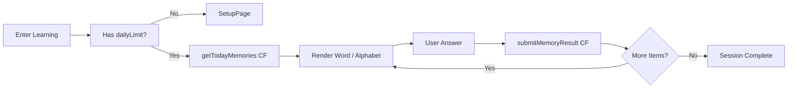

# Project Snapshot v1.0.9-V9  
**Generated: 2025-12-07**  
**Snapshot Type: Full / Extended / AI‑Developer Ready**

---

# 1. Overview
ThaiLearningApp is a React Native + Expo Router + Zustand + CloudBase learning system designed for structured Thai language acquisition.  
Version **V9** merges the accuracy of V8 and the missing architectural, UX, and engineering norms inherited from V7.

This snapshot is structured so AI agents and human developers can fully understand and safely extend the project **without scanning the entire source code**.

---

# 2. High-Level Architecture (Mermaid)

```mermaid
flowchart TD
    UI[React Native UI Layer] --> State[Zustand Stores]
    State --> API[CloudBase API Layer]
    API --> MemoryEngine[(Memory Engine CF)]
    API --> AuthCF[(Auth CF)]
    API --> ProgressCF[(Progress CF)]

    UI --> Navigation[Expo Router Navigation]

    subgraph Modules
        Courses[Courses Screen]
        Setup[Learning Setup Screen]
        Learning[Learning Session Flow]
        AlphabetV2[Alphabet Learning (New)]
    end

    Navigation --> Courses
    Courses --> Setup
    Setup --> Learning

    Learning --> AlphabetV2
    Courses --> AlphabetV2
```

---

# 3. Expo Router Structure (Complete Tree)

```plaintext
app/
  _layout.tsx
  (tabs)/
    _layout.tsx
    home.tsx
    courses.tsx
    profile.tsx
  learning/
    _layout.tsx
    index.tsx
    setup.tsx
  auth/
    login.tsx
    register.tsx
cloudbase/
src/
  components/
    courses/
      CourseCard.tsx
      AlphabetCourseCard.tsx
      LettersCard.tsx
      CourseSelectionModal.tsx
    learning/
      NewWordView.tsx
      ReviewWordView.tsx
      AlphabetLearningView.tsx
      AlphabetReviewView.tsx
      ModuleLockedScreen.tsx
    common/
      ThaiPatternBackground.tsx
      Typography.ts
  stores/
    vocabularyStore.ts
    learningPreferenceStore.ts
    moduleAccessStore.ts
    alphabetStore.ts
    userStore.ts
  utils/
    cloudbaseClient.ts
    validators.ts
    formatters.ts
assets/
docs/
```

Alphabet **old** system (`app/learning/alphabet` or `app/alphabet`) **has been removed in V9**.

---

# 4. Zustand Stores (Dependency Graph)

```mermaid
flowchart TD
    vocab[vocabularyStore]
    pref[learningPreferenceStore]
    access[moduleAccessStore]
    alpha[alphabetStore (new)]
    user[userStore]

    courses[(Courses Screen)]
    setup[(Learning Setup)]
    session[(Learning Session)]
    alphabetUI[(AlphabetLearningView)]

    courses --> vocab
    courses --> access
    courses --> pref

    setup --> pref

    session --> vocab
    session --> pref
    session --> alpha

    alpha --> user
```

---

# 5. Course Selection System (Detailed Architecture)

## 5.1 Components
- `CourseCard.tsx` – general-purpose card for word/sentence/article courses  
- `AlphabetCourseCard.tsx` – dedicated card for alphabet course  
- `LettersCard.tsx` – future entry for alphabet-v2

## 5.2 Behavior Rules
### ① AlphabetCourseCard
| Action | Result |
|--------|--------|
| Press card body | (V9) Disabled — no special navigation |
| Press Start/Continue | Standard learning flow (setup → learning) |

Old alphabet navigation is **permanently disabled in V9**.

---

# 6. Learning Flow (SRS Engine)

## Flowchart



Alphabet new system uses **same SRS engine**, treating letters as learning entities.

---

# 7. API Specification Summary

## Cloud Functions Used
| CF Name | Purpose |
|--------|---------|
| `getTodayMemories` | Retrieve today’s learning queue |
| `submitMemoryResult` | Submit spaced-repetition rating |
| `getUserProgress` | Retrieve module unlock status |
| `login/register` | User auth |
| `memory-engine` | Centralized memory computation engine |

All API calls must go through **store actions**, not UI components.

### API Client (V9 Unified)
- HTTP / REST and Cloud Functions are unified in `src/utils/apiClient.ts`.
- Standard REST-style calls use `apiClient.get/post/put/delete` with `API_ENDPOINTS`.
- CloudBase multi-action functions (e.g. `/memory-engine`, `/learn-vocab`) use `callCloudFunction(action, data, { endpoint })`, also exported from `apiClient.ts`.
- Legacy helpers `cloudFunctionAdapter.ts` and `apiCall.ts` are removed in V9; all code must use the unified `apiClient` + `callCloudFunction` naming.

---

# 8. Alphabet-v2 Specification (Future Placeholder)

V9 introduces the final plan for alphabet v2:

### Alphabet-v2 rules:
- Alphabet treated as SRS entities, identical to words  
- No full-grid alphabet selector (removed old module)  
- Entry points:
  - AlphabetCourseCard Start → SRS flow  
  - LettersCard → placeholder for future UI  
- Unlock rule:
  - Must finish alphabet before unlocking other courses  
  - Skip test available for experienced users

---

# 9. UI/UX Global Rules (Unified System)

### Typography
- Titles → Playfair Bold  
- Body text → Noto Serif  
- Small text → Noto Serif Regular  

### Colors
- Background → `Colors.paper`  
- Text primary → `Colors.ink`  
- Secondary → `Colors.taupe`  
- Accent → `Colors.thaiGold`

### Card Interaction
- Pressable must use `e.stopPropagation()`  
- Current course card uses `activeCard` highlighting  
- Button always triggers navigation, never card body

---

# 10. Engineering Principles (AI Developer Compatibility)

### 10.1 Component Rules
- Components must be pure  
- No side effects in UI layer  
- No direct CloudBase calls  
- No business logic inside components

### 10.2 Store Rules
- Each store must only manage one responsibility  
- Store actions must be async-safe  
- Store must expose stable minimal interfaces for AI usage

### 10.3 Routing Rules
- All navigation must use expo-router  
- Routes must never call stores directly  
- Learning pages must always receive `module` & `source` via params

---

# 11. Version Notes — V9

### 🔥 Added
- Engineering norms from V7 restored  
- UI/UX global rules  
- Alphabet-v2 specification  
- Store dependency graph  
- Routing tree  
- Expanded architecture diagram

### 🗑 Removed
- Old alphabet module entirely  
- All obsolete navigation paths  
- All deprecated store fields

### 🔧 Improved
- Course selection consistency  
- AlphabetCourseCard now correctly enters SRS learning  
- Alphabet old conflicts removed

---

# 12. Final Notes for AI Agents
When generating new code:

### Always respect:
- directory structure  
- store responsibility boundaries  
- SRS engine workflow  
- learning setup prerequisites  
- alphabet unlock requirement  

### Never:
- recreate old alphabet UI  
- bypass dailyLimit rules  
- call Cloud Functions in UI  

---

End of `project-snapshot-v1.0.9-V9.md`.
