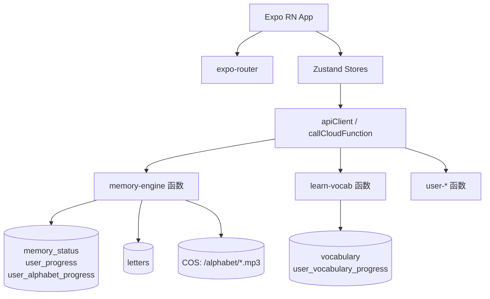

# ThaiLearningApp 项目快照 V10（统一记忆引擎 + 字母模块深度版）

> 版本：V10  
> 生成时间：2025-12-XX（本地生成，不依赖后端仓库）  
> 目标读者：  
> - 新加入的前后端开发者  
> - 需要在不了解全部源码的情况下扩展系统的 AI 助手  
> - 负责架构演进与重构的技术负责人  

本快照在 V7/V9 的基础上，聚焦以下方面做了系统整理：

- 统一记忆引擎（memory-engine）的完整调用链、算法与数据流  
- 泰语字母学习模块（Alphabet）的前后端协作细节  
- `src/config` 与 `src/entities` 两个核心“规范目录”的用法与约束  
- 所有与字母模块相关的 **API 规范** 与 **质量评分 / 间隔公式**  
- 标注已弃用（Deprecated）的文件与字段，并说明其原始设计目的  

---

## 1. 高层架构与模块关系

### 1.1 顶层结构

前端：React Native + Expo Router + TypeScript + Zustand  
后端：Tencent CloudBase 云函数 + CloudBase DB + COS（音频）  



### 1.2 字母模块子架构

```mermaid
flowchart LR
  LessonEntry[/app/alphabet/index.tsx\n课程列表/] --> LessonPage[/app/alphabet/[lessonId].tsx/]
  LessonPage --> Hook[useAlphabetLearningEngine.ts]
  Hook --> Store[useAlphabetStore.ts]
  Store --> CF_Memory
  CF_Memory --> DB_letters
  CF_Memory --> memory_status

  Hook --> EngineView[AlphabetLearningEngineView.tsx]
  EngineView --> LearnView[AlphabetLearningView.tsx]
  EngineView --> ReviewView[AlphabetReviewView.tsx]
```

---

## 2. config 目录规范（统一配置层）

> 所有与“环境 / 端点 / 课程表 / 枚举常量”相关的定义，原则上都应放在 `src/config` 或其子目录中，而不是散落在各业务模块里。

### 2.1 顶层文件一览

- `src/config/constants.ts`  
  应用全局常量（集合名、错误消息、角色、等级、内容类型等）。

- `src/config/api.endpoints.ts`  
  所有前端可见 API 端点的统一映射（CloudBase / Java 双后端）。

- `src/config/backend.config.ts`  
  当前后端类型与基础 URL 的选择与输出。

- `src/config/alphabet/lettersSequence.ts`  
  字母课程表配置（`lessonId -> thaiChar[]`）。

- `src/config/alphabet/alphabetQuestionTypes.ts`  
  字母复习题型枚举与结构定义（主供未来扩展用）。

- `src/config/alphabet/alphabetQuestionGenerator.ts`  
  针对 `AlphabetLearningState` 的高级题目生成器（当前字母模块主要使用 `src/utils/lettersQuestionGenerator.ts`，此文件处于“实验 / 预备”状态）。

### 2.2 constants.ts：集合名与通用常量

文件：`src/config/constants.ts:1`

#### 2.2.1 COLLECTIONS（集合名）

```ts
export const COLLECTIONS = {
  USERS: 'users',
  COURSES: 'courses',
  LESSONS: 'lessons',
  EXERCISES: 'exercises',
  ALPHABETS: 'alphabets',                // ✅ 旧版 / 不建议继续使用
  USER_ALPHABET_PROGRESS: 'user_alphabet_progress',
  VOCABULARY: 'vocabulary',
  SENTENCES: 'sentences',
  ARTICLES: 'articles',
  PRONUNCIATION_RECORDS: 'pronunciationRecords',
  PROGRESS: 'progress',
  REVIEW_SCHEDULES: 'reviewSchedules',
  LEARNING_RECORDS: 'learningRecords',
};
```

**约定：**

- 前端所有涉及集合名的逻辑应优先引用 `COLLECTIONS` 中的常量，避免写死字符串。
- 与云函数侧 `cloudbase/functions/shared/constants.js` 中的 `COLLECTIONS` 语义一致，但名字不完全一一对应（CloudBase 版本还包含 `LETTERS`, `USER_VOCABULARY_PROGRESS` 等）。

**Deprecated 标注：**

- `ALPHABETS: 'alphabets'`
  - 设计目的：供旧版字母模块使用，数据库中集合名为 `alphabets`。
  - 当前状态：实际字母集合名为 `letters`，新字母模块统一走 `letters`，且不再通过 `COLLECTIONS.ALPHABETS` 访问。
  - 建议：新代码不要再使用 `ALPHABETS`；未来可在数据迁移完成后移除此键。

#### 2.2.2 其他常量

- `API_TIMEOUT`：各类请求超时时间。
- `USER_ROLES` / `LEVELS` / `MASTER_LEVELS` / `CONTENT_TYPES`：角色、学习等级、掌握程度、内容类型枚举。

**规范：**

- 新增任何跨模块使用的枚举，优先思考是否属于：
  - “业务概念” → 放在 `src/entities/enums`
  - “系统配置 / 阈值” → 放在 `src/config/constants.ts`

---

### 2.3 api.endpoints.ts：端点映射规范

文件：`src/config/api.endpoints.ts:1`

#### 2.3.1 核心类型

```ts
export type BackendType = 'cloudbase' | 'java';

export interface EndpointMap {
  cloudbase: string;
  java: string;
}
```

所有端点以 `EndpointMap` 形式存在，统一收敛到 `API_ENDPOINTS` 对象下。

#### 2.3.2 统一记忆引擎端点（**当前字母模块主入口**）

```ts
export const MEMORY_ENDPOINTS = {
  GET_TODAY_MEMORIES: {
    cloudbase: '/memory-engine',
    java: '/api/memory/today',
  } as EndpointMap,
  SUBMIT_MEMORY_RESULT: {
    cloudbase: '/memory-engine',
    java: '/api/memory/result',
  } as EndpointMap,
};
```

字母模块现在全部通过 `MEMORY_ENDPOINTS` 访问 CloudBase 的 `/memory-engine` 云函数，并依赖 `action` 字段区分操作。

> **使用示例（字母模块）**  
> `src/stores/alphabetStore.ts:210`
>
> ```ts
> const response = await callCloudFunction<TodayLettersResponse>(
>   'getTodayMemories',
>   { userId, entityType: 'letter', limit, includeNew: true },
>   { endpoint: API_ENDPOINTS.MEMORY.GET_TODAY_MEMORIES.cloudbase },
> );
> ```

#### 2.3.3 字母 API 端点（ALPHABET_ENDPOINTS —— **Deprecated**）

```ts
export const ALPHABET_ENDPOINTS = {
  GET_TODAY: {
    cloudbase: '/vocabulary-get-today-alphabets',
    java: '/api/vocabulary/alphabets/today',
  } as EndpointMap,
  SUBMIT_RESULT: {
    cloudbase: '/vocabulary-submit-alphabet-result',
    java: '/api/vocabulary/alphabets/result',
  } as EndpointMap,
  GET_TEST: {
    cloudbase: '/vocabulary-get-alphabet-test',
    java: '/api/vocabulary/alphabets/test',
  } as EndpointMap,
  SUBMIT_TEST: {
    cloudbase: '/vocabulary-submit-alphabet-test',
    java: '/api/vocabulary/alphabets/test/submit',
  } as EndpointMap,
};
```

- 原始目的：在统一记忆引擎之前，为字母模块提供专用接口（与词汇 `/vocabulary-*` 共用云函数）。
- 当前状态：
  - 新版字母学习完全走 `memory-engine`，不再使用 `ALPHABET_ENDPOINTS`。
  - 这些端点不会再被调用，属于**历史兼容 / 废弃**状态。
- 规范：
  - 新增字母相关网络交互一律使用 `MEMORY_ENDPOINTS` 或专门的 `alphabet` 云函数，而不是 `ALPHABET_ENDPOINTS`。

#### 2.3.4 MODULE / VOCABULARY / PROGRESS 等端点

文档略，使用方式与 `MEMORY_ENDPOINTS` 一致，实际调用见：

- `src/stores/vocabularyStore.ts`
- `src/stores/moduleAccessStore.ts`

---

### 2.4 backend.config.ts：后端切换与环境

文件：`src/config/backend.config.ts:1`

核心逻辑：

```ts
export const CURRENT_BACKEND: BackendType =
  (process.env.EXPO_PUBLIC_BACKEND as BackendType) || 'cloudbase';

export const BACKEND_CONFIG = {
  cloudbase: { ... },
  java: { ... },
};

export function getApiBaseUrl(): string {
  return getCurrentBackendConfig().apiBaseUrl;
}
```

**规范：**

- 任何需要知道「当前后端是 CloudBase 还是 Java」的逻辑，都应调用：
  - `getApiBaseUrl()`
  - `isCloudBase()` / `isJava()`
  - 而不是自行读取 `.env` 或硬编码 base URL。

---

### 2.5 alphabet 子目录：课程表与题型

#### 2.5.1 lettersSequence.ts：课程表

文件：`src/config/alphabet/lettersSequence.ts`  
作用：定义 `lessonId -> thaiChar[]` 的映射，用于：

- 前端课程列表展示与排序；
- `useAlphabetLearningEngine` 中的 `todayList`（用来计算 final correct rate、提交三轮结果）。

**规范：**

- 任何与“课程属于哪些字母”相关的逻辑，优先依赖 `SEQUENCE_LESSONS`。
- 未来若后端需要按课程过滤字母，也应以 `thaiChar` 与该表为真源做映射。

#### 2.5.2 alphabetQuestionTypes.ts / alphabetQuestionGenerator.ts

当前状态：

- `alphabetQuestionTypes.ts` 定义了：
  - `AlphabetQuestionType` 枚举：`'soundToLetter' | 'letterToSound' | 'reading'` 等。
  - `AlphabetReviewQuestion` 结构：包含 `prompt`, `mainText`, `audioUrl`, `options`, `correctOptionId`, `explanation`。
- `alphabetQuestionGenerator.ts` 使用 `AlphabetLearningState`（来自 `alphabetStore`）生成该类型题目。

但**当前主流程**实际使用的是：

- `src/utils/lettersQuestionGenerator.ts`  
  （基于 `Letter` 实体的10→9种题型生成器）

因此：

- `src/config/alphabet/alphabetQuestionTypes.ts` & `alphabetQuestionGenerator.ts`  
  处于“实验 / 预备”状态，尚未完整接入主界面。
- 若以后要升级字母复习 UI 为高级多字段题（带解释文本等），可以基于这两份定义改造现有 `AlphabetReviewView`。

---

## 3. entities 目录规范（统一实体层）

> 规则：  
> - 所有对“业务数据”的静态描述（类型 / 接口 / 枚举）应集中于 `src/entities`。  
> - 不在这里写具体逻辑函数（除了少数映射 helper），以保持“只读 schema”的性质。

### 3.1 types/api.types.ts：API 层 DTO

文件：`src/entities/types/api.types.ts:1`

核心接口：

- `ApiResponse<T>`：前端所有请求返回统一使用的数据结构。
- 各种 `*Request`, `*Response`：登录、注册、获取课程、获取词汇、记录学习、进度查询、发音评估等。

当前使用情况：

- `ApiResponse<T>`：广泛使用（`apiClient`, `callCloudFunction` 等）。
- 认证 / 课程 / 进度相关 DTO：多数在现有代码中尚未完全使用，但作为“API 契约”存在，方便未来拓展。

> **注意（Deprecated 级别：低）**  
> 某些 DTO 与实际云函数字段略有出入（例如 `GetTodayMemories`，现在统一走 CloudBase `createResponse` 结构），  
> 但整体语义仍一致，暂不建议删除，而是作为“接口设计蓝本”存在。

### 3.2 types/letter.types.ts：字母实体

此文件是 **字母集合 `letters` 的权威 Schema**，详见前一份快照的总结，这里只强调规范：

- 所有直接从数据库读取 `letters` 的云函数，应保证字段与此接口一致。
- 前端任何需要访问字母信息的地方（学习模块 / 统计 / 列表展示）都应复用此类型。

### 3.3 types/vocabulary.types.ts：单词实体

文件：`src/entities/types/vocabulary.types.ts:1`

用途：

- 为词汇模块 `vocabularyStore` 提供类型支撑。
- `TodayVocabularyResponse` 与 `VocabularyLearningState` 对齐 `learn-vocab` 云函数返回结构。

> **提醒：**  
> 部分字段（`exampleSentences`, `dialogue`, `usage`, `mistakes`, `cognates`）在当前 UI 中尚未使用，但为未来“高阶词汇讲解页”预留，勿随意删除。

### 3.4 types/alphabet.types.ts：旧版字母会话类型（**Deprecated**）

文件：`src/entities/types/alphabet.types.ts:1`

此文件与新架构存在重复：

- 定义了自己的 `AlphabetLearningState`, `LearningPhase`, `QualityButton`, `QUALITY_SCORE_MAP`, `ATTEMPTS_INCREMENT_MAP`。
- 这些概念在当前实现中已迁移至：
  - `src/stores/alphabetStore.ts`（AlphabetLearningState）
  - `src/entities/enums/LearningPhase.enum.ts`
  - `src/entities/enums/QualityScore.enum.ts`

**原始目的：**

- 在 V7/V8 时代，字母模块独立于统一记忆引擎，使用自己的 Store / 类型定义。

**当前状态：**

- 该文件中定义的类型没有被运行时代码直接引用，只在文档中作为参考。
- 建议在未来重构中：
  - 将此文件标记为 `alphabet.types.legacy.ts` 或移动到 `docs/legacy/`，以避免误用。

**规范：**

- 新代码严禁从 `src/entities/types/alphabet.types.ts` 导入 `AlphabetLearningState`/`LearningPhase` 等类型，应使用：
  - `src/stores/alphabetStore.ts` 中的 `AlphabetLearningState`
  - `src/entities/enums/LearningPhase.enum.ts`
  - `src/entities/enums/QualityScore.enum.ts`

### 3.5 types/memory.types.ts：统一记忆状态视图

文件：`src/entities/types/memory.types.ts:1`

```ts
export interface MemoryStatus {
  userId: string;
  entityType: 'letter' | 'word' | 'sentence';
  entityId: string;
  masteryLevel: number;
  reviewStage: number;
  easinessFactor: number;
  intervalDays: number;
  nextReviewAt: string;
  correctCount: number;
  wrongCount: number;
  streakCorrect: number;
  isLocked: boolean;
}
```

- 该类型对应 CloudBase `memory_status` 表的完整记录。
- 可用于前端调试工具、统计图表、未来的“复习时间线”展示。

`UnlockInfo` 中的 `letterProgress` 字段与模块解锁逻辑密切相关（见后文）。

---

## 4. 统一记忆引擎：API 与算法白皮书

### 4.1 memory-engine 云函数入口

文件：`cloudbase/functions/memory-engine/index.js:1`

支持的 `action`：

- `getTodayMemories`
- `submitMemoryResult`
- `checkModuleAccess`
- `getUserProgress`

统一请求封装（前端）：

```ts
callCloudFunction<T>(
  'getTodayMemories',
  { userId, entityType: 'letter', ... },
  { endpoint: API_ENDPOINTS.MEMORY.GET_TODAY_MEMORIES.cloudbase },
);
```

**统一响应结构：**

- 云函数侧使用 `createResponse(success, data, message, errorCode)`：
  - `success: boolean`
  - `data: any`
  - `message?: string`
  - `errorCode?: string`
  - `timestamp?: string`
- 前端 `ApiResponse<T>` 基本兼容该结构。

---

### 4.2 getTodayMemories：今日学习列表

文件：`cloudbase/functions/memory-engine/handlers/getTodayMemories.js:77`

#### 4.2.1 请求参数

```ts
{
  userId: string;
  entityType: 'letter' | 'word' | 'sentence';
  limit?: number;       // 默认 20（前端字母模块一般传 5）
  includeNew?: boolean; // 默认 true
}
```

#### 4.2.2 前置：懒初始化进度表

为了兼容“注册逻辑改造之前”的老用户，`getTodayMemories` 在主逻辑前新增了两个懒初始化函数：

1. `ensureUserAlphabetProgress(db, userId)`  
   - 若 `user_alphabet_progress` 中不存在该用户记录，则创建：
   - 字段：`letterProgress=0`, `letterCompleted=false`, `completedLessons=[]`, `masteredLetterCount=0`, `totalLetterCount=80`, `createdAt/updatedAt=now`。

2. `ensureUserVocabularyProgress(db, userId)`  
   - 若 `user_vocabulary_progress` 中不存在该用户记录，则添加一条 **占位记录**：
   - `vocabularyId=null`, `skipped=true`, 其它统计字段置零。
   - 设计目的：避免后续查询 `user_vocabulary_progress` 时完全无记录；同时通过 `skipped=true` 避免干扰实际复习逻辑（`getTodayWords` 中有 `skipped: db.command.neq(true)` 条件）。

#### 4.2.3 核心步骤

1. **权限检查**：调用 `checkModuleAccess(db, userId, entityType)`：
   - 若不允许，返回 `MODULE_LOCKED` 或其它错误。
   - 返回的 `progress` 可用于确定 `dailyLimit` 等参数。

2. **每日学习量（limit）确定**：
   - 请求中显式传入的 `limit` 优先，并同步写回 `user_progress.dailyLimit`。
   - 若请求未传 `limit` 且 `user_progress.dailyLimit` 存在，则使用该值。

3. **获取复习实体**：
   - 调用 `getTodayReviewEntities(db, userId, entityType, effectiveLimit)`：
   - 查询条件：`userId`, `entityType`, `isLocked=false`, `nextReviewAt <= now`，按 `nextReviewAt` 升序，limit=N。

4. **填充新内容**：
   - 若 `includeNew` 且 `reviewMemories.length < effectiveLimit`：
     - 从对应集合（`letters`/`vocabulary`/`sentences`）中选取尚未在队列中的实体：
       - `where({ _id: db.command.nin(existingEntityIds) })`
       - `orderBy('lessonNumber','asc').orderBy('_id','asc')`
     - 为每个选出的实体调用 `getOrCreateMemory(db, userId, entityType, entity._id, false)`，插入或获取 `memory_status` 记录。

5. **合并与穿插 (Interleave)**：
   - 先将所有复习实体 `reviewMemories` 放入队列。
   - 再按「3 新 : 1 复习（组内第一个）」插入新内容：

   ```js
   if (newMemories.length > 0) {
     for (let i = 0; i < newMemories.length; i++) {
       allMemories.push(newMemories[i]);
       if ((i + 1) % 3 === 0) {
         allMemories.push(newMemories[i - 2]);
       }
     }
   }
   ```

6. **查实体详情**：
   - 批量从实体集合读取 `_id ∈ entityIds` 的记录。
   - 使用 Map 以 O(1) 方式匹配。

7. **组装返回体**：

```ts
data = allMemories.map(memory => ({
  ...entity,
  memoryState: {
    masteryLevel,
    reviewStage,
    correctCount,
    wrongCount,
    streakCorrect,
    nextReviewAt,
    isNew: memory.reviewStage === 0,
  },
}));
summary = { total, reviewCount, newCount, entityType };
```

前端字母模块将 `Letter & { memoryState }` 直接映射为 `AlphabetLearningState`。

---

### 4.3 submitMemoryResult：提交学习结果

文件：`cloudbase/functions/memory-engine/handlers/submitMemoryResult.js:1`

#### 4.3.1 请求格式（单条 & 批量）

**旧版单条：**

```jsonc
{
  "userId": "u_xxx",
  "entityType": "letter",
  "entityId": "TH_C_01",
  "quality": "记得"   // 或 "模糊" / "陌生"
}
```

**新版批量：**

```jsonc
{
  "userId": "u_xxx",
  "results": [
    { "entityType": "letter", "entityId": "TH_C_01", "quality": "记得" },
    { "entityType": "letter", "entityId": "TH_C_02", "quality": "模糊" }
  ]
}
```

> **重要：quality 期望值为中文掌握程度字符串**：  
> `陌生` / `模糊` / `记得` —— 对应 `MasteryLevel.UNFAMILIAR/FUZZY/REMEMBERED`。

#### 4.3.2 前端当前实现（需注意的潜在不匹配）

**字母模块：** `src/stores/alphabetStore.ts:214`

```ts
const quality: QualityButton = isCorrect
  ? QualityButton.KNOW
  : QualityButton.FORGET;

await callCloudFunction(
  'submitMemoryResult',
  {
    userId,
    entityType: 'letter',
    entityId: currentItem.alphabetId,
    quality,                 // 这里传入 'KNOW' / 'FORGET'
  },
  { endpoint: API_ENDPOINTS.MEMORY.SUBMIT_MEMORY_RESULT.cloudbase },
);
```

**词汇模块：** `src/stores/vocabularyStore.ts:170`

```ts
const avgQuality = Math.round(
  updatedVocabulary.qualityHistory.reduce((a, b) => a + b, 0) /
  updatedVocabulary.qualityHistory.length,
);

apiClient.post(API_ENDPOINTS.MEMORY.SUBMIT_MEMORY_RESULT, {
  userId,
  vocabularyId: currentVocabulary.vocabularyId,
  quality: avgQuality, // 这里传入 1-5 的数字
});
```

**结论：**

- 当前前端字母和词汇模块都没有按预期传递 `"陌生" / "模糊" / "记得"`。
- 后端 `updateMemoryAfterReview` 内部通过：

```js
const qualityMap = { '陌生': 1, '模糊': 3, '记得': 5 };
const sm2Quality = qualityMap[quality] || 3;
```

和 `calculateSM2Optimized(quality, ...)` 配合使用（其中 `quality` 还被当成 `mastery` 传入）。

➡️ 这意味着 **当前质量映射存在语义偏差**，但在实践中仍可运行，只是：

- 任何非上述三种中文字符串都会被当成 `"模糊"`（质量=3），  
  且 `calculateSM2Optimized` 会将 `mastery` 映射为 `1`（默认 UNFAMILIAR），导致间隔偏短。

> 本白皮书的目标是记录现状而非立即修复。未来统一重构时，建议：  
> - 要么在前端严格传递 `"陌生" / "模糊" / "记得"`；  
> - 要么在 `submitMemoryResult` 前层新增一层适配，将数字或枚举映射到 `MasteryLevel`。

---

### 4.4 SM-2 优化算法：calculateSM2Optimized

文件：`cloudbase/functions/memory-engine/utils/sm2.js:1`

核心说明：

- 基于 SuperMemo SM-2，结合艾宾浩斯遗忘曲线进行优化。
- 三种掌握程度（MasteryLevel）：
  - `UNFAMILIAR`（陌生）
  - `FUZZY`（模糊）
  - `REMEMBERED`（记得）

#### 4.4.1 质量映射 masteryToQuality

```js
function masteryToQuality(mastery) {
  switch (mastery) {
    case MasteryLevel.UNFAMILIAR: return 1;
    case MasteryLevel.FUZZY:      return 3;
    case MasteryLevel.REMEMBERED: return 5;
    default:                      return 1;
  }
}
```

#### 4.4.2 主算法 calculateSM2Optimized

输入参数：

- `mastery`：掌握程度（字符串，期望为 MasteryLevel）
- `currentInterval`：当前间隔天数
- `easinessFactor`：简易度因子（1.3–2.5+）
- `reviewCount`：已复习次数

逻辑摘要：

1. 计算 `quality = masteryToQuality(mastery)`。
2. 若 `quality < 3`（陌生）：
   - 间隔重置为 `1`
   - `EF -= 0.2`，但不低于最小值
   - `shouldResetCount = true`
3. 若 `quality === 3`（模糊）：
   - 间隔缩短 20%：`nextInterval = max(1, round(currentInterval * FUZZY_MULTIPLIER))`
   - `EF -= 0.1`
4. 若 `quality > 3`（记得）：
   - 若 `reviewCount < EARLY_INTERVALS.length`：
     - 使用预定义间隔序列 `[1,2,4,7,14,...]`
   - 否则：
     - `nextInterval = round(currentInterval * EF)`
   - 使用标准 SM-2 公式更新 EF，并限制最小值与最大间隔。
5. 最终返回：

```js
return {
  interval: nextInterval,
  easinessFactor: parseFloat(nextEF.toFixed(2)),
  repetitions: shouldResetCount ? 0 : reviewCount + 1,
  nextInterval,
  nextEasinessFactor: ...,
  nextReviewDate: ...,
  shouldResetCount,
};
```

#### 4.4.3 与 updateMemoryAfterReview 的关系

`updateMemoryAfterReview` 中：

- 使用 `calculateSM2Optimized(quality, memory.intervalDays, memory.easinessFactor, memory.reviewStage)`。
- 然后根据质量字符串 `"记得" / "模糊" / "陌生"` 手动调整 `masteryLevel`：

```js
if (quality === '记得')      masteryLevel += 0.15;
else if (quality === '模糊') masteryLevel += 0.05;
else                         masteryLevel -= 0.2;
```

**注意：** 同一 `quality` 字段同时承担了：

- SM-2 算法中的 `mastery`（传入 calculateSM2Optimized）；  
- 本地掌握度数值 `masteryLevel` 的调整依据。

因此确保 `quality` 的取值域与 MasteryLevel 一致非常关键，这也是前端需要与后端严格对齐的地方。

---

## 5. 字母学习引擎算法细节（前端）

### 5.1 三轮机制与阶段流转

见源码：`src/hooks/useAlphabetLearningEngine.ts`

阶段：

1. `yesterday-review`
2. `yesterday-remedy`
3. `today-learning`
4. `today-mini-review`
5. `today-final-review`
6. `today-remedy`
7. `finished`

核心状态：

- `currentRound: 1..3`
- `todayList: string[]`（课程内字母序列）
- 错题池：
  - `wrongYesterday: WrongItem[]`
  - `wrongTodayMini: WrongItem[]`
  - `wrongTodayFinal: WrongItem[]`

#### 5.1.1 正确率计算

```ts
const totalQuestions = todayList.length * QUESTIONS_PER_LETTER_IN_FINAL; // 每字母3题
const wrongTotal = wrongTodayMini.length + wrongTodayFinal.length;
const correct = Math.max(totalQuestions - wrongTotal, 0);
const correctRate = correct / totalQuestions;
```

- 若 `correctRate < 0.9`：
  - 保留错题池，继续在 `today-remedy` 出题。
- 若 `correctRate >= 0.9` 且 `currentRound < 3`：
  - 调用 `submitRoundResults()` 将本轮结果映射为 quality，并调用 `submitResult`。
  - `resetRoundState()` 清空错题与计数 → 进入下一轮今日学习。
- 若 `currentRound === 3` 且达标：
  - 课程完成，标记 `letterCompleted`，并通过 moduleAccess 解锁其它模块（基于“二选一”规则：`letterCompleted || letterProgress >= 0.8`）。

### 5.2 题型权重

类型：`QuestionType`（详见前文，共 9 种）。  
权重表：`QuestionTypeWeightMap`，初始值全部 1。

更新规则（在 `onAnswer` 中）：

- 答对：
  - `weight = max(0.5, weight * 0.9)`
- 答错：
  - `weight = weight + 2`

选择题型：

```ts
function pickWeightedQuestionType(weights: QuestionTypeWeightMap): QuestionType {
  const entries = Object.entries(weights) as [QuestionType, number][];
  const total = entries.reduce((s, [, w]) => s + w, 0);
  const r = Math.random() * total;
  ...
}
```

> 当前实现中，选出的 `QuestionType` 主要用于向复习组件传入 `preferredType`，字母题目生成器 `lettersQuestionGenerator` 会根据此类型生成具体题目。

---

## 6. Deprecated 列表与历史说明

### 6.1 文档类（V9 → V10）

以下 V9 文档已在本次迭代中废弃并自仓库移除：

- `docs/api-reference-v1.0.9-V9.md`
- `docs/type-reference-v1.0.9-V9.md`
- `docs/Document/project-snapshot-v1.0.9-V9.md`

**原始目的：**

- 为 V9 状态下的项目提供 API / 类型 / 架构快照（主要针对词汇模块）。

**被替代：**

- 当前文档 `docs/Document/project-snapshot-v2.0.0-V10.md`（本文件），涵盖：
  - API 参考
  - 类型与实体说明
  - 统一记忆引擎算法白皮书
  - config 与 entities 的统一规范

### 6.2 代码与配置

1. `COLLECTIONS.ALPHABETS`（`src/config/constants.ts`）
   - 旧字母集合名 `alphabets`，现统一用 `letters`（见后端 CloudBase 配置）。
   - 新代码不要使用该常量。

2. `ALPHABET_ENDPOINTS`（`src/config/api.endpoints.ts`）
   - 旧字母接口，基于 `/vocabulary-*` 云函数。
   - 新版已经迁移到 `memory-engine`，该端点仅保留供历史参考。

3. `src/entities/types/alphabet.types.ts`
   - 旧版字母会话模型，与现有 `alphabetStore` + `QualityScore.enum` 重复。
   - 建议仅作为文档参考，不再从该文件导入类型。

4. 部分 API DTO（`src/entities/types/api.types.ts`）
   - 有些请求/响应结构与当前云函数参数略不一致（例如课程内容、进度）。
   - 设计初衷是“未来 Java API”的契约，目前主要起到文档作用。

---

## 7. 对编辑组的明确约束（V10 之后的规范）

1. **配置与端点统一：**
   - 所有后端路径必须在 `src/config/api.endpoints.ts` 中声明，不得在业务代码中出现裸字符串 URL。
   - 所有数据库集合名必须从 `src/config/constants.ts` 引用。

2. **实体层统一：**
   - 新增业务实体（如新的测试表 / 统计表），先在 `src/entities/types` 中定义类型，再写云函数与前端逻辑。
   - 避免在组件或 store 文件中直接定义“反向推导的类型”（除非是极局部的 UI ViewModel）。

3. **记忆引擎与质量评分：**
   - 若调用 `memory-engine/submitMemoryResult`，必须明确指定：
     - 质量含义：是 `"陌生"/"模糊"/"记得"`，还是数字 1–5，或枚举名。
     - 并在云函数或前端增加显式映射层，避免“凭运气”依赖默认值。
   - 任何改动 SM-2 参数时，需同步更新：
     - `cloudbase/functions/memory-engine/utils/constants.js`
     - 本白皮书中算法说明部分。

4. **文档更新流程：**
   - 每次对字母模块或记忆引擎做“结构级”变更：
     - 更新 `docs/Document/project-snapshot-v2.0.0-V10.md` 相应章节；
     - 在文档头部增加 `Changelog` 小节说明变更点；
     - 如有弃用 API / 类型，加入第 6 节 “Deprecated 列表”。

5. **AI 助手协作约定：**
   - AI 在生成新代码前，应先要求用户提供详细真实的最新代码文件并检查：
     - 对应实体是否已在 `src/entities/types` 中存在；
     - 对应端点是否已在 `src/config/api.endpoints.ts` 中声明；
   - 若不存在，应先补充类型 / 端点，再编写业务逻辑。

---

## 8. 未来工作与建议

1. **统一质量枚举：**
   - 在 `src/entities/enums/QualityScore.enum.ts` 与后端 `MasteryLevel` 之间建立一一映射。
   - 为 `submitMemoryResult` 增加一个轻量适配层：
     - 接受前端的 `QualityButton` 或 `1–5` 数字；
     - 统一转换为 `"陌生" / "模糊" / "记得"` 再传入 `updateMemoryAfterReview`。

2. **课程表与 letters 集合同步：**
   - 在 `letters` 集合中增加：
     - `courseLessonIds: string[]`
     - `courseOrder: number`
   - 基于 `lettersSequence.ts` + `thaiChar` 写脚本回填这两个字段。

3. **清理与归档 legacy 文件：**
   - 将 `alphabet.types.ts` 等旧文件移入 `src/entities/legacy` 或 `docs/legacy`。
   - 在 `api.endpoints.ts` 上标注明显的 `// DEPRECATED` 注释（保持本次文档中的清晰度）。

4. **增加前端调试面板：**
   - 提供一个只读页面展示：
     - 当前用户的 `memory_status` 概览；
     - `user_progress` / `user_alphabet_progress` 数据；
     - SM-2 未来复习时间线（利用 `generateReviewTimeline`）。

---

> 本 V10 快照到此结束。  
> 如需按模块拆分更细的文档（例如“词汇模块白皮书”、“模块解锁系统设计说明”等），  
> 可以在本文件基础上增写子文档，并在本快照中添加跳转链接。  

