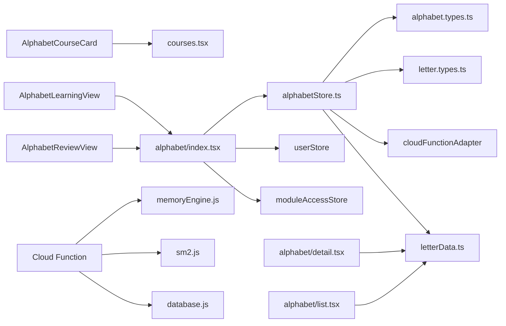

# Alphabet Module Backup Documentation (v1)

> **Created**: 2025-12-07  
> **Purpose**: Complete backup of alphabet learning module before removal for future restoration or rewrite

---

## 1. 模块概述 (Module Overview)

### 主要目的 (Primary Purpose)
The alphabet module was designed as an **independent letter learning space** where users can:
- Learn all 76 Thai letters systematically
- Practice letter recognition and pronunciation
- Track learning progress with a memory engine
- Unlock vocabulary learning after completing alphabet mastery (95% threshold)

### 当前定位 (Current Position in Project)
- **Original Intent**: Standalone alphabet learning space with grid-based letter display
- **Current Implementation**: Integrated learning module accessible from courses page
- **Learning Flow**: Alphabet → Vocabulary (gated by progress)
- **Memory System**: Uses unified memory engine shared with vocabulary learning

---

## 2. 路由与页面结构 (Routes & Page Structure)

### Route Paths

All alphabet routes are located in `app/alphabet/`:

| Route Path | File | Purpose | Entry Point |
|------------|------|---------|-------------|
| `/alphabet` | `index.tsx` | Main learning session page | `AlphabetCourseCard`, `LettersCard` from courses page |
| `/alphabet/list` | `list.tsx` | Category-based letter list (grid view) | From alphabet index page |
| `/alphabet/detail` | `detail.tsx` | Individual letter detail view | From letter list |
| `/alphabet/review` | `review.tsx` | Review session (unused/deprecated) | N/A |
| `/alphabet/training` | `training.tsx` | Training mode (unused/deprecated) | N/A |
| `/alphabet/success` | `success.tsx` | Completion screen (unused/deprecated) | N/A |

### Alternative Route (Legacy)

There's also an alphabet session embedded in `/learning/index.tsx`:
- **Path**: `/learning?module=alphabet`
- **Component**: `AlphabetSession` function component
- **Status**: Appears to be legacy/duplicate implementation
- **Conflict**: Both `/alphabet` and `/learning/alphabet` exist, causing routing confusion

### Page Responsibilities

#### `/alphabet/index.tsx` (Main Learning Session)
- **Lines**: 338
- **Purpose**: Primary learning session interface
- **Features**:
  - Setup mode with daily limit slider (5-500 letters)
  - Learning intro view for new letters
  - Review view for practice
  - Progress tracking
  - Session completion screen
- **State Management**: Uses `useAlphabetStore` for session management
- **Key Props**: None (standalone route)

#### `/alphabet/list.tsx` (Category List)
- **Lines**: 137
- **Purpose**: Display letters filtered by category
- **Features**:
  - 3-column grid layout
  - Category-based filtering (consonants, vowels)
  - Navigation to detail view
- **Params**: 
  - `category`: LetterCategory enum
  - `title`: Display title
- **Data Source**: `getLettersByCategory()` from `letterData.ts`

#### `/alphabet/detail.tsx` (Letter Detail)
- **Lines**: 329
- **Purpose**: Show detailed information about a single letter
- **Features**:
  - Large letter display
  - Pronunciation with audio
  - Example words
  - Letter metadata (class, category)
  - Previous/Next navigation
- **Params**: `letterId` (string)
- **Data Source**: `getLetterById()` from `letterData.ts`

---

## 3. 组件列表 (Component List)

### UI Components

#### `AlphabetCourseCard.tsx`
- **Path**: `src/components/courses/AlphabetCourseCard.tsx`
- **Lines**: 205
- **Purpose**: Course card for alphabet learning on courses page

**Props Interface**:
```typescript
interface AlphabetCourseCardProps {
  course: {
    id: string;
    source: string;
    title: string;
    description: string;
    level: string;
    imageSource: ImageSourcePropType;
    lessons: number;
  };
  isCurrent: boolean;
  progress?: {
    completed: number;
    total: number;
  };
  onStart: () => void;
}
```

**Main UI Features**:
- Displays course image, title, description
- Shows progress bar if progress data available
- "Start Learning" button (calls `onStart` prop)
- **Card Click**: Navigates to `/learning/alphabet` (legacy path)
- **Visual**: Gold border when `isCurrent` is true

**Key Interactions**:
- `handleCardPress()`: Navigates to `/learning/alphabet`
- `onStart()`: Controlled by parent component (courses page)

---

#### `AlphabetLearningView.tsx`
- **Path**: `src/components/learning/AlphabetLearningView.tsx`
- **Lines**: 195
- **Purpose**: Display new letter introduction (learning phase)

**Props Interface**:
```typescript
interface AlphabetLearningViewProps {
  alphabet: AlphabetLearningState;
  onNext: () => void;
}
```

**Main UI Features**:
- Large Thai character display (120px font)
- Pronunciation with audio button
- Category tag
- Example word/phrase
- "Next" button to proceed

**Key Interactions**:
- `playAudio()`: Plays letter pronunciation audio
- `onNext()`: Called when user clicks "Next" button

**Visual Design**:
- White card with shadow
- Gold accent for audio button
- Scrollable content area
- Fixed bottom button bar

---

#### `AlphabetReviewView.tsx`
- **Path**: `src/components/learning/AlphabetReviewView.tsx`
- **Lines**: 252
- **Purpose**: Review/test interface for letter recognition

**Props Interface**:
```typescript
interface AlphabetReviewViewProps {
  alphabet: AlphabetLearningState;
  onAnswer: (quality: QualityButton) => void;
  onNext: () => void;
}
```

**Main UI Features**:
- Thai character display (100px font)
- Audio hint button
- Blurred answer section (pronunciation + example)
- Three quality buttons: "陌生" (Forget), "模糊" (Fuzzy), "记得" (Know)
- "Next" button (appears after answering)

**Key Interactions**:
- `playAudio()`: Plays pronunciation audio
- `handleReveal(quality)`: Reveals answer and calls `onAnswer(quality)`
- `onNext()`: Proceeds to next item after revealing

**State Flow**:
1. User sees letter
2. Clicks quality button → answer revealed
3. Clicks "Next" → proceeds to next letter

---

### Helper Components

#### `LettersCard.tsx`
- **Path**: `src/components/courses/LettersCard.tsx`
- **Purpose**: Alternative entry card for alphabet learning
- **Navigation**: Routes to `/alphabet` (new path)
- **Note**: Coexists with `AlphabetCourseCard`, causing dual entry points

---

## 4. 状态管理与依赖 (State Management & Dependencies)

### Primary Store: `alphabetStore.ts`

**Path**: `src/stores/alphabetStore.ts`  
**Lines**: 540  
**Architecture**: Zustand + Persist (AsyncStorage)

#### Store State Interface

```typescript
interface AlphabetStoreState {
  // Session State
  phase: LearningPhase;
  reviewQueue: AlphabetLearningState[];
  currentAlphabet: AlphabetLearningState | null;
  currentIndex: number;
  completedCount: number;
  totalCount: number;
  unlockInfo: UnlockInfo | null;
  
  // UI State
  isLoading: boolean;
  error: string | null;
  
  // Actions
  initSession: (userId: string, limit?: number) => Promise<void>;
  submitResult: (userId: string, quality: QualityButton) => Promise<void>;
  nextAlphabet: () => void;
  previousAlphabet: () => void;
  goToIndex: (index: number) => void;
  resetSession: () => void;
  clearError: () => void;
}
```

#### Key Data Structures

**AlphabetLearningState** (per letter in session):
```typescript
interface AlphabetLearningState {
  alphabetId: string;
  thaiChar: string;
  category: string;
  pronunciation: string;
  example: string;
  audioPath: string;
  currentAttempts: number;
  requiredAttempts: number;
  qualityHistory: number[];
  isCompleted: boolean;
  timestamp: string;
  memoryState?: MemoryStatus;
  letterData?: Letter;
}
```

**MemoryStatus** (from backend):
```typescript
interface MemoryStatus {
  easinessFactor: number;
  interval: number;
  repetitions: number;
  nextReviewDate: string;
  lastReviewDate?: string;
}
```

**UnlockInfo**:
```typescript
interface UnlockInfo {
  letterProgress: number;      // 0-100
  wordUnlocked: boolean;
  unlocked?: boolean;           // Just unlocked flag
}
```

#### Store Actions

**`initSession(userId, limit)`**:
- Calls backend API to get today's learning items
- Populates `reviewQueue` with letters to learn/review
- Sets `phase` to `REVIEW`
- Handles unlock info for module progression

**`submitResult(userId, quality)`**:
- Maps quality button to backend quality text: '陌生' | '模糊' | '记得'
- Submits to memory engine
- Updates current letter's attempts and completion status
- Auto-advances to next letter when completed
- Updates unlock info

**Quality Mapping**:
```typescript
const QUALITY_TEXT_MAP = {
  [QualityButton.FORGET]: '陌生',  // 1 point
  [QualityButton.FUZZY]: '模糊',   // 3 points
  [QualityButton.KNOW]: '记得'     // 5 points
};
```

#### Dependencies

**Other Stores**:
- `useUserStore`: Get current user ID
- `useLearningPreferenceStore`: Get daily limit settings
- `useModuleAccessStore`: Check module unlock status

**Utilities**:
- `callCloudFunction`: API adapter for cloud function calls
- `getLetterById`, `getLetterDisplayInfo`: Local letter data utilities

**Types**:
- `Letter` from `letter.types.ts`
- `LearningPhase` enum
- `QualityButton` enum

---

### Type Definitions

#### `alphabet.types.ts`

**Path**: `src/entities/types/alphabet.types.ts`  
**Lines**: 208

**Key Types**:
- `AlphabetLearningState`: Session-level letter state
- `MemoryStatus`: Backend memory engine state
- `UnlockInfo`: Module unlock information
- `TodayLettersResponse`: Backend API response format
- `SubmitLetterResultRequest/Response`: API request/response
- `AlphabetTest`, `AlphabetTestQuestion`, `AlphabetTestResult`: Testing system (unused)
- `LearningSessionState`: Overall session state
- `LearningPhase`: Enum for session phases
- `QualityButton`: Enum for answer quality

**Enums**:
```typescript
enum LearningPhase {
  IDLE = 'IDLE',
  LOADING = 'LOADING',
  REVIEW = 'REVIEW',
  TEST_PROMPT = 'TEST_PROMPT',
  TESTING = 'TESTING',
  TEST_RESULT = 'TEST_RESULT',
  COMPLETED = 'COMPLETED'
}

enum QualityButton {
  AGAIN = 'AGAIN',
  HARD = 'HARD',
  GOOD = 'GOOD',
  EASY = 'EASY'
}
```

---

## 5. 与后端/云函数的交互 (Backend/Cloud Function Integration)

### Cloud Function: `alphabet`

**Path**: `cloudbase/functions/alphabet/`

#### Entry Point: `index.js`

**Actions Supported**:
1. `getLetterTest`: Get alphabet test questions (fixed set)
2. `submitLetterTest`: Submit test answers and evaluate
3. `passLetterTest`: Directly pass alphabet test (debug/special use)

**Request Format**:
```javascript
{
  action: 'getLetterTest' | 'submitLetterTest' | 'passLetterTest',
  userId: string,
  answers?: Array<any>  // For submitLetterTest
}
```

**Response Format**:
```javascript
{
  success: boolean,
  data: any,
  message?: string,
  errorCode?: string
}
```

#### Handlers

**`handlers/getLetterTest.js`** (428 bytes):
- Returns fixed set of alphabet test questions
- No user-specific logic

**`handlers/submitLetterTest.js`** (1440 bytes):
- Evaluates user answers
- Calculates pass/fail (80% threshold)
- Updates user progress if passed

**`handlers/passLetterTest.js`** (768 bytes):
- Directly marks alphabet test as passed
- Used for debugging or special scenarios

#### Utilities (`utils/`)

- `constants.js` (3421 bytes): Shared constants
- `database.js` (912 bytes): Database helper functions
- `memoryEngine.js` (12727 bytes): **Unified memory engine** (shared with vocabulary)
- `response.js` (2627 bytes): Response formatting utilities
- `sm2.js` (6562 bytes): SM2 spaced repetition algorithm
- `validators.js` (3707 bytes): Input validation

### API Integration in Frontend

**Store Method**: `initSession()`
```typescript
const response = await callCloudFunction('alphabet', {
  action: 'getTodayMemories',
  userId,
  entityType: 'alphabet',
  limit
});
```

**Store Method**: `submitResult()`
```typescript
const response = await callCloudFunction('alphabet', {
  action: 'submitMemoryResult',
  userId,
  entityType: 'alphabet',
  entityId: currentAlphabet.alphabetId,
  quality: qualityText  // '陌生' | '模糊' | '记得'
});
```

### Backend Response Handling

**Success Response**:
```typescript
{
  success: true,
  data: {
    items: [
      {
        entityId: 'TH_C_01',
        memoryState: {
          easinessFactor: 2.5,
          interval: 1,
          repetitions: 0,
          nextReviewDate: '2025-12-08T00:00:00Z',
          isNew: true
        }
      }
    ],
    unlockInfo: {
      letterProgress: 78,
      wordUnlocked: false
    }
  }
}
```

**Error Handling**:
- Network errors: Display error message, allow retry
- Invalid data: Log error, reset session
- Authentication errors: Redirect to login

---

## 6. 已知的设计问题和坑 (Known Issues & Design Problems)

### 🔴 Critical Issues

#### 1. Routing Conflict: Dual Paths
**Problem**: Two different routes lead to alphabet learning:
- `/alphabet` (new implementation in `app/alphabet/index.tsx`)
- `/learning/alphabet` (legacy implementation in `app/learning/index.tsx`)

**Symptoms**:
- `AlphabetCourseCard` navigates to `/learning/alphabet`
- `LettersCard` navigates to `/alphabet`
- Both cards appear on courses page simultaneously
- User confusion about which entry point to use

**Impact**: Medium - Functional but confusing UX

**Root Cause**: Incomplete migration from `/learning/alphabet` to `/alphabet`

---

#### 2. Dual Store Architecture Confusion
**Problem**: Documentation mentions `letterProgressStore` but it doesn't exist in current codebase

**Evidence**:
- `docs/alphabet-dual-store-architecture.md` describes two stores:
  - `letterProgressStore`: Local progress tracking
  - `alphabetLearningStore`: Session management
- Only `alphabetStore.ts` exists in codebase

**Impact**: Low - Documentation is outdated, but code works

**Likely History**: Original design had two stores, later merged into single `alphabetStore`

---

#### 3. Unused Routes and Components
**Files**:
- `app/alphabet/review.tsx` (9917 bytes)
- `app/alphabet/training.tsx` (9717 bytes)
- `app/alphabet/success.tsx` (4136 bytes)

**Status**: Appear to be legacy/unused implementations

**Impact**: Low - Code bloat, no functional issues

---

#### 4. Quality Button Enum Mismatch
**Problem**: Two different quality button enums exist:

**In `alphabet.types.ts`**:
```typescript
enum QualityButton {
  AGAIN = 'AGAIN',
  HARD = 'HARD',
  GOOD = 'GOOD',
  EASY = 'EASY'
}
```

**In `alphabetStore.ts`** (actual usage):
```typescript
// Uses different enum values
QualityButton.FORGET  // Not AGAIN
QualityButton.FUZZY   // Not HARD
QualityButton.KNOW    // Not GOOD
// No EASY option
```

**Impact**: Medium - Type definitions don't match implementation

---

#### 5. Daily Limit Persistence Issues
**Problem**: Daily limit setting not consistently persisted

**Symptoms**:
- User sets limit in `/alphabet/index.tsx` setup screen
- Limit stored in `userProgress?.dailyLimit`
- But not always retrieved on next session
- Falls back to default 20

**Code Location**: `app/alphabet/index.tsx:39-69`

**Impact**: Low - Functional but requires re-setting limit

---

#### 6. Hardcoded Chinese Text
**Problem**: Many UI strings are hardcoded in Chinese instead of using i18n

**Examples**:
- `app/alphabet/detail.tsx:83`: "字母详情"
- `app/alphabet/detail.tsx:102`: "示例拼读"
- `alphabetStore.ts:51-53`: Quality text mapping in Chinese

**Impact**: Low - Works for Chinese users, but not internationalized

---

### ⚠️ Design Concerns

#### 1. Memory Engine Coupling
**Issue**: Alphabet module tightly coupled to unified memory engine

**Implications**:
- Cannot use alphabet module without backend
- Difficult to test in isolation
- Requires user authentication

**Trade-off**: Enables intelligent spaced repetition, but reduces modularity

---

#### 2. Letter Data Source Ambiguity
**Issue**: Letter data comes from multiple sources:
- Local JSON: `assets/courses/alphabetCourses.json`
- Utility functions: `src/utils/letterData.ts`
- Backend memory engine: Returns `entityId` references

**Problem**: Unclear which is source of truth

**Current Flow**:
1. Backend returns `entityId` (e.g., "TH_C_01")
2. Frontend looks up full letter data via `getLetterById(entityId)`
3. Local data merged with backend memory state

---

#### 3. Session State Persistence
**Issue**: Session state persisted in AsyncStorage via Zustand

**Concerns**:
- Old session data may persist across app restarts
- No automatic cleanup of stale sessions
- Potential for state inconsistency

**Mitigation**: `resetSession()` method available but not always called

---

#### 4. Audio File Paths
**Issue**: Audio paths stored as strings but actual audio files not in repo

**Example**: `alphabet.audioPath` contains URL/path but files missing

**Impact**: Audio playback likely broken in current state

---

### 🐛 Minor Bugs

#### 1. Progress Calculation Edge Case
**Location**: `app/alphabet/index.tsx:180`
```typescript
const progress = totalCount > 0 ? (completedCount / totalCount) * 100 : 0;
```
**Issue**: Division by zero check, but `totalCount` could be undefined

---

#### 2. Sound Cleanup Memory Leak
**Location**: `app/alphabet/detail.tsx:22-25`
```typescript
return () => {
  if (sound) {
    sound.unloadAsync();
  }
};
```
**Issue**: `sound` state may not be set when cleanup runs

---

#### 3. Type Assertion in Wrapper
**Location**: `app/alphabet/index.tsx:224`
```typescript
function AlphabetReviewViewWrapper({ alphabet, onSubmit }: { alphabet: any, onSubmit: (q: any) => void })
```
**Issue**: Uses `any` type instead of proper `AlphabetLearningState`

---

## 7. 数据流图 (Data Flow Diagram)

```mermaid
graph TB
    A[User Opens Courses Page] --> B{Clicks Which Card?}
    B -->|AlphabetCourseCard| C[/learning/alphabet]
    B -->|LettersCard| D[/alphabet]
    
    C --> E[AlphabetSession Component]
    D --> E
    
    E --> F[useAlphabetStore.initSession]
    F --> G[Backend: getTodayMemories]
    G --> H[Returns reviewQueue + unlockInfo]
    H --> I[Display AlphabetLearningView or AlphabetReviewView]
    
    I --> J[User Answers]
    J --> K[useAlphabetStore.submitResult]
    K --> L[Backend: submitMemoryResult]
    L --> M[Update Memory State]
    M --> N{More Letters?}
    N -->|Yes| I
    N -->|No| O[Session Complete]
    
    O --> P{letterProgress >= 95%?}
    P -->|Yes| Q[Unlock Vocabulary Module]
    P -->|No| R[Continue Alphabet Learning]
```

---

## 8. 文件清单 (Complete File Inventory)

### Routes (6 files)
- `app/alphabet/index.tsx` (338 lines) ✅ **Active**
- `app/alphabet/list.tsx` (137 lines) ✅ **Active**
- `app/alphabet/detail.tsx` (329 lines) ✅ **Active**
- `app/alphabet/review.tsx` (9917 bytes) ⚠️ **Unused**
- `app/alphabet/training.tsx` (9717 bytes) ⚠️ **Unused**
- `app/alphabet/success.tsx` (4136 bytes) ⚠️ **Unused**

### Components (3 files)
- `src/components/courses/AlphabetCourseCard.tsx` (205 lines) ✅ **Active**
- `src/components/learning/AlphabetLearningView.tsx` (195 lines) ✅ **Active**
- `src/components/learning/AlphabetReviewView.tsx` (252 lines) ✅ **Active**

### State Management (1 file)
- `src/stores/alphabetStore.ts` (540 lines) ✅ **Active**

### Types (1 file)
- `src/entities/types/alphabet.types.ts` (208 lines) ✅ **Active**

### Cloud Function (10 files)
- `cloudbase/functions/alphabet/index.js` (56 lines)
- `cloudbase/functions/alphabet/handlers/getLetterTest.js` (428 bytes)
- `cloudbase/functions/alphabet/handlers/submitLetterTest.js` (1440 bytes)
- `cloudbase/functions/alphabet/handlers/passLetterTest.js` (768 bytes)
- `cloudbase/functions/alphabet/utils/constants.js` (3421 bytes)
- `cloudbase/functions/alphabet/utils/database.js` (912 bytes)
- `cloudbase/functions/alphabet/utils/memoryEngine.js` (12727 bytes)
- `cloudbase/functions/alphabet/utils/response.js` (2627 bytes)
- `cloudbase/functions/alphabet/utils/sm2.js` (6562 bytes)
- `cloudbase/functions/alphabet/utils/validators.js` (3707 bytes)

### Documentation (1 file)
- `docs/alphabet-dual-store-architecture.md` (252 lines) ⚠️ **Outdated**

### Assets (2 files)
- `assets/courses/alphabetCourses.json`
- `assets/images/courses/thai_alphabet.png`

### References in Other Files
- `app/learning/index.tsx`: Contains `AlphabetSession` component (lines 430-569)
- `app/(tabs)/courses.tsx`: Renders `AlphabetCourseCard` and `LettersCard`
- `src/components/courses/LettersCard.tsx`: Alternative entry card

---

## 9. 恢复指南 (Restoration Guide)

### If Restoring This Module:

#### Step 1: Resolve Routing Conflicts
- **Decision**: Choose one primary route (`/alphabet` recommended)
- **Action**: Remove duplicate implementation in `/learning/index.tsx`
- **Update**: Ensure all entry points navigate to chosen route

#### Step 2: Clean Up Unused Files
- **Delete**:
  - `app/alphabet/review.tsx`
  - `app/alphabet/training.tsx`
  - `app/alphabet/success.tsx`
- **Verify**: No imports reference these files

#### Step 3: Fix Type Definitions
- **Update**: `alphabet.types.ts` QualityButton enum to match actual usage:
  ```typescript
  enum QualityButton {
    FORGET = 'FORGET',
    FUZZY = 'FUZZY',
    KNOW = 'KNOW'
  }
  ```

#### Step 4: Internationalize Hardcoded Text
- **Replace**: All Chinese strings with i18n keys
- **Add**: Translation keys to `locales/zh.json` and `locales/en.json`

#### Step 5: Implement Audio Files
- **Locate**: Audio files for all 76 letters
- **Upload**: To appropriate asset directory or CDN
- **Update**: `audioPath` in letter data

#### Step 6: Test Memory Engine Integration
- **Verify**: Backend cloud function is deployed
- **Test**: Session initialization and result submission
- **Check**: Unlock logic (95% threshold)

---

## 10. 重写建议 (Recommendations for Rewrite)

### Architecture Improvements

1. **Simplify Routing**
   - Single route: `/alphabet`
   - Remove legacy `/learning/alphabet`

2. **Decouple from Backend**
   - Add offline mode with local storage
   - Make memory engine optional
   - Enable standalone testing

3. **Improve Type Safety**
   - Fix enum mismatches
   - Remove `any` types
   - Add strict null checks

4. **Better State Management**
   - Clear session on unmount
   - Add state reset on errors
   - Implement proper loading states

5. **Modular Components**
   - Separate presentation from logic
   - Create reusable letter card component
   - Extract audio player logic

### Feature Enhancements

1. **Grid View for All Letters**
   - Show all 76 letters in organized grid
   - Filter by category (consonants, vowels)
   - Visual progress indicators

2. **Offline Support**
   - Cache letter data locally
   - Queue submissions when offline
   - Sync when connection restored

3. **Better Audio**
   - Preload audio files
   - Add playback controls
   - Support slow playback

4. **Progress Visualization**
   - Heatmap of mastery levels
   - Learning streak tracking
   - Time spent per letter

---

## 11. 依赖关系图 (Dependency Graph)



---

## 12. 总结 (Summary)

### Module Strengths ✅
- Well-structured learning flow (intro → review → completion)
- Integration with unified memory engine
- Progress tracking and module unlocking
- Clean UI components with good separation

### Module Weaknesses ❌
- Routing conflicts and dual implementations
- Outdated documentation
- Missing audio files
- Hardcoded Chinese text
- Type definition mismatches

### Restoration Effort Estimate
- **Small fixes** (routing, types): 2-4 hours
- **Medium refactor** (i18n, cleanup): 8-12 hours
- **Full rewrite** (new architecture): 40-60 hours

### Recommended Action
If restoring:
1. Fix routing conflicts first (critical)
2. Clean up unused files
3. Update documentation
4. Implement audio support
5. Add internationalization

If rewriting:
1. Start with simplified architecture
2. Focus on offline-first design
3. Build modular, testable components
4. Add comprehensive tests

---

**End of Documentation**
