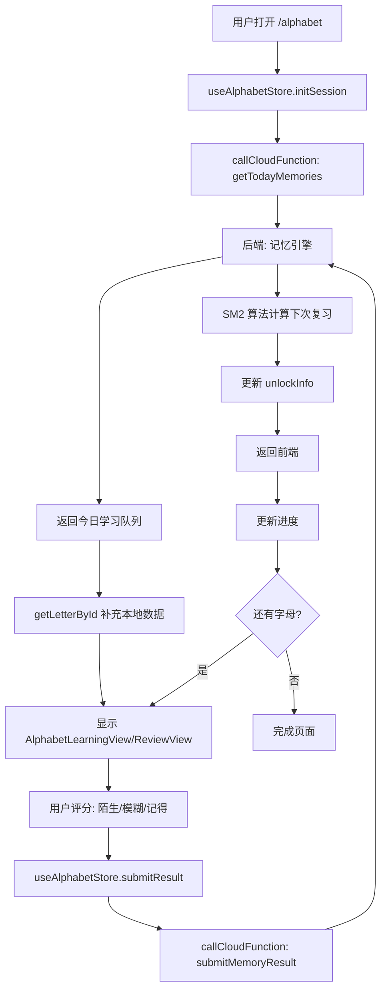

# 旧版字母学习系统备份文档 (Old Alphabet System Backup v1)

> **创建时间**: 2025-12-07  
> **目的**: 完整备份旧版字母学习系统（展示型、训练型），以便未来恢复或参考

---

## 📋 系统概述

### 两套系统对比

| 特性 | 旧系统 (Old System) | 新系统 (New SRS System) |
|------|-------------------|----------------------|
| **位置** | `app/alphabet/review.tsx`<br>`app/alphabet/training.tsx`<br>`app/alphabet/list.tsx`<br>`app/alphabet/detail.tsx` | `app/alphabet/index.tsx`<br>`src/components/learning/AlphabetLearningView.tsx`<br>`src/components/learning/AlphabetReviewView.tsx`<br>`src/stores/alphabetStore.ts` |
| **学习模式** | 展示所有字母、平铺选择、拼读训练 | SRS 间隔重复、记忆引擎驱动 |
| **数据源** | 本地 JSON (`letterData.ts`) | 后端 API + 本地数据混合 |
| **状态管理** | 组件内部 useState | Zustand store (alphabetStore) |
| **学习流程** | 用户自主选择字母 → 查看详情 → 训练/复习 | 系统推荐今日学习 → 按质量评分 → 自动调度 |
| **进度追踪** | 无持久化 | 后端记忆引擎 + 本地持久化 |
| **解锁机制** | 无 | 95% 进度解锁单词模块 |

### 旧系统的设计理念

**核心思想**: 像"字母表"一样，让用户可以：
- 浏览所有 76 个泰语字母
- 按类别（辅音、元音）筛选
- 点击任意字母查看详情
- 进行拼读训练和复习测试

**优点**:
- 直观、自由度高
- 适合初学者探索
- 无需后端支持

**缺点**:
- 无智能复习调度
- 无进度持久化
- 学习效率较低

---

## 📁 文件结构与职责

### 1. `app/alphabet/list.tsx` (字母列表页)

**路径**: `/alphabet/list?category=consonants&title=辅音字母`

**用途**: 按类别展示字母网格

**核心功能**:
```typescript
// 1. 从 URL 参数获取类别
const categoryId = params.category as LetterCategory;
const title = params.title as string;

// 2. 加载该类别的所有字母
const data = getLettersByCategory(categoryId);

// 3. 3列网格展示
<FlatList
  data={letters}
  numColumns={3}
  renderItem={({ item }) => (
    <Pressable onPress={() => router.push({
      pathname: '/alphabet/detail',
      params: { letterId: item._id }
    })}>
      <Text>{item.thaiChar}</Text>
      <Text>{item.initialSound}</Text>
    </Pressable>
  )}
/>
```

**UI 流程**:
```
文件: app/alphabet/list.tsx
路由: /alphabet/list?category=consonants&title=辅音字母

┌─────────────────────────┐
│  [<]  辅音字母      [ ] │
├─────────────────────────┤
│  ┌───┐ ┌───┐ ┌───┐    │
│  │ ก │ │ ข │ │ ฃ │    │  <- 3列网格
│  │/k/│ │/kh/│ │/kh/│   │
│  └───┘ └───┘ └───┘    │
│  ┌───┐ ┌───┐ ┌───┐    │
│  │ ค │ │ ฅ │ │ ฆ │    │
│  │/kh/│ │/kh/│ │/kh/│   │
│  └───┘ └───┘ └───┘    │
│         ...            │
└─────────────────────────┘

点击任意字母 → /alphabet/detail?letterId=TH_C_01
```

**UI 特点**:
- 3 列网格布局
- 每个字母卡片显示：泰文字符 + 发音
- 点击跳转到详情页
- 无进度标记（与新系统不同）

**数据依赖**:
- `getLettersByCategory(categoryId)` from `src/utils/letterData.ts`
- 完全本地数据，无 API 调用

---

### 2. `app/alphabet/detail.tsx` (字母详情页)

**路径**: `/alphabet/detail?letterId=TH_C_01`

**用途**: 展示单个字母的完整信息

**核心功能**:
```typescript
// 1. 获取字母数据
const letter = getLetterById(params.letterId);

// 2. 显示信息
- 大号泰文字符 (80px)
- 发音 (phonetic)
- 示例单词 (exampleWord + exampleMeaning)
- 字母类别 (class: mid/high/low)
- 泰语名称 (nameThai)

// 3. 音频播放
const playSound = async () => {
  const { sound } = await Audio.Sound.createAsync({ 
    uri: letter.audioPath 
  });
  await sound.playAsync();
};

// 4. 上一个/下一个导航
const handleNext = () => {
  const allLetters = getAllLetters();
  const currentIndex = allLetters.findIndex(l => l._id === letter._id);
  const nextId = allLetters[currentIndex + 1]._id;
  router.replace({
    pathname: '/alphabet/detail',
    params: { letterId: nextId }
  });
};
```

**UI 流程**:
```
文件: app/alphabet/detail.tsx
路由: /alphabet/detail?letterId=TH_C_01

┌─────────────────────────┐
│  [<]  字母详情      [ ] │
├─────────────────────────┤
│                         │
│      ┌───────────┐      │
│      │           │      │
│      │     ก     │      │  <- 主卡片
│      │   /k/  🔊 │      │
│      └───────────┘      │
│                         │
│  示例拼读                │
│  ┌───────────────────┐  │
│  │ กา  /ka/          │  │
│  │ 乌鸦               │  │
│  └───────────────────┘  │
│                         │
│  ┌─────┐  ┌─────┐      │
│  │泰语名│  │类别 │      │
│  │ กอ ไก่│ │中辅音│      │
│  └─────┘  └─────┘      │
│                         │
├─────────────────────────┤
│  [上一个]      [下一个]  │
└─────────────────────────┘

点击上一个/下一个 → 切换字母
点击返回 → 返回列表页
```

**关键代码片段**:
```typescript
// 音频播放逻辑
const [sound, setSound] = useState<Audio.Sound>();

useEffect(() => {
  return () => {
    if (sound) {
      sound.unloadAsync(); // 清理音频
    }
  };
}, [sound]);

// 导航逻辑
const handlePrev = () => {
  const allLetters = getAllLetters();
  const currentIndex = allLetters.findIndex(l => l._id === letter._id);
  if (currentIndex > 0) {
    const prevId = allLetters[currentIndex - 1]._id;
    router.replace({ pathname: '/alphabet/detail', params: { letterId: prevId } });
  }
};
```

**数据结构**:
```typescript
interface Letter {
  _id: string;              // "TH_C_01"
  thaiChar: string;         // "ก"
  nameThai: string;         // "กอ ไก่"
  nameEnglish: string;      // "ko kai"
  initialSound: string;     // "k"
  class: 'mid' | 'high' | 'low';
  exampleWord: string;      // "กา"
  exampleMeaning: string;   // "乌鸦"
  audioPath?: string;       // 音频文件路径
}
```

---

### 3. `app/alphabet/review.tsx` (复习测试页)

**路径**: `/alphabet/review`

**用途**: 随机抽取字母进行发音测试

**核心逻辑**:
```typescript
// 1. 生成测试题
const generateReviewItems = () => {
  const allLetters = getAllLetters();
  const newItems: ReviewItem[] = [];
  
  // 随机选择 8 个字母
  for (let i = 0; i < 8; i++) {
    const target = allLetters[Math.floor(Math.random() * allLetters.length)];
    
    // 生成 3 个选项（1 正确 + 2 干扰项）
    const options = [target.initialSound];
    while (options.length < 3) {
      const random = allLetters[Math.floor(Math.random() * allLetters.length)];
      if (!options.includes(random.initialSound)) {
        options.push(random.initialSound);
      }
    }
    
    // 打乱选项
    const shuffledOptions = options.sort(() => Math.random() - 0.5);
    const correctIndex = shuffledOptions.indexOf(target.initialSound);
    
    newItems.push({ target, options: shuffledOptions, correctIndex });
  }
  
  setItems(newItems);
};

// 2. 答题逻辑
const handleOptionSelect = (index: number) => {
  setSelectedOption(index);
  const correct = index === items[currentIndex].correctIndex;
  setIsCorrect(correct);
  
  // 1 秒后自动进入下一题
  setTimeout(() => {
    if (currentIndex < items.length - 1) {
      setCurrentIndex(prev => prev + 1);
      setSelectedOption(null);
      setIsCorrect(null);
    } else {
      Alert.alert('复习完成', '你已完成今日的字母复习！');
      router.back();
    }
  }, 1000);
};
```

**UI 流程**:
```
文件: app/alphabet/review.tsx
路由: /alphabet/review

开始界面:
┌─────────────────────────┐
│      🔄 (图标)           │
│   今日字母复习            │
│   待复习字母: 8 个        │
│                         │
│  ┌───────────────────┐  │
│  │   开始复习         │  │
│  └───────────────────┘  │
│       稍后再说           │
└─────────────────────────┘

点击"开始复习" ↓

答题界面:
┌─────────────────────────┐
│  [X]         1 / 8      │
├─────────────────────────┤
│      ┌───────────┐      │
│      │     ก     │      │  <- 显示字母
│      └───────────┘      │
│                         │
│  这个字母的发音是？       │
│                         │
│  ┌───────────────────┐  │
│  │      /k/          │  │  <- 选项 1
│  └───────────────────┘  │
│  ┌───────────────────┐  │
│  │      /kh/         │  │  <- 选项 2
│  └───────────────────┘  │
│  ┌───────────────────┐  │
│  │      /ng/         │  │  <- 选项 3
│  └───────────────────┘  │
└─────────────────────────┘

答对后 (1秒后自动下一题):
┌───────────────────┐
│      /k/    ✓     │  <- 绿色背景
└───────────────────┘

答错后 (1秒后自动下一题):
┌───────────────────┐
│      /kh/   ✗     │  <- 红色背景
└───────────────────┘
┌───────────────────┐
│      /k/    ✓     │  <- 显示正确答案
└───────────────────┘

完成8题后 → Alert弹窗 → 返回上一页
```

**状态管理**:
```typescript
interface ReviewItem {
  target: Letter;           // 目标字母
  options: string[];        // 发音选项
  correctIndex: number;     // 正确答案索引
}

const [items, setItems] = useState<ReviewItem[]>([]);
const [currentIndex, setCurrentIndex] = useState(0);
const [selectedOption, setSelectedOption] = useState<number | null>(null);
const [isCorrect, setIsCorrect] = useState<boolean | null>(null);
const [isStarted, setIsStarted] = useState(false);
```

**视觉反馈**:
```typescript
// 正确答案样式
optionCorrect: {
  backgroundColor: '#4CAF50',  // 绿色
  borderColor: '#4CAF50',
}

// 错误答案样式
optionWrong: {
  backgroundColor: '#F44336',  // 红色
  borderColor: '#F44336',
}
```

---

### 4. `app/alphabet/training.tsx` (拼读训练页)

**路径**: `/alphabet/training`

**用途**: 双向训练（听音选字 + 看字选音）

**核心逻辑**:
```typescript
type QuestionType = 'audio_to_char' | 'char_to_sound';

interface Question {
  type: QuestionType;
  target: Letter;
  options: Letter[];        // 完整字母对象
  correctIndex: number;
}

// 生成 10 道题
const generateQuestions = () => {
  for (let i = 0; i < 10; i++) {
    const target = allLetters[Math.floor(Math.random() * allLetters.length)];
    
    // 生成 3 个选项（字母对象）
    const options = [target];
    while (options.length < 3) {
      const random = allLetters[Math.floor(Math.random() * allLetters.length)];
      if (!options.find(o => o._id === random._id)) {
        options.push(random);
      }
    }
    
    // 随机选择题型
    const type = Math.random() > 0.5 ? 'audio_to_char' : 'char_to_sound';
    
    newQuestions.push({ type, target, options: shuffled, correctIndex });
  }
};

// 答题逻辑（带计分）
const [score, setScore] = useState(0);

const handleOptionSelect = (index: number) => {
  const correct = index === questions[currentIndex].correctIndex;
  setIsCorrect(correct);
  
  if (correct) {
    setScore(prev => prev + 1);
  }
  
  // 1.5 秒后自动进入下一题
  setTimeout(() => {
    if (currentIndex < questions.length - 1) {
      setCurrentIndex(prev => prev + 1);
      setSelectedOption(null);
      setIsCorrect(null);
    } else {
      Alert.alert(
        '训练完成',
        `你的得分: ${correct ? score + 1 : score} / ${questions.length}`
      );
      router.back();
    }
  }, 1500);
};
```

**两种题型**:

**题型 1: 听音选字 (audio_to_char)**
```
文件: app/alphabet/training.tsx
路由: /alphabet/training

┌─────────────────────────┐
│  [X]  ████████  1/10    │
├─────────────────────────┤
│                         │
│      ┌───────────┐      │
│      │    🔊     │      │  <- 音频按钮
│      │ 点击播放发音│      │
│      └───────────┘      │
│                         │
│  ┌───────────────────┐  │
│  │        ก          │  │  <- 选项 1 (字符)
│  └───────────────────┘  │
│  ┌───────────────────┐  │
│  │        ข          │  │  <- 选项 2
│  └───────────────────┘  │
│  ┌───────────────────┐  │
│  │        ค          │  │  <- 选项 3
│  └───────────────────┘  │
└─────────────────────────┘
```

**题型 2: 看字选音 (char_to_sound)**
```
┌─────────────────────────┐
│  [X]  ████████  2/10    │
├─────────────────────────┤
│                         │
│         ก               │  <- 显示字符
│                         │
│  ┌───────────────────┐  │
│  │      /k/          │  │  <- 选项 1 (发音)
│  └───────────────────┘  │
│  ┌───────────────────┐  │
│  │      /kh/         │  │  <- 选项 2
│  └───────────────────┘  │
│  ┌───────────────────┐  │
│  │      /ng/         │  │  <- 选项 3
│  └───────────────────┘  │
└─────────────────────────┘

完成10题后 → Alert显示得分 → 返回上一页
```

**进度条显示**:
```typescript
<View style={styles.progressContainer}>
  <View style={[
    styles.progressBar, 
    { width: `${((currentIndex + 1) / questions.length) * 100}%` }
  ]} />
</View>
```

**音频播放**:
```typescript
const playSound = async () => {
  // Mock implementation
  console.log('Playing sound for:', questions[currentIndex].target.thaiChar);
  // 实际应该:
  // const { sound } = await Audio.Sound.createAsync({ 
  //   uri: questions[currentIndex].target.audioPath 
  // });
  // await sound.playAsync();
};
```

**计分逻辑**:
```typescript
// 答对加分
if (correct) {
  setScore(prev => prev + 1);
}

// 完成时显示总分
Alert.alert(
  '训练完成',
  `你的得分: ${finalScore} / ${questions.length}`
);
```

---

### 5. `app/alphabet/success.tsx` (完成页面)

**路径**: `/alphabet/success`

**用途**: 显示学习完成庆祝界面（未被使用）

**核心内容**:
```typescript
export default function AlphabetSuccessScreen() {
  const router = useRouter();
  
  return (
    <SafeAreaView style={styles.container}>
      <View style={styles.content}>
        {/* 庆祝图标 */}
        <View style={styles.iconCircle}>
          <CheckCircle size={64} color={Colors.thaiGold} />
        </View>
        
        {/* 标题 */}
        <Text style={styles.title}>恭喜完成！</Text>
        <Text style={styles.subtitle}>你已掌握所有泰语字母</Text>
        
        {/* 统计信息 */}
        <View style={styles.statsContainer}>
          <View style={styles.statItem}>
            <Text style={styles.statValue}>76</Text>
            <Text style={styles.statLabel}>已掌握字母</Text>
          </View>
          <View style={styles.statItem}>
            <Text style={styles.statValue}>100%</Text>
            <Text style={styles.statLabel}>完成度</Text>
          </View>
        </View>
        
        {/* 按钮 */}
        <Pressable style={styles.button} onPress={() => router.back()}>
          <Text style={styles.buttonText}>返回首页</Text>
        </Pressable>
      </View>
    </SafeAreaView>
  );
}
```

**UI 流程**:
```
文件: app/alphabet/success.tsx
路由: /alphabet/success

┌─────────────────────────┐
│                         │
│      ┌─────────┐        │
│      │    ✓    │        │  <- 金色圆圈
│      └─────────┘        │
│                         │
│      恭喜完成！          │
│   你已掌握所有泰语字母    │
│                         │
│  ┌─────┐    ┌─────┐    │
│  │ 76  │    │100% │    │
│  │已掌握│    │完成度│    │
│  └─────┘    └─────┘    │
│                         │
│  ┌───────────────────┐  │
│  │    返回首页        │  │
│  └───────────────────┘  │
└─────────────────────────┘

点击"返回首页" → router.back()
```

**状态**: 当前未被任何路由调用，可能是预留的完成页面

---

### 6. `app/alphabet/index.tsx` (新系统 SRS 学习页) ⭐

**路径**: `/alphabet`

**用途**: 基于 SRS 算法的智能学习系统（新系统核心）

**核心特点**:
- 使用 `useAlphabetStore` 进行状态管理
- 调用后端记忆引擎 API
- 智能调度今日学习内容
- 质量评分系统（陌生/模糊/记得）

**UI 流程**:
```
文件: app/alphabet/index.tsx
路由: /alphabet
使用组件: AlphabetLearningView.tsx, AlphabetReviewView.tsx
使用 Store: useAlphabetStore

流程 1: 设置模式 (Setup Mode)
┌─────────────────────────┐
│  [X]                    │
├─────────────────────────┤
│                         │
│   今日学习计划           │
│ 选择今天要学习/复习的     │
│      字母数量            │
│                         │
│        20               │  <- 可调节 (5-500)
│   ═════════════════     │  <- 滑块
│   5              500    │
│                         │
│  ┌───────────────────┐  │
│  │   开始学习         │  │
│  └───────────────────┘  │
└─────────────────────────┘

点击"开始学习" → 调用 initSession(userId, limit)
                ↓
            后端返回今日队列
                ↓
           进入学习模式

流程 2: 学习模式 (Learning Mode - 新字母)
┌─────────────────────────┐
│  [X]  ████░░░░░  40%   │  <- 进度条
├─────────────────────────┤
│                         │
│      ┌───────────┐      │
│      │           │      │
│      │     ก     │      │  <- 大字显示
│      │           │      │
│      └───────────┘      │
│                         │
│   🔊  /k/               │  <- 发音 + 音频
│                         │
│   类别: 中辅音           │
│                         │
│   例词: กา (乌鸦)        │
│                         │
├─────────────────────────┤
│  ┌───────────────────┐  │
│  │     下一个         │  │
│  └───────────────────┘  │
└─────────────────────────┘

点击"下一个" → setHasViewedIntro(true)
              ↓
          进入复习模式

流程 3: 复习模式 (Review Mode)
┌─────────────────────────┐
│  [X]  ████████░  80%   │
├─────────────────────────┤
│                         │
│      ┌───────────┐      │
│      │     ก     │      │  <- 显示字母
│      │           │      │
│      └───────────┘      │
│         🔊              │  <- 音频提示
│                         │
│   ┌─────────────────┐   │  <- 答案区（模糊）
│   │  /k/            │   │
│   │  กา (乌鸦)       │   │
│   └─────────────────┘   │
│                         │
├─────────────────────────┤
│ ┌─────┐┌─────┐┌─────┐  │
│ │陌生 ││模糊 ││记得 │  │  <- 质量按钮
│ └─────┘└─────┘└─────┘  │
└─────────────────────────┘

点击质量按钮 → 显示答案
              ↓
         显示"下一个"按钮
              ↓
    点击"下一个" → submitResult(userId, quality)
                    ↓
              提交到后端记忆引擎
                    ↓
              自动进入下一个字母

流程 4: 完成模式 (Completion)
┌─────────────────────────┐
│                         │
│   今日学习完成! 🎉       │
│                         │
│  ┌───────────────────┐  │
│  │   返回首页         │  │
│  └───────────────────┘  │
└─────────────────────────┘

点击"返回首页" → router.back()
```

**状态管理**:
```typescript
// 使用 alphabetStore
const {
  currentAlphabet,      // 当前字母
  reviewQueue,          // 学习队列
  phase,                // 学习阶段
  isLoading,            // 加载状态
  initSession,          // 初始化会话
  submitResult,         // 提交结果
  completedCount,       // 已完成数量
  totalCount            // 总数量
} = useAlphabetStore();
```

**与旧系统的区别**:
| 特性 | 旧系统 (list/detail/review/training) | 新系统 (index.tsx) |
|------|-------------------------------------|-------------------|
| 数据源 | 本地 JSON | 后端 API + SRS 算法 |
| 学习顺序 | 用户自选 | 系统智能推荐 |
| 进度追踪 | 无 | 后端持久化 |
| 复习调度 | 随机 | SM2 算法 |
| 质量评分 | 对错二元 | 三级评分（陌生/模糊/记得） |
| 解锁机制 | 无 | 95% 解锁单词模块 |

---

## 🔗 依赖关系

### Store / Hook 依赖

**旧系统 (Old System)**:
- ❌ **不使用** `useAlphabetStore`
- ❌ **不使用** `useModuleAccessStore`
- ❌ **不使用** `useLearningPreferenceStore`
- ✅ **仅使用** 组件内部 `useState`

**新系统 (New SRS System)**:
- ✅ 使用 `useAlphabetStore` (核心)
- ✅ 使用 `useUserStore` (获取用户 ID)
- ✅ 使用 `useModuleAccessStore` (解锁逻辑)
- ✅ 使用 `useLearningPreferenceStore` (每日限制)

### 数据源依赖

**旧系统**:
```typescript
// 完全依赖本地工具函数
import { 
  getAllLetters,
  getLetterById,
  getLettersByCategory 
} from '@/src/utils/letterData';

// 数据来源: assets/data/letters.json (假设)
// 或者硬编码在 letterData.ts 中
```

**新系统**:
```typescript
// 混合数据源
// 1. 后端 API (通过 alphabetStore)
const response = await callCloudFunction('alphabet', {
  action: 'getTodayMemories',
  userId,
  entityType: 'alphabet'
});

// 2. 本地数据 (补充详细信息)
const letterData = getLetterById(entityId);

// 3. 合并
const alphabetState = {
  ...letterData,
  memoryState: response.data.memoryState
};
```

### CloudBase API 依赖

**旧系统**:
- ❌ **无 CloudBase 调用**
- ❌ **无后端依赖**
- ✅ **完全离线可用**

**新系统**:
- ✅ 调用 `alphabet` 云函数
- ✅ 使用统一记忆引擎 (`memoryEngine.js`)
- ✅ 依赖用户认证
- ✅ 需要网络连接

---

## 🔒 字母锁机制

### 旧系统的锁机制

**状态**: ❌ **无锁机制**

旧系统允许用户：
- 自由浏览所有 76 个字母
- 随时进入任意字母详情
- 随时开始复习或训练
- 无需解锁或进度要求

**优点**:
- 用户体验自由
- 适合快速查阅

**缺点**:
- 无法引导学习路径
- 无法保证学习质量

### 新系统的锁机制

**状态**: ✅ **有解锁机制**

```typescript
// 1. 字母进度达到 95% 才能解锁单词模块
interface UnlockInfo {
  letterProgress: number;      // 0-100
  wordUnlocked: boolean;        // 是否解锁单词
  unlocked?: boolean;           // 刚刚解锁标志
}

// 2. 后端返回解锁信息
const response = await callCloudFunction('alphabet', {
  action: 'getTodayMemories',
  userId
});

// response.data.unlockInfo = {
//   letterProgress: 78,
//   wordUnlocked: false
// }

// 3. 前端检查解锁状态
if (unlockInfo.wordUnlocked) {
  // 允许进入单词学习
} else {
  // 显示锁定提示
}
```

**解锁流程**:
```
字母学习进度 0% → 95%
         ↓
  letterProgress >= 95
         ↓
  wordUnlocked = true
         ↓
   解锁单词模块
```

---

## 🎯 拼读训练逻辑

### 旧系统的训练逻辑

**位置**: `app/alphabet/training.tsx`

**训练类型**:

1. **听音选字 (Audio to Character)**
   - 播放字母发音
   - 用户从 3 个字母中选择正确的
   - 考察听力识别能力

2. **看字选音 (Character to Sound)**
   - 显示泰文字母
   - 用户从 3 个发音中选择正确的
   - 考察发音记忆能力

**题目生成算法**:
```typescript
// 1. 随机选择目标字母
const target = allLetters[Math.floor(Math.random() * allLetters.length)];

// 2. 生成 2 个干扰项（不重复）
const options = [target];
while (options.length < 3) {
  const random = allLetters[Math.floor(Math.random() * allLetters.length)];
  if (!options.find(o => o._id === random._id)) {
    options.push(random);
  }
}

// 3. 打乱选项顺序
const shuffledOptions = options.sort(() => Math.random() - 0.5);

// 4. 记录正确答案位置
const correctIndex = shuffledOptions.findIndex(o => o._id === target._id);
```

**评分机制**:
```typescript
// 每题 1 分
const [score, setScore] = useState(0);

// 答对加分
if (correct) {
  setScore(prev => prev + 1);
}

// 完成时显示: "你的得分: 7 / 10"
```

**自动进度**:
```typescript
// 答题后 1.5 秒自动进入下一题
setTimeout(() => {
  if (currentIndex < questions.length - 1) {
    setCurrentIndex(prev => prev + 1);
    setSelectedOption(null);
    setIsCorrect(null);
  } else {
    // 显示完成弹窗
    Alert.alert('训练完成', `你的得分: ${score} / ${questions.length}`);
  }
}, 1500);
```

**视觉反馈**:
- ✅ 正确: 绿色背景 + ✓ 图标
- ❌ 错误: 红色背景 + ✗ 图标
- 同时高亮正确答案

### 新系统的训练逻辑

**位置**: `src/components/learning/AlphabetReviewView.tsx`

**训练类型**:
- 仅一种: 看字母 → 评估记忆质量

**质量评分**:
```typescript
// 三个按钮
- "陌生" (FORGET): 完全不记得
- "模糊" (FUZZY): 有印象但不确定
- "记得" (KNOW): 清楚记得

// 映射到后端分数
const QUALITY_TEXT_MAP = {
  FORGET: '陌生',  // 1 分
  FUZZY: '模糊',   // 3 分
  KNOW: '记得'     // 5 分
};
```

**学习流程**:
```
1. 显示字母 (正面)
2. 用户点击质量按钮
3. 显示答案 (发音 + 例词)
4. 点击"下一个"
5. 提交到记忆引擎
6. 自动调度下次复习时间
```

**与 SRS 算法集成**:
```typescript
// 提交结果到后端
await callCloudFunction('alphabet', {
  action: 'submitMemoryResult',
  userId,
  entityId: currentAlphabet.alphabetId,
  quality: qualityText  // '陌生' | '模糊' | '记得'
});

// 后端使用 SM2 算法计算:
// - 下次复习时间 (nextReviewDate)
// - 复习间隔 (interval)
// - 难度因子 (easinessFactor)
```

---

## 🔄 旧系统与新系统的关系

### 共存状态

**当前项目中**:
```
app/alphabet/
├── index.tsx          ← 新系统 (使用 SRS)
├── list.tsx           ← 旧系统 (浏览模式)
├── detail.tsx         ← 旧系统 (详情页)
├── review.tsx         ← 旧系统 (复习测试)
├── training.tsx       ← 旧系统 (拼读训练)
└── success.tsx        ← 旧系统 (完成页)
```

**路由冲突**:
- `/alphabet` → 新系统 (SRS 学习)
- `/alphabet/list` → 旧系统 (字母列表)
- `/alphabet/detail` → 旧系统 (字母详情)

**问题**:
- 用户可能困惑: 为什么有两种学习方式？
- 数据不同步: 旧系统无进度追踪，新系统有
- 入口混乱: 两个系统没有明确的切换逻辑

### 迁移路径

**如果要完全使用新系统**:
1. 删除 `review.tsx`, `training.tsx`, `success.tsx`
2. 保留 `list.tsx`, `detail.tsx` 作为"字母表查阅"功能
3. 将 `index.tsx` 作为唯一的学习入口

**如果要恢复旧系统**:
1. 删除 `index.tsx` (新系统入口)
2. 删除 `src/stores/alphabetStore.ts`
3. 删除 `AlphabetLearningView.tsx`, `AlphabetReviewView.tsx`
4. 创建新的入口页面，整合 `list`, `detail`, `review`, `training`

### 设计建议

**方案 1: 双模式共存**
```
字母学习
├── 浏览模式 (旧系统)
│   ├── 查看所有字母
│   ├── 字母详情
│   └── 快速查阅
└── 学习模式 (新系统)
    ├── SRS 智能复习
    ├── 进度追踪
    └── 解锁机制
```

**方案 2: 完全新系统 + 字母表**
```
字母学习 (新系统)
└── 每日学习 (SRS)

字母表 (旧系统简化版)
├── 浏览所有字母
└── 查看详情 (只读)
```

**方案 3: 完全旧系统 (自由探索)**
```
字母学习 (旧系统)
├── 字母列表
├── 字母详情
├── 拼读训练
└── 复习测试
```

---

## 📊 数据流对比

### 旧系统数据流

```mermaid
graph LR
    A[用户打开 /alphabet/list] --> B[getLettersByCategory]
    B --> C[本地 JSON 数据]
    C --> D[渲染字母网格]
    D --> E[点击字母]
    E --> F[/alphabet/detail]
    F --> G[getLetterById]
    G --> C
    C --> H[显示详情]
    
    I[用户打开 /alphabet/review] --> J[getAllLetters]
    J --> C
    C --> K[随机生成 8 道题]
    K --> L[用户答题]
    L --> M[本地计分]
    M --> N[完成弹窗]
```

**特点**:
- 🔵 完全本地
- 🔵 无网络请求
- 🔵 无状态持久化
- 🔵 无后端依赖

### 新系统数据流



**特点**:
- 🟢 后端驱动
- 🟢 智能调度
- 🟢 进度持久化
- 🟢 解锁机制
- 🔴 需要网络
- 🔴 需要认证

---

## 🛠️ 恢复指南

### 如果要恢复旧系统

#### 步骤 1: 保留旧系统文件
```bash
# 这些文件是旧系统核心
app/alphabet/list.tsx       ✅ 保留
app/alphabet/detail.tsx     ✅ 保留
app/alphabet/review.tsx     ✅ 保留
app/alphabet/training.tsx   ✅ 保留
app/alphabet/success.tsx    ✅ 保留
```

#### 步骤 2: 删除新系统文件
```bash
# 删除 SRS 相关
app/alphabet/index.tsx                              ❌ 删除
src/components/learning/AlphabetLearningView.tsx    ❌ 删除
src/components/learning/AlphabetReviewView.tsx      ❌ 删除
src/stores/alphabetStore.ts                         ❌ 删除
src/entities/types/alphabet.types.ts                ❌ 删除
```

#### 步骤 3: 创建新的入口页面
```typescript
// app/alphabet/index.tsx (新建)
export default function AlphabetHomeScreen() {
  const router = useRouter();
  
  return (
    <SafeAreaView>
      <Text style={styles.title}>泰语字母学习</Text>
      
      {/* 浏览字母 */}
      <Pressable onPress={() => router.push('/alphabet/list?category=consonants&title=辅音')}>
        <Text>浏览辅音字母</Text>
      </Pressable>
      
      {/* 拼读训练 */}
      <Pressable onPress={() => router.push('/alphabet/training')}>
        <Text>拼读训练</Text>
      </Pressable>
      
      {/* 复习测试 */}
      <Pressable onPress={() => router.push('/alphabet/review')}>
        <Text>复习测试</Text>
      </Pressable>
    </SafeAreaView>
  );
}
```

#### 步骤 4: 更新入口卡片
```typescript
// src/components/courses/AlphabetCourseCard.tsx
const handleCardPress = () => {
  router.push('/alphabet');  // 指向新的入口页面
};
```

#### 步骤 5: 添加进度追踪（可选）
```typescript
// 如果需要本地进度追踪
import AsyncStorage from '@react-native-async-storage/async-storage';

// 保存已学习的字母
const saveProgress = async (letterId: string) => {
  const learned = await AsyncStorage.getItem('learnedLetters');
  const learnedArray = learned ? JSON.parse(learned) : [];
  if (!learnedArray.includes(letterId)) {
    learnedArray.push(letterId);
    await AsyncStorage.setItem('learnedLetters', JSON.stringify(learnedArray));
  }
};

// 读取进度
const getProgress = async () => {
  const learned = await AsyncStorage.getItem('learnedLetters');
  return learned ? JSON.parse(learned) : [];
};
```

---

## 📝 总结

### 旧系统优势 ✅
- 简单直观，易于理解
- 完全离线，无需后端
- 自由度高，适合快速查阅
- 无需用户认证
- 拼读训练功能完善

### 旧系统劣势 ❌
- 无智能复习调度
- 无进度持久化
- 无学习路径引导
- 无解锁机制
- 学习效率较低

### 新系统优势 ✅
- SRS 智能复习
- 进度持久化
- 解锁机制
- 与单词学习统一
- 学习效率高

### 新系统劣势 ❌
- 需要后端支持
- 需要网络连接
- 需要用户认证
- 自由度较低
- 无法快速查阅

### 建议方案

**推荐: 双模式共存**
```
1. 保留旧系统的 list.tsx + detail.tsx 作为"字母表"查阅功能
2. 使用新系统的 index.tsx 作为主要学习入口
3. 在首页提供两个入口:
   - "开始学习" → 新系统 (SRS)
   - "浏览字母表" → 旧系统 (list)
```

这样既保留了旧系统的查阅便利性，又利用了新系统的学习效率。

---

**文档结束**
