# 🐛 Bug Fixing Tutorial: Audio Playback & Confetti Position

> **Who is this for?** You know basic TypeScript — variables, functions, types, `async/await`. You want to learn **how to find and fix real bugs** in a React Native app.

---

## Part 1: The Audio Bug 🔊

### 1.1 What Happened? (Observe the Problem)

We pressed the audio button in our Thai learning app. **No sound came out.** The terminal (终端) showed this error:

```
This media may be damaged (error -11849)
```

> **Rule #1 of debugging**: Always read the error message first. It tells you *where to look*.

This error means: "The audio file is broken." But wait — is the file really broken? Or is something else wrong?

---

### 1.2 How to Think About This (The Debugging Mindset)

When something doesn't work, ask yourself **3 questions**:

```
1. WHAT is not working?        → Audio playback (播放)
2. WHERE does it happen?       → When the app tries to play .mp3 files
3. WHEN did it start?          → After we changed from expo-av to expo-audio
```

These 3 questions help you narrow down (缩小范围, /ˈnær.oʊ daʊn/) the problem area.

---

### 1.3 Tracing the Chain (追踪链路)

A button press goes through many steps. Here is the **full chain** for audio playback:

```mermaid
flowchart LR
    A["👆 User taps\naudio button"] --> B["playAudio()\nin Component"]
    B --> C["getVocabAudioUrl()\nGet file URL"]
    C --> D["resolveVocabPath()\nBuild cloud URL"]
    D --> E["☁️ Cloud Storage\nDownload .mp3"]
    E --> F["📱 Local Cache\nSave to phone"]
    F --> G["🔊 Audio.Sound\nPlay the file"]
```



> **Key Concept**: Every feature is a **chain of function calls**. When something breaks, one link in the chain is broken. Your job is to find *which* link.

#### How to trace a chain in code:

**Step 1**: Find where the button is. Search for the [onPress](file:///Users/liangjianyu/LearnOnThailand/ThaiLearningApp/app/learning/index.tsx#104-105) handler (处理器, /ˈhæn.dlɚ/).

```typescript
// In WordCard.tsx — this is where the chain starts
<Pressable onPress={playAudio}>
    <Volume2 size={24} />
</Pressable>
```

**Step 2**: Read the [playAudio](file:///Users/liangjianyu/LearnOnThailand/ThaiLearningApp/src/components/learning/vocabulary/WordCard.tsx#19-52) function. What does it call?

```typescript
const playAudio = async () => {
    // Step 1: Get the audio URL (this calls another function)
    const url = await getVocabAudioUrl(vocabulary.audioPath || '');
    
    // Step 2: Create a sound object and play it
    const { sound } = await Audio.Sound.createAsync(
        { uri: url },
        { shouldPlay: true }
    );
};
```

**Step 3**: Follow each function call. Click into [getVocabAudioUrl()](file:///Users/liangjianyu/LearnOnThailand/ThaiLearningApp/src/utils/vocab/vocabAudioHelper.ts#28-63) to see what it does.

> **Tip**: In VS Code, hold `Cmd` (Mac) and click on a function name. It will jump to where that function is defined (定义). This is called **"Go to Definition"**.

---

### 1.4 Bug #1: Wrong Audio Library

#### What we found

The code used `expo-audio`:

```typescript
// ❌ OLD — uses expo-audio (needs native compilation)
import { createAudioPlayer, AudioPlayer } from 'expo-audio';
```

But the alphabet (字母) module used `expo-av` and worked fine:

```typescript
// ✅ WORKING — uses expo-av
import { Audio } from 'expo-av';
```

#### TypeScript Knowledge: Import Statements

```typescript
// Named import — get specific items from a package
import { Audio } from 'expo-av';
//       ^^^^^    ^^^^^^^^
//       what     from where

// You can import multiple things:
import { useState, useEffect, useRef } from 'react';
```

> **What is a "native module" (原生模块, /ˈneɪ.tɪv/)?** Some packages need to compile (编译, /kəmˈpaɪl/) special code for iOS or Android. If you run the app with Expo Go (a quick testing tool), these native modules may not work. `expo-audio` needs native compilation. `expo-av` does not.

#### The Fix

Replace all `expo-audio` imports with `expo-av`:

```diff
- import { createAudioPlayer, AudioPlayer } from 'expo-audio';
+ import { Audio } from 'expo-av';
```

And change the playback (播放) pattern:

```diff
- // expo-audio pattern
- const player = createAudioPlayer({ uri: url });
- player.play();

+ // expo-av pattern
+ const { sound } = await Audio.Sound.createAsync(
+     { uri: url },
+     { shouldPlay: true }
+ );
```

#### TypeScript Knowledge: `useRef` for Mutable Values

We use `useRef` to hold the sound object. Why not `useState`? Because changing a ref does **not** re-render the component.

```typescript
// useRef<T> — T is the type of value the ref holds
const soundRef = useRef<Audio.Sound | null>(null);
//                      ^^^^^^^^^^^^^^^^^
//                      This ref holds either an Audio.Sound or null

// Using the ref:
soundRef.current = sound;                    // Set it
await soundRef.current.unloadAsync();        // Use it
soundRef.current = null;                     // Clear it
```

> **TypeScript Knowledge: Union Types**
> `Audio.Sound | null` means "this value can be an Audio.Sound OR null". The `|` symbol means "or". This is called a **union type** (联合类型).

---

### 1.5 Bug #2: Wrong Cloud Storage URL

After fixing the library, we still got errors. The terminal showed:

```
⚠️ [AudioCache] Download failed for 123.mp3: HTTP 404
```

> **What is HTTP 404?** It means "Not Found". The server says: "I don't have this file at this address."

#### How We Found It

We looked at the URL the code was building:

```
https://xxx.tcb.qcloud.la/vocabulary/101.mp3    ← Code builds this
```

Then we looked at the **actual** cloud storage (实际的云存储):

```
BaseThai_Audio/
  └── BaseThai_1_Audio/
        ├── 1.mp3
        ├── 10.mp3
        ├── 100.mp3          ← Files are actually HERE
        └── 101.mp3
```

The real path should be:

```
https://xxx.tcb.qcloud.la/BaseThai_Audio/BaseThai_1_Audio/101.mp3
```

> **Lesson**: When you see HTTP 404, the URL is wrong. Compare what your code builds with the **actual** server path (实际路径).

#### Before and After

```typescript
// ❌ BEFORE — hardcoded wrong path
const BASE_URL = 'https://xxx.tcb.qcloud.la/vocabulary/';

export function resolveVocabPath(path: string | undefined): string {
    if (!path) return '';
    return path.startsWith('http') ? path : `${BASE_URL}${path}`;
}
```

```typescript
// ✅ AFTER — dynamic path based on source
const CLOUD_BASE = 'https://xxx.tcb.qcloud.la';

export function resolveVocabPath(
    path: string | undefined,
    source?: string            // ← New parameter!
): string {
    if (!path) return '';
    if (path.startsWith('http')) return path;
    
    // Build the correct folder path
    const audioFolder = source
        ? `BaseThai_Audio/${source}_Audio`     // e.g. "BaseThai_Audio/BaseThai_1_Audio"
        : 'BaseThai_Audio';
    return `${CLOUD_BASE}/${audioFolder}/${path}`;
}
```

#### TypeScript Knowledge: Optional Parameters

```typescript
function resolveVocabPath(path: string | undefined, source?: string): string
//                                                  ^^^^^^^
//                                                  The ? makes this OPTIONAL
//                                                  You can call it with or without source:

resolveVocabPath('101.mp3');                    // OK — source is undefined
resolveVocabPath('101.mp3', 'BaseThai_1');      // OK — source is 'BaseThai_1'
```

#### TypeScript Knowledge: Template Literals (模板字符串)

```typescript
// Use backticks ` ` and ${} to put variables inside a string
const folder = `BaseThai_Audio/${source}_Audio`;
// If source = "BaseThai_1", result = "BaseThai_Audio/BaseThai_1_Audio"

// This is the same as:
const folder = 'BaseThai_Audio/' + source + '_Audio';
// But template literals are easier to read!
```

---

### 1.6 Bug #3: Corrupted Cache Files (损坏的缓存文件)

Even after fixing the URL, old broken files were still cached (缓存, /kæʃ/) on the phone. The download function didn't check if the download was successful:

```typescript
// ❌ BEFORE — no validation
const downloadRes = await FileSystem.downloadAsync(remoteUrl, localUri);
return downloadRes.uri;   // Returns the file even if it's a 404 error page!
```

> **What happened**: The server returned an HTML error page (about 440 bytes). This was saved as `101.mp3`. When the audio player tried to play an HTML file as music... of course it said "media is damaged"!

```typescript
// ✅ AFTER — with validation (验证)
const downloadRes = await FileSystem.downloadAsync(remoteUrl, localUri);

// Check 1: Did the server say OK?
if (downloadRes.status !== 200) {
    console.warn(`Download failed: HTTP ${downloadRes.status}`);
    await FileSystem.deleteAsync(localUri, { idempotent: true });
    return remoteUrl;   // Fall back to remote URL
}

// Check 2: Is the file big enough to be a real MP3?
const fileInfo = await FileSystem.getInfoAsync(localUri);
if (fileInfo.exists && fileInfo.size < 1024) {
    console.warn(`File too small: ${fileInfo.size} bytes`);
    await FileSystem.deleteAsync(localUri, { idempotent: true });
    return remoteUrl;
}
```

#### TypeScript Knowledge: Type Narrowing (类型收窄, /ˈnær.oʊ.ɪŋ/)

`FileSystem.getInfoAsync()` returns a **union type**:

```typescript
type FileInfo = 
    | { exists: true;  uri: string; size: number; isDirectory: boolean }
    | { exists: false; uri: string; isDirectory: false }
//    ^^^^^^^^^^^^^^^^^^^^^^^^^^^^^^^^^^^^^^^^^^^^^^^^^^^^
//    When exists is false, there is NO size property!
```

If you write `fileInfo.size` without checking `exists` first, TypeScript gives an error:

```typescript
// ❌ Error: Property 'size' does not exist on type '{ exists: false; ... }'
console.log(fileInfo.size);

// ✅ Check exists first — TypeScript then knows size exists
if (fileInfo.exists) {
    console.log(fileInfo.size);   // OK! TypeScript knows exists=true means size exists
}
```

This is called **type narrowing** — when you add an [if](file:///Users/liangjianyu/LearnOnThailand/ThaiLearningApp/cloudbase/functions/user-update-profile/index.js#10-16) check, TypeScript narrows the type to be more specific (具体的, /spəˈsɪf.ɪk/).

---

### 1.7 Summary: Audio Bug Fix Chain

```mermaid
flowchart TD
    A["🔇 No audio"] --> B{"Check terminal logs"}
    B --> C["'media damaged' error"]
    C --> D{"Is the audio file valid?"}
    D --> E["File is 440 bytes\n= HTML error page!"]
    E --> F{"Why is download broken?"}
    F --> G["HTTP 404 = URL is wrong"]
    G --> H{"Compare code URL\nvs real cloud path"}
    H --> I["vocabulary/ ≠ BaseThai_Audio/..."]
    I --> J["✅ Fix: Use correct\ncloud storage path"]
    
    E --> K["Old broken files\nstill in cache"]
    K --> L["✅ Fix: Add download\nvalidation"]
    
    A --> M{"Which audio library?"}
    M --> N["expo-audio needs\nnative compilation"]
    N --> O["✅ Fix: Use expo-av\n(no native needed)"]
```



---

## Part 2: The Confetti Bug 🎆

### 2.1 What Happened?

When the user tapped the correct answer, confetti (烟花/彩纸, /kənˈfet.i/) should appear **at the finger's position**. But it always appeared in the **bottom-right corner**, offset (偏移, /ˈɔːf.set/) from where the user tapped.

---

### 2.2 Understanding Coordinate Systems (坐标系统)

This is the key concept (概念, /ˈkɑːn.sept/) for this bug. In React Native, there are **two different** coordinate systems:

```
┌──────────────── Phone Screen ─────────────────┐
│  ← pageX=0                      pageX=375 →   │
│  ↑ pageY=0                                     │
│  ┌─── Status Bar ───┐                          │
│  ├─── Nav Bar ──────┤  ← pageY=90              │
│  │                  │                           │
│  │  ┌─ Quiz Container ──┐  ← container top     │
│  │  │                    │                      │
│  │  │  pageY=300         │  ← Finger taps here  │
│  │  │  BUT relative to   │                      │
│  │  │  container = 210   │  ← 300 - 90 = 210   │
│  │  │                    │                      │
│  │  └────────────────────┘                      │
│  └──────────────────┘                           │
└─────────────────────────────────────────────────┘
```

- **`pageX / pageY`** = position on the **entire screen** (absolute, 绝对的)
- **`left / top`** inside a component = position relative (相对的, /ˈrel.ə.tɪv/) to its **parent container**

> **The Bug**: We used `pageY` (screen position = 300) as the `top` value. But `top` is relative to the quiz container (which starts at 90). So the confetti appeared at 300px from the container top — way too far down!

---

### 2.3 Tracing the Confetti Chain

```
👆 User taps option
       │
       ▼
QuizOptionButton: onPressIn captures pageX/pageY
       │
       ▼
handleOptionPress: sets confettiPos state
       │
       ▼
ConfettiEffect: renders at left={x}, top={y}
       │
       ▼
🎆 Confetti appears (but in wrong place!)
```

#### The wrong position code:

```typescript
// In QuizOptionButton: capture the touch position
onPressIn={(e) => {
    touchPosRef.current = {
        x: e.nativeEvent.pageX,   // ← Screen absolute X
        y: e.nativeEvent.pageY,   // ← Screen absolute Y
    };
}}
```

```tsx
// In VocabMultipleQuiz: use position directly (BUG!)
setConfettiPos(touchPos);   // ← These are screen coords,
                            //    but ConfettiEffect uses container coords!
```

```tsx
// ConfettiEffect renders inside the container:
<View style={styles.container}>       {/* ← This is the parent */}
    <ConfettiEffect x={300} y={500}/> {/* ← left/top relative to parent */}
</View>
```

---

### 2.4 The Fix: Convert Coordinates

We need to convert (转换, /kənˈvɝːt/) screen coordinates → container coordinates.

**How?** Use `ref.measure()` to get the container's screen position, then subtract (减去, /səbˈtrækt/) it.

```typescript
// Step 1: Add a ref to the container
const containerRef = useRef<View>(null);

// Step 2: In the JSX, attach the ref
<View ref={containerRef} style={styles.container}>

// Step 3: When user taps, measure the container and convert
containerRef.current?.measure((_x, _y, _w, _h, pageX, pageY) => {
    //                                          ^^^^^  ^^^^^
    //                                container's screen position
    
    setConfettiPos({
        x: touchPos.x - pageX,    // Screen X minus container X
        y: touchPos.y - pageY,    // Screen Y minus container Y
    });
});
```

#### Visual Example

```
Touch pageY = 400
Container pageY = 150  (container starts at y=150 on screen)

Confetti top = 400 - 150 = 250  ← Correct position inside container!
```

#### TypeScript Knowledge: `ref.measure()` Callback

```typescript
containerRef.current?.measure((_x, _y, _w, _h, pageX, pageY) => {
    // _x, _y     → position relative to parent (we don't need these)
    // _w, _h     → width and height of the element
    // pageX      → absolute X position on screen
    // pageY      → absolute Y position on screen
});
```

> **The `?.` operator**: Called **optional chaining** (可选链). If `containerRef.current` is `null`, it does nothing instead of crashing. Same as:
> ```typescript
> if (containerRef.current !== null) {
>     containerRef.current.measure(...);
> }
> ```

#### TypeScript Knowledge: `onPressIn` vs [onPress](file:///Users/liangjianyu/LearnOnThailand/ThaiLearningApp/app/learning/index.tsx#104-105)

```typescript
<Pressable
    onPressIn={(e) => {
        // Fires at the MOMENT of touch — most accurate (精确的) coordinates
        // e.nativeEvent.pageX/pageY are the touch position
    }}
    onPress={() => {
        // Fires AFTER the touch is released
        // Coordinates may have drifted (漂移) if finger moved
    }}
/>
```

We use `onPressIn` to capture (捕获, /ˈkæp.tʃɚ/) the position, and [onPress](file:///Users/liangjianyu/LearnOnThailand/ThaiLearningApp/app/learning/index.tsx#104-105) to trigger (触发) the action. This gives us the most accurate (精确的, /ˈæk.jɚ.ət/) position.

---

### 2.5 Summary: Confetti Bug Fix

```mermaid
flowchart TD
    A["🎆 Confetti in wrong position"] --> B{"What position system\nis being used?"}
    B --> C["pageX/pageY = screen absolute"]
    B --> D["left/top = relative to parent"]
    C --> E["These two systems don't match!"]
    D --> E
    E --> F["✅ Fix: Convert screen coords\nto container coords\nusing ref.measure()"]
```



---

## Part 3: General Debugging Skills 🛠️

### 3.1 The 5-Step Debugging Process

| Step | What to Do | Example |
|------|-----------|---------|
| 1. **See** | Read the error message | `"media damaged"`, `HTTP 404` |
| 2. **Think** | What could cause this? | Wrong URL? Wrong file? Wrong library? |
| 3. **Trace** | Follow the code chain | Button → function → API → server |
| 4. **Compare** | Find what's different | Working code vs broken code |
| 5. **Fix** | Change one thing at a time | Fix URL path, then test again |

### 3.2 How to Trace a Code Chain

When a button doesn't work, trace the chain step by step:

```
1. Find the button     → Search for <Pressable onPress=...>
2. Read the handler    → What function does onPress call?
3. Follow each call    → Cmd+Click on function names
4. Check the data      → Add console.log() at each step
5. Find the break      → Where does the data become wrong?
```

#### Using `console.log()` to Debug

```typescript
const playAudio = async () => {
    const url = await getVocabAudioUrl(path, source);
    console.log('🔊 URL:', url);           // ← What URL was built?
    console.log('📁 Path:', path);          // ← What input was given?
    console.log('📦 Source:', source);       // ← What source was used?
    
    // Now you can see: is the URL correct? Is the path correct?
};
```

> **Tip**: Use emoji in your log messages (like 🔊, ⚠️, ❌). This makes them easy to find in a busy terminal.

### 3.3 How to Read Terminal Logs

The terminal shows you what your app is doing in real time. Here's how to read common patterns:

```
✅ Good signs:
LOG  🔊 [WordCard] Playing: file:///...audio/101.mp3     ← Local file, should work
LOG  [Downloading] Fetching from cloud: 101.mp3          ← Normal download
LOG  📥 Response status: 200                             ← Server says OK

❌ Bad signs:
WARN  ⚠️ Download failed for 123.mp3: HTTP 404          ← File not found!
WARN  ❌ Playback failed: error -11849                   ← File is broken!
ERROR Error in getCachedAudioUri                         ← Code crashed!
```

### 3.4 Common Bug Patterns

| Pattern | Symptom (症状, /ˈsɪmp.təm/) | Likely Cause |
|---------|---------|--------------|
| HTTP 404 | Server says "not found" | URL path is wrong |
| HTTP 403 | Server says "no permission (权限)" | Auth token missing or expired (过期的) |
| `undefined` error | App crashes | Variable is null/undefined |
| Wrong position | UI element in wrong place | Coordinate system mismatch (不匹配) |
| No response | Nothing happens | Function not connected, or `async` missing |

---

## Part 4: Quick Reference Card 📋

### TypeScript Patterns Used in This Fix

```typescript
// 1. Optional parameter
function foo(required: string, optional?: number) {}

// 2. Union type
let value: string | null = null;

// 3. useRef for mutable values (not triggering re-render)
const ref = useRef<SomeType | null>(null);

// 4. Optional chaining
ref.current?.someMethod();

// 5. Type narrowing with if-checks
if (fileInfo.exists) {
    console.log(fileInfo.size);   // TypeScript knows size exists here
}

// 6. Template literals
const url = `${base}/${folder}/${file}`;

// 7. async/await for asynchronous (异步的, /eɪˈsɪŋ.krə.nəs/) operations
const result = await someAsyncFunction();
```

### Debugging Checklist

- [ ] Read the error message carefully
- [ ] Check the terminal logs for warnings and errors
- [ ] Trace the code chain from button to result
- [ ] Compare with working code (if any)
- [ ] Add `console.log()` at key points
- [ ] Fix one thing at a time, then test
- [ ] Check if old cached data is causing problems

---

> **Final thought**: Debugging is not about being smart. It is about being **systematic** (系统化的, /ˌsɪs.təˈmæt.ɪk/). Follow the chain, read the logs, change one thing at a time. You will find the bug.
