# 泰语学习应用项目总纲 & 架构规格（Project Overview Spec, Freeze V2.0.1）

> 目录：`docs/project-freeze/PROJECT_OVERVIEW_SPEC.md`  
> 作用：作为 **项目唯一的顶层管理文档**，统摄 Alphabet / Vocabulary / Courses & LearningStore / Backend Memory Engine / AI 模块的规格与进度。  
> 硬性约束：后续所有开发与评审只能信任本文件 + 对应模块 Spec + 后端记忆引擎 Spec + 数据库结构文档 (`docs/database_schema.md`)，其他任何文档一律视为「历史资料」，不得作为实现依据。  
> 要求：任何架构或接口调整，必须先更新本文件，再同步更新对应模块的 Spec、后端 Spec 与数据库结构文档。

---

## 1. 项目目标与上线范围

### 1.1 产品目标（首发版本）

- 面向中文用户的泰语入门学习 App，首发版本包含：
  - **字母模块（Alphabet Module）**：Lesson1–7，带三轮课程级训练与逻辑题型基础；
  - **词汇模块（Vocabulary Module）**：至少 1 门基础泰语课程（Thai_1），支持例句/对话/用法精讲与轻量化复习；
  - **课程入口 + 学习仪表盘**：统一的 Courses 页 + LearningStore 统计；
  - **统一记忆引擎（SM‑2）**：通过 `memory-engine` / `vocabulary` 云函数管理长期复习；
  - **轻量 AI 模块（AI Module, Lite）**：在首发中真正接入以下四类 AI 能力：
    - 基于错题和学习进度的**弱项词汇强化练习**（`generateWeaknessVocabulary`）；
    - 基于用户选择词/错题生成的**微阅读短文**（`generateMicroReading`）；
    - 针对单词的**基础词汇解析/补充例句**（`explainVocabulary`，仅做解释与例句扩展，不直接修改记忆状态）；
    - 针对字母 / 单词 / 句子的**发音分析与反馈**（`analyzePronunciation` 的首发 MVP 版，用于基础打分与文字反馈）。
- AI 模块仍保持 **Lite / 首发 MVP** 的定位：只覆盖以上 4 类与学习闭环强相关的能力，其余高阶功能（复杂推荐系统、更丰富的阅读理解场景等）作为后续版本扩展。

### 1.2 架构基线

- 前端：React Native + Expo Router + TypeScript + Zustand；
- 后端：CloudBase 云函数（wx-server-sdk）+ NoSQL 集合；
- 记忆引擎：统一的 `memory_status` + 优化版 SM‑2 算法；
- 文档：**以 `docs/project-freeze` 目录下的 Spec + `docs/database_schema.md` 为权威信息源**，仓库中其他文档（含旧设计稿、周报、备份说明等）只可作为历史参考，不可依赖。

---

## 2. 模块划分与主要文档

| 模块 | 说明 | 对应 Spec |
|------|------|-----------|
| Frontend Shell & Navigation | 首页、Tab 导航、用户中心、基础设置 | `frontend-shell-module-spec.md` |
| Alphabet Module | 字母课程学习与三轮训练 | `alphabet-module-spec.md` |
| Vocabulary Module | 单词精讲与 SRS 复习 | `vocabulary-module-spec.md` |
| Courses + LearningStore | 课程入口、全局学习仪表盘 | `courses-and-learningstore-spec.md` |
| Backend Memory Engine | 统一记忆引擎 + 模块解锁 | `backend-memory-engine-spec.md` |
| AI Module (Lite) | 发音反馈、弱项强化、微阅读（设计级） | `ai-module-spec.md` |

> 顶层组件和调用关系以第 2.1 节下方的 Mermaid 类图为唯一架构蓝图，后续迭代不得随意增删图中的组件，只能在其内部演化实现。

### 2.1 顶层组件/类图（冻结版，全项目唯一架构）

```mermaid
classDiagram

%% ===================================================================
%% 1. Frontend Shell & Navigation
%% ===================================================================
class TabsLayout {
  +tabs
}

class HomeScreen {
  +render()
  +handleBubbleClick()
  +getCurrentCourse()
}
class CoursesScreen {
  +render()
  +handleStartAlphabet()
  +handleStartWordCourse()
}
class ProfileScreen {
  +render()
  +updateDailyLimit()
  +handleLogout()
}
class LanguageSwitcher {
  +render()
  +setLanguage()
}
class FloatingBubbles {
  +render()
  +onOpenReview()
}
class ThaiPatternBackground {
  +render()
}

TabsLayout <|-- HomeScreen
TabsLayout <|-- CoursesScreen
TabsLayout <|-- ProfileScreen

HomeScreen --> UserStore
HomeScreen --> ModuleAccessStore
HomeScreen --> LearningStore
HomeScreen --> FloatingBubbles
HomeScreen --> ThaiPatternBackground

CoursesScreen --> VocabularyStore
CoursesScreen --> ModuleAccessStore

ProfileScreen --> UserStore
ProfileScreen --> LearningStore
ProfileScreen --> ModuleAccessStore
ProfileScreen --> LanguageSwitcher
ProfileScreen --> LearningPreferenceStore

%% ===================================================================
%% 2. Stores & Global State
%% ===================================================================
class UserStore {
  +currentUser
  +login()
  +logout()
}
class ModuleAccessStore {
  +userProgress
  +fetchUserProgress()
}
class LearningStore {
  +currentCourseId
  +currentAlphabetProgramId
  +streakDays
  +totalStudyMinutes
  +lastStudyAt
  +setCurrentCourse()
  +setCurrentAlphabetProgram()
  +registerStudySession()
}
class LearningPreferenceStore {
  +dailyLimitsWord
  +dailyLimitsLetter
  +setDailyLimit()
}

UserStore --> Users
ModuleAccessStore --> ApiClient
LearningStore --> ApiClient

%% ===================================================================
%% 3. Alphabet Module
%% ===================================================================
class AlphabetLessonListScreen {
  +render()
  +fetchLessons()
  +handleStartLesson()
}
class AlphabetLessonScreen {
  +render()
  +lessonId
}
class AlphabetLearningEngineView {
  +render()
}
class AlphabetLearningView {
  +renderLetter()
}
class AlphabetReviewView {
  +renderQuestion()
}
class GameContainer {
  +queue
  +currentIndex
  +wrongPool
  +next()
}
class StepRenderer {
  +render()
}

class AlphabetQuestionEngine {
  +generateQueueItems()
}
class LettersQuestionGenerator {
  +generate()
}

class AlphabetSessionState {
  +userId
  +lessonId
  +currentRound
  +phase
  +queue
  +cursorIndex
  +todayNewLetters
  +todayReviewedLetters
  +wrongLetterIds
  +perLetterStats
  +roundFinished
  +updatedAt
}

class AlphabetStore {
  +state
  +initializeSession()
  +loadSession()
  +saveSession()
  +clearSession()
  +submitRoundResults()
}

class UseAlphabetLearningEngine {
  +phase
  +currentRound
  +handleAnswer()
  +handleNext()
  +submitRoundResults()
}

AlphabetLessonListScreen --> AlphabetStore
AlphabetLessonListScreen --> AlphabetLessonScreen
AlphabetLessonScreen --> UseAlphabetLearningEngine
UseAlphabetLearningEngine --> AlphabetStore
UseAlphabetLearningEngine --> AlphabetLearningEngineView
AlphabetLearningEngineView --> GameContainer
GameContainer --> StepRenderer
StepRenderer --> AlphabetLearningView
StepRenderer --> AlphabetReviewView

UseAlphabetLearningEngine --> AlphabetQuestionEngine
AlphabetQuestionEngine --> LettersQuestionGenerator

AlphabetStore --> AlphabetSessionState
AlphabetStore --> ApiClient
AlphabetStore --> AsyncStorage

%% ===================================================================
%% 4. Vocabulary Module
%% ===================================================================
class WordLearningScreen {
  +render()
}
class NewWordView {
  +renderRichCard()
}
class ReviewWordView {
  +renderQuestion()
}
class VocabularyQuestionView {
  +renderMCQ()
  +renderSpelling()
}

class VocabularyQuestionEngine {
  +pickQuestionTypes()
  +buildQuestion()
}

class VocabularyQuestionRecord {
  +vocabularyId
  +questionType
  +isCorrect
  +usedHint
}

class VocabularyPerWordStats {
  +attempts
  +wrongCount
  +usedHint
  +questionTypes
}

class VocabularySessionState {
  +userId
  +courseSource
  +dateKey
  +reviewQueue
  +newQueue
  +currentIndex
  +mode
  +perWordStats
  +wrongWordIds
  +wrongRecords
  +submitted
}

class VocabularyStore {
  +state
  +initializeSession()
  +answerQuestion()
  +skipReviewAndLearnNew()
  +finishSession()
  +resetCourseProgress()
}

WordLearningScreen --> VocabularyStore
WordLearningScreen --> NewWordView
WordLearningScreen --> VocabularyQuestionView
VocabularyQuestionView --> ReviewWordView
VocabularyQuestionView --> VocabularyQuestionEngine
VocabularyStore --> VocabularyQuestionEngine

VocabularyStore --> VocabularySessionState
VocabularySessionState --> VocabularyPerWordStats
VocabularySessionState --> VocabularyQuestionRecord

VocabularyStore --> ApiClient
VocabularyStore --> AsyncStorage

%% ===================================================================
%% 5. AI Module
%% ===================================================================
class AiPronunciationScreen {
  +render()
  +startRecording()
  +submitRecording()
}
class AiWeaknessPracticeScreen {
  +render()
  +loadWeakVocab()
}
class AiMicroReadingScreen {
  +render()
  +generateReading()
  +submitReadingRecording()
}

class AiEngineCF {
  +analyzePronunciation()
  +generateWeaknessVocabulary()
  +generateMicroReading()
  +explainVocabulary()
}

AiPronunciationScreen --> ApiClient
AiWeaknessPracticeScreen --> ApiClient
AiMicroReadingScreen --> ApiClient

AiWeaknessPracticeScreen --> VocabularyStore
AiMicroReadingScreen --> VocabularyStore
AiPronunciationScreen --> AlphabetStore
AiPronunciationScreen --> VocabularyStore

%% ===================================================================
%% 6. Courses & Access
%% ===================================================================
CoursesScreen --> LearningPreferenceStore
CoursesScreen --> LearningStore
HomeScreen --> LearningStore
HomeScreen --> ModuleAccessStore
ProfileScreen --> LearningPreferenceStore
ProfileScreen --> LearningStore
ProfileScreen --> ModuleAccessStore

ModuleAccessStore --> MemoryEngineCF
LearningStore --> MemoryEngineCF

%% ===================================================================
%% 7. Backend Cloud Functions
%% ===================================================================
class ApiClient {
  +callCloudFunction()
}

class MemoryEngineCF {
  +getTodayMemories()
  +submitMemoryResult()
  +submitRoundEvaluation()
  +checkModuleAccess()
  +getUserProgress()
  +getAlphabetLessons()
  +registerStudySession()
}

class LearnVocabCF {
  +getTodayWords()
  +updateMastery()
  +getVocabularyDetail()
  +getReviewStatistics()
  +getVocabularyList()
  +getSkippedWords()
}

ApiClient --> MemoryEngineCF
ApiClient --> LearnVocabCF
ApiClient --> AiEngineCF

AlphabetStore --> MemoryEngineCF
UseAlphabetLearningEngine --> MemoryEngineCF
VocabularyStore --> LearnVocabCF
VocabularyStore --> MemoryEngineCF
ModuleAccessStore --> MemoryEngineCF
LearningStore --> MemoryEngineCF

%% ===================================================================
%% 8. Database Collections（简略）
%% ===================================================================
class Users {
  +userId
  +nickname
  +avatarUrl
  +createdAt
}
class Letters {
  +_id
  +thaiChar
  +type
  +class
  +curriculumLessonIds
}
class Vocabulary {
  +_id
  +source
  +lessonNumber
  +thaiWord
  +meaning
}
class MemoryStatus {
  +userId
  +entityType
  +entityId
  +masteryLevel
  +nextReviewAt
}
class UserProgress {
  +userId
  +letterCompleted
  +letterProgress
  +wordUnlocked
  +wordProgress
  +totalStudyDays
  +streakDays
  +lastStudyDate
  +totalStudyMinutes
}
class UserAlphabetProgress {
  +userId
  +letterProgress
  +letterCompleted
}
class UserVocabularyProgress {
  +userId
  +vocabularyId
  +mastery
  +nextReviewDate
}

MemoryEngineCF --> Letters
MemoryEngineCF --> Vocabulary
MemoryEngineCF --> MemoryStatus
MemoryEngineCF --> UserProgress
MemoryEngineCF --> UserAlphabetProgress
LearnVocabCF --> Vocabulary
LearnVocabCF --> UserVocabularyProgress
AiEngineCF --> MemoryStatus
AiEngineCF --> Vocabulary
AiEngineCF --> Letters
```

### 2.2 顶层用例图（冻结版，全项目唯一用例集合）

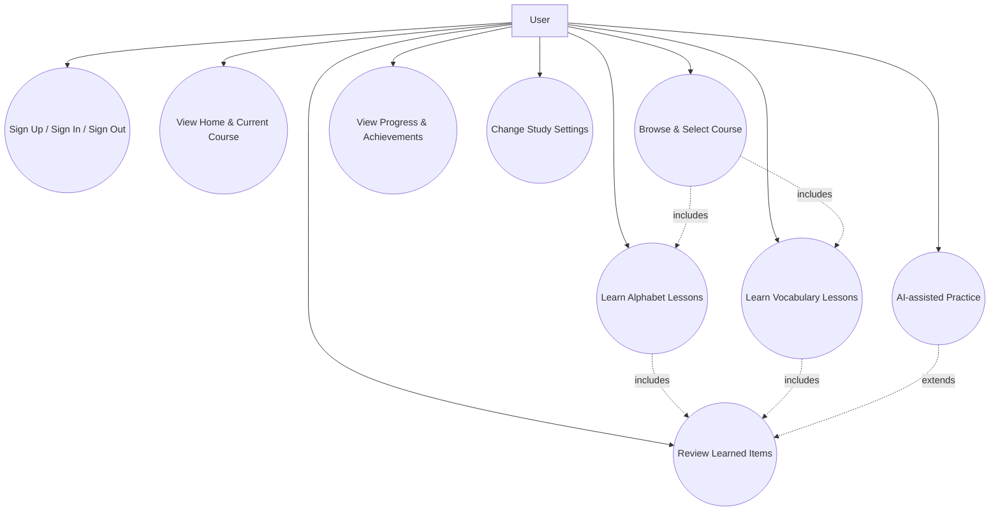

> 以上用例图为本项目唯一的“业务场景集合”。后续如需新增/删除用例，必须首先更新本图，再同步调整对应模块 Spec。

### 2.3 关键用例时序图（按用例分组）

#### 2.3.1 UC_Auth – Sign Up / Sign In / Sign Out

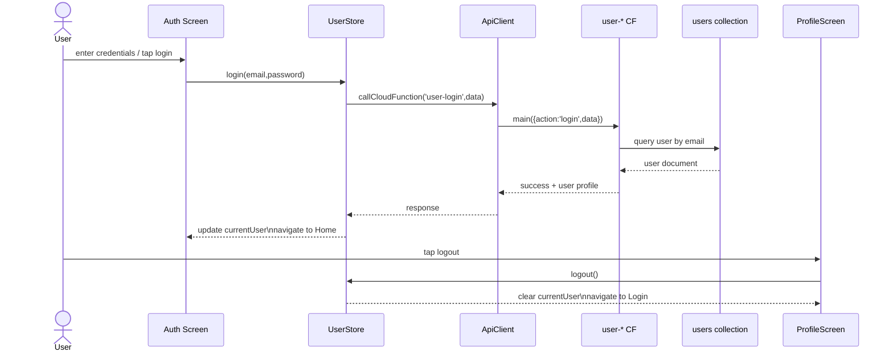

#### 2.3.2 UC_Home – View Home & Current Course

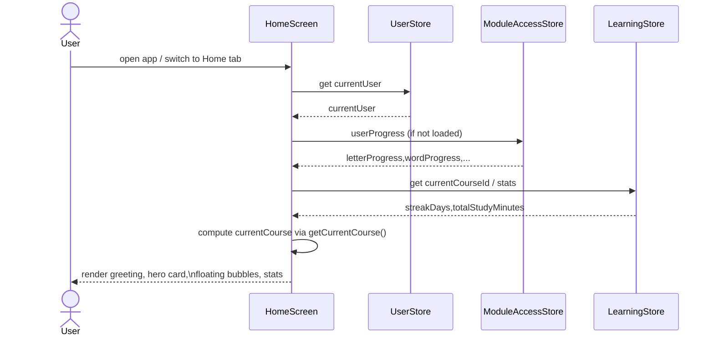

#### 2.3.3 UC_SelectCourse – Browse & Select Course

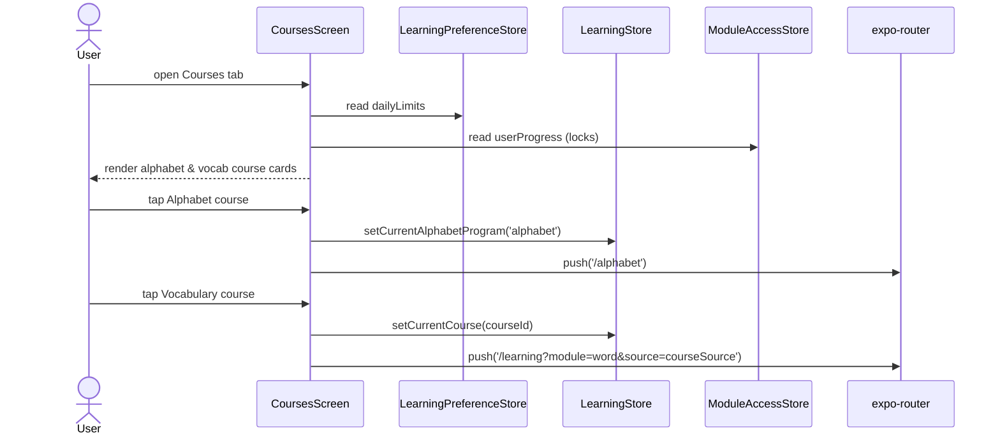

#### 2.3.4 UC_AlphabetLearn – Learn Alphabet Lessons

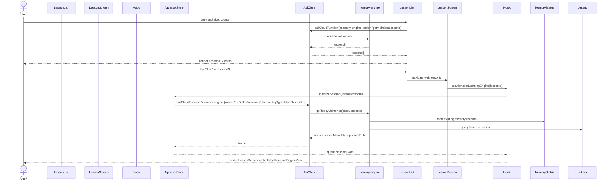

#### 2.3.5 UC_VocabLearn – Learn Vocabulary Lessons

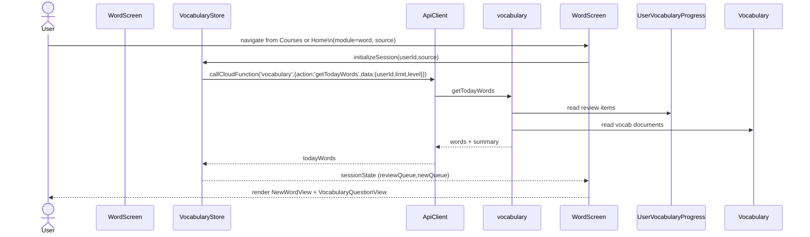

#### 2.3.6 UC_Review – Review Learned Items

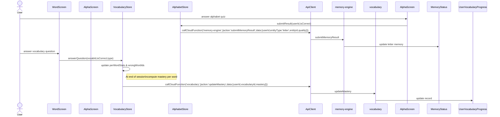

#### 2.3.7 UC_ViewProgress – View Progress & Achievements

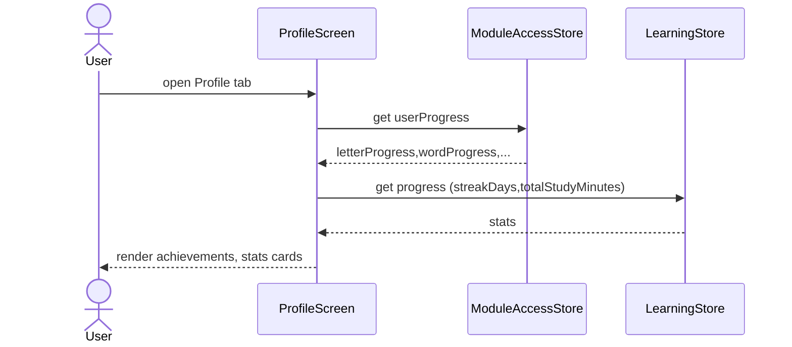

#### 2.3.8 UC_Settings – Change Study Settings

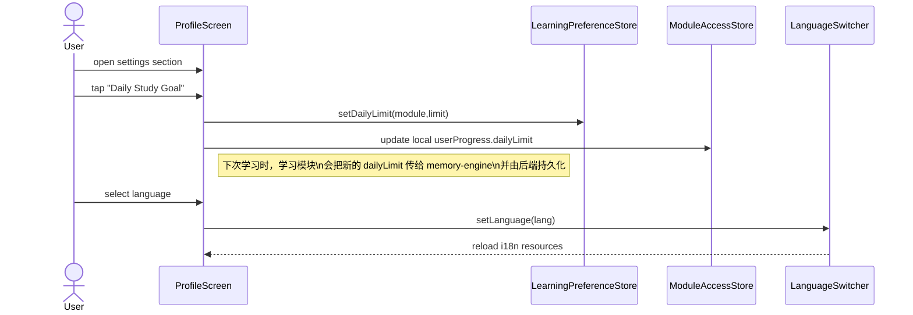

#### 2.3.9 UC_AIPractice – AI-assisted Practice

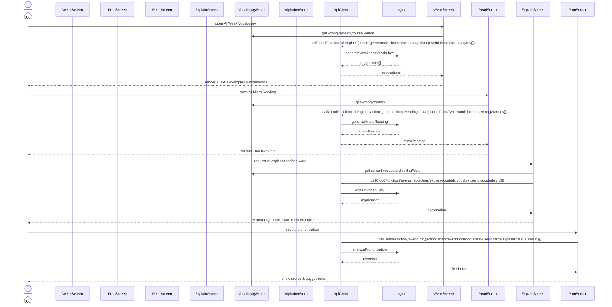

> 旧版项目快照文档（`docs/Document/project-snapshot-*` 等）已删除，任何新需求必须基于以上 Spec 更新。

---

## 3. 当前实现状态概览（按模块）

状态使用：`✅ 完成` / `🟡 部分实现` / `⏳ 规划中`

### 3.1 Alphabet Module

- 路由 & 组件结构：`app/alphabet/*` + `AlphabetLearningEngineView`：🟡 部分实现  
  - 现有实现包含基本“昨日复习 + 今日学习 + Mini Review + 三轮评估”逻辑，但三新一复/Final Review/错题补救尚未完全按 Spec 实装。  
- Store & Hook：`alphabetStore` + `useAlphabetLearningEngine`：🟡 部分实现  
  - 已对接 `memory-engine.getTodayMemories` / `submitMemoryResult` / `submitRoundEvaluation`；  
  - 尚未引入第 11 章定义的本地 `AlphabetSessionState` 聚合评分与会话恢复。  
- Question Engine（6 大题型）：⏳ 规划中  
  - 目前仍使用 `lettersQuestionGenerator` 的多题型函数，未切换到统一 GameType 协议。

### 3.2 Vocabulary Module

- 路由 & 页面：`app/learning/index.tsx` 中的 `WordSession`：🟡 部分实现（使用 mock 队列）  
  - 当前版本使用固定的 `MOCK_OLD_WORDS` / `MOCK_NEW_WORDS` 队列模拟复习与新词；  
  - 尚未接入 `vocabulary` 云函数的 `getTodayWords`，也未使用统一记忆引擎提交分数。  
- Store：`src/stores/vocabularyStore.ts`：🟡 部分实现  
  - 已具备 `initSession` / `submitAnswer` 等接口，但字段和后端新集合结构存在偏差；  
  - 需要按 `vocabulary-module-spec.md` 重构为 `VocabularySessionState` 驱动。  
- 题型体系（4 个选择题 + 2 个拼写题）：⏳ 规划中  
  - 目前没有统一的题型枚举和容器组件，NewWordView / ReviewWordView 主要用于 Web 端原型。

### 3.3 Courses + LearningStore

- Courses 页面：`app/(tabs)/courses.tsx`：✅ 完成（首发需求）  
  - 已能根据 `alphabetCourses.json` 和 `courses.json` 展示课程卡片，并跳转到 `/alphabet` 或 `/learning`；  
  - 支持按 category / 搜索过滤课程。  
- LearningPreferenceStore（每日上限）：✅ 完成  
  - 已可配置 `dailyLimits.word` / `dailyLimits.letter`，并在 `WordSession` / `AlphabetSession` 中使用。  
- LearningStore（全局仪表盘）：🟡 部分实现  
  - 当前 `learningStore` 仍是 demo 型实现，未完全按 spec 的 `currentCourseId` / `streakDays` 等字段重构。  

### 3.4 Backend Memory Engine

- `memory-engine` 云函数：✅ 完成  
  - `getTodayMemories` / `submitMemoryResult` / `submitRoundEvaluation` / `checkModuleAccess` / `getUserProgress` 已上线并被 Alphabet / 部分前端逻辑使用。  
- `learn-vocab` 云函数：✅ 完成（老版词汇 API）  
  - `getTodayWords` / `updateMastery` / `getVocabularyDetail` / `getReviewStatistics` 等已实现；  
  - 将逐步与新的 Vocabulary Module Spec 对齐。

### 3.5 AI Module

- 云函数 `ai-engine`：⏳ 规划中（未创建）  
- 前端入口（页面/按钮）：⏳ 规划中  
- 仅在 Spec 中定义了 Action 和数据结构，不影响首发。

---

## 4. 全局任务列表（按模块顺序，不混合开发）

> 任务状态：`[x] 已完成` / `[~] 进行中` / `[ ] 待做`  
> 开发顺序：**先完成一个模块的核心任务再进入下一个模块**，避免跨模块来回切换。

### 4.1 Phase 0：架构与文档基线（已完成）

- [x] 删除所有旧版项目快照文档（`docs/Document/project-snapshot-*`）。  
- [x] 为 Alphabet / Vocabulary / Courses & LearningStore / Backend / AI 各模块生成冻结 Spec。  
- [x] 抽取统一记忆引擎 + SM‑2 行为到 `backend-memory-engine-spec.md`。  
- [x] 新增项目总纲文档 `PROJECT_OVERVIEW_SPEC.md` 作为顶层入口。  

> 从本阶段结束起，所有设计与实现以 `project-freeze` 下的 Spec + 实际代码为唯一依据。

### 4.2 Phase 1：对齐字母模块与统一记忆引擎（当前优先任务）

> 目标：先彻底把 Alphabet Module 与 `memory-engine` 对齐，保证课程级三轮逻辑 + SM‑2 质量提交流程完全闭环，然后再启动下一个模块。

- [~] A1：校准字母课程解锁逻辑（`alphabet-module-spec.md` 第 10 章）。  
  - 只在 Round3 完成且通过时，调用 `markAlphabetLessonCompleted(lessonId)` 解锁下一课。  
  - 与 `user_alphabet_progress.currentRound` / `roundHistory` 字段保持一致。  
- [ ] A2：实现 `AlphabetSessionState` 与会话恢复（第 11 章）。  
  - 在 `alphabetStore` 中增加 Session 状态结构；  
  - 使用 AsyncStorage 以 `alphabet-session:${userId}:${lessonId}` 为 key 持久化；  
  - 支持在 Yesterday Review / 三新一复 / Final Review / 错题集任意阶段中途退出并恢复。  
- [ ] A3：按“字母 × 轮次 × 当天”聚合质量，并切换到批量 `submitMemoryResult`。  
  - 在 Hook 内维护 `perLetterStats`；  
  - Round 结束或用户点击“结束今天学习”时，构造 `{ results: [{ entityType:'letter', entityId, quality }, ...] }` 调用 memory-engine；  
  - 确认 CloudBase 日志中每个字母每轮最多只产生一次质量记录。  
- [ ] A4：与 `backend-memory-engine-spec.md` 的 `getTodayMemories(letter, lessonId)` 约定对齐。  
  - 课程队列主要由前端构建；  
  - 若仍使用 `getTodayMemories` 初始化队列，需要确保只作为“整课字母 + memoryState”的数据源，而不与前端 Session 队列逻辑冲突。  

> 只有当 A1–A4 完整通过自测并稳定后，才开始 Phase 2。

### 4.3 Phase 2：Alphabet 题型与体验完善

- [ ] B1：实现统一的 Alphabet Question Engine（接口定义见本文件与 `alphabet-module-spec.md` 第 6 章）。  
  - 定义 `GameType / QueueItem` 协议；  
  - 将现有 `lettersQuestionGenerator` 迁移到新协议下。  
- [ ] B2：实现三新一复 + Final Review 的题型编排。  
  - 三新一复：使用轻量题型（听音选字 / 看字选音）；  
  - Final Review：使用逻辑/整合题（拼读数学 / 声调计算等）。  
- [ ] B3：完善错题集与三轮评估展示。  
  - Round 结果页展示每轮正确率与“错误最多的若干字母”；  
  - 为后续 AI 模块提供输入数据。

### 4.4 Phase 3：Vocabulary Module 重构（在 Phase 2 完成后启动）

- [ ] C1：接入 `vocabulary.getTodayWords`，移除 `WordSession` 中的 mock 队列。  
  - `WordSession` 使用 `vocabularyStore.initializeSession` 获取今日复习 + 新词列表。  
- [ ] C2：重构 `vocabularyStore`，实现 `VocabularySessionState` + `perWordStats` + 会话恢复。  
  - 结构与字母模块的 Session 思路对齐，但仍使用 `learn-vocab.updateMastery` 提交结果。  
- [ ] C3：实现 4 种选择题题型容器，并接入 `ReviewWordView`。  
  - 看泰语选中文、看中文选泰语、听音选泰语、听音选中文。  
- [ ] C4（可选）：实现 2 种拼写题，并接入统计。  
- [ ] C5：确定词汇最终使用的记忆后端（`user_vocabulary_progress` vs `memory_status`），并完成到统一来源的迁移。

### 4.5 Phase 4：Courses + LearningStore 收尾

- [x] D0：Courses 页面接入字母/单词课程 JSON 并展示。  
- [ ] D1：LearningStore 重构为轻量仪表盘（`currentCourseId` / `currentAlphabetProgramId` / `streakDays` / `totalStudyMinutes` 等）。  
- [ ] D2：在 Courses 点击课程时更新 LearningStore。  
  - 字母课程：`setCurrentAlphabetProgram('alphabet')`；  
  - 词汇课程：`setCurrentCourse(courseId)`。  
- [ ] D3：首页/个人中心根据 `learningStore` 和 `moduleAccessStore` 展示学习概览（当前在学课程、最近学习时间、学习时长等）。

### 4.6 Phase 5：AI 模块占位与 MVP

- [ ] E1：创建 `ai-engine` 云函数骨架 + API_ENDPOINTS 占位。  
- [ ] E2：在字母/词汇模块中增加“AI 发音练习”入口（仅调用占位接口，返回固定文案）。  
- [ ] E3（可选）：实现发音反馈 MVP（录音 → 上传 → `analyzePronunciation`）。  

---

## 5. 里程碑规划（从现在起约 2 个月）

> 时间估算以“全职开发者”为参考，可根据实际人力调整。

### M1（第 1–2 周）：架构稳定 & Alphabet P0

- 完成事项：
  - [x] 删除旧快照文档，冻结 project-freeze 结构；  
  - [x] 后端 memory-engine / learn-vocab 行为梳理完毕；  
  - [~] 修正 Alphabet 解锁逻辑，使 Round3 通过后才解锁下一课。  
- 输出：
  - 可稳定使用的字母课程流程（即使 Question Engine 尚未完全上线）。

### M2（第 3–4 周）：Alphabet 会话恢复 + Vocabulary 接入后端

- 目标：
  - [ ] 实现 Alphabet `AlphabetSessionState` + 会话恢复 +批量提交；  
  - [ ] 词汇模块接入 `getTodayWords`，移除 mock 队列；  
  - [ ] 初步实现 VocabularySessionState（不含拼写题）。

### M3（第 5–6 周）：题型完善 + LearningStore 重构

- 目标：
  - [ ] Alphabet / Vocabulary 的选择题题型容器稳定；  
  - [ ] LearningStore 重构完成，首页/课程页正确显示当前课程和学习统计；  
  - [ ] 回归测试多模块切换与解锁逻辑。

### M4（视时间而定）：拼写题 + AI 占位

- 目标：
  - [ ] 至少实现一类拼写题（看中文拼写泰语）并接入统计；  
  - [ ] 完成 `ai-engine` 云函数骨架和前端入口（按钮/页面），使后续 AI 能力可以平滑接入。

---

## 6. 开发约定与变更流程

1. **以代码为准，但必须同步更新 Spec：**
   - 所有业务/接口变更必须先在对应模块 Spec 中修改，再更新实现；  
   - 若发现 Spec 与代码不一致，以**当前代码 + 本总纲**为基准修正文档。
2. **禁止新增“第二套逻辑”：**
   - 记忆队列 / 评分 / 模块解锁只能通过统一记忆引擎 + 各模块 Spec 约定的 Store；  
   - 不得在组件内部偷偷添加新的状态或后端集合。
3. **文档位置约定：**
   - 新模块、新云函数的规格必须放在 `docs/project-freeze` 下，并从 `PROJECT_OVERVIEW_SPEC.md` 链接出去。  

本文件与同目录下其他 Spec 一起，构成本项目的“最终冻结蓝图”。  
后续开发人员只需遵守本总纲和各模块 Spec，即可在不破坏整体架构的前提下迭代实现功能。

---

## 7. 项目代码快照（按当前仓库状态）

> 本节仅用于**快速了解当前代码结构与实现范围**，不额外引入新设计。  
> 任何行为定义仍以各模块 Spec + 实际代码为准。

### 7.1 前端目录快照（src/）

- `src/components/`
  - `learning/`
    - `NewWordView.tsx`：Web 风格词汇精讲卡片组件，目前主要用于设计参考，移动端学习暂未完全接入。  
    - `ReviewWordView.tsx`：旧版词汇复习组件，内部仍使用“忘记/模糊/记得”三按钮。  
    - `alphabet/AlphabetLearningView.tsx`：单字母教学卡（展示字形、名称、发音按钮等）。  
    - `alphabet/AlphabetReviewView.tsx`：字母复习组件，调用 `lettersQuestionGenerator` 生成题目。  
  - `courses/AlphabetCourseCard.tsx`：字母大课程卡片；`CourseCard.tsx`：词汇课程卡片。
  - `common/ThaiPatternBackground.tsx`：通用背景装饰。

- `src/stores/`
  - `alphabetStore.ts`：字母学习 Store，维护 `queue / currentAlphabet / completedCount / totalCount`，对接 `memory-engine`。  
  - `vocabularyStore.ts`：词汇 Store，当前实现仍基于旧版 `TodayVocabularyResponse` 和本地进度，需要按 Spec 重构。  
  - `moduleAccessStore.ts`：包装后端 `getUserProgress / checkModuleAccess`，提供模块解锁状态给前端。  
  - `learningPreferenceStore.ts`：每日学习上限设置（字母/单词）。  
  - `learningStore.ts`：旧版全局学习仪表盘，含写死 demo 数据。  
  - `userStore.ts`：登录用户信息。

- `src/hooks/`
  - `useAlphabetLearningEngine.ts`：字母三轮学习业务 Hook，驱动 `AlphabetLearningEngineView`；部分 Phase 与错题补救逻辑尚未完全实现。  
  - 其他业务 Hook（如公用 API 调用等）。

- `src/entities/types/`
  - `alphabet.types.ts`：字母实体类型、学习状态类型等。  
  - `vocabulary.types.ts`：新版词汇类型，与数据库 schema 对齐（包含例句、对话、用法等富字段）。  
  - 其他基础类型定义。

- `src/utils/`
  - `apiClient.ts`：`callCloudFunction` 封装，负责 HTTP 触发器调用。  
  - `lettersQuestionGenerator.ts`：当前字母题目生成器（SOUND_TO_LETTER 等多题型）。  

### 7.2 路由结构快照（app/）

- `app/(tabs)/_layout.tsx`：底部 Tab 导航布局。  
- `app/(tabs)/courses.tsx`：课程总览页，读取 `alphabetCourses.json` + `courses.json`，展示课程卡片。  
- `app/alphabet/index.tsx`：字母课程列表页（当前直接列出 Lesson1~7），点击跳转到 `/alphabet/[lessonId]`。  
- `app/alphabet/[lessonId].tsx`：单课字母学习入口，调用 `useAlphabetLearningEngine(lessonId)`。  
- `app/learning/index.tsx`：
  - 根据 `module` 区分 `WordSession`（词汇）与 `AlphabetSession`（字母）；  
  - 当前 `WordSession` 仍使用硬编码的 `MOCK_OLD_WORDS` / `MOCK_NEW_WORDS` 队列；  
  - `AlphabetSession` 作为旧版字母学习入口存在，后续将以 `/alphabet/*` 结构为主。  
- `app/learning/setup.tsx`：设置每日学习计划页面（字母/单词每日上限）。
- `app/auth/*`：登录、注册等认证页。

### 7.3 云函数与后端快照（cloudbase/functions/）

- `memory-engine/`
  - `index.js`：统一记忆引擎入口，解析 HTTP body，按 `action` 分发。  
  - `handlers/getTodayMemories.js`：基于 `memory_status` + 实体集合生成今日字母/单词/句子队列；支持字母课程的 `lessonId` 模式。  
  - `handlers/submitMemoryResult.js`：支持单条或批量学习结果提交，内部调用 `updateMemoryAfterReview`。  
  - `handlers/submitRoundEvaluation.js`：字母三轮评估结果写入 `user_alphabet_progress`。  
  - `utils/memoryEngine.js`：`getOrCreateMemory` / `updateMemoryAfterReview` / `checkModuleAccess` / `initUserProgress`。  
  - `utils/sm2.js`：优化版 SM‑2 算法实现。  

- `learn-vocab/`
  - `index.js`：词汇专用云函数入口，动作包括 `getTodayWords` / `updateMastery` / `getVocabularyDetail` / `getReviewStatistics` 等。  
  - `handlers/getTodayWords.js`：从 `user_vocabulary_progress` + `vocabulary` 构建今日词汇列表。  
  - `handlers/updateMastery.js`：根据 `mastery` 字段更新词汇 SRS 信息。  

- 其他：
  - `alphabet/`：与字母数据管理相关的辅助云函数（如批量导入等，首发不必依赖）。  
  - `user-*`：用户注册、登录、重置密码、更新信息。  
  - `storage-download` / `shared`：公共工具与文件下载。

### 7.4 数据库结构快照（关键集合）

> 详细字段规范以 `docs/database_schema.md` 为准；  
> 本节只做简要索引，方便从代码快照跳转到数据库文档。

- `letters`（字母/元音/声调表）
  - 结构：见 `database_schema.md` 1.4；  
  - 用途：字母模块课程数据、题目生成。

- `vocabulary`（词汇表）
  - 结构：见 `database_schema.md` 1.2；  
  - 用途：词汇模块学习/复习、富媒体内容（例句、对话、同源词）。

- `memory_status`（统一记忆状态表）
  - 结构：见 `database_schema.md` 1.7；  
  - 用途：统一 SRS 引擎核心记录，Alphabet / Vocabulary 均可使用。

- `user_progress`、`user_alphabet_progress`、`user_vocabulary_progress`
  - 结构：见 `database_schema.md` 1.8–1.9 / 1.3；  
  - 用途：模块解锁、字母三轮评估统计、旧版词汇进度。
  - 关键字段：  
    - `userId`: string；  
    - `letterProgress`: number；`letterCompleted`: boolean；  
    - `completedLessons`: string[]；`masteredLetterCount`: number；`totalLetterCount`: number；  
    - `currentRound`: number；`roundHistory`: Array\<{ lessonId, roundNumber, totalQuestions, correctCount, accuracy, passed, updatedAt }\>；  
    - `createdAt` / `updatedAt`: string。

- `user_vocabulary_progress`（旧版词汇 SRS 状态）
  - 源：`learn-vocab/handlers/getTodayWords.js` / `updateMastery.js`。  
  - 关键字段：  
    - `userId`: string；`vocabularyId`: string | null；  
    - `mastery`: `'UNFAMILIAR' | 'FUZZY' | 'REMEMBERED' | null`；  
    - `skipped`: boolean；  
    - `reviewCount`: number；`lastReviewed`: string | null；`nextReviewDate`: string | null；  
    - `intervalDays`: number；`easinessFactor`: number；  
    - `createdAt` / `updatedAt`: string。

---

本节记录的是当前仓库的**代码结构与实现快照**，用于帮助后续开发者快速建立整体认知。  
如代码结构发生重大调整，请在完成重构后更新本快照以及相关模块 Spec。***
