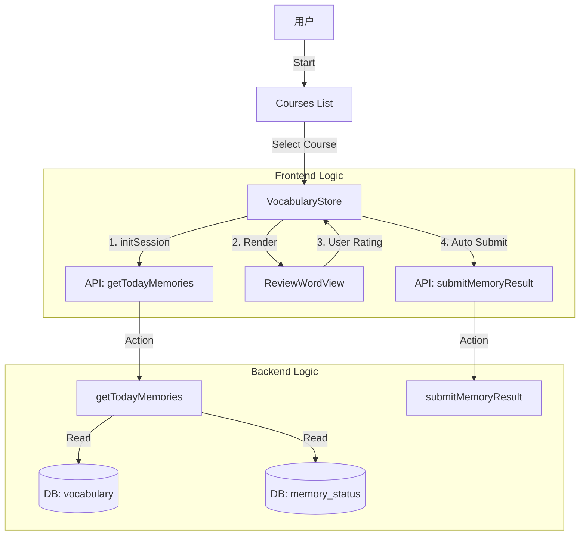

# 词汇模块全链路逻辑梳理 (Vocabulary Module Logic Flow)

本文档根据冻结文档 (`docs/project-freeze/vocabulary-module-spec.md`) 及当前代码实现，从后端到前端梳理整个单词模块的逻辑链路。

> **核心现状**：
> - **后端**：实际由 `memory-engine` 云函数承担所有逻辑（替代了旧的 `learn-vocab`）。
> - **协议**：`src/config/api.endpoints.ts` 将 `MEMORY` 端点指向 `memory-engine`。
> - **差异**：代码实现采用了“单题即时提交”模式，而冻结文档规划的是“会话结束聚合提交”。当前以代码为准。

---

## 1. 总体架构图



---

## 2. 后端逻辑 (cloudbase/functions/memory-engine)

这是整个模块的 **Single Source of Truth**。不做前端计算，只返回“今天该学什么”。

### 2.1 入口与分发 (`index.js`)
- 统一入口，解析 `event.action`。
- 路由分发：
    - `getTodayMemories`: 获取今日队列。
    - `submitMemoryResult`: 提交学习结果。

### 2.2 获取今日任务 (`handlers/getTodayMemories.js`)

**核心流程：**
1.  **防御与鉴权**：
    - 检查 `userId`。
    - `checkModuleAccess`: 检查用户是否有权限学习（如是否欠费、前置课程是否解锁）。
2.  **配额计算 (`limit`)**：
    - `letter` 模式：强制使用 `MAX_LETTER_DAILY_LIMIT`（整课获取）。
    - `word` 模式：优先使用用户设置 (`userProgress.dailyLimit`)，默认 20。
    > **TODO**: 这里的 `limit` 逻辑主要控制 **新词获取量** (Batch Size)。需在前端 `setup.tsx` 中暴露设置项，并在 `initSession` 时正确传入。
3.  **构建复习队列 (Review)**：
    - 调用 `getTodayReviewEntities` (SM-2 算法)。
    - 查询 `memory_status` 表，找出 `nextReviewDate <= today` 的记录。
    - 硬上限：`MAX_REVIEW_LIMIT` (2000)。
4.  **构建新词队列 (New)**：
    - 检查剩余配额 (`limit - reviewCount`? 否，逻辑是 `includeNew` 开关)。
    - **Query**: 从 `vocabulary` 表查询。
    - **Exclude**: 排除 `reviewMemories` 中已存在的 ID。
    - **Filter**: 排除 `user_vocabulary_progress` 中已有的 ID (隐式，因为已有进度就会变成 Review 或 Done)。
    - **Order**: 按 `lessonNumber` 升序。
5.  **队列合并与穿插 (Interleaving)**：
    - **策略**：先复习，后新学。
    - **微复习 (Intra-session)**：对于新词，采用 `3新 : 1复习` 策略。
        - 每 3 个新词 (N1, N2, N3)，立即插入这组的第 1 个 (N1) 作为巩固。
        - 结果序列：`[R1, R2, ...] + [N1, N2, N3, N1(copy), N4...]`。
6.  **数据富化 (Enrichment)**：
    - 拿到所有 IDs。
    - 批量查询 `vocabulary` 集合获取完整字段 (`thaiWord`, `audioPath` 等)。
    - 组装返回 `isNew`, `memoryState` 等元数据。

### 2.3 提交结果 (`handlers/submitMemoryResult.js`)
- **功能**：接收前端对某个单词的自评（忘记/模糊/记得）。
- **流程**：
    - 校验参数。
    - 调用 `updateMemoryAfterReview` (SM-2 核心更新)。
    - 计算下一次复习时间 (`nextReviewAt`)。
    - 更新数据库 `memory_status`。

---

## 3. 前端逻辑 (src/stores/vocabularyStore.ts)

前端主要负责**会话状态管理**和**用户交互**，不负责记忆算法调度。

### 3.1 状态结构 (`VocabularyLearningState`)
- 维护一个 `reviewQueue` (复习队列)。
- 维护 `currentVocabulary` (当前正在学的单词)。
- 维护 `phase` (当前阶段：IDLE, LOADING, LEARNING, COMPLETED)。
- **持久化**：使用 `zustand/persist` + `AsyncStorage` 保存进度，防意外退出。

### 3.2 初始化会话 (`initSession`)
1.  调用 API `MEMORY.GET_TODAY_MEMORIES`。
2.  后端返回 `items`。
3.  前端映射为本地 `VocabularyLearningState` 对象：
    - 初始化 `currentAttempts = 0`。
    - 初始化 `requiredAttempts = 3` (本地完成标准)。
4.  **静默预加载 (Audio Preload)**：
    - 提取所有 `audioPath`。
    - 调用 `downloadAudioBatch` 后台下载音频，确保播放流畅。
5.  进入 `VOCAB_REVIEW` 阶段。

> **TODO / 缺口分析**：
> - **阶段细化**：当前 Store 阶段定义比较粗糙。后续需细化为 `REVIEW_PHASE` 和 `LEARNING_PHASE`，以支持显示不同的 UI（复习用 `ReviewWordView`，新学用 `NewWordView`）。
> - **穿插逻辑**：前端需配合后端的列表顺序，正确在“3新”后插入“1复习”。当前 Demo 逻辑仅是线性播放。

### 3.3 交互与提交 (`submitAnswer`)
> **注意：此处与 Spec 的微小差异**
> Spec 建议“全部学完统一提交”，但代码实现为“学完一个提交一个”，更安全防止数据丢失。

1.  用户点击质量按钮 (Forgot/Unsure/Know)。
2.  更新本地 `attempts` 和 `qualityHistory`。
3.  **判断完成**：如果 `attempts >= 3` (或者根据逻辑一次通过？当前代码 `attempts` 累加逻辑需要看 Config，通常 Review 是一次过)。
    - **⚠️ 待重构**：当前使用 `attempts` 计数是临时方案。
    - **目标逻辑**：应完全移除 Attempts 判定，改为用户点击“记得/模糊/忘记”后，**直接提交** 对应的 Quality Score。
    - **UI 影响**：底部按钮应直接对应 Quality 1-5，而非“再试一次”。
    - **代码逻辑真相**：
        - `submitAnswer` 触发时，若 `currentAttempts >= 3` (或达到条件)，标记 `isCompleted = true`。
        - **立即触发** `apiClient.post(SUBMIT_MEMORY_RESULT)`。
4.  **自动流转**：
    - 调用 `moveToNext()`。
    - 查找队列中下一个 `!isCompleted` 的单词。
    - 如果没有，进入 `VOCAB_COMPLETED`。

---

## 4. 脚手架与配置文件

### 4.1 核心配置 (`src/config/api.endpoints.ts`)
此处定义了前后端“握手”的契约。
- **关键定义**：
  ```typescript
  export const MEMORY_ENDPOINTS = {
    GET_TODAY_MEMORIES: { cloudbase: '/memory-engine', ... }, // 必须指向 memory-engine
    SUBMIT_MEMORY_RESULT: { cloudbase: '/memory-engine', ... }
  };
  ```
- **被弃用的**：`VOCABULARY_ENDPOINTS` (即旧的 `learn-vocab` 函数相关配置) 已注释或标记废弃。

### 4.2 类型定义 (`src/entities/types/vocabulary.types.ts`)
- `Vocabulary` 接口：**必须严格匹配数据库 schema** (字段如 `analysis`, `cognates` 等)。
- `VocabularyLearningState`：前端增加的 UI 状态 (如 `isNew`, `currentAttempts`)。

### 4.3 视图组件 (`components/learning/vocabulary/`)
- `ReviewWordView.tsx`:
    - 负责渲染单词卡片。
    - 处理“模糊遮罩”逻辑。
    - 回调 `onAnswer` 给 Store。
    - 不包含业务逻辑，纯 UI。

---

## 5. 总结：关键链路

1.  **用户进入** -> `vocabularyStore.startCourse` -> `initSession`。
2.  **API 请求** -> `memory-engine` 计算今日 20 个 ID (SM-2 + 新词)。
3.  **数据返回** -> Store 填充队列 -> 触发音频下载。
4.  **用户做题** -> `ReviewWordView` 展示 -> 用户选“记得”。
5.  **提交结果** -> Store 立即调 `submitMemoryResult` -> 后端更新下次复习时间。
6.  **循环** -> 下一个单词 -> 直到队列空 -> `LearningPhase.VOCAB_COMPLETED`。
