This file is a merged representation of the entire codebase, combined into a single document by Repomix.

# File Summary

## Purpose
This file contains a packed representation of the entire repository's contents.
It is designed to be easily consumable by AI systems for analysis, code review,
or other automated processes.

## File Format
The content is organized as follows:
1. This summary section
2. Repository information
3. Directory structure
4. Repository files (if enabled)
5. Multiple file entries, each consisting of:
  a. A header with the file path (## File: path/to/file)
  b. The full contents of the file in a code block

## Usage Guidelines
- This file should be treated as read-only. Any changes should be made to the
  original repository files, not this packed version.
- When processing this file, use the file path to distinguish
  between different files in the repository.
- Be aware that this file may contain sensitive information. Handle it with
  the same level of security as you would the original repository.

## Notes
- Some files may have been excluded based on .gitignore rules and Repomix's configuration
- Binary files are not included in this packed representation. Please refer to the Repository Structure section for a complete list of file paths, including binary files
- Files matching patterns in .gitignore are excluded
- Files matching default ignore patterns are excluded
- Files are sorted by Git change count (files with more changes are at the bottom)

# Directory Structure
```
.claude/
  settings.local.json
app/
  (auth)/
    _layout.tsx
    forgot-password.tsx
    login.tsx
    register.tsx
  (dev)/
    _layout.tsx
    playground.tsx
    viewer.tsx
  (tabs)/
    _layout.tsx
    courses.tsx
    index.tsx
    profile.tsx
  alphabet/
    [lessonId].tsx
    index.tsx
    test.tsx
  learning/
    _layout.tsx
    index.tsx
    setup.tsx
  _layout.tsx
  review-modal.tsx
assets/
  images/
    courses/
      thai_alphabet.png
      ThaiBase_1.png
      ThaiBase_2.png
      ThaiBase_3.png
      ThaiBase_4.png
  adaptive-icon.png
  favicon.png
  icon.png
  splash-icon.png
cloudbase/
  functions/
    alphabet/
      handlers/
        getAllLetters.js
        getLetterTest.js
        passLetterTest.js
        submitLetterTest.js
      utils/
        constants.js
        database.js
        index.js
        memoryEngine.js
        response.js
        sm2.js
        validators.js
      index.js
      package.json
    learn-vocab/
      handlers/
        getReviewStatistics.js
        getSkippedWords.js
        getTodayWords.js
        getVocabularyDetail.js
        getVocabularyList.js
        toggleSkipWord.js
        updateMastery.js
      utils/
        constants.js
        database.js
        index.js
        memoryEngine.js
        response.js
        sm2.js
        validators.js
      index.js
      package.json
    memory-engine/
      config/
        alphabetLessonConfig.js
      handlers/
        checkModuleAccess.js
        getAlphabetLessons.js
        getTodayMemories.js
        getUserProgress.js
        submitMemoryResult.js
        submitRoundEvaluation.js
      utils/
        constants.js
        database.js
        index.js
        memoryEngine.js
        response.js
        sm2.js
        validators.js
      index.js
      package.json
    shared/
      constants.js
      database.js
      index.js
      memoryEngine.js
      package.json
      response.js
      sm2.js
      validators.js
    storage-download/
      index.js
      package.json
    user-login/
      index.js
      package.json
    user-register/
      index.js
      package.json
    user-reset-password/
      index.js
      package.json
    user-update-profile/
      index.js
      package.json
  cloudbaserc.json
  fix-cloud-functions.sh
  package.json
  test-all-apis.sh
  test-comprehensive.sh
docs/
  project-freeze/
    ai-module-spec.md
    alphabet-module-spec.md
    backend-memory-engine-spec.md
    courses-and-learningstore-spec.md
    database_schema.md
    frontend-shell-module-spec.md
    PROJECT_OVERVIEW_SPEC.md
    README.md
    vocabulary-module-spec.md
  PRONUNCIATION_RESTORATION_FROZEN.md
  PRONUNCIATION_RESTORATION_MODULE_SPEC_FROZEN_v1.0.md
scripts/
  getAudioJsonFromWeb.js
  getVocabJsonFromWeb.js
src/
  components/
    common/
      Button.tsx
      Card.tsx
      FloatingBubbles.tsx
      GlassCard.tsx
      LanguageSwitcher.tsx
      ListContainer.tsx
      ThaiPatternBackground.tsx
    courses/
      AlphabetCourseCard.tsx
      CourseCard.tsx
      CourseSelectionModal.tsx
    learning/
      alphabet/
        AlphabetCompletionView.tsx
        AlphabetLearningEngineView.tsx
        AlphabetLearningView.tsx
        AlphabetReviewView.tsx
        AspiratedContrastQuestion.tsx
        MiniReviewQuestion.tsx
        PhonicsRuleCard.tsx
        RoundCompletionView.tsx
        SessionRecoveryCard.tsx
      ModuleLockedScreen.tsx
      NewWordView.tsx
      ReviewWordView.tsx
  config/
    alphabet/
      alphabetQuestionGenerator.ts
      alphabetQuestionTypes.ts
      lessonMetadata.config.ts
      lettersSequence.ts
      phonicsRules.config.ts
    api.endpoints.ts
    backend.config.ts
    constants.ts
  constants/
    colors.ts
    typography.ts
  dev/
    mocks/
      phonicsRule.mock.ts
    registry.ts
  entities/
    enums/
      LearningPhase.enum.ts
      QualityScore.enum.ts
      QuestionType.enum.ts
    types/
      alphabet.types.ts
      alphabetGameTypes.ts
      api.types.ts
      course.ts
      entities.ts
      learning.ts
      letter.types.ts
      memory.types.ts
      phonicsRule.types.ts
      storage.types.ts
      test.types.ts
      user.ts
      vocabulary.types.ts
  hooks/
    useAlphabetLearningEngine.ts
    useModuleAccess.ts
  i18n/
    locales/
      en.ts
      zh.ts
    index.ts
  stores/
    alphabetStore.ts
    languageStore.ts
    learningPreferenceStore.ts
    learningStore.ts
    moduleAccessStore.ts
    moduleAccessStore.ts.backup
    storageStore.ts
    userStore.ts
    vocabularyStore.ts
  utils/
    alphabet/
      audioHelper.ts
      buildAlphabetQueue.ts
    alphabetQuestionTypeAssigner.ts
    apiClient.ts
    lettersDistractorEngine.ts
    lettersQuestionGenerator.ts
    ModuleGuard.tsx
    validation.ts
.gitignore
.nvmrc
.skip-template
app.json
babel.config.js
CLAUDE.md
cloudbaserc.json
convert-json-to-jsonl-but-keep-json.js
global.css
index.ts
package.json
README.md
repomix-output.xml
tailwind.config.js
tsconfig.json
```

# Files

## File: repomix-output.xml
````xml
This file is a merged representation of the entire codebase, combined into a single document by Repomix.

<file_summary>
This section contains a summary of this file.

<purpose>
This file contains a packed representation of the entire repository's contents.
It is designed to be easily consumable by AI systems for analysis, code review,
or other automated processes.
</purpose>

<file_format>
The content is organized as follows:
1. This summary section
2. Repository information
3. Directory structure
4. Repository files (if enabled)
5. Multiple file entries, each consisting of:
  - File path as an attribute
  - Full contents of the file
</file_format>

<usage_guidelines>
- This file should be treated as read-only. Any changes should be made to the
  original repository files, not this packed version.
- When processing this file, use the file path to distinguish
  between different files in the repository.
- Be aware that this file may contain sensitive information. Handle it with
  the same level of security as you would the original repository.
</usage_guidelines>

<notes>
- Some files may have been excluded based on .gitignore rules and Repomix's configuration
- Binary files are not included in this packed representation. Please refer to the Repository Structure section for a complete list of file paths, including binary files
- Files matching patterns in .gitignore are excluded
- Files matching default ignore patterns are excluded
- Files are sorted by Git change count (files with more changes are at the bottom)
</notes>

</file_summary>

<directory_structure>
.claude/
  settings.local.json
app/
  (auth)/
    _layout.tsx
    forgot-password.tsx
    login.tsx
    register.tsx
  (dev)/
    _layout.tsx
    playground.tsx
    viewer.tsx
  (tabs)/
    _layout.tsx
    courses.tsx
    index.tsx
    profile.tsx
  alphabet/
    [lessonId].tsx
    index.tsx
    test.tsx
  learning/
    _layout.tsx
    index.tsx
    setup.tsx
  _layout.tsx
  review-modal.tsx
assets/
  images/
    courses/
      thai_alphabet.png
      ThaiBase_1.png
      ThaiBase_2.png
      ThaiBase_3.png
      ThaiBase_4.png
  adaptive-icon.png
  favicon.png
  icon.png
  splash-icon.png
cloudbase/
  functions/
    alphabet/
      handlers/
        getAllLetters.js
        getLetterTest.js
        passLetterTest.js
        submitLetterTest.js
      utils/
        constants.js
        database.js
        index.js
        memoryEngine.js
        response.js
        sm2.js
        validators.js
      index.js
      package.json
    learn-vocab/
      handlers/
        getReviewStatistics.js
        getSkippedWords.js
        getTodayWords.js
        getVocabularyDetail.js
        getVocabularyList.js
        toggleSkipWord.js
        updateMastery.js
      utils/
        constants.js
        database.js
        index.js
        memoryEngine.js
        response.js
        sm2.js
        validators.js
      index.js
      package.json
    memory-engine/
      config/
        alphabetLessonConfig.js
      handlers/
        checkModuleAccess.js
        getAlphabetLessons.js
        getTodayMemories.js
        getUserProgress.js
        submitMemoryResult.js
        submitRoundEvaluation.js
      utils/
        constants.js
        database.js
        index.js
        memoryEngine.js
        response.js
        sm2.js
        validators.js
      index.js
      package.json
    shared/
      constants.js
      database.js
      index.js
      memoryEngine.js
      package.json
      response.js
      sm2.js
      validators.js
    storage-download/
      index.js
      package.json
    user-login/
      index.js
      package.json
    user-register/
      index.js
      package.json
    user-reset-password/
      index.js
      package.json
    user-update-profile/
      index.js
      package.json
  cloudbaserc.json
  fix-cloud-functions.sh
  package.json
  test-all-apis.sh
  test-comprehensive.sh
docs/
  project-freeze/
    ai-module-spec.md
    alphabet-module-spec.md
    backend-memory-engine-spec.md
    courses-and-learningstore-spec.md
    database_schema.md
    frontend-shell-module-spec.md
    PROJECT_OVERVIEW_SPEC.md
    README.md
    vocabulary-module-spec.md
  PRONUNCIATION_RESTORATION_FROZEN.md
  PRONUNCIATION_RESTORATION_MODULE_SPEC_FROZEN_v1.0.md
scripts/
  getAudioJsonFromWeb.js
  getVocabJsonFromWeb.js
src/
  components/
    common/
      Button.tsx
      Card.tsx
      FloatingBubbles.tsx
      GlassCard.tsx
      LanguageSwitcher.tsx
      ListContainer.tsx
      ThaiPatternBackground.tsx
    courses/
      AlphabetCourseCard.tsx
      CourseCard.tsx
      CourseSelectionModal.tsx
    learning/
      alphabet/
        AlphabetCompletionView.tsx
        AlphabetLearningEngineView.tsx
        AlphabetLearningView.tsx
        AlphabetReviewView.tsx
        AspiratedContrastQuestion.tsx
        MiniReviewQuestion.tsx
        PhonicsRuleCard.tsx
        RoundCompletionView.tsx
        SessionRecoveryCard.tsx
      ModuleLockedScreen.tsx
      NewWordView.tsx
      ReviewWordView.tsx
  config/
    alphabet/
      alphabetQuestionGenerator.ts
      alphabetQuestionTypes.ts
      lessonMetadata.config.ts
      lettersSequence.ts
      phonicsRules.config.ts
    api.endpoints.ts
    backend.config.ts
    constants.ts
  constants/
    colors.ts
    typography.ts
  dev/
    mocks/
      phonicsRule.mock.ts
    registry.ts
  entities/
    enums/
      LearningPhase.enum.ts
      QualityScore.enum.ts
      QuestionType.enum.ts
    types/
      alphabet.types.ts
      alphabetGameTypes.ts
      api.types.ts
      course.ts
      entities.ts
      learning.ts
      letter.types.ts
      memory.types.ts
      phonicsRule.types.ts
      storage.types.ts
      test.types.ts
      user.ts
      vocabulary.types.ts
  hooks/
    useAlphabetLearningEngine.ts
    useModuleAccess.ts
  i18n/
    locales/
      en.ts
      zh.ts
    index.ts
  stores/
    alphabetStore.ts
    languageStore.ts
    learningPreferenceStore.ts
    learningStore.ts
    moduleAccessStore.ts
    moduleAccessStore.ts.backup
    storageStore.ts
    userStore.ts
    vocabularyStore.ts
  utils/
    alphabet/
      audioHelper.ts
      buildAlphabetQueue.ts
    alphabetQuestionTypeAssigner.ts
    apiClient.ts
    lettersDistractorEngine.ts
    lettersQuestionGenerator.ts
    ModuleGuard.tsx
    validation.ts
.gitignore
.nvmrc
.skip-template
app.json
babel.config.js
CLAUDE.md
cloudbaserc.json
convert-json-to-jsonl-but-keep-json.js
global.css
index.ts
package.json
README.md
tailwind.config.js
tsconfig.json
</directory_structure>

<files>
This section contains the contents of the repository's files.

<file path="app/(dev)/_layout.tsx">
import { Stack } from 'expo-router';
import React from 'react';
import { View, Text } from 'react-native';

export default function DevLayout() {
    // 🛡️ 核心安全网：生产环境直接返回 null，确保路由不可达
    if (!__DEV__) {
        return null;
    }

    return (
        <Stack
            screenOptions={{
                headerStyle: {
                    backgroundColor: '#F5F5F5',
                },
                headerTintColor: '#333',
                headerTitleStyle: {
                    fontWeight: 'bold',
                },
            }}
        >
            <Stack.Screen
                name="playground"
                options={{
                    title: '🛠️ Playground',
                    headerLargeTitle: true,
                }}
            />
            <Stack.Screen
                name="viewer"
                options={{
                    title: 'Component Viewer',
                    presentation: 'modal', // 模态展示感觉更像独立的 Debug 环境
                }}
            />
        </Stack>
    );
}
</file>

<file path="app/(dev)/playground.tsx">
import React from 'react';
import { View, Text, StyleSheet, ScrollView, TouchableOpacity } from 'react-native';
import { useRouter } from 'expo-router';
import { COMPONENT_REGISTRY } from '@/src/dev/registry';
import { Colors } from '@/src/constants/colors';
import { Typography } from '@/src/constants/typography';
import { ChevronRight, FlaskConical, ChevronLeft } from 'lucide-react-native';

export default function PlaygroundScreen() {
    const router = useRouter();

    if (!__DEV__) return null;

    return (
        <ScrollView style={styles.container} contentContainerStyle={styles.content}>
            <View style={styles.header}>
                <View style={{ flexDirection: 'row', alignItems: 'center', marginBottom: 12 }}>
                    <TouchableOpacity
                        onPress={() => router.back()}
                        style={{ marginRight: 12, padding: 4 }}
                    >
                        <ChevronLeft size={24} color={Colors.ink} />
                    </TouchableOpacity>
                    <Text style={{ fontFamily: Typography.notoSerifBold, fontSize: 24, color: Colors.ink }}>
                        Dev Playground
                    </Text>
                </View>
                <Text style={styles.description}>
                    UI 组件隔离开发环境。此处列出的组件使用 Mock 数据独立运行，不触发真实业务逻辑。
                </Text>
            </View>

            {COMPONENT_REGISTRY.map((component) => (
                <View key={component.id} style={styles.section}>
                    <View style={styles.sectionHeader}>
                        <Text style={styles.sectionTitle}>{component.name}</Text>
                        <Text style={styles.categoryBadge}>{component.category}</Text>
                    </View>

                    <View style={styles.card}>
                        {component.variants.map((variant, index) => (
                            <TouchableOpacity
                                key={variant.id}
                                style={[
                                    styles.item,
                                    index < component.variants.length - 1 && styles.borderBottom,
                                ]}
                                onPress={() => {
                                    router.push({
                                        pathname: '/(dev)/viewer',
                                        params: {
                                            componentId: component.id,
                                            variantId: variant.id,
                                            mockId: variant.mockId,
                                        },
                                    });
                                }}
                            >
                                <View style={styles.itemIcon}>
                                    <FlaskConical size={16} color={Colors.thaiGold} />
                                </View>
                                <Text style={styles.itemText}>{variant.name}</Text>
                                <ChevronRight size={16} color={Colors.taupe} />
                            </TouchableOpacity>
                        ))}
                    </View>
                </View>
            ))}
        </ScrollView>
    );
}

const styles = StyleSheet.create({
    container: {
        flex: 1,
        backgroundColor: '#F2F2F7', // iOS Grouped Background color
    },
    content: {
        padding: 16,
        paddingBottom: 40,
    },
    header: {
        marginBottom: 24,
    },
    description: {
        fontFamily: Typography.notoSerifRegular,
        fontSize: 14,
        color: Colors.taupe,
        lineHeight: 20,
    },
    section: {
        marginBottom: 24,
    },
    sectionHeader: {
        flexDirection: 'row',
        alignItems: 'center',
        marginBottom: 8,
        paddingHorizontal: 4,
        justifyContent: 'space-between',
    },
    sectionTitle: {
        fontFamily: Typography.notoSerifBold,
        fontSize: 13,
        color: '#666',
        textTransform: 'uppercase',
    },
    categoryBadge: {
        fontSize: 10,
        color: Colors.white,
        backgroundColor: Colors.taupe,
        paddingHorizontal: 6,
        paddingVertical: 2,
        borderRadius: 4,
        overflow: 'hidden',
    },
    card: {
        backgroundColor: Colors.white,
        borderRadius: 10,
        overflow: 'hidden',
    },
    item: {
        flexDirection: 'row',
        alignItems: 'center',
        padding: 16,
        backgroundColor: Colors.white,
    },
    borderBottom: {
        borderBottomWidth: StyleSheet.hairlineWidth,
        borderBottomColor: '#C6C6C8',
        marginLeft: 16, // iOS style separator inset
    },
    itemIcon: {
        marginRight: 12,
    },
    itemText: {
        flex: 1,
        fontFamily: Typography.notoSerifRegular,
        fontSize: 16,
        color: Colors.ink,
    },
});
</file>

<file path="app/(dev)/viewer.tsx">
import React from 'react';
import { View, Text, StyleSheet, SafeAreaView, ScrollView } from 'react-native';
import { useLocalSearchParams } from 'expo-router';
import { Colors } from '@/src/constants/colors';
import { Typography } from '@/src/constants/typography';

// Components
import { PhonicsRuleCard } from '@/src/components/learning/alphabet/PhonicsRuleCard';

// Mocks
import { MOCK_PHONICS_RULES } from '@/src/dev/mocks/phonicsRule.mock';

export default function ComponentViewer() {
    const { componentId, variantId, mockId } = useLocalSearchParams<{
        componentId: string;
        variantId: string;
        mockId: string;
    }>();

    if (!__DEV__) return null;

    const renderContent = () => {
        switch (componentId) {
            case 'PhonicsRuleCard': {
                const rule = MOCK_PHONICS_RULES[mockId];
                if (!rule) return <ErrorState message={`Mock ID not found: ${mockId}`} />;

                return (
                    <PhonicsRuleCard
                        rule={rule}
                        onComplete={() => console.log('✅ [Dev] onComplete triggered')}
                        showCloseButton={true}
                        onClose={() => console.log('❌ [Dev] onClose triggered')}
                    />
                );
            }
            default:
                return <ErrorState message={`Component ID not found: ${componentId}`} />;
        }
    };

    return (
        <View style={styles.container}>
            {/* 居中容器，模拟 Modal 效果 */}
            <View style={styles.stage}>
                {renderContent()}
            </View>

            <View style={styles.debugPanel}>
                <Text style={styles.debugText}>Component: {componentId}</Text>
                <Text style={styles.debugText}>Variant: {variantId}</Text>
                <Text style={styles.debugText}>Mock Data: {mockId}</Text>
            </View>
        </View>
    );
}

function ErrorState({ message }: { message: string }) {
    return (
        <View style={styles.errorContainer}>
            <Text style={styles.errorText}>{message}</Text>
        </View>
    );
}

const styles = StyleSheet.create({
    container: {
        flex: 1,
        backgroundColor: '#333', // 深色背景突出组件
    },
    stage: {
        flex: 1,
        justifyContent: 'center',
        alignItems: 'center',
    },
    debugPanel: {
        backgroundColor: '#000',
        padding: 12,
        borderTopWidth: 1,
        borderTopColor: '#444',
    },
    debugText: {
        color: '#0F0',
        fontFamily: 'Menlo',
        fontSize: 12,
        marginBottom: 4,
    },
    errorContainer: {
        padding: 20,
        backgroundColor: Colors.error,
        borderRadius: 8,
    },
    errorText: {
        color: Colors.white,
        fontFamily: Typography.notoSerifBold,
    },
});
</file>

<file path="app/learning/_layout.tsx">
import { Stack } from "expo-router";

export default function LearningLayout() {
  return (
    <Stack screenOptions={{ headerShown: false }} />
  );
}
</file>

<file path="cloudbase/functions/alphabet/handlers/getAllLetters.js">
// ✅ 获取所有字母（用于前端生成测试题）
const { createResponse } = require('../utils/response');

/**
 * 获取所有字母数据
 * @param {Object} db - 数据库实例
 * @returns {Promise} 返回所有字母数据
 */
async function getAllLetters(db) {
    try {
        // 从 letters 集合获取所有字母
        const res = await db.collection('letters')
            .limit(1000) // 设置一个足够大的限制（字母总数约 80 个）
            .get();

        return createResponse(true, {
            total: res.data.length,
            letters: res.data
        }, '获取字母成功');
    } catch (error) {
        console.error('[getAllLetters] 查询失败:', error);
        return createResponse(false, null, '获取字母失败', 'DB_ERROR');
    }
}

module.exports = getAllLetters;
</file>

<file path="cloudbase/functions/alphabet/utils/database.js">
const cloud = require('wx-server-sdk');

cloud.init({
    env: cloud.DYNAMIC_CURRENT_ENV
});

const db = cloud.database();
const _ = db.command;

const collections = {
    users: db.collection('users'),
    vocabulary: db.collection('vocabulary'),
    letters: db.collection('letters'),
    sentences: db.collection('sentences'),
    memory_status: db.collection('memory_status'),
    user_progress: db.collection('user_progress'),
    user_vocabulary_progress: db.collection('user_vocabulary_progress')
};

module.exports = {
    db,
    _,
    userCollection: collections.users,
    vocabularyCollection: collections.vocabulary,
    letterCollection: collections.letters,
    sentenceCollection: collections.sentences,
    memoryStatusCollection: collections.memory_status,
    userProgressCollection: collections.user_progress,
    progressCollection: collections.user_vocabulary_progress,
    collections
};
</file>

<file path="cloudbase/functions/alphabet/utils/index.js">
/**
 * Shared Utilities Package Entry Point
 * 
 * 统一导出所有共享模块
 * 使用方式: const { response, constants, sm2 } = require('@thai-app/shared');
 */

'use strict';

module.exports = {
    // 响应格式化模块
    response: require('./response'),

    // 常量定义模块
    constants: require('./constants'),

    // SM-2 算法模块
    sm2: require('./sm2'),

    // 参数验证模块
    validators: require('./validators'),

    // 统一记忆引擎模块
    memoryEngine: require('./memoryEngine'),

    // 数据库连接模块
    database: require('./database')
};
</file>

<file path="cloudbase/functions/alphabet/utils/sm2.js">
/**
 * SM-2 间隔重复算法模块（优化版）
 * 
 * 基于艾宾浩斯遗忘曲线优化:
 * - 早期复习间隔更密集: 1→2→4→7→14 天
 * - "模糊"状态缩短间隔而非维持不变
 * - "陌生"状态重置复习进度
 * 
 * 算法论文: https://www.supermemo.com/en/archives1990-2015/english/ol/sm2
 */

'use strict';

const { MasteryLevel, SM2_PARAMS, EARLY_INTERVALS } = require('./constants');

/**
 * 将掌握程度映射到 SM-2 Quality 值
 * 
 * SM-2 Quality 定义:
 * 0 - 完全不记得
 * 1 - 错误回答，但看到正确答案后想起
 * 2 - 错误回答，正确答案看起来很熟悉
 * 3 - 正确回答，但困难较大
 * 4 - 正确回答，有些犹豫
 * 5 - 正确回答，毫无困难
 * 
 * @param {string} mastery - 掌握程度
 * @returns {number} Quality值 (1-5)
 */
function masteryToQuality(mastery) {
    switch (mastery) {
        case MasteryLevel.UNFAMILIAR:
            return 1;  // 完全不记得
        case MasteryLevel.FUZZY:
            return 3;  // 有印象但不确定
        case MasteryLevel.REMEMBERED:
            return 5;  // 完全记得
        default:
            return 1;
    }
}

/**
 * 计算下次复习日期（优化版 SM-2 算法）
 * 
 * 改进点:
 * 1. 早期阶段（前5次）使用固定的渐进间隔 [1,2,4,7,14]
 * 2. "模糊"时缩短间隔而非维持不变
 * 3. "陌生"时完全重置复习进度
 * 
 * @param {string} mastery - 掌握程度: 忘记/模糊/认识
 * @param {number} currentInterval - 当前复习间隔（天）
 * @param {number} easinessFactor - 简易度因子（1.3-2.5+）
 * @param {number} reviewCount - 已复习次数
 * @returns {Object} 算法计算结果
 * 
 * @example
 * const result = calculateSM2Optimized('认识', 2, 2.5, 1);
 * // {
 * //   nextInterval: 4,
 * //   nextEasinessFactor: 2.6,
 * //   nextReviewDate: "2025-12-01T10:00:00Z",
 * //   shouldResetCount: false
 * // }
 * */
function calculateSM2Optimized(
    mastery,
    currentInterval = 1,
    easinessFactor = SM2_PARAMS.INITIAL_EASINESS_FACTOR,
    reviewCount = 0
) {
    let nextInterval = currentInterval;
    let nextEF = easinessFactor;
    let shouldResetCount = false;

    const quality = masteryToQuality(mastery);

    // ==================== 核心算法逻辑 ====================

    if (quality < 3) {
        // ========== 忘记: 完全重置 ==========
        // 用户完全不记得，需要从头开始学习
        nextInterval = 1;
        nextEF = Math.max(SM2_PARAMS.MIN_EASINESS_FACTOR, nextEF - 0.2);
        shouldResetCount = true;

    } else if (quality === 3) {
        // ========== 模糊: 缩短间隔，加强复习 ==========
        // 改进: 不是维持不变，而是缩短20%
        nextInterval = Math.max(1, Math.round(currentInterval * SM2_PARAMS.FUZZY_MULTIPLIER));
        nextEF = Math.max(SM2_PARAMS.MIN_EASINESS_FACTOR, nextEF - 0.1);

    } else {
        // ========== 记得: 使用优化的间隔序列 ==========
        if (reviewCount < EARLY_INTERVALS.length) {
            // 早期阶段: 使用预定义的渐进间隔
            // 这是关键改进: 1→2→4→7→14 而非原版的 1→6
            nextInterval = EARLY_INTERVALS[reviewCount];
        } else {
            // 后期阶段: 使用 EF 计算指数增长
            nextInterval = Math.round(currentInterval * nextEF);
        }

        // 提高简易度 (标准 SM-2 公式)
        nextEF = nextEF + (0.1 - (5 - quality) * (0.08 + (5 - quality) * 0.02));
        nextEF = Math.max(SM2_PARAMS.MIN_EASINESS_FACTOR, nextEF);
    }

    // 限制最大间隔
    nextInterval = Math.min(nextInterval, SM2_PARAMS.MAX_INTERVAL_DAYS);

    // 计算下次复习日期
    const nextReviewDate = new Date();
    nextReviewDate.setDate(nextReviewDate.getDate() + nextInterval);

    // 计算新的复习次数
    const newRepetitions = shouldResetCount ? 0 : reviewCount + 1;

    return {
        // === 兼容 memoryEngine.js 的旧接口 ===
        interval: nextInterval,
        easinessFactor: parseFloat(nextEF.toFixed(2)),
        repetitions: newRepetitions,

        // === 新接口（保留供未来使用）===
        nextInterval,
        nextEasinessFactor: parseFloat(nextEF.toFixed(2)),
        nextReviewDate: nextReviewDate.toISOString(),
        shouldResetCount,
    };
}

/**
 * 生成预计复习时间线
 * 
 * 用于前端展示未来的复习计划
 * 
 * @param {number} currentReviewCount - 当前复习次数
 * @param {number} maxItems - 返回的时间线项数 (默认5)
 * @returns {Array} 未来复习计划
 * 
 * @example
 * generateReviewTimeline(2);
 * // [
 * //   { reviewNumber: 3, intervalDays: 4 },
 * //   { reviewNumber: 4, intervalDays: 7 },
 * //   { reviewNumber: 5, intervalDays: 14 },
 * //   ...
 * // ]
 */
function generateReviewTimeline(currentReviewCount, maxItems = 5) {
    const timeline = [];
    let interval = 1;
    let ef = SM2_PARAMS.INITIAL_EASINESS_FACTOR;

    for (let i = currentReviewCount; i < currentReviewCount + maxItems; i++) {
        if (i < EARLY_INTERVALS.length) {
            interval = EARLY_INTERVALS[i];
        } else {
            interval = Math.round(interval * ef);
        }
        interval = Math.min(interval, SM2_PARAMS.MAX_INTERVAL_DAYS);

        timeline.push({
            reviewNumber: i + 1,
            intervalDays: interval,
        });
    }

    return timeline;
}

/**
 * 获取今天的时间范围 (UTC)
 * 
 * @returns {Object} { startOfDay, endOfDay, timestamp }
 */
function getTodayRange() {
    const now = new Date();
    const startOfDay = new Date(Date.UTC(
        now.getUTCFullYear(),
        now.getUTCMonth(),
        now.getUTCDate(),
        0, 0, 0, 0
    ));
    const endOfDay = new Date(Date.UTC(
        now.getUTCFullYear(),
        now.getUTCMonth(),
        now.getUTCDate() + 1,
        0, 0, 0, 0
    ));

    return {
        startOfDay: startOfDay.toISOString(),
        endOfDay: endOfDay.toISOString(),
        timestamp: now.toISOString(),
    };
}

/**
 * 获取算法信息 (用于前端展示)
 * 
 * @returns {Object} 算法元信息
 */
function getAlgorithmInfo() {
    return {
        name: 'Optimized SM-2',
        version: '1.1.0',
        earlyIntervals: EARLY_INTERVALS,
        maxInterval: SM2_PARAMS.MAX_INTERVAL_DAYS,
        description: '基于艾宾浩斯遗忘曲线优化的间隔重复算法',
    };
}

module.exports = {
    calculateSM2Optimized,
    generateReviewTimeline,
    getTodayRange,
    getAlgorithmInfo,
    masteryToQuality,
};
</file>

<file path="cloudbase/functions/alphabet/utils/validators.js">
/**
 * 参数验证模块
 * 
 * 用户、词汇验证及通用验证工具
 */

'use strict';

const { userCollection, vocabularyCollection } = require('./database');
const { MasteryLevel } = require('./constants');

/**
 * 验证用户是否存在
 * 
 * @param {string} userId - 用户ID
 * @returns {Promise<Object|null>} 用户对象或 null
 */
async function validateUser(userId) {
    if (!userId || typeof userId !== 'string') {
        return null;
    }

    try {
        const { data } = await userCollection
            .where({ userId })
            .limit(1)
            .get();

        return data.length > 0 ? data[0] : null;
    } catch (error) {
        console.error('[validateUser] Error:', error);
        return null;
    }
}

/**
 * 验证词汇是否存在
 * 
 * @param {string} vocabularyId - 词汇ID
 * @returns {Promise<Object|null>} 词汇对象或 null
 */
async function validateVocabulary(vocabularyId) {
    if (!vocabularyId || typeof vocabularyId !== 'string') {
        return null;
    }

    try {
        const { data } = await vocabularyCollection
            .where({ vocabularyId })
            .limit(1)
            .get();

        return data.length > 0 ? data[0] : null;
    } catch (error) {
        console.error('[validateVocabulary] Error:', error);
        return null;
    }
}

/**
 * 验证掌握程度是否有效
 * 
 * @param {string} mastery - 掌握程度
 * @returns {boolean} 是否有效
 */
function isValidMastery(mastery) {
    const validValues = Object.values(MasteryLevel);
    return validValues.includes(mastery);
}

/**
 * 验证并规范化分页参数
 * 
 * @param {number} limit - 限制数量
 * @param {number} offset - 偏移量
 * @param {number} maxLimit - 最大限制 (默认100)
 * @returns {Object} 验证后的分页参数
 */
function validatePagination(limit, offset, maxLimit = 100) {
    return {
        limit: Math.min(Math.max(1, parseInt(limit) || 20), maxLimit),
        offset: Math.max(0, parseInt(offset) || 0),
    };
}

/**
 * 验证必填字符串参数
 * 
 * @param {string} value - 参数值
 * @param {string} name - 参数名 (用于错误消息)
 * @returns {Object} { valid: boolean, error?: string }
 */
function validateRequiredString(value, name) {
    if (!value || typeof value !== 'string' || value.trim() === '') {
        return {
            valid: false,
            error: `${name} 是必填参数且不能为空`,
        };
    }
    return { valid: true };
}

/**
 * 验证布尔参数
 * 
 * @param {any} value - 参数值
 * @param {string} name - 参数名
 * @returns {Object} { valid: boolean, error?: string }
 */
function validateBoolean(value, name) {
    if (typeof value !== 'boolean') {
        return {
            valid: false,
            error: `${name} 必须是布尔值`,
        };
    }
    return { valid: true };
}
/**
 * 通用参数验证函数
 * 
 * @param {Object} params - 需要验证的参数对象
 * @param {Array<string>} requiredFields - 必需字段列表
 * @returns {Object} { isValid: boolean, message?: string }
 */
function validateParams(params, requiredFields) {
    const missing = [];

    for (const field of requiredFields) {
        if (params[field] === undefined || params[field] === null || params[field] === '') {
            missing.push(field);
        }
    }

    if (missing.length > 0) {
        return {
            isValid: false,
            message: `缺少必填参数: ${missing.join(', ')}`
        };
    }

    return { isValid: true };
}

module.exports = {
    validateUser,
    validateVocabulary,
    isValidMastery,
    validatePagination,
    validateRequiredString,
    validateBoolean,
    validateParams,
};
</file>

<file path="cloudbase/functions/learn-vocab/utils/index.js">
/**
 * Shared Utilities Package Entry Point
 * 
 * 统一导出所有共享模块
 * 使用方式: const { response, constants, sm2 } = require('@thai-app/shared');
 */

'use strict';

module.exports = {
    // 响应格式化模块
    response: require('./response'),

    // 常量定义模块
    constants: require('./constants'),

    // SM-2 算法模块
    sm2: require('./sm2'),

    // 参数验证模块
    validators: require('./validators'),

    // 统一记忆引擎模块
    memoryEngine: require('./memoryEngine'),

    // 数据库连接模块
    database: require('./database')
};
</file>

<file path="cloudbase/functions/memory-engine/config/alphabetLessonConfig.js">
'use strict';

/**
 * Alphabet lesson & phonics rule config for backend.
 *
 * 注意：
 * - LESSON_METADATA / PHONICS_RULES 作为本地 fallback；
 * - 优先从 DB 集合 alphabet_lessons / phonics_rules 中读取，
 *   读不到或出错时再退回本地常量，避免前后端数据漂移。
 */

// ==================== Lesson Metadata (7 课) - 本地备份 ====================

const LESSON_METADATA = {
  lesson1: {
    lessonId: 'lesson1',
    title: '第一课:基础拼读能力',
    description: '掌握最基础的中辅音和常见元音,建立CV拼读概念',
    consonants: ['ก', 'ด', 'ต', 'น', 'ม'],
    vowels: ['า', 'ะ', 'ิ'],
    tones: [],
    phonicsRuleId: 'rule_1_cv_structure',
    totalCount: 8,
    minPassRate: 0.95,
    miniReviewInterval: 3,
    order: 1,
  },

  lesson2: {
    lessonId: 'lesson2',
    title: '第二课:前置元音系统',
    description: '学习前置元音(เ แ โ)和更多高频辅音',
    consonants: ['บ', 'ป', 'ร', 'ล', 'ว', 'ย'],
    vowels: ['เ', 'แ', 'โ', 'อ'],
    tones: [],
    phonicsRuleId: 'rule_2_leading_vowel',
    totalCount: 10,
    minPassRate: 0.9,
    miniReviewInterval: 3,
    order: 2,
  },

  lesson3: {
    lessonId: 'lesson3',
    title: '第三课:声调入门',
    description: '掌握送气/不送气对比,引入基础声调系统',
    consonants: ['ข', 'ถ', 'ผ', 'ส', 'ห'],
    vowels: ['ะ', 'ุ', 'ู'],
    tones: ['่', '้'],
    phonicsRuleId: 'rule_3_tone_basics',
    totalCount: 10,
    minPassRate: 0.9,
    miniReviewInterval: 3,
    order: 3,
  },

  lesson4: {
    lessonId: 'lesson4',
    title: '第四课:辅音类与声调',
    description: '理解高/中/低辅音对声调的影响,掌握完整声调系统',
    consonants: ['ค', 'ท', 'พ', 'ช', 'จ', 'ง'],
    vowels: ['ไ', 'ใ', 'เอา', 'อำ'],
    tones: ['๊', '๋'],
    phonicsRuleId: 'rule_4_consonant_class_tones',
    totalCount: 12,
    minPassRate: 0.85,
    miniReviewInterval: 3,
    order: 4,
  },

  lesson5: {
    lessonId: 'lesson5',
    title: '第五课:复合元音系统',
    description: '掌握三合元音(เอีย เอือ อัว)等复杂元音组合',
    consonants: ['ซ', 'ฉ', 'ฝ', 'ฟ', 'ศ', 'ษ', 'ฮ', 'อ'],
    vowels: ['เอีย', 'เอือ', 'อัว', 'เออ', 'ื', 'ึ'],
    tones: [],
    phonicsRuleId: 'rule_5_compound_vowels',
    totalCount: 14,
    minPassRate: 0.85,
    miniReviewInterval: 3,
    order: 5,
  },

  lesson6: {
    lessonId: 'lesson6',
    title: '第六课:完整覆盖(常用进阶)',
    description: '补充常用进阶辅音与复合元音,掌握特殊规则(如 ห นำ 等)',
    consonants: ['ฑ', 'ฒ', 'ณ', 'ภ', 'ธ', 'ฌ', 'ญ', 'ฬ', 'ฎ', 'ฏ', 'ฐ'],
    vowels: ['อาย', 'อุย', 'เอย', 'โอย', 'ออย'],
    tones: [],
    phonicsRuleId: 'rule_6_special_cases',
    totalCount: 19,
    minPassRate: 0.9,
    miniReviewInterval: 4,
    order: 6,
  },

  lesson7: {
    lessonId: 'lesson7',
    title: '第七课:罕用字母与特殊元音',
    description: '集中学习现代泰语中较少使用的辅音与复杂元音,用于阅读古文与特殊专有名词',
    consonants: ['ฃ', 'ฅ'],
    vowels: ['ฤ', 'ฤๅ', 'ฦ', 'ฦๅ', 'แอะ', 'โอะ', 'เอะ', 'เอาะ'],
    tones: [],
    phonicsRuleId: 'rule_6_special_cases',
    totalCount: 10,
    minPassRate: 0.8,
    miniReviewInterval: 4,
    order: 7,
  },
};

// ==================== Phonics Rules (6 条) - 本地备份 ====================

const PHONICS_RULES = {
  rule_1_cv_structure: {
    id: 'rule_1_cv_structure',
    lessonId: 'lesson1',
    title: '拼读规则 1: 辅音+元音',
    content: [
      '✅ 泰语音节 = 辅音(C) + 元音(V)',
      '✅ 元音可在辅音前/后/上/下',
      '✅ 例: ก + า = กา [ka:] (乌鸦)',
      '',
      '🎯 记忆口诀: 先读辅音,再读元音',
    ],
    interactiveExample: {
      consonant: 'ก',
      vowel: 'า',
      syllable: 'กา',
      pronunciation: 'ka:',
      audioUrl:
        'https://636c-cloud1-1gjcyrdd7ab927c6-1387301748.tcb.qcloud.la/alphabet/word-ka.mp3',
    },
    duration: 30,
    order: 1,
  },

  rule_2_leading_vowel: {
    id: 'rule_2_leading_vowel',
    lessonId: 'lesson2',
    title: '拼读规则 2: 前置元音',
    content: [
      '⚠️ 写在辅音前,读在辅音后',
      '',
      '✅ เก = [ke:] 不是 [ek]',
      '✅ แม = [mɛ:] 不是 [ɛm]',
      '✅ โร = [ro:] 不是 [or]',
      '',
      '🎯 记忆口诀: 看到 เ แ โ,先读辅音再读元音',
    ],
    interactiveExample: {
      consonant: 'ก',
      vowel: 'เ',
      syllable: 'เก',
      pronunciation: 'ke:',
      audioUrl:
        'https://636c-cloud1-1gjcyrdd7ab927c6-1387301748.tcb.qcloud.la/alphabet/syllable-ke.mp3',
    },
    duration: 30,
    order: 2,
  },

  rule_3_tone_basics: {
    id: 'rule_3_tone_basics',
    lessonId: 'lesson3',
    title: '拼读规则 3: 声调入门',
    content: [
      '🎵 泰语5个声调:',
      '  1. 中平调 ¯ (如: กา [ka:¯])',
      '  2. 低降调 ` (如: ก่า [kà:])',
      '  3. 降调 ˆ (如: ก้า [kâ:])',
      '  4. 高调 ´ (如: ก๊า [ká:])',
      '  5. 升调 ˇ (如: ก๋า [kǎ:])',
      '',
      '📌 声调由4个因素决定:',
      '  • 辅音类(高/中/低)',
      '  • 元音长短',
      '  • 声调符号(่ ้ ๊ ๋)',
      '  • 音节类型(Live/Dead)',
    ],
    visualChart: {
      columns: ['辅音类', '长+无', '短+无', '่', '้'],
      rows: [
        ['中辅音', '¯', '`', '`', 'ˆ'],
        ['高辅音', '´', '`', '`', 'ˆ'],
      ],
      interactive: true,
    },
    duration: 45,
    order: 3,
  },

  rule_4_consonant_class_tones: {
    id: 'rule_4_consonant_class_tones',
    lessonId: 'lesson4',
    title: '拼读规则 4: 辅音类与声调',
    content: [
      '🔑 核心概念: 同样的元音+符号,不同辅音类 → 不同声调',
      '',
      '例: า + 无符号',
      '  • ก + า = กา [中平¯] (中辅音)',
      '  • ข + า = ขา [升调´] (高辅音)',
      '  • ค + า = คา [中平¯] (低辅音)',
      '',
      '🎯 学习策略:',
      '  1. 先记辅音类(高/中/低)',
      '  2. 再查声调表',
      '  3. 多听多练,形成直觉',
    ],
    visualChart: {
      columns: ['辅音类', '长+无', '短+无', '่', '้', '๊', '๋'],
      rows: [
        ['中辅音', '¯', '`', '`', 'ˆ', '´', 'ˇ'],
        ['高辅音', '´', '`', '`', 'ˆ', '-', '-'],
        ['低辅音', '¯', '´', 'ˆ', '´', '-', '-'],
      ],
      interactive: true,
    },
    duration: 45,
    order: 4,
  },

  rule_5_compound_vowels: {
    id: 'rule_5_compound_vowels',
    lessonId: 'lesson5',
    title: '拼读规则 5: 复合元音',
    content: [
      '🔗 复合元音 = 2-3个元音符号组合',
      '',
      '✅ เอีย [ia]: เ + ี + ย',
      '   例: เมีย [mia] (妻子)',
      '',
      '✅ เอือ [ɯa]: เ + ื + อ',
      '   例: เมือง [mɯaŋ] (城市)',
      '',
      '✅ อัว [ua]: ั + ว',
      '   例: ควาย [khwaːy] (水牛)',
      '',
      '📌 拼读技巧: 先读辅音,再滑过整个复合元音',
    ],
    interactiveExample: {
      consonant: 'ม',
      vowel: 'เอีย',
      syllable: 'เมีย',
      pronunciation: 'mia',
      audioUrl:
        'https://636c-cloud1-1gjcyrdd7ab927c6-1387301748.tcb.qcloud.la/alphabet/word-mia.mp3',
    },
    duration: 30,
    order: 5,
  },

  rule_6_special_cases: {
    id: 'rule_6_special_cases',
    lessonId: 'lesson6',
    title: '拼读规则 6: 特殊规则',
    content: [
      '🔸 ญ: 作声母读 [y],作尾音读 [n]',
      '   例: ญาติ [yâːt] (亲戚), หญิง [yǐŋ] (女人)',
      '',
      '🔸 ฤ/ฦ: 梵文专用,现代泰语少见',
      '   例: ฤดู [rɯ́dùː] (季节)',
      '',
      '🔸 ห + 低辅音: 变高调规则',
      '   例: หนู [nǔː] = ห(静音) + นู (变高调)',
      '',
      '🔸 ไ/ใ: 同音不同形,ใ仅28个词',
      '   例: ใกล้ [klây] (近), ไกล [klay] (远)',
    ],
    duration: 40,
    order: 6,
  },
};

/**
 * 从 DB 读取课程元数据，失败时回退到本地 LESSON_METADATA。
 * @param {object} db - cloud.database() 实例
 * @param {string} lessonId
 * @returns {Promise<object|null>}
 */
async function getLessonMetadataFromDb(db, lessonId) {
  if (!lessonId) return null;

  try {
    const col = db.collection('alphabet_lessons');
    const res = await col.doc(lessonId).get();
    if (res && res.data && res.data.length > 0) {
      return res.data[0];
    }
  } catch (err) {
    console.warn(
      '[alphabetLessonConfig] getLessonMetadataFromDb error:',
      lessonId,
      err && err.message,
    );
  }

  return LESSON_METADATA[lessonId] || null;
}

/**
 * 从 DB 读取某课对应的拼读规则，失败时回退到本地 PHONICS_RULES。
 * @param {object} db - cloud.database() 实例
 * @param {string} lessonId
 * @returns {Promise<object|null>}
 */
async function getPhonicsRuleByLessonFromDb(db, lessonId) {
  if (!lessonId) return null;

  try {
    const col = db.collection('phonics_rules');
    const res = await col
      .where({ lessonId })
      .limit(1)
      .get();

    if (res && res.data && res.data.length > 0) {
      return res.data[0];
    }
  } catch (err) {
    console.warn(
      '[alphabetLessonConfig] getPhonicsRuleByLessonFromDb error:',
      lessonId,
      err && err.message,
    );
  }

  const fallback = Object.values(PHONICS_RULES).find(
    (r) => r.lessonId === lessonId,
  );
  return fallback || null;
}

module.exports = {
  LESSON_METADATA,
  PHONICS_RULES,
  getLessonMetadataFromDb,
  getPhonicsRuleByLessonFromDb,
};
</file>

<file path="cloudbase/functions/memory-engine/handlers/getAlphabetLessons.js">
'use strict';

/**
 * 获取字母课程元数据列表
 *
 * 设计目标：
 * - 作为前端「字母课程总览」页的数据源；
 * - 优先从 DB 集合 alphabet_lessons 读取，失败时回退到本地 LESSON_METADATA；
 * - 返回结构与前端 LessonMetadata 类型兼容。
 */

const { createResponse } = require('../utils/response');
const { LESSON_METADATA } = require('../config/alphabetLessonConfig');

/**
 * @param {object} db    cloud.database()
 * @param {object} params 目前未使用，预留过滤/分页
 */
async function getAlphabetLessons(db, params) {
  try {
    let lessons = [];

    try {
      const col = db.collection('alphabet_lessons');
      const res = await col.orderBy('order', 'asc').get();
      if (res && Array.isArray(res.data) && res.data.length > 0) {
        lessons = res.data;
      }
    } catch (err) {
      console.warn('[getAlphabetLessons] DB 查询失败，将使用本地 LESSON_METADATA 作为回退:', err.message);
    }

    if (!lessons.length) {
      lessons = Object.values(LESSON_METADATA).sort(
        (a, b) => (a.order || 0) - (b.order || 0),
      );
    }

    return createResponse(true, { lessons }, '获取字母课程列表成功');
  } catch (error) {
    console.error('[getAlphabetLessons] error:', error);
    return createResponse(
      false,
      null,
      error.message || '服务器内部错误',
      'SERVER_ERROR',
    );
  }
}

module.exports = getAlphabetLessons;
</file>

<file path="cloudbase/functions/memory-engine/utils/index.js">
/**
 * Shared Utilities Package Entry Point
 * 
 * 统一导出所有共享模块
 * 使用方式: const { response, constants, sm2 } = require('@thai-app/shared');
 */

'use strict';

module.exports = {
    // 响应格式化模块
    response: require('./response'),

    // 常量定义模块
    constants: require('./constants'),

    // SM-2 算法模块
    sm2: require('./sm2'),

    // 参数验证模块
    validators: require('./validators'),

    // 统一记忆引擎模块
    memoryEngine: require('./memoryEngine'),

    // 数据库连接模块
    database: require('./database')
};
</file>

<file path="cloudbase/functions/shared/constants.js">
/**
 * 常量定义模块
 * 
 * 与前端 src/config/constants.ts 保持一致的设计风格
 * 集中管理所有云函数常量
 */

'use strict';

// ==================== 数据库集合名称 ====================
// 与前端 COLLECTIONS 保持一致
const COLLECTIONS = {
  USERS: 'users',
  VOCABULARY: 'vocabulary',
  USER_VOCABULARY_PROGRESS: 'user_vocabulary_progress',
  LETTERS: 'letters',
  USER_ALPHABET_PROGRESS: 'user_alphabet_progress',
  LETTER_TEST_BANK: 'letter_test_bank',
  COURSES: 'courses',
  LESSONS: 'lessons',
  PROGRESS: 'progress',
};

// ==================== 掌握程度 ====================
// 使用中文值，便于前端直接显示
const MasteryLevel = Object.freeze({
  UNFAMILIAR: '陌生',
  FUZZY: '模糊',
  REMEMBERED: '记得',
});

// ==================== 学习等级 ====================
// 与前端 LEVELS 保持一致
const LEVELS = Object.freeze({
  BEGINNER_A: 'BEGINNER_A',
  BEGINNER_B: 'BEGINNER_B',
  INTERMEDIATE: 'INTERMEDIATE',
  ADVANCED: 'ADVANCED',
});

// ==================== SM-2 算法参数 ====================
// 优化版参数，基于艾宾浩斯遗忘曲线
const SM2_PARAMS = Object.freeze({
  INITIAL_EASINESS_FACTOR: 2.5,   // 初始简易度
  MIN_EASINESS_FACTOR: 1.3,       // 最小简易度
  MAX_INTERVAL_DAYS: 180,         // 最大间隔（天）
  FUZZY_MULTIPLIER: 0.8,          // "模糊"时间隔缩短比例
});

// ==================== 早期复习间隔序列 ====================
// 基于艾宾浩斯遗忘曲线优化: 1→2→4→7→14 天
const EARLY_INTERVALS = Object.freeze([1, 2, 4, 7, 14]);

// ==================== 每日学习配置 ====================
const DAILY_LEARNING_CONFIG = Object.freeze({
  MAX_NEW_WORDS: 10,              // 每日新词上限
  MAX_REVIEW_WORDS: 20,           // 每日复习上限
  TOTAL_WORDS_LIMIT: 30,          // 每日总词数上限
});

// ==================== 错误码 ====================
// 统一错误码定义
const ErrorCodes = Object.freeze({
  SUCCESS: 'SUCCESS',
  USER_NOT_FOUND: 'USER_NOT_FOUND',
  VOCABULARY_NOT_FOUND: 'VOCABULARY_NOT_FOUND',
  INVALID_PARAMS: 'INVALID_PARAMS',
  INVALID_MASTERY: 'INVALID_MASTERY',
  UNKNOWN_ACTION: 'UNKNOWN_ACTION',
  SERVER_ERROR: 'SERVER_ERROR',
});

// ==================== 错误消息 ====================
// 与前端 ERROR_MESSAGES 风格一致
const ERROR_MESSAGES = Object.freeze({
  USER_NOT_FOUND: '用户不存在，请检查用户ID或重新登录',
  VOCABULARY_NOT_FOUND: '词汇不存在，请检查词汇ID',
  INVALID_PARAMS: '参数格式错误，请检查输入',
  INVALID_MASTERY: '无效的掌握程度，允许值: 陌生/模糊/记得',
  UNKNOWN_ACTION: '未知操作类型',
  SERVER_ERROR: '服务器内部错误，请稍后重试',
});

// ==================== 支持的 Actions ====================
const SUPPORTED_ACTIONS = Object.freeze([
  'getTodayWords',
  'updateMastery',
  'toggleSkipWord',
  'getVocabularyDetail',
  'getReviewStatistics',
  'getVocabularyList',
  'getSkippedWords',
  'getLetterTest',
  'submitLetterTest',
  'passLetterTest',
  'getTodayMemories',
  'submitMemoryResult',
  'checkModuleAccess',
  'getUserProgress'
]);

module.exports = {
  // 集合
  COLLECTIONS,

  // 枚举
  MasteryLevel,
  LEVELS,
  ErrorCodes,

  // 算法参数
  SM2_PARAMS,
  EARLY_INTERVALS,

  // 配置
  DAILY_LEARNING_CONFIG,

  // 消息
  ERROR_MESSAGES,
  SUPPORTED_ACTIONS,
};
</file>

<file path="cloudbase/functions/shared/database.js">
const cloud = require('wx-server-sdk');

cloud.init({
    env: cloud.DYNAMIC_CURRENT_ENV
});

const db = cloud.database();
const _ = db.command;

const collections = {
    users: db.collection('users'),
    vocabulary: db.collection('vocabulary'),
    letters: db.collection('letters'),
    sentences: db.collection('sentences'),
    memory_status: db.collection('memory_status'),
    user_progress: db.collection('user_progress'),
    user_vocabulary_progress: db.collection('user_vocabulary_progress')
};

module.exports = {
    db,
    _,
    userCollection: collections.users,
    vocabularyCollection: collections.vocabulary,
    letterCollection: collections.letters,
    sentenceCollection: collections.sentences,
    memoryStatusCollection: collections.memory_status,
    userProgressCollection: collections.user_progress,
    progressCollection: collections.user_vocabulary_progress,
    collections
};
</file>

<file path="cloudbase/functions/shared/index.js">
/**
 * Shared Utilities Package Entry Point
 * 
 * 统一导出所有共享模块
 * 使用方式: const { response, constants, sm2 } = require('@thai-app/shared');
 */

'use strict';

module.exports = {
    // 响应格式化模块
    response: require('./response'),

    // 常量定义模块
    constants: require('./constants'),

    // SM-2 算法模块
    sm2: require('./sm2'),

    // 参数验证模块
    validators: require('./validators'),

    // 统一记忆引擎模块
    memoryEngine: require('./memoryEngine'),

    // 数据库连接模块
    database: require('./database')
};
</file>

<file path="cloudbase/functions/shared/memoryEngine.js">
/**
 * 统一记忆引擎核心模块
 * 支持字母/单词/句子的统一记忆管理
 * 
 * 修复：wx-server-sdk 不支持 getOne()，改用 get() + data[0]
 */

const { calculateSM2Optimized } = require('./sm2');

/**
 * 创建新的记忆记录
 */
async function createMemoryRecord(db, userId, entityType, entityId, isLocked = false) {

    // 验证参数
    if (!userId || !entityType || !entityId) {
        console.error('[createMemoryRecord] 参数缺失:', { userId, entityType, entityId });
        throw new Error('userId, entityType, entityId 都是必需参数');
    }

    const now = new Date();
    const nextReviewAt = isLocked ? null : new Date(now.getTime() + 24 * 60 * 60 * 1000).toISOString();

    const memoryRecord = {
        userId,
        entityType,
        entityId,
        masteryLevel: 0.0,
        reviewStage: 0,
        easinessFactor: 2.5,
        intervalDays: 1,
        lastReviewAt: null,
        nextReviewAt,
        correctCount: 0,
        wrongCount: 0,
        streakCorrect: 0,
        isLocked,
        createdAt: now.toISOString(),
        updatedAt: now.toISOString()
    };

    try {
        // 尝试插入
        const result = await db.collection('memory_status').add(memoryRecord);

        console.log('[createMemoryRecord] 创建成功:', { userId, entityType, entityId });

        return {
            _id: result._id,
            ...memoryRecord
        };
    } catch (error) {
        // 如果是重复键错误，查询并返回现有记录
        if (error.errCode === -502001 || error.message.includes('duplicate key')) {
            console.log('[createMemoryRecord] 记录已存在，查询返回:', { userId, entityType, entityId });

            const existingResult = await db.collection('memory_status')
                .where({ userId, entityType, entityId })
                .get();

            if (existingResult.data && existingResult.data.length > 0) {
                return existingResult.data[0];
            }
        }

        // 其他错误继续抛出
        console.error('[createMemoryRecord] 创建失败:', error);
        throw error;
    }
}

/**
 * 获取或创建记忆记录
 * 修复：使用 get() 代替 getOne()
 */
async function getOrCreateMemory(db, userId, entityType, entityId, isLocked = false) {
    // 1. 尝试查询现有记录
    const existingMemory = await db.collection('memory_status')
        .where({
            userId,
            entityType,
            entityId
        })
        .get();

    // 2. 如果存在,直接返回第一条
    if (existingMemory.data && existingMemory.data.length > 0) {
        return existingMemory.data[0];
    }

    // 3. 不存在则创建新记录
    return await createMemoryRecord(db, userId, entityType, entityId, isLocked);
}

/**
 * 更新记忆状态(答题后调用)
 */
async function updateMemoryAfterReview(db, userId, entityType, entityId, quality) {
    console.log('【测试】updateMemoryAfterReview 被调用了！', { userId, quality });
    console.log('=== [updateMemoryAfterReview] 开始 ===');
    console.log('参数:', JSON.stringify({ userId, entityType, entityId, quality }));

    try {
        // 1. 获取当前记忆记录
        console.log('步骤1: 获取记忆记录');
        const memory = await getOrCreateMemory(db, userId, entityType, entityId);
        console.log('记忆记录:', JSON.stringify(memory));

        // 2. 映射质量到SM-2评分
        console.log('步骤2: 映射质量');
        const qualityMap = {
            '陌生': 1,
            '模糊': 3,
            '记得': 5
        };
        const sm2Quality = qualityMap[quality] || 3;
        console.log('SM-2质量:', sm2Quality);

        // 3. 计算新的SM-2参数
        console.log('步骤3: 调用 calculateSM2Optimized');
        console.log('调用参数:', {
            quality,
            intervalDays: memory.intervalDays,
            easinessFactor: memory.easinessFactor,
            reviewStage: memory.reviewStage
        });

        const sm2Result = calculateSM2Optimized(
            quality,
            memory.intervalDays,
            memory.easinessFactor,
            memory.reviewStage
        );

        console.log('SM-2结果:', JSON.stringify(sm2Result));

        // 4. 更新掌握度
        console.log('步骤4: 计算新掌握度');
        let newMasteryLevel = memory.masteryLevel;
        if (quality === '记得') {
            newMasteryLevel = Math.min(1.0, memory.masteryLevel + 0.15);
        } else if (quality === '模糊') {
            newMasteryLevel = Math.max(0.0, memory.masteryLevel + 0.05);
        } else {
            newMasteryLevel = Math.max(0.0, memory.masteryLevel - 0.2);
        }
        console.log('新掌握度:', newMasteryLevel);

        // 5. 更新连胜和计数
        console.log('步骤5: 计算连胜');
        const newStreakCorrect = quality === '记得' ? memory.streakCorrect + 1 : 0;
        const newCorrectCount = quality === '记得' ? memory.correctCount + 1 : memory.correctCount;
        const newWrongCount = quality === '陌生' ? memory.wrongCount + 1 : memory.wrongCount;

        // 6. 计算下次复习时间
        console.log('步骤6: 计算下次复习时间');
        const now = new Date();
        const nextReviewAt = new Date(now.getTime() + sm2Result.interval * 24 * 60 * 60 * 1000);
        console.log('下次复习时间:', nextReviewAt);

        // 7. 准备更新数据
        console.log('步骤7: 准备更新数据库');
        const updateData = {
            masteryLevel: newMasteryLevel,
            reviewStage: sm2Result.repetitions,
            easinessFactor: sm2Result.easinessFactor,
            intervalDays: sm2Result.interval,
            lastReviewAt: now.toISOString(),
            nextReviewAt: nextReviewAt.toISOString(),
            correctCount: newCorrectCount,
            wrongCount: newWrongCount,
            streakCorrect: newStreakCorrect,
            updatedAt: now.toISOString()
        };

        console.log('更新数据对象:', JSON.stringify(updateData));

        // 检查是否有 undefined
        for (const [key, value] of Object.entries(updateData)) {
            if (value === undefined) {
                console.error(`❌ 发现 undefined 值: ${key}`);
            }
        }

        // 8. 执行更新
        console.log('步骤8: 执行数据库更新');
        await db.collection('memory_status')
            .where({
                userId,
                entityType,
                entityId
            })
            .update({
                data: updateData   // ✅ CloudBase 必须这样写
            });

        console.log('✅ 更新成功');

        return {
            entityId,
            entityType,
            masteryLevel: newMasteryLevel,
            reviewStage: sm2Result.repetitions,
            easinessFactor: sm2Result.easinessFactor,
            intervalDays: sm2Result.interval,
            nextReviewAt: nextReviewAt.toISOString(),
            correctCount: newCorrectCount,
            wrongCount: newWrongCount,
            streakCorrect: newStreakCorrect
        };

    } catch (error) {
        console.error('❌ [updateMemoryAfterReview] 错误:', error);
        console.error('错误堆栈:', error.stack);
        throw error;
    }
}

/**
 * 获取今日待复习的实体
 */
async function getTodayReviewEntities(db, userId, entityType, limit = 20) {
    const now = new Date();

    const result = await db.collection('memory_status')
        .where({
            userId,
            entityType,
            isLocked: false,
            nextReviewAt: db.command.lte(now)
        })
        .orderBy('nextReviewAt', 'asc')
        .limit(limit)
        .get();

    return result.data || [];
}

/**
 * 检查并解锁下一阶段学习
 */
// async function checkAndUnlockNextStage(db, userId) {

//   if (process.env.FORCE_UNLOCK === 'true') {
//     return {
//       allowed: true,
//       progress: 100,
//       stage: "all",
//       message: '【调试模式】强制解锁'
//     };
//   }

//   // 修复：使用 get() + data[0]
//   const progressResult = await db.collection('user_progress')
//     .where({ userId })
//     .get();

//   if (!progressResult.data || progressResult.data.length === 0) {
//     await initUserProgress(db, userId);
//     return {
//       unlocked: false,
//       stage: 'letter',
//       message: '初始化学习进度成功'
//     };
//   }

//   const progress = progressResult.data[0];

//   if (!progress.letterCompleted) {
//     const letterMemories = await db.collection('memory_status')
//       .where({
//         userId,
//         entityType: 'letter'
//       })
//       .get();

//     const totalLetters = 44;
//     const masteredLetters = letterMemories.data.filter(m => m.masteryLevel >= 0.7).length;
//     const letterProgress = masteredLetters / totalLetters;

//     if (letterProgress >= 0.95) {
//       await db.collection('user_progress').where({ userId }).update({
//         data: {
//           letterCompleted: true,
//           letterProgress: 1.0,
//           wordUnlocked: true,
//           currentStage: 'word',
//           updatedAt: new Date().toISOString()
//         }
//       });

//       await db.collection('memory_status')
//         .where({
//           userId,
//           entityType: 'word',
//           isLocked: true
//         })
//         .update({
//           data: {
//             isLocked: false,
//             nextReviewAt: new Date(Date.now() + 24 * 60 * 60 * 1000).toISOString()
//           }
//         });

//       return {
//         unlocked: true,
//         stage: 'word',
//         message: '恭喜!字母学习完成,单词学习已解锁!'
//       };
//     }

//     return {
//       unlocked: false,
//       stage: 'letter',
//       progress: letterProgress,
//       remaining: Math.ceil((0.95 - letterProgress) * totalLetters),
//       message: `还需掌握 ${Math.ceil((0.95 - letterProgress) * totalLetters)} 个字母`
//     };
//   }

//   return {
//     unlocked: false,
//     stage: progress.currentStage,
//     message: '继续加油!'
//   };
// }

/**
 * 初始化用户的学习进度记录
 */
async function initUserProgress(db, userId) {
    const now = new Date();

    const progressRecord = {
        userId,
        letterCompleted: false,
        letterProgress: 0.0,
        wordUnlocked: false,
        wordProgress: 0.0,
        sentenceUnlocked: false,
        sentenceProgress: 0.0,
        articleUnlocked: false,
        currentStage: 'letter',
        totalStudyDays: 0,
        streakDays: 0,
        lastStudyDate: null,
        createdAt: now,
        updatedAt: now
    };

    await db.collection('user_progress').add(progressRecord);
    return progressRecord;
}

/**
 * 检查模块访问权限
 * 修复：使用 get() + data[0]
 */
async function checkModuleAccess(db, userId, moduleType) {

    // ✅✅✅【调试总开关：跳过所有学习锁】
    if (process.env.FORCE_UNLOCK === 'true') {
        console.warn('⚠️ FORCE_UNLOCK 已开启, 强制放行模块:', moduleType);
        return {
            allowed: true,
            progress: {
                letterCompleted: true,
                letterProgress: 1,
                wordUnlocked: true,
                sentenceUnlocked: true,
                articleUnlocked: true,
                currentStage: moduleType
            }
        };
    }

    const progressResult = await db.collection('user_progress')
        .where({ userId })
        .get();

    if (!progressResult.data || progressResult.data.length === 0) {
        return {
            allowed: false,
            errorCode: 'USER_PROGRESS_NOT_FOUND',
            message: '用户学习进度不存在,请联系管理员'
        };
    }

    const progress = progressResult.data[0];

    // ✅ 字母模块永远允许访问
    if (moduleType === 'letter') {
        return {
            allowed: true,
            progress
        };
    }

    // ✅ 其他所有模块只依赖 letterCompleted
    if (!progress.letterCompleted) {
        return {
            allowed: false,
            errorCode: 'MODULE_LOCKED',
            message: `请先完成字母学习（当前进度：${Math.round(progress.letterProgress * 100)}%）`,
            progress
        };
    }

    // ✅ 字母完成 → 全部模块放行
    return {
        allowed: true,
        progress
    };
}

module.exports = {
    createMemoryRecord,
    getOrCreateMemory,
    updateMemoryAfterReview,
    getTodayReviewEntities,
    // checkAndUnlockNextStage,
    initUserProgress,
    checkModuleAccess
};
</file>

<file path="cloudbase/functions/shared/response.js">
/**
 * 响应格式化模块
 * 
 * 统一 API 响应格式
 * 与前端 ApiResponse<T> 类型定义保持一致
 */

'use strict';

const { ErrorCodes, ERROR_MESSAGES } = require('./constants');

/**
 * 创建标准化 API 响应
 * 
 * 对应前端类型:
 * interface ApiResponse<T> {
 *   success: boolean;
 *   data?: T;
 *   message?: string;
 *   errorCode?: string;
 *   timestamp: string;
 * }
 * 
 * @param {boolean} success - 是否成功
 * @param {Object} data - 返回数据
 * @param {string} message - 提示消息
 * @param {string} errorCode - 错误码
 * @returns {Object} 标准化响应对象
 */
function createResponse(success, data = null, message = '', errorCode = null) {
  return {
    success,
    data,
    message,
    errorCode,
    timestamp: new Date().toISOString(),
  };
}

/**
 * 创建成功响应
 * 
 * @param {Object} data - 返回数据
 * @param {string} message - 成功消息
 * @returns {Object} 成功响应对象
 */
function successResponse(data, message = '操作成功') {
  return createResponse(true, data, message, null);
}

/**
 * 创建错误响应
 * 
 * @param {string} errorCode - 错误码 (来自 ErrorCodes)
 * @param {string} customMessage - 自定义消息 (可选)
 * @returns {Object} 错误响应对象
 */
function errorResponse(errorCode, customMessage = null) {
  const message = customMessage || ERROR_MESSAGES[errorCode] || '未知错误';
  return createResponse(false, null, message, errorCode);
}

/**
 * 创建参数错误响应
 * 
 * @param {string} detail - 错误详情
 * @returns {Object} 错误响应对象
 */
function invalidParamsResponse(detail) {
  return errorResponse(ErrorCodes.INVALID_PARAMS, detail);
}

/**
 * 创建用户不存在响应
 * 
 * @returns {Object} 错误响应对象
 */
function userNotFoundResponse() {
  return errorResponse(ErrorCodes.USER_NOT_FOUND);
}

/**
 * 创建词汇不存在响应
 * 
 * @returns {Object} 错误响应对象
 */
function vocabularyNotFoundResponse() {
  return errorResponse(ErrorCodes.VOCABULARY_NOT_FOUND);
}

/**
 * 创建服务器错误响应
 * 
 * @param {Error} error - 错误对象
 * @returns {Object} 错误响应对象
 */
function serverErrorResponse(error) {
  // 生产环境不暴露错误详情
  const message = process.env.NODE_ENV === 'development' 
    ? `服务器错误: ${error.message}`
    : ERROR_MESSAGES.SERVER_ERROR;
  
  return errorResponse(ErrorCodes.SERVER_ERROR, message);
}

module.exports = {
  createResponse,
  successResponse,
  errorResponse,
  invalidParamsResponse,
  userNotFoundResponse,
  vocabularyNotFoundResponse,
  serverErrorResponse,
};
</file>

<file path="cloudbase/functions/shared/sm2.js">
/**
 * SM-2 间隔重复算法模块（优化版）
 * 
 * 基于艾宾浩斯遗忘曲线优化:
 * - 早期复习间隔更密集: 1→2→4→7→14 天
 * - "模糊"状态缩短间隔而非维持不变
 * - "陌生"状态重置复习进度
 * 
 * 算法论文: https://www.supermemo.com/en/archives1990-2015/english/ol/sm2
 */

'use strict';

const { MasteryLevel, SM2_PARAMS, EARLY_INTERVALS } = require('./constants');

/**
 * 将掌握程度映射到 SM-2 Quality 值
 * 
 * SM-2 Quality 定义:
 * 0 - 完全不记得
 * 1 - 错误回答，但看到正确答案后想起
 * 2 - 错误回答，正确答案看起来很熟悉
 * 3 - 正确回答，但困难较大
 * 4 - 正确回答，有些犹豫
 * 5 - 正确回答，毫无困难
 * 
 * @param {string} mastery - 掌握程度
 * @returns {number} Quality值 (1-5)
 */
function masteryToQuality(mastery) {
    switch (mastery) {
        case MasteryLevel.UNFAMILIAR:
            return 1;  // 完全不记得
        case MasteryLevel.FUZZY:
            return 3;  // 有印象但不确定
        case MasteryLevel.REMEMBERED:
            return 5;  // 完全记得
        default:
            return 1;
    }
}

/**
 * 计算下次复习日期（优化版 SM-2 算法）
 * 
 * 改进点:
 * 1. 早期阶段（前5次）使用固定的渐进间隔 [1,2,4,7,14]
 * 2. "模糊"时缩短间隔而非维持不变
 * 3. "陌生"时完全重置复习进度
 * 
 * @param {string} mastery - 掌握程度: 忘记/模糊/认识
 * @param {number} currentInterval - 当前复习间隔（天）
 * @param {number} easinessFactor - 简易度因子（1.3-2.5+）
 * @param {number} reviewCount - 已复习次数
 * @returns {Object} 算法计算结果
 * 
 * @example
 * const result = calculateSM2Optimized('认识', 2, 2.5, 1);
 * // {
 * //   nextInterval: 4,
 * //   nextEasinessFactor: 2.6,
 * //   nextReviewDate: "2025-12-01T10:00:00Z",
 * //   shouldResetCount: false
 * // }
 * */
function calculateSM2Optimized(
    mastery,
    currentInterval = 1,
    easinessFactor = SM2_PARAMS.INITIAL_EASINESS_FACTOR,
    reviewCount = 0
) {
    let nextInterval = currentInterval;
    let nextEF = easinessFactor;
    let shouldResetCount = false;

    const quality = masteryToQuality(mastery);

    // ==================== 核心算法逻辑 ====================

    if (quality < 3) {
        // ========== 忘记: 完全重置 ==========
        // 用户完全不记得，需要从头开始学习
        nextInterval = 1;
        nextEF = Math.max(SM2_PARAMS.MIN_EASINESS_FACTOR, nextEF - 0.2);
        shouldResetCount = true;

    } else if (quality === 3) {
        // ========== 模糊: 缩短间隔，加强复习 ==========
        // 改进: 不是维持不变，而是缩短20%
        nextInterval = Math.max(1, Math.round(currentInterval * SM2_PARAMS.FUZZY_MULTIPLIER));
        nextEF = Math.max(SM2_PARAMS.MIN_EASINESS_FACTOR, nextEF - 0.1);

    } else {
        // ========== 记得: 使用优化的间隔序列 ==========
        if (reviewCount < EARLY_INTERVALS.length) {
            // 早期阶段: 使用预定义的渐进间隔
            // 这是关键改进: 1→2→4→7→14 而非原版的 1→6
            nextInterval = EARLY_INTERVALS[reviewCount];
        } else {
            // 后期阶段: 使用 EF 计算指数增长
            nextInterval = Math.round(currentInterval * nextEF);
        }

        // 提高简易度 (标准 SM-2 公式)
        nextEF = nextEF + (0.1 - (5 - quality) * (0.08 + (5 - quality) * 0.02));
        nextEF = Math.max(SM2_PARAMS.MIN_EASINESS_FACTOR, nextEF);
    }

    // 限制最大间隔
    nextInterval = Math.min(nextInterval, SM2_PARAMS.MAX_INTERVAL_DAYS);

    // 计算下次复习日期
    const nextReviewDate = new Date();
    nextReviewDate.setDate(nextReviewDate.getDate() + nextInterval);

    // 计算新的复习次数
    const newRepetitions = shouldResetCount ? 0 : reviewCount + 1;

    return {
        // === 兼容 memoryEngine.js 的旧接口 ===
        interval: nextInterval,
        easinessFactor: parseFloat(nextEF.toFixed(2)),
        repetitions: newRepetitions,

        // === 新接口（保留供未来使用）===
        nextInterval,
        nextEasinessFactor: parseFloat(nextEF.toFixed(2)),
        nextReviewDate: nextReviewDate.toISOString(),
        shouldResetCount,
    };
}

/**
 * 生成预计复习时间线
 * 
 * 用于前端展示未来的复习计划
 * 
 * @param {number} currentReviewCount - 当前复习次数
 * @param {number} maxItems - 返回的时间线项数 (默认5)
 * @returns {Array} 未来复习计划
 * 
 * @example
 * generateReviewTimeline(2);
 * // [
 * //   { reviewNumber: 3, intervalDays: 4 },
 * //   { reviewNumber: 4, intervalDays: 7 },
 * //   { reviewNumber: 5, intervalDays: 14 },
 * //   ...
 * // ]
 */
function generateReviewTimeline(currentReviewCount, maxItems = 5) {
    const timeline = [];
    let interval = 1;
    let ef = SM2_PARAMS.INITIAL_EASINESS_FACTOR;

    for (let i = currentReviewCount; i < currentReviewCount + maxItems; i++) {
        if (i < EARLY_INTERVALS.length) {
            interval = EARLY_INTERVALS[i];
        } else {
            interval = Math.round(interval * ef);
        }
        interval = Math.min(interval, SM2_PARAMS.MAX_INTERVAL_DAYS);

        timeline.push({
            reviewNumber: i + 1,
            intervalDays: interval,
        });
    }

    return timeline;
}

/**
 * 获取今天的时间范围 (UTC)
 * 
 * @returns {Object} { startOfDay, endOfDay, timestamp }
 */
function getTodayRange() {
    const now = new Date();
    const startOfDay = new Date(Date.UTC(
        now.getUTCFullYear(),
        now.getUTCMonth(),
        now.getUTCDate(),
        0, 0, 0, 0
    ));
    const endOfDay = new Date(Date.UTC(
        now.getUTCFullYear(),
        now.getUTCMonth(),
        now.getUTCDate() + 1,
        0, 0, 0, 0
    ));

    return {
        startOfDay: startOfDay.toISOString(),
        endOfDay: endOfDay.toISOString(),
        timestamp: now.toISOString(),
    };
}

/**
 * 获取算法信息 (用于前端展示)
 * 
 * @returns {Object} 算法元信息
 */
function getAlgorithmInfo() {
    return {
        name: 'Optimized SM-2',
        version: '1.1.0',
        earlyIntervals: EARLY_INTERVALS,
        maxInterval: SM2_PARAMS.MAX_INTERVAL_DAYS,
        description: '基于艾宾浩斯遗忘曲线优化的间隔重复算法',
    };
}

module.exports = {
    calculateSM2Optimized,
    generateReviewTimeline,
    getTodayRange,
    getAlgorithmInfo,
    masteryToQuality,
};
</file>

<file path="cloudbase/functions/shared/validators.js">
/**
 * 参数验证模块
 * 
 * 用户、词汇验证及通用验证工具
 */

'use strict';

const { userCollection, vocabularyCollection } = require('./database');
const { MasteryLevel } = require('./constants');

/**
 * 验证用户是否存在
 * 
 * @param {string} userId - 用户ID
 * @returns {Promise<Object|null>} 用户对象或 null
 */
async function validateUser(userId) {
    if (!userId || typeof userId !== 'string') {
        return null;
    }

    try {
        const { data } = await userCollection
            .where({ userId })
            .limit(1)
            .get();

        return data.length > 0 ? data[0] : null;
    } catch (error) {
        console.error('[validateUser] Error:', error);
        return null;
    }
}

/**
 * 验证词汇是否存在
 * 
 * @param {string} vocabularyId - 词汇ID
 * @returns {Promise<Object|null>} 词汇对象或 null
 */
async function validateVocabulary(vocabularyId) {
    if (!vocabularyId || typeof vocabularyId !== 'string') {
        return null;
    }

    try {
        const { data } = await vocabularyCollection
            .where({ vocabularyId })
            .limit(1)
            .get();

        return data.length > 0 ? data[0] : null;
    } catch (error) {
        console.error('[validateVocabulary] Error:', error);
        return null;
    }
}

/**
 * 验证掌握程度是否有效
 * 
 * @param {string} mastery - 掌握程度
 * @returns {boolean} 是否有效
 */
function isValidMastery(mastery) {
    const validValues = Object.values(MasteryLevel);
    return validValues.includes(mastery);
}

/**
 * 验证并规范化分页参数
 * 
 * @param {number} limit - 限制数量
 * @param {number} offset - 偏移量
 * @param {number} maxLimit - 最大限制 (默认100)
 * @returns {Object} 验证后的分页参数
 */
function validatePagination(limit, offset, maxLimit = 100) {
    return {
        limit: Math.min(Math.max(1, parseInt(limit) || 20), maxLimit),
        offset: Math.max(0, parseInt(offset) || 0),
    };
}

/**
 * 验证必填字符串参数
 * 
 * @param {string} value - 参数值
 * @param {string} name - 参数名 (用于错误消息)
 * @returns {Object} { valid: boolean, error?: string }
 */
function validateRequiredString(value, name) {
    if (!value || typeof value !== 'string' || value.trim() === '') {
        return {
            valid: false,
            error: `${name} 是必填参数且不能为空`,
        };
    }
    return { valid: true };
}

/**
 * 验证布尔参数
 * 
 * @param {any} value - 参数值
 * @param {string} name - 参数名
 * @returns {Object} { valid: boolean, error?: string }
 */
function validateBoolean(value, name) {
    if (typeof value !== 'boolean') {
        return {
            valid: false,
            error: `${name} 必须是布尔值`,
        };
    }
    return { valid: true };
}
/**
 * 通用参数验证函数
 * 
 * @param {Object} params - 需要验证的参数对象
 * @param {Array<string>} requiredFields - 必需字段列表
 * @returns {Object} { isValid: boolean, message?: string }
 */
function validateParams(params, requiredFields) {
    const missing = [];

    for (const field of requiredFields) {
        if (params[field] === undefined || params[field] === null || params[field] === '') {
            missing.push(field);
        }
    }

    if (missing.length > 0) {
        return {
            isValid: false,
            message: `缺少必填参数: ${missing.join(', ')}`
        };
    }

    return { isValid: true };
}

module.exports = {
    validateUser,
    validateVocabulary,
    isValidMastery,
    validatePagination,
    validateRequiredString,
    validateBoolean,
    validateParams,
};
</file>

<file path="cloudbase/functions/storage-download/index.js">
// functions/storage-download/index.js
'use strict';

const cloud = require('wx-server-sdk');
const { createResponse } = require('../shared/response'); // 复用已有工具

cloud.init({
  env: cloud.DYNAMIC_CURRENT_ENV,
});

/**
 * HTTP 入口
 * event.body 可能是 string / object
 */
exports.main = async (event, context) => {
  let body;

  try {
    body =
      typeof event.body === 'string'
        ? JSON.parse(event.body)
        : event.body || {};
  } catch (err) {
    console.error('[storage-download] 解析 body 失败:', err);
    return createResponse(false, null, '请求体解析失败', 'PARSE_ERROR');
  }

  const { action } = body || {};
  if (!action) {
    return createResponse(false, null, '缺少 action 参数', 'MISSING_ACTION');
  }

  try {
    switch (action) {
      case 'getDownloadUrl':
        return await getDownloadUrl(body);
      case 'batchGetDownloadUrls':
        return await batchGetDownloadUrls(body);
      default:
        return createResponse(
          false,
          null,
          `不支持的操作: ${action}`,
          'UNSUPPORTED_ACTION',
        );
    }
  } catch (error) {
    console.error('[storage-download] 未捕获错误:', error);
    return createResponse(
      false,
      null,
      error.message || '服务器内部错误',
      'SERVER_ERROR',
    );
  }
};

/**
 * 单文件：获取临时下载链接
 * data.fileId 需是 CloudBase 的 fileID（cloud:// 开头）
 */
async function getDownloadUrl(data) {
  const { fileId, maxAge = 7200 } = data || {};

  if (!fileId) {
    return createResponse(false, null, '缺少 fileId 参数', 'INVALID_PARAMS');
  }

  try {
    const result = await cloud.getTempFileURL({
      fileList: [fileId],
      maxAge,
    });

    if (!result.fileList || result.fileList.length === 0) {
      return createResponse(false, null, '文件不存在', 'FILE_NOT_FOUND');
    }

    const fileInfo = result.fileList[0];

    if (fileInfo.status !== 0) {
      return createResponse(
        false,
        null,
        fileInfo.errmsg || '获取下载链接失败',
        'DOWNLOAD_URL_ERROR',
      );
    }

    const now = Date.now();
    return createResponse(
      true,
      {
        fileId: fileInfo.fileID,
        downloadUrl: fileInfo.tempFileURL,
        maxAge,
        expiresAt: new Date(now + maxAge * 1000).toISOString(),
      },
      '获取下载链接成功',
    );
  } catch (error) {
    console.error('[getDownloadUrl] error:', error);
    return createResponse(
      false,
      null,
      error.message || '服务器内部错误',
      'SERVER_ERROR',
    );
  }
}

/**
 * 批量：获取临时下载链接（最多 50 个）
 */
async function batchGetDownloadUrls(data) {
  const { fileIds, maxAge = 7200 } = data || {};

  if (!Array.isArray(fileIds) || fileIds.length === 0) {
    return createResponse(
      false,
      null,
      'fileIds 必须是非空数组',
      'INVALID_PARAMS',
    );
  }

  if (fileIds.length > 50) {
    return createResponse(
      false,
      null,
      '单次最多支持 50 个文件',
      'TOO_MANY_FILES',
    );
  }

  try {
    const result = await cloud.getTempFileURL({
      fileList: fileIds,
      maxAge,
    });

    const files = (result.fileList || []).map((f) => ({
      fileId: f.fileID,
      downloadUrl: f.status === 0 ? f.tempFileURL : null,
      status: f.status === 0 ? 'success' : 'failed',
      error: f.status === 0 ? null : f.errmsg,
    }));

    const success = files.filter((f) => f.status === 'success').length;
    const now = Date.now();

    return createResponse(
      true,
      {
        files,
        summary: {
          total: files.length,
          success,
          failed: files.length - success,
        },
        maxAge,
        expiresAt: new Date(now + maxAge * 1000).toISOString(),
      },
      `获取 ${success}/${files.length} 个文件下载链接成功`,
    );
  } catch (error) {
    console.error('[batchGetDownloadUrls] error:', error);
    return createResponse(
      false,
      null,
      error.message || '服务器内部错误',
      'SERVER_ERROR',
    );
  }
}
</file>

<file path="cloudbase/functions/storage-download/package.json">
{
  "name": "storage-download",
  "version": "1.0.0",
  "description": "Storage download cloud function",
  "main": "index.js",
  "dependencies": {
    "wx-server-sdk": "~2.6.3",
    "bcryptjs": "^2.4.3",
    "jsonwebtoken": "^9.0.2"
  }
}
</file>

<file path="cloudbase/functions/user-register/package.json">
{
  "name": "user-register",
  "version": "1.0.0",
  "description": "User registration cloud function",
  "main": "index.js",
  "dependencies": {
    "wx-server-sdk": "~2.6.3",
    "bcryptjs": "^2.4.3",
    "jsonwebtoken": "^9.0.2"
  }
}
</file>

<file path="cloudbase/functions/user-reset-password/package.json">
{
  "name": "user-reset-password",
  "version": "1.0.0",
  "description": "User password reset cloud function",
  "main": "index.js",
  "dependencies": {
    "wx-server-sdk": "~2.6.3"
  }
}
</file>

<file path="cloudbase/functions/user-update-profile/package.json">
{
  "name": "user-update-profile",
  "version": "1.0.0",
  "description": "User profile update cloud function",
  "main": "index.js",
  "dependencies": {
    "wx-server-sdk": "~2.6.3"
  }
}
</file>

<file path="cloudbase/fix-cloud-functions.sh">
#!/bin/bash
set -e

echo "========================================="
echo "🚀 Cloud Functions Automatic Cleanup Tool"
echo "========================================="

BASE_DIR="./cloudbase/functions"

echo ""
echo "📌 Step 1: 删除所有 node_modules 文件夹..."
find $BASE_DIR -type d -name "node_modules" -prune -exec rm -rf {} +

echo "✔ 已删除本地 node_modules"

echo ""
echo "📌 Step 2: 删除不应该上传的文件（.DS_Store、构建产物）"
find $BASE_DIR -name ".DS_Store" -delete
find $BASE_DIR -name "*.log" -delete
find $BASE_DIR -name "*.tmp" -delete
find $BASE_DIR -name "dist" -prune -exec rm -rf {} +
find $BASE_DIR -name ".turbo" -prune -exec rm -rf {} +

echo "✔ 清理完成"

echo ""
echo "📌 Step 3: 自动为每个云函数生成 package.json"

FUNCTIONS=$(find $BASE_DIR -maxdepth 1 -mindepth 1 -type d)

for FN in $FUNCTIONS; do
  if [ ! -f "$FN/index.js" ]; then
    echo "⚠️ 警告: $FN 缺少 index.js，跳过 package.json 生成"
    continue
  fi

  PKG="$FN/package.json"

  echo "📦 生成 package.json → $PKG"

  cat > "$PKG" <<EOF
{
  "name": "$(basename $FN)",
  "version": "1.0.0",
  "description": "CloudBase Function: $(basename $FN)",
  "main": "index.js",
  "dependencies": {
    "wx-server-sdk": "^2.10.0"
  }
}
EOF

done

echo "✔ package.json 创建完成"

echo ""
echo "📌 Step 4: 修复 cloudbaserc.json（设置 runtime & 安装依赖）"

cat > cloudbaserc.json <<EOF
{
  "functions": [
    {
      "name": "alphabet",
      "timeout": 10,
      "runtime": "Nodejs18.15",
      "installDependency": true
    },
    {
      "name": "learn-vocab",
      "timeout": 10,
      "runtime": "Nodejs18.15",
      "installDependency": true
    },
    {
      "name": "memory-engine",
      "timeout": 10,
      "runtime": "Nodejs18.15",
      "installDependency": true
    }
  ]
}
EOF

echo "✔ cloudbaserc.json 已更新"

echo ""
echo "📌 Step 5: 检查错误 require 路径（跨函数 require 会导致部署失败）"

BAD_IMPORTS=$(grep -R "\.\./shared" -n $BASE_DIR || true)

if [ -n "$BAD_IMPORTS" ]; then
  echo "❌ 检测到跨函数 require 错误:"
  echo "$BAD_IMPORTS"
  echo "❗ 请将 shared 代码复制到每个函数 utils/ 下"
else
  echo "✔ 未检测到跨函数 require"
fi

echo ""
echo "========================================="
echo "🎉  Cloud Functions Cleanup Completed!"
echo "========================================="
</file>

<file path="cloudbase/package.json">
{
  "name": "cloudbase",
  "version": "1.0.0",
  "description": "",
  "main": "initAlphabetLessonsAndRules.js",
  "scripts": {
    "test": "echo \"Error: no test specified\" && exit 1"
  },
  "keywords": [],
  "author": "",
  "license": "ISC",
  "type": "commonjs",
  "dependencies": {
    "wx-server-sdk": "^3.0.1"
  }
}
</file>

<file path="docs/project-freeze/courses-and-learningstore-spec.md">
# 课程入口 & LearningStore 最终规格说明（Courses + LearningStore Spec, Freeze V2.0.1）

> 目录：`docs/project-freeze/courses-and-learningstore-spec.md`  
> 适用范围：**Courses 标签页 + 课程配置 JSON + LearningStore 全局学习管理层**  
> 目标：冻结课程入口层的职责划分与数据结构，为后续 Vocabulary / Alphabet / AI 模块提供稳定入口。

---

## 1. 模块定位与边界

### 1.1 Courses 模块职责

- 一致的课程入口：
  - 在 `app/(tabs)/courses.tsx` 中展示所有**可选学习项目**：
    - 字母项目：`assets/courses/alphabetCourses.json`；
    - 单词项目：`assets/courses/courses.json`（基础泰语 1/2/3/4）。
- 统一的“开始/继续学习”行为：
  - 对于单词课程：根据是否已设置每日计划，跳转到 `/learning` 或 `/learning/setup`；
  - 对于字母课程：跳转到字母模块入口 `/alphabet`（再由字母模块内部决定后续流程）。
- 展示每个课程的整体进度（已完成字母/单词数量），数据来源：
  - `moduleAccessStore.userProgress`（后端 `memory-engine.getUserProgress` / `learn-vocab`）。

### 1.2 LearningStore 职责（目标形态）

> 说明：当前 `src/stores/learningStore.ts` 是旧版 demo，包含大量写死值。  
> 本规范描述的是 **目标设计**，后续需要 refactor 使实现与本规范对齐。

- 全局“学习仪表盘”的状态源：
  - 当前主课程 `currentCourseId`（例如 `thai_1`）；
  - 当前字母项目 `currentAlphabetProgramId`（例如 `alphabet` / `alphabet_core_v1`）；
  - 全局统计：`streakDays`, `totalStudyMinutes`, `lastStudyAt` 等。
- 与具体模块的关系：
  - 不直接参与字母或单词的 SRS 逻辑；
  - 只记录“用户正在学哪门课”和“整体学了多久”等宏观信息；
  - 首页 Hero Card、Profile 成就系统从这里读取信息。

### 1.3 模块边界

- Courses 模块 **不负责**：
  - 决定具体字母/单词队列（交给 `alphabetStore` / `vocabularyStore` + `memory-engine`/`learn-vocab`）；
  - 修改 `memory_status` 或 `user_*_progress`。
- LearningStore **不负责**：
  - 单个字母/单词的进度（已掌握多少个具体实体）；
  - SRS 算法或下次复习时间。

---

## 2. 相关代码 / 配置总览

### 2.1 课程配置 JSON

- `assets/courses/courses.json`（单词课程，大课程）

```json
[
  {
    "id": "thai_1",
    "source": "Thai_1",
    "title": "基础泰语1",
    "description": "从零开始学习泰语，掌握一点点词汇。",
    "level": "入门",
    "image": "ThaiBase_1.png",
    "category": "word",
    "lessons": 20
  },
  ...
]
```

- `assets/courses/alphabetCourses.json`（字母项目，大课程）

```json
[
  {
    "id": "alphabet",
    "source": "alphabet",
    "title": "泰语字母表",
    "description": "从44个辅音到元音与声调，逐步掌握泰语读写基础。",
    "level": "入门",
    "image": "thai_alphabet.png",
    "category": "letter",
    "lessons": 44
  }
]
```

> 约定：
> - `id`：用于 UI 和本地逻辑；
> - `source`：传给后端 / vocabularyStore 的课程源标识（如 `Thai_1`）；
> - `category`：决定模块类型：
>   - `'letter'` → 字母模块；
>   - `'word'`   → 词汇模块；
>   - `'sentence'` / `'article'` 预留给后续模块。

### 2.2 Courses Screen（app/(tabs)/courses.tsx）

- 核心类型：

```ts
type CourseItem = {
  id: string;
  source: string;
  title: string;
  description: string;
  level: string;
  image: string;
  category: string;   // 'letter' | 'word' | ...
  lessons: number;
};

type CourseWithImage = CourseItem & {
  imageSource: ImageSourcePropType;
};
```

- 课程列表构造：

```ts
const COURSES: CourseWithImage[] = (
  [
    ...(alphabetCourses as CourseItem[]),
    ...(coursesData as CourseItem[]),
  ]
).map((course) => ({
  ...course,
  imageSource: COURSE_IMAGE_MAP[course.image] || COURSE_IMAGE_MAP.default,
}));
```

- 依赖的 Store：

```ts
const { currentCourseSource, startCourse } = useVocabularyStore();
const { hasDailyLimit } = useLearningPreferenceStore();
const { userProgress, getUserProgress } = useModuleAccessStore();
```

> 注意：当前实现中 **尚未使用 learningStore**；  
> 后续可在本文件中增加对 `useLearningStore` 的调用（见第 4 节）。

### 2.3 AlphabetCourseCard（src/components/courses/AlphabetCourseCard.tsx）

- Props：

```ts
interface AlphabetCourseCardProps {
  course: {
    id: string;
    source: string;
    title: string;
    description: string;
    level: string;
    imageSource: ImageSourcePropType;
    lessons: number;
  };
  isCurrent: boolean;
  progress?: {
    completed: number;
    total: number;
  };
}
```

- 行为：
  - 展示封面图、标题、等级、描述；
  - 若有 `progress`，显示进度条与 “已完成/总数”；
  - 点击「开始学习 / 继续学习」按钮：

```ts
<Pressable
  style={[styles.startBtn, isCurrent && styles.activeStartBtn]}
  onPress={() => router.push('/alphabet')}
>
  <Text>开始学习 / 继续学习</Text>
</Pressable>
```

> 当前 AlphabetCourseCard 只负责 **跳转到 `/alphabet`**，  
> 不负责设置当前字母 Program 或调用 learningStore。  
> 这部分将在未来版本中接入 `useLearningStore.setCurrentAlphabetProgram`。

### 2.4 LearningStore（当前实现 & 目标差异）

- 现有文件：`src/stores/learningStore.ts`

```ts
interface LearningState {
  currentCourse: Course | null;          // 旧：整个 Course 对象
  progress: LearningProgress | null;     // 旧：包含各种写死字段
  completedContent: string[];

  setCourse: (course: Course) => void;
  updateProgress: (contentType: string, score: number) => void;
  getCompletionRate: () => number;
  resetLearning: () => void;
}
```

> 现状问题：
> - `setCourse` 会生成一份写死数据（userId='user_1', completedAlphabets=30 等），不反映真实进度；
> - 项目中几乎未使用 `setCourse`，仅在 Profile 页读 `progress` 做成就展示；
> - 与 memory-engine / moduleAccessStore 的真实进度有割裂。

**目标设计（建议重构后形态）：**

```ts
interface LearningState {
  // 当前“主课程”，用于首页 / Profile 展示
  currentCourseId: string | null;              // 如 'thai_1'

  // 当前字母 Program（大课程）
  currentAlphabetProgramId: string | null;     // 如 'alphabet'

  // 全局学习统计
  streakDays: number;                          // 连续打卡天数
  totalStudyMinutes: number;                   // 总学习时长（分钟）
  lastStudyAt: string | null;                  // 最近一次学习时间 ISO 字符串

  setCurrentCourse: (courseId: string) => void;
  setCurrentAlphabetProgram: (programId: string) => void;
  registerStudySession: (params: {
    module: 'letter' | 'word' | 'sentence' | 'article';
    minutes: number;
    finishedLessonId?: string;
  }) => void;

  resetLearningDashboard: () => void;
}
```

> 重构原则：
> - LearningStore 不再保存“虚假的详细进度”；  
> - 只负责**“当前在学哪门课 + 全局时长/打卡”**；  
> - 详细进度以 `moduleAccessStore.userProgress` + `memory_status` / `user_*_progress` 为准。

---

## 3. Courses 页面逻辑与 Store 交互

### 3.1 分类 / 搜索 / 过滤

```ts
const CATEGORIES = [
  { id: 'all',    label: '全部', icon: Grid },
  { id: 'letter', label: '字母', icon: Type },
  { id: 'word',   label: '单词', icon: BookOpen },
];

const [activeCategory, setActiveCategory] = useState('all');
const [searchQuery, setSearchQuery] = useState('');

const filteredCourses = useMemo(() => {
  return COURSES.filter(course => {
    const matchesCategory = activeCategory === 'all' || course.category === activeCategory;
    const matchesSearch =
      course.title.includes(searchQuery) || course.description.includes(searchQuery);
    return matchesCategory && matchesSearch;
  });
}, [activeCategory, searchQuery]);
```

- 分类 Chip 控制 `activeCategory`；
- 搜索框控制 `searchQuery`；
- `filteredCourses` 是之后渲染的唯一数据源。

### 3.2 课程进度（getCourseProgress）

```ts
const { userProgress, getUserProgress } = useModuleAccessStore();

useEffect(() => {
  if (!userProgress) {
    getUserProgress().catch((err) => console.warn('Failed to fetch user progress', err));
  }
}, [userProgress, getUserProgress]);

const getModuleType = (course: CourseWithImage): ModuleType => {
  switch (course.category) {
    case 'letter':   return 'letter';
    case 'sentence': return 'sentence';
    case 'article':  return 'article';
    default:         return 'word';
  }
};

const getCourseProgress = (course: CourseWithImage) => {
  if (!userProgress) return undefined;
  const moduleType = getModuleType(course);
  if (moduleType === 'letter') {
    return {
      completed: userProgress.letterMasteredCount,
      total: userProgress.letterTotalCount || course.lessons,
    };
  }
  if (moduleType === 'word') {
    return {
      completed: userProgress.wordMasteredCount,
      total: userProgress.wordTotalCount || course.lessons,
    };
  }
  return undefined;
};
```

- 课程卡片上的进度条只使用 `userProgress` 的聚合字段；
- 不关心 memory-engine 内部的细节；  
- 对 sentence/article 类型当前返回 `undefined`，即暂不显示进度。

### 3.3 单词课程 Start/Continue 逻辑

```ts
const { currentCourseSource, startCourse } = useVocabularyStore();
const { hasDailyLimit } = useLearningPreferenceStore();

const getModuleType = (course): ModuleType => { ... }; // 如上

const handleStartLearning = (course: CourseWithImage) => {
  return () => {
    const moduleType = getModuleType(course);
    const needsDailySetup = !hasDailyLimit(moduleType);

    // 若当前已经在学同一个 source，直接跳转
    if (currentCourseSource === course.source) {
      router.push({
        pathname: needsDailySetup ? '/learning/setup' : '/learning',
        params: { module: moduleType, source: course.source },
      });
      return;
    }

    // 否则弹窗确认切换课程
    setPendingCourse(course);
    setModalVisible(true);
  };
};

const proceedToCourse = async (course: CourseWithImage) => {
  const moduleType = getModuleType(course);
  const needsDailySetup = !hasDailyLimit(moduleType);

  await startCourse(course.source);  // vocabularyStore 内部会记住 currentCourseSource
  setModalVisible(false);
  setPendingCourse(null);

  router.push({
    pathname: needsDailySetup ? '/learning/setup' : '/learning',
    params: { module: moduleType, source: course.source },
  });
};
```

- `CourseCard`（单词课程卡片）的 `onStart` 会绑定 `handleStartLearning(course)`；
- `startCourse(source)` 是词汇模块的入口，用于初始化词汇学习上下文。

### 3.4 字母课程 Start/Continue 逻辑

```tsx
{filteredCourses.map((course) => {
  const isCurrent = currentCourseSource === course.source;
  const moduleType = getModuleType(course);
  const progress = getCourseProgress(course);

  // 字母课程：使用 AlphabetCourseCard，直接进入 /alphabet 流程
  if (course.category === 'letter') {
    return (
      <AlphabetCourseCard
        key={course.id}
        course={course}
        isCurrent={isCurrent}
        progress={progress}
      />
    );
  }

  // 单词课程：使用标准 CourseCard
  ...
})}
```

- 当前 `AlphabetCourseCard` 不调用 `startCourse` 或 `learningStore`：
  - 它只在点击时 `router.push('/alphabet')`；
  - 字母模块内部根据自身 Store + memory-engine 决定今日课程。

**建议的未来扩展（与 LearningStore 集成）：**

- 在 `AlphabetCourseCard` 的点击 handler 中增加：

```ts
const { setCurrentAlphabetProgram } = useLearningStore();

onPress={() => {
  setCurrentAlphabetProgram(course.id);  // 例如 'alphabet'
  router.push('/alphabet');
}}
```

- 这样首页 / Profile 就可以显示“当前字母项目：泰语字母表”，实现跨模块共享。

---

## 4. LearningStore 与其他模块的集成建议

> 本节描述的是“目标集成方式”，具体实现需 refactor 现有 `learningStore`。

### 4.1 在 Courses 页中设置当前课程 / 字母项目

- 单词课程：

```ts
const { setCurrentCourse } = useLearningStore();

const proceedToCourse = async (course: CourseWithImage) => {
  const moduleType = getModuleType(course);
  const needsDailySetup = !hasDailyLimit(moduleType);

  await startCourse(course.source);
  setCurrentCourse(course.id);          // 'thai_1' / 'thai_2' ...

  router.push({
    pathname: needsDailySetup ? '/learning/setup' : '/learning',
    params: { module: moduleType, source: course.source },
  });
};
```

- 字母课程：

```ts
<AlphabetCourseCard
  ...
  onPress={() => {
    setCurrentAlphabetProgram(course.id);  // 'alphabet'
    router.push('/alphabet');
  }}
/>
```

> 注意：AlphabetCourseCard 目前没有 `onPress` props，  
> 可以在重构时添加 `onStart`，和 `CourseCard` 保持一致。

### 4.2 在学习结束时更新打卡 / 时长

- 在字母模块 / 单词模块的“完成一课”逻辑中调用：

```ts
const { registerStudySession } = useLearningStore();

registerStudySession({
  module: 'letter',        // 或 'word'
  minutes: sessionMinutes, // 本次学习时间
  finishedLessonId: lessonId,
});
```

- `registerStudySession` 内部可以：
  - 根据 `lastStudyAt` 与当前时间判断是否跨日：
    - 若跨日则 streakDays++；
  - 累加 `totalStudyMinutes`；
  - 更新 `lastStudyAt` 为当前时间。

### 4.3 首页 / Profile 中的使用方式（示意）

- 首页 HeroCard：

```ts
const { currentCourseId, currentAlphabetProgramId, streakDays, totalStudyMinutes } = useLearningStore();

// 通过 courses.json / alphabetCourses.json 查找当前课程信息：
const heroCourse = useMemo(
  () => courses.find(c => c.id === currentCourseId),
  [currentCourseId],
);
```

- Profile 成就勋章：
  - 使用 `streakDays` 决定是否解锁“连续学习 7 天”等徽章；
  - 使用 `totalStudyMinutes` 统计总学习时长段位（例如 10 小时、50 小时等）。

---

## 5. ASCII 调用图总览

为了方便从整体上理解 Courses + LearningStore 与其他模块的关系，本节给出一张“横向 ASCII 调用图”。

```text
┌────────────────────────────────────────────────────────────┐
│  用户点击 Courses Tab                                      │
│  app/(tabs)/courses.tsx                                    │
└────────────────────────────────────────────────────────────┘
                │
                │ 渲染课程列表（COURSES: alphabetCourses + courses.json）
                ▼
      ┌────────────────────────────┐        ┌────────────────────────────┐
      │ 字母课程卡 AlphabetCourseCard │      │ 单词课程卡 CourseCard      │
      └────────────────────────────┘        └────────────────────────────┘
                │ onPress                         │ onStart
                │                                 │
                ▼                                 ▼
      router.push('/alphabet')          handleStartLearning(course)
                                               │
                                               ▼
                              ┌────────────────────────────────────┐
                              │ vocabularyStore.startCourse(source)│
                              └────────────────────────────────────┘
                                               │
                                               ▼
                          router.push('/learning' or '/learning/setup')

（未来集成 LearningStore 后）

  AlphabetCourseCard.onPress:
    setCurrentAlphabetProgram(course.id)  // 记录当前字母项目
    router.push('/alphabet')

  proceedToCourse（单词）:
    startCourse(course.source)
    setCurrentCourse(course.id)           // 记录当前主课程
    router.push('/learning...')
```

---

## 6. 实现与扩展注意事项

1. **LearningStore 只做“仪表盘”，不做 SRS**  
   - 细粒度进度和记忆曲线完全交给 `memory-engine` + `alphabetStore` / `vocabularyStore`；
   - LearningStore 不保存“完成多少字母/单词”这种明细。

2. **Courses 页只负责入口，不做业务决策**  
   - 课程卡片只决定跳到哪个模块路由（/alphabet /learning），并调用对应 Store 的入口方法；
   - 具体模块内部如何学习、如何评估由各自模块的 Spec 决定。

3. **所有课程配置统一集中在 assets/courses 下**  
   - 新增课程时，必须：
     - 在 `courses.json` 或 `alphabetCourses.json` 中添加条目；
     - 确保 `image` 能在 `COURSE_IMAGE_MAP` 中找到对应图片；
     - 在本 Spec 文档中备注新增课程的用途。

4. **未来扩展 AI 模块时，仍通过 Courses 页入口**  
   - 可在 `courses.json` 中新增 `category: 'ai'` 的课程项目；
   - Courses 页根据 category 跳转到 `/ai/...` 路由，并使用独立的 aiStore；
   - 不改变既有 letter / word 流程。

---

本规格文档冻结了 Courses + LearningStore 在项目中的角色、数据结构与调用关系。
</file>

<file path="docs/project-freeze/frontend-shell-module-spec.md">
# 前端壳层与展示模块规格说明（Frontend Shell & Navigation Spec, Freeze V2.0.1）

> 目录：`docs/project-freeze/frontend-shell-module-spec.md`  
> 范围：`app/(tabs)/*`、通用导航、首页展示、用户中心与设置页面。  
> 目标：将“App 外壳 + 导航 + 基础设置”单独视为一个模块，冻结其职责与边界，避免与具体学习模块（字母/词汇）的逻辑混淆。

---

## 1. 模块定位与边界

### 1.1 模块职责

- 提供统一的 **主导航与外壳布局**：
  - 底部 Tab 导航：Home / Courses / Profile；
  - 后续可扩展 Settings / AI 等入口，但不嵌入业务逻辑。
- 提供 **首页总览（Home）**：
  - 显示当前主课程、今日进度百分比、学习氛围背景与动效；
  - 提供“继续学习”入口（跳转到 `/learning` 或 `/alphabet`）。
- 提供 **用户中心（Profile）**：
  - 展示用户基本信息与成就徽章；
  - 集中放置 App 级设置项（语言、每日学习量、TTS 选择等）；
  - 提供登出按钮。
- 与其他模块的关系：
  - 只依赖它们暴露的“汇总信息”（如 `userProgress`、`learningStore.progress`），不直接管理学习队列、SRS 或课程内部状态。

### 1.2 模块边界（不做什么）

- 不负责：
  - 字母/词汇/句子具体学习流程；  
  - 记忆引擎调用（`getTodayMemories` / `submitMemoryResult` 等）；  
  - 课程解锁逻辑（由 `memory-engine` + `moduleAccessStore` 管理）。
- 不直接读写数据库，只通过已有 Store / 云函数接口获取统计信息。

---

## 2. 相关代码文件总览

### 2.1 路由层（app/(tabs)）

- `app/(tabs)/_layout.tsx`
  - 定义 Tab 导航结构，包含：
    - `index`（Home）、`courses`（课程）、`profile`（用户中心）。  
  - 负责设置 Tab 图标、标题与配色。

- `app/(tabs)/index.tsx`（HomeScreen）
  - 职责：
    - 展示“今日进度 + 当前课程”的 Hero 卡片；  
    - 展示浮动复习气泡（目前基于 `MOCK_REVIEWS`）；  
    - 展示学习统计（连续天数 / 本周学习时长）和近期成就。
  - 依赖：
    - `useUserStore`：当前登录用户昵称；  
    - `useModuleAccessStore`：`userProgress`（letterProgress/wordProgress/sentenceProgress/articleProgress）；  
    - `FloatingBubbles` / `ThaiPatternBackground` 等 UI 组件。
  - 当前实现中的 `getCurrentCourse()`：
    - 当 `letterProgress < 0.8` → 推荐 Alphabet 模块；  
    - 否则按 `wordProgress` / `sentenceProgress` / `articleProgress` 依次推荐后续模块；  
    - 点击 Hero 卡片时，根据当前推荐模块跳转到 `/learning` 并附带 `module` 参数（字母或单词）。

- `app/(tabs)/courses.tsx`
  - 已在 `courses-and-learningstore-spec.md` 中详述，此处作为壳层的一部分被引用。  

- `app/(tabs)/profile.tsx`（ProfileScreen）
  - 职责：
    - 展示用户头像/昵称（当前头像为占位符）；  
    - 展示成就徽章列表（如连续打卡 7 天等）；  
    - 提供 App 级设置入口；  
    - 提供注销按钮。
  - 依赖：
    - `useUserStore`：获取用户信息与 `logout()`；  
    - `useLearningStore`：读取 streakDays 等学习统计（当前为 demo 数据）；  
    - `useModuleAccessStore`：读取 `userProgress.dailyLimit`；  
    - `LanguageSwitcher`：切换中/泰/英等 UI 文案语言。

---

## 3. 当前已实现的前端展示功能

### 3.1 HomeScreen 功能点

- 顶部问候区：
  - 显示“ສະບາຍດີ, {displayName}`”风格问候语；
  - 显示 `todayProgress` 文案 + 当前推荐课程的完成百分比。
- 浮动复习气泡：
  - `FloatingBubbles` 组件基于 `MOCK_REVIEWS` 显示字母卡片（字符 +类型 + dueIn）；  
  - 点击任意气泡 → 打开 `/review-modal`（暂未与记忆引擎完全接入）。
- Hero 课程卡：
  - 展示当前阶段课程名称（字母/单词/句子/文章）、课程等级标签及泰文短语；  
  - 显示“继续学习”大按钮（带 Play icon），点击后：
    - 若 `currentCourse.module === 'letter'` → `router.push('/learning?module=letter')`；  
    - 若为词汇/句子/文章 → `router.push('/learning')`（目前为占位行为）。
- 学习统计卡片：
  - 显示假数据：连续学习天数（12）与本周学习时长（4.5 小时）；  
  - 后续将使用 `learningStore` 的真实统计字段替代。
- 最近成就区域：
  - 展示若干“掌握字母/单词”的卡片，占位 UI。

### 3.2 ProfileScreen 功能点

- 个人信息卡：
  - 显示头像（当前为字母 L）、用户名、简介文案。
- 成就徽章列表：
  - 通过本地 `achievements` 数组驱动，包括：
    - 连续打卡 7 天（根据 `learningStore.progress.streakDays` 判断是否解锁）；  
    - 其他成就占位（Master、Vocab100 等）。
- 设置卡片：
  - 每日提醒开关（本地 `dailyReminder` 状态，暂未接入通知服务）；  
  - 每日学习数量设置：
    - 弹出 Alert 供用户选择 10/20/50 个；
    - 本地调用 `useModuleAccessStore.setState` 更新 `userProgress.dailyLimit`（前端模拟）；
  - TTS 引擎选择（目前固定为 `Tencent TTS` 文案，尚未跳转到详情页）；  
  - 语言切换：嵌入 `LanguageSwitcher variant="full"` 组件。
- 注销按钮：
  - 调用 `logout()` 并 `router.replace('/(auth)/login')`。

---

## 4. 未来规划的外壳与设置功能（不影响当前冻结模块）

> 本节仅做**方向性规划**，实际开发前需在本 spec 中补充对应字段与路由，并在项目总纲中登记为新任务。

### 4.1 导航层扩展

- 增加 Settings 独立 Tab 或子路由：
  - 例如：`app/(tabs)/settings.tsx` 或 `app/settings/index.tsx`；  
  - Profile 只展示用户信息和成就，所有设置项集中到 Settings 页面。
- 在 HomeScreen 中增加“快速入口区域”：
  - 今日任务（字母/单词复习数量）；  
  - AI 发音练习入口；  
  - 字母复习中心/词汇复习中心入口。

### 4.2 设置项扩展

- 学习偏好：
  - 每日学习目标（字母/单词分开设置）；  
  - 复习优先级（昨日复习优先 vs 新词优先等）。
- 音频与 UI：
  - TTS 引擎选择（Tencent / CloudBase / 本地音频优先级）；  
  - 自动播放选项（进入题目时是否自动播放音频）；  
  - 主题模式（浅色 / 深色）。
- 通知与提醒：
  - 学习提醒时间 / 频率；  
  - 连续打卡提醒。

### 4.3 用户中心扩展

- 完整学习统计页：
  - 总学习时长、学习天数、各模块掌握度统计（从 `user_progress` / `user_alphabet_progress` / `user_vocabulary_progress` 推导）；  
  - 错误最多的字母/单词 Top N，用作 AI 模块输入。  
- 成就系统：
  - 按学习行为（字母完成、词汇数、打卡连续天数等）自动解锁徽章；  
  - 成就详情页展示解锁条件与达成日期。

---

## 5. 实施注意事项

1. 壳层组件（Home / Profile / Settings）不得直接调用记忆引擎，只能通过 Store（`moduleAccessStore` / `learningStore` / `learningPreferenceStore` / `userStore`）读取统计或基础设置。  
2. 所有新增全局设置项，都需要：
   - 在本 spec 中登记；
   - 在相应 Store 中增加字段与接口；
   - 在必要时扩展后端接口（例如存储每日学习目标），并在 `backend-memory-engine-spec.md` 或相关后端 Spec 中说明。  
3. 导航结构变更（新增 Tab、调整路由）必须同步更新：
   - `app/(tabs)/_layout.tsx` 代码；  
   - 本 spec 路由小节；  
   - `PROJECT_OVERVIEW_SPEC.md` 中的模块表与任务列表。

本规格将前端壳层的职责与边界从字母/词汇学习逻辑中抽离出来，保证导航、用户中心与设置相关改动不会意外影响核心学习模块。***
</file>

<file path="docs/PRONUNCIATION_RESTORATION_FROZEN.md">
# 冻结文档｜发音还原（Pronunciation Restoration）功能规范 v1.0

（本文件承接前文设计背景、功能边界、流水线与对接规范）

---

## 9. 典型示例（冻结参考）

> 以下示例用于**行为冻结**，不是教学示例  
> 后续实现必须与这些示例在规则版本一致的情况下输出相同结果

### 9.1 单音节

| 输入 | 输出（Thai） | 说明 |
|----|----|----|
| กา | กา | 第一调，不标 |
| จะ | จ่ะ | 实际为第二调 |
| โต๊ะ | โต๊ะ | 第四调，保留 |
| ใหม่ | ใหม่ | 拼写有 ่，但实际第一调，不标 |

### 9.2 多音节

| 输入 | 输出（Thai） |
|----|----|
| ภาษาไทย | พา สา ไท |
| ประเทศ | ปฺระ เทด |
| เข้าใจ | เข้า ใจ |
| ทราบ | ซ้าบ |

### 9.3 含假复辅音

| 输入 | 输出（Thai） |
|----|----|
| ทราย | ซ้าย |
| ทราบ | ซ้าบ |

---

## 10. 异常与例外策略（冻结）

### 10.1 原则
- **规则优先，词表兜底**
- 任何无法仅通过 `pron_thai.json` 决定的行为：
  - 必须进入 exception 词表
  - 不允许在代码中 hardcode 语言直觉

### 10.2 Exception 词表建议
- 文件形式：`pron_thai.exceptions.jsonl`
- 每行一个词条，包含：
  - word
  - syllable_override（可选）
  - tone_override（可选）
  - note（仅说明，不参与执行）

---

## 11. 变更与扩展约束（非常重要）

### 11.1 允许的变更
- 增加 exception 词条
- 增加测试用例
- 优化性能（不改变结果）

### 11.2 禁止的变更
- 修改既有规则语义
- 引入“语言直觉”规则
- 为某些词“临时特殊处理”而不入词表
- 改变声调显式策略（T1 不标）

---

## 12. 冻结声明（Final）

自本文件发布之日起：

- **“发音还原（Pronunciation Restoration）”功能的设计目标、边界、输出形式、规则来源与执行流水线全部冻结**
- 后续开发必须：
  - 以 `pron_thai.json` 为唯一规则源
  - 遵循项目既有脚手架与模块分层
  - 不将该功能实现为孤立 demo
- 若未来需要扩展（如 IPA、方言、TTS），必须：
  - 新增独立模块
  - 不破坏本功能的既有行为

> 本冻结文档的目标不是“做得最少”，  
> 而是 **保证系统在整个生命周期内：  
> 可控、可追溯、可持续、不失真。**
</file>

<file path="docs/PRONUNCIATION_RESTORATION_MODULE_SPEC_FROZEN_v1.0.md">
# 冻结设计文档｜发音还原模块（Pronunciation Restoration Module）v1.0

> 状态：**冻结（Frozen）**  
> 模块名：`pronunciation-restoration`  
> 单一事实源（SSoT）：`pron_thai.json`  
> 适用范围：ThaiLearnApp（前端 / 后端 / AI）  

---

## 0. 模块定位（是什么）

本模块不是教学规则展示器，而是**发音结果还原模块**。

它的职责是：  
> 将任意泰语拼写（单词或短语）转换为  
> **“无需用户思考任何拼读规则即可直接朗读的发音态表示”**。

---

## 1. 输出效果目标（必须达到）

### 1.1 用户侧
- 用户看到输出即可读
- 不需要知道：
  - 中 / 高 / 低辅音
  - 清尾 / 浊尾
  - 标 2 读 3、标 3 读 4 等规则
- 第一调永远不标，其余 4 调只标**实际声调**

### 1.2 工程侧
- 输出结构化，可被 UI / 后端 / AI 消费
- 同一规则版本下结果确定

---

## 2. 本模块引入并冻结的新原则

### 2.1 声调符号重建原则
- 永远不直接复用原拼写中的声调符号
- 必须：
  1. 移除历史声调符号
  2. 推导实际声调
  3. 按实际声调重建符号（T1 不标）

### 2.2 罗马音仅为渲染层
- 不参与规则推导
- 仅基于发音态结果生成
- 必须显式标声调（建议数字）

### 2.3 音节边界即输出契约
- 输出泰文必须以空格分隔音节
- 罗马音（若有）同样按音节对齐

---

## 3. 单一事实源（SSoT）

- 所有规则来自 `pron_thai.json`
- 不允许语言直觉硬编码
- 允许生成运行时裁剪版，但必须可追溯

---

## 4. 输入 / 输出契约

### 4.1 输入
- `inputText: string`

### 4.2 输出（建议冻结）

```ts
type SyllableResult = {
  original: string;
  surface_base: string;
  tone: "T1" | "T2" | "T3" | "T4" | "T5";
  surface: string;
  roman?: string;
};

type PronRestoreResult = {
  input: string;
  syllables: SyllableResult[];
  output_thai: string;
  output_roman?: string;
};
```

---

## 5. 流水线（冻结）

1. Normalize
2. Tokenize
3. Syllable Segmentation
4. Orthography Rewrite + 去历史声调
5. Feature Extraction
6. Tone Resolution
7. Tone Explicit Render
8. Romanization Render（可选）
9. Join

---

## 6. 实现建议伪代码

```ts
function restorePronunciation(input: string, opts): PronRestoreResult {
  const syllables = segment(input);
  const results = [];

  for (const s of syllables) {
    const base = rewriteAndStripTone(s);
    const tone = resolveTone(base);
    const surface = renderTone(base, tone);
    const roman = opts.roman ? renderRoman(base, tone) : undefined;

    results.push({ original: s, surface_base: base, tone, surface, roman });
  }

  return {
    input,
    syllables: results,
    output_thai: results.map(r => r.surface).join(" "),
    output_roman: opts.roman ? results.map(r => r.roman).join(" ") : undefined
  };
}
```

---

## 7. 系统对接（非 Demo）

- 前端：词卡 / 学习 / 复习统一调用
- 后端：记录结果与规则版本
- AI：音节 + 声调作为评测目标

---

## 8. 测试与验收

- 同一输入 + 同一规则版本 → 必须输出一致
- 不出现声调误导
- 用户仅按输出即可读

---

## 9. 冻结声明

本模块设计、原则、输出形式与流水线全部冻结。  
任何扩展必须以新模块形式进行，不破坏本模块行为。
</file>

<file path="scripts/getAudioJsonFromWeb.js">
(function() {
    // 1. 加载 JSZip
    var script = document.createElement('script');
    script.src = "https://cdnjs.cloudflare.com/ajax/libs/jszip/3.10.1/jszip.min.js";
    document.head.appendChild(script);

    setTimeout(() => {
        if (typeof JSZip === 'undefined') return alert("库加载失败");
        console.log("%c🚀 开始抓取全量音频数据...", "color: blue; font-weight: bold;");
        startScraping();
    }, 3000);

    async function startScraping() {
        const BASE_URL = "https://cdn.langeek.cn/thaik/corpus/thai/rv/BaseThai_4";
        const CATALOG_URL = `${BASE_URL}/p/O5G1e3lD7B0I2o6C9f8A4L1`;

        // A. 获取目录
        const catalogResp = await fetch(CATALOG_URL);
        const catalogData = await catalogResp.json();
        const uniqueLessons = [...new Set(catalogData.words.map(w => w.lessonNumber).filter(l => l))];
        uniqueLessons.sort((a, b) => parseFloat(a) - parseFloat(b));

        const zip = new JSZip();
        const folder = zip.folder("Audio_JSONL_Full");
        let count = 0;

        // B. 遍历课程
        for (const lessonId of uniqueLessons) {
            const bUrl = `${BASE_URL}/b/${lessonId}`;
            console.log(`⬇️ 下载第 ${lessonId} 课音频...`);

            try {
                const res = await fetch(bUrl);
                if (res.ok) {
                    const rawData = await res.json();
                    let lines = [];

                    // --- 🔥 核心修改：遍历所有分类 ---
                    // categories: words(单词), sentences(例句), dialogue(对话), cognates(同源词)
                    const categories = ['words', 'sentences', 'dialogue', 'cognates'];

                    categories.forEach(cat => {
                        const mapData = rawData[cat] || {};
                        Object.entries(mapData).forEach(([key, base64Str]) => {
                            if (typeof base64Str === 'string' && base64Str.startsWith('data:audio')) {
                                lines.push(JSON.stringify({
                                    category: cat,   // 标记分类：words, sentences...
                                    originalKey: key, // 原始Key：7_sentence_实用场景1...
                                    content: base64Str // 音频数据
                                }));
                            }
                        });
                    });
                    // -------------------------------

                    if (lines.length > 0) {
                        folder.file(`${lessonId}.json`, lines.join('\n'));
                        count++;
                    }
                }
            } catch (e) {
                console.error(e);
            }
            await new Promise(r => setTimeout(r, 200));
        }

        // C. 下载
        const content = await zip.generateAsync({type: "blob"});
        const link = document.createElement("a");
        link.href = URL.createObjectURL(content);
        link.download = "Thai_4_Audio.zip";
        link.click();
        console.log("✅ 下载完成");
    }
})();
</file>

<file path="scripts/getVocabJsonFromWeb.js">
//该脚本仅适用于浏览器控制台
//该脚本用于爬取网站上的json文件

(function() {
    // 1. 动态加载 JSZip 库
    console.log("%c⏳ 正在加载 JSZip 库...", "color: blue; font-weight: bold;");
    var script = document.createElement('script');
    script.src = "https://cdnjs.cloudflare.com/ajax/libs/jszip/3.10.1/jszip.min.js";
    document.head.appendChild(script);

    // 2. 设置定时器，3秒后执行主逻辑
    setTimeout(function() {
        if (typeof JSZip === 'undefined') {
            console.error("❌ JSZip 加载失败，请检查网络或重新运行代码。");
            return;
        }
        console.log("%c✅ 库加载成功！3秒已到，开始执行爬取任务...", "color: green; font-weight: bold; font-size: 14px;");
        startScrapingTask();
    }, 3000);

    // 3. 主任务逻辑
    async function startScrapingTask() {
        // ================= 配置区域 =================
        const BASE_URL = "https://cdn.langeek.cn/thaik/corpus/thai/rv/BaseThai_4";
        const CATALOG_URL = `${BASE_URL}/p/O5G1e3lD7B0I2o6C9f8A4L1`;
        // ===========================================

        try {
            // A. 获取总表
            console.log("1️⃣ 正在获取课程目录...");
            const catalogResp = await fetch(CATALOG_URL);
            if (!catalogResp.ok) throw new Error(`总表获取失败: ${catalogResp.status}`);
            const catalogData = await catalogResp.json();

            // B. 提取章节号
            const rawLessons = catalogData.words.map(w => w.lessonNumber).filter(l => l);
            const uniqueLessons = [...new Set(rawLessons)];
            uniqueLessons.sort((a, b) => parseFloat(a) - parseFloat(b));

            console.log(`✅ 目录获取成功！共发现 ${uniqueLessons.length} 个课程章节。`);

            // C. 准备 ZIP
            const zip = new JSZip();
            const folder = zip.folder("Thai_Vocab_JSONL");

            // D. 循环下载并转换格式
            let successCount = 0;
            
            for (let i = 0; i < uniqueLessons.length; i++) {
                const lessonId = uniqueLessons[i];
                const jUrl = `${BASE_URL}/j/${lessonId}`;
                
                console.log(`⬇️ [${i + 1}/${uniqueLessons.length}] 正在处理第 ${lessonId} 课...`);

                try {
                    const jResp = await fetch(jUrl);
                    if (jResp.ok) {
                        const rawContent = await jResp.json(); // 先解析为对象/数组
                        
                        let jsonlContent = "";

                        // --- 核心转换逻辑：转为 JSONL (NDJSON) ---
                        if (Array.isArray(rawContent)) {
                            // 如果是数组，把每一项转为字符串，用换行符连接
                            // 效果：
                            // {"id":1, ...}
                            // {"id":2, ...}
                            jsonlContent = rawContent.map(item => JSON.stringify(item)).join('\n');
                        } else if (typeof rawContent === 'object') {
                            // 如果是单个对象，直接转字符串（或者检查是否有内部 list）
                            // 有些结构可能是 { words: [...] }，这里做个兼容
                            if (rawContent.words && Array.isArray(rawContent.words)) {
                                jsonlContent = rawContent.words.map(item => JSON.stringify(item)).join('\n');
                            } else {
                                jsonlContent = JSON.stringify(rawContent);
                            }
                        } else {
                            // 纯文本或其他
                            jsonlContent = String(rawContent);
                        }
                        // ----------------------------------------

                        // 保存文件，虽然内容是 JSONL，但后缀保持 .json (方便编辑器识别)
                        folder.file(`${lessonId}.json`, jsonlContent);
                        successCount++;
                    } else {
                        console.warn(`⚠️ 课程 ${lessonId} 下载失败 (Status: ${jResp.status})`);
                    }
                } catch (err) {
                    console.error(`❌ 课程 ${lessonId} 处理出错:`, err);
                }

                // 稍微延时，防止请求过快
                await new Promise(r => setTimeout(r, 200));
            }

            // E. 打包下载
            console.log("📦 正在打包为 ZIP...");
            const content = await zip.generateAsync({type: "blob"});
            
            const link = document.createElement("a");
            link.href = URL.createObjectURL(content);
            link.download = "Thai_4_Vocab.zip";
            document.body.appendChild(link);
            link.click();
            document.body.removeChild(link);

            console.log(`%c🎉 全部完成！已下载 ${successCount} 个 JSONL 格式的文件。`, "color: green; font-size: 16px; font-weight: bold;");

        } catch (e) {
            console.error("❌ 发生严重错误:", e);
        }
    }
})();
</file>

<file path="src/components/common/Card.tsx">
import React from 'react';
import { View, StyleSheet, ViewStyle } from 'react-native';

interface CardProps {
  children: React.ReactNode;
  style?: ViewStyle;
}

export default function Card({ children, style }: CardProps) {
  return <View style={[styles.card, style]}>{children}</View>;
}

const styles = StyleSheet.create({
  card: {
    backgroundColor: '#fff',
    padding: 15,
    borderRadius: 10,
    shadowColor: '#000',
    shadowOffset: { width: 0, height: 2 },
    shadowOpacity: 0.1,
    shadowRadius: 4,
    elevation: 3,
  },
});
</file>

<file path="src/components/common/LanguageSwitcher.tsx">
// src/components/LanguageSwitcher.tsx
import React from 'react';
import { View, Text, Pressable, StyleSheet } from 'react-native';
import { useTranslation } from 'react-i18next';
import { Globe } from 'lucide-react-native';
import { useLanguageStore, Language } from '@/src/stores/languageStore';
import { Colors } from '@/src/constants/colors';
import { Typography } from '@/src/constants/typography';

interface LanguageSwitcherProps {
  variant?: 'compact' | 'full';
}

export const LanguageSwitcher: React.FC<LanguageSwitcherProps> = ({ variant = 'compact' }) => {
  const { t } = useTranslation();
  const { currentLanguage, changeLanguage } = useLanguageStore();

  const languages: { code: Language; label: string; flag: string }[] = [
    { code: 'zh', label: t('profile.chinese'), flag: '🇨🇳' },
    { code: 'en', label: t('profile.english'), flag: '🇺🇸' },
  ];

  if (variant === 'compact') {
    return (
      <Pressable
        style={styles.compactButton}
        onPress={() => changeLanguage(currentLanguage === 'zh' ? 'en' : 'zh')}
      >
        <Globe size={20} color={Colors.ink} />
        <Text style={styles.compactText}>
          {currentLanguage === 'zh' ? 'EN' : '中'}
        </Text>
      </Pressable>
    );
  }

  return (
    <View style={styles.fullContainer}>
      <Text style={styles.fullTitle}>{t('profile.selectLanguage')}</Text>
      {languages.map((lang) => (
        <Pressable
          key={lang.code}
          style={[
            styles.languageOption,
            currentLanguage === lang.code && styles.languageOptionActive,
          ]}
          onPress={() => changeLanguage(lang.code)}
        >
          <View style={styles.languageLeft}>
            <Text style={styles.flag}>{lang.flag}</Text>
            <Text style={[
              styles.languageLabel,
              currentLanguage === lang.code && styles.languageLabelActive,
            ]}>
              {lang.label}
            </Text>
          </View>
          {currentLanguage === lang.code && (
            <Text style={styles.checkmark}>✓</Text>
          )}
        </Pressable>
      ))}
    </View>
  );
};

const styles = StyleSheet.create({
  compactButton: {
    flexDirection: 'row',
    alignItems: 'center',
    gap: 8,
    paddingHorizontal: 16,
    paddingVertical: 8,
    backgroundColor: Colors.white,
    borderRadius: 20,
    borderWidth: 1,
    borderColor: Colors.sand,
    shadowColor: '#000',
    shadowOffset: { width: 0, height: 2 },
    shadowOpacity: 0.05,
    shadowRadius: 4,
    elevation: 2,
  },
  compactText: {
    fontFamily: Typography.notoSerifBold,
    fontSize: 14,
    fontWeight: '600',
    color: Colors.ink,
  },
  fullContainer: {
    width: '100%',
  },
  fullTitle: {
    fontFamily: Typography.notoSerifBold,
    fontSize: 16,
    fontWeight: '600',
    color: Colors.ink,
    marginBottom: 12,
  },
  languageOption: {
    flexDirection: 'row',
    alignItems: 'center',
    justifyContent: 'space-between',
    paddingVertical: 16,
    paddingHorizontal: 20,
    backgroundColor: Colors.white,
    borderRadius: 16,
    borderWidth: 1,
    borderColor: Colors.sand,
    marginBottom: 12,
  },
  languageOptionActive: {
    borderColor: Colors.thaiGold,
    backgroundColor: 'rgba(212, 175, 55, 0.05)',
  },
  languageLeft: {
    flexDirection: 'row',
    alignItems: 'center',
    gap: 12,
  },
  flag: {
    fontSize: 24,
  },
  languageLabel: {
    fontFamily: Typography.notoSerifRegular,
    fontSize: 16,
    color: Colors.ink,
  },
  languageLabelActive: {
    fontFamily: Typography.notoSerifBold,
    fontWeight: '600',
  },
  checkmark: {
    fontSize: 20,
    color: Colors.thaiGold,
  },
});
</file>

<file path="src/components/common/ListContainer.tsx">
import { View, Text } from "react-native";

export default function ListContainer() {
    return (
        <View>
            <Text>列表容器</Text>
        </View>
    )
}
</file>

<file path="src/components/common/ThaiPatternBackground.tsx">
// src/components/ThaiPatternBackground.tsx
import React from 'react';
import { View, StyleSheet } from 'react-native';
import Svg, { Defs, Pattern, Rect, G, Path } from 'react-native-svg';

interface ThaiPatternBackgroundProps {
  opacity?: number;
}

export const ThaiPatternBackground: React.FC<ThaiPatternBackgroundProps> = ({
  opacity = 0.15,
}) => {
  return (
    <View style={styles.container}>
      <Svg width="100%" height="100%" style={StyleSheet.absoluteFill}>
        <Defs>
          <Pattern
            id="thaiElephantPattern"
            x="0"
            y="0"
            width="40"
            height="40"
            patternUnits="userSpaceOnUse"
          >
            <G transform="scale(0.4) translate(10, 10)" opacity={opacity}>
              {/* Head and Trunk */}
              <Path
                d="M 20 20 Q 10 20 10 30 Q 10 45 25 45 L 25 55 Q 20 50 15 55"
                fill="none"
                stroke="#1A1A1A"
                strokeWidth="2.5"
              />
              {/* Ear */}
              <Path
                d="M 25 25 Q 35 15 40 25 Q 40 35 30 35"
                fill="none"
                stroke="#1A1A1A"
                strokeWidth="2.5"
              />
              {/* Back and Body */}
              <Path
                d="M 25 20 Q 40 10 55 25 Q 60 40 55 50 L 55 60"
                fill="none"
                stroke="#1A1A1A"
                strokeWidth="2.5"
              />
              {/* Legs */}
              <Path d="M 25 45 L 25 60" fill="none" stroke="#1A1A1A" strokeWidth="2.5" />
              <Path d="M 45 50 L 45 60" fill="none" stroke="#1A1A1A" strokeWidth="2.5" />
            </G>
          </Pattern>
        </Defs>
        <Rect width="100%" height="100%" fill="url(#thaiElephantPattern)" />
      </Svg>
    </View>
  );
};

const styles = StyleSheet.create({
  container: {
    ...StyleSheet.absoluteFillObject,
    zIndex: 0,
    overflow: 'hidden',
  },
});
</file>

<file path="src/components/learning/alphabet/AlphabetCompletionView.tsx">
import React from 'react';
import { View, Text, StyleSheet, TouchableOpacity, ScrollView } from 'react-native';
import { CheckCircle, Trophy, Home } from 'lucide-react-native';
import { Colors } from '@/src/constants/colors';
import { Typography } from '@/src/constants/typography';
import type { RoundEvaluationState } from '@/src/entities/types/phonicsRule.types';

interface AlphabetCompletionViewProps {
    roundEvaluation?: RoundEvaluationState;
    onFinish: () => void;
}

export function AlphabetCompletionView({
    roundEvaluation,
    onFinish,
}: AlphabetCompletionViewProps) {
    const rounds = roundEvaluation?.rounds ?? [];
    const averageAccuracy =
        rounds.reduce((acc, r) => acc + r.accuracy, 0) / (rounds.length || 1);
    const isAllPassed = rounds.every((r) => r.passed);

    return (
        <View style={styles.container}>
            <ScrollView contentContainerStyle={styles.content}>
                {/* Header / Hero Section */}
                <View style={styles.heroSection}>
                    <View style={styles.iconContainer}>
                        {isAllPassed ? (
                            <Trophy size={64} color={Colors.thaiGold} strokeWidth={1.5} />
                        ) : (
                            <CheckCircle size={64} color={Colors.success} strokeWidth={1.5} />
                        )}
                    </View>

                    <Text style={styles.title}>Lesson Complete!</Text>
                    <Text style={styles.subtitle}>
                        {isAllPassed
                            ? 'Excellent work! You mastered this letter.'
                            : 'Good effort! Keep practicing to improve.'}
                    </Text>
                </View>

                {/* Stats Card */}
                <View style={styles.card}>
                    <Text style={styles.cardTitle}>Session Summary</Text>

                    {rounds.map((round) => (
                        <View key={round.roundNumber} style={styles.roundRow}>
                            <Text style={styles.roundLabel}>Round {round.roundNumber}</Text>
                            <View style={styles.statContainer}>
                                <Text
                                    style={[
                                        styles.accuracyText,
                                        { color: round.passed ? '#2A9D8F' : '#E63946' },
                                    ]}
                                >
                                    {(round.accuracy * 100).toFixed(0)}%
                                </Text>
                                <Text style={styles.statusLabel}>
                                    {round.passed ? 'PASSED' : 'RETRY'}
                                </Text>
                            </View>
                        </View>
                    ))}

                    <View style={styles.divider} />

                    <View style={styles.totalRow}>
                        <Text style={styles.totalLabel}>Average Accuracy</Text>
                        <Text style={styles.totalValue}>{(averageAccuracy * 100).toFixed(0)}%</Text>
                    </View>
                </View>
            </ScrollView>

            {/* Footer Action */}
            <View style={styles.footer}>
                <TouchableOpacity style={styles.primaryButton} onPress={onFinish}>
                    <Text style={styles.primaryButtonText}>Finish Lesson</Text>
                </TouchableOpacity>
            </View>
        </View>
    );
}

const styles = StyleSheet.create({
    container: {
        flex: 1,
        backgroundColor: Colors.paper,
    },
    content: {
        padding: 24,
        paddingTop: 60,
        alignItems: 'center',
    },
    heroSection: {
        alignItems: 'center',
        marginBottom: 40,
    },
    iconContainer: {
        width: 120,
        height: 120,
        borderRadius: 60,
        backgroundColor: '#FFF9E6', // Light gold bg
        justifyContent: 'center',
        alignItems: 'center',
        marginBottom: 24,
        borderWidth: 4,
        borderColor: '#FFFFFF',
        shadowColor: '#D4AF37',
        shadowOffset: { width: 0, height: 8 },
        shadowOpacity: 0.15,
        shadowRadius: 16,
        elevation: 10,
    },
    title: {
        fontFamily: Typography.playfairBold,
        fontSize: 32,
        color: Colors.ink,
        marginBottom: 8,
        textAlign: 'center',
    },
    subtitle: {
        fontFamily: Typography.notoSerifRegular,
        fontSize: 16,
        color: Colors.taupe,
        textAlign: 'center',
        maxWidth: '80%',
        lineHeight: 24,
    },
    card: {
        width: '100%',
        backgroundColor: Colors.white,
        borderRadius: 24,
        padding: 24,
        shadowColor: '#000',
        shadowOffset: { width: 0, height: 4 },
        shadowOpacity: 0.06,
        shadowRadius: 12,
        elevation: 4,
        borderWidth: 1,
        borderColor: '#F0F0F0',
    },
    cardTitle: {
        fontFamily: Typography.notoSerifBold,
        fontSize: 18,
        color: Colors.ink,
        marginBottom: 16,
        textAlign: 'left',
    },
    roundRow: {
        flexDirection: 'row',
        justifyContent: 'space-between',
        alignItems: 'center',
        marginBottom: 16,
    },
    roundLabel: {
        fontFamily: Typography.notoSerifRegular,
        fontSize: 16,
        color: Colors.ink,
    },
    statContainer: {
        flexDirection: 'row',
        alignItems: 'center',
        gap: 12,
    },
    accuracyText: {
        fontFamily: Typography.notoSerifBold,
        fontSize: 16,
    },
    statusLabel: {
        fontFamily: Typography.notoSerifBold,
        fontSize: 12,
        color: Colors.taupe,
        backgroundColor: '#F5F5F5',
        paddingHorizontal: 8,
        paddingVertical: 4,
        borderRadius: 6,
        overflow: 'hidden',
    },
    divider: {
        height: 1,
        backgroundColor: '#F0F0F0',
        marginVertical: 16,
    },
    totalRow: {
        flexDirection: 'row',
        justifyContent: 'space-between',
        alignItems: 'center',
    },
    totalLabel: {
        fontFamily: Typography.notoSerifBold,
        fontSize: 16,
        color: Colors.ink,
    },
    totalValue: {
        fontFamily: Typography.playfairBold,
        fontSize: 24,
        color: Colors.thaiGold,
    },
    footer: {
        padding: 24,
        paddingBottom: 40,
        backgroundColor: Colors.paper,
    },
    primaryButton: {
        backgroundColor: Colors.ink,
        height: 56,
        borderRadius: 100,
        justifyContent: 'center',
        alignItems: 'center',
        shadowColor: Colors.ink,
        shadowOffset: { width: 0, height: 8 },
        shadowOpacity: 0.2,
        shadowRadius: 16,
        elevation: 8,
    },
    primaryButtonText: {
        fontFamily: Typography.notoSerifBold,
        fontSize: 18,
        color: Colors.white,
    },
});
</file>

<file path="src/components/learning/alphabet/AspiratedContrastQuestion.tsx">
// src/components/learning/alphabet/AspiratedContrastQuestion.tsx

import React, { useState, useCallback, useRef, useEffect } from 'react';
import {
  View,
  Text,
  TouchableOpacity,
  StyleSheet,
  ActivityIndicator,
} from 'react-native';
import { Audio } from 'expo-av';
import { Wind } from 'lucide-react-native';

import type { Letter } from '@/src/entities/types/letter.types';
import { Colors } from '@/src/constants/colors';
import { Typography } from '@/src/constants/typography';

// ==================== Props 接口 ====================

interface AspiratedContrastQuestionProps {
  /** 目标字母 */
  target: Letter;
  
  /** 对比字母组(最小对立组) */
  contrasts: Letter[];
  
  /** 答题回调 */
  onAnswer: (isCorrect: boolean) => void;
  
  /** 下一题回调 */
  onNext: () => void;
}

// ==================== 主组件 ====================

export function AspiratedContrastQuestion({
  target,
  contrasts,
  onAnswer,
  onNext,
}: AspiratedContrastQuestionProps) {
  const [answered, setAnswered] = useState(false);
  const [selectedLetter, setSelectedLetter] = useState<string | null>(null);
  const [isPlayingTarget, setIsPlayingTarget] = useState(false);
  const [isPlayingContrast, setIsPlayingContrast] = useState<string | null>(null);
  
  const soundRef = useRef<Audio.Sound | null>(null);

  // 所有选项(目标字母+对比字母)
  const allOptions = [target, ...contrasts];

  // ===== 清理音频 =====
  useEffect(() => {
    return () => {
      if (soundRef.current) {
        soundRef.current.unloadAsync().catch(() => {});
        soundRef.current = null;
      }
    };
  }, []);

  // ===== 播放音频 =====
  const playAudio = useCallback(async (audioUrl: string, letterId: string) => {
    try {
      if (letterId === target._id) {
        setIsPlayingTarget(true);
      } else {
        setIsPlayingContrast(letterId);
      }

      if (soundRef.current) {
        await soundRef.current.unloadAsync();
        soundRef.current = null;
      }

      const { sound } = await Audio.Sound.createAsync(
        { uri: audioUrl },
        { shouldPlay: true }
      );

      soundRef.current = sound;

      sound.setOnPlaybackStatusUpdate((status) => {
        if (status.isLoaded && status.didJustFinish) {
          setIsPlayingTarget(false);
          setIsPlayingContrast(null);
        }
      });
    } catch (error) {
      console.warn('[AspiratedContrast] 播放失败:', error);
      setIsPlayingTarget(false);
      setIsPlayingContrast(null);
    }
  }, [target._id]);

  // ===== 选择答案 =====
  const handleSelectLetter = useCallback(
    (letter: Letter) => {
      if (answered) return;

      setSelectedLetter(letter._id);
      setAnswered(true);

      const isCorrect = letter._id === target._id;
      onAnswer(isCorrect);
    },
    [answered, target._id, onAnswer]
  );

  // ===== 判断是否送气 =====
  const isAspirated = (letter: Letter): boolean => {
    return letter.initialSound.includes('h');
  };

  return (
    <View style={styles.container}>
      {/* 题型标题 */}
      <View style={styles.header}>
        <Wind size={24} color={Colors.thaiGold} />
        <Text style={styles.title}>送气音对比训练</Text>
      </View>

      {/* 说明 */}
      <Text style={styles.instruction}>
        🔊 先播放目标音频,然后从下方选项中选择对应的字母
      </Text>

      {/* 目标音频播放 */}
      <TouchableOpacity
        style={styles.targetAudioButton}
        onPress={() => {
          const audioUrl =
            target.fullSoundUrl ||
            target.letterPronunciationUrl ||
            target.audioPath ||
            '';
          playAudio(audioUrl, target._id);
        }}
        disabled={isPlayingTarget}
        accessibilityRole="button"
        accessibilityLabel="播放目标发音"
      >
        {isPlayingTarget ? (
          <ActivityIndicator size="small" color={Colors.white} />
        ) : (
          <>
            <Text style={styles.targetAudioIcon}>🔊</Text>
            <Text style={styles.targetAudioText}>播放目标发音</Text>
          </>
        )}
      </TouchableOpacity>

      {/* 提示卡片 */}
      <View style={styles.hintCard}>
        <Text style={styles.hintTitle}>💡 区分技巧</Text>
        <Text style={styles.hintText}>
          • 送气音: 发音时有明显气流 (如 ข ถ ผ)
        </Text>
        <Text style={styles.hintText}>
          • 不送气音: 发音时气流较弱 (如 ก ด บ)
        </Text>
        <Text style={styles.hintText}>
          • 用手放在嘴前感受气流强度!
        </Text>
      </View>

      {/* 选项(最小对立组) */}
      <View style={styles.optionsContainer}>
        {allOptions.map((letter) => {
          const isSelected = selectedLetter === letter._id;
          const isCorrect = answered && letter._id === target._id;
          const isWrong = answered && isSelected && letter._id !== target._id;
          const isPlaying = isPlayingContrast === letter._id;

          return (
            <View key={letter._id} style={styles.optionWrapper}>
              {/* 字母卡片 */}
              <TouchableOpacity
                style={[
                  styles.optionCard,
                  isSelected && styles.optionSelected,
                  isCorrect && styles.optionCorrect,
                  isWrong && styles.optionWrong,
                ]}
                onPress={() => handleSelectLetter(letter)}
                disabled={answered}
                accessibilityRole="radio"
                accessibilityLabel={`字母 ${letter.thaiChar}`}
                accessibilityState={{ selected: isSelected }}
              >
                <Text style={styles.optionChar}>{letter.thaiChar}</Text>
                <Text style={styles.optionName}>{letter.nameThai}</Text>
                
                {/* 送气标识 */}
                {isAspirated(letter) && (
                  <View style={styles.aspiratedBadge}>
                    <Wind size={12} color={Colors.thaiGold} />
                    <Text style={styles.aspiratedText}>送气</Text>
                  </View>
                )}

                {/* 反馈图标 */}
                {answered && (
                  <View style={styles.feedbackIcon}>
                    {isCorrect && <Text style={styles.correctIcon}>✓</Text>}
                    {isWrong && <Text style={styles.wrongIcon}>✗</Text>}
                  </View>
                )}
              </TouchableOpacity>

              {/* 播放对比音频按钮 */}
              <TouchableOpacity
                style={styles.playContrastButton}
                onPress={() => {
                  const audioUrl =
                    letter.fullSoundUrl ||
                    letter.letterPronunciationUrl ||
                    letter.audioPath ||
                    '';
                  playAudio(audioUrl, letter._id);
                }}
                disabled={isPlaying}
                accessibilityRole="button"
                accessibilityLabel={`播放 ${letter.thaiChar} 的发音`}
              >
                {isPlaying ? (
                  <ActivityIndicator size="small" color={Colors.thaiGold} />
                ) : (
                  <Text style={styles.playContrastIcon}>▶</Text>
                )}
              </TouchableOpacity>
            </View>
          );
        })}
      </View>

      {/* 解释(答题后) */}
      {answered && (
        <View style={styles.explanationCard}>
          <Text style={styles.explanationText}>
            ✅ 正确答案: {target.thaiChar} ({target.nameThai})
            {'\n'}
            {isAspirated(target)
              ? '这是一个送气音,发音时有明显气流'
              : '这是一个不送气音,发音时气流较弱'}
          </Text>
        </View>
      )}

      {/* 下一题按钮 */}
      {answered && (
        <TouchableOpacity
          style={styles.nextButton}
          onPress={onNext}
          accessibilityRole="button"
          accessibilityLabel="下一题"
        >
          <Text style={styles.nextButtonText}>下一题 →</Text>
        </TouchableOpacity>
      )}
    </View>
  );
}

// ==================== 样式 ====================

const styles = StyleSheet.create({
  container: {
    flex: 1,
    padding: 24,
    backgroundColor: Colors.paper,
  },
  header: {
    flexDirection: 'row',
    alignItems: 'center',
    justifyContent: 'center',
    marginBottom: 16,
  },
  title: {
    fontFamily: Typography.playfairBold,
    fontSize: 22,
    color: Colors.ink,
    marginLeft: 12,
  },
  instruction: {
    fontFamily: Typography.notoSerifRegular,
    fontSize: 14,
    color: Colors.taupe,
    textAlign: 'center',
    marginBottom: 20,
  },
  targetAudioButton: {
    flexDirection: 'row',
    alignItems: 'center',
    justifyContent: 'center',
    backgroundColor: Colors.thaiGold,
    borderRadius: 12,
    padding: 16,
    marginBottom: 24,
    minHeight: 56,
  },
  targetAudioIcon: {
    fontSize: 24,
    marginRight: 8,
  },
  targetAudioText: {
    fontFamily: Typography.notoSerifBold,
    fontSize: 16,
    color: Colors.white,
  },
  hintCard: {
    backgroundColor: '#FFF9E6',
    borderRadius: 12,
    padding: 16,
    marginBottom: 24,
  },
  hintTitle: {
    fontFamily: Typography.notoSerifBold,
    fontSize: 14,
    color: Colors.ink,
    marginBottom: 8,
  },
  hintText: {
    fontFamily: Typography.notoSerifRegular,
    fontSize: 13,
    color: Colors.taupe,
    marginBottom: 4,
  },
  optionsContainer: {
    gap: 16,
    marginBottom: 20,
  },
  optionWrapper: {
    flexDirection: 'row',
    alignItems: 'center',
    gap: 12,
  },
  optionCard: {
    flex: 1,
    backgroundColor: Colors.white,
    borderWidth: 2,
    borderColor: Colors.sand,
    borderRadius: 12,
    padding: 16,
    alignItems: 'center',
    minHeight: 100,
  },
  optionSelected: {
    borderColor: Colors.thaiGold,
    backgroundColor: '#FFF9E6',
  },
  optionCorrect: {
    borderColor: '#2A9D8F',
    backgroundColor: '#E8F5F3',
  },
  optionWrong: {
    borderColor: '#E63946',
    backgroundColor: '#FFE8EA',
  },
  optionChar: {
    fontFamily: Typography.playfairBold,
    fontSize: 48,
    color: Colors.ink,
    marginBottom: 8,
  },
  optionName: {
    fontFamily: Typography.notoSerifRegular,
    fontSize: 14,
    color: Colors.taupe,
  },
  aspiratedBadge: {
    flexDirection: 'row',
    alignItems: 'center',
    backgroundColor: 'rgba(212, 175, 55, 0.1)',
    borderRadius: 12,
    paddingHorizontal: 8,
    paddingVertical: 4,
    marginTop: 8,
  },
  aspiratedText: {
    fontFamily: Typography.notoSerifRegular,
    fontSize: 10,
    color: Colors.thaiGold,
    marginLeft: 4,
  },
  feedbackIcon: {
    position: 'absolute',
    top: 8,
    right: 8,
  },
  correctIcon: {
    fontSize: 24,
    color: '#2A9D8F',
  },
  wrongIcon: {
    fontSize: 24,
    color: '#E63946',
  },
  playContrastButton: {
    width: 48,
    height: 48,
    borderRadius: 24,
    backgroundColor: Colors.white,
    borderWidth: 2,
    borderColor: Colors.thaiGold,
    justifyContent: 'center',
    alignItems: 'center',
  },
  playContrastIcon: {
    fontSize: 16,
    color: Colors.thaiGold,
  },
  explanationCard: {
    backgroundColor: '#F0F8FF',
    borderRadius: 12,
    padding: 16,
    marginBottom: 20,
  },
  explanationText: {
    fontFamily: Typography.notoSerifRegular,
    fontSize: 14,
    lineHeight: 20,
    color: Colors.ink,
  },
  nextButton: {
    backgroundColor: Colors.thaiGold,
    borderRadius: 12,
    padding: 16,
    alignItems: 'center',
  },
  nextButtonText: {
    fontFamily: Typography.notoSerifBold,
    fontSize: 16,
    color: Colors.white,
  },
});
</file>

<file path="src/components/learning/alphabet/MiniReviewQuestion.tsx">
// src/components/learning/alphabet/MiniReviewQuestion.tsx

import React, { useState, useCallback, useRef, useEffect } from 'react';
import {
  View,
  Text,
  TouchableOpacity,
  StyleSheet,
  ActivityIndicator,
  ScrollView,
} from 'react-native';
import { Audio } from 'expo-av';
import { Volume2 } from 'lucide-react-native';

import type { MiniReviewQuestion as MiniReviewQuestionType } from '@/src/entities/types/phonicsRule.types';
import type { QuestionType } from '@/src/entities/enums/QuestionType.enum';
import {
  QUESTION_TYPE_LABELS,
  QUESTION_TYPE_ICONS,
} from '@/src/entities/enums/QuestionType.enum';
import { Colors } from '@/src/constants/colors';
import { Typography } from '@/src/constants/typography';

// ==================== Props 接口 ====================

interface MiniReviewQuestionProps {
  /** 题目数据 */
  question: MiniReviewQuestionType;
  
  /** 答题回调(isCorrect, questionType) */
  onAnswer: (isCorrect: boolean, type: QuestionType) => void;
  
  /** 下一题回调 */
  onNext: () => void;
  
  /** 返回回调(可选) */
  onBack?: () => void;
}

// ==================== 主组件 ====================

export function MiniReviewQuestion({
  question,
  onAnswer,
  onNext,
  onBack,
}: MiniReviewQuestionProps) {
  const [answered, setAnswered] = useState(false);
  const [selectedOption, setSelectedOption] = useState<string | null>(null);
  const [isPlaying, setIsPlaying] = useState(false);
  const soundRef = useRef<Audio.Sound | null>(null);

  // ===== 清理音频资源 =====
  useEffect(() => {
    return () => {
      if (soundRef.current) {
        soundRef.current.unloadAsync().catch(() => {});
        soundRef.current = null;
      }
    };
  }, [question.id]); // 题目切换时清理

  // ===== 播放音频 =====
  const handlePlayAudio = useCallback(async () => {
    if (!question.audioUrl) return;

    try {
      setIsPlaying(true);

      if (soundRef.current) {
        await soundRef.current.replayAsync();
        setIsPlaying(false);
        return;
      }

      const { sound } = await Audio.Sound.createAsync(
        { uri: question.audioUrl },
        { shouldPlay: true }
      );

      soundRef.current = sound;

      sound.setOnPlaybackStatusUpdate((status) => {
        if (status.isLoaded && status.didJustFinish) {
          setIsPlaying(false);
        }
      });
    } catch (error) {
      console.warn('[MiniReviewQuestion] 播放音频失败:', error);
      setIsPlaying(false);
    }
  }, [question.audioUrl]);

  // ===== 选择答案 =====
  const handleSelectOption = useCallback(
    (optionValue: string) => {
      if (answered) return;

      setSelectedOption(optionValue);
      setAnswered(true);

      const isCorrect = optionValue === question.correct;
      onAnswer(isCorrect, question.type);
    },
    [answered, question.correct, question.type, onAnswer]
  );

  // ===== 渲染声学提示 =====
  const renderAcousticHint = () => {
    if (!question.acousticHint) return null;

    const { aspirated, voiceless, class: consonantClass } = question.acousticHint;

    return (
      <View style={styles.hintContainer}>
        <Text style={styles.hintTitle}>💡 提示:</Text>
        {aspirated !== undefined && (
          <Text style={styles.hintText}>
            • {aspirated ? '送气音 (aspirated)' : '不送气音 (unaspirated)'}
          </Text>
        )}
        {voiceless !== undefined && (
          <Text style={styles.hintText}>
            • {voiceless ? '清音 (voiceless)' : '浊音 (voiced)'}
          </Text>
        )}
        {consonantClass && (
          <Text style={styles.hintText}>
            • 辅音类: {consonantClass === 'high' ? '高辅音' : consonantClass === 'mid' ? '中辅音' : '低辅音'}
          </Text>
        )}
      </View>
    );
  };

  // ===== 渲染音高可视化 =====
  const renderPitchVisualization = () => {
    if (!question.pitchVisualization?.enable) return null;
    if (!answered && !question.pitchVisualization.showAfterAnswer) return null;

    const { curve } = question.pitchVisualization;

    return (
      <View style={styles.pitchContainer}>
        <Text style={styles.pitchTitle}>🎵 音高曲线</Text>
        <View style={styles.pitchChart}>
          {curve.map((height, index) => (
            <View
              key={index}
              style={[
                styles.pitchBar,
                { height: `${(height / 5) * 100}%` },
              ]}
            />
          ))}
        </View>
      </View>
    );
  };

  // ===== 判断题型是否需要音频 =====
  const needsAudio = [
    'sound-to-letter',
    'aspirated-contrast',
    'vowel-length-contrast',
    'tone-perception',
  ].includes(question.type);

  return (
    <ScrollView
      style={styles.container}
      contentContainerStyle={styles.contentContainer}
    >
      {/* 题型标题 */}
      <View style={styles.header}>
        <Text style={styles.typeIcon}>
          {QUESTION_TYPE_ICONS[question.type] || '📝'}
        </Text>
        <Text style={styles.typeLabel}>
          {QUESTION_TYPE_LABELS[question.type]}
        </Text>
      </View>

      {/* 题干 */}
      <Text style={styles.question}>{question.question}</Text>

      {/* 副标题 */}
      {question.subtitle && (
        <Text style={styles.subtitle}>{question.subtitle}</Text>
      )}

      {/* 音频播放按钮 */}
      {needsAudio && question.audioUrl && (
        <TouchableOpacity
          style={styles.audioButton}
          onPress={handlePlayAudio}
          disabled={isPlaying}
          accessibilityRole="button"
          accessibilityLabel="播放发音"
        >
          {isPlaying ? (
            <ActivityIndicator size="small" color={Colors.white} />
          ) : (
            <>
              <Volume2 size={20} color={Colors.white} />
              <Text style={styles.audioButtonText}>播放发音</Text>
            </>
          )}
        </TouchableOpacity>
      )}

      {/* 声学提示(答题前显示) */}
      {!answered && renderAcousticHint()}

      {/* 选项 */}
      <View style={styles.optionsContainer}>
        {question.options.map((option, index) => {
          const isSelected = selectedOption === option.value;
          const isCorrect = answered && option.value === question.correct;
          const isWrong = answered && isSelected && option.value !== question.correct;

          return (
            <TouchableOpacity
              key={index}
              style={[
                styles.optionButton,
                isSelected && styles.optionSelected,
                isCorrect && styles.optionCorrect,
                isWrong && styles.optionWrong,
              ]}
              onPress={() => handleSelectOption(option.value)}
              disabled={answered}
              accessibilityRole="radio"
              accessibilityLabel={option.label}
              accessibilityState={{ selected: isSelected }}
            >
              <View style={styles.optionContent}>
                <Text
                  style={[
                    styles.optionLabel,
                    isSelected && styles.optionLabelSelected,
                  ]}
                >
                  {option.label}
                </Text>
                {option.example && (
                  <Text style={styles.optionExample}>{option.example}</Text>
                )}
              </View>
              {answered && (
                <Text style={styles.feedbackIcon}>
                  {isCorrect ? '✓' : isWrong ? '✗' : ''}
                </Text>
              )}
            </TouchableOpacity>
          );
        })}
      </View>

      {/* 解释(答题后显示) */}
      {answered && question.explanation && (
        <View style={styles.explanationContainer}>
          <Text style={styles.explanationText}>
            💡 {question.explanation}
          </Text>
        </View>
      )}

      {/* 音高可视化(答题后显示) */}
      {answered && renderPitchVisualization()}

      {/* 下一题按钮 */}
      {answered && (
        <TouchableOpacity
          style={styles.nextButton}
          onPress={onNext}
          accessibilityRole="button"
          accessibilityLabel="下一题"
        >
          <Text style={styles.nextButtonText}>下一题 →</Text>
        </TouchableOpacity>
      )}
    </ScrollView>
  );
}

// ==================== 样式 ====================

const styles = StyleSheet.create({
  container: {
    flex: 1,
    backgroundColor: Colors.paper,
  },
  contentContainer: {
    padding: 24,
  },
  header: {
    flexDirection: 'row',
    alignItems: 'center',
    justifyContent: 'center',
    marginBottom: 20,
  },
  typeIcon: {
    fontSize: 24,
    marginRight: 8,
  },
  typeLabel: {
    fontFamily: Typography.notoSerifBold,
    fontSize: 18,
    color: Colors.ink,
  },
  question: {
    fontFamily: Typography.notoSerifBold,
    fontSize: 20,
    color: Colors.ink,
    textAlign: 'center',
    marginBottom: 12,
  },
  subtitle: {
    fontFamily: Typography.notoSerifRegular,
    fontSize: 14,
    color: Colors.taupe,
    textAlign: 'center',
    marginBottom: 20,
  },
  audioButton: {
    flexDirection: 'row',
    alignItems: 'center',
    justifyContent: 'center',
    backgroundColor: Colors.thaiGold,
    borderRadius: 12,
    padding: 14,
    marginBottom: 24,
    minHeight: 50,
  },
  audioButtonText: {
    fontFamily: Typography.notoSerifBold,
    fontSize: 16,
    color: Colors.white,
    marginLeft: 8,
  },
  hintContainer: {
    backgroundColor: '#FFF9E6',
    borderLeftWidth: 4,
    borderLeftColor: Colors.thaiGold,
    borderRadius: 8,
    padding: 16,
    marginBottom: 20,
  },
  hintTitle: {
    fontFamily: Typography.notoSerifBold,
    fontSize: 14,
    color: Colors.ink,
    marginBottom: 8,
  },
  hintText: {
    fontFamily: Typography.notoSerifRegular,
    fontSize: 13,
    color: Colors.taupe,
    marginBottom: 4,
  },
  optionsContainer: {
    gap: 12,
    marginBottom: 20,
  },
  optionButton: {
    backgroundColor: Colors.white,
    borderWidth: 2,
    borderColor: Colors.sand,
    borderRadius: 12,
    padding: 16,
    flexDirection: 'row',
    justifyContent: 'space-between',
    alignItems: 'center',
    minHeight: 60,
  },
  optionSelected: {
    borderColor: Colors.thaiGold,
    backgroundColor: '#FFF9E6',
  },
  optionCorrect: {
    borderColor: '#2A9D8F',
    backgroundColor: '#E8F5F3',
  },
  optionWrong: {
    borderColor: '#E63946',
    backgroundColor: '#FFE8EA',
  },
  optionContent: {
    flex: 1,
  },
  optionLabel: {
    fontFamily: Typography.notoSerifBold,
    fontSize: 18,
    color: Colors.ink,
  },
  optionLabelSelected: {
    color: Colors.thaiGold,
  },
  optionExample: {
    fontFamily: Typography.notoSerifRegular,
    fontSize: 12,
    color: Colors.taupe,
    marginTop: 4,
  },
  feedbackIcon: {
    fontSize: 24,
    marginLeft: 12,
  },
  explanationContainer: {
    backgroundColor: '#F0F8FF',
    borderLeftWidth: 4,
    borderLeftColor: '#457B9D',
    borderRadius: 8,
    padding: 16,
    marginBottom: 20,
  },
  explanationText: {
    fontFamily: Typography.notoSerifRegular,
    fontSize: 14,
    lineHeight: 20,
    color: Colors.ink,
  },
  pitchContainer: {
    backgroundColor: '#F5F5F5',
    borderRadius: 12,
    padding: 16,
    marginBottom: 20,
  },
  pitchTitle: {
    fontFamily: Typography.notoSerifBold,
    fontSize: 14,
    color: Colors.ink,
    marginBottom: 12,
    textAlign: 'center',
  },
  pitchChart: {
    flexDirection: 'row',
    alignItems: 'flex-end',
    justifyContent: 'space-around',
    height: 100,
    backgroundColor: Colors.white,
    borderRadius: 8,
    padding: 12,
  },
  pitchBar: {
    width: 40,
    backgroundColor: Colors.thaiGold,
    borderRadius: 4,
  },
  nextButton: {
    backgroundColor: Colors.thaiGold,
    borderRadius: 12,
    padding: 16,
    alignItems: 'center',
  },
  nextButtonText: {
    fontFamily: Typography.notoSerifBold,
    fontSize: 16,
    color: Colors.white,
  },
});
</file>

<file path="src/components/learning/alphabet/RoundCompletionView.tsx">
import React from 'react';
import { View, Text, StyleSheet, TouchableOpacity } from 'react-native';
import { Colors } from '@/src/constants/colors';
import { Typography } from '@/src/constants/typography';
import { CheckCircle2 } from 'lucide-react-native';

interface RoundCompletionViewProps {
    roundNumber: number;
    onFinish: () => void;
}

export function RoundCompletionView({
    roundNumber,
    onFinish,
}: RoundCompletionViewProps) {
    const isFinal = roundNumber >= 3;

    return (
        <View style={styles.container}>
            <View style={styles.content}>
                <CheckCircle2 size={80} color={Colors.thaiGold} style={styles.icon} />

                <Text style={styles.title}>
                    {isFinal ? '课程完成！' : `Round ${roundNumber} 完成`}
                </Text>

                <Text style={styles.subtitle}>
                    {isFinal
                        ? '恭喜你完成了本节课程的所有学习内容！'
                        : '休息一下，准备进入下一轮学习\n每节课需完成3轮学习'}
                </Text>

                <TouchableOpacity
                    style={styles.button}
                    onPress={onFinish}
                    activeOpacity={0.8}
                >
                    <Text style={styles.buttonText}>
                        {isFinal ? '完成课程' : '返回选课'}
                    </Text>
                </TouchableOpacity>
            </View>
        </View>
    );
}

const styles = StyleSheet.create({
    container: {
        flex: 1,
        backgroundColor: Colors.paper,
        justifyContent: 'center',
        padding: 24,
    },
    content: {
        alignItems: 'center',
        backgroundColor: Colors.white,
        padding: 32,
        borderRadius: 24,
        shadowColor: '#000',
        shadowOffset: { width: 0, height: 4 },
        shadowOpacity: 0.1,
        shadowRadius: 12,
        elevation: 4,
    },
    icon: {
        marginBottom: 24,
    },
    title: {
        fontFamily: Typography.notoSerifBold,
        fontSize: 24,
        color: Colors.ink,
        marginBottom: 12,
        textAlign: 'center',
    },
    subtitle: {
        fontFamily: Typography.notoSerifRegular,
        fontSize: 16,
        color: Colors.taupe,
        marginBottom: 32,
        textAlign: 'center',
        lineHeight: 24,
    },
    button: {
        backgroundColor: Colors.ink,
        paddingHorizontal: 48,
        paddingVertical: 16,
        borderRadius: 100,
        width: '100%',
        alignItems: 'center',
    },
    buttonText: {
        fontFamily: Typography.notoSerifBold,
        fontSize: 16,
        color: Colors.white,
    },
});
</file>

<file path="src/components/learning/alphabet/SessionRecoveryCard.tsx">
// src/components/learning/alphabet/SessionRecoveryCard.tsx

import React from 'react';
import { View, Text, TouchableOpacity, StyleSheet } from 'react-native';
import { Colors } from '@/src/constants/colors';
import { Typography } from '@/src/constants/typography';

interface SessionRecoveryCardProps {
    onContinue: () => void;
    onRestart: () => void;
}

export function SessionRecoveryCard({
    onContinue,
    onRestart,
}: SessionRecoveryCardProps) {
    return (
        <View style={styles.overlay}>
            <View style={styles.card}>
                <Text style={styles.title}>继续上次学习？</Text>
                <Text style={styles.description}>
                    检测到您在该课程存在未完成的轮次，是否继续之前的阶段？
                </Text>

                <View style={styles.buttonRow}>
                    <TouchableOpacity
                        style={[styles.button, styles.restartButton]}
                        onPress={onRestart}
                    >
                        <Text style={styles.restartText}>重新开始本轮</Text>
                    </TouchableOpacity>

                    <TouchableOpacity
                        style={[styles.button, styles.continueButton]}
                        onPress={onContinue}
                    >
                        <Text style={styles.continueText}>继续学习</Text>
                    </TouchableOpacity>
                </View>
            </View>
        </View>
    );
}

const styles = StyleSheet.create({
    overlay: {
        position: 'absolute',
        top: 0,
        left: 0,
        right: 0,
        bottom: 0,
        backgroundColor: 'rgba(0, 0, 0, 0.5)',
        justifyContent: 'center',
        alignItems: 'center',
        zIndex: 1000,
    },
    card: {
        width: '85%',
        maxWidth: 400,
        backgroundColor: Colors.paper, // slightly off-white like the Phonics card
        borderRadius: 20,
        padding: 24,
        alignItems: 'center',
        shadowColor: '#000',
        shadowOffset: { width: 0, height: 4 },
        shadowOpacity: 0.25,
        shadowRadius: 10,
        elevation: 10,
    },
    title: {
        fontFamily: Typography.notoSerifBold,
        fontSize: 20,
        color: Colors.ink,
        marginBottom: 12,
        textAlign: 'center',
    },
    description: {
        fontFamily: Typography.notoSerifRegular,
        fontSize: 15,
        color: Colors.taupe,
        textAlign: 'center',
        lineHeight: 22,
        marginBottom: 24,
    },
    buttonRow: {
        flexDirection: 'row',
        width: '100%',
        gap: 12,
        borderTopWidth: 1,
        borderTopColor: '#E0E0E0',
        paddingTop: 16,
    },
    button: {
        flex: 1,
        paddingVertical: 14,
        borderRadius: 12,
        justifyContent: 'center',
        alignItems: 'center',
    },
    restartButton: {
        backgroundColor: '#F5F5F5',
    },
    continueButton: {
        backgroundColor: '#F0F8FF', // Light blueish/interaction hint
    },
    restartText: {
        fontFamily: Typography.notoSerifRegular,
        fontSize: 15,
        color: '#E63946', // Red destructive color
    },
    continueText: {
        fontFamily: Typography.notoSerifBold,
        fontSize: 15,
        color: '#007AFF', // Standard action blue, or we can use another brand color
    },
});
</file>

<file path="src/components/learning/NewWordView.tsx">
import React, { useState } from 'react';
import { useTranslation } from 'react-i18next';
import { View, Text, StyleSheet, Pressable, ScrollView, Dimensions } from 'react-native';
import { Volume2 } from 'lucide-react-native';
import { BlurView } from 'expo-blur';
import { Colors } from '@/src/constants/colors';
import { Typography } from '@/src/constants/typography';

// Define types for the word data
export interface WordData {
    id: string;
    thai: string;
    phonetic: string;
    type: string;
    meaning: string;
    definitions: {
        basic: string;
        examples: { thai: string; meaning: string }[];
        usage: {
            grammar: { label: string; content: string; example?: string }[];
            diff: string;
            mistakes: string;
            similar: string;
        };
    };
}

interface NewWordViewProps {
    word: WordData;
    onNext: () => void;
}

type TabType = 'basic' | 'examples' | 'usage';

export const NewWordView: React.FC<NewWordViewProps> = ({ word, onNext }) => {
    const { t } = useTranslation();
    const [isRevealed, setIsRevealed] = useState(false);
    const [activeTab, setActiveTab] = useState<TabType>('basic');

    const handleViewDefinition = () => {
        setIsRevealed(true);
    };

    return (
        <View style={styles.container}>
            <View style={styles.content}>
                {/* Top Section: Word Display */}
                <View style={styles.cardContainer}>
                    <View style={styles.wordCard}>
                        <Text style={styles.thaiWord}>{word.thai}</Text>

                        <View style={styles.phoneticRow}>
                            <Pressable style={styles.audioButton}>
                                <Volume2 size={20} color={Colors.thaiGold} />
                            </Pressable>
                            <Text style={styles.phoneticText}>{word.phonetic}</Text>
                        </View>
                    </View>
                </View>

                {/* Middle Section: Details */}
                <View style={styles.detailsContainer}>
                    {/* Meaning Header */}
                    <View style={styles.meaningHeader}>
                        <Text style={styles.mainMeaning}>{word.meaning}</Text>
                        <View style={styles.typeTag}>
                            <Text style={styles.typeText}>{word.type}</Text>
                        </View>
                    </View>

                    {/* Tabs */}
                    <View style={styles.tabs}>
                        <Pressable
                            style={[styles.tab, activeTab === 'basic' && styles.activeTab]}
                            onPress={() => setActiveTab('basic')}
                        >
                            <Text style={[styles.tabText, activeTab === 'basic' && styles.activeTabText]}>{t('learning.basicDefinition')}</Text>
                        </Pressable>
                        <Pressable
                            style={[styles.tab, activeTab === 'examples' && styles.activeTab]}
                            onPress={() => setActiveTab('examples')}
                        >
                            <Text style={[styles.tabText, activeTab === 'examples' && styles.activeTabText]}>{t('learning.exampleSentences')}</Text>
                        </Pressable>
                        <Pressable
                            style={[styles.tab, activeTab === 'usage' && styles.activeTab]}
                            onPress={() => setActiveTab('usage')}
                        >
                            <Text style={[styles.tabText, activeTab === 'usage' && styles.activeTabText]}>{t('learning.usageDetails')}</Text>
                        </Pressable>
                    </View>

                    {/* Content Area */}
                    <View style={styles.scrollAreaWrapper}>
                        <ScrollView
                            style={styles.scrollArea}
                            contentContainerStyle={styles.scrollContent}
                            showsVerticalScrollIndicator={false}
                        >
                            {activeTab === 'basic' && (
                                <Text style={styles.bodyText}>{word.definitions.basic}</Text>
                            )}

                            {activeTab === 'examples' && (
                                <View style={styles.examplesList}>
                                    {word.definitions.examples.map((ex, index) => (
                                        <View key={index} style={styles.exampleItem}>
                                            <Text style={styles.exampleThai}>{ex.thai}</Text>
                                            <Text style={styles.exampleMeaning}>{ex.meaning}</Text>
                                        </View>
                                    ))}
                                </View>
                            )}

                            {activeTab === 'usage' && (
                                <View style={styles.usageContent}>
                                    <Text style={styles.sectionTitle}>{t('learning.grammarExamples')}</Text>
                                    {word.definitions.usage.grammar.map((g, i) => (
                                        <View key={i} style={styles.grammarItem}>
                                            <Text style={styles.grammarLabel}>{g.label}:</Text>
                                            <Text style={styles.grammarContent}>{g.content}</Text>
                                            {g.example && <Text style={styles.grammarExample}>{g.example}</Text>}
                                        </View>
                                    ))}

                                    <Text style={[styles.sectionTitle, styles.mt4]}>{t('learning.diffWithChinese')}</Text>
                                    <Text style={styles.bodyText}>{word.definitions.usage.diff}</Text>

                                    <Text style={[styles.sectionTitle, styles.mt4]}>{t('learning.commonMistakes')}</Text>
                                    <Text style={styles.bodyText}>{word.definitions.usage.mistakes}</Text>

                                    <Text style={[styles.sectionTitle, styles.mt4]}>{t('learning.similarWordsDiff')}</Text>
                                    <Text style={styles.bodyText}>{word.definitions.usage.similar}</Text>
                                </View>
                            )}
                            <View style={{ height: 100 }} />
                        </ScrollView>

                        {/* Blur Overlay */}
                        {!isRevealed && (
                            <BlurView intensity={20} style={StyleSheet.absoluteFill} tint="light">
                                <View style={styles.blurOverlayContent} />
                            </BlurView>
                        )}
                    </View>
                </View>
            </View>

            {/* Bottom Buttons */}
            <View style={styles.bottomBar}>
                {!isRevealed ? (
                    <Pressable style={styles.mainButton} onPress={handleViewDefinition}>
                        <Text style={styles.mainButtonText}>{t('learning.viewDefinition')}</Text>
                    </Pressable>
                ) : (
                    <Pressable style={styles.mainButton} onPress={onNext}>
                        <Text style={styles.mainButtonText}>{t('learning.nextEnter')}</Text>
                    </Pressable>
                )}
            </View>
        </View>
    );
};

const styles = StyleSheet.create({
    container: {
        flex: 1,
    },
    content: {
        flex: 1,
        paddingHorizontal: 20,
        paddingTop: 10,
    },
    cardContainer: {
        alignItems: 'center',
        marginBottom: 24,
    },
    wordCard: {
        width: '100%',
        backgroundColor: Colors.white,
        borderRadius: 16,
        paddingVertical: 24,
        alignItems: 'center',
        justifyContent: 'center',
        borderWidth: 1,
        borderColor: Colors.sand,
        shadowColor: '#000',
        shadowOffset: { width: 0, height: 2 },
        shadowOpacity: 0.05,
        shadowRadius: 8,
        elevation: 2,
    },
    thaiWord: {
        fontFamily: Typography.sarabunBold,
        fontSize: 56,
        color: Colors.ink,
        marginBottom: 8,
    },
    phoneticRow: {
        flexDirection: 'row',
        alignItems: 'center',
        gap: 8,
    },
    audioButton: {
        padding: 6,
        backgroundColor: 'rgba(212, 175, 55, 0.1)',
        borderRadius: 20,
    },
    phoneticText: {
        fontFamily: Typography.notoSerifRegular,
        fontSize: 18,
        color: Colors.taupe,
    },
    detailsContainer: {
        flex: 1,
    },
    meaningHeader: {
        flexDirection: 'row',
        alignItems: 'center',
        justifyContent: 'center',
        marginBottom: 24,
        gap: 12,
    },
    mainMeaning: {
        fontFamily: Typography.notoSerifBold,
        fontSize: 24,
        color: Colors.ink,
    },
    typeTag: {
        backgroundColor: 'rgba(212, 175, 55, 0.1)',
        paddingHorizontal: 8,
        paddingVertical: 4,
        borderRadius: 6,
    },
    typeText: {
        fontFamily: Typography.notoSerifRegular,
        fontSize: 12,
        color: Colors.thaiGold,
    },
    tabs: {
        flexDirection: 'row',
        backgroundColor: Colors.white,
        borderRadius: 12,
        padding: 4,
        marginBottom: 16,
        borderWidth: 1,
        borderColor: Colors.sand,
    },
    tab: {
        flex: 1,
        paddingVertical: 8,
        alignItems: 'center',
        borderRadius: 8,
    },
    activeTab: {
        backgroundColor: 'rgba(212, 175, 55, 0.15)',
    },
    tabText: {
        fontFamily: Typography.notoSerifRegular,
        fontSize: 13,
        color: Colors.taupe,
    },
    activeTabText: {
        color: Colors.ink,
        fontWeight: '600',
    },
    scrollAreaWrapper: {
        flex: 1,
        position: 'relative',
        borderRadius: 12,
        overflow: 'hidden',
    },
    scrollArea: {
        flex: 1,
    },
    scrollContent: {
        padding: 4,
    },
    blurOverlayContent: {
        flex: 1,
        backgroundColor: 'rgba(250, 249, 246, 0.6)', // Colors.paper with opacity
    },
    bodyText: {
        fontFamily: Typography.notoSerifRegular,
        fontSize: 15,
        lineHeight: 24,
        color: Colors.ink,
    },
    examplesList: {
        gap: 16,
    },
    exampleItem: {
        backgroundColor: Colors.white,
        padding: 16,
        borderRadius: 12,
        borderLeftWidth: 3,
        borderLeftColor: Colors.thaiGold,
        borderWidth: 1,
        borderColor: 'rgba(0,0,0,0.03)',
    },
    exampleThai: {
        fontFamily: Typography.sarabunRegular,
        fontSize: 16,
        color: Colors.ink,
        marginBottom: 4,
    },
    exampleMeaning: {
        fontFamily: Typography.notoSerifRegular,
        fontSize: 14,
        color: Colors.taupe,
    },
    usageContent: {
        gap: 12,
    },
    sectionTitle: {
        fontFamily: Typography.notoSerifBold,
        fontSize: 16,
        color: Colors.thaiGold,
        marginBottom: 8,
    },
    grammarItem: {
        marginBottom: 8,
    },
    grammarLabel: {
        fontFamily: Typography.notoSerifBold,
        fontSize: 14,
        color: Colors.ink,
    },
    grammarContent: {
        fontFamily: Typography.notoSerifRegular,
        fontSize: 14,
        color: Colors.ink,
        marginTop: 2,
    },
    grammarExample: {
        fontFamily: Typography.sarabunRegular,
        fontSize: 14,
        color: Colors.taupe,
        marginTop: 2,
        fontStyle: 'italic',
    },
    mt4: {
        marginTop: 16,
    },
    bottomBar: {
        flexDirection: 'row',
        padding: 20,
        gap: 16,
        backgroundColor: Colors.paper,
        borderTopWidth: 1,
        borderTopColor: Colors.sand,
    },
    mainButton: {
        flex: 1,
        backgroundColor: Colors.ink,
        borderRadius: 12,
        alignItems: 'center',
        justifyContent: 'center',
        paddingVertical: 14,
        shadowColor: Colors.thaiGold,
        shadowOffset: { width: 0, height: 4 },
        shadowOpacity: 0.2,
        shadowRadius: 8,
        elevation: 4,
    },
    mainButtonText: {
        fontFamily: Typography.notoSerifBold,
        fontSize: 16,
        color: Colors.white,
    },
});
</file>

<file path="src/components/learning/ReviewWordView.tsx">
import React, { useState } from 'react';
import { useTranslation } from 'react-i18next';
import { View, Text, StyleSheet, Pressable, ScrollView } from 'react-native';
import { Volume2 } from 'lucide-react-native';
import { BlurView } from 'expo-blur';
import { Colors } from '@/src/constants/colors';
import { Typography } from '@/src/constants/typography';
import { WordData } from './NewWordView';

interface ReviewWordViewProps {
    word: WordData;
    onAnswer: (quality: 'know' | 'unsure' | 'forgot') => void;
    onNext: () => void;
}

export const ReviewWordView: React.FC<ReviewWordViewProps> = ({ word, onAnswer, onNext }) => {
    const { t } = useTranslation();
    const [isRevealed, setIsRevealed] = useState(false);

    const handleReveal = (quality: 'know' | 'unsure' | 'forgot') => {
        setIsRevealed(true);
        onAnswer(quality);
    };

    // Extract the first example sentence for the context view
    const exampleSentence = word.definitions.examples[0];

    return (
        <View style={styles.container}>
            <ScrollView style={styles.scrollView} contentContainerStyle={styles.scrollContent}>
                {/* Top Section: Word & Phonetic */}
                <View style={styles.topSection}>
                    <Text style={styles.thaiWord}>{word.thai}</Text>

                    <View style={styles.phoneticRow}>
                        <Pressable style={styles.audioButton}>
                            <Volume2 size={20} color={Colors.thaiGold} />
                        </Pressable>
                        <Text style={styles.phoneticText}>{word.phonetic}</Text>
                    </View>
                </View>

                {/* Context Sentence */}
                {exampleSentence && (
                    <View style={styles.contextContainer}>
                        <Text style={styles.contextThai}>
                            {/* Simple logic to bold the word in the sentence if possible, otherwise just show sentence */}
                            {exampleSentence.thai}
                        </Text>
                        <Text style={styles.contextMeaning}>{exampleSentence.meaning}</Text>
                    </View>
                )}

                {/* Blurred Content Area */}
                <View style={styles.blurredAreaContainer}>
                    <View style={styles.blurredContent}>
                        <View style={styles.meaningHeader}>
                            <Text style={styles.mainMeaning}>{word.meaning}</Text>
                            <View style={styles.typeTag}>
                                <Text style={styles.typeText}>{word.type}</Text>
                            </View>
                        </View>
                        <Text style={styles.definitionText}>{word.definitions.basic}</Text>
                    </View>

                    {!isRevealed && (
                        <BlurView intensity={60} style={StyleSheet.absoluteFill} tint="dark">
                            <View style={styles.blurOverlay} />
                        </BlurView>
                    )}
                </View>
            </ScrollView>

            {/* Bottom Buttons */}
            <View style={styles.bottomBar}>
                {!isRevealed ? (
                    <View style={styles.buttonGrid}>
                        <Pressable
                            style={[styles.actionButton, styles.btnForgot]}
                            onPress={() => handleReveal('forgot')}
                        >
                            <Text style={[styles.btnText, styles.textForgot]}>{t('learning.forgot')}</Text>
                        </Pressable>

                        <Pressable
                            style={[styles.actionButton, styles.btnUnsure]}
                            onPress={() => handleReveal('unsure')}
                        >
                            <Text style={[styles.btnText, styles.textUnsure]}>{t('learning.unsure')}</Text>
                        </Pressable>

                        <Pressable
                            style={[styles.actionButton, styles.btnKnow]}
                            onPress={() => handleReveal('know')}
                        >
                            <Text style={[styles.btnText, styles.textKnow]}>{t('learning.know')}</Text>
                        </Pressable>
                    </View>
                ) : (
                    <Pressable style={styles.nextButton} onPress={onNext}>
                        <Text style={styles.nextButtonText}>{t('learning.next')}</Text>
                    </Pressable>
                )}
            </View>
        </View>
    );
};

const styles = StyleSheet.create({
    container: {
        flex: 1,
    },
    scrollView: {
        flex: 1,
    },
    scrollContent: {
        paddingHorizontal: 24,
        paddingTop: 40,
        paddingBottom: 100,
        alignItems: 'center',
    },
    topSection: {
        alignItems: 'center',
        marginBottom: 32,
    },
    thaiWord: {
        fontFamily: Typography.sarabunBold,
        fontSize: 64,
        color: Colors.ink,
        marginBottom: 12,
    },
    phoneticRow: {
        flexDirection: 'row',
        alignItems: 'center',
        gap: 12,
    },
    audioButton: {
        padding: 8,
        backgroundColor: 'rgba(212, 175, 55, 0.1)',
        borderRadius: 20,
    },
    phoneticText: {
        fontFamily: Typography.notoSerifRegular,
        fontSize: 20,
        color: Colors.taupe,
    },
    contextContainer: {
        width: '100%',
        backgroundColor: Colors.white,
        padding: 20,
        borderRadius: 16,
        borderWidth: 1,
        borderColor: Colors.sand,
        marginBottom: 32,
    },
    contextThai: {
        fontFamily: Typography.sarabunRegular,
        fontSize: 18,
        color: Colors.ink,
        marginBottom: 8,
        lineHeight: 28,
    },
    contextMeaning: {
        fontFamily: Typography.notoSerifRegular,
        fontSize: 14,
        color: Colors.taupe,
    },
    blurredAreaContainer: {
        width: '100%',
        minHeight: 200,
        borderRadius: 16,
        overflow: 'hidden',
        position: 'relative',
        backgroundColor: Colors.white,
        borderWidth: 1,
        borderColor: Colors.sand,
    },
    blurredContent: {
        padding: 24,
        alignItems: 'center',
    },
    blurOverlay: {
        flex: 1,
        backgroundColor: 'rgba(26, 26, 26, 0.8)', // Dark overlay for better contrast with white text if needed, or match design
    },
    meaningHeader: {
        flexDirection: 'row',
        alignItems: 'center',
        gap: 12,
        marginBottom: 16,
    },
    mainMeaning: {
        fontFamily: Typography.notoSerifBold,
        fontSize: 24,
        color: Colors.ink,
    },
    typeTag: {
        backgroundColor: 'rgba(212, 175, 55, 0.1)',
        paddingHorizontal: 8,
        paddingVertical: 4,
        borderRadius: 6,
    },
    typeText: {
        fontFamily: Typography.notoSerifRegular,
        fontSize: 12,
        color: Colors.thaiGold,
    },
    definitionText: {
        fontFamily: Typography.notoSerifRegular,
        fontSize: 16,
        color: Colors.ink,
        textAlign: 'center',
        lineHeight: 24,
    },
    bottomBar: {
        position: 'absolute',
        bottom: 0,
        left: 0,
        right: 0,
        padding: 24,
        backgroundColor: Colors.paper,
        borderTopWidth: 1,
        borderTopColor: Colors.sand,
    },
    buttonGrid: {
        flexDirection: 'row',
        justifyContent: 'space-between',
        gap: 16,
    },
    actionButton: {
        flex: 1,
        paddingVertical: 16,
        borderRadius: 12,
        alignItems: 'center',
        justifyContent: 'center',
    },
    btnForgot: {
        backgroundColor: '#FEF2F2',
        borderWidth: 1,
        borderColor: '#FCA5A5',
    },
    textForgot: {
        color: '#DC2626',
    },
    btnUnsure: {
        backgroundColor: '#FFFBEB',
        borderWidth: 1,
        borderColor: '#FCD34D',
    },
    textUnsure: {
        color: '#D97706',
    },
    btnKnow: {
        backgroundColor: '#ECFDF5',
        borderWidth: 1,
        borderColor: '#6EE7B7',
    },
    textKnow: {
        color: '#059669',
    },
    btnText: {
        fontFamily: Typography.notoSerifBold,
        fontSize: 16,
    },
    nextButton: {
        backgroundColor: Colors.ink,
        paddingVertical: 16,
        borderRadius: 12,
        alignItems: 'center',
    },
    nextButtonText: {
        fontFamily: Typography.notoSerifBold,
        fontSize: 16,
        color: Colors.white,
    },
});
</file>

<file path="src/config/alphabet/alphabetQuestionTypes.ts">
// src/components/alphabet/alphabetQuestionTypes.ts

export type AlphabetQuestionType =
  | 'soundToLetter'   // 听音 → 选字母
  | 'letterToSound'   // 看字母 → 选发音
  | 'reading';        // 看音节/词 → 选读音（拼读）

export interface AlphabetQuestionOption {
  id: string;
  label: string;        // 展示给用户的文字（字母 or 发音）
  helper?: string;      // 可选辅助说明（如 IPA / 中文提示）
}

export interface AlphabetReviewQuestion {
  id: string;
  type: AlphabetQuestionType;
  prompt: string;
  audioUrl?: string;    // 听音题用
  mainText?: string;    // 主体展示（字母/音节/词）
  options: AlphabetQuestionOption[];
  correctOptionId: string;
  explanation?: string; // 回答后显示的拼读规则说明
}
</file>

<file path="src/config/alphabet/phonicsRules.config.ts">
// src/config/alphabet/phonicsRules.config.ts

import type { PhonicsRule, PhonicsRuleId } from '@/src/entities/types/phonicsRule.types';

/**
 * 6课拼读规则完整配置
 * 
 * 每课一个拼读规则,在Today Learning首次进入时显示
 * 
 * @version 1.0.0
 * @see PhonicsRuleCard.tsx
 */
export const PHONICS_RULES: Record<PhonicsRuleId, PhonicsRule> = {
  /**
   * Lesson 1: 基础拼读 - CV结构
   */
  rule_1_cv_structure: {
    id: 'rule_1_cv_structure',
    lessonId: 'lesson1',
    title: '拼读规则 1: 辅音+元音',
    content: [
      '✅ 泰语音节 = 辅音(C) + 元音(V)',
      '✅ 元音可在辅音前/后/上/下',
      '✅ 例: ก + า = กา [ka:] (乌鸦)',
      '',
      '🎯 记忆口诀: 先读辅音,再读元音',
    ],
    interactiveExample: {
      consonant: 'ก',
      vowel: 'า',
      syllable: 'กา',
      pronunciation: 'ka:',
      audioUrl: 'https://636c-cloud1-1gjcyrdd7ab927c6-1387301748.tcb.qcloud.la/alphabet/word-ka.mp3',
    },
    duration: 30,
    order: 1,
  },

  /**
   * Lesson 2: 前置元音系统
   */
  rule_2_leading_vowel: {
    id: 'rule_2_leading_vowel',
    lessonId: 'lesson2',
    title: '拼读规则 2: 前置元音',
    content: [
      '⚠️ 写在辅音前,读在辅音后',
      '',
      '✅ เก = [ke:] 不是 [ek]',
      '✅ แม = [mɛ:] 不是 [ɛm]',
      '✅ โร = [ro:] 不是 [or]',
      '',
      '🎯 记忆口诀: 看到 เ แ โ,先读辅音再读元音',
    ],
    interactiveExample: {
      consonant: 'ก',
      vowel: 'เ',
      syllable: 'เก',
      pronunciation: 'ke:',
      audioUrl: 'https://636c-cloud1-1gjcyrdd7ab927c6-1387301748.tcb.qcloud.la/alphabet/syllable-ke.mp3',
    },
    duration: 30,
    order: 2,
  },

  /**
   * Lesson 3: 声调系统入门
   */
  rule_3_tone_basics: {
    id: 'rule_3_tone_basics',
    lessonId: 'lesson3',
    title: '拼读规则 3: 声调入门',
    content: [
      '🎵 泰语5个声调:',
      '  1. 中平调 ¯ (如: กา [ka:¯])',
      '  2. 低降调 ` (如: ก่า [kà:])',
      '  3. 降调 ˆ (如: ก้า [kâ:])',
      '  4. 高调 ´ (如: ก๊า [ká:])',
      '  5. 升调 ˇ (如: ก๋า [kǎ:])',
      '',
      '📌 声调由4个因素决定:',
      '  • 辅音类(高/中/低)',
      '  • 元音长短',
      '  • 声调符号(่ ้ ๊ ๋)',
      '  • 音节类型(Live/Dead)',
    ],
    visualChart: {
      columns: ['辅音类', '长+无', '短+无', '่', '้'],
      rows: [
        ['中辅音', '¯', '`', '`', 'ˆ'],
        ['高辅音', '´', '`', '`', 'ˆ'],
      ],
      interactive: true,
    },
    duration: 45,
    order: 3,
  },

  /**
   * Lesson 4: 辅音类与声调规则
   */
  rule_4_consonant_class_tones: {
    id: 'rule_4_consonant_class_tones',
    lessonId: 'lesson4',
    title: '拼读规则 4: 辅音类与声调',
    content: [
      '🔑 核心概念: 同样的元音+符号,不同辅音类 → 不同声调',
      '',
      '例: า + 无符号',
      '  • ก + า = กา [中平¯] (中辅音)',
      '  • ข + า = ขา [升调´] (高辅音)',
      '  • ค + า = คา [中平¯] (低辅音)',
      '',
      '🎯 学习策略:',
      '  1. 先记辅音类(高/中/低)',
      '  2. 再查声调表',
      '  3. 多听多练,形成直觉',
    ],
    visualChart: {
      columns: ['辅音类', '长+无', '短+无', '่', '้', '๊', '๋'],
      rows: [
        ['中辅音', '¯', '`', '`', 'ˆ', '´', 'ˇ'],
        ['高辅音', '´', '`', '`', 'ˆ', '-', '-'],
        ['低辅音', '¯', '´', 'ˆ', '´', '-', '-'],
      ],
      interactive: true,
    },
    duration: 45,
    order: 4,
  },

  /**
   * Lesson 5: 复合元音拼读
   */
  rule_5_compound_vowels: {
    id: 'rule_5_compound_vowels',
    lessonId: 'lesson5',
    title: '拼读规则 5: 复合元音',
    content: [
      '🔗 复合元音 = 2-3个元音符号组合',
      '',
      '✅ เอีย [ia]: เ + ี + ย',
      '   例: เมีย [mia] (妻子)',
      '',
      '✅ เอือ [ɯa]: เ + ื + อ',
      '   例: เมือง [mɯaŋ] (城市)',
      '',
      '✅ อัว [ua]: ั + ว',
      '   例: ควาย [khwaːy] (水牛)',
      '',
      '📌 拼读技巧: 先读辅音,再滑过整个复合元音',
    ],
    interactiveExample: {
      consonant: 'ม',
      vowel: 'เอีย',
      syllable: 'เมีย',
      pronunciation: 'mia',
      audioUrl: 'https://636c-cloud1-1gjcyrdd7ab927c6-1387301748.tcb.qcloud.la/alphabet/word-mia.mp3',
    },
    duration: 30,
    order: 5,
  },

  /**
   * Lesson 6: 特殊规则汇总
   */
  rule_6_special_cases: {
    id: 'rule_6_special_cases',
    lessonId: 'lesson6',
    title: '拼读规则 6: 特殊规则',
    content: [
      '🔸 ญ: 作声母读 [y],作尾音读 [n]',
      '   例: ญาติ [yâːt] (亲戚), หญิง [yǐŋ] (女人)',
      '',
      '🔸 ฤ/ฦ: 梵文专用,现代泰语少见',
      '   例: ฤดู [rɯ́dùː] (季节)',
      '',
      '🔸 ห + 低辅音: 变高调规则',
      '   例: หนู [nǔː] = ห(静音) + นู (变高调)',
      '',
      '🔸 ไ/ใ: 同音不同形,ใ仅28个词',
      '   例: ใกล้ [klây] (近), ไกล [klay] (远)',
    ],
    duration: 40,
    order: 6,
  },
};

/**
 * 根据课程ID获取拼读规则
 */
export function getPhonicsRuleByLesson(lessonId: string): PhonicsRule | null {
  const ruleId = `rule_${lessonId.replace('lesson', '')}_` as PhonicsRuleId;
  
  const ruleMap: Record<string, PhonicsRuleId> = {
    lesson1: 'rule_1_cv_structure',
    lesson2: 'rule_2_leading_vowel',
    lesson3: 'rule_3_tone_basics',
    lesson4: 'rule_4_consonant_class_tones',
    lesson5: 'rule_5_compound_vowels',
    lesson6: 'rule_6_special_cases',
  };
  
  const actualRuleId = ruleMap[lessonId];
  return actualRuleId ? PHONICS_RULES[actualRuleId] : null;
}

/**
 * 获取所有拼读规则(按顺序)
 */
export function getAllPhonicsRules(): PhonicsRule[] {
  return Object.values(PHONICS_RULES).sort((a, b) => a.order - b.order);
}
</file>

<file path="src/config/backend.config.ts">
// src/config/backend.config.ts

import { BackendType } from './api.endpoints';

/**
 * 后端配置
 * 
 * 🔧 切换后端只需要修改 CURRENT_BACKEND
 */

// ==================== 🔧 切换后端的地方 ====================
export const CURRENT_BACKEND: BackendType = 
  (process.env.EXPO_PUBLIC_BACKEND as BackendType) || 'cloudbase';

// 提示：在 .env 文件中设置 EXPO_PUBLIC_BACKEND=cloudbase 或 java

// ==================== 后端配置 ====================
export const BACKEND_CONFIG = {
  // CloudBase 云函数
  cloudbase: {
    name: 'CloudBase_CloudFunction',
    env: process.env.EXPO_PUBLIC_CLOUDBASE_ENV || 
         'cloud1-1gjcyrdd7ab927c6-1387301748',
    region: process.env.EXPO_PUBLIC_CLOUDBASE_REGION || 'ap-shanghai',
    apiBaseUrl: process.env.EXPO_PUBLIC_API_BASE_URL || 
                'https://cloud1-1gjcyrdd7ab927c6-1387301748.ap-shanghai.app.tcloudbase.com',
  },
  
  // Java Spring Boot
  java: {
    name: 'Java_SpringBoot',
    apiBaseUrl: process.env.EXPO_PUBLIC_JAVA_API_URL || 
                'http://localhost:8080',
    // 未来生产环境：'https://api.thailearning.com'
  },
};

// ==================== 获取当前后端配置 ====================
export function getCurrentBackendConfig() {
  return BACKEND_CONFIG[CURRENT_BACKEND];
}

// ==================== 获取 API 基础地址 ====================
export function getApiBaseUrl(): string {
  return getCurrentBackendConfig().apiBaseUrl;
}

// ==================== 获取后端名称 ====================
export function getBackendName(): string {
  return getCurrentBackendConfig().name;
}

// ==================== 判断是否为 CloudBase ====================
export function isCloudBase(): boolean {
  return CURRENT_BACKEND === 'cloudbase';
}

// ==================== 判断是否为 Java ====================
export function isJava(): boolean {
  return CURRENT_BACKEND === 'java';
}

// ==================== 打印当前配置（开发用）====================
export function logBackendInfo() {
  if (__DEV__) {
    console.log('='.repeat(50));
    console.log('🔧 当前后端配置:');
    console.log('后端类型:', CURRENT_BACKEND);
    console.log('后端名称:', getBackendName());
    console.log('API 地址:', getApiBaseUrl());
    console.log('='.repeat(50));
  }
}
</file>

<file path="src/constants/typography.ts">
// src/constants/typography.ts
export const Typography = {
    playfairRegular: 'PlayfairDisplay_400Regular',
    playfairBold: 'PlayfairDisplay_700Bold',
    notoSerifRegular: 'NotoSerifSC_400Regular',
    notoSerifBold: 'NotoSerifSC_700Bold',
    sarabunRegular: 'Sarabun_400Regular',
    sarabunBold: 'Sarabun_700Bold',
    // Font sizes
    h1: 32,
    h2: 24,
    h3: 20,
    body: 16,
    caption: 14,
    small: 12,
    // Font weights (as string for fontWeight property)
    regular: '400' as const,
    semibold: '600' as const,
    bold: '700' as const,
  } as const;
</file>

<file path="src/dev/mocks/phonicsRule.mock.ts">
// src/dev/mocks/phonicsRule.mock.ts

import { PhonicsRule, PhonicsRuleId } from "@/src/entities/types/phonicsRule.types";

/**
 * 拼读规则 Mock 工厂
 * 包含多种场景的测试数据
 */
export const MOCK_PHONICS_RULES: Record<string, PhonicsRule> = {
    // 1. 标准场景
    standard: {
        id: "mock_rule_standard" as PhonicsRuleId,
        lessonId: "mock_lesson_1",
        title: "拼读规则 1: 辅音+元音",
        content: [
            "✅ 泰语音节 = 辅音(C) + 元音(V)",
            "✅ 元音可在辅音前/后/上/下",
            "✅ 例: ก + า = กา [ka:] (乌鸦)",
            "",
            "🎯 记忆口诀: 先读辅音,再读元音"
        ],
        interactiveExample: {
            consonant: "ก",
            vowel: "า",
            syllable: "กา",
            pronunciation: "ka:",
            audioUrl: "https://636c-cloud1-1gjcyrdd7ab927c6-1387301748.tcb.qcloud.la/alphabet/word-ka.mp3"
        },
        duration: 30,
        order: 1
    },

    // 2. 超长文本场景 (测试 ScrollView)
    long_text: {
        id: "mock_rule_long" as PhonicsRuleId,
        lessonId: "mock_lesson_2",
        title: "非常长的规则标题测试非常长的规则标题测试非常长的规则标题测试",
        content: [
            "✅ 第一行内容",
            "✅ 第二行内容非常非常长，用来测试当文字超过一行时是否会自动换行，以及对布局的影响。",
            "✅ 第三行内容",
            "",
            "✅ 以下是重复内容，用于撑开高度测试滚动：",
            ...Array(20).fill("📝 重复的测试文本行，用于验证 ScrollView 的滚动能力是否正常工作。"),
            "",
            "🎯 结束行"
        ],
        interactiveExample: {
            consonant: "ก",
            vowel: "า",
            syllable: "กา",
            pronunciation: "ka:",
            audioUrl: "https://636c-cloud1-1gjcyrdd7ab927c6-1387301748.tcb.qcloud.la/alphabet/word-ka.mp3"
        },
        duration: 60,
        order: 2
    },

    // 3. 无交互示例场景
    no_interactive: {
        id: "mock_rule_simple" as PhonicsRuleId,
        lessonId: "mock_lesson_3",
        title: "纯文本规则",
        content: [
            "这是一个没有下方交互按钮的规则。",
            "仅包含文本说明。",
            "用来测试布局收缩是否正常。"
        ],
        duration: 15,
        order: 3
    },

    // 4. 带有复杂图表的场景
    with_chart: {
        id: "mock_rule_chart" as PhonicsRuleId,
        lessonId: "mock_lesson_4",
        title: "声调图表规则",
        content: [
            "这也是之前引起 Crash 的复杂情况。",
            "请检查图表渲染。"
        ],
        visualChart: {
            columns: ["", "平", "二", "三", "四", "五"],
            rows: [
                ["中辅音", "-", "\\", "^", "/", "v"],
                ["高辅音", "v", "\\", "^", "(N/A)", "(N/A)"]
            ],
            interactive: true
        },
        duration: 45,
        order: 4
    }
};
</file>

<file path="src/dev/registry.ts">
// src/dev/registry.ts

export interface PlaygroundComponent {
    id: string;
    name: string;
    category: string;
    variants: {
        id: string;
        name: string;
        mockId: string; // 对应 Mock 数据的 key
    }[];
}

export const COMPONENT_REGISTRY: PlaygroundComponent[] = [
    {
        id: 'PhonicsRuleCard',
        name: 'Phonics Rule Card',
        category: 'Learning',
        variants: [
            { id: 'standard', name: '标准场景', mockId: 'standard' },
            { id: 'long_text', name: '超长文本测试', mockId: 'long_text' },
            { id: 'no_interactive', name: '无交互示例', mockId: 'no_interactive' },
            { id: 'with_chart', name: '带图表', mockId: 'with_chart' },
        ],
    },
    // 将来可以在这里添加更多组件，如 RecoveryModal, RoundCompletionView 等
];
</file>

<file path="src/entities/types/alphabetGameTypes.ts">
// src/entities/enum/alphabetGameTypes.ts

/**
 * Alphabet Game Type Enum
 *
 * 定义字母模块的统一题型协议
 * 按照 alphabet-module-spec.md 第6章和 PROJECT_OVERVIEW_SPEC.md 4.3节 Phase 2 要求
 *
 * 题型分为两类:
 * - 基础题型(LIGHT_GAME_TYPES): 用于三新一复(THREE_NEW_ONE_REVIEW)阶段
 * - 进阶题型(ADVANCED_GAME_TYPES): 用于 Final Review 阶段
 */
export enum AlphabetGameType {
  // ===== 基础题型 (用于三新一复) =====

  /** 听音选字 - 播放字母发音,用户从选项中选择正确的泰文字母 */
  SOUND_TO_LETTER = 'SOUND_TO_LETTER',

  /** 看字选音 - 显示泰文字母,用户从选项中选择正确的发音 */
  LETTER_TO_SOUND = 'LETTER_TO_SOUND',

  // ===== 进阶题型 (用于 Final Review) =====

  /** 辅音类别判断 - 判断字母属于高/中/低辅音 */
  CONSONANT_CLASS = 'CONSONANT_CLASS',

  /** 首辅音判断 - 判断字母的首辅音发音 */
  INITIAL_SOUND = 'INITIAL_SOUND',

  /** 尾辅音判断 - 判断字母作为尾音时的发音 */
  FINAL_SOUND = 'FINAL_SOUND',

  /** 声调计算 - 根据辅音类别+元音+声调符号计算最终声调 (占位实现) */
  TONE_CALCULATION = 'TONE_CALCULATION',

  /** 拼读数学 - 辅音+元音的拼读组合练习 (占位实现) */
  PHONICS_MATH = 'PHONICS_MATH',
}

/**
 * 题型显示名称映射
 */
export const ALPHABET_GAME_TYPE_LABELS: Record<AlphabetGameType, string> = {
  [AlphabetGameType.SOUND_TO_LETTER]: '听音选字',
  [AlphabetGameType.LETTER_TO_SOUND]: '看字选音',
  [AlphabetGameType.CONSONANT_CLASS]: '辅音类别',
  [AlphabetGameType.INITIAL_SOUND]: '首音判断',
  [AlphabetGameType.FINAL_SOUND]: '尾音判断',
  [AlphabetGameType.TONE_CALCULATION]: '声调计算',
  [AlphabetGameType.PHONICS_MATH]: '拼读数学',
};

/**
 * 题型难度等级 (1-5)
 */
export const ALPHABET_GAME_TYPE_DIFFICULTY: Record<AlphabetGameType, number> = {
  [AlphabetGameType.SOUND_TO_LETTER]: 1,
  [AlphabetGameType.LETTER_TO_SOUND]: 1,
  [AlphabetGameType.CONSONANT_CLASS]: 2,
  [AlphabetGameType.INITIAL_SOUND]: 2,
  [AlphabetGameType.FINAL_SOUND]: 3,
  [AlphabetGameType.TONE_CALCULATION]: 4,
  [AlphabetGameType.PHONICS_MATH]: 4,
};
</file>

<file path="src/entities/types/api.types.ts">
//src/entities/types/api.types.ts
//用于API接口的类型定义，使 API 响应统一格式

export interface ApiResponse<T> {
  success: boolean;
  data?: T;
  error?: string;
  code?: string;
}

// ==================== 认证相关 ====================

//登录请求
export interface LoginRequest {
  email: string;
  password: string;
}

//注册请求
export interface RegisterRequest {
  email: string;
  password: string;
  displayName: string;
}

//登录响应
export interface LoginResponse {
  user: {
    userId: string;
    email: string;
    displayName: string;
    role: string;
    registrationDate: string;
    avatar?: string;
  };
  token: string;
  expiresIn: number;  // Token 过期时间（秒）
}

//注册响应
export interface RegisterResponse extends LoginResponse { }

//更新用户信息请求
export interface UpdateProfileRequest {
  displayName?: string;
  avatar?: string;
  // Add other fields if needed
}

export interface ResetPasswordRequest {
  email: string;
}

export interface ResetPasswordResponse {
  message?: string;
}

// ==================== 课程相关 ====================

//获取课程列表响应
export interface GetCoursesResponse {
  courses: Array<{
    courseId: string;
    name: string;
    nameZh: string;
    description: string;
    level: string;
    isActive: boolean;
  }>;
}

//获取课程内容请求
export interface GetCourseContentRequest {
  courseId: string;
  contentType: 'alphabet' | 'vocabulary' | 'sentence' | 'article';
}

//获取课程内容响应
export interface GetCourseContentResponse {
  content: any[];  // 根据 contentType 返回不同结构
}

// ==================== 学习相关 ====================

//获取词汇请求
export interface GetVocabularyRequest {
  courseId: string;
  difficulty?: string;
}

//获取词汇响应
export interface GetVocabularyResponse {
  vocabulary: Array<{
    vocabId: string;
    thai: string;
    chinese: string;
    pronunciation: string;
    example: string;
    audioUrl?: string;
    difficulty: string;
  }>;
}

//记录学习请求
export interface RecordLearningRequest {
  contentType: 'alphabet' | 'vocabulary' | 'sentence' | 'article';
  contentId: string;
  isCorrect: boolean;
  score?: number;
}

// ==================== 进度相关 ====================

//获取进度响应
export interface GetProgressResponse {
  progressId: string;
  userId: string;
  courseId: string;
  currentLevel: string;
  completedAlphabets: number;
  completedVocabulary: number;
  completedSentences: number;
  completedArticles: number;
  totalScore: number;
  studyTime: number;
  streakDays: number;
}

// ==================== 发音评估 ====================

//发音评估请求
export interface AssessPronunciationRequest {
  audioData: string;  // Base64 编码的音频
  targetText: string;
  language: string;  // 'th' for Thai
}

//发音评估响应
export interface AssessPronunciationResponse {
  overallScore: number;
  toneScore: number;
  phonemeScore: number;
  fluencyScore: number;
  feedback: string;
  pitchData?: number[];
}

// ==================== 复习相关 ====================

//获取待复习响应
export interface GetDueReviewsResponse {
  reviews: Array<{
    scheduleId: string;
    contentType: string;
    contentId: string;
    nextReviewDate: string;
  }>;
}

//更新复习请求
export interface UpdateReviewRequest {
  scheduleId: string;
  quality: number;  // 1-5
}
</file>

<file path="src/entities/types/course.ts">
export enum Level {
    BEGINNER_A = 'Beginner A',
    BEGINNER_B = 'Beginner B',
    INTERMEDIATE = 'Intermediate',
    ADVANCED = 'Advanced'
}

export interface Course {
    courseId: string;
    name: string;
    nameZh: string;
    level: Level;
    progress: number;
}
</file>

<file path="src/entities/types/learning.ts">
import { Level } from './course';

export interface ReviewItem {
    id: string;
    char: string;
    phonetic: string;
    type: 'New' | 'Review' | 'Hard';
    dueIn: string;
    meaning?: string;
    category?: string;
}

export interface LearningProgress {
    progressId: string;
    userId: string;
    courseId: string;
    currentLevel: Level;
    completedAlphabets: number;
    completedVocabulary: number;
    completedSentences: number;
    completedArticles: number;
    totalScore: number;
    totalStudyTime: number;
    streakDays: number;
    lastUpdated: Date;
}
</file>

<file path="src/entities/types/phonicsRule.types.ts">
// src/entities/types/phonicsRule.types.ts

/**
 * 拼读规则类型定义
 * 
 * 用于V3.0课程方案的拼读规则卡片系统
 * 对应PhonicsRuleCard组件
 * 
 * @version 1.0.0
 * @see thai_letter_curriculum_SRS_integrated.md
 */

import type { QuestionType } from '../enums/QuestionType.enum';

/**
 * 拼读规则ID (对应6课)
 */
export type PhonicsRuleId = 
  | 'rule_1_cv_structure'
  | 'rule_2_leading_vowel'
  | 'rule_3_tone_basics'
  | 'rule_4_consonant_class_tones'
  | 'rule_5_compound_vowels'
  | 'rule_6_special_cases';

/**
 * 拼读规则完整定义
 */
export interface PhonicsRule {
  /** 规则ID */
  id: PhonicsRuleId;
  
  /** 对应课程ID */
  lessonId: string;
  
  /** 规则标题 */
  title: string;
  
  /** 规则内容(数组,每项为一行文本) */
  content: string[];
  
  /** 交互式示例(可选) */
  interactiveExample?: {
    /** 辅音 */
    consonant: string;
    /** 元音 */
    vowel: string;
    /** 组合后的音节 */
    syllable: string;
    /** 发音 */
    pronunciation: string;
    /** 音频URL */
    audioUrl: string;
  };
  
  /** 可视化图表(可选,用于声调规则等) */
  visualChart?: {
    /** 表头 */
    columns: string[];
    /** 数据行 */
    rows: string[][];
    /** 是否可交互(点击播放音频) */
    interactive?: boolean;
  };
  
  /** 显示时长(秒) */
  duration: number;
  
  /** 排序序号 */
  order: number;
}

/**
 * 课程元数据(含拼读规则关联)
 */
export interface LessonMetadata {
  /** 课程ID */
  lessonId: string;
  
  /** 课程标题 */
  title: string;
  
  /** 课程描述 */
  description: string;
  
  /** 辅音列表 */
  consonants: string[];
  
  /** 元音列表 */
  vowels: string[];
  
  /** 声调符号列表 */
  tones: string[];
  
  /** 关联的拼读规则ID */
  phonicsRuleId: PhonicsRuleId;
  
  /** 总字母数 */
  totalCount: number;
  
  /** 最低通过率(0-1) */
  minPassRate: number;
  
  /** Mini Review触发间隔(每N个字母) */
  miniReviewInterval: number;
  
  /** 排序序号 */
  order: number;
}

/**
 * Mini Review 题目定义
 */
export interface MiniReviewQuestion {
  /** 题目ID */
  id: string;
  
  /** 题型 */
  type: QuestionType;
  
  /** 题干 */
  question: string;
  
  /** 副标题(可选) */
  subtitle?: string;
  
  /** 选项 */
  options: Array<{
    /** 选项文本 */
    label: string;
    /** 选项值 */
    value: string;
    /** 示例(可选) */
    example?: string;
  }>;
  
  /** 正确答案 */
  correct: string;
  
  /** 解释(答题后显示) */
  explanation?: string;
  
  /** 音频URL(可选) */
  audioUrl?: string;
  
  /** 声学提示(用于送气音对比等) */
  acousticHint?: {
    /** 是否送气 */
    aspirated?: boolean;
    /** 是否清音 */
    voiceless?: boolean;
    /** 辅音类 */
    class?: 'high' | 'mid' | 'low';
  };
  
  /** 音高可视化(用于声调题) */
  pitchVisualization?: {
    /** 是否启用 */
    enable: boolean;
    /** 答题后显示 */
    showAfterAnswer: boolean;
    /** 音高曲线数据 */
    curve: number[];
  };
}

/**
 * 三轮评估配置
 */
export interface RoundConfig {
  /** 总轮数 */
  totalRounds: 3;
  
  /** 通过率要求(0-1) */
  passRate: 0.90;
  
  /** 每轮最多允许的错误次数 */
  maxErrors: number;
}

/**
 * 三轮评估状态
 */
export interface RoundEvaluationState {
  /** 当前轮数(1/2/3) */
  currentRound: 1 | 2 | 3;
  
  /** 每轮的统计 */
  rounds: Array<{
    /** 轮次编号 */
    roundNumber: number;
    /** 总题数 */
    totalQuestions: number;
    /** 正确数 */
    correctCount: number;
    /** 准确率(0-1) */
    accuracy: number;
    /** 是否通过 */
    passed: boolean;
  }>;
  
  /** 是否完成所有轮次 */
  allRoundsPassed: boolean;
}

/**
 * getTodayMemories 返回的扩展数据
 * (后端需新增此字段)
 */
export interface TodayMemoriesWithMetadata {
  /** 字母列表 */
  items: any[];
  
  /** 统计信息 */
  summary: {
    total: number;
    newCount: number;
    reviewCount: number;
    entityType: string;
  };
  
  /** 新增: 课程元数据 */
  lessonMetadata?: LessonMetadata;
  
  /** 新增: 拼读规则 */
  phonicsRule?: PhonicsRule;
}

/**
 * 最小对立组(Minimal Pair)定义
 * 用于送气音对比题型
 */
export interface MinimalPairGroup {
  /** 核心字母 */
  target: string;
  
  /** 对比字母组 */
  contrasts: Array<{
    /** 字母 */
    char: string;
    /** 对比维度 */
    dimension: 'aspiration' | 'class' | 'voicing';
    /** 说明 */
    label: string;
  }>;
}

/**
 * 元音长短对(Vowel Length Pair)定义
 */
export interface VowelLengthPair {
  /** 短元音 */
  short: {
    char: string;
    duration: number; // ms
    example: string;
  };
  
  /** 长元音 */
  long: {
    char: string;
    duration: number; // ms
    example: string;
  };
}
</file>

<file path="src/entities/types/storage.types.ts">
// src/entities/types/storage.types.ts

export interface StorageDownloadUrlRequest {
  action: 'getDownloadUrl';
  fileId: string;
  maxAge?: number;
}

export interface StorageBatchDownloadUrlRequest {
  action: 'batchGetDownloadUrls';
  fileIds: string[];
  maxAge?: number;
}

export interface StorageFileInfo {
  fileId: string;
  downloadUrl: string | null;
  status: 'success' | 'failed';
  error?: string | null;
}

export interface StorageDownloadUrlResponse {
  fileId: string;
  downloadUrl: string;
  maxAge: number;
  expiresAt: string;
}

export interface StorageBatchDownloadUrlResponse {
  files: StorageFileInfo[];
  summary: {
    total: number;
    success: number;
    failed: number;
  };
  maxAge: number;
  expiresAt: string;
}
</file>

<file path="src/entities/types/test.types.ts">
// src/entities/types/test.types.ts

export interface TestQuestion {
  questionId: string;
  type: 'multiple_choice' | 'audio_match' | 'sequence';
  content: string;
  options: string[];
  correctAnswer: string;
  explanation: string;
}

export interface AlphabetTest {
  testId: string;
  type: 'skip_test' | 'progress_test';
  difficulty: 'basic' | 'intermediate' | 'advanced';
  questions: TestQuestion[];
  passingScore: number;
  timeLimit: number;
}

export interface TestResult {
  score: number;
  passed: boolean;
  correctCount: number;
  totalQuestions: number;
  results: {
    questionId: string;
    userAnswer: string;
    correctAnswer: string;
    isCorrect: boolean;
    explanation: string;
  }[];
  unlocked: boolean;
  message: string;
}
</file>

<file path="src/entities/types/user.ts">
export interface User {
    userId: string;
    email: string;
    displayName: string;
    role: 'LEARNER' | 'ADMIN';
    registrationDate: string;
    avatar?: string;
}

export interface LoginRequest {
    email: string;
    password: string;
}

export interface RegisterRequest {
    email: string;
    password: string;
    displayName: string;
}

export interface ResetPasswordRequest {
    email: string;
}
</file>

<file path="src/entities/types/vocabulary.types.ts">
// src/entities/types/vocabulary.types.ts

/**
 * 单词基础信息（匹配数据库实际字段）
 */
export interface Vocabulary {
    _id: string;
    vocabularyId: string;        // 如 "BEGINNER_A_7"
    thaiWord: string;            // 泰语单词，如 "กะ"
    pronunciation: string;        // 发音，如 "gà"
    meaning: string;             // 中文意思，如 "估计"
    partOfSpeech: string;        // 词性，如 "动词"
    level: string;               // 级别，如 "BEGINNER_A"
    lessonNumber: string;        // 课程编号
    startingLetter: string;      // 起始字母
    source: string;              // 来源，如 "Thai_1"
    audioPath?: string;          // 音频路径，如 "7.mp3"

    // 例句（包含多个实用场景）
    exampleSentences?: {
        [key: string]: {
            泰语: string;
            发音: string;
            中文: string;
        };
    };

    // 对话场景
    dialogue?: {
        场景描述: string;
        对话内容: {
            [speaker: string]: {
                泰语: string;
                中文: string;
            };
        };
    };

    // 用法说明
    usage?: {
        语法示例?: {
            结构: string;
            解释: string;
            使用技巧?: string;
        };
        与中文差异?: string;
    };

    // 常见错误
    mistakes?: {
        发音易错点?: string;
        使用场合?: string;
        相似词汇区别?: string;
    };

    // 同根词
    cognates?: string[];

    // 时间戳
    createdAt?: Date | string;
}

/**
 * 单词分类
 */
export type VocabularyCategory =
    | 'daily'      // 日常用语
    | 'food'       // 食物
    | 'travel'     // 旅游
    | 'business'   // 商务
    | 'family'     // 家庭
    | 'number'     // 数字
    | 'time';      // 时间

/**
 * 单词学习状态
 */
export interface VocabularyLearningState {
    vocabularyId: string;
    thaiWord: string;
    pronunciation: string;
    meaning: string;
    exampleSentences?: Vocabulary['exampleSentences'];
    audioPath?: string;
    // 记忆引擎相关
    currentAttempts: number;    // 当前尝试次数
    requiredAttempts: number;   // 需要尝试次数
    qualityHistory: number[];   // 质量历史
    isCompleted: boolean;       // 是否完成
    timestamp: string;          // 时间戳
}

/**
 * 今日单词响应
 */
export interface TodayVocabularyResponse {
    items: Array<{
        _id: string;
        entity: Vocabulary;
        memoryState: {
            nextReviewDate: string;
            repetitions: number;
            easeFactor: number;
        };
    }>;
    unlockInfo?: {
        vocabularyProgress: number;
        nextModuleUnlocked: boolean;
    };
}

/**
 * 提交结果请求
 */
export interface SubmitVocabularyResultRequest {
    userId: string;
    vocabularyId: string;
    quality: number;  // 1-5 的质量评分
}

/**
 * 单词进度
 */
export interface VocabularyProgress {
    masteredCount: number;
    totalCount: number;
    accuracy: number;
    masteredIds: string[];
}
</file>

<file path="src/hooks/useModuleAccess.ts">
// src/hooks/useModuleAccess.ts

import { useEffect, useState } from 'react';
import { useRouter } from 'expo-router';
import { Alert } from 'react-native';
import { useModuleAccessStore, type ModuleType } from '@/src/stores/moduleAccessStore';
import { useTranslation } from 'react-i18next';

export function useModuleAccess(
  requiredModule: ModuleType
) {
  const router = useRouter();
  const { t } = useTranslation();
  const { checkAccess, userProgress, isLoading } = useModuleAccessStore();
  const [allowed, setAllowed] = useState(false);
  const [checking, setChecking] = useState(true);

  useEffect(() => {
    verifyAccess();
  }, [requiredModule]);

  const verifyAccess = async () => {
    setChecking(true);
    const hasAccess = await checkAccess(requiredModule);
    setAllowed(hasAccess);
    setChecking(false);

    if (!hasAccess && !isLoading) {
      // Optional: Auto-show alert if needed, but usually controlled by UI
      // showAccessDeniedAlert(); 
    }
  };

  const showAccessDeniedAlert = () => {
    if (!userProgress) return;

    const messages: Record<string, string> = {
      word: t('moduleAccess.prerequisite.word'),
      sentence: t('moduleAccess.prerequisite.sentence'),
      article: t('moduleAccess.prerequisite.article'),
    };

    Alert.alert(
      t('moduleAccess.locked'),
      messages[requiredModule] || t('moduleAccess.lockedMessage', { module: requiredModule }),
      [
        {
          text: t('common.cancel'),
          style: 'cancel',
          onPress: () => {
            // Optional: Navigate back
            router.back();
          }
        },
        {
          text: t('moduleAccess.goBack'), // Or "Go to Learning"
          onPress: () => {
            const redirectMap: Record<string, string> = {
              word: '/(tabs)/courses', // Redirect to courses or alphabet
              sentence: '/(tabs)/courses',
              article: '/(tabs)/courses',
            };
            // router.replace(redirectMap[requiredModule] || '/(tabs)/courses');
            router.back();
          },
        },
      ],
      { cancelable: false }
    );
  };

  return {
    allowed,
    loading: checking || isLoading,
    progress: userProgress,
    checkAccess: verifyAccess,
    showAccessDeniedAlert
  };
}
</file>

<file path="src/stores/learningPreferenceStore.ts">
import { create } from 'zustand';
import { persist, createJSONStorage } from 'zustand/middleware';
import AsyncStorage from '@react-native-async-storage/async-storage';
import type { ModuleType } from './moduleAccessStore';

type DailyLimitMap = Partial<Record<ModuleType, number>>;

interface LearningPreferenceStore {
    dailyLimits: DailyLimitMap;
    setDailyLimit: (module: ModuleType, limit: number) => void;
    hasDailyLimit: (module: ModuleType) => boolean;
}

export const useLearningPreferenceStore = create<LearningPreferenceStore>()(
    persist(
        (set, get) => ({
            dailyLimits: {},
            setDailyLimit: (module, limit) =>
                set((state) => ({
                    dailyLimits: {
                        ...state.dailyLimits,
                        [module]: limit,
                    },
                })),
            hasDailyLimit: (module) => get().dailyLimits[module] !== undefined,
        }),
        {
            name: 'learning-preferences',
            storage: createJSONStorage(() => AsyncStorage),
        }
    )
);
</file>

<file path="src/stores/moduleAccessStore.ts.backup">
// src/stores/moduleAccessStore.ts

/**
 * 模块访问控制 Store
 * 
 * 功能：
 * 1. 检查用户是否有权限访问某个模块
 * 2. 缓存访问权限结果
 * 3. 提供全局进度数据
 */

import { create } from 'zustand';
import { callCloudFunction } from '@/src/utils/apiClient';
import { API_ENDPOINTS } from '@/src/config/api.endpoints';
import { useUserStore } from './userStore';
import { LESSON_METADATA } from '@/src/config/alphabet/lessonMetadata.config';
import AsyncStorage from '@react-native-async-storage/async-storage';


const getCompletedLessonsStorageKey = (userId: string): string =>
    `@alphabet_completed_lessons_${userId}`;


// ==================== 类型定义 ====================

/**
 * 模块类型
 * 
 * 注意：
 * - 与后端 memory-engine.checkModuleAccess 保持一致，字母模块使用 'letter'
 */
export type ModuleType = 'letter' | 'word' | 'sentence' | 'article';

/**
 * 用户进度数据
 */
export interface UserProgress {
    // 字母学习进度
    letterProgress: number;           // 0-1 (后端存储为比例值)
    letterCompleted: boolean;         // Added: Whether letter learning is completed
    letterMasteredCount: number;      // 已掌握字母数
    letterTotalCount: number;         // 总字母数

    // 单词学习进度
    wordProgress: number;             // 0-100
    wordMasteredCount: number;        // 已掌握单词数
    wordTotalCount: number;           // 总单词数

    // 句子学习进度
    sentenceProgress: number;         // 0-100
    sentenceMasteredCount: number;    // 已掌握句子数
    sentenceTotalCount: number;       // 总句子数

    // 文章学习进度
    articleProgress: number;          // 0-100
    articleMasteredCount: number;     // 已掌握文章数
    articleTotalCount: number;        // 总文章数

    // 解锁状态
    wordUnlocked: boolean;            // 单词模块是否解锁
    sentenceUnlocked: boolean;        // 句子模块是否解锁
    articleUnlocked: boolean;         // 文章模块是否解锁

    /**
     * 字母课程完成情况（仅前端使用）
     * 例如: ['lesson1','lesson2',...]
     */
    completedAlphabetLessons?: string[];

    // 设置
    dailyLimit?: number;              // 每日学习数量设置
}

/**
 * 访问检查响应
 */
interface CheckAccessResponse {
    allowed: boolean;
    reason?: string;
    requiredProgress?: number;
    currentProgress?: number;
}

/**
 * 用户进度响应
 */
interface UserProgressResponse {
    progress: UserProgress;
}

// ==================== Store 定义 ====================

interface ModuleAccessStore {
    // ===== 状态 =====
    userProgress: UserProgress | null;
    accessCache: Map<ModuleType, boolean>;
    isLoading: boolean;
    error: string | null;

    // ===== 方法 =====
    checkAccess: (moduleType: ModuleType) => Promise<boolean>;
    checkAccessLocally: (moduleType: ModuleType) => boolean;
    getUserProgress: () => Promise<void>;
    clearCache: () => void;
    setError: (error: string | null) => void;
    setDailyLimit: (moduleType: ModuleType, limit: number) => void;
    /**
     * 标记某个字母课程已完成（仅用于字母模块解锁链路）
     */
    markAlphabetLessonCompleted: (lessonId: string) => void;
}

// ==================== 默认进度数据 ====================

const defaultProgress: UserProgress = {
    letterProgress: 0,
    letterCompleted: false,
    letterMasteredCount: 0,
    letterTotalCount: 44,
    wordProgress: 0,
    wordMasteredCount: 0,
    wordTotalCount: 0,
    sentenceProgress: 0,
    sentenceMasteredCount: 0,
    sentenceTotalCount: 0,
    articleProgress: 0,
    articleMasteredCount: 0,
    articleTotalCount: 0,
    wordUnlocked: false,
    sentenceUnlocked: false,
    articleUnlocked: false,
};

// ==================== Store 实现 ====================

export const useModuleAccessStore = create<ModuleAccessStore>()((set, get) => ({
    // ===== 初始状态 =====
    userProgress: null,
    accessCache: new Map<ModuleType, boolean>(),
    isLoading: false,
    error: null,

    // ===== 检查模块访问权限 =====
    /**
     * 检查用户是否有权限访问某个模块
     * 
     * @param moduleType 模块类型
     * @returns 是否有权限访问
     */
    checkAccess: async (moduleType: ModuleType): Promise<boolean> => {
        const { accessCache } = get();
        const userId = useUserStore.getState().currentUser?.userId;

        if (!userId) {
            console.warn('⚠️ 用户未登录，无法检查模块访问权限');
            return false;
        }

        // 1. 检查缓存
        if (accessCache.has(moduleType)) {
            const cachedResult = accessCache.get(moduleType);
            console.log(`✅ 从缓存获取 ${moduleType} 访问权限:`, cachedResult);
            return cachedResult!;
        }

        try {
            set({ isLoading: true, error: null });

            // 2. 调用云函数检查权限
            const result = await callCloudFunction<CheckAccessResponse>(
                'checkModuleAccess',
                {
                    userId,
                    moduleType,
                },
                {
                    endpoint: API_ENDPOINTS.MEMORY.GET_TODAY_MEMORIES.cloudbase,
                }
            );

            if (result.success && result.data) {
                const allowed = result.data.allowed;

                // 3. 缓存结果
                const newCache = new Map(accessCache);
                newCache.set(moduleType, allowed);
                set({ accessCache: newCache, isLoading: false });

                console.log(`✅ ${moduleType} 访问权限检查完成:`, allowed);

                // 如果不允许，记录原因
                if (!allowed && result.data.reason) {
                    console.log(`📌 拒绝原因: ${result.data.reason}`);
                }

                return allowed;
            } else {
                // 请求失败，降级处理
                console.warn('⚠️ 云函数调用失败，使用本地逻辑判断');
                const localAllowed = get().checkAccessLocally(moduleType);

                // 缓存本地判断结果
                const newCache = new Map(accessCache);
                newCache.set(moduleType, localAllowed);
                set({ accessCache: newCache, isLoading: false });

                return localAllowed;
            }
        } catch (error: any) {
            console.error('❌ checkAccess error:', error);
            set({ error: error.message || '检查权限失败', isLoading: false });

            // 降级到本地逻辑
            const localAllowed = get().checkAccessLocally(moduleType);

            // 缓存本地判断结果
            const newCache = new Map(get().accessCache);
            newCache.set(moduleType, localAllowed);
            set({ accessCache: newCache });

            return localAllowed;
        }
    },

    // ===== 本地权限检查逻辑（降级方案）=====
    /**
     * 本地权限检查逻辑（降级方案）
     * 
     * @param moduleType 模块类型
     * @returns 是否有权限访问
     */
    checkAccessLocally: (moduleType: ModuleType): boolean => {
        const { userProgress } = get();

        if (!userProgress) {
            // 如果没有进度数据，允许访问字母模块，其他模块不允许
            return moduleType === 'letter';
        }

        // 与后端 memory-engine.checkModuleAccess 的意图保持一致：
        // - 字母模块始终可访问
        // - 只要 letterCompleted 为 true，或 letterProgress ≥ 0.8，所有非字母模块统一解锁
        if (moduleType === 'letter') {
            return true;
        }

        const finishedByTest = !!userProgress.letterCompleted;
        const finishedByProgress = (userProgress.letterProgress ?? 0) >= 0.8;

        return finishedByTest || finishedByProgress;
    },

    // ===== 获取用户进度 =====
    // ===== 获取用户进度 =====
    /**
     * 从后端获取用户进度数据
     */
    getUserProgress: async (): Promise<void> => {
        const userId = useUserStore.getState().currentUser?.userId;

        if (!userId) {
            console.warn('⚠️ 用户未登录，无法获取进度数据');
            set({ userProgress: defaultProgress });
            return;
        }

        try {
            const oldKey = '@alphabet_completed_lessons';
            const oldData = await AsyncStorage.getItem(oldKey);
            if (oldData) {
                await AsyncStorage.removeItem(oldKey);
                console.log('Old key has been delete.');
            }
        } catch (e) {
            console.warn('删除旧key失败：', e)
        }

        set({ isLoading: true, error: null });

        // Helper to try fetch
        const fetchProgress = async (endpoint: string) => {
            return await callCloudFunction<UserProgressResponse>(
                'getUserProgress',
                { userId, entityType: 'letter' },  // 🔥 添加 entityType 参数
                { endpoint }
            );
        };

        try {
            // 1. Try Primary Endpoint (memory-engine)
            let result = await fetchProgress(API_ENDPOINTS.MEMORY.GET_TODAY_MEMORIES.cloudbase);

            // 2. Fallback to Legacy Endpoint (learn-vocab) if failed
            if (!result.success) {
                console.warn(`⚠️ Primary endpoint failed (${result.error}), trying fallback...`);
                result = await fetchProgress(API_ENDPOINTS.MODULE.CHECK_ACCESS.cloudbase);
            }

            if (result.success && result.data) {
                // 🔥 Merge with local persisted completed lessons
                let completedAlphabetLessons: string[] = [];
                try {
                    const storageKey = getCompletedLessonsStorageKey(userId)
                    const stored = await AsyncStorage.getItem(storageKey);
                    if (stored) {
                        completedAlphabetLessons = JSON.parse(stored);
                    }
                } catch (e) {
                    console.warn('⚠️ Failed to load local completed lessons:', e);
                }

                // If remote has it (unlikely), merge distinct? Or trust local?
                // Rule: Local is the source of truth for this frontend-only field.
                // But if backend sends it, we might want to union. 
                // For now, assume backend sends undefined/empty.
                const remoteCompleted = result.data.progress.completedAlphabetLessons || [];
                const mergedCompleted = Array.from(new Set([...completedAlphabetLessons, ...remoteCompleted]));

                // If local had nothing but remote did (e.g. cloud sync feature added later), we should update local storage too?
                // Yes, harmless to sync back.
                if (mergedCompleted.length > completedAlphabetLessons.length) {
                    const storageKey = getCompletedLessonsStorageKey(userId);
                    void AsyncStorage.setItem(storageKey, JSON.stringify(mergedCompleted));
                }

                set({
                    userProgress: {
                        ...result.data.progress,
                        completedAlphabetLessons: mergedCompleted
                    },
                    isLoading: false,
                });
                console.log('✅ 用户进度数据已更新 (Merged):', {
                    ...result.data.progress,
                    completedAlphabetLessons: mergedCompleted
                });
            } else {
                console.warn('⚠️ 获取用户进度失败 (Primary & Fallback)，使用默认数据');
                // Don't overwrite with default if we have stale data? 
                // Actually, for safety, maybe we should? Or keep stale?
                // Requirements mainly imply getting fresh data. 
                // If failed, we likely shouldn't nuke existing state if it exists, but here we usually start from null/default.
                set({
                    userProgress: defaultProgress,
                    isLoading: false,
                    error: result.error || 'Failed to fetch progress'
                });
            }
        } catch (error: any) {
            console.error('❌ getUserProgress error:', error);
            set({
                error: error.message || '获取进度失败',
                userProgress: defaultProgress,
                isLoading: false,
            });
        }
    },

    // ===== 清除缓存 =====
    /**
     * 清除访问权限缓存
     * 用于：用户完成学习后需要重新检查权限
     */
    clearCache: (): void => {
        set({ accessCache: new Map<ModuleType, boolean>() });
        console.log('🗑️ 访问权限缓存已清除');
    },

    // ===== 设置错误 =====
    setError: (error: string | null): void => {
        set({ error });
    },

    // ===== 更新每日学习量（前端缓存）=====
    setDailyLimit: (moduleType: ModuleType, limit: number) => {
        set((state) => ({
            userProgress: {
                ...(state.userProgress || { ...defaultProgress }),
                dailyLimit: limit,
            },
        }));

        console.log(`📌 已更新 ${moduleType} dailyLimit 为 ${limit}`);
    },

    // ===== 标记字母课程完成（前端本地）=====
    markAlphabetLessonCompleted: (lessonId: string) => {
        const totalLessons = Object.keys(LESSON_METADATA).length;
        const coreLessons = 6; // 完成前 6 课视为“核心字母已学完”

        set((state) => {
            const prev = state.userProgress || { ...defaultProgress };

            const prevCompleted = new Set(prev.completedAlphabetLessons ?? []);
            prevCompleted.add(lessonId);
            const completedAlphabetLessons = Array.from(prevCompleted);

            const completedCount = completedAlphabetLessons.length;
            const allLessonsDone = completedCount >= totalLessons;

            // 进度：
            // - 完成 lesson1-4 视为 0.8
            // - 完成 lesson1-6 视为 0.9（核心字母全部完成）
            // - 完成全部 7 课视为 1.0（含罕用/古体字母）
            let nextLetterProgress = prev.letterProgress;
            if (completedCount >= 4 && nextLetterProgress < 0.8) {
                nextLetterProgress = 0.8;
            }
            if (completedCount >= coreLessons && nextLetterProgress < 0.9) {
                nextLetterProgress = 0.9;
            }
            if (completedCount >= totalLessons && nextLetterProgress < 1) {
                nextLetterProgress = 1;
            }

            // 完成前 6 课即视为核心字母学习完成，
            // lesson7 作为补充课程不影响其他模块解锁
            const coreLessonsDone = completedCount >= coreLessons;
            const nextLetterCompleted =
                prev.letterCompleted || coreLessonsDone;

            const updated: UserProgress = {
                ...prev,
                completedAlphabetLessons,
                letterCompleted: nextLetterCompleted,
                letterProgress: nextLetterProgress,
            };

            // 🔥 Persist to AsyncStorage (Fire and forget)
            const storageKey = getCompletedLessonsStorageKey(userId);
            AsyncStorage.setItem(storageKey, JSON.stringify(completedAlphabetLessons)).catch(err => {
                console.error('❌ Failed to persist completed alphabet lessons:', err);
            });

            return {
                userProgress: updated,
                accessCache: allLessonsDone
                    ? new Map<ModuleType, boolean>()
                    : state.accessCache,
            };
        });

        console.log(`✅ 字母课程已完成: ${lessonId}`);
    },
}));
</file>

<file path="src/stores/storageStore.ts">
// src/stores/storageStore.ts

import { create } from 'zustand';
import { callCloudFunction } from '@/src/utils/apiClient';
import { API_ENDPOINTS } from '@/src/config/api.endpoints';
import type {
  StorageDownloadUrlResponse,
  StorageBatchDownloadUrlResponse,
} from '@/src/entities/types/storage.types';

interface StorageStoreState {
  isLoading: boolean;
  error: string | null;

  getDownloadUrl: (fileId: string, maxAge?: number) => Promise<string | null>;
  batchGetDownloadUrls: (
    fileIds: string[],
    maxAge?: number,
  ) => Promise<StorageBatchDownloadUrlResponse | null>;
  clearError: () => void;
}

export const useStorageStore = create<StorageStoreState>((set, get) => ({
  isLoading: false,
  error: null,

  getDownloadUrl: async (fileId: string, maxAge: number = 7200) => {
    set({ isLoading: true, error: null });
    try {
      const res = await callCloudFunction<StorageDownloadUrlResponse>(
        'getDownloadUrl',
        {
          action: 'getDownloadUrl',
          fileId,
          maxAge,
        },
        {
          endpoint: API_ENDPOINTS.STORAGE.GET_DOWNLOAD_URL.cloudbase,
        },
      );

      if (!res.success || !res.data) {
        throw new Error(res.error ?? '获取下载链接失败');
      }

      set({ isLoading: false });
      return res.data.downloadUrl;
    } catch (e: any) {
      console.error('[storageStore.getDownloadUrl] error:', e);
      set({ isLoading: false, error: e?.message ?? '获取下载链接失败' });
      return null;
    }
  },

  batchGetDownloadUrls: async (
    fileIds: string[],
    maxAge: number = 7200,
  ) => {
    set({ isLoading: true, error: null });

    if (fileIds.length > 50) {
      set({
        isLoading: false,
        error: '单次最多支持 50 个文件',
      });
      return null;
    }

    try {
      const res = await callCloudFunction<StorageBatchDownloadUrlResponse>(
        'batchGetDownloadUrls',
        {
          action: 'batchGetDownloadUrls',
          fileIds,
          maxAge,
        },
        {
          endpoint: API_ENDPOINTS.STORAGE.BATCH_GET_DOWNLOAD_URLS.cloudbase,
        },
      );

      if (!res.success || !res.data) {
        throw new Error(res.error ?? '批量获取下载链接失败');
      }

      set({ isLoading: false });
      return res.data;
    } catch (e: any) {
      console.error('[storageStore.batchGetDownloadUrls] error:', e);
      set({ isLoading: false, error: e?.message ?? '批量获取下载链接失败' });
      return null;
    }
  },

  clearError: () => set({ error: null }),
}));
</file>

<file path="src/utils/lettersDistractorEngine.ts">
// src/utils/alphabet/distractorEngine.ts

import type { Letter } from '@/src/entities/types/letter.types';

export interface DistractorOptions {
  count: number;      // 干扰项数量
  pool: Letter[];     // 可用字母池（从 store 或父组件传入）
  correct: Letter;    // 正确字母
}

/**
 * 按优先级生成干扰项：
 * 1. 与正确字母 class 相同（高/中/低辅音）
 * 2. 与正确字母 initialSound 相同
 * 3. 其余字母
 */
export function generateLetterDistractors(opts: DistractorOptions): Letter[] {
  const { pool, correct, count } = opts;

  if (!pool || pool.length === 0) return [];

  const sameClass = pool.filter(
    (l) => l.class === correct.class && l._id !== correct._id,
  );

  const sameSound = pool.filter(
    (l) => l.initialSound === correct.initialSound && l._id !== correct._id,
  );

  const others = pool.filter((l) => l._id !== correct._id);

  const merged: Letter[] = [...sameClass, ...sameSound, ...others];

  // 去重
  const uniqueMap = new Map<string, Letter>();
  merged.forEach((l) => uniqueMap.set(l._id, l));

  const unique = Array.from(uniqueMap.values());

  return unique.slice(0, count);
}
</file>

<file path="src/utils/validation.ts">
// src/utils/validation.ts
/**
 * Frontend Validation Utilities
 * 
 * Purpose: Centralized validation logic for forms
 * Used by: All form components (Login, Register, etc.)
 * 
 * Philosophy: 
 * - Frontend validation for UX (instant feedback)
 * - Backend validation for security (trust nothing from client)
 */

export interface ValidationResult {
  isValid: boolean;
  error?: string;
}

/**
 * Validate email format
 */
export function validateEmail(email: string): ValidationResult {
  if (!email) {
    return {
      isValid: false,
      error: 'Email is required',
    };
  }

  const emailRegex = /^[^\s@]+@[^\s@]+\.[^\s@]+$/;
  if (!emailRegex.test(email)) {
    return {
      isValid: false,
      error: 'Please enter a valid email address',
    };
  }

  return { isValid: true };
}

/**
 * Validate password strength
 */
export function validatePassword(password: string): ValidationResult {
  if (!password) {
    return {
      isValid: false,
      error: 'Password is required',
    };
  }

  if (password.length < 6) {
    return {
      isValid: false,
      error: 'Password must be at least 6 characters',
    };
  }

  // Optional: Check for password strength
  // const hasNumber = /\d/.test(password);
  // const hasLetter = /[a-zA-Z]/.test(password);
  // if (!hasNumber || !hasLetter) {
  //   return {
  //     isValid: false,
  //     error: 'Password must contain letters and numbers',
  //   };
  // }

  return { isValid: true };
}

/**
 * Validate display name
 */
export function validateDisplayName(name: string): ValidationResult {
  if (!name) {
    return {
      isValid: false,
      error: 'Display name is required',
    };
  }

  if (name.length < 2) {
    return {
      isValid: false,
      error: 'Display name must be at least 2 characters',
    };
  }

  if (name.length > 50) {
    return {
      isValid: false,
      error: 'Display name must be less than 50 characters',
    };
  }

  return { isValid: true };
}

/**
 * Validate password confirmation
 */
export function validatePasswordMatch(
  password: string,
  confirmPassword: string
): ValidationResult {
  if (password !== confirmPassword) {
    return {
      isValid: false,
      error: 'Passwords do not match',
    };
  }

  return { isValid: true };
}

/**
 * Validate registration form
 */
export function validateRegistrationForm(data: {
  email: string;
  password: string;
  confirmPassword: string;
  displayName: string;
}): ValidationResult {
  // Validate display name
  const nameResult = validateDisplayName(data.displayName);
  if (!nameResult.isValid) return nameResult;

  // Validate email
  const emailResult = validateEmail(data.email);
  if (!emailResult.isValid) return emailResult;

  // Validate password
  const passwordResult = validatePassword(data.password);
  if (!passwordResult.isValid) return passwordResult;

  // Validate password match
  const matchResult = validatePasswordMatch(data.password, data.confirmPassword);
  if (!matchResult.isValid) return matchResult;

  return { isValid: true };
}

/**
 * Validate login form
 */
export function validateLoginForm(data: {
  email: string;
  password: string;
}): ValidationResult {
  // Validate email
  const emailResult = validateEmail(data.email);
  if (!emailResult.isValid) return emailResult;

  // Validate password exists
  if (!data.password) {
    return {
      isValid: false,
      error: 'Password is required',
    };
  }

  return { isValid: true };
}

/**
 * Real-time validation helpers for form inputs
 * Use these with onChange handlers for instant feedback
 */
export const realtimeValidators = {
  email: (email: string): string | undefined => {
    if (!email) return undefined; // Don't show error for empty field
    const result = validateEmail(email);
    return result.isValid ? undefined : result.error;
  },

  password: (password: string): string | undefined => {
    if (!password) return undefined;
    const result = validatePassword(password);
    return result.isValid ? undefined : result.error;
  },

  displayName: (name: string): string | undefined => {
    if (!name) return undefined;
    const result = validateDisplayName(name);
    return result.isValid ? undefined : result.error;
  },

  confirmPassword: (password: string, confirmPassword: string): string | undefined => {
    if (!confirmPassword) return undefined;
    const result = validatePasswordMatch(password, confirmPassword);
    return result.isValid ? undefined : result.error;
  },
};
</file>

<file path=".skip-template">
2026-01-04T11:03:56.683Z
</file>

<file path="CLAUDE.md">
# Project Development Rules (Mandatory)

This is an existing, production-oriented project with frozen specifications.
You are NOT working on a greenfield project.

Your primary responsibility is to maintain consistency and prevent structural entropy.

---
## Language Rule (Mandatory)

- All responses MUST be written in **Simplified Chinese**.
- This includes:
  - Explanations
  - Code comments
  - Commit-style summaries
  - Error analysis
- Do NOT switch languages unless explicitly requested.

## 1. Absolute Rules

- Always read and follow all Project Freeze Documents before making any change.
- Treat the current running behavior of the codebase as the source of truth.
- Do NOT design or implement features that are not explicitly requested.

---

## 2. Single Source of Truth

- Every concept must have exactly ONE authoritative definition.
- If multiple definitions exist:
  - Identify which one is currently effective
  - Mark others as deprecated
  - Do NOT create parallel systems

---

## 3. File Creation Rules

Do NOT create new files, enums, configs, or abstractions if:
- A similar concept already exists
- The task can be completed by extending an existing file

File placement rules:
- Constants → src/config/constants.ts
- API endpoints → src/config/api.endpoints.ts
- Enums → src/entities/enums/
- Types / Interfaces → src/entities/types/
- Business logic / generators → src/utils/

---

## 4. Forbidden Behaviors

- Inventing new enums when one already exists
- Duplicating configs between frontend and backend without stating authority
- Implementing future phases not active in the current release
- Refactoring by addition instead of alignment

---

## 5. Documentation Synchronization

Any change that affects:
- behavior
- data flow
- source of truth

MUST be reflected in the Project Freeze Document,
or explicitly noted as a known deviation.

---

## 6. Development Philosophy

Your goal is NOT to make the code perfect.
Your goal is to make it predictable, traceable, and consistent.

When in doubt, do less, not more.

## Mandatory Self-Check

Before writing code, you must silently verify:
- The change complies with all rules above
- No new parallel abstractions are introduced
- The change aligns with the current frozen behavior

If any rule would be violated, you must refuse and explain why.
</file>

<file path="cloudbaserc.json">
{
  "envId": "{{env.ENV_ID}}",
  "functionRoot": "./functions",
  "functions": [],
  "ai": {
    "defaultAgent": "{{env.AI_DEFAULT_AGENT}}",
    "agents": {
      "codex": {
        "type": "custom",
        "baseUrl": "{{env.AI_CODEX_BASE_URL}}",
        "apiKey": "{{env.AI_CODEX_API_KEY}}",
        "model": "{{env.AI_CODEX_MODEL}}"
      }
    }
  }
}
</file>

<file path="convert-json-to-jsonl-but-keep-json.js">
const fs = require('fs');

// ✅ 你的原始题库文件（数组格式）
const inputFile = './.json';

// ✅ 读取并解析
const raw = fs.readFileSync(inputFile, 'utf-8');
const data = JSON.parse(raw);

// ✅ 转换为 JSON Lines，但仍然输出为 .json 后缀
const output = data.map(item => JSON.stringify(item)).join('\n');

// ✅ 覆盖写回原文件（后缀不变！）
fs.writeFileSync(inputFile, output, 'utf-8');

console.log('✅ 已转换为 JSON Lines 格式（后缀仍为 .json）');
console.log('✅ 现在可以直接上传到 CloudBase 导入');
</file>

<file path="global.css">
/* global.css */
@tailwind base;
@tailwind components;
@tailwind utilities;
</file>

<file path="tailwind.config.js">
// tailwind.config.js
/** @type {import('tailwindcss').Config} */
module.exports = {
    content: [
      "./app/**/*.{js,jsx,ts,tsx}",
      "./src/components/**/*.{js,jsx,ts,tsx}"
    ],
    presets: [require("nativewind/preset")],
    theme: {
      extend: {
        colors: {
          paper: '#FAF9F6',
          ink: '#1A1A1A',
          sand: '#E5E2DB',
          taupe: '#8E8B82',
          thaiGold: '#D4AF37',
          accent: '#B8956A',
        },
      },
    },
    plugins: [],
  }
</file>

<file path="app/(auth)/forgot-password.tsx">
// app/(auth)/forgot-password.tsx
import React, { useState, useEffect } from 'react';
import {
  View,
  Text,
  TextInput,
  Pressable,
  StyleSheet,
  KeyboardAvoidingView,
  Platform,
  Alert,
} from 'react-native';
import { SafeAreaView } from 'react-native-safe-area-context';
import { useRouter } from 'expo-router';
import { useTranslation } from 'react-i18next';
import Animated, { FadeInDown } from 'react-native-reanimated';
import { Ionicons } from '@expo/vector-icons';
import { ThaiPatternBackground } from '@/src/components/common/ThaiPatternBackground';
import { LanguageSwitcher } from '@/src/components/common/LanguageSwitcher';
import { useUserStore } from '@/src/stores/userStore';
import { Colors } from '@/src/constants/colors';
import { Typography } from '@/src/constants/typography';

export default function ForgotPasswordScreen() {
  const { t } = useTranslation();
  const router = useRouter();
  const { requestPasswordReset, isLoading, error, clearError } = useUserStore();

  const [email, setEmail] = useState('');
  const [isEmailSent, setIsEmailSent] = useState(false);

  // Clear error when component unmounts
  useEffect(() => {
    return () => {
      clearError();
    };
  }, []);

  // Show error alert if error changes
  useEffect(() => {
    if (error) {
      Alert.alert(t('common.error'), error);
    }
  }, [error]);

  const handleResetPassword = async () => {
    // Validate email
    if (!email) {
      Alert.alert(t('common.error'), 'Please enter your email address');
      return;
    }

    // Email format validation
    const emailRegex = /^[^\s@]+@[^\s@]+\.[^\s@]+$/;
    if (!emailRegex.test(email)) {
      Alert.alert(t('common.error'), 'Please enter a valid email address');
      return;
    }

    // Call password reset action
    const success = await requestPasswordReset({ email: email.toLowerCase().trim() });

    if (success) {
      setIsEmailSent(true);
    }
  };

  const handleBackToLogin = () => {
    router.back();
  };

  // If email sent successfully, show success screen
  if (isEmailSent) {
    return (
      <SafeAreaView style={styles.container}>
        <ThaiPatternBackground opacity={0.08} />

        <View style={styles.languageSwitcherContainer}>
          <LanguageSwitcher />
        </View>

        <View style={styles.content}>
          <Animated.View
            entering={FadeInDown.delay(100).duration(500)}
            style={styles.successSection}
          >
            <View style={styles.iconContainer}>
              <Ionicons name="mail-outline" size={64} color={Colors.thaiGold} />
            </View>

            <Text style={styles.successTitle}>Check Your Email</Text>
            <Text style={styles.successMessage}>
              If an account exists for {email}, you will receive password reset instructions shortly.
            </Text>

            <Text style={styles.infoText}>
              Didn't receive the email? Check your spam folder or try again.
            </Text>

            <Pressable style={styles.backButton} onPress={handleBackToLogin}>
              <Text style={styles.backButtonText}>Back to Login</Text>
            </Pressable>

            <Pressable
              style={styles.resendButton}
              onPress={() => {
                setIsEmailSent(false);
                setEmail('');
              }}
            >
              <Text style={styles.resendButtonText}>Try Another Email</Text>
            </Pressable>
          </Animated.View>
        </View>
      </SafeAreaView>
    );
  }

  // Default screen - email input
  return (
    <SafeAreaView style={styles.container}>
      <ThaiPatternBackground opacity={0.08} />

      <View style={styles.languageSwitcherContainer}>
        <LanguageSwitcher />
      </View>

      {/* Back Button */}
      <Pressable style={styles.headerBackButton} onPress={handleBackToLogin}>
        <Ionicons name="arrow-back" size={24} color={Colors.ink} />
      </Pressable>

      <KeyboardAvoidingView
        behavior={Platform.OS === 'ios' ? 'padding' : 'height'}
        style={styles.keyboardView}
      >
        <View style={styles.content}>
          {/* Header */}
          <Animated.View
            entering={FadeInDown.delay(100).duration(500)}
            style={styles.headerSection}
          >
            <View style={styles.iconContainer}>
              <Ionicons name="lock-closed-outline" size={64} color={Colors.thaiGold} />
            </View>
            <Text style={styles.title}>Forgot Password?</Text>
            <Text style={styles.subtitle}>
              Enter your email address and we'll send you instructions to reset your password.
            </Text>
          </Animated.View>

          {/* Form */}
          <Animated.View
            entering={FadeInDown.delay(200).duration(500)}
            style={styles.formSection}
          >
            <View style={styles.inputContainer}>
              <Text style={styles.label}>{t('auth.email')}</Text>
              <TextInput
                style={styles.input}
                placeholder={t('auth.emailPlaceholder')}
                placeholderTextColor={Colors.taupe}
                value={email}
                onChangeText={setEmail}
                keyboardType="email-address"
                autoCapitalize="none"
                autoCorrect={false}
                editable={!isLoading}
              />
            </View>

            <Pressable
              style={[styles.resetButton, isLoading && styles.resetButtonDisabled]}
              onPress={handleResetPassword}
              disabled={isLoading}
            >
              <Text style={styles.resetButtonText}>
                {isLoading ? t('common.loading') : 'Send Reset Link'}
              </Text>
            </Pressable>

            <Pressable
              style={styles.backTextButton}
              onPress={handleBackToLogin}
              disabled={isLoading}
            >
              <Ionicons name="arrow-back" size={16} color={Colors.thaiGold} />
              <Text style={styles.backTextButtonText}>Back to Login</Text>
            </Pressable>
          </Animated.View>
        </View>
      </KeyboardAvoidingView>
    </SafeAreaView>
  );
}

const styles = StyleSheet.create({
  container: {
    flex: 1,
    backgroundColor: Colors.paper,
  },
  languageSwitcherContainer: {
    position: 'absolute',
    top: 60,
    right: 24,
    zIndex: 10,
  },
  headerBackButton: {
    position: 'absolute',
    top: 60,
    left: 24,
    zIndex: 10,
    width: 40,
    height: 40,
    borderRadius: 20,
    backgroundColor: Colors.white,
    alignItems: 'center',
    justifyContent: 'center',
    shadowColor: '#000',
    shadowOffset: { width: 0, height: 2 },
    shadowOpacity: 0.1,
    shadowRadius: 4,
    elevation: 3,
  },
  keyboardView: {
    flex: 1,
  },
  content: {
    flex: 1,
    justifyContent: 'center',
    paddingHorizontal: 32,
  },
  headerSection: {
    alignItems: 'center',
    marginBottom: 48,
  },
  iconContainer: {
    width: 120,
    height: 120,
    borderRadius: 60,
    backgroundColor: Colors.white,
    alignItems: 'center',
    justifyContent: 'center',
    marginBottom: 24,
    shadowColor: '#000',
    shadowOffset: { width: 0, height: 4 },
    shadowOpacity: 0.1,
    shadowRadius: 8,
    elevation: 4,
  },
  title: {
    fontFamily: Typography.playfairBold,
    fontSize: 28,
    color: Colors.ink,
    marginBottom: 12,
    textAlign: 'center',
  },
  subtitle: {
    fontFamily: Typography.notoSerifRegular,
    fontSize: 16,
    color: Colors.taupe,
    textAlign: 'center',
    lineHeight: 24,
    paddingHorizontal: 20,
  },
  formSection: {
    width: '100%',
  },
  inputContainer: {
    marginBottom: 24,
  },
  label: {
    fontFamily: Typography.notoSerifRegular,
    fontSize: 14,
    color: Colors.ink,
    marginBottom: 8,
  },
  input: {
    fontFamily: Typography.notoSerifRegular,
    height: 56,
    backgroundColor: Colors.white,
    borderWidth: 1,
    borderColor: Colors.sand,
    borderRadius: 16,
    paddingHorizontal: 20,
    fontSize: 16,
    color: Colors.ink,
  },
  resetButton: {
    height: 56,
    backgroundColor: Colors.ink,
    borderRadius: 16,
    alignItems: 'center',
    justifyContent: 'center',
    shadowColor: '#000',
    shadowOffset: { width: 0, height: 4 },
    shadowOpacity: 0.1,
    shadowRadius: 8,
    elevation: 4,
  },
  resetButtonDisabled: {
    opacity: 0.6,
  },
  resetButtonText: {
    fontFamily: Typography.notoSerifBold,
    fontSize: 16,
    color: Colors.white,
    fontWeight: '600',
  },
  backTextButton: {
    flexDirection: 'row',
    alignItems: 'center',
    justifyContent: 'center',
    marginTop: 24,
    gap: 8,
  },
  backTextButtonText: {
    fontFamily: Typography.notoSerifRegular,
    fontSize: 14,
    color: Colors.thaiGold,
  },
  // Success screen styles
  successSection: {
    alignItems: 'center',
  },
  successTitle: {
    fontFamily: Typography.playfairBold,
    fontSize: 28,
    color: Colors.ink,
    marginBottom: 16,
    textAlign: 'center',
  },
  successMessage: {
    fontFamily: Typography.notoSerifRegular,
    fontSize: 16,
    color: Colors.ink,
    textAlign: 'center',
    lineHeight: 24,
    marginBottom: 24,
    paddingHorizontal: 20,
  },
  infoText: {
    fontFamily: Typography.notoSerifRegular,
    fontSize: 14,
    color: Colors.taupe,
    textAlign: 'center',
    lineHeight: 20,
    marginBottom: 32,
    paddingHorizontal: 20,
  },
  backButton: {
    width: '100%',
    height: 56,
    backgroundColor: Colors.ink,
    borderRadius: 16,
    alignItems: 'center',
    justifyContent: 'center',
    marginBottom: 12,
    shadowColor: '#000',
    shadowOffset: { width: 0, height: 4 },
    shadowOpacity: 0.1,
    shadowRadius: 8,
    elevation: 4,
  },
  backButtonText: {
    fontFamily: Typography.notoSerifBold,
    fontSize: 16,
    color: Colors.white,
    fontWeight: '600',
  },
  resendButton: {
    width: '100%',
    height: 56,
    backgroundColor: Colors.white,
    borderRadius: 16,
    borderWidth: 1,
    borderColor: Colors.sand,
    alignItems: 'center',
    justifyContent: 'center',
  },
  resendButtonText: {
    fontFamily: Typography.notoSerifBold,
    fontSize: 16,
    color: Colors.ink,
    fontWeight: '600',
  },
});
</file>

<file path="app/(auth)/register.tsx">
// app/(auth)/register.tsx
import React, { useState, useEffect } from 'react';
import {
  View,
  Text,
  TextInput,
  Pressable,
  StyleSheet,
  KeyboardAvoidingView,
  Platform,
  Alert,
} from 'react-native';
import { SafeAreaView } from 'react-native-safe-area-context';
import { useRouter } from 'expo-router';
import { useTranslation } from 'react-i18next';
import Animated, { FadeInDown } from 'react-native-reanimated';
import { ThaiPatternBackground } from '@/src/components/common/ThaiPatternBackground';
import { LanguageSwitcher } from '@/src/components/common/LanguageSwitcher';
import { useUserStore } from '@/src/stores/userStore';
import { Colors } from '@/src/constants/colors';
import { Typography } from '@/src/constants/typography';
import { validateRegistrationForm } from '@/src/utils/validation';


export default function RegisterScreen() {
  const { t } = useTranslation();
  const router = useRouter();
  const { register, isLoading, error, clearError } = useUserStore();
  const [displayName, setDisplayName] = useState('');
  const [email, setEmail] = useState('');
  const [password, setPassword] = useState('');
  const [confirmPwd, setConfirmPwd] = useState('');

  // 清理错误
  useEffect(() => {
    return () => clearError();
  }, []);

  // 显示错误提示
  useEffect(() => {
    if (error) {
      Alert.alert(t('common.error'), error);
    }
  }, [error]);

  const handleRegister = async () => {

    const validation = validateRegistrationForm({
      email,
      password,
      confirmPassword: confirmPwd,
      displayName
    });
    // 验证格式是否正确
    if (!validation.isValid) {
      Alert.alert('Error', validation.error);
      return; // 阻止发送请求
    }

    const success = await register({
      displayName: displayName.trim(),
      email: email.toLowerCase().trim(),
      password,
    })

     if (success) {
      Alert.alert(
        t('auth.registerSuccess'),
        'Your account has been created successfully!',
        [
          {
            text: 'OK',
            onPress: () => router.replace('/(auth)/login'),
          },
        ]
      );
    }


  };

  return (
    <SafeAreaView style={styles.container}>

      {/* 背景 */}
      <ThaiPatternBackground opacity={0.08} />

      {/* 语言选择器 */}
      <View style={styles.languageSwitcherContainer}>
        <LanguageSwitcher />
      </View>

      <KeyboardAvoidingView
        behavior={Platform.OS === 'ios' ? 'padding' : 'height'}
        style={styles.keyboardView}
      >
        <View style={styles.content}>
          {/* Logo & Title */}
          <Animated.View
            entering={FadeInDown.delay(100).duration(500)}
            style={styles.headerSection}
          >
            <Text style={styles.logo}>ชา</Text>
            <Text style={styles.title}>{t('auth.title')}</Text>
            <Text style={styles.subtitle}>{t('auth.register')}</Text>
          </Animated.View>

          {/* Register Form */}
          <Animated.View
            entering={FadeInDown.delay(200).duration(500)}
            style={styles.formSection}
          >
            <View style={styles.inputContainer}>
              <Text style={styles.label}>{t('auth.displayName') || 'Display Name'}</Text>
              <TextInput
                style={styles.input}
                placeholder={t('auth.displayNamePlaceholder') || 'Enter your name'}
                placeholderTextColor={Colors.taupe}
                value={displayName}
                onChangeText={setDisplayName}
              />
            </View>

            <View style={styles.inputContainer}>
              <Text style={styles.label}>{t('auth.email')}</Text>
              <TextInput
                style={styles.input}
                placeholder={t('auth.emailPlaceholder')}
                placeholderTextColor={Colors.taupe}
                value={email}
                onChangeText={setEmail}
                keyboardType="email-address"
                autoCapitalize="none"
                autoCorrect={false}
              />
            </View>

            <View style={styles.inputContainer}>
              <Text style={styles.label}>{t('auth.password')}</Text>
              <TextInput
                style={styles.input}
                placeholder={t('auth.passwordPlaceholder')}
                placeholderTextColor={Colors.taupe}
                value={password}
                onChangeText={setPassword}
                secureTextEntry
                autoCapitalize="none"
              />
            </View>

            <View style={styles.inputContainer}>
              <Text style={styles.label}>{t('auth.confirmPassword') || 'Confirm Password'}</Text>
              <TextInput
                style={styles.input}
                placeholder={t('auth.confirmPasswordPlaceholder') || 'Re-enter your password'}
                placeholderTextColor={Colors.taupe}
                value={confirmPwd}
                onChangeText={setConfirmPwd}
                secureTextEntry
                autoCapitalize="none"
              />
            </View>

            <Pressable
              style={[styles.loginButton, isLoading && styles.loginButtonDisabled]}
              onPress={handleRegister}
              disabled={isLoading}
            >
              <Text style={styles.loginButtonText}>
                {isLoading ? t('common.loading') : t('auth.register')}
              </Text>
            </Pressable>

            <View style={styles.registerSection}>
              <Text style={styles.registerText}>{t('auth.alreadyHaveAccount') || 'Already have an account?'}</Text>
              <Pressable onPress={() => router.replace('/(auth)/login')}>
                <Text style={styles.registerLink}>{t('auth.login')}</Text>
              </Pressable>
            </View>
          </Animated.View>
        </View>
      </KeyboardAvoidingView>
    </SafeAreaView>
  );
}

const styles = StyleSheet.create({
  container: {
    flex: 1,
    backgroundColor: Colors.paper,
  },
  languageSwitcherContainer: {
    position: 'absolute',
    top: 60,
    right: 24,
    zIndex: 10,
  },
  keyboardView: {
    flex: 1,
  },
  content: {
    flex: 1,
    justifyContent: 'center',
    paddingHorizontal: 32,
  },
  headerSection: {
    alignItems: 'center',
    marginBottom: 48,
  },
  logo: {
    fontFamily: Typography.sarabunBold,
    fontSize: 72,
    color: Colors.thaiGold,
    marginBottom: 8,
  },
  title: {
    fontFamily: Typography.playfairBold,
    fontSize: 28,
    color: Colors.ink,
    marginBottom: 4,
  },
  subtitle: {
    fontFamily: Typography.notoSerifRegular,
    fontSize: 16,
    color: Colors.taupe,
  },
  formSection: {
    width: '100%',
  },
  inputContainer: {
    marginBottom: 20,
  },
  label: {
    fontFamily: Typography.notoSerifRegular,
    fontSize: 14,
    color: Colors.ink,
    marginBottom: 8,
  },
  input: {
    fontFamily: Typography.notoSerifRegular,
    height: 56,
    backgroundColor: Colors.white,
    borderWidth: 1,
    borderColor: Colors.sand,
    borderRadius: 16,
    paddingHorizontal: 20,
    fontSize: 16,
    color: Colors.ink,
  },
  loginButton: {
    height: 56,
    backgroundColor: Colors.ink,
    borderRadius: 16,
    alignItems: 'center',
    justifyContent: 'center',
    shadowColor: '#000',
    shadowOffset: { width: 0, height: 4 },
    shadowOpacity: 0.1,
    shadowRadius: 8,
    elevation: 4,
  },
  loginButtonDisabled: {
    opacity: 0.6,
  },
  loginButtonText: {
    fontFamily: Typography.notoSerifBold,
    fontSize: 16,
    color: Colors.white,
    fontWeight: '600',
  },
  registerSection: {
    flexDirection: 'row',
    justifyContent: 'center',
    alignItems: 'center',
    marginTop: 24,
    gap: 8,
  },
  registerText: {
    fontFamily: Typography.notoSerifRegular,
    fontSize: 14,
    color: Colors.taupe,
  },
  registerLink: {
    fontFamily: Typography.notoSerifBold,
    fontSize: 14,
    color: Colors.thaiGold,
    fontWeight: '600',
  },
});
</file>

<file path="app/learning/setup.tsx">
import React, { useMemo, useState } from 'react';
import { View, Text, StyleSheet, Pressable } from 'react-native';
import { SafeAreaView } from 'react-native-safe-area-context';
import { useRouter, useLocalSearchParams } from 'expo-router';
import Slider from '@react-native-community/slider';
import { useTranslation } from 'react-i18next';
import { Colors } from '@/src/constants/colors';
import { Typography } from '@/src/constants/typography';
import { ThaiPatternBackground } from '@/src/components/common/ThaiPatternBackground';
import { useLearningPreferenceStore } from '@/src/stores/learningPreferenceStore';
import { useModuleAccessStore, type ModuleType } from '@/src/stores/moduleAccessStore';
import { useVocabularyStore } from '@/src/stores/vocabularyStore';

export default function DailyLimitSetupScreen() {
    const { t } = useTranslation();
    const router = useRouter();
    const params = useLocalSearchParams();
    const moduleParam = typeof params.module === 'string' ? params.module : 'word';
    const moduleType: ModuleType = moduleParam === 'letter' ? 'letter' : 'word';
    const courseSource = typeof params.source === 'string' ? params.source : undefined;

    const { dailyLimits, setDailyLimit } = useLearningPreferenceStore();
    const { setDailyLimit: setProgressDailyLimit } = useModuleAccessStore();
    const { startCourse } = useVocabularyStore();

    const initialLimit = useMemo(() => dailyLimits[moduleType] || 20, [dailyLimits, moduleType]);
    const [limit, setLimit] = useState(initialLimit);

    const handleConfirm = async () => {
        setDailyLimit(moduleType, limit);
        setProgressDailyLimit(moduleType, limit);

        if (courseSource) {
            await startCourse(courseSource);
        }

        router.replace({
            pathname: '/learning',
            params: {
                module: moduleType,
                source: courseSource,
            },
        });
    };

    return (
        <SafeAreaView style={styles.container}>
            <ThaiPatternBackground opacity={0.1} />
            <View style={styles.header}>
                <Text style={styles.title}>{t('learning.setupTitle', '今日学习计划')}</Text>
                <Text style={styles.subtitle}>
                    {moduleType === 'letter'
                        ? t('learning.setupSubtitle', '选择今天要学习/复习的字母数量')
                        : t('learning.setupSubtitleWords', '选择今天要学习/复习的单词数量')}
                </Text>
            </View>

            <View style={styles.card}>
                <Text style={styles.limitValue}>{limit}</Text>
                <Slider
                    style={styles.slider}
                    minimumValue={5}
                    maximumValue={500}
                    step={5}
                    value={limit}
                    onValueChange={(value) => setLimit(Math.round(value))}
                    minimumTrackTintColor={Colors.thaiGold}
                    maximumTrackTintColor={Colors.sand}
                    thumbTintColor={Colors.ink}
                />
                <View style={styles.limitLabels}>
                    <Text style={styles.limitLabel}>5</Text>
                    <Text style={styles.limitLabel}>500</Text>
                </View>

                <Pressable style={styles.startButton} onPress={handleConfirm}>
                    <Text style={styles.startButtonText}>{t('learning.start', '开始学习')}</Text>
                </Pressable>
            </View>
        </SafeAreaView>
    );
}

const styles = StyleSheet.create({
    container: {
        flex: 1,
        backgroundColor: Colors.paper,
        paddingHorizontal: 24,
        paddingTop: 24,
    },
    header: {
        marginBottom: 24,
        gap: 8,
    },
    title: {
        fontFamily: Typography.playfairBold,
        fontSize: 26,
        color: Colors.ink,
    },
    subtitle: {
        fontFamily: Typography.notoSerifRegular,
        fontSize: 14,
        color: Colors.taupe,
        lineHeight: 20,
    },
    card: {
        backgroundColor: Colors.white,
        borderRadius: 20,
        padding: 24,
        borderWidth: 1,
        borderColor: Colors.sand,
        shadowColor: '#000',
        shadowOffset: { width: 0, height: 4 },
        shadowOpacity: 0.05,
        shadowRadius: 10,
        elevation: 4,
    },
    limitValue: {
        fontFamily: Typography.playfairBold,
        fontSize: 42,
        color: Colors.ink,
        textAlign: 'center',
        marginBottom: 12,
    },
    slider: {
        width: '100%',
        height: 40,
    },
    limitLabels: {
        flexDirection: 'row',
        justifyContent: 'space-between',
        marginTop: -8,
        marginBottom: 24,
    },
    limitLabel: {
        fontFamily: Typography.notoSerifRegular,
        fontSize: 12,
        color: Colors.taupe,
    },
    startButton: {
        backgroundColor: Colors.ink,
        paddingVertical: 14,
        borderRadius: 14,
        alignItems: 'center',
    },
    startButtonText: {
        color: Colors.white,
        fontFamily: Typography.notoSerifBold,
        fontSize: 16,
    },
});
</file>

<file path="cloudbase/functions/alphabet/handlers/passLetterTest.js">
const { createResponse } = require('../utils/response');
/**
 * 标记字母测试通过
 * @param {Object} db - 数据库实例
 * @param {Object} data - 请求数据 { userId }
 */
// ✅ 记录字母测试通过状态
async function passLetterTest(db, data) {
    const { userId } = data || {};

    if (!userId) {
        return createResponse(false, null, 'userId 参数缺失', 'INVALID_PARAMS');
    }

    const now = new Date().toISOString();

    try {
        const updateResult = await db.collection('user_progress')
            .where({ userId })
            .update({
                data: {
                    letterCompleted: true,
                    letterProgress: 1,
                    updatedAt: now
                }
            });
        // 2. 如果 update 返回 0（记录不存在），则 add
        if (updateResult.stats.updated === 0) {
            console.log(`[passLetterTest] 记录不存在，正在创建...`);
            await db.collection('user_progress').add({
                data: {
                    userId,
                    letterCompleted: true,
                    letterProgress: 1,
                    letterMasteredCount: 0,
                    letterTotalCount: 44,
                    wordProgress: 0,
                    wordMasteredCount: 0,
                    wordTotalCount: 0,
                    sentenceProgress: 0,
                    sentenceMasteredCount: 0,
                    sentenceTotalCount: 0,
                    articleProgress: 0,
                    articleMasteredCount: 0,
                    articleTotalCount: 0,
                    wordUnlocked: false,
                    sentenceUnlocked: false,
                    articleUnlocked: false,
                    createdAt: now,
                    updatedAt: now
                }
            });
        }

        return createResponse(true, {
            letterCompleted: true,
            letterProgress: 1,
        }, '字母测试通过，所有模块已解锁')
    } catch (error) {
        console.error('[passLetterTest] 写入进度失败：', error);
        return createResponse(false, null, '写入进度失败', 'DB_ERROR');
    }
}

module.exports = passLetterTest;
</file>

<file path="cloudbase/functions/alphabet/utils/memoryEngine.js">
/**
 * alphabet/utils/memoryEngine.js
 *
 * 说明：
 *  - 早期 alphabet 模块内复制了一份记忆引擎实现，和 memory-engine 下的 utils/memoryEngine 基本重复。
 *  - 为避免逻辑分叉，这里改为直接复用统一记忆引擎的实现。
 */

module.exports = require('../memory-engine/utils/memoryEngine');
</file>

<file path="cloudbase/functions/alphabet/utils/response.js">
/**
 * 响应格式化模块
 * 
 * 统一 API 响应格式
 * 与前端 ApiResponse<T> 类型定义保持一致
 */

'use strict';

const { ErrorCodes, ERROR_MESSAGES } = require('./constants');

/**
 * 创建标准化 API 响应
 * 
 * 对应前端类型:
 * interface ApiResponse<T> {
 *   success: boolean;
 *   data?: T;
 *   message?: string;
 *   errorCode?: string;
 *   timestamp: string;
 * }
 * 
 * @param {boolean} success - 是否成功
 * @param {Object} data - 返回数据
 * @param {string} message - 提示消息
 * @param {string} errorCode - 错误码
 * @returns {Object} 标准化响应对象
 */
function createResponse(success, data = null, message = '', errorCode = null) {
  return {
    success,
    data,
    message,
    errorCode,
    timestamp: new Date().toISOString(),
  };
}

/**
 * 创建成功响应
 * 
 * @param {Object} data - 返回数据
 * @param {string} message - 成功消息
 * @returns {Object} 成功响应对象
 */
function successResponse(data, message = '操作成功') {
  return createResponse(true, data, message, null);
}

/**
 * 创建错误响应
 * 
 * @param {string} errorCode - 错误码 (来自 ErrorCodes)
 * @param {string} customMessage - 自定义消息 (可选)
 * @returns {Object} 错误响应对象
 */
function errorResponse(errorCode, customMessage = null) {
  const message = customMessage || ERROR_MESSAGES[errorCode] || '未知错误';
  return createResponse(false, null, message, errorCode);
}

/**
 * 创建参数错误响应
 * 
 * @param {string} detail - 错误详情
 * @returns {Object} 错误响应对象
 */
function invalidParamsResponse(detail) {
  return errorResponse(ErrorCodes.INVALID_PARAMS, detail);
}

/**
 * 创建用户不存在响应
 * 
 * @returns {Object} 错误响应对象
 */
function userNotFoundResponse() {
  return errorResponse(ErrorCodes.USER_NOT_FOUND);
}

/**
 * 创建词汇不存在响应
 * 
 * @returns {Object} 错误响应对象
 */
function vocabularyNotFoundResponse() {
  return errorResponse(ErrorCodes.VOCABULARY_NOT_FOUND);
}

/**
 * 创建服务器错误响应
 * 
 * @param {Error} error - 错误对象
 * @returns {Object} 错误响应对象
 */
function serverErrorResponse(error) {
  // 生产环境不暴露错误详情
  const message = process.env.NODE_ENV === 'development' 
    ? `服务器错误: ${error.message}`
    : ERROR_MESSAGES.SERVER_ERROR;
  
  return errorResponse(ErrorCodes.SERVER_ERROR, message);
}

module.exports = {
  createResponse,
  successResponse,
  errorResponse,
  invalidParamsResponse,
  userNotFoundResponse,
  vocabularyNotFoundResponse,
  serverErrorResponse,
};
</file>

<file path="cloudbase/functions/shared/package.json">
{
  "name": "@thai-app/shared",
  "version": "1.0.0",
  "description": "Shared utilities for CloudBase cloud functions",
  "main": "index.js",
  "scripts": {
    "test": "echo \"Error: no test specified\" && exit 1"
  },
  "keywords": [
    "cloudbase",
    "shared",
    "utilities"
  ],
  "author": "Liang JianYu",
  "license": "MIT",
  "dependencies": {
    "wx-server-sdk": "~2.6.3"
  }
}
</file>

<file path="cloudbase/functions/user-login/index.js">
// functions/user-login/index.js
const cloud = require('wx-server-sdk');
const bcrypt = require('bcryptjs');
const jwt = require('jsonwebtoken');

cloud.init({
  env: cloud.DYNAMIC_CURRENT_ENV
});

const db = cloud.database();

const JWT_SECRET = process.env.JWT_SECRET || 'your-secret-key-change-in-production';
const JWT_EXPIRES_IN = '7d';

exports.main = async (event, context) => {
  try {
    // Parse request body if coming from HTTP trigger
    let requestData = event;
    if (typeof event.body === 'string') {
      try {
        requestData = JSON.parse(event.body);
      } catch (e) {
        return {
          success: false,
          error: 'Invalid JSON in request body',
          code: 'INVALID_JSON'
        };
      }
    } else if (event.body && typeof event.body === 'object') {
      requestData = event.body;
    }

    const { email, password } = requestData;

    // ===== Validation =====
    if (!email || !password) {
      return {
        success: false,
        error: 'Email and password are required',
        code: 'INVALID_INPUT'
      };
    }

    // ===== Find user by email =====
    const userResult = await db.collection('users')
      .where({
        email: email.toLowerCase()
      })
      .get();

    if (userResult.data.length === 0) {
      return {
        success: false,
        error: 'Invalid email or password',
        code: 'INVALID_CREDENTIALS'
      };
    }

    const user = userResult.data[0];

    // ===== Verify password =====
    const isPasswordValid = await bcrypt.compare(password, user.passwordHash);

    if (!isPasswordValid) {
      return {
        success: false,
        error: 'Invalid email or password',
        code: 'INVALID_CREDENTIALS'
      };
    }

    // ===== Check if account is active =====
    if (!user.isActive) {
      return {
        success: false,
        error: 'Account is deactivated',
        code: 'ACCOUNT_DEACTIVATED'
      };
    }

    // ===== Update last login =====
    await db.collection('users')
      .doc(user._id)
      .update({
        data: {
          lastLogin: new Date().toISOString()
        }
      });

    // ===== Generate JWT token =====
    const token = jwt.sign(
      {
        userId: user.userId,
        email: user.email,
        role: user.role
      },
      JWT_SECRET,
      { expiresIn: JWT_EXPIRES_IN }
    );

    // ===== Return user data (exclude password hash and _id) =====
    const { passwordHash, _id, ...userResponse } = user;

    return {
      success: true,
      data: {
        user: userResponse,
        token,
        expiresIn: 604800
      }
    };

  } catch (error) {
    console.error('Login error:', error);
    return {
      success: false,
      error: 'Login failed',
      code: 'SERVER_ERROR'
    };
  }
};
</file>

<file path="cloudbase/functions/user-login/package.json">
{
  "name": "user-login",
  "version": "1.0.0",
  "description": "User login cloud function",
  "main": "index.js",
  "dependencies": {
    "wx-server-sdk": "~2.6.3",
    "bcryptjs": "^2.4.3",
    "jsonwebtoken": "^9.0.2"
  }
}
</file>

<file path="cloudbase/functions/user-reset-password/index.js">
// functions/user-reset-password/index.js
const cloud = require('wx-server-sdk');
const crypto = require('crypto');

cloud.init({
  env: cloud.DYNAMIC_CURRENT_ENV
});

const db = cloud.database();

exports.main = async (event, context) => {
  try {
    // Parse request body if coming from HTTP trigger
    let requestData = event;
    if (typeof event.body === 'string') {
      try {
        requestData = JSON.parse(event.body);
      } catch (e) {
        return {
          success: false,
          error: 'Invalid JSON in request body',
          code: 'INVALID_JSON'
        };
      }
    } else if (event.body && typeof event.body === 'object') {
      requestData = event.body;
    }

    const { email } = requestData;

    // ===== Validation =====
    if (!email) {
      return {
        success: false,
        error: 'Email is required',
        code: 'INVALID_INPUT'
      };
    }

    // ===== Find user =====
    const userResult = await db.collection('users')
      .where({
        email: email.toLowerCase()
      })
      .get();

    // For security, always return success even if user not found
    if (userResult.data.length === 0) {
      return {
        success: true,
        data: {
          message: 'If this email is registered, you will receive password reset instructions.'
        }
      };
    }

    const user = userResult.data[0];

    // ===== Generate reset token =====
    const resetToken = crypto.randomBytes(32).toString('hex');
    const resetTokenHash = crypto
      .createHash('sha256')
      .update(resetToken)
      .digest('hex');

    const resetTokenExpiry = new Date(Date.now() + 3600000); // 1 hour from now

    // ===== Save reset token =====
    await db.collection('users')
      .doc(user._id)
      .update({
        data: {
          resetToken: resetTokenHash,
          resetTokenExpiry: resetTokenExpiry.toISOString()
        }
      });

    // ===== Send email (pseudo-code) =====
    // In production, integrate with email service like SendGrid, AWS SES, etc.
    const resetLink = `https://your-app.com/reset-password?token=${resetToken}`;
    
    // TODO: Implement actual email sending
    console.log(`Password reset link for ${email}: ${resetLink}`);
    
    // Placeholder for email service integration:
    // await sendEmail({
    //   to: email,
    //   subject: 'Password Reset Request',
    //   body: `Click this link to reset your password: ${resetLink}`
    // });

    return {
      success: true,
      data: {
        message: 'If this email is registered, you will receive password reset instructions.'
      }
    };

  } catch (error) {
    console.error('Password reset error:', error);
    return {
      success: false,
      error: 'Password reset request failed',
      code: 'SERVER_ERROR'
    };
  }
};
</file>

<file path="cloudbase/functions/user-update-profile/index.js">
// functions/user-update-profile/index.js
const cloud = require('wx-server-sdk');

cloud.init({
  env: cloud.DYNAMIC_CURRENT_ENV
});

const db = cloud.database();

// Middleware to verify JWT token (simplified)
function verifyToken(event) {
  // In production, verify the JWT token from Authorization header
  // For now, we'll trust the userId from the request
  return event.userId;
}

exports.main = async (event, context) => {
  try {
    // Parse request body if coming from HTTP trigger
    let requestData = event;
    if (typeof event.body === 'string') {
      try {
        requestData = JSON.parse(event.body);
      } catch (e) {
        return {
          success: false,
          error: 'Invalid JSON in request body',
          code: 'INVALID_JSON'
        };
      }
    } else if (event.body && typeof event.body === 'object') {
      requestData = event.body;
    }

    // ===== Verify authentication =====
    const userId = verifyToken(requestData);
    if (!userId) {
      return {
        success: false,
        error: 'Unauthorized',
        code: 'UNAUTHORIZED'
      };
    }

    const { displayName, avatar, preferences } = requestData;

    // ===== Build update object =====
    const updateData = {};
    
    // ===== Validate display name =====
    if (displayName !== undefined) {
      if (displayName.length < 2 || displayName.length > 10) {
        return {
          success: false,
          error: 'Display name must be 2-10 characters',
          code: 'INVALID_DISPLAY_NAME'
        };
      }
      updateData.displayName = displayName;
    }

    // ===== Validate avatar =====
    if (avatar !== undefined) {
      updateData.avatar = avatar;
    }

    // ===== Validate preferences =====
    if (preferences !== undefined) {
      updateData.preferences = preferences;
    }

    if (Object.keys(updateData).length === 0) {
      return {
        success: false,
        error: 'No fields to update',
        code: 'INVALID_INPUT'
      };
    }

    updateData.updatedAt = new Date().toISOString();

    // ===== Update user =====
    const result = await db.collection('users')
      .where({
        userId: userId
      })
      .update({
        data: updateData
      });

    if (result.stats.updated === 0) {
      return {
        success: false,
        error: 'User not found',
        code: 'USER_NOT_FOUND'
      };
    }

    // ===== Get updated user =====
    const userResult = await db.collection('users')
      .where({
        userId: userId
      })
      .get();

    const { passwordHash, _id, ...userResponse } = userResult.data[0];

    return {
      success: true,
      data: userResponse
    };

  } catch (error) {
    console.error('Profile update error:', error);
    return {
      success: false,
      error: 'Profile update failed',
      code: 'SERVER_ERROR'
    };
  }
};
</file>

<file path="cloudbase/test-comprehensive.sh">
#!/bin/bash

echo "======================================"
echo "完整修复: Node.js 版本 + 符号链接"
echo "======================================"
echo ""

cd ~/LearnOnThailand/ThaiLearningApp/cloudbase/functions

# 1. 修复 shared 的 Node.js 版本
echo "1️⃣ 修复 shared 模块..."
cd shared
node -e "
const fs = require('fs');
const pkg = JSON.parse(fs.readFileSync('package.json', 'utf8'));
pkg.engines = { node: '>=16.0.0' };
if (!pkg.dependencies) pkg.dependencies = {};
pkg.dependencies['wx-server-sdk'] = '~2.6.3';
fs.writeFileSync('package.json', JSON.stringify(pkg, null, 2));
console.log('✅ shared/package.json 已更新');
"
npm install --production
cd ..

# 2. 修复每个云函数
for func in alphabet learn-vocab memory-engine; do
  echo ""
  echo "2️⃣ 处理 $func..."
  
  cd $func
  
  # 更新 package.json
  node -e "
  const fs = require('fs');
  const pkg = JSON.parse(fs.readFileSync('package.json', 'utf8'));
  pkg.engines = { node: '18.20.0' };
  fs.writeFileSync('package.json', JSON.stringify(pkg, null, 2));
  console.log('  ✅ package.json 已更新');
  "
  
  # 删除符号链接,复制真实文件
  rm -rf node_modules/@thai-app
  mkdir -p node_modules/@thai-app/shared
  cp -r ../shared/*.js node_modules/@thai-app/shared/
  cp ../shared/package.json node_modules/@thai-app/shared/
  cp -r ../shared/node_modules node_modules/@thai-app/shared/ 2>/dev/null || true
  
  echo "  ✅ shared 已复制为真实文件"
  
  cd ..
done

echo ""
echo "======================================"
echo "3️⃣ 验证配置..."
echo "======================================"
cd memory-engine
node -e "
try {
  console.log('Node 版本:', process.version);
  const shared = require('@thai-app/shared');
  console.log('✅ shared 模块加载成功');
  console.log('导出:', Object.keys(shared));
} catch(err) {
  console.error('❌', err.message);
  process.exit(1);
}
"
cd ..

echo ""
echo "======================================"
echo "✅ 修复完成! 现在重新部署:"
echo "======================================"
echo "tcb fn deploy memory-engine --runtime Nodejs18.20"
echo "tcb fn deploy alphabet --runtime Nodejs18.20"
echo "tcb fn deploy learn-vocab --runtime Nodejs18.20"
</file>

<file path="docs/project-freeze/backend-memory-engine-spec.md">
# 后端统一记忆引擎与模块解锁规格说明（Backend Memory Engine Spec, Freeze V2.0.1）

> 目录：`docs/project-freeze/backend-memory-engine-spec.md`  
> 范围：`cloudbase/functions/memory-engine`、`cloudbase/functions/learn-vocab` 中与记忆/进度相关的全部逻辑 + 数据库核心集合。  
> 目标：统一描述后端如何调度复习队列（SM‑2）、如何控制模块解锁，并与前端的 Alphabet / Vocabulary 模块规格对齐，避免前后端语义不一致。

---

## 1. 云函数与模块总览

### 1.1 memory-engine 云函数

**路径**：`cloudbase/functions/memory-engine`  
**入口**：`index.js`  
**触发方式**：HTTP 触发器，统一路由字段：

```js
// 请求体
{
  action: 'getTodayMemories' | 'submitMemoryResult' | 'submitRoundEvaluation'
        | 'checkModuleAccess' | 'getUserProgress' | 'getAlphabetLessons',
  data: { ... }
}
```

**主要 Action（现有 + 规划中的最小集合）：**

- `getTodayMemories`：统一获取“今日学习内容”（字母/单词/句子）。  
- `submitMemoryResult`：统一提交学习结果，**支持单条和批量**。  
- `submitRoundEvaluation`：字母模块专用三轮评估写入 `user_alphabet_progress`。  
- `checkModuleAccess`：检查模块访问权限（字母始终放行；其他模块需完成一定字母进度）。  
- `getUserProgress`：返回 `user_progress` 中的全局进度。  
- `getAlphabetLessons`：返回字母课程配置。  
- `registerStudySession`（**建议新增，支持前端记录学习时长与打卡**）：  
  - 由前端学习模块或壳层在一次学习结束时调用；  
  - 用于更新 `user_progress.totalStudyDays / streakDays / lastStudyDate` 以及 `LearningStore` 需要的总学习分钟数（可新增 `totalStudyMinutes` 字段）。

### 1.2 learn-vocab 云函数

**路径**：`cloudbase/functions/learn-vocab`  
**作用**：承载**词汇专用 API**（传统词汇模块），包括：

- `getTodayWords` / `updateMastery` / `toggleSkipWord` / `getVocabularyDetail`  
- `getReviewStatistics` / `getVocabularyList` / `getSkippedWords`

> 注意：`getTodayMemories` / `submitMemoryResult` 等**已经迁移至 `memory-engine`**。learn-vocab 文档仍然有效，但在项目冻结中，词汇模块优先使用 `memory-engine + vocabulary` 组合（详见 `vocabulary-module-spec.md`）。

### 1.3 核心数据库集合

重要集合见 `docs/database_schema.md`，与 memory-engine 直接相关的有：

- `memory_status`：统一记忆状态（字母/单词/句子）；  
- `user_progress`：整体模块解锁状态；  
- `user_alphabet_progress`：字母模块课程级进度（含三轮评估）；  
- `letters` / `vocabulary` / `sentences`：实体内容表。

---

## 2. 统一记忆引擎核心逻辑（memoryEngine.js + sm2.js）

### 2.1 createMemoryRecord / getOrCreateMemory

文件：`cloudbase/functions/memory-engine/utils/memoryEngine.js`

- `createMemoryRecord(db, userId, entityType, entityId, isLocked = false)`：
  - 在 `memory_status` 中插入一条新的记录：
    - `masteryLevel: 0.0`  
    - `reviewStage: 0`  
    - `easinessFactor: 2.5`  
    - `intervalDays: 1`  
    - `nextReviewAt`: 1 天后（若 `isLocked === false`）。  
- 若插入因唯一索引失败（重复 key），会退回到 `where({ userId, entityType, entityId }).get()` 并返回已有记录。

- `getOrCreateMemory(db, userId, entityType, entityId, isLocked = false)`：
  - 先 `where` 查询，如果存在则返回第一条；  
  - 否则调用 `createMemoryRecord`。

### 2.2 updateMemoryAfterReview（SM‑2 更新）

`updateMemoryAfterReview(db, userId, entityType, entityId, quality)`：

- 入参 `quality` 为中文字符串：`'陌生' | '模糊' | '记得'`。  
- 步骤：
  1. 通过 `getOrCreateMemory` 取得 `memory_status` 记录。  
  2. 使用 `calculateSM2Optimized(mastery, memory.intervalDays, memory.easinessFactor, memory.reviewStage)` 计算：  
     - `interval`（下次间隔天数）；  
     - `easinessFactor`（新的 EF）；  
     - `repetitions`（新的 reviewStage）。  
  3. 根据质量调整 `masteryLevel`：
     - `记得`：`+0.15`，上限 `1.0`；  
     - `模糊`：`+0.05`，下限 `0.0`；  
     - `陌生`：`-0.2`，下限 `0.0`。  
  4. 更新计数：
     - `streakCorrect`：记得则 `+1`，否则 `0`；  
     - `correctCount` / `wrongCount`：分别在记得 / 陌生时自增。  
  5. 计算 `nextReviewAt = now + intervalDays`。  
  6. 用 `update({ data: updateData })` 写回 `memory_status`。

返回给调用方的结构（被 `submitMemoryResult` 包装）：

```js
{
  entityType,
  entityId,
  quality,        // '陌生'/'模糊'/'记得'
  memoryState: {  // 更新后的关键字段
    masteryLevel,
    reviewStage,
    easinessFactor,
    intervalDays,
    nextReviewAt,
    correctCount,
    wrongCount,
    streakCorrect,
  }
}
```

### 2.3 SM‑2 优化算法（sm2.js）

`calculateSM2Optimized(mastery, currentInterval, easinessFactor, reviewCount)`：

- `mastery` 同样使用 `'陌生'/'模糊'/'记得'`；内部先映射到 **Quality**（1/3/5）。  
- 算法要点：

1. **陌生（quality < 3）**  
   - 视为“完全忘记”：  
     - `interval = 1`；  
     - `easinessFactor -= 0.2`（不低于 `1.3`）；  
     - 标记 `shouldResetCount = true`。

2. **模糊（quality === 3）**  
   - 缩短间隔，加强复习：  
     - `interval = currentInterval * FUZZY_MULTIPLIER（≈0.8）`，至少 1 天；  
     - `easinessFactor -= 0.1`，不低于 `1.3`。

3. **记得（quality > 3）**  
   - 若 `reviewCount < EARLY_INTERVALS.length`，使用早期固定间隔：`[1,2,4,7,14]`；  
   - 否则 `interval = round(currentInterval * EF)`。  
   - 按标准 SM‑2 公式更新 EF，并限制在合理区间。

返回：

```js
{
  interval,           // 用于 memory_status.intervalDays
  easinessFactor,     // 用于 memory_status.easinessFactor
  repetitions,        // 用于 memory_status.reviewStage
  nextInterval, nextEasinessFactor, nextReviewDate, shouldResetCount
}
```

### 2.4 今日待复习实体（getTodayReviewEntities）

`getTodayReviewEntities(db, userId, entityType, limit)`：

- 查询条件：

```js
where({
  userId,
  entityType,
  isLocked: false,
  nextReviewAt: db.command.lte(new Date())
})
.orderBy('nextReviewAt', 'asc')
.limit(limit)
```

- 返回 `memory_status` 文档数组，后续由 `getTodayMemories` 拼上实体详情。

---

## 3. getTodayMemories 行为（课程模式 + SRS 模式）

文件：`cloudbase/functions/memory-engine/handlers/getTodayMemories.js`

### 3.1 入口参数

```ts
{
  userId: string;
  entityType: 'letter' | 'word' | 'sentence';
  limit?: number;          // 默认 30
  includeNew?: boolean;    // 默认 true
  lessonId?: string;       // 字母课程模式下使用
}
```

### 3.2 步骤概览

1. **懒初始化**：
   - `entityType === 'letter'` → `ensureUserAlphabetProgress`（插入 `user_alphabet_progress` 占位记录）；  
   - `entityType === 'word'` → `ensureUserVocabularyProgress`（插入 `user_vocabulary_progress` 占位记录）。  

2. **模块访问检查**：`checkModuleAccess(db, userId, entityType)`：
   - 字母模块：永远允许访问；必要时自动调用 `initUserProgress` 创建 `user_progress`。  
   - 其他模块：要求 `letterCompleted === true` 或 `letterProgress >= 0.8`，否则返回 `MODULE_LOCKED`。  
   - 支持 `FORCE_UNLOCK` 环境变量强制放行；`userId === 'test-user'` 直接放行。

3. **每日学习量（limit）处理**：
   - 若后端 `user_progress.dailyLimit` 存在，则覆盖前端传入的 `limit`；  
   - `entityType === 'letter'` 时，始终以服务器配置为准（忽略前端动态调整）。  
   - 对其他实体，若前端传入 limit 与存量不同，会同时更新 `user_progress.dailyLimit`。

4. **获取今日复习实体（旧 + 新）**：
   - 旧实体：`getTodayReviewEntities(db, userId, entityType, effectiveLimit)`；  
   - 新实体（`includeNew === true` 且复习不足 `effectiveLimit`）：
     - `letter + lessonId`：从 `letters` 中按 `curriculumLessonIds: db.command.in([lessonId])` 取出课程中剩余所有字母（限 200），**不再按 limit 截断**；  
     - 其他情况：从对应集合（`vocabulary` 等）按 `lessonNumber` 与 `_id` 排序，取 `remainingSlots` 条。
   - 对每个新实体调用 `getOrCreateMemory(..., isLocked = false)` 生成 `memory_status` 记录。

5. **整合队列（3 新 1 复习）**：
   - 历史复习：`allMemories = [...reviewMemories]`；  
   - 新内容：

```js
for i in 0..newMemories.length-1:
  allMemories.push(newMemories[i]);
  if ((i + 1) % 3 === 0) {
    allMemories.push(newMemories[i - 2]); // 复习本组三字中的第1个
  }
```

> 这是一种“会话内小复习”实现，前端可以选择是否按该队列直接出题，或在自己的 Flow 中用作参考。

6. **拼接实体详情**：
   - 收集 `entityIds`，从对应集合（`letters`/`vocabulary` 等）查询；  
   - 为每个 memory 记录补上 `entity` 字段与 `memoryState`：

```js
memoryState: {
  masteryLevel,
  reviewStage,
  correctCount,
  wrongCount,
  streakCorrect,
  nextReviewAt,
  isNew: memory.reviewStage === 0
}
```

7. **字母课程元数据**（仅 `entityType === 'letter'`）：
   - 自动推导 `resolvedLessonId`（优先 `params.lessonId`，退化为实体上的 `curriculumLessonIds[0] / lessonId / lessonNumber`）；  
   - 通过 `getLessonMetadataFromDb` 与 `getPhonicsRuleByLessonFromDb` 返回 `lessonMetadata` 与 `phonicsRule`。

8. **响应结构：**

```ts
{
  items: Array<Letter | Vocabulary & { memoryState }>,
  summary: {
    total: number;
    reviewCount: number;
    newCount: number;
    entityType: 'letter' | 'word' | 'sentence';
  },
  lessonMetadata?: LessonMetadata;   // 仅字母
  phonicsRule?: PhonicsRule | null; // 仅字母
}
```

### 3.3 课程模式 vs 纯 SRS 模式

- **字母模块（课程模式）**：
  - 推荐前端在调用 `getTodayMemories` 时始终携带 `lessonId`；  
  - 后端对新字母“不再按 limit 截断”，而是一次性授权整课字母；  
  - `reviewMemories` 仍由 SM‑2 决定是否有“跨天复习”，但在项目冻结设计中，前端可以选择**忽略**这部分，只用 `memoryState` 做难度参考，将真正的课程队列逻辑放到前端（详见 `alphabet-module-spec.md` 第 11 章）。

- **词汇模块（纯 SRS 模式）**：
  - 前端不传 `lessonId`，只传 `entityType: 'word'`，由 `getTodayReviewEntities` + 新词逻辑共同决定今日队列；  
  - 词汇模块的详细行为由 `learn-vocab` 的 `getTodayWords` / `updateMastery` + `vocabulary-module-spec.md` 定义。

---

## 4. submitMemoryResult 行为（单条 + 批量）

文件：`cloudbase/functions/memory-engine/handlers/submitMemoryResult.js`

### 4.1 接口形态

支持两种用法：

1. **单条提交（旧版兼容）**

```json
{
  "action": "submitMemoryResult",
  "data": {
    "userId": "u_xxx",
    "entityType": "letter",
    "entityId": "TH_C_01",
    "quality": "记得"
  }
}
```

2. **批量提交（推荐）**

```json
{
  "action": "submitMemoryResult",
  "data": {
    "userId": "u_xxx",
    "results": [
      { "entityType": "letter", "entityId": "TH_C_01", "quality": "记得" },
      { "entityType": "letter", "entityId": "TH_C_02", "quality": "模糊" }
    ]
  }
}
```

### 4.2 行为

- 统一把参数转换为 `items[]` 数组；  
- 逐条调用 `updateMemoryAfterReview(db, userId, entityType, entityId, quality)`；  
- 聚合结果后使用 `createResponse(true, { updatedMemories }, '提交学习结果成功')` 返回。

> 与前端 Spec 对齐：  
> - **Alphabet 模块**：推荐在每个 Round 结束后，将“本轮出现过的字母 + 计算好的 `quality`”打包成 `results[]` 一次提交。  
> - **Vocabulary 模块**：推荐在一次会话结束后，对今日出现过的所有单词聚合为 `results[]` 一次提交，或使用 learn-vocab 的 `updateMastery`（二选一，保持一致即可）。

---

## 5. 学习会话登记（registerStudySession，规划中）

> 为了让前端 `LearningStore` 拥有可靠的数据来源，同时不在各模块中重复计算“打卡天数 / 总学习时长”，建议在 `memory-engine` 中新增 `registerStudySession` Action。  
> 该 Action 的逻辑足够简单，不涉及 SRS，只更新 `user_progress` 中的统计字段。

### 5.1 Action 设计

请求：

```ts
// action: 'registerStudySession'
interface RegisterStudySessionRequest {
  userId: string;
  module: 'letter' | 'word' | 'sentence' | 'article';
  minutes: number;              // 本次学习时长（向下取整的分钟数）
  finishedLessonId?: string;    // 若本次完成了某课，可选传入 lessonId
  date?: string;                // 可选，ISO 日期；缺省则使用服务器当天
}
```

行为：

- 按 `userId` 查找 `user_progress`；若不存在则先走 `initUserProgress`；  
- 计算当天是否首次学习：
  - 若 `lastStudyDate` 为 null 或早于当日，则 `totalStudyDays += 1`，`streakDays` 按天数是否连续递增或重置；  
  - 更新 `lastStudyDate = today`。  
- 增加新的字段（建议）：

```ts
user_progress.totalStudyMinutes += minutes;
```

- 若 `finishedLessonId` 存在，可选更新对应模块进度（例如字母课完成数），具体细节由各模块在前端处理。

响应：

```ts
interface RegisterStudySessionResponse {
  userId: string;
  totalStudyDays: number;
  streakDays: number;
  lastStudyDate: string;
  totalStudyMinutes?: number;
}
```

前端使用方式：

- 各学习模块在一次“正式学习结束”时调用：

```ts
await callCloudFunction('memory-engine', {
  action: 'registerStudySession',
  data: {
    userId,
    module: 'letter',        // 或 'word' ...
    minutes: sessionMinutes,
    finishedLessonId,
  },
});
```

- `LearningStore.registerStudySession` 可在内部调用此 Action，并同步更新本地仪表盘统计。

---

## 6. 模块解锁逻辑（checkModuleAccess）

文件：`cloudbase/functions/memory-engine/utils/memoryEngine.js` 中的 `checkModuleAccess`

### 5.1 特殊放行与初始化

- `userId === 'test-user'`：直接放行任意模块，返回一份最小进度对象，只用于本地开发。  
- 未找到 `user_progress`：
  - 若 `FORCE_UNLOCK === 'true'`：放行所有模块；  
  - 若 `moduleType === 'letter'`：自动调用 `initUserProgress`，初始化为：

```js
{
  letterCompleted: false,
  letterProgress: 0,
  wordUnlocked: false,
  wordProgress: 0,
  sentenceUnlocked: false,
  sentenceProgress: 0,
  articleUnlocked: false,
  currentStage: 'letter',
  ...
}
```

  - 其他模块：返回 `USER_PROGRESS_NOT_FOUND`。

### 5.2 正常判断

- 若设置了 `FORCE_UNLOCK`：直接放行所有模块，并将对应 `*Unlocked` 字段视为 true。  
- 字母模块：永远允许访问（用于补课或回顾）。  
- 其他模块（词汇/句子/文章）：使用统一规则：
  - 若 `letterCompleted === true` → 放行；  
  - 否则若 `letterProgress >= 0.8` → 放行；  
  - 否则返回 `MODULE_LOCKED`，附带当前 `letterProgress` 百分比。

> 与前端对齐：  
> - Courses 页在展示词汇课程时，可以根据 `getUserProgress` / `moduleAccessStore` 判断是否展示锁图标。  
> - 用户即使完成了字母课程，仍可随时返回字母模块继续练习；后端不会禁止。

---

## 6. 多模块切换与混合复习的约定

> 目前后端的设计**没有直接支持“混合字母 + 单词”的 getTodayMemories 队列**，所有调用都以 `entityType` 为粒度。  
> 如果未来需要“综合复习”页面，可以在前端按以下约定组合调用。

### 6.1 现状：按实体类型独立调度

- `getTodayMemories` 每次只接受一个 `entityType`：`letter` 或 `word`。  
- Alphabet 模块：建议始终在课程内部使用本地队列 + `submitMemoryResult`；  
- Vocabulary 模块：可以选择使用 `memory-engine`（`entityType: 'word'`），或沿用 `learn-vocab` 的 `getTodayWords`。

### 6.2 用户在模块间反复切换时的行为

1. 用户完成 Alphabet 某一课的三轮学习 → 前端聚合质量后调用 `submitMemoryResult`（letter），并在 `user_alphabet_progress` 中记录 Round3 通过结果 → 后端 `user_progress.letterCompleted` 或 `letterProgress` 被更新（由后续任务实现）。  
2. 当 `checkModuleAccess('word')` 返回 allowed 时，用户可以进入词汇模块学习。  
3. 若用户再次返回字母模块：
   - `checkModuleAccess('letter')` 永远允许；  
   - 若前端仍调用 `getTodayMemories(letter, { includeNew:true })`，后端会按 SM‑2 时间调度到期的字母 + 发现新字母时创建新 `memory_status`；  
   - 项目冻结方案中，推荐：**字母课程内不再依赖 `getTodayMemories` 的队列，而是以 lessonId + 本地 session 为主，`memory_status` 只存储质量结果**。

### 6.3 未来的“混合复习”页面（建议）

若未来要实现“每日综合复习页面（字母 + 单词）”，可以前端按以下方式实现，而无需改动后端：

1. 分别调用：

```ts
const letters = await getTodayMemories({ userId, entityType: 'letter', limit: L, includeNew: false });
const words   = await getTodayMemories({ userId, entityType: 'word',   limit: W, includeNew: false });
```

2. 在前端根据需要交错 `letters.items` 与 `words.items`，生成综合队列；  
3. 每道题结束后将结果记入本地 `perLetterStats` / `perWordStats`；  
4. 在会话结束时，将两类实体分别打包为：

```ts
submitMemoryResult({
  userId,
  results: [
    { entityType: 'letter', entityId, quality },
    { entityType: 'word',   entityId, quality },
    ...
  ]
});
```

后端无需关心题目是在哪个页面完成的，只要 `entityType` 与 `entityId` 一致即可。

---

## 7. 与前端 Spec 的一致性说明

### 7.1 字母模块

- 前端 Spec（`alphabet-module-spec.md` 第 11 章）中定义的：
  - “按字母 × 轮次聚合质量（FORGET/FUZZY/KNOW）”；  
  - “在 Round 结束时统一调用 `submitMemoryResult`（批量）”；  
  - “字母课程内的队列由前端负责，`getTodayMemories` 只作为课程初始化辅助”；  
 这些行为与后端现有接口完全兼容，并建议使用 **批量 results[] 提交**。

### 7.2 词汇模块

- 词汇模块可以选择两条路：
  1. 继续使用 `learn-vocab.getTodayWords + updateMastery`（完全独立于 memory-engine）；  
  2. 逐步迁移到 `memory-engine.getTodayMemories(entityType:'word') + submitMemoryResult`。  

- 项目冻结中，`vocabulary-module-spec.md` 采用的设计是：
  - 使用 `learn-vocab.getTodayWords` 获取当日单词列表（因为已有完善字段与 UI 需求）；  
  - 但在前端内部也可以使用 memory-engine 的 `submitMemoryResult` 进行统一 SM‑2 调度——只要将 `mastery` 映射为 `'陌生'/'模糊'/'记得'` 即可。

> 关键要求：  
> - 不论采用哪条路，**同一个单词的长期复习状态只能由一套表决定**（`user_vocabulary_progress` 或 `memory_status`），避免双源竞争；  
> - 若未来完全迁移到 `memory_status`，则 `user_vocabulary_progress` 可以逐步退化为统计表。

---

本规格文档冻结了后端统一记忆引擎与模块解锁的**真实行为**，并明确了与前端 Alphabet / Vocabulary 模块的契约与扩展方式。  
后续如需修改 memory-engine / learn-vocab 的逻辑，必须同步更新本文件及相应前端 Spec，保持“前后端单一真相”。***
</file>

<file path="docs/project-freeze/database_schema.md">
# 数据库结构说明文档（V2.1.0）

本文档基于 `assets/data/Final_DB_Data` 中由 `local_cleaner_v3.py` 脚本清洗后的实际数据结构整理。  
如无特别说明，所有时间字段均为 ISO 字符串或 CloudBase 内部的 `Date` 对象。

**核心变更（相对 V2.0.1）：**

- 主键策略：`_id` 与 `vocabularyId` 采用 `{source}_{OriginalID}` 组合（如 `BaseThai_1_7`），彻底解决不同教材间 ID 冲突问题。  
- 音频逻辑：`audioPath` 仅存储文件名（如 `7.mp3`），前端需结合 `source` 字段拼接云存储路径。  
- 富媒体结构：例句、对话、同源词等字段内部已注入对应的 `audioPath`，前端可直接使用。

---

## 1. 核心集合 (Collections)

> 以下字段为当前代码中**实际使用和写入**的字段，若未来需要新增字段，请同步更新本表。

### 1.1 Users (用户表)
**集合名**: `users`
**用途**: 存储用户基本信息。

| 字段名 | 类型 | 描述 | 备注 |
| :--- | :--- | :--- | :--- |
| `_id` | String | 记录ID | 自动生成 |
| `userId` | String | 用户唯一标识 | 核心索引字段 |
| `nickname` | String | 昵称 | |
| `avatarUrl` | String | 头像地址 | |
| `createdAt` | Date | 创建时间 | |

### 1.2 Vocabulary (词汇表)
**集合名**: `vocabulary`  
**用途**: 存储《基础泰语》系列教材单词，包含详细的富文本及音频信息。

| 字段名 | 类型 | 描述 | 备注 |
| :--- | :--- | :--- | :--- |
| `_id` | String | 全局唯一主键 | 格式：`{source}_{OriginalID}`，例：`"BaseThai_1_7"` |
| `vocabularyId` | String | 业务 ID | 与 `_id` 保持一致，用于前端逻辑 |
| `source` | String | 书名/来源 | 对应云存储文件夹名，如 `"BaseThai_1"`、`"BaseThai_2"` |
| `level` | String | 难度等级 | 例如 `"A1"`, `"A2"`, `"B1"` |
| `lessonNumber` | String | 课程编号 | 例如 `"1"`, `"15.3"`（字符串） |
| `thaiWord` | String | 泰语单词 | 例如 `"กะ"` |
| `meaning` | String | 中文含义 | 例如 `"估计"` |
| `startingLetter` | String | 泰语首字母 | 例如 `"ก"` |
| `pronunciation` | String | 发音/音标 | 例如 `"gà"` |
| `partOfSpeech` | String | 词性 | 例如 `"名词"` |
| `audioPath` | String | 单词主音频文件名 | 例如 `"7.mp3"`。所有词汇音频统一存放在 COS 根目录 `BaseThai_Audio/` 下，以书名 `source` 作为子目录前缀：`BaseThai_Audio/{source}_Audio/{audioPath}`，其中 `source` 如 `"BaseThai_1"`、`"BaseThai_2"` 等。 |
| `exampleSentences` | Object | 例句集合 | Map 结构，详见下文 |
| `dialogue` | Object | 对话场景 | 包含场景描述及对话内容，详见下文 |
| `cognates` | Array\<Object\> | 同源词/相关词 | 结构见下文 |
| `mistakes` | Object | 常见错误/易错点 | 包含发音易错点、相似词区别、使用场合等 |
| `usage` | Object | 用法说明 | 包含语法示例、与中文差异等 |
| `analysis` | Object | 原始分析数据 | 保留原始清洗脚本输出，用于 debug/备份 |
| `createdAt` | Date\|String | 创建时间 | |

#### 1.2.1 `exampleSentences` 字段结构

- 类型：`Record<string, { 泰语: string; 中文: string; 发音: string; audioPath: string }>`  
- Key：场景名（例如 `"实用场景1"`、`"实用场景2"`）。  
- Value 示例：

```json
{
  "实用场景1": {
    "泰语": "ฉันกินน้ำมะละกอทุกวัน",
    "中文": "我每天喝木瓜汁",
    "发音": "chǎn gin náam má-là-kɔ̌ɔ tûu-kúu-wan",
    "audioPath": "207_sen_实用场景1.mp3"
  }
}
```

> 前端播放例句音频时应直接使用 `exampleSentences[key].audioPath`，并按 `BaseThai_Audio/{source}_Audio/{audioPath}` 拼接完整路径。其中：
> - `source` 与 `vocabulary.source` 一致（如 `"BaseThai_1"`）；  
> - `audioPath` 为该例句在对应 `{source}_Audio` 目录中的文件名或相对路径。

#### 1.2.2 `dialogue` 字段结构

- 类型：

```ts
{
  "场景描述": string;
  "对话内容": {
    [role: string]: {
      泰语: string;
      中文?: string;
      audioPath: string;
    };
  };
}
```

- 示例：

```json
{
  "场景描述": "在水果摊前顾客与摊主讨论购买木瓜",
  "对话内容": {
    "A": {
      "泰语": "พี่ครับ มะละกออันนี้สุกยังครับ?",
      "中文": "大哥，这个木瓜熟了吗？",
      "audioPath": "207_dia_A.mp3"
    },
    "B": {
      "泰语": "ยังครับ แต่ถ้าอยากกินเปรี้ยวๆ ใช้ได้เลย",
      "中文": "还没熟透，但如果你想吃酸一点的，这个正合适",
      "audioPath": "207_dia_B.mp3"
    }
  }
}
```

#### 1.2.3 `cognates` 字段结构

- 类型：`Array<{ text: string; audioPath: string }>`  
- 示例：

```json
[
  {
    "text": "น้ำมะละกอ (náam má-là-kɔ̌ɔ) - 木瓜汁",
    "audioPath": "207_cog_1.mp3"
  },
  {
    "text": "ส้มตำมะละกอ (sôm dtàm má-là-kɔ̌ɔ) - 木瓜沙拉",
    "audioPath": "207_cog_2.mp3"
  }
]
```

#### 1.2.4 `analysis` 字段结构（保留用）

- 该字段完整保留 local_cleaner 脚本生成的原始分析：

```ts
interface Analysis {
  pronunciation: string;
  part_of_speech: string;
  letter_pron_analysis?: string;
  phonetic_association?: {
    拆分?: string;
    记忆句?: string;
  };
  cognates?: string[];
  example_sentences?: Record<string, { 泰语: string; 中文: string; 发音: string }>;
  example_dialogue?: {
    场景描述: string;
    对话内容: Record<string, { 泰语: string; 中文: string }>;
  };
  common_mistakes?: Record<string, string>;
  usage_details?: {
    语法示例?: { 结构: string; 解释: string; 使用技巧?: string };
    与中文差异?: string;
  };
  mistakes?: Record<string, string>;
  usage?: {
    语法示例?: { 结构: string; 解释: string; 使用技巧?: string };
    与中文差异?: string;
  };
}
```

> 前端业务应优先使用顶层的 `exampleSentences` / `dialogue` / `mistakes` / `usage` 字段；`analysis` 主要用于调试与以后生成 AI 内容。

### 1.3 User Vocabulary Progress (用户单词进度表)

**集合名**: `user_vocabulary_progress`  
**用途**: 记录用户对每个单词的学习状态（旧版词汇 SRS 引擎）。

| 字段名 | 类型 | 描述 | 备注 |
| :--- | :--- | :--- | :--- |
| `_id` | String | 记录ID | 自动生成 |
| `userId` | String | 用户ID | 索引 |
| `vocabularyId` | String | 单词ID | 关联 `vocabulary._id`，例如 `BaseThai_1_7` |
| `mastery` | String\|null | 掌握程度 | `'UNFAMILIAR'`, `'FUZZY'`, `'REMEMBERED'` 或 `null` |
| `nextReviewDate` | Date\|null | 下次复习时间 | `getTodayWords` 用于筛选今日复习 |
| `intervalDays` | Number | 间隔天数 | |
| `easinessFactor` | Number | 易记系数 | 默认 2.5 |
| `reviewCount` | Number | 复习次数 | |
| `createdAt` | Date | 创建时间 | |
| `updatedAt` | Date | 更新时间 | |

### 1.4 Letters (字母表)
**集合名**: `letters`  
**用途**: 存储泰语字母、元音、声调符号及其音频与课程信息。

> 详细字段定义请参考 `src/entities/types/letter.types.ts` 与 `assets/courses/letters_final.enriched.json`。  
> 此处保持简要说明（主要用于理解与其他集合的关系）。

| 字段名 | 类型 | 描述 | 备注 |
| :--- | :--- | :--- | :--- |
| `_id` | String | 字母ID | 如 `TH_C_01` |
| `type` | String | 类型 | `'consonant' \| 'vowel' \| 'tone'` |
| `thaiChar` | String | 泰文字母/元音/声调字符 | 如 `"ก"` |
| `nameThai` | String | 泰文名称 | 如 `"ไก่"` |
| `nameEnglish` | String | 英文名称 | 如 `"ko kai"` |
| `initialSound` | String | 首辅音读音 | 如 `"k"`（可为空，对元音/声调） |
| `finalSound` | String | 收尾辅音读音 | 如 `"k"` |
| `class` | String\|null | 辅音类 | `'mid'`, `'high'`, `'low'`，元音/声调为 `null` |
| `audioPath` | String | 旧版音频路径 | 新版优先使用 `*SoundUrl` |
| `exampleWord` | String | 示例单词 | 如 `"ไก่"` |
| `exampleMeaning` | String | 示例含义 | 如 `"鸡"` |
| `strokeCount` | Number | 笔画数 | 预留 |
| `learningLevel` | String | 学习级别 | `'BEGINNER' \| 'INTERMEDIATE' \| 'ADVANCED'` |
| `lessonNumber` | Number | 旧课程编号 | 与新版 `lessonId` 并存 |
| `category` | String | 分类 | 如 `'mid_consonant'`, `'vowel'`, `'tone'` |
| `subCategory` | String | 子类别 | 如 `'lesson1_mid'` |
| `keyboardKey` | String\|undefined | 键盘对应按键 | 用于输入练习 |
| `fullSound` | String\|undefined | 完整发音 key | 如 `"consonant-ko-kai"` |
| `fullSoundUrl` | String\|undefined | 完整发音音频 key | 映射到 COS `/alphabet/{key}.mp3` |
| `syllableSoundName` | String\|undefined | 音节核心发音名称 | 如 `"k"` |
| `syllableSound` | String\|undefined | 音节发音 key | 如 `"sound-k"` |
| `syllableSoundUrl` | String\|undefined | 音节音频 key | |
| `endSyllableSoundName` | String\|undefined | 尾音节名称 | |
| `endSyllableSound` | String\|undefined | 尾音节发音 key | |
| `endSyllableSoundUrl` | String\|undefined | 尾音节音频 key | |
| `letterNamePronunciation` | String\|undefined | 字母名称发音文本 | 如 `"kay`"` |
| `letterPronunciationUrl` | String\|undefined | 字母名称发音音频 key | 如 `"word-kay"` |
| `letterImageUrl` | String\|undefined | 字母插图 URL | 预留 |
| `description` | String\|undefined | 说明 | |
| `curriculumLessonIds` | String[]\|undefined | 所属课程 ID 列表 | 如 `["lesson1"]` |
| `curriculumLessonOrders` | Number[]\|undefined | 各课程中的排序 | |
| `primaryCurriculumLessonId` | String\|undefined | 主课程 ID | 如 `"lesson1"` |
| `primaryCurriculumLessonOrder` | Number\|undefined | 主课程中的排序 | |
| `createdAt` | String | 创建时间 | |


### 1.5 Sentences (句子表)
**集合名**: `sentences` (推测)
**用途**: 存储例句数据。

| 字段名 | 类型 | 描述 | 备注 |
| :--- | :--- | :--- | :--- |
| `_id` | String | 句子ID | |
| `thai` | String | 泰语句子 | |
| `chinese` | String | 中文翻译 | |

### 1.6 Letter Test Bank (字母题库)
**集合名**: `letter_test_bank`
**用途**: 存储字母测试题目。

| 字段名 | 类型 | 描述 | 备注 |
| :--- | :--- | :--- | :--- |
| `_id` | String | 题目ID | |
| `question` | String | 题目内容 | |
| `options` | Array | 选项列表 | |
| `answer` | String | 正确答案 | |

### 1.7 memory_status (统一记忆状态表)
**集合名**: `memory_status`  
**用途**: 统一 SRS 引擎核心表，记录用户对任意实体（字母/单词/句子等）的记忆状态。

| 字段名 | 类型 | 描述 | 备注 |
| :--- | :--- | :--- | :--- |
| `_id` | String | 记录ID | 自动生成 |
| `userId` | String | 用户ID | 索引 |
| `entityType` | String | 实体类型 | `'letter'`、`'word'` 等 |
| `entityId` | String | 实体ID | 关联 `letters._id` / `vocabulary._id` 等，例如 `BaseThai_1_7` |
| `masteryLevel` | Number | 掌握度 | 0.0–1.0 |
| `reviewStage` | Number | 复习阶段 | 等价于 SM‑2 repetitions |
| `easinessFactor` | Number | 易记系数 | 初始 2.5 |
| `intervalDays` | Number | 间隔天数 | 下一次复习间隔（天） |
| `lastReviewAt` | String\|null | 上次复习时间 | ISO 字符串 |
| `nextReviewAt` | String\|null | 下次复习时间 | 用于筛选今日复习队列 |
| `correctCount` | Number | 累计答对次数 | |
| `wrongCount` | Number | 累计答错次数 | |
| `streakCorrect` | Number | 连续答对次数 | |
| `isLocked` | Boolean | 是否锁定 | 锁定时不安排复习 |
| `createdAt` | String | 创建时间 | |
| `updatedAt` | String | 最近更新时间 | |

### 1.8 user_progress (用户总进度表)
**集合名**: `user_progress`  
**用途**: 记录用户在各模块（字母/单词/句子/文章）的整体完成度与解锁状态。

| 字段名 | 类型 | 描述 | 备注 |
| :--- | :--- | :--- | :--- |
| `_id` | String | 记录ID | |
| `userId` | String | 用户ID | 唯一索引 |
| `letterCompleted` | Boolean | 是否完成字母模块 | 解锁后续模块的硬条件 |
| `letterProgress` | Number | 字母模块整体进度 | 0.0–1.0 |
| `wordUnlocked` | Boolean | 单词模块是否解锁 | |
| `wordProgress` | Number | 单词模块整体进度 | 0.0–1.0 |
| `sentenceUnlocked` | Boolean | 句子模块是否解锁 | |
| `sentenceProgress` | Number | 句子模块整体进度 | |
| `articleUnlocked` | Boolean | 文章模块是否解锁 | |
| `articleProgress` | Number\|undefined | 文章模块整体进度 | 旧记录可能无此字段 |
| `currentStage` | String | 当前学习阶段 | `'letter' \| 'word' \| 'sentence' \| 'article'` |
| `totalStudyDays` | Number | 总学习天数 | |
| `streakDays` | Number | 连续学习天数 | |
| `lastStudyDate` | String\|null | 最近学习日期 | |
| `createdAt` | Date | 创建时间 | |
| `updatedAt` | Date | 最近更新时间 | |

### 1.9 user_alphabet_progress (用户字母模块进度表)
**集合名**: `user_alphabet_progress`  
**用途**: 记录用户在 **字母课程模块** 的整体进度与三轮评估结果。

| 字段名 | 类型 | 描述 | 备注 |
| :--- | :--- | :--- | :--- |
| `_id` | String | 记录ID | |
| `userId` | String | 用户ID | 唯一索引 |
| `letterProgress` | Number | 字母课程整体进度 | 0.0–1.0，课程/轮次完成后更新 |
| `letterCompleted` | Boolean | 是否完成全部字母课程 | 完成后可解锁全部模块 |
| `completedLessons` | String[] | 已完成课程ID列表 | 如 `["lesson1","lesson2"]` |
| `masteredLetterCount` | Number | 已掌握字母数量 | |
| `totalLetterCount` | Number | 字母总数 | 当前约 80 |
| `currentRound` | Number | 最近一轮评估轮次 | 1、2 或 3 |
| `roundHistory` | Array\<Object\> | 各轮评估记录 | 见下表 |
| `createdAt` | String | 创建时间 | |
| `updatedAt` | String | 最近更新时间 | |

`roundHistory` 子结构：

| 字段名 | 类型 | 描述 |
| :--- | :--- | :--- |
| `lessonId` | String | 对应课程 ID，如 `lesson1` |
| `roundNumber` | Number | 轮次（1/2/3） |
| `totalQuestions` | Number | 本轮总题数 |
| `correctCount` | Number | 答对题数 |
| `accuracy` | Number | 正确率（0.0–1.0） |
| `passed` | Boolean | 是否通过（≥ 0.9） |
| `updatedAt` | String | 提交时间 |

---

## 2. 关联关系

- **用户 -> 单词进度**  
  `users.userId` → `user_vocabulary_progress.userId`
- **单词进度 -> 单词**  
  `user_vocabulary_progress.vocabularyId` → `vocabulary._id`
- **用户 -> 统一记忆状态**  
  `users.userId` → `memory_status.userId`
- **记忆状态 -> 实体**  
  `memory_status.entityId` → `letters._id` / `vocabulary._id` / 其他实体集合 `_id`
- **用户 -> 总进度**  
  `users.userId` → `user_progress.userId`
- **用户 -> 字母模块进度**  
  `users.userId` → `user_alphabet_progress.userId`

---

## 3. 索引配置 (Index Configuration)

> 以下索引需要在 CloudBase 控制台中为 `vocabulary` 集合手动创建，名称仅作参考。

| 索引名称 | 字段定义 | 唯一性 | 用途 |
| :--- | :--- | :--- | :--- |
| `unique_id` | `{ "vocabularyId": 1 }` | ✅ | 确保单词 ID 唯一，防止重复导入 |
| `book_lesson` | `{ "source": 1, "lessonNumber": 1, "_id": 1 }` | ❌ | 核心查询：按教材和课次加载单词列表 |
| `search_thai` | `{ "thaiWord": 1 }` | ❌ | 按泰语单词搜索 |
| `search_meaning` | `{ "meaning": 1 }` | ❌ | 按中文含义搜索 |
| `level_filter` | `{ "level": 1 }` | ❌ | 按难度等级跨书筛选 |

---

## 4. 前端资源路径拼接指南

> 音频文件按教材存放在云存储 `/audio/{source}/` 目录下，数据库仅记录文件名部分。

拼接公式示例：

```ts
const CLOUD_ROOT = 'cloud://<env-id>.tcloudbaseapp.com'; // 云环境根路径
const fullPath = `${CLOUD_ROOT}/audio/${word.source}/${word.audioPath}`;
```

- `word.source`：如 `"BaseThai_1"`；  
- `word.audioPath`：如 `"207.mp3"`、`"207_sen_实用场景1.mp3"` 等；  
- 例句、对话、同源词中的 `audioPath` 同样遵循 `{source}/{audioPath}` 规则。

> 注意：请确保云存储中的文件夹名称与 `source` 字段完全一致（大小写敏感），否则会导致音频无法正确加载。

---

## 3. 补充说明

- 实际索引配置可在 CloudBase 控制台中查看和管理；  
- 若新增字段或集合，请同步更新本文件，以避免前后端认知不一致。
</file>

<file path="docs/project-freeze/vocabulary-module-spec.md">
# 词汇模块最终规格说明（Vocabulary Module Spec, Freeze Draft）

> 目录：`docs/project-freeze/vocabulary-module-spec.md`  
> 适用范围：**词汇学习前端 + `vocabulary` 云函数 + 统一记忆逻辑（SM‑2）**  
> 目标：冻结词汇模块的职责边界、流程、题型与记忆策略，让后续开发只需按本文档实现即可。

---

## 1. 模块定位与边界

### 1.1 模块职责

词汇模块负责：

- 提供基于课程的**泰语单词精讲 + 复习学习体验**；  
- 使用 `vocabulary` 云函数中的 SM‑2 记忆引擎管理**长期复习计划**；  
- 在前端实现**当日学习脚本 + 错题统计 + 质量聚合**，避免高频网络请求；  
- 与 Courses 模块 & LearningStore 协同，记录用户当前单词课程、学习时长与打卡信息。

### 1.2 与其他模块的关系

- 与 **Courses 模块**：
  - Courses 页负责展示“基础泰语 1/2/3 …”等单词课程；
  - 点击某个单词课程卡片后，导航到 `app/learning/index.tsx?module=word&source=COURSE_ID`；
  - Courses 不关心具体题型和记忆逻辑。

- 与 **LearningStore（全局学习状态）**：
  - 记录 `currentCourseId`、`streakDays`、`totalStudyMinutes` 等全局信息；
  - 词汇模块在会话开始/结束时调用 `learningStore.registerStudySession` 记录一条学习会话。

- 与 **Alphabet 模块 / memory-engine**：
  - Alphabet 模块负责“字母课程级训练”，内置三轮机制；  
  - 词汇模块负责“长期词汇 SRS”，使用 `vocabulary` 云函数维护 `learningStatus`；  
  - 课程级解锁（例如“必须完成字母课程后才能学习词汇”）由 `moduleAccessStore` 控制。

---

## 2. 相关代码文件与调用栈

### 2.1 前端路由与页面

- `app/(tabs)/courses.tsx`
  - 展示全部课程列表；
  - 对 `category === 'vocabulary'` 的课程使用 `CourseCard` 渲染；
  - 点击后：`router.push('/learning?module=word&source=' + course.source)`；
  - 同时调用 `learningStore.setCurrentCourse(course.source)`。

- `app/learning/index.tsx`
  - 统一学习入口；通过 query 参数 `module` 决定是字母模块还是词汇模块：
    - `module=word` → 词汇学习会话（WordSession）；
    - `module=letter` → 字母学习会话（AlphabetSession）。  
  - 当前实现仍有大量 mock 数据，本规范定义的为**目标行为**。

### 2.2 组件层

- `src/components/learning/NewWordView.tsx`
  - 展示单词的“精讲卡片”，包含：
    - 泰语词形 + 发音 + 词性；
    - 基础释义、联想拆分、记忆提示；
    - 例句、对话示例、用法详解、常见错误、相似词对比等 Tab。
  - 由词汇学习引擎在“新词讲解阶段”使用。

- `src/components/learning/ReviewWordView.tsx`
  - 现有版本主要展示“卡片 + 三个质量按钮（忘记/模糊/记得）”；  
  - 冻结版目标：
    - 重构为“题型容器”，支持 4 种选择题 + 2 种拼写题（见 4.1）；  
    - 每道题只负责：
      - 渲染题干 + 选项/输入框；  
      - 将 `isCorrect` / `questionType` 回调给上层。

### 2.3 Store 与 Hook

- `src/stores/vocabularyStore.ts`
  - 目前：混合了旧版 `memory-engine` 思路与本地进度逻辑。  
  - 冻结目标：将其重构为**词汇会话总控 Store**：
    - 维护 `VocabularySessionState`（见 3.3）；  
    - 暴露：
      - `initializeSession(userId, source)`：初始化 / 恢复会话；  
      - `answerQuestion(vocabularyId, isCorrect, questionType)`：记录一次答题；  
      - `revealHint(vocabularyId)`：用户查看提示/答案；  
      - `finishSession()`：结束今日学习并提交分数；  
      - `skipReviewAndLearnNew()`：跳过“今日复习，直接学新词”；  
      - `resetCourseProgress(source)`：清空某课程的本地/远端进度。

- `src/stores/learningPreferenceStore.ts`
  - 提供用户设定的每日单词学习上限：`dailyLimits.word`；  
  - 词汇模块通过它决定当日最多学习/复习多少个单词。

- `src/stores/learningStore.ts`（规划中）
  - 记录当前课程、学习时长、打卡天数等全局信息；  
  - 词汇会话开始/结束时调用：
    - `registerStudySession({ module: 'word', courseSource, durationMinutes })`。

### 2.4 云函数与后端

- `cloudbase/functions/vocabulary/index.js`
  - 多 Action 云函数，至少包含：
    - `getTodayWords`：返回今日需要学习/复习的单词列表；  
    - `updateMastery`：根据掌握程度更新 SM‑2 记忆状态；  
    - `getVocabularyDetail`：获取单词精讲卡片内容；  
    - `getReviewStatistics`：返回整体进度统计。  
  - 参照 `docs/08-Vocabulary-API-Documentation.md`。

---

## 3. 会话层设计：今日学习 / 复习流程

### 3.1 基本原则

- **统一入口**：每次进入 `/learning?module=word&source=XXX` 都启动一次“词汇学习会话”；  
- **先复习后新学**：优先处理 `getTodayWords` 返回的复习项，再分配新词；  
- **会话内多题型**：同一个单词在一次会话中可以出现多道题，但最终只产生一次质量值；  
- **失败补救**：每个单词至少出现一次答对记录才算“本次会话通过”；否则记为 `陌生`。

### 3.2 当日目标与队列构建

1. 读取用户设定：`dailyLimit = learningPreferenceStore.dailyLimits.word`（默认 20）。  
2. 调用云函数：

```ts
callCloudFunction<GetTodayWordsResponse>('vocabulary', {
  action: 'getTodayWords',
  data: {
    userId,
    limit: dailyLimit,
    level: courseLevel,        // 可选：由 courseSource 决定
  },
});
```

3. 云函数返回：

```ts
{
  words: TodayWordItem[];
  summary: {
    reviewCount: number;
    newCount: number;
  };
}
```

4. 前端队列划分：

- `reviewWords` = `words.filter(w => w.learningStatus?.isReview)`；  
- `newWords`    = `words.filter(w => w.learningStatus?.isNew)`；  
- 可以根据 `dailyLimit` 做再次裁剪（例如“至少一半是复习词”）。

### 3.3 VocabularySessionState（建议）

```ts
export type VocabularyQuestionType =
  | 'THAI_TO_CN_4CHOICE'      // 看泰语选中文
  | 'CN_TO_THAI_4CHOICE'      // 看中文选泰语
  | 'AUDIO_TO_THAI_4CHOICE'   // 听音选泰语
  | 'AUDIO_TO_CN_4CHOICE'     // 听音选中文
  | 'SPELL_THAI_FROM_CN'      // 看中文拼写泰语
  | 'SPELL_THAI_FROM_AUDIO';  // 听音拼写泰语

export interface VocabularyQuestionRecord {
  vocabularyId: string;
  questionType: VocabularyQuestionType;
  isCorrect: boolean;
  usedHint: boolean;
}

export interface VocabularyPerWordStats {
  attempts: number;
  wrongCount: number;
  usedHint: boolean;
  questionTypes: VocabularyQuestionType[];
}

export interface VocabularySessionState {
  userId: string;
  courseSource: string;           // 例如 'BASIC_THAI_1'
  dateKey: string;                // 'YYYY-MM-DD'

  reviewQueue: string[];          // vocabularyId[]
  newQueue: string[];             // vocabularyId[]
  currentIndex: number;
  mode: 'REVIEW' | 'LEARN_NEW';

  perWordStats: Record<string, VocabularyPerWordStats>;

   // 简单本地错题本（供会话内复习与 AI 使用）
   wrongWordIds: string[];        // 当日曾经答错过的单词 ID（按首次出错顺序去重）
   wrongRecords: VocabularyQuestionRecord[]; // 详细错题记录，可选传给 AI

  // 是否已提交到后端
  submitted: boolean;
}
```

持久化：

- 使用 `persist` + AsyncStorage，key 建议为：`vocabulary-session:${userId}:${courseSource}:${dateKey}`。  
- 若用户中途退出，再次进入同一课程、同一天时，优先恢复该 Session。

---

## 4. 题型与安排策略

### 4.1 可实现的 6 种题型

1. `THAI_TO_CN_4CHOICE`：**看泰语选中文**（4 选 1）。  
2. `CN_TO_THAI_4CHOICE`：**看中文选泰语**（4 选 1）。  
3. `AUDIO_TO_THAI_4CHOICE`：**听音选泰语**（4 选 1）。  
4. `AUDIO_TO_CN_4CHOICE`：**听音选中文**（4 选 1）。  
5. `SPELL_THAI_FROM_CN`：看中文，用户使用系统键盘**输入泰语拼写**。  
6. `SPELL_THAI_FROM_AUDIO`：听音，用户输入泰语拼写。

> 近似词干扰题暂不在本版本实现；干扰项优先从**同课程、同词性**单词中随机抽取。

### 4.2 会话中的题型顺序（MVP）

目标版本（2 个月内可完成）采用**轻量优先**策略：

- 对于**复习词**：
  - 默认安排 1–2 道题：
    - 第一道：`THAI_TO_CN_4CHOICE` 或 `CN_TO_THAI_4CHOICE`；  
    - 第二道（可选，高掌握度时）：`AUDIO_TO_THAI_4CHOICE` 或 `AUDIO_TO_CN_4CHOICE`。  
- 对于**新词**：
  - 先展示 `NewWordView` 讲解卡；  
  - 紧跟一题：`CN_TO_THAI_4CHOICE`（巩固形义对应）；  
  - 当该词在未来复习阶段掌握度较高时，才引入拼写题。

拼写题（5/6）暂规划为**后续迭代**，当前规格只要求预留类型与数据结构。

### 4.3 题型与质量评分关系

- 每道题结束后，Store 只记录：

```ts
answerQuestion(vocabularyId, isCorrect, questionType, { usedHint });
```

- 会话结束时，对每个单词聚合：

```ts
type MasteryLevel = '陌生' | '模糊' | '记得';

function computeMasteryFromStats(stats: VocabularyPerWordStats): MasteryLevel {
  if (stats.wrongCount === 0 && !stats.usedHint) return '记得';
  if (stats.wrongCount <= 1) return '模糊';
  return '陌生';
}
```

### 4.4 本地错题本与 AI 协同（MVP）

> 目标：在不增加额外数据库集合的前提下，为 AI 模块提供“今日错词列表”，用于生成额外练习或微阅读内容。

- 在 `VocabularySessionState` 中，使用 `wrongWordIds` 和 `wrongRecords` 保存**当日会话内的错题**：
  - 每当 `answerQuestion` 收到 `isCorrect === false` 时：

    ```ts
    if (!state.wrongWordIds.includes(vocabularyId)) {
      state.wrongWordIds.push(vocabularyId);
    }
    state.wrongRecords.push({ vocabularyId, questionType, isCorrect: false, usedHint });
    ```

  - 这些数据仅保存在前端 Store / AsyncStorage 中，用于：
    - 会话内部的“错题再练”环节；  
    - 在用户主动点击“AI 强化练习”时，作为参数传给 `ai-engine`。

- 与 AI 模块的协同调用示例：

  ```ts
  const { wrongWordIds, courseSource } = useVocabularyStore.getState().session;

  await callCloudFunction('ai-engine', {
    action: 'generateWeaknessVocabulary',
    data: {
      userId,
      topN: 5,
      // 可选：将本地错题列表传入，AI 优先使用这些 ID 生成内容
      focusVocabularyIds: wrongWordIds,
      source: courseSource,
    },
  });
  ```

- 设计约束：
  - 不在后端新增“错题本集合”，长期弱项由 `memory_status` / `user_vocabulary_progress` 管理；  
  - 本地错题本只负责**当日临时错误**，用于 AI 生成更多例句 / 微阅读或额外选择题素材。

---

## 5. 与 `vocabulary` 云函数的互动

> ⚠️ 字段对齐说明：  
> - 后端 `vocabulary` 集合已更新为**富结构字段**（见 `docs/database_schema.md` 1.2 与 `src/entities/types/vocabulary.types.ts`）；  
> - `getTodayWords`、`getVocabularyDetail` 等接口返回的字段必须至少覆盖：
>   `_id / vocabularyId / thaiWord / meaning / pronunciation / partOfSpeech / level / lessonNumber / startingLetter / source / audioPath`  
>   以及 `exampleSentences / dialogue / usage / mistakes / cognates` 中用到的子字段；  
> - 若实际集合字段发生变化，必须**先更新 `vocabulary.types.ts` 和 `database_schema.md`，再同步修改本 Spec 和 08-Vocabulary-API 文档**。

### 5.1 获取今日单词：getTodayWords

在 `initializeSession` 中：

```ts
const response = await callCloudFunction<ApiResponse<GetTodayWordsResponse>>(
  'vocabulary',
  {
    action: 'getTodayWords',
    data: {
      userId,
      limit: dailyLimit,
      level: courseLevel,
    },
  },
);
```

- 若发现存在未提交的本地 Session（相同 userId + courseSource + dateKey 且 `submitted === false`），优先恢复本地状态，**不重复请求**；  
- 新的一天或首次进入时才调用 `getTodayWords`。

### 5.2 提交掌握程度：updateMastery（聚合提交）

在 `finishSession()` 中：

```ts
async function finishSession() {
  const { userId, courseSource, perWordStats } = getState().session;

  const entries = Object.entries(perWordStats);

  for (const [vocabularyId, stats] of entries) {
    const mastery = computeMasteryFromStats(stats); // 陌生/模糊/记得

    await callCloudFunction('vocabulary', {
      action: 'updateMastery',
      data: {
        userId,
        vocabularyId,
        mastery,
      },
    });
  }

  // 标记 submitted，避免重复提交
  setState((prev) => ({
    ...prev,
    session: { ...prev.session, submitted: true },
  }));
}
```

注意：

- 每个单词在一次会话内**仅提交一次 mastery**；  
- 再次进入时，如仍在同一天且 Session 已提交，则使用新的 `getTodayWords` 结果开始下一轮（通常不会发生）。

---

## 6. 典型用例与端到端时序

### 6.1 从 Courses 进入词汇学习

```text
用户
  │ 点击“基础泰语 1”课程卡片
  ▼
app/(tabs)/courses.tsx
  │ 调用 learningStore.setCurrentCourse('BASIC_THAI_1')
  │ router.push('/learning?module=word&source=BASIC_THAI_1')
  ▼
app/learning/index.tsx（WordSession）
  │ 读取 query.module='word', source='BASIC_THAI_1'
  │ 调用 vocabularyStore.initializeSession(userId, source)
  ▼
vocabularyStore.initializeSession
  │ 检查本地是否存在未提交 Session（同 userId+source+date）
  ├─ 有 → 直接恢复 VocabularySessionState（不调后端）
  └─ 无 → 调用 vocabulary.getTodayWords → 构建 reviewQueue/newQueue
  ▼
WordSession
  │ 根据当前队列渲染：
  ├─ review item → ReviewWordView + 选择题
  └─ new item    → NewWordView（讲解）→ ReviewWordView（轻量选择题）
```

### 6.2 做题、记录与提交

```text
ReviewWordView / 拼写组件
  │ 用户答题 → onResult({ isCorrect, questionType, usedHint })
  ▼
WordSession
  │ 调用 vocabularyStore.answerQuestion(vocabularyId, isCorrect, questionType, usedHint)
  ▼
vocabularyStore.answerQuestion
  │ 更新 session.perWordStats[vocabularyId]
  │ 按队列规则选择下一个单词
  ▼
WordSession
  │ 队列全部完成 → 显示“本次学习完成”页
  │ 用户点击“结束今天学习”
  ▼
vocabularyStore.finishSession
  │ 对所有 perWordStats 计算 mastery（陌生/模糊/记得）
  │ 为每个单词调用 vocabulary.updateMastery（一次会话只提交一次）
  │ 标记 session.submitted = true
  ▼
学习结束
  │ 调用 learningStore.registerStudySession({ module:'word', courseSource, durationMinutes })
  │ 跳转回首页或 Courses 页
```

---

## 7. 任务列表与里程碑（词汇模块）

> 目标：在剩余约 2 个月的周期内，完成一个**可上线的最小可用词汇模块**。

### 7.1 P0：接入 `vocabulary` 云函数基础能力（约 1 周）

- [ ] 将 `vocabularyStore.initSession` 从旧的 memory-engine 逻辑切换为 `vocabulary.getTodayWords`。  
- [ ] 增加 `vocabularyStore.finishSession`，调用 `updateMastery` 提交结果。  
- [ ] 在 `app/learning/index.tsx` 中移除 mock 数据，改为使用 `vocabularyStore` 提供的当前单词。

### 7.2 P1：实现 VocabularySessionState 与会话恢复（约 1–2 周）

- [ ] 定义并实现 `VocabularySessionState`、`perWordStats` 与持久化逻辑。  
- [ ] 实现 `answerQuestion` / `skipReviewAndLearnNew` / `resetCourseProgress` 等核心 API。  
- [ ] 手工测试：在复习阶段、新词讲解阶段、错题阶段中途退出，重新进入后能够恢复。

### 7.3 P2：题型容器与 4 种选择题（约 2 周）

- [ ] 重构 `ReviewWordView`，拆成：题目容器 + 具体题型 renderer。  
- [ ] 实现 4 种选择题（不含拼写题），支持传入干扰项。  
- [ ] 实现简单干扰项生成器：从同课程 + 同词性中随机选 3 个。  
- [ ] 将 `WordSession` 改为根据 `learningStatus` 与 `perWordStats` 选择题型。

### 7.4 P3：拼写题（可选，约 2 周）

- [ ] 实现 `SPELL_THAI_FROM_CN` 与 `SPELL_THAI_FROM_AUDIO` 题型组件。  
- [ ] 使用系统键盘输入泰语，不做模糊匹配，只接受**完全一致**的词形。  
- [ ] 将拼写题仅用于高掌握度单词，以减少用户负担。

### 7.5 P4：统计与优化（约 1 周）

- [ ] 集成 `getReviewStatistics`，在 Courses 或个人中心展示整体掌握率。  
- [ ] 为 `vocabulary` 云函数增加必要日志（userId、vocabularyId、mastery、source）。  
- [ ] 在 `docs/project-freeze/README.md` 中标记词汇模块为“已冻结架构”。

---

本规格文档定义了词汇模块从路由、组件、Store、云函数到记忆算法的完整链路，并给出了**按单词聚合质量 + 批量提交**的最终方案。  
后续所有关于词汇的 UI/题型/AI 拓展（例如 AI 例句生成、弱项强化）都必须建立在本规格之上，不得再引入第二套记忆 / 队列系统。***
</file>

<file path="src/components/common/Button.tsx">
// src/components/common/Button.tsx
import React from 'react';
import { 
  TouchableOpacity,   // 可点击组件
  Text,               // 文本组件
  StyleSheet,         // 样式表
  ActivityIndicator,  // 加载动画
  ViewStyle,          // 样式类型
  TextStyle           // 文本样式类型
} from 'react-native';

// 【接口】定义组件接收的属性
interface ButtonProps {
  title: string;                              // 按钮文字
  onPress: () => void;                        // 点击事件
  loading?: boolean;                          // 是否加载中(可选)
  disabled?: boolean;                         // 是否禁用(可选)
  variant?: 'primary' | 'secondary';          // 样式变体(可选)
  style?: ViewStyle;                          // 自定义样式(可选)
}

// 【组件】Button
export default function Button({ 
  title, 
  onPress, 
  loading = false,      // 默认值
  disabled = false, 
  variant = 'primary',
  style
}: ButtonProps) {
  return (
    <TouchableOpacity 
      style={[  // 【数组样式】后面的会覆盖前面的
        styles.button,                                  // 基础样式
        variant === 'secondary' && styles.buttonSecondary,  // 次要按钮样式
        disabled && styles.buttonDisabled,              // 禁用样式
        style  // 自定义样式(最高优先级)
      ]}
      onPress={onPress}
      disabled={disabled || loading}  // 加载时也禁用
      activeOpacity={0.7}  // 点击时透明度
    >
      {loading ? (
        <ActivityIndicator color={variant === 'primary' ? '#fff' : '#4A90E2'} />
      ) : (
        <Text style={[
          styles.buttonText,
          variant === 'secondary' && styles.buttonTextSecondary
        ]}>
          {title}
        </Text>
      )}
    </TouchableOpacity>
  );
}

// 【样式表】
const styles = StyleSheet.create({
  button: {
    backgroundColor: '#4A90E2',  // 蓝色背景
    paddingVertical: 15,         // 上下内边距
    borderRadius: 8,             // 圆角
    alignItems: 'center',        // 水平居中
  },
  buttonSecondary: {
    backgroundColor: '#fff',     // 白色背景
    borderWidth: 1,              // 边框宽度
    borderColor: '#4A90E2',      // 边框颜色
  },
  buttonDisabled: {
    opacity: 0.5,                // 半透明
  },
  buttonText: {
    color: '#fff',               // 白色文字
    fontSize: 16,
    fontWeight: '600',           // 加粗
  },
  buttonTextSecondary: {
    color: '#4A90E2',            // 蓝色文字
  },
});
</file>

<file path="src/components/common/GlassCard.tsx">
// src/components/common/GlassCard.tsx
import React from 'react';
import { View, StyleSheet, ViewStyle } from 'react-native';

interface GlassCardProps {
  children: React.ReactNode;
  style?: ViewStyle | ViewStyle[];
}

export const GlassCard: React.FC<GlassCardProps> = ({ children, style }) => {
  return (
    <View style={[styles.card, style]}>
      {children}
    </View>
  );
};

const styles = StyleSheet.create({
  card: {
    backgroundColor: 'rgba(255, 255, 255, 0.85)',
    borderRadius: 16,
    padding: 20,
    borderWidth: 1,
    borderColor: 'rgba(229, 226, 219, 0.8)',
    shadowColor: '#000',
    shadowOffset: { width: 0, height: 4 },
    shadowOpacity: 0.1,
    shadowRadius: 12,
    elevation: 5,
  },
});
</file>

<file path="src/components/courses/CourseCard.tsx">
import React from 'react';
import { View, Text, StyleSheet, Pressable, Image, ImageSourcePropType } from 'react-native';
import { useTranslation } from 'react-i18next';
import { Colors } from '@/src/constants/colors';
import { Typography } from '@/src/constants/typography';

export interface CourseCardData {
    id: string;
    source: string;
    title: string;
    description: string;
    level: string;
    imageSource: ImageSourcePropType;
    category: string;
    lessons: number;
}

interface CourseCardProps {
    course: CourseCardData;
    isCurrent: boolean;
    onStart: () => void;
    onCardPress?: () => void;
    progress?: {
        completed: number;
        total: number;
    };
    isLocked?: boolean; // Added: Locked state prop
}

export function CourseCard({
    course,
    isCurrent,
    onStart,
    onCardPress,
    progress,
    isLocked = false, // Default to unlocked
}: CourseCardProps) {
    const { t } = useTranslation();

    const progressPercent = progress && progress.total > 0
        ? Math.min(100, Math.round((progress.completed / progress.total) * 100))
        : null;

    return (
        <Pressable
            key={course.id}
            style={[
                styles.card,
                (isCurrent && !isLocked) && styles.activeCard,
                // Removed: isLocked && styles.lockedCard (User requested normal look)
            ]}
            onPress={isLocked ? undefined : (onCardPress || onStart)} // Still disable press if locked
            disabled={isLocked}
        >
            <Image
                source={course.imageSource}
                style={styles.image} // Removed: isLocked && styles.lockedImage
            />
            <View style={styles.info}>
                <View style={styles.header}>
                    <Text style={styles.title} numberOfLines={1}>
                        {course.title}
                    </Text>
                    {!isLocked && (
                        <View style={styles.levelBadge}>
                            <Text style={styles.levelText}>{course.level}</Text>
                        </View>
                    )}
                </View>

                <Text style={styles.description} numberOfLines={2}>
                    {course.description}
                </Text>

                <View style={styles.footer}>
                    {/* Meta Info (Hidden or dimmed when locked) */}
                    <View style={styles.metaColumn}>
                        {!isLocked && (
                            progressPercent !== null ? (
                                <>
                                    <View style={styles.progressBar}>
                                        <View style={[styles.progressFill, { width: `${progressPercent}%` }]} />
                                    </View>
                                    <Text style={styles.metaText}>
                                        {progress?.completed}/{progress?.total} ({progressPercent}%)
                                    </Text>
                                </>
                            ) : (
                                <Text style={styles.metaText}>{course.lessons} 课时</Text>
                            )
                        )}
                    </View>

                    <Pressable
                        style={[
                            styles.startBtn,
                            isCurrent && styles.activeStartBtn,
                            isLocked && styles.lockedBtn // Locked button style
                        ]}
                        onPress={(e) => {
                            if (isLocked) return;
                            e.stopPropagation();
                            onStart();
                        }}
                        disabled={isLocked}
                    >
                        <Text style={[
                            styles.startBtnText,
                            isCurrent && styles.activeStartBtnText,
                            isLocked && styles.lockedBtnText // Locked text style
                        ]}>
                            {isLocked
                                ? t('courses.locked', '未解锁')
                                : (isCurrent ? t('courses.continue', '继续学习') : t('courses.startBtnText', '开始学习'))
                            }
                        </Text>
                    </Pressable>
                </View>
            </View>
        </Pressable>
    );
}

const styles = StyleSheet.create({
    card: {
        flexDirection: 'row',
        backgroundColor: Colors.white,
        borderRadius: 16,
        overflow: 'hidden',
        borderWidth: 1,
        borderColor: Colors.sand,
        height: 136,
        shadowColor: '#000',
        shadowOffset: { width: 0, height: 4 },
        shadowOpacity: 0.05,
        shadowRadius: 8,
        elevation: 3,
    },
    activeCard: {
        borderColor: Colors.thaiGold,
        borderWidth: 2,
        backgroundColor: '#FFFCF5',
    },
    lockedCard: {
        backgroundColor: '#F5F5F5',
        borderColor: '#E0E0E0',
        elevation: 0,
        shadowOpacity: 0,
    },
    image: {
        width: 110,
        height: '100%',
        resizeMode: 'cover',
    },
    lockedImage: {
        opacity: 0.5,
        tintColor: 'gray', // Grayscale effect
    },
    info: {
        flex: 1,
        padding: 12,
        justifyContent: 'space-between',
        gap: 8,
    },
    header: {
        flexDirection: 'row',
        justifyContent: 'space-between',
        alignItems: 'flex-start',
        gap: 8,
    },
    title: {
        flex: 1,
        fontFamily: Typography.notoSerifBold,
        fontSize: 16,
        color: Colors.ink,
    },
    lockedText: {
        color: '#A0A0A0',
    },
    levelBadge: {
        paddingHorizontal: 6,
        paddingVertical: 2,
        backgroundColor: 'rgba(212, 175, 55, 0.1)',
        borderRadius: 4,
        borderWidth: 1,
        borderColor: 'rgba(212, 175, 55, 0.3)',
    },
    levelText: {
        fontSize: 10,
        color: Colors.thaiGold,
        fontFamily: Typography.notoSerifRegular,
    },
    description: {
        fontFamily: Typography.notoSerifRegular,
        fontSize: 12,
        color: Colors.taupe,
        lineHeight: 16,
    },
    footer: {
        flexDirection: 'row',
        justifyContent: 'space-between',
        alignItems: 'center',
        gap: 12,
    },
    metaColumn: {
        flex: 1,
        gap: 6,
    },
    metaText: {
        fontSize: 11,
        color: Colors.taupe,
        fontFamily: Typography.notoSerifRegular,
    },
    progressBar: {
        height: 6,
        backgroundColor: '#F0F0F0',
        borderRadius: 3,
        overflow: 'hidden',
    },
    progressFill: {
        height: '100%',
        backgroundColor: Colors.thaiGold,
        borderRadius: 3,
    },
    startBtn: {
        paddingHorizontal: 14,
        paddingVertical: 10,
        backgroundColor: Colors.ink,
        borderRadius: 12,
    },
    activeStartBtn: {
        backgroundColor: Colors.thaiGold,
    },
    lockedBtn: {
        backgroundColor: '#E0E0E0',
    },
    startBtnText: {
        fontSize: 12,
        color: Colors.white,
        fontFamily: Typography.notoSerifRegular,
    },
    activeStartBtnText: {
        color: Colors.white,
        fontWeight: '600',
    },
    lockedBtnText: {
        color: '#9E9E9E',
    },
});
</file>

<file path="src/components/courses/CourseSelectionModal.tsx">
import React from 'react';
import { View, Text, StyleSheet, Modal, Pressable } from 'react-native';
import { Colors } from '@/src/constants/colors';
import { Typography } from '@/src/constants/typography';
import { useTranslation } from 'react-i18next';

interface CourseSelectionModalProps {
    visible: boolean;
    courseTitle: string;
    onConfirm: () => void;
    onCancel: () => void;
}

export function CourseSelectionModal({
    visible,
    courseTitle,
    onConfirm,
    onCancel,
}: CourseSelectionModalProps) {
    const { t } = useTranslation();

    return (
        <Modal
            visible={visible}
            transparent
            animationType="fade"
            onRequestClose={onCancel}
        >
            <View style={styles.overlay}>
                <View style={styles.modalContainer}>
                    <Text style={styles.title}>{t('courses.switchCourseTitle', 'Switch Course?')}</Text>
                    <Text style={styles.message}>
                        {t('courses.switchCourseMessage', '切换到 {{course}} 会先保存当前课程的进度，再开始新的课程。是否继续？', { course: courseTitle })}
                    </Text>

                    <View style={styles.buttonContainer}>
                        <Pressable style={[styles.button, styles.cancelButton]} onPress={onCancel}>
                            <Text style={styles.cancelButtonText}>{t('common.cancel', 'Cancel')}</Text>
                        </Pressable>
                        <Pressable style={[styles.button, styles.confirmButton]} onPress={onConfirm}>
                            <Text style={styles.confirmButtonText}>{t('common.confirm', 'Confirm')}</Text>
                        </Pressable>
                    </View>
                </View>
            </View>
        </Modal>
    );
}

const styles = StyleSheet.create({
    overlay: {
        flex: 1,
        backgroundColor: 'rgba(0, 0, 0, 0.5)',
        justifyContent: 'center',
        alignItems: 'center',
        padding: 24,
    },
    modalContainer: {
        backgroundColor: Colors.white,
        borderRadius: 20,
        padding: 24,
        width: '100%',
        maxWidth: 340,
        alignItems: 'center',
        shadowColor: '#000',
        shadowOffset: { width: 0, height: 4 },
        shadowOpacity: 0.1,
        shadowRadius: 12,
        elevation: 5,
    },
    title: {
        fontFamily: Typography.notoSerifBold,
        fontSize: 20,
        color: Colors.ink,
        marginBottom: 12,
        textAlign: 'center',
    },
    message: {
        fontFamily: Typography.notoSerifRegular,
        fontSize: 14,
        color: Colors.taupe,
        textAlign: 'center',
        marginBottom: 24,
        lineHeight: 20,
    },
    buttonContainer: {
        flexDirection: 'row',
        gap: 12,
        width: '100%',
    },
    button: {
        flex: 1,
        height: 44,
        borderRadius: 12,
        justifyContent: 'center',
        alignItems: 'center',
    },
    cancelButton: {
        backgroundColor: Colors.paper,
        borderWidth: 1,
        borderColor: Colors.sand,
    },
    confirmButton: {
        backgroundColor: Colors.thaiGold,
    },
    cancelButtonText: {
        fontFamily: Typography.notoSerifBold,
        fontSize: 14,
        color: Colors.taupe,
    },
    confirmButtonText: {
        fontFamily: Typography.notoSerifBold,
        fontSize: 14,
        color: Colors.white,
    },
});
</file>

<file path="src/components/learning/alphabet/PhonicsRuleCard.tsx">
// src/components/learning/alphabet/PhonicsRuleCard.tsx

import React, { useState, useEffect, useCallback, useRef } from 'react';
import {
  View,
  Text,
  TouchableOpacity,
  StyleSheet,
  ScrollView,
  Pressable,
  ActivityIndicator,
} from 'react-native';
import { Audio } from 'expo-av';
import { X } from 'lucide-react-native';

import type { PhonicsRule } from '@/src/entities/types/phonicsRule.types';
import { Colors } from '@/src/constants/colors';
import { Typography } from '@/src/constants/typography';

// ==================== Props 接口 ====================

interface PhonicsRuleCardProps {
  /** 拼读规则数据 */
  rule: PhonicsRule;

  /** 完成回调(倒计时结束或用户点击继续) */
  onComplete: () => void;

  /** 是否显示关闭按钮(可选,默认false) */
  showCloseButton?: boolean;

  /** 关闭回调(可选) */
  onClose?: () => void;
}

// ==================== 主组件 ====================

export function PhonicsRuleCard({ rule, onComplete, showCloseButton = false, onClose, }: PhonicsRuleCardProps) {
  const [timeLeft, setTimeLeft] = useState(rule.duration);
  const [isPlaying, setIsPlaying] = useState(false);
  const soundRef = useRef<Audio.Sound | null>(null);

  // ===== 倒计时逻辑 =====
  useEffect(() => {
    if (timeLeft <= 0) {
      onComplete();
      return;
    }

    const timer = setInterval(() => {
      setTimeLeft((prev) => prev - 1);
    }, 1000);

    return () => clearInterval(timer);
  }, [timeLeft, onComplete]);

  // ===== 音频播放 =====
  const handlePlayExample = useCallback(async () => {
    console.log('👆 [PhonicsRuleCard] Interactive Example Clicked');
    console.log('📊 [PhonicsRuleCard] Data:', rule.interactiveExample);
    console.log('🔗 [PhonicsRuleCard] Source Rule:', { id: rule.id, title: rule.title, lessonId: rule.lessonId });

    if (!rule.interactiveExample?.audioUrl) {
      console.warn('⚠️ [PhonicsRuleCard] No audioUrl found in interactiveExample');
      return;
    }

    try {
      setIsPlaying(true);

      // 如果已有音频实例,直接重播
      if (soundRef.current) {
        await soundRef.current.replayAsync();
        setIsPlaying(false);
        return;
      }

      // 创建新音频实例
      const { sound } = await Audio.Sound.createAsync(
        { uri: rule.interactiveExample.audioUrl },
        { shouldPlay: true }
      );

      soundRef.current = sound;

      // 监听播放完成
      sound.setOnPlaybackStatusUpdate((status) => {
        if (status.isLoaded && status.didJustFinish) {
          setIsPlaying(false);
        }
      });
    } catch (error) {
      console.warn('[PhonicsRuleCard] 播放音频失败:', error);
      setIsPlaying(false);
    }
  }, [rule.interactiveExample]);

  // ===== 清理音频资源 =====
  useEffect(() => {
    return () => {
      if (soundRef.current) {
        soundRef.current.unloadAsync().catch(() => { });
        soundRef.current = null;
      }
    };
  }, []);

  // ===== 渲染可视化图表 =====
  const renderVisualChart = () => {
    if (!rule.visualChart) return null;

    return (
      <View style={styles.chartContainer}>
        <Text style={styles.chartTitle}>声调规则表</Text>

        {/* 表头 */}
        <View style={styles.chartRow}>
          {rule.visualChart.columns.map((col, index) => (
            <View
              key={index}
              style={[
                styles.chartCell,
                styles.chartHeaderCell,
                index === 0 && styles.chartFirstColumn,
              ]}
            >
              <Text style={styles.chartHeaderText}>{col}</Text>
            </View>
          ))}
        </View>

        {/* 数据行 */}
        {rule.visualChart.rows.map((row, rowIndex) => (
          <View key={rowIndex} style={styles.chartRow}>
            {row.map((cell, cellIndex) => {
              const isFirstColumn = cellIndex === 0;
              const isInteractive = rule.visualChart?.interactive && !isFirstColumn;

              return (
                <Pressable
                  key={cellIndex}
                  style={[
                    styles.chartCell,
                    isFirstColumn && styles.chartFirstColumn,
                    isInteractive && styles.chartInteractiveCell,
                  ]}
                  disabled={!isInteractive}
                  onPress={() => {
                    if (isInteractive) {
                      // 未来可扩展:点击单元格播放对应声调示例
                      console.log('Play tone example:', row[0], cell);
                    }
                  }}
                >
                  <Text
                    style={[
                      styles.chartCellText,
                      isFirstColumn && styles.chartFirstColumnText,
                      !isFirstColumn && styles.chartToneText,
                    ]}
                  >
                    {cell}
                  </Text>
                </Pressable>
              );
            })}
          </View>
        ))}
      </View>
    );
  };

  return (
    <View style={styles.overlay}>
      <View style={styles.card}>
        {/* 关闭按钮 */}
        {showCloseButton && (
          <TouchableOpacity
            style={styles.closeButton}
            onPress={onClose}
            accessibilityRole="button"
            accessibilityLabel="关闭规则卡片"
          >
            <X size={24} color={Colors.taupe} />
          </TouchableOpacity>
        )}

        {/* 倒计时显示 */}
        <View style={styles.timerContainer}>
          <Text style={styles.timerText}>{timeLeft}秒</Text>
        </View>

        <ScrollView
          style={styles.scrollView}
          contentContainerStyle={styles.scrollContent}
          showsVerticalScrollIndicator={true}
        >
          {/* 标题 */}
          <Text style={styles.title}>{rule.title}</Text>

          {/* 规则内容 */}
          <View style={styles.contentContainer}>
            {rule.content.map((line, index) => (
              <Text
                key={index}
                style={[
                  styles.contentLine,
                  line === '' && styles.emptyLine,
                ]}
              >
                {line}
              </Text>
            ))}
          </View>

          {/* 交互式示例 */}
          {rule.interactiveExample && (
            <View style={styles.exampleContainer}>
              <Text style={styles.exampleLabel}>📌 交互示例</Text>
              <Pressable
                style={styles.exampleButton}
                onPress={handlePlayExample}
                disabled={isPlaying}
                accessibilityRole="button"
                accessibilityLabel={`播放示例: ${rule.interactiveExample.syllable}`}
              >
                {isPlaying ? (
                  <ActivityIndicator size="small" color={Colors.white} />
                ) : (
                  <>
                    <View style={styles.exampleParts}>
                      <Text style={styles.exampleConsonant}>
                        {rule.interactiveExample.consonant}
                      </Text>
                      <Text style={styles.examplePlus}>+</Text>
                      <Text style={styles.exampleVowel}>
                        {rule.interactiveExample.vowel}
                      </Text>
                      <Text style={styles.exampleEquals}>=</Text>
                      <Text style={styles.exampleSyllable}>
                        {rule.interactiveExample.syllable}
                      </Text>
                    </View>
                    <Text style={styles.examplePronunciation}>
                      [{rule.interactiveExample.pronunciation}]
                    </Text>
                  </>
                )}
              </Pressable>
            </View>
          )}

          {/* 可视化图表 */}
          {renderVisualChart()}
        </ScrollView>

        {/* 继续按钮 */}
        <TouchableOpacity
          style={styles.continueButton}
          onPress={onComplete}
          accessibilityRole="button"
          accessibilityLabel="明白了,继续学习"
        >
          <Text style={styles.continueText}>明白了,继续学习 →</Text>
        </TouchableOpacity>
      </View>
    </View>
  );
}

// ==================== 样式 ====================

const styles = StyleSheet.create({
  overlay: {
    position: 'absolute',
    top: 0,
    left: 0,
    right: 0,
    bottom: 0,
    backgroundColor: 'rgba(0, 0, 0, 0.5)',
    justifyContent: 'center',
    alignItems: 'center',
    zIndex: 1000,
  },
  card: {
    width: '90%',
    maxWidth: 500,
    maxHeight: '85%',
    backgroundColor: Colors.white,
    borderRadius: 16,
    padding: 24,
    shadowColor: '#000',
    shadowOffset: { width: 0, height: 4 },
    shadowOpacity: 0.3,
    shadowRadius: 12,
    elevation: 10,
  },
  closeButton: {
    position: 'absolute',
    top: 16,
    right: 16,
    zIndex: 10,
    padding: 8,
  },
  timerContainer: {
    alignItems: 'flex-end',
    marginBottom: 12,
  },
  timerText: {
    fontFamily: Typography.notoSerifRegular,
    fontSize: 14,
    color: Colors.taupe,
  },
  scrollView: {
    flexGrow: 0,
  },
  scrollContent: {
    paddingBottom: 16,
  },
  title: {
    fontFamily: Typography.playfairBold,
    fontSize: 22,
    color: Colors.thaiGold,
    marginBottom: 20,
    textAlign: 'center',
  },
  contentContainer: {
    marginBottom: 20,
  },
  contentLine: {
    fontFamily: Typography.notoSerifRegular,
    fontSize: 16,
    lineHeight: 24,
    color: Colors.ink,
    marginBottom: 4,
  },
  emptyLine: {
    height: 8,
  },
  exampleContainer: {
    backgroundColor: '#F5F5F5',
    borderRadius: 12,
    padding: 16,
    marginBottom: 20,
  },
  exampleLabel: {
    fontFamily: Typography.notoSerifRegular,
    fontSize: 14,
    color: Colors.taupe,
    marginBottom: 12,
  },
  exampleButton: {
    backgroundColor: Colors.thaiGold,
    borderRadius: 12,
    padding: 16,
    alignItems: 'center',
    minHeight: 60,
    justifyContent: 'center',
  },
  exampleParts: {
    flexDirection: 'row',
    alignItems: 'center',
    marginBottom: 8,
  },
  exampleConsonant: {
    fontFamily: Typography.playfairBold,
    fontSize: 32,
    color: Colors.white,
  },
  examplePlus: {
    fontFamily: Typography.notoSerifRegular,
    fontSize: 24,
    color: 'rgba(255, 255, 255, 0.7)',
    marginHorizontal: 8,
  },
  exampleVowel: {
    fontFamily: Typography.playfairBold,
    fontSize: 32,
    color: Colors.white,
  },
  exampleEquals: {
    fontFamily: Typography.notoSerifRegular,
    fontSize: 24,
    color: 'rgba(255, 255, 255, 0.7)',
    marginHorizontal: 8,
  },
  exampleSyllable: {
    fontFamily: Typography.playfairBold,
    fontSize: 36,
    color: Colors.white,
  },
  examplePronunciation: {
    fontFamily: Typography.notoSerifRegular,
    fontSize: 14,
    color: 'rgba(255, 255, 255, 0.9)',
  },
  chartContainer: {
    marginBottom: 20,
    borderWidth: 1,
    borderColor: Colors.sand,
    borderRadius: 8,
    overflow: 'hidden',
  },
  chartTitle: {
    fontFamily: Typography.notoSerifBold,
    fontSize: 16,
    color: Colors.ink,
    padding: 12,
    backgroundColor: '#F5F5F5',
    textAlign: 'center',
  },
  chartRow: {
    flexDirection: 'row',
    borderBottomWidth: 1,
    borderBottomColor: Colors.sand,
  },
  chartCell: {
    flex: 1,
    padding: 12,
    justifyContent: 'center',
    alignItems: 'center',
    minHeight: 48,
  },
  chartHeaderCell: {
    backgroundColor: '#FFF9E6',
  },
  chartFirstColumn: {
    backgroundColor: '#F5F5F5',
    flex: 1.2,
  },
  chartInteractiveCell: {
    backgroundColor: '#F0F8FF',
  },
  chartHeaderText: {
    fontFamily: Typography.notoSerifBold,
    fontSize: 14,
    color: Colors.ink,
    textAlign: 'center',
  },
  chartCellText: {
    fontFamily: Typography.notoSerifRegular,
    fontSize: 14,
    color: Colors.ink,
    textAlign: 'center',
  },
  chartFirstColumnText: {
    fontFamily: Typography.notoSerifBold,
    fontSize: 14,
    color: Colors.thaiGold,
  },
  chartToneText: {
    fontFamily: Typography.playfairBold,
    fontSize: 24,
    color: Colors.ink,
  },
  continueButton: {
    backgroundColor: Colors.thaiGold,
    borderRadius: 12,
    padding: 16,
    alignItems: 'center',
    marginTop: 16,
  },
  continueText: {
    fontFamily: Typography.notoSerifBold,
    fontSize: 16,
    color: Colors.white,
  },
});
</file>

<file path="src/components/learning/ModuleLockedScreen.tsx">
// src/components/learning/ModuleLockedScreen.tsx

/**
 * 模块锁定界面
 * 
 * 功能：
 * 1. 显示模块被锁定的提示
 * 2. 显示当前进度和解锁要求
 * 3. 提供返回按钮
 */

import React from 'react';
import { View, Text, StyleSheet, Pressable } from 'react-native';
import { useTranslation } from 'react-i18next';
import { useRouter } from 'expo-router';
import { Lock, ArrowLeft } from 'lucide-react-native';
import { Colors } from '@/src/constants/colors';
import { Typography } from '@/src/constants/typography';
import { useModuleAccessStore, type ModuleType } from '@/src/stores/moduleAccessStore';

// ==================== 类型定义 ====================

interface ModuleLockedScreenProps {
    moduleType: ModuleType;
}

// ==================== 辅助函数 ====================

/**
 * 获取模块的显示名称
 */
const getModuleName = (moduleType: ModuleType, t: any): string => {
    const moduleNames: Record<ModuleType, string> = {
        letter: t('modules.alphabet'),
        word: t('modules.word'),
        sentence: t('modules.sentence'),
        article: t('modules.article'),
    };
    return moduleNames[moduleType];
};

/**
 * 获取锁定原因和解锁要求
 */
const getUnlockRequirement = (
    moduleType: ModuleType,
    userProgress: any,
    t: any
): { prerequisite: string; currentProgress: number; requiredProgress: number } => {
    if (!userProgress) {
        return {
            prerequisite: t('moduleAccess.noProgress'),
            currentProgress: 0,
            requiredProgress: 95,
        };
    }

    switch (moduleType) {
        case 'word':
            return {
                prerequisite: t('moduleAccess.prerequisite.word'),
                // 后端 letterProgress 为 0-1，展示时转为 0-100
                currentProgress: (userProgress.letterProgress || 0) * 100,
                requiredProgress: 80,
            };
        case 'sentence':
            return {
                prerequisite: t('moduleAccess.prerequisite.sentence'),
                currentProgress: userProgress.wordProgress || 0,
                requiredProgress: 80,
            };
        case 'article':
            return {
                prerequisite: t('moduleAccess.prerequisite.article'),
                currentProgress: userProgress.sentenceProgress || 0,
                requiredProgress: 80,
            };
        default:
            return {
                prerequisite: t('moduleAccess.unknownModule'),
                currentProgress: 0,
                requiredProgress: 100,
            };
    }
};

// ==================== 组件 ====================

export default function ModuleLockedScreen({ moduleType }: ModuleLockedScreenProps) {
    const { t } = useTranslation();
    const router = useRouter();
    const { userProgress } = useModuleAccessStore();

    const moduleName = getModuleName(moduleType, t);
    const { prerequisite, currentProgress, requiredProgress } = getUnlockRequirement(
        moduleType,
        userProgress,
        t
    );

    const progressPercentage = Math.min(currentProgress, requiredProgress);

    const handleBack = () => {
        router.back();
    };

    return (
        <View style={styles.container}>
            {/* 锁定图标 */}
            <View style={styles.iconContainer}>
                <View style={styles.iconCircle}>
                    <Lock size={64} color={Colors.taupe} strokeWidth={1.5} />
                </View>
            </View>

            {/* 标题 */}
            <Text style={styles.title}>{t('moduleAccess.locked')}</Text>

            {/* 提示文字 */}
            <Text style={styles.message}>
                {t('moduleAccess.lockedMessage', { module: moduleName })}
            </Text>

            {/* 前置要求 */}
            <View style={styles.requirementCard}>
                <Text style={styles.requirementTitle}>{t('moduleAccess.requirement')}</Text>
                <Text style={styles.requirementText}>{prerequisite}</Text>
            </View>

            {/* 进度条 */}
            <View style={styles.progressContainer}>
                <View style={styles.progressHeader}>
                    <Text style={styles.progressLabel}>{t('moduleAccess.currentProgress')}</Text>
                    <Text style={styles.progressValue}>
                        {currentProgress}% / {requiredProgress}%
                    </Text>
                </View>

                <View style={styles.progressBarContainer}>
                    <View style={styles.progressBarBackground}>
                        <View
                            style={[
                                styles.progressBarFill,
                                {
                                    width: `${(progressPercentage / requiredProgress) * 100}%`,
                                },
                            ]}
                        />
                    </View>
                </View>

                {/* 进度提示 */}
                {currentProgress < requiredProgress ? (
                    <Text style={styles.progressHint}>
                        {t('moduleAccess.remainingProgress', {
                            remaining: requiredProgress - currentProgress,
                        })}
                    </Text>
                ) : (
                    <Text style={styles.progressComplete}>
                        {t('moduleAccess.progressComplete')}
                    </Text>
                )}
            </View>

            {/* 返回按钮 */}
            <Pressable style={styles.backButton} onPress={handleBack}>
                <ArrowLeft size={20} color={Colors.white} />
                <Text style={styles.backButtonText}>{t('moduleAccess.goBack')}</Text>
            </Pressable>
        </View>
    );
}

// ==================== 样式 ====================

const styles = StyleSheet.create({
    container: {
        flex: 1,
        backgroundColor: Colors.paper,
        paddingHorizontal: 24,
        paddingTop: 80,
        paddingBottom: 40,
        alignItems: 'center',
    },
    iconContainer: {
        marginBottom: 32,
    },
    iconCircle: {
        width: 120,
        height: 120,
        borderRadius: 60,
        backgroundColor: Colors.sand,
        alignItems: 'center',
        justifyContent: 'center',
        borderWidth: 2,
        borderColor: Colors.taupe,
        opacity: 0.8,
    },
    title: {
        fontFamily: Typography.notoSerifBold,
        fontSize: 28,
        color: Colors.ink,
        marginBottom: 12,
        textAlign: 'center',
    },
    message: {
        fontFamily: Typography.notoSerifRegular,
        fontSize: 16,
        color: Colors.taupe,
        textAlign: 'center',
        marginBottom: 32,
        lineHeight: 24,
    },
    requirementCard: {
        width: '100%',
        backgroundColor: Colors.white,
        borderRadius: 16,
        padding: 20,
        marginBottom: 32,
        borderWidth: 1,
        borderColor: Colors.sand,
        shadowColor: '#000',
        shadowOffset: { width: 0, height: 2 },
        shadowOpacity: 0.05,
        shadowRadius: 8,
        elevation: 2,
    },
    requirementTitle: {
        fontFamily: Typography.notoSerifBold,
        fontSize: 14,
        color: Colors.thaiGold,
        marginBottom: 8,
        textTransform: 'uppercase',
        letterSpacing: 0.5,
    },
    requirementText: {
        fontFamily: Typography.notoSerifRegular,
        fontSize: 16,
        color: Colors.ink,
        lineHeight: 24,
    },
    progressContainer: {
        width: '100%',
        marginBottom: 40,
    },
    progressHeader: {
        flexDirection: 'row',
        justifyContent: 'space-between',
        alignItems: 'center',
        marginBottom: 12,
    },
    progressLabel: {
        fontFamily: Typography.notoSerifRegular,
        fontSize: 14,
        color: Colors.taupe,
    },
    progressValue: {
        fontFamily: Typography.notoSerifBold,
        fontSize: 14,
        color: Colors.ink,
    },
    progressBarContainer: {
        marginBottom: 8,
    },
    progressBarBackground: {
        width: '100%',
        height: 12,
        backgroundColor: Colors.sand,
        borderRadius: 6,
        overflow: 'hidden',
    },
    progressBarFill: {
        height: '100%',
        backgroundColor: Colors.thaiGold,
        borderRadius: 6,
    },
    progressHint: {
        fontFamily: Typography.notoSerifRegular,
        fontSize: 13,
        color: Colors.taupe,
        fontStyle: 'italic',
    },
    progressComplete: {
        fontFamily: Typography.notoSerifBold,
        fontSize: 13,
        color: Colors.thaiGold,
    },
    backButton: {
        flexDirection: 'row',
        alignItems: 'center',
        justifyContent: 'center',
        backgroundColor: Colors.ink,
        paddingHorizontal: 32,
        paddingVertical: 16,
        borderRadius: 12,
        gap: 8,
        shadowColor: Colors.thaiGold,
        shadowOffset: { width: 0, height: 4 },
        shadowOpacity: 0.2,
        shadowRadius: 8,
        elevation: 4,
    },
    backButtonText: {
        fontFamily: Typography.notoSerifBold,
        fontSize: 16,
        color: Colors.white,
    },
});
</file>

<file path="src/config/alphabet/alphabetQuestionGenerator.ts">
// src/components/alphabet/alphabetQuestionGenerator.ts

import { AlphabetLearningState } from '@/src/stores/alphabetStore';
import {
  AlphabetQuestionType,
  AlphabetReviewQuestion,
  AlphabetQuestionOption,
} from '@/src/config/alphabet/alphabetQuestionTypes';

// 可选：让外层控制题型比例
export interface QuestionGenerationOptions {
  preferredType?: AlphabetQuestionType;
  // 题目 ID 前缀，方便调试 / 日志
  idPrefix?: string;
  // 选项数量（3~6 比较合理）
  optionCount?: number;
}

export interface QuestionGenerationContext {
  current: AlphabetLearningState;          // 当前要复习的字母
  pool: AlphabetLearningState[];          // 今日 session 的所有字母
  options?: QuestionGenerationOptions;
}

// 工具函数：从数组中取随机若干个不同元素
function pickRandomDistinct<T>(items: T[], count: number, exclude?: T): T[] {
  const pool = exclude ? items.filter((i) => i !== exclude) : [...items];
  const result: T[] = [];
  const max = Math.min(count, pool.length);

  while (result.length < max && pool.length > 0) {
    const index = Math.floor(Math.random() * pool.length);
    const [picked] = pool.splice(index, 1);
    result.push(picked);
  }

  return result;
}

// 决定题型：如果外层不传，就做一个简单轮盘（不做复杂 stage 逻辑）
function decideQuestionType(
  preferredType?: AlphabetQuestionType,
): AlphabetQuestionType {
  if (preferredType) return preferredType;

  const r = Math.random();
  if (r < 0.33) return 'soundToLetter';
  if (r < 0.66) return 'letterToSound';
  return 'reading';
}

// 构造选项：字母→选项对象
function buildLetterOptions(
  correct: AlphabetLearningState,
  distractors: AlphabetLearningState[],
): AlphabetQuestionOption[] {
  const all = [correct, ...distractors];
  return all.map((letter, idx) => ({
    id: letter._id ?? letter.thaiChar ?? String(idx),
    label: letter.thaiChar,
  }));
}

// 构造选项：发音→选项对象（使用 syllableSoundName / initialSound / pronunciation）
function buildSoundOptions(
  correct: AlphabetLearningState,
  distractors: AlphabetLearningState[],
): AlphabetQuestionOption[] {
  const getSoundLabel = (item: AlphabetLearningState): string => {
    return (
      item.syllableSoundName ||
      item.initialSound ||
      item.pronunciation ||
      item.thaiChar
    );
  };

  const all = [correct, ...distractors];
  return all.map((item, idx) => ({
    id: item._id ?? `${getSoundLabel(item)}-${idx}`,
    label: getSoundLabel(item),
  }));
}

// 轻量解释文案（不实现完整规则，只做友好提示）
function buildPhonicsExplanation(
  questionType: AlphabetQuestionType,
  current: AlphabetLearningState,
): string | undefined {
  const baseChar = current.thaiChar;
  const example = current.example;

  if (questionType === 'soundToLetter') {
    return example
      ? `你听到的发音来自字母「${baseChar}」及其在单词「${example}」中的读法。`
      : `你听到的发音来自字母「${baseChar}」的读音。`;
  }

  if (questionType === 'letterToSound') {
    return `注意字母「${baseChar}」的起始音（initial sound），在不同元音组合中会保持相同的辅音音值。`;
  }

  if (questionType === 'reading') {
    return example
      ? `尝试将单词拆成「辅音 + 元音」再合成发音，例如：${example}。`
      : `尝试在脑中先读出辅音，再加上元音，最后合成一个整体音节。`;
  }

  return undefined;
}

// 👇 核心导出函数：根据当前字母 + 今日字母池生成一道题
export function generateAlphabetQuestion(
  ctx: QuestionGenerationContext,
): AlphabetReviewQuestion {
  const { current, pool, options } = ctx;
  const {
    preferredType,
    idPrefix = 'qa',
    optionCount = 4,
  } = options || {};
  const type = decideQuestionType(preferredType);

  // 为了避免拿不到字段时崩掉，做一些兜底
  const mainChar = current.thaiChar ?? '';
  const example = current.example ?? '';
  // 统一优先使用 AlphabetLearningState 中已经解析好的 audioUrl
  const audioUrl =
    current.audioUrl ||
    current.syllableSoundUrl ||
    current.letterPronunciationUrl ||
    current.audioPath;

  const distractorCount = Math.max(optionCount - 1, 1);
  const otherLetters = pool.filter((l) => l !== current);

  let question: AlphabetReviewQuestion;

  if (type === 'soundToLetter') {
    // 听音 → 选字母
    const distractors = pickRandomDistinct(otherLetters, distractorCount);
    const optionsArr = buildLetterOptions(current, distractors);

    question = {
      id: `${idPrefix}-sound-${current._id ?? mainChar}`,
      type: 'soundToLetter',
      prompt: '听发音，选择对应的泰文字母。',
      audioUrl: audioUrl,
      options: optionsArr,
      correctOptionId: optionsArr[0].id, // 第一个是正确项（buildLetterOptions 保证）
      explanation: buildPhonicsExplanation('soundToLetter', current),
    };
  } else if (type === 'letterToSound') {
    // 看字母 → 选发音
    const distractors = pickRandomDistinct(otherLetters, distractorCount);
    const optionsArr = buildSoundOptions(current, distractors);

    question = {
      id: `${idPrefix}-letter-${current._id ?? mainChar}`,
      type: 'letterToSound',
      prompt: '观察这个字母，选择它的读音。',
      mainText: mainChar,
      options: optionsArr,
      correctOptionId: optionsArr[0].id,
      explanation: buildPhonicsExplanation('letterToSound', current),
    };
  } else {
    // reading：拼读题（尽量使用例词，不生成新音节）
    const distractors = pickRandomDistinct(otherLetters, distractorCount);
    const optionsArr = buildSoundOptions(current, distractors);

    question = {
      id: `${idPrefix}-reading-${current._id ?? mainChar}`,
      type: 'reading',
      prompt: example
        ? '尝试读出这个词的发音。'
        : '尝试读出这个音节/字母的发音。',
      mainText: example || mainChar,
      audioUrl: audioUrl,
      options: optionsArr,
      correctOptionId: optionsArr[0].id,
      explanation: buildPhonicsExplanation('reading', current),
    };
  }

  // 打乱选项顺序（避免正确项一直在第一位）
  const shuffledOptions = [...question.options];
  for (let i = shuffledOptions.length - 1; i > 0; i--) {
    const j = Math.floor(Math.random() * (i + 1));
    [shuffledOptions[i], shuffledOptions[j]] = [
      shuffledOptions[j],
      shuffledOptions[i],
    ];
  }

  // 找到打乱后正确选项的 id
  const correct = question.options[0];
  const correctInShuffled = shuffledOptions.find(
    (opt) => opt.id === correct.id,
  )!;
  question.options = shuffledOptions;
  question.correctOptionId = correctInShuffled.id;

  return question;
}
</file>

<file path="src/config/alphabet/lettersSequence.ts">
// LetterSequence.ts
// 混合式最优泰语字母学习序列（辅音 + 元音 + 声调）
// ✅ 覆盖：44 个辅音 + 32 个元音 + 4 个声调（共 80 个）
// ✅ 已对照 letters_final.json，确认无遗漏、无多余、无重复

/**
 * 字母学习最优顺序（仅包含数据库实际存在的 thaiChar）
 * 修复点：
 * - 删除 tone marks（่้๊๋）
 * - 删除数据库不存在的复合元音（เอะ แอะ โอะ 等）
 * - 删除 ฤ ฤๅ ฦ ฦๅ ฃ ฅ（数据库中不存在）
 * - 保留辅音 + 基础元音
 */

export const LETTER_SEQUENCE: readonly string[] = [
  // ------------------------------------------
  // Stage 1 — 基础拼读能力（辅音 + 基础元音）
  // ------------------------------------------
  "ก", "น", "ม", "ป", "ต", "บ", "ค", "ง", "อ",
  "ะ", "า", "ิ", "ี", "ุ", "ู",

  // ------------------------------------------
  // Stage 2 — 扩展拼读（前置元音 + 高频辅音）
  // ------------------------------------------
  "ด", "ท", "พ", "ฟ", "ย", "ว", "ล", "ร",
  "เ", "แ", "โ", "ไ", "ใ",

  // ------------------------------------------
  // Stage 3 — 送气对比 + 特殊读音
  // ------------------------------------------
  "ข", "ช", "ซ", "จ", "ฉ", "ผ", "ฝ", "ฮ",
  "ื", // 长元音扩展

  // ------------------------------------------
  // Stage 4 — 高频辅音扩展
  // ------------------------------------------
  "ถ", "ธ", "ภ", "ศ", "ษ", "ส", "ห", "ฎ", "ฏ", "ฐ",

  // ------------------------------------------
  // Stage 5 — 复杂辅音与少量特殊组合（仅保留数据库存在）
  // ------------------------------------------
  "ฑ", "ฒ", "ฆ", "ญ", "ฌ", "ณ", "ฬ",
];

/**
 * 预生成字符 → 排序序号映射
 */
export const LETTER_INDEX_MAP = new Map<string, number>(
  LETTER_SEQUENCE.map((char, index) => [char, index]),
);

/**
 * 按最优顺序排序（items 必须有 thaiChar 字段）
 */
export function sortByLetterSequence<T extends { thaiChar: string }>(
  items: T[],
): T[] {
  return [...items].sort((a, b) => {
    const ia = LETTER_INDEX_MAP.get(a.thaiChar) ?? Number.MAX_SAFE_INTEGER;
    const ib = LETTER_INDEX_MAP.get(b.thaiChar) ?? Number.MAX_SAFE_INTEGER;
    return ia - ib;
  });
}

/**
 * 将 sequence 按 Lesson 分组（5 课）
 * 供 AlphabetCoursesScreen 与 Lesson orchestrator 使用
 */
export const SEQUENCE_LESSONS = {
  lesson1: LETTER_SEQUENCE.slice(0, 15),
  lesson2: LETTER_SEQUENCE.slice(15, 15 + 12),
  lesson3: LETTER_SEQUENCE.slice(27, 27 + 9),
  lesson4: LETTER_SEQUENCE.slice(36, 36 + 9),
  lesson5: LETTER_SEQUENCE.slice(45),
};
</file>

<file path="src/constants/colors.ts">
// src/constants/colors.ts
export const Colors = {
    paper: '#FAF9F6',
    ink: '#1A1A1A',
    sand: '#E5E2DB',
    taupe: '#8E8B82',
    thaiGold: '#D4AF37',
    accent: '#B8956A',
    white: '#FFFFFF',
    glassWhite: 'rgba(255, 255, 255, 0.85)',
    error: '#DC2626',
    red: {
      50: '#FEF2F2',
      600: '#DC2626',
    },
     success: '#2A9D8F',
  } as const;
</file>

<file path="src/entities/enums/QualityScore.enum.ts">
// src/entities/enums/QualityScore.enum.ts

export enum QualityButton {
  KNOW = '记得',
  FUZZY = '模糊',
  FORGET = '陌生',
}

export const QUALITY_SCORE_MAP: Record<QualityButton, number> = {
  [QualityButton.KNOW]: 5,
  [QualityButton.FUZZY]: 3,
  [QualityButton.FORGET]: 1,
};

export const ATTEMPTS_INCREMENT_MAP: Record<QualityButton, number> = {
  [QualityButton.KNOW]: 3,
  [QualityButton.FUZZY]: 1,
  [QualityButton.FORGET]: 2,
};
</file>

<file path="src/entities/enums/QuestionType.enum.ts">
// src/entities/enums/QuestionType.enum.ts

/**
 * 字母复习题型枚举
 * 
 * 基于泰语语音学优化的12种题型系统
 * 包含送气音对比、元音长短对比、声调听辨等核心训练
 * 
 * @version 3.0.0
 * @see lettersQuestionGenerator.ts
 */
export enum QuestionType {
    // ===== 基础题型(Lesson 1-2) =====
    /** 听音选字母 */
    SOUND_TO_LETTER = 'sound-to-letter',
    /** 看字母选发音 */
    LETTER_TO_SOUND = 'letter-to-sound',

    // ===== 拼读题型(Lesson 2-3) =====
    /** 拼读组合: 辅音+元音 */
    SYLLABLE = 'syllable',
    /** 音素分离: 发音→辅音 */
    REVERSE_SYLLABLE = 'reverse-syllable',
    /** 缺字填空 */
    MISSING_LETTER = 'missing-letter',

    // ===== 🔴 核心对比题型(Lesson 2-4) =====
    /** 送气音对比(最小对立组训练) - ก/ข/ค */
    ASPIRATED_CONTRAST = 'aspirated-contrast',
    /** 元音长短对比 - า/ะ */
    VOWEL_LENGTH_CONTRAST = 'vowel-length-contrast',

    // ===== 进阶题型(Lesson 3-5) =====
    /** 尾辅音规则 */
    FINAL_CONSONANT = 'final-consonant',
    /** 声调听辨(含音高可视化) */
    TONE_PERCEPTION = 'tone-perception',

    // ===== 高级题型(Lesson 4-6) =====
    /** 辅音分类(高/中/低) */
    CLASS_CHOICE = 'class-choice',
    /** 字母名称识别 */
    LETTER_NAME = 'letter-name',
    /** 首音判断 */
    INITIAL_SOUND = 'initial-sound',
}

/**
 * 题型显示名称映射
 */
export const QUESTION_TYPE_LABELS: Record<QuestionType, string> = {
    [QuestionType.SOUND_TO_LETTER]: '听音选字母',
    [QuestionType.LETTER_TO_SOUND]: '看字母选发音',
    [QuestionType.SYLLABLE]: '拼读组合',
    [QuestionType.REVERSE_SYLLABLE]: '音素分离',
    [QuestionType.MISSING_LETTER]: '缺字填空',
    [QuestionType.ASPIRATED_CONTRAST]: '送气音对比',
    [QuestionType.VOWEL_LENGTH_CONTRAST]: '元音长短对比',
    [QuestionType.FINAL_CONSONANT]: '尾音规则',
    [QuestionType.TONE_PERCEPTION]: '声调听辨',
    [QuestionType.CLASS_CHOICE]: '辅音分类',
    [QuestionType.LETTER_NAME]: '字母名称',
    [QuestionType.INITIAL_SOUND]: '首音判断',
};

/**
 * 题型难度等级(1-5)
 */
export const QUESTION_TYPE_DIFFICULTY: Record<QuestionType, 1 | 2 | 3 | 4 | 5> = {
    [QuestionType.SOUND_TO_LETTER]: 1,
    [QuestionType.LETTER_TO_SOUND]: 1,
    [QuestionType.SYLLABLE]: 2,
    [QuestionType.REVERSE_SYLLABLE]: 3,
    [QuestionType.MISSING_LETTER]: 2,
    [QuestionType.ASPIRATED_CONTRAST]: 3,
    [QuestionType.VOWEL_LENGTH_CONTRAST]: 2,
    [QuestionType.FINAL_CONSONANT]: 4,
    [QuestionType.TONE_PERCEPTION]: 4,
    [QuestionType.CLASS_CHOICE]: 3,
    [QuestionType.LETTER_NAME]: 2,
    [QuestionType.INITIAL_SOUND]: 2,
};

/**
 * 音频需求类型定义
 */
export type AudioRequirementType =
    | 'letter'        // 单字母发音
    | 'syllable'      // 音节发音
    | 'minimal-pair'  // 最小对立组(需动态生成)
    | 'tone-set';     // 5个声调变体(需TTS生成)

/**
 * 题型所需的音频类型
 */
export const QUESTION_TYPE_AUDIO_REQUIREMENTS: Record<
    QuestionType,
    AudioRequirementType
> = {
    [QuestionType.SOUND_TO_LETTER]: 'letter',
    [QuestionType.LETTER_TO_SOUND]: 'letter',
    [QuestionType.SYLLABLE]: 'syllable',
    [QuestionType.REVERSE_SYLLABLE]: 'syllable',
    [QuestionType.MISSING_LETTER]: 'syllable',
    [QuestionType.ASPIRATED_CONTRAST]: 'minimal-pair',
    [QuestionType.VOWEL_LENGTH_CONTRAST]: 'minimal-pair',
    [QuestionType.FINAL_CONSONANT]: 'syllable',
    [QuestionType.TONE_PERCEPTION]: 'tone-set',
    [QuestionType.CLASS_CHOICE]: 'letter',
    [QuestionType.LETTER_NAME]: 'letter',
    [QuestionType.INITIAL_SOUND]: 'letter',
};

/**
 * 根据课程阶段获取推荐题型权重
 * 
 * @param lessonId - 课程ID (lesson1-lesson6)
 * @returns 题型权重映射 (权重总和为1)
 */
export function getQuestionTypeWeights(
    lessonId: string
): Partial<Record<QuestionType, number>> {
    switch (lessonId) {
        case 'lesson1':
            // 基础听辨+拼读
            return {
                [QuestionType.SOUND_TO_LETTER]: 0.4,
                [QuestionType.LETTER_TO_SOUND]: 0.4,
                [QuestionType.SYLLABLE]: 0.2,
            };

        case 'lesson2':
            // 引入元音长短对比
            return {
                [QuestionType.SOUND_TO_LETTER]: 0.25,
                [QuestionType.SYLLABLE]: 0.3,
                [QuestionType.VOWEL_LENGTH_CONTRAST]: 0.25,
                [QuestionType.REVERSE_SYLLABLE]: 0.2,
            };

        case 'lesson3':
            // 🔴 重点:送气音对比训练
            return {
                [QuestionType.ASPIRATED_CONTRAST]: 0.35,
                [QuestionType.SYLLABLE]: 0.25,
                [QuestionType.MISSING_LETTER]: 0.2,
                [QuestionType.VOWEL_LENGTH_CONTRAST]: 0.2,
            };

        case 'lesson4':
            // 🔴 重点:声调系统训练
            return {
                [QuestionType.TONE_PERCEPTION]: 0.4,
                [QuestionType.CLASS_CHOICE]: 0.25,
                [QuestionType.ASPIRATED_CONTRAST]: 0.2,
                [QuestionType.FINAL_CONSONANT]: 0.15,
            };

        case 'lesson5':
            // 综合复习,声调为主
            return {
                [QuestionType.TONE_PERCEPTION]: 0.3,
                [QuestionType.CLASS_CHOICE]: 0.2,
                [QuestionType.REVERSE_SYLLABLE]: 0.25,
                [QuestionType.LETTER_NAME]: 0.15,
                [QuestionType.ASPIRATED_CONTRAST]: 0.1,
            };

        case 'lesson6':
            // 全题型综合测试
            return {
                [QuestionType.SOUND_TO_LETTER]: 0.1,
                [QuestionType.ASPIRATED_CONTRAST]: 0.15,
                [QuestionType.VOWEL_LENGTH_CONTRAST]: 0.15,
                [QuestionType.SYLLABLE]: 0.15,
                [QuestionType.TONE_PERCEPTION]: 0.25,
                [QuestionType.CLASS_CHOICE]: 0.1,
                [QuestionType.LETTER_NAME]: 0.1,
            };

        default:
            // 默认均匀分布(基础题)
            return {
                [QuestionType.SOUND_TO_LETTER]: 0.33,
                [QuestionType.LETTER_TO_SOUND]: 0.33,
                [QuestionType.SYLLABLE]: 0.34,
            };
    }
}

/**
 * 根据权重随机选择题型
 * 
 * @param weights - 题型权重映射
 * @returns 选中的题型
 */
export function selectQuestionTypeByWeight(
    weights: Partial<Record<QuestionType, number>>
): QuestionType {
    const types = Object.keys(weights) as QuestionType[];
    const weightValues = types.map(t => weights[t] || 0);

    // 计算累积权重
    const cumulativeWeights: number[] = [];
    let sum = 0;
    for (const weight of weightValues) {
        sum += weight;
        cumulativeWeights.push(sum);
    }

    // 随机选择
    const random = Math.random() * sum;
    const index = cumulativeWeights.findIndex(w => random <= w);

    return types[index] || types[0];
}

/**
 * 获取题型图标(用于UI显示)
 */
export const QUESTION_TYPE_ICONS: Record<QuestionType, string> = {
    [QuestionType.SOUND_TO_LETTER]: '🔊',
    [QuestionType.LETTER_TO_SOUND]: '👁️',
    [QuestionType.SYLLABLE]: '🔤',
    [QuestionType.REVERSE_SYLLABLE]: '🔄',
    [QuestionType.MISSING_LETTER]: '❓',
    [QuestionType.ASPIRATED_CONTRAST]: '💨',
    [QuestionType.VOWEL_LENGTH_CONTRAST]: '⏱️',
    [QuestionType.FINAL_CONSONANT]: '🔚',
    [QuestionType.TONE_PERCEPTION]: '🎵',
    [QuestionType.CLASS_CHOICE]: '📊',
    [QuestionType.LETTER_NAME]: '📝',
    [QuestionType.INITIAL_SOUND]: '👂',
};
</file>

<file path="src/entities/types/entities.ts">
export * from './user';
export * from './course';
export * from './learning';
</file>

<file path="src/entities/types/memory.types.ts">
// src/entities/types/memory.types.ts

export interface MemoryStatus {
  userId: string;
  entityType: 'letter' | 'word' | 'sentence';
  entityId: string;
  masteryLevel: number;
  reviewStage: number;
  easinessFactor: number;
  intervalDays: number;
  nextReviewAt: string;
  correctCount: number;
  wrongCount: number;
  streakCorrect: number;
  isLocked: boolean;
}

export interface UnlockInfo {
  unlocked: boolean;
  stage?: 'word' | 'sentence' | 'article';
  message: string;
  letterProgress: number; // 0-1 比例值
}
</file>

<file path="src/stores/languageStore.ts">
// src/stores/languageStore.ts
import { create } from 'zustand';
import { persist, createJSONStorage } from 'zustand/middleware';
import AsyncStorage from '@react-native-async-storage/async-storage';
import i18n from '@/src/i18n';

export type Language = 'zh' | 'en';

interface LanguageState {
  currentLanguage: Language;
  changeLanguage: (lang: Language) => Promise<void>;
}

export const useLanguageStore = create<LanguageState>()(
  persist(
    (set) => ({
      currentLanguage: 'zh',
      changeLanguage: async (lang: Language) => {
        try {
          await i18n.changeLanguage(lang);
          set({ currentLanguage: lang });
        } catch (error) {
          console.error('Failed to change language:', error);
        }
      },
    }),
    {
      name: 'language-storage',
      storage: createJSONStorage(() => AsyncStorage),
    }
  )
);
</file>

<file path="src/stores/learningStore.ts">
import { create } from 'zustand';
import { persist, createJSONStorage } from 'zustand/middleware';
import AsyncStorage from '@react-native-async-storage/async-storage';
import { Course, LearningProgress, Level } from '../entities/types/entities';

interface LearningState {
  currentCourse: Course | null;
  progress: LearningProgress | null;
  completedContent: string[];
  
  setCourse: (course: Course) => void;
  updateProgress: (contentType: string, score: number) => void;
  getCompletionRate: () => number;
  resetLearning: () => void;
}

export const useLearningStore = create<LearningState>()(
  persist(
    (set, get) => ({
      currentCourse: null,
      progress: null,
      completedContent: [],

      setCourse: (course: Course) => {
        set({ currentCourse: course });
        
        if (!get().progress) {
          const newProgress: LearningProgress = {
            progressId: 'progress_' + Date.now(),
            userId: 'user_1',
            courseId: course.courseId,
            currentLevel: Level.BEGINNER_A,
            completedAlphabets: 30,
            completedVocabulary: 150,
            completedSentences: 20,
            completedArticles: 5,
            totalScore: 0,
            totalStudyTime: 1200,
            streakDays: 7,
            lastUpdated: new Date(),
          };
          set({ progress: newProgress });
        }
      },

      updateProgress: (contentType: string, score: number) => {
        const progress = get().progress;
        if (!progress) return;

        const updatedProgress = { ...progress };
        
        switch (contentType) {
          case 'alphabet':
            updatedProgress.completedAlphabets += 1;
            break;
          case 'vocabulary':
            updatedProgress.completedVocabulary += 1;
            break;
          case 'sentence':
            updatedProgress.completedSentences += 1;
            break;
          case 'article':
            updatedProgress.completedArticles += 1;
            break;
        }
        
        updatedProgress.totalScore += score;
        updatedProgress.lastUpdated = new Date();
        
        set({ progress: updatedProgress });
      },

      getCompletionRate: () => {
        const progress = get().progress;
        if (!progress) return 0;
        
        const total = 76 + 500 + 100 + 20;
        const completed = 
          progress.completedAlphabets +
          progress.completedVocabulary +
          progress.completedSentences +
          progress.completedArticles;
        
        return (completed / total) * 100;
      },

      resetLearning: () => {
        set({
          currentCourse: null,
          progress: null,
          completedContent: [],
        });
      },
    }),
    {
      name: 'learning-storage',
      storage: createJSONStorage(() => AsyncStorage),
    }
  )
);
</file>

<file path="src/utils/alphabet/buildAlphabetQueue.ts">
// 前端权威队列构建器（首发冻结版）
// 仅按课程内三新一复 + mini-review + final-review 生成 deterministic 队列

import type {
  AlphabetLearningMode,
  AlphabetLearningState,
  AlphabetQueueItem,
  AlphabetQueueSource,
} from '@/src/stores/alphabetStore';

interface BuildAlphabetQueueParams {
  lessonLetters: AlphabetLearningState[];
  round: number;
  mode: AlphabetLearningMode;
  previousRoundLetters?: AlphabetLearningState[];
}

const MINI_REVIEW_CHUNK = 3;

export function buildAlphabetQueue(
  params: BuildAlphabetQueueParams
): AlphabetQueueItem[] {
  const { lessonLetters, round, mode, previousRoundLetters = [] } = params;
  const queue: AlphabetQueueItem[] = [];

  const pushWithSource = (item: AlphabetLearningState, source: AlphabetQueueSource) => {
    queue.push({
      ...item,
      source,
      round,
    });
  };

  const previousLetters = mode === 'learning' ? previousRoundLetters : [];

  // Phase 1: 上一轮复习
  // 🔥 TODO-03: 统一使用 'previous-review' 而不是 'previous-round-review'
  previousLetters.forEach((letter) => pushWithSource(letter, 'previous-review'));

  // Phase 2: 今日学习 + mini-review (三新一复)
  for (let i = 0; i < lessonLetters.length; i += 1) {
    const letter = lessonLetters[i];
    // 🔥 TODO-03: 统一使用 'new-learning' 而不是 'new'
    pushWithSource(letter, 'new-learning');

    const hasCompletedChunk = (i + 1) % MINI_REVIEW_CHUNK === 0;
    if (hasCompletedChunk) {
      const chunkStart = i + 1 - MINI_REVIEW_CHUNK;
      const chunk = lessonLetters.slice(chunkStart, i + 1);
      chunk.forEach((l) => pushWithSource(l, 'mini-review'));
    }
  }

  // Phase 3: 总复习（本轮全部字母）
  lessonLetters.forEach((letter) => pushWithSource(letter, 'final-review'));

  return queue;
}
</file>

<file path="src/utils/alphabetQuestionTypeAssigner.ts">
// src/utils/alphabetQuestionTypeAssigner.ts

/**
 * Alphabet Question Type Assigner
 *
 * 题型分配器 - 根据学习阶段(Phase)分配合适的题型
 * 按照 alphabet-module-spec.md 第6章要求实现
 *
 * 核心策略:
 * - 三新一复阶段: 使用轻量题型(听音选字、看字选音)
 * - Final Review 阶段: 使用整合题型(辅音类别、首音、尾音、声调、拼读)
 */

import { AlphabetGameType } from '@/src/entities/types/alphabetGameTypes';

/**
 * 三新一复阶段使用的轻量题型
 *
 * 这些题型专注于基础的字母识别,不涉及复杂的语音学规则
 */
export const LIGHT_GAME_TYPES: AlphabetGameType[] = [
  AlphabetGameType.SOUND_TO_LETTER,
  AlphabetGameType.LETTER_TO_SOUND,
];

/**
 * Final Review 阶段使用的整合题型
 *
 * 这些题型要求学生综合运用辅音类别、发音规则等知识
 */
export const ADVANCED_GAME_TYPES: AlphabetGameType[] = [
  AlphabetGameType.CONSONANT_CLASS,
  AlphabetGameType.INITIAL_SOUND,
  AlphabetGameType.FINAL_SOUND,
  AlphabetGameType.TONE_CALCULATION,
  AlphabetGameType.PHONICS_MATH,
];

/**
 * 学习阶段类型
 */
export type LearningPhase = 'THREE_NEW_ONE_REVIEW' | 'FINAL_REVIEW';

/**
 * 根据学习阶段分配题型
 *
 * @param phase - 学习阶段 ('THREE_NEW_ONE_REVIEW' 或 'FINAL_REVIEW')
 * @returns 随机选择的题型
 *
 * @example
 * // 三新一复阶段
 * const gameType = assignGameTypeForPhase('THREE_NEW_ONE_REVIEW');
 * // 返回 SOUND_TO_LETTER 或 LETTER_TO_SOUND
 *
 * @example
 * // Final Review 阶段
 * const gameType = assignGameTypeForPhase('FINAL_REVIEW');
 * // 返回 CONSONANT_CLASS, INITIAL_SOUND, FINAL_SOUND, TONE_CALCULATION, 或 PHONICS_MATH
 */
export function assignGameTypeForPhase(
  phase: LearningPhase
): AlphabetGameType {
  const pool =
    phase === 'THREE_NEW_ONE_REVIEW' ? LIGHT_GAME_TYPES : ADVANCED_GAME_TYPES;

  // 从题型池中随机选择
  return pool[Math.floor(Math.random() * pool.length)];
}

/**
 * 根据学习阶段和权重分配题型
 *
 * @param phase - 学习阶段
 * @param weights - 可选的题型权重映射,用于微调题型分布
 * @returns 根据权重随机选择的题型
 *
 * @example
 * // 指定权重: 70% SOUND_TO_LETTER, 30% LETTER_TO_SOUND
 * const gameType = assignGameTypeWithWeights('THREE_NEW_ONE_REVIEW', {
 *   [AlphabetGameType.SOUND_TO_LETTER]: 0.7,
 *   [AlphabetGameType.LETTER_TO_SOUND]: 0.3,
 * });
 */
export function assignGameTypeWithWeights(
  phase: LearningPhase,
  weights?: Partial<Record<AlphabetGameType, number>>
): AlphabetGameType {
  // 如果没有提供权重,使用默认均匀分布
  if (!weights || Object.keys(weights).length === 0) {
    return assignGameTypeForPhase(phase);
  }

  const pool =
    phase === 'THREE_NEW_ONE_REVIEW' ? LIGHT_GAME_TYPES : ADVANCED_GAME_TYPES;

  // 只保留属于当前阶段题型池的权重
  const filteredWeights: Record<AlphabetGameType, number> = {} as any;
  let totalWeight = 0;

  for (const gameType of pool) {
    const weight = weights[gameType] ?? 1; // 默认权重为 1
    filteredWeights[gameType] = weight;
    totalWeight += weight;
  }

  // 归一化权重并根据随机数选择
  const random = Math.random() * totalWeight;
  let cumulativeWeight = 0;

  for (const gameType of pool) {
    cumulativeWeight += filteredWeights[gameType];
    if (random <= cumulativeWeight) {
      return gameType;
    }
  }

  // 兜底: 返回池中第一个题型
  return pool[0];
}
</file>

<file path="src/utils/ModuleGuard.tsx">
// src/utils/ModuleGuard.tsx

/**
 * 模块访问守卫组件
 * 
 * 功能：
 * 1. 在进入学习页面前检查权限
 * 2. 显示加载状态
 * 3. 权限不足时显示锁定页面
 */

import React, { useEffect, useState } from 'react';
import { View, ActivityIndicator, StyleSheet } from 'react-native';
import { useModuleAccessStore, type ModuleType } from '@/src/stores/moduleAccessStore';
import ModuleLockedScreen from '@/src/components/learning/ModuleLockedScreen';

// ==================== 类型定义 ====================

interface ModuleGuardProps {
    moduleType: ModuleType;
    children: React.ReactNode;
}

// ==================== 组件 ====================

/**
 * 模块访问守卫
 * 
 * @param moduleType 模块类型
 * @param children 子组件（学习页面）
 */
export default function ModuleGuard({ moduleType, children }: ModuleGuardProps) {
    const { checkAccess, getUserProgress } = useModuleAccessStore();
    const [hasAccess, setHasAccess] = useState<boolean | null>(null);
    const [isChecking, setIsChecking] = useState(true);

    useEffect(() => {
        const checkModuleAccess = async () => {
            try {
                setIsChecking(true);

                // 先获取用户进度数据
                await getUserProgress();

                // 检查访问权限
                const allowed = await checkAccess(moduleType);
                setHasAccess(allowed);
            } catch (error) {
                console.error('❌ ModuleGuard: 权限检查失败', error);
                // 如果检查失败，默认不允许访问（除了字母模块）
                setHasAccess(moduleType === 'letter');
            } finally {
                setIsChecking(false);
            }
        };

        checkModuleAccess();
    }, [moduleType]);

    // ===== 加载状态 =====
    if (isChecking || hasAccess === null) {
        return (
            <View style={styles.loadingContainer}>
                <ActivityIndicator size="large" color="#4A90E2" />
            </View>
        );
    }

    // ===== 权限不足 =====
    if (!hasAccess) {
        return <ModuleLockedScreen moduleType={moduleType} />;
    }

    // ===== 权限通过，渲染子组件 =====
    return <>{children}</>;
}

// ==================== 样式 ====================

const styles = StyleSheet.create({
    loadingContainer: {
        flex: 1,
        justifyContent: 'center',
        alignItems: 'center',
        backgroundColor: '#F5F9FF',
    },
});
</file>

<file path=".nvmrc">
20.19.4
</file>

<file path=".claude/settings.local.json">
{
  "permissions": {
    "allow": [
      "Bash(cat:*)",
      "Bash(npx tsc:*)",
      "Bash(grep:*)"
    ],
    "deny": [],
    "ask": []
  }
}
</file>

<file path="app/(auth)/_layout.tsx">
// app/(auth)/_layout.tsx
import { Stack } from 'expo-router';
import { useEffect } from 'react';
import { useRouter } from 'expo-router';
import { useUserStore } from '@/src/stores/userStore';

export default function AuthLayout() {
  const router = useRouter();
  const { isAuthenticated } = useUserStore();

  useEffect(() => {
    if (isAuthenticated) {
      router.replace('/(tabs)');
    }
  }, [isAuthenticated]);

  return (
    <Stack screenOptions={{ headerShown: false }}>
      <Stack.Screen name="login" />
      <Stack.Screen name="register" />
    </Stack>
  );
}
</file>

<file path="cloudbase/functions/alphabet/handlers/getLetterTest.js">
// ✅ 获取固定字母测试题
const { createResponse } = require('../utils/response');

async function getLetterTest(db) {
    const res = await db.collection('letter_test_bank')
        .limit(20) // 你说是固定题，不需要随机
        .get();

    return createResponse(true, {
        total: res.data.length,
        questions: res.data
    }, '获取字母测试题成功');
}

module.exports = getLetterTest;
</file>

<file path="cloudbase/functions/alphabet/utils/constants.js">
/**
 * 常量定义模块
 * 
 * 与前端 src/config/constants.ts 保持一致的设计风格
 * 集中管理所有云函数常量
 */

'use strict';

// ==================== 数据库集合名称 ====================
// 与前端 COLLECTIONS 保持一致
const COLLECTIONS = {
  USERS: 'users',
  VOCABULARY: 'vocabulary',
  USER_VOCABULARY_PROGRESS: 'user_vocabulary_progress',
  LETTERS: 'letters',
  USER_ALPHABET_PROGRESS: 'user_alphabet_progress',
  LETTER_TEST_BANK: 'letter_test_bank',
  COURSES: 'courses',
  LESSONS: 'lessons',
  PROGRESS: 'progress',
};

// ==================== 掌握程度 ====================
// 使用中文值，便于前端直接显示
const MasteryLevel = Object.freeze({
  UNFAMILIAR: '陌生',
  FUZZY: '模糊',
  REMEMBERED: '记得',
});

// ==================== 学习等级 ====================
// 与前端 LEVELS 保持一致
const LEVELS = Object.freeze({
  BEGINNER_A: 'BEGINNER_A',
  BEGINNER_B: 'BEGINNER_B',
  INTERMEDIATE: 'INTERMEDIATE',
  ADVANCED: 'ADVANCED',
});

// ==================== SM-2 算法参数 ====================
// 优化版参数，基于艾宾浩斯遗忘曲线
const SM2_PARAMS = Object.freeze({
  INITIAL_EASINESS_FACTOR: 2.5,   // 初始简易度
  MIN_EASINESS_FACTOR: 1.3,       // 最小简易度
  MAX_INTERVAL_DAYS: 180,         // 最大间隔（天）
  FUZZY_MULTIPLIER: 0.8,          // "模糊"时间隔缩短比例
});

// ==================== 早期复习间隔序列 ====================
// 基于艾宾浩斯遗忘曲线优化: 1→2→4→7→14 天
const EARLY_INTERVALS = Object.freeze([1, 2, 4, 7, 14]);

// ==================== 每日学习配置 ====================
const DAILY_LEARNING_CONFIG = Object.freeze({
  MAX_NEW_WORDS: 10,              // 每日新词上限
  MAX_REVIEW_WORDS: 20,           // 每日复习上限
  TOTAL_WORDS_LIMIT: 30,          // 每日总词数上限
});

// ==================== 错误码 ====================
// 统一错误码定义
const ErrorCodes = Object.freeze({
  SUCCESS: 'SUCCESS',
  USER_NOT_FOUND: 'USER_NOT_FOUND',
  VOCABULARY_NOT_FOUND: 'VOCABULARY_NOT_FOUND',
  INVALID_PARAMS: 'INVALID_PARAMS',
  INVALID_MASTERY: 'INVALID_MASTERY',
  UNKNOWN_ACTION: 'UNKNOWN_ACTION',
  SERVER_ERROR: 'SERVER_ERROR',
});

// ==================== 错误消息 ====================
// 与前端 ERROR_MESSAGES 风格一致
const ERROR_MESSAGES = Object.freeze({
  USER_NOT_FOUND: '用户不存在，请检查用户ID或重新登录',
  VOCABULARY_NOT_FOUND: '词汇不存在，请检查词汇ID',
  INVALID_PARAMS: '参数格式错误，请检查输入',
  INVALID_MASTERY: '无效的掌握程度，允许值: 陌生/模糊/记得',
  UNKNOWN_ACTION: '未知操作类型',
  SERVER_ERROR: '服务器内部错误，请稍后重试',
});

// ==================== 支持的 Actions ====================
const SUPPORTED_ACTIONS = Object.freeze([
  'getTodayWords',
  'updateMastery',
  'toggleSkipWord',
  'getVocabularyDetail',
  'getReviewStatistics',
  'getVocabularyList',
  'getSkippedWords',
  'getLetterTest',
  'submitLetterTest',
  'passLetterTest',
  'getTodayMemories',
  'submitMemoryResult',
  'checkModuleAccess',
  'getUserProgress'
]);

module.exports = {
  // 集合
  COLLECTIONS,

  // 枚举
  MasteryLevel,
  LEVELS,
  ErrorCodes,

  // 算法参数
  SM2_PARAMS,
  EARLY_INTERVALS,

  // 配置
  DAILY_LEARNING_CONFIG,

  // 消息
  ERROR_MESSAGES,
  SUPPORTED_ACTIONS,
};
</file>

<file path="cloudbase/functions/alphabet/package.json">
{
  "name": "alphabet",
  "version": "1.0.0",
  "description": "Alphabet learning function",
  "main": "index.js",
  "dependencies": {
    "wx-server-sdk": "latest"
  },
  "engines": {
    "node": "18.20.0"
  }
}
</file>

<file path="cloudbase/functions/learn-vocab/utils/constants.js">
/**
 * 常量定义模块
 * 
 * 与前端 src/config/constants.ts 保持一致的设计风格
 * 集中管理所有云函数常量
 */

'use strict';

// ==================== 数据库集合名称 ====================
// 与前端 COLLECTIONS 保持一致
const COLLECTIONS = {
  USERS: 'users',
  VOCABULARY: 'vocabulary',
  USER_VOCABULARY_PROGRESS: 'user_vocabulary_progress',
  LETTERS: 'letters',
  USER_ALPHABET_PROGRESS: 'user_alphabet_progress',
  LETTER_TEST_BANK: 'letter_test_bank',
  COURSES: 'courses',
  LESSONS: 'lessons',
  PROGRESS: 'progress',
};

// ==================== 掌握程度 ====================
// 使用中文值，便于前端直接显示
const MasteryLevel = Object.freeze({
  UNFAMILIAR: '陌生',
  FUZZY: '模糊',
  REMEMBERED: '记得',
});

// ==================== 学习等级 ====================
// 与前端 LEVELS 保持一致
const LEVELS = Object.freeze({
  BEGINNER_A: 'BEGINNER_A',
  BEGINNER_B: 'BEGINNER_B',
  INTERMEDIATE: 'INTERMEDIATE',
  ADVANCED: 'ADVANCED',
});

// ==================== SM-2 算法参数 ====================
// 优化版参数，基于艾宾浩斯遗忘曲线
const SM2_PARAMS = Object.freeze({
  INITIAL_EASINESS_FACTOR: 2.5,   // 初始简易度
  MIN_EASINESS_FACTOR: 1.3,       // 最小简易度
  MAX_INTERVAL_DAYS: 180,         // 最大间隔（天）
  FUZZY_MULTIPLIER: 0.8,          // "模糊"时间隔缩短比例
});

// ==================== 早期复习间隔序列 ====================
// 基于艾宾浩斯遗忘曲线优化: 1→2→4→7→14 天
const EARLY_INTERVALS = Object.freeze([1, 2, 4, 7, 14]);

// ==================== 每日学习配置 ====================
const DAILY_LEARNING_CONFIG = Object.freeze({
  MAX_NEW_WORDS: 10,              // 每日新词上限
  MAX_REVIEW_WORDS: 20,           // 每日复习上限
  TOTAL_WORDS_LIMIT: 30,          // 每日总词数上限
});

// ==================== 错误码 ====================
// 统一错误码定义
const ErrorCodes = Object.freeze({
  SUCCESS: 'SUCCESS',
  USER_NOT_FOUND: 'USER_NOT_FOUND',
  VOCABULARY_NOT_FOUND: 'VOCABULARY_NOT_FOUND',
  INVALID_PARAMS: 'INVALID_PARAMS',
  INVALID_MASTERY: 'INVALID_MASTERY',
  UNKNOWN_ACTION: 'UNKNOWN_ACTION',
  SERVER_ERROR: 'SERVER_ERROR',
});

// ==================== 错误消息 ====================
// 与前端 ERROR_MESSAGES 风格一致
const ERROR_MESSAGES = Object.freeze({
  USER_NOT_FOUND: '用户不存在，请检查用户ID或重新登录',
  VOCABULARY_NOT_FOUND: '词汇不存在，请检查词汇ID',
  INVALID_PARAMS: '参数格式错误，请检查输入',
  INVALID_MASTERY: '无效的掌握程度，允许值: 陌生/模糊/记得',
  UNKNOWN_ACTION: '未知操作类型',
  SERVER_ERROR: '服务器内部错误，请稍后重试',
});

// ==================== 支持的 Actions ====================
const SUPPORTED_ACTIONS = Object.freeze([
  'getTodayWords',
  'updateMastery',
  'toggleSkipWord',
  'getVocabularyDetail',
  'getReviewStatistics',
  'getVocabularyList',
  'getSkippedWords',
  'getLetterTest',
  'submitLetterTest',
  'passLetterTest',
  'getTodayMemories',
  'submitMemoryResult',
  'checkModuleAccess',
  'getUserProgress'
]);

module.exports = {
  // 集合
  COLLECTIONS,

  // 枚举
  MasteryLevel,
  LEVELS,
  ErrorCodes,

  // 算法参数
  SM2_PARAMS,
  EARLY_INTERVALS,

  // 配置
  DAILY_LEARNING_CONFIG,

  // 消息
  ERROR_MESSAGES,
  SUPPORTED_ACTIONS,
};
</file>

<file path="cloudbase/functions/learn-vocab/utils/database.js">
const cloud = require('wx-server-sdk');

cloud.init({
    env: cloud.DYNAMIC_CURRENT_ENV
});

const db = cloud.database();
const _ = db.command;

const collections = {
    users: db.collection('users'),
    vocabulary: db.collection('vocabulary'),
    letters: db.collection('letters'),
    sentences: db.collection('sentences'),
    memory_status: db.collection('memory_status'),
    user_progress: db.collection('user_progress'),
    user_vocabulary_progress: db.collection('user_vocabulary_progress')
};

module.exports = {
    db,
    _,
    userCollection: collections.users,
    vocabularyCollection: collections.vocabulary,
    letterCollection: collections.letters,
    sentenceCollection: collections.sentences,
    memoryStatusCollection: collections.memory_status,
    userProgressCollection: collections.user_progress,
    progressCollection: collections.user_vocabulary_progress,
    collections
};
</file>

<file path="cloudbase/functions/learn-vocab/utils/response.js">
/**
 * 响应格式化模块
 * 
 * 统一 API 响应格式
 * 与前端 ApiResponse<T> 类型定义保持一致
 */

'use strict';

const { ErrorCodes, ERROR_MESSAGES } = require('./constants');

/**
 * 创建标准化 API 响应
 * 
 * 对应前端类型:
 * interface ApiResponse<T> {
 *   success: boolean;
 *   data?: T;
 *   message?: string;
 *   errorCode?: string;
 *   timestamp: string;
 * }
 * 
 * @param {boolean} success - 是否成功
 * @param {Object} data - 返回数据
 * @param {string} message - 提示消息
 * @param {string} errorCode - 错误码
 * @returns {Object} 标准化响应对象
 */
function createResponse(success, data = null, message = '', errorCode = null) {
  return {
    success,
    data,
    message,
    errorCode,
    timestamp: new Date().toISOString(),
  };
}

/**
 * 创建成功响应
 * 
 * @param {Object} data - 返回数据
 * @param {string} message - 成功消息
 * @returns {Object} 成功响应对象
 */
function successResponse(data, message = '操作成功') {
  return createResponse(true, data, message, null);
}

/**
 * 创建错误响应
 * 
 * @param {string} errorCode - 错误码 (来自 ErrorCodes)
 * @param {string} customMessage - 自定义消息 (可选)
 * @returns {Object} 错误响应对象
 */
function errorResponse(errorCode, customMessage = null) {
  const message = customMessage || ERROR_MESSAGES[errorCode] || '未知错误';
  return createResponse(false, null, message, errorCode);
}

/**
 * 创建参数错误响应
 * 
 * @param {string} detail - 错误详情
 * @returns {Object} 错误响应对象
 */
function invalidParamsResponse(detail) {
  return errorResponse(ErrorCodes.INVALID_PARAMS, detail);
}

/**
 * 创建用户不存在响应
 * 
 * @returns {Object} 错误响应对象
 */
function userNotFoundResponse() {
  return errorResponse(ErrorCodes.USER_NOT_FOUND);
}

/**
 * 创建词汇不存在响应
 * 
 * @returns {Object} 错误响应对象
 */
function vocabularyNotFoundResponse() {
  return errorResponse(ErrorCodes.VOCABULARY_NOT_FOUND);
}

/**
 * 创建服务器错误响应
 * 
 * @param {Error} error - 错误对象
 * @returns {Object} 错误响应对象
 */
function serverErrorResponse(error) {
  // 生产环境不暴露错误详情
  const message = process.env.NODE_ENV === 'development' 
    ? `服务器错误: ${error.message}`
    : ERROR_MESSAGES.SERVER_ERROR;
  
  return errorResponse(ErrorCodes.SERVER_ERROR, message);
}

module.exports = {
  createResponse,
  successResponse,
  errorResponse,
  invalidParamsResponse,
  userNotFoundResponse,
  vocabularyNotFoundResponse,
  serverErrorResponse,
};
</file>

<file path="cloudbase/functions/learn-vocab/package.json">
{
  "name": "learn-vocab",
  "version": "1.2.0",
  "description": "Thai Learning App - 词汇学习云函数 (模块化版本)",
  "main": "index.js",
  "scripts": {
    "deploy": "tcb fn deploy learn-vocab",
    "logs": "tcb fn log learn-vocab",
    "test": "tcb fn invoke learn-vocab --data '{\"action\":\"getVocabularyList\",\"data\":{\"limit\":3}}'",
    "test:today": "tcb fn invoke learn-vocab --data '{\"action\":\"getTodayWords\",\"data\":{\"userId\":\"test\",\"limit\":5}}'",
    "test:stats": "tcb fn invoke learn-vocab --data '{\"action\":\"getReviewStatistics\",\"data\":{\"userId\":\"test\"}}'"
  },
  "dependencies": {
    "wx-server-sdk": "~2.6.3"
  },
  "author": "Liang JianYu",
  "license": "MIT",
  "keywords": [
    "thai",
    "language-learning",
    "vocabulary",
    "cloudbase",
    "sm2-algorithm",
    "spaced-repetition",
    "modular"
  ],
  "engines": {
    "node": "18.20.0"
  }
}
</file>

<file path="cloudbase/functions/memory-engine/handlers/submitRoundEvaluation.js">
'use strict';

/**
 * 提交字母模块的三轮评估结果（每轮一个总分）
 *
 * 设计目标：
 * - 字母用户前端只有“对/错”按钮，不选择 AGAIN/HARD/GOOD/EASY；
 * - 每轮结束时前端计算整体正确率 accuracy，并上传到此 handler，
 *   仅用于记录到 user_alphabet_progress.roundHistory，不改变 SM-2 记忆算法；
 * - 这样可以在不修改 updateMemoryAfterReview 的前提下，保留轮次级别的统计数据。
 */

const { createResponse } = require('../utils/response');

/**
 * @param {Object} db     - cloud.database()
 * @param {Object} params - { userId, entityType, lessonId, roundNumber, totalQuestions, correctCount, accuracy }
 */
async function submitRoundEvaluation(db, params) {
  const {
    userId,
    entityType,
    lessonId,
    roundNumber,
    totalQuestions,
    correctCount,
    accuracy,
  } = params || {};

  if (!userId || !entityType || !lessonId || !roundNumber) {
    return createResponse(
      false,
      null,
      '缺少必填参数: userId, entityType, lessonId, roundNumber',
      'INVALID_PARAMS',
    );
  }

  if (entityType !== 'letter') {
    return createResponse(
      false,
      null,
      'submitRoundEvaluation 目前仅支持 entityType = letter',
      'INVALID_ENTITY_TYPE',
    );
  }

  const total = typeof totalQuestions === 'number' ? totalQuestions : 0;
  const correct = typeof correctCount === 'number' ? correctCount : 0;
  const acc = typeof accuracy === 'number' && !Number.isNaN(accuracy)
    ? accuracy
    : total > 0
      ? correct / total
      : 0;

  const passed = acc >= 0.9;
  const now = new Date().toISOString();

  const col = db.collection('user_alphabet_progress');

  try {
    const existing = await col.where({ userId }).limit(1).get();

    const roundEntry = {
      lessonId,
      roundNumber,
      totalQuestions: total,
      correctCount: correct,
      accuracy: acc,
      passed,
      updatedAt: now,
    };

    if (!existing.data || existing.data.length === 0) {
      // 🔥 修正：首次创建时的 nextRound 计算（防止跨课污染）
      const nextRound = passed
        ? (roundNumber < 3 ? roundNumber + 1 : 1)
        : 1;

      // 🔥 P0-B: 首次创建时也要判定 completedLessons
      const initialCompletedLessons = (passed && roundNumber === 3 && lessonId)
        ? [lessonId]
        : [];

      console.log(`🔍 [P0-B-init] roundNumber: ${roundNumber}, passed: ${passed}, lessonId: ${lessonId || 'N/A'}, initialCompleted: [${initialCompletedLessons.join(',')}], nextRound: ${nextRound}`);

      // 没有进度记录时，插入一条带有 roundHistory 的默认记录
      await col.add({
        data: {
          userId,
          letterProgress: 0.0,
          letterCompleted: false,
          completedLessons: initialCompletedLessons, // 🔥 P0-B: 初始值
          masteredLetterCount: 0,
          totalLetterCount: 80,
          currentRound: nextRound, // 🔥 使用修正后的 nextRound
          roundHistory: [roundEntry],
          createdAt: now,
          updatedAt: now,
        },
      });
    } else {
      const doc = existing.data[0];
      const docId = doc._id;
      const history = Array.isArray(doc.roundHistory) ? doc.roundHistory : [];

      // 替换同一 lessonId + roundNumber 的旧记录
      const filtered = history.filter(
        (r) => !(r.lessonId === lessonId && r.roundNumber === roundNumber),
      );
      filtered.push(roundEntry);

      // 🔥 P0-B: Round3 passed 时写入 completedLessons
      let updatedCompletedLessons = Array.isArray(doc.completedLessons)
        ? [...doc.completedLessons]
        : [];

      const completedLessonsBefore = [...updatedCompletedLessons];

      if (passed && roundNumber === 3 && lessonId) {
        if (!updatedCompletedLessons.includes(lessonId)) {
          updatedCompletedLessons.push(lessonId);
        }
      }

      console.log(`🔍 [P0-B] roundNumber: ${roundNumber}, passed: ${passed}, lessonId: ${lessonId || 'N/A'}, completedBefore: [${completedLessonsBefore.join(',')}], completedAfter: [${updatedCompletedLessons.join(',')}]`);

      // 🔥 修正：nextRound 重置防止跨课污染
      const nextRound = passed
        ? (roundNumber < 3 ? roundNumber + 1 : 1)
        : 1;

      await col.doc(docId).update({
        data: {
          currentRound: nextRound,
          roundHistory: filtered,
          completedLessons: updatedCompletedLessons, // 🔥 P0-B: 写入 completedLessons
          updatedAt: now,
        },
      });
    }

    return createResponse(true, { round: roundEntry }, '提交轮次评估成功');
  } catch (err) {
    console.error('[submitRoundEvaluation] error:', err);
    return createResponse(
      false,
      null,
      err.message || '服务器内部错误',
      'SERVER_ERROR',
    );
  }
}

module.exports = submitRoundEvaluation;
</file>

<file path="cloudbase/functions/memory-engine/utils/constants.js">
/**
 * 常量定义模块
 * 
 * 与前端 src/config/constants.ts 保持一致的设计风格
 * 集中管理所有云函数常量
 */

'use strict';

// ==================== 数据库集合名称 ====================
// 与前端 COLLECTIONS 保持一致
const COLLECTIONS = {
  USERS: 'users',
  VOCABULARY: 'vocabulary',
  USER_VOCABULARY_PROGRESS: 'user_vocabulary_progress',
  LETTERS: 'letters',
  USER_ALPHABET_PROGRESS: 'user_alphabet_progress',
  LETTER_TEST_BANK: 'letter_test_bank',
  COURSES: 'courses',
  LESSONS: 'lessons',
  PROGRESS: 'progress',
};

// ==================== 掌握程度 ====================
// 使用中文值，便于前端直接显示
const MasteryLevel = Object.freeze({
  UNFAMILIAR: '陌生',
  FUZZY: '模糊',
  REMEMBERED: '记得',
});

// ==================== 学习等级 ====================
// 与前端 LEVELS 保持一致
const LEVELS = Object.freeze({
  BEGINNER_A: 'BEGINNER_A',
  BEGINNER_B: 'BEGINNER_B',
  INTERMEDIATE: 'INTERMEDIATE',
  ADVANCED: 'ADVANCED',
});

// ==================== SM-2 算法参数 ====================
// 优化版参数，基于艾宾浩斯遗忘曲线
const SM2_PARAMS = Object.freeze({
  INITIAL_EASINESS_FACTOR: 2.5,   // 初始简易度
  MIN_EASINESS_FACTOR: 1.3,       // 最小简易度
  MAX_INTERVAL_DAYS: 180,         // 最大间隔（天）
  FUZZY_MULTIPLIER: 0.8,          // "模糊"时间隔缩短比例
});

// ==================== 早期复习间隔序列 ====================
// 基于艾宾浩斯遗忘曲线优化: 1→2→4→7→14 天
const EARLY_INTERVALS = Object.freeze([1, 2, 4, 7, 14]);

// ==================== 每日学习配置 ====================
const DAILY_LEARNING_CONFIG = Object.freeze({
  MAX_NEW_WORDS: 10,              // 每日新词上限
  MAX_REVIEW_WORDS: 20,           // 每日复习上限
  TOTAL_WORDS_LIMIT: 30,          // 每日总词数上限
});

// ==================== 错误码 ====================
// 统一错误码定义
const ErrorCodes = Object.freeze({
  SUCCESS: 'SUCCESS',
  USER_NOT_FOUND: 'USER_NOT_FOUND',
  VOCABULARY_NOT_FOUND: 'VOCABULARY_NOT_FOUND',
  INVALID_PARAMS: 'INVALID_PARAMS',
  INVALID_MASTERY: 'INVALID_MASTERY',
  UNKNOWN_ACTION: 'UNKNOWN_ACTION',
  SERVER_ERROR: 'SERVER_ERROR',
});

// ==================== 错误消息 ====================
// 与前端 ERROR_MESSAGES 风格一致
const ERROR_MESSAGES = Object.freeze({
  USER_NOT_FOUND: '用户不存在，请检查用户ID或重新登录',
  VOCABULARY_NOT_FOUND: '词汇不存在，请检查词汇ID',
  INVALID_PARAMS: '参数格式错误，请检查输入',
  INVALID_MASTERY: '无效的掌握程度，允许值: 陌生/模糊/记得',
  UNKNOWN_ACTION: '未知操作类型',
  SERVER_ERROR: '服务器内部错误，请稍后重试',
});

// ==================== 支持的 Actions ====================
const SUPPORTED_ACTIONS = Object.freeze([
  'getTodayWords',
  'updateMastery',
  'toggleSkipWord',
  'getVocabularyDetail',
  'getReviewStatistics',
  'getVocabularyList',
  'getSkippedWords',
  'getLetterTest',
  'submitLetterTest',
  'passLetterTest',
  'getTodayMemories',
  'submitMemoryResult',
  'submitRoundEvaluation',
  'checkModuleAccess',
  'getUserProgress',
  'getAlphabetLessons',
]);

module.exports = {
  // 集合
  COLLECTIONS,

  // 枚举
  MasteryLevel,
  LEVELS,
  ErrorCodes,

  // 算法参数
  SM2_PARAMS,
  EARLY_INTERVALS,

  // 配置
  DAILY_LEARNING_CONFIG,

  // 消息
  ERROR_MESSAGES,
  SUPPORTED_ACTIONS,
};
</file>

<file path="cloudbase/functions/memory-engine/utils/database.js">
const cloud = require('wx-server-sdk');

cloud.init({
    env: cloud.DYNAMIC_CURRENT_ENV
});

const db = cloud.database();
const _ = db.command;

const collections = {
    users: db.collection('users'),
    vocabulary: db.collection('vocabulary'),
    letters: db.collection('letters'),
    sentences: db.collection('sentences'),
    memory_status: db.collection('memory_status'),
    user_progress: db.collection('user_progress'),
    user_vocabulary_progress: db.collection('user_vocabulary_progress')
};

module.exports = {
    db,
    _,
    userCollection: collections.users,
    vocabularyCollection: collections.vocabulary,
    letterCollection: collections.letters,
    sentenceCollection: collections.sentences,
    memoryStatusCollection: collections.memory_status,
    userProgressCollection: collections.user_progress,
    progressCollection: collections.user_vocabulary_progress,
    collections
};
</file>

<file path="cloudbase/functions/memory-engine/utils/response.js">
/**
 * 响应格式化模块
 * 
 * 统一 API 响应格式
 * 与前端 ApiResponse<T> 类型定义保持一致
 */

'use strict';

const { ErrorCodes, ERROR_MESSAGES } = require('./constants');

/**
 * 创建标准化 API 响应
 * 
 * 对应前端类型:
 * interface ApiResponse<T> {
 *   success: boolean;
 *   data?: T;
 *   message?: string;
 *   errorCode?: string;
 *   timestamp: string;
 * }
 * 
 * @param {boolean} success - 是否成功
 * @param {Object} data - 返回数据
 * @param {string} message - 提示消息
 * @param {string} errorCode - 错误码
 * @returns {Object} 标准化响应对象
 */
function createResponse(success, data = null, message = '', errorCode = null) {
  return {
    success,
    data,
    message,
    errorCode,
    timestamp: new Date().toISOString(),
  };
}

/**
 * 创建成功响应
 * 
 * @param {Object} data - 返回数据
 * @param {string} message - 成功消息
 * @returns {Object} 成功响应对象
 */
function successResponse(data, message = '操作成功') {
  return createResponse(true, data, message, null);
}

/**
 * 创建错误响应
 * 
 * @param {string} errorCode - 错误码 (来自 ErrorCodes)
 * @param {string} customMessage - 自定义消息 (可选)
 * @returns {Object} 错误响应对象
 */
function errorResponse(errorCode, customMessage = null) {
  const message = customMessage || ERROR_MESSAGES[errorCode] || '未知错误';
  return createResponse(false, null, message, errorCode);
}

/**
 * 创建参数错误响应
 * 
 * @param {string} detail - 错误详情
 * @returns {Object} 错误响应对象
 */
function invalidParamsResponse(detail) {
  return errorResponse(ErrorCodes.INVALID_PARAMS, detail);
}

/**
 * 创建用户不存在响应
 * 
 * @returns {Object} 错误响应对象
 */
function userNotFoundResponse() {
  return errorResponse(ErrorCodes.USER_NOT_FOUND);
}

/**
 * 创建词汇不存在响应
 * 
 * @returns {Object} 错误响应对象
 */
function vocabularyNotFoundResponse() {
  return errorResponse(ErrorCodes.VOCABULARY_NOT_FOUND);
}

/**
 * 创建服务器错误响应
 * 
 * @param {Error} error - 错误对象
 * @returns {Object} 错误响应对象
 */
function serverErrorResponse(error) {
  // 生产环境不暴露错误详情
  const message = process.env.NODE_ENV === 'development' 
    ? `服务器错误: ${error.message}`
    : ERROR_MESSAGES.SERVER_ERROR;
  
  return errorResponse(ErrorCodes.SERVER_ERROR, message);
}

module.exports = {
  createResponse,
  successResponse,
  errorResponse,
  invalidParamsResponse,
  userNotFoundResponse,
  vocabularyNotFoundResponse,
  serverErrorResponse,
};
</file>

<file path="cloudbase/functions/memory-engine/utils/sm2.js">
/**
 * SM-2 间隔重复算法模块（优化版）
 * 
 * 基于艾宾浩斯遗忘曲线优化:
 * - 早期复习间隔更密集: 1→2→4→7→14 天
 * - "模糊"状态缩短间隔而非维持不变
 * - "陌生"状态重置复习进度
 * 
 * 算法论文: https://www.supermemo.com/en/archives1990-2015/english/ol/sm2
 */

'use strict';

const { MasteryLevel, SM2_PARAMS, EARLY_INTERVALS } = require('./constants');

/**
 * 将掌握程度映射到 SM-2 Quality 值
 * 
 * SM-2 Quality 定义:
 * 0 - 完全不记得
 * 1 - 错误回答，但看到正确答案后想起
 * 2 - 错误回答，正确答案看起来很熟悉
 * 3 - 正确回答，但困难较大
 * 4 - 正确回答，有些犹豫
 * 5 - 正确回答，毫无困难
 * 
 * @param {string} mastery - 掌握程度
 * @returns {number} Quality值 (1-5)
 */
function masteryToQuality(mastery) {
    switch (mastery) {
        case MasteryLevel.UNFAMILIAR:
            return 1;  // 完全不记得
        case MasteryLevel.FUZZY:
            return 3;  // 有印象但不确定
        case MasteryLevel.REMEMBERED:
            return 5;  // 完全记得
        default:
            return 1;
    }
}

/**
 * 计算下次复习日期（优化版 SM-2 算法）
 * 
 * 改进点:
 * 1. 早期阶段（前5次）使用固定的渐进间隔 [1,2,4,7,14]
 * 2. "模糊"时缩短间隔而非维持不变
 * 3. "陌生"时完全重置复习进度
 * 
 * @param {string} mastery - 掌握程度: 忘记/模糊/认识
 * @param {number} currentInterval - 当前复习间隔（天）
 * @param {number} easinessFactor - 简易度因子（1.3-2.5+）
 * @param {number} reviewCount - 已复习次数
 * @returns {Object} 算法计算结果
 * 
 * @example
 * const result = calculateSM2Optimized('认识', 2, 2.5, 1);
 * // {
 * //   nextInterval: 4,
 * //   nextEasinessFactor: 2.6,
 * //   nextReviewDate: "2025-12-01T10:00:00Z",
 * //   shouldResetCount: false
 * // }
 * */
function calculateSM2Optimized(
    mastery,
    currentInterval = 1,
    easinessFactor = SM2_PARAMS.INITIAL_EASINESS_FACTOR,
    reviewCount = 0
) {
    let nextInterval = currentInterval;
    let nextEF = easinessFactor;
    let shouldResetCount = false;

    const quality = masteryToQuality(mastery);

    // ==================== 核心算法逻辑 ====================

    if (quality < 3) {
        // ========== 忘记: 完全重置 ==========
        // 用户完全不记得，需要从头开始学习
        nextInterval = 1;
        nextEF = Math.max(SM2_PARAMS.MIN_EASINESS_FACTOR, nextEF - 0.2);
        shouldResetCount = true;

    } else if (quality === 3) {
        // ========== 模糊: 缩短间隔，加强复习 ==========
        // 改进: 不是维持不变，而是缩短20%
        nextInterval = Math.max(1, Math.round(currentInterval * SM2_PARAMS.FUZZY_MULTIPLIER));
        nextEF = Math.max(SM2_PARAMS.MIN_EASINESS_FACTOR, nextEF - 0.1);

    } else {
        // ========== 记得: 使用优化的间隔序列 ==========
        if (reviewCount < EARLY_INTERVALS.length) {
            // 早期阶段: 使用预定义的渐进间隔
            // 这是关键改进: 1→2→4→7→14 而非原版的 1→6
            nextInterval = EARLY_INTERVALS[reviewCount];
        } else {
            // 后期阶段: 使用 EF 计算指数增长
            nextInterval = Math.round(currentInterval * nextEF);
        }

        // 提高简易度 (标准 SM-2 公式)
        nextEF = nextEF + (0.1 - (5 - quality) * (0.08 + (5 - quality) * 0.02));
        nextEF = Math.max(SM2_PARAMS.MIN_EASINESS_FACTOR, nextEF);
    }

    // 限制最大间隔
    nextInterval = Math.min(nextInterval, SM2_PARAMS.MAX_INTERVAL_DAYS);

    // 计算下次复习日期
    const nextReviewDate = new Date();
    nextReviewDate.setDate(nextReviewDate.getDate() + nextInterval);

    // 计算新的复习次数
    const newRepetitions = shouldResetCount ? 0 : reviewCount + 1;

    return {
        // === 兼容 memoryEngine.js 的旧接口 ===
        interval: nextInterval,
        easinessFactor: parseFloat(nextEF.toFixed(2)),
        repetitions: newRepetitions,

        // === 新接口（保留供未来使用）===
        nextInterval,
        nextEasinessFactor: parseFloat(nextEF.toFixed(2)),
        nextReviewDate: nextReviewDate.toISOString(),
        shouldResetCount,
    };
}

/**
 * 生成预计复习时间线
 * 
 * 用于前端展示未来的复习计划
 * 
 * @param {number} currentReviewCount - 当前复习次数
 * @param {number} maxItems - 返回的时间线项数 (默认5)
 * @returns {Array} 未来复习计划
 * 
 * @example
 * generateReviewTimeline(2);
 * // [
 * //   { reviewNumber: 3, intervalDays: 4 },
 * //   { reviewNumber: 4, intervalDays: 7 },
 * //   { reviewNumber: 5, intervalDays: 14 },
 * //   ...
 * // ]
 */
function generateReviewTimeline(currentReviewCount, maxItems = 5) {
    const timeline = [];
    let interval = 1;
    let ef = SM2_PARAMS.INITIAL_EASINESS_FACTOR;

    for (let i = currentReviewCount; i < currentReviewCount + maxItems; i++) {
        if (i < EARLY_INTERVALS.length) {
            interval = EARLY_INTERVALS[i];
        } else {
            interval = Math.round(interval * ef);
        }
        interval = Math.min(interval, SM2_PARAMS.MAX_INTERVAL_DAYS);

        timeline.push({
            reviewNumber: i + 1,
            intervalDays: interval,
        });
    }

    return timeline;
}

/**
 * 获取今天的时间范围 (UTC)
 * 
 * @returns {Object} { startOfDay, endOfDay, timestamp }
 */
function getTodayRange() {
    const now = new Date();
    const startOfDay = new Date(Date.UTC(
        now.getUTCFullYear(),
        now.getUTCMonth(),
        now.getUTCDate(),
        0, 0, 0, 0
    ));
    const endOfDay = new Date(Date.UTC(
        now.getUTCFullYear(),
        now.getUTCMonth(),
        now.getUTCDate() + 1,
        0, 0, 0, 0
    ));

    return {
        startOfDay: startOfDay.toISOString(),
        endOfDay: endOfDay.toISOString(),
        timestamp: now.toISOString(),
    };
}

/**
 * 获取算法信息 (用于前端展示)
 * 
 * @returns {Object} 算法元信息
 */
function getAlgorithmInfo() {
    return {
        name: 'Optimized SM-2',
        version: '1.1.0',
        earlyIntervals: EARLY_INTERVALS,
        maxInterval: SM2_PARAMS.MAX_INTERVAL_DAYS,
        description: '基于艾宾浩斯遗忘曲线优化的间隔重复算法',
    };
}

module.exports = {
    calculateSM2Optimized,
    generateReviewTimeline,
    getTodayRange,
    getAlgorithmInfo,
    masteryToQuality,
};
</file>

<file path="cloudbase/functions/memory-engine/utils/validators.js">
/**
 * 参数验证模块
 * 
 * 用户、词汇验证及通用验证工具
 */

'use strict';

const { userCollection, vocabularyCollection } = require('./database');
const { MasteryLevel } = require('./constants');

/**
 * 验证用户是否存在
 * 
 * @param {string} userId - 用户ID
 * @returns {Promise<Object|null>} 用户对象或 null
 */
async function validateUser(userId) {
    if (!userId || typeof userId !== 'string') {
        return null;
    }

    try {
        const { data } = await userCollection
            .where({ userId })
            .limit(1)
            .get();

        return data.length > 0 ? data[0] : null;
    } catch (error) {
        console.error('[validateUser] Error:', error);
        return null;
    }
}

/**
 * 验证词汇是否存在
 * 
 * @param {string} vocabularyId - 词汇ID
 * @returns {Promise<Object|null>} 词汇对象或 null
 */
async function validateVocabulary(vocabularyId) {
    if (!vocabularyId || typeof vocabularyId !== 'string') {
        return null;
    }

    try {
        const { data } = await vocabularyCollection
            .where({ vocabularyId })
            .limit(1)
            .get();

        return data.length > 0 ? data[0] : null;
    } catch (error) {
        console.error('[validateVocabulary] Error:', error);
        return null;
    }
}

/**
 * 验证掌握程度是否有效
 * 
 * @param {string} mastery - 掌握程度
 * @returns {boolean} 是否有效
 */
function isValidMastery(mastery) {
    const validValues = Object.values(MasteryLevel);
    return validValues.includes(mastery);
}

/**
 * 验证并规范化分页参数
 * 
 * @param {number} limit - 限制数量
 * @param {number} offset - 偏移量
 * @param {number} maxLimit - 最大限制 (默认100)
 * @returns {Object} 验证后的分页参数
 */
function validatePagination(limit, offset, maxLimit = 100) {
    return {
        limit: Math.min(Math.max(1, parseInt(limit) || 20), maxLimit),
        offset: Math.max(0, parseInt(offset) || 0),
    };
}

/**
 * 验证必填字符串参数
 * 
 * @param {string} value - 参数值
 * @param {string} name - 参数名 (用于错误消息)
 * @returns {Object} { valid: boolean, error?: string }
 */
function validateRequiredString(value, name) {
    if (!value || typeof value !== 'string' || value.trim() === '') {
        return {
            valid: false,
            error: `${name} 是必填参数且不能为空`,
        };
    }
    return { valid: true };
}

/**
 * 验证布尔参数
 * 
 * @param {any} value - 参数值
 * @param {string} name - 参数名
 * @returns {Object} { valid: boolean, error?: string }
 */
function validateBoolean(value, name) {
    if (typeof value !== 'boolean') {
        return {
            valid: false,
            error: `${name} 必须是布尔值`,
        };
    }
    return { valid: true };
}
/**
 * 通用参数验证函数
 * 
 * @param {Object} params - 需要验证的参数对象
 * @param {Array<string>} requiredFields - 必需字段列表
 * @returns {Object} { isValid: boolean, message?: string }
 */
function validateParams(params, requiredFields) {
    const missing = [];

    for (const field of requiredFields) {
        if (params[field] === undefined || params[field] === null || params[field] === '') {
            missing.push(field);
        }
    }

    if (missing.length > 0) {
        return {
            isValid: false,
            message: `缺少必填参数: ${missing.join(', ')}`
        };
    }

    return { isValid: true };
}

module.exports = {
    validateUser,
    validateVocabulary,
    isValidMastery,
    validatePagination,
    validateRequiredString,
    validateBoolean,
    validateParams,
};
</file>

<file path="cloudbase/functions/memory-engine/package.json">
{
  "name": "memory-engine",
  "version": "1.0.0",
  "description": "Unified Memory Engine Cloud Function",
  "main": "index.js",
  "scripts": {
    "deploy": "tcb fn deploy memory-engine",
    "logs": "tcb fn log memory-engine",
    "test": "tcb fn invoke memory-engine --data '{\"action\":\"checkModuleAccess\",\"data\":{\"userId\":\"test\"}}'"
  },
  "dependencies": {
    "wx-server-sdk": "~2.6.3"
  },
  "author": "Liang JianYu",
  "license": "MIT",
  "engines": {
    "node": "18.20.0"
  }
}
</file>

<file path="cloudbase/test-all-apis.sh">
#!/bin/bash

MEMORY_ENGINE_URL="https://cloud1-1gjcyrdd7ab927c6-1387301748.ap-shanghai.app.tcloudbase.com/memory-engine"
LEARN_VOCAB_URL="https://cloud1-1gjcyrdd7ab927c6-1387301748.ap-shanghai.app.tcloudbase.com/learn-vocab"
USER_ID="u_1764867682959_dwqxjcjoo"

echo "======================================"
echo "Thai Learning App - 正确的 API 测试"
echo "======================================"
echo ""

# ============ memory-engine 测试 ============
echo "📦 memory-engine 云函数测试"
echo "========================================="
echo ""

echo "1️⃣ submitMemoryResult (✅ 正确端点)"
curl -s -X POST "$MEMORY_ENGINE_URL" \
  -H 'Content-Type: application/json' \
  -d "{
    \"action\": \"submitMemoryResult\",
    \"data\": {
      \"userId\": \"$USER_ID\",
      \"results\": [{
        \"entityType\": \"letter\",
        \"entityId\": \"TH_C_02\",
        \"quality\": \"模糊\"
      }]
    }
  }" | jq .
echo ""
echo ""

echo "2️⃣ getTodayMemories (✅ 正确端点)"
curl -s -X POST "$MEMORY_ENGINE_URL" \
  -H 'Content-Type: application/json' \
  -d "{
    \"action\": \"getTodayMemories\",
    \"data\": {
      \"userId\": \"$USER_ID\",
      \"entityType\": \"letter\",
      \"limit\": 20
    }
  }" | jq .
echo ""
echo ""

# ============ learn-vocab 测试 ============
echo "📚 learn-vocab 云函数测试"
echo "========================================="
echo ""

echo "3️⃣ getTodayWords"
curl -s -X POST "$LEARN_VOCAB_URL" \
  -H 'Content-Type: application/json' \
  -d "{
    \"action\": \"getTodayWords\",
    \"data\": {
      \"userId\": \"$USER_ID\",
      \"limit\": 20,
      \"offset\": 0
    }
  }" | jq .
echo ""
echo ""

echo "4️⃣ getReviewStatistics"
curl -s -X POST "$LEARN_VOCAB_URL" \
  -H 'Content-Type: application/json' \
  -d "{
    \"action\": \"getReviewStatistics\",
    \"data\": {
      \"userId\": \"$USER_ID\"
    }
  }" | jq .
echo ""
echo ""

echo "5️⃣ getVocabularyList"
curl -s -X POST "$LEARN_VOCAB_URL" \
  -H 'Content-Type: application/json' \
  -d "{
    \"action\": \"getVocabularyList\",
    \"data\": {
      \"limit\": 5,
      \"offset\": 0
    }
  }" | jq .
echo ""
echo ""

echo "6️⃣ getVocabularyDetail"
curl -s -X POST "$LEARN_VOCAB_URL" \
  -H 'Content-Type: application/json' \
  -d "{
    \"action\": \"getVocabularyDetail\",
    \"data\": {
      \"userId\": \"$USER_ID\",
      \"vocabularyId\": \"BEGINNER_A_7\"
    }
  }" | jq .
echo ""
echo ""

echo "7️⃣ updateMastery"
curl -s -X POST "$LEARN_VOCAB_URL" \
  -H 'Content-Type: application/json' \
  -d "{
    \"action\": \"updateMastery\",
    \"data\": {
      \"userId\": \"$USER_ID\",
      \"vocabularyId\": \"BEGINNER_A_7\",
      \"mastery\": \"记得\"
    }
  }" | jq .
echo ""
echo ""

echo "8️⃣ toggleSkipWord"
curl -s -X POST "$LEARN_VOCAB_URL" \
  -H 'Content-Type: application/json' \
  -d "{
    \"action\": \"toggleSkipWord\",
    \"data\": {
      \"userId\": \"$USER_ID\",
      \"vocabularyId\": \"BEGINNER_A_7\",
      \"skipped\": true
    }
  }" | jq .
echo ""
echo ""

echo "9️⃣ getSkippedWords"
curl -s -X POST "$LEARN_VOCAB_URL" \
  -H 'Content-Type: application/json' \
  -d "{
    \"action\": \"getSkippedWords\",
    \"data\": {
      \"userId\": \"$USER_ID\",
      \"limit\": 10,
      \"offset\": 0
    }
  }" | jq .
echo ""
echo ""

echo "======================================"
echo "✅ 测试完成!"
echo "======================================"
</file>

<file path="docs/project-freeze/ai-module-spec.md">
# AI 模块轻量规格说明（AI Module Spec, Lite）

> 目录：`docs/project-freeze/ai-module-spec.md`  
> 范围：**AI 辅助能力设计，首发版本以 Lite / MVP 形式真正接入核心 4 个 Action**。  
> 目标：在不阻塞当前 2 个月上线目标的前提下，冻结 AI 模块的接口与边界，确保首发版本具备基础 AI 能力，同时为后续版本保留扩展空间。

---

## 1. 模块概述与子模块划分

AI 模块在首发版本中包含四个子能力，全部通过一个 CloudBase 云函数统一暴露：

- 云函数：`ai-engine`（名称可调整，但必须单一入口 + 多 Action）。  
- 首发必须实现的 Action 列表：
  1. `analyzePronunciation` – AI 发音反馈引擎（首发实现 MVP 版，提供基础打分与文字反馈）；  
  2. `generateWeaknessVocabulary` – 基于弱项的词汇强化建议；  
  3. `generateMicroReading` – 微阅读材料生成（1–2 句短文）；  
  4. `explainVocabulary` – 词汇解析与补充例句（仅做解释和示例扩展，不直接修改记忆状态）。

### 1.1 与其他模块的关系

- Alphabet / Vocabulary 模块仍是**学习主角**；AI 模块只提供**额外练习 & 反馈**。  
- 所有调用都必须通过前端 `callCloudFunction('ai-engine', { action, data })` 完成；  
- AI 模块不直接修改 `memory_status` / `learningStatus`，只返回建议，由前端选择是否记入错题或提示。

---

## 2. 云函数接口设计：`ai-engine`

### 2.1 通用入口

```ts
// HTTP / CloudBase 入口规范
type AiEngineAction =
  | 'analyzePronunciation'
  | 'generateWeaknessVocabulary'
  | 'generateMicroReading'
  | 'explainVocabulary';

interface AiEngineRequest<T = unknown> {
  action: AiEngineAction;
  data: T;
}

interface AiEngineResponse<T = unknown> {
  success: boolean;
  data: T | null;
  message: string;
  errorCode: string | null;
}
```

前端调用示例（发音反馈）：

```ts
await callCloudFunction<AiEngineResponse<PronunciationFeedback>>('ai-engine', {
  action: 'analyzePronunciation',
  data: { /* AnalyzePronunciationRequest */ },
});
```

前端调用示例（词汇解析）：

```ts
await callCloudFunction<AiEngineResponse<ExplainVocabularyResponse>>('ai-engine', {
  action: 'explainVocabulary',
  data: { /* ExplainVocabularyRequest */ },
});
```

### 2.2 Action: analyzePronunciation（AI 发音反馈）

**用途：**  
在字母模块或词汇模块中，用户朗读某个字母 / 单词 / 句子后，将录音上传，获得 AI 生成的反馈与建议练习点。

请求体（初版）：

```ts
interface AnalyzePronunciationRequest {
  userId: string;
  targetType: 'letter' | 'word' | 'sentence';
  targetId: string;              // letterId 或 vocabularyId 或自定义句子 ID
  targetText: string;           // 目标文本（泰文）
  audioUrl: string;             // 已上传到 COS 的音频 URL / key
  alphabetContext?: {
    // 可选：当前字母的辅音类别、声调等信息，便于 LLM 使用术语
    consonantClass?: 'high' | 'mid' | 'low';
    toneMark?: string | null;
  };
}

interface PronunciationFeedback {
  overallScore: number;          // 0–100 综合评分
  level: '需要加强' | '合格' | '优秀';
  issues: Array<{
    type: 'tone' | 'vowel' | 'consonant' | 'rhythm';
    description: string;        // 中文解释问题
    suggestion: string;         // 中文练习建议
  }>;
  syllableBreakdown?: Array<{
    syllable: string;
    tone: string;
    score: number;
  }>;
  recommendedDrills?: string[];  // 建议重复练习的短词或短句
}
```

返回示例（简化）：

```json
{
  "success": true,
  "data": {
    "overallScore": 78,
    "level": "合格",
    "issues": [
      {
        "type": "tone",
        "description": "第一个音节声调偏低，听起来接近二声",
        "suggestion": "练习从中辅音平调向高调过渡，可以先夸张一点读高"
      }
    ],
    "syllableBreakdown": [
      { "syllable": "กะ", "tone": "高", "score": 70 },
      { "syllable": "ปี", "tone": "平", "score": 85 }
    ],
    "recommendedDrills": [
      "กะปี",
      "ปีใหม่"
    ]
  },
  "message": "分析成功",
  "errorCode": null
}
```

### 2.3 Action: generateWeaknessVocabulary（弱项词汇强化）

**用途：**  
基于用户在 `memory_status` / `user_vocabulary_progress` 中的错误统计，**结合前端传入的本地错题本（如有）**，为词汇模块生成额外练习建议（例句、记忆提示等），但不直接修改记忆队列。

请求体：

```ts
interface GenerateWeaknessVocabularyRequest {
  userId: string;
  topN?: number;                     // 默认 5

  // 可选：前端本地错题本（当日会话内的错词）
  focusVocabularyIds?: string[];     // 来自 VocabularySessionState.wrongWordIds
  source?: string;                   // 课程来源，用于限定教材范围
}

interface WeakVocabularySuggestion {
  vocabularyId: string;
  thaiWord: string;
  meaning: string;
  currentMastery: '陌生' | '模糊' | '记得';
  aiExamples: Array<{
    scene: string;
    thai: string;
    chinese: string;
  }>;
  mnemonic?: string;                 // AI 生成联想记忆
}
```

返回：

```ts
type GenerateWeaknessVocabularyResponse = WeakVocabularySuggestion[];
```

前端呈现方式（建议）：

- 在词汇模块完成页或“AI 推荐”页展示“你的薄弱词汇 TopN”；  
- 用户可点击某个词直接进入 NewWordView / 复习题模式；  
- 若传入了 `focusVocabularyIds`，UI 可标记“来自本次错题”的词汇。

### 2.4 Action: generateMicroReading（微阅读材料）

**用途：**  
根据用户的弱项词汇/字母，自动生成 1–2 句短文，用于**朗读 + 发音反馈**的闭环练习。

请求体：

```ts
interface GenerateMicroReadingRequest {
  userId: string;
  focusType: 'letter' | 'word' | 'mixed';
  focusIds?: string[];          // letterId / vocabularyId（可与错题列表一致）
  length?: 'short' | 'medium';  // 1 句或 2 句，默认 short

  // 可选：本地错题信息，便于 LLM 精准针对弱项生成内容
  wrongLetters?: string[];      // 今日错误字母 ID
  wrongVocabularyIds?: string[];// 今日错误单词 ID
}

interface MicroReading {
  id: string;
  thaiText: string;
  chineseHint: string;
  highlightWords: string[];     // 需要特别关注的词
}
```

返回：

```ts
type GenerateMicroReadingResponse = MicroReading;
```

前端流程建议：

1. AI 面板展示生成的短文；  
2. 用户点击“开始朗读”，录音完成后自动调用 `analyzePronunciation`；  
3. 将反馈结果与原文并排展示，形成 “AI → 用户 → AI → 用户” 循环。

---

## 3. 新增 Action：explainVocabulary（基础词汇解析）

**用途：**  
为用户提供某个单词的详细解释和补充例句，用于“看不太懂/记不牢”时的一键解析。只作为学习辅助，不直接改变记忆策略。

请求体：

```ts
interface ExplainVocabularyRequest {
  userId: string;
  vocabularyId?: string;   // 推荐使用 vocabulary 集合中的 _id
  thaiWord?: string;       // 备选：当没有 id 时可直接传词形
}

interface ExplainVocabularyItem {
  vocabularyId: string;
  thaiWord: string;
  meaning: string;
  breakdown?: string;      // 拆解/记忆提示
  extraExamples?: Array<{
    scene?: string;
    thai: string;
    chinese: string;
  }>;
}

type ExplainVocabularyResponse = ExplainVocabularyItem;
```

前端调用示例：

```ts
await callCloudFunction<AiEngineResponse<ExplainVocabularyResponse>>('ai-engine', {
  action: 'explainVocabulary',
  data: {
    userId,
    vocabularyId,
  },
}, {
  endpoint: API_ENDPOINTS.AI.ENGINE.cloudbase,
});
```

---

## 4. 前端接入约束

### 4.1 统一调用路径

- 所有 AI 调用必须通过统一 util：

```ts
import { callCloudFunction } from '@/src/utils/apiClient';

await callCloudFunction('ai-engine', { action, data }, {
  endpoint: API_ENDPOINTS.AI.ENGINE.cloudbase,
});
```

- 不允许在组件中直接写死 URL 或使用 `fetch`。

### 4.2 状态管理

- AI 模块不单独建立大型 Store，原则上使用：
  - 局部组件状态（如当前反馈结果）；  
  - 或在 `learningStore` 中增加轻量字段：

```ts
interface AiUsageSnapshot {
  lastPronunciationScore?: number;
  lastMicroReadingId?: string;
  lastExplainVocabularyId?: string;
  totalPronunciationSessions: number;
}
```

### 4.3 与记忆引擎的关系

- AI 模块不直接修改 `memory_status` / `learningStatus`；  
- 若需要把 AI 练习结果转化为记忆质量，必须走现有的 `submitMemoryResult` / `updateMastery` 接口，由前端决定什么时候提交（例如用户在 AI 练习中连续 3 次读对某个词）。

---

## 5. 任务清单与优先级（更新后）

> 以下任务中，P0 是首发版本必须完成的范围；P1 及以后可以在首发后迭代增强。

### 5.1 P0：ai-engine 云函数 + 四大 Action（首发必做，约 2–3 周）

- [ ] 创建 `cloudbase/functions/ai-engine` 云函数骨架，支持 `action` 分发和 `createResponse`。  
- [ ] 在 `API_ENDPOINTS` 中增加 `AI.ENGINE` 配置。  
- [ ] 在 `utils/apiClient.ts` 中增加 `callAiEngine` 轻量封装（可选）。  
- [ ] 实现 `generateWeaknessVocabulary`，并在词汇模块完成页提供“AI 强化练习”入口。  
- [ ] 实现 `generateMicroReading`，并与 `analyzePronunciation` 组合成一个“短文朗读 + AI 反馈”的闭环练习页面。  
- [ ] 实现 `explainVocabulary`，在 NewWordView 或词汇详情页提供“一键 AI 解释/例句补充”入口。  
- [ ] 实现 `analyzePronunciation` 的 MVP：录音 → 上传 COS → 调用云函数 → 返回基础评分和文字反馈，并在字母/词汇模块中各接入一个入口场景。

### 5.2 P1：效果优化与高级能力（首发后迭代，约 2–3 周）

- [ ] 基于真实用户数据迭代发音评分阈值和反馈文案。  
- [ ] 在 AI 模块内实现更智能的题目推荐策略，与错题本和 memory-engine 更紧密结合。  
- [ ] 扩展 `generateMicroReading` 支持更丰富的文本体裁与长度配置。  
- [ ] 实现 `generateMicroReading`，并与 `analyzePronunciation` 组合成一个闭环练习页面。  
- [ ] 将 AI 练习结果同步到 `learningStore` 作为统计信息。

---

本轻量规格文档只冻结 AI 模块的**边界、Action 名称与典型数据结构**，实现细节（具体模型、提示词、评分算法）可在后续迭代中逐步完善。  
首发版本可以完全不接入 AI 功能，而不会影响 Alphabet / Vocabulary 模块的核心流程。***
</file>

<file path="docs/project-freeze/alphabet-module-spec.md">
# 泰语字母模块最终规格说明（Alphabet Module Spec, Final v3.0）

> **状态**: Frozen（冻结）  
> **版本**: v3.0  
> **最后更新**: 2026-01-05  
> **目录**: `docs/project-freeze/alphabet-module-spec.md`  
> **适用范围**: Alphabet 模块全部代码（前端 + 后端 memory-engine）  
> **权威性声明**: 本文件是 Alphabet 模块的**唯一权威规范**，优先于所有历史代码、历史文档、AI 建议  
> **修订摘要**: v3.0 合并了 FINAL_FACTS、IMPLEMENTATION_SKELETON、P0修复规范，落地 lesson-scoped round、completedLessons 权威来源、四段队列结构、isNew 语义边界等最终规则  
> **目标**: 让任何开发者在不通读全部代码的前提下，仅凭本规格 + 相关类型定义，即可实现 / 重构 / 扩展字母模块的所有功能，而不会破坏全局架构

---

## 0. 首发版冻结声明（当前真实实现）

> 禁止在此阶段合并题型体系 / 重构 Phase / 单边删除队列插入逻辑。

- 单一权威（Source of Truth）
  - 课程字母：DB `letters.curriculumLessonIds` + `getTodayMemories` (handlers/getTodayMemories.js 167-184)；前后端 `lessonMetadata` 仅展示/回退，且 **lesson1 元音存在不一致**（前端 ['า','ี','ู']，后端 ['า','ะ','ิ']）。
  - 队列生成：后端 `getTodayMemories` 先取复习（不按 lesson 过滤，存在跨课混入风险）+ 3新1复插入，然后前端 `buildAlphabetQueue` 再做 mini-review(每3个新字母回放) + final-review 全量 + error-review 追加。
  - 题型：实际渲染使用 `AlphabetGameType` + `lettersQuestionGenerator`（SOUND_TO_LETTER / LETTER_TO_SOUND / CONSONANT_CLASS / INITIAL_SOUND / FINAL_SOUND；TONE_CALCULATION/PHONICS_MATH 仍为占位）。`QuestionType` / `alphabetQuestionTypes` / `alphabetQuestionGenerator` 为历史定义，未在首发版生效。
  - Phase：UI/逻辑以 `queue.source`（new/mini-review/final-review/error-review）派生，`LearningPhase` 枚举的 7 阶段未被当前实现驱动。

- 已知偏差（需后续治理，当前不改代码）
  - 课程元数据前后端不一致；`SEQUENCE_LESSONS` 与课程列表数量不对齐。
  - 复习池不按 lesson 过滤，可能将其他课到期字母混入本课队列。
  - 双层 3新1复插入导致节奏与冻结设计不完全一致。
  - 多套题型/Phase 定义并存，可能导致新代码误用历史接口。

- 文档使用提示
  - 本节描述的是“首发版现状”，作为冻结记录；后续迭代需在明确治理计划后再调整权威定义。

## 1. 模块定位与边界

### 1.1 模块职责

字母模块（Alphabet Module）负责：

- 提供一套 **循序渐进的泰语字母课程**（当前为 Lesson1~7）；  
- 通过 memory-engine 的统一记忆队列，实现：
  - 昨日复习 → 今日学习 → 小复习（Mini Review）→ 末尾复习（Final Review）→ 今日补救（Today Remedy）→ 三轮评估（Round Evaluation）；
  - 将每个字母的记忆情况写入 `memory_status`，并将每课三轮统计写入 `user_alphabet_progress`；
- 提供题型驱动的学习体验（当前由 `lettersQuestionGenerator` 提供多种题型，未来由 6 大题型协议接管）。

### 1.2 模块边界（与其他模块的关系）

- **字母模块使用的共享设施：**
  - 统一记忆引擎：`cloudbase/functions/memory-engine`
  - 全局进度 / 解锁：`moduleAccessStore` + memory-engine handlers
  - 全局课程入口：Courses 页 + `learningStore`（当前学习的主课程 / 字母大课程）
  - 课程元数据：`alphabet_lessons` + `phonics_rules`（DB） + `lessonMetadata.config.ts`（前端回退）
  - 字母实体数据：`letters` 集合（来源于 `assets/courses/letters_final.enriched.json`）

- **字母模块不做的事情：**
  - 不直接操作 `memory_status` / `user_*_progress`（全部交给 memory-engine handlers）；
  - 不在组件中直接拼接云函数 URL（统一通过 `callCloudFunction`）；
  - 不定义用户认证 / 主课程选择（由 Auth 模块 + Courses 模块处理）。

---

## 2. 相关代码文件总览（“类图视角”）

本节列出字母模块涉及的所有关键文件和其职责，类似“类图 + 包图”的文字版本。

### 2.1 前端路由层（app/）

- `app/(tabs)/courses.tsx`
  - 职责：
    - 展示全部课程（基础泰语 1~4 + 字母项目等）；
    - 字母入口使用 `AlphabetCourseCard` 渲染；
    - 点击字母卡片时导航到 `app/alphabet/index.tsx`。
  - 与字母模块的关系：
    - 只作为“入口触发器”，本身不包含字母逻辑。

- `app/alphabet/index.tsx`（当前：**字母课程总览页，小课程列表**）
  - 职责：
    - 展示当前字母课程列表（Lesson1~7）；
    - 计算整体完成度（使用 `useAlphabetStore` 的 `completedCount` / `totalCount`）；
    - 从后端拉取课程元数据（`getAlphabetLessons`）或回退到前端 `lessonMetadata.config.ts`；
    - 按“累计已完成字母数”决定课程解锁与“当前课程”状态；
    - 点击“开始学习”按钮时跳转到 `/alphabet/[lessonId]`。
  - 未来规划：
    - 可以演化为“大课程入口页 + 小课程列表页”的组合，目前仍作为“小课程列表页”使用。

- `app/alphabet/[lessonId].tsx`
  - 职责：
    - 从路由参数获取 `lessonId`；
    - 调用 `useAlphabetLearningEngine(lessonId)` 初始化学习引擎；
    - 将 Hook 返回的状态与回调全部传入 `AlphabetLearningEngineView`；
    - 处理“返回”导航（`router.back()`）。

### 2.2 字母模块调用栈概览

```text
┌──────────────────────────────────────────────┐
│ React Native Screens / Components           │
│ app/(tabs)/courses.tsx                      │
│ app/alphabet/*                              │
│ src/components/learning/alphabet/*          │
└──────────────────────────────────────────────┘
                      │
                      │ 通过 props / 事件调用
                      ▼
┌──────────────────────────────────────────────┐
│ 业务 Hooks                                   │
│ src/hooks/useAlphabetLearningEngine.ts       │
└──────────────────────────────────────────────┘
                      │
                      │ 调用 Zustand Store
                      ▼
┌──────────────────────────────────────────────┐
│ Zustand Stores                              │
│ src/stores/alphabetStore.ts                 │
│ src/stores/moduleAccessStore.ts             │
│ src/stores/userStore.ts                     │
└──────────────────────────────────────────────┘
                      │
                      │ 使用 apiClient / callCloudFunction
                      ▼
┌──────────────────────────────────────────────┐
│ apiClient / callCloudFunction               │
│ src/utils/apiClient.ts                      │
└──────────────────────────────────────────────┘
                      │
                      │ HTTP 调用 CloudBase HTTP 触发器
                      ▼
┌──────────────────────────────────────────────┐
│ CloudBase Functions                         │
│ cloudbase/functions/memory-engine           │
└──────────────────────────────────────────────┘
                      │
                      │ 通过 wx-server-sdk 访问 DB
                      ▼
┌──────────────────────────────────────────────┐
│ CloudBase DB                                │
│ letters, alphabet_lessons, phonics_rules    │
│ memory_status, user_alphabet_progress       │
└──────────────────────────────────────────────┘
```

### 2.2 前端组件层（src/components/learning/alphabet）

- `AlphabetLearningEngineView.tsx`
  - 职责：
    - **字母学习 UI 容器**：小课内所有 Phase 的统一渲染入口；
    - 按 `phase` 决定渲染哪种子视图：
      - 昨日复习 / 昨日补救 / Final Review / Today Remedy → `AlphabetReviewView`
      - Mini Review → `MiniReviewQuestionComponent`（mini 题型组件）
      - 今日学习 → `PhonicsRuleCard` 或 `AlphabetLearningView`
      - 完成 → 成绩汇总视图（展示三轮评估结果）
    - 不直接调用 Store 或 cloud function，所有业务行为通过 props 回调上浮给 Hook。

- `AlphabetLearningView.tsx`
  - 职责：
    - “教学卡”视图：展示单个字母的详细信息（字形、罗马音、音节、例词、键盘键等）并支持播放发音；
    -使用 `AlphabetLearningState` 作为输入，内部从 `letter` 字段中拆出需要展示的各种属性；
    - 利用 Expo AV 播放本地音频：
      - 优先使用 `letter.fullSoundLocalPath / syllableSoundLocalPath / letterPronunciationLocalPath`；
      - 回退时可使用 `alphabet.audioUrl`（由 Store 预下载填充）。

- `AlphabetReviewView.tsx`
  - 职责：
    - “复习题目视图”：针对当前字母生成一道题目并展示；
    - 使用 `generateAlphabetQuestion(letter, pool, preferredType)` 生成题目；
    - 渲染多种“基础题型”（听音选字、看字选音、syllable 拼读等）；
    - 在用户答题后调用 `onAnswer(isCorrect)`，再根据需要调用 `onNext()` / `onBack()`。

> 注意：当前 `AlphabetReviewView`+`lettersQuestionGenerator` 提供的是“旧版题型系统”，  
> 未来会被 `docs/project-freeze/DESIGN_SPEC.md` 中定义的 6 大题型协议和 Question Engine 渐进替换。

### 2.3 Hooks 层（src/hooks）

- `useAlphabetLearningEngine.ts`
  - 职责：
    - **课程级学习引擎**，即你设计的 8 Phase + 3 轮评估逻辑的前端实现；
    - 关键职责拆分：
      1) 初始化当前 Lesson 的会话状态：调用 `alphabetStore.initializeSession(userId, { lessonId })`；
      2) 管理 Phase 状态机：
         - `phase: 'yesterday-review' | 'yesterday-remedy' | 'today-learning' | 'today-mini-review' | 'today-final-review' | 'today-remedy' | 'finished'` 等；
         - 决定何时触发 Mini Review、Final Review、Today Remedy、三轮评估；
      3) 处理答题逻辑：
         - 将 UI 的 isCorrect 映射到 `alphabetStore.submitResult(userId, isCorrect)`；
         - 维护错题集合 `wrongAnswers`，供 Round Evaluation 使用；
      4) 管理三轮评估：
         - `currentRound: 1 | 2 | 3`；
         - `roundEvaluation` 记录每轮正确率与是否通过；
         - 当三轮完成且通过时，调用 `markAlphabetLessonCompleted(lessonId)`（来自 `moduleAccessStore`）。
    - 对外暴露：
      - `initialized`：是否完成初始化；
      - `phase` / `currentRound` / `roundEvaluation`；
      - `currentItem: AlphabetLearningState | null`；
      - `currentQuestionType`（复习题型偏好）；
      - `letterPool: Letter[]`（今日涉及的所有字母，供题型引擎使用）；
      - 回调：
        - `onAnswer(isCorrect, questionType)`；
        - `onNext()`；
        - `onSkipYesterdayReview()`；
        - `onCompletePhonicsRule()`；
        - `onMiniReviewAnswer()` / `onMiniReviewNext()`。

- `useModuleAccess.ts`
  - 与字母模块关系：
    - 提供 `markAlphabetLessonCompleted(lessonId)` 给 `useAlphabetLearningEngine` 使用；
    - 实际写入 `user_alphabet_progress` / `user_progress` 相关字段的职责在后端 memory-engine + learn-vocab。

### 2.4 Store 层（src/stores）

- `alphabetStore.ts`
  - 已在 snapshot 文档中有详细介绍，这里聚焦与字母模块的连接点：
  - 核心状态（节选）：
    - `queue: AlphabetLearningState[]`：本次会话的字母队列；
    - `currentIndex: number` / `currentItem: AlphabetLearningState | null`；
    - `completedCount: number` / `totalCount: number`：本设备上已完成字母数量和总数（用于课程解锁）；
    - `lessonMetadata: LessonMetadata | null`：当前 Lesson 的元数据；
    - `phonicsRule: PhonicsRule | null`：当前 Lesson 的拼读规则；
    - `cachedAudioKeys: string[]`：已预下载音频的 key 列表；
    - `phase: LearningPhase`：会话级别（IDLE/COMPLETED 等）。
  - 关键方法：
    - `initializeSession(userId, { limit?, lessonId? })`
      - 调用 `callCloudFunction('getTodayMemories', { userId, entityType: 'letter', limit, includeNew: true, lessonId }, { endpoint: API_ENDPOINTS.MEMORY.GET_TODAY_MEMORIES.cloudbase })`；
      - 将返回的 `items` 映射为 `AlphabetLearningState` 队列；
      - 设置 `lessonMetadata` / `phonicsRule`；
      - 启动预下载任务，将 COS 音频下载到本地并更新 `letter.*LocalPath` 和 `audioUrl`。
    - `submitResult(userId, isCorrect)`
      - 将 `isCorrect` 映射为 `QualityButton.KNOW | QualityButton.FORGET`；
      - 调用 `callCloudFunction('submitMemoryResult', { userId, entityType: 'letter', entityId: currentItem.alphabetId, quality }, { endpoint: API_ENDPOINTS.MEMORY.SUBMIT_MEMORY_RESULT.cloudbase })`；
      - 更新本地 `currentAttempts` / `qualityHistory` / `isCompleted`；
      - 调用 `next()` 自动进入下一题或标记 `phase=COMPLETED`。
    - `submitRoundEvaluation(params)`
      - 调用 `callCloudFunction('submitRoundEvaluation', { userId, entityType: 'letter', lessonId, roundNumber, totalQuestions, correctCount, accuracy }, { endpoint: API_ENDPOINTS.MEMORY.SUBMIT_ROUND_EVALUATION.cloudbase })`；
      - 不改变记忆队列，只做统计写入。

### 2.5 配置 / 类型 / 工具层

- `src/config/alphabet/lessonMetadata.config.ts`
  - 前端版课程元数据（Lesson1~7）：
    - `LESSON_METADATA: Record<string, LessonMetadata>`；
    - `LessonMetadata` 定义（来自 `phonicsRule.types.ts`）包括：
      - lessonId, title, description, consonants[], vowels[], tones[];
      - phonicsRuleId, totalCount, minPassRate, miniReviewInterval, order。
  - 提供辅助函数：
    - `getLessonMetadata(lessonId)`：按 id 获取；
    - `getAllLessons()`：按 order 排序返回所有课程；
    - `getLessonByLetter(thaiChar)`：通过字母反查课程。

- `src/entities/types/alphabet.types.ts`
  - 定义与字母模块相关的 TypeScript 类型：
    - `AlphabetLearningState`：与 `alphabetStore` 中同名类型相对应；
    - `AlphabetTest`, `AlphabetTestQuestion`, `AlphabetTestResult`：用于单独字母测试功能（非 3-Round 主流）。

- `src/entities/enums/LearningPhase.enum.ts`
  - 定义全局学习阶段枚举 `LearningPhase`，字母模块使用其中的 IDLE / COMPLETED 等状态。

- `src/utils/lettersQuestionGenerator.ts`
  - 职责：
    - 针对单个 `Letter` + 字母池 `pool` 生成复习题目；
    - 题型 `QuestionType` 包括：SOUND_TO_LETTER、LETTER_TO_SOUND、SYLLABLE、REVERSE_SYLLABLE、MISSING_LETTER、FINAL_CONSONANT、CLASS_CHOICE、LETTER_NAME 等；
    - 生成结构：
      - `AlphabetQuestion`：包含 `type`, `stem`, `options`, `correct`, `audioUrl`；
    - 使用 `getLetterAudioUrl(letter, 'letter' | 'syllable')` 决定播放哪个音频。
  - 当前作用：
    - 被 `AlphabetReviewView` 使用，作为“基础题型”生成器；
    - 在未来会与 `project-freeze/DESIGN_SPEC.md` 中的 6 大题型整合。

### 2.6 后端 memory-engine（cloudbase/functions/memory-engine）

- `index.js`
  - 职责：
    - CloudBase 云函数入口；
    - 解析 HTTP 请求 body，抽取 `{ action, data }`；
    - 根据 action 分发至：
      - `getTodayMemories`, `submitMemoryResult`, `submitRoundEvaluation`, `checkModuleAccess`, `getUserProgress`, `getAlphabetLessons` 等。

- `handlers/getTodayMemories.js`
  - 字母分支逻辑：
    - 当 `entityType === 'letter'` 时：
      1. 从 `alphabet_lessons` 中读取 `lessonId` 对应配置（consonants/vowels/tones）；
      2. 从 `letters` 集合查询属于该课程的字母（使用 curriculumLessonIds 字段）；
      3. 从 `memory_status` 中读取每个字母的记忆状态；
      4. 可从 `user_alphabet_progress` / `phonics_rules` 中补充 lessonMetadata / phonicsRule；
      5. 返回：
         - `items: Array<Letter & { memoryState?: MemoryStatus }>`；
         - `summary: { total, newCount, reviewCount, entityType: 'letter' }`；
         - `lessonMetadata`；
         - `phonicsRule`。

- `handlers/submitMemoryResult.js`
  - 字母分支逻辑：
    - 根据 `userId + entityType = 'letter' + entityId` 查找 `memory_status` 文档；
    - 使用统一算法 `computeNextReview(doc, quality)` 更新 masteryLevel / reviewStage / nextReviewAt 等；
    - 更新或插入该文档。

- `handlers/submitRoundEvaluation.js`
  - 字母专用：
    - 将 `{ userId, entityType: 'letter', lessonId, roundNumber, totalQuestions, correctCount, accuracy }` 写入 `user_alphabet_progress`；
    - 更新 `currentRound`，在 `roundHistory` 数组中追加新记录。

- `handlers/getAlphabetLessons.js`
  - 职责：
    - 返回 `alphabet_lessons` 集合中的所有课程配置；
    - 在前端 `app/alphabet/index.tsx` 中用作课程总览数据源。

---

## 3. 页面与导航逻辑（前端路由 Flow）

本节从“用户进入字母模块”的角度，梳理路由与组件的调用次序。

### 3.1 从 Courses 页进入字母模块

（当前实现；未来大课程页会增加一层，但总体路线不变）

```text
┌──────────────────────────────────────────────┐
│ app/(tabs)/courses.tsx                      │
│ 课程总览页                                  │
└──────────────────────────────────────────────┘
                    │
                    │ 点击“泰语字母”卡片
                    ▼
┌──────────────────────────────────────────────┐
│ app/alphabet/index.tsx                      │
│ 字母课程总览（Lesson1~7 列表）              │
└──────────────────────────────────────────────┘
                    │
                    │ 点击某个 Lesson 卡片的“开始学习”
                    ▼
┌──────────────────────────────────────────────┐
│ app/alphabet/[lessonId].tsx                │
│ 单课学习流（3 轮 + Phase 状态机）           │
└──────────────────────────────────────────────┘
```

### 3.2 字母课程总览页：`app/alphabet/index.tsx`

- 初始化流程：
  1. 组件挂载后，调用 `callCloudFunction('getAlphabetLessons')`：
     - endpoint 使用 `API_ENDPOINTS.MEMORY.GET_TODAY_MEMORIES.cloudbase`（复用 memory-engine HTTP 入口）；
     - 若成功，使用返回的 `lessons: LessonMetadata[]`；
     - 若失败，使用 `getAllLessons()` 从本地 `lessonMetadata.config.ts` 获取课程表；
  2. 将 `LessonMetadata[]` 映射为本地 `LessonCardProps[]`：
     - `id` = lessonId；
     - `title` / `description` = 元数据；
     - `letterKeys` = `consonants + vowels + tones`；
     - `progress.total` = `lesson.totalCount`。

- 解锁逻辑：
  - 从 `useAlphabetStore()` 读取：
    - `completedCount`：本地已完成字母数；
    - `totalCount`：当前会话中字母总数。
  - 通过 `lessons.reduce` 计算每课的累计字母数量 `cumulativeCounts`；
  - 对于第 i 课：
    - `unlocked = index === 0 || completedCount >= cumulativeCounts[index - 1]`；
    - `isCurrent = completedCount < cumulativeCounts[index] && unlocked`。

- UI 行为：
  - 每个 Lesson 卡片显示：
    - 标题 / 描述；
    - 本课字母数；
    - 当前进度（暂以 completedCount 与 cumulativeCounts 计算）。
  - 点击“开始学习”按钮：
    - `router.push(`/alphabet/${lesson.id}`)`；
    - 不直接操作 Store，Store 初始化在 `[lessonId]` 页面进行。

### 3.3 单课学习入口：`app/alphabet/[lessonId].tsx`

```ts
// 关键伪代码结构
const { lessonId } = useLocalSearchParams<{ lessonId: string }>();
const router = useRouter();

const engine = useAlphabetLearningEngine(lessonId);

return (
  <AlphabetLearningEngineView
    {...engine}
    onBack={() => router.back()}
  />
);
```

- `[lessonId]` 页面不直接关心：
  - 队列如何生成；
  - Phase 如何切换；
  - 题型如何渲染。
- 全部交给：
  - `useAlphabetLearningEngine`（业务状态机）；
  - `AlphabetLearningEngineView`（视图路由器）。

---

## 4. 学习引擎：useAlphabetLearningEngine（Phase 逻辑）

### 4.1 Phase 状态与 Round 概念

在 Hook 内部，我们有两层“阶段”：

- **Phase（阶段）**：代表当前 UI 所在的业务阶段：
  - `yesterday-review`：昨日复习；
  - `yesterday-remedy`：昨日错题补救；
  - `today-learning`：今日学习；
  - `today-mini-review`：今日小复习（每学 3 个字母触发一次）；
  - `today-final-review`：今日末尾复习；
  - `today-remedy`：今日错题补救；
  - `finished`：课程三轮评估结束。
- **Round（三轮评估轮次）**：
  - `currentRound: 1 | 2 | 3`；
  - 对应你设计的：
    - Round1：认知（认字/听音）；
    - Round2：属性（辅音类别等）；
    - Round3：应用（变形/声调等，未来由 Question Engine 体现）。

### 4.1.0 字母课程整体阶段流程图（类似第一张图）

> 这张图是 **“理想状态 / 目标设计”** 的线性流程图，  
> 展示从 Lesson Start 到三轮评估完成的 Phase 流程与关键方法调用。

```text
┌──────────────────────────────────────────────┐
│ Lesson Start                                │
│ 首次进入 /alphabet/[lessonId]               │
└──────────────────────────────────────────────┘
                       │
                       │ 调用 useAlphabetLearningEngine(lessonId)
                       ▼
┌──────────────────────────────────────────────┐
│ 初始化后端队列                               │
│ alphabetStore.initializeSession(userId,{    │
│   lessonId                                  │
│ })                                          │
│ → callCloudFunction('getTodayMemories',…)   │
└──────────────────────────────────────────────┘
                       │
                       │ 返回 items[] = 昨日需复习 + 今日新字母
                       │ （memory-engine 按课程 + SRS 过滤）
                       ▼
┌──────────────────────────────────────────────┐
│ Phase 1: yesterday-review（昨日复习）       │
└──────────────────────────────────────────────┘
        │                     │
        │ 答对                │ 答错
        ▼                     ▼
  nextInQueue()      wrongAnswers.add(alphabetId)
        │
        ▼
┌──────────────────────────────────────────────┐
│ Phase 2: yesterday-remedy（昨日补救）       │
│ 按 wrongAnswers 出复习题                    │
└──────────────────────────────────────────────┘
        │
        ├── 仍有错题 → 回到补救阶段出题
        │
        └── 错题清空 → 进入今日学习
                       ▼
┌──────────────────────────────────────────────┐
│ Phase 3: today-learning（今日学习）         │
│ 三新一复习 + Mini Review                    │
└──────────────────────────────────────────────┘
        │
        ▼
┌──────────────────────────────────────────────┐
│ Phase 4: today-mini-review / final-review   │
└──────────────────────────────────────────────┘
        │
        ▼
┌──────────────────────────────────────────────┐
│ Phase 5: today-remedy（今日补救）           │
│ 针对今日错题继续出题                        │
└──────────────────────────────────────────────┘
        │
        ├── 仍有错题 → 留在补救阶段
        └── 错题清空 → 进入三轮判定
                       ▼
┌──────────────────────────────────────────────┐
│ Phase 6: round-evaluation（三轮评估）       │
│ submitRoundResults() → submitRoundEvaluation│
└──────────────────────────────────────────────┘
        │
        ├── 若 currentRound < 3 且本轮通过 →   │
        │    currentRound + 1, phase='yesterday-review'
        │
        └── 若 currentRound = 3 且通过 →       │
                       ▼
┌──────────────────────────────────────────────┐
│ Phase 7: finished（课程完成）               │
│ markAlphabetLessonCompleted(lessonId)       │
└──────────────────────────────────────────────┘
```

### 4.1.1 字母学习 Phase + 方法调用总览（Mermaid）

```text
【调用关系概览】

app/alphabet/[lessonId].tsx
  └─ 调用 useAlphabetLearningEngine(lessonId)
       ├─ 初始化阶段：
       │    └─ alphabetStore.initializeSession(userId,{ lessonId })
       │         └─ callCloudFunction('getTodayMemories', { entityType:'letter', lessonId })
       │              └─ memory-engine.handlers.getTodayMemories
       │                   └─ 返回 items + memoryState + lessonMetadata + phonicsRule
       │
       ├─ Phase = 'yesterday-review' / 'today-final-review' / 'today-remedy'
       │    └─ AlphabetLearningEngineView → AlphabetReviewView
       │         └─ 用户答题 onAnswer(isCorrect, qType)
       │              └─ useAlphabetLearningEngine.handleAnswer
       │                   └─ alphabetStore.submitResult(userId, isCorrect)
       │                        ├─ callCloudFunction('submitMemoryResult', {...})
       │                        └─ 更新本地 currentAttempts / isCompleted
       │                             └─ alphabetStore.nextInQueue()
       │                                  └─ 切换 currentItem
       │
       ├─ Phase = 'today-learning'
       │    ├─ 若 showPhonicsRuleCard → PhonicsRuleCard
       │    └─ 否则 → AlphabetLearningView（教学卡）
       │
       ├─ Phase = 'today-mini-review'
       │    └─ MiniReviewQuestionComponent
       │         └─ onMiniReviewAnswer / onMiniReviewNext
       │            （当前只影响本地 miniReview 队列，不调用后端）
       │
       └─ 三轮结束：
            └─ submitRoundResults()
                 ├─ alphabetStore.submitRoundEvaluation({ userId, lessonId, ... })
                 │    └─ callCloudFunction('submitRoundEvaluation', {...})
                 │         └─ memory-engine.handlers.submitRoundEvaluation
                 └─ 若 currentRound < 3 → currentRound++，phase='yesterday-review'
                    若 = 3 → moduleAccessStore.markAlphabetLessonCompleted(lessonId)，phase='finished'
```

### 4.2 初始化：调用 alphabetStore.initializeSession

核心逻辑（伪代码）：

```ts
const { queue, currentItem, lessonMetadata, phonicsRule, initializeSession, submitResult, submitRoundEvaluation: submitRoundToStore, next: nextInQueue } = useAlphabetStore();
const { markAlphabetLessonCompleted } = useModuleAccessStore();
const { currentUser } = useUserStore();
const userId = currentUser?.userId ?? 'test-user';

useEffect(() => {
  let cancelled = false;

  (async () => {
    try {
      await initializeSession(userId, { lessonId });  // 调用 memory-engine.getTodayMemories
    } catch (e) {
      if (!cancelled) {
        setInitialized(true);
        setPhase('finished'); // 出错时视为无法学习，直接完成
      }
      return;
    }
    if (!cancelled) setInitialized(true);
  })();

  return () => { cancelled = true; };
}, [lessonId, userId, initializeSession]);
```

- 依赖：
  - `alphabetStore.initializeSession(...)` 完成与 memory-engine 的交互，准备好 `queue` 和 `currentItem`；
  - `lessonMetadata` / `phonicsRule` 被保存在 `alphabetStore` 中，供 UI 使用。

### 4.3 昨日复习与跳过逻辑

- 初始化后 Phase 默认进入 `'yesterday-review'`。
- 使用一个 effect 判断是否存在“非新字母”：

```ts
useEffect(() => {
  if (!initialized) return;
  if (phase !== 'yesterday-review') return;

  const hasNonNew = queue.some(
    (item) => item.memoryState && item.memoryState.isNew === false,
  );

  if (!hasNonNew) {
    setPhase('today-learning'); // 没有旧字母时跳过昨日复习
  }
}, [initialized, phase, queue]);
```

- `onSkipYesterdayReview`：
  - 暴露给 UI，在 `AlphabetLearningEngineView` 显示“跳过昨日复习”按钮；
  - 点击时直接 `setPhase('today-learning')`。

#### 4.3.1 yesterday-review 的数据来源与判定规则

- **数据来源：**
  - 所有题目数据都来自 `alphabetStore.queue`，而 `queue` 又完全由 `memory-engine.getTodayMemories` 返回的 `items` 映射而来：
    - `items: Array<Letter & { memoryState?: MemoryStatus }>`；
    - 每个 `item.memoryState` 由后端根据 `memory_status` 计算得到。
  - 前端本身**不会单独再查 DB**，所有“昨日复习/今日新字母”的判断都基于 `memoryState`。

- **什么内容会被认为是“昨日复习”？**
  - memory-engine 在字母分支中返回 `summary.newCount` / `summary.reviewCount`，并为每个字母附加：
    - `memoryState.isNew: boolean`：
      - `true`：后端认为该字母是“新字母”（没有历史记忆记录）；
      - `false`：已有记忆记录，需要复习。
  - 在前端：
    - **是否存在昨日复习阶段**：仅检查
      ```ts
      queue.some(
        (item) => item.memoryState && item.memoryState.isNew === false,
      );
      ```
      - 若存在任意 `isNew === false` 的字母，则保留 `'yesterday-review'` Phase；
      - 若所有字母 `isNew === true`，则认为没有“旧字母”，直接进入 `'today-learning'`。
    - **在 `'yesterday-review'` 阶段展示的内容**：
      - 当前实现中，`AlphabetLearningEngineView` 并不对 `queue` 再做分段，而是依赖 memory-engine 对队列顺序的约定：
        - 后端负责将“需复习的字母”与“新字母”混排/排序；
        - 前端在 `'yesterday-review'` Phase 下，对 `currentItem` 进行复习；
        - 一旦后端返回的队列中已无非新字母（所有剩余项 `isNew === true`），即可切换到 `'today-learning'`。
      - 简化理解：**凡是 `memoryState.isNew === false` 的字母，都会在 Yesterday Review 阶段被当作“复习项目”处理**，具体“是否真的来自昨天”由 memory-engine（SRS 算法）负责，前端不区分“昨天 vs 更早”。

- **与 Today Learning 的关系：**
  - `'today-learning'` 阶段主要面向 `isNew === true` 的字母；
  - 这些字母在本轮完成后会通过 `submitMemoryResult` 写入 `memory_status`，从下一次进入本课起，将被视为“有记忆记录”的复习对象。

### 4.4 今日学习 + Mini Review

- `handleNext()` 逻辑：

```ts
const handleNext = useCallback(() => {
  if (phase === 'today-learning') {
    setTodayList((prev) => [...prev, currentItem!]);
    setLearnedCount((prev) => prev + 1);

    const newCount = learnedCount + 1;
    if (newCount % MINI_REVIEW_INTERVAL === 0) {
      triggerMiniReview();   // 进入 today-mini-review
      return;
    }
  }

  nextInQueue(); // 调用 alphabetStore.next，切到下一个字母
}, [...]);
```

- Mini Review：
  - `triggerMiniReview()` 会使用最近学习过的若干字母构造 `miniReviewQuestions` 列表；
  - Phase 切换为 `'today-mini-review'`；
  - UI 使用 `MiniReviewQuestionComponent` 渲染；
  - 所有 mini 题答完且错题清空后，回到 `'today-learning'`。

### 4.5 答题提交与错题记录

- `handleAnswer(isCorrect, questionType)`：

```ts
const handleAnswer = useCallback(
  async (isCorrect: boolean, questionType: QuestionType) => {
    if (!currentItem) return;

    await submitResult(userId, isCorrect); // alphabetStore → memory-engine.submitMemoryResult

    if (!isCorrect) {
      setWrongAnswers((prev) => new Set(prev).add(currentItem.alphabetId));
    }
  },
  [currentItem, userId, submitResult]
);
```

- 注意：
  - 所有“题目对/错”信息都会传给 `alphabetStore.submitResult`，后者再调用 memory-engine；
  - 本地额外维护一个 `wrongAnswers: Set<string>`（按 alphabetId），供三轮评估使用。

### 4.6 三轮评估与结束条件

- `submitRoundResults()`：

```ts
const submitRoundResults = useCallback(async () => {
  const roundData = {
    roundNumber: currentRound,
    totalQuestions: todayList.length,
    correctCount: todayList.length - wrongAnswers.size,
    accuracy: (todayList.length - wrongAnswers.size) / todayList.length,
    passed: wrongAnswers.size / todayList.length <= 0.1, // 错题 ≤ 10%
  };

  setRoundEvaluation((prev) => ({
    ...prev,
    currentRound: currentRound,
    rounds: [...prev.rounds, roundData],
  }));

  await submitRoundToStore({
    userId,
    lessonId,
    ...roundData,
  });

  if (currentRound < 3) {
    setCurrentRound((currentRound + 1) as 1 | 2 | 3);
    setWrongAnswers(new Set());
    setPhase('yesterday-review');  // 新一轮从昨日复习开始
  } else {
    markAlphabetLessonCompleted(lessonId); // 通知模块访问 Store
    setPhase('finished');
  }
}, [...]);
```

- 结束条件：
  - 三轮都通过（每轮错题比例 ≤ 10%）；
  - Phase 进入 `'finished'`；
  - `AlphabetLearningEngineView` 在该 phase 展示三轮结果，并可提供“返回课程列表”等操作。

---

## 5. 视图层：AlphabetLearningEngineView 的 Phase 渲染

### 5.1 Props 接口

```ts
interface AlphabetLearningEngineViewProps {
  initialized: boolean;
  phase: Phase;                        // useAlphabetLearningEngine 中定义的类型
  currentRound: 1 | 2 | 3;
  roundEvaluation?: RoundEvaluationState;

  currentItem: AlphabetLearningState | null;
  currentQuestionType: QuestionType | null;
  letterPool: Letter[];

  // 核心交互
  onAnswer: (isCorrect: boolean, type: QuestionType) => void;
  onNext: () => void;
  onBack?: () => void;

  // 昨日复习控制
  onSkipYesterdayReview?: () => void;

  // 拼读规则卡
  phonicsRule: PhonicsRule | null;
  showPhonicsRuleCard: boolean;
  onCompletePhonicsRule?: () => void;

  // Mini Review
  miniReviewQuestion: MiniReviewQuestionType | null;
  onMiniReviewAnswer?: (isCorrect: boolean) => void;
  onMiniReviewNext?: () => void;
}
```

### 5.2 Phase → 视图映射

- `!initialized || !currentItem`：
  - 展示加载中的 `ActivityIndicator`。

- `phase === 'yesterday-review' | 'yesterday-remedy' | 'today-final-review' | 'today-remedy'`：
  - 渲染：

```tsx
<SafeAreaView style={{ flex: 1 }}>
  <RoundHeader currentRound={currentRound} />
  {phase === 'yesterday-review' && onSkipYesterdayReview && (
    // 右上角“跳过昨日复习”按钮
  )}
  <AlphabetReviewView
    alphabet={currentItem}
    letterPool={letterPool}
    preferredType={currentQuestionType ?? undefined}
    onAnswer={onAnswer}
    onNext={onNext}
    onBack={onBack}
  />
</SafeAreaView>
```

- `phase === 'today-mini-review'`：
  - 如果有 `miniReviewQuestion`：
    - 使用 `MiniReviewQuestionComponent` 渲染；
  - 否则回退为 `AlphabetReviewView`。

- `phase === 'today-learning'`：
  - 如果 `showPhonicsRuleCard && phonicsRule`：
    - 渲染 `PhonicsRuleCard`（展示拼读规则，用户读完后点击“完成”，调用 `onCompletePhonicsRule`）；
  - 否则渲染 `AlphabetLearningView`（单字母教学卡）。

- `phase === 'finished'`：
  - 展示三轮评估结果（`roundEvaluation.rounds`）；
  - 显示每一轮的正确率和是否通过；
  - 可以在此处添加“返回课程列表”等按钮。

---

## 6. 题型与 Question Engine（现状与规划）

### 6.1 现状：lettersQuestionGenerator 提供的题型

当前复习题主要由 `src/utils/lettersQuestionGenerator.ts` 提供：

- 输入：
  - `letter: Letter`：当前复习的字母；
  - `pool: Letter[]`：今日所有字母，用于生成干扰项；
  - `preferredType?: QuestionType`：可以指定题型。
- 输出：
  - `AlphabetQuestion`：
    - `type: QuestionType`；
    - `stem: string`：题干；
    - `options: string[]`：选项；
    - `correct: string`：正确答案；
    - `audioUrl?: string`：关联音频。

题型示例：

- SOUND_TO_LETTER：听音选字母；
- LETTER_TO_SOUND：看字选发音；
- SYLLABLE：字母 + 元音的拼读；
- REVERSE_SYLLABLE：给读音反推字母；
- MISSING_LETTER：缺字填空；
- FINAL_CONSONANT：考察尾辅音发音；
- CLASS_CHOICE：辅音类别选择（中/高/低）；
- LETTER_NAME：字母名称判断。

### 6.2 规划：统一 Question Engine（本模块内部定义）

本模块未来版本中，字母题型将由统一的 Question Engine 协议驱动：

- 枚举 `GameType`：映射 6 大题型（基础听觉/视觉题 + 拼读数学 + 声调计算器等）；  
- 结构化的 `QueueItem` / `InstructItem` / `QuizItem`；  
- 各题型的专用 payload（例如 ConsonantClassSort、SpellingMath、ToneCalculator 等）。

与字母模块的关系：

- 未来改造原则：
  - `useAlphabetLearningEngine` 不直接依赖 `lettersQuestionGenerator`；  
  - 而是在 Phase 内调用 `generateQueueItems(FlowContext)`；  
  - `AlphabetLearningEngineView` 不直接渲染 `AlphabetReviewView`，而是渲染 `GameContainer + StepRenderer`。

在当前版本，本 spec 只要求理解现有实现；  
后续真正迁移到 6 大题型时，应在本节内给出 `GameType` / payload 的正式定义，并据此实现。

### 6.3 Question Engine 集成流程图

> 本小节说明 Question Engine 将如何嵌入字母模块，是未来实现时的结构参考。

```text
AlphabetLessonFlow / app/alphabet/[lessonId].tsx
  └─ useAlphabetLearningEngine
       └─ 在每个 Phase / Round 内构造 FlowContext：
            { lessonId, round, phase, letters, userStats? }
             ▼
       调用 generateQueueItems(FlowContext)
             ▼
       返回 QueueItem[] = [
         { kind:'INSTRUCT', ... },
         { kind:'QUIZ', gameType:GameType.X, payload:{...} },
         ...
       ]
             ▼
       交给 GameContainer 渲染本轮队列：
         - 维护 currentIndex / 当前 QueueItem
         - 维护 wrongPool（错题池）
         - 将当前 QueueItem 交给 StepRenderer
             ▼
       StepRenderer:
         - 根据 gameType 决定具体组件：
             LISTEN_SELECT          → <ListenSelectView />
             CONSONANT_CLASS_SORT   → <ConsonantClassSorter />
             SPELLING_MATH          → <SpellingMathView />
             TONE_CALCULATOR        → <ToneCalculatorView />
             ...
         - 用户作答 → onAnswer(isCorrect)
             ▼
       GameContainer:
         - 若需要，调用 alphabetStore.submitResult(userId, isCorrect)
         - 若错误，将题目/字母加入 wrongPool
         - 队列结束时，回调 onQueueComplete({ stats, wrongPool })
             ▼
       useAlphabetLearningEngine:
         - 根据 stats / wrongPool 决定：
             * 是否进入补救阶段
             * 是否进入下一轮 Round
             * 是否进入 finished
```

- 在这一设计下：
  - **Hook 层**（`useAlphabetLearningEngine`）只负责 Phase 状态机，与题型无关；
  - **Question Engine 层**负责：
    - 根据 Round/Phase 决定使用哪些 `GameType`；
    - 为每种 `GameType` 生成结构化 payload；
  - **GameContainer + StepRenderer** 将 `QueueItem` 映射为具体 UI 组件，并在答题后统一调用 `submitResult`。

---

## 7. 数据结构与字段使用（Letters / Lessons / Memory）

### 7.1 字母实体：LETTERS 集合

- 来源：`assets/courses/letters_final.enriched.json`；
- 关键字段（节选）：
  - `_id: string`（如 `TH_C_01`）
  - `type: 'consonant' | 'vowel' | 'tone'`
  - `thaiChar: string`
  - `nameThai: string`
  - `nameEnglish: string`
  - `initialSound: string`
  - `finalSound: string`
  - `class: 'high' | 'mid' | 'low' | null`
  - `category: string`（如 `mid_consonant`, `vowel`）
  - `subCategory: string`
  - 音频相关：
    - `fullSoundUrl`, `syllableSoundUrl`, `endSyllableSoundUrl`, `letterPronunciationUrl`
    - 以及 Store 预下载后附加的 `fullSoundLocalPath`, `syllableSoundLocalPath`, `endSyllableSoundLocalPath`, `letterPronunciationLocalPath`
  - 课程映射：
    - `curriculumLessonIds: string[]`
    - `curriculumLessonOrders: number[]`
    - `primaryCurriculumLessonId: string`
    - `primaryCurriculumLessonOrder: number`

字母模块中：

- `alphabetStore.initializeSession` 会根据 `lessonId` 从后端取回包含这些字段的 `Letter` 文档；
- `AlphabetLearningState.letter` 中完整保存了 `Letter`，供 `AlphabetLearningView` / 题型引擎使用。

### 7.2 课程元数据：ALPHABET_LESSONS 集合 + lessonMetadata.config.ts

- 后端集合 `ALPHABET_LESSONS`：
  - 字段与 `LessonMetadata` 对齐；
  - 用于 memory-engine 和前端 `getAlphabetLessons` handler。

- 前端 `lessonMetadata.config.ts`：
  - 本地备份（回退逻辑使用）；
  - 字段：
    - `lessonId`, `title`, `description`；
    - `consonants[]`, `vowels[]`, `tones[]`；
    - `phonicsRuleId`, `totalCount`, `minPassRate`, `miniReviewInterval`, `order`。

### 7.3 记忆状态：MEMORY_STATUS + USER_ALPHABET_PROGRESS

- `MEMORY_STATUS`：
  - `userId`, `entityType = 'letter'`, `entityId`；
  - `masteryLevel`, `reviewStage`, `correctCount`, `wrongCount`, `streakCorrect`, `nextReviewAt`, `isNew`。
  - 所有对/错结果通过 `submitMemoryResult` 写入。

- `USER_ALPHABET_PROGRESS`：
  - `userId`, `lessonId`, `currentRound`, `roundHistory[]`；
  - 三轮评估结果通过 `submitRoundEvaluation` 写入。

### 7.4 字母模块“分数 / 统计”如何计算

字母模块目前有两层“分数/统计”，分别对应短期和长期：

1. **短期：单课三轮评估（RoundEvaluation）**
   - 在 `useAlphabetLearningEngine.submitRoundResults` 中按如下方式计算：
     - `totalQuestions = todayList.length`（本课当前轮次实际出现过的字母数量）；
     - `wrongAnswers: Set<string>` 记录当前轮中“曾经答错过的字母 ID”（按 alphabetId 去重）；
     - `correctCount = totalQuestions - wrongAnswers.size`；
     - `accuracy = correctCount / totalQuestions`（0~1 之间）；
     - `passed = wrongAnswers.size / totalQuestions <= 0.1`（错题比例 ≤ 10% 视为通过）。
   - 该统计结果：
     - 一方面保存在 Hook 的本地状态 `roundEvaluation.rounds` 中，用于完成页展示；
     - 另一方面通过 `alphabetStore.submitRoundEvaluation` 写入 `user_alphabet_progress.roundHistory`，供后端统计与解锁逻辑使用。

2. **长期：记忆曲线与 mastery（memory-engine）**
   - 每道题的对/错都会调用 `submitMemoryResult(userId, quality)`：
     - 前端只区分 `isCorrect: boolean`；
     - Store 将其映射为 `QualityButton.KNOW | QualityButton.FORGET`，发送给 memory-engine；
   - memory-engine 内部通过 `computeNextReview(doc, quality)`：
     - 更新 `masteryLevel`, `reviewStage`, `nextReviewAt`, `correctCount`, `wrongCount`, `streakCorrect` 等；
     - 这些字段决定未来该字母出现在“昨日复习 / 今日复习”的频率和时机。
   - 前端的 `alphabetStore.completedCount`：
     - 仅作为“本设备本次学习会话的完成数量统计”，用于课程解锁；
     - 不直接等同于 `masteryLevel`，而是一个更“粗粒度”的视角。

---

## 8. 典型用例与端到端时序（从点击“开始学习”到课程完成）

### 8.1 从 Lesson 卡片到开始刷题（更细致调用示意）

```text
步骤视图（上→下）：

  [User]
    点击 app/alphabet/index.tsx 中 LessonX 卡片上的「开始学习」按钮
        │
        ▼
  [app/alphabet/index.tsx]
    调用 router.push('/alphabet/lessonX')
        │
        ▼
  [expo-router]
    匹配到 app/alphabet/[lessonId].tsx
        │
        ▼
  [app/alphabet/[lessonId].tsx]
    1. 通过 useLocalSearchParams() 获取 lessonId='lessonX'
    2. 调用 const engine = useAlphabetLearningEngine(lessonId)
    3. 将 engine 返回的全部字段透传给 <AlphabetLearningEngineView {...engine} />
        │
        ▼
  [useAlphabetLearningEngine(lessonId)]
    首次渲染时 useEffect 触发：
      a. 调用 alphabetStore.initializeSession(userId, { lessonId })
           │
           ▼
      b. alphabetStore.initializeSession 内部：
           - 组装请求体：
               action = 'getTodayMemories'
               data   = { userId, entityType:'letter', limit, includeNew:true, lessonId }
           - 调用 callCloudFunction<TodayLettersResponse>(
               'getTodayMemories',
               data,
               { endpoint: API_ENDPOINTS.MEMORY.GET_TODAY_MEMORIES.cloudbase }
             )
               │
               ▼
      c. callCloudFunction：
           - 通过 apiClient.post() 调用后端 HTTP 触发器 /memory-engine
           - 发送 body: { action:'getTodayMemories', data:{...} }
               │
               ▼
  [memory-engine/index.js]
    - 解析 event.body，得到 { action:'getTodayMemories', data }
    - 分发到 handlers/getTodayMemories(db, data)
        │
        ▼
  [handlers/getTodayMemories.js]
    1. 从 alphabet_lessons 中查询 lessonId 对应的课程定义；
    2. 从 letters 集合中查询属于该 lessonId 的所有字母；
    3. 从 memory_status 中查询 userId + entityType:'letter' + entityId 的记忆状态；
    4. 组装：
       items: Array<Letter & { memoryState?: MemoryStatus }>
       summary: { total, newCount, reviewCount, entityType:'letter' }
       lessonMetadata: 当前课的元数据
       phonicsRule: 当前课的拼读规则
    5. 使用 createResponse(true, { items, summary, lessonMetadata, phonicsRule }, ...) 返回
        │
        ▼
  [callCloudFunction / alphabetStore.initializeSession]
    - 将 response.data.items 映射为 queue: AlphabetLearningState[]
    - 设置 currentItem = queue[0]
    - 写入 lessonMetadata / phonicsRule 到 alphabetStore
    - 启动预下载音频任务，填充 letter.*LocalPath / alphabet.audioUrl
        │
        ▼
  [useAlphabetLearningEngine]
    - 看到 initializeSession 成功，设置：
        initialized = true
        phase = 'yesterday-review'（若队列存在非新字母）；否则直接 'today-learning'
    - 计算 letterPool = queue.map(item => item.letter)
        │
        ▼
  [AlphabetLearningEngineView]
    - 根据 phase 渲染：
        'yesterday-review' → AlphabetReviewView（复习）
        'today-learning'   → AlphabetLearningView / PhonicsRuleCard
        ...
```

### 8.2 用户答题并完成一轮（单题粒度）

```text
参与者：
  User           用户
  AlphabetLearningEngineView（简称 EngineView）
  AlphabetReviewView / MiniReviewQuestionComponent / 其他题目组件
  useAlphabetLearningEngine（简称 Engine）
  alphabetStore（简称 Store）
  callCloudFunction（简称 API）
  memory-engine.submitMemoryResult（简称 CF）

详细步骤（以普通复习题为例）：

1. EngineView 根据当前 phase 渲染 AlphabetReviewView：
     - props 中带入：
         alphabet        = currentItem
         letterPool      = letterPool
         preferredType   = currentQuestionType
         onAnswer        = Engine.onAnswer
         onNext          = Engine.onNext

2. AlphabetReviewView 内：
     a. 调用 generateAlphabetQuestion(letter, pool, preferredType)
        得到 question: { stem, options, correct, audioUrl, type }
     b. 渲染题干和选项，用户点击某个选项。

3. 用户点击选项后，AlphabetReviewView 做本地判定：
     - isCorrect = (选中的 value === question.correct)
     - 调用 onAnswer(isCorrect, question.type)

4. Engine.onAnswer(isCorrect, questionType) 内部：
     a. 若 currentItem 为空则直接 return；
     b. 调用 Store.submitResult(userId, isCorrect)：
          - 质量映射：
              isCorrect === true  → QualityButton.KNOW
              isCorrect === false → QualityButton.FORGET
          - 调用 API.post('/memory-engine', {
                action: 'submitMemoryResult',
                data: { userId, entityType:'letter', entityId: currentItem.alphabetId, quality }
            })
     c. 如果 isCorrect === false：
          wrongAnswers = wrongAnswers ∪ { currentItem.alphabetId }

5. memory-engine.submitMemoryResult：
     a. 在 memory_status 集合中根据 { userId, entityType:'letter', entityId } 查询当前记录；
     b. 使用 computeNextReview(doc, quality) 计算下一次复习参数：
          - 更新 masteryLevel、reviewStage、nextReviewAt、correctCount、wrongCount 等；
     c. 更新或插入该记录；
     d. 返回 createResponse(true, null, '提交记忆结果成功')。

6. Store.submitResult 收到成功响应后：
     a. 在本地 queue[currentIndex] 上更新：
          currentAttempts += ATTEMPTS_INCREMENT_MAP[quality]
          qualityHistory.push(QUALITY_SCORE_MAP[quality])
          若 currentAttempts >= requiredAttempts → isCompleted = true
     b. 重新计算 completedCount = 队列中 isCompleted === true 的项数；
     c. 调用 Store.next()（即 Engine 看到的 nextInQueue）：
          - 若还有下一项：
              currentIndex++
              currentItem = queue[currentIndex]
          - 若队列结束：
              phase = LearningPhase.COMPLETED（会话级）

7. EngineView 在用户点击“下一题”按钮时调用 Engine.onNext()：
     a. Engine.onNext 内部：
          - 若 phase === 'today-learning'：
              将 currentItem 追加到 todayList，并递增 learnedCount；
              每学满 MINI_REVIEW_INTERVAL（3）个，调用 triggerMiniReview() 进入 today-mini-review；
          - 不满足上述条件时，直接调用 nextInQueue()（即 Store.next）；
     b. 下一次 render 时，EngineView 会使用新的 currentItem 渲染下一道题。
```

### 8.3 三轮评估结束并标记课程完成（课程粒度）

```text
参与者：
  useAlphabetLearningEngine（Engine）
  alphabetStore（Store）
  callCloudFunction（API）
  memory-engine.submitRoundEvaluation（CF）
  moduleAccessStore（ModuleStore）

背景：
  - 每一轮学习结束时，Engine 中会维护：
      todayList: AlphabetLearningState[]   // 本轮真正出过题的所有字母
      wrongAnswers: Set<string>           // 本轮曾经答错过的字母 ID 集合

步骤：

1. 一轮（currentRound）的所有 Phase 结束后，Engine 调用 submitRoundResults()：
     - totalQuestions = todayList.length
     - wrongCount     = wrongAnswers.size
     - correctCount   = totalQuestions - wrongCount
     - accuracy       = correctCount / totalQuestions
     - passed         = (wrongCount / totalQuestions) <= 0.1
     - roundData = {
         roundNumber: currentRound,
         totalQuestions,
         correctCount,
         accuracy,
         passed
       }

2. Engine 将 roundData 合并到本地 roundEvaluation 状态：
     roundEvaluation.rounds.push(roundData)
     roundEvaluation.currentRound = currentRound

3. Engine 调用 Store.submitRoundEvaluation({
       userId,
       entityType: 'letter',
       lessonId,
       roundNumber,
       totalQuestions,
       correctCount,
       accuracy,
     })。

4. Store.submitRoundEvaluation 通过 API 调用：
     callCloudFunction('submitRoundEvaluation', { ... }, { endpoint: /memory-engine })
     → memory-engine.handlers.submitRoundEvaluation：
         - 在 user_alphabet_progress 集合中：
             * 如果不存在 { userId, lessonId } 记录，则创建；
             * 更新 currentRound = roundNumber；
             * 使用 db.command.push(roundData) 将该轮结果追加到 roundHistory。

5. 成功返回后，Engine 根据 currentRound 与 passed 进行分支：
     a. 若 currentRound < 3 且 passed === true：
          - setCurrentRound(currentRound + 1 as 1|2|3)
          - setWrongAnswers(new Set())    // 清空错题池
          - setPhase('yesterday-review')  // 下一轮从昨日复习 Phase 再走一遍流程

     b. 若 currentRound == 3 且 passed === true：
          - 调用 moduleAccessStore.markAlphabetLessonCompleted(lessonId)：
               * 用于更新模块解锁状态（例如解锁后续课程/模块）
          - setPhase('finished')：
               * AlphabetLearningEngineView 在该 Phase 下展示三轮评估结果和课程完成提示。

     c. 若某轮 passed === false（错误率 > 10%）：
          - Engine 可以根据业务需要：
               * 回到 today-remedy / today-final-review 等 Phase 加强练习；
               * 或保持 currentRound 不变，要求用户重新刷一轮（实现细节可按后续设计补充）。
```
```

---

## 9. 扩展与实现注意事项

1. **不要在组件中直接调用云函数**  
   - 所有网络请求必须通过 Store / Hook（`alphabetStore` + `useAlphabetLearningEngine`）完成；
   - `AlphabetLearningView` / `AlphabetReviewView` 应保持纯 UI + 局部交互。

2. **不要在前端写死课程结构**  
   - 课程表以 `alphabet_lessons` + `phonics_rules` 为准；
   - `lessonMetadata.config.ts` 仅作为回退数据；
   - 若课程增减，请同时更新这两处并在此 spec 文档中注明。

3. **新增题型时遵守 Question Engine 协议**  
   - 新题型必须先在本 spec 的 Question Engine 小节中定义 `GameType` + payload 结构；  
   - 然后在 QuestionRenderer 中增加 case；  
   - 再由 FlowGenerator 决定在哪个 Round / Phase 使用。

4. **确保音频只从本地播放**  
   - 新增任何字母音频字段时，应遵守：
     - 后端：只存储 COS key / 相对路径；
     - 前端：在 `alphabetStore.initializeSession` 预下载到 `file://`，并写入 `*LocalPath` 字段；
     - 组件只使用本地路径。

5. **所有对/错都要进入 memory-engine**  
   - 禁止在前端“临时搞一个错题本集合”；  
   - 错题池只在 Hook 内存中存在，用于三轮评估，不进入 DB；  
   - 长期记忆/复习统一通过 `memory_status` 和后端算法管理。

---

### 9.1 Session 状态 vs 记忆引擎状态（前端 / 后端分工）

> 为避免“前端再造一套记忆引擎”，必须清晰区分：  
> 哪些状态只在本地 Session 使用，哪些必须写入 memory-engine。

**本地 Session 级状态（只影响当天该课的脚本与 UI，保存在 alphabetStore / Hook 中，可持久化）：**

- `queue`：本次进入该课时的字母队列（来自 getTodayMemories 整课返回）。  
- `todayList`：今日在 Round1 内已经学习过的新字母列表。  
- `todayNewLetters: Set<alphabetId>`：今日出现过的所有新字母 ID。  
- `todayReviewedLetters: Set<alphabetId>`：在当日轻量题 / Mini Review 中已经做过题的新字母 ID。  
- `wrongAnswers: Set<alphabetId>`：当前 Round 内曾经答错过的字母 ID（用于统计 & 补救）。  
- `currentRound: 1 | 2 | 3`：当前轮次。  
- `roundEvaluation`：仅用于 UI 展示每轮 accuracy/passed，不直接参与 SM-2。  
- `phase`：今日课程脚本的阶段（昨日复习 / 今日学习 / Mini Review / Final Review / Remedy / finished）。  

这些状态可以用 AsyncStorage 做轻量持久化，用于“中途退出 → 下次恢复到相近阶段”，但**不被后端依赖**。

**记忆引擎级状态（唯一真相，存放在 CloudBase DB 中）：**

- `memory_status`：per-letter 记忆状态，算法只关心：
  - `userId, entityType:'letter', entityId`；  
  - `masteryLevel, reviewStage, nextReviewAt, correctCount, wrongCount, streakCorrect, isNew` 等。  
- `user_alphabet_progress`：per-lesson 轮次统计，用于模块解锁 / 报告展示：  
  - `currentRound, roundHistory[]`。

**约束：**

- Session 级状态可以随前端版本演进而变化，只要不篡改 DB；  
- 记忆引擎级状态只能通过 `submitMemoryResult` / `submitRoundEvaluation` 修改；  
- `getTodayMemories(entityType:'letter', lessonId)` 的实现应按 lessonId 语义返回“整课字母集 + memoryState”，不读取前端 Session 状态。

### 9.2 轮次与评分规则（按字母聚合质量）

> 3 轮机制 = 课程级训练脚本；SM-2 = 跨天记忆调度，两者通过“质量值 Quality”衔接。

**当前策略（题级提交，已实现）：**

- 每道题结束时调用 `submitResult(userId, isCorrect)`：  
  - 前端将 `isCorrect` 映射为 `QualityButton.KNOW / FORGET`；  
  - Store 内部调用 `submitMemoryResult` 写入 `memory_status`；  
  - Session 级错题集合 `wrongAnswers` 只用于 RoundEvaluation 和补救逻辑。
- 优点：实现简单，已有代码可用；  
- 缺点：同一个字母在一轮内可能多次写入 quality，SM-2 算法需要考虑“高频观测”的影响。

**可选升级策略（每字母每轮一次提交，未来迭代）：**

- 在 Hook 中记录 per-letter / per-round 行为，例如：

  ```ts
  type LetterRoundStats = {
    attempts: number;
    wrongCount: number;
    everCorrect: boolean;
    usedHint: boolean;
  };
  // Map<alphabetId, LetterRoundStats>
  ```

- 当某个字母在当前 Round 的“所有题 + 错题补救”结束时：
  - 使用 `wrongCount / attempts / everCorrect / usedHint` 计算出 3 档质量：
    - 记得（KNOW）：全程无错，且曾答对；  
    - 模糊（FUZZY）：有 1~2 次错误，但最终答对且未依赖完整答案；  
    - 忘记（FORGET）：错误 ≥3 次，或需要看答案。  
  - 仅提交一次：

    ```ts
    submitMemoryResult({
      userId,
      entityType: 'letter',
      entityId: alphabetId,
      quality: QualityButton.KNOW | FUZZY | FORGET,
    });
    ```

- Round1/2/3 可以各提交一次质量；RoundEvaluation 仍只做课程级统计与解锁判定。

### 9.3 Round 与课程级复习 / 长期复习的关系（设计约定）

- **课程级训练模式（lessonId 模式）**：
  - 当前字母模块主要使用 `getTodayMemories(entityType:'letter', lessonId)`；  
  - 约定：只要该课 `currentRound < 3`，该接口应返回整课所有字母（不按 SM-2 过滤），以便完成课程内 3 轮训练脚本。  
  - 即便 Round 被拆成多天完成，仍视为“课程训练过程的一部分”，不强制按日切片。

- **长期 SRS 模式（未来可选，无 lessonId）**：
  - 若将来新增“字母综合复习中心”，可调用不带 lessonId 的：
    `getTodayMemories({ entityType:'letter', includeNew:false })`，让 SM-2 按 `nextReviewAt` 自由调度所有课中的到期字母。  
  - 该模式与课程级训练模式独立，不影响当前 Lesson 流程与解锁逻辑。

- **课程结束与“退役”字母：**
  - 当 `moduleAccessStore.userProgress.letterCompleted === true`（核心 6 课完成）时，  
    默认不再调用 `getTodayMemories(letter, lessonId)` 作为每日任务；  
  - 字母不会在日常学习（例如词汇模块）中反复出现，除非用户显式进入某个“字母复习模式”。

---

## 10. 实施工单与里程碑（Alphabet Module）

> 本小节为开发落地准备一个 checklist，按优先级规划迭代。

### 10.1 P0：保持现有行为，补齐解锁逻辑与文档

目标：在不大改代码的前提下，使当前实现与 Spec 的“解锁条件 / 课程流程”基本一致。

- [ ] 明确 `submitRoundResults` 调用时机，并在实现中确保只在完整轮次结束时调用。  
- [ ] 在 `useAlphabetLearningEngine` 中，只有当 `passed === true` 且 `currentRound === 3` 时才调用 `markAlphabetLessonCompleted(lessonId)`（或根据需要设置通过阈值），避免“未通过也解锁下一课”。  
- [ ] 根据实际实现，对文档中的 Round 流程与解锁条件进行一次最终核对（本 Spec 已给出目标设计，可据此比对代码）。

### 10.2 P1：完善 Phase 流程与错题补救（Round1 内）

目标：让 Round1 内的“昨日复习 → 今日学习 + 三新一复 → Final Review（补齐今日未复习字母）→ 今日错题补救”逻辑完整可用。

- [ ] 在 `useAlphabetLearningEngine` 中实现：  
  - `yesterday-remedy` Phase：基于昨日错题集合（例如 `yesterdayWrongIds`）出题，全部做对后才进入 `today-learning`；  
  - `today-final-review` Phase：  
    - 维护 `todayNewLetters` / `todayReviewedLetters` 集合；  
    - 对 `pendingFinal = todayNewLetters - todayReviewedLetters` 中的字母，每个出 2 道逻辑/整合题；  
  - `today-remedy` Phase：  
    - 针对今日所有错题出题，直到全部答对。  
- [ ] 在 Spec 中已有的 ASCII 流程图基础上，为新增 Phase 补充更详细的注释，便于对照实现。

### 10.3 P2：与 memory-engine 的质量提交策略统一

目标：决定并实现“题级提交 vs 字母/轮次级提交”的最终方案。

- [ ] 若继续使用“每题提交”方案：  
  - 将其在 Spec 中标记为“正式策略”；  
  - 确认 `alphabetStore.submitResult` 始终包含 `entityType:'letter'` 与正确的 `entityId`，并在 CloudBase 日志中验证。  
- [ ] 若演进为“每字母每轮一次质量”：  
  - 在 Hook 内增加 per-letter per-round 统计结构；  
  - 实现 `computeLetterQualityForRound(letterId, stats)`；  
  - 在该字母本轮所有题 + 补救题结束时调用一次 `submitMemoryResult`；  
  - 保留 `submitRoundEvaluation` 仅用于课程级展示/解锁。

### 10.4 P3：Question Engine 集成与题型升级

目标：将本 spec 中规划的 6 大题型逐步替换现有 `lettersQuestionGenerator` 题型。

- [ ] 在前端实现 `generateQueueItems(FlowContext)`，并在 `useAlphabetLearningEngine` 中对接。  
- [ ] 新增 `GameContainer + StepRenderer`，替换 `AlphabetReviewView` 与 MiniReview 单点逻辑。  
- [ ] 分阶段引入：  
  - 第一阶段：保持当前题型，仅通过 Question Engine 统一调度；  
  - 第二阶段：引入拼读数学、声调计算等逻辑题型。

### 10.5 里程碑规划

- **M1：解锁逻辑修正 + 文档对齐（约 1 周）**  
  - 完成 P0；  
  - 确保三轮通过后才解锁下一课；  
  - 更新文档与 UI 文案说明。  

- **M2：Phase + 错题补救完整落地（约 2–3 周）**  
  - 完成 P1；  
  - Round1 内 Phase 流程与错题补救可用；  
  - 回归测试所有 Phase 转移场景。  

- **M3：质量提交策略定版 + memory-engine 对齐（约 1–2 周）**  
  - 完成 P2（选择题级或字母/轮次级方案之一并实现）；  
  - 确认 CloudBase 日志中质量参数正常，`memory_status` 更新符合预期。  

- **M4：题型升级与 Question Engine 初步集成（后续迭代）**  
  - 完成 P3 的第一阶段；  
  - 视时间与产品规划决定是否引入新题型。  

---

本规格文档覆盖了字母模块从路由、组件、Hook、Store、云函数到数据库字段的完整链路，并对 Session 级状态与记忆引擎状态的分工、轮次评分策略及实施里程碑做出了约束。  
后续新增功能（如 6 大题型 Question Engine、AI 发音训练）必须在本规范基础上扩展，不得绕开既有边界。

---

## 11. V2 聚合评分与会话恢复方案（最终定稿）

> 本节是在与产品讨论后的**最终版字母记忆方案**，用于覆盖和细化上文 9.2 / 10.3 中的设计建议。  
> 如果本节与前文存在冲突，以本节为准。

### 11.1 设计目标回顾

- 降低网络调用频率：不再按“每题一次”调用 `submitMemoryResult`，改为**每字母每轮一次**。  
- 允许用户在 Round 中途退出，并在下一次进入时无缝恢复。  
- 让“字母课程”保持课程级的三轮训练逻辑，而不是严格的日级 SRS。  
- 为后续词汇模块复用同一套“前端聚合 + 统一提交”思路打基础。

### 11.2 AlphabetSessionState（建议结构）

```ts
export interface AlphabetSessionState {
  userId: string;
  lessonId: string;
  currentRound: 1 | 2 | 3;
  phase: Phase; // yesterday-review / today-learning / ...

  queue: AlphabetLearningState[];
  cursorIndex: number;

  todayNewLetters: string[];      // alphabetId[]
  todayReviewedLetters: string[]; // 已经在轻量题 / 逻辑题中被考过
  wrongLetterIds: string[];       // 本轮曾经出错过

  perLetterStats: Record<
    string,
    {
      attempts: number;
      wrongCount: number;
      lastPhase: Phase;
    }
  >;

  roundFinished: boolean;         // 本轮是否已经完成并成功提交
  updatedAt: string;              // ISO 时间戳，方便调试
}
```

- 实际实现时可以放在 `alphabetStore` 中，通过 `getState()` / `setState()` 管理，并定期写入 AsyncStorage。  
- 当 App 重新打开或用户再次进入该课时，若发现 `roundFinished === false` 的 Session，则直接恢复，不重新生成队列。

### 11.3 质量计算规则（FORGET / FUZZY / KNOW）

在一个 Round 内，对同一个字母可能出现多道题 + 多次错题补救，最终聚合为 3 档质量：

```ts
type LetterRoundQuality = 'FORGET' | 'FUZZY' | 'KNOW';

function computeLetterQuality(
  stats: { attempts: number; wrongCount: number },
): LetterRoundQuality {
  if (stats.attempts === 0) return 'FORGET';   // 理论兜底
  if (stats.wrongCount === 0) return 'KNOW';   // 全程无错
  if (stats.wrongCount === 1) return 'FUZZY';  // 轻度错误
  return 'FORGET';                             // 错误 ≥2 视为没掌握
}
```

映射到 memory-engine / SM‑2：

```ts
function mapQualityToSm2Score(q: LetterRoundQuality): number {
  if (q === 'KNOW') return 5;   // 记得
  if (q === 'FUZZY') return 3;  // 模糊
  return 0;                     // 忘记
}
```

### 11.4 批量提交时机与伪代码

在 Round 完成或用户点击“结束今天学习”时：

```ts
async function syncAlphabetRoundResults(state: AlphabetSessionState) {
  const { userId, lessonId, currentRound, perLetterStats } = state;

  const payloads = Object.entries(perLetterStats).map(([entityId, stats]) => ({
    userId,
    entityType: 'letter' as const,
    entityId,
    quality: mapQualityToSm2Score(computeLetterQuality(stats)),
  }));

  // 1. 批量 memory 结果
  for (const p of payloads) {
    await callCloudFunction('submitMemoryResult', p, {
      endpoint: API_ENDPOINTS.MEMORY.SUBMIT_MEMORY_RESULT.cloudbase,
    });
  }

  // 2. 课程级轮次统计
  const totalQuestions = Object.values(perLetterStats).reduce(
    (sum, s) => sum + s.attempts,
    0,
  );
  const wrongCount = Object.values(perLetterStats).reduce(
    (sum, s) => sum + s.wrongCount,
    0,
  );

  await callCloudFunction(
    'submitRoundEvaluation',
    {
      userId,
      entityType: 'letter',
      lessonId,
      roundNumber: currentRound,
      totalQuestions,
      correctCount: totalQuestions - wrongCount,
      accuracy: totalQuestions === 0 ? 0 : (totalQuestions - wrongCount) / totalQuestions,
    },
    { endpoint: API_ENDPOINTS.MEMORY.SUBMIT_ROUND_EVALUATION.cloudbase },
  );
}
```

实现约束：

- 同一个 `(userId, lessonId, currentRound)` 在一个自然日内只调用一次 `syncAlphabetRoundResults`。  
- 若网络错误，可在下次进入课程时重试，直到成功为止。  
- 当 Round3 的同步完成并通过阈值后，才允许解锁下一课。

### 11.5 与任务列表的关系

- 第 9 章中关于“Session 状态 vs 记忆引擎状态”的分工保持有效。  
- 第 10 章中的 P2（质量提交策略）应按本节方案实现，即**按字母聚合 + 批量提交**，不再推荐“每题提交”。  
- 若将来需要进一步优化，可在 memory-engine 增加 `submitBatchMemoryResults`，但前端协议（按字母聚合后提交）保持不变。

至此，字母模块的记忆策略已冻结：  
**前端负责题目脚本、错题统计与质量聚合；后端只负责持久化 SM‑2 状态与跨天调度。**

---

## 📌 v3.0 新增章节（2026-01-05 P0修复后补充）

> **说明**: 以下章节基于 P0 级 Bug 修复合并而来，包含 lesson-scoped round、completedLessons 权威来源、isNew 语义边界、free-play 规则、AsyncStorage规则等最终规则。这些规则**优先于**文档前面部分的任何冲突描述。

---

## 12. lesson-scoped Round 推导规则（P0-A 修复）

### 12.1 问题背景

**历史错误**（已废弃）：
- 前端直接读取 `progress.currentRound` 并传给 `getTodayMemories`
- 导致 Lesson2 从 Round2 开始（因为Lesson1 Round1 passed 后 currentRound 被写为2）

**最终规则**：
- Round 必须按 **lesson-scoped** 推导，不受其他课程影响
- 公式：`computedRound = Math.min(Math.max(lastPassedRound + 1, 1), 3)`
- 其中 `lastPassedRound` = 当前 lessonId 在 roundHistory 中 passed=true 的最大 roundNumber

### 12.2 实现要点（前端）

**文件**: `src/stores/alphabetStore.ts`  
**位置**: `initializeSession` 方法中

```typescript
// 🔥 P0-A: lesson-scoped round 推导（不再使用全局 currentRound）
if (!options?.round && lessonId) {
  const roundHistory = progress.roundHistory || [];
  
  // 过滤出当前课程且 passed 的 round 记录
  const lessonHistoryRounds = roundHistory
    .filter((r: any) => r.lessonId === lessonId && r.passed === true)
    .map((r: any) => r.roundNumber);
  
  const lastPassedRound = lessonHistoryRounds.length > 0 
    ? Math.max(...lessonHistoryRounds) 
    : 0;
  
  const computedRound = Math.min(Math.max(lastPassedRound + 1, 1), 3);
  round = computedRound;
  
  console.log(`🔍 [P0-A] lessonId: ${lessonId}, backendCurrentRound: ${progress.currentRound || 'N/A'}, computedRound: ${computedRound}, lessonHistoryRounds: [${lessonHistoryRounds.join(',')}]`);
}
```

### 12.3 验证规则

- Lesson1 Round1 passed → 进入 Lesson2 → `computedRound` **必须**为 1（不受 Lesson1 影响）
- Lesson2 Round1 passed → 继续 Lesson2 → `computedRound` **必须**为 2
- 任何 lesson 的 Round3 passed → `computedRound` **必须**重置为 1（下次进入该 lesson 时）

---

## 13. completedLessons 权威来源与课程解锁（P0-B 修复）

### 13.1 唯一写入时机（强制）

```typescript
mode === 'learning'
  AND roundNumber === 3
  AND passed === true
```

**禁止**在以下情况写入：
- free-play 模式
- Round1/Round2（即使 passed）
- Round3 但 passed=false

### 13.2 后端实现（submitRoundEvaluation.js）

```javascript
// 🔥 P0-B: Round3 passed 时写入 completedLessons
let updatedCompletedLessons = Array.isArray(doc.completedLessons) 
  ? [...doc.completedLessons] 
  : [];

if (passed && roundNumber === 3 && lessonId) {
  if (!updatedCompletedLessons.includes(lessonId)) {
    updatedCompletedLessons.push(lessonId);
  }
}

await col.doc(docId).update({
  data: {
    completedLessons: updatedCompletedLessons,
    // ...其他字段
  },
});
```

### 13.3 课程解锁判定公式

**文件**: `app/alphabet/index.tsx`

```typescript
const isLessonUnlocked = (lessonIndex: number) => {
  if (lessonIndex === 0) return true; // Lesson1 永远解锁
  
  const prevLessonId = lessons[lessonIndex - 1].id;
  return completedAlphabetLessons.includes(prevLessonId);
};
```

**权威来源**：
- ✅ 后端返回的 `progress.completedLessons`
- ❌ 禁止使用 `alphabetStore.completedCount`（会话态，不准确）

### 13.4 nextRound 重置规则（防止跨课污染）

```javascript
// submitRoundEvaluation.js
const nextRound = passed
  ? (roundNumber < 3 ? roundNumber + 1 : 1)  // Round3 passed 重置为 1
  : 1;                                       // failed 也重置为 1
```

**理由**: 避免 `currentRound` 全局污染导致 Lesson2 从 Round2 开始

---

## 14. 四段队列结构与 previous-review 来源（P0-C/D 修复）

### 14.1 四段结构（所有 round 必须包含）

| 段落 | 名称 | 是否允许为空 | 用途 |
|------|------|--------------|------|
| 1 | `previous-review` | ✅ 允许（仅 Lesson1 Round1） | 上一轮/上一课复习 |
| 2 | `new-learning` | ❌ 必须有内容 | 新字母学习 |
| 3 | `mini-review` | ❌ 必须有内容 | 每3个新字母回放 |
| 4 | `final-review` | ❌ 必须有内容 | 全量复习 |

### 14.2 previous-review 数据来源规则

| Round | Lesson | previous-review 来源 | 实现方式 |
|-------|--------|---------------------|----------|
| Round1 | Lesson1 | **空数组** | 前端: `reviewLetters = []` |
| Round1 | Lesson2+ | **Lesson(N-1) 字母** | 后端显式注入 + 前端按 lessonId 切分 |
| Round2/3 | 任意 | **当前 Lesson 字母** | 前端按 lessonId 切分（同一批字母复用） |

### 14.3 后端显式注入（P0-C，仅 Round1 且 lesson>1）

**文件**: `cloudbase/functions/memory-engine/handlers/getTodayMemories.js`

```javascript
// 🔥 P0-C: 显式获取 Round1 跨课程 previous-review
if (entityType === 'letter' && roundNumber === 1 && params.lessonId && params.lessonId !== 'lesson1') {
  const currentLessonMeta = await getLessonMetadataFromDb(db, params.lessonId);
  if (currentLessonMeta && currentLessonMeta.order && currentLessonMeta.order > 1) {
    const prevLessonId = `lesson${currentLessonMeta.order - 1}`;
    
    // 查询上一课的字母
    const prevLettersResult = await db.collection('letters')
      .where({ curriculumLessonIds: db.command.in([prevLessonId]) })
      .limit(20)
      .get();
    
    const explicitPrevMemories = [];
    
    for (const letter of prevLettersResult.data) {
      const mem = await getOrCreateMemory(db, userId, entityType, letter._id, false);
      if (mem) {
        // 🔥 浅拷贝避免副作用，强制 reviewStage >= 1
        const patched = { 
          ...mem, 
          reviewStage: Math.max(mem.reviewStage || 0, 1) 
        };
        explicitPrevMemories.push(patched);
      }
    }
    
    // 合并到 reviewMemories（去重）
    const existingIds = new Set(reviewMemories.map(m => m.entityId));
    const uniquePrev = explicitPrevMemories.filter(m => !existingIds.has(m.entityId));
    reviewMemories = [...uniquePrev, ...reviewMemories];
    
    console.log(`🔍 [P0-C] lessonId: ${params.lessonId}, prevLessonId: ${prevLessonId}, explicitPrevCount: ${explicitPrevMemories.length}`);
  }
}
```

**关键点**：
- `reviewStage >= 1` 确保 `isNew = false`
- 仅影响本次返回，不持久化到 DB
- 去重防止重复字母

### 14.4 前端按 lessonId 切分（P0-D）

**文件**: `src/stores/alphabetStore.ts`

```typescript
// 🔥 P0-D: 按 lessonId 切分（不依赖 isNew）
const currentLessonLetters = learningItems.filter(
  (item) => lessonId && item.letter.curriculumLessonIds?.includes(lessonId)
);

const nonCurrentLessonLetters = learningItems.filter(
  (item) => lessonId && !item.letter.curriculumLessonIds?.includes(lessonId)
);

let reviewLetters: AlphabetLearningState[];
let newLetters: AlphabetLearningState[];

if (round === 1) {
  // Round1: previous = 非本课字母（跨课），new = 本课字母
  reviewLetters = nonCurrentLessonLetters;
  newLetters = currentLessonLetters;
} else {
  // Round2/3: previous = 本课字母（同课复习），new = 本课字母（保证四段）
  reviewLetters = currentLessonLetters;
  newLetters = currentLessonLetters;
}

const queue = buildAlphabetQueue({
  lessonLetters: newLetters,
  round,
  mode,
  previousRoundLetters: reviewLetters,
});
```

**Round2/3 队列重复说明**：
- `reviewLetters` 和 `newLetters` 都指向 `currentLessonLetters`
- 同一字母会在 `previous-review` 和 `new-learning` 中重复出现
- ✅ **允许**这种重复（为保证四段结构存在）
- ⚠️ 队列总长度会增加，需观察用户完成时长

---

## 15. isNew 数据语义边界（P0-D 补充）

### 15.1 精确定义

- `memoryState.isNew`：表示**记忆状态的新旧**
  - `true`：该字母在 `memory_status` 中无记录或 `reviewStage === 0`
  - `false`：该字母已有学习记录且 `reviewStage > 0`

### 15.2 语义边界（禁止混淆）

❌ **`isNew` 不等价于** "是否为本课新字母"  
❌ **`isNew` 不等价于** "是否应进入 previous-review"  
✅ **`isNew` 仅表示** "该字母是否有学习历史"

### 15.3 正确用法 vs 错误用法

**✅ 正确用法**：判断是否跨课复习
```typescript
const hasNonNew = queue.some(item => item.memoryState?.isNew === false);
if (!hasNonNew) setPhase('today-learning'); // 跳过 yesterday-review
```

**❌ 错误用法**（已禁用）：用于分组 previous/new
```typescript
// 这会导致 Round1 的 previous-review 为空（因为上一课字母的 isNew 可能为 true）
const reviewLetters = learningItems.filter(item => item.memoryState?.isNew === false);
const newLetters = learningItems.filter(item => item.memoryState?.isNew === true);
```

**✅ 正确替代方案**：按 `curriculumLessonIds` 切分（见 14.4 节）

---

## 16. free-play 模式规则（合并自 IMPLEMENTATION_SKELETON）

### 16.1 唯一判定条件

```typescript
mode = user_alphabet_progress.letterCompleted === true
  ? 'free-play'
  : 'learning'
```

❌ **禁止**使用 round/phase/进度百分比推断 mode  
✅ `letterCompleted` 是唯一合法来源

### 16.2 free-play 语义

- free-play ≠ "重复进入已完成课程"
- free-play = "Alphabet 教学整体结束，进入只读复习状态"
- free-play 是**全局状态**，不是**课程状态**

### 16.3 禁止写入规则（强制）

free-play 模式下**禁止**写入以下任何字段：

❌ `currentRound`  
❌ `roundHistory`  
❌ `completedLessons`  
❌ `letterProgress`  
❌ `letterCompleted`  
❌ 任何解锁字段

**实现要点**（前端）：
```typescript
// useAlphabetLearningEngine.ts: submitRoundResults
if (mode === 'learning') {
  // 正常写入
  await submitRoundToStore({ ... });
  if (currentRound === 3 && passed) {
    markAlphabetLessonCompleted(lessonId);
  }
} else {
  // free-play: 只清除 session，不写任何进度
  setPhase('round-completed');
}
```

### 16.4 未完成 Alphabet 时的行为规则

**场景**: 用户只完成了 Lesson1~5，第6课已解锁，`letterCompleted === false`

**冻结行为**（必须遵守）：

1. 用户进入任何已解锁课程 → `mode = 'learning'`（不进入 `free-play`）
2. 用户进入已 Round3 完成的旧课程 → 仍按 `learning` 模式运行
   - `previous-review` 仅来自该课程自身
   - ❌ **禁止**跨课程取字母
3. 不得产生任何污染：
   - ❌ 不影响下一课的 `previous-review`
   - ❌ 不影响课程解锁顺序

---

## 17. AsyncStorage 规则（v3.0 新增）

### 17.1 userId-scope 规则（强制）

✅ **必须**所有缓存 key 包含 `userId`
```typescript
const key = `alphabet_progress_${userId}`;
```

❌ **禁止**使用全局 key（如 `alphabet_completedLessons`）

### 17.2 旧全局 key 迁移/删除

```typescript
const oldData = await AsyncStorage.getItem('alphabet_completedLessons');
if (oldData) {
  await AsyncStorage.setItem(`alphabet_completedLessons_${userId}`, oldData);
  await AsyncStorage.removeItem('alphabet_completedLessons');
}
```

### 17.3 logout 时的缓存清理策略

**推荐策略**：
- ✅ 保留 userId-scope 缓存（下次登录同账号时复用）
- ✅ 清除 session 级别缓存（如 `alphabet_session_${userId}`）
- ❌ 不清除持久化进度缓存（减少网络请求）

**可选严格策略**：
- 如需严格隐私保护，logout 时清除所有 userId-scope 缓存
- 下次登录时重新从后端同步

---

## 18. 关键日志/插桩建议（DEV/短期）

### 18.1 日志目的

- ✅ 验证 P0 修复是否生效
- ✅ 定位 previous-review 来源问题
- ✅ 确认 round 推导正确性
- ⚠️ 所有日志仅用于开发/测试阶段

### 18.2 必要日志点（≤8 条）

#### Log 1: lesson-scoped round 推导
**文件**: `alphabetStore.ts`  
```typescript
console.log(`🔍 [P0-A] lessonId: ${lessonId}, computedRound: ${computedRound}, lessonHistoryRounds: [${lessonHistoryRounds.join(',')}]`);
```

#### Log 2: 跨课程 previous-review 注入
**文件**: `getTodayMemories.js`  
```javascript
console.log(`🔍 [P0-C] lessonId: ${params.lessonId}, prevLessonId: ${prevLessonId}, explicitPrevCount: ${explicitPreviousCount}`);
```

#### Log 3: 前端 lessonId 切分结果
**文件**: `alphabetStore.ts`  
```typescript
console.log('📊 [buildQueue] sourceCounts:', sourceCounts); // {'previous-review': 5, 'new-learning': 12, ...}
```

#### Log 4: completedLessons 写入
**文件**: `submitRoundEvaluation.js`  
```javascript
console.log(`🔍 [P0-B] completedAfter: [${updatedCompletedLessons.join(',')}]`);
```

#### Log 5-8: getUserProgress roundHistory、nextRound 重置、free-play 判定、Phase 切换
详见 v2.1 规范第 8.2 节。

### 18.3 移除计划

- ✅ 验证通过后（约 2 周内）
- ✅ 移除所有带 `🔍 [P0-*]` 标记的日志
- ✅ 保留关键错误日志（`console.error`）

---

## 19. 强制执行清单（AI / 开发者必读）

在修改 Alphabet 模块任何代码前，**必须**确认：

- [ ] 我已完整阅读本冻结规范
- [ ] 我的修改符合四段队列结构
- [ ] 我的修改不依赖 `isNew` 分组 previous/new
- [ ] 我的修改使用 lesson-scoped round 推导
- [ ] 我的修改在 Round3 passed 时写入 completedLessons
- [ ] 我的修改在 free-play 模式下不写入任何进度
- [ ] 我的修改使用 AsyncStorage userId-scope key

若任意一项为 "否"，**立即停止**并重新审查设计。

---

## 20. 文档优先级与冲突解决（v3.0 最终）

### 20.1 文档优先级

1. **本文件 v3.0** (`alphabet-module-spec.md`)
2. ~~ALPHABET_MODULE_IMPLEMENTATION_SKELETON.md~~（已归档）
3. ~~ALPHABET_MODULE_FINAL_FACTS.md~~（已归档）
4. 历史代码
5. AI 建议

### 20.2 冲突解决原则

- 文档内部冲突：**第 12-20 节（v3.0 新增）优先于前面章节**
- 若代码与本文件冲突：**修改代码**
- 若需修改本文件：**必须通过正式评审并更新版本号至 v3.1+**

### 20.3 旧文档归档说明

以下文档已合并到本文件，**不再具备规范效力**：

- `docs/ALPHABET_MODULE_FINAL_FACTS.md` → 已归档至 `docs/OLD/`
- `docs/ALPHABET_MODULE_IMPLEMENTATION_SKELETON.md` → 已归档至 `docs/OLD/`
- `.gemini/.../alphabet_module_freeze_spec_v2.1.md` → 临时文件，已删除

**禁止引用**以上文档。如有冲突，以本文件为准。

---

## 21. 版本历史

| 版本 | 日期 | 修订内容 |
|------|------|----------|
| v3.0 | 2026-01-05 | **重大更新**: 合并 FINAL_FACTS、IMPLEMENTATION_SKELETON、P0修复规范。新增第12-20节：lesson-scoped round、completedLessons权威、四段队列、isNew语义、free-play规则、AsyncStorage规则、日志建议。冲突解决：废弃全局currentRound、isNew分组、Round2/3两段结构等历史错误 |
| v2.0.1 | 2025-12-XX | 初版详细规格，包含代码文件职责、调用链、Phase流程图、数据库schema |

---

## 22. 当前模块状态与未来工作（2026-01-17 更新）

> **状态**: 模块基本跑通，进入优化阶段  
> **最后更新**: 2026-01-17

### 22.1 已完成工作

#### 测试页面重构（app/alphabet/test.tsx）
- 客户端题目生成 + 本地判分
- 后台音频预加载（使用 expo-file-system）
- 答案格式修复（避免多选 bug）

#### 后端简化
- submitLetterTest: 移除判分逻辑
- passLetterTest: 实现 upsert 逻辑

### 22.2 已知问题

#### 音频播放 Bug（P1）
部分字母无声音，怀疑音频文件路径与字母字段不匹配。

### 22.3 待优化项

- 测试页面 UI 优化（P2）
- 复习题优化（P2）

### 22.4 未来增强

- 真实泰语发音替换（P3）
- 泰语拼读显示（P3，参考 PRONUNCIATION_RESTORATION_MODULE_SPEC_FROZEN_v1.0.md）

---

**本文件（v3.0）即为 Alphabet 模块的唯一权威规范。**
</file>

<file path="docs/project-freeze/PROJECT_OVERVIEW_SPEC.md">
# 泰语学习应用项目总纲 & 架构规格（Project Overview Spec, Freeze V2.0.1）

> 目录：`docs/project-freeze/PROJECT_OVERVIEW_SPEC.md`  
> 作用：作为 **项目唯一的顶层管理文档**，统摄 Alphabet / Vocabulary / Courses & LearningStore / Backend Memory Engine / AI 模块的规格与进度。  
> 硬性约束：后续所有开发与评审只能信任本文件 + 对应模块 Spec + 后端记忆引擎 Spec + 数据库结构文档 (`docs/database_schema.md`)，其他任何文档一律视为「历史资料」，不得作为实现依据。  
> 要求：任何架构或接口调整，必须先更新本文件，再同步更新对应模块的 Spec、后端 Spec 与数据库结构文档。

---

## 1. 项目目标与上线范围

### 1.1 产品目标（首发版本）

- 面向中文用户的泰语入门学习 App，首发版本包含：
  - **字母模块（Alphabet Module）**：Lesson1–7，带三轮课程级训练与逻辑题型基础；
  - **词汇模块（Vocabulary Module）**：至少 1 门基础泰语课程（Thai_1），支持例句/对话/用法精讲与轻量化复习；
  - **课程入口 + 学习仪表盘**：统一的 Courses 页 + LearningStore 统计；
  - **统一记忆引擎（SM‑2）**：通过 `memory-engine` / `vocabulary` 云函数管理长期复习；
  - **轻量 AI 模块（AI Module, Lite）**：在首发中真正接入以下四类 AI 能力：
    - 基于错题和学习进度的**弱项词汇强化练习**（`generateWeaknessVocabulary`）；
    - 基于用户选择词/错题生成的**微阅读短文**（`generateMicroReading`）；
    - 针对单词的**基础词汇解析/补充例句**（`explainVocabulary`，仅做解释与例句扩展，不直接修改记忆状态）；
    - 针对字母 / 单词 / 句子的**发音分析与反馈**（`analyzePronunciation` 的首发 MVP 版，用于基础打分与文字反馈）。
- AI 模块仍保持 **Lite / 首发 MVP** 的定位：只覆盖以上 4 类与学习闭环强相关的能力，其余高阶功能（复杂推荐系统、更丰富的阅读理解场景等）作为后续版本扩展。

### 1.2 架构基线

- 前端：React Native + Expo Router + TypeScript + Zustand；
- 后端：CloudBase 云函数（wx-server-sdk）+ NoSQL 集合；
- 记忆引擎：统一的 `memory_status` + 优化版 SM‑2 算法；
- 文档：**以 `docs/project-freeze` 目录下的 Spec + `docs/database_schema.md` 为权威信息源**，仓库中其他文档（含旧设计稿、周报、备份说明等）只可作为历史参考，不可依赖。

---

## 2. 模块划分与主要文档

| 模块 | 说明 | 对应 Spec |
|------|------|-----------|
| Frontend Shell & Navigation | 首页、Tab 导航、用户中心、基础设置 | `frontend-shell-module-spec.md` |
| Alphabet Module | 字母课程学习与三轮训练 | `alphabet-module-spec.md` |
| Vocabulary Module | 单词精讲与 SRS 复习 | `vocabulary-module-spec.md` |
| Courses + LearningStore | 课程入口、全局学习仪表盘 | `courses-and-learningstore-spec.md` |
| Backend Memory Engine | 统一记忆引擎 + 模块解锁 | `backend-memory-engine-spec.md` |
| AI Module (Lite) | 发音反馈、弱项强化、微阅读（设计级） | `ai-module-spec.md` |

> 顶层组件和调用关系以第 2.1 节下方的 Mermaid 类图为唯一架构蓝图，后续迭代不得随意增删图中的组件，只能在其内部演化实现。

### 2.1 顶层组件/类图（冻结版，全项目唯一架构）


### 2.2 顶层用例图（冻结版，全项目唯一用例集合）

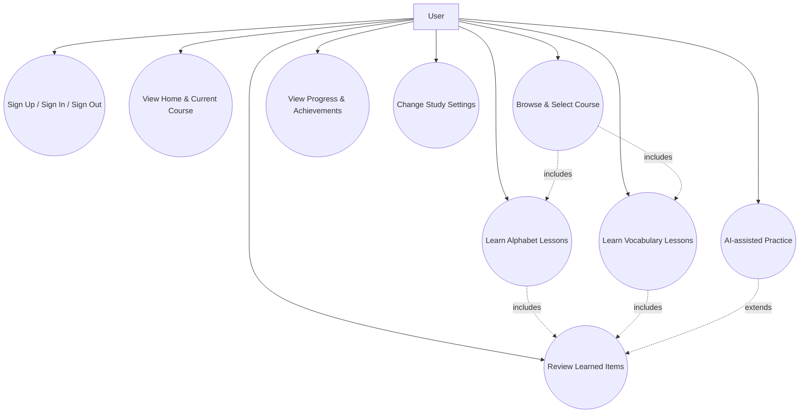

> 以上用例图为本项目唯一的“业务场景集合”。后续如需新增/删除用例，必须首先更新本图，再同步调整对应模块 Spec。

### 2.3 关键用例时序图（按用例分组）

#### 2.3.1 UC_Auth – Sign Up / Sign In / Sign Out

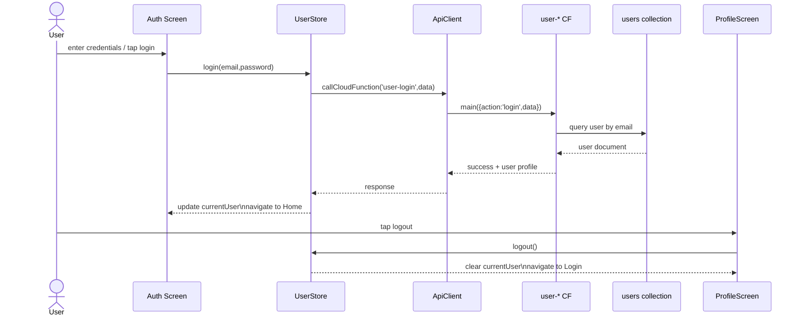

#### 2.3.2 UC_Home – View Home & Current Course

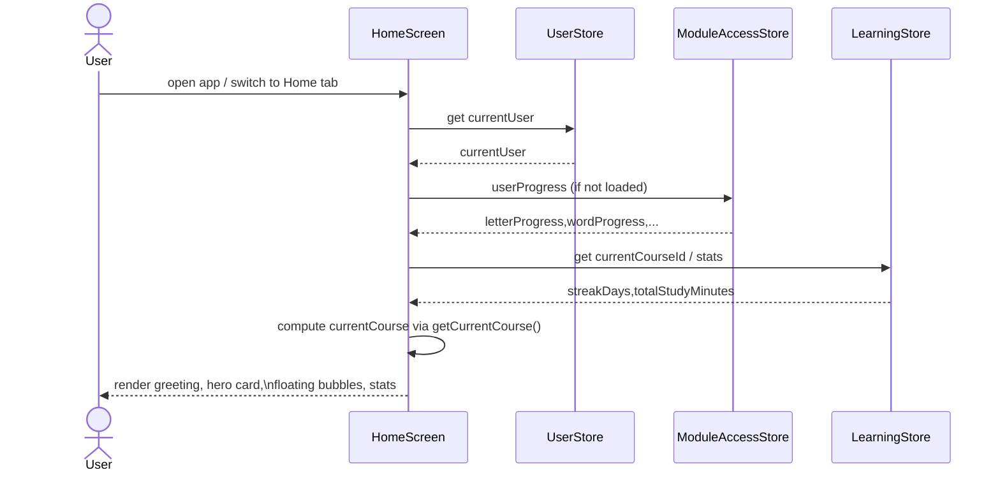

#### 2.3.3 UC_SelectCourse – Browse & Select Course

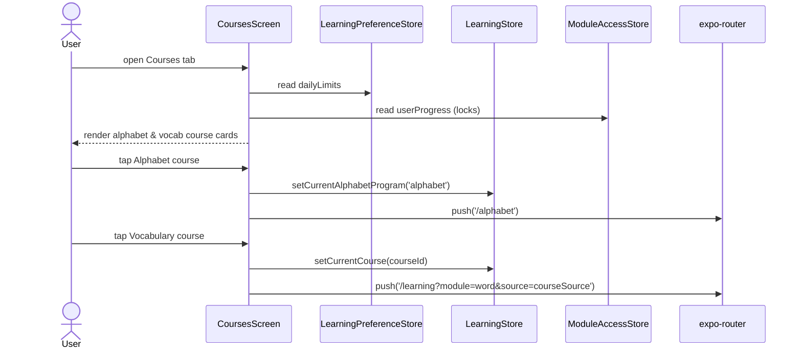

#### 2.3.4 UC_AlphabetLearn – Learn Alphabet Lessons

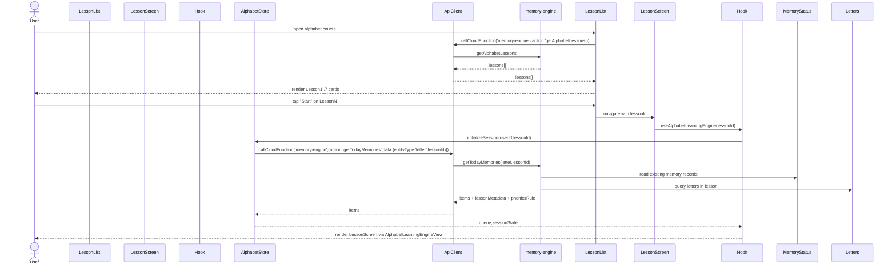

#### 2.3.5 UC_VocabLearn – Learn Vocabulary Lessons

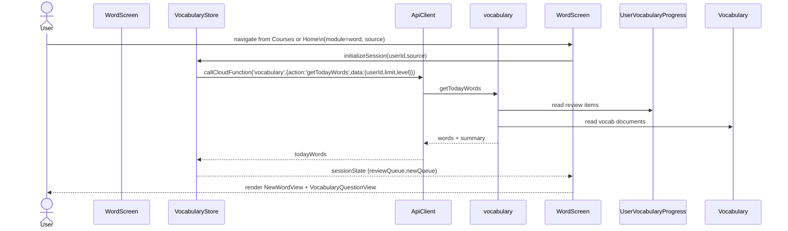

#### 2.3.6 UC_Review – Review Learned Items

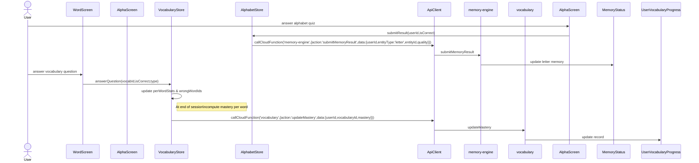

#### 2.3.7 UC_ViewProgress – View Progress & Achievements

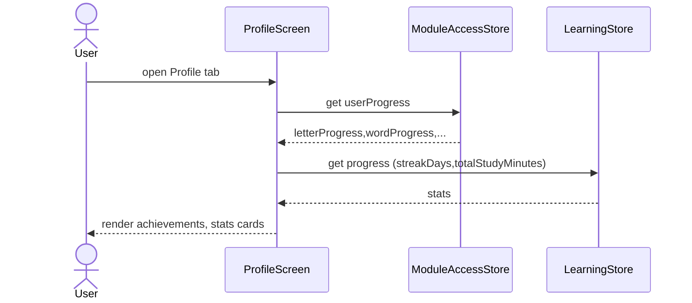

#### 2.3.8 UC_Settings – Change Study Settings

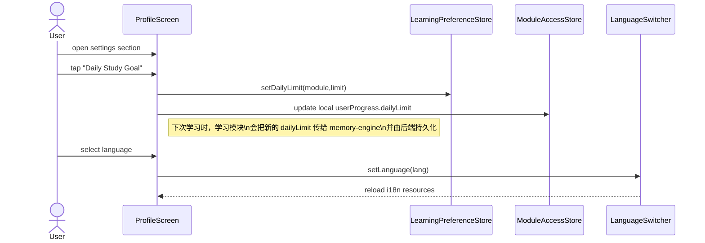

#### 2.3.9 UC_AIPractice – AI-assisted Practice

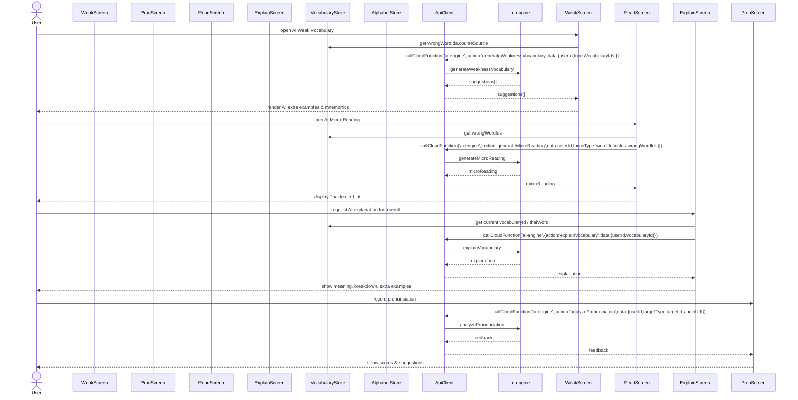

> 旧版项目快照文档（`docs/Document/project-snapshot-*` 等）已删除，任何新需求必须基于以上 Spec 更新。

---

## 3. 当前实现状态概览（按模块）

状态使用：`✅ 完成` / `🟡 部分实现` / `⏳ 规划中`

### 3.1 Alphabet Module

- 路由 & 组件结构：`app/alphabet/*` + `AlphabetLearningEngineView`：🟡 部分实现  
  - 现有实现包含基本“昨日复习 + 今日学习 + Mini Review + 三轮评估”逻辑，但三新一复/Final Review/错题补救尚未完全按 Spec 实装。  
- Store & Hook：`alphabetStore` + `useAlphabetLearningEngine`：🟡 部分实现  
  - 已对接 `memory-engine.getTodayMemories` / `submitMemoryResult` / `submitRoundEvaluation`；  
  - 尚未引入第 11 章定义的本地 `AlphabetSessionState` 聚合评分与会话恢复。  
- Question Engine（6 大题型）：⏳ 规划中  
  - 目前仍使用 `lettersQuestionGenerator` 的多题型函数，未切换到统一 GameType 协议。

### 3.2 Vocabulary Module

- 路由 & 页面：`app/learning/index.tsx` 中的 `WordSession`：🟡 部分实现（使用 mock 队列）  
  - 当前版本使用固定的 `MOCK_OLD_WORDS` / `MOCK_NEW_WORDS` 队列模拟复习与新词；  
  - 尚未接入 `vocabulary` 云函数的 `getTodayWords`，也未使用统一记忆引擎提交分数。  
- Store：`src/stores/vocabularyStore.ts`：🟡 部分实现  
  - 已具备 `initSession` / `submitAnswer` 等接口，但字段和后端新集合结构存在偏差；  
  - 需要按 `vocabulary-module-spec.md` 重构为 `VocabularySessionState` 驱动。  
- 题型体系（4 个选择题 + 2 个拼写题）：⏳ 规划中  
  - 目前没有统一的题型枚举和容器组件，NewWordView / ReviewWordView 主要用于 Web 端原型。

### 3.3 Courses + LearningStore

- Courses 页面：`app/(tabs)/courses.tsx`：✅ 完成（首发需求）  
  - 已能根据 `alphabetCourses.json` 和 `courses.json` 展示课程卡片，并跳转到 `/alphabet` 或 `/learning`；  
  - 支持按 category / 搜索过滤课程。  
- LearningPreferenceStore（每日上限）：✅ 完成  
  - 已可配置 `dailyLimits.word` / `dailyLimits.letter`，并在 `WordSession` / `AlphabetSession` 中使用。  
- LearningStore（全局仪表盘）：🟡 部分实现  
  - 当前 `learningStore` 仍是 demo 型实现，未完全按 spec 的 `currentCourseId` / `streakDays` 等字段重构。  

### 3.4 Backend Memory Engine

- `memory-engine` 云函数：✅ 完成  
  - `getTodayMemories` / `submitMemoryResult` / `submitRoundEvaluation` / `checkModuleAccess` / `getUserProgress` 已上线并被 Alphabet / 部分前端逻辑使用。  
- `learn-vocab` 云函数：✅ 完成（老版词汇 API）  
  - `getTodayWords` / `updateMastery` / `getVocabularyDetail` / `getReviewStatistics` 等已实现；  
  - 将逐步与新的 Vocabulary Module Spec 对齐。

### 3.5 AI Module

- 云函数 `ai-engine`：⏳ 规划中（未创建）  
- 前端入口（页面/按钮）：⏳ 规划中  
- 仅在 Spec 中定义了 Action 和数据结构，不影响首发。

---

## 4. 全局任务列表（按模块顺序，不混合开发）

> 任务状态：`[x] 已完成` / `[~] 进行中` / `[ ] 待做`  
> 开发顺序：**先完成一个模块的核心任务再进入下一个模块**，避免跨模块来回切换。

### 4.1 Phase 0：架构与文档基线（已完成）

- [x] 删除所有旧版项目快照文档（`docs/Document/project-snapshot-*`）。  
- [x] 为 Alphabet / Vocabulary / Courses & LearningStore / Backend / AI 各模块生成冻结 Spec。  
- [x] 抽取统一记忆引擎 + SM‑2 行为到 `backend-memory-engine-spec.md`。  
- [x] 新增项目总纲文档 `PROJECT_OVERVIEW_SPEC.md` 作为顶层入口。  

> 从本阶段结束起，所有设计与实现以 `project-freeze` 下的 Spec + 实际代码为唯一依据。

### 4.2 Phase 1：对齐字母模块与统一记忆引擎（当前优先任务）

> 目标：先彻底把 Alphabet Module 与 `memory-engine` 对齐，保证课程级三轮逻辑 + SM‑2 质量提交流程完全闭环，然后再启动下一个模块。

- [~] A1：校准字母课程解锁逻辑（`alphabet-module-spec.md` 第 10 章）。  
  - 只在 Round3 完成且通过时，调用 `markAlphabetLessonCompleted(lessonId)` 解锁下一课。  
  - 与 `user_alphabet_progress.currentRound` / `roundHistory` 字段保持一致。  
- [ ] A2：实现 `AlphabetSessionState` 与会话恢复（第 11 章）。  
  - 在 `alphabetStore` 中增加 Session 状态结构；  
  - 使用 AsyncStorage 以 `alphabet-session:${userId}:${lessonId}` 为 key 持久化；  
  - 支持在 Yesterday Review / 三新一复 / Final Review / 错题集任意阶段中途退出并恢复。  
- [ ] A3：按“字母 × 轮次 × 当天”聚合质量，并切换到批量 `submitMemoryResult`。  
  - 在 Hook 内维护 `perLetterStats`；  
  - Round 结束或用户点击“结束今天学习”时，构造 `{ results: [{ entityType:'letter', entityId, quality }, ...] }` 调用 memory-engine；  
  - 确认 CloudBase 日志中每个字母每轮最多只产生一次质量记录。  
- [ ] A4：与 `backend-memory-engine-spec.md` 的 `getTodayMemories(letter, lessonId)` 约定对齐。  
  - 课程队列主要由前端构建；  
  - 若仍使用 `getTodayMemories` 初始化队列，需要确保只作为“整课字母 + memoryState”的数据源，而不与前端 Session 队列逻辑冲突。  

> 只有当 A1–A4 完整通过自测并稳定后，才开始 Phase 2。

### 4.3 Phase 2：Alphabet 题型与体验完善

- [ ] B1：实现统一的 Alphabet Question Engine（接口定义见本文件与 `alphabet-module-spec.md` 第 6 章）。  
  - 定义 `GameType / QueueItem` 协议；  
  - 将现有 `lettersQuestionGenerator` 迁移到新协议下。  
- [ ] B2：实现三新一复 + Final Review 的题型编排。  
  - 三新一复：使用轻量题型（听音选字 / 看字选音）；  
  - Final Review：使用逻辑/整合题（拼读数学 / 声调计算等）。  
- [ ] B3：完善错题集与三轮评估展示。  
  - Round 结果页展示每轮正确率与“错误最多的若干字母”；  
  - 为后续 AI 模块提供输入数据。

### 4.4 Phase 3：Vocabulary Module 重构（在 Phase 2 完成后启动）

- [ ] C1：接入 `vocabulary.getTodayWords`，移除 `WordSession` 中的 mock 队列。  
  - `WordSession` 使用 `vocabularyStore.initializeSession` 获取今日复习 + 新词列表。  
- [ ] C2：重构 `vocabularyStore`，实现 `VocabularySessionState` + `perWordStats` + 会话恢复。  
  - 结构与字母模块的 Session 思路对齐，但仍使用 `learn-vocab.updateMastery` 提交结果。  
- [ ] C3：实现 4 种选择题题型容器，并接入 `ReviewWordView`。  
  - 看泰语选中文、看中文选泰语、听音选泰语、听音选中文。  
- [ ] C4（可选）：实现 2 种拼写题，并接入统计。  
- [ ] C5：确定词汇最终使用的记忆后端（`user_vocabulary_progress` vs `memory_status`），并完成到统一来源的迁移。

### 4.5 Phase 4：Courses + LearningStore 收尾

- [x] D0：Courses 页面接入字母/单词课程 JSON 并展示。  
- [ ] D1：LearningStore 重构为轻量仪表盘（`currentCourseId` / `currentAlphabetProgramId` / `streakDays` / `totalStudyMinutes` 等）。  
- [ ] D2：在 Courses 点击课程时更新 LearningStore。  
  - 字母课程：`setCurrentAlphabetProgram('alphabet')`；  
  - 词汇课程：`setCurrentCourse(courseId)`。  
- [ ] D3：首页/个人中心根据 `learningStore` 和 `moduleAccessStore` 展示学习概览（当前在学课程、最近学习时间、学习时长等）。

### 4.6 Phase 5：AI 模块占位与 MVP

- [ ] E1：创建 `ai-engine` 云函数骨架 + API_ENDPOINTS 占位。  
- [ ] E2：在字母/词汇模块中增加“AI 发音练习”入口（仅调用占位接口，返回固定文案）。  
- [ ] E3（可选）：实现发音反馈 MVP（录音 → 上传 → `analyzePronunciation`）。  


---

## 5. 里程碑规划（从现在起约 2 个月）

> 时间估算以“全职开发者”为参考，可根据实际人力调整。

### M1（第 1–2 周）：架构稳定 & Alphabet P0

- 完成事项：
  - [x] 删除旧快照文档，冻结 project-freeze 结构；  
  - [x] 后端 memory-engine / learn-vocab 行为梳理完毕；  
  - [~] 修正 Alphabet 解锁逻辑，使 Round3 通过后才解锁下一课。  
- 输出：
  - 可稳定使用的字母课程流程（即使 Question Engine 尚未完全上线）。

### M2（第 3–4 周）：Alphabet 会话恢复 + Vocabulary 接入后端

- 目标：
  - [ ] 实现 Alphabet `AlphabetSessionState` + 会话恢复 +批量提交；  
  - [ ] 词汇模块接入 `getTodayWords`，移除 mock 队列；  
  - [ ] 初步实现 VocabularySessionState（不含拼写题）。

### M3（第 5–6 周）：题型完善 + LearningStore 重构

- 目标：
  - [ ] Alphabet / Vocabulary 的选择题题型容器稳定；  
  - [ ] LearningStore 重构完成，首页/课程页正确显示当前课程和学习统计；  
  - [ ] 回归测试多模块切换与解锁逻辑。

### M4（视时间而定）：拼写题 + AI 占位

- 目标：
  - [ ] 至少实现一类拼写题（看中文拼写泰语）并接入统计；  
  - [ ] 完成 `ai-engine` 云函数骨架和前端入口（按钮/页面），使后续 AI 能力可以平滑接入。

---

## 6. 开发约定与变更流程

1. **以代码为准，但必须同步更新 Spec：**
   - 所有业务/接口变更必须先在对应模块 Spec 中修改，再更新实现；  
   - 若发现 Spec 与代码不一致，以**当前代码 + 本总纲**为基准修正文档。
2. **禁止新增“第二套逻辑”：**
   - 记忆队列 / 评分 / 模块解锁只能通过统一记忆引擎 + 各模块 Spec 约定的 Store；  
   - 不得在组件内部偷偷添加新的状态或后端集合。
3. **文档位置约定：**
   - 新模块、新云函数的规格必须放在 `docs/project-freeze` 下，并从 `PROJECT_OVERVIEW_SPEC.md` 链接出去。  

本文件与同目录下其他 Spec 一起，构成本项目的“最终冻结蓝图”。  
后续开发人员只需遵守本总纲和各模块 Spec，即可在不破坏整体架构的前提下迭代实现功能。

---

## 7. 项目代码快照（按当前仓库状态）

> 本节仅用于**快速了解当前代码结构与实现范围**，不额外引入新设计。  
> 任何行为定义仍以各模块 Spec + 实际代码为准。

### 7.1 前端目录快照（src/）

- `src/components/`
  - `learning/`
    - `NewWordView.tsx`：Web 风格词汇精讲卡片组件，目前主要用于设计参考，移动端学习暂未完全接入。  
    - `ReviewWordView.tsx`：旧版词汇复习组件，内部仍使用“忘记/模糊/记得”三按钮。  
    - `alphabet/AlphabetLearningView.tsx`：单字母教学卡（展示字形、名称、发音按钮等）。  
    - `alphabet/AlphabetReviewView.tsx`：字母复习组件，调用 `lettersQuestionGenerator` 生成题目。  
  - `courses/AlphabetCourseCard.tsx`：字母大课程卡片；`CourseCard.tsx`：词汇课程卡片。
  - `common/ThaiPatternBackground.tsx`：通用背景装饰。

- `src/stores/`
  - `alphabetStore.ts`：字母学习 Store，维护 `queue / currentAlphabet / completedCount / totalCount`，对接 `memory-engine`。  
  - `vocabularyStore.ts`：词汇 Store，当前实现仍基于旧版 `TodayVocabularyResponse` 和本地进度，需要按 Spec 重构。  
  - `moduleAccessStore.ts`：包装后端 `getUserProgress / checkModuleAccess`，提供模块解锁状态给前端。  
  - `learningPreferenceStore.ts`：每日学习上限设置（字母/单词）。  
  - `learningStore.ts`：旧版全局学习仪表盘，含写死 demo 数据。  
  - `userStore.ts`：登录用户信息。

- `src/hooks/`
  - `useAlphabetLearningEngine.ts`：字母三轮学习业务 Hook，驱动 `AlphabetLearningEngineView`；部分 Phase 与错题补救逻辑尚未完全实现。  
  - 其他业务 Hook（如公用 API 调用等）。

- `src/entities/types/`
  - `alphabet.types.ts`：字母实体类型、学习状态类型等。  
  - `vocabulary.types.ts`：新版词汇类型，与数据库 schema 对齐（包含例句、对话、用法等富字段）。  
  - 其他基础类型定义。

- `src/utils/`
  - `apiClient.ts`：`callCloudFunction` 封装，负责 HTTP 触发器调用。  
  - `lettersQuestionGenerator.ts`：当前字母题目生成器（SOUND_TO_LETTER 等多题型）。  

### 7.2 路由结构快照（app/）

- `app/(tabs)/_layout.tsx`：底部 Tab 导航布局。  
- `app/(tabs)/courses.tsx`：课程总览页，读取 `alphabetCourses.json` + `courses.json`，展示课程卡片。  
- `app/alphabet/index.tsx`：字母课程列表页（当前直接列出 Lesson1~7），点击跳转到 `/alphabet/[lessonId]`。  
- `app/alphabet/[lessonId].tsx`：单课字母学习入口，调用 `useAlphabetLearningEngine(lessonId)`。  
- `app/learning/index.tsx`：
  - 根据 `module` 区分 `WordSession`（词汇）与 `AlphabetSession`（字母）；  
  - 当前 `WordSession` 仍使用硬编码的 `MOCK_OLD_WORDS` / `MOCK_NEW_WORDS` 队列；  
  - `AlphabetSession` 作为旧版字母学习入口存在，后续将以 `/alphabet/*` 结构为主。  
- `app/learning/setup.tsx`：设置每日学习计划页面（字母/单词每日上限）。
- `app/auth/*`：登录、注册等认证页。

### 7.3 云函数与后端快照（cloudbase/functions/）

- `memory-engine/`
  - `index.js`：统一记忆引擎入口，解析 HTTP body，按 `action` 分发。  
  - `handlers/getTodayMemories.js`：基于 `memory_status` + 实体集合生成今日字母/单词/句子队列；支持字母课程的 `lessonId` 模式。  
  - `handlers/submitMemoryResult.js`：支持单条或批量学习结果提交，内部调用 `updateMemoryAfterReview`。  
  - `handlers/submitRoundEvaluation.js`：字母三轮评估结果写入 `user_alphabet_progress`。  
  - `utils/memoryEngine.js`：`getOrCreateMemory` / `updateMemoryAfterReview` / `checkModuleAccess` / `initUserProgress`。  
  - `utils/sm2.js`：优化版 SM‑2 算法实现。  

- `learn-vocab/`
  - `index.js`：词汇专用云函数入口，动作包括 `getTodayWords` / `updateMastery` / `getVocabularyDetail` / `getReviewStatistics` 等。  
  - `handlers/getTodayWords.js`：从 `user_vocabulary_progress` + `vocabulary` 构建今日词汇列表。  
  - `handlers/updateMastery.js`：根据 `mastery` 字段更新词汇 SRS 信息。  

- 其他：
  - `alphabet/`：与字母数据管理相关的辅助云函数（如批量导入等，首发不必依赖）。  
  - `user-*`：用户注册、登录、重置密码、更新信息。  
  - `storage-download` / `shared`：公共工具与文件下载。

### 7.4 数据库结构快照（关键集合）

> 详细字段规范以 `docs/database_schema.md` 为准；  
> 本节只做简要索引，方便从代码快照跳转到数据库文档。

- `letters`（字母/元音/声调表）
  - 结构：见 `database_schema.md` 1.4；  
  - 用途：字母模块课程数据、题目生成。

- `vocabulary`（词汇表）
  - 结构：见 `database_schema.md` 1.2；  
  - 用途：词汇模块学习/复习、富媒体内容（例句、对话、同源词）。

- `memory_status`（统一记忆状态表）
  - 结构：见 `database_schema.md` 1.7；  
  - 用途：统一 SRS 引擎核心记录，Alphabet / Vocabulary 均可使用。

- `user_progress`、`user_alphabet_progress`、`user_vocabulary_progress`
  - 结构：见 `database_schema.md` 1.8–1.9 / 1.3；  
  - 用途：模块解锁、字母三轮评估统计、旧版词汇进度。
  - 关键字段：  
    - `userId`: string；  
    - `letterProgress`: number；`letterCompleted`: boolean；  
    - `completedLessons`: string[]；`masteredLetterCount`: number；`totalLetterCount`: number；  
    - `currentRound`: number；`roundHistory`: Array\<{ lessonId, roundNumber, totalQuestions, correctCount, accuracy, passed, updatedAt }\>；  
    - `createdAt` / `updatedAt`: string。

- `user_vocabulary_progress`（旧版词汇 SRS 状态）
  - 源：`learn-vocab/handlers/getTodayWords.js` / `updateMastery.js`。  
  - 关键字段：  
    - `userId`: string；`vocabularyId`: string | null；  
    - `mastery`: `'UNFAMILIAR' | 'FUZZY' | 'REMEMBERED' | null`；  
    - `skipped`: boolean；  
    - `reviewCount`: number；`lastReviewed`: string | null；`nextReviewDate`: string | null；  
    - `intervalDays`: number；`easinessFactor`: number；  
    - `createdAt` / `updatedAt`: string。

---

本节记录的是当前仓库的**代码结构与实现快照**，用于帮助后续开发者快速建立整体认知。  
如代码结构发生重大调整，请在完成重构后更新本快照以及相关模块 Spec。***
</file>

<file path="docs/project-freeze/README.md">
# project-freeze 说明

本目录下的文档用于冻结 ThaiLearningApp 的核心架构与模块规格，  
所有后续开发应优先参考这里的 Spec，而不是直接凭感觉改代码。

当前包含（按模块划分，一模块一文档）：

- `PROJECT_OVERVIEW_SPEC.md`  
  - 项目总纲：模块划分、阶段任务、里程碑、代码快照与数据库文档约定。

- `frontend-shell-module-spec.md`  
  - 前端壳层与导航模块：Tab 导航、首页展示、用户中心与基础设置。

- `alphabet-module-spec.md`  
  - 字母模块（Alphabet Module）完整规格：路由、Hook、Store、memory-engine、数据结构与流程。

- `courses-and-learningstore-spec.md`  
  - Courses 入口页 + LearningStore 全局学习管理层规格。

- `backend-memory-engine-spec.md`  
  - 统一记忆引擎（memory-engine + learn-vocab）与模块解锁逻辑。

- `vocabulary-module-spec.md`  
  - 词汇模块（Vocabulary Module）规格：题型、会话状态、与 learn-vocab/memory-engine 的对接。

- `ai-module-spec.md`  
  - 轻量 AI 模块设计：发音反馈、弱项词汇强化、微阅读生成、词汇解析。

- `database_schema.md`  
  - 数据库结构规范（V2.1.0）：以 local_cleaner 输出与当前云函数为准。

所有新模块、新云函数、新 Store 在落地之前都应先在本目录下补充对应 Spec，并在 `PROJECT_OVERVIEW_SPEC.md` 中登记。***
</file>

<file path="src/components/common/FloatingBubbles.tsx">
// src/components/common/FloatingBubbles.tsx
import React from 'react';
import { View, Text, Pressable, StyleSheet, Dimensions } from 'react-native';
import { Sparkles, PlayCircle } from 'lucide-react-native';
import { Colors } from '@/src/constants/colors';
import { Typography } from '@/src/constants/typography';
import { ReviewItem } from '../../entities/types/entities';

interface FloatingBubblesProps {
  reviews: ReviewItem[];
  onOpenReview: () => void;
}

const { width } = Dimensions.get('window');

export const FloatingBubbles: React.FC<FloatingBubblesProps> = ({
  reviews,
  onOpenReview,
}) => {
  if (reviews.length === 0) return null;

  return (
    <View style={styles.container}>
      {/* Floating Title */}
      <View style={styles.titleContainer}>
        <View style={styles.titleBadge}>
          <Sparkles size={12} color={Colors.thaiGold} />
          <Text style={styles.titleText}>待复习内容</Text>
        </View>
      </View>

      {/* Card Stack */}
      <View>
        <Pressable
          onPress={onOpenReview}
          style={styles.cardStackContainer}
        >
          {reviews.slice(0, 3).reverse().map((review, index) => (
            <Card key={review.id} review={review} index={index} />
          ))}

          {/* Notification Badge */}
          <View style={styles.badge}>
            <Text style={styles.badgeText}>{reviews.length}</Text>
          </View>
        </Pressable>
      </View>
    </View>
  );
};

interface CardProps {
  review: ReviewItem;
  index: number;
}

const Card: React.FC<CardProps> = ({ review, index }) => {
  const offsetY = index * 10;
  const scale = 1 - index * 0.04;
  const cardOpacity = 1 - index * 0.1;
  const rotate = index % 2 === 0 ? '-1.5deg' : '1.5deg';

  return (
    <View
      style={[
        styles.card,
        {
          transform: [
            { translateY: offsetY },
            { scale },
            { rotate },
          ],
          zIndex: 30 - index,
          opacity: cardOpacity,
        },
      ]}
    >
      {/* Content */}
      <View style={styles.cardContent}>
        {/* Top Row */}
        <View style={styles.cardTopRow}>
          <View style={styles.typeTag}>
            <Text style={styles.typeTagText}>
              {review.type === 'New' ? '新词' : '复习'}
            </Text>
          </View>
          <View style={styles.statusDot} />
        </View>

        {/* Middle */}
        <View style={styles.cardMiddleRow}>
          <View>
            <Text style={styles.charText}>{review.char}</Text>
            <Text style={styles.phoneticText}>{review.phonetic}</Text>
          </View>
          <View style={styles.playButton}>
            <PlayCircle size={20} color={Colors.white} />
          </View>
        </View>

        {/* Bottom Progress */}
        <View style={styles.progressBarContainer}>
          <View style={styles.progressBar} />
        </View>
      </View>

      {/* Background Gradient */}
      <View style={styles.backgroundGradient} />
    </View>
  );
};

const styles = StyleSheet.create({
  container: {
    width: '100%',
    height: 340,
    marginBottom: 32,
    alignItems: 'center',
    justifyContent: 'flex-end',
  },
  titleContainer: {
    position: 'absolute',
    top: 30,
    left: 0,
    right: 0,
    alignItems: 'center',
  },
  titleBadge: {
    flexDirection: 'row',
    alignItems: 'center',
    gap: 8,
    backgroundColor: 'rgba(26, 26, 26, 0.9)',
    paddingHorizontal: 16,
    paddingVertical: 6,
    borderRadius: 20,
    borderWidth: 1,
    borderColor: 'rgba(212, 175, 55, 0.3)',
    shadowColor: '#000',
    shadowOffset: { width: 0, height: 2 },
    shadowOpacity: 0.1,
    shadowRadius: 4,
    elevation: 3,
  },
  titleText: {
    fontFamily: Typography.notoSerifBold,
    fontSize: 11,
    fontWeight: '700',
    letterSpacing: 1.5,
    color: Colors.white,
  },
  cardStackContainer: {
    width: Math.min(320, width - 48),
    height: 280,
    alignItems: 'center',
    justifyContent: 'center',
  },
  card: {
    position: 'absolute',
    width: 256,
    height: 176,
    backgroundColor: Colors.ink,
    borderRadius: 20,
    borderWidth: 1,
    borderColor: 'rgba(212, 175, 55, 0.2)',
    overflow: 'hidden',
    shadowColor: '#000',
    shadowOffset: { width: 0, height: 15 },
    shadowOpacity: 0.2,
    shadowRadius: 40,
    elevation: 10,
  },
  cardContent: {
    flex: 1,
    padding: 20,
    justifyContent: 'space-between',
    zIndex: 10,
  },
  cardTopRow: {
    flexDirection: 'row',
    justifyContent: 'space-between',
    alignItems: 'flex-start',
  },
  typeTag: {
    paddingHorizontal: 8,
    paddingVertical: 2,
    borderRadius: 4,
    borderWidth: 1,
    borderColor: 'rgba(212, 175, 55, 0.3)',
  },
  typeTagText: {
    fontFamily: Typography.notoSerifBold,
    fontSize: 10,
    fontWeight: '700',
    letterSpacing: 1.5,
    color: Colors.thaiGold,
    textTransform: 'uppercase',
  },
  statusDot: {
    width: 8,
    height: 8,
    borderRadius: 4,
    backgroundColor: Colors.thaiGold,
  },
  cardMiddleRow: {
    flexDirection: 'row',
    justifyContent: 'space-between',
    alignItems: 'center',
  },
  charText: {
    fontFamily: Typography.sarabunRegular,
    fontSize: 36,
    lineHeight: 40,
    color: Colors.white,
    marginBottom: 4,
  },
  phoneticText: {
    fontFamily: Typography.playfairRegular,
    fontSize: 14,
    fontStyle: 'italic',
    color: 'rgba(229, 226, 219, 0.8)',
  },
  playButton: {
    width: 40,
    height: 40,
    borderRadius: 20,
    backgroundColor: 'rgba(255, 255, 255, 0.1)',
    alignItems: 'center',
    justifyContent: 'center',
  },
  progressBarContainer: {
    width: '100%',
    height: 4,
    backgroundColor: 'rgba(255, 255, 255, 0.1)',
    borderRadius: 2,
    overflow: 'hidden',
    marginTop: 8,
  },
  progressBar: {
    width: '66%',
    height: '100%',
    backgroundColor: Colors.thaiGold,
  },
  backgroundGradient: {
    position: 'absolute',
    top: -40,
    right: -40,
    width: 128,
    height: 128,
    borderRadius: 64,
    backgroundColor: 'rgba(212, 175, 55, 0.1)',
  },
  badge: {
    position: 'absolute',
    top: -2,
    right: 1,
    width: 24,
    height: 24,
    borderRadius: 12,
    backgroundColor: '#DC2626',
    borderWidth: 2,
    borderColor: Colors.paper,
    alignItems: 'center',
    justifyContent: 'center',
    zIndex: 40,
    shadowColor: '#000',
    shadowOffset: { width: 0, height: 2 },
    shadowOpacity: 0.15,
    shadowRadius: 4,
    elevation: 5,
  },
  badgeText: {
    fontSize: 12,
    fontWeight: '700',
    color: Colors.white,
  },
});
</file>

<file path="src/config/constants.ts">
// src/config/constants.ts

/**
 * 应用常量配置
 *
 * 目标：
 * 1. 统一管理全局常量（集合名 / 超时 / 文本等），避免在代码中散落硬编码字符串；
 * 2. COLLECTIONS 中只放“真实存在或规划中的集合名”，并通过注释区分「已使用」与「预留/废弃」。
 */

// ==================== 数据库集合名称 ====================
export const COLLECTIONS = {
  // ===== 核心用户与进度集合（CloudBase 已实际使用） =====
  USERS: 'users',
  USER_PROGRESS: 'user_progress',
  USER_ALPHABET_PROGRESS: 'user_alphabet_progress',
  USER_VOCABULARY_PROGRESS: 'user_vocabulary_progress',

  // ===== 学习实体集合（CloudBase 已实际使用） =====
  LETTERS: 'letters',
  VOCABULARY: 'vocabulary',
  VOCABULARIES: 'vocabularies', // 特定 handler（getSkippedWords）使用的词汇集合
  SENTENCES: 'sentences',
  MEMORY_STATUS: 'memory_status',

  // ===== 字母课程与拼读规则（已迁移的课程配置） =====
  ALPHABET_LESSONS: 'alphabet_lessons',
  PHONICS_RULES: 'phonics_rules',

  // ===== 字母测试相关 =====
  LETTER_TEST_BANK: 'letter_test_bank',

  // ===== 预留 / 规划中的集合（当前代码中未实际使用） =====
  COURSES: 'courses',
  LESSONS: 'lessons',
  EXERCISES: 'exercises',
  ARTICLES: 'articles',
  PRONUNCIATION_RECORDS: 'pronunciationRecords',
  PROGRESS: 'progress',
  REVIEW_SCHEDULES: 'reviewSchedules',
  LEARNING_RECORDS: 'learningRecords',

  // ===== 已废弃命名（仅兼容旧版本，不推荐再使用） =====
  // 旧版字母集合，现已统一使用 LETTERS: 'letters'
  ALPHABETS: 'alphabets',
} as const;

// ==================== API 超时配置 ====================
export const API_TIMEOUT = {
  DEFAULT: 10000,   // 10 秒 - 一般请求
  UPLOAD: 30000,    // 30 秒 - 文件上传
  LONG: 60000,      // 60 秒 - 长时间操作（如发音评估）
};

// ==================== 错误消息 ====================
export const ERROR_MESSAGES = {
  NETWORK_ERROR: '网络连接失败，请检查您的网络。',
  TIMEOUT_ERROR: '请求超时，请稍后重试。',
  AUTH_ERROR: '身份验证失败，请重新登录。',
  TOKEN_EXPIRED: '登录已过期，请重新登录。',
  SERVER_ERROR: '服务器错误，请稍后重试。',
  INVALID_INPUT: '输入信息不完整或格式错误。',
  UNKNOWN_ERROR: '未知错误，请联系客服。',
};

// ==================== 用户角色 ====================
export const USER_ROLES = {
  LEARNER: 'LEARNER',
  ADMIN: 'ADMIN',
} as const;

// ==================== 学习等级 ====================
export const LEVELS = {
  BEGINNER_A: 'BEGINNER_A',
  BEGINNER_B: 'BEGINNER_B',
  INTERMEDIATE: 'INTERMEDIATE',
  ADVANCED: 'ADVANCED',
} as const;

// ==================== 掌握程度 ====================
export const MASTER_LEVELS = {
  NOT_LEARNED: 'NOT_LEARNED',
  LEARNING: 'LEARNING',
  REVIEWING: 'REVIEWING',
  MASTERED: 'MASTERED',
} as const;

// ==================== 内容类型 ====================
export const CONTENT_TYPES = {
  ALPHABET: 'alphabet',
  VOCABULARY: 'vocabulary',
  SENTENCE: 'sentence',
  ARTICLE: 'article',
} as const;
</file>

<file path="src/entities/enums/LearningPhase.enum.ts">
// src/entities/enums/LearningPhase.enum.ts

/**
 * 学习阶段枚举
 * 
 * 用于字母学习的7阶段流程 + 测试相关阶段
 * 对应V3.0课程方案的完整流程
 * 
 * @version 2.0.0
 * @see project-snapshot-v2.0.0-V10.md 第7节 学习流程
 */
export enum LearningPhase {
  // ===== 初始状态 =====
  IDLE = 'IDLE',
  LOADING = 'LOADING',
  
  // ===== 7阶段学习流程 =====
  YESTERDAY_REVIEW = 'yesterday-review',
  YESTERDAY_REMEDY = 'yesterday-remedy',
  TODAY_LEARNING = 'today-learning',
  TODAY_MINI_REVIEW = 'today-mini-review',
  TODAY_FINAL_REVIEW = 'today-final-review',
  TODAY_REMEDY = 'today-remedy',
  ROUND_EVALUATION = 'round-evaluation',
  
  // ===== 测试相关(用于课程测试) =====
  TEST_PROMPT = 'test-prompt',
  TESTING = 'testing',
  TEST_RESULT = 'test-result',
  
  // ===== 完成状态 =====
  FINISHED = 'finished',
  COMPLETED = 'COMPLETED',
}

/**
 * Phase 类型(用于类型守卫)
 * 对应AlphabetLearningEngineView中使用的字符串字面量
 */
export type Phase = 
  | 'yesterday-review'
  | 'yesterday-remedy'
  | 'today-learning'
  | 'today-mini-review'
  | 'today-final-review'
  | 'today-remedy'
  | 'round-evaluation'
  | 'finished';

/**
 * Phase 显示文案映射
 */
export const PHASE_LABELS: Record<Phase, string> = {
  'yesterday-review': '昨日复习',
  'yesterday-remedy': '昨日补救',
  'today-learning': '今日学习',
  'today-mini-review': '小复习',
  'today-final-review': '末尾复习',
  'today-remedy': '今日补救',
  'round-evaluation': '轮次评估',
  'finished': '完成',
};

/**
 * Phase 图标映射(用于UI显示)
 */
export const PHASE_ICONS: Record<Phase, string> = {
  'yesterday-review': '🔄',
  'yesterday-remedy': '🔧',
  'today-learning': '📚',
  'today-mini-review': '✨',
  'today-final-review': '🎯',
  'today-remedy': '💪',
  'round-evaluation': '📊',
  'finished': '🎉',
};

/**
 * Phase 进度权重(用于进度条计算)
 */
export const PHASE_PROGRESS_WEIGHTS: Record<Phase, number> = {
  'yesterday-review': 0.1,
  'yesterday-remedy': 0.15,
  'today-learning': 0.4,
  'today-mini-review': 0.5,
  'today-final-review': 0.7,
  'today-remedy': 0.85,
  'round-evaluation': 0.95,
  'finished': 1.0,
};

/**
 * 判断是否为复习阶段
 */
export function isReviewPhase(phase: Phase): boolean {
  return [
    'yesterday-review',
    'yesterday-remedy',
    'today-mini-review',
    'today-final-review',
    'today-remedy',
  ].includes(phase);
}

/**
 * 判断是否为学习阶段
 */
export function isLearningPhase(phase: Phase): boolean {
  return phase === 'today-learning';
}

/**
 * 判断是否为补救阶段
 */
export function isRemedyPhase(phase: Phase): boolean {
  return ['yesterday-remedy', 'today-remedy'].includes(phase);
}

/**
 * 获取下一个阶段
 */
export function getNextPhase(currentPhase: Phase): Phase | null {
  const phaseSequence: Phase[] = [
    'yesterday-review',
    'yesterday-remedy',
    'today-learning',
    'today-mini-review',
    'today-final-review',
    'today-remedy',
    'round-evaluation',
    'finished',
  ];
  
  const currentIndex = phaseSequence.indexOf(currentPhase);
  if (currentIndex === -1 || currentIndex === phaseSequence.length - 1) {
    return null;
  }
  
  return phaseSequence[currentIndex + 1];
}
</file>

<file path="src/i18n/index.ts">
import i18n from 'i18next';  // 核心库
import { initReactI18next } from 'react-i18next';  // React 绑定
import * as Localization from 'expo-localization';  // 获取设备语言
import AsyncStorage from '@react-native-async-storage/async-storage';  // 本地存储

import zh from './locales/zh';  // 中文翻译
import en from './locales/en';  // 英文翻译

const LANGUAGE_KEY = 'user-language';  // 存储语言的 key

// 【核心函数1】从本地存储读取用户上次选择的语言
const getStoredLanguage = async (): Promise<string | null> => {
  try {
    return await AsyncStorage.getItem(LANGUAGE_KEY);  // 读取本地存储
  } catch (error) {
    console.error('Error reading language:', error);
    return null;
  }
};

// 【核心函数2】获取设备语言(如果用户没选过)
const getDeviceLanguage = (): string => {
  const locales = Localization.getLocales();  // 获取区域设置数组
  if (!locales || locales.length === 0) {
    return 'zh'; // 默认中文
  }
  const languageCode = locales[0].languageCode;  // 例如: "zh" 或 "en"
  return languageCode === 'zh' ? 'zh' : 'en';  // 默认中文
};

// 【核心函数3】初始化 i18n
const initI18n = async () => {
  const storedLanguage = await getStoredLanguage();  // 先读本地存储
  const initialLanguage = storedLanguage || getDeviceLanguage();  // 本地没有就用设备语言

  i18n
    .use(initReactI18next)  // 绑定 React
    .init({  // 配置
      resources: {  // 翻译资源
        zh: { translation: zh },  // 中文
        en: { translation: en },  // 英文
      },
      lng: initialLanguage,  // 初始语言
      fallbackLng: 'zh',  // 如果翻译缺失,回退到中文
      interpolation: {
        escapeValue: false,  // React 已经防 XSS 了
      },
    });
};

initI18n();  // 立即执行初始化

export default i18n;
</file>

<file path="src/utils/alphabet/audioHelper.ts">
// src/utils/alphabet/audioHelper.ts

import type { Letter } from '@/src/entities/types/letter.types';
import type { AudioRequirementType } from '@/src/entities/enums/QuestionType.enum';

/**
 * 音频Base URL
 */
const LETTER_AUDIO_BASE =
  'https://636c-cloud1-1gjcyrdd7ab927c6-1387301748.tcb.qcloud.la/alphabet/';

/**
 * 将可能是「完整 URL」或「相对路径 / key」的音频字段规范化为完整 URL。
 */
function normalizeAudioSource(path?: string | null): string {
  if (!path) return '';
  if (path.startsWith('http://') || path.startsWith('https://') || path.startsWith('file://')) {
    return path;
  }
  return resolveAudioPath(path);
}

/**
 * 音频优先级策略
 * 
 * @param letter - 字母对象
 * @param type - 音频需求类型
 * @returns 音频URL（始终为完整 HTTP URL 或空字符串）
 */
export function getLetterAudioUrl(
  letter: Letter,
  type: AudioRequirementType = 'letter'
): string {
  // P0-Optimization: 优先使用本地缓存路径
  const getLocalOrRemote = (local?: string, remote?: string) => {
    return normalizeAudioSource(local) || normalizeAudioSource(remote);
  };

  switch (type) {
    case 'letter':
      // 默认使用完整读音:
      // fullSoundLocal > fullSoundUrl > ...
      return (
        getLocalOrRemote(letter.fullSoundLocalPath, letter.fullSoundUrl) ||
        getLocalOrRemote(letter.letterPronunciationLocalPath, letter.letterPronunciationUrl) ||
        resolveAudioPath(letter.audioPath)
      );

    case 'syllable':
      // 音节发音
      return (
        getLocalOrRemote(letter.syllableSoundLocalPath, letter.syllableSoundUrl) ||
        getLocalOrRemote(letter.fullSoundLocalPath, letter.fullSoundUrl) ||
        resolveAudioPath(letter.audioPath)
      );

    case 'minimal-pair':
      // 最小对立组(使用letter类型,由调用方处理对比)
      return (
        getLocalOrRemote(letter.fullSoundLocalPath, letter.fullSoundUrl) ||
        getLocalOrRemote(letter.letterPronunciationLocalPath, letter.letterPronunciationUrl) ||
        resolveAudioPath(letter.audioPath)
      );

    case 'tone-set':
      // 声调变体(需TTS生成,返回基础音频)
      return (
        getLocalOrRemote(letter.syllableSoundLocalPath, letter.syllableSoundUrl) ||
        getLocalOrRemote(letter.fullSoundLocalPath, letter.fullSoundUrl) ||
        resolveAudioPath(letter.audioPath)
      );

    default:
      return (
        getLocalOrRemote(letter.fullSoundLocalPath, letter.fullSoundUrl) ||
        resolveAudioPath(letter.audioPath)
      );
  }
}

/**
 * 解析音频路径
 * 
 * @param path - 音频路径
 * @returns 完整URL
 */
function resolveAudioPath(path?: string | null): string {
  if (!path) return '';

  // 如果已经是完整URL,直接返回
  if (path.startsWith('http://') || path.startsWith('https://')) {
    return path;
  }

  // 对类似 "word-kai" / "sound-k" 这类 key 自动补全 .mp3 后缀
  let finalPath = path;
  if (!/\.mp3($|\?)/.test(finalPath)) {
    finalPath = `${finalPath}.mp3`;
  }

  // 拼接Base URL
  return `${LETTER_AUDIO_BASE}${finalPath}`;
}

/**
 * 获取最小对立组的音频URL列表
 * 
 * @param letters - 字母列表(包含目标字母+对比字母)
 * @returns 音频URL数组
 */
export function getMinimalPairAudioUrls(letters: Letter[]): string[] {
  return letters.map(letter => getLetterAudioUrl(letter, 'minimal-pair'));
}

/**
 * 生成声调变体音频URLs
 * 
 * ⚠️ 当前实现:返回基础音频
 * 🔮 未来实现:调用TTS API生成5个声调变体
 * 
 * @param letter - 字母对象
 * @param vowel - 元音(可选)
 * @returns 5个声调音频URL数组
 */
export function getToneVariantAudioUrls(
  letter: Letter,
  vowel?: string
): string[] {
  const baseAudioUrl = getLetterAudioUrl(letter, 'tone-set');

  // 当前策略:返回相同的基础音频(临时方案)
  // 前端可以在UI上标注"需TTS生成"
  return [
    baseAudioUrl, // 中平调
    baseAudioUrl, // 低降调
    baseAudioUrl, // 降调
    baseAudioUrl, // 高调
    baseAudioUrl, // 升调
  ];

  // 🔮 未来实现(需后端TTS服务):
  // return await ttsService.generateToneVariants(letter, vowel);
}

/**
 * 获取某个字母相关的所有音频 URL（去重后）。
 *
 * 设计目的：
 * - 用于课程初始化时，一次性预缓存该字母所有可能会用到的音频；
 * - 包含：
 *   - letterPronunciationUrl（字母标准读音）
 *   - fullSoundUrl（完整读音）
 *   - syllableSoundUrl（音节发音）
 *   - endSyllableSoundUrl（尾音节发音）
 *   - audioPath（旧版路径）
 */
export function getAllLetterAudioUrls(letter: Letter): string[] {
  const rawSources: Array<string | null | undefined> = [
    // 以实际存在的音频为主：fullSoundUrl 与各类 *SoundUrl
    letter.fullSoundUrl,
    letter.syllableSoundUrl,
    letter.endSyllableSoundUrl,
    letter.audioPath,
  ];

  const urls = rawSources
    .map((src) => normalizeAudioSource(src ?? undefined))
    .filter((u): u is string => !!u);

  // 去重
  return Array.from(new Set(urls));
}

/**
 * 检查音频是否可用
 * 
 * @param url - 音频URL
 * @returns 是否可用
 */
export async function checkAudioAvailable(url: string): Promise<boolean> {
  if (!url) return false;

  try {
    const response = await fetch(url, { method: 'HEAD' });
    return response.ok;
  } catch (error) {
    console.warn('[AudioHelper] 音频不可用:', url, error);
    return false;
  }
}
</file>

<file path="babel.config.js">
module.exports = function (api) {
  api.cache(true);
  return {
    presets: ['babel-preset-expo'],
    plugins: [
      [
        'module-resolver',
        {
          root: ['./'],
          alias: {
            '@': './',
          },
        },
      ],
      'react-native-reanimated/plugin', // 必须在最后
    ],
  };
};
</file>

<file path="index.ts">
import 'react-native-gesture-handler';
import 'react-native-reanimated';
import 'expo-router/entry';
</file>

<file path="app/review-modal.tsx">
import { View, Text, StyleSheet } from 'react-native';
import { Stack } from 'expo-router';

export default function ReviewModal() {
  return (
    <View style={styles.container}>
      <Stack.Screen
        options={{
          title: 'Review',
        }}
      />
      <Text style={styles.text}>Review Modal Screen</Text>
    </View>
  );
}

const styles = StyleSheet.create({
  container: {
    flex: 1,
    justifyContent: 'center',
    alignItems: 'center',
    backgroundColor: '#fff',
  },
  text: {
    fontSize: 18,
    fontWeight: 'bold',
  },
});
</file>

<file path="cloudbase/functions/alphabet/handlers/submitLetterTest.js">
// ✅ 提交字母测试结果（Route A：前端判分）
const { createResponse } = require('../utils/response');
const passLetterTest = require('./passLetterTest');

/**
 * 提交字母测试结果
 * @param {Object} db - 数据库实例
 * @param {Object} data - 请求数据 { userId, passed }
 */
async function submitLetterTest(db, data) {
    // 1. 校验参数
    const { userId, passed } = data || {};

    if (!userId) {
        return createResponse(false, null, 'userId 参数缺失', 'INVALID_PARAMS');
    }

    if (typeof passed !== 'boolean') {
        return createResponse(false, null, 'passed 参数必须为布尔值', 'INVALID_PARAMS');
    }

    // 2. 如果未通过，直接返回（不写数据库）
    if (!passed) {
        return createResponse(true, {
            passed: false,
            message: '未通过测试，不记录进度'
        }, '测试未通过');
    }

    // 3. 如果通过，调用 passLetterTest 写入解锁记录
    try {
        await passLetterTest(db, { userId });

        return createResponse(true, {
            passed: true,
            message: '恭喜通过字母测试！所有模块已解锁。'
        }, '测试通过');
    } catch (error) {
        console.error('[submitLetterTest] passLetterTest 失败：', error);
        return createResponse(false, null, '写入进度失败', 'DB_ERROR');
    }
}

module.exports = submitLetterTest;
</file>

<file path="cloudbase/functions/alphabet/index.js">
const cloud = require('wx-server-sdk');
cloud.init({ env: cloud.SYMBOL_CURRENT_ENV });
const db = cloud.database();


// ✅ 处理函数
const { createResponse } = require('./utils/response');
const getLetterTest = require('./handlers/getLetterTest');
const submitLetterTest = require('./handlers/submitLetterTest');
const passLetterTest = require('./handlers/passLetterTest');
const getAllLetters = require('./handlers/getAllLetters');

exports.main = async (event, context) => {

    // ===== 解析 HTTP 请求 =====
    let requestData = event;

    // HTTP 触发器：body 可能是字符串或对象
    if (event.body) {
        if (typeof event.body === 'string') {
            try {
                requestData = JSON.parse(event.body);
            } catch (e) {
                console.error('[alphabet] JSON 解析失败:', e.message);
                return createResponse(false, null, 'Invalid JSON in request body', 'INVALID_JSON');
            }
        } else if (typeof event.body === 'object') {
            requestData = event.body;
        }
    }

    const { action, data } = requestData;

    try {
        switch (action) {

            // ✅ 0️⃣ 获取所有字母（用于前端生成测试题）
            case 'getAllLetters':
                return await getAllLetters(db);

            // ✅ 1️⃣ 获取字母测试题（固定题）
            case 'getLetterTest':
                return await getLetterTest(db);

            // ✅ 2️⃣ 提交字母测试并判定
            case 'submitLetterTest':
                return await submitLetterTest(db, data);

            // ✅ 3️⃣ 直接通过字母测试（调试/特殊逻辑用）
            case 'passLetterTest':
                return await passLetterTest(db, data);

            default:
                return createResponse(false, null, '未知 action', 'INVALID_ACTION');
        }
    } catch (err) {
        console.error('learn-alphabet error:', err);
        return createResponse(false, null, err.message || '服务器错误', 'SERVER_ERROR');
    }
};
</file>

<file path="cloudbase/functions/learn-vocab/handlers/getVocabularyDetail.js">
/**
 * 获取词汇详情处理器
 * @action getVocabularyDetail
 */
'use strict';

const { createResponse } = require('../utils/response');

/**
 * 获取词汇详细信息
 * @param {Object} db - 数据库实例
 * @param {Object} params
 * @param {string} params.vocabularyId - 词汇ID (必填)
 * @param {string} params.userId - 用户ID (可选，用于获取学习状态)
 */
async function getVocabularyDetail(db, params) {
  const { vocabularyId, userId } = params;

  if (!vocabularyId) {
    return createResponse(false, null, '缺少词汇ID', 'INVALID_PARAMS');
  }

  try {
    // 1. 检查权限 (如果有 userId)
    if (userId) {
      const { checkModuleAccess } = require('../utils/memoryEngine');
      const accessResult = await checkModuleAccess(db, userId, 'word');

      if (!accessResult.allowed) {
        return createResponse(false, null, accessResult.message, accessResult.errorCode);
      }
    }

    // 2. 获取词汇详情
    // 注意：根据你的数据库结构，如果主键是 _id，请使用 doc(id)；如果是 vocabularyId 字段，使用 where
    // 假设 vocabularyId 字段存储的是业务ID
    const vocabResult = await db.collection('vocabulary')
      .where({ vocabularyId: vocabularyId }) // 或者 .doc(vocabularyId) 如果它是 _id
      .get();

    if (!vocabResult.data || vocabResult.data.length === 0) {
      // 尝试用 _id 再查一次，兼容不同传参
      const vocabByIdResult = await db.collection('vocabulary').doc(vocabularyId).get().catch(() => ({ data: [] }));
      if (!vocabByIdResult.data) {
        return createResponse(false, null, '未找到该词汇', 'VOCABULARY_NOT_FOUND');
      }
      vocabResult.data = [vocabByIdResult.data];
    }

    const vocabulary = vocabResult.data[0];

    // 3. 构建详细响应
    const detail = {
      // 基本信息
      vocabularyId: vocabulary.vocabularyId || vocabulary._id,
      thaiWord: vocabulary.thaiWord,
      meaning: vocabulary.meaning,
      pronunciation: vocabulary.pronunciation,
      audioPath: vocabulary.audioPath,
      partOfSpeech: vocabulary.partOfSpeech,
      level: vocabulary.level,
      lessonNumber: vocabulary.lessonNumber,
      startingLetter: vocabulary.startingLetter,

      // 扩展学习内容
      cognates: vocabulary.cognates || [],
      dialogue: vocabulary.dialogue || null,
      exampleSentences: vocabulary.exampleSentences || {},
      usage: vocabulary.usage || {},
      mistakes: vocabulary.mistakes || {},

      // 元数据
      source: vocabulary.source,
      createdAt: vocabulary.createdAt,
    };

    // 4. 如果提供了 userId，附加学习状态
    if (userId) {
      const progressResult = await db.collection('user_vocabulary_progress')
        .where({ userId, vocabularyId: detail.vocabularyId }) // 确保ID匹配
        .limit(1)
        .get();

      if (progressResult.data.length > 0) {
        const p = progressResult.data[0];
        detail.learningStatus = {
          mastery: p.mastery,
          skipped: p.skipped,
          reviewCount: p.reviewCount,
          lastReviewed: p.lastReviewed,
          nextReviewDate: p.nextReviewDate,
          intervalDays: p.intervalDays,
          easinessFactor: p.easinessFactor,
          isNew: false,
        };
      } else {
        detail.learningStatus = {
          mastery: null,
          skipped: false,
          reviewCount: 0,
          lastReviewed: null,
          nextReviewDate: null,
          intervalDays: 0,
          isNew: true,
        };
      }
    }

    return createResponse(true, detail, '获取词汇详情成功');

  } catch (error) {
    console.error('getVocabularyDetail error:', error);
    return createResponse(false, null, error.message, 'SERVER_ERROR');
  }
}

module.exports = getVocabularyDetail;
</file>

<file path="cloudbase/functions/learn-vocab/handlers/getVocabularyList.js">
/**
 * 获取词汇列表处理器
 * @action getVocabularyList
 */
'use strict';

const { createResponse } = require('../utils/response');

/**
 * 格式化词汇为列表项
 */
function formatVocabularyForList(vocab) {
  return {
    vocabularyId: vocab.vocabularyId || vocab._id,
    thaiWord: vocab.thaiWord,
    meaning: vocab.meaning,
    pronunciation: vocab.pronunciation,
    audioPath: vocab.audioPath,
    partOfSpeech: vocab.partOfSpeech,
    level: vocab.level,
    lessonNumber: vocab.lessonNumber,
  };
}

/**
 * 获取词汇列表
 * @param {Object} db - 数据库实例
 * @param {Object} params - 参数
 */
async function getVocabularyList(db, params) {
  const { filters = {}, limit = 20, offset = 0, userId } = params;

  try {
    // 1. 检查用户权限 (如果传了 userId)
    if (userId) {
      const { checkModuleAccess } = require('../utils/memoryEngine');
      const accessResult = await checkModuleAccess(db, userId, 'word');

      if (!accessResult.allowed) {
        return createResponse(false, null, accessResult.message, accessResult.errorCode);
      }
    }

    // 2. 验证分页参数
    const validLimit = Math.max(1, Math.min(limit, 100));
    const validOffset = Math.max(0, offset);

    // 3. 构建查询条件
    const query = db.collection('vocabulary');
    const whereConditions = {};

    if (filters.level) whereConditions.level = filters.level;
    if (filters.lessonNumber) whereConditions.lessonNumber = filters.lessonNumber;
    if (filters.startingLetter) whereConditions.startingLetter = filters.startingLetter;
    if (filters.partOfSpeech) whereConditions.partOfSpeech = filters.partOfSpeech;

    let dbQuery = query;
    if (Object.keys(whereConditions).length > 0) {
      dbQuery = dbQuery.where(whereConditions);
    }

    // 4. 获取总数
    const countResult = await dbQuery.count();
    const total = countResult.total;

    // 5. 获取分页数据
    // 注意：orderBy 字段需要确保有索引，否则可能报错或慢
    const dataResult = await dbQuery
      .orderBy('lessonNumber', 'asc')
      .skip(validOffset)
      .limit(validLimit)
      .get();

    const vocabularies = dataResult.data.map(formatVocabularyForList);

    return createResponse(true, {
      vocabularies,
      pagination: {
        total,
        limit: validLimit,
        offset: validOffset,
        hasMore: validOffset + validLimit < total,
      },
    }, '获取词汇列表成功');

  } catch (error) {
    console.error('getVocabularyList error:', error);
    return createResponse(false, null, error.message, 'SERVER_ERROR');
  }
}

module.exports = getVocabularyList;
</file>

<file path="cloudbase/functions/learn-vocab/handlers/toggleSkipWord.js">
/**
 * 划掉/恢复单词处理器
 * 
 * 将单词从复习队列中移除或重新加入
 * 
 * @action toggleSkipWord
 */

'use strict';

const { createResponse } = require('../utils/response');

/**
 * 划掉或恢复单词
 */
async function toggleSkipWord(db, params) {
  const { userId, vocabularyId, skipped } = params;

  // 参数验证
  if (!userId || !vocabularyId || typeof skipped !== 'boolean') {
    return createResponse(false, null, '缺少必填参数或参数类型错误', 'INVALID_PARAMS');
  }

  try {
    // 验证用户
    const userResult = await db.collection('users')
      .where({ userId })
      .get();

    if (!userResult.data || userResult.data.length === 0) {
      return createResponse(false, null, '用户不存在', 'USER_NOT_FOUND');
    }

    // 验证词汇
    const vocabResult = await db.collection('vocabulary')
      .where({ _id: vocabularyId })
      .get();

    if (!vocabResult.data || vocabResult.data.length === 0) {
      return createResponse(false, null, '词汇不存在', 'VOCABULARY_NOT_FOUND');
    }

    const now = new Date();

    // 查找现有进度记录
    const existingProgress = await db.collection('user_vocabulary_progress')
      .where({ userId, vocabularyId })
      .limit(1)
      .get();

    if (existingProgress.data && existingProgress.data.length > 0) {
      // 更新现有记录
      await db.collection('user_vocabulary_progress')
        .doc(existingProgress.data[0]._id)
        .update({
          skipped,
          updatedAt: now
        });
    } else {
      // 创建新记录
      await db.collection('user_vocabulary_progress').add({
        userId,
        vocabularyId,
        mastery: null,
        skipped,
        lastReviewed: null,
        reviewCount: 0,
        intervalDays: 1,
        easinessFactor: 2.5,
        nextReviewDate: null,
        createdAt: now,
        updatedAt: now,
      });
    }

    const message = skipped ? '已从复习队列移除' : '已加入复习队列';

    return createResponse(true, {
      vocabularyId,
      skipped,
      message,
    }, skipped ? '单词已划掉' : '单词已恢复');

  } catch (error) {
    console.error('toggleSkipWord error:', error);
    return createResponse(false, null, error.message, 'SERVER_ERROR');
  }
}

module.exports = toggleSkipWord;
</file>

<file path="cloudbase/functions/learn-vocab/handlers/updateMastery.js">
/**
 * 更新掌握状态处理器
 * 
 * 记录用户对单词的掌握程度，使用 SM-2 算法计算下次复习时间
 * 
 * @action updateMastery
 */

'use strict';


const { progressCollection } = require('../utils/database');
const {
  createResponse,
  successResponse,
  errorResponse,
  userNotFoundResponse,
  vocabularyNotFoundResponse
} = require('../utils/response');
const {
  COLLECTIONS,
  MasteryLevel,
  SM2_PARAMS
} = require('../utils/constants');

const { validateUser, validateVocabulary, isValidMastery } = require('../utils/validators');
const { calculateSM2Optimized, generateReviewTimeline } = require('../utils/sm2');

/**
 * 更新单词掌握状态
 * 
 * 业务逻辑:
 * 1. 验证用户和词汇存在
 * 2. 验证掌握程度有效性
 * 3. 使用 SM-2 算法计算下次复习日期
 * 4. 创建或更新进度记录
 * 
 * @param {Object} params
 * @param {string} params.userId - 用户ID
 * @param {string} params.vocabularyId - 词汇ID
 * @param {string} params.mastery - 掌握程度: 陌生/模糊/记得
 */
async function updateMastery({ userId, vocabularyId, mastery }) {
  // 验证掌握程度
  if (!isValidMastery(mastery)) {
    return errorResponse(ErrorCodes.INVALID_MASTERY);
  }

  // 验证用户
  const user = await validateUser(userId);
  if (!user) {
    return userNotFoundResponse();
  }

  // 验证词汇
  const vocabulary = await validateVocabulary(vocabularyId);
  if (!vocabulary) {
    return vocabularyNotFoundResponse();
  }

  // 查找现有进度记录
  const { data: existingProgress } = await progressCollection
    .where({ userId, vocabularyId })
    .limit(1)
    .get();

  const now = new Date().toISOString();
  let progressData;
  let isNewRecord = false;
  let newReviewCount;

  if (existingProgress.length > 0) {
    // ========== 更新现有记录 ==========
    const current = existingProgress[0];

    const sm2Result = calculateSM2Optimized(
      mastery,
      current.intervalDays || 1,
      current.easinessFactor || SM2_PARAMS.INITIAL_EASINESS_FACTOR,
      current.reviewCount || 0
    );

    // 计算新的复习次数
    newReviewCount = sm2Result.shouldResetCount ? 1 : (current.reviewCount || 0) + 1;

    progressData = {
      mastery,
      lastReviewed: now,
      reviewCount: newReviewCount,
      intervalDays: sm2Result.nextInterval,
      easinessFactor: sm2Result.nextEasinessFactor,
      nextReviewDate: sm2Result.nextReviewDate,
      updatedAt: now,
    };

    await progressCollection.doc(current._id).update({
      data: progressData
    });

  } else {
    // ========== 创建新记录 ==========
    isNewRecord = true;
    newReviewCount = 1;

    const sm2Result = calculateSM2Optimized(
      mastery,
      1,
      SM2_PARAMS.INITIAL_EASINESS_FACTOR,
      0
    );

    progressData = {
      userId,
      vocabularyId,
      mastery,
      skipped: false,
      lastReviewed: now,
      reviewCount: 1,
      intervalDays: sm2Result.nextInterval,
      easinessFactor: sm2Result.nextEasinessFactor,
      nextReviewDate: sm2Result.nextReviewDate,
      createdAt: now,
      updatedAt: now,
    };

    await progressCollection.add(progressData);
  }

  return successResponse({
    vocabularyId,
    mastery,
    reviewCount: newReviewCount,
    nextReviewDate: progressData.nextReviewDate,
    intervalDays: progressData.intervalDays,
    easinessFactor: progressData.easinessFactor,
    isNewRecord,
    reviewTimeline: generateReviewTimeline(newReviewCount),
  }, '更新掌握状态成功');
}

module.exports = updateMastery;
</file>

<file path="cloudbase/functions/learn-vocab/utils/memoryEngine.js">
/**
 * 统一记忆引擎核心模块
 * 支持字母/单词/句子的统一记忆管理
 * 
 * 修复：wx-server-sdk 不支持 getOne()，改用 get() + data[0]
 */

const { calculateSM2Optimized } = require('./sm2');

/**
 * 创建新的记忆记录
 */
async function createMemoryRecord(db, userId, entityType, entityId, isLocked = false) {

    // 验证参数
    if (!userId || !entityType || !entityId) {
        console.error('[createMemoryRecord] 参数缺失:', { userId, entityType, entityId });
        throw new Error('userId, entityType, entityId 都是必需参数');
    }

    const now = new Date();
    const nextReviewAt = isLocked ? null : new Date(now.getTime() + 24 * 60 * 60 * 1000).toISOString();

    const memoryRecord = {
        userId,
        entityType,
        entityId,
        masteryLevel: 0.0,
        reviewStage: 0,
        easinessFactor: 2.5,
        intervalDays: 1,
        lastReviewAt: null,
        nextReviewAt,
        correctCount: 0,
        wrongCount: 0,
        streakCorrect: 0,
        isLocked,
        createdAt: now.toISOString(),
        updatedAt: now.toISOString()
    };

    try {
        // 尝试插入
        const result = await db.collection('memory_status').add(memoryRecord);

        console.log('[createMemoryRecord] 创建成功:', { userId, entityType, entityId });

        return {
            _id: result._id,
            ...memoryRecord
        };
    } catch (error) {
        // 如果是重复键错误，查询并返回现有记录
        if (error.errCode === -502001 || error.message.includes('duplicate key')) {
            console.log('[createMemoryRecord] 记录已存在，查询返回:', { userId, entityType, entityId });

            const existingResult = await db.collection('memory_status')
                .where({ userId, entityType, entityId })
                .get();

            if (existingResult.data && existingResult.data.length > 0) {
                return existingResult.data[0];
            }
        }

        // 其他错误继续抛出
        console.error('[createMemoryRecord] 创建失败:', error);
        throw error;
    }
}

/**
 * 获取或创建记忆记录
 * 修复：使用 get() 代替 getOne()
 */
async function getOrCreateMemory(db, userId, entityType, entityId, isLocked = false) {
    // 1. 尝试查询现有记录
    const existingMemory = await db.collection('memory_status')
        .where({
            userId,
            entityType,
            entityId
        })
        .get();

    // 2. 如果存在,直接返回第一条
    if (existingMemory.data && existingMemory.data.length > 0) {
        return existingMemory.data[0];
    }

    // 3. 不存在则创建新记录
    return await createMemoryRecord(db, userId, entityType, entityId, isLocked);
}

/**
 * 更新记忆状态(答题后调用)
 */
async function updateMemoryAfterReview(db, userId, entityType, entityId, quality) {
    console.log('【测试】updateMemoryAfterReview 被调用了！', { userId, quality });
    console.log('=== [updateMemoryAfterReview] 开始 ===');
    console.log('参数:', JSON.stringify({ userId, entityType, entityId, quality }));

    try {
        // 1. 获取当前记忆记录
        console.log('步骤1: 获取记忆记录');
        const memory = await getOrCreateMemory(db, userId, entityType, entityId);
        console.log('记忆记录:', JSON.stringify(memory));

        // 2. 映射质量到SM-2评分
        console.log('步骤2: 映射质量');
        const qualityMap = {
            '陌生': 1,
            '模糊': 3,
            '记得': 5
        };
        const sm2Quality = qualityMap[quality] || 3;
        console.log('SM-2质量:', sm2Quality);

        // 3. 计算新的SM-2参数
        console.log('步骤3: 调用 calculateSM2Optimized');
        console.log('调用参数:', {
            quality,
            intervalDays: memory.intervalDays,
            easinessFactor: memory.easinessFactor,
            reviewStage: memory.reviewStage
        });

        const sm2Result = calculateSM2Optimized(
            quality,
            memory.intervalDays,
            memory.easinessFactor,
            memory.reviewStage
        );

        console.log('SM-2结果:', JSON.stringify(sm2Result));

        // 4. 更新掌握度
        console.log('步骤4: 计算新掌握度');
        let newMasteryLevel = memory.masteryLevel;
        if (quality === '记得') {
            newMasteryLevel = Math.min(1.0, memory.masteryLevel + 0.15);
        } else if (quality === '模糊') {
            newMasteryLevel = Math.max(0.0, memory.masteryLevel + 0.05);
        } else {
            newMasteryLevel = Math.max(0.0, memory.masteryLevel - 0.2);
        }
        console.log('新掌握度:', newMasteryLevel);

        // 5. 更新连胜和计数
        console.log('步骤5: 计算连胜');
        const newStreakCorrect = quality === '记得' ? memory.streakCorrect + 1 : 0;
        const newCorrectCount = quality === '记得' ? memory.correctCount + 1 : memory.correctCount;
        const newWrongCount = quality === '陌生' ? memory.wrongCount + 1 : memory.wrongCount;

        // 6. 计算下次复习时间
        console.log('步骤6: 计算下次复习时间');
        const now = new Date();
        const nextReviewAt = new Date(now.getTime() + sm2Result.interval * 24 * 60 * 60 * 1000);
        console.log('下次复习时间:', nextReviewAt);

        // 7. 准备更新数据
        console.log('步骤7: 准备更新数据库');
        const updateData = {
            masteryLevel: newMasteryLevel,
            reviewStage: sm2Result.repetitions,
            easinessFactor: sm2Result.easinessFactor,
            intervalDays: sm2Result.interval,
            lastReviewAt: now.toISOString(),
            nextReviewAt: nextReviewAt.toISOString(),
            correctCount: newCorrectCount,
            wrongCount: newWrongCount,
            streakCorrect: newStreakCorrect,
            updatedAt: now.toISOString()
        };

        console.log('更新数据对象:', JSON.stringify(updateData));

        // 检查是否有 undefined
        for (const [key, value] of Object.entries(updateData)) {
            if (value === undefined) {
                console.error(`❌ 发现 undefined 值: ${key}`);
            }
        }

        // 8. 执行更新
        console.log('步骤8: 执行数据库更新');
        await db.collection('memory_status')
            .where({
                userId,
                entityType,
                entityId
            })
            .update({
                data: updateData   // ✅ CloudBase 必须这样写
            });

        console.log('✅ 更新成功');

        return {
            entityId,
            entityType,
            masteryLevel: newMasteryLevel,
            reviewStage: sm2Result.repetitions,
            easinessFactor: sm2Result.easinessFactor,
            intervalDays: sm2Result.interval,
            nextReviewAt: nextReviewAt.toISOString(),
            correctCount: newCorrectCount,
            wrongCount: newWrongCount,
            streakCorrect: newStreakCorrect
        };

    } catch (error) {
        console.error('❌ [updateMemoryAfterReview] 错误:', error);
        console.error('错误堆栈:', error.stack);
        throw error;
    }
}

/**
 * 获取今日待复习的实体
 */
async function getTodayReviewEntities(db, userId, entityType, limit = 20) {
    const now = new Date();

    const result = await db.collection('memory_status')
        .where({
            userId,
            entityType,
            isLocked: false,
            nextReviewAt: db.command.lte(now)
        })
        .orderBy('nextReviewAt', 'asc')
        .limit(limit)
        .get();

    return result.data || [];
}

/**
 * 检查并解锁下一阶段学习
 */
// async function checkAndUnlockNextStage(db, userId) {

//   if (process.env.FORCE_UNLOCK === 'true') {
//     return {
//       allowed: true,
//       progress: 100,
//       stage: "all",
//       message: '【调试模式】强制解锁'
//     };
//   }

//   // 修复：使用 get() + data[0]
//   const progressResult = await db.collection('user_progress')
//     .where({ userId })
//     .get();

//   if (!progressResult.data || progressResult.data.length === 0) {
//     await initUserProgress(db, userId);
//     return {
//       unlocked: false,
//       stage: 'letter',
//       message: '初始化学习进度成功'
//     };
//   }

//   const progress = progressResult.data[0];

//   if (!progress.letterCompleted) {
//     const letterMemories = await db.collection('memory_status')
//       .where({
//         userId,
//         entityType: 'letter'
//       })
//       .get();

//     const totalLetters = 44;
//     const masteredLetters = letterMemories.data.filter(m => m.masteryLevel >= 0.7).length;
//     const letterProgress = masteredLetters / totalLetters;

//     if (letterProgress >= 0.95) {
//       await db.collection('user_progress').where({ userId }).update({
//         data: {
//           letterCompleted: true,
//           letterProgress: 1.0,
//           wordUnlocked: true,
//           currentStage: 'word',
//           updatedAt: new Date().toISOString()
//         }
//       });

//       await db.collection('memory_status')
//         .where({
//           userId,
//           entityType: 'word',
//           isLocked: true
//         })
//         .update({
//           data: {
//             isLocked: false,
//             nextReviewAt: new Date(Date.now() + 24 * 60 * 60 * 1000).toISOString()
//           }
//         });

//       return {
//         unlocked: true,
//         stage: 'word',
//         message: '恭喜!字母学习完成,单词学习已解锁!'
//       };
//     }

//     return {
//       unlocked: false,
//       stage: 'letter',
//       progress: letterProgress,
//       remaining: Math.ceil((0.95 - letterProgress) * totalLetters),
//       message: `还需掌握 ${Math.ceil((0.95 - letterProgress) * totalLetters)} 个字母`
//     };
//   }

//   return {
//     unlocked: false,
//     stage: progress.currentStage,
//     message: '继续加油!'
//   };
// }

/**
 * 初始化用户的学习进度记录
 */
async function initUserProgress(db, userId) {
    const now = new Date();

    const progressRecord = {
        userId,
        letterCompleted: false,
        letterProgress: 0.0,
        wordUnlocked: false,
        wordProgress: 0.0,
        sentenceUnlocked: false,
        sentenceProgress: 0.0,
        articleUnlocked: false,
        currentStage: 'letter',
        totalStudyDays: 0,
        streakDays: 0,
        lastStudyDate: null,
        createdAt: now,
        updatedAt: now
    };

    await db.collection('user_progress').add(progressRecord);
    return progressRecord;
}

/**
 * 检查模块访问权限
 * 修复：使用 get() + data[0]
 */
async function checkModuleAccess(db, userId, moduleType) {

    // ✅✅✅【调试总开关：跳过所有学习锁】
    if (process.env.FORCE_UNLOCK === 'true') {
        console.warn('⚠️ FORCE_UNLOCK 已开启, 强制放行模块:', moduleType);
        return {
            allowed: true,
            progress: {
                letterCompleted: true,
                letterProgress: 1,
                wordUnlocked: true,
                sentenceUnlocked: true,
                articleUnlocked: true,
                currentStage: moduleType
            }
        };
    }

    const progressResult = await db.collection('user_progress')
        .where({ userId })
        .get();

    if (!progressResult.data || progressResult.data.length === 0) {
        return {
            allowed: false,
            errorCode: 'USER_PROGRESS_NOT_FOUND',
            message: '用户学习进度不存在,请联系管理员'
        };
    }

    const progress = progressResult.data[0];

    // ✅ 字母模块永远允许访问
    if (moduleType === 'letter') {
        return {
            allowed: true,
            progress
        };
    }

    // ✅ 其他所有模块只依赖 letterCompleted
    if (!progress.letterCompleted) {
        return {
            allowed: false,
            errorCode: 'MODULE_LOCKED',
            message: `请先完成字母学习（当前进度：${Math.round(progress.letterProgress * 100)}%）`,
            progress
        };
    }

    // ✅ 字母完成 → 全部模块放行
    return {
        allowed: true,
        progress
    };
}

module.exports = {
    createMemoryRecord,
    getOrCreateMemory,
    updateMemoryAfterReview,
    getTodayReviewEntities,
    // checkAndUnlockNextStage,
    initUserProgress,
    checkModuleAccess
};
</file>

<file path="cloudbase/functions/learn-vocab/utils/sm2.js">
/**
 * SM-2 间隔重复算法模块（优化版）
 * 
 * 基于艾宾浩斯遗忘曲线优化:
 * - 早期复习间隔更密集: 1→2→4→7→14 天
 * - "模糊"状态缩短间隔而非维持不变
 * - "陌生"状态重置复习进度
 * 
 * 算法论文: https://www.supermemo.com/en/archives1990-2015/english/ol/sm2
 */

'use strict';

const { MasteryLevel, SM2_PARAMS, EARLY_INTERVALS } = require('./constants');

/**
 * 将掌握程度映射到 SM-2 Quality 值
 * 
 * SM-2 Quality 定义:
 * 0 - 完全不记得
 * 1 - 错误回答，但看到正确答案后想起
 * 2 - 错误回答，正确答案看起来很熟悉
 * 3 - 正确回答，但困难较大
 * 4 - 正确回答，有些犹豫
 * 5 - 正确回答，毫无困难
 * 
 * @param {string} mastery - 掌握程度
 * @returns {number} Quality值 (1-5)
 */
function masteryToQuality(mastery) {
    switch (mastery) {
        case MasteryLevel.UNFAMILIAR:
            return 1;  // 完全不记得
        case MasteryLevel.FUZZY:
            return 3;  // 有印象但不确定
        case MasteryLevel.REMEMBERED:
            return 5;  // 完全记得
        default:
            return 1;
    }
}

/**
 * 计算下次复习日期（优化版 SM-2 算法）
 * 
 * 改进点:
 * 1. 早期阶段（前5次）使用固定的渐进间隔 [1,2,4,7,14]
 * 2. "模糊"时缩短间隔而非维持不变
 * 3. "陌生"时完全重置复习进度
 * 
 * @param {string} mastery - 掌握程度: 忘记/模糊/认识
 * @param {number} currentInterval - 当前复习间隔（天）
 * @param {number} easinessFactor - 简易度因子（1.3-2.5+）
 * @param {number} reviewCount - 已复习次数
 * @returns {Object} 算法计算结果
 * 
 * @example
 * const result = calculateSM2Optimized('认识', 2, 2.5, 1);
 * // {
 * //   nextInterval: 4,
 * //   nextEasinessFactor: 2.6,
 * //   nextReviewDate: "2025-12-01T10:00:00Z",
 * //   shouldResetCount: false
 * // }
 * */
function calculateSM2Optimized(
    mastery,
    currentInterval = 1,
    easinessFactor = SM2_PARAMS.INITIAL_EASINESS_FACTOR,
    reviewCount = 0
) {
    let nextInterval = currentInterval;
    let nextEF = easinessFactor;
    let shouldResetCount = false;

    const quality = masteryToQuality(mastery);

    // ==================== 核心算法逻辑 ====================

    if (quality < 3) {
        // ========== 忘记: 完全重置 ==========
        // 用户完全不记得，需要从头开始学习
        nextInterval = 1;
        nextEF = Math.max(SM2_PARAMS.MIN_EASINESS_FACTOR, nextEF - 0.2);
        shouldResetCount = true;

    } else if (quality === 3) {
        // ========== 模糊: 缩短间隔，加强复习 ==========
        // 改进: 不是维持不变，而是缩短20%
        nextInterval = Math.max(1, Math.round(currentInterval * SM2_PARAMS.FUZZY_MULTIPLIER));
        nextEF = Math.max(SM2_PARAMS.MIN_EASINESS_FACTOR, nextEF - 0.1);

    } else {
        // ========== 记得: 使用优化的间隔序列 ==========
        if (reviewCount < EARLY_INTERVALS.length) {
            // 早期阶段: 使用预定义的渐进间隔
            // 这是关键改进: 1→2→4→7→14 而非原版的 1→6
            nextInterval = EARLY_INTERVALS[reviewCount];
        } else {
            // 后期阶段: 使用 EF 计算指数增长
            nextInterval = Math.round(currentInterval * nextEF);
        }

        // 提高简易度 (标准 SM-2 公式)
        nextEF = nextEF + (0.1 - (5 - quality) * (0.08 + (5 - quality) * 0.02));
        nextEF = Math.max(SM2_PARAMS.MIN_EASINESS_FACTOR, nextEF);
    }

    // 限制最大间隔
    nextInterval = Math.min(nextInterval, SM2_PARAMS.MAX_INTERVAL_DAYS);

    // 计算下次复习日期
    const nextReviewDate = new Date();
    nextReviewDate.setDate(nextReviewDate.getDate() + nextInterval);

    // 计算新的复习次数
    const newRepetitions = shouldResetCount ? 0 : reviewCount + 1;

    return {
        // === 兼容 memoryEngine.js 的旧接口 ===
        interval: nextInterval,
        easinessFactor: parseFloat(nextEF.toFixed(2)),
        repetitions: newRepetitions,

        // === 新接口（保留供未来使用）===
        nextInterval,
        nextEasinessFactor: parseFloat(nextEF.toFixed(2)),
        nextReviewDate: nextReviewDate.toISOString(),
        shouldResetCount,
    };
}

/**
 * 生成预计复习时间线
 * 
 * 用于前端展示未来的复习计划
 * 
 * @param {number} currentReviewCount - 当前复习次数
 * @param {number} maxItems - 返回的时间线项数 (默认5)
 * @returns {Array} 未来复习计划
 * 
 * @example
 * generateReviewTimeline(2);
 * // [
 * //   { reviewNumber: 3, intervalDays: 4 },
 * //   { reviewNumber: 4, intervalDays: 7 },
 * //   { reviewNumber: 5, intervalDays: 14 },
 * //   ...
 * // ]
 */
function generateReviewTimeline(currentReviewCount, maxItems = 5) {
    const timeline = [];
    let interval = 1;
    let ef = SM2_PARAMS.INITIAL_EASINESS_FACTOR;

    for (let i = currentReviewCount; i < currentReviewCount + maxItems; i++) {
        if (i < EARLY_INTERVALS.length) {
            interval = EARLY_INTERVALS[i];
        } else {
            interval = Math.round(interval * ef);
        }
        interval = Math.min(interval, SM2_PARAMS.MAX_INTERVAL_DAYS);

        timeline.push({
            reviewNumber: i + 1,
            intervalDays: interval,
        });
    }

    return timeline;
}

/**
 * 获取今天的时间范围 (UTC)
 * 
 * @returns {Object} { startOfDay, endOfDay, timestamp }
 */
function getTodayRange() {
    const now = new Date();
    const startOfDay = new Date(Date.UTC(
        now.getUTCFullYear(),
        now.getUTCMonth(),
        now.getUTCDate(),
        0, 0, 0, 0
    ));
    const endOfDay = new Date(Date.UTC(
        now.getUTCFullYear(),
        now.getUTCMonth(),
        now.getUTCDate() + 1,
        0, 0, 0, 0
    ));

    return {
        startOfDay: startOfDay.toISOString(),
        endOfDay: endOfDay.toISOString(),
        timestamp: now.toISOString(),
    };
}

/**
 * 获取算法信息 (用于前端展示)
 * 
 * @returns {Object} 算法元信息
 */
function getAlgorithmInfo() {
    return {
        name: 'Optimized SM-2',
        version: '1.1.0',
        earlyIntervals: EARLY_INTERVALS,
        maxInterval: SM2_PARAMS.MAX_INTERVAL_DAYS,
        description: '基于艾宾浩斯遗忘曲线优化的间隔重复算法',
    };
}

module.exports = {
    calculateSM2Optimized,
    generateReviewTimeline,
    getTodayRange,
    getAlgorithmInfo,
    masteryToQuality,
};
</file>

<file path="cloudbase/functions/learn-vocab/utils/validators.js">
/**
 * 参数验证模块
 * 
 * 用户、词汇验证及通用验证工具
 */

'use strict';

const { userCollection, vocabularyCollection } = require('./database');
const { MasteryLevel } = require('./constants');

/**
 * 验证用户是否存在
 * 
 * @param {string} userId - 用户ID
 * @returns {Promise<Object|null>} 用户对象或 null
 */
async function validateUser(userId) {
    if (!userId || typeof userId !== 'string') {
        return null;
    }

    try {
        const { data } = await userCollection
            .where({ userId })
            .limit(1)
            .get();

        return data.length > 0 ? data[0] : null;
    } catch (error) {
        console.error('[validateUser] Error:', error);
        return null;
    }
}

/**
 * 验证词汇是否存在
 * 
 * @param {string} vocabularyId - 词汇ID
 * @returns {Promise<Object|null>} 词汇对象或 null
 */
async function validateVocabulary(vocabularyId) {
    if (!vocabularyId || typeof vocabularyId !== 'string') {
        return null;
    }

    try {
        const { data } = await vocabularyCollection
            .where({ vocabularyId })
            .limit(1)
            .get();

        return data.length > 0 ? data[0] : null;
    } catch (error) {
        console.error('[validateVocabulary] Error:', error);
        return null;
    }
}

/**
 * 验证掌握程度是否有效
 * 
 * @param {string} mastery - 掌握程度
 * @returns {boolean} 是否有效
 */
function isValidMastery(mastery) {
    const validValues = Object.values(MasteryLevel);
    return validValues.includes(mastery);
}

/**
 * 验证并规范化分页参数
 * 
 * @param {number} limit - 限制数量
 * @param {number} offset - 偏移量
 * @param {number} maxLimit - 最大限制 (默认100)
 * @returns {Object} 验证后的分页参数
 */
function validatePagination(limit, offset, maxLimit = 100) {
    return {
        limit: Math.min(Math.max(1, parseInt(limit) || 20), maxLimit),
        offset: Math.max(0, parseInt(offset) || 0),
    };
}

/**
 * 验证必填字符串参数
 * 
 * @param {string} value - 参数值
 * @param {string} name - 参数名 (用于错误消息)
 * @returns {Object} { valid: boolean, error?: string }
 */
function validateRequiredString(value, name) {
    if (!value || typeof value !== 'string' || value.trim() === '') {
        return {
            valid: false,
            error: `${name} 是必填参数且不能为空`,
        };
    }
    return { valid: true };
}

/**
 * 验证布尔参数
 * 
 * @param {any} value - 参数值
 * @param {string} name - 参数名
 * @returns {Object} { valid: boolean, error?: string }
 */
function validateBoolean(value, name) {
    if (typeof value !== 'boolean') {
        return {
            valid: false,
            error: `${name} 必须是布尔值`,
        };
    }
    return { valid: true };
}
/**
 * 通用参数验证函数
 * 
 * @param {Object} params - 需要验证的参数对象
 * @param {Array<string>} requiredFields - 必需字段列表
 * @returns {Object} { isValid: boolean, message?: string }
 */
function validateParams(params, requiredFields) {
    const missing = [];

    for (const field of requiredFields) {
        if (params[field] === undefined || params[field] === null || params[field] === '') {
            missing.push(field);
        }
    }

    if (missing.length > 0) {
        return {
            isValid: false,
            message: `缺少必填参数: ${missing.join(', ')}`
        };
    }

    return { isValid: true };
}

module.exports = {
    validateUser,
    validateVocabulary,
    isValidMastery,
    validatePagination,
    validateRequiredString,
    validateBoolean,
    validateParams,
};
</file>

<file path="cloudbase/functions/memory-engine/index.js">
/**
 * memory-engine 云函数
 * 统一记忆引擎服务
 * 版本: 1.0.0
 * 
 * 触发方式: HTTP 触发器
 */

const cloud = require('wx-server-sdk');
cloud.init({ env: cloud.SYMBOL_CURRENT_ENV });
const db = cloud.database();

// ===== Handlers =====
const getTodayMemories = require('./handlers/getTodayMemories');
const submitMemoryResult = require('./handlers/submitMemoryResult');
const submitRoundEvaluation = require('./handlers/submitRoundEvaluation');
const checkModuleAccessHandler = require('./handlers/checkModuleAccess');
const getUserProgress = require('./handlers/getUserProgress');
const getAlphabetLessons = require('./handlers/getAlphabetLessons');

// ===== Utils =====
const { createResponse } = require('./utils/response');

/**
 * 云函数主入口
 */
exports.main = async (event, context) => {
    // ===== 解析 HTTP 请求 =====
    let requestData = event;

    // HTTP 触发器：body 可能是字符串或对象
    if (event.body) {
        if (typeof event.body === 'string') {
            try {
                requestData = JSON.parse(event.body);
            } catch (e) {
                console.error('[memory-engine] JSON 解析失败:', e.message);
                return createResponse(false, null, 'Invalid JSON in request body', 'INVALID_JSON');
            }
        } else if (typeof event.body === 'object') {
            requestData = event.body;
        }
    }

    const { action, data = {} } = requestData;

    console.log(`[memory-engine] Action: ${action}`, JSON.stringify(data));

    // 验证 action 参数
    if (!action) {
        return createResponse(
            false,
            null,
            '缺少必填参数: action',
            'MISSING_ACTION'
        );
    }

    try {
        /**
         * 获取今日学习内容 (统一接口)
         */
        if (action === 'getTodayMemories') {
            return await getTodayMemories(db, data);
        }

        /**
         * 提交学习结果 (统一接口)
         */
        if (action === 'submitMemoryResult') {
            return await submitMemoryResult(db, data);
        }

        /**
         * 提交三轮评估结果（字母模块）
         */
        if (action === 'submitRoundEvaluation') {
            return await submitRoundEvaluation(db, data);
        }

        /**
         * 检查模块访问权限
         */
        if (action === 'checkModuleAccess') {
            return await checkModuleAccessHandler(db, data);
        }

        /**
         * 获取用户学习进度
         */
        if (action === 'getUserProgress') {
            return await getUserProgress(db, data);
        }

        /**
         * 获取字母课程列表（用于前端课程总览）
         */
        if (action === 'getAlphabetLessons') {
            return await getAlphabetLessons(db, data);
        }

        // ===== 未知Action =====
        const supportedActions = [
            'getTodayMemories',
            'submitMemoryResult',
            'submitRoundEvaluation',
            'checkModuleAccess',
            'getUserProgress',
            'getAlphabetLessons',
        ];

        return createResponse(
            false,
            { supportedActions },
            `未知的操作类型: ${action}`,
            'UNKNOWN_ACTION'
        );

    } catch (error) {
        console.error(`[memory-engine] 云函数错误:`, error);
        console.error('错误堆栈:', error.stack);

        return createResponse(
            false,
            null,
            error.message || '服务器内部错误',
            'SERVER_ERROR'
        );
    }
};
</file>

<file path="cloudbase/cloudbaserc.json">
{
  "envId": "cloud1-1gjcyrdd7ab927c6",
  "region": "ap-shanghai",
  "functionRoot": "./functions",
  "functions": [
    {
      "name": "user-register",
      "timeout": 15,
      "runtime": "Nodejs18.15",
      "handler": "index.main"
    },
    {
      "name": "user-login",
      "timeout": 15,
      "runtime": "Nodejs18.15",
      "handler": "index.main"
    },
    {
      "name": "user-reset-password",
      "timeout": 15,
      "runtime": "Nodejs18.15",
      "handler": "index.main"
    },
    {
      "name": "user-update-profile",
      "timeout": 15,
      "runtime": "Nodejs18.15",
      "handler": "index.main"
    },
    {
      "name": "learn-vocab",
      "timeout": 15,
      "runtime": "Nodejs18.15",
      "handler": "index.main",
      "installDependency": true
    },
    {
      "name": "memory-engine",
      "timeout": 20,
      "runtime": "Nodejs18.15",
      "handler": "index.main",
      "installDependency": true
    },
    {
      "name": "alphabet",
      "timeout": 20,
      "runtime": "Nodejs18.15",
      "handler": "index.main",
      "installDependency": true
    },
    {
      "name": "storage-download",
      "timeout": 20,
      "runtime": "Nodejs18.15",
      "handler": "index.main",
      "installDependency": true
    }
  ]
}
</file>

<file path="src/config/alphabet/lessonMetadata.config.ts">
// src/config/alphabet/lessonMetadata.config.ts

import type { LessonMetadata } from '@/src/entities/types/phonicsRule.types';

/**
 * 6课元数据完整配置
 * 
 * 定义每课的字母组成、拼读规则关联、通过率要求等
 * 
 * @version 1.0.0
 * @see SEQUENCE_LESSONS
 */
export const LESSON_METADATA: Record<string, LessonMetadata> = {
  /**
   * Lesson 1: 基础拼读能力(5辅音+3元音)
   */
  lesson1: {
    lessonId: 'lesson1',
    title: '第一课:基础拼读能力',
    description: '掌握最基础的中辅音和常见长元音,建立CV拼读概念',
    consonants: ['ก', 'ด', 'ต', 'น', 'ม'],
    vowels: ['า', 'ี', 'ู','ี'],
    tones: [],
    phonicsRuleId: 'rule_1_cv_structure',
    totalCount: 9,
    minPassRate: 0.95,
    miniReviewInterval: 3,
    order: 1,
  },

  /**
   * Lesson 2: 前置元音系统(6辅音+4元音)
   */
  lesson2: {
    lessonId: 'lesson2',
    title: '第二课:前置元音系统',
    description: '学习前置元音(เ แ โ)和更多高频辅音',
    consonants: ['บ', 'ป', 'ร', 'ล', 'ว', 'ย'],
    vowels: ['เ', 'แ', 'โ', 'อ'],
    tones: [],
    phonicsRuleId: 'rule_2_leading_vowel',
    totalCount: 10,
    minPassRate: 0.90,
    miniReviewInterval: 3,
    order: 2,
  },

  /**
   * Lesson 3: 声调入门+送气对比(5辅音+3元音+2声调)
   */
  lesson3: {
    lessonId: 'lesson3',
    title: '第三课:声调入门',
    description: '掌握送气/不送气对比,引入基础声调系统',
    consonants: ['ข', 'ถ', 'ผ', 'ส', 'ห'],
    vowels: ['ะ', 'ุ', 'ึ'],
    tones: ['่', '้'],
    phonicsRuleId: 'rule_3_tone_basics',
    totalCount: 10,
    minPassRate: 0.90,
    miniReviewInterval: 3,
    order: 3,
  },

  /**
   * Lesson 4: 辅音类与声调规则(6辅音+4元音+2声调)
   */
  lesson4: {
    lessonId: 'lesson4',
    title: '第四课:辅音类与声调',
    description: '理解高/中/低辅音对声调的影响,掌握完整声调系统',
    consonants: ['ค', 'ท', 'พ', 'ช', 'จ', 'ง'],
    vowels: ['ไ', 'ใ', 'เอา', 'อำ'],
    tones: ['๊', '๋'],
    phonicsRuleId: 'rule_4_consonant_class_tones',
    totalCount: 12,
    minPassRate: 0.85,
    miniReviewInterval: 3,
    order: 4,
  },

  /**
   * Lesson 5: 复合元音系统(8辅音+6元音)
   */
  lesson5: {
    lessonId: 'lesson5',
    title: '第五课:复合元音系统',
    description: '掌握三合元音(เอีย เอือ อัว)等复杂元音组合',
    consonants: ['ซ', 'ฉ', 'ฝ', 'ฟ', 'ศ', 'ษ', 'ฮ', 'อ'],
    vowels: ['เอีย', 'เอือ', 'อัว', 'เออ', 'ื', 'อ'],
    tones: [],
    phonicsRuleId: 'rule_5_compound_vowels',
    totalCount: 14,
    minPassRate: 0.85,
    miniReviewInterval: 3,
    order: 5,
  },

  /**
   * Lesson 6: 完整覆盖+特殊规则(14辅音+12元音)
   * 说明:
   * - 此课元音组用于训练「短元音变形」与 Dead Syllable 规则；
   * - 其中 'อัว' 在这里代表实际拼写模式「ัวะ」(短 ua)，
   *   由于 letters 数据集中不存在独立字形「ัวะ」，故用 'อัว' 作为代表符号。
   */
  lesson6: {
    lessonId: 'lesson6',
    title: '第六课:完整覆盖(常用进阶)',
    description: '补充常用进阶辅音与复合元音,掌握特殊规则(如 ห นำ 等)',
    consonants: [
      // 低辅音清音(梵文借词) + 常用进阶辅音
      'ฑ', 'ฒ', 'ณ', 'ภ', 'ธ', 'ฌ', 'ญ', 'ฬ', 'ฎ', 'ฏ', 'ฐ',
    ],
    vowels: [
      // 核心变形短元音组
      'โอะ', 'เอะ', 'แอะ', 'เอาะ', 'อัว',
    ],
    tones: [],
    phonicsRuleId: 'rule_6_special_cases',
    totalCount: 16,
    minPassRate: 0.90,
    miniReviewInterval: 4,
    order: 6,
  },

  /**
   * Lesson 7: 罕用/古体字母与复杂元音
   * 仅作为补充课程,不参与其他模块解锁
   */
  lesson7: {
    lessonId: 'lesson7',
    title: '第七课:罕用字母与特殊元音',
    description: '集中学习现代泰语中较少使用的辅音与复杂元音,用于阅读古文与特殊专有名词',
    consonants: [
      // 已弃用或极少使用的辅音
      'ฃ', 'ฅ',
    ],
    vowels: [
      // 梵文/巴利借词中的特殊元音
      'ฤ', 'ฤๅ', 'ฦ', 'ฦๅ',
    ],
    tones: [],
    phonicsRuleId: 'rule_6_special_cases',
    totalCount: 6,
    minPassRate: 0.80,
    miniReviewInterval: 4,
    order: 7,
  },
};

/**
 * 根据课程ID获取元数据
 */
export function getLessonMetadata(lessonId: string): LessonMetadata | null {
  return LESSON_METADATA[lessonId] || null;
}

/**
 * 获取所有课程元数据(按顺序)
 */
export function getAllLessons(): LessonMetadata[] {
  return Object.values(LESSON_METADATA).sort((a, b) => a.order - b.order);
}

/**
 * 根据字母获取所属课程
 */
export function getLessonByLetter(thaiChar: string): LessonMetadata | null {
  for (const lesson of Object.values(LESSON_METADATA)) {
    const allLetters = [
      ...lesson.consonants,
      ...lesson.vowels,
      ...lesson.tones,
    ];
    
    if (allLetters.includes(thaiChar)) {
      return lesson;
    }
  }
  
  return null;
}

/**
 * 获取课程统计
 */
export function getLessonStatistics() {
  const lessons = Object.values(LESSON_METADATA);
  
  return {
    totalLessons: lessons.length,
    totalConsonants: lessons.reduce((sum, l) => sum + l.consonants.length, 0),
    totalVowels: lessons.reduce((sum, l) => sum + l.vowels.length, 0),
    totalTones: lessons.reduce((sum, l) => sum + l.tones.length, 0),
    totalLetters: lessons.reduce((sum, l) => sum + l.totalCount, 0),
  };
}
</file>

<file path="src/entities/types/letter.types.ts">
// src/entities/types/letter.types.ts

/**
 * 字母类型定义
 *
 * 数据源: letters_final.enriched.json (80 个泰语字母/元音/声调)
 * 更新日期: 2025-12-06
 *
 * 说明: 此接口尽量贴近数据库 letters 集合的实际结构。
 * - 部分历史字段 (audioPath/learningLevel/strokeCount/createdAt/lessonNumber)
 *   在最新版本中已从数据源中移除,因此在类型中保留为可选,仅用于兼容旧数据。
 */

// ==================== 基础类型 ====================

/**
 * 字母类型
 */
export type LetterType = 'consonant' | 'vowel' | 'tone';

/**
 * 辅音类别 (仅辅音有效)
 */
export type ConsonantClass = 'mid' | 'high' | 'low';

/**
 * 学习级别
 */
export type LearningLevel = 'BEGINNER' | 'INTERMEDIATE' | 'ADVANCED';

/**
 * 字母主类别
 */
export type LetterCategory = 'mid_consonant' | 'high_consonant' | 'low_consonant' | 'vowel' | 'tone';

// ==================== 主要接口 ====================

/**
 * Letter - 完整的字母数据结构
 * 
 * ⭐ 此接口包含letters_final.json的所有字段
 * ⭐ 对应数据库letters集合的文档结构
 */
export interface Letter {
    // ===== 基础字段 (原有数据库字段) =====
    _id: string;                    // 唯一标识 (如: "TH_C_01")
    type: LetterType;               // 类型: consonant | vowel | tone
    thaiChar: string;               // 泰文字符 (如: "ก")
    nameThai: string;               // 泰文名称 (如: "ไก่")
    nameEnglish: string;            // 英文名称 (如: "ko kai")
    initialSound: string;           // 首音 (如: "k")
    finalSound: string;             // 尾音 (如: "k")
    class: ConsonantClass | null;   // 辅音类别 (仅辅音有效,元音/声调为null)
    exampleWord: string;            // 例词 (如: "ไก่")
    exampleMeaning: string;         // 例词含义 (如: "鸡")

    // 以下为历史字段,目前数据源中已移除,保留为可选以兼容旧数据
    audioPath?: string;             // 旧版音频路径 (可能为空,建议使用fullSoundUrl)
    strokeCount?: number;           // 笔画数 (预留字段,暂未使用)
    learningLevel?: LearningLevel;  // 学习级别
    createdAt?: string;             // 创建日期 (ISO格式)
    
    // ===== 新增字段 (来自letters.json合并) =====
    
    // 课程与分类
    lessonId?: string;              // 主课程 ID (如: "lesson1")
    lessonNumber?: number;          // 旧课程编号 (1-7), 已废弃
    category: LetterCategory;       // 主类别 (如: "mid_consonant", "high_consonant")
    subCategory: string;            // 子类别 (如: "lesson1_mid", "lesson4_high")
    
    // 键盘输入
    keyboardKey?: string;           // 键盘按键 (如: "d", "j") - 可选
    
    // 发音系统 (多层级音频)
    fullSound?: string;             // 完整发音标识 (如: "consonant-ko-kai")
    fullSoundUrl?: string;          // ⭐ 完整发音URL (优先使用)
    fullSoundFileId?: string;       // CloudBase 完整发音 fileId (cloud://...)
    fullSoundLocalPath?: string;    // 本地缓存路径（file://）

    syllableSoundName?: string;     // 音节发音名称 (如: "k")
    syllableSound?: string;         // 音节发音标识
    syllableSoundUrl?: string;      // 音节发音URL (用于音节练习)
    syllableSoundFileId?: string;   // CloudBase 音节发音 fileId
    syllableSoundLocalPath?: string;// 本地缓存路径

    endSyllableSoundName?: string;  // 尾音节名称
    endSyllableSound?: string;      // 尾音节发音标识
    endSyllableSoundUrl?: string;   // 尾音节发音URL (用于辅音尾音练习)
    endSyllableSoundFileId?: string;// CloudBase 尾音节发音 fileId
    endSyllableSoundLocalPath?: string;// 本地缓存路径

    letterNamePronunciation?: string; // ⭐ 字母名称发音 (如: "kay`")
    letterPronunciationUrl?: string;  // 字母发音URL
    letterPronunciationFileId?: string; // CloudBase 字母发音 fileId
    letterPronunciationLocalPath?: string; // 本地缓存路径
    
    // 多媒体资源
    letterImageUrl?: string;        // 字母图片URL (预留)
    
    // 描述信息
    description?: string;           // 额外描述信息 (可选)

    // 课程编排（来自 letters_final.enriched.json）
    usageTag?: string;                     // 使用标签: core / rare / supplement 等
    lessonGroup?: string;                  // 课程组别: core / supplement 等
    curriculumLessonIds?: string[];        // 所属课程 ID 列表，例如 ['lesson1', 'lesson3']
    curriculumLessonOrders?: number[];     // 各课程内排序序号
    primaryCurriculumLessonId?: string;    // 主课程 ID，例如 'lesson1'
    primaryCurriculumLessonOrder?: number; // 主课程中的排序
}

/**
 * LetterListItem - 简化版字母数据 (用于列表显示)
 */
export interface LetterListItem {
    _id: string;
    thaiChar: string;
    nameThai: string;
    nameEnglish: string;
    type: LetterType;
    class: ConsonantClass | null;
    lessonId?: string;
    category: LetterCategory;
    isMastered?: boolean;           // 前端添加: 是否已掌握
}

/**
 * LetterProgress - 字母学习进度
 */
export interface LetterProgress {
    masteredCount: number;          // 已掌握数量
    totalCount: number;             // 总数量 (80个)
    accuracy: number;               // 正确率 (0-100)
    masteredIds: string[];          // 已掌握的字母ID列表
}

/**
 * LetterStatistics - 字母统计信息
 */
export interface LetterStatistics {
    total: number;
    consonants: number;
    vowels: number;
    tones: number;
    byLesson: {
        lesson1: number;
        lesson2: number;
        lesson3: number;
        lesson4: number;
        lesson5: number;
        lesson6: number;
        lesson7: number;
    };
    byClass: {
        mid: number;
        high: number;
        low: number;
    };
}

/**
 * LetterFilter - 字母搜索/过滤条件
 */
export interface LetterFilter {
    type?: LetterType;
    lessonId?: string;
    class?: ConsonantClass;
    category?: LetterCategory;
    subCategory?: string;
    excludeIds?: string[];
}

// ==================== 辅助类型 ====================

/**
 * 音频URL优先级类型
 */
export type AudioUrlPriority = {
    primary: string | undefined;    // fullSoundUrl
    secondary: string | undefined;  // letterPronunciationUrl
    fallback: string;               // audioPath
};

/**
 * 字母显示信息 (用于UI组件)
 */
export interface LetterDisplayInfo {
    char: string;                   // 泰文字符
    name: string;                   // 名称 (优先泰文)
    pronunciation: string;          // 发音 (优先letterNamePronunciation)
    example: string;                // 完整例词 (包含中文)
    audioUrl: string;               // 音频URL (已处理优先级)
    keyboardHint?: string;          // 键盘提示
}
</file>

<file path="src/stores/vocabularyStore.ts">
// src/stores/vocabularyStore.ts

/**
 * 单词学习 Store
 * 
 * 功能：
 * 1. 从后端获取今日单词学习任务
 * 2. 管理单词学习会话流程
 * 3. 提交学习结果到后端
 * 4. 本地进度追踪
 */

import { create } from 'zustand';
import { persist, createJSONStorage } from 'zustand/middleware';
import AsyncStorage from '@react-native-async-storage/async-storage';
import { apiClient } from '@/src/utils/apiClient';
import { API_ENDPOINTS } from '@/src/config/api.endpoints';
import { useUserStore } from './userStore';
import { useModuleAccessStore, type ModuleType } from './moduleAccessStore';
import type {
    Vocabulary,
    VocabularyLearningState,
    TodayVocabularyResponse,
    VocabularyProgress,
} from '@/src/entities/types/vocabulary.types';
import { LearningPhase } from '@/src/entities/enums/LearningPhase.enum';
import {
    QualityButton,
    QUALITY_SCORE_MAP,
    ATTEMPTS_INCREMENT_MAP,
} from '@/src/entities/enums/QualityScore.enum';

interface VocabularyStore {
    // ===== 学习会话状态 =====
    phase: LearningPhase;
    reviewQueue: VocabularyLearningState[];
    currentVocabulary: VocabularyLearningState | null;
    currentCourseSource: string | null; // Added: Track current course source

    // ===== 本地进度 =====
    progress: VocabularyProgress;
    courseProgressMap: Record<string, VocabularyProgress>;

    // ===== 学习会话操作 =====
    initSession: (userId: string) => Promise<void>;
    submitAnswer: (quality: QualityButton) => Promise<void>;
    moveToNext: () => void;
    finishSession: () => void;
    startCourse: (source: string, moduleType?: ModuleType) => Promise<void>; // Modified: Accept moduleType for access check

    // ===== 本地进度操作 =====
    markAsMastered: (vocabularyId: string) => void;
    resetProgress: () => void;
}

const defaultProgress: VocabularyProgress = {
    masteredCount: 0,
    totalCount: 0,
    accuracy: 0,
    masteredIds: [],
};

export const useVocabularyStore = create<VocabularyStore>()(
    persist(
        (set, get) => ({
            // ===== 初始状态 =====
            phase: LearningPhase.IDLE,
            reviewQueue: [],
            currentVocabulary: null,
            currentCourseSource: null, // Initial state
            progress: defaultProgress,
            courseProgressMap: {},

            // ===== 初始化学习会话 =====
            initSession: async (userId: string) => {
                try {
                    console.log('🔍 开始获取今日单词，userId:', userId);

                    const { currentCourseSource } = get();
                    const endpoint = API_ENDPOINTS.MEMORY.GET_TODAY_MEMORIES;
                    const result = await apiClient.post<TodayVocabularyResponse>(
                        endpoint,
                        {
                            userId,
                            limit: 10,
                            source: currentCourseSource // Added: Filter by course source
                        }
                    );

                    console.log('🔍 API 响应:', result);

                    if (result.success && (result.data as any)?.items?.length > 0) {
                        const data = result.data as any;
                        const reviewQueue: VocabularyLearningState[] = data.items.map(
                            (item: any) => ({
                                vocabularyId: item._id,
                                thaiWord: item.entity.thaiWord,
                                pronunciation: item.entity.pronunciation,
                                meaning: item.entity.meaning,
                                exampleSentence: item.entity.exampleSentence,
                                audioPath: item.entity.audioPath,
                                currentAttempts: 0,
                                requiredAttempts: 3,
                                qualityHistory: [],
                                isCompleted: false,
                                timestamp: new Date().toISOString(),
                            })
                        );

                        set({
                            phase: LearningPhase.IDLE,
                            reviewQueue,
                            currentVocabulary: reviewQueue[0] || null,
                        });

                        console.log('✅ 成功加载', reviewQueue.length, '个单词');
                    } else {
                        // 没有数据时的处理
                        console.log('ℹ️ 今日没有需要复习的单词');
                        set({
                            phase: LearningPhase.COMPLETED,
                            reviewQueue: [],
                            currentVocabulary: null,
                        });
                    }
                } catch (error) {
                    console.error('❌ initSession error:', error);
                    // 降级处理：显示错误状态
                    set({
                        phase: LearningPhase.IDLE,
                        reviewQueue: [],
                        currentVocabulary: null,
                    });
                    throw error;
                }
            },

            // ===== 开始课程 =====
            startCourse: async (source: string, moduleType: ModuleType = 'word') => {
                // 🔒 Strict Safety Net: 验证是否有权限访问该模块
                const allowed = useModuleAccessStore.getState().checkAccessLocally(moduleType);
                if (!allowed) {
                    console.warn(`🚫 Access Denied: Module '${moduleType}' is locked. Cannot start course '${source}'.`);
                    return; // ⛔️ 强制中断，不执行任何切换逻辑
                }

                const { currentCourseSource, progress, courseProgressMap } = get();

                // If switching to a different course, reset progress
                if (currentCourseSource !== source) {
                    console.log(`🔄 Switching course from ${currentCourseSource} to ${source}. Caching current progress.`);

                    const cachedProgress = courseProgressMap[source];
                    const updatedCache = currentCourseSource
                        ? { ...courseProgressMap, [currentCourseSource]: progress }
                        : { ...courseProgressMap };

                    // 1. Update local state
                    set({
                        courseProgressMap: updatedCache,
                        currentCourseSource: source,
                        progress: cachedProgress || defaultProgress,
                        reviewQueue: [],
                        currentVocabulary: null,
                        phase: LearningPhase.IDLE // Or START?
                    });

                    // 2. Reset remote progress (if applicable)
                    // Note: The requirement says "clear Basic Thai 1's progress". 
                    // Since we have a single 'wordProgress' in user_progress, we likely need to reset that.
                    // However, 'user_progress' seems to be managed by moduleAccessStore/userStore mostly.
                    // We might need an API call here to reset the backend progress for the user.
                    // For now, we'll assume the 'initSession' or a specific 'resetProgress' API call handles this.
                    // Let's call a reset endpoint if it exists, or just rely on local reset + future updates overwriting.

                    // Ideally call an API to reset wordProgress on backend
                    try {
                        const userId = useUserStore.getState().currentUser?.userId;
                        if (userId) {
                            // Assuming we reuse the progress update endpoint to set progress to 0
                            // Or if there's a specific reset endpoint. 
                            // Based on available endpoints, we might need to use PROGRESS.UPDATE
                            /*
                            await apiClient.post(API_ENDPOINTS.PROGRESS.UPDATE, {
                                userId,
                                wordProgress: 0,
                                wordUnlocked: false // Maybe?
                            });
                            */
                            // For now, just logging as the backend logic for "resetting" isn't fully exposed in the snippets.
                            // We will rely on the fact that we are starting fresh.
                        }
                    } catch (e) {
                        console.error("Failed to reset remote progress", e);
                    }
                } else {
                    console.log(`▶️ Continuing course ${source}`);
                }
            },

            // ===== 提交答案 =====
            submitAnswer: async (quality: QualityButton) => {
                const { currentVocabulary, reviewQueue } = get();
                if (!currentVocabulary) return;

                const qualityScore = QUALITY_SCORE_MAP[quality];
                const attemptsIncrement = ATTEMPTS_INCREMENT_MAP[quality];

                // 更新当前单词状态
                const updatedVocabulary: VocabularyLearningState = {
                    ...currentVocabulary,
                    currentAttempts: currentVocabulary.currentAttempts + attemptsIncrement,
                    qualityHistory: [...currentVocabulary.qualityHistory, qualityScore],
                    timestamp: new Date().toISOString(),
                };

                // 判断是否完成
                if (updatedVocabulary.currentAttempts >= 3) {
                    updatedVocabulary.isCompleted = true;
                    updatedVocabulary.currentAttempts = 3;

                    // 标记为已掌握（本地）
                    get().markAsMastered(currentVocabulary.vocabularyId);

                    // 提交到后端
                    const avgQuality = Math.round(
                        updatedVocabulary.qualityHistory.reduce((a, b) => a + b, 0) /
                        updatedVocabulary.qualityHistory.length
                    );

                    const endpoint = API_ENDPOINTS.MEMORY.SUBMIT_MEMORY_RESULT;
                    apiClient
                        .post(endpoint, {
                            userId: useUserStore.getState().currentUser?.userId,
                            vocabularyId: currentVocabulary.vocabularyId,
                            quality: avgQuality,
                        })
                        .then((result: any) => {
                            console.log('✅ 提交结果成功:', result);
                        })
                        .catch((err: any) => console.error('❌ 提交失败:', err));
                }

                // 更新队列
                const currentIndex = reviewQueue.findIndex(
                    (v) => v.vocabularyId === currentVocabulary.vocabularyId
                );
                const newQueue = [...reviewQueue];
                newQueue[currentIndex] = updatedVocabulary;

                set({ reviewQueue: newQueue });

                // 自动跳转
                get().moveToNext();
            },

            // ===== 移动到下一个单词 =====
            moveToNext: () => {
                const { reviewQueue } = get();
                const nextVocabulary = reviewQueue.find((v) => !v.isCompleted);

                if (nextVocabulary) {
                    set({ currentVocabulary: nextVocabulary });
                } else {
                    set({ phase: LearningPhase.COMPLETED });
                }
            },

            // ===== 完成会话 =====
            finishSession: () => {
                set({ phase: LearningPhase.COMPLETED });
            },

            // ===== 标记为已掌握 =====
            markAsMastered: (vocabularyId: string) => {
                const { progress } = get();
                if (!progress.masteredIds.includes(vocabularyId)) {
                    const newMasteredIds = [...progress.masteredIds, vocabularyId];
                    set({
                        progress: {
                            ...progress,
                            masteredIds: newMasteredIds,
                            masteredCount: newMasteredIds.length,
                        },
                    });
                }
            },

            // ===== 重置进度 =====
            resetProgress: () => {
                set({ progress: defaultProgress });
            },
        }),
        {
            name: 'vocabulary-learning-storage',
            storage: createJSONStorage(() => AsyncStorage),
            // 只持久化关键数据
            partialize: (state) => ({
                progress: state.progress,
                currentCourseSource: state.currentCourseSource, // Persist current course
            }),
        }
    )
);
</file>

<file path="src/utils/apiClient.ts">
// src/utils/apiClient.ts

import {
  getApiBaseUrl,
  CURRENT_BACKEND,
  logBackendInfo,
} from '../config/backend.config';
import { getEndpoint, replacePathParams } from '../config/api.endpoints';
import type { EndpointMap } from '../config/api.endpoints';
import { API_TIMEOUT, ERROR_MESSAGES } from '../config/constants';
import type { ApiResponse } from '../entities/types/api.types';

interface RequestOptions {
  timeout?: number;
  headers?: Record<string, string>;
  pathParams?: Record<string, string>;  // 路径参数
}

// Cloud Function 调用可选参数
export interface CloudFunctionOptions {
  /**
   * 云函数的 HTTP 触发路径，默认值为 '/learn-vocab'。
   * 若项目中存在其他云函数（如 '/memory-engine'），请在调用时显式传入。
   */
  endpoint?: string | EndpointMap;
}

class ApiClient {
  private baseUrl: string;
  private authToken: string | null = null;

  constructor() {
    this.baseUrl = getApiBaseUrl();

    // 打印后端信息（仅开发环境）
    logBackendInfo();
  }

  // ==================== Token 管理 ====================

  setAuthToken(token: string | null) {
    this.authToken = token;
    if (__DEV__) {
      console.log('🔑 Token 已设置:', token ? token.substring(0, 20) + '...' : 'null');
    }
  }

  getAuthToken(): string | null {
    return this.authToken;
  }

  // ==================== 构建完整 URL ====================

  private buildUrl(
    endpoint: string | EndpointMap,
    pathParams?: Record<string, string>
  ): string {
    let path: string;

    // 如果是端点映射对象，根据当前后端选择路径
    if (typeof endpoint === 'object') {
      path = getEndpoint(endpoint, CURRENT_BACKEND);
    } else {
      path = endpoint;
    }

    // 替换路径参数（如 /api/courses/:id）
    if (pathParams) {
      path = replacePathParams(path, pathParams);
    }

    // 拼接完整 URL
    const fullUrl = `${this.baseUrl}${path}`;

    return fullUrl;
  }

  // ==================== 通用请求方法 ====================

  private async request<T>(
    endpoint: string | EndpointMap,
    method: 'GET' | 'POST' | 'PUT' | 'DELETE',
    data?: any,
    options: RequestOptions = {}
  ): Promise<ApiResponse<T>> {
    const {
      timeout = API_TIMEOUT.DEFAULT,
      headers = {},
      pathParams,
    } = options;

    // 构建请求头
    const authToken = this.getAuthToken();
    const requestHeaders: Record<string, string> = {
      'Content-Type': 'application/json',
      ...headers,
    };

    // 添加 Authorization 头
    if (authToken) {
      requestHeaders['Authorization'] = `Bearer ${authToken}`;
    }

    // 构建 URL
    const url = this.buildUrl(endpoint, pathParams);

    // 超时控制
    const controller = new AbortController();
    const timeoutId = setTimeout(() => controller.abort(), timeout);

    try {
      if (__DEV__) {
        console.log(`📤 [${method}] ${url}`);
        if (data) console.log('📦 Request data:', data);
      }

      // 发送请求
      const response = await fetch(url, {
        method,
        headers: requestHeaders,
        body: method !== 'GET' ? JSON.stringify(data) : undefined,
        signal: controller.signal,
      });

      clearTimeout(timeoutId);

      if (__DEV__) {
        console.log(`📥 Response status: ${response.status}`);
      }

      // 解析响应
      let responseData;
      try {
        responseData = await response.json();
      } catch (parseError) {
        console.error('❌ 解析响应失败:', parseError);
        return {
          success: false,
          error: ERROR_MESSAGES.SERVER_ERROR,
          code: 'PARSE_ERROR',
        };
      }

      // 检查 HTTP 状态码
      if (!response.ok) {
        // 401 Unauthorized - Token 失效
        if (response.status === 401) {
          return {
            success: false,
            error: responseData.error || ERROR_MESSAGES.TOKEN_EXPIRED,
            code: 'TOKEN_EXPIRED',
          };
        }

        // 其他错误
        return {
          success: false,
          error: responseData.error || responseData.message || ERROR_MESSAGES.SERVER_ERROR,
          code: responseData.code || 'SERVER_ERROR',
        };
      }

      // 返回成功响应
      if (__DEV__) {
        console.log('✅ Response data:', responseData);
      }

      return {
        success: true,
        data: responseData.data || responseData,
      };

    } catch (error: any) {
      clearTimeout(timeoutId);

      // 超时错误
      if (error.name === 'AbortError') {
        console.error('⏱️ 请求超时');
        return {
          success: false,
          error: ERROR_MESSAGES.TIMEOUT_ERROR,
          code: 'TIMEOUT',
        };
      }

      // 网络错误
      if (!navigator.onLine) {
        console.error('📡 网络未连接');
        return {
          success: false,
          error: ERROR_MESSAGES.NETWORK_ERROR,
          code: 'NETWORK_ERROR',
        };
      }

      // 其他错误
      console.error('❌ 请求失败:', error);
      return {
        success: false,
        error: error.message || ERROR_MESSAGES.UNKNOWN_ERROR,
        code: 'UNKNOWN_ERROR',
      };
    }
  }

  // ==================== HTTP 方法 ====================

  async get<T>(
    endpoint: string | EndpointMap,
    options?: RequestOptions
  ): Promise<ApiResponse<T>> {
    return this.request<T>(endpoint, 'GET', undefined, options);
  }

  async post<T>(
    endpoint: string | EndpointMap,
    data?: any,
    options?: RequestOptions
  ): Promise<ApiResponse<T>> {
    return this.request<T>(endpoint, 'POST', data, options);
  }

  async put<T>(
    endpoint: string | EndpointMap,
    data?: any,
    options?: RequestOptions
  ): Promise<ApiResponse<T>> {
    return this.request<T>(endpoint, 'PUT', data, options);
  }

  async delete<T>(
    endpoint: string | EndpointMap,
    options?: RequestOptions
  ): Promise<ApiResponse<T>> {
    return this.request<T>(endpoint, 'DELETE', undefined, options);
  }
}

// ==================== 导出单例 ====================
export const apiClient = new ApiClient();

// ==================== Cloud Function 适配器 ====================

/**
 * 通用 CloudBase 云函数调用工具，适用于所有基于 `action` 参数的云函数。
 *
 * 说明（结合 V9 快照）：
 * - 对于多 action 云函数（如 `/memory-engine`、`/learn-vocab`），请求体统一为：
 *   `{ action, data }`
 * - 返回结构统一为 `ApiResponse<T>`，与 apiClient 其余 HTTP 调用保持一致。
 *
 * @param action   云函数内部业务标识，例如 'getTodayMemories'、'submitMemoryResult' 等。
 * @param data     业务请求参数对象，会被包装在 `{ action, data }` 中发送。
 * @param options  可选配置，当前支持自定义云函数入口路径（默认 '/learn-vocab'）。
 */
export async function callCloudFunction<T>(
  action: string,
  data: Record<string, any>,
  options?: CloudFunctionOptions
): Promise<ApiResponse<T>> {
  // 默认使用 learn-vocab 云函数入口（与旧 cloudFunctionAdapter 保持兼容）
  const endpoint = options?.endpoint ?? '/learn-vocab';

  try {
    // 统一的请求体结构：{ action, data }
    const response = await apiClient.post<T>(endpoint, {
      action,
      data,
    });

    // 直接返回后端的标准结构，调用方只需要判断 `success`
    return response;
  } catch (err: any) {
    // 理论上 apiClient 已经捕获大部分错误，这里是兜底防护
    console.error(`❌ CloudFunction "${action}" 调用异常:`, err);

    return {
      success: false,
      error: err?.message ?? '网络请求异常',
      code: err?.code ?? 'NETWORK_ERROR',
    };
  }
}
</file>

<file path="src/utils/lettersQuestionGenerator.ts">
// src/utils/lettersQuestionGenerator.ts

/**
 * Letters Question Generator
 *
 * 字母题目生成器 - Phase 2 重构版本
 * 按照 alphabet-module-spec.md 第6章和统一 Question Engine 协议实现
 *
 * 变更说明:
 * - 移除了 LETTER_NAME_TO_THAI 和 THAI_TO_LETTER_NAME 题型
 * - 使用新的 AlphabetGameType 枚举
 * - 函数签名改为 generateQuestion(queueItem, allLetters)
 * - 添加 TONE_CALCULATION 和 PHONICS_MATH 占位实现
 */

import type { Letter } from '@/src/entities/types/letter.types';
import type {
  AlphabetQueueItem,
  AlphabetQuestion,
} from '@/src/entities/types/alphabet.types';
import { AlphabetGameType } from '@/src/entities/types/alphabetGameTypes';
import { generateLetterDistractors } from './lettersDistractorEngine';
import { getLetterAudioUrl } from './alphabet/audioHelper';

/**
 * 生成字母题目
 *
 * @param queueItem - 队列项,包含目标字母和题型信息
 * @param allLetters - 所有字母池,用于生成干扰项
 * @returns 生成的题目对象
 */
export function generateQuestion(
  queueItem: AlphabetQueueItem,
  allLetters: Letter[]
): AlphabetQuestion {
  const { letter, gameType } = queueItem;

  // 🐛 P0-1 FIX: 生成干扰项 (3个) + 防御性检查
  const distractorLetters =
    allLetters && allLetters.length > 1
      ? generateLetterDistractors({ pool: allLetters, correct: letter, count: 3 })
      : [];

  // 🐛 P0-1 FIX: 确保有足够的干扰项
  if (distractorLetters.length < 3) {
    console.warn('⚠️ 干扰项不足！', {
      expected: 3,
      actual: distractorLetters.length,
      poolSize: allLetters?.length || 0,
      letterId: letter._id,
      gameType
    });

    // 如果池子太小，用正确字母复制填充（临时方案）
    while (distractorLetters.length < 3) {
      distractorLetters.push({ ...letter, _id: `dummy-${distractorLetters.length}` });
    }
  }

  // 根据题型生成题目
  switch (gameType) {
    case AlphabetGameType.SOUND_TO_LETTER:
      return generateSoundToLetterQuestion(letter, distractorLetters);

    case AlphabetGameType.LETTER_TO_SOUND:
      return generateLetterToSoundQuestion(letter, distractorLetters);

    case AlphabetGameType.CONSONANT_CLASS:
      return generateConsonantClassQuestion(letter);

    case AlphabetGameType.INITIAL_SOUND:
      return generateInitialSoundQuestion(letter, distractorLetters);

    case AlphabetGameType.FINAL_SOUND:
      return generateFinalSoundQuestion(letter, distractorLetters);

    case AlphabetGameType.TONE_CALCULATION:
      return generateToneCalculationQuestion(letter);

    case AlphabetGameType.PHONICS_MATH:
      return generatePhonicsMathQuestion(letter);

    default:
      // STRICT MODE: Do not fallback to simple questions for unknown types.
      // If we get here, it means we requested a type that isn't handled.
      console.error('❌ Unknown Game Type requested:', gameType);
      // We must return *something* to avoid crash, but let's log loudly.
      // Ideally this should trigger a "Content Error" state in UI.
      // For now, return a placeholder valid object but log error.
      // BUT for strict requirement: "不允许 fallback 为简单题". 
      // This implies if we asked for Unknown/Complex, we shouldn't get Simple.
      // But if the code asked for it, it's a bug in the engine.
      // The Engine asked for `CONSONANT_CLASS`, we are in case `CONSONANT_CLASS`.

      // If the case is handled, we are good.
      // The only risk is if `generateConsonantClassQuestion` fails?
      // It currently always returns a question (options are fixed).

      // So this default block is only for truly unknown enum values.
      throw new Error(`[Generator] Unsupported Game Type: ${gameType}`);
  }
}

// ===== 各题型的具体实现 =====

/**
 * 听音选字 - 播放字母发音,选择正确的字母
 */
function generateSoundToLetterQuestion(
  letter: Letter,
  distractors: Letter[]
): AlphabetQuestion {
  const options = shuffle([letter, ...distractors]);

  return {
    id: `sound-to-letter-${letter._id}-${Date.now()}`,
    gameType: AlphabetGameType.SOUND_TO_LETTER,
    targetLetter: letter,
    options,
    correctAnswer: letter.thaiChar,
    audioUrl: getLetterAudioUrl(letter, 'letter'),
  };
}

/**
 * 看字选音 - 显示字母,选择正确的发音
 */
function generateLetterToSoundQuestion(
  letter: Letter,
  distractors: Letter[]
): AlphabetQuestion {
  const options = shuffle([letter, ...distractors]);

  return {
    id: `letter-to-sound-${letter._id}-${Date.now()}`,
    gameType: AlphabetGameType.LETTER_TO_SOUND,
    targetLetter: letter,
    options,
    correctAnswer: letter.initialSound || letter.fullSoundUrl || letter._id,
    audioUrl: getLetterAudioUrl(letter, 'letter'),
  };
}

/**
 * 辅音类别判断 - 判断字母属于高/中/低辅音
 */
function generateConsonantClassQuestion(letter: Letter): AlphabetQuestion {
  // 固定的三个选项: 高辅音、中辅音、低辅音
  const classOptions: Letter[] = [
    { ...letter, thaiChar: '高辅音', class: 'high' } as Letter,
    { ...letter, thaiChar: '中辅音', class: 'mid' } as Letter,
    { ...letter, thaiChar: '低辅音', class: 'low' } as Letter,
  ];

  return {
    id: `consonant-class-${letter._id}-${Date.now()}`,
    gameType: AlphabetGameType.CONSONANT_CLASS,
    targetLetter: letter,
    options: classOptions,
    correctAnswer: mapClassToLabel(letter.class || 'low'),
    audioUrl: getLetterAudioUrl(letter, 'letter'),
  };
}

/**
 * 首音判断 - 判断字母的首辅音发音
 */
function generateInitialSoundQuestion(
  letter: Letter,
  distractors: Letter[]
): AlphabetQuestion {
  const options = shuffle([letter, ...distractors]);

  return {
    id: `initial-sound-${letter._id}-${Date.now()}`,
    gameType: AlphabetGameType.INITIAL_SOUND,
    targetLetter: letter,
    options,
    correctAnswer: letter.initialSound,
    audioUrl: getLetterAudioUrl(letter, 'letter'),
  };
}

/**
 * 尾音判断 - 判断字母作为尾音时的发音
 */
function generateFinalSoundQuestion(
  letter: Letter,
  distractors: Letter[]
): AlphabetQuestion {
  const options = shuffle([letter, ...distractors]);

  return {
    id: `final-sound-${letter._id}-${Date.now()}`,
    gameType: AlphabetGameType.FINAL_SOUND,
    targetLetter: letter,
    options,
    correctAnswer: letter.finalSound || letter.initialSound,
    audioUrl: getLetterAudioUrl(letter, 'letter'),
  };
}

/**
 * 声调计算 - 占位实现
 *
 * TODO: 在后续迭代中实现完整的声调计算逻辑
 * 需要考虑: 辅音类别 + 元音长短 + 声调符号 → 最终声调
 */
function generateToneCalculationQuestion(letter: Letter): AlphabetQuestion {
  // 占位实现: 返回一个简单的固定题目
  const placeholderOptions: Letter[] = [
    { ...letter, thaiChar: '第1声(平声)' } as Letter,
    { ...letter, thaiChar: '第2声(低声)' } as Letter,
    { ...letter, thaiChar: '第3声(降声)' } as Letter,
  ];

  return {
    id: `tone-calculation-${letter._id}-${Date.now()}`,
    gameType: AlphabetGameType.TONE_CALCULATION,
    targetLetter: letter,
    options: placeholderOptions,
    correctAnswer: '第1声(平声)', // 占位答案
    audioUrl: getLetterAudioUrl(letter, 'letter'),
  };
}

/**
 * 拼读数学 - 占位实现
 *
 * TODO: 在后续迭代中实现完整的拼读逻辑
 * 需要考虑: 辅音 + 元音的组合发音
 */
function generatePhonicsMathQuestion(letter: Letter): AlphabetQuestion {
  // 占位实现: 返回一个简单的拼读题
  const syllable = `${letter.thaiChar}า`; // 辅音 + 长元音 า
  const placeholderOptions: Letter[] = [
    { ...letter, thaiChar: syllable } as Letter,
    { ...letter, thaiChar: `${letter.thaiChar}ิ` } as Letter,
    { ...letter, thaiChar: `${letter.thaiChar}ุ` } as Letter,
  ];

  return {
    id: `phonics-math-${letter._id}-${Date.now()}`,
    gameType: AlphabetGameType.PHONICS_MATH,
    targetLetter: letter,
    options: placeholderOptions,
    correctAnswer: syllable, // 占位答案
    audioUrl: getLetterAudioUrl(letter, 'syllable'),
  };
}

// ===== 辅助函数 =====

/**
 * 随机打乱数组
 */
function shuffle<T>(arr: T[]): T[] {
  return [...arr].sort(() => Math.random() - 0.5);
}

/**
 * 将辅音类别映射为中文标签
 */
function mapClassToLabel(cls: string): string {
  if (cls === 'mid') return '中辅音';
  if (cls === 'high') return '高辅音';
  return '低辅音';
}

// ===== 向后兼容的导出 =====

/**
 * @deprecated 请使用新的 generateQuestion 函数
 *
 * 为了向后兼容,保留旧的函数签名
 * 会在后续版本中移除
 */
export function generateAlphabetQuestion(
  letter: Letter,
  pool: Letter[],
  preferredType?: any // 使用 any 避免导入旧的 QuestionType
): any {
  // 将旧的调用转换为新的格式
  const queueItem: AlphabetQueueItem = {
    letterId: letter._id,
    gameType: AlphabetGameType.SOUND_TO_LETTER, // 默认使用听音选字
    letter,
  };

  return generateQuestion(queueItem, pool);
}
</file>

<file path="app/(tabs)/profile.tsx">
// app/(tabs)/profile.tsx
import React from 'react';
import { View, Text, Pressable, ScrollView, StyleSheet, Switch, Alert } from 'react-native';
import { SafeAreaView } from 'react-native-safe-area-context';
import { useRouter } from 'expo-router';
import { useTranslation } from 'react-i18next';
import { Settings, Award, LogOut, ChevronRight } from 'lucide-react-native';
import Animated, { FadeInDown } from 'react-native-reanimated';
import { LanguageSwitcher } from '@/src/components/common/LanguageSwitcher';
import { useModuleAccessStore } from '@/src/stores/moduleAccessStore';
import { useUserStore } from '@/src/stores/userStore';
import { useLearningStore } from '@/src/stores/learningStore';
import { Colors } from '@/src/constants/colors';
import { Typography } from '@/src/constants/typography';

export default function ProfileScreen() {
  const { t } = useTranslation();
  const router = useRouter();
  const { currentUser, logout } = useUserStore();
  const { progress } = useLearningStore();
  const { userProgress } = useModuleAccessStore();

  const [dailyReminder, setDailyReminder] = React.useState(true);

  const updateDailyLimit = (limit: number) => {
    // Update local store
    useModuleAccessStore.setState(state => ({
      userProgress: state.userProgress ? { ...state.userProgress, dailyLimit: limit } : null
    }));
    // In a real app, I should also call an API to save this setting specifically, 
    // but the requirement says "unless user clicks...". 
    // The backend getTodayMemories updates it if passed.
    // So if I update it here locally, the next time they learn, it will use this new limit?
    // No, getTodayMemories uses the stored limit if param is not passed.
    // If I want to persist this change *without* starting a session, I need an API.
    // However, for now, I will just update the local store so that when they go to Learning, 
    // the Learning screen picks up this new limit and sends it to initSession, which updates the backend.
  };

  const handleLogout = () => {
    Alert.alert(
      t('auth.logout'),
      'Are you sure you want to logout?',
      [
        { text: t('common.cancel'), style: 'cancel' },
        {
          text: t('common.confirm'),
          style: 'destructive',
          onPress: () => {
            logout();
            router.replace('/(auth)/login');
          },
        },
      ]
    );
  };

  const achievements = [
    {
      id: 'streak7',
      icon: '🔥',
      label: t('profile.achievementBadges.streak7'),
      unlocked: (progress?.streakDays || 0) >= 7,
    },
    {
      id: 'master',
      icon: '🗣️',
      label: t('profile.achievementBadges.master'),
      unlocked: false,
    },
    {
      id: 'vocab100',
      icon: '📚',
      label: t('profile.achievementBadges.vocab100'),
      unlocked: false,
    },
  ];

  return (
    <SafeAreaView edges={['top']} style={styles.safeArea}>
      <ScrollView
        style={styles.scrollView}
        contentContainerStyle={styles.scrollContent}
        showsVerticalScrollIndicator={false}
      >
        {/* Header */}
        <View style={styles.header}>
          <Text style={styles.headerTitle}>{t('profile.title')}</Text>
          <Pressable style={styles.settingsButton}>
            <Settings size={24} color={Colors.ink} />
          </Pressable>
        </View>

        {/* Profile Card */}
        <Animated.View entering={FadeInDown.delay(100).duration(500)} style={styles.profileCard}>
          <View style={styles.avatarContainer}>
            <View style={styles.avatar}>
              <Text style={styles.avatarText}>L</Text>
            </View>
          </View>
          <Text style={styles.displayName}>{currentUser?.displayName || 'Liang JianYu'}</Text>
          <Text style={styles.subtitle}>信息技术 · 硕士在读</Text>
        </Animated.View>

        {/* Achievements Section */}
        <Animated.View entering={FadeInDown.delay(200).duration(500)} style={styles.section}>
          <View style={styles.sectionHeader}>
            <Award size={20} color={Colors.ink} />
            <Text style={styles.sectionTitle}>{t('profile.achievements')}</Text>
          </View>

          <View style={styles.achievementsContainer}>
            <View style={styles.achievementsGrid}>
              {achievements.map((achievement, index) => (
                <View
                  key={achievement.id}
                  style={[
                    styles.achievementBadge,
                    !achievement.unlocked && styles.achievementBadgeLocked,
                  ]}
                >
                  <View style={styles.achievementIcon}>
                    <Text style={styles.achievementEmoji}>{achievement.icon}</Text>
                  </View>
                  <Text style={styles.achievementLabel}>{achievement.label}</Text>
                </View>
              ))}
            </View>
          </View>
        </Animated.View>

        {/* Settings Section */}
        <Animated.View entering={FadeInDown.delay(300).duration(500)} style={styles.section}>
          <Text style={styles.sectionTitle}>{t('profile.settings')}</Text>

          <View style={styles.settingsCard}>
            {/* Daily Reminder */}
            <View style={styles.settingItem}>
              <Text style={styles.settingLabel}>{t('profile.dailyReminder')}</Text>
              <Switch
                value={dailyReminder}
                onValueChange={setDailyReminder}
                trackColor={{ false: Colors.sand, true: Colors.ink }}
                thumbColor={Colors.white}
              />
            </View>

            {/* Daily Learning Limit */}
            <View style={styles.divider} />
            <Pressable
              style={styles.settingItem}
              onPress={() => {
                // Simple selection for now
                Alert.alert(
                  t('profile.dailyLimit', '每日学习数量'),
                  t('profile.selectLimit', '请选择每日学习数量'),
                  [
                    { text: '10', onPress: () => updateDailyLimit(10) },
                    { text: '20', onPress: () => updateDailyLimit(20) },
                    { text: '50', onPress: () => updateDailyLimit(50) },
                    { text: t('common.cancel'), style: 'cancel' }
                  ]
                );
              }}
            >
              <Text style={styles.settingLabel}>{t('profile.dailyLimit', '每日学习数量')}</Text>
              <View style={styles.settingRight}>
                <Text style={styles.settingValue}>{userProgress?.dailyLimit || 20}</Text>
                <ChevronRight size={20} color={Colors.taupe} />
              </View>
            </Pressable>

            {/* TTS Engine */}
            <View style={styles.divider} />
            <Pressable style={styles.settingItem}>
              <Text style={styles.settingLabel}>{t('profile.ttsEngine')}</Text>
              <View style={styles.settingRight}>
                <Text style={styles.settingValue}>Tencent TTS</Text>
                <ChevronRight size={20} color={Colors.taupe} />
              </View>
            </Pressable>

            {/* Language Switcher */}
            <View style={styles.divider} />
            <View style={styles.languageSection}>
              <LanguageSwitcher variant="full" />
            </View>
          </View>
        </Animated.View>

        {/* Logout Button */}
        <Animated.View entering={FadeInDown.delay(400).duration(500)}>
          <Pressable style={styles.logoutButton} onPress={handleLogout}>
            <LogOut size={16} color="#DC2626" />
            <Text style={styles.logoutText}>{t('auth.logout')}</Text>
          </Pressable>
        </Animated.View>

        <View style={{ height: 40 }} />
      </ScrollView>
    </SafeAreaView>
  );
}

const styles = StyleSheet.create({
  safeArea: {
    flex: 1,
    backgroundColor: Colors.paper,
  },
  scrollView: {
    flex: 1,
  },
  scrollContent: {
    paddingBottom: 120,
  },
  header: {
    flexDirection: 'row',
    justifyContent: 'space-between',
    alignItems: 'center',
    paddingHorizontal: 24,
    paddingTop: 16,
    paddingBottom: 24,
  },
  headerTitle: {
    fontFamily: Typography.playfairBold,
    fontSize: 28,
    fontWeight: '700',
    color: Colors.ink,
  },
  settingsButton: {
    width: 40,
    height: 40,
    alignItems: 'center',
    justifyContent: 'center',
  },
  profileCard: {
    alignItems: 'center',
    paddingVertical: 24,
    marginHorizontal: 24,
    marginBottom: 32,
  },
  avatarContainer: {
    marginBottom: 16,
  },
  avatar: {
    width: 80,
    height: 80,
    borderRadius: 40,
    backgroundColor: Colors.sand,
    alignItems: 'center',
    justifyContent: 'center',
  },
  avatarText: {
    fontFamily: Typography.playfairBold,
    fontSize: 36,
    fontWeight: '700',
    color: Colors.ink,
  },
  displayName: {
    fontFamily: Typography.playfairRegular,
    fontSize: 24,
    color: Colors.ink,
    marginBottom: 4,
  },
  subtitle: {
    fontFamily: Typography.notoSerifRegular,
    fontSize: 14,
    color: Colors.taupe,
  },
  section: {
    marginHorizontal: 24,
    marginBottom: 32,
  },
  sectionHeader: {
    flexDirection: 'row',
    alignItems: 'center',
    gap: 8,
    marginBottom: 16,
  },
  sectionTitle: {
    fontFamily: Typography.notoSerifBold,
    fontSize: 18,
    fontWeight: '700',
    color: Colors.ink,
  },
  achievementsContainer: {
    backgroundColor: Colors.white,
    borderRadius: 24,
    borderWidth: 1,
    borderColor: Colors.sand,
    padding: 24,
  },
  achievementsGrid: {
    flexDirection: 'row',
    justifyContent: 'space-around',
  },
  achievementBadge: {
    alignItems: 'center',
    opacity: 1,
  },
  achievementBadgeLocked: {
    opacity: 0.5,
  },
  achievementIcon: {
    width: 48,
    height: 48,
    borderRadius: 24,
    backgroundColor: Colors.paper,
    alignItems: 'center',
    justifyContent: 'center',
    marginBottom: 8,
  },
  achievementEmoji: {
    fontSize: 24,
  },
  achievementLabel: {
    fontFamily: Typography.notoSerifRegular,
    fontSize: 12,
    fontWeight: '600',
    color: Colors.ink,
    textAlign: 'center',
  },
  settingsCard: {
    backgroundColor: Colors.white,
    borderRadius: 16,
    borderWidth: 1,
    borderColor: Colors.sand,
    padding: 16,
  },
  settingItem: {
    flexDirection: 'row',
    alignItems: 'center',
    justifyContent: 'space-between',
    paddingVertical: 12,
  },
  settingLabel: {
    fontFamily: Typography.notoSerifRegular,
    fontSize: 16,
    color: Colors.ink,
  },
  settingRight: {
    flexDirection: 'row',
    alignItems: 'center',
    gap: 8,
  },
  settingValue: {
    fontFamily: Typography.notoSerifRegular,
    fontSize: 14,
    color: Colors.taupe,
  },
  divider: {
    height: 1,
    backgroundColor: 'rgba(229, 226, 219, 0.5)',
    marginVertical: 4,
  },
  languageSection: {
    paddingTop: 16,
  },
  logoutButton: {
    flexDirection: 'row',
    alignItems: 'center',
    justifyContent: 'center',
    gap: 8,
    marginHorizontal: 24,
    paddingVertical: 16,
    borderRadius: 16,
    backgroundColor: Colors.white,
    borderWidth: 1,
    borderColor: '#FEE2E2',
  },
  logoutText: {
    fontFamily: Typography.notoSerifRegular,
    fontSize: 14,
    fontWeight: '500',
    color: '#DC2626',
  },
});
</file>

<file path="app/alphabet/test.tsx">
import React, { use, useEffect, useState } from 'react';
import { View, Text, ScrollView, Pressable, ActivityIndicator, StyleSheet, Alert } from 'react-native';
import { useRouter } from 'expo-router';
import { SafeAreaView } from 'react-native-safe-area-context';
import { callCloudFunction } from '@/src/utils/apiClient';
import { useModuleAccessStore } from '@/src/stores/moduleAccessStore';
import { useUserStore } from '@/src/stores/userStore';
import { API_ENDPOINTS } from '@/src/config/api.endpoints';
import { Colors } from '@/src/constants/colors';
import { Typography } from '@/src/constants/typography';
import { ThaiPatternBackground } from '@/src/components/common/ThaiPatternBackground';
import { useTranslation } from 'react-i18next';
import { generateQuestion } from '@/src/utils/lettersQuestionGenerator';
import { AlphabetGameType } from '@/src/entities/types/alphabetGameTypes';
import { Letter } from '@/src/entities/types/letter.types';
import { AlphabetQuestion } from '@/src/entities/types/alphabet.types';
import { Audio } from 'expo-av';
import { TextStyle } from 'react-native';
import { getLetterAudioUrl } from '@/src/utils/alphabet/audioHelper';
import * as FileSystem from 'expo-file-system/legacy';


// ------------------------------------------------------------------
// Types
// ------------------------------------------------------------------


interface UserAnswer {
    questionId: string;
    answer: string;
}

interface TestResponse {
    questions: AlphabetQuestion[];
}

interface SubmitResponse {
    passed: boolean;
    score?: number;
}

// ------------------------------------------------------------------
// Pure Helper: Test Generator
// ------------------------------------------------------------------

/**
 * 纯函数：根据字母池生成 20 道测试题
 * 
 * 逻辑：
 * 1. 打乱字母池
 * 2. 确保凑够 20 个题目源 (不足则循环补充)
 * 3. 转换为 UI 展示用的 TestQuestion 格式
 */

export function generateTestQuestions(allLetters: Letter[]): AlphabetQuestion[] {
    // 防御性编程：如果没有字母或其他异常，返回空数组
    if (!allLetters || allLetters.length === 0) return [];
    // TODO 1: 创建副本并洗牌 (Shuffle)
    const pool = [...allLetters].sort(() => Math.random() - 0.5);
    // TODO 2: 截取或循环补齐到 20 个 (Target Letters)
    const TARGET_COUNT = 20;
    const targetLetters: Letter[] = [];
    let i = 0;
    while (targetLetters.length < TARGET_COUNT) {
        // 取模运算：即使 i 超过 pool.length，也能循环回到开头取值
        targetLetters.push(pool[i % pool.length]);
        i++;
    }
    // TODO 3: Generate Questions & Map to UI Model
    return targetLetters.map((letter, index) => {
        const queueItem = {
            letter,
            letterId: letter._id,
            gameType: Math.random() > 0.5
                ? AlphabetGameType.SOUND_TO_LETTER
                : AlphabetGameType.LETTER_TO_SOUND
        }
        // 提示：调用 generateQuestion(queueItem, allLetters)
        const algoQuestion = generateQuestion(queueItem, allLetters);

        return {
            ...algoQuestion,
            id: `${algoQuestion.id}-${index}`
        };
    }
    )
}

// ------------------------------------------------------------------
// Component: Alphabet Test Page
// ------------------------------------------------------------------
export default function AlphabetTestScreen() {
    const router = useRouter();
    const { t } = useTranslation();

    // State
    const [loading, setLoading] = useState(true);
    const [submitting, setSubmitting] = useState(false);
    const [questions, setQuestions] = useState<AlphabetQuestion[]>([]);
    const [answers, setAnswers] = useState<Record<string, string>>({});
    const [sound, setSound] = useState<Audio.Sound | null>(null);

    // 简化的音频播放（参考 AlphabetReviewView）
    const playAudio = async (audioUrl: string) => {
        try {
            // 停止并卸载之前的音频
            if (sound) {
                try {
                    await sound.stopAsync();
                    await sound.unloadAsync();
                } catch (e) {
                    // 忽略清理错误
                }
            }

            // 直接加载并播放
            const { sound: newSound } = await Audio.Sound.createAsync(
                { uri: audioUrl },
                { shouldPlay: true }
            );

            setSound(newSound);
        } catch (error) {
            console.error('Failed to play audio:', error);
        }
    };

    //清理音频
    useEffect(() => {
        return () => {
            if (sound) {
                sound.unloadAsync();
            }
        };
    }, [sound]);

    // 🎵 后台音频预下载（参考 alphabetStore）
    const toHttpUrl = (path?: string | null): string => {
        if (!path) return '';
        if (path.startsWith('http://') || path.startsWith('https://')) {
            return path;
        }
        let finalPath = path;
        if (!/\.mp3($|\?)/.test(finalPath)) {
            finalPath = `${finalPath}.mp3`;
        }
        return `https://636c-cloud1-1gjcyrdd7ab927c6-1387301748.tcb.qcloud.la/alphabet/${finalPath}`;
    };

    const predownloadAudio = async (letters: Letter[]) => {
        try {
            const cacheDir = `${FileSystem.cacheDirectory}alphabet-audio/`;
            const dirInfo = await FileSystem.getInfoAsync(cacheDir);
            if (!dirInfo.exists) {
                await FileSystem.makeDirectoryAsync(cacheDir, { intermediates: true });
            }

            const updatedLetters = new Map<string, Letter>();

            for (const letter of letters) {
                const updatedLetter = { ...letter };

                // 下载所有音频字段
                const fields: Array<{ key: keyof Letter; localKey: keyof Letter }> = [
                    { key: 'fullSoundUrl', localKey: 'fullSoundLocalPath' },
                    { key: 'syllableSoundUrl', localKey: 'syllableSoundLocalPath' },
                    { key: 'letterPronunciationUrl', localKey: 'letterPronunciationLocalPath' },
                ];

                for (const field of fields) {
                    const url = letter[field.key] as string | undefined;
                    if (!url) continue;

                    const httpUrl = toHttpUrl(url);
                    if (!httpUrl) continue;

                    const fileName = encodeURIComponent(httpUrl);
                    const localPath = `${cacheDir}${fileName}`;

                    try {
                        const info = await FileSystem.getInfoAsync(localPath);
                        if (!info.exists) {
                            await FileSystem.downloadAsync(httpUrl, localPath);
                        }
                        (updatedLetter as any)[field.localKey] = localPath;
                    } catch (err) {
                        console.warn(`Failed to download ${httpUrl}:`, err);
                    }
                }

                updatedLetters.set(letter._id, updatedLetter);
            }

            // 更新 questions 中的 Letter 对象
            setQuestions(prevQuestions =>
                prevQuestions.map(q => ({
                    ...q,
                    targetLetter: updatedLetters.get(q.targetLetter._id) || q.targetLetter,
                    options: q.options?.map(opt =>
                        updatedLetters.get(opt._id) || opt
                    )
                }))
            );

            console.log('✅ Audio predownload completed');
        } catch (error) {
            console.error('Failed to predownload audio:', error);
        }
    };

    // 1️⃣ Fetch Test Data on Mount
    useEffect(() => {
        fetchTest();
    }, []);

    const fetchTest = async () => {
        try {
            setLoading(true);
            // 🆕 调用新的 getAllLetters 接口获取字母池
            const result = await callCloudFunction<{ letters: Letter[] }>(
                'getAllLetters',
                {},
                { endpoint: API_ENDPOINTS.ALPHABET.GET_TEST }
            );

            if (result.success && result.data?.letters) {
                // 🆕 使用生成器函数在前端生成 20 道题
                const generatedQuestions = generateTestQuestions(result.data.letters);
                setQuestions(generatedQuestions);

                // 🎵 后台异步下载音频（不阻塞页面显示）
                (async () => {
                    if (result.data?.letters) {
                        await predownloadAudio(result.data.letters);
                    }
                })();
            } else {
                Alert.alert('Error', 'Failed to load letters.');
            }
        } catch (error) {
            console.error('Fetch test error:', error);
            Alert.alert('Error', 'An error occurred while loading the test.');
        } finally {
            setLoading(false);
        }
    };

    // 2️⃣ Handle Answer Selection
    const selectAnswer = (questionId: string, option: string) => {
        setAnswers(prev => ({
            ...prev,
            [questionId]: option
        }));
    };

    // 3️⃣ Submit Test
    const handleSubmit = async () => {
        // Basic Validation
        if (Object.keys(answers).length < questions.length) {
            Alert.alert('Incomplete', 'Please answer all questions before submitting.');
            return;
        }

        try {
            setSubmitting(true);

            // 🐛 调试：打印所有答案和正确答案
            console.log('=== 判分调试 ===');
            questions.forEach((q, idx) => {
                const userAnswer = answers[q.id];
                // LETTER_TO_SOUND: 比较 option._id 与 targetLetter._id
                const correctAnswer = q.gameType === AlphabetGameType.LETTER_TO_SOUND
                    ? q.targetLetter._id
                    : q.correctAnswer;
                const isCorrect = userAnswer === correctAnswer;
                console.log(`Q${idx + 1} [${q.gameType}]:`, {
                    userAnswer,
                    correctAnswer,
                    isCorrect,
                    targetLetter: q.targetLetter.thaiChar
                });
            });

            // 本地判分
            const correctCount = questions.filter(q => {
                const userAnswer = answers[q.id];
                // LETTER_TO_SOUND: 比较 option._id 与 targetLetter._id
                if (q.gameType === AlphabetGameType.LETTER_TO_SOUND) {
                    return userAnswer === q.targetLetter._id;
                }
                // SOUND_TO_LETTER: 比较 thaiChar 与 correctAnswer
                return userAnswer === q.correctAnswer;
            }).length;
            const passed = correctCount >= 17;

            console.log(`判分结果： ${correctCount}/20, 通过： ${passed}`);
            //如果没通过，直接提示失败，不调用后端
            if (!passed) {
                Alert.alert(
                    'Test Failed',
                    `You got ${correctCount}/20 correct. You need at least 17 to pass.`,
                    [{ text: 'Try again' }]
                )
                setSubmitting(false);
                return;     //提前返回，不执行后续网络请求
            }

            // 调用后端云函数：提交答案
            const userId = useUserStore.getState().currentUser?.userId;

            if (!userId) {
                Alert.alert('Error', 'User not logged in');
                setSubmitting(false);
                return;
            }

            const result = await callCloudFunction<SubmitResponse>(
                'submitLetterTest',
                { userId, passed: true },
                { endpoint: API_ENDPOINTS.ALPHABET.SUBMIT_TEST }
            );

            if (result.success) {
                // 🎉 Test Passed
                Alert.alert(
                    'Congratulations!',
                    'You have passed the test. All modules are now unlocked.',
                    [{
                        text: 'Got it',
                        onPress: async () => {
                            await useModuleAccessStore.getState().getUserProgress();
                            router.replace('/courses');
                        }
                    }]
                )

            } else {
                Alert.alert('Error', result.error || 'Submission failed.');
            }
        } catch (error) {
            console.error('Submit test error:', error);
            Alert.alert('Error', 'An error occurred while submitting the test.');
        } finally {
            setSubmitting(false);
        }
    };

    // ------------------------------------------------------------------
    // Render
    // ------------------------------------------------------------------
    if (loading) {
        return (
            <View style={styles.centerContainer}>
                <ActivityIndicator size="large" color={Colors.thaiGold} />
                <Text style={styles.loadingText}>Loading Test...</Text>
            </View>
        );
    }

    return (
        <SafeAreaView edges={['top', 'bottom']} style={styles.container}>
            <ThaiPatternBackground opacity={0.1} />

            {/* Header */}
            <View style={styles.header}>
                <Text style={styles.title}>Alphabet Test</Text>
                <Text style={styles.subtitle}>Pass this test to unlock all courses immediately.</Text>
            </View>

            {/* Questions List */}
            <ScrollView style={styles.scrollView} contentContainerStyle={styles.scrollContent}>
                {questions.map((q, index) => (
                    <View key={q.id} style={styles.questionCard}>
                        {/* 题号 */}
                        <Text style={styles.questionNumber}>Question {index + 1}/20</Text>
                        {/* 🆕 根据题型显示不同内容 */}
                        {q.gameType === AlphabetGameType.SOUND_TO_LETTER ? (
                            // 听音选字：显示播放按钮
                            <View style={styles.audioQuestionContainer}>
                                <Text style={styles.questionText}>
                                    Which letter matches this sound?
                                </Text>
                                <Pressable
                                    style={styles.playButton}
                                    onPress={() => {
                                        const audioUrl = getLetterAudioUrl(q.targetLetter, 'letter');
                                        if (audioUrl) {
                                            playAudio(audioUrl);
                                        }
                                    }}
                                >
                                    <Text style={styles.playButtonText}>🔊 Play Sound</Text>
                                </Pressable>
                            </View>
                        ) : (
                            // 看字选音：显示泰文字母
                            <View style={styles.letterQuestionContainer}>
                                <Text style={styles.questionText}>
                                    Which sound matches this letter?
                                </Text>
                                <Text style={styles.targetLetter}>
                                    {q.targetLetter.thaiChar}
                                </Text>
                            </View>
                        )}
                        {/* 🆕 选项渲染 */}
                        <View style={styles.optionsContainer}>
                            {q.options?.map((option, optIndex) => {
                                // 🐛 修复：使用唯一标识符避免多选
                                // LETTER_TO_SOUND: 使用 option._id（唯一）
                                // SOUND_TO_LETTER: 使用 option.thaiChar
                                const comparisonValue = q.gameType === AlphabetGameType.LETTER_TO_SOUND
                                    ? option._id
                                    : option.thaiChar;
                                const isSelected = answers[q.id] === comparisonValue;

                                // SOUND_TO_LETTER: 显示泰文字符
                                if (q.gameType === AlphabetGameType.SOUND_TO_LETTER) {
                                    return (
                                        <Pressable
                                            key={option._id}
                                            style={[styles.optionButton, isSelected && styles.optionSelected]}
                                            onPress={() => selectAnswer(q.id, option.thaiChar)}
                                        >
                                            <View style={[styles.radioCircle, isSelected && styles.radioSelected]} />
                                            <Text style={[styles.optionText, isSelected && styles.optionTextSelected]}>
                                                {option.thaiChar}
                                            </Text>
                                        </Pressable>
                                    );
                                }

                                // LETTER_TO_SOUND: 显示播放按钮
                                return (
                                    <Pressable
                                        key={option._id}
                                        style={[styles.audioOptionButton, isSelected && styles.audioOptionSelected]}
                                        onPress={() => {
                                            // 使用 audioHelper 获取正确的音频路径
                                            const audioUrl = getLetterAudioUrl(option, 'letter');

                                            // 播放音频
                                            if (audioUrl) {
                                                playAudio(audioUrl);
                                            }

                                            // 🐛 修复：使用唯一的 option._id 避免多选
                                            selectAnswer(q.id, option._id);
                                        }}
                                    >
                                        <View style={[styles.radioCircle, isSelected && styles.radioSelected]} />
                                        <View style={styles.audioOptionContent}>
                                            <Text style={styles.audioOptionLabel}>选项 {optIndex + 1}</Text>
                                            <Text style={styles.audioOptionIcon}>🔊</Text>
                                        </View>
                                    </Pressable>
                                );
                            })}
                        </View>
                    </View>
                ))}

                {/* Submit Button */}
                <Pressable
                    style={[
                        styles.submitButton,
                        (submitting || Object.keys(answers).length < questions.length) && styles.submitDisabled
                    ]}
                    onPress={handleSubmit}
                    disabled={submitting}
                >
                    {submitting ? (
                        <ActivityIndicator color={Colors.white} />
                    ) : (
                        <Text style={styles.submitButtonText}>Submit Test</Text>
                    )}
                </Pressable>
            </ScrollView>
        </SafeAreaView>
    );
}

// ------------------------------------------------------------------
// Styles
// ------------------------------------------------------------------
const styles = StyleSheet.create({
    container: {
        flex: 1,
        backgroundColor: Colors.paper,
    },
    centerContainer: {
        flex: 1,
        justifyContent: 'center',
        alignItems: 'center',
        backgroundColor: Colors.paper,
    },
    loadingText: {
        marginTop: 12,
        fontFamily: Typography.notoSerifRegular,
        color: Colors.taupe,
    },
    header: {
        padding: 24,
        backgroundColor: Colors.white,
        borderBottomWidth: 1,
        borderBottomColor: Colors.sand,
    },
    title: {
        fontFamily: Typography.playfairBold,
        fontSize: 24,
        color: Colors.ink,
        marginBottom: 8,
    },
    subtitle: {
        fontFamily: Typography.notoSerifRegular,
        fontSize: 14,
        color: Colors.taupe,
    },
    scrollView: {
        flex: 1,
    },
    scrollContent: {
        padding: 24,
        gap: 24,
    },
    audioQuestionContainer: {
        alignItems: 'center',
        marginBottom: 16,
    },
    letterQuestionContainer: {
        alignItems: 'center',
        marginBottom: 16,
    },
    targetLetter: {
        fontSize: 48,
        fontFamily: Typography.notoSerifBold,
        color: Colors.ink,
        marginTop: 12,
    },
    playButton: {
        backgroundColor: Colors.thaiGold,
        paddingVertical: 12,
        paddingHorizontal: 24,
        borderRadius: 8,
        marginTop: 12,
    },
    playButtonText: {
        fontSize: 16,
        fontFamily: Typography.notoSerifBold,
        color: Colors.white,
    },
    questionNumber: {
        fontSize: 12,
        fontFamily: Typography.notoSerifRegular,
        color: Colors.taupe,
        marginBottom: 8,
    },
    audioOptionButton: {
        flexDirection: 'row',
        alignItems: 'center',
        padding: 12,
        borderRadius: 8,
        borderWidth: 1,
        borderColor: '#E0E0E0',
        backgroundColor: '#FAFAFA',
    },
    audioOptionSelected: {
        borderColor: Colors.thaiGold,
        backgroundColor: '#FFF9E6',
    },
    audioOptionContent: {
        flexDirection: 'row',
        alignItems: 'center',
        justifyContent: 'space-between',
        flex: 1,
    },
    audioOptionLabel: {
        fontFamily: Typography.notoSerifRegular,
        fontSize: 14,
        color: Colors.ink,
    },
    audioOptionIcon: {
        fontSize: 20,
    },
    questionCard: {
        backgroundColor: Colors.white,
        borderRadius: 16,
        padding: 16,
        borderWidth: 1,
        borderColor: Colors.sand,
    },
    questionText: {
        fontFamily: Typography.notoSerifBold,
        fontSize: 16,
        color: Colors.ink,
        marginBottom: 16,
    },
    optionsContainer: {
        gap: 12,
    },
    optionButton: {
        flexDirection: 'row',
        alignItems: 'center',
        padding: 12,
        borderRadius: 8,
        borderWidth: 1,
        borderColor: '#E0E0E0',
        backgroundColor: '#FAFAFA',
    },
    optionSelected: {
        borderColor: Colors.thaiGold,
        backgroundColor: '#FFF9E6', // Light gold bg
    },
    radioCircle: {
        width: 20,
        height: 20,
        borderRadius: 10,
        borderWidth: 2,
        borderColor: Colors.taupe,
        marginRight: 12,
    },
    radioSelected: {
        borderColor: Colors.thaiGold,
        backgroundColor: Colors.thaiGold,
    },
    optionText: {
        fontFamily: Typography.notoSerifRegular,
        fontSize: 14,
        color: Colors.ink,
    },
    optionTextSelected: {
        color: Colors.ink, // Keep ink for readability, or change if needed
        fontWeight: '600',
    },
    submitButton: {
        backgroundColor: Colors.ink,
        paddingVertical: 16,
        borderRadius: 12,
        alignItems: 'center',
        justifyContent: 'center',
        marginTop: 12,
        marginBottom: 48,
        shadowColor: '#000',
        shadowOffset: { width: 0, height: 4 },
        shadowOpacity: 0.1,
        shadowRadius: 8,
        elevation: 4,
    },
    submitDisabled: {
        backgroundColor: '#A0A0A0',
        shadowOpacity: 0,
        elevation: 0,
    },
    submitButtonText: {
        fontFamily: Typography.notoSerifBold,
        fontSize: 16,
        color: Colors.white,
        letterSpacing: 1,
    },
});
</file>

<file path="cloudbase/functions/learn-vocab/handlers/getReviewStatistics.js">
/**
 * 获取复习统计处理器
 * 
 * 返回用户的学习进度统计数据
 * 
 * @action getReviewStatistics
 */

'use strict';

const { createResponse } = require('../utils/response');
const {
  MasteryLevel,
  EARLY_INTERVALS,
  DAILY_LEARNING_CONFIG
} = require('../utils/constants');

/**
 * 计算连续学习天数
 */
async function calculateStreak(db, userId) {
  const recentProgress = await db.collection('user_vocabulary_progress')
    .where({ userId })
    .orderBy('lastReviewed', 'desc')
    .limit(100)
    .get();

  if (!recentProgress.data || recentProgress.data.length === 0) {
    return 0;
  }

  const reviewDates = new Set();
  recentProgress.data.forEach(p => {
    if (p.lastReviewed) {
      const dateStr = new Date(p.lastReviewed).toISOString().split('T')[0];
      reviewDates.add(dateStr);
    }
  });

  let streak = 0;
  const checkDate = new Date();

  for (let i = 0; i < 365; i++) {
    const dateStr = checkDate.toISOString().split('T')[0];
    if (reviewDates.has(dateStr)) {
      streak++;
      checkDate.setDate(checkDate.getDate() - 1);
    } else if (i === 0) {
      checkDate.setDate(checkDate.getDate() - 1);
    } else {
      break;
    }
  }

  return streak;
}

/**
 * 获取复习进度统计
 */
async function getReviewStatistics(db, params) {
  const { userId } = params;

  if (!userId) {
    return createResponse(false, null, '缺少用户ID', 'INVALID_PARAMS');
  }

  try {
    // 验证用户
    const userResult = await db.collection('users')
      .where({ userId })
      .get();

    if (!userResult.data || userResult.data.length === 0) {
      return createResponse(false, null, '用户不存在', 'USER_NOT_FOUND');
    }

    const now = new Date();
    const startOfDay = new Date(now.getFullYear(), now.getMonth(), now.getDate());
    const endOfDay = new Date(now.getFullYear(), now.getMonth(), now.getDate() + 1);

    // 获取用户所有进度记录
    const allProgress = await db.collection('user_vocabulary_progress')
      .where({ userId })
      .get();

    // 统计分析
    let todayReviewedCount = 0;
    let totalLearned = 0;
    let skippedCount = 0;
    const masteryDistribution = {
      [MasteryLevel.UNFAMILIAR]: 0,
      [MasteryLevel.FUZZY]: 0,
      [MasteryLevel.REMEMBERED]: 0,
    };

    const dueForReviewNow = [];

    (allProgress.data || []).forEach(progress => {
      if (progress.lastReviewed &&
        new Date(progress.lastReviewed) >= startOfDay &&
        new Date(progress.lastReviewed) < endOfDay) {
        todayReviewedCount++;
      }

      if (progress.skipped) {
        skippedCount++;
        return;
      }

      if (progress.mastery && masteryDistribution.hasOwnProperty(progress.mastery)) {
        masteryDistribution[progress.mastery]++;
        totalLearned++;
      }

      if (progress.nextReviewDate && new Date(progress.nextReviewDate) <= now) {
        dueForReviewNow.push(progress);
      }
    });

    // 获取词汇总数
    const totalVocabResult = await db.collection('vocabulary').count();
    const totalVocabulary = totalVocabResult.total || 0;

    // 计算掌握率
    const masteryRate = totalLearned > 0
      ? ((masteryDistribution[MasteryLevel.REMEMBERED] / totalLearned) * 100).toFixed(1)
      : 0;

    // 获取下一个建议复习的单词
    let nextRecommendedWord = null;
    if (dueForReviewNow.length > 0) {
      const priorityOrder = {
        [MasteryLevel.UNFAMILIAR]: 0,
        [MasteryLevel.FUZZY]: 1,
        [MasteryLevel.REMEMBERED]: 2,
      };

      dueForReviewNow.sort((a, b) => {
        return (priorityOrder[a.mastery] ?? 3) - (priorityOrder[b.mastery] ?? 3);
      });

      const nextProgress = dueForReviewNow[0];
      const vocabResult = await db.collection('vocabulary')
        .where({ _id: nextProgress.vocabularyId })
        .limit(1)
        .get();

      if (vocabResult.data && vocabResult.data.length > 0) {
        const vocab = vocabResult.data[0];
        nextRecommendedWord = {
          vocabularyId: vocab._id,
          thaiWord: vocab.thaiWord,
          meaning: vocab.meaning,
          mastery: nextProgress.mastery,
          lastReviewed: nextProgress.lastReviewed,
          reviewCount: nextProgress.reviewCount,
        };
      }
    }

    // 计算连续学习天数
    const streakDays = await calculateStreak(db, userId);

    // 计算平均复习次数
    const avgReviewCount = totalLearned > 0
      ? ((allProgress.data || []).reduce((sum, p) => sum + (p.reviewCount || 0), 0) / totalLearned).toFixed(1)
      : 0;

    return createResponse(true, {
      today: {
        reviewed: todayReviewedCount,
        remaining: dueForReviewNow.length,
        target: DAILY_LEARNING_CONFIG.TOTAL_WORDS_LIMIT,
      },
      overall: {
        totalLearned,
        totalVocabulary,
        progressPercentage: totalVocabulary > 0 ? ((totalLearned / totalVocabulary) * 100).toFixed(1) : 0,
        skipped: skippedCount,
        avgReviewCount: parseFloat(avgReviewCount),
      },
      masteryDistribution,
      masteryRate: parseFloat(masteryRate),
      nextRecommendedWord,
      streakDays,
    }, '获取统计数据成功');

  } catch (error) {
    console.error('getReviewStatistics error:', error);
    return createResponse(false, null, error.message, 'SERVER_ERROR');
  }
}

module.exports = getReviewStatistics;
</file>

<file path="cloudbase/functions/learn-vocab/handlers/getSkippedWords.js">
/**
 * 获取已划掉单词处理器
 * @action getSkippedWords
 */
'use strict';

const { createResponse } = require('../utils/response');

/**
 * 格式化词汇为列表项
 */
function formatVocabularyForList(vocab) {
  return {
    vocabularyId: vocab.vocabularyId || vocab._id, // 兼容字段名
    thaiWord: vocab.thaiWord,
    meaning: vocab.meaning,
    pronunciation: vocab.pronunciation,
    audioPath: vocab.audioPath,
    partOfSpeech: vocab.partOfSpeech,
    level: vocab.level,
    lessonNumber: vocab.lessonNumber,
  };
}

/**
 * 获取已划掉的单词列表
 * @param {Object} db - 数据库实例 (由 index.js 传入)
 * @param {Object} params - 请求参数
 * @param {string} params.userId - 用户ID
 * @param {number} params.limit - 返回数量
 * @param {number} params.offset - 分页偏移
 */
async function getSkippedWords(db, params) {
  // 1. 解构参数 (注意：这里 params 是第二个参数)
  const { userId, limit = 20, offset = 0 } = params;

  if (!userId) {
    return createResponse(false, null, '缺少用户ID', 'INVALID_PARAMS');
  }

  try {
    // 2. 检查用户是否完成字母学习
    const { checkModuleAccess } = require('../utils/memoryEngine');
    const accessResult = await checkModuleAccess(db, userId, 'word');

    if (!accessResult.allowed) {
      return createResponse(false, null, accessResult.message, accessResult.errorCode);
    }

    // 3. 获取已划掉单词总数
    const countResult = await db.collection('user_vocabulary_progress')
      .where({ userId, skipped: true })
      .count();
    const total = countResult.total;

    // 4. 查询分页进度
    const skippedProgressResult = await db.collection('user_vocabulary_progress')
      .where({ userId, skipped: true })
      .skip(offset)
      .limit(limit)
      .get();

    const skippedProgress = skippedProgressResult.data || [];

    if (skippedProgress.length === 0) {
      return createResponse(true, {
        words: [],
        pagination: { total, limit, offset, hasMore: false }
      }, '没有已划掉的单词');
    }

    // 5. 获取对应的词汇详情
    const vocabIds = skippedProgress.map(p => p.vocabularyId);

    // 注意：这里使用实际存在的 vocabulary 集合（主键为 _id）
    const vocabResult = await db.collection('vocabulary')
      .where({
        // 假设 vocabularyId 字段存储的是词汇的 _id
        _id: db.command.in(vocabIds)
      })
      .get();

    const vocabMap = new Map(vocabResult.data.map(v => [v._id, v]));

    // 6. 组装数据
    const words = skippedProgress.map(progress => {
      const vocab = vocabMap.get(progress.vocabularyId);
      if (!vocab) return null;

      return {
        ...formatVocabularyForList(vocab),
        skippedAt: progress.updatedAt,
      };
    }).filter(Boolean);

    return createResponse(true, {
      words,
      pagination: {
        total,
        limit,
        offset,
        hasMore: offset + limit < total,
      }
    }, '获取已划掉单词成功');

  } catch (error) {
    console.error('getSkippedWords error:', error);
    return createResponse(false, null, `服务器内部错误: ${error.message}`, 'SERVER_ERROR');
  }
}

module.exports = getSkippedWords;
</file>

<file path="cloudbase/functions/learn-vocab/index.js">
/**
 * learn-vocab 云函数 - 统一记忆引擎版本
 * 支持字母/单词/句子的统一学习管理
 * 版本: 2.0.0 (UME - Unified Memory Engine)
 * 
 * 触发方式: HTTP 触发器
 */

const cloud = require('wx-server-sdk');
cloud.init({ env: cloud.SYMBOL_CURRENT_ENV });
const db = cloud.database();

// ===== 原有handlers (保留) =====
const getTodayWords = require('./handlers/getTodayWords');
const updateMastery = require('./handlers/updateMastery');
const toggleSkipWord = require('./handlers/toggleSkipWord');
const getVocabularyDetail = require('./handlers/getVocabularyDetail');
const getReviewStatistics = require('./handlers/getReviewStatistics');
const getVocabularyList = require('./handlers/getVocabularyList');
const getSkippedWords = require('./handlers/getSkippedWords');

// ===== 新增handlers (统一记忆引擎) =====
// (已迁移至 memory-engine 云函数)

// ===== 工具函数 =====
const { createResponse } = require('./utils/response');

/**
 * 云函数主入口
 * 支持 HTTP 触发器调用
 * 
 * @param {Object} event - 请求事件
 * @param {Object} context - 上下文
 */
exports.main = async (event, context) => {
  // ===== 解析 HTTP 请求 =====
  let requestData = event;

  // HTTP 触发器：body 可能是字符串或对象
  if (event.body) {
    if (typeof event.body === 'string') {
      try {
        requestData = JSON.parse(event.body);
      } catch (e) {
        console.error('[learn-vocab] JSON 解析失败:', e.message);
        return createResponse(false, null, 'Invalid JSON in request body', 'INVALID_JSON');
      }
    } else if (typeof event.body === 'object') {
      requestData = event.body;
    }
  }

  const { action, data = {} } = requestData;

  console.log(`[learn-vocab] Action: ${action}`, JSON.stringify(data));

  // 验证 action 参数
  if (!action) {
    return createResponse(
      false,
      null,
      '缺少必填参数: action',
      'MISSING_ACTION'
    );
  }

  try {
    // ===== 原有API路由 (7个) =====
    if (action === 'getTodayWords') {
      return await getTodayWords(db, data);
    }

    if (action === 'updateMastery') {
      return await updateMastery(data);
    }

    if (action === 'toggleSkipWord') {
      return await toggleSkipWord(db, data);
    }

    if (action === 'getVocabularyDetail') {
      return await getVocabularyDetail(db, data);
    }

    if (action === 'getReviewStatistics') {
      return await getReviewStatistics(db, data);
    }

    if (action === 'getVocabularyList') {
      return await getVocabularyList(db, data);
    }

    if (action === 'getSkippedWords') {
      return await getSkippedWords(db, data);
    }

    // ===== 已迁移至 memory-engine 的路由 =====
    if (['getTodayMemories', 'submitMemoryResult', 'checkModuleAccess', 'getUserProgress'].includes(action)) {
      return createResponse(
        false,
        null,
        `Action '${action}' has been moved to 'memory-engine' cloud function. Please update your client.`,
        'MOVED_PERMANENTLY'
      );
    }

    // ===== 未知Action =====
    const supportedActions = [
      'getTodayWords',
      'updateMastery',
      'toggleSkipWord',
      'getVocabularyDetail',
      'getReviewStatistics',
      'getVocabularyList',
      'getSkippedWords'
    ];

    return createResponse(
      false,
      { supportedActions },
      `未知的操作类型: ${action}`,
      'UNKNOWN_ACTION'
    );

  } catch (error) {
    console.error(`[learn-vocab] 云函数错误:`, error);
    console.error('错误堆栈:', error.stack);

    return createResponse(
      false,
      null,
      error.message || '服务器内部错误',
      'SERVER_ERROR'
    );
  }
};
</file>

<file path="cloudbase/functions/memory-engine/handlers/checkModuleAccess.js">
/**
 * 检查模块访问权限
 * Action: checkModuleAccess
 */

const { checkModuleAccess } = require('../utils/memoryEngine');
const { validateParams } = require('../utils/validators');
const { createResponse } = require('../utils/response');

async function checkModuleAccessHandler(db, params) {

  const devForceUnlock = process.env.FORCE_UNLOCK === 'true';
  console.log('🔧 FORCE_UNLOCK 当前值:', process.env.FORCE_UNLOCK, '=>', devForceUnlock);
  if (devForceUnlock) {
    return createResponse(true, {
      allowed: true,
      moduleType: params.moduleType,
      progress: 100
    }, '【开发模式】模块已强制放行');
  }

  // ================== 以下为正式生产逻辑 ==================

  // 1️⃣ 参数验证
  const validation = validateParams(params, ['userId', 'moduleType']);
  if (!validation.isValid) {
    return createResponse(false, null, validation.message, 'INVALID_PARAMS');
  }

  const { userId, moduleType } = params;

  // 2️⃣ 验证 moduleType 合法性
  const validModules = ['letter', 'word', 'sentence', 'article'];
  if (!validModules.includes(moduleType)) {
    return createResponse(
      false,
      null,
      `无效的模块类型: ${moduleType}`,
      'INVALID_MODULE_TYPE'
    );
  }

  try {
    // 3️⃣ 正式校验模块权限
    const accessResult = await checkModuleAccess(db, userId, moduleType);

    if (!accessResult.allowed) {
      return createResponse(false, accessResult, accessResult.message, accessResult.errorCode);
    }

    // 4️⃣ 允许访问
    return createResponse(true, {
      allowed: true,
      moduleType,
      progress: accessResult.progress
    }, '模块已解锁,可以访问');

  } catch (error) {
    console.error('checkModuleAccess 错误:', error);
    return createResponse(false, null, error.message || '服务器错误', 'SERVER_ERROR');
  }
}

module.exports = checkModuleAccessHandler;
</file>

<file path="cloudbase/functions/memory-engine/handlers/submitMemoryResult.js">
/**
 * 提交学习结果（支持单条 + 批量）
 * 
 * 支持两种请求格式：
 * 1）旧版单条：
 * {
 *   userId,
 *   entityType,
 *   entityId,
 *   quality
 * }
 * 
 * 2）新版批量：
 * {
 *   userId,
 *   results: [
 *     { entityType, entityId, quality },
 *     ...
 *   ]
 * }
 */

'use strict';

const { createResponse } = require('../utils/response');
const { updateMemoryAfterReview } = require('../utils/memoryEngine');

const MAX_RESULTS = 30;
const BATCH_SIZE = 5;

/**
 * @param {Object} db     - cloud.database()
 * @param {Object} params - 请求参数（来自 index.js 中的 data）
 */
async function submitMemoryResult(db, params) {
  const start = Date.now();
  const {
    userId,
    entityType,
    entityId,
    quality,
    results
  } = params || {};

  // 1. 基本校验：必须有 userId
  if (!userId) {
    return createResponse(
      false,
      null,
      '缺少必填参数: userId',
      'INVALID_PARAMS'
    );
  }

  // 2. 规范化为统一的数组格式 items[]
  let items = [];

  // 2.1 新版：data.results 是数组
  if (Array.isArray(results) && results.length > 0) {
    if (results.length > MAX_RESULTS) {
      return createResponse(
        false,
        null,
        `单次最多提交 ${MAX_RESULTS} 条结果，请分批提交`,
        'RESULTS_TOO_MANY'
      );
    }
    items = results.map((r) => ({
      entityType: r.entityType,
      entityId: r.entityId,
      quality: r.quality
    }));
  }
  // 2.2 兼容旧版：单条参数
  else if (entityType && entityId && quality) {
    items = [{ entityType, entityId, quality }];
  } else {
    // 两种格式都不满足
    return createResponse(
      false,
      null,
      '缺少必填参数: entityType, entityId, quality 或 results[]',
      'INVALID_PARAMS'
    );
  }

  try {
    const updatedMemories = [];

    // 3. 分批并发更新记忆状态（防止超时）
    for (let i = 0; i < items.length; i += BATCH_SIZE) {
      const batch = items.slice(i, i + BATCH_SIZE);

      const batchResults = await Promise.all(
        batch.map(async (item) => {
          const { entityType, entityId, quality } = item;

          // 防御性校验，避免 results 里混入空对象
          if (!entityType || !entityId || !quality) return null;

          const memoryState = await updateMemoryAfterReview(
            db,
            userId,
            entityType,
            entityId,
            quality
          );

          return {
            entityType,
            entityId,
            quality,
            memoryState
          };
        })
      );

      batchResults
        .filter(Boolean)
        .forEach((res) => updatedMemories.push(res));
    }

    if (updatedMemories.length === 0) {
      return createResponse(
        false,
        null,
        'results 中没有有效的记录',
        'INVALID_PARAMS'
      );
    }

    // 4. 返回统一结构
    const response = createResponse(
      true,
      { updatedMemories },
      '提交学习结果成功'
    );
    console.log('[FunctionCost] submitMemoryResult', Date.now() - start, 'ms');
    return response;

  } catch (error) {
    console.error('[submitMemoryResult] error:', error);
    console.log('[FunctionCost] submitMemoryResult', Date.now() - start, 'ms');

    return createResponse(
      false,
      null,
      error.message || '服务器内部错误',
      'SERVER_ERROR'
    );
  }
}

module.exports = submitMemoryResult;
</file>

<file path="src/entities/types/alphabet.types.ts">
// src/entities/types/alphabet.types.ts

/**
 * 字母学习相关类型
 * 
 * 说明: 此文件定义字母学习会话(Session)相关的类型
 * 不要与letter.types.ts重复定义Letter基础结构
 */

import type { Letter } from './letter.types';

// ==================== 学习会话相关 ====================

/**
 * AlphabetLearningState - 字母学习状态
 *
 * 用于学习会话中追踪单个字母的学习进度
 */
export interface AlphabetLearningState {
    // 基础信息
    alphabetId: string;             // 字母ID (对应Letter._id)
    thaiChar: string;               // 泰文字符
    category: string;               // 类别
    pronunciation: string;          // 发音
    example: string;                // 例词 (已包含中文)
    audioPath: string;              // 音频URL

    // 学习进度
    currentAttempts: number;        // 当前尝试次数
    requiredAttempts: number;       // 需要达到的次数 (默认3)
    qualityHistory: number[];       // 质量评分历史 (1-5)
    isCompleted: boolean;           // 是否完成
    timestamp: string;              // 最后更新时间 (ISO格式)

    // 后端记忆状态 (可选,来自后端getTodayMemories)
    memoryState?: MemoryStatus;

    // ⭐ 新增: 保留完整Letter对象,方便访问所有字段
    letterData?: Letter;
}

// ==================== Phase 2 统一题型协议 ====================

import type { AlphabetGameType } from '@/src/entities/types/alphabetGameTypes';

/**
 * AlphabetQueueItem - 题目队列项
 *
 * 用于 Question Engine 的统一队列项协议
 * 包含字母信息和题型信息
 */
export interface AlphabetQueueItem {
    /** 字母ID */
    letterId: string;

    /** 题型 */
    gameType: AlphabetGameType;

    /** 完整的字母对象,供题目生成器使用 */
    letter: Letter;
}

/**
 * AlphabetQuestion - 统一题目协议
 *
 * 由 lettersQuestionGenerator 生成的标准题目结构
 */
export interface AlphabetQuestion {
    /** 题目ID (可用于追踪) */
    id: string;

    /** 题型 */
    gameType: AlphabetGameType;

    /** 目标字母 (正确答案对应的字母对象) */
    targetLetter: Letter;

    /** 选项 (选择题使用,拼写题可为空) */
    options?: Letter[];

    /** 正确答案 (字母的 thaiChar 或其他属性值) */
    correctAnswer: string;

    /** 音频URL (如果题目需要播放音频) */
    audioUrl?: string;
}

/**
 * MemoryStatus - 后端记忆状态
 * 
 * 来自统一记忆引擎的记忆状态
 */
export interface MemoryStatus {
    easinessFactor: number;         // 难度因子 (1.3-2.5)
    interval: number;               // 复习间隔(天)
    repetitions: number;            // 重复次数
    nextReviewDate: string;         // 下次复习日期 (ISO格式)
    lastReviewDate?: string;        // 最后复习日期
}

/**
 * UnlockInfo - 解锁信息
 * 
 * 用于统一记忆引擎的解锁系统
 */
export interface UnlockInfo {
    letterProgress: number;         // 字母学习进度 (0-1 比例值)
    wordUnlocked: boolean;          // 是否解锁单词学习
    unlocked?: boolean;             // 是否刚刚解锁 (用于弹窗提示)
}

/**
 * TodayLettersResponse - 今日字母学习响应
 * 
 * 后端getTodayMemories返回的数据结构
 */
export interface TodayLettersResponse {
    items: Array<{
        entityId: string;           // 字母ID
        memoryState: MemoryStatus;
    }>;
    unlockInfo: UnlockInfo;
}

/**
 * SubmitLetterResultRequest - 提交字母学习结果
 * 
 * 提交到后端记忆引擎的数据结构
 */
export interface SubmitLetterResultRequest {
    userId: string;
    entityType: 'letter';
    entityId: string;
    quality: number;                // 1-5的质量评分
}

/**
 * SubmitLetterResultResponse - 提交结果响应
 */
export interface SubmitLetterResultResponse {
    success: boolean;
    data?: {
        nextReviewDate: string;
        interval: number;
        repetitions: number;
        unlockInfo?: UnlockInfo;
    };
    message?: string;
    errorCode?: string;
}

// ==================== 测试相关 ====================

/**
 * AlphabetTest - 字母测试数据
 */
export interface AlphabetTest {
    testId: string;
    userId: string;
    questions: AlphabetTestQuestion[];
    totalQuestions: number;
    passingScore: number;           // 及格分数 (默认80)
    createdAt: string;
}

/**
 * AlphabetTestQuestion - 测试题目
 */
export interface AlphabetTestQuestion {
    questionId: string;
    type: 'recognition' | 'pronunciation' | 'writing';
    letterId: string;
    thaiChar: string;
    options?: string[];             // 选项 (选择题)
    correctAnswer: string;
}

/**
 * AlphabetTestResult - 测试结果
 */
export interface AlphabetTestResult {
    testId: string;
    userId: string;
    score: number;                  // 得分 (0-100)
    correctCount: number;
    totalQuestions: number;
    passed: boolean;                // 是否通过
    answers: Array<{
        questionId: string;
        userAnswer: string;
        correctAnswer: string;
        isCorrect: boolean;
    }>;
    unlocked?: boolean;             // 是否解锁了下一模块
    completedAt: string;
}

// ==================== 学习会话控制 ====================

/**
 * LearningSessionState - 学习会话状态
 * 
 * 用于AlphabetStore管理整个学习流程
 */
export interface LearningSessionState {
    phase: LearningPhase;
    reviewQueue: AlphabetLearningState[];
    currentAlphabet: AlphabetLearningState | null;
    completedCount: number;
    totalCount: number;
}

/**
 * LearningPhase - 学习阶段枚举
 */
export enum LearningPhase {
    IDLE = 'IDLE',                  // 空闲
    LOADING = 'LOADING',            // 加载中
    REVIEW = 'REVIEW',              // 复习中
    TEST_PROMPT = 'TEST_PROMPT',    // 测试提示
    TESTING = 'TESTING',            // 测试中
    TEST_RESULT = 'TEST_RESULT',    // 测试结果
    COMPLETED = 'COMPLETED'         // 完成
}

/**
 * QualityScore - 质量评分映射
 */
export enum QualityButton {
    AGAIN = 'AGAIN',                // 完全忘记
    HARD = 'HARD',                  // 困难
    GOOD = 'GOOD',                  // 良好
    EASY = 'EASY'                   // 简单
}

/**
 * 质量评分映射表
 */
export const QUALITY_SCORE_MAP: Record<QualityButton, number> = {
    [QualityButton.AGAIN]: 1,
    [QualityButton.HARD]: 3,
    [QualityButton.GOOD]: 4,
    [QualityButton.EASY]: 5,
};

/**
 * 尝试次数增量映射表
 */
export const ATTEMPTS_INCREMENT_MAP: Record<QualityButton, number> = {
    [QualityButton.AGAIN]: 0,       // 不增加
    [QualityButton.HARD]: 1,        // +1
    [QualityButton.GOOD]: 1,        // +1
    [QualityButton.EASY]: 2,        // +2 (跳过一次)
};

// ==================== Phase 2 错题统计 ====================

/**
 * RoundErrorSummary - 轮次错题统计
 *
 * 用于在 Round 结果页展示错误最多的字母
 */
export interface RoundErrorSummary {
    /** 字母ID */
    letterId: string;

    /** 完整的字母对象 */
    letter: Letter;

    /** 错误次数 */
    wrongCount: number;

    /** 总尝试次数 */
    totalAttempts: number;

    /** 错误率 (wrongCount / totalAttempts) */
    errorRate?: number;
}
</file>

<file path="app.json">
{
  "expo": {
    "name": "ThaiLearningApp",
    "slug": "ThaiLearningApp",
    "scheme": "thailearningapp",
    "version": "1.0.0",
    "orientation": "portrait",
    "icon": "./assets/icon.png",
    "userInterfaceStyle": "light",
    "newArchEnabled": false,
    "splash": {
      "image": "./assets/splash-icon.png",
      "resizeMode": "contain",
      "backgroundColor": "#ffffff"
    },
    "ios": {
      "supportsTablet": true,
      "bundleIdentifier": "com.asherlliang.ThaiLearningApp"
    },
    "android": {
      "adaptiveIcon": {
        "foregroundImage": "./assets/adaptive-icon.png",
        "backgroundColor": "#ffffff"
      },
      "edgeToEdgeEnabled": true,
      "predictiveBackGestureEnabled": false,
      "package": "com.asherlliang.ThaiLearningApp"
    },
    "web": {
      "favicon": "./assets/favicon.png"
    },
    "plugins": [
      "expo-localization",
      "expo-font"
    ]
  }
}
</file>

<file path="cloudbase/functions/learn-vocab/handlers/getTodayWords.js">
/**
 * 获取今日单词处理器
 * 
 * 返回用户今日需要学习/复习的单词列表
 * 
 * @action getTodayWords
 */

'use strict';

const { createResponse } = require('../utils/response');
const {
  COLLECTIONS,
  MasteryLevel,
  SM2_PARAMS,
  EARLY_INTERVALS,
  DAILY_LEARNING_CONFIG
} = require('../utils/constants');

const MAX_DAILY_WORDS = 200; // 降配模式硬上限，防止 3s 超时

/**
 * 格式化词汇为列表项 (精简版)
 */
function formatVocabularyForList(vocab) {
  return {
    vocabularyId: vocab._id || vocab.vocabularyId,
    thaiWord: vocab.thaiWord,
    meaning: vocab.meaning,
    pronunciation: vocab.pronunciation,
    audioPath: vocab.audioPath,
    partOfSpeech: vocab.partOfSpeech,
    level: vocab.level,
    lessonNumber: vocab.lessonNumber,
  };
}

/**
 * 获取今日单词列表
 * 
 * 业务逻辑:
 * 1. 检查用户是否完成字母学习
 * 2. 获取用户所有未划掉的进度记录
 * 3. 筛选今日需复习的单词和新词
 * 4. 按优先级排序: 陌生 > 模糊 > 记得 > 新词
 * 5. 应用分页返回
 */
async function getTodayWords(db, params) {
  const start = Date.now();
  const { userId, limit = 30, offset = 0, level = null } = params;
  const safeLimit = Math.max(1, Math.min(limit, MAX_DAILY_WORDS));

  // 验证参数
  if (!userId) {
    return createResponse(false, null, '缺少用户ID', 'INVALID_PARAMS');
  }

  try {
    // ===== Step 1: 检查用户是否存在 =====
    const userResult = await db.collection('users')
      .where({ userId })
      .get();

    if (!userResult.data || userResult.data.length === 0) {
      return createResponse(false, null, '用户不存在', 'USER_NOT_FOUND');
    }

    // ===== Step 2: 检查用户是否完成字母学习（权限检查）=====
    const { checkModuleAccess } = require('../utils/memoryEngine');
    const accessResult = await checkModuleAccess(db, userId, 'word');

    if (!accessResult.allowed) {
      return createResponse(
        false,
        null,
        accessResult.message,
        accessResult.errorCode
      );
    }

    // ===== Step 3: 获取用户所有未划掉的进度记录 =====
    const allProgressResult = await db.collection('user_vocabulary_progress')
      .where({
        userId,
        skipped: db.command.neq(true)
      })
      .get();

    const allProgress = allProgressResult.data || [];

    // ===== Step 4: 分离需要复习的词和已学习的词 =====
    const dueForReview = [];
    const learnedVocabIds = new Set();
    const now = new Date();

    allProgress.forEach(progress => {
      learnedVocabIds.add(progress.vocabularyId);

      // 检查是否今日需要复习
      if (progress.nextReviewDate && new Date(progress.nextReviewDate) <= now) {
        dueForReview.push(progress);
      }
    });

    // ===== Step 5: 获取新词 (用户从未学过的词汇) =====
    const maxNewWords = (DAILY_LEARNING_CONFIG && DAILY_LEARNING_CONFIG.MAX_NEW_WORDS) || 10;

    let newWordsQuery = db.collection('vocabulary');

    if (learnedVocabIds.size > 0) {
      newWordsQuery = newWordsQuery.where({
        _id: db.command.nin([...learnedVocabIds])
      });
    }

    if (level) {
      newWordsQuery = newWordsQuery.where({ level });
    }

  const newVocabsResult = await newWordsQuery
    .orderBy('lessonNumber', 'asc')
    .limit(Math.min(maxNewWords, MAX_DAILY_WORDS))
    .get();

    const newVocabularies = newVocabsResult.data || [];

    // ===== Step 6: 按优先级排序复习词 (陌生 > 模糊 > 记得) =====
    const priorityOrder = {
      [MasteryLevel.UNFAMILIAR]: 0,
      [MasteryLevel.FUZZY]: 1,
      [MasteryLevel.REMEMBERED]: 2,
    };

    dueForReview.sort((a, b) => {
      return (priorityOrder[a.mastery] ?? 3) - (priorityOrder[b.mastery] ?? 3);
    });

    // ===== Step 7: 组合今日单词列表 =====
    const todayList = [];

    // 添加需要复习的词
    if (dueForReview.length > 0) {
      const reviewVocabIds = dueForReview.map(p => p.vocabularyId);
      const reviewVocabsResult = await db.collection('vocabulary')
        .where({ _id: db.command.in(reviewVocabIds) })
        .get();

      const vocabMap = new Map(
        (reviewVocabsResult.data || []).map(v => [v._id, v])
      );

      dueForReview.forEach(progress => {
        const vocab = vocabMap.get(progress.vocabularyId);
        if (vocab) {
          todayList.push({
            ...formatVocabularyForList(vocab),
            learningStatus: {
              mastery: progress.mastery,
              reviewCount: progress.reviewCount,
              lastReviewed: progress.lastReviewed,
              nextReviewDate: progress.nextReviewDate,
              intervalDays: progress.intervalDays,
              isReview: true,
              isNew: false,
            },
          });
        }
      });
    }

    // 添加新词
    newVocabularies.forEach(vocab => {
      todayList.push({
        ...formatVocabularyForList(vocab),
        learningStatus: {
          mastery: null,
          reviewCount: 0,
          lastReviewed: null,
          nextReviewDate: null,
          intervalDays: 0,
          isReview: false,
          isNew: true,
        },
      });
    });

    // ===== Step 8: 应用分页 =====
    const totalCount = todayList.length;
    const validOffset = Math.max(0, offset);
    const validLimit = Math.max(1, Math.min(safeLimit, 100));

    const paginatedList = todayList.slice(validOffset, validOffset + validLimit);

    const response = createResponse(true, {
      words: paginatedList,
      pagination: {
        total: totalCount,
        limit: validLimit,
        offset: validOffset,
        hasMore: validOffset + validLimit < totalCount,
      },
      summary: {
        reviewCount: dueForReview.length,
        newCount: newVocabularies.length,
        totalToday: totalCount,
      },
    }, '获取今日单词成功');
    console.log('[FunctionCost] getTodayWords', Date.now() - start, 'ms');
    return response;

  } catch (error) {
    console.error('getTodayWords error:', error);
    console.log('[FunctionCost] getTodayWords', Date.now() - start, 'ms');
    return createResponse(false, null, error.message || '服务器错误', 'SERVER_ERROR');
  }
}

module.exports = getTodayWords;
</file>

<file path="cloudbase/functions/memory-engine/utils/memoryEngine.js">
/**
 * 统一记忆引擎核心模块
 * 支持字母/单词/句子的统一记忆管理
 * 
 * 修复：wx-server-sdk 不支持 getOne()，改用 get() + data[0]
 */

const { calculateSM2Optimized } = require('./sm2');

/**
 * 创建新的记忆记录
 */
async function createMemoryRecord(db, userId, entityType, entityId, isLocked = false) {

    // 验证参数
    if (!userId || !entityType || !entityId) {
        console.error('[createMemoryRecord] 参数缺失:', { userId, entityType, entityId });
        throw new Error('userId, entityType, entityId 都是必需参数');
    }

    const now = new Date();
    const nextReviewAt = isLocked ? null : new Date(now.getTime() + 24 * 60 * 60 * 1000).toISOString();

    const memoryRecord = {
        userId,
        entityType,
        entityId,
        masteryLevel: 0.0,
        reviewStage: 0,
        easinessFactor: 2.5,
        intervalDays: 1,
        lastReviewAt: null,
        nextReviewAt,
        correctCount: 0,
        wrongCount: 0,
        streakCorrect: 0,
        isLocked,
        createdAt: now.toISOString(),
        updatedAt: now.toISOString()
    };

    try {
        // 尝试插入
        const result = await db.collection('memory_status').add(memoryRecord);

        console.log('[createMemoryRecord] 创建成功:', { userId, entityType, entityId });

        return {
            _id: result._id,
            ...memoryRecord
        };
    } catch (error) {
        // 如果是重复键错误，查询并返回现有记录
        if (error.errCode === -502001 || error.message.includes('duplicate key')) {
            console.log('[createMemoryRecord] 记录已存在，查询返回:', { userId, entityType, entityId });

            const existingResult = await db.collection('memory_status')
                .where({ userId, entityType, entityId })
                .get();

            if (existingResult.data && existingResult.data.length > 0) {
                return existingResult.data[0];
            }
        }

        // 其他错误继续抛出
        console.error('[createMemoryRecord] 创建失败:', error);
        throw error;
    }
}

/**
 * 获取或创建记忆记录
 * 修复：使用 get() 代替 getOne()
 */
async function getOrCreateMemory(db, userId, entityType, entityId, isLocked = false) {
    // 1. 尝试查询现有记录
    const existingMemory = await db.collection('memory_status')
        .where({
            userId,
            entityType,
            entityId
        })
        .get();

    // 2. 如果存在,直接返回第一条
    if (existingMemory.data && existingMemory.data.length > 0) {
        return existingMemory.data[0];
    }

    // 3. 不存在则创建新记录
    return await createMemoryRecord(db, userId, entityType, entityId, isLocked);
}

/**
 * 更新记忆状态(答题后调用)
 */
async function updateMemoryAfterReview(db, userId, entityType, entityId, quality) {
    console.log('【测试】updateMemoryAfterReview 被调用了！', { userId, quality });
    console.log('=== [updateMemoryAfterReview] 开始 ===');
    console.log('参数:', JSON.stringify({ userId, entityType, entityId, quality }));

    try {
        // 1. 获取当前记忆记录
        console.log('步骤1: 获取记忆记录');
        const memory = await getOrCreateMemory(db, userId, entityType, entityId);
        console.log('记忆记录:', JSON.stringify(memory));

        // 2. 映射质量到SM-2评分
        console.log('步骤2: 映射质量');
        const qualityMap = {
            '陌生': 1,
            '模糊': 3,
            '记得': 5
        };
        const sm2Quality = qualityMap[quality] || 3;
        console.log('SM-2质量:', sm2Quality);

        // 3. 计算新的SM-2参数
        console.log('步骤3: 调用 calculateSM2Optimized');
        console.log('调用参数:', {
            quality,
            intervalDays: memory.intervalDays,
            easinessFactor: memory.easinessFactor,
            reviewStage: memory.reviewStage
        });

        const sm2Result = calculateSM2Optimized(
            quality,
            memory.intervalDays,
            memory.easinessFactor,
            memory.reviewStage
        );

        console.log('SM-2结果:', JSON.stringify(sm2Result));

        // 4. 更新掌握度
        console.log('步骤4: 计算新掌握度');
        let newMasteryLevel = memory.masteryLevel;
        if (quality === '记得') {
            newMasteryLevel = Math.min(1.0, memory.masteryLevel + 0.15);
        } else if (quality === '模糊') {
            newMasteryLevel = Math.max(0.0, memory.masteryLevel + 0.05);
        } else {
            newMasteryLevel = Math.max(0.0, memory.masteryLevel - 0.2);
        }
        console.log('新掌握度:', newMasteryLevel);

        // 5. 更新连胜和计数
        console.log('步骤5: 计算连胜');
        const newStreakCorrect = quality === '记得' ? memory.streakCorrect + 1 : 0;
        const newCorrectCount = quality === '记得' ? memory.correctCount + 1 : memory.correctCount;
        const newWrongCount = quality === '陌生' ? memory.wrongCount + 1 : memory.wrongCount;

        // 6. 计算下次复习时间
        console.log('步骤6: 计算下次复习时间');
        const now = new Date();
        const nextReviewAt = new Date(now.getTime() + sm2Result.interval * 24 * 60 * 60 * 1000);
        console.log('下次复习时间:', nextReviewAt);

        // 7. 准备更新数据
        console.log('步骤7: 准备更新数据库');
        const updateData = {
            masteryLevel: newMasteryLevel,
            reviewStage: sm2Result.repetitions,
            easinessFactor: sm2Result.easinessFactor,
            intervalDays: sm2Result.interval,
            lastReviewAt: now.toISOString(),
            nextReviewAt: nextReviewAt.toISOString(),
            correctCount: newCorrectCount,
            wrongCount: newWrongCount,
            streakCorrect: newStreakCorrect,
            updatedAt: now.toISOString()
        };

        console.log('更新数据对象:', JSON.stringify(updateData));

        // 检查是否有 undefined
        for (const [key, value] of Object.entries(updateData)) {
            if (value === undefined) {
                console.error(`❌ 发现 undefined 值: ${key}`);
            }
        }

        // 8. 执行更新
        console.log('步骤8: 执行数据库更新');
        await db.collection('memory_status')
            .where({
                userId,
                entityType,
                entityId
            })
            .update({
                data: updateData   // ✅ CloudBase 必须这样写
            });

        console.log('✅ 更新成功');

        return {
            entityId,
            entityType,
            masteryLevel: newMasteryLevel,
            reviewStage: sm2Result.repetitions,
            easinessFactor: sm2Result.easinessFactor,
            intervalDays: sm2Result.interval,
            nextReviewAt: nextReviewAt.toISOString(),
            correctCount: newCorrectCount,
            wrongCount: newWrongCount,
            streakCorrect: newStreakCorrect
        };

    } catch (error) {
        console.error('❌ [updateMemoryAfterReview] 错误:', error);
        console.error('错误堆栈:', error.stack);
        throw error;
    }
}

/**
 * 获取今日待复习的实体
 */
async function getTodayReviewEntities(db, userId, entityType, limit = 20) {
    const now = new Date();

    const result = await db.collection('memory_status')
        .where({
            userId,
            entityType,
            isLocked: false,
            nextReviewAt: db.command.lte(now)
        })
        .orderBy('nextReviewAt', 'asc')
        .limit(limit)
        .get();

    return result.data || [];
}

/**
 * 检查并解锁下一阶段学习
 */
// async function checkAndUnlockNextStage(db, userId) {

//   if (process.env.FORCE_UNLOCK === 'true') {
//     return {
//       allowed: true,
//       progress: 100,
//       stage: "all",
//       message: '【调试模式】强制解锁'
//     };
//   }

//   // 修复：使用 get() + data[0]
//   const progressResult = await db.collection('user_progress')
//     .where({ userId })
//     .get();

//   if (!progressResult.data || progressResult.data.length === 0) {
//     await initUserProgress(db, userId);
//     return {
//       unlocked: false,
//       stage: 'letter',
//       message: '初始化学习进度成功'
//     };
//   }

//   const progress = progressResult.data[0];

//   if (!progress.letterCompleted) {
//     const letterMemories = await db.collection('memory_status')
//       .where({
//         userId,
//         entityType: 'letter'
//       })
//       .get();

//     const totalLetters = 44;
//     const masteredLetters = letterMemories.data.filter(m => m.masteryLevel >= 0.7).length;
//     const letterProgress = masteredLetters / totalLetters;

//     if (letterProgress >= 0.95) {
//       await db.collection('user_progress').where({ userId }).update({
//         data: {
//           letterCompleted: true,
//           letterProgress: 1.0,
//           wordUnlocked: true,
//           currentStage: 'word',
//           updatedAt: new Date().toISOString()
//         }
//       });

//       await db.collection('memory_status')
//         .where({
//           userId,
//           entityType: 'word',
//           isLocked: true
//         })
//         .update({
//           data: {
//             isLocked: false,
//             nextReviewAt: new Date(Date.now() + 24 * 60 * 60 * 1000).toISOString()
//           }
//         });

//       return {
//         unlocked: true,
//         stage: 'word',
//         message: '恭喜!字母学习完成,单词学习已解锁!'
//       };
//     }

//     return {
//       unlocked: false,
//       stage: 'letter',
//       progress: letterProgress,
//       remaining: Math.ceil((0.95 - letterProgress) * totalLetters),
//       message: `还需掌握 ${Math.ceil((0.95 - letterProgress) * totalLetters)} 个字母`
//     };
//   }

//   return {
//     unlocked: false,
//     stage: progress.currentStage,
//     message: '继续加油!'
//   };
// }

/**
 * 初始化用户的学习进度记录
 */
async function initUserProgress(db, userId) {
    const now = new Date();

    const progressRecord = {
        userId,
        letterCompleted: false,
        letterProgress: 0.0,
        wordUnlocked: false,
        wordProgress: 0.0,
        sentenceUnlocked: false,
        sentenceProgress: 0.0,
        articleUnlocked: false,
        currentStage: 'letter',
        totalStudyDays: 0,
        streakDays: 0,
        lastStudyDate: null,
        createdAt: now,
        updatedAt: now
    };

    await db.collection('user_progress').add(progressRecord);
    return progressRecord;
}

/**
 * 检查模块访问权限
 * 修复：使用 get() + data[0]
 */
async function checkModuleAccess(db, userId, moduleType) {
    const forceUnlock = process.env.FORCE_UNLOCK === 'true';

    // 特殊处理：开发阶段的本地测试用户
    // 前端在未登录情况下会使用 userId = 'test-user' 进入字母模块，
    // 此时 CloudBase 中并不存在对应的 user / user_progress 记录，
    // 如果直接访问数据库会触发各种约束错误（例如唯一索引）。
    //
    // 这里直接放行该用户，并返回一个最小化的进度对象，仅用于本地调试。
    if (userId === 'test-user') {
        console.warn('ℹ️ checkModuleAccess: 使用开发测试用户 test-user, 直接放行模块:', moduleType);
        const progress = {
            userId,
            letterCompleted: false,
            letterProgress: 0,
            wordUnlocked: false,
            wordProgress: 0,
            sentenceUnlocked: false,
            sentenceProgress: 0,
            articleUnlocked: false,
            articleProgress: 0,
            currentStage: moduleType,
        };
        return {
            allowed: true,
            progress,
        };
    }

    // 1. 获取用户进度记录
    const progressResult = await db.collection('user_progress')
        .where({ userId })
        .limit(1)
        .get();

    if (!progressResult.data || progressResult.data.length === 0) {
        // 没有进度记录：
        // - 如果开启 FORCE_UNLOCK，仍然放行并返回一个默认进度对象；
        // - 如果是字母模块，则自动初始化 user_progress 后放行；
        // - 其他模块保持原有行为（拒绝访问）。
        if (forceUnlock) {
            console.warn('⚠️ FORCE_UNLOCK 已开启, 但未找到 user_progress 记录, 使用默认进度:', moduleType);
            const progress = {
                userId,
                letterCompleted: true,
                letterProgress: 1,
                wordUnlocked: true,
                wordProgress: 1,
                sentenceUnlocked: true,
                sentenceProgress: 1,
                articleUnlocked: true,
                articleProgress: 1,
                currentStage: moduleType,
            };
            return {
                allowed: true,
                progress,
            };
        }

        // 字母模块：自动初始化进度记录，避免第一次进入字母模块就被拒绝
        if (moduleType === 'letter') {
            console.warn('ℹ️ 未找到 user_progress 记录, 为字母模块自动初始化进度:', userId);
            const progress = await initUserProgress(db, userId);
            return {
                allowed: true,
                progress,
            };
        }

        // 非字母模块：仍然要求先有进度记录
        return {
            allowed: false,
            errorCode: 'USER_PROGRESS_NOT_FOUND',
            message: '用户学习进度不存在,请联系管理员',
        };
    }

    const progress = progressResult.data[0];
    const letterProgress = typeof progress.letterProgress === 'number'
        ? progress.letterProgress
        : 0;

    // 2. 调试总开关：一键解锁所有模块
    if (forceUnlock) {
        console.warn('⚠️ FORCE_UNLOCK 已开启, 强制放行模块:', moduleType);
        return {
            allowed: true,
            progress: {
                ...progress,
                letterCompleted: true,
                letterProgress: 1,
                wordUnlocked: true,
                sentenceUnlocked: true,
                articleUnlocked: true,
                currentStage: moduleType,
            },
        };
    }

    // 3. 字母模块永远允许访问
    if (moduleType === 'letter') {
        return {
            allowed: true,
            progress,
        };
    }

    // 4. 其他模块：统一使用「二选一」规则
    // - letterCompleted === true
    // - 或 letterProgress >= 0.8 (即 80%)
    const finishedByTest = !!progress.letterCompleted;
    const finishedByProgress = letterProgress >= 0.8;

    if (!finishedByTest && !finishedByProgress) {
        return {
            allowed: false,
            errorCode: 'MODULE_LOCKED',
            message: `请先完成字母学习（当前进度：${Math.round(letterProgress * 100)}%）`,
            progress,
        };
    }

    return {
        allowed: true,
        progress,
    };
}

module.exports = {
    createMemoryRecord,
    getOrCreateMemory,
    updateMemoryAfterReview,
    getTodayReviewEntities,
    // checkAndUnlockNextStage,
    initUserProgress,
    checkModuleAccess
};
</file>

<file path="cloudbase/functions/user-register/index.js">
const cloud = require('wx-server-sdk');
const bcrypt = require('bcryptjs');
const jwt = require('jsonwebtoken');

cloud.init({
  env: cloud.DYNAMIC_CURRENT_ENV
});

const db = cloud.database();
const _ = db.command;

//JWT Secret
const JWT_SECRET = process.env.JWT_SECRET || 'your-secret-key-change-in-production';
const JWT_EXPIRES_IN = '7d'; // 7 days

exports.main = async (event, context) => {
  // Parse request body if coming from HTTP trigger
  let requestData = event;
  if (typeof event.body === 'string') {
    try {
      requestData = JSON.parse(event.body);
    } catch (e) {
      return {
        success: false,
        message: 'Invalid JSON in request body',
        code: 'INVALID_JSON'
      };
    }
  } else if (event.body && typeof event.body === 'object') {
    requestData = event.body;
  }

  const { email, password, displayName, role = 'LEARNER' } = requestData;

  // Validate required fields
  if (!email || !password || !displayName) {
    return {
      success: false,
      message: 'Missing required fields: email, password, displayName',
      code: 'MISSING_FIELDS'
    };
  }

  try {
    // Check if email already exists 
    const existingUser = await db.collection('users').where({
      email: email.toLowerCase()
    }).count();

    if (existingUser.count > 0) {
      return {
        success: false,
        message: '邮箱已存在 \n Email already exists',
        code: 'EMAIL_EXISTS'
      };
    }

    // ===== Hash password =====
    const salt = await bcrypt.genSalt(10);
    const passwordHash = await bcrypt.hash(password, salt);

    // 创建新用户
    const userId = `u_${Date.now()}_${Math.random().toString(36).substr(2, 9)}`;
    const registrationDate = new Date().toISOString();
    const userDoc = {
      userId,
      email: email.toLowerCase(),
      passwordHash,
      displayName,
      role,
      registrationDate,
      lastLogin: registrationDate,
      isActive: true,
      preferences: {
        language: 'zh',
        notificationsEnabled: true
      }
    };
    // ===== Save to database =====
    await db.collection('users').add({
      data: userDoc
    });

    // 初始化用户整体学习进度 (统一进度表)
    await db.collection('user_progress').add({
      data: {
        userId,
        letterCompleted: false,
        debugSkipLetter: false,
        letterProgress: 0.0,
        wordProgress: 0.0,
        sentenceProgress: 0.0,
        totalStudyDays: 0,
        streakDays: 0,
        lastStudyDate: null,
        createdAt: registrationDate,
        updatedAt: registrationDate
      }
    });

    // 初始化字母模块专用进度表
    // 说明:
    // - letterProgress: 0–1 之间的小数, 0.8 代表 80%
    // - letterCompleted: 三轮全部完成后由记忆引擎更新为 true
    // - completedLessons: 已完成的字母课程ID列表 (例如: ["alphabet-lesson1"])
    // - masteredLetterCount: 已掌握的字母数量
    // - totalLetterCount: 字母总数 (当前约 80, 预留给未来扩展)
    await db.collection('user_alphabet_progress').add({
      data: {
        userId,
        letterProgress: 0.0,
        letterCompleted: false,
        completedLessons: [],
        masteredLetterCount: 0,
        totalLetterCount: 80,
        currentRound: 1,          // 🔥 新增：默认从第1轮开始
        roundHistory: [],         // 🔥 新增：轮次历史记录
        createdAt: registrationDate,
        updatedAt: registrationDate,
      }
    });

    // ===== Generate JWT token =====
    const token = jwt.sign(
      {
        userId,
        email: email.toLowerCase(),
        role
      },
      JWT_SECRET,
      { expiresIn: JWT_EXPIRES_IN }
    );
    // ===== Return user data (exclude password hash) =====
    const { passwordHash: _, ...userResponse } = userDoc;

    return {
      success: true,
      data: {
        user: userResponse,
        token,
        expiresIn: 604800 // 7 days in seconds
      }
    };

  } catch (error) {
    console.error('注册失败:', error);
    return {
      success: false,
      message: '注册失败: ' + error.message
    };
  }
};
</file>

<file path="src/components/learning/alphabet/AlphabetLearningView.tsx">
// src/components/learning/alphabet/AlphabetLearningView.tsx

import React, { memo, useCallback, useRef, useEffect, useState } from 'react';
import {
  View,
  Text,
  TouchableOpacity,
  StyleSheet,
  ScrollView,
  Platform,
} from 'react-native';
import { Audio } from 'expo-av';
import { Volume2, Play } from 'lucide-react-native';

import type { AlphabetLearningState } from '@/src/stores/alphabetStore';
import { Colors } from '@/src/constants/colors';
import { Typography } from '@/src/constants/typography';

interface AlphabetLearningViewProps {
  alphabet: AlphabetLearningState;
  onNext: () => void;
  onBack?: () => void;
}

export const AlphabetLearningView = memo(function AlphabetLearningView({
  alphabet,
  onNext,
  onBack,
}: AlphabetLearningViewProps) {
  const soundRef = useRef<Audio.Sound | null>(null);
  const audioModeConfiguredRef = useRef(false);
  const autoPlayCounter = useRef(0);
  const [isPlaying, setIsPlaying] = useState(false);

  const letter = alphabet.letter;
  const lessonOrder = letter.primaryCurriculumLessonOrder;

  const thaiChar = letter.thaiChar;
  const nameEnglish = letter.nameEnglish;

  const syllableSoundName = letter.syllableSoundName;

  const initialSound = letter.initialSound;
  const finalSound = letter.finalSound;

  const exampleWord = letter.exampleWord;
  const exampleMeaning = letter.exampleMeaning;
  const syllableSoundUrl = letter.syllableSoundUrl;
  const endSyllableSoundUrl = letter.endSyllableSoundUrl;

  const fullSoundLocalPath = letter.fullSoundLocalPath;
  const coreSyllableLocalPath = letter.syllableSoundLocalPath;
  const endSyllableSoundLocalPath = letter.endSyllableSoundLocalPath;
  const exampleWordLocalPath = letter.letterPronunciationLocalPath;

  // --- Audio Logic ---

  const resolveAudioPath = useCallback(
    (primary?: string | null) => {
      //  relaxes strict file:// check, allowing any valid path string
      if (primary && primary.length > 0) return primary;
      if (alphabet.audioUrl && alphabet.audioUrl.length > 0)
        return alphabet.audioUrl;
      return null;
    },
    [alphabet.audioUrl]
  );


  const playLocalAudio = useCallback(async (localPath?: string | null) => {
    // Relaxes check: allow any string path
    if (!localPath) return;


    try {
      setIsPlaying(true);
      if (!audioModeConfiguredRef.current) {
        await Audio.setAudioModeAsync({
          allowsRecordingIOS: false,
          playsInSilentModeIOS: true,
          staysActiveInBackground: false,
          shouldDuckAndroid: true,
          playThroughEarpieceAndroid: false,
        });
        audioModeConfiguredRef.current = true;
      }

      if (soundRef.current) {
        await soundRef.current.unloadAsync().catch(() => { });
        soundRef.current = null;
      }

      const { sound } = await Audio.Sound.createAsync(
        { uri: localPath },
        { shouldPlay: true }
      );
      soundRef.current = sound;

      sound.setOnPlaybackStatusUpdate((status) => {
        if (status.isLoaded && status.didJustFinish) {
          setIsPlaying(false);
        }
      });
    } catch (e) {
      console.warn('❌ Playback failed:', e);
      setIsPlaying(false);
    }
  }, []);

  const handlePlayFullLetter = useCallback(() => {
    const path = resolveAudioPath(fullSoundLocalPath);
    void playLocalAudio(path);
  }, [fullSoundLocalPath, resolveAudioPath, playLocalAudio]);

  const handlePlayCoreSyllable = useCallback(() => {
    const path = resolveAudioPath(coreSyllableLocalPath);
    void playLocalAudio(path);
  }, [coreSyllableLocalPath, resolveAudioPath, playLocalAudio]);

  const handlePlayEndSyllable = useCallback(() => {
    const path = resolveAudioPath(
      endSyllableSoundLocalPath || coreSyllableLocalPath
    );
    void playLocalAudio(path);
  }, [endSyllableSoundLocalPath, coreSyllableLocalPath, resolveAudioPath, playLocalAudio]);

  // Position Sound Handlers
  const handlePlayInitialSound = useCallback(() => {
    // Priority: Local Cache -> Remote Specific URL -> (resolveAudioPath Fallback to Full)
    const path = resolveAudioPath(coreSyllableLocalPath || syllableSoundUrl);
    void playLocalAudio(path);
  }, [coreSyllableLocalPath, syllableSoundUrl, resolveAudioPath, playLocalAudio]);

  const handlePlayFinalSound = useCallback(() => {
    // Priority: Local Final -> Remote Final -> Local Syllable -> Remote Syllable
    const path = resolveAudioPath(
      endSyllableSoundLocalPath || endSyllableSoundUrl || coreSyllableLocalPath || syllableSoundUrl
    );
    void playLocalAudio(path);
  }, [endSyllableSoundLocalPath, endSyllableSoundUrl, coreSyllableLocalPath, syllableSoundUrl, resolveAudioPath, playLocalAudio]);

  const handlePlayExampleWord = useCallback(() => {
    const path = resolveAudioPath(
      exampleWordLocalPath || fullSoundLocalPath || coreSyllableLocalPath
    );
    void playLocalAudio(path);
  }, [exampleWordLocalPath, fullSoundLocalPath, coreSyllableLocalPath, resolveAudioPath, playLocalAudio]);


  // --- Auto-Play Logic (2 times) ---

  useEffect(() => {
    // Reset counter on letter change
    autoPlayCounter.current = 0;

    const playTwice = async () => {
      const path = resolveAudioPath(fullSoundLocalPath);
      if (!path) return;

      // First play
      await playLocalAudio(path);

      // Wait a bit before second play
      setTimeout(async () => {
        // Check if still mounted/same letter context basically (ref check)
        if (autoPlayCounter.current < 2) {
          await playLocalAudio(path);
          autoPlayCounter.current = 2; // Mark done
        }
      }, 1500); // 1.5s delay
    };

    void playTwice();

    return () => {
      if (soundRef.current) {
        soundRef.current.unloadAsync().catch(() => { });
      }
    };
  }, [letter._id, resolveAudioPath, fullSoundLocalPath, playLocalAudio]);


  // --- Render ---

  return (
    <ScrollView
      style={styles.container}
      contentContainerStyle={styles.contentContainer}
      showsVerticalScrollIndicator={false}
    >
      {/* Top Header Label */}
      <View style={styles.header}>
        <Text style={styles.headerText}>
          {lessonOrder ? `Lesson ${lessonOrder} · ` : ''}Learning Letter
        </Text>
      </View>

      {/* Hero Card */}
      <View style={styles.heroCard}>
        <View style={styles.heroInner}>
          <Text style={styles.thaiChar}>{thaiChar}</Text>
          {nameEnglish && <Text style={styles.englishName}>{nameEnglish}</Text>}

          <TouchableOpacity
            style={[styles.mainPlayButton, isPlaying && styles.buttonActive]}
            onPress={handlePlayFullLetter}
            disabled={!resolveAudioPath(fullSoundLocalPath)}
          >
            <Volume2 size={24} color={Colors.white} />
            <Text style={styles.mainPlayText}>Play Full Sound</Text>
          </TouchableOpacity>
        </View>
      </View>

      {/* Details Card */}
      <View style={styles.detailsCard}>

        {/* Row 1: Syllable Sound */}
        <View style={styles.detailRow}>
          <View style={styles.detailLabelContainer}>
            <View style={styles.iconCircle}>
              <Text style={styles.iconText}>🔊</Text>
            </View>
            <Text style={styles.detailLabel}>Core Sound</Text>
          </View>
          <TouchableOpacity
            style={styles.detailAction}
            onPress={handlePlayCoreSyllable}
            disabled={!resolveAudioPath(coreSyllableLocalPath)}
          >
            <Text style={styles.detailValue}>/{syllableSoundName || '-'}/</Text>
            <Play size={16} color={Colors.thaiGold} fill={Colors.thaiGold} />
          </TouchableOpacity>
        </View>

        <View style={styles.divider} />

        {/* Row 2: Initial / Final */}
        <View style={styles.detailRow}>
          <View style={styles.detailLabelContainer}>
            <View style={styles.iconCircle}>
              <Text style={styles.iconText}>🧩</Text>
            </View>
            <Text style={styles.detailLabel}>Position</Text>
          </View>
          <View style={styles.positionContainer}>
            <TouchableOpacity
              style={styles.positionBlock}
              onPress={handlePlayInitialSound}
              disabled={!resolveAudioPath(coreSyllableLocalPath || syllableSoundUrl)}
            >
              <Text style={styles.positionLabel}>Initial</Text>
              <View style={styles.positionValueRow}>
                <Text style={styles.positionValue}>/{initialSound || '-'}/</Text>
                <Play size={12} color={Colors.thaiGold} fill={Colors.thaiGold} style={{ marginLeft: 4 }} />
              </View>
            </TouchableOpacity>

            <View style={styles.verticalDivider} />

            <TouchableOpacity
              style={styles.positionBlock}
              onPress={handlePlayFinalSound}
              disabled={!resolveAudioPath(endSyllableSoundLocalPath || endSyllableSoundUrl || coreSyllableLocalPath || syllableSoundUrl)}
            >
              <Text style={styles.positionLabel}>Final</Text>
              <View style={styles.positionValueRow}>
                <Text style={styles.positionValue}>/{finalSound || '-'}/</Text>
                <Play size={12} color={Colors.thaiGold} fill={Colors.thaiGold} style={{ marginLeft: 4 }} />
              </View>
            </TouchableOpacity>
          </View>
        </View>

        <View style={styles.divider} />

        {/* Row 3: Example Word */}
        <View style={styles.detailRow}>
          <View style={styles.detailLabelContainer}>
            <View style={styles.iconCircle}>
              <Text style={styles.iconText}>📌</Text>
            </View>
            <Text style={styles.detailLabel}>Example</Text>
          </View>
          <TouchableOpacity
            style={styles.detailAction}
            onPress={handlePlayExampleWord}
            disabled={!resolveAudioPath(exampleWordLocalPath || fullSoundLocalPath)}
          >
            <View style={{ alignItems: 'flex-end' }}>
              <Text style={styles.exampleWord}>{exampleWord || '-'}</Text>
              {exampleMeaning && <Text style={styles.exampleMeaning}>{exampleMeaning}</Text>}
            </View>
            <Play size={16} color={Colors.thaiGold} fill={Colors.thaiGold} />
          </TouchableOpacity>
        </View>

      </View>

      {/* Footer Navigation */}
      <View style={styles.footer}>
        <TouchableOpacity style={styles.continueButton} onPress={onNext}>
          <Text style={styles.continueText}>Continue</Text>
        </TouchableOpacity>
      </View>

    </ScrollView>
  );
});

const styles = StyleSheet.create({
  container: {
    flex: 1,
    backgroundColor: '#F8F9FA',
  },
  contentContainer: {
    padding: 24,
    paddingBottom: 48,
  },
  header: {
    alignItems: 'center',
    marginBottom: 24,
    marginTop: 8,
  },
  headerText: {
    fontFamily: Typography.notoSerifRegular,
    fontSize: 14,
    color: Colors.taupe,
    letterSpacing: 1,
    textTransform: 'uppercase',
  },
  heroCard: {
    backgroundColor: Colors.white,
    borderRadius: 24,
    padding: 32,
    alignItems: 'center',
    marginBottom: 24,
    ...Platform.select({
      ios: {
        shadowColor: '#000',
        shadowOffset: { width: 0, height: 8 },
        shadowOpacity: 0.08,
        shadowRadius: 16,
      },
      android: {
        elevation: 6,
      },
    }),
  },
  heroInner: {
    alignItems: 'center',
    width: '100%',
  },
  thaiChar: {
    fontFamily: Typography.playfairBold,
    fontSize: 96,
    color: Colors.ink,
    lineHeight: 110,
    marginBottom: 8,
  },
  englishName: {
    fontFamily: Typography.notoSerifRegular,
    fontSize: 18,
    color: Colors.taupe,
    marginBottom: 24,
  },
  mainPlayButton: {
    flexDirection: 'row',
    alignItems: 'center',
    backgroundColor: Colors.thaiGold,
    paddingVertical: 14,
    paddingHorizontal: 32,
    borderRadius: 100,
    gap: 8,
    width: '100%',
    justifyContent: 'center',
  },
  buttonActive: {
    opacity: 0.8,
    transform: [{ scale: 0.98 }]
  },
  mainPlayText: {
    fontFamily: Typography.notoSerifBold,
    fontSize: 16,
    color: Colors.white,
  },
  detailsCard: {
    backgroundColor: Colors.white,
    borderRadius: 20,
    padding: 24,
    marginBottom: 32,
    borderWidth: 1,
    borderColor: '#EFEFEF',
  },
  detailRow: {
    flexDirection: 'row',
    alignItems: 'center',
    justifyContent: 'space-between',
    paddingVertical: 12,
  },
  divider: {
    height: 1,
    backgroundColor: '#F0F0F0',
    marginVertical: 4,
  },
  detailLabelContainer: {
    flexDirection: 'row',
    alignItems: 'center',
    gap: 12,
  },
  iconCircle: {
    width: 36,
    height: 36,
    borderRadius: 18,
    backgroundColor: '#F9FAFB',
    justifyContent: 'center',
    alignItems: 'center',
  },
  iconText: {
    fontSize: 16,
  },
  detailLabel: {
    fontFamily: Typography.notoSerifBold,
    fontSize: 15,
    color: Colors.ink,
  },
  detailAction: {
    flexDirection: 'row',
    alignItems: 'center',
    gap: 8,
    backgroundColor: '#FFFCF5', // Light gold bg
    paddingHorizontal: 12,
    paddingVertical: 8,
    borderRadius: 12,
    borderWidth: 1,
    borderColor: 'rgba(212, 175, 55, 0.2)',
  },
  detailValue: {
    fontFamily: Typography.notoSerifRegular,
    fontSize: 16,
    color: Colors.ink,
  },
  positionContainer: {
    flexDirection: 'row',
    alignItems: 'center',
    gap: 16,
  },
  positionBlock: {
    alignItems: 'center',
  },
  positionLabel: {
    fontSize: 10,
    color: Colors.taupe,
    textTransform: 'uppercase',
    marginBottom: 2,
    fontFamily: Typography.notoSerifRegular,
  },
  positionValue: {
    fontFamily: Typography.notoSerifBold,
    fontSize: 15,
    color: Colors.ink,
  },
  verticalDivider: {
    width: 1,
    height: 24,
    backgroundColor: '#E0E0E0',
  },
  exampleWord: {
    fontFamily: Typography.notoSerifBold,
    fontSize: 16,
    color: Colors.ink,
  },
  exampleMeaning: {
    fontFamily: Typography.notoSerifRegular,
    fontSize: 12,
    color: Colors.taupe,
  },
  positionValueRow: {
    flexDirection: 'row',
    alignItems: 'center',
  },

  footer: {
    alignItems: 'center',
  },
  continueButton: {
    width: '100%',
    backgroundColor: Colors.ink,
    paddingVertical: 16,
    borderRadius: 16,
    alignItems: 'center',
    shadowColor: '#000',
    shadowOffset: { width: 0, height: 4 },
    shadowOpacity: 0.1,
    shadowRadius: 8,
    elevation: 4,
  },
  continueText: {
    fontFamily: Typography.notoSerifBold,
    fontSize: 16,
    color: Colors.white,
  },
});
</file>

<file path=".gitignore">
# Learn more https://docs.github.com/en/get-started/getting-started-with-git/ignoring-files

# dependencies
node_modules/

# Expo
.expo/
dist/
web-build/
expo-env.d.ts

# Native
.kotlin/
*.orig.*
*.jks
*.p8
*.p12
*.key
*.mobileprovision

# Metro
.metro-health-check*

# debug
npm-debug.*
yarn-debug.*
yarn-error.*

# macOS
.DS_Store
*.pem

# local env files
.env*.local

# typescript
*.tsbuildinfo

# generated native folders
/ios
/android

# environment variables
.env

# Local reference data (do not commit)
assets/courses/
assets/data/

# docs
docs/Document/
docs/OLD/
/Rule
# Environment variables
.env.local
</file>

<file path="README.md">
# 🇹🇭 ThaiLearningApp - 泰语学习应用
⚠️ AI Development Rules

This project is governed by CLAUDE.md.
All AI-assisted changes must comply with it.

<div align="center">


一款优雅的泰语学习应用，采用间隔重复算法，提供沉浸式的学习体验。

[功能特性](#-功能特性) • [技术栈](#-技术栈) • [快速开始](#-快速开始) • [项目结构](#-项目结构) • [开发指南](#-开发指南)

</div>

---

## 📸 应用截图

<div align="center">
  
  
  
</div>

## ✨ 功能特性

### 🎯 核心功能
- **统一学习会话**: 复习旧词 + 学习新词的完整学习流程
- **间隔重复算法**: 基于记忆曲线的智能复习系统（每个单词重复3次）
- **三级评估系统**: 认识/模糊/忘记了 - 精准记录学习状态
- **跳过复习**: 灵活的学习节奏控制

### 🌍 国际化支持
- **多语言界面**: 完整支持中文/English
- **自动语言检测**: 根据设备语言自动切换
- **持久化偏好**: 记住用户的语言选择

### 🎨 UI/UX 设计
- **泰国风格主题**: 金色 (#D4AF37) + 墨色 (#1A1A1A) 优雅配色
- **模糊遮罩效果**: 渐进式信息展示，增强学习体验
- **流畅动画**: 使用 `expo-blur` 和 `react-native-reanimated`
- **响应式布局**: 适配各种屏幕尺寸

### 📚 学习功能
- **新词学习**: 
  - 三个标签页：基础释义、例句示例、用法详解
  - 音频发音按钮（准备接入）
  - 渐进式内容展示
- **单词复习**:
  - 上下文例句展示
  - 三按钮快速评估
  - 即时反馈

### 📊 进度追踪
- 学习天数统计
- 学习时长记录
- 掌握单词数量
- 连续打卡天数

## 🛠 技术栈

### 前端框架
- **React Native** 0.76.9 - 跨平台移动应用框架
- **Expo** ~52.0.38 - 开发工具链
- **Expo Router** ~4.0.20 - 文件系统路由
- **TypeScript** 5.1.3 - 类型安全

### UI 组件
- **expo-blur** - 模糊效果
- **lucide-react-native** - 图标库
- **react-native-svg** - SVG 支持
- **expo-linear-gradient** - 渐变效果

### 状态管理 & 数据
- **Zustand** 5.0.8 - 轻量级状态管理
- **i18next** 25.6.3 - 国际化
- **react-i18next** 16.3.4 - React 国际化绑定
- **AsyncStorage** - 本地存储

### 字体
- **Playfair Display** - 英文标题
- **Noto Serif SC** - 中文正文
- **Sarabun** - 泰文专用

### 后端准备
- **Tencent CloudBase** - 云开发平台（准备接入）
- **Axios** - HTTP 客户端

## 🚀 快速开始

### 环境要求
- Node.js >= 18.x
- npm 或 yarn
- iOS Simulator (macOS) 或 Android Emulator

### 安装步骤

1. **克隆仓库**
```bash
git clone https://github.com/yourusername/ThaiLearningApp.git
cd ThaiLearningApp
```

2. **安装依赖**
```bash
npm install
```

3. **启动开发服务器**
```bash
npm start
```

4. **运行应用**
```bash
# iOS
npm run ios

# Android
npm run android

# Web
npm run web
```

### 环境变量配置

创建 `.env` 文件：
```env
EXPO_PUBLIC_CLOUDBASE_ENV_ID=your_cloudbase_env_id
EXPO_PUBLIC_API_BASE_URL=your_api_base_url
```

## 📁 项目结构

```
ThaiLearningApp/
├── app/                          # Expo Router 页面
│   ├── (auth)/                   # 认证模块
│   │   ├── login.tsx
│   │   ├── register.tsx
│   │   └── forgot-password.tsx
│   ├── (tabs)/                   # 主导航
│   │   ├── index.tsx             # 首页
│   │   ├── courses.tsx           # 课程列表
│   │   └── profile.tsx           # 个人中心
│   ├── learning/                 # 学习模块
│   │   └── index.tsx             # 统一学习会话
│   └── _layout.tsx               # 根布局
├── src/
│   ├── components/               # 组件库
│   │   ├── common/               # 通用组件
│   │   ├── learning/             # 学习组件
│   │   │   ├── NewWordView.tsx   # 新词学习
│   │   │   └── ReviewWordView.tsx # 复习视图
│   │   ├── progress/             # 进度组件
│   │   └── pronunciation/        # 发音组件
│   ├── constants/                # 常量定义
│   │   ├── colors.ts             # 颜色系统
│   │   └── typography.ts         # 字体系统
│   ├── i18n/                     # 国际化
│   │   ├── index.ts
│   │   └── locales/
│   │       ├── zh.ts             # 中文
│   │       └── en.ts             # 英文
│   ├── stores/                   # Zustand 状态
│   │   ├── authStore.ts
│   │   ├── languageStore.ts
│   │   └── learningStore.ts
│   ├── entities/                 # 类型定义
│   └── utils/                    # 工具函数
├── cloudbase/                    # 云开发
│   └── functions/                # 云函数
├── docs/                         # 文档
│   ├── project-snapshot-v5.md    # 项目快照
│   └── screenshots/              # 截图
└── assets/                       # 静态资源
```

## 🎨 设计系统

### 颜色规范
```typescript
Colors = {
  paper: '#FAF9F6',      // 背景色
  ink: '#1A1A1A',        // 主文本
  sand: '#E5E2DB',       // 边框
  taupe: '#8E8B82',      // 次要文本
  thaiGold: '#D4AF37',   // 强调色
  accent: '#B8956A',     // 辅助色
}
```

### 字体规范
- **标题**: Playfair Display (英文) / Noto Serif SC (中文)
- **正文**: Noto Serif SC
- **泰文**: Sarabun

### 组件规范
详见 [项目快照 v5](./docs/project-snapshot-v5.md)

## 💻 开发指南

### 添加新页面
使用 Expo Router 文件系统路由：
```bash
# 创建新页面
touch app/new-page.tsx
```

### 添加新组件
```bash
# 创建组件
touch src/components/MyComponent.tsx
```

### 国际化
1. 在 `src/i18n/locales/zh.ts` 和 `en.ts` 添加翻译键
2. 在组件中使用：
```tsx
import { useTranslation } from 'react-i18next';

const MyComponent = () => {
  const { t } = useTranslation();
  return <Text>{t('myKey')}</Text>;
};
```

### 状态管理
使用 Zustand：
```tsx
import { create } from 'zustand';

const useMyStore = create((set) => ({
  count: 0,
  increment: () => set((state) => ({ count: state.count + 1 })),
}));
```

## � 后端接入

### 数据结构

#### 单词 (Word)
```typescript
interface WordData {
  id: string;
  thai: string;           // 泰文
  phonetic: string;       // 罗马音
  type: string;           // 词性
  meaning: string;        // 释义
  definitions: {
    basic: string;
    examples: { thai: string; meaning: string }[];
    usage: { /* ... */ };
  };
}
```

### API 接口

#### 获取学习队列
```typescript
GET /api/learning/queue
Response: {
  reviewWords: WordData[];
  newWords: WordData[];
}
```

#### 提交学习结果
```typescript
POST /api/learning/submit
Body: {
  wordId: string;
  quality: 'know' | 'unsure' | 'forgot';
  timestamp: number;
}
```

详细后端接入指南请参考 [项目快照 v5](./docs/project-snapshot-v5.md#后端接入指南)

## 📝 开发规范

### 代码风格
- 使用 TypeScript 严格模式
- 组件使用函数式组件 + Hooks
- 样式使用 StyleSheet.create()
- 所有用户可见文本必须国际化

### 命名规范
- 组件文件: `PascalCase.tsx`
- 工具文件: `camelCase.ts`
- 常量文件: `camelCase.ts`
- 样式名: `camelCase`

### Git 提交规范
```
feat: 新功能
fix: 修复bug
docs: 文档更新
style: 代码格式调整
refactor: 重构
test: 测试相关
chore: 构建/工具链相关
```

## 🗺 路线图

### v1.1 (计划中)
- [ ] 接入真实后端 API
- [ ] 实现音频播放功能
- [ ] 添加学习统计图表
- [ ] 实现离线缓存

### v1.2 (计划中)
- [ ] 实现 SM-2 间隔重复算法
- [ ] 添加单词收藏功能
- [ ] 实现学习提醒通知
- [ ] 添加社交分享功能

### v2.0 (规划中)
- [ ] AI 语音评测
- [ ] 个性化学习路径
- [ ] 社区互动功能
- [ ] 游戏化学习

## 🤝 贡献指南

欢迎贡献代码！请遵循以下步骤：

1. Fork 本仓库
2. 创建特性分支 (`git checkout -b feature/AmazingFeature`)
3. 提交更改 (`git commit -m 'feat: Add some AmazingFeature'`)
4. 推送到分支 (`git push origin feature/AmazingFeature`)
5. 开启 Pull Request

## 📄 许可证

本项目采用 MIT 许可证 - 详见 [LICENSE](LICENSE) 文件

## 👥 团队

- **开发者**: Liang Jianyu
- **设计**: ThaiLearningApp Team

## 📧 联系方式

- 项目主页: [GitHub](https://github.com/yourusername/ThaiLearningApp)
- 问题反馈: [Issues](https://github.com/yourusername/ThaiLearningApp/issues)

## 🙏 致谢

- [Expo](https://expo.dev/) - 优秀的开发工具链
- [React Native](https://reactnative.dev/) - 强大的跨平台框架
- [Lucide Icons](https://lucide.dev/) - 精美的图标库
- 所有贡献者和支持者

---

<div align="center">

**[⬆ 回到顶部](#-thailearningapp---泰语学习应用)**

Made with ❤️ by ThaiLearningApp Team

</div>
</file>

<file path="tsconfig.json">
{
  "extends": "expo/tsconfig.base",
  "compilerOptions": {
    "strict": true,
    "jsx": "react-native",
    "baseUrl": ".",
    "paths": {
      "@/*": [
        "./*"
      ]
    }
  },
  "include": [
    "**/*.ts",
    "**/*.tsx"
  ],
  "exclude": [
    "node_modules"
  ]
}
</file>

<file path="app/(tabs)/_layout.tsx">
// app/(tabs)/_layout.tsx
import { Tabs } from 'expo-router';
import { View, Text, Pressable, Platform, StyleSheet } from 'react-native';
import { Home, BookOpen, User } from 'lucide-react-native';
import { BlurView } from 'expo-blur';
import { useSafeAreaInsets } from 'react-native-safe-area-context';
import { Colors } from '@/src/constants/colors';
import { Typography } from '@/src/constants/typography';

interface TabButtonProps {
  icon: React.ComponentType<any>;
  label: string;
  isActive: boolean;
  onPress: () => void;
}

function TabButton({ icon: Icon, label, isActive, onPress }: TabButtonProps) {
  return (
    <Pressable onPress={onPress} style={styles.tabButton}>
      <Icon
        size={22}
        strokeWidth={isActive ? 2 : 1.5}
        color={isActive ? Colors.ink : Colors.taupe}
      />
      <Text
        style={[
          styles.tabLabel,
          {
            color: isActive ? Colors.ink : Colors.taupe,
            fontFamily: Typography.notoSerifRegular,
          }
        ]}
      >
        {label}
      </Text>
    </Pressable>
  );
}

interface CustomTabBarProps {
  state: any;
  descriptors: any;
  navigation: any;
}

function CustomTabBar({ state, navigation }: CustomTabBarProps) {

  const insets = useSafeAreaInsets();

  return (
    <View
      style={[
        styles.tabBarContainer,
        {
          height: 64 + insets.bottom,
          paddingBottom: insets.bottom,
        }
      ]}
    >
      {Platform.OS === 'ios' && (
        <BlurView
          intensity={80}
          tint="light"
          style={StyleSheet.absoluteFill}
        />
      )}

      <View style={styles.tabBarContent}>
        {/* Left: Learn */}
        <TabButton
          icon={BookOpen}
          label="学习"
          isActive={state.index === 1}
          onPress={() => navigation.navigate('courses')}
        />

        {/* Center: Home (Protruding) */}
        <View style={[styles.centerButtonContainer]}>
          <Pressable
            onPress={() => navigation.navigate('index')}
            style={[
              styles.centerButton,
              {
                backgroundColor: state.index === 0 ? Colors.ink : Colors.white,
              }
            ]}
          >
            <Home
              size={40}
              strokeWidth={2}
              color={state.index === 0 ? Colors.white : Colors.taupe}

            />
          </Pressable>
        </View>

        {/* Right: Profile */}
        <TabButton
          icon={User}
          label="我的"
          isActive={state.index === 2}
          onPress={() => navigation.navigate('profile')}
        />
      </View>
    </View>
  );
}

export default function TabsLayout() {
  return (
    <Tabs
      screenOptions={{
        headerShown: false,
      }}
      tabBar={(props) => <CustomTabBar {...props} />}
    >
      <Tabs.Screen name="index" />
      <Tabs.Screen name="courses" />
      {/* profile 路由由文件系统自动创建，无需手动声明 */}
    </Tabs>
  );
}

const styles = StyleSheet.create({
  tabBarContainer: {
    position: 'absolute',
    bottom: 0,
    left: 0,
    right: 0,
    borderTopWidth: 1,
    borderTopColor: Colors.sand,
    backgroundColor: Platform.OS === 'ios' ? 'transparent' : Colors.white,
  },
  tabBarContent: {
    flex: 1,
    flexDirection: 'row',
    alignItems: 'center',
    justifyContent: 'space-between',
    paddingHorizontal: 48,
  },
  tabButton: {
    flexDirection: 'column',
    alignItems: 'center',
    gap: 4,
  },
  tabLabel: {
    fontSize: 10,
    fontWeight: '500',
    letterSpacing: 1.5,
  },
  centerButtonContainer: {
    position: 'absolute',
    left: '60%',
    marginLeft: -42,
  },
  centerButton: {
    width: 90,
    height: 90,
    borderRadius: 45,
    alignItems: 'center',
    justifyContent: 'center',
    borderWidth: 4,
    borderColor: Colors.paper,
    shadowColor: '#000',
    shadowOffset: { width: 0, height: 4 },
    shadowOpacity: 0.15,
    shadowRadius: 8,
    elevation: 8,
  },
});
</file>

<file path="app/alphabet/index.tsx">
// app/alphabet/index.tsx
// 字母课程总览页（课程入口 → Lesson 1~5）

import React, { useEffect, useState, useRef, useMemo, useCallback } from 'react';
import {
  View,
  Text,
  StyleSheet,
  ScrollView,
  Pressable,
  ActivityIndicator,
  Modal,
  Animated,
  Dimensions,
  TouchableWithoutFeedback
} from 'react-native';
import { SafeAreaView } from 'react-native-safe-area-context';
import { useRouter } from 'expo-router';
import { ArrowLeft, X, BookOpen, ChevronRight } from 'lucide-react-native';

import { Colors } from '@/src/constants/colors';
import { Typography } from '@/src/constants/typography';

import { ThaiPatternBackground } from '@/src/components/common/ThaiPatternBackground';
import { getAllLessons } from '@/src/config/alphabet/lessonMetadata.config';
import type { LessonMetadata } from '@/src/entities/types/phonicsRule.types';
import { callCloudFunction } from '@/src/utils/apiClient';
import { API_ENDPOINTS } from '@/src/config/api.endpoints';
import { useModuleAccessStore } from '@/src/stores/moduleAccessStore';

const { height: SCREEN_HEIGHT } = Dimensions.get('window');

interface LessonCardProps {
  id: string;
  title: string;
  description: string;
  letterKeys: string[];
  lessonData: LessonMetadata; // Store full metadata for drawer
  isCurrent: boolean;
  progress?: {
    completed: number;
    total: number;
  };
}

// --- Drawer Component ---

interface LessonDrawerProps {
  visible: boolean;
  lesson: LessonCardProps | null;
  onClose: () => void;
  onStart: () => void;
  unlocked: boolean;
}

const LessonDrawer = ({ visible, lesson, onClose, onStart, unlocked }: LessonDrawerProps) => {
  const slideAnim = useRef(new Animated.Value(SCREEN_HEIGHT)).current;
  const fadeAnim = useRef(new Animated.Value(0)).current;

  useEffect(() => {
    if (visible) {
      Animated.parallel([
        Animated.timing(slideAnim, {
          toValue: 0,
          duration: 300,
          useNativeDriver: true,
        }),
        Animated.timing(fadeAnim, {
          toValue: 1,
          duration: 300,
          useNativeDriver: true,
        }),
      ]).start();
    } else {
      Animated.parallel([
        Animated.timing(slideAnim, {
          toValue: SCREEN_HEIGHT,
          duration: 250,
          useNativeDriver: true,
        }),
        Animated.timing(fadeAnim, {
          toValue: 0,
          duration: 250,
          useNativeDriver: true,
        }),
      ]).start();
    }
  }, [visible, slideAnim, fadeAnim]);

  if (!lesson) return null;

  const { lessonData } = lesson;
  const allLetters = [
    ...lessonData.consonants,
    ...lessonData.vowels,
    ...lessonData.tones
  ];

  return (
    <Modal transparent visible={visible} onRequestClose={onClose}>
      <View style={drawerStyles.overlay}>
        <TouchableWithoutFeedback onPress={onClose}>
          <Animated.View style={[drawerStyles.backdrop, { opacity: fadeAnim }]} />
        </TouchableWithoutFeedback>

        <Animated.View
          style={[
            drawerStyles.sheet,
            { transform: [{ translateY: slideAnim }] }
          ]}
        >
          <View style={drawerStyles.handle} />

          {/* Header */}
          <View style={drawerStyles.header}>
            <View style={{ flex: 1 }}>
              <Text style={drawerStyles.title}>{lesson.title}</Text>
              <Text style={drawerStyles.subtitle}>Expected time: 15 mins</Text>
            </View>
            <Pressable onPress={onClose} style={drawerStyles.closeButton}>
              <X size={24} color={Colors.taupe} />
            </Pressable>
          </View>

          <ScrollView contentContainerStyle={drawerStyles.content}>
            <Text style={drawerStyles.sectionTitle}>Description</Text>
            <Text style={drawerStyles.description}>{lesson.description}</Text>

            <Text style={drawerStyles.sectionTitle}>Content Preview ({allLetters.length} items)</Text>
            <View style={drawerStyles.grid}>
              {allLetters.map((char, index) => (
                <View key={index} style={drawerStyles.gridItem}>
                  <Text style={drawerStyles.gridChar}>{char}</Text>
                </View>
              ))}
            </View>
          </ScrollView>

          {/* Footer Action */}
          <View style={drawerStyles.footer}>
            <Pressable
              style={[drawerStyles.startButton, !unlocked && drawerStyles.disabledBtn]}
              onPress={onStart}
              disabled={!unlocked}
            >
              <Text style={drawerStyles.startButtonText}>
                {unlocked ? 'Start Learning' : 'Locked'}
              </Text>
              {unlocked && <ChevronRight size={20} color={Colors.white} />}
            </Pressable>
          </View>
        </Animated.View>
      </View>
    </Modal>
  );
};

// --- Main Screen ---

export default function AlphabetCoursesScreen() {
  const router = useRouter();

  const [lessons, setLessons] = useState<LessonCardProps[]>([]);
  const [loading, setLoading] = useState<boolean>(true);

  // Drawer State
  const [selectedLesson, setSelectedLesson] = useState<LessonCardProps | null>(null);
  const [drawerVisible, setDrawerVisible] = useState(false);

  // 🔥 TODO-07: 使用 moduleAccessStore 读取已完成课程列表
  const { userProgress, getUserProgress } = useModuleAccessStore();
  const completedLessons = userProgress?.completedAlphabetLessons ?? [];

  // 🔥 TODO-07: 确保进入页面时加载用户进度
  useEffect(() => {
    getUserProgress();
  }, [getUserProgress]);

  useEffect(() => {
    let mounted = true;

    const mapLessons = (list: LessonMetadata[]): LessonCardProps[] =>
      list.map((lesson) => {
        const letterKeys = [
          ...lesson.consonants,
          ...lesson.vowels,
          ...lesson.tones,
        ];

        return {
          id: lesson.lessonId,
          title: lesson.title,
          description: lesson.description,
          letterKeys,
          lessonData: lesson,
          isCurrent: false,
          progress: {
            completed: 0,
            total: lesson.totalCount,
          },
        };
      });

    (async () => {
      try {
        const res = await callCloudFunction<{ lessons: LessonMetadata[] }>(
          'getAlphabetLessons',
          {},
          {
            endpoint: API_ENDPOINTS.MEMORY.GET_TODAY_MEMORIES.cloudbase,
          },
        );

        const list: LessonMetadata[] =
          (res.success && res.data?.lessons) || getAllLessons();

        if (!mounted) return;
        setLessons(mapLessons(list));
      } catch {
        if (!mounted) return;
        setLessons(mapLessons(getAllLessons()));
      } finally {
        if (mounted) setLoading(false);
      }
    })();

    return () => {
      mounted = false;
    };
  }, []);

  // 🔥 TODO-07: 进度百分比基于已完成课程数,而非字母数
  const totalLessons = lessons.length;
  const overallProgressPercent =
    totalLessons > 0
      ? Math.min(100, Math.round((completedLessons.length / totalLessons) * 100))
      : 0;

  const handleCardPress = (lesson: LessonCardProps) => {
    setSelectedLesson(lesson);
    setDrawerVisible(true);
  };

  const handleStartLesson = (lessonId: string) => {
    setDrawerVisible(false);
    router.push(`/alphabet/${lessonId}`);
  };

  // 🔥 TODO-07: 课程解锁逻辑只依赖 completedAlphabetLessons
  // 规则: lesson1 永远解锁, lessonN 需要 lesson(N-1) 已完成
  const isLessonUnlocked = useCallback((lessonIndex: number): boolean => {
    if (lessonIndex === 0) return true; // lesson1 永远解锁
    const prevLessonId = lessons[lessonIndex - 1]?.id;
    return prevLessonId ? completedLessons.includes(prevLessonId) : false;
  }, [lessons, completedLessons]);

  // Helper to check unlocked status for modal
  const isSelectedUnlocked = useMemo(() => {
    if (!selectedLesson) return false;
    const index = lessons.findIndex(l => l.id === selectedLesson.id);
    if (index === -1) return false;
    return isLessonUnlocked(index);
  }, [selectedLesson, lessons, isLessonUnlocked]);


  return (
    <SafeAreaView edges={['top', 'bottom']} style={styles.container}>

      <View style={styles.backRow}>
        <Pressable onPress={() => router.back()} style={styles.backButton}>
          <ArrowLeft size={24} color={Colors.taupe} />
          <Text style={styles.backText}>Back</Text>
        </Pressable>
      </View>

      <View style={styles.headerContainer}>
        <Text style={styles.headerTitle}>Alphabet Course</Text>
        <Text style={styles.headerSubtitle}>
          {lessons.length} Lessons · {overallProgressPercent}% Completed
        </Text>
      </View>

      {loading ? (
        <View style={{ flex: 1, justifyContent: 'center' }}>
          <ActivityIndicator size="large" color={Colors.thaiGold} />
        </View>
      ) : (
        <View style={{ flex: 1 }}>
          <ScrollView style={styles.scroll} contentContainerStyle={styles.inner}>
            <ThaiPatternBackground opacity={0.12} />

            {lessons.map((lesson, index) => {
              // 🔥 TODO-07: 解锁逻辑统一为 completedAlphabetLessons
              const unlocked = isLessonUnlocked(index);

              // 🔥 TODO-07: "当前课程" = 第一个已解锁但未完成的课程
              const isCompleted = completedLessons.includes(lesson.id);
              const isCurrent = unlocked && !isCompleted;

              return (
                <Pressable
                  key={lesson.id}
                  style={[styles.card, isCurrent && styles.activeCard]}
                  onPress={() => handleCardPress(lesson)}
                >
                  <View style={styles.cardPressable}>
                    <View style={styles.info}>
                      <View style={styles.cardHeader}>
                        <Text style={styles.title} numberOfLines={1}>
                          {lesson.title}
                        </Text>
                        {isCurrent && (
                          <View style={styles.currentBadge}>
                            <Text style={styles.currentBadgeText}>Current</Text>
                          </View>
                        )}
                      </View>

                      <Text style={styles.description} numberOfLines={2}>
                        {lesson.description}
                      </Text>

                      <View style={styles.footer}>
                        <View style={styles.metaColumn}>
                          <Text style={styles.lessonMeta}>
                            {lesson.letterKeys.length} letters
                          </Text>
                        </View>

                        {/* Start Learning Button - Direct Access */}
                        <Pressable
                          disabled={!unlocked}
                          style={[
                            styles.startBtn,
                            isCurrent && styles.activeStartBtn,
                            !unlocked && styles.disabledStartBtn,
                          ]}
                          // Stop propagation to prevent opening drawer when clicking Start directly
                          onPress={(e) => {
                            e.stopPropagation();
                            router.push(`/alphabet/${lesson.id}`);
                          }}
                        >
                          <Text
                            style={[
                              styles.startBtnText,
                              isCurrent && styles.activeStartBtnText,
                            ]}
                          >
                            {unlocked ? 'Start' : 'Locked'}
                          </Text>
                        </Pressable>
                      </View>
                    </View>
                  </View>
                </Pressable>
              );
            })}

            <View style={{ height: 100 }} />
          </ScrollView>

          {/* Fixed Footer for Test Entry */}
          <View style={styles.footerContainer}>
            <Pressable
              style={({ pressed }) => [
                styles.unlockAllBtn,
                pressed && { opacity: 0.9, transform: [{ scale: 0.98 }] }
              ]}
              onPress={() => router.push('/alphabet/test')}
            >
              <Text style={styles.unlockAllText}>
                Take Test to Unlock All
              </Text>
            </Pressable>
          </View>
        </View>
      )}

      {/* Detail Drawer */}
      <LessonDrawer
        visible={drawerVisible}
        lesson={selectedLesson}
        unlocked={isSelectedUnlocked}
        onClose={() => setDrawerVisible(false)}
        onStart={() => selectedLesson && handleStartLesson(selectedLesson.id)}
      />

    </SafeAreaView >
  );
}

const styles = StyleSheet.create({
  container: {
    flex: 1,
    backgroundColor: Colors.paper,
  },
  headerContainer: {
    alignItems: "center",
    marginBottom: 8,
  },
  scroll: {
    flex: 1,
  },
  inner: {
    paddingHorizontal: 24,
    paddingVertical: 16,
    gap: 16,
    paddingBottom: 48,
  },
  backRow: {
    width: '100%',
    paddingHorizontal: 16,
    paddingVertical: 8,
    alignItems: 'flex-start',
  },
  backButton: {
    flexDirection: 'row',
    alignItems: 'center',
    padding: 8,
    borderRadius: 8,
  },
  backText: {
    fontFamily: Typography.notoSerifRegular,
    fontSize: 16,
    color: Colors.taupe,
    marginLeft: 4,
  },
  headerTitle: {
    fontFamily: Typography.playfairBold,
    fontSize: 28,
    color: Colors.ink,
    marginBottom: 4,
  },
  headerSubtitle: {
    fontFamily: Typography.notoSerifRegular,
    fontSize: 14,
    color: Colors.taupe,
  },
  card: {
    flexDirection: 'row',
    backgroundColor: Colors.white,
    borderRadius: 16,
    overflow: 'hidden',
    borderWidth: 1,
    borderColor: '#EFEFEF',
    minHeight: 120,
    shadowColor: '#000',
    shadowOffset: { width: 0, height: 2 },
    shadowOpacity: 0.05,
    shadowRadius: 8,
    elevation: 3,
  },
  activeCard: {
    borderColor: Colors.thaiGold,
    borderWidth: 1.5,
    backgroundColor: '#FFFCF5',
  },
  cardPressable: {
    flex: 1,
    flexDirection: 'row',
  },
  info: {
    flex: 1,
    padding: 16,
    justifyContent: 'space-between',
    gap: 8,
  },
  cardHeader: {
    flexDirection: 'row',
    justifyContent: 'space-between',
    alignItems: 'center',
    gap: 8,
  },
  title: {
    flex: 1,
    fontFamily: Typography.notoSerifBold,
    fontSize: 16,
    color: Colors.ink,
  },
  currentBadge: {
    paddingHorizontal: 8,
    paddingVertical: 2,
    backgroundColor: 'rgba(212, 175, 55, 0.1)',
    borderRadius: 4,
  },
  currentBadgeText: {
    fontSize: 10,
    color: Colors.thaiGold,
    fontFamily: Typography.notoSerifBold,
    textTransform: 'uppercase',
  },
  description: {
    fontFamily: Typography.notoSerifRegular,
    fontSize: 13,
    color: Colors.taupe,
    lineHeight: 18,
  },
  lessonMeta: {
    fontFamily: Typography.notoSerifBold,
    fontSize: 12,
    color: Colors.taupe,
  },
  footer: {
    flexDirection: 'row',
    justifyContent: 'space-between',
    alignItems: 'center',
    marginTop: 8,
  },
  metaColumn: {
    flex: 1,
  },
  startBtn: {
    paddingHorizontal: 16,
    paddingVertical: 8,
    backgroundColor: Colors.ink,
    borderRadius: 20,
  },
  activeStartBtn: {
    backgroundColor: Colors.thaiGold,
  },
  startBtnText: {
    fontSize: 12,
    color: Colors.white,
    fontFamily: Typography.notoSerifBold,
  },
  activeStartBtnText: {
    color: Colors.white,
  },
  disabledStartBtn: {
    backgroundColor: '#E0E0E0',
  },
  // Footer Button Styles
  footerContainer: {
    padding: 24,
    paddingBottom: 34, // Extra padding for safe area
    backgroundColor: Colors.white,
    borderTopWidth: 1,
    borderTopColor: Colors.sand,
  },
  unlockAllBtn: {
    width: '100%',
    backgroundColor: Colors.ink,
    paddingVertical: 16,
    borderRadius: 16,
    alignItems: 'center',
    justifyContent: 'center',
    shadowColor: '#000',
    shadowOffset: { width: 0, height: 4 },
    shadowOpacity: 0.15,
    shadowRadius: 12,
    elevation: 8,
  },
  unlockAllText: {
    fontFamily: Typography.playfairBold,
    fontSize: 16,
    color: Colors.white,
    letterSpacing: 0.5,
  },
});

const drawerStyles = StyleSheet.create({
  overlay: {
    flex: 1,
    justifyContent: 'flex-end',
    backgroundColor: 'rgba(0,0,0,0.5)',
  },
  backdrop: {
    ...StyleSheet.absoluteFillObject,
    backgroundColor: 'black',
  },
  sheet: {
    backgroundColor: Colors.paper,
    borderTopLeftRadius: 24,
    borderTopRightRadius: 24,
    maxHeight: '80%',
    minHeight: '50%',
    paddingBottom: 34,
  },
  handle: {
    width: 40,
    height: 4,
    backgroundColor: '#E0E0E0',
    borderRadius: 2,
    alignSelf: 'center',
    marginTop: 12,
    marginBottom: 8,
  },
  header: {
    flexDirection: 'row',
    justifyContent: 'space-between',
    alignItems: 'flex-start',
    paddingHorizontal: 24,
    paddingTop: 16,
    paddingBottom: 16,
    borderBottomWidth: 1,
    borderBottomColor: '#F0F0F0',
  },
  title: {
    fontFamily: Typography.playfairBold,
    fontSize: 24,
    color: Colors.ink,
    marginBottom: 4,
  },
  subtitle: {
    fontFamily: Typography.notoSerifRegular,
    fontSize: 14,
    color: Colors.taupe,
  },
  closeButton: {
    padding: 4,
  },
  content: {
    padding: 24,
  },
  sectionTitle: {
    fontFamily: Typography.notoSerifBold,
    fontSize: 16,
    color: Colors.ink,
    marginBottom: 12,
    marginTop: 8,
  },
  description: {
    fontFamily: Typography.notoSerifRegular,
    fontSize: 15,
    color: Colors.taupe,
    lineHeight: 22,
    marginBottom: 24,
  },
  grid: {
    flexDirection: 'row',
    flexWrap: 'wrap',
    gap: 12,
  },
  gridItem: {
    width: 48,
    height: 48,
    borderRadius: 12,
    backgroundColor: Colors.white,
    justifyContent: 'center',
    alignItems: 'center',
    borderWidth: 1,
    borderColor: '#EFEFEF',
  },
  gridChar: {
    fontFamily: Typography.playfairBold,
    fontSize: 20,
    color: Colors.ink,
  },
  footer: {
    padding: 24,
    borderTopWidth: 1,
    borderTopColor: '#F0F0F0',
  },
  startButton: {
    backgroundColor: Colors.thaiGold,
    borderRadius: 16,
    paddingVertical: 16,
    flexDirection: 'row',
    justifyContent: 'center',
    alignItems: 'center',
    gap: 8,
    shadowColor: Colors.thaiGold,
    shadowOffset: { width: 0, height: 4 },
    shadowOpacity: 0.2,
    shadowRadius: 8,
    elevation: 4,
  },
  startButtonText: {
    fontFamily: Typography.notoSerifBold,
    fontSize: 18,
    color: Colors.white,
  },
  disabledBtn: {
    backgroundColor: '#E0E0E0',
    shadowOpacity: 0,
  }
});
</file>

<file path="app/_layout.tsx">
import { Stack, useRouter, useSegments, useRootNavigationState } from 'expo-router';
import { useEffect, useRef } from 'react';
import { useFonts } from 'expo-font';
import * as SplashScreen from 'expo-splash-screen';
import { GestureHandlerRootView } from 'react-native-gesture-handler';
import { useUserStore } from '@/src/stores/userStore';
import { useModuleAccessStore } from '@/src/stores/moduleAccessStore';
import '../global.css';
import { useState } from 'react';

// Prevent the splash screen from auto-hiding before asset loading
SplashScreen.preventAutoHideAsync();

export default function RootLayout() {
  const segments = useSegments();
  const router = useRouter();
  const navigationState = useRootNavigationState();
  const { isAuthenticated } = useUserStore();
  const { checkAccess, getUserProgress } = useModuleAccessStore();
  const [navReady, setNavReady] = useState(false);
  const didInitDevAccessRef = useRef(false);

  const [fontsLoaded, fontError] = useFonts({
    // Font loading temporarily disabled - font files not found
  });

  useEffect(() => {
    if (fontsLoaded || fontError) {
      SplashScreen.hideAsync();
    }
  }, [fontsLoaded, fontError]);

  useEffect(() => {
    const ready =
      !!navigationState?.key &&
      Array.isArray((navigationState as any)?.routes) &&
      (navigationState as any).routes.length > 0;
    if (ready) {
      setNavReady(true);
    }
  }, [navigationState?.key, (navigationState as any)?.routes?.length]);

  useEffect(() => {
    // 等待根导航完整挂载（key 存在且 routes 非空）后再做跳转，避免“未挂载先导航”崩溃
    if (!navReady) return;
    if (!fontsLoaded && !fontError) return;
    const inAuthGroup = segments[0] === '(auth)';

    if (!isAuthenticated && !inAuthGroup) {
      router.replace('/(auth)/login');
    } else if (isAuthenticated && inAuthGroup) {
      router.replace('/(tabs)');
    }
  }, [isAuthenticated, segments, fontsLoaded, fontError, navReady, router]);

  useEffect(() => {
    if (!__DEV__) return;
    if (!isAuthenticated) return;
    if (didInitDevAccessRef.current) return;
    didInitDevAccessRef.current = true;

    (async () => {
      try {
        await getUserProgress();
        await checkAccess('word');
      } catch (error) {
        console.warn('⚠️ Dev access warmup failed:', error);
      }
    })();
  }, [isAuthenticated, checkAccess, getUserProgress]);

  if (!fontsLoaded && !fontError) {
    return null;
  }

  return (
    <GestureHandlerRootView style={{ flex: 1 }}>
      <Stack screenOptions={{ headerShown: false }}>
        <Stack.Screen name="(auth)" />
        <Stack.Screen name="(tabs)" />
        <Stack.Screen
          name="review-modal"
          options={{
            presentation: 'fullScreenModal',
            animation: 'slide_from_bottom',
          }}
        />
      </Stack>
    </GestureHandlerRootView>
  );
}
</file>

<file path="src/components/learning/alphabet/AlphabetLearningEngineView.tsx">
// src/components/learning/alphabet/AlphabetLearningEngineView.tsx

import React from 'react';
import { View, ActivityIndicator, Text, SafeAreaView, TouchableOpacity } from 'react-native';
import { ChevronLeft } from 'lucide-react-native';

import { AlphabetLearningView } from '@/src/components/learning/alphabet/AlphabetLearningView';
import { AlphabetReviewView } from '@/src/components/learning/alphabet/AlphabetReviewView';
import { PhonicsRuleCard } from '@/src/components/learning/alphabet/PhonicsRuleCard';
import { SessionRecoveryCard } from '@/src/components/learning/alphabet/SessionRecoveryCard';
import { AlphabetCompletionView } from '@/src/components/learning/alphabet/AlphabetCompletionView';
import { RoundCompletionView } from '@/src/components/learning/alphabet/RoundCompletionView';
import type { AlphabetQueueItem } from '@/src/stores/alphabetStore';

import type { Phase } from '@/src/hooks/useAlphabetLearningEngine';
import type { QuestionType } from '@/src/entities/enums/QuestionType.enum';
import type { Letter } from '@/src/entities/types/letter.types';
import type {
  PhonicsRule,
  RoundEvaluationState,
} from '@/src/entities/types/phonicsRule.types';
import { Colors } from '@/src/constants/colors';
import { Typography } from '@/src/constants/typography';

interface AlphabetLearningEngineViewProps {
  phase: Phase;
  initialized: boolean;
  currentRound: number;
  roundEvaluation?: RoundEvaluationState;
  currentItem: AlphabetQueueItem | null;
  currentQuestionType: QuestionType | null;
  letterPool?: Letter[];
  onAnswer: (isCorrect: boolean, questionType: QuestionType) => void;
  onNext: () => void;
  // REMOVED: onStartNextRound (Manual start happens in Lesson Page now)
  onBack?: () => void;
  phonicsRule?: PhonicsRule | null;
  showPhonicsRuleCard?: boolean;
  onCompletePhonicsRule?: () => void;

  // Recovery
  pendingRecoverySession?: any;
  resolveRecovery?: (choice: 'continue' | 'restart') => void;

  // New props for Observability
  queueIndex?: number;
  totalQueue?: number;

  onSkipYesterdayReview?: () => void;
}

// Helper to get friendly phase name
const getPhaseLabel = (phase: Phase) => {
  switch (phase) {
    case 'new-learning': return 'New Letters';
    case 'mini-review': return 'Quick Review';
    case 'final-review': return 'Final Review';
    case 'error-review': return 'Fix Mistakes';
    // 🔥 TODO-03: 统一使用 'previous-review'
    case 'previous-review': return 'Warm Up';
    case 'round-completed': return 'Round Done';
    case 'finished': return 'Finished';
    default: return phase;
  }
};

function RoundHeader({
  currentRound,
  phase,
  queueIndex,
  totalQueue,
  onBack,
  onSkipYesterdayReview
}: {
  currentRound: number;
  phase: Phase;
  queueIndex?: number;
  totalQueue?: number;
  onBack?: () => void;
  onSkipYesterdayReview?: () => void;
}) {
  return (
    <View
      style={{
        paddingHorizontal: 16,
        paddingTop: 12,
        paddingBottom: 4,
        flexDirection: 'column',
        justifyContent: 'center',
        alignItems: 'center',
      }}
    >
      <View style={{ flexDirection: 'row', justifyContent: 'space-between', width: '100%', alignItems: 'center' }}>
        {/* Left: Back Button or Spacer */}
        <View style={{ flexDirection: 'row', alignItems: 'center', gap: 8 }}>
          {onBack && (
            <TouchableOpacity onPress={onBack} hitSlop={12}>
              <ChevronLeft size={24} color={Colors.taupe} />
            </TouchableOpacity>
          )}
          <Text
            style={{
              fontFamily: Typography.notoSerifRegular,
              fontSize: 14,
              color: Colors.taupe,
            }}
          >
            Round {currentRound} / 3
          </Text>
        </View>

        {/* Visible Phase Label */}
        <View style={{
          backgroundColor: '#F0F0F0',
          paddingHorizontal: 8,
          paddingVertical: 4,
          borderRadius: 4
        }}>
          <Text style={{
            fontFamily: Typography.notoSerifBold,
            fontSize: 12,
            color: Colors.ink
          }}>
            {getPhaseLabel(phase)}
          </Text>
        </View>

        {/* Skip/Bury Button for previous-review */}
        {phase === 'previous-review' && onSkipYesterdayReview && (
          <TouchableOpacity
            style={{
              marginLeft: 8,
              paddingHorizontal: 12,
              paddingVertical: 4,
              backgroundColor: '#FFF0F0',
              borderRadius: 4,
              borderWidth: 1,
              borderColor: '#FFD0D0'
            }}
            onPress={onSkipYesterdayReview}
          >
            <Text style={{
              fontSize: 12,
              color: '#D00000',
              fontWeight: '600'
            }}>
              Skip (Bury)
            </Text>
          </TouchableOpacity>
        )}
      </View>
    </View>
  );
}


export function AlphabetLearningEngineView({
  phase,
  initialized,
  currentRound,
  roundEvaluation,
  currentItem,
  currentQuestionType,
  letterPool,
  onAnswer,
  onNext,
  // onStartNextRound, // Removed
  onBack,
  phonicsRule,
  showPhonicsRuleCard,
  onCompletePhonicsRule,
  onSkipYesterdayReview,
  pendingRecoverySession,
  resolveRecovery,

  queueIndex,
  totalQueue,
}: AlphabetLearningEngineViewProps) {

  // 加载状态
  if (!initialized || !currentItem) {
    return (
      <SafeAreaView style={{ flex: 1, justifyContent: 'center' }}>
        <ActivityIndicator size="large" />
      </SafeAreaView>
    );
  }

  if (phase === 'finished') {
    return (
      <AlphabetCompletionView
        roundEvaluation={roundEvaluation}
        onFinish={onBack || (() => { })} // Fallback to no-op if onBack missing, but it handles router.back
      />
    );
  }

  if (phase === 'round-completed') {
    return (
      <RoundCompletionView
        roundNumber={currentRound}
        onFinish={onBack || (() => { console.warn('No Back Handler'); })}
      />
    );
  }

  const source = (currentItem as any)?.source;
  // 🔥 TODO-03: 统一使用 'new-learning'
  const isNewLetter = source === 'new-learning';

  const hasValidRule = !!(phonicsRule && phonicsRule.title && phonicsRule.content?.length > 0);

  const shouldShowPhonicsRule =
    isNewLetter &&
    showPhonicsRuleCard &&
    hasValidRule &&
    onCompletePhonicsRule;

  const renderMainView = () => {

    if (shouldShowPhonicsRule) {
      return <PhonicsRuleCard rule={phonicsRule} onComplete={onCompletePhonicsRule} />;
    }

    if (!isNewLetter) {
      // Use currentQuestionType provided by engine, fallback to SoundToLetter if null
      return (
        <AlphabetReviewView
          alphabet={currentItem}
          letterPool={letterPool}
          preferredType={currentQuestionType ?? undefined}
          onAnswer={onAnswer}
          onNext={onNext}
          onBack={onBack}
        />
      );
    }

    return <AlphabetLearningView alphabet={currentItem} onNext={onNext} onBack={onBack} />;
  };

  return (
    <SafeAreaView style={{ flex: 1 }}>


      {/* 优先显示恢复弹窗 */}
      {pendingRecoverySession && resolveRecovery && (
        <SessionRecoveryCard
          onContinue={() => resolveRecovery('continue')}
          onRestart={() => resolveRecovery('restart')}
        />
      )}

      <RoundHeader currentRound={currentRound} phase={phase} queueIndex={queueIndex} totalQueue={totalQueue} onSkipYesterdayReview={onSkipYesterdayReview} />

      {renderMainView()}
    </SafeAreaView>
  );
}
</file>

<file path="app/(auth)/login.tsx">
// app/(auth)/login.tsx
import React, { useState, useEffect } from 'react';
import { View, Text, TextInput, Pressable, StyleSheet, KeyboardAvoidingView, Platform, Alert } from 'react-native';
import { SafeAreaView } from 'react-native-safe-area-context';
import { useRouter } from 'expo-router';
import { useTranslation } from 'react-i18next';
import Animated, { FadeInDown } from 'react-native-reanimated';
import { ThaiPatternBackground } from '@/src/components/common/ThaiPatternBackground';
import { LanguageSwitcher } from '@/src/components/common/LanguageSwitcher';
import { useUserStore } from '@/src/stores/userStore';
import { Colors } from '@/src/constants/colors';
import { Typography } from '@/src/constants/typography';

export default function LoginScreen() {
  const { t } = useTranslation();
  const router = useRouter();
  const { login, isLoading, error, clearError } = useUserStore();

  const [email, setEmail] = useState('');
  const [password, setPassword] = useState('');

  // Clear error when component unmounts
  useEffect(() => {
    return () => {
      clearError();
    };
  }, []);

  // Show error alert if error changes
  useEffect(() => {
    if (error) {
      Alert.alert(t('common.error'), error);
    }
  }, [error]);

  const handleLogin = async () => {
    // Basic validation
    if (!email || !password) {
      Alert.alert(t('common.error'), 'Please fill in all fields');
      return;
    }

    // Email format validation
    const emailRegex = /^[^\s@]+@[^\s@]+\.[^\s@]+$/;
    if (!emailRegex.test(email)) {
      Alert.alert(t('common.error'), 'Please enter a valid email address');
      return;
    }

    // Call login action
    const success = await login({ email, password });

    if (success) {
      // Navigate to main app
      router.replace('/(tabs)');
    }
    // Error is handled by useEffect above
  };
  const handleForgotPassword = () => {
    router.push('/(auth)/forgot-password');
  };

  return (
    <SafeAreaView style={styles.container}>
      <ThaiPatternBackground opacity={0.08} />

      {/* Language Switcher */}
      <View style={styles.languageSwitcherContainer}>
        <LanguageSwitcher />
      </View>

      <KeyboardAvoidingView
        behavior={Platform.OS === 'ios' ? 'padding' : 'height'}
        style={styles.keyboardView}
      >
        <View style={styles.content}>
          {/* Logo & Title */}
          <Animated.View entering={FadeInDown.delay(100).duration(500)} style={styles.headerSection}>
            <Text style={styles.logo}>ชา</Text>
            <Text style={styles.title}>Thai Learning</Text>
            <Text style={styles.subtitle}>{t('auth.login')}</Text>
          </Animated.View>

          {/* Login Form */}
          <Animated.View entering={FadeInDown.delay(200).duration(500)} style={styles.formSection}>
            <View style={styles.inputContainer}>
              <Text style={styles.label}>{t('auth.email')}</Text>
              <TextInput
                style={styles.input}
                placeholder={t('auth.emailPlaceholder')}
                placeholderTextColor={Colors.taupe}
                value={email}
                onChangeText={setEmail}
                keyboardType="email-address"
                autoCapitalize="none"
                autoCorrect={false}
              />
            </View>

            <View style={styles.inputContainer}>
              <Text style={styles.label}>{t('auth.password')}</Text>
              <TextInput
                style={styles.input}
                placeholder={t('auth.passwordPlaceholder')}
                placeholderTextColor={Colors.taupe}
                value={password}
                onChangeText={setPassword}
                secureTextEntry
                autoCapitalize="none"
              />
            </View>

            <Pressable
              style={styles.forgotPassword}
              onPress={handleForgotPassword}
            >
              <Text style={styles.forgotPasswordText}>{t('auth.forgotPassword')}</Text>
            </Pressable>

            <Pressable
              style={[styles.loginButton, isLoading && styles.loginButtonDisabled]}
              onPress={handleLogin}
              disabled={isLoading}
            >
              <Text style={styles.loginButtonText}>
                {isLoading ? t('auth.logining') : t('auth.loginButton')}
              </Text>
            </Pressable>

            <View style={styles.registerSection}>
              <Text style={styles.registerText}>{t('auth.noAccount')}</Text>
              <Pressable onPress={() => router.push('/(auth)/register')}>
                <Text style={styles.registerLink}>{t('auth.register')}</Text>
              </Pressable>
            </View>
          </Animated.View>
        </View>
      </KeyboardAvoidingView>
    </SafeAreaView>
  );
}

const styles = StyleSheet.create({
  container: {
    flex: 1,
    backgroundColor: Colors.paper,
  },
  languageSwitcherContainer: {
    position: 'absolute',
    top: 60,
    right: 24,
    zIndex: 10,
  },
  keyboardView: {
    flex: 1,
  },
  content: {
    flex: 1,
    justifyContent: 'center',
    paddingHorizontal: 32,
  },
  headerSection: {
    alignItems: 'center',
    marginBottom: 48,
  },
  logo: {
    fontFamily: Typography.sarabunBold,
    fontSize: 72,
    color: Colors.thaiGold,
    marginBottom: 8,
  },
  title: {
    fontFamily: Typography.playfairBold,
    fontSize: 28,
    color: Colors.ink,
    marginBottom: 4,
  },
  subtitle: {
    fontFamily: Typography.notoSerifRegular,
    fontSize: 16,
    color: Colors.taupe,
  },
  formSection: {
    width: '100%',
  },
  inputContainer: {
    marginBottom: 20,
  },
  label: {
    fontFamily: Typography.notoSerifRegular,
    fontSize: 14,
    color: Colors.ink,
    marginBottom: 8,
  },
  input: {
    fontFamily: Typography.notoSerifRegular,
    height: 56,
    backgroundColor: Colors.white,
    borderWidth: 1,
    borderColor: Colors.sand,
    borderRadius: 16,
    paddingHorizontal: 20,
    fontSize: 16,
    color: Colors.ink,
  },
  forgotPassword: {
    alignSelf: 'flex-end',
    marginBottom: 24,
  },
  forgotPasswordText: {
    fontFamily: Typography.notoSerifRegular,
    fontSize: 14,
    color: Colors.thaiGold,
  },
  loginButton: {
    height: 56,
    backgroundColor: Colors.ink,
    borderRadius: 16,
    alignItems: 'center',
    justifyContent: 'center',
    shadowColor: '#000',
    shadowOffset: { width: 0, height: 4 },
    shadowOpacity: 0.1,
    shadowRadius: 8,
    elevation: 4,
  },
  loginButtonDisabled: {
    opacity: 0.6,
  },
  loginButtonText: {
    fontFamily: Typography.notoSerifBold,
    fontSize: 16,
    color: Colors.white,
    fontWeight: '600',
  },
  registerSection: {
    flexDirection: 'row',
    justifyContent: 'center',
    alignItems: 'center',
    marginTop: 24,
    gap: 8,
  },
  registerText: {
    fontFamily: Typography.notoSerifRegular,
    fontSize: 14,
    color: Colors.taupe,
  },
  registerLink: {
    fontFamily: Typography.notoSerifBold,
    fontSize: 14,
    color: Colors.thaiGold,
    fontWeight: '600',
  },
});
</file>

<file path="app/learning/index.tsx">
import React, { useEffect, useState } from 'react';
import { useTranslation } from 'react-i18next';
import { View, Text, StyleSheet, Pressable, Alert } from 'react-native';
import { SafeAreaView } from 'react-native-safe-area-context';
import { useRouter, useLocalSearchParams } from 'expo-router';
import { X } from 'lucide-react-native';
import { ThaiPatternBackground } from '@/src/components/common/ThaiPatternBackground';
import { Colors } from '@/src/constants/colors';
import { Typography } from '@/src/constants/typography';
import { NewWordView, WordData } from '@/src/components/learning/NewWordView';
import { ReviewWordView } from '@/src/components/learning/ReviewWordView';
import { AlphabetLearningView } from '@/src/components/learning/alphabet/AlphabetLearningView';
import { AlphabetReviewView } from '@/src/components/learning/alphabet/AlphabetReviewView';
import { useVocabularyStore } from '@/src/stores/vocabularyStore';
import { useLearningPreferenceStore } from '@/src/stores/learningPreferenceStore';
import { useAlphabetStore } from '@/src/stores/alphabetStore';
import { LearningPhase } from '@/src/entities/enums/LearningPhase.enum';
import { useUserStore } from '@/src/stores/userStore';


// --- Mock Data ---

const MOCK_OLD_WORDS: WordData[] = [
    {
        id: 'old1',
        thai: 'กิน',
        phonetic: 'Kin',
        type: '动词',
        meaning: '吃',
        definitions: {
            basic: '吃，食用',
            examples: [
                { thai: 'กินข้าวหรือยัง', meaning: '吃饭了吗？' },
                { thai: 'ชอบกินเผ็ด', meaning: '喜欢吃辣' }
            ],
            usage: {
                grammar: [],
                diff: '无',
                mistakes: '口语常用，正式场合可用 รับประทาน',
                similar: 'ทาน (更礼貌)'
            }
        }
    },
    {
        id: 'old2',
        thai: 'นอน',
        phonetic: 'Non',
        type: '动词',
        meaning: '睡',
        definitions: {
            basic: '睡觉，躺',
            examples: [
                { thai: 'นอนหลับฝันดี', meaning: '睡个好觉 (晚安)' },
                { thai: 'ขี้เกียจนอนตื่นสาย', meaning: '懒得睡懒觉' }
            ],
            usage: {
                grammar: [],
                diff: '无',
                mistakes: '无',
                similar: 'หลับ (睡着)'
            }
        }
    },
    {
        id: 'old3',
        thai: 'ไป',
        phonetic: 'Pai',
        type: '动词',
        meaning: '去',
        definitions: {
            basic: '去，往，离开',
            examples: [
                { thai: 'ไปไหน', meaning: '去哪里？' },
                { thai: 'ไปทำงาน', meaning: '去工作' }
            ],
            usage: {
                grammar: [],
                diff: '可作趋向补语',
                mistakes: '无',
                similar: '无'
            }
        }
    },
    {
        id: 'old4',
        thai: 'มา',
        phonetic: 'Ma',
        type: '动词',
        meaning: '来',
        definitions: {
            basic: '来，来到',
            examples: [
                { thai: 'มาจากไหน', meaning: '来自哪里？' },
                { thai: 'มานี่', meaning: '来这里' }
            ],
            usage: {
                grammar: [],
                diff: '可作趋向补语',
                mistakes: '无',
                similar: '无'
            }
        }
    },
    {
        id: 'old5',
        thai: 'รัก',
        phonetic: 'Rak',
        type: '动词',
        meaning: '爱',
        definitions: {
            basic: '爱，喜爱',
            examples: [
                { thai: 'ฉันรักคุณ', meaning: '我爱你' },
                { thai: 'รักชาติ', meaning: '爱国' }
            ],
            usage: {
                grammar: [],
                diff: '无',
                mistakes: '无',
                similar: 'ชอบ (喜欢)'
            }
        }
    }
];

const MOCK_NEW_WORDS: WordData[] = [
    {
        id: 'new1',
        thai: 'ทำงาน',
        phonetic: 'Tham Ngan',
        type: '动词',
        meaning: '工作',
        definitions: {
            basic: '工作，干活',
            examples: [
                { thai: 'วันนี้ทำงานไหม', meaning: '今天工作吗？' },
                { thai: 'ทำงานหนัก', meaning: '工作努力/辛苦' }
            ],
            usage: {
                grammar: [],
                diff: '无',
                mistakes: '无',
                similar: 'งาน (名词: 工作)'
            }
        }
    },
    {
        id: 'new2',
        thai: 'เรียน',
        phonetic: 'Rian',
        type: '动词',
        meaning: '学习',
        definitions: {
            basic: '学习，读书',
            examples: [
                { thai: 'เรียนภาษาไทย', meaning: '学泰语' },
                { thai: 'ไปโรงเรียน', meaning: '去学校' }
            ],
            usage: {
                grammar: [],
                diff: '侧重于在学校学习或上课',
                mistakes: '自学通常用 ศึกษา',
                similar: 'ศึกษา (研究/进修)'
            }
        }
    },
    {
        id: 'new3',
        thai: 'เล่น',
        phonetic: 'Len',
        type: '动词',
        meaning: '玩',
        definitions: {
            basic: '玩，游戏，演奏',
            examples: [
                { thai: 'เล่นเกม', meaning: '玩游戏' },
                { thai: 'พูดเล่น', meaning: '开玩笑 (说玩)' }
            ],
            usage: {
                grammar: [],
                diff: '范围很广，可指玩耍、演奏乐器、开玩笑等',
                mistakes: '无',
                similar: 'เที่ยว (去玩/旅游)'
            }
        }
    },
    {
        id: 'new4',
        thai: 'พูด',
        phonetic: 'Phut',
        type: '动词',
        meaning: '说',
        definitions: {
            basic: '说，讲',
            examples: [
                { thai: 'พูดภาษาไทยได้ไหม', meaning: '会说泰语吗？' },
                { thai: 'พูดช้าๆ หน่อย', meaning: '请说慢一点' }
            ],
            usage: {
                grammar: [],
                diff: '侧重于说话的动作',
                mistakes: '无',
                similar: 'บอก (告诉)'
            }
        }
    },
    {
        id: 'new5',
        thai: 'อ่าน',
        phonetic: 'Aan',
        type: '动词',
        meaning: '读',
        definitions: {
            basic: '阅读，念',
            examples: [
                { thai: 'อ่านหนังสือ', meaning: '读书' },
                { thai: 'อ่านออกเสียง', meaning: '朗读' }
            ],
            usage: {
                grammar: [],
                diff: '无',
                mistakes: '无',
                similar: 'ศึกษา (学习/研究)'
            }
        }
    }
];

// --- Types ---

type SessionMode = 'REVIEW' | 'LEARN_NEW';
// 与后端保持一致，字母模块使用 'letter'
type ModuleVariant = 'letter' | 'word';

interface QueueItem {
    word: WordData;
    type: 'review' | 'new';
    repetitionsLeft: number;
}

export default function LearningSession() {
    const params = useLocalSearchParams();
    const moduleParam = typeof params.module === 'string' ? params.module : 'word';
    const moduleType: ModuleVariant = moduleParam === 'letter' ? 'letter' : 'word';
    const courseSource = typeof params.source === 'string' ? params.source : undefined;
    const { startCourse, currentCourseSource } = useVocabularyStore();

    useEffect(() => {
        if (!courseSource) return;

        // ⭐ 1. 字母模块：不在这里自动 startCourse
        if (moduleType === 'letter') {
            return;
        }

        // ⭐ 2. 只有当当前没有课程时，才初始化一次
        if (!currentCourseSource) {
            startCourse(courseSource);
        }
    }, [moduleType, courseSource, currentCourseSource, startCourse]);

    if (moduleType === 'letter') {
        return <AlphabetSession />;
    }

    return <WordSession />;
}

function WordSession() {
    const { t } = useTranslation();
    const router = useRouter();
    const [queue, setQueue] = useState<QueueItem[]>([]);
    const [currentIndex, setCurrentIndex] = useState(0);
    const [mode, setMode] = useState<SessionMode>('REVIEW');
    const [isSessionComplete, setIsSessionComplete] = useState(false);
    const { dailyLimits } = useLearningPreferenceStore();

    // Initialize Session
    useEffect(() => {
        const dailyLimit = dailyLimits.word || 20;
        const reviewCap = Math.min(MOCK_OLD_WORDS.length, Math.max(1, Math.floor(dailyLimit / 2)));
        const limitedReview = MOCK_OLD_WORDS.slice(0, reviewCap);

        const remaining = Math.max(1, dailyLimit - limitedReview.length);
        const limitedNew = MOCK_NEW_WORDS.slice(0, Math.min(MOCK_NEW_WORDS.length, remaining));

        const reviewItems: QueueItem[] = limitedReview.map(w => ({
            word: w,
            type: 'review',
            repetitionsLeft: 3,
        }));

        const newItems: QueueItem[] = limitedNew.map(w => ({
            word: w,
            type: 'new',
            repetitionsLeft: 3,
        }));

        setQueue([...reviewItems, ...newItems]);
    }, [dailyLimits.word]);

    const currentItem = queue[currentIndex];

    // Determine current mode based on item type
    useEffect(() => {
        if (currentItem) {
            if (currentItem.type === 'review' && mode !== 'REVIEW') {
                setMode('REVIEW');
            } else if (currentItem.type === 'new' && mode !== 'LEARN_NEW') {
                setMode('LEARN_NEW');
            }
        }
    }, [currentItem, mode]);

    const handleNext = () => {
        if (!currentItem) return;

        const nextQueue = [...queue];
        const currentQueueItem = nextQueue[currentIndex];

        // Decrease repetitions
        currentQueueItem.repetitionsLeft -= 1;

        if (currentQueueItem.repetitionsLeft > 0) {
            nextQueue.push({ ...currentQueueItem });
        }

        if (currentIndex < nextQueue.length - 1) {
            setQueue(nextQueue);
            setCurrentIndex(prev => prev + 1);
        } else {
            setIsSessionComplete(true);
        }
    };

    const handleSkipReview = () => {
        const newQueue = queue.filter(item => item.type === 'new');

        if (newQueue.length === 0) {
            Alert.alert(t('learning.noNewWordsTitle'), t('learning.noNewWordsMessage'));
            router.back();
            return;
        }

        setQueue(newQueue);
        setCurrentIndex(0);
        setMode('LEARN_NEW');
    };

    const handleClose = () => {
        Alert.alert(
            t('learning.endSessionTitle'),
            t('learning.endSessionMessage'),
            [
                { text: t('common.cancel'), style: "cancel" },
                { text: t('learning.quit'), style: "destructive", onPress: () => router.back() }
            ]
        );
    };

    if (isSessionComplete) {
        return (
            <SafeAreaView style={styles.container}>
                <View style={styles.completeContainer}>
                    <Text style={styles.completeTitle}>{t('learning.sessionComplete')}</Text>
                    <Pressable style={styles.completeButton} onPress={() => router.back()}>
                        <Text style={styles.completeButtonText}>{t('learning.backToHome')}</Text>
                    </Pressable>
                </View>
            </SafeAreaView>
        );
    }

    if (!currentItem) {
        return (
            <SafeAreaView style={styles.container}>
                <Text>{t('common.loading')}</Text>
            </SafeAreaView>
        );
    }

    const progress = Math.round(((currentIndex) / queue.length) * 100);

    return (
        <SafeAreaView edges={['top', 'bottom']} style={styles.container}>
            <ThaiPatternBackground opacity={0.05} />

            {/* Header */}
            <View style={styles.header}>
                <Pressable onPress={handleClose} style={styles.closeButton}>
                    <X size={24} color={Colors.taupe} />
                </Pressable>

                <View style={styles.progressBarContainer}>
                    <View style={[styles.progressBarFill, { width: `${progress}%` }]} />
                </View>

                {mode === 'REVIEW' ? (
                    <Pressable onPress={handleSkipReview}>
                        <Text style={styles.skipText}>{t('learning.skipReview')}</Text>
                    </Pressable>
                ) : (
                    <View style={{ width: 60 }} />
                )}
            </View>

            {/* Main Content */}
            <View style={styles.content}>
                {currentItem.type === 'review' ? (
                    <ReviewWordView
                        key={`${currentItem.word.id}-review-${currentIndex}`}
                        word={currentItem.word}
                        onAnswer={(quality) => {
                            console.log(`Answered ${quality} for ${currentItem.word.thai}`);
                        }}
                        onNext={handleNext}
                    />
                ) : (
                    <NewWordView
                        key={`${currentItem.word.id}-new-${currentIndex}`}
                        word={currentItem.word}
                        onNext={handleNext}
                    />
                )}
            </View>
        </SafeAreaView>
    );
}

function AlphabetSession() {
    const { t } = useTranslation();
    const router = useRouter();
    const { currentUser } = useUserStore();
    const { dailyLimits } = useLearningPreferenceStore();
    const [hasViewedIntro, setHasViewedIntro] = useState(false);
    const [sessionStarted, setSessionStarted] = useState(false);

    const {
        phase,
        isLoading,
        initializeSession,
        submitResult,
        reset,
        completedCount,
        totalCount,
        currentItem,
    } = useAlphabetStore();

    const currentAlphabet = currentItem;

    useEffect(() => {
        setHasViewedIntro(false);
    }, [currentAlphabet?.alphabetId]);

    useEffect(() => {
        const start = async () => {
            if (sessionStarted || isLoading) return;
            const userId = currentUser?.userId || 'user_123';
            await initializeSession(userId, {
              limit: dailyLimits.letter || 30,
            });
            setSessionStarted(true);
        };

        start();
    }, [sessionStarted, isLoading, initializeSession, currentUser?.userId, dailyLimits.letter]);

    const handleClose = () => {
        Alert.alert(
            t('learning.endSessionTitle', '结束学习?'),
            t('learning.endSessionMessage', '当前进度将不会保存'),
            [
                { text: t('common.cancel', '取消'), style: "cancel" },
                {
                    text: t('learning.quit', '退出'),
                    style: "destructive",
                    onPress: () => {
                        reset();
                        router.back();
                    }
                }
            ]
        );
    };

    if (isLoading && !sessionStarted) {
        return (
            <SafeAreaView style={styles.container}>
                <View style={styles.centerContent}>
                    <Text>{t('common.loading', '加载中...')}</Text>
                </View>
            </SafeAreaView>
        );
    }

    if (phase === LearningPhase.COMPLETED) {
        return (
            <SafeAreaView style={styles.container}>
                <View style={styles.centerContent}>
                    <Text style={styles.completeTitle}>{t('learning.sessionComplete', '今日学习完成!')}</Text>
                    <Pressable style={styles.completeButton} onPress={() => router.back()}>
                        <Text style={styles.completeButtonText}>{t('learning.backToHome', '返回首页')}</Text>
                    </Pressable>
                </View>
            </SafeAreaView>
        );
    }

    if (!currentAlphabet) {
        return (
            <SafeAreaView style={styles.container}>
                <View style={styles.centerContent}>
                    <Text>{t('common.loading', '加载中...')}</Text>
                </View>
            </SafeAreaView>
        );
    }

    const isNew = !currentAlphabet.memoryState || currentAlphabet.memoryState.isNew;
    const showIntro = isNew && !hasViewedIntro && currentAlphabet.currentAttempts === 0;
    const progress = totalCount > 0 ? (completedCount / totalCount) * 100 : 0;

    return (
        <SafeAreaView edges={['top', 'bottom']} style={styles.container}>
            <ThaiPatternBackground opacity={0.05} />

            <View style={styles.header}>
                <Pressable onPress={handleClose} style={styles.closeButton}>
                    <X size={24} color={Colors.taupe} />
                </Pressable>

                <View style={styles.progressBarContainer}>
                    <View style={[styles.progressBarFill, { width: `${progress}%` }]} />
                </View>

                <View style={{ width: 60 }} />
            </View>

            <View style={styles.content}>
                {showIntro ? (
                    <AlphabetLearningView
                        alphabet={currentAlphabet}
                        onNext={() => setHasViewedIntro(true)}
                    />
                ) : (
                    <AlphabetReviewViewWrapper
                        key={currentAlphabet.alphabetId}
                        alphabet={currentAlphabet}
                        onSubmit={(quality) => {
                            const userId = currentUser?.userId || 'user_123';
                            submitResult(userId, quality);
                        }}
                    />
                )}
            </View>
        </SafeAreaView>
    );
}

function AlphabetReviewViewWrapper({ alphabet, onSubmit }: { alphabet: any, onSubmit: (q: any) => void }) {
    const [quality, setQuality] = useState<any>(null);

    return (
        <AlphabetReviewView
            alphabet={alphabet}
            onAnswer={(q) => setQuality(q)}
            onNext={() => {
                if (quality) onSubmit(quality);
            }}
        />
    );
}

const styles = StyleSheet.create({
    container: {
        flex: 1,
        backgroundColor: Colors.paper,
    },
    header: {
        flexDirection: 'row',
        alignItems: 'center',
        justifyContent: 'space-between',
        paddingHorizontal: 16,
        paddingVertical: 12,
        borderBottomWidth: 1,
        borderBottomColor: 'rgba(0,0,0,0.05)',
    },
    closeButton: {
        padding: 8,
    },
    progressBarContainer: {
        flex: 1,
        height: 6,
        backgroundColor: 'rgba(229, 226, 219, 0.5)',
        borderRadius: 3,
        marginHorizontal: 16,
        overflow: 'hidden',
    },
    progressBarFill: {
        height: '100%',
        backgroundColor: Colors.thaiGold,
        borderRadius: 3,
    },
    content: {
        flex: 1,
    },
    completeContainer: {
        flex: 1,
        alignItems: 'center',
        justifyContent: 'center',
    },
    completeTitle: {
        fontFamily: Typography.playfairBold,
        fontSize: 24,
        color: Colors.ink,
        marginBottom: 24,
    },
    completeButton: {
        backgroundColor: Colors.ink,
        paddingHorizontal: 32,
        paddingVertical: 16,
        borderRadius: 12,
    },
    completeButtonText: {
        color: Colors.white,
        fontFamily: Typography.notoSerifBold,
    },
    centerContent: {
        flex: 1,
        alignItems: 'center',
        justifyContent: 'center',
    },
    skipText: {
        fontFamily: Typography.notoSerifRegular,
        fontSize: 14,
        color: Colors.taupe,
    },
});
</file>

<file path="cloudbase/functions/memory-engine/handlers/getUserProgress.js">
/**
 * 获取用户学习进度
 * Action: getUserProgress
 */
'use strict';

const { createResponse } = require('../utils/response');

/**
 * @param {Object} db - 数据库实例
 * @param {Object} params - 请求参数
 */
async function getUserProgress(db, params) {
  const { userId } = params;

  // 🔍 调试日志：打印收到的 userId
  console.log('📥 [getUserProgress] 收到请求，userId:', userId);

  if (!userId) {
    return createResponse(false, null, 'Missing userId', 'INVALID_PARAMS');
  }

  try {
    // 2. 获取用户进度记录
    // ❌ 修正: 不要用 getOne(), 用 limit(1).get()
    const progressResult = await db.collection('user_progress')
      .where({ userId })
      .limit(1)
      .get();

    if (!progressResult.data || progressResult.data.length === 0) {
      return createResponse(false, null, '用户进度记录不存在', 'USER_PROGRESS_NOT_FOUND');
    }

    const progress = progressResult.data[0];

    // 🔥 获取字母模块专属进度（包含 currentRound）
    let alphabetProgress = null;
    if (params.entityType === 'letter') {
      const alphabetProgressResult = await db.collection('user_alphabet_progress')
        .where({ userId })
        .limit(1)
        .get();

      console.log('📊 [getUserProgress] alphabetProgressResult:', {
        found: alphabetProgressResult.data?.length > 0,
        data: alphabetProgressResult.data?.[0]
      });

      if (alphabetProgressResult.data && alphabetProgressResult.data.length > 0) {
        alphabetProgress = alphabetProgressResult.data[0];
        console.log('📊 [getUserProgress] alphabetProgress.currentRound:', alphabetProgress.currentRound);
      } else {
        console.log('⚠️ [getUserProgress] No alphabet progress found for user:', userId);
      }
    }

    // 3. 统计各模块学习数据
    // 注意: 如果数据量很大，count() 比 get() 更高效
    const letterCountResult = await db.collection('memory_status')
      .where({ userId, entityType: 'letter' })
      .count();

    const letterMasteredResult = await db.collection('memory_status')
      .where({ userId, entityType: 'letter', masteryLevel: db.command.gte(0.7) })
      .count();

    const wordCountResult = await db.collection('memory_status')
      .where({ userId, entityType: 'word' })
      .count();

    const wordMasteredResult = await db.collection('memory_status')
      .where({ userId, entityType: 'word', masteryLevel: db.command.gte(0.7) })
      .count();

    // 4. 组装
    const result = {
      ...progress,
      // 🔥 合并字母模块专属字段（currentRound, completedLessons, roundHistory）
      ...(alphabetProgress ? {
        currentRound: alphabetProgress.currentRound,
        completedLessons: alphabetProgress.completedLessons || [],  // 🔥 新增字段
        roundHistory: alphabetProgress.roundHistory || []  // 🔥 P0-A: 补充 roundHistory
      } : {}),
      statistics: {
        letter: {
          total: 44,
          learned: letterCountResult.total,
          mastered: letterMasteredResult.total,
          progress: letterCountResult.total > 0 ? (letterMasteredResult.total / 44).toFixed(2) : 0
        },
        word: {
          total: 3500,
          learned: wordCountResult.total,
          mastered: wordMasteredResult.total,
          progress: wordCountResult.total > 0 ? (wordMasteredResult.total / 3500).toFixed(2) : 0
        }
      },
      unlockStatus: {
        letter: true,
        word: progress.wordUnlocked,
        sentence: progress.sentenceUnlocked,
        article: progress.articleUnlocked
      }
    };

    console.log('📊 [getUserProgress] roundHistory returned:', (alphabetProgress?.roundHistory || []).length);

    // 与前端约定：data.progress 为进度对象
    return createResponse(true, { progress: result }, '获取用户进度成功');

  } catch (error) {
    console.error('getUserProgress error:', error);
    return createResponse(false, null, error.message, 'SERVER_ERROR');
  }
}

module.exports = getUserProgress;
</file>

<file path="src/components/courses/AlphabetCourseCard.tsx">
// src/components/courses/AlphabetCourseCard.tsx
import React from 'react';
import { View, Text, StyleSheet, Pressable, Image, ImageSourcePropType } from 'react-native';
import { useRouter } from 'expo-router';
import { useTranslation } from 'react-i18next';
import { Colors } from '@/src/constants/colors';
import { Typography } from '@/src/constants/typography';

interface AlphabetCourseCardProps {
  course: {
    id: string;
    source: string;
    title: string;
    description: string;
    level: string;
    imageSource: ImageSourcePropType;
    lessons: number;
  };
  isCurrent: boolean;
  progress?: {
    completed: number;
    total: number;
  };
  onStart: () => void;
}

export function AlphabetCourseCard({ course, isCurrent, progress, onStart }: AlphabetCourseCardProps) {
  const router = useRouter();
  const { t } = useTranslation();

  const progressPercent = (() => {
    if (!progress) {
      return null;
    }
    const completed = progress.completed || 0;
    const total = progress.total || 44; // Default total if not provided
    if (total === 0) {
      return 0; // Or null, depending on desired behavior for 0 total
    }
    return Math.min(100, Math.round((completed / total) * 100));
  })();

  return (
    <View style={[styles.card, isCurrent && styles.activeCard]}>
      <Pressable style={styles.cardPressable} onPress={onStart}>
        <Image source={course.imageSource} style={styles.image} />
        <View style={styles.info}>
          <View style={styles.header}>
            <Text style={styles.title} numberOfLines={1}>
              {course.title}
            </Text>
            <View style={styles.levelBadge}>
              <Text style={styles.levelText}>{course.level}</Text>
            </View>
          </View>

          <Text style={styles.description} numberOfLines={2}>
            {course.description}
          </Text>

          <View style={styles.footer}>
            <View style={styles.metaColumn}>
              {progressPercent !== null ? (
                <>
                  <View style={styles.progressBar}>
                    <View style={[styles.progressFill, { width: `${progressPercent}%` }]} />
                  </View>
                  <Text style={styles.metaText}>
                    {progress?.completed}/{progress?.total} ({progressPercent}%)
                  </Text>
                </>
              ) : (
                <Text style={styles.metaText}>{course.lessons} 课时</Text>
              )}
            </View>

            {/* Start Learning 按钮 */}
            <Pressable
              style={[styles.startBtn, isCurrent && styles.activeStartBtn]}
              onPress={(e) => {
                e.stopPropagation();
                onStart();
              }}
            >
              <Text style={[styles.startBtnText, isCurrent && styles.activeStartBtnText]}>
                {isCurrent ? t('courses.continue', '继续学习') : t('courses.startBtnText', '开始学习')}
              </Text>
            </Pressable>
          </View>
        </View>
      </Pressable>
    </View>
  );
}

const styles = StyleSheet.create({
  card: {
    flexDirection: 'row',
    backgroundColor: Colors.white,
    borderRadius: 16,
    overflow: 'hidden',
    borderWidth: 1,
    borderColor: Colors.sand,
    height: 136,
    shadowColor: '#000',
    shadowOffset: { width: 0, height: 4 },
    shadowOpacity: 0.05,
    shadowRadius: 8,
    elevation: 3,
  },
  activeCard: {
    borderColor: Colors.thaiGold,
    borderWidth: 2,
    backgroundColor: '#FFFCF5',
  },
  cardPressable: {
    flex: 1,
    flexDirection: 'row',
  },
  image: {
    width: 110,
    height: '100%',
    resizeMode: 'cover',
  },
  info: {
    flex: 1,
    padding: 12,
    justifyContent: 'space-between',
    gap: 8,
  },
  header: {
    flexDirection: 'row',
    justifyContent: 'space-between',
    alignItems: 'flex-start',
    gap: 8,
  },
  title: {
    flex: 1,
    fontFamily: Typography.notoSerifBold,
    fontSize: 16,
    color: Colors.ink,
  },
  levelBadge: {
    paddingHorizontal: 6,
    paddingVertical: 2,
    backgroundColor: 'rgba(212, 175, 55, 0.1)',
    borderRadius: 4,
    borderWidth: 1,
    borderColor: 'rgba(212, 175, 55, 0.3)',
  },
  levelText: {
    fontSize: 10,
    color: Colors.thaiGold,
    fontFamily: Typography.notoSerifRegular,
  },
  description: {
    fontFamily: Typography.notoSerifRegular,
    fontSize: 12,
    color: Colors.taupe,
    lineHeight: 16,
  },
  footer: {
    flexDirection: 'row',
    justifyContent: 'space-between',
    alignItems: 'center',
    gap: 12,
  },
  metaColumn: {
    flex: 1,
    gap: 6,
  },
  metaText: {
    fontSize: 11,
    color: Colors.taupe,
    fontFamily: Typography.notoSerifRegular,
  },
  progressBar: {
    height: 6,
    backgroundColor: '#F0F0F0',
    borderRadius: 3,
    overflow: 'hidden',
  },
  progressFill: {
    height: '100%',
    backgroundColor: Colors.thaiGold,
    borderRadius: 3,
  },
  startBtn: {
    paddingHorizontal: 14,
    paddingVertical: 10,
    backgroundColor: Colors.ink,
    borderRadius: 12,
  },
  activeStartBtn: {
    backgroundColor: Colors.thaiGold,
  },
  startBtnText: {
    fontSize: 12,
    color: Colors.white,
    fontFamily: Typography.notoSerifRegular,
  },
  activeStartBtnText: {
    color: Colors.white,
    fontWeight: '600',
  },
});
</file>

<file path="src/components/learning/alphabet/AlphabetReviewView.tsx">
// src/components/learning/alphabet/AlphabetReviewView.tsx

import React, { useState, useCallback, useRef, useEffect } from 'react';
import {
  View,
  Text,
  TouchableOpacity,
  StyleSheet,
  ActivityIndicator,
  Animated,
  Vibration,
  Platform,
} from 'react-native';
import { Audio } from 'expo-av';
import { Volume2, Check, X, AudioLines } from 'lucide-react-native';

import type { AlphabetLearningState } from '@/src/stores/alphabetStore';
import type { Letter } from '@/src/entities/types/letter.types';
import type { AlphabetQueueItem, AlphabetQuestion } from '@/src/entities/types/alphabet.types';

// Use strict new types
import { AlphabetGameType, ALPHABET_GAME_TYPE_LABELS } from '@/src/entities/types/alphabetGameTypes';
import { generateQuestion } from '@/src/utils/lettersQuestionGenerator';
import { getLetterAudioUrl } from '@/src/utils/alphabet/audioHelper';
// Legacy type for prop compatibility (mapped internally)
import { QuestionType } from '@/src/entities/enums/QuestionType.enum';

import { Colors } from '@/src/constants/colors';
import { Typography } from '@/src/constants/typography';

type AnswerState = 'idle' | 'correct' | 'wrong' | 'locked';

interface AlphabetReviewViewProps {
  alphabet: AlphabetLearningState;
  letterPool?: Letter[];
  preferredType?: QuestionType; // Legacy prop
  onAnswer: (isCorrect: boolean, questionType: any) => void;
  onNext: () => void;
  onBack?: () => void;
}

export function AlphabetReviewView({
  alphabet,
  letterPool,
  preferredType,
  onAnswer,
  onNext,
  onBack,
}: AlphabetReviewViewProps) {
  const [answerState, setAnswerState] = useState<AnswerState>('idle');
  // use index to track selection to avoid duplicate value issues
  const [selectedOptionIndex, setSelectedOptionIndex] = useState<number | null>(null);
  const [isPlaying, setIsPlaying] = useState(false);

  const soundRef = useRef<Audio.Sound | null>(null);
  const shakeX = useRef(new Animated.Value(0)).current;
  const wrongResetTimer = useRef<ReturnType<typeof setTimeout> | null>(null);
  const correctLockTimer = useRef<ReturnType<typeof setTimeout> | null>(null);

  const pool = letterPool || [];

  // --- 1. Question Generation & Type Mapping ---

  const mapLegacyType = (legacyType?: QuestionType): AlphabetGameType => {
    switch (legacyType) {
      case QuestionType.SOUND_TO_LETTER: return AlphabetGameType.SOUND_TO_LETTER;
      case QuestionType.LETTER_TO_SOUND: return AlphabetGameType.LETTER_TO_SOUND;
      case QuestionType.CLASS_CHOICE: return AlphabetGameType.CONSONANT_CLASS;
      case QuestionType.FINAL_CONSONANT: return AlphabetGameType.FINAL_SOUND;
      case QuestionType.SYLLABLE: return AlphabetGameType.SOUND_TO_LETTER;
      case QuestionType.ASPIRATED_CONTRAST: return AlphabetGameType.SOUND_TO_LETTER;
      case QuestionType.TONE_PERCEPTION: return AlphabetGameType.TONE_CALCULATION;
      case QuestionType.INITIAL_SOUND: return AlphabetGameType.INITIAL_SOUND;
      default: return AlphabetGameType.SOUND_TO_LETTER;
    }
  };

  const createQuestion = (): AlphabetQuestion => {
    const queueItem: AlphabetQueueItem = {
      letterId: alphabet.alphabetId,
      letter: alphabet.letter,
      gameType: mapLegacyType(preferredType),
    };
    return generateQuestion(queueItem, pool);
  };

  const [question, setQuestion] = useState<AlphabetQuestion>(createQuestion);
  const questionKey = question.id;

  // Debug Log
  useEffect(() => {
    // CONSONANT_CLASS has 3 options. Others usually 4.
    const minOptions = question.gameType === AlphabetGameType.CONSONANT_CLASS ? 3 : 4;
    // TONE_CALCULATION / PHONICS_MATH placeholders might also have fewer?
    // Let's safe guard.
    if (!question?.options || question.options.length < minOptions) {
      console.warn('⚠️ Options count low:', question?.options?.length || 0, 'Type:', question.gameType);
    }
  }, [question]);

  useEffect(() => {
    setQuestion(createQuestion());
    resetForNewQuestion();
  }, [alphabet.alphabetId, preferredType]);


  // --- 2. Audio Logic ---

  /* 
   * Stop audio safely handling potential race conditions
   * (e.g. concurrent calls where soundRef.current becomes null) 
   */
  const stopAudio = useCallback(async () => {
    const sound = soundRef.current;
    if (!sound) return;

    // Immediately detach ref to prevent other calls from accessing this instance
    soundRef.current = null;

    try {
      await sound.stopAsync().catch(() => { });
      await sound.unloadAsync().catch(() => { });
    } catch (ignore) {
      // Ignore errors during cleanup
    }
  }, []);

  const playAudio = useCallback(
    async (uri?: string | null) => {
      if (!uri) return;

      try {
        setIsPlaying(true);
        await stopAudio();
        const { sound } = await Audio.Sound.createAsync(
          { uri },
          { shouldPlay: true }
        );

        soundRef.current = sound;
        sound.setOnPlaybackStatusUpdate((status) => {
          if (status.isLoaded && status.didJustFinish) {
            setIsPlaying(false);
          }
        });
      } catch (error) {
        console.warn('[AlphabetReview] Playback failed:', error);
        setIsPlaying(false);
      }
    },
    [stopAudio]
  );

  useEffect(() => {
    resetForNewQuestion();

    const shouldAutoPlay = [
      AlphabetGameType.SOUND_TO_LETTER,
      AlphabetGameType.INITIAL_SOUND,
      AlphabetGameType.FINAL_SOUND
    ].includes(question.gameType);

    if (shouldAutoPlay && question.audioUrl) {
      void playAudio(question.audioUrl);
    }

    return () => {
      if (wrongResetTimer.current) clearTimeout(wrongResetTimer.current);
      if (correctLockTimer.current) clearTimeout(correctLockTimer.current);
      void stopAudio();
    };
  }, [questionKey]);


  // --- 3. Interaction Logic ---

  const resetForNewQuestion = useCallback(() => {
    setAnswerState('idle');
    setSelectedOptionIndex(null);
    shakeX.setValue(0);
    if (wrongResetTimer.current) clearTimeout(wrongResetTimer.current);
    if (correctLockTimer.current) clearTimeout(correctLockTimer.current);
  }, [shakeX]);

  const runShake = useCallback(() => {
    shakeX.setValue(0);
    Animated.sequence([
      Animated.timing(shakeX, { toValue: -10, duration: 40, useNativeDriver: true }),
      Animated.timing(shakeX, { toValue: 10, duration: 40, useNativeDriver: true }),
      Animated.timing(shakeX, { toValue: -6, duration: 40, useNativeDriver: true }),
      Animated.timing(shakeX, { toValue: 6, duration: 40, useNativeDriver: true }),
      Animated.timing(shakeX, { toValue: 0, duration: 40, useNativeDriver: true }),
    ]).start();
  }, [shakeX]);

  // MOVED checkAnswer UP to resolve hoisting error
  const checkAnswer = useCallback((optionValue: string, index: number) => {
    const isCorrect = optionValue === question.correctAnswer;
    setSelectedOptionIndex(index);

    if (isCorrect) {
      setAnswerState('correct');
      onAnswer(true, question.gameType);

      // Play success sound unless it's LetterToSound (where we already played)
      if (question.audioUrl && (question.gameType !== AlphabetGameType.LETTER_TO_SOUND)) {
        void playAudio(question.audioUrl);
      }

      correctLockTimer.current = setTimeout(() => {
        setAnswerState('locked');
      }, 500);
    } else {
      setAnswerState('wrong');
      onAnswer(false, question.gameType);
      runShake();
      Vibration.vibrate(50);

      wrongResetTimer.current = setTimeout(() => {
        setAnswerState('idle');
        setSelectedOptionIndex(null);
      }, 800);
    }
  }, [question, onAnswer, runShake, playAudio]);

  const handleOptionSelect = useCallback(
    (optionValue: string, index: number) => {
      if (answerState !== 'idle') return;

      const isAudioQuestion = question.gameType === AlphabetGameType.LETTER_TO_SOUND;

      if (isAudioQuestion) {
        // Play First Logic
        const targetLetter = question?.options?.[index];

        if (targetLetter) {
          const url = targetLetter.letterPronunciationUrl || targetLetter.fullSoundUrl || targetLetter.audioPath;
          if (url) {
            void playAudio(url);
          }
        }

        setSelectedOptionIndex(index);
        // Do NOT submit yet
        return;
      }

      // Default Immediate Feedback
      checkAnswer(optionValue, index);
    },
    [answerState, question, checkAnswer, playAudio]
  );

  const handleConfirmAnswer = useCallback(() => {
    if (selectedOptionIndex !== null && question.options) {
      // Get value from index
      const selectedItem = question.options[selectedOptionIndex];
      let val: string | undefined;

      switch (question.gameType) {
        case AlphabetGameType.LETTER_TO_SOUND:
          val = selectedItem.initialSound || selectedItem.fullSoundUrl || selectedItem._id;
          break;
        case AlphabetGameType.INITIAL_SOUND:
          val = selectedItem.initialSound;
          break;
        case AlphabetGameType.FINAL_SOUND:
          val = selectedItem.finalSound || selectedItem.initialSound;
          break;
        default:
          val = selectedItem.thaiChar;
      }

      if (val) checkAnswer(val, selectedOptionIndex);
    }
  }, [selectedOptionIndex, question, checkAnswer]);

  const handleNextQuestion = useCallback(() => {
    if (answerState !== 'locked') return;
    resetForNewQuestion();
    void stopAudio();
    onNext();
  }, [answerState, resetForNewQuestion, stopAudio, onNext]);


  // --- 4. Render Helpers ---

  const renderQuestionHeader = () => {
    const title = ALPHABET_GAME_TYPE_LABELS[question.gameType] || 'Review';
    let instruction = 'Select the correct answer';

    switch (question.gameType) {
      case AlphabetGameType.SOUND_TO_LETTER: instruction = 'Listen and choose the letter'; break;
      case AlphabetGameType.LETTER_TO_SOUND: instruction = 'Match the pronunciation'; break;
      case AlphabetGameType.CONSONANT_CLASS: instruction = 'Select the consonant class'; break;
      case AlphabetGameType.INITIAL_SOUND: instruction = 'Identify the initial sound'; break;
      case AlphabetGameType.FINAL_SOUND: instruction = 'Identify the final sound'; break;
      default: break;
    }

    return (
      <View style={styles.header}>
        <Text style={styles.headerTitle}>{title}</Text>
        <Text style={styles.headerInstruction}>{instruction}</Text>
      </View>
    );
  };

  const renderAudioButton = () => {
    // For Letter-to-Sound, the user must read the letter. Providing central audio defeats the visual recognition task.
    if (!question.audioUrl || question.gameType === AlphabetGameType.LETTER_TO_SOUND) return null;
    return (
      <TouchableOpacity
        style={[styles.audioButton, isPlaying && styles.audioButtonActive]}
        onPress={() => playAudio(question.audioUrl)}
      >
        <Volume2 size={32} color={Colors.white} />
      </TouchableOpacity>
    );
  };

  const renderStem = () => {
    if (question.gameType === AlphabetGameType.LETTER_TO_SOUND ||
      question.gameType === AlphabetGameType.CONSONANT_CLASS) {
      return (
        <View style={styles.stemContainer}>
          <Text style={styles.stemLetter}>{question.targetLetter.thaiChar}</Text>
        </View>
      );
    }
    return null;
  };

  const renderOptions = () => {
    const options = question.options || [];
    const minOptions = question.gameType === AlphabetGameType.CONSONANT_CLASS ? 3 : 4;

    if (!options || options.length < minOptions) {
      return (
        <View style={styles.errorContainer}>
          <Text style={styles.errorText}>题目选项加载失败</Text>
          <TouchableOpacity
            style={styles.retryButton}
            onPress={() => {
              setQuestion(createQuestion());
              resetForNewQuestion();
            }}
          >
            <Text style={styles.retryButtonText}>重新生成题目</Text>
          </TouchableOpacity>
        </View>
      );
    }

    return (
      <Animated.View
        style={[
          styles.optionsGrid,
          { transform: [{ translateX: shakeX }] }
        ]}
      >
        {options.map((optLetter, index) => {
          let displayValue = '';
          let comparisonValue = '';

          switch (question.gameType) {
            case AlphabetGameType.SOUND_TO_LETTER:
              displayValue = optLetter.thaiChar;
              comparisonValue = optLetter.thaiChar;
              break;
            case AlphabetGameType.LETTER_TO_SOUND:
              displayValue = `/${optLetter.initialSound || '...'} /`;
              comparisonValue = optLetter.initialSound || optLetter.fullSoundUrl || optLetter._id;
              break;
            case AlphabetGameType.INITIAL_SOUND:
              displayValue = `/${optLetter.initialSound}/`;
              comparisonValue = optLetter.initialSound;
              break;
            case AlphabetGameType.FINAL_SOUND:
              displayValue = `/${optLetter.finalSound || optLetter.initialSound}/`;
              comparisonValue = optLetter.finalSound || optLetter.initialSound;
              break;
            default:
              displayValue = optLetter.thaiChar;
              comparisonValue = optLetter.thaiChar;
          }

          const isSelected = selectedOptionIndex === index;
          const isCorrect = (answerState === 'correct' || answerState === 'locked') && comparisonValue === question.correctAnswer;
          const isWrong = answerState === 'wrong' && isSelected && comparisonValue !== question.correctAnswer;
          const isDimmed = (answerState === 'correct' || answerState === 'locked') && !isCorrect;

          return (
            <TouchableOpacity
              key={`${index}-${comparisonValue}`}
              style={[
                styles.optionCard,
                isSelected && styles.optionSelected,
                isCorrect && styles.optionCorrect,
                isWrong && styles.optionWrong,
                isDimmed && styles.optionDimmed,
              ]}
              onPress={() => {
                if (question.gameType === AlphabetGameType.LETTER_TO_SOUND) {
                  // Get normalized audio URL using helper
                  const url = getLetterAudioUrl(optLetter);

                  if (url) {
                    console.log('🔊 Playing Option Sound');
                    void playAudio(url);
                  } else {
                    console.warn('⚠️ No audio URL found for option:', optLetter.thaiChar);
                  }

                  handleOptionSelect(comparisonValue, index);
                } else {
                  handleOptionSelect(comparisonValue, index);
                }
              }}
              disabled={answerState !== 'idle' && answerState !== 'locked'}
            >
              {question.gameType === AlphabetGameType.LETTER_TO_SOUND ? (
                // Use AudioLines for "Voice Wave" style
                <View style={{ paddingBottom: 26 }}>
                  <AudioLines size={32} color={isSelected ? Colors.thaiGold : Colors.taupe} />
                </View>
              ) : (
                <Text
                  style={[
                    styles.optionText,
                    isCorrect && styles.optionTextCorrect,
                    isWrong && styles.optionTextWrong
                  ]}
                  adjustsFontSizeToFit
                  numberOfLines={1}
                >
                  {displayValue}
                </Text>
              )}

              <View style={styles.iconContainer}>
                {isCorrect && <Check size={20} color="#2A9D8F" />}
                {isWrong && <X size={20} color="#E63946" />}
              </View>
            </TouchableOpacity>
          );
        })}
      </Animated.View>
    );
  };

  return (
    <View style={styles.container}>
      {renderQuestionHeader()}

      <View style={styles.content}>
        {renderStem()}
        {renderAudioButton()}
        {renderOptions()}
      </View>

      <View style={styles.bottomArea}>
        {/* Confirm Button for Audio Questions */}
        {(question.gameType === AlphabetGameType.LETTER_TO_SOUND) && answerState === 'idle' && selectedOptionIndex !== null && (
          <TouchableOpacity style={styles.nextButton} onPress={handleConfirmAnswer}>
            <Text style={styles.nextButtonText}>Check Answer</Text>
          </TouchableOpacity>
        )}

        {answerState === 'locked' && (
          <TouchableOpacity style={styles.nextButton} onPress={handleNextQuestion}>
            <Text style={styles.nextButtonText}>Next Question →</Text>
          </TouchableOpacity>
        )}
      </View>
    </View>
  );
}

const styles = StyleSheet.create({
  container: {
    flex: 1,
    padding: 24,
    backgroundColor: Colors.paper,
  },
  header: {
    alignItems: 'center',
    marginBottom: 32,
  },
  headerTitle: {
    fontFamily: Typography.notoSerifBold,
    fontSize: 16,
    color: Colors.thaiGold,
    textTransform: 'uppercase',
    letterSpacing: 1,
    marginBottom: 8,
  },
  headerInstruction: {
    fontFamily: Typography.notoSerifRegular,
    fontSize: 18,
    color: Colors.ink,
    textAlign: 'center',
  },
  content: {
    flex: 1,
    alignItems: 'center',
    justifyContent: 'flex-start',
    paddingTop: 40,
  },
  stemContainer: {
    marginBottom: 32,
  },
  stemLetter: {
    fontFamily: Typography.playfairBold,
    fontSize: 88,
    color: Colors.ink,
  },
  audioButton: {
    width: 80,
    height: 80,
    borderRadius: 40,
    backgroundColor: Colors.thaiGold,
    justifyContent: 'center',
    alignItems: 'center',
    marginBottom: 60,
    shadowColor: Colors.thaiGold,
    shadowOffset: { width: 0, height: 8 },
    shadowOpacity: 0.3,
    shadowRadius: 16,
    elevation: 8,
  },
  audioButtonActive: {
    transform: [{ scale: 0.95 }],
    opacity: 0.9,
  },
  optionsGrid: {
    width: '100%',
    flexDirection: 'row',
    flexWrap: 'wrap',
    gap: 16,
    justifyContent: 'center',
  },
  optionCard: {
    width: '47%',
    aspectRatio: 1.4,
    backgroundColor: Colors.white,
    borderRadius: 16,
    borderWidth: 2,
    borderColor: '#EFEFEF',
    justifyContent: 'center',
    alignItems: 'center',
    position: 'relative',
    ...Platform.select({
      ios: {
        shadowColor: '#000',
        shadowOffset: { width: 0, height: 2 },
        shadowOpacity: 0.05,
        shadowRadius: 4,
      },
      android: { elevation: 2 }
    })
  },
  optionSelected: {
    borderColor: Colors.thaiGold,
    backgroundColor: '#FFFCF5',
  },
  optionCorrect: {
    borderColor: '#2A9D8F',
    backgroundColor: '#E8F5F3',
  },
  optionWrong: {
    borderColor: '#E63946',
    backgroundColor: '#FFE8EA',
  },
  optionDimmed: {
    opacity: 0.3,
  },
  optionText: {
    fontFamily: Typography.notoSerifBold,
    fontSize: 42,
    color: Colors.ink,
    textAlign: 'center',
    textAlignVertical: 'center',
    includeFontPadding: false,
    paddingBottom: 24, // Visual fix: Add bottom buffer to counteract font's top whitespace
  },
  optionTextCorrect: {
    color: '#2A9D8F',
  },
  optionTextWrong: {
    color: '#E63946',
  },
  iconContainer: {
    position: 'absolute',
    right: 8,
    top: 8,
  },
  bottomArea: {
    height: 80,
    justifyContent: 'center',
    alignItems: 'center',
  },
  nextButton: {
    backgroundColor: Colors.ink,
    paddingHorizontal: 32,
    paddingVertical: 14,
    borderRadius: 100,
    flexDirection: 'row',
    alignItems: 'center',
    shadowColor: '#000',
    shadowOffset: { width: 0, height: 4 },
    shadowOpacity: 0.15,
    shadowRadius: 8,
    elevation: 4,
  },
  nextButtonText: {
    fontFamily: Typography.notoSerifBold,
    fontSize: 16,
    color: Colors.white,
  },
  errorContainer: {
    alignItems: 'center',
    justifyContent: 'center',
    padding: 32,
  },
  errorText: {
    fontFamily: Typography.notoSerifBold,
    fontSize: 18,
    color: '#E63946',
    marginBottom: 8,
    textAlign: 'center',
  },
  errorSubText: {
    fontFamily: Typography.notoSerifRegular,
    fontSize: 14,
    color: Colors.taupe,
    marginBottom: 24,
    textAlign: 'center',
  },
  retryButton: {
    backgroundColor: Colors.thaiGold,
    paddingHorizontal: 24,
    paddingVertical: 12,
    borderRadius: 8,
  },
  retryButtonText: {
    fontFamily: Typography.notoSerifBold,
    fontSize: 14,
    color: Colors.white,
  },
});
</file>

<file path="src/config/api.endpoints.ts">
// src/config/api.endpoints.ts

/*
 * API 端点配置
 *
 * 作用：
 * 1. 统一管理所有 API 路径，支持多后端切换
 * 2. 显式标记“CloudBase 实际存在的云函数”和“仅占位/仅 Java 后端可用”的端点
 *
 * 当前 CloudBase 已部署的函数（来自 cloudbase/cloudbaserc.json）：
 * - user-register
 * - user-login
 * - user-reset-password
 * - user-update-profile
 * - learn-vocab          （多 action：词汇学习 / 模块解锁 等）
 * - memory-engine        （多 action：getTodayMemories / submitMemoryResult / submitRoundEvaluation 等）
 * - alphabet             （字母测试等单独功能）
 *
 * 除上述云函数名以外的 cloudbase 字段，均视为“未实现的云函数名称占位”，
 * 目前前端代码不应调用这些占位端点。
 */

// ==================== 后端类型定义 ====================
export type BackendType = 'cloudbase' | 'java';

// ==================== 端点映射接口 ====================
export interface EndpointMap {
  cloudbase: string;  // CloudBase 云函数名
  java: string;       // Java Spring Boot 路径
}

// ==================== 认证 API ====================
export const AUTH_ENDPOINTS = {
  // 用户登录
  // ✅ CloudBase: 已实现 user-login 云函数
  LOGIN: {
    cloudbase: '/user-login',
    java: '/api/auth/login'
  } as EndpointMap, /*
                    as EndpointMap 表示类型断言
                    作用是告诉TypeScript编译器，这个对象的类型是EndpointMap
                    */

  // 用户注册
  // ✅ CloudBase: 已实现 user-register 云函数
  REGISTER: {
    cloudbase: '/user-register',
    java: '/api/auth/register'
  } as EndpointMap,

  // 重置密码
  // ✅ CloudBase: 已实现 user-reset-password 云函数
  RESET_PASSWORD: {
    cloudbase: '/user-reset-password',
    java: '/api/auth/reset-password'
  } as EndpointMap,

  // 更新个人资料
  // ✅ CloudBase: 已实现 user-update-profile 云函数
  UPDATE_PROFILE: {
    cloudbase: '/user-update-profile',
    java: '/api/user/profile'
  } as EndpointMap,

  // 登出
  // ⚠️ CloudBase: 目前没有 user-logout 云函数，前端仅本地登出，不会调用该 cloudbase 端点
  LOGOUT: {
    cloudbase: '/user-logout',
    java: '/api/auth/logout'
  } as EndpointMap,
};

// ==================== 课程管理 API ====================
// ⚠️ 说明：
// - 下列 cloudbase 字段（/course-get-*）目前没有对应的云函数，仅作为未来扩展的占位。
// - 如需在 CloudBase 上实现课程管理，请新增对应云函数后，再正式启用这些端点。
export const COURSE_ENDPOINTS = {
  // 获取所有课程
  GET_ALL: {
    cloudbase: '/course-get-all',
    java: '/api/courses'
  } as EndpointMap,

  // 获取课程详情
  GET_DETAIL: {
    cloudbase: '/course-get-detail',
    java: '/api/courses/:id'
  } as EndpointMap,

  // 获取课程内容
  GET_CONTENT: {
    cloudbase: '/course-get-content',
    java: '/api/courses/:id/content'
  } as EndpointMap,
};

// ==================== 学习功能 API ====================
// ⚠️ 说明：
// - 下列 cloudbase 字段（/learning-*）目前没有对应的云函数，仅作为占位；
// - 当前实际的字母 / 单词学习统一走 memory-engine / learn-vocab 多 action 云函数。
export const LEARNING_ENDPOINTS = {
  // 获取字母表
  GET_ALPHABETS: {
    cloudbase: '/learning-get-alphabets',
    java: '/api/learning/alphabets'
  } as EndpointMap,

  // 获取词汇
  GET_VOCABULARY: {
    cloudbase: '/learning-get-vocabulary',
    java: '/api/learning/vocabulary'
  } as EndpointMap,

  // 获取句子
  GET_SENTENCES: {
    cloudbase: '/learning-get-sentences',
    java: '/api/learning/sentences'
  } as EndpointMap,

  // 获取文章
  GET_ARTICLES: {
    cloudbase: '/learning-get-articles',
    java: '/api/learning/articles'
  } as EndpointMap,

  // 记录学习完成
  RECORD_COMPLETION: {
    cloudbase: '/learning-record-completion',
    java: '/api/learning/record'
  } as EndpointMap,
};

// ==================== 发音评估 API ====================
// ⚠️ 说明：
// - 下列 cloudbase 字段（/pronunciation-*）目前没有对应云函数，仅 Java 端或未来扩展使用。
export const PRONUNCIATION_ENDPOINTS = {
  // 发音评估
  ASSESS: {
    cloudbase: '/pronunciation-assess',
    java: '/api/pronunciation/assess'
  } as EndpointMap,

  // 获取评估历史
  GET_HISTORY: {
    cloudbase: '/pronunciation-get-history',
    java: '/api/pronunciation/history'
  } as EndpointMap,
};

// ==================== 进度管理 API ====================
// ⚠️ 说明：
// - 下列 cloudbase 字段（/progress-*）目前没有对应云函数；
// - 进度相关逻辑暂由 memory-engine / learn-vocab 内部更新 user_progress。
export const PROGRESS_ENDPOINTS = {
  // 获取进度
  GET: {
    cloudbase: '/progress-get',
    java: '/api/progress'
  } as EndpointMap,

  // 更新进度
  UPDATE: {
    cloudbase: '/progress-update',
    java: '/api/progress'
  } as EndpointMap,

  // 获取统计数据
  GET_STATISTICS: {
    cloudbase: '/progress-get-statistics',
    java: '/api/progress/statistics'
  } as EndpointMap,
};

// ==================== 复习系统 API ====================
// ⚠️ 说明：
// - 下列 cloudbase 字段（/review-*）目前没有对应云函数，仅作为未来复习中心化服务的占位。
export const REVIEW_ENDPOINTS = {
  // 获取到期复习
  GET_DUE: {
    cloudbase: '/review-get-due',
    java: '/api/reviews/due'
  } as EndpointMap,

  // 更新复习记录
  UPDATE: {
    cloudbase: '/review-update',
    java: '/api/reviews/:id'
  } as EndpointMap,

  // 获取复习历史
  GET_HISTORY: {
    cloudbase: '/review-get-history',
    java: '/api/reviews/history'
  } as EndpointMap,
};

// ==================== 汇总所有端点 ====================


// ==================== 辅助函数：获取端点 ====================
export function getEndpoint(
  endpoint: EndpointMap,
  backendType: BackendType
): string {
  return endpoint[backendType];
}

// ==================== 辅助函数：替换路径参数 ====================
/**
 * 替换路径中的参数
 * 
 * @example
 * replacePathParams('/api/courses/:id', { id: '123' })
 * // 返回: '/api/courses/123'
 */
export function replacePathParams(
  path: string,
  params: Record<string, string>
): string {
  let result = path;

  for (const [key, value] of Object.entries(params)) {
    result = result.replace(`:${key}`, value);
    result = result.replace(`{${key}}`, value);
  }

  return result;
}
// === 字母学习 API ===
// ==================== 字母学习 API ====================
// ⚠️ 说明：
// - 当前字母学习主流程走 memory-engine + getTodayMemories。
// - 这里的 /vocabulary-get-* 云函数名在 CloudBase 中并不存在，仅为最早版本设计的占位。
// - 与字母测试相关的实际云函数为 `alphabet`（多 action），后续如需对接可在此重新映射。
export const ALPHABET_ENDPOINTS = {
  GET_TODAY: {
    cloudbase: '/vocabulary-get-today-alphabets',
    java: '/api/vocabulary/alphabets/today'
  } as EndpointMap,

  SUBMIT_RESULT: {
    cloudbase: '/vocabulary-submit-alphabet-result',
    java: '/api/vocabulary/alphabets/result'
  } as EndpointMap,

  GET_TEST: {
    cloudbase: '/alphabet',  // ✅ 修复：添加前导斜杠
    java: '/api/vocabulary/alphabets/test'
  } as EndpointMap,

  SUBMIT_TEST: {
    cloudbase: '/alphabet',  // ✅ 修复：添加前导斜杠
    java: '/api/vocabulary/alphabets/test/submit'
  } as EndpointMap,
};

// ==================== 模块权限 API ====================
export const MODULE_ENDPOINTS = {
  // ✅ CloudBase: 使用 learn-vocab 多 action 云函数（CHECK_ACCESS）
  CHECK_ACCESS: {
    cloudbase: '/learn-vocab',
    java: '/api/modules/access'
  } as EndpointMap,
  // 🔥 修复: GET_USER_PROGRESS 已迁移到 memory-engine
  GET_USER_PROGRESS: {
    cloudbase: '/memory-engine',
    java: '/api/modules/progress'
  } as EndpointMap,
};

// ==================== 单词学习 API ====================
export const VOCABULARY_ENDPOINTS = {
  // ✅ CloudBase: 使用 learn-vocab 多 action 云函数（getTodayWords / updateMastery / getVocabularyList 等）
  GET_TODAY_WORDS: {
    cloudbase: '/learn-vocab',
    java: '/api/vocabulary/today'
  } as EndpointMap,
  UPDATE_MASTERY: {
    cloudbase: '/learn-vocab',
    java: '/api/vocabulary/mastery'
  } as EndpointMap,
  GET_VOCABULARY_LIST: {
    cloudbase: '/learn-vocab',
    java: '/api/vocabulary/list'
  } as EndpointMap,
  TOGGLE_SKIP_WORD: {
    cloudbase: '/learn-vocab',
    java: '/api/vocabulary/skip'
  } as EndpointMap,
  GET_SKIPPED_WORDS: {
    cloudbase: '/learn-vocab',
    java: '/api/vocabulary/skipped'
  } as EndpointMap,
  GET_VOCABULARY_DETAIL: {
    cloudbase: '/learn-vocab',
    java: '/api/vocabulary/:id'
  } as EndpointMap,
  GET_REVIEW_STATISTICS: {
    cloudbase: '/learn-vocab',
    java: '/api/vocabulary/statistics'
  } as EndpointMap,
};

// ==================== 统一记忆引擎 API ====================
export const MEMORY_ENDPOINTS = {
  // ✅ CloudBase: 使用 memory-engine 多 action 云函数
  GET_TODAY_MEMORIES: {
    cloudbase: '/memory-engine',  // 云函数名
    java: '/api/memory/today'
  } as EndpointMap,
  SUBMIT_MEMORY_RESULT: {
    cloudbase: '/memory-engine',
    java: '/api/memory/result'
  } as EndpointMap,
  SUBMIT_ROUND_EVALUATION: {
    cloudbase: '/memory-engine',
    java: '/api/memory/round-evaluation'
  } as EndpointMap,
};

// ==================== 下载云存储 API ====================
export const STORAGE_ENDPOINTS = {
  GET_DOWNLOAD_URL: {
    cloudbase: '/storage-download',
    java: '/api/storage/get-download-url', // 预留
  } as EndpointMap,
  BATCH_GET_DOWNLOAD_URLS: {
    cloudbase: '/storage-download',
    java: '/api/storage/batch-get-download-urls',
  } as EndpointMap,
};

// ==================== 汇总所有端点 ====================
export const API_ENDPOINTS = {
  AUTH: AUTH_ENDPOINTS,
  COURSE: COURSE_ENDPOINTS,
  LEARNING: LEARNING_ENDPOINTS,
  PRONUNCIATION: PRONUNCIATION_ENDPOINTS,
  PROGRESS: PROGRESS_ENDPOINTS,
  REVIEW: REVIEW_ENDPOINTS,
  ALPHABET: ALPHABET_ENDPOINTS,
  VOCABULARY: VOCABULARY_ENDPOINTS,
  MODULE: MODULE_ENDPOINTS,
  MEMORY: MEMORY_ENDPOINTS,
  STORAGE: STORAGE_ENDPOINTS,
};
</file>

<file path="src/i18n/locales/en.ts">
// src/i18n/locales/en.ts
export default {
  common: {
    confirm: 'Confirm',
    cancel: 'Cancel',
    save: 'Save',
    delete: 'Delete',
    edit: 'Edit',
    loading: 'Loading...',
    error: 'Error',
    success: 'Success',
  },
  auth: {
    title: 'ThaiEasy',
    login: 'Login',
    register: 'Register',
    logout: 'Logout',
    email: 'Email',
    password: 'Password',
    emailPlaceholder: 'Enter your email',
    passwordPlaceholder: 'Enter your password',
    confirmPassword: 'Confirm Password',
    confirmPasswordPlaceholder: 'Re-enter your password',
    displayName: 'Display Name',
    displayNamePlaceholder: 'Enter your display name',
    loginButton: 'Login',
    registerButton: 'Register',
    forgotPassword: 'Forgot password?',
    noAccount: "Don't have an account?",
    hasAccount: 'Already have an account?',
    loginSuccess: 'Login successful',
    loginFailed: 'Login failed',
    alreadyHaveAccount: 'Already have an account?',
    logining: 'logining'
  },
  tabs: {
    home: 'Home',
    learn: 'Learn',
    courses: 'Courses',
    profile: 'Profile',
  },
  profile: {
    title: 'Profile',
    editProfile: 'Edit Profile',
    achievements: 'Achievements',
    settings: 'Settings',
    completedAlphabets: 'Alphabets Learned',
    completedVocabulary: 'Vocabulary Learned',
    completedSentences: 'Sentences Learned',
    completedArticles: 'Articles Read',
    totalScore: 'Total Score',
    studyTime: 'Study Time',
    streakDays: 'Streak Days',
    hours: 'hrs',
    days: 'days',
    selectLanguage: 'Select Language',
    chinese: '中文',
    english: 'English',
    dailyReminder: 'Daily Reminder',
    ttsEngine: 'TTS Engine',
    achievementBadges: {
      streak7: '7-Day Streak',
      master: 'Tone Master',
      vocab100: 'Vocab 100',
    },
  },
  home: {
    greeting: 'Hello',
    todayProgress: "Today's learning goal completed",
    currentCourse: 'Current Course',
    recentMastered: 'Recently Mastered',
    mastered: 'Mastered',
    reviewDue: 'Reviews Due',
    streak: 'Current Streak',
    hoursThisWeek: 'Hours this week',
  },
  courses: {
    title: 'Choose a book, boy',
    subtitle: 'Start your Thai language journey',
    searchPlaceholder: 'Search courses...',
    startBtnText: 'Start Learning',
  },
  learning: {
    basicDefinition: 'Basic Definition',
    exampleSentences: 'Examples',
    usageDetails: 'Usage Details',
    grammarExamples: 'Grammar Examples:',
    diffWithChinese: 'Diff with Chinese:',
    commonMistakes: 'Common Mistakes:',
    similarWordsDiff: 'Similar Words:',
    viewDefinition: 'View Definition',
    nextEnter: 'Next (Enter)',
    next: 'Next',
    forgot: 'Forgot',
    unsure: 'Unsure',
    know: 'Know',
    skipReview: 'Skip Review',
    sessionComplete: 'Session Complete!',
    backToHome: 'Back to Home',
    noNewWordsTitle: 'No New Words',
    noNewWordsMessage: 'You have finished all new words!',
    endSessionTitle: 'End Session?',
    endSessionMessage: 'Are you sure you want to quit?',
    quit: 'Quit',
  },
  modules: {
    alphabet: 'Alphabet',
    word: 'Vocabulary',
    sentence: 'Sentences',
    article: 'Articles',
  },
  moduleAccess: {
    locked: 'Module Locked',
    lockedMessage: '{{module}} module is not yet unlocked',
    requirement: 'Unlock Requirement',
    prerequisite: {
      word: 'Complete alphabet learning and reach 95% progress',
      sentence: 'Complete vocabulary learning and reach 80% progress',
      article: 'Complete sentence learning and reach 80% progress',
    },
    currentProgress: 'Current Progress',
    remainingProgress: '{{remaining}}% remaining',
    progressComplete: 'Progress complete!',
    goBack: 'Go Back',
    noProgress: 'Please start learning first',
    unknownModule: 'Unknown module',
  },
  alphabet: {
    title: 'Thai Alphabet Learning',
    level: 'Basic',
    description: 'Learn 44 consonants and 32 vowels,掌握 standard pronunciation',
    continue: 'Continue Learning',
    start: 'Start Learning',
  },
  alphabetTest: {
    title: 'Alphabet Test',
    description: 'Test your alphabet knowledge',
    start: 'Start Test',
    submit: 'Submit',
    score: 'Score',
    passed: 'Pass',
    failed: 'Fail',
    retry: 'Retry',
    backToHome: 'Back to Home',
  }
};
</file>

<file path="src/i18n/locales/zh.ts">
// src/i18n/locales/zh.ts
export default {
  common: {
    confirm: '确认',
    cancel: '取消',
    save: '保存',
    delete: '删除',
    edit: '编辑',
    loading: '加载中...',
    error: '错误',
    success: '成功',
  },
  auth: {
    title: '泰Easy',
    login: '登录',
    register: '注册',
    logout: '退出登录',
    email: '邮箱',
    password: '密码',
    emailPlaceholder: '请输入邮箱',
    passwordPlaceholder: '请输入密码',
    confirmPassword: '确认密码',
    confirmPasswordPlaceholder: '请再次输入密码',
    displayName: '昵称',
    displayNamePlaceholder: '请输入昵称',
    loginButton: '登录',
    registerButton: '注册',
    forgotPassword: '忘记密码？',
    noAccount: '还没有账号？',
    hasAccount: '已有账号？',
    loginSuccess: '登录成功',
    loginFailed: '登录失败',
    alreadyHaveAccount: '已有账号？',
    logining: '登录中'
  },
  tabs: {
    home: '首页',
    learn: '学习',
    courses: '课程',
    profile: '我的',
  },
  profile: {
    title: '个人中心',
    editProfile: '编辑资料',
    achievements: '学习成就',
    settings: '设置',
    completedAlphabets: '已学字母',
    completedVocabulary: '已学词汇',
    completedSentences: '已学句子',
    completedArticles: '已读文章',
    totalScore: '总分',
    studyTime: '学习时长',
    streakDays: '连续天数',
    hours: '小时',
    days: '天',
    selectLanguage: '选择语言',
    chinese: '中文',
    english: 'English',
    dailyReminder: '每日提醒',
    ttsEngine: '音频反馈引擎',
    achievementBadges: {
      streak7: '7天连胜',
      master: '声调大师',
      vocab100: '词汇100',
    },
  },
  home: {
    greeting: 'ສະບາຍດີ',
    todayProgress: '今日学习目标已完成',
    currentCourse: '当前课程',
    recentMastered: '最近掌握',
    mastered: '已掌握',
    reviewDue: '待复习内容',
    streak: '连续打卡',
    hoursThisWeek: '本周小时数',
  },
  courses: {
    title: '选择一本吧少年',
    subtitle: '开启你的泰语学习之旅',
    searchPlaceholder: '搜索课程...',
    startBtnText: '开始学习',
  },
  learning: {
    basicDefinition: '基础释义',
    exampleSentences: '例句示例',
    usageDetails: '用法详解',
    grammarExamples: '语法示例:',
    diffWithChinese: '与中文差异:',
    commonMistakes: '常见错误:',
    similarWordsDiff: '相似词汇区别:',
    viewDefinition: '查看释义',
    nextEnter: '下一个 (Enter)',
    next: '下一个',
    forgot: '忘记了',
    unsure: '模糊',
    know: '认识',
    skipReview: '跳过复习',
    sessionComplete: '学习完成！',
    backToHome: '返回首页',
    noNewWordsTitle: '没有新单词',
    noNewWordsMessage: '你已经学完了所有新单词！',
    endSessionTitle: '结束学习？',
    endSessionMessage: '确定要退出吗？',
    quit: '退出',
  },
  modules: {
    alphabet: '字母学习',
    word: '单词学习',
    sentence: '句子学习',
    article: '文章阅读',
  },
  moduleAccess: {
    locked: '模块已锁定',
    lockedMessage: '{{module}}模块暂未解锁',
    requirement: '解锁要求',
    prerequisite: {
      word: '完成字母学习并达到 95% 进度',
      sentence: '完成单词学习并达到 80% 进度',
      article: '完成句子学习并达到 80% 进度',
    },
    currentProgress: '当前进度',
    remainingProgress: '还需完成 {{remaining}}%',
    progressComplete: '进度已达标！',
    goBack: '返回',
    noProgress: '请先开始学习',
    unknownModule: '未知模块',
  },
  alphabet: {
    title: '泰语字母学习',
    level: '基础',
    description: '学习44个辅音和32个元音，掌握标准发音',
    continue: '继续学习',
    start: '开始学习',
  },
  alphabetTest: {
    title: '字母测试',
    description: '测试你的字母掌握情况',
    start: '开始测试',
    submit: '提交',
    score: '得分',
    passed: '通过',
    failed: '未通过',
    retry: '重新测试',
    backToHome: '返回首页',
  }
};
</file>

<file path="src/stores/userStore.ts">
import { create } from 'zustand';
import { persist, createJSONStorage } from 'zustand/middleware';
import AsyncStorage from '@react-native-async-storage/async-storage';
import { apiClient } from '../utils/apiClient';
import { API_ENDPOINTS } from '../config/api.endpoints';
import type {
  LoginRequest,
  RegisterRequest,
  ResetPasswordRequest,
  LoginResponse,
  RegisterResponse,
  ResetPasswordResponse
} from '../entities/types/api.types';
import type { User } from '../entities/types/entities';

// Type definitions


interface UserState {
  // State
  currentUser: User | null;
  isAuthenticated: boolean;
  authToken: string | null;
  isLoading: boolean;
  error: string | null;

  // Actions
  register: (data: RegisterRequest) => Promise<boolean>;
  login: (data: LoginRequest) => Promise<boolean>;
  logout: () => void;
  requestPasswordReset: (data: ResetPasswordRequest) => Promise<boolean>;
  updateProfile: (data: { displayName?: string; avatar?: string }) => Promise<boolean>;
  setUser: (user: User, token: string) => void;
  checkAuth: () => boolean;
  clearError: () => void;
}

const validateEmail = (email: string): boolean => {
  const emailRegex = /^[^\s@]+@[^\s@]+\.[^\s@]+$/;
  return emailRegex.test(email);
};

const validatePassword = (password: string): { valid: boolean; error?: string } => {
  if (password.length < 6) {
    return { valid: false, error: 'Password must be at least 6 characters' };
  }
  // 可以添加更多规则
  return { valid: true };
};

// ==================== Store ====================

export const useUserStore = create<UserState>()(
  persist(
    (set, get) => ({
      // ==================== 初始状态 ====================
      currentUser: null,
      isAuthenticated: false,
      authToken: null,
      isLoading: false,
      error: null,

      // ==================== 注册 ====================
      /**
       * Register a new user
       * 
       * Flow:
       * 1. Set loading state
       * 2. Call API
       * 3. If success: save user + token, set authenticated
       * 4. If fail: save error message
       * 
       * @param data Registration data (email, password, displayName)
       * @returns Success status
       */
      register: async (data: RegisterRequest) => {

        if (!validateEmail(data.email)) {
          set({ error: 'Invalid email format' });
          return false;
        }

        const passwordValidation = validatePassword(data.password);
        if (!passwordValidation.valid) {
          set({ error: passwordValidation.error });
          return false;
        }

        if (!data.displayName.trim()) {
          set({ error: 'Display name is required' });
          return false;
        }

        set({ isLoading: true, error: null });

        try {
          const response = await apiClient.post<RegisterResponse>(
            API_ENDPOINTS.AUTH.REGISTER,
            {
              email: data.email.toLowerCase().trim(),
              password: data.password,
              displayName: data.displayName,
            });

          if (response.success && response.data) {
            const { user, token } = response.data;

            // Save token to apiClient for future requests
            apiClient.setAuthToken(token);

            // Update store state
            set({
              currentUser: user as User,
              authToken: token,
              isAuthenticated: true,
              isLoading: false,
              error: null,
            });

            // 🔍 调试日志：注册成功后打印 userId
            console.log('✅ [注册成功] currentUser.userId:', user.userId);

            return true;

          } else {
            set({
              error: response.error || '注册失败',
              isLoading: false,
            });
            return false;
          }
        } catch (error: any) {
          set({
            error: error.message || '注册失败',
            isLoading: false,
          });
          return false;
        }
      },

      // ==================== 登录 ====================
      /**
       * Authenticate user
       * 
       * Flow:
       * 1. Set loading state
       * 2. Call API
       * 3. If success: save user + token, set authenticated
       * 4. If fail: save error message
       * 
       * @param email User email
       * @param password User password
       * @returns Success status
       */
      login: async (data: LoginRequest) => {

        if (!validateEmail(data.email)) {
          set({ error: 'Invalid email format' });
          return false;
        }

        const passwordValidation = validatePassword(data.password);
        if (!passwordValidation.valid) {
          set({ error: passwordValidation.error });
          return false;
        }

        set({ isLoading: true, error: null });

        try {
          const response = await apiClient.post<LoginResponse>(API_ENDPOINTS.AUTH.LOGIN, {
            email: data.email.toLowerCase().trim(),
            password: data.password,
          });

          if (response.success && response.data) {
            const { user, token } = response.data;

            // Save token to apiClient for future requests
            apiClient.setAuthToken(token);

            // Update store state
            set({
              currentUser: user as User,
              authToken: token,
              isAuthenticated: true,
              isLoading: false,
              error: null,
            });

            // 🔍 调试日志：登录成功后打印 userId
            console.log('✅ [登录成功] currentUser.userId:', user.userId);

            return true;
          } else {
            set({
              error: response.error || 'Login failed',
              isLoading: false,
            });
            return false;
          }
        } catch (error: any) {
          set({
            error: error.message || 'Login failed',
            isLoading: false,
          });
          return false;
        }
      },

      // ==================== 登出 ====================
      /**
       * Logout current user
       * 
       * Flow:
       * 1. Clear apiClient token
       * 2. Clear store state
       * 3. Clear AsyncStorage (via persist middleware)
       */
      logout: () => {
        // Clear token from apiClient
        apiClient.setAuthToken(null);

        // Clear store state
        set({
          currentUser: null,
          authToken: null,
          isAuthenticated: false,
          error: null,
        });
      },

      // ==================== 重置密码 ====================
      /**
       * Request password reset email
       * 
       * @param email User email
       * @returns Success status
       */
      requestPasswordReset: async (data: ResetPasswordRequest) => {
        if (!validateEmail(data.email)) {
          set({ error: 'Invalid email format', isLoading: false });
          return false;
        }

        set({ isLoading: true, error: null });

        try {
          const response = await apiClient.post<ResetPasswordResponse>(
            API_ENDPOINTS.AUTH.RESET_PASSWORD,
            { email: data.email.toLowerCase().trim() }
          );

          if (response.success) {
            set({ isLoading: false, error: null });
            return true;
          } else {
            set({
              error: response.error || 'Password reset failed',
              isLoading: false,
            });
            return false;
          }
        } catch (error: any) {
          set({
            error: error.message || 'Password reset failed',
            isLoading: false,
          });
          return false;
        }
      },

      // ==================== 更新个人资料 ====================
      /**
       * Update user profile
       * 
       * @param data Profile data to update
       * @returns Success status
       */
      updateProfile: async (data: { displayName?: string; avatar?: string }) => {
        const currentUser = get().currentUser;
        if (!currentUser) {
          set({ error: 'No user logged in' });
          return false;
        }

        set({ isLoading: true, error: null });

        try {
          const response = await apiClient.put<{ user: User }>(
            API_ENDPOINTS.AUTH.UPDATE_PROFILE,
            {
              userId: currentUser.userId,
              ...data,
            });

          if (response.success && response.data) {
            set({
              currentUser: {
                ...currentUser,
                ...(data.displayName && { displayName: data.displayName }),
                ...(data.avatar && { avatar: data.avatar }),
              },
              isLoading: false,
              error: null,
            });
            return true;
          } else {
            set({
              error: response.error || 'Profile update failed',
              isLoading: false,
            });
            return false;
          }
        } catch (error: any) {
          set({
            error: error.message || 'Profile update failed',
            isLoading: false,
          });
          return false;
        }
      },

      // ===== Set User (Direct) =====
      /**
       * Directly set user and token
       * Used for: OAuth flows, token refresh
       * 
       * @param user User object
       * @param token Auth token
       */
      setUser: (user: User, token: string) => {
        apiClient.setAuthToken(token);

        set({
          currentUser: user,
          authToken: token,
          isAuthenticated: true,
          error: null,
        });
      },

      // ===== Check Auth Status =====
      /**
       * Check if user is authenticated
       * 
       * @returns Authentication status
       */
      checkAuth: () => {
        const state = get();
        return state.isAuthenticated && state.authToken !== null;
      },

      // ===== Clear Error =====
      /**
       * Clear error message
       */
      clearError: () => {
        set({ error: null });
      },
    }),
    {
      name: 'user-storage', // AsyncStorage key
      storage: createJSONStorage(() => AsyncStorage),

      // Restore auth token to apiClient on rehydration
      onRehydrateStorage: () => {
        return (state) => {
          if (state?.authToken) {
            apiClient.setAuthToken(state.authToken);
          }
        };
      },
    }
  )
);
</file>

<file path="app/alphabet/[lessonId].tsx">
// app/alphabet/lesson/[lessonId].tsx

import { useLocalSearchParams, useRouter } from 'expo-router';
import React, { useEffect, useMemo, useState } from 'react';
import { View, Text, ActivityIndicator, StyleSheet, Pressable } from 'react-native';
import { SafeAreaView } from 'react-native-safe-area-context';
import { ArrowLeft, Lock } from 'lucide-react-native'; // Assuming Lock icon exists or use fallback

import { useAlphabetLearningEngine } from '@/src/hooks/useAlphabetLearningEngine';
import { AlphabetLearningEngineView } from '@/src/components/learning/alphabet/AlphabetLearningEngineView';
import { useModuleAccessStore } from '@/src/stores/moduleAccessStore';
import { getLessonMetadata, getAllLessons } from '@/src/config/alphabet/lessonMetadata.config';
import { Colors } from '@/src/constants/colors';
import { Typography } from '@/src/constants/typography';
import { ThaiPatternBackground } from '@/src/components/common/ThaiPatternBackground';

export default function AlphabetLessonFlow() {
  const { lessonId } = useLocalSearchParams<{ lessonId: string }>();
  const router = useRouter();

  // Access Control & Progress
  const { userProgress, getUserProgress } = useModuleAccessStore();
  const [isCheckingAccess, setIsCheckingAccess] = useState(true);

  useEffect(() => {
    let mounted = true;
    (async () => {
      await getUserProgress();
      if (mounted) setIsCheckingAccess(false);
    })();
    return () => { mounted = false; };
  }, [getUserProgress]);

  // Unlock Logic
  const isUnlocked = useMemo(() => {
    if (!lessonId) return false;
    // Always load progress before deciding (unless lesson1, but let's be consistent)
    if (isCheckingAccess && !userProgress) return false;

    const currentMetadata = getLessonMetadata(lessonId);
    if (!currentMetadata) return false; // Invalid lesson ID

    // Rule 1: Lesson 1 always unlocked
    if (currentMetadata.order === 1) return true;

    // Rule 2: Lesson N requires Lesson N-1 completed
    const allLessons = getAllLessons();
    const prevLesson = allLessons.find(l => l.order === currentMetadata.order - 1);

    // Safety: If no prev lesson found (logic error?), default to locked or unlocked? 
    // Strict default: Locked.
    if (!prevLesson) return false;

    const completed = userProgress?.completedAlphabetLessons ?? [];
    return completed.includes(prevLesson.lessonId);
  }, [lessonId, userProgress, isCheckingAccess]);


  // Engine Hook - Only initialize if unlocked to prevent side effects
  // We conditionally call the hook? No, hooks must be unconditional.
  // But we can prevent it from doing work by passing a null or invalid ID if locked,
  // OR we rely on the component returning early before `useAlphabetLearningEngine` has side effects that matter.
  // Actually, `useAlphabetLearningEngine` has `initializeSession` in `useEffect`. 
  // We MUST prevent that useEffect if locked.
  // Easy way: pass `null` or `undefined` as lessonId to the hook if locked, but hook expects string.
  // Better way: The hook takes `lessonId`. If we pass a dummy or keep it as is, it's fine 
  // AS LONG AS we don't render the view that triggers start.
  // BUT the hook starts auto-initialization. 
  // Let's modify the hook call to key off `isUnlocked`.

  // Wait, I cannot conditionally call a hook. I must call it.
  // I will pass `isUnlocked ? lessonId : ''` to the hook? 
  // If I access `app/alphabet/lessonX`, lessonId is 'lessonX'.
  // If I early return NOT in the component body but RENDER a different component, the hook still runs.

  // Strict requirement: "点击不得触发导航 / 初始化 session" => "不允许触发学习引擎".
  // If the hook runs `initializeSession`, it touches the backend.
  // I should check `isUnlocked` BEFORE calling the hook? No, I can't.

  // Solution: I will split the component? 
  // Or I can just verify that `useAlphabetLearningEngine` doesn't explode if I don't use the result?
  // It DOES `initializeSession`.

  // Best approach: A Guard Wrapper Component.
  // The default export will be the Guard. 
  // If unlocked, it renders the Engine Component (which calls the hook).

  if (isCheckingAccess) {
    return (
      <View style={{ flex: 1, justifyContent: 'center', alignItems: 'center', backgroundColor: Colors.paper }}>
        <ActivityIndicator size="large" color={Colors.thaiGold} />
      </View>
    );
  }

  if (!isUnlocked) {
    return (
      <SafeAreaView style={styles.lockedContainer}>
        <ThaiPatternBackground opacity={0.1} />
        <View style={styles.lockedContent}>
          <Lock size={64} color={Colors.taupe} style={{ marginBottom: 24 }} />
          <Text style={styles.lockedTitle}>Lesson Locked</Text>
          <Text style={styles.lockedText}>
            Please complete the previous lesson to unlock this content.
          </Text>
          <Pressable onPress={() => router.replace('/alphabet')} style={styles.backButton}>
            <ArrowLeft size={20} color={Colors.white} />
            <Text style={styles.backButtonText}>Back to Courses</Text>
          </Pressable>
        </View>
      </SafeAreaView>
    );
  }

  // Only render the Engine (and trigger the hook) if verified unlocked
  return <AuthenticatedLessonFlow lessonId={lessonId!} />;
}

// Inner component that actually invokes the engine hook
function AuthenticatedLessonFlow({ lessonId }: { lessonId: string }) {
  const router = useRouter();

  const {
    phase,
    initialized,
    currentRound,
    roundEvaluation,
    currentItem,
    currentQuestionType,
    letterPool,
    onAnswer,
    onNext,
    phonicsRule,
    showPhonicsRuleCard,
    onCompletePhonicsRule,
    pendingRecoverySession,
    resolveRecovery,
    onFinishRound,
    onSkipYesterdayReview,
  } = useAlphabetLearningEngine(lessonId);

  const handleBack = async () => {
    // 🔥 在离开页面前清除 session
    await onFinishRound();
    router.back();
  };

  return (
    <AlphabetLearningEngineView
      phase={phase}
      initialized={initialized}
      currentRound={currentRound}
      roundEvaluation={roundEvaluation}
      currentItem={currentItem}
      currentQuestionType={currentQuestionType}
      letterPool={letterPool}
      onAnswer={onAnswer}
      onNext={onNext}
      onBack={handleBack}
      phonicsRule={phonicsRule}
      showPhonicsRuleCard={showPhonicsRuleCard}
      onCompletePhonicsRule={onCompletePhonicsRule}
      pendingRecoverySession={pendingRecoverySession}
      resolveRecovery={resolveRecovery}
      onSkipYesterdayReview={onSkipYesterdayReview}
    />
  );
}

const styles = StyleSheet.create({
  lockedContainer: {
    flex: 1,
    backgroundColor: Colors.paper,
    justifyContent: 'center',
    alignItems: 'center',
  },
  lockedContent: {
    alignItems: 'center',
    padding: 32,
    backgroundColor: Colors.white,
    borderRadius: 24,
    width: '80%',
    shadowColor: '#000',
    shadowOffset: { width: 0, height: 4 },
    shadowOpacity: 0.1,
    shadowRadius: 12,
    elevation: 8,
  },
  lockedTitle: {
    fontFamily: Typography.playfairBold,
    fontSize: 24,
    color: Colors.ink,
    marginBottom: 12,
  },
  lockedText: {
    fontFamily: Typography.notoSerifRegular,
    fontSize: 16,
    color: Colors.taupe,
    textAlign: 'center',
    marginBottom: 32,
    lineHeight: 24,
  },
  backButton: {
    flexDirection: 'row',
    alignItems: 'center',
    backgroundColor: Colors.thaiGold,
    paddingVertical: 12,
    paddingHorizontal: 24,
    borderRadius: 30,
    gap: 8,
  },
  backButtonText: {
    fontFamily: Typography.notoSerifBold,
    fontSize: 16,
    color: Colors.white,
  },
});
</file>

<file path="src/stores/moduleAccessStore.ts">
// src/stores/moduleAccessStore.ts

/**
 * 模块访问控制 Store
 * 
 * 功能：
 * 1. 检查用户是否有权限访问某个模块
 * 2. 缓存访问权限结果
 * 3. 提供全局进度数据
 */

import { create } from 'zustand';
import { callCloudFunction } from '@/src/utils/apiClient';
import { API_ENDPOINTS } from '@/src/config/api.endpoints';
import { useUserStore } from './userStore';
import { LESSON_METADATA } from '@/src/config/alphabet/lessonMetadata.config';
import AsyncStorage from '@react-native-async-storage/async-storage';


const getCompletedLessonsStorageKey = (userId: string): string =>
    `@alphabet_completed_lessons_${userId}`;


// ==================== 类型定义 ====================

/**
 * 模块类型
 * 
 * 注意：
 * - 与后端 memory-engine.checkModuleAccess 保持一致，字母模块使用 'letter'
 */
export type ModuleType = 'letter' | 'word' | 'sentence' | 'article';

/**
 * 用户进度数据
 */
export interface UserProgress {
    // 字母学习进度
    letterProgress: number;           // 0-1 (后端存储为比例值)
    letterCompleted: boolean;         // Added: Whether letter learning is completed
    letterMasteredCount: number;      // 已掌握字母数
    letterTotalCount: number;         // 总字母数

    // 单词学习进度
    wordProgress: number;             // 0-100
    wordMasteredCount: number;        // 已掌握单词数
    wordTotalCount: number;           // 总单词数

    // 句子学习进度
    sentenceProgress: number;         // 0-100
    sentenceMasteredCount: number;    // 已掌握句子数
    sentenceTotalCount: number;       // 总句子数

    // 文章学习进度
    articleProgress: number;          // 0-100
    articleMasteredCount: number;     // 已掌握文章数
    articleTotalCount: number;        // 总文章数

    // 解锁状态
    wordUnlocked: boolean;            // 单词模块是否解锁
    sentenceUnlocked: boolean;        // 句子模块是否解锁
    articleUnlocked: boolean;         // 文章模块是否解锁

    /**
     * 字母课程完成情况（仅前端使用）
     * 例如: ['lesson1','lesson2',...]
     */
    completedAlphabetLessons?: string[];

    // 设置
    dailyLimit?: number;              // 每日学习数量设置
}

/**
 * 访问检查响应
 */
interface CheckAccessResponse {
    allowed: boolean;
    reason?: string;
    requiredProgress?: number;
    currentProgress?: number;
}

/**
 * 用户进度响应（后端返回）
 */
interface UserProgressResponse {
    progress: UserProgress & {
        completedLessons?: string[];  // 🔥 后端返回字段（user_alphabet_progress.completedLessons）
    };
}

// ==================== Store 定义 ====================

interface ModuleAccessStore {
    // ===== 状态 =====
    userProgress: UserProgress | null;
    accessCache: Map<ModuleType, boolean>;
    isLoading: boolean;
    error: string | null;

    // ===== 方法 =====
    checkAccess: (moduleType: ModuleType) => Promise<boolean>;
    checkAccessLocally: (moduleType: ModuleType) => boolean;
    getUserProgress: () => Promise<void>;
    clearCache: () => void;
    setError: (error: string | null) => void;
    setDailyLimit: (moduleType: ModuleType, limit: number) => void;
    /**
     * 标记某个字母课程已完成（仅用于字母模块解锁链路）
     */
    markAlphabetLessonCompleted: (lessonId: string) => void;
}

// ==================== 默认进度数据 ====================

const defaultProgress: UserProgress = {
    letterProgress: 0,
    letterCompleted: false,
    letterMasteredCount: 0,
    letterTotalCount: 44,
    wordProgress: 0,
    wordMasteredCount: 0,
    wordTotalCount: 0,
    sentenceProgress: 0,
    sentenceMasteredCount: 0,
    sentenceTotalCount: 0,
    articleProgress: 0,
    articleMasteredCount: 0,
    articleTotalCount: 0,
    wordUnlocked: false,
    sentenceUnlocked: false,
    articleUnlocked: false,
};

// ==================== Store 实现 ====================

export const useModuleAccessStore = create<ModuleAccessStore>()((set, get) => ({
    // ===== 初始状态 =====
    userProgress: null,
    accessCache: new Map<ModuleType, boolean>(),
    isLoading: false,
    error: null,

    // ===== 检查模块访问权限 =====
    /**
     * 检查用户是否有权限访问某个模块
     * 
     * @param moduleType 模块类型
     * @returns 是否有权限访问
     */
    checkAccess: async (moduleType: ModuleType): Promise<boolean> => {
        const { accessCache } = get();
        const userId = useUserStore.getState().currentUser?.userId;

        if (!userId) {
            console.warn('⚠️ 用户未登录，无法检查模块访问权限');
            return false;
        }

        // 1. 检查缓存
        if (accessCache.has(moduleType)) {
            const cachedResult = accessCache.get(moduleType);
            console.log(`✅ 从缓存获取 ${moduleType} 访问权限:`, cachedResult);
            return cachedResult!;
        }

        try {
            set({ isLoading: true, error: null });

            // 2. 调用云函数检查权限
            const result = await callCloudFunction<CheckAccessResponse>(
                'checkModuleAccess',
                {
                    userId,
                    moduleType,
                },
                {
                    endpoint: API_ENDPOINTS.MEMORY.GET_TODAY_MEMORIES.cloudbase,
                }
            );

            if (result.success && result.data) {
                const allowed = result.data.allowed;

                // 3. 缓存结果
                const newCache = new Map(accessCache);
                newCache.set(moduleType, allowed);
                set({ accessCache: newCache, isLoading: false });

                console.log(`✅ ${moduleType} 访问权限检查完成:`, allowed);

                // 如果不允许，记录原因
                if (!allowed && result.data.reason) {
                    console.log(`📌 拒绝原因: ${result.data.reason}`);
                }

                return allowed;
            } else {
                // 请求失败，降级处理
                console.warn('⚠️ 云函数调用失败，使用本地逻辑判断');
                const localAllowed = get().checkAccessLocally(moduleType);

                // 缓存本地判断结果
                const newCache = new Map(accessCache);
                newCache.set(moduleType, localAllowed);
                set({ accessCache: newCache, isLoading: false });

                return localAllowed;
            }
        } catch (error: any) {
            console.error('❌ checkAccess error:', error);
            set({ error: error.message || '检查权限失败', isLoading: false });

            // 降级到本地逻辑
            const localAllowed = get().checkAccessLocally(moduleType);

            // 缓存本地判断结果
            const newCache = new Map(get().accessCache);
            newCache.set(moduleType, localAllowed);
            set({ accessCache: newCache });

            return localAllowed;
        }
    },

    // ===== 本地权限检查逻辑（降级方案）=====
    /**
     * 本地权限检查逻辑（降级方案）
     * 
     * @param moduleType 模块类型
     * @returns 是否有权限访问
     */
    checkAccessLocally: (moduleType: ModuleType): boolean => {
        const { userProgress } = get();

        if (!userProgress) {
            // 如果没有进度数据，允许访问字母模块，其他模块不允许
            return moduleType === 'letter';
        }

        // 与后端 memory-engine.checkModuleAccess 的意图保持一致：
        // - 字母模块始终可访问
        // - 只要 letterCompleted 为 true，或 letterProgress ≥ 0.8，所有非字母模块统一解锁
        if (moduleType === 'letter') {
            return true;
        }

        const finishedByTest = !!userProgress.letterCompleted;
        const finishedByProgress = (userProgress.letterProgress ?? 0) >= 0.8;

        return finishedByTest || finishedByProgress;
    },

    // ===== 获取用户进度 =====
    // ===== 获取用户进度 =====
    /**
     * 从后端获取用户进度数据
     */
    getUserProgress: async (): Promise<void> => {
        const userId = useUserStore.getState().currentUser?.userId;

        if (!userId) {
            console.warn('⚠️ 用户未登录，无法获取进度数据');
            set({ userProgress: defaultProgress });
            return;
        }

        try {
            const oldKey = '@alphabet_completed_lessons';
            const oldData = await AsyncStorage.getItem(oldKey);
            if (oldData) {
                await AsyncStorage.removeItem(oldKey);
                console.log('Old key has been delete.');
            }
        } catch (e) {
            console.warn('删除旧key失败：', e)
        }

        set({ isLoading: true, error: null });

        // Helper to try fetch
        const fetchProgress = async (endpoint: string) => {
            return await callCloudFunction<UserProgressResponse>(
                'getUserProgress',
                { userId, entityType: 'letter' },  // 🔥 添加 entityType 参数
                { endpoint }
            );
        };

        try {
            // 1. Try Primary Endpoint (memory-engine)
            let result = await fetchProgress(API_ENDPOINTS.MEMORY.GET_TODAY_MEMORIES.cloudbase);

            // 2. Fallback to Legacy Endpoint (learn-vocab) if failed
            if (!result.success) {
                console.warn(`⚠️ Primary endpoint failed (${result.error}), trying fallback...`);
                result = await fetchProgress(API_ENDPOINTS.MODULE.CHECK_ACCESS.cloudbase);
            }

            if (result.success && result.data) {
                // 🔥 Step 3: 以后端数据为准，本地仅作缓存
                const remoteCompleted = result.data.progress.completedLessons || [];

                // 🔥 更新本地缓存（用于离线时加速）
                const storageKey = getCompletedLessonsStorageKey(userId);
                AsyncStorage.setItem(storageKey, JSON.stringify(remoteCompleted)).catch(err => {
                    console.warn('⚠️ Failed to cache completed lessons:', err);
                });

                set({
                    userProgress: {
                        ...result.data.progress,
                        completedAlphabetLessons: remoteCompleted  // 🔥 字段映射
                    },
                    isLoading: false,
                });
                console.log('✅ 用户进度数据已更新 (Backend-first):', {
                    ...result.data.progress,
                    completedAlphabetLessons: remoteCompleted
                });
            } else {
                // 🔥 后端失败时，尝试从本地缓存加载（降级方案）
                console.warn('⚠️ 获取用户进度失败 (Primary & Fallback)，尝试从本地缓存加载');
                try {
                    const storageKey = getCompletedLessonsStorageKey(userId);
                    const cached = await AsyncStorage.getItem(storageKey);
                    const cachedCompleted = cached ? JSON.parse(cached) : [];

                    set({
                        userProgress: {
                            ...defaultProgress,
                            completedAlphabetLessons: cachedCompleted
                        },
                        isLoading: false,
                        error: result.error || 'Failed to fetch progress'
                    });
                    console.log('⚠️ 使用本地缓存数据:', cachedCompleted);
                } catch (cacheError) {
                    set({
                        userProgress: defaultProgress,
                        isLoading: false,
                        error: result.error || 'Failed to fetch progress'
                    });
                }
            }
        } catch (error: any) {
            console.error('❌ getUserProgress error:', error);

            // 🔥 异常时，尝试从本地缓存加载（降级方案）
            try {
                const storageKey = getCompletedLessonsStorageKey(userId);
                const cached = await AsyncStorage.getItem(storageKey);
                const cachedCompleted = cached ? JSON.parse(cached) : [];

                set({
                    error: error.message || '获取进度失败',
                    userProgress: {
                        ...defaultProgress,
                        completedAlphabetLessons: cachedCompleted
                    },
                    isLoading: false,
                });
                console.log('⚠️ 异常时使用本地缓存:', cachedCompleted);
            } catch (cacheError) {
                set({
                    error: error.message || '获取进度失败',
                    userProgress: defaultProgress,
                    isLoading: false,
                });
            }
        }
    },

    // ===== 清除缓存 =====
    /**
     * 清除访问权限缓存
     * 用于：用户完成学习后需要重新检查权限
     */
    clearCache: (): void => {
        set({ accessCache: new Map<ModuleType, boolean>() });
        console.log('🗑️ 访问权限缓存已清除');
    },

    // ===== 设置错误 =====
    setError: (error: string | null): void => {
        set({ error });
    },

    // ===== 更新每日学习量（前端缓存）=====
    setDailyLimit: (moduleType: ModuleType, limit: number) => {
        set((state) => ({
            userProgress: {
                ...(state.userProgress || { ...defaultProgress }),
                dailyLimit: limit,
            },
        }));

        console.log(`📌 已更新 ${moduleType} dailyLimit 为 ${limit}`);
    },

    // ===== 标记字母课程完成（前端本地）=====
    markAlphabetLessonCompleted: (lessonId: string) => {
        const userId = useUserStore.getState().currentUser?.userId;
        if (!userId) {
            console.warn('⚠️ 用户未登录，无法标记课程完成');
            return;
        }

        const totalLessons = Object.keys(LESSON_METADATA).length;
        const coreLessons = 6; // 完成前 6 课视为“核心字母已学完”

        set((state) => {
            const prev = state.userProgress || { ...defaultProgress };

            const prevCompleted = new Set(prev.completedAlphabetLessons ?? []);
            prevCompleted.add(lessonId);
            const completedAlphabetLessons = Array.from(prevCompleted);

            const completedCount = completedAlphabetLessons.length;
            const allLessonsDone = completedCount >= totalLessons;

            // 进度：
            // - 完成 lesson1-4 视为 0.8
            // - 完成 lesson1-6 视为 0.9（核心字母全部完成）
            // - 完成全部 7 课视为 1.0（含罕用/古体字母）
            let nextLetterProgress = prev.letterProgress;
            if (completedCount >= 4 && nextLetterProgress < 0.8) {
                nextLetterProgress = 0.8;
            }
            if (completedCount >= coreLessons && nextLetterProgress < 0.9) {
                nextLetterProgress = 0.9;
            }
            if (completedCount >= totalLessons && nextLetterProgress < 1) {
                nextLetterProgress = 1;
            }

            // 完成前 6 课即视为核心字母学习完成，
            // lesson7 作为补充课程不影响其他模块解锁
            const coreLessonsDone = completedCount >= coreLessons;
            const nextLetterCompleted =
                prev.letterCompleted || coreLessonsDone;

            const updated: UserProgress = {
                ...prev,
                completedAlphabetLessons,
                letterCompleted: nextLetterCompleted,
                letterProgress: nextLetterProgress,
            };

            // 🔥 Persist to AsyncStorage (Fire and forget)
            const storageKey = getCompletedLessonsStorageKey(userId);
            AsyncStorage.setItem(storageKey, JSON.stringify(completedAlphabetLessons)).catch(err => {
                console.error('❌ Failed to persist completed alphabet lessons:', err);
            });

            return {
                userProgress: updated,
                accessCache: allLessonsDone
                    ? new Map<ModuleType, boolean>()
                    : state.accessCache,
            };
        });

        console.log(`✅ 字母课程已完成: ${lessonId}`);
    },
}));
</file>

<file path="app/(tabs)/index.tsx">
// app/(tabs)/index.tsx
import React, { useState, useEffect } from 'react';
import { useTranslation } from 'react-i18next';
import { ScrollView, View, Text, Pressable, StyleSheet } from 'react-native';
import { SafeAreaView } from 'react-native-safe-area-context';
import { useRouter } from 'expo-router';
import { Play, TrendingUp, Clock, Award, Star, Wrench } from 'lucide-react-native';
import { BlurView } from 'expo-blur';
import { ThaiPatternBackground } from '@/src/components/common/ThaiPatternBackground';
import { FloatingBubbles } from '@/src/components/common/FloatingBubbles';
import { Colors } from '@/src/constants/colors';
import { Typography } from '@/src/constants/typography';
import { ReviewItem } from '@/src/entities/types/entities';
import { useUserStore } from '@/src/stores/userStore';
import { useModuleAccessStore } from '@/src/stores/moduleAccessStore';

const MOCK_REVIEWS: ReviewItem[] = [
  { id: '1', char: 'ข', phonetic: 'Khor Khai', type: 'Review', dueIn: 'Today' },
  { id: '2', char: 'ค', phonetic: 'Khor Khwai', type: 'Hard', dueIn: 'Today' },
  { id: '3', char: 'ง', phonetic: 'Ngor Ngu', type: 'New', dueIn: 'Today' },
  { id: '4', char: 'จ', phonetic: 'Jor Jan', type: 'Review', dueIn: 'Today' },
];

export default function HomeScreen() {
  const { t } = useTranslation();
  const [reviews, setReviews] = useState<ReviewItem[]>([]);
  const router = useRouter();

  // Stores
  const { currentUser } = useUserStore();
  const { userProgress } = useModuleAccessStore();

  useEffect(() => {
    setTimeout(() => setReviews(MOCK_REVIEWS), 800);
  }, []);

  const handleBubbleClick = () => {
    router.push('/review-modal');
    setTimeout(() => setReviews([]), 500);
  };

  // Helper to determine current course based on progress
  const getCurrentCourse = () => {
    if (!userProgress) {
      return {
        name: t('modules.alphabet'),
        level: t('alphabet.level'),
        progress: 0,
        route: '/learning' as const,
        module: 'letter' as const,
        thaiText: 'กขฃค',
        translation: t('alphabet.description'),
      };
    }

    const { letterProgress, wordProgress, sentenceProgress } = userProgress;

    // 1. Alphabet Phase
    // 后端 letterProgress 为 0-1，这里用 80% 作为阶段切换阈值
    if (letterProgress < 0.8) {
      return {
        name: t('modules.alphabet'),
        level: t('alphabet.level'),
        progress: Math.round(letterProgress * 100),
        route: '/learning' as const,
        module: 'letter' as const,
        thaiText: 'ก ข ฃ ค',
        translation: t('alphabet.description'),
      };
    }

    // 2. Vocabulary Phase
    if (wordProgress < 80) {
      return {
        name: t('modules.word'),
        level: 'Intermediate 1', // TODO: Add to i18n
        progress: wordProgress,
        route: '/learning' as const, // Points to app/learning/index.tsx
        module: 'word' as const,
        thaiText: 'คำศัพท์',
        translation: 'Expand your vocabulary',
      };
    }

    // 3. Sentence Phase
    if (sentenceProgress < 80) {
      return {
        name: t('modules.sentence'),
        level: 'Intermediate 2',
        progress: sentenceProgress,
        route: '/learning' as const, // Placeholder
        module: 'sentence' as const,
        thaiText: 'ประโยค',
        translation: 'Master sentence structures',
      };
    }

    // 4. Article Phase
    return {
      name: t('modules.article'),
      level: 'Advanced',
      progress: userProgress.articleProgress || 0,
      route: '/learning' as const, // Placeholder
      module: 'article' as const,
      thaiText: 'บทความ',
      translation: 'Read authentic articles',
    };
  };

  const currentCourse = getCurrentCourse();
  const displayName = currentUser?.displayName || 'Student';

  return (
    <SafeAreaView edges={['top']} style={styles.safeArea}>
      <ThaiPatternBackground opacity={0.15} />

      <ScrollView
        style={styles.scrollView}
        contentContainerStyle={styles.scrollContent}
        showsVerticalScrollIndicator={false}
      >
        {/* Header */}
        <View style={styles.header}>
          <BlurView intensity={80} tint="light" style={StyleSheet.absoluteFill} />

          <View style={styles.headerContent}>
            <View>
              <View style={styles.greetingContainer}>
                <Text style={styles.greetingText}>ສະບາຍດີ, {displayName}</Text>
                <Text style={styles.greetingDot}>.</Text>
              </View>
              <Text style={styles.subtitleText}>
                {t('home.todayProgress')} {currentCourse.progress}%
              </Text>
            </View>

            <View style={styles.awardBadge}>
              {/* 右上角荣誉图标 */}
              <Award size={18} color={Colors.ink} />
            </View>
          </View>
        </View>

        <View style={styles.contentContainer}>
          {/* Floating Bubbles */}
          <FloatingBubbles reviews={reviews} onOpenReview={handleBubbleClick} />

          {/* Hero Progress Card */}
          <View>
            {(() => {
              // 🔒 Lock Check for Hero Card
              const { checkAccessLocally } = useModuleAccessStore.getState();
              const isHeroLocked = currentCourse.module !== 'letter' && !checkAccessLocally(currentCourse.module);

              return (
                <Pressable
                  style={[styles.heroCard, isHeroLocked && { opacity: 0.8, backgroundColor: '#333' }]} // Visual feedback
                  disabled={isHeroLocked}
                  onPress={() => {
                    if (isHeroLocked) return;

                    router.push({
                      pathname: currentCourse.route,
                      params: { module: currentCourse.module }
                    });
                  }}
                >
                  <View style={styles.heroContent}>
                    <View style={styles.heroTopRow}>
                      <View>
                        <Text style={styles.courseLabel}>{t('home.currentCourse')}</Text>
                        <Text style={styles.courseName}>
                          {currentCourse.name} {isHeroLocked ? '(Locked)' : ''}
                        </Text>
                      </View>
                      <View style={styles.levelBadge}>
                        <Text style={styles.levelText}>{currentCourse.level}</Text>
                      </View>
                    </View>

                    <View style={styles.heroBottomRow}>
                      <View style={styles.heroTextContainer}>
                        <Text style={styles.thaiText}>{currentCourse.thaiText}</Text>
                        <Text style={styles.translationText}>{currentCourse.translation}</Text>
                      </View>

                      <View style={[styles.playButtonLarge, isHeroLocked && { backgroundColor: '#666' }]}>
                        <Play size={20} fill={isHeroLocked ? '#999' : Colors.ink} color={isHeroLocked ? '#999' : Colors.ink} />
                      </View>
                    </View>
                  </View>

                  <View style={styles.heroGradient1} />
                  <View style={styles.heroGradient2} />
                </Pressable>
              );
            })()}
          </View>

          {/* Stats Grid */}
          <View style={styles.statsGrid}>
            <View style={styles.statCard}>
              <View style={styles.statTopRow}>
                <View style={styles.statIconContainer}>
                  <TrendingUp size={20} color={Colors.ink} />
                </View>
                <Text style={styles.statLabel}>{t('profile.streakDays')}</Text>
              </View>
              <Text style={styles.statValue}>12</Text>
              <Text style={styles.statUnit}>{t('home.streak')}</Text>
            </View>

            <View style={styles.statCard}>
              <View style={styles.statTopRow}>
                <View style={styles.statIconContainer}>
                  <Clock size={20} color={Colors.ink} />
                </View>
                <Text style={styles.statLabel}>{t('profile.studyTime')}</Text>
              </View>
              <Text style={styles.statValue}>4.5</Text>
              <Text style={styles.statUnit}>{t('home.hoursThisWeek')}</Text>
            </View>
          </View>

          {/* Recent Achievements */}
          <View style={styles.achievementsSection}>
            <View style={styles.achievementsHeader}>
              <Star size={16} color={Colors.thaiGold} fill={Colors.thaiGold} />
              <Text style={styles.achievementsTitle}>{t('home.recentMastered')}</Text>
            </View>

            <View style={styles.achievementsList}>
              <AchievementItem
                char="ข"
                name="Khor Khai (蛋)"
                category="高辅音"
              />
              <View style={styles.divider} />
              <AchievementItem
                char="สี"
                name="Sii (颜色)"
                category="上声"
              />
            </View>
          </View>
          {/* Dev Playground Entry - Only visible in DEV */}
          {__DEV__ && (
            <Pressable
              style={{
                marginTop: 20,
                padding: 12,
                backgroundColor: Colors.ink,
                borderRadius: 16,
                alignItems: 'center',
                flexDirection: 'row',
                justifyContent: 'center',
                gap: 8,
              }}
              onPress={() => router.push('/(dev)/playground')}
            >
              <Wrench size={16} color={Colors.thaiGold} />
              <Text style={{ color: Colors.white, fontFamily: Typography.notoSerifBold, fontSize: 12 }}>
                Open Dev Playground
              </Text>
            </Pressable>
          )}
        </View>
      </ScrollView>
    </SafeAreaView>
  );
}

interface AchievementItemProps {
  char: string;
  name: string;
  category: string;
}

const AchievementItem: React.FC<AchievementItemProps> = ({ char, name, category }) => (
  <Pressable style={styles.achievementItem}>
    <View style={styles.achievementLeft}>
      <View style={styles.achievementIconBox}>
        <Text style={styles.achievementChar}>{char}</Text>
      </View>
      <View>
        <Text style={styles.achievementName}>{name}</Text>
        <Text style={styles.achievementCategory}>{category}</Text>
      </View>
    </View>
    <View style={styles.masteredBadge}>
      <Text style={styles.masteredText}>已掌握</Text>
    </View>
  </Pressable>
);

const styles = StyleSheet.create({
  safeArea: {
    flex: 1,
    backgroundColor: Colors.paper,
  },
  scrollView: {
    flex: 1,
  },
  scrollContent: {
    paddingBottom: 120,
  },
  header: {
    paddingHorizontal: 24,
    paddingBottom: 24,
    paddingTop: 48,
    borderBottomWidth: 1,
    borderBottomColor: 'transparent',
  },
  headerContent: {
    flexDirection: 'row',
    alignItems: 'flex-end',
    justifyContent: 'space-between',
    zIndex: 10,
  },
  greetingContainer: {
    flexDirection: 'row',
    alignItems: 'baseline',
    position: 'relative',
  },
  greetingText: {
    fontFamily: Typography.playfairRegular,
    fontSize: 30,
    letterSpacing: -0.5,
    color: Colors.ink,
  },
  greetingDot: {
    fontFamily: Typography.playfairRegular,
    position: 'absolute',
    right: -12,
    top: -4,
    fontSize: 20,
    color: Colors.thaiGold,
  },
  subtitleText: {
    fontFamily: Typography.notoSerifRegular,
    marginTop: 4,
    fontSize: 14,
    letterSpacing: 0.5,
    color: Colors.taupe,
  },
  awardBadge: {
    width: 40,
    height: 40,
    alignItems: 'center',
    justifyContent: 'center',
    borderRadius: 20,
    borderWidth: 1,
    borderColor: 'rgba(212, 175, 55, 0.2)',
    backgroundColor: 'rgba(212, 175, 55, 0.1)',
    shadowColor: '#000',
    shadowOffset: { width: 0, height: 1 },
    shadowOpacity: 0.05,
    shadowRadius: 2,
    elevation: 1,
  },
  contentContainer: {
    paddingHorizontal: 24,
    width: '100%',
    maxWidth: 672,
    alignSelf: 'center',
  },
  heroCard: {
    backgroundColor: Colors.ink,
    padding: 32,
    borderRadius: 32,
    marginBottom: 32,
    overflow: 'hidden',
    shadowColor: '#000',
    shadowOffset: { width: 0, height: 8 },
    shadowOpacity: 0.15,
    shadowRadius: 16,
    elevation: 8,
  },
  heroContent: {
    zIndex: 10,
  },
  heroTopRow: {
    flexDirection: 'row',
    justifyContent: 'space-between',
    alignItems: 'flex-start',
    marginBottom: 48,
  },
  courseLabel: {
    fontFamily: Typography.notoSerifBold,
    fontSize: 10,
    fontWeight: '700',
    letterSpacing: 1.5,
    color: Colors.thaiGold,
    marginBottom: 4,
    textTransform: 'uppercase',
  },
  courseName: {
    fontFamily: Typography.notoSerifRegular,
    fontSize: 20,
    color: Colors.white,
  },
  levelBadge: {
    paddingHorizontal: 12,
    paddingVertical: 4,
    borderRadius: 20,
    borderWidth: 1,
    borderColor: 'rgba(255, 255, 255, 0.1)',
    backgroundColor: 'rgba(255, 255, 255, 0.1)',
  },
  levelText: {
    fontFamily: Typography.notoSerifRegular,
    fontSize: 10,
    color: Colors.sand,
  },
  heroBottomRow: {
    flexDirection: 'row',
    justifyContent: 'space-between',
    alignItems: 'flex-end',
  },
  heroTextContainer: {
    flex: 1,
  },
  thaiText: {
    fontFamily: Typography.sarabunRegular,
    fontSize: 48,
    letterSpacing: 1,
    color: Colors.white,
    marginBottom: 8,
  },
  translationText: {
    fontFamily: Typography.notoSerifRegular,
    fontSize: 14,
    fontWeight: '300',
    color: Colors.sand,
    opacity: 0.6,
  },
  playButtonLarge: {
    width: 56,
    height: 56,
    borderRadius: 28,
    backgroundColor: Colors.thaiGold,
    alignItems: 'center',
    justifyContent: 'center',
    shadowColor: 'rgba(212, 175, 55, 0.4)',
    shadowOffset: { width: 0, height: 0 },
    shadowOpacity: 1,
    shadowRadius: 15,
    elevation: 8,
  },
  heroGradient1: {
    position: 'absolute',
    right: -48,
    top: -48,
    width: 192,
    height: 192,
    borderRadius: 96,
    backgroundColor: 'rgba(212, 175, 55, 0.2)',
    opacity: 0.5,
  },
  heroGradient2: {
    position: 'absolute',
    left: -40,
    bottom: -40,
    width: 160,
    height: 160,
    borderRadius: 80,
    backgroundColor: 'rgba(184, 149, 106, 0.2)',
  },
  statsGrid: {
    flexDirection: 'row',
    gap: 16,
    marginBottom: 32,
  },
  statCard: {
    flex: 1,
    backgroundColor: 'rgba(255, 255, 255, 0.8)',
    padding: 24,
    borderRadius: 24,
    borderWidth: 1,
    borderColor: Colors.sand,
    shadowColor: '#000',
    shadowOffset: { width: 0, height: 2 },
    shadowOpacity: 0.05,
    shadowRadius: 4,
    elevation: 2,
  },
  statTopRow: {
    flexDirection: 'row',
    justifyContent: 'space-between',
    alignItems: 'flex-start',
    marginBottom: 16,
  },
  statIconContainer: {
    padding: 8,
    backgroundColor: Colors.paper,
    borderRadius: 12,
  },
  statLabel: {
    fontFamily: Typography.notoSerifRegular,
    fontSize: 10,
    letterSpacing: 1.5,
    color: Colors.taupe,
    textTransform: 'uppercase',
  },
  statValue: {
    fontFamily: Typography.playfairRegular,
    fontSize: 36,
    color: Colors.ink,
  },
  statUnit: {
    fontFamily: Typography.notoSerifRegular,
    marginTop: 4,
    fontSize: 12,
    color: Colors.taupe,
  },
  achievementsSection: {
    paddingBottom: 24,
  },
  achievementsHeader: {
    flexDirection: 'row',
    alignItems: 'center',
    gap: 8,
    marginBottom: 16,
  },
  achievementsTitle: {
    fontFamily: Typography.notoSerifBold,
    fontSize: 18,
    fontWeight: '700',
    color: Colors.ink,
  },
  achievementsList: {
    backgroundColor: 'rgba(255, 255, 255, 0.6)',
    borderRadius: 24,
    borderWidth: 1,
    borderColor: Colors.sand,
    padding: 8,
  },
  achievementItem: {
    flexDirection: 'row',
    alignItems: 'center',
    justifyContent: 'space-between',
    padding: 16,
    borderRadius: 16,
  },
  achievementLeft: {
    flexDirection: 'row',
    alignItems: 'center',
    gap: 16,
  },
  achievementIconBox: {
    width: 48,
    height: 48,
    alignItems: 'center',
    justifyContent: 'center',
    borderRadius: 16,
    borderWidth: 1,
    borderColor: Colors.sand,
    backgroundColor: Colors.paper,
  },
  achievementChar: {
    fontFamily: Typography.sarabunRegular,
    fontSize: 20,
    color: Colors.ink,
  },
  achievementName: {
    fontFamily: Typography.playfairRegular,
    fontSize: 16,
    fontWeight: '500',
    color: Colors.ink,
  },
  achievementCategory: {
    fontFamily: Typography.notoSerifRegular,
    fontSize: 10,
    letterSpacing: 1,
    color: Colors.taupe,
    textTransform: 'uppercase',
  },
  masteredBadge: {
    paddingHorizontal: 12,
    paddingVertical: 4,
    borderRadius: 20,
    borderWidth: 1,
    borderColor: Colors.sand,
    backgroundColor: Colors.paper,
  },
  masteredText: {
    fontFamily: Typography.notoSerifRegular,
    fontSize: 12,
    color: 'rgba(26, 26, 26, 0.6)',
  },
  divider: {
    width: '90%',
    height: 1,
    backgroundColor: 'rgba(229, 226, 219, 0.5)',
    alignSelf: 'center',
    marginVertical: 4,
  },
});
</file>

<file path="cloudbase/functions/memory-engine/handlers/getTodayMemories.js">
/**
 * 统一获取今日学习内容 (字母/单词/句子)
 * Action: getTodayMemories
 */
'use strict';

// 假设 memoryEngine 内部没有严重的全局副作用，如果有问题，可能需要检查 memoryEngine
const { getTodayReviewEntities, getOrCreateMemory, checkModuleAccess } = require('../utils/memoryEngine');
const { createResponse } = require('../utils/response');
const {
  getLessonMetadataFromDb,
  getPhonicsRuleByLessonFromDb,
} = require('../config/alphabetLessonConfig');

const MAX_NEW_LETTERS = 12; // 单课安全上限，防止 3s 超时
const MAX_LETTER_DAILY_LIMIT = 20; // 字母模块每日学习硬上限（稳定模式）
const MAX_GENERIC_DAILY_LIMIT = 200; // 其他模块的兜底上限，防止无界请求

/**
 * 懒初始化：字母进度表
 * 兼容旧用户：如果 user_alphabet_progress 中没有记录，则插入一条默认记录
 *
 * @param {Object} db
 * @param {string} userId
 */
async function ensureUserAlphabetProgress(db, userId) {
  const col = db.collection('user_alphabet_progress');
  const existing = await col.where({ userId }).limit(1).get();

  if (!existing.data || existing.data.length === 0) {
    const now = new Date().toISOString();

    // 🔥 并发保护：二次检查防止重复记录
    const checkAgain = await col.where({ userId }).limit(1).get();
    if (checkAgain.data && checkAgain.data.length > 0) {
      console.log('⚠️ [ensureUserAlphabetProgress] 记录已被并发创建, 跳过');
      return;
    }

    await col.add({
      data: {
        userId,
        letterProgress: 0.0,
        letterCompleted: false,
        completedLessons: [],
        masteredLetterCount: 0,
        totalLetterCount: 80,
        currentRound: 1,          // 🔥 新增：默认从第1轮开始
        roundHistory: [],         // 🔥 新增：轮次历史记录
        createdAt: now,
        updatedAt: now,
      },
    });
    console.log('✅ [ensureUserAlphabetProgress] 已创建默认进度记录');
  }
}

/**
 * 懒初始化：用户词汇进度表（传统进度表）
 * 说明：
 * - 该集合原本按单词一条记录，这里只为旧用户插入一条「占位记录」
 * - 使用 skipped: true，避免影响 getTodayWords 等查询逻辑
 *
 * @param {Object} db
 * @param {string} userId
 */
async function ensureUserVocabularyProgress(db, userId) {
  const col = db.collection('user_vocabulary_progress');
  const existing = await col.where({ userId }).limit(1).get();

  if (!existing.data || existing.data.length === 0) {
    const now = new Date().toISOString();
    await col.add({
      data: {
        userId,
        vocabularyId: null,
        mastery: null,
        reviewCount: 0,
        lastReviewed: null,
        nextReviewDate: null,
        intervalDays: 0,
        // 占位记录默认标记为 skipped，避免被当成真实复习数据
        skipped: true,
        easinessFactor: 2.5,
        createdAt: now,
        updatedAt: now,
      },
    });
  }
}

/**
 * @param {Object} db - 数据库实例
 * @param {Object} params - 请求参数
 */
async function getTodayMemories(db, params) {
  const start = Date.now();
  const { userId, entityType, limit = 30, includeNew = true, roundNumber } = params;

  // 🔍 调试日志：打印收到的 userId
  console.log('📥 [getTodayMemories] 收到请求，userId:', userId, ', entityType:', entityType);

  if (!userId || !entityType) {
    return createResponse(false, null, 'Missing userId or entityType', 'INVALID_PARAMS');
  }

  try {
    // 0. 懒初始化用户相关进度表（兼容在新增注册逻辑之前的老用户）
    if (entityType === 'letter') {
      await ensureUserAlphabetProgress(db, userId);
    } else if (entityType === 'word') {
      await ensureUserVocabularyProgress(db, userId);
    }

    // 1. 检查模块访问权限
    // 使用 memoryEngine 中的统一权限检查
    const accessCheck = await checkModuleAccess(db, userId, entityType);
    if (!accessCheck.allowed) {
      return createResponse(false, null, accessCheck.message, accessCheck.errorCode);
    }

    // 1.5 获取/更新用户每日学习量设置
    // 注意：
    // - 字母模块（entityType === 'letter'）不再允许前端通过 limit 动态调整每日新字母数量，
    //   只使用服务器端存储的 dailyLimit（如果有），否则退回默认值；
    // - 其他实体类型仍沿用原有逻辑。
    let effectiveLimit = limit;
    const userProgress = accessCheck.progress; // checkModuleAccess returns progress

    if (userProgress) {
      if (entityType === 'letter') {
        // 字母模块：忽略前端传入的 limit，只使用存储的 dailyLimit（如果有）
        if (userProgress.dailyLimit) {
          effectiveLimit = Math.min(userProgress.dailyLimit, MAX_LETTER_DAILY_LIMIT);
        }
        effectiveLimit = Math.min(effectiveLimit, MAX_LETTER_DAILY_LIMIT);
      } else {
        // 其他模块：保留原有行为
        if (params.limit && params.limit !== userProgress.dailyLimit) {
          await db.collection('user_progress').where({ userId }).update({
            data: {
              dailyLimit: params.limit,
              updatedAt: new Date().toISOString()
            }
          });
          effectiveLimit = Math.min(params.limit, MAX_GENERIC_DAILY_LIMIT);
        } else if (!params.limit && userProgress.dailyLimit) {
          effectiveLimit = Math.min(userProgress.dailyLimit, MAX_GENERIC_DAILY_LIMIT);
        }
      }
    }
    if (entityType !== 'letter') {
      effectiveLimit = Math.min(effectiveLimit, MAX_GENERIC_DAILY_LIMIT);
    }

    // 3. 获取今日复习实体
    let reviewMemories = await getTodayReviewEntities(db, userId, entityType, effectiveLimit);

    // 🔥 P0-C: 显式获取 Round1 跨课程 previous-review（只做 round==1 且 lesson>1）
    let explicitPreviousCount = 0;

    if (entityType === 'letter' && roundNumber === 1 && params.lessonId && params.lessonId !== 'lesson1') {
      try {
        const currentLessonMeta = await getLessonMetadataFromDb(db, params.lessonId);
        if (currentLessonMeta && currentLessonMeta.order && currentLessonMeta.order > 1) {
          const prevLessonId = `lesson${currentLessonMeta.order - 1}`;

          // 查询上一课的字母
          const prevLettersResult = await db.collection('letters')
            .where({ curriculumLessonIds: db.command.in([prevLessonId]) })
            .limit(20)
            .get();

          const explicitPrevMemories = [];

          // 🔥 获取这些字母的记忆状态
          for (const letter of prevLettersResult.data) {
            const mem = await getOrCreateMemory(db, userId, entityType, letter._id, false);
            if (mem) {
              // 🔥 细节校正3：浅拷贝避免副作用
              const patched = {
                ...mem,
                reviewStage: Math.max(mem.reviewStage || 0, 1)
              };
              explicitPrevMemories.push(patched);
            }
          }

          explicitPreviousCount = explicitPrevMemories.length;

          // 🔥 合并到 reviewMemories（去重）
          const existingIds = new Set(reviewMemories.map(m => m.entityId));
          const uniquePrev = explicitPrevMemories.filter(m => !existingIds.has(m.entityId));
          reviewMemories = [...uniquePrev, ...reviewMemories];

          console.log(`🔍 [P0-C] lessonId: ${params.lessonId}, prevLessonId: ${prevLessonId}, explicitPrevCount: ${explicitPreviousCount}`);
        }
      } catch (err) {
        console.warn('⚠️ [P0-C] 获取上一课程字母失败:', err);
      }
    }

    // 4. 获取新学习内容
    let newMemories = [];
    if (includeNew && reviewMemories.length < effectiveLimit) {
      const remainingSlots = effectiveLimit - reviewMemories.length;

      const collectionMap = {
        letter: 'letters',
        word: 'vocabulary',
        sentence: 'sentences'
      };

      const collectionName = collectionMap[entityType];
      if (!collectionName) {
        return createResponse(false, null, `不支持的实体类型: ${entityType}`, 'INVALID_ENTITY_TYPE');
      }

      const query = db.collection(collectionName);
      let newEntities = [];

      // 获取已存在的实体ID (包括复习队列中的)
      const existingEntityIds = reviewMemories.map(m => m.entityId);

      if (entityType === 'letter' && params.lessonId) {
        // 字母模块：根据课程一次性取出该课需要的全部字母（不受 limit 限制）
        const { lessonId } = params;
        const cmd = db.command;

        const whereCondition = {
          curriculumLessonIds: cmd.in([lessonId]),
        };

        // 🔥 Round2/3 时不过滤已有记忆的字母（用于复习）
        if (roundNumber === 1 && existingEntityIds.length > 0) {
          whereCondition._id = cmd.nin(existingEntityIds);
        }
        // Round2/3 时返回该课程的全部字母

        const newEntitiesResult = await query
          .where(whereCondition)
          // 为了安全起见，仍加一个较大的上限（远大于实际字母总数）
          .limit(MAX_NEW_LETTERS)
          .get();

        newEntities = newEntitiesResult.data;
      } else {
        // 其他模块或未指定 lessonId：沿用原逻辑，按剩余名额和 lessonNumber 顺序获取
        let queryRef = query;
        const cmd = db.command;

        if (existingEntityIds.length > 0) {
          queryRef = queryRef.where({
            _id: cmd.nin(existingEntityIds)
          });
        }

        const newEntitiesResult = await queryRef
          .orderBy('lessonNumber', 'asc')
          .orderBy('_id', 'asc')
          .limit(Math.min(remainingSlots, MAX_GENERIC_DAILY_LIMIT))
          .get();

        newEntities = newEntitiesResult.data;
      }

      const cappedNewEntities =
        entityType === 'letter'
          ? newEntities.slice(0, MAX_NEW_LETTERS)
          : newEntities.slice(0, Math.min(remainingSlots, MAX_GENERIC_DAILY_LIMIT));

      const memoryTasks = cappedNewEntities.map((entity) =>
        getOrCreateMemory(db, userId, entityType, entity._id, false)
      );
      const memoryResults = await Promise.all(memoryTasks);
      newMemories = memoryResults.filter(Boolean);
    }

    // 5. 合并 & 穿插 (Interleave)
    // "单词和字母学习开始前，优先复习之前学的内容" -> 优先放入复习内容
    // "这部分内容复习完后才进入三新1复习的穿插学习" -> 复习完老内容后，新内容按 3新:1复习(新) 穿插
    let allMemories = [...reviewMemories];

    // 处理新内容 (3新 : 1复习)
    // 这里 "1复习" 指的是对刚刚学习的新内容的巩固复习 (Intra-session repetition)
    // 例如: N1, N2, N3, N1(复习), N4, N5, N6, N4(复习)...
    if (newMemories.length > 0) {
      for (let i = 0; i < newMemories.length; i++) {
        allMemories.push(newMemories[i]);

        // 每3个新词，插入一个复习 (复习这组的第一个)
        if ((i + 1) % 3 === 0) {
          // 插入 i-2 (即这组的第一个) 作为复习
          // 注意：这里直接push同一个对象，前端会再次渲染它
          allMemories.push(newMemories[i - 2]);
        }
      }
    }

    if (allMemories.length === 0) {
      return createResponse(true, { items: [], summary: { total: 0 } }, '今日无学习内容');
    }

    // 6. 获取详情
    const entityIds = allMemories.map(m => m.entityId);
    const collectionMap = {
      letter: 'letters',
      word: 'vocabulary',
      sentence: 'sentences'
    };

    const entitiesResult = await db.collection(collectionMap[entityType])
      .where({
        _id: db.command.in(entityIds)
      })
      .get();

    const entitiesMap = new Map(entitiesResult.data.map(e => [e._id, e]));

    // 7. 组装
    const data = allMemories.map(memory => {
      const entity = entitiesMap.get(memory.entityId);
      if (!entity) return null;

      return {
        ...entity,
        memoryState: {
          masteryLevel: memory.masteryLevel,
          reviewStage: memory.reviewStage,
          correctCount: memory.correctCount,
          wrongCount: memory.wrongCount,
          streakCorrect: memory.streakCorrect,
          nextReviewAt: memory.nextReviewAt,
          isNew: memory.reviewStage === 0
        }
      };
    }).filter(Boolean);

    const summary = {
      total: data.length,
      reviewCount: reviewMemories.length,
      newCount: newMemories.length,
      entityType,
    };

    // 8. 附加课程元数据 & 拼读规则（真实配置）
    let lessonMetadata = null;
    let phonicsRule = null;

    if (entityType === 'letter' && data.length > 0) {
      // 优先使用前端传入的 lessonId，其次尝试从实体字段推导
      const firstEntity = data[0];
      const lessonIdFromParam = params.lessonId;
      const lessonIdFromField = firstEntity.lessonId || null;
      const lessonIdFromCurriculum =
        (firstEntity.curriculumLessonIds &&
          firstEntity.curriculumLessonIds[0]) ||
        null;
      const lessonIdFromLegacy =
        typeof firstEntity.lessonNumber === 'number' &&
          firstEntity.lessonNumber > 0
          ? `lesson${firstEntity.lessonNumber}`
          : null;

      const resolvedLessonId =
        lessonIdFromParam ||
        lessonIdFromCurriculum ||
        lessonIdFromField ||
        lessonIdFromLegacy;

      if (resolvedLessonId) {
        lessonMetadata = await getLessonMetadataFromDb(db, resolvedLessonId);
        phonicsRule = await getPhonicsRuleByLessonFromDb(db, resolvedLessonId);
      }
    }

    return createResponse(
      true,
      {
        items: data,
        summary,
        lessonMetadata,
        phonicsRule,
      },
      '获取今日学习内容成功',
    );

  } catch (error) {
    console.error('getTodayMemories error:', error);
    return createResponse(false, null, error.message, 'SERVER_ERROR');
  } finally {
    console.log('[FunctionCost] getTodayMemories', Date.now() - start, 'ms');
  }
}

module.exports = getTodayMemories;
</file>

<file path="app/(tabs)/courses.tsx">
// app/(tabs)/courses.tsx
import React, { useEffect, useMemo, useRef, useState } from 'react';
import { useRouter } from 'expo-router';
import { View, Text, StyleSheet, ScrollView, TextInput, ImageSourcePropType, Pressable } from 'react-native';
import { SafeAreaView } from 'react-native-safe-area-context';
import { Search, BookOpen, Type, Grid } from 'lucide-react-native';
import { ThaiPatternBackground } from '@/src/components/common/ThaiPatternBackground';
import { Colors } from '@/src/constants/colors';
import { Typography } from '@/src/constants/typography';
import { useTranslation } from 'react-i18next';
import { useVocabularyStore } from '@/src/stores/vocabularyStore';
import { CourseSelectionModal } from '@/src/components/courses/CourseSelectionModal';
import coursesData from '@/assets/courses/courses.json';
import alphabetCourses from '@/assets/courses/alphabetCourses.json';
import { CourseCard, type CourseCardData } from '@/src/components/courses/CourseCard';
import { AlphabetCourseCard } from '@/src/components/courses/AlphabetCourseCard';
import { useLearningPreferenceStore } from '@/src/stores/learningPreferenceStore';
import { useModuleAccessStore, type ModuleType } from '@/src/stores/moduleAccessStore';

const CATEGORIES = [
  { id: 'all', label: '全部', icon: Grid },
  { id: 'letter', label: '字母', icon: Type },
  { id: 'word', label: '单词', icon: BookOpen },
];

type CourseItem = {
  id: string;
  source: string;
  title: string;
  description: string;
  level: string;
  image: string;
  category: string;
  lessons: number;
};

type CourseWithImage = CourseItem & {
  imageSource: ImageSourcePropType;
};

const COURSE_IMAGE_MAP: Record<string, ImageSourcePropType> = {
  'ThaiBase_1.png': require('@/assets/images/courses/ThaiBase_1.png'),
  'ThaiBase_2.png': require('@/assets/images/courses/ThaiBase_2.png'),
  'ThaiBase_3.png': require('@/assets/images/courses/ThaiBase_3.png'),
  'ThaiBase_4.png': require('@/assets/images/courses/ThaiBase_4.png'),
  'thai_alphabet.png': require('@/assets/images/courses/thai_alphabet.png'),
  default: require('@/assets/images/courses/ThaiBase_1.png'),
};

// 包含字母课程和单词课程
const COURSES: CourseWithImage[] = (
  [
    ...(alphabetCourses as CourseItem[]),
    ...(coursesData as CourseItem[]),
  ]
).map((course) => ({
  ...course,
  imageSource: COURSE_IMAGE_MAP[course.image] || COURSE_IMAGE_MAP.default,
}));

export default function CoursesScreen() {
  const router = useRouter();
  const { t } = useTranslation();
  const [activeCategory, setActiveCategory] = useState('all');
  const [searchQuery, setSearchQuery] = useState('');

  const { currentCourseSource, startCourse } = useVocabularyStore();
  const { hasDailyLimit } = useLearningPreferenceStore();
  const { userProgress, getUserProgress, checkAccess, accessCache } = useModuleAccessStore();
  const [modalVisible, setModalVisible] = useState(false);
  const [pendingCourse, setPendingCourse] = useState<CourseWithImage | null>(null);
  const didDevAccessCheckRef = useRef(false);

  useEffect(() => {
    if (!userProgress) {
      getUserProgress().catch((err) => console.warn('Failed to fetch user progress', err));
    }
  }, [userProgress, getUserProgress]);

  useEffect(() => {
    if (!__DEV__) return;
    if (didDevAccessCheckRef.current) return;
    didDevAccessCheckRef.current = true;

    const uniqueModules = Array.from(new Set(COURSES.map(getModuleType)))
      .filter((moduleType) => moduleType !== 'letter');

    uniqueModules.forEach((moduleType) => {
      checkAccess(moduleType).catch((error) => {
        console.warn('⚠️ Dev module access check failed:', moduleType, error);
      });
    });
  }, [checkAccess]);

  const getModuleType = (course: CourseWithImage): ModuleType => {
    switch (course.category) {
      case 'letter':
        return 'letter';
      case 'sentence':
        return 'sentence';
      case 'article':
        return 'article';
      default:
        return 'word';
    }
  };

  const getCourseProgress = (course: CourseWithImage) => {
    if (!userProgress) return undefined;
    const moduleType = getModuleType(course);
    if (moduleType === 'letter') {
      return {
        completed: userProgress.letterMasteredCount,
        total: userProgress.letterTotalCount || course.lessons,
      };
    }
    if (moduleType === 'word') {
      return {
        completed: userProgress.wordMasteredCount,
        total: userProgress.wordTotalCount || course.lessons,
      };
    }
    return undefined;
  };

  const filteredCourses = useMemo(() => {
    return COURSES.filter(course => {
      const matchesCategory = activeCategory === 'all' || course.category === activeCategory;
      const matchesSearch =
        course.title.includes(searchQuery) || course.description.includes(searchQuery);
      return matchesCategory && matchesSearch;
    });
  }, [activeCategory, searchQuery]);


  // ⭐ 统一的 Start Learning 逻辑：接收 course，返回一个点击 handler
  const handleStartLearning = (course: CourseWithImage) => {
    return () => {
      const moduleType = getModuleType(course);

      // 🔒 Double Check: UI Should be disabled, but logic must be safe
      const { checkAccessLocally, accessCache: cachedAccess } = useModuleAccessStore.getState();
      const devOverrideUnlocked = __DEV__ && cachedAccess.get(moduleType) === true;
      const isLocked = moduleType !== 'letter' && !devOverrideUnlocked && !checkAccessLocally(moduleType);
      if (isLocked) {
        console.warn('Course locked, double-check start prevented');
        return;
      }

      const needsDailySetup = !hasDailyLimit(moduleType);

      // ✅ 同一个课程：直接按照是否已设置日计划进行跳转
      if (currentCourseSource === course.source) {
        // Pass moduleType to startCourse for strict check
        startCourse(course.source, moduleType).then(() => {
          // Special routing for Alphabet, ignoring daily setup check
          if (moduleType === 'letter') {
            router.push('/alphabet');
          } else {
            router.push({
              pathname: needsDailySetup ? '/learning/setup' : '/learning',
              params: {
                module: moduleType,
                source: course.source,
              },
            });
          }
        });
        return;
      }

      // ✅ 切换课程：弹确认框
      setPendingCourse(course);
      setModalVisible(true);
    };
  };

  const confirmSwitchCourse = async () => {
    if (pendingCourse) {
      await proceedToCourse(pendingCourse);
    }
  };

  const proceedToCourse = async (course: CourseWithImage) => {
    const moduleType = getModuleType(course);
    const needsDailySetup = !hasDailyLimit(moduleType);

    await startCourse(course.source, moduleType);
    setModalVisible(false);
    setPendingCourse(null);

    // Special routing for Alphabet
    if (moduleType === 'letter') {
      router.push('/alphabet');
    } else {
      router.push({
        pathname: needsDailySetup ? '/learning/setup' : '/learning',
        params: {
          module: moduleType,
          source: course.source,
        },
      });
    }
  };

  return (
    <SafeAreaView edges={['top']} style={styles.safeArea}>
      <ThaiPatternBackground opacity={0.12} />

      <View style={styles.header}>
        <Text style={styles.headerTitle}>{t('courses.title')}</Text>
        <Text style={styles.headerSubtitle}>{t('courses.subtitle')}</Text>
      </View>

      <View style={styles.searchContainer}>
        <View style={styles.searchBar}>
          <Search size={20} color={Colors.taupe} />
          <TextInput
            style={styles.searchInput}
            placeholder={t('courses.searchPlaceholder')}
            placeholderTextColor={Colors.taupe}
            value={searchQuery}
            onChangeText={setSearchQuery}
          />
        </View>
      </View>

      <View style={styles.categoryContainer}>
        <ScrollView
          horizontal
          showsHorizontalScrollIndicator={false}
          contentContainerStyle={styles.categoryContent}
        >
          {CATEGORIES.map((cat) => {
            const isActive = activeCategory === cat.id;
            const Icon = cat.icon;
            return (
              <Pressable
                key={cat.id}
                style={[styles.categoryChip, isActive && styles.categoryChipActive]}
                onPress={() => setActiveCategory(cat.id)}
              >
                <Icon size={14} color={isActive ? Colors.white : Colors.taupe} />
                <Text style={[styles.categoryText, isActive && styles.categoryTextActive]}>
                  {cat.label}
                </Text>
              </Pressable>
            );
          })}
        </ScrollView>
      </View>

      <ScrollView
        style={styles.scrollView}
        contentContainerStyle={styles.listContent}
        showsVerticalScrollIndicator={false}
      >
        {/* 所有课程（包括AlphabetCourseCard和单词课程） */}
        {filteredCourses.map((course) => {
          const isCurrent = currentCourseSource === course.source;
          const moduleType = getModuleType(course);
          const progress = getCourseProgress(course);

          // 🔒 Calculation: Alphabet always unlocked, others check store
          const { checkAccessLocally, accessCache: cachedAccess } = useModuleAccessStore.getState();
          const devOverrideUnlocked = __DEV__ && cachedAccess.get(moduleType) === true;
          const isLocked = moduleType !== 'letter' && !devOverrideUnlocked && !checkAccessLocally(moduleType);

          // 字母课程：使用 AlphabetCourseCard，直接进入 /alphabet 流程
          if (course.category === 'letter') {
            return (
              <AlphabetCourseCard
                key={course.id}
                course={course}
                isCurrent={isCurrent}
                progress={progress}
                onStart={handleStartLearning(course)} // Connected handleStartLearning
              />
            );
          }

          // 单词课程：使用标准 CourseCard
          return (
            <CourseCard
              key={course.id}
              course={course as CourseCardData}
              isCurrent={isCurrent}
              progress={progress}
              onStart={handleStartLearning(course)}
              isLocked={isLocked} // Pass locked state
            />
          );
        })}
        <View style={{ height: 100 }} />
      </ScrollView>

      <CourseSelectionModal
        visible={modalVisible}
        courseTitle={pendingCourse?.title || ''}
        onConfirm={confirmSwitchCourse}
        onCancel={() => {
          setModalVisible(false);
          setPendingCourse(null);
        }}
      />
    </SafeAreaView>
  );
}

const styles = StyleSheet.create({
  safeArea: {
    flex: 1,
    backgroundColor: Colors.paper,
  },
  header: {
    paddingHorizontal: 24,
    paddingTop: 24,
    paddingBottom: 16,
  },
  headerTitle: {
    fontFamily: Typography.playfairBold,
    fontSize: 28,
    color: Colors.ink,
    marginBottom: 4,
  },
  headerSubtitle: {
    fontFamily: Typography.notoSerifRegular,
    fontSize: 14,
    color: Colors.taupe,
  },
  searchContainer: {
    paddingHorizontal: 24,
    marginBottom: 16,
  },
  searchBar: {
    flexDirection: 'row',
    alignItems: 'center',
    backgroundColor: Colors.white,
    borderRadius: 16,
    paddingHorizontal: 16,
    height: 48,
    borderWidth: 1,
    borderColor: Colors.sand,
    shadowColor: '#000',
    shadowOffset: { width: 0, height: 2 },
    shadowOpacity: 0.03,
    shadowRadius: 4,
    elevation: 2,
  },
  searchInput: {
    flex: 1,
    marginLeft: 12,
    fontFamily: Typography.notoSerifRegular,
    fontSize: 14,
    color: Colors.ink,
  },
  categoryContainer: {
    marginBottom: 16,
  },
  categoryContent: {
    paddingHorizontal: 24,
    gap: 20,
  },
  categoryChip: {
    flexDirection: 'row',
    alignItems: 'center',
    paddingHorizontal: 16,
    paddingVertical: 8,
    borderRadius: 20,
    backgroundColor: Colors.white,
    borderWidth: 1,
    borderColor: Colors.sand,
    gap: 6,
  },
  categoryChipActive: {
    backgroundColor: Colors.thaiGold,
    borderColor: Colors.thaiGold,
  },
  categoryText: {
    fontFamily: Typography.notoSerifRegular,
    fontSize: 13,
    color: Colors.taupe,
  },
  categoryTextActive: {
    color: Colors.white,
    fontWeight: '600',
  },
  scrollView: {
    flex: 1,
  },
  listContent: {
    paddingHorizontal: 24,
    paddingBottom: 24,
    gap: 16,
  },
});
</file>

<file path="src/hooks/useAlphabetLearningEngine.ts">
// src/hooks/useAlphabetLearningEngine.ts

import { useState, useCallback, useEffect, useMemo, useRef } from 'react';
import { useAlphabetStore } from '@/src/stores/alphabetStore';
import { useModuleAccessStore } from '@/src/stores/moduleAccessStore';
import { useUserStore } from '@/src/stores/userStore';
import type { AlphabetLearningState, AlphabetQueueItem, AlphabetQueueSource } from '@/src/stores/alphabetStore';
import type {
  PhonicsRule,
  RoundEvaluationState,
} from '@/src/entities/types/phonicsRule.types';

// ✅ 修复: 统一使用 enum 中的 QuestionType
import { QuestionType } from '@/src/entities/enums/QuestionType.enum';
import { QualityButton } from '@/src/entities/enums/QualityScore.enum';
import { callCloudFunction } from '@/src/utils/apiClient';
import { API_ENDPOINTS } from '@/src/config/api.endpoints';
import { Alert, AppState } from 'react-native';
import AsyncStorage from '@react-native-async-storage/async-storage';


// 🔥 TODO-03: Phase = AlphabetQueueSource + 特殊状态
// Phase 仅用于 UI 展示，不参与执行决策
export type Phase = AlphabetQueueSource | 'finished' | 'round-completed';

const SESSION_STORAGE_KEY = '@alphabet_learning_session';

interface SessionRecoveryState {
  lessonId: string;
  round: 1 | 2 | 3;
  phase: Phase;
  answeredCount: number;
  currentIndex: number; // 🔥 Bug 3 修复：添加 currentIndex
  status: 'in-progress' | 'completed';
}


// ===== Hook 主体 =====

export function useAlphabetLearningEngine(lessonId: string) {
  const {
    queue,
    currentItem,
    currentIndex,
    currentRound: storeCurrentRound, // 从 Store 读取 currentRound
    lessonMetadata,
    phonicsRule,
    initializeSession,
    submitRoundEvaluation: submitRoundToStore,
    next: nextInQueue,
    appendQueue,
    setCurrentIndex, // 引入 setCurrentIndex 方法
    setCurrentRound: setStoreCurrentRound, // 引入 setCurrentRound 方法
  } = useAlphabetStore();

  const { currentUser } = useUserStore();
  const { userProgress } = useModuleAccessStore();
  const userId = currentUser?.userId ?? 'test-user';

  const [initialized, setInitialized] = useState(false);
  // REMOVED explicit phase state. Phase is now derived.
  // const [phase, setPhase] = useState<Phase>('finished'); 

  // 🔥 TODO-03: 以下状态仅用于 UI 展示，不参与执行决策 (legacy UI only)
  const [isLessonFinished, setIsLessonFinished] = useState(false);
  const [explicitPhase, setExplicitPhase] = useState<Phase | null>(null);

  // ===== Phase Logic (Derived) =====
  // 🔥 TODO-03: derivedPhase 仅用于 UI 展示，不参与执行决策 (legacy UI only)
  const derivedPhase: Phase = useMemo(() => {
    if (explicitPhase) return explicitPhase;
    if (isLessonFinished) return 'finished';
    if (!currentItem) return 'finished';

    // 直接返回 source，不再进行映射转换
    return currentItem.source;
  }, [currentItem, isLessonFinished, explicitPhase]);

  const [phonicsRuleShown, setPhonicsRuleShown] = useState(false);
  const [showPhonicsRuleCard, setShowPhonicsRuleCard] = useState(false);

  const [learnedCount, setLearnedCount] = useState(0);
  const [todayList, setTodayList] = useState<AlphabetLearningState[]>([]);
  const [wrongAnswers, setWrongAnswers] = useState<Set<string>>(new Set());

  // ✅ 修复: currentRound 类型为 1 | 2 | 3
  // 🔥 Bug 2 修复：初始化时从 Store 读取 currentRound
  const [currentRound, setCurrentRound] = useState<1 | 2 | 3>(storeCurrentRound || 1);
  const [roundEvaluation, setRoundEvaluation] = useState<RoundEvaluationState>({
    currentRound: 1,
    rounds: [],
    allRoundsPassed: false,
  });

  const roundMemoryResultsRef = useRef<Record<string, QualityButton>>({});
  const [answeredCount, setAnsweredCount] = useState(0);
  const [recoveryPrompted, setRecoveryPrompted] = useState(false);
  // 新增: 将恢复状态暴露给 UI
  const [pendingRecoverySession, setPendingRecoverySession] = useState<SessionRecoveryState | null>(null);

  // 🔥 新增: 标记用户是否已经开始答题（用于延迟 session 保存时机）
  const [hasStartedAnswering, setHasStartedAnswering] = useState(false);

  const prevRoundRef = useRef<1 | 2 | 3>(currentRound);


  // 🐛 P0-2 FIX: 防止重复点击
  const [isProcessingNext, setIsProcessingNext] = useState(false);

  const writeSessionState = useCallback(async (state: SessionRecoveryState | null) => {
    try {
      if (state) {
        await AsyncStorage.setItem(SESSION_STORAGE_KEY, JSON.stringify(state));
      } else {
        await AsyncStorage.removeItem(SESSION_STORAGE_KEY);
      }
    } catch (error) {
      console.error('⚠️ 字母学习会话状态持久化失败:', error);
    }
  }, []);

  const persistSessionState = useCallback(async () => {
    // 🔥 TODO-03: 不依赖 derivedPhase，改为判断 isLessonFinished 和 currentItem
    // 当课程结束或没有当前题目时，清除 session
    if (!lessonId || !initialized || isLessonFinished || !currentItem) {
      console.log('💾 [Persist] Clearing session (finished or no item)');
      await writeSessionState(null);
      return;
    }

    // 🔥 新增：只有用户开始答题后，才保存 session
    if (!hasStartedAnswering) {
      console.log('💾 [Persist] User has not started answering, skip persisting');
      return;
    }

    const sessionData: SessionRecoveryState = {
      lessonId,
      round: currentRound,
      phase: currentItem.source, // 🔥 TODO-03: 直接使用 source，不再映射
      answeredCount,
      currentIndex, // 🔥 Bug 3 修复：保存 currentIndex
      status: 'in-progress', // 默认状态为 in-progress
    };
    console.log('💾 [Persist] Writing session:', sessionData);
    await writeSessionState(sessionData);
  }, [lessonId, initialized, isLessonFinished, currentItem, currentRound, answeredCount, currentIndex, writeSessionState, hasStartedAnswering]);

  const clearStoredSessionState = useCallback(async () => {
    await writeSessionState(null);
  }, [writeSessionState]);

  const handleContinueStoredSession = useCallback((session: SessionRecoveryState) => {
    setCurrentRound(session.round);
    // setPhase(session.phase); // Phase derived from queue restoration
    setAnsweredCount(session.answeredCount ?? 0);
    setTodayList([]);
    setWrongAnswers(new Set());
    setRecoveryPrompted(true);

    // 🔥 恢复学习时，标记为已经开始答题（因为是中断后恢复）
    setHasStartedAnswering(true);

    // 🔥 Bug 3 修复：恢复队列位置
    if (session.currentIndex !== undefined && session.currentIndex >= 0) {
      setCurrentIndex(session.currentIndex);
      console.log(`🔄 恢复队列位置: currentIndex = ${session.currentIndex}`);
    }
  }, [setCurrentIndex]);

  const handleRestartStoredSession = useCallback(async (session?: SessionRecoveryState) => {
    // 🔥 Bug 4 修复：重新开始本轮时，需要调用 initializeSession 重新加载队列
    // 从 Round1 的第一个阶段开始（previous-round-review 或 new-learning）
    const targetRound = session?.round ?? 1;

    setCurrentRound(targetRound);
    setAnsweredCount(0);
    setTodayList([]);
    setWrongAnswers(new Set());
    setRecoveryPrompted(true);

    // 🔥 重新开始时，重置答题标记
    setHasStartedAnswering(false);

    // 🔥 清除旧 session
    await clearStoredSessionState();

    // 🔥 重新初始化队列，指定 round
    try {
      await initializeSession(userId, { lessonId, round: targetRound });
      console.log(`🔄 重新加载队列: Round ${targetRound}`);
    } catch (error) {
      console.error('❌ handleRestartStoredSession: initializeSession 失败:', error);
    }
  }, [clearStoredSessionState, initializeSession, userId, lessonId]);

  // ===== 初始化 =====
  useEffect(() => {
    let cancelled = false;

    // 🔥 每次重新初始化时，重置答题标记
    setHasStartedAnswering(false);

    (async () => {
      try {
        await initializeSession(userId, { lessonId });
      } catch (e) {
        console.error('[useAlphabetLearningEngine] initializeSession 失败:', e);
        if (cancelled) return;
        // 后端失败时也不能永远停留在 loading
        setInitialized(true);
        // setPhase('finished');
        return;
      }

      if (cancelled) return;
      setInitialized(true);
    })();

    return () => {
      cancelled = true;
    };
  }, [lessonId, userId, initializeSession]);

  useEffect(() => {
    void persistSessionState();
  }, [persistSessionState]);

  useEffect(() => {
    const subscription = AppState.addEventListener('change', (nextState) => {
      if (nextState === 'background' || nextState === 'inactive') {
        void persistSessionState();
      }
    });

    return () => {
      void persistSessionState();
      subscription.remove();
    };
  }, [persistSessionState]);

  useEffect(() => {
    if (!initialized || recoveryPrompted || !lessonId) {
      console.log('🔍 [Recovery Check] Skipped:', { initialized, recoveryPrompted, lessonId });
      return;
    }

    console.log('🔍 [Recovery Check] Starting check...');

    let cancelled = false;
    (async () => {
      try {
        const stored = await AsyncStorage.getItem(SESSION_STORAGE_KEY);
        console.log('🔍 [Recovery Check] Stored session:', stored ? 'Found' : 'Not found');

        if (!stored) return;

        const parsed: SessionRecoveryState = JSON.parse(stored);
        console.log('🔍 [Recovery Check] Parsed session:', {
          lessonId: parsed.lessonId,
          round: parsed.round,
          phase: parsed.phase,
          status: parsed.status,
          currentIndex: parsed.currentIndex
        });

        // 验证 lessonId 匹配
        if (parsed.lessonId !== lessonId) {
          console.log('🔍 [Recovery Check] LessonId mismatch, clearing...');
          await clearStoredSessionState();
          return;
        }

        // 🔥 关键修复：仅当 status === 'in-progress' 时才弹出恢复提示
        if (parsed.status !== 'in-progress') {
          console.log('🔍 [Recovery Check] Status not in-progress, clearing...', parsed.status);
          await clearStoredSessionState();
          return;
        }

        if (cancelled) return;

        // 替换 Alert.alert 为 UI 状态
        console.log('🔍 [Recovery Check] Showing recovery dialog');
        setPendingRecoverySession(parsed);
        setRecoveryPrompted(true);

      } catch (error) {
        console.error('⚠️ 读取字母学习会话状态失败:', error);
      }
    })();

    return () => {
      cancelled = true;
    };
  }, [
    initialized,
    lessonId,
    recoveryPrompted,
    clearStoredSessionState,
  ]);

  // 新增: 处理用户的恢复选择
  const handleResolveRecovery = useCallback((choice: 'continue' | 'restart') => {
    if (!pendingRecoverySession) return;

    if (choice === 'continue') {
      handleContinueStoredSession(pendingRecoverySession);
    } else {
      handleRestartStoredSession(pendingRecoverySession);
    }
    setPendingRecoverySession(null);
  }, [pendingRecoverySession, handleContinueStoredSession, handleRestartStoredSession]);

  // 🔥 Bug 2 修复：从 Store 同步 currentRound 到 Hook 本地状态
  useEffect(() => {
    if (storeCurrentRound && storeCurrentRound !== currentRound) {
      console.log(`🔄 Syncing currentRound from Store: ${storeCurrentRound}`);
      setCurrentRound(storeCurrentRound);
    }
  }, [storeCurrentRound, currentRound]);

  useEffect(() => {
    if (prevRoundRef.current !== currentRound) {
      prevRoundRef.current = currentRound;
      setAnsweredCount(0);
    }
  }, [currentRound]);

  // ===== 首次进入：如果没有任何“旧字母”，自动跳过昨日复习 =====
  useEffect(() => {
    if (!initialized) return;
    if (!currentItem) return;
    // setPhase(currentItem.source); // REMOVED: Phase is derived
  }, [initialized, currentItem, queue]);

  // ===== Today Learning 首次显示拼读规则 =====
  useEffect(() => {
    // 🔥 TODO-03: 统一使用 'new-learning'
    const isNew = currentItem?.source === 'new-learning';
    if (isNew && !phonicsRuleShown && phonicsRule && learnedCount === 0) {
      setShowPhonicsRuleCard(true);
    }
  }, [phonicsRuleShown, phonicsRule, learnedCount, currentItem]);

  const handleCompletePhonicsRule = useCallback(() => {
    setShowPhonicsRuleCard(false);
    setPhonicsRuleShown(true);
  }, []);

  const recordMemoryResult = useCallback((letterId: string, quality: QualityButton) => {
    roundMemoryResultsRef.current[letterId] = quality;
  }, []);

  const submitAlphabetMemoryResults = useCallback(
    async (roundNumber: number) => {
      const entries = Object.entries(roundMemoryResultsRef.current);
      if (entries.length === 0) return;

      const results = entries.map(([entityId, quality]) => ({
        entityType: 'letter' as const,
        entityId,
        quality,
      }));

      try {
        await callCloudFunction(
          'submitMemoryResult',
          {
            userId,
            lessonId,
            roundNumber,
            results,
          },
          {
            endpoint: API_ENDPOINTS.MEMORY.SUBMIT_MEMORY_RESULT.cloudbase,
          }
        );
      } catch (error) {
        console.error('❌ submitAlphabetMemoryResults error:', error);
      }
    },
    [lessonId, userId]
  );

  // ===== 答题回调 =====
  const handleAnswer = useCallback(
    async (isCorrect: boolean, questionType: QuestionType) => {
      if (!currentItem) return;

      // 🔥 标记用户已经开始答题（触发 session 保存）
      if (!hasStartedAnswering) {
        setHasStartedAnswering(true);
        console.log('🎯 User started answering, session will now persist');
      }

      const quality = isCorrect ? QualityButton.KNOW : QualityButton.FORGET;
      recordMemoryResult(currentItem.alphabetId, quality);
      setAnsweredCount((prev) => prev + 1);

      const wrongKey = currentItem.alphabetId;

      setWrongAnswers((prev) => {
        const next = new Set(prev);
        if (isCorrect && currentItem.source === 'error-review') {
          next.delete(wrongKey);
        } else if (!isCorrect) {
          next.add(wrongKey);
        }
        return next;
      });
    },
    [currentItem, recordMemoryResult, hasStartedAnswering]
  );

  // REMOVED DUPLICATE derivedPhase definition from here (moved to top)


  // ===== Question Type Logic (Engine Driven) =====

  // 🔥 TODO-03: 题型选择只能基于 currentItem.source，不依赖 Phase
  const currentQuestionType = useMemo<QuestionType | null>(() => {
    if (!currentItem) return null;

    const source = currentItem.source;

    // 1. New Learning / Mini Review: ALLOW Simple Types
    if (source === 'new-learning') {
      return QuestionType.SOUND_TO_LETTER;
    }

    if (source === 'mini-review') {
      return Math.random() > 0.5 ? QuestionType.SOUND_TO_LETTER : QuestionType.LETTER_TO_SOUND;
    }

    // 2. Strict Review Phases: FORBID Simple Types (where possible)
    // 🔥 TODO-03: 统一使用 'previous-review'
    if (source === 'previous-review' || source === 'final-review') {
      const complexTypes = [];

      // Only allow CONSONANT_CLASS for Consonants
      if (currentItem.letter.type === 'consonant') {
        complexTypes.push(QuestionType.CLASS_CHOICE); // CONSONANT_CLASS
        // Initial/Final sound usually applies to consonants acting as such
        if (currentItem.letter.initialSound) complexTypes.push(QuestionType.INITIAL_SOUND);
        if (currentItem.letter.finalSound) complexTypes.push(QuestionType.FINAL_CONSONANT);
      } else {
        // Vowels / Tones:
        // Currently we lack "Complex" types for vowels (Tone Calculation is TODO).
        // Fallback to LETTER_TO_SOUND (Reading) which is harder than Sound-to-Letter.
        // We cannot use CONSONANT_CLASS.
      }

      // TODO: Enable these when data/logic is ready
      // complexTypes.push(QuestionType.TONE_CALCULATION);

      if (complexTypes.length === 0) {
        // Fallback for Vowels in Strict Phase
        // Prefer LETTER_TO_SOUND (Reading)
        return QuestionType.LETTER_TO_SOUND;
      }

      const hash = currentItem.alphabetId.charCodeAt(0) + (currentItem.round || 0) + Date.now();
      return complexTypes[hash % complexTypes.length];
    }

    if (source === 'error-review') {
      // Error Review: Retry what they failed.
      // If we don't know what they failed, default to SOUND_TO_LETTER for safety?
      // Or make it strict if it was a strict phase failure?
      // For now, allow simple types to ensure they at least get the basics.
      return QuestionType.SOUND_TO_LETTER;
    }

    return QuestionType.SOUND_TO_LETTER;
  }, [currentItem]);


  // ===== 下一题 =====
  const handleNext = useCallback(async () => {
    // 🐛 P0-2 FIX: 防止重复点击
    if (isProcessingNext) {
      console.log('🚫 防止重复点击 handleNext');
      return;
    }

    // 🔥 TODO-03: 不依赖 explicitPhase，改为判断 currentItem
    // 当轮次完成后，currentItem 为 null，无法继续答题
    if (!currentItem) {
      console.warn('⚠️ No current item, round may be completed.');
      return;
    }

    console.log('=== handleNext 调用 ===');
    console.log('调用前状态:', {
      phase: derivedPhase,
      currentRound,
      learnedCount,
      queueLength: queue.length,
      currentLetter: currentItem?.letter?.thaiChar || 'unknown',
      source: currentItem?.source,
      errorQueueSize: wrongAnswers.size, // Approximation of potential error queue
    });

    setIsProcessingNext(true);

    // 🔥 TODO-03: 统一使用 'new-learning'
    const isCurrentNew = currentItem?.source === 'new-learning';
    // STRICT Condition: End of Queue
    const atEnd = currentIndex >= queue.length - 1;

    try {
      if (currentItem && isCurrentNew) {
        setTodayList((prev) => [...prev, currentItem]);
        setLearnedCount((prev) => prev + 1);
      }

      if (atEnd) {
        // 1. Check if we have pending errors
        if (wrongAnswers.size > 0) {
          const errorItems: AlphabetQueueItem[] = [];
          const wrongArray = Array.from(wrongAnswers);

          wrongArray.forEach((letterId) => {
            const target = queue.find((q) => q.alphabetId === letterId);
            if (target) {
              errorItems.push({ ...target, source: 'error-review', round: currentRound });
            }
          });

          if (errorItems.length > 0) {
            appendQueue(errorItems);
            console.log('🔁 追加错题回顾队列:', errorItems.map((i) => i.alphabetId));
            // Just move next to start error review
            nextInQueue();
            return;
          }
        }

        // 2. Strict Round Completion Check
        // Condition: End of Queue AND No Errors allowed
        if (wrongAnswers.size === 0) {
          console.log('✅ Round Completed Check Passed.');
          await submitRoundResults();
          // DO NOT call nextInQueue, just stop here.
          return;
        }
      }

      nextInQueue();
    } finally {
      setTimeout(() => {
        setIsProcessingNext(false);
      }, 300);
    }
  }, [currentItem, learnedCount, nextInQueue, queue, currentRound, isProcessingNext, currentIndex, wrongAnswers, appendQueue]); // 🔥 TODO-03: 移除 derivedPhase 和 explicitPhase 依赖

  // ✅ 修复: submitRoundResults
  const submitRoundResults = useCallback(async () => {
    console.log(`🚀 Submitting Round ${currentRound} Results...`);

    const totalQuestions = queue.length; // Note: includes error retries
    const correctCount = Math.max(0, totalQuestions - wrongAnswers.size); // Rough calc

    const accuracy = totalQuestions > 0 ? correctCount / totalQuestions : 0;
    const passed = wrongAnswers.size === 0; // Round passes only if no errors

    // 🔥 TODO-05: 判定 mode，free-play 模式下禁止任何写入
    const mode = userProgress?.letterCompleted ? 'free-play' : 'learning';

    if (mode === 'learning') {
      // ===== learning 模式：正常写入进度 =====

      // 1. Submit to Backend
      await submitRoundToStore({
        userId,
        lessonId,
        roundNumber: currentRound,
        totalQuestions,
        correctCount,
        accuracy: 1, // Hack: If they cleared error queue, they technically "passed".
      });

      // 2. Log
      console.log(`✅ Round ${currentRound} Submit Success.`);

      // 🔥 Step 5: Round3 完成后刷新用户进度（从后端获取最新 completedLessons）
      if (currentRound === 3 && passed) {
        console.log('📚 Round3 completed! Refreshing user progress from backend...');

        // 🔥 刷新进度（会从后端获取最新的 completedLessons）
        await useModuleAccessStore.getState().getUserProgress();

        console.log('✅ User progress refreshed from backend');
      }

      // 3. 🔥 推进到下一轮（Round1 → Round2 → Round3）
      const nextRound = Math.min(currentRound + 1, 3) as 1 | 2 | 3;

      // 🔥 先更新 Store 的 currentRound (避免 useEffect 同步时覆盖)
      setStoreCurrentRound(nextRound);
      console.log(`🔄 Store currentRound updated: ${nextRound}`);

      // 🔥 再更新 Hook 的本地状态
      setCurrentRound(nextRound);

      // 4. 🔥 显式清除 session（避免下次进入时弹出恢复弹窗）
      await clearStoredSessionState();
      console.log('🗑️ Round completed, session cleared');

      // 5. ENTER 'round-completed' PHASE
      setExplicitPhase('round-completed');
    } else {
      // ===== free-play 模式：只读学习，不写入任何进度 =====
      console.log(`🎮 free-play 模式：Round 完成，但不写入进度`);

      // 仅清除 session，不推进 round
      await clearStoredSessionState();

      // 显示完成 UI
      setExplicitPhase('round-completed');
    }

  }, [currentRound, queue.length, wrongAnswers, userId, lessonId, submitRoundToStore, clearStoredSessionState, setStoreCurrentRound, userProgress, setCurrentRound, setExplicitPhase]);

  // REMOVED: handleStartNextRound. 
  // User must exit to Lesson page and restart to trigger next round init.
  /*
  const handleStartNextRound = useCallback(async () => { ... });
  */


  const letterPool = useMemo(() => queue.map((item) => item.letter), [queue]);

  // 🔥 新增: 在 RoundCompleted 或课程完成时调用，清除 session
  const handleFinishRound = useCallback(async () => {
    await clearStoredSessionState();
  }, [clearStoredSessionState]);

  // 🔥 新增: Skip (Bury) functionality for previous-review
  const handleSkipYesterdayReview = useCallback(async () => {
    // Only valid in previous-review phase
    // 🔥 TODO-03: derivedPhase is legacy, check source directly
    if (currentItem?.source !== 'previous-review') {
      console.warn('⚠️ handleSkipYesterdayReview called outside of previous-review phase');
      return;
    }

    console.log('⏭️ Skipping (Burying) review item:', currentItem.alphabetId);

    // 1. Mark as Known (Correct) to "bury" it for this session quality-wise
    // Using currentQuestionType or fallback to SOUND_TO_LETTER
    await handleAnswer(true, currentQuestionType ?? QuestionType.SOUND_TO_LETTER);

    // 2. Advance to next item immediately
    console.log('⏭️ Item skipped, advancing...');
    await handleNext();
  }, [currentItem, currentQuestionType, handleAnswer, handleNext]);

  return {
    initialized,
    phase: derivedPhase,
    currentRound,
    queueIndex: currentIndex,
    totalQueue: queue.length,
    roundEvaluation,
    currentItem,
    currentQuestionType,
    letterPool,
    onAnswer: handleAnswer,
    onNext: handleNext,
    // onStartNextRound: handleStartNextRound, // REMOVED
    phonicsRule,
    showPhonicsRuleCard,
    onCompletePhonicsRule: handleCompletePhonicsRule,
    // 透出给 UI
    pendingRecoverySession,
    resolveRecovery: handleResolveRecovery,
    onFinishRound: handleFinishRound,
    onSkipYesterdayReview: handleSkipYesterdayReview,
  };
}
</file>

<file path="src/stores/alphabetStore.ts">
// src/stores/alphabetStore.ts

/**
 * 字母学习 Store（V9 版本）
 *
 * 职责：
 * - 通过 memory-engine（/memory-engine 云函数）获取今日字母队列
 * - 维护前端会话状态（当前字母、完成数量等）
 * - 接收「对 / 错」结果，自动映射为 记得/陌生 并调用 submitMemoryResult
 *
 * 注意：
 * - 不再依赖本地 letterData.ts，所有字母数据来自后端 Letter 文档
 * - 新字母学习（课程）负责把字母塞进记忆引擎；复习队列完全交给 getTodayMemories
 */

import { create } from 'zustand';
import { persist, createJSONStorage } from 'zustand/middleware';
import AsyncStorage from '@react-native-async-storage/async-storage';
// 使用 expo-file-system 的 legacy API，避免 v54 新 File API
// 抛出的 getInfoAsync 等方法废弃错误。
import * as FileSystem from 'expo-file-system/legacy';

import { callCloudFunction } from '@/src/utils/apiClient';
import { API_ENDPOINTS, MODULE_ENDPOINTS } from '@/src/config/api.endpoints';

import type { Letter } from '@/src/entities/types/letter.types';
import { buildAlphabetQueue } from '@/src/utils/alphabet/buildAlphabetQueue';
import type { ApiResponse } from '@/src/entities/types/api.types';
import { LearningPhase } from '@/src/entities/enums/LearningPhase.enum';
import {
  QualityButton,
  QUALITY_SCORE_MAP,
  ATTEMPTS_INCREMENT_MAP,
} from '@/src/entities/enums/QualityScore.enum';


// ==================== 后端记忆状态 ====================

export interface MemoryStatus {
  masteryLevel: number;
  reviewStage: number;
  correctCount: number;
  wrongCount: number;
  streakCorrect: number;
  nextReviewAt: string;
  isNew: boolean;
}

// ==================== 会话中的字母状态 ====================

export type AlphabetLearningMode = 'learning' | 'free-play';

export interface AlphabetLearningState {
  // 基础
  alphabetId: string;
  _id: string; // Letter 的 _id，用于题目生成
  letter: Letter;
  thaiChar: string;
  pronunciation: string;
  example: string;
  audioUrl: string;
  category: string;

  // 发音相关字段（用于题目生成）
  syllableSoundName?: string; // 音节发音名称（如: "d"）
  initialSound?: string; // 首音（如: "d"）
  syllableSoundUrl?: string; // 音节发音URL
  letterPronunciationUrl?: string; // 字母发音URL
  audioPath?: string; // 旧版音频路径

  // 会话进度
  currentAttempts: number;
  requiredAttempts: number;
  qualityHistory: number[];
  isCompleted: boolean;
  timestamp: string;

  // 后端记忆信息（只读）
  memoryState?: MemoryStatus;
}

// ==================== 队列项（前端构建） ====================

// 🔥 TODO-03: 统一 source 命名，与 ALPHABET_MODULE_IMPLEMENTATION_SKELETON.md 对齐
export type AlphabetQueueSource =
  | 'previous-review'      // 之前轮次的复习
  | 'new-learning'         // 新字母学习
  | 'mini-review'          // 迷你复习（每3个字母）
  | 'final-review'         // 最终复习
  | 'error-review';        // 错题复习

export interface AlphabetQueueItem extends AlphabetLearningState {
  source: AlphabetQueueSource;
  round: number;
}

// ==================== 后端返回结构 ====================

import type {
  LessonMetadata,
  PhonicsRule,
} from '@/src/entities/types/phonicsRule.types';

interface TodayLettersResponse {
  items: Array<Letter & { memoryState?: MemoryStatus }>;
  summary: {
    total: number;
    newCount: number;
    reviewCount: number;
    entityType: string;
  };
  unlockInfo?: Record<string, any>;
  lessonMetadata?: LessonMetadata | null;
  phonicsRule?: PhonicsRule | null;
}

// ==================== Store 状态定义 ====================

interface AlphabetStoreState {
  phase: LearningPhase;

  queue: AlphabetQueueItem[];
  currentIndex: number;
  currentItem: AlphabetQueueItem | null;

  completedCount: number;
  totalCount: number;

  isLoading: boolean;
  error: string | null;

  // 已缓存的音频 URL（用于避免重复预下载）
  cachedAudioKeys: string[];

  // 当前课程元数据 / 拼读规则（由后端返回）
  lessonMetadata: LessonMetadata | null;
  phonicsRule: PhonicsRule | null;

  // 🔥 Bug 2 修复：添加 currentRound 字段
  currentRound: 1 | 2 | 3;

  // Actions
  initializeSession: (
    userId: string,
    options?: {
      limit?: number;
      lessonId?: string;
      round?: number;
    }
  ) => Promise<void>;
  /**
   * 前端组件只告诉我这题「对/错」
   * 这里自动映射为 QualityButton 并调用 submitMemoryResult
   */
  submitResult: (userId: string, isCorrect: boolean) => Promise<void>;
  submitRoundEvaluation: (params: {
    userId: string;
    lessonId: string;
    roundNumber: number;
    totalQuestions: number;
    correctCount: number;
    accuracy: number;
  }) => Promise<void>;

  next: () => void;
  appendQueue: (items: AlphabetQueueItem[]) => void;
  previous: () => void;
  // 🔥 Bug 3 修复：添加 setCurrentIndex 方法
  setCurrentIndex: (index: number) => void;
  // 🔥 Bug 2 修复：添加 setCurrentRound 方法
  setCurrentRound: (round: 1 | 2 | 3) => void;

  reset: () => void;
  clearError: () => void;
}

// ==================== 音频 URL 解析 ====================


// ==================== 辅助：Letter → AlphabetLearningState ====================

function mapLetterToState(
  letter: Letter,
  memoryState?: MemoryStatus
): AlphabetLearningState {
  const pronunciation =
    letter.letterNamePronunciation ||
    letter.syllableSoundName ||
    letter.initialSound ||
    '';

  const example =
    letter.exampleWord && letter.exampleMeaning
      ? `${letter.exampleWord}（${letter.exampleMeaning}）`
      : letter.exampleWord || '';

  const rawAudioKey =
    letter.fullSoundLocalPath ||
    letter.fullSoundUrl ||
    letter.letterPronunciationLocalPath ||
    letter.letterPronunciationUrl ||
    letter.syllableSoundLocalPath ||
    letter.syllableSoundUrl ||
    letter.audioPath ||
    '';

  // 为满足「播放只从本地读取」的目标，audioUrl 仅在预下载阶段被设置为 file:// 路径。
  // 这里如果已经有本地路径（*_LocalPath），就使用；否则先置空，等待预下载任务填充。
  const initialAudioUrl =
    (rawAudioKey.startsWith('file://') ? rawAudioKey : '');

  return {
    alphabetId: letter._id,
    _id: letter._id,
    letter,
    thaiChar: letter.thaiChar,
    pronunciation,
    example,
    audioUrl: initialAudioUrl,
    category: letter.category,

    // 发音相关字段
    syllableSoundName: letter.syllableSoundName,
    initialSound: letter.initialSound,
    syllableSoundUrl: letter.syllableSoundUrl,
    letterPronunciationUrl: letter.letterPronunciationUrl,
    audioPath: letter.audioPath,

    currentAttempts: 0,
    requiredAttempts: 3,
    qualityHistory: [],
    isCompleted: false,
    timestamp: new Date().toISOString(),

    memoryState,
  };
}

// ==================== Store 实现 ====================

export const useAlphabetStore = create<AlphabetStoreState>()(
  persist(
    (set, get) => ({
      phase: LearningPhase.IDLE,
      queue: [],
      currentIndex: 0,
      currentItem: null,
      completedCount: 0,
      totalCount: 0,
      isLoading: false,
      error: null,
      cachedAudioKeys: [],
      lessonMetadata: null,
      phonicsRule: null,
      // 🔥 Bug 2 修复：添加初始值
      currentRound: 1,

      // 获取今日字母学习/复习队列
      initializeSession: async (
        userId: string,
        options?: { limit?: number; lessonId?: string; round?: number }
      ) => {
        set({ isLoading: true, error: null });

        const limit = options?.limit ?? 30;
        const lessonId = options?.lessonId;

        // 🔥 从后端读取当前轮次（如果未显式传入）
        let round = options?.round ?? 1;
        let mode: AlphabetLearningMode = 'learning';

        try {
          // 读取 user_alphabet_progress，统一判定 currentRound 与 mode
          const progressCol = await callCloudFunction<any>(
            'getUserProgress',
            { userId, entityType: 'letter' },
            { endpoint: MODULE_ENDPOINTS.GET_USER_PROGRESS.cloudbase }
          );

          if (progressCol.success && progressCol.data?.progress) {
            const progress = progressCol.data.progress;

            // 🔥 P0-A: lesson-scoped round 推导（不再使用全局 currentRound）
            if (!options?.round && lessonId) {
              const roundHistory = progress.roundHistory || [];

              // 过滤出当前课程且 passed 的 round 记录
              const lessonHistoryRounds = roundHistory
                .filter((r: any) => r.lessonId === lessonId && r.passed === true)
                .map((r: any) => r.roundNumber);

              const lastPassedRound = lessonHistoryRounds.length > 0
                ? Math.max(...lessonHistoryRounds)
                : 0;

              const computedRound = Math.min(Math.max(lastPassedRound + 1, 1), 3);
              round = computedRound;

              console.log(`🔍 [P0-A] lessonId: ${lessonId}, backendCurrentRound: ${progress.currentRound || 'N/A'}, computedRound: ${computedRound}, lessonHistoryRounds: [${lessonHistoryRounds.join(',')}]`);
            }

            mode = progress.letterCompleted ? 'free-play' : 'learning';
            console.log(`✅ AlphabetLearningMode: ${mode}`);
          } else {
            console.log('⚠️ 未获取到 progress，默认使用 learning 模式');
          }
        } catch (e) {
          console.warn('⚠️ 读取 user_alphabet_progress 失败，使用默认值:', e);
        }

        try {
          const response = await callCloudFunction<TodayLettersResponse>(
            'getTodayMemories',
            {
              userId,
              entityType: 'letter',
              limit,
              includeNew: true,
              lessonId,
              roundNumber: round, // 🔥 传递 roundNumber
            },
            {
              endpoint: API_ENDPOINTS.MEMORY.GET_TODAY_MEMORIES.cloudbase,
            }
          );

          if (!response.success || !response.data) {
            throw new Error(response.error ?? '获取今日字母失败');
          }

          const { items, lessonMetadata, phonicsRule } = response.data;

          if (!items || items.length === 0) {
            set({
              phase: LearningPhase.COMPLETED,
              queue: [],
              currentItem: null,
              currentIndex: 0,
              completedCount: 0,
              totalCount: 0,
              isLoading: false,
              lessonMetadata: lessonMetadata ?? null,
              phonicsRule: phonicsRule ?? null,
            });
            return;
          }

          const learningItems = items.map((item) =>
            mapLetterToState(item, item.memoryState)
          );

          // 🔥 P0-D: 按 lessonId 切分（不依赖 isNew）
          // 确保四段结构永远存在，且符合产品规则
          const currentLessonLetters = learningItems.filter(
            (item) => lessonId && item.letter.curriculumLessonIds?.includes(lessonId)
          );

          const nonCurrentLessonLetters = learningItems.filter(
            (item) => lessonId && !item.letter.curriculumLessonIds?.includes(lessonId)
          );

          let reviewLetters: AlphabetLearningState[];
          let newLetters: AlphabetLearningState[];

          if (round === 1) {
            // Round1: previous = 非本课字母（跨课），new = 本课字母
            reviewLetters = nonCurrentLessonLetters;
            newLetters = currentLessonLetters;
          } else {
            // Round2/3: previous = 本课字母（同课复习），new = 本课字母（保证 new-learning/mini/final 存在）
            reviewLetters = currentLessonLetters;
            newLetters = currentLessonLetters;
          }

          const queue = buildAlphabetQueue({
            lessonLetters: newLetters,           // 🔥 保证 new-learning/mini/final 永远有内容
            round,
            mode,
            previousRoundLetters: reviewLetters, // 🔥 Round1=跨课，Round2/3=本课
          });

          // 🔥 开发环境日志 + 四段结构验证（在构建后统计）
          if (__DEV__) {
            const sourceCounts = queue.reduce((acc, item) => {
              acc[item.source] = (acc[item.source] || 0) + 1;
              return acc;
            }, {} as Record<string, number>);

            console.log('📊 [buildQueue] 队列分析:', {
              round,
              mode,
              lessonId,
              total: learningItems.length,
              currentLessonCount: currentLessonLetters.length,
              nonCurrentLessonCount: nonCurrentLessonLetters.length,
              reviewCount: reviewLetters.length,
              newCount: newLetters.length,
              queueTotal: queue.length,
              sourceCounts,  // 🔥 四段统计 {'previous-review': 5, 'new-learning': 12, ...}
              reviewIds: reviewLetters.map(l => l.thaiChar).slice(0, 5),
              newIds: newLetters.map(l => l.thaiChar).slice(0, 5),
            });
          }

          // 🐛 P0-3 DEBUG: 检查后端返回的队列是否包含三新一复逻辑
          console.log('=== 后端返回的队列分析 ===');
          console.log('总字母数:', queue.length);
          console.log(
            'todayQueue:',
            queue.map((item, index) => ({
              index,
              letterId: item.alphabetId,
              thaiChar: item.thaiChar,
              isNew: item.memoryState?.isNew ?? null,
              reviewStage: item.memoryState?.reviewStage ?? null,
              source: item.source,
              round: item.round,
            }))
          );

          // 统计新字母和复习字母的分布
          // 🔥 TODO-03: 统一使用 'new-learning'
          const newLettersInQueue = queue.filter((item) => item.source === 'new-learning');
          const reviewLettersInQueue = queue.filter((item) => item.source !== 'new-learning');
          console.log('新字母数量:', newLettersInQueue.length);
          console.log('复习字母数量:', reviewLettersInQueue.length);

          set({
            phase: LearningPhase.IDLE,
            queue,
            currentItem: queue[0],
            currentIndex: 0,
            completedCount: 0,
            totalCount: queue.length,
            currentRound: round as 1 | 2 | 3, // 🔥 Bug 2 修复：保存 currentRound
            isLoading: false,
            lessonMetadata: lessonMetadata ?? null,
            phonicsRule: phonicsRule ?? null,
          });

          // 预下载本课所有字母音频到本地文件系统（首次进入该课时）
          (async () => {
            try {
              const cacheDir = `${
                // expo-file-system 在类型定义里没有暴露 cacheDirectory，
                // 这里通过 any 访问以避免 TS 报错。
                (FileSystem as any).cacheDirectory ??
                (FileSystem as any).documentDirectory ??
                ''
                }alphabet-audio/`;
              const dirInfo = await FileSystem.getInfoAsync(cacheDir);
              if (!dirInfo.exists) {
                await FileSystem.makeDirectoryAsync(cacheDir, {
                  intermediates: true,
                });
              }

              const updatedQueue = [...queue];
              const urlToLocalPath = new Map<string, string>();

              const toHttpUrl = (path?: string | null): string => {
                if (!path) return '';
                if (path.startsWith('http://') || path.startsWith('https://')) {
                  return path;
                }
                let finalPath = path;
                if (!/\.mp3($|\?)/.test(finalPath)) {
                  finalPath = `${finalPath}.mp3`;
                }
                return `https://636c-cloud1-1gjcyrdd7ab927c6-1387301748.tcb.qcloud.la/alphabet/${finalPath}`;
              };

              // eslint-disable-next-line no-console
              console.log(
                '🎧 开始预下载本课字母音频, 队列长度:',
                updatedQueue.length,
              );

              for (let index = 0; index < updatedQueue.length; index += 1) {
                const current = updatedQueue[index];
                const letter = { ...current.letter };

                const fieldEntries: Array<{
                  key: 'full' | 'syllable' | 'end' | 'letter';
                  raw?: string;
                }> = [
                    { key: 'full', raw: letter.fullSoundUrl },
                    { key: 'syllable', raw: letter.syllableSoundUrl },
                    { key: 'end', raw: letter.endSyllableSoundUrl },
                    { key: 'letter', raw: letter.letterPronunciationUrl },
                  ];

                for (const entry of fieldEntries) {
                  if (!entry.raw) continue;
                  const httpUrl = toHttpUrl(entry.raw);
                  if (!httpUrl) continue;

                  let localPath = urlToLocalPath.get(httpUrl);
                  if (!localPath) {
                    const fileName = encodeURIComponent(httpUrl);
                    localPath = `${cacheDir}${fileName}`;

                    let success = false;
                    for (
                      let attempt = 0;
                      attempt < 3 && !success;
                      attempt += 1
                    ) {
                      try {
                        const info = await FileSystem.getInfoAsync(localPath);
                        if (!info.exists) {
                          // eslint-disable-next-line no-console
                          console.log(
                            `📥 下载音频(第 ${attempt + 1} 次):`
                          );
                          await FileSystem.downloadAsync(httpUrl, localPath);
                        }
                        success = true;
                      } catch (err) {
                        console.warn(
                          `⚠️ 下载字母音频失败(第 ${attempt + 1} 次):`,
                          httpUrl,
                          err,
                        );
                        await new Promise((resolve) =>
                          setTimeout(resolve, 500 * (attempt + 1)),
                        );
                      }
                    }

                    if (!success) {
                      // eslint-disable-next-line no-console
                      console.warn('❌ 多次下载失败,放弃该音频:', httpUrl);
                      continue;
                    }

                    urlToLocalPath.set(httpUrl, localPath);
                  }

                  if (entry.key === 'full') {
                    letter.fullSoundLocalPath = localPath;
                  } else if (entry.key === 'syllable') {
                    letter.syllableSoundLocalPath = localPath;
                  } else if (entry.key === 'end') {
                    letter.endSyllableSoundLocalPath = localPath;
                  } else if (entry.key === 'letter') {
                    letter.letterPronunciationLocalPath = localPath;
                  }
                }

                const primaryAudio =
                  letter.fullSoundLocalPath ||
                  letter.letterPronunciationLocalPath ||
                  letter.syllableSoundLocalPath ||
                  letter.endSyllableSoundLocalPath ||
                  current.audioUrl;

                updatedQueue[index] = {
                  ...current,
                  letter,
                  audioUrl: primaryAudio && primaryAudio.startsWith('file://')
                    ? primaryAudio
                    : primaryAudio,
                };
              }

              set((state) => {
                const { currentIndex } = state;
                const currentItem = updatedQueue[currentIndex] ?? state.currentItem;

                // 调试：当前项在预下载后的音频情况
                if (currentItem) {
                  // eslint-disable-next-line no-console
                  console.log('🎯 预下载后当前字母状态:', {
                    id: currentItem.letter._id,
                    thaiChar: currentItem.letter.thaiChar,
                  });
                }

                return {
                  queue: updatedQueue,
                  currentItem,
                };
              });
              // eslint-disable-next-line no-console
              console.log('🎧 预下载全部完成, 队列更新成功');
            } catch (err) {
              console.warn('⚠️ 预下载字母音频任务失败:', err);
            }
          })();
        } catch (e: any) {
          console.error('❌ initializeSession error:', e);
          set({
            isLoading: false,
            error: e?.message ?? '加载失败',
          });
        }
      },

      // 复习提交：只更新本地会话状态，记忆写入由 round 完成时统一处理
      submitResult: async (userId: string, isCorrect: boolean) => {
        const { currentItem, currentIndex, queue } = get();
        if (!currentItem) return;

        // 自动映射为质量枚举
        const quality: QualityButton = isCorrect
          ? QualityButton.KNOW
          : QualityButton.FORGET;

        try {
          const updatedQueue = [...queue];
          const item = updatedQueue[currentIndex];

          if (item) {
            item.currentAttempts += ATTEMPTS_INCREMENT_MAP[quality];
            item.qualityHistory.push(QUALITY_SCORE_MAP[quality]);

            if (item.currentAttempts >= item.requiredAttempts) {
              item.isCompleted = true;
            }

            item.timestamp = new Date().toISOString();
          }

          const completedCount = updatedQueue.filter(
            (it) => it.isCompleted
          ).length;

          set({
            queue: updatedQueue,
            completedCount,
          });

        } catch (e: any) {
          console.error('❌ submitResult error:', e);
          set({
            error: e?.message ?? '提交失败',
          });
        }
      },

      // 提交字母模块三轮评估结果（仅记录统计信息，不影响记忆算法）
      submitRoundEvaluation: async ({
        userId,
        lessonId,
        roundNumber,
        totalQuestions,
        correctCount,
        accuracy,
      }) => {
        try {
          await callCloudFunction(
            'submitRoundEvaluation',
            {
              userId,
              entityType: 'letter',
              lessonId,
              roundNumber,
              totalQuestions,
              correctCount,
              accuracy,
            },
            {
              endpoint: API_ENDPOINTS.MEMORY.SUBMIT_ROUND_EVALUATION.cloudbase,
            },
          );
        } catch (e: any) {
          console.error('❌ submitRoundEvaluation error:', e);
          // 不影响前端流程，出错时只记录日志
        }
      },

      // 下一个字母
      next: () => {
        const { currentIndex, queue } = get();
        const nextIndex = currentIndex + 1;

        if (nextIndex < queue.length) {
          set({
            currentIndex: nextIndex,
            currentItem: queue[nextIndex],
          });
        } else {
          set({
            phase: LearningPhase.COMPLETED,
            currentItem: null,
          });
        }
      },

      // 追加队列（用于错题回顾等动态插入）
      appendQueue: (items: AlphabetQueueItem[]) => {
        const { queue, currentIndex } = get();
        const newQueue = [...queue, ...items];
        set({
          queue: newQueue,
          totalCount: newQueue.length,
          currentItem: newQueue[currentIndex] ?? null,
        });
      },

      // 上一个字母（主要用于调试或某些 UI）
      previous: () => {
        const { currentIndex, queue } = get();
        const prevIndex = Math.max(0, currentIndex - 1);

        set({
          currentIndex: prevIndex,
          currentItem: queue[prevIndex] ?? null,
        });
      },

      // 🔥 Bug 3 修复：设置队列位置
      setCurrentIndex: (index: number) => {
        const { queue } = get();
        set({
          currentIndex: index,
          currentItem: queue[index] ?? null,
        });
      },

      // 🔥 Bug 2 修复：设置当前轮次
      setCurrentRound: (round: 1 | 2 | 3) => {
        set({ currentRound: round });
      },

      // 重置（例如切换用户）
      reset: () =>
        set({
          phase: LearningPhase.IDLE,
          queue: [],
          currentIndex: 0,
          currentItem: null,
          completedCount: 0,
          totalCount: 0,
          isLoading: false,
          error: null,
          cachedAudioKeys: [],
        }),

      clearError: () => set({ error: null }),
    }),
    {
      name: 'alphabet-storage',
      storage: createJSONStorage(() => AsyncStorage),
      // 只持久化统计数据，队列保持会话级别
      partialize: (state) => ({
        completedCount: state.completedCount,
        totalCount: state.totalCount,
        cachedAudioKeys: state.cachedAudioKeys,
      }),
    }
  )
);

// ==================== 一些便捷 Hooks ====================

export const useAlphabetProgress = () => {
  const { completedCount, totalCount } = useAlphabetStore();
  if (!totalCount) return 0;
  return (completedCount / totalCount) * 100;
};

export const useCurrentAlphabet = () =>
  useAlphabetStore((s) => s.currentItem);

export const useAlphabetPhase = () => useAlphabetStore((s) => s.phase);
</file>

<file path="package.json">
{
  "name": "thailearningapp",
  "version": "1.0.0",
  "main": "index.ts",
  "scripts": {
    "start": "expo start",
    "android": "expo run:android",
    "ios": "expo run:ios",
    "web": "expo start --web"
  },
  "dependencies": {
    "@expo-google-fonts/noto-serif-sc": "^0.4.2",
    "@expo-google-fonts/playfair-display": "^0.4.2",
    "@expo-google-fonts/sarabun": "^0.4.1",
    "@expo/cli": "^54.0.18",
    "@expo/vector-icons": "15.0.3",
    "@react-native-async-storage/async-storage": "2.2.0",
    "@react-native-community/slider": "5.0.1",
    "axios": "^1.13.2",
    "expo": "54.0.27",
    "expo-asset": "12.0.11",
    "expo-av": "16.0.8",
    "expo-blur": "15.0.8",
    "expo-constants": "18.0.11",
    "expo-file-system": "19.0.20",
    "expo-font": "14.0.10",
    "expo-linear-gradient": "15.0.8",
    "expo-linking": "8.0.10",
    "expo-localization": "17.0.8",
    "expo-router": "6.0.17",
    "expo-splash-screen": "31.0.12",
    "expo-status-bar": "3.0.9",
    "i18next": "^25.6.3",
    "lucide-react-native": "^0.554.0",
    "react": "19.1.0",
    "react-i18next": "^16.3.4",
    "react-native": "0.81.5",
    "react-native-gesture-handler": "~2.28.0",
    "react-native-linear-gradient": "^2.8.3",
    "react-native-reanimated": "~4.1.1",
    "react-native-safe-area-context": "5.6.2",
    "react-native-screens": "~4.16.0",
    "react-native-svg": "15.12.1",
    "react-native-worklets": "0.5.1",
    "zustand": "^5.0.8"
  },
  "devDependencies": {
    "@babel/core": "^7.20.0",
    "@testing-library/react-native": "^13.0.0",
    "@types/react": "~19.1.10",
    "@types/react-native": "^0.72.8",
    "babel-plugin-module-resolver": "^5.0.2",
    "react-test-renderer": "^19.2.1",
    "typescript": "^5.1.3"
  },
  "private": true
}
</file>

</files>
````

## File: app/(dev)/_layout.tsx
````typescript
import { Stack } from 'expo-router';
import React from 'react';
import { View, Text } from 'react-native';

export default function DevLayout() {
    // 🛡️ 核心安全网：生产环境直接返回 null，确保路由不可达
    if (!__DEV__) {
        return null;
    }

    return (
        <Stack
            screenOptions={{
                headerStyle: {
                    backgroundColor: '#F5F5F5',
                },
                headerTintColor: '#333',
                headerTitleStyle: {
                    fontWeight: 'bold',
                },
            }}
        >
            <Stack.Screen
                name="playground"
                options={{
                    title: '🛠️ Playground',
                    headerLargeTitle: true,
                }}
            />
            <Stack.Screen
                name="viewer"
                options={{
                    title: 'Component Viewer',
                    presentation: 'modal', // 模态展示感觉更像独立的 Debug 环境
                }}
            />
        </Stack>
    );
}
````

## File: app/(dev)/playground.tsx
````typescript
import React from 'react';
import { View, Text, StyleSheet, ScrollView, TouchableOpacity } from 'react-native';
import { useRouter } from 'expo-router';
import { COMPONENT_REGISTRY } from '@/src/dev/registry';
import { Colors } from '@/src/constants/colors';
import { Typography } from '@/src/constants/typography';
import { ChevronRight, FlaskConical, ChevronLeft } from 'lucide-react-native';

export default function PlaygroundScreen() {
    const router = useRouter();

    if (!__DEV__) return null;

    return (
        <ScrollView style={styles.container} contentContainerStyle={styles.content}>
            <View style={styles.header}>
                <View style={{ flexDirection: 'row', alignItems: 'center', marginBottom: 12 }}>
                    <TouchableOpacity
                        onPress={() => router.back()}
                        style={{ marginRight: 12, padding: 4 }}
                    >
                        <ChevronLeft size={24} color={Colors.ink} />
                    </TouchableOpacity>
                    <Text style={{ fontFamily: Typography.notoSerifBold, fontSize: 24, color: Colors.ink }}>
                        Dev Playground
                    </Text>
                </View>
                <Text style={styles.description}>
                    UI 组件隔离开发环境。此处列出的组件使用 Mock 数据独立运行，不触发真实业务逻辑。
                </Text>
            </View>

            {COMPONENT_REGISTRY.map((component) => (
                <View key={component.id} style={styles.section}>
                    <View style={styles.sectionHeader}>
                        <Text style={styles.sectionTitle}>{component.name}</Text>
                        <Text style={styles.categoryBadge}>{component.category}</Text>
                    </View>

                    <View style={styles.card}>
                        {component.variants.map((variant, index) => (
                            <TouchableOpacity
                                key={variant.id}
                                style={[
                                    styles.item,
                                    index < component.variants.length - 1 && styles.borderBottom,
                                ]}
                                onPress={() => {
                                    router.push({
                                        pathname: '/(dev)/viewer',
                                        params: {
                                            componentId: component.id,
                                            variantId: variant.id,
                                            mockId: variant.mockId,
                                        },
                                    });
                                }}
                            >
                                <View style={styles.itemIcon}>
                                    <FlaskConical size={16} color={Colors.thaiGold} />
                                </View>
                                <Text style={styles.itemText}>{variant.name}</Text>
                                <ChevronRight size={16} color={Colors.taupe} />
                            </TouchableOpacity>
                        ))}
                    </View>
                </View>
            ))}
        </ScrollView>
    );
}

const styles = StyleSheet.create({
    container: {
        flex: 1,
        backgroundColor: '#F2F2F7', // iOS Grouped Background color
    },
    content: {
        padding: 16,
        paddingBottom: 40,
    },
    header: {
        marginBottom: 24,
    },
    description: {
        fontFamily: Typography.notoSerifRegular,
        fontSize: 14,
        color: Colors.taupe,
        lineHeight: 20,
    },
    section: {
        marginBottom: 24,
    },
    sectionHeader: {
        flexDirection: 'row',
        alignItems: 'center',
        marginBottom: 8,
        paddingHorizontal: 4,
        justifyContent: 'space-between',
    },
    sectionTitle: {
        fontFamily: Typography.notoSerifBold,
        fontSize: 13,
        color: '#666',
        textTransform: 'uppercase',
    },
    categoryBadge: {
        fontSize: 10,
        color: Colors.white,
        backgroundColor: Colors.taupe,
        paddingHorizontal: 6,
        paddingVertical: 2,
        borderRadius: 4,
        overflow: 'hidden',
    },
    card: {
        backgroundColor: Colors.white,
        borderRadius: 10,
        overflow: 'hidden',
    },
    item: {
        flexDirection: 'row',
        alignItems: 'center',
        padding: 16,
        backgroundColor: Colors.white,
    },
    borderBottom: {
        borderBottomWidth: StyleSheet.hairlineWidth,
        borderBottomColor: '#C6C6C8',
        marginLeft: 16, // iOS style separator inset
    },
    itemIcon: {
        marginRight: 12,
    },
    itemText: {
        flex: 1,
        fontFamily: Typography.notoSerifRegular,
        fontSize: 16,
        color: Colors.ink,
    },
});
````

## File: app/(dev)/viewer.tsx
````typescript
import React from 'react';
import { View, Text, StyleSheet, SafeAreaView, ScrollView } from 'react-native';
import { useLocalSearchParams } from 'expo-router';
import { Colors } from '@/src/constants/colors';
import { Typography } from '@/src/constants/typography';

// Components
import { PhonicsRuleCard } from '@/src/components/learning/alphabet/PhonicsRuleCard';

// Mocks
import { MOCK_PHONICS_RULES } from '@/src/dev/mocks/phonicsRule.mock';

export default function ComponentViewer() {
    const { componentId, variantId, mockId } = useLocalSearchParams<{
        componentId: string;
        variantId: string;
        mockId: string;
    }>();

    if (!__DEV__) return null;

    const renderContent = () => {
        switch (componentId) {
            case 'PhonicsRuleCard': {
                const rule = MOCK_PHONICS_RULES[mockId];
                if (!rule) return <ErrorState message={`Mock ID not found: ${mockId}`} />;

                return (
                    <PhonicsRuleCard
                        rule={rule}
                        onComplete={() => console.log('✅ [Dev] onComplete triggered')}
                        showCloseButton={true}
                        onClose={() => console.log('❌ [Dev] onClose triggered')}
                    />
                );
            }
            default:
                return <ErrorState message={`Component ID not found: ${componentId}`} />;
        }
    };

    return (
        <View style={styles.container}>
            {/* 居中容器，模拟 Modal 效果 */}
            <View style={styles.stage}>
                {renderContent()}
            </View>

            <View style={styles.debugPanel}>
                <Text style={styles.debugText}>Component: {componentId}</Text>
                <Text style={styles.debugText}>Variant: {variantId}</Text>
                <Text style={styles.debugText}>Mock Data: {mockId}</Text>
            </View>
        </View>
    );
}

function ErrorState({ message }: { message: string }) {
    return (
        <View style={styles.errorContainer}>
            <Text style={styles.errorText}>{message}</Text>
        </View>
    );
}

const styles = StyleSheet.create({
    container: {
        flex: 1,
        backgroundColor: '#333', // 深色背景突出组件
    },
    stage: {
        flex: 1,
        justifyContent: 'center',
        alignItems: 'center',
    },
    debugPanel: {
        backgroundColor: '#000',
        padding: 12,
        borderTopWidth: 1,
        borderTopColor: '#444',
    },
    debugText: {
        color: '#0F0',
        fontFamily: 'Menlo',
        fontSize: 12,
        marginBottom: 4,
    },
    errorContainer: {
        padding: 20,
        backgroundColor: Colors.error,
        borderRadius: 8,
    },
    errorText: {
        color: Colors.white,
        fontFamily: Typography.notoSerifBold,
    },
});
````

## File: app/learning/_layout.tsx
````typescript
import { Stack } from "expo-router";

export default function LearningLayout() {
  return (
    <Stack screenOptions={{ headerShown: false }} />
  );
}
````

## File: cloudbase/functions/alphabet/handlers/getAllLetters.js
````javascript
// ✅ 获取所有字母（用于前端生成测试题）
const { createResponse } = require('../utils/response');

/**
 * 获取所有字母数据
 * @param {Object} db - 数据库实例
 * @returns {Promise} 返回所有字母数据
 */
async function getAllLetters(db) {
    try {
        // 从 letters 集合获取所有字母
        const res = await db.collection('letters')
            .limit(1000) // 设置一个足够大的限制（字母总数约 80 个）
            .get();

        return createResponse(true, {
            total: res.data.length,
            letters: res.data
        }, '获取字母成功');
    } catch (error) {
        console.error('[getAllLetters] 查询失败:', error);
        return createResponse(false, null, '获取字母失败', 'DB_ERROR');
    }
}

module.exports = getAllLetters;
````

## File: cloudbase/functions/alphabet/utils/database.js
````javascript
const cloud = require('wx-server-sdk');

cloud.init({
    env: cloud.DYNAMIC_CURRENT_ENV
});

const db = cloud.database();
const _ = db.command;

const collections = {
    users: db.collection('users'),
    vocabulary: db.collection('vocabulary'),
    letters: db.collection('letters'),
    sentences: db.collection('sentences'),
    memory_status: db.collection('memory_status'),
    user_progress: db.collection('user_progress'),
    user_vocabulary_progress: db.collection('user_vocabulary_progress')
};

module.exports = {
    db,
    _,
    userCollection: collections.users,
    vocabularyCollection: collections.vocabulary,
    letterCollection: collections.letters,
    sentenceCollection: collections.sentences,
    memoryStatusCollection: collections.memory_status,
    userProgressCollection: collections.user_progress,
    progressCollection: collections.user_vocabulary_progress,
    collections
};
````

## File: cloudbase/functions/alphabet/utils/index.js
````javascript
/**
 * Shared Utilities Package Entry Point
 * 
 * 统一导出所有共享模块
 * 使用方式: const { response, constants, sm2 } = require('@thai-app/shared');
 */

'use strict';

module.exports = {
    // 响应格式化模块
    response: require('./response'),

    // 常量定义模块
    constants: require('./constants'),

    // SM-2 算法模块
    sm2: require('./sm2'),

    // 参数验证模块
    validators: require('./validators'),

    // 统一记忆引擎模块
    memoryEngine: require('./memoryEngine'),

    // 数据库连接模块
    database: require('./database')
};
````

## File: cloudbase/functions/alphabet/utils/sm2.js
````javascript
/**
 * SM-2 间隔重复算法模块（优化版）
 * 
 * 基于艾宾浩斯遗忘曲线优化:
 * - 早期复习间隔更密集: 1→2→4→7→14 天
 * - "模糊"状态缩短间隔而非维持不变
 * - "陌生"状态重置复习进度
 * 
 * 算法论文: https://www.supermemo.com/en/archives1990-2015/english/ol/sm2
 */

'use strict';

const { MasteryLevel, SM2_PARAMS, EARLY_INTERVALS } = require('./constants');

/**
 * 将掌握程度映射到 SM-2 Quality 值
 * 
 * SM-2 Quality 定义:
 * 0 - 完全不记得
 * 1 - 错误回答，但看到正确答案后想起
 * 2 - 错误回答，正确答案看起来很熟悉
 * 3 - 正确回答，但困难较大
 * 4 - 正确回答，有些犹豫
 * 5 - 正确回答，毫无困难
 * 
 * @param {string} mastery - 掌握程度
 * @returns {number} Quality值 (1-5)
 */
function masteryToQuality(mastery) {
    switch (mastery) {
        case MasteryLevel.UNFAMILIAR:
            return 1;  // 完全不记得
        case MasteryLevel.FUZZY:
            return 3;  // 有印象但不确定
        case MasteryLevel.REMEMBERED:
            return 5;  // 完全记得
        default:
            return 1;
    }
}

/**
 * 计算下次复习日期（优化版 SM-2 算法）
 * 
 * 改进点:
 * 1. 早期阶段（前5次）使用固定的渐进间隔 [1,2,4,7,14]
 * 2. "模糊"时缩短间隔而非维持不变
 * 3. "陌生"时完全重置复习进度
 * 
 * @param {string} mastery - 掌握程度: 忘记/模糊/认识
 * @param {number} currentInterval - 当前复习间隔（天）
 * @param {number} easinessFactor - 简易度因子（1.3-2.5+）
 * @param {number} reviewCount - 已复习次数
 * @returns {Object} 算法计算结果
 * 
 * @example
 * const result = calculateSM2Optimized('认识', 2, 2.5, 1);
 * // {
 * //   nextInterval: 4,
 * //   nextEasinessFactor: 2.6,
 * //   nextReviewDate: "2025-12-01T10:00:00Z",
 * //   shouldResetCount: false
 * // }
 * */
function calculateSM2Optimized(
    mastery,
    currentInterval = 1,
    easinessFactor = SM2_PARAMS.INITIAL_EASINESS_FACTOR,
    reviewCount = 0
) {
    let nextInterval = currentInterval;
    let nextEF = easinessFactor;
    let shouldResetCount = false;

    const quality = masteryToQuality(mastery);

    // ==================== 核心算法逻辑 ====================

    if (quality < 3) {
        // ========== 忘记: 完全重置 ==========
        // 用户完全不记得，需要从头开始学习
        nextInterval = 1;
        nextEF = Math.max(SM2_PARAMS.MIN_EASINESS_FACTOR, nextEF - 0.2);
        shouldResetCount = true;

    } else if (quality === 3) {
        // ========== 模糊: 缩短间隔，加强复习 ==========
        // 改进: 不是维持不变，而是缩短20%
        nextInterval = Math.max(1, Math.round(currentInterval * SM2_PARAMS.FUZZY_MULTIPLIER));
        nextEF = Math.max(SM2_PARAMS.MIN_EASINESS_FACTOR, nextEF - 0.1);

    } else {
        // ========== 记得: 使用优化的间隔序列 ==========
        if (reviewCount < EARLY_INTERVALS.length) {
            // 早期阶段: 使用预定义的渐进间隔
            // 这是关键改进: 1→2→4→7→14 而非原版的 1→6
            nextInterval = EARLY_INTERVALS[reviewCount];
        } else {
            // 后期阶段: 使用 EF 计算指数增长
            nextInterval = Math.round(currentInterval * nextEF);
        }

        // 提高简易度 (标准 SM-2 公式)
        nextEF = nextEF + (0.1 - (5 - quality) * (0.08 + (5 - quality) * 0.02));
        nextEF = Math.max(SM2_PARAMS.MIN_EASINESS_FACTOR, nextEF);
    }

    // 限制最大间隔
    nextInterval = Math.min(nextInterval, SM2_PARAMS.MAX_INTERVAL_DAYS);

    // 计算下次复习日期
    const nextReviewDate = new Date();
    nextReviewDate.setDate(nextReviewDate.getDate() + nextInterval);

    // 计算新的复习次数
    const newRepetitions = shouldResetCount ? 0 : reviewCount + 1;

    return {
        // === 兼容 memoryEngine.js 的旧接口 ===
        interval: nextInterval,
        easinessFactor: parseFloat(nextEF.toFixed(2)),
        repetitions: newRepetitions,

        // === 新接口（保留供未来使用）===
        nextInterval,
        nextEasinessFactor: parseFloat(nextEF.toFixed(2)),
        nextReviewDate: nextReviewDate.toISOString(),
        shouldResetCount,
    };
}

/**
 * 生成预计复习时间线
 * 
 * 用于前端展示未来的复习计划
 * 
 * @param {number} currentReviewCount - 当前复习次数
 * @param {number} maxItems - 返回的时间线项数 (默认5)
 * @returns {Array} 未来复习计划
 * 
 * @example
 * generateReviewTimeline(2);
 * // [
 * //   { reviewNumber: 3, intervalDays: 4 },
 * //   { reviewNumber: 4, intervalDays: 7 },
 * //   { reviewNumber: 5, intervalDays: 14 },
 * //   ...
 * // ]
 */
function generateReviewTimeline(currentReviewCount, maxItems = 5) {
    const timeline = [];
    let interval = 1;
    let ef = SM2_PARAMS.INITIAL_EASINESS_FACTOR;

    for (let i = currentReviewCount; i < currentReviewCount + maxItems; i++) {
        if (i < EARLY_INTERVALS.length) {
            interval = EARLY_INTERVALS[i];
        } else {
            interval = Math.round(interval * ef);
        }
        interval = Math.min(interval, SM2_PARAMS.MAX_INTERVAL_DAYS);

        timeline.push({
            reviewNumber: i + 1,
            intervalDays: interval,
        });
    }

    return timeline;
}

/**
 * 获取今天的时间范围 (UTC)
 * 
 * @returns {Object} { startOfDay, endOfDay, timestamp }
 */
function getTodayRange() {
    const now = new Date();
    const startOfDay = new Date(Date.UTC(
        now.getUTCFullYear(),
        now.getUTCMonth(),
        now.getUTCDate(),
        0, 0, 0, 0
    ));
    const endOfDay = new Date(Date.UTC(
        now.getUTCFullYear(),
        now.getUTCMonth(),
        now.getUTCDate() + 1,
        0, 0, 0, 0
    ));

    return {
        startOfDay: startOfDay.toISOString(),
        endOfDay: endOfDay.toISOString(),
        timestamp: now.toISOString(),
    };
}

/**
 * 获取算法信息 (用于前端展示)
 * 
 * @returns {Object} 算法元信息
 */
function getAlgorithmInfo() {
    return {
        name: 'Optimized SM-2',
        version: '1.1.0',
        earlyIntervals: EARLY_INTERVALS,
        maxInterval: SM2_PARAMS.MAX_INTERVAL_DAYS,
        description: '基于艾宾浩斯遗忘曲线优化的间隔重复算法',
    };
}

module.exports = {
    calculateSM2Optimized,
    generateReviewTimeline,
    getTodayRange,
    getAlgorithmInfo,
    masteryToQuality,
};
````

## File: cloudbase/functions/alphabet/utils/validators.js
````javascript
/**
 * 参数验证模块
 * 
 * 用户、词汇验证及通用验证工具
 */

'use strict';

const { userCollection, vocabularyCollection } = require('./database');
const { MasteryLevel } = require('./constants');

/**
 * 验证用户是否存在
 * 
 * @param {string} userId - 用户ID
 * @returns {Promise<Object|null>} 用户对象或 null
 */
async function validateUser(userId) {
    if (!userId || typeof userId !== 'string') {
        return null;
    }

    try {
        const { data } = await userCollection
            .where({ userId })
            .limit(1)
            .get();

        return data.length > 0 ? data[0] : null;
    } catch (error) {
        console.error('[validateUser] Error:', error);
        return null;
    }
}

/**
 * 验证词汇是否存在
 * 
 * @param {string} vocabularyId - 词汇ID
 * @returns {Promise<Object|null>} 词汇对象或 null
 */
async function validateVocabulary(vocabularyId) {
    if (!vocabularyId || typeof vocabularyId !== 'string') {
        return null;
    }

    try {
        const { data } = await vocabularyCollection
            .where({ vocabularyId })
            .limit(1)
            .get();

        return data.length > 0 ? data[0] : null;
    } catch (error) {
        console.error('[validateVocabulary] Error:', error);
        return null;
    }
}

/**
 * 验证掌握程度是否有效
 * 
 * @param {string} mastery - 掌握程度
 * @returns {boolean} 是否有效
 */
function isValidMastery(mastery) {
    const validValues = Object.values(MasteryLevel);
    return validValues.includes(mastery);
}

/**
 * 验证并规范化分页参数
 * 
 * @param {number} limit - 限制数量
 * @param {number} offset - 偏移量
 * @param {number} maxLimit - 最大限制 (默认100)
 * @returns {Object} 验证后的分页参数
 */
function validatePagination(limit, offset, maxLimit = 100) {
    return {
        limit: Math.min(Math.max(1, parseInt(limit) || 20), maxLimit),
        offset: Math.max(0, parseInt(offset) || 0),
    };
}

/**
 * 验证必填字符串参数
 * 
 * @param {string} value - 参数值
 * @param {string} name - 参数名 (用于错误消息)
 * @returns {Object} { valid: boolean, error?: string }
 */
function validateRequiredString(value, name) {
    if (!value || typeof value !== 'string' || value.trim() === '') {
        return {
            valid: false,
            error: `${name} 是必填参数且不能为空`,
        };
    }
    return { valid: true };
}

/**
 * 验证布尔参数
 * 
 * @param {any} value - 参数值
 * @param {string} name - 参数名
 * @returns {Object} { valid: boolean, error?: string }
 */
function validateBoolean(value, name) {
    if (typeof value !== 'boolean') {
        return {
            valid: false,
            error: `${name} 必须是布尔值`,
        };
    }
    return { valid: true };
}
/**
 * 通用参数验证函数
 * 
 * @param {Object} params - 需要验证的参数对象
 * @param {Array<string>} requiredFields - 必需字段列表
 * @returns {Object} { isValid: boolean, message?: string }
 */
function validateParams(params, requiredFields) {
    const missing = [];

    for (const field of requiredFields) {
        if (params[field] === undefined || params[field] === null || params[field] === '') {
            missing.push(field);
        }
    }

    if (missing.length > 0) {
        return {
            isValid: false,
            message: `缺少必填参数: ${missing.join(', ')}`
        };
    }

    return { isValid: true };
}

module.exports = {
    validateUser,
    validateVocabulary,
    isValidMastery,
    validatePagination,
    validateRequiredString,
    validateBoolean,
    validateParams,
};
````

## File: cloudbase/functions/learn-vocab/utils/index.js
````javascript
/**
 * Shared Utilities Package Entry Point
 * 
 * 统一导出所有共享模块
 * 使用方式: const { response, constants, sm2 } = require('@thai-app/shared');
 */

'use strict';

module.exports = {
    // 响应格式化模块
    response: require('./response'),

    // 常量定义模块
    constants: require('./constants'),

    // SM-2 算法模块
    sm2: require('./sm2'),

    // 参数验证模块
    validators: require('./validators'),

    // 统一记忆引擎模块
    memoryEngine: require('./memoryEngine'),

    // 数据库连接模块
    database: require('./database')
};
````

## File: cloudbase/functions/memory-engine/config/alphabetLessonConfig.js
````javascript
'use strict';

/**
 * Alphabet lesson & phonics rule config for backend.
 *
 * 注意：
 * - LESSON_METADATA / PHONICS_RULES 作为本地 fallback；
 * - 优先从 DB 集合 alphabet_lessons / phonics_rules 中读取，
 *   读不到或出错时再退回本地常量，避免前后端数据漂移。
 */

// ==================== Lesson Metadata (7 课) - 本地备份 ====================

const LESSON_METADATA = {
  lesson1: {
    lessonId: 'lesson1',
    title: '第一课:基础拼读能力',
    description: '掌握最基础的中辅音和常见元音,建立CV拼读概念',
    consonants: ['ก', 'ด', 'ต', 'น', 'ม'],
    vowels: ['า', 'ะ', 'ิ'],
    tones: [],
    phonicsRuleId: 'rule_1_cv_structure',
    totalCount: 8,
    minPassRate: 0.95,
    miniReviewInterval: 3,
    order: 1,
  },

  lesson2: {
    lessonId: 'lesson2',
    title: '第二课:前置元音系统',
    description: '学习前置元音(เ แ โ)和更多高频辅音',
    consonants: ['บ', 'ป', 'ร', 'ล', 'ว', 'ย'],
    vowels: ['เ', 'แ', 'โ', 'อ'],
    tones: [],
    phonicsRuleId: 'rule_2_leading_vowel',
    totalCount: 10,
    minPassRate: 0.9,
    miniReviewInterval: 3,
    order: 2,
  },

  lesson3: {
    lessonId: 'lesson3',
    title: '第三课:声调入门',
    description: '掌握送气/不送气对比,引入基础声调系统',
    consonants: ['ข', 'ถ', 'ผ', 'ส', 'ห'],
    vowels: ['ะ', 'ุ', 'ู'],
    tones: ['่', '้'],
    phonicsRuleId: 'rule_3_tone_basics',
    totalCount: 10,
    minPassRate: 0.9,
    miniReviewInterval: 3,
    order: 3,
  },

  lesson4: {
    lessonId: 'lesson4',
    title: '第四课:辅音类与声调',
    description: '理解高/中/低辅音对声调的影响,掌握完整声调系统',
    consonants: ['ค', 'ท', 'พ', 'ช', 'จ', 'ง'],
    vowels: ['ไ', 'ใ', 'เอา', 'อำ'],
    tones: ['๊', '๋'],
    phonicsRuleId: 'rule_4_consonant_class_tones',
    totalCount: 12,
    minPassRate: 0.85,
    miniReviewInterval: 3,
    order: 4,
  },

  lesson5: {
    lessonId: 'lesson5',
    title: '第五课:复合元音系统',
    description: '掌握三合元音(เอีย เอือ อัว)等复杂元音组合',
    consonants: ['ซ', 'ฉ', 'ฝ', 'ฟ', 'ศ', 'ษ', 'ฮ', 'อ'],
    vowels: ['เอีย', 'เอือ', 'อัว', 'เออ', 'ื', 'ึ'],
    tones: [],
    phonicsRuleId: 'rule_5_compound_vowels',
    totalCount: 14,
    minPassRate: 0.85,
    miniReviewInterval: 3,
    order: 5,
  },

  lesson6: {
    lessonId: 'lesson6',
    title: '第六课:完整覆盖(常用进阶)',
    description: '补充常用进阶辅音与复合元音,掌握特殊规则(如 ห นำ 等)',
    consonants: ['ฑ', 'ฒ', 'ณ', 'ภ', 'ธ', 'ฌ', 'ญ', 'ฬ', 'ฎ', 'ฏ', 'ฐ'],
    vowels: ['อาย', 'อุย', 'เอย', 'โอย', 'ออย'],
    tones: [],
    phonicsRuleId: 'rule_6_special_cases',
    totalCount: 19,
    minPassRate: 0.9,
    miniReviewInterval: 4,
    order: 6,
  },

  lesson7: {
    lessonId: 'lesson7',
    title: '第七课:罕用字母与特殊元音',
    description: '集中学习现代泰语中较少使用的辅音与复杂元音,用于阅读古文与特殊专有名词',
    consonants: ['ฃ', 'ฅ'],
    vowels: ['ฤ', 'ฤๅ', 'ฦ', 'ฦๅ', 'แอะ', 'โอะ', 'เอะ', 'เอาะ'],
    tones: [],
    phonicsRuleId: 'rule_6_special_cases',
    totalCount: 10,
    minPassRate: 0.8,
    miniReviewInterval: 4,
    order: 7,
  },
};

// ==================== Phonics Rules (6 条) - 本地备份 ====================

const PHONICS_RULES = {
  rule_1_cv_structure: {
    id: 'rule_1_cv_structure',
    lessonId: 'lesson1',
    title: '拼读规则 1: 辅音+元音',
    content: [
      '✅ 泰语音节 = 辅音(C) + 元音(V)',
      '✅ 元音可在辅音前/后/上/下',
      '✅ 例: ก + า = กา [ka:] (乌鸦)',
      '',
      '🎯 记忆口诀: 先读辅音,再读元音',
    ],
    interactiveExample: {
      consonant: 'ก',
      vowel: 'า',
      syllable: 'กา',
      pronunciation: 'ka:',
      audioUrl:
        'https://636c-cloud1-1gjcyrdd7ab927c6-1387301748.tcb.qcloud.la/alphabet/word-ka.mp3',
    },
    duration: 30,
    order: 1,
  },

  rule_2_leading_vowel: {
    id: 'rule_2_leading_vowel',
    lessonId: 'lesson2',
    title: '拼读规则 2: 前置元音',
    content: [
      '⚠️ 写在辅音前,读在辅音后',
      '',
      '✅ เก = [ke:] 不是 [ek]',
      '✅ แม = [mɛ:] 不是 [ɛm]',
      '✅ โร = [ro:] 不是 [or]',
      '',
      '🎯 记忆口诀: 看到 เ แ โ,先读辅音再读元音',
    ],
    interactiveExample: {
      consonant: 'ก',
      vowel: 'เ',
      syllable: 'เก',
      pronunciation: 'ke:',
      audioUrl:
        'https://636c-cloud1-1gjcyrdd7ab927c6-1387301748.tcb.qcloud.la/alphabet/syllable-ke.mp3',
    },
    duration: 30,
    order: 2,
  },

  rule_3_tone_basics: {
    id: 'rule_3_tone_basics',
    lessonId: 'lesson3',
    title: '拼读规则 3: 声调入门',
    content: [
      '🎵 泰语5个声调:',
      '  1. 中平调 ¯ (如: กา [ka:¯])',
      '  2. 低降调 ` (如: ก่า [kà:])',
      '  3. 降调 ˆ (如: ก้า [kâ:])',
      '  4. 高调 ´ (如: ก๊า [ká:])',
      '  5. 升调 ˇ (如: ก๋า [kǎ:])',
      '',
      '📌 声调由4个因素决定:',
      '  • 辅音类(高/中/低)',
      '  • 元音长短',
      '  • 声调符号(่ ้ ๊ ๋)',
      '  • 音节类型(Live/Dead)',
    ],
    visualChart: {
      columns: ['辅音类', '长+无', '短+无', '่', '้'],
      rows: [
        ['中辅音', '¯', '`', '`', 'ˆ'],
        ['高辅音', '´', '`', '`', 'ˆ'],
      ],
      interactive: true,
    },
    duration: 45,
    order: 3,
  },

  rule_4_consonant_class_tones: {
    id: 'rule_4_consonant_class_tones',
    lessonId: 'lesson4',
    title: '拼读规则 4: 辅音类与声调',
    content: [
      '🔑 核心概念: 同样的元音+符号,不同辅音类 → 不同声调',
      '',
      '例: า + 无符号',
      '  • ก + า = กา [中平¯] (中辅音)',
      '  • ข + า = ขา [升调´] (高辅音)',
      '  • ค + า = คา [中平¯] (低辅音)',
      '',
      '🎯 学习策略:',
      '  1. 先记辅音类(高/中/低)',
      '  2. 再查声调表',
      '  3. 多听多练,形成直觉',
    ],
    visualChart: {
      columns: ['辅音类', '长+无', '短+无', '่', '้', '๊', '๋'],
      rows: [
        ['中辅音', '¯', '`', '`', 'ˆ', '´', 'ˇ'],
        ['高辅音', '´', '`', '`', 'ˆ', '-', '-'],
        ['低辅音', '¯', '´', 'ˆ', '´', '-', '-'],
      ],
      interactive: true,
    },
    duration: 45,
    order: 4,
  },

  rule_5_compound_vowels: {
    id: 'rule_5_compound_vowels',
    lessonId: 'lesson5',
    title: '拼读规则 5: 复合元音',
    content: [
      '🔗 复合元音 = 2-3个元音符号组合',
      '',
      '✅ เอีย [ia]: เ + ี + ย',
      '   例: เมีย [mia] (妻子)',
      '',
      '✅ เอือ [ɯa]: เ + ื + อ',
      '   例: เมือง [mɯaŋ] (城市)',
      '',
      '✅ อัว [ua]: ั + ว',
      '   例: ควาย [khwaːy] (水牛)',
      '',
      '📌 拼读技巧: 先读辅音,再滑过整个复合元音',
    ],
    interactiveExample: {
      consonant: 'ม',
      vowel: 'เอีย',
      syllable: 'เมีย',
      pronunciation: 'mia',
      audioUrl:
        'https://636c-cloud1-1gjcyrdd7ab927c6-1387301748.tcb.qcloud.la/alphabet/word-mia.mp3',
    },
    duration: 30,
    order: 5,
  },

  rule_6_special_cases: {
    id: 'rule_6_special_cases',
    lessonId: 'lesson6',
    title: '拼读规则 6: 特殊规则',
    content: [
      '🔸 ญ: 作声母读 [y],作尾音读 [n]',
      '   例: ญาติ [yâːt] (亲戚), หญิง [yǐŋ] (女人)',
      '',
      '🔸 ฤ/ฦ: 梵文专用,现代泰语少见',
      '   例: ฤดู [rɯ́dùː] (季节)',
      '',
      '🔸 ห + 低辅音: 变高调规则',
      '   例: หนู [nǔː] = ห(静音) + นู (变高调)',
      '',
      '🔸 ไ/ใ: 同音不同形,ใ仅28个词',
      '   例: ใกล้ [klây] (近), ไกล [klay] (远)',
    ],
    duration: 40,
    order: 6,
  },
};

/**
 * 从 DB 读取课程元数据，失败时回退到本地 LESSON_METADATA。
 * @param {object} db - cloud.database() 实例
 * @param {string} lessonId
 * @returns {Promise<object|null>}
 */
async function getLessonMetadataFromDb(db, lessonId) {
  if (!lessonId) return null;

  try {
    const col = db.collection('alphabet_lessons');
    const res = await col.doc(lessonId).get();
    if (res && res.data && res.data.length > 0) {
      return res.data[0];
    }
  } catch (err) {
    console.warn(
      '[alphabetLessonConfig] getLessonMetadataFromDb error:',
      lessonId,
      err && err.message,
    );
  }

  return LESSON_METADATA[lessonId] || null;
}

/**
 * 从 DB 读取某课对应的拼读规则，失败时回退到本地 PHONICS_RULES。
 * @param {object} db - cloud.database() 实例
 * @param {string} lessonId
 * @returns {Promise<object|null>}
 */
async function getPhonicsRuleByLessonFromDb(db, lessonId) {
  if (!lessonId) return null;

  try {
    const col = db.collection('phonics_rules');
    const res = await col
      .where({ lessonId })
      .limit(1)
      .get();

    if (res && res.data && res.data.length > 0) {
      return res.data[0];
    }
  } catch (err) {
    console.warn(
      '[alphabetLessonConfig] getPhonicsRuleByLessonFromDb error:',
      lessonId,
      err && err.message,
    );
  }

  const fallback = Object.values(PHONICS_RULES).find(
    (r) => r.lessonId === lessonId,
  );
  return fallback || null;
}

module.exports = {
  LESSON_METADATA,
  PHONICS_RULES,
  getLessonMetadataFromDb,
  getPhonicsRuleByLessonFromDb,
};
````

## File: cloudbase/functions/memory-engine/handlers/getAlphabetLessons.js
````javascript
'use strict';

/**
 * 获取字母课程元数据列表
 *
 * 设计目标：
 * - 作为前端「字母课程总览」页的数据源；
 * - 优先从 DB 集合 alphabet_lessons 读取，失败时回退到本地 LESSON_METADATA；
 * - 返回结构与前端 LessonMetadata 类型兼容。
 */

const { createResponse } = require('../utils/response');
const { LESSON_METADATA } = require('../config/alphabetLessonConfig');

/**
 * @param {object} db    cloud.database()
 * @param {object} params 目前未使用，预留过滤/分页
 */
async function getAlphabetLessons(db, params) {
  try {
    let lessons = [];

    try {
      const col = db.collection('alphabet_lessons');
      const res = await col.orderBy('order', 'asc').get();
      if (res && Array.isArray(res.data) && res.data.length > 0) {
        lessons = res.data;
      }
    } catch (err) {
      console.warn('[getAlphabetLessons] DB 查询失败，将使用本地 LESSON_METADATA 作为回退:', err.message);
    }

    if (!lessons.length) {
      lessons = Object.values(LESSON_METADATA).sort(
        (a, b) => (a.order || 0) - (b.order || 0),
      );
    }

    return createResponse(true, { lessons }, '获取字母课程列表成功');
  } catch (error) {
    console.error('[getAlphabetLessons] error:', error);
    return createResponse(
      false,
      null,
      error.message || '服务器内部错误',
      'SERVER_ERROR',
    );
  }
}

module.exports = getAlphabetLessons;
````

## File: cloudbase/functions/memory-engine/utils/index.js
````javascript
/**
 * Shared Utilities Package Entry Point
 * 
 * 统一导出所有共享模块
 * 使用方式: const { response, constants, sm2 } = require('@thai-app/shared');
 */

'use strict';

module.exports = {
    // 响应格式化模块
    response: require('./response'),

    // 常量定义模块
    constants: require('./constants'),

    // SM-2 算法模块
    sm2: require('./sm2'),

    // 参数验证模块
    validators: require('./validators'),

    // 统一记忆引擎模块
    memoryEngine: require('./memoryEngine'),

    // 数据库连接模块
    database: require('./database')
};
````

## File: cloudbase/functions/shared/constants.js
````javascript
/**
 * 常量定义模块
 * 
 * 与前端 src/config/constants.ts 保持一致的设计风格
 * 集中管理所有云函数常量
 */

'use strict';

// ==================== 数据库集合名称 ====================
// 与前端 COLLECTIONS 保持一致
const COLLECTIONS = {
  USERS: 'users',
  VOCABULARY: 'vocabulary',
  USER_VOCABULARY_PROGRESS: 'user_vocabulary_progress',
  LETTERS: 'letters',
  USER_ALPHABET_PROGRESS: 'user_alphabet_progress',
  LETTER_TEST_BANK: 'letter_test_bank',
  COURSES: 'courses',
  LESSONS: 'lessons',
  PROGRESS: 'progress',
};

// ==================== 掌握程度 ====================
// 使用中文值，便于前端直接显示
const MasteryLevel = Object.freeze({
  UNFAMILIAR: '陌生',
  FUZZY: '模糊',
  REMEMBERED: '记得',
});

// ==================== 学习等级 ====================
// 与前端 LEVELS 保持一致
const LEVELS = Object.freeze({
  BEGINNER_A: 'BEGINNER_A',
  BEGINNER_B: 'BEGINNER_B',
  INTERMEDIATE: 'INTERMEDIATE',
  ADVANCED: 'ADVANCED',
});

// ==================== SM-2 算法参数 ====================
// 优化版参数，基于艾宾浩斯遗忘曲线
const SM2_PARAMS = Object.freeze({
  INITIAL_EASINESS_FACTOR: 2.5,   // 初始简易度
  MIN_EASINESS_FACTOR: 1.3,       // 最小简易度
  MAX_INTERVAL_DAYS: 180,         // 最大间隔（天）
  FUZZY_MULTIPLIER: 0.8,          // "模糊"时间隔缩短比例
});

// ==================== 早期复习间隔序列 ====================
// 基于艾宾浩斯遗忘曲线优化: 1→2→4→7→14 天
const EARLY_INTERVALS = Object.freeze([1, 2, 4, 7, 14]);

// ==================== 每日学习配置 ====================
const DAILY_LEARNING_CONFIG = Object.freeze({
  MAX_NEW_WORDS: 10,              // 每日新词上限
  MAX_REVIEW_WORDS: 20,           // 每日复习上限
  TOTAL_WORDS_LIMIT: 30,          // 每日总词数上限
});

// ==================== 错误码 ====================
// 统一错误码定义
const ErrorCodes = Object.freeze({
  SUCCESS: 'SUCCESS',
  USER_NOT_FOUND: 'USER_NOT_FOUND',
  VOCABULARY_NOT_FOUND: 'VOCABULARY_NOT_FOUND',
  INVALID_PARAMS: 'INVALID_PARAMS',
  INVALID_MASTERY: 'INVALID_MASTERY',
  UNKNOWN_ACTION: 'UNKNOWN_ACTION',
  SERVER_ERROR: 'SERVER_ERROR',
});

// ==================== 错误消息 ====================
// 与前端 ERROR_MESSAGES 风格一致
const ERROR_MESSAGES = Object.freeze({
  USER_NOT_FOUND: '用户不存在，请检查用户ID或重新登录',
  VOCABULARY_NOT_FOUND: '词汇不存在，请检查词汇ID',
  INVALID_PARAMS: '参数格式错误，请检查输入',
  INVALID_MASTERY: '无效的掌握程度，允许值: 陌生/模糊/记得',
  UNKNOWN_ACTION: '未知操作类型',
  SERVER_ERROR: '服务器内部错误，请稍后重试',
});

// ==================== 支持的 Actions ====================
const SUPPORTED_ACTIONS = Object.freeze([
  'getTodayWords',
  'updateMastery',
  'toggleSkipWord',
  'getVocabularyDetail',
  'getReviewStatistics',
  'getVocabularyList',
  'getSkippedWords',
  'getLetterTest',
  'submitLetterTest',
  'passLetterTest',
  'getTodayMemories',
  'submitMemoryResult',
  'checkModuleAccess',
  'getUserProgress'
]);

module.exports = {
  // 集合
  COLLECTIONS,

  // 枚举
  MasteryLevel,
  LEVELS,
  ErrorCodes,

  // 算法参数
  SM2_PARAMS,
  EARLY_INTERVALS,

  // 配置
  DAILY_LEARNING_CONFIG,

  // 消息
  ERROR_MESSAGES,
  SUPPORTED_ACTIONS,
};
````

## File: cloudbase/functions/shared/database.js
````javascript
const cloud = require('wx-server-sdk');

cloud.init({
    env: cloud.DYNAMIC_CURRENT_ENV
});

const db = cloud.database();
const _ = db.command;

const collections = {
    users: db.collection('users'),
    vocabulary: db.collection('vocabulary'),
    letters: db.collection('letters'),
    sentences: db.collection('sentences'),
    memory_status: db.collection('memory_status'),
    user_progress: db.collection('user_progress'),
    user_vocabulary_progress: db.collection('user_vocabulary_progress')
};

module.exports = {
    db,
    _,
    userCollection: collections.users,
    vocabularyCollection: collections.vocabulary,
    letterCollection: collections.letters,
    sentenceCollection: collections.sentences,
    memoryStatusCollection: collections.memory_status,
    userProgressCollection: collections.user_progress,
    progressCollection: collections.user_vocabulary_progress,
    collections
};
````

## File: cloudbase/functions/shared/index.js
````javascript
/**
 * Shared Utilities Package Entry Point
 * 
 * 统一导出所有共享模块
 * 使用方式: const { response, constants, sm2 } = require('@thai-app/shared');
 */

'use strict';

module.exports = {
    // 响应格式化模块
    response: require('./response'),

    // 常量定义模块
    constants: require('./constants'),

    // SM-2 算法模块
    sm2: require('./sm2'),

    // 参数验证模块
    validators: require('./validators'),

    // 统一记忆引擎模块
    memoryEngine: require('./memoryEngine'),

    // 数据库连接模块
    database: require('./database')
};
````

## File: cloudbase/functions/shared/memoryEngine.js
````javascript
/**
 * 统一记忆引擎核心模块
 * 支持字母/单词/句子的统一记忆管理
 * 
 * 修复：wx-server-sdk 不支持 getOne()，改用 get() + data[0]
 */

const { calculateSM2Optimized } = require('./sm2');

/**
 * 创建新的记忆记录
 */
async function createMemoryRecord(db, userId, entityType, entityId, isLocked = false) {

    // 验证参数
    if (!userId || !entityType || !entityId) {
        console.error('[createMemoryRecord] 参数缺失:', { userId, entityType, entityId });
        throw new Error('userId, entityType, entityId 都是必需参数');
    }

    const now = new Date();
    const nextReviewAt = isLocked ? null : new Date(now.getTime() + 24 * 60 * 60 * 1000).toISOString();

    const memoryRecord = {
        userId,
        entityType,
        entityId,
        masteryLevel: 0.0,
        reviewStage: 0,
        easinessFactor: 2.5,
        intervalDays: 1,
        lastReviewAt: null,
        nextReviewAt,
        correctCount: 0,
        wrongCount: 0,
        streakCorrect: 0,
        isLocked,
        createdAt: now.toISOString(),
        updatedAt: now.toISOString()
    };

    try {
        // 尝试插入
        const result = await db.collection('memory_status').add(memoryRecord);

        console.log('[createMemoryRecord] 创建成功:', { userId, entityType, entityId });

        return {
            _id: result._id,
            ...memoryRecord
        };
    } catch (error) {
        // 如果是重复键错误，查询并返回现有记录
        if (error.errCode === -502001 || error.message.includes('duplicate key')) {
            console.log('[createMemoryRecord] 记录已存在，查询返回:', { userId, entityType, entityId });

            const existingResult = await db.collection('memory_status')
                .where({ userId, entityType, entityId })
                .get();

            if (existingResult.data && existingResult.data.length > 0) {
                return existingResult.data[0];
            }
        }

        // 其他错误继续抛出
        console.error('[createMemoryRecord] 创建失败:', error);
        throw error;
    }
}

/**
 * 获取或创建记忆记录
 * 修复：使用 get() 代替 getOne()
 */
async function getOrCreateMemory(db, userId, entityType, entityId, isLocked = false) {
    // 1. 尝试查询现有记录
    const existingMemory = await db.collection('memory_status')
        .where({
            userId,
            entityType,
            entityId
        })
        .get();

    // 2. 如果存在,直接返回第一条
    if (existingMemory.data && existingMemory.data.length > 0) {
        return existingMemory.data[0];
    }

    // 3. 不存在则创建新记录
    return await createMemoryRecord(db, userId, entityType, entityId, isLocked);
}

/**
 * 更新记忆状态(答题后调用)
 */
async function updateMemoryAfterReview(db, userId, entityType, entityId, quality) {
    console.log('【测试】updateMemoryAfterReview 被调用了！', { userId, quality });
    console.log('=== [updateMemoryAfterReview] 开始 ===');
    console.log('参数:', JSON.stringify({ userId, entityType, entityId, quality }));

    try {
        // 1. 获取当前记忆记录
        console.log('步骤1: 获取记忆记录');
        const memory = await getOrCreateMemory(db, userId, entityType, entityId);
        console.log('记忆记录:', JSON.stringify(memory));

        // 2. 映射质量到SM-2评分
        console.log('步骤2: 映射质量');
        const qualityMap = {
            '陌生': 1,
            '模糊': 3,
            '记得': 5
        };
        const sm2Quality = qualityMap[quality] || 3;
        console.log('SM-2质量:', sm2Quality);

        // 3. 计算新的SM-2参数
        console.log('步骤3: 调用 calculateSM2Optimized');
        console.log('调用参数:', {
            quality,
            intervalDays: memory.intervalDays,
            easinessFactor: memory.easinessFactor,
            reviewStage: memory.reviewStage
        });

        const sm2Result = calculateSM2Optimized(
            quality,
            memory.intervalDays,
            memory.easinessFactor,
            memory.reviewStage
        );

        console.log('SM-2结果:', JSON.stringify(sm2Result));

        // 4. 更新掌握度
        console.log('步骤4: 计算新掌握度');
        let newMasteryLevel = memory.masteryLevel;
        if (quality === '记得') {
            newMasteryLevel = Math.min(1.0, memory.masteryLevel + 0.15);
        } else if (quality === '模糊') {
            newMasteryLevel = Math.max(0.0, memory.masteryLevel + 0.05);
        } else {
            newMasteryLevel = Math.max(0.0, memory.masteryLevel - 0.2);
        }
        console.log('新掌握度:', newMasteryLevel);

        // 5. 更新连胜和计数
        console.log('步骤5: 计算连胜');
        const newStreakCorrect = quality === '记得' ? memory.streakCorrect + 1 : 0;
        const newCorrectCount = quality === '记得' ? memory.correctCount + 1 : memory.correctCount;
        const newWrongCount = quality === '陌生' ? memory.wrongCount + 1 : memory.wrongCount;

        // 6. 计算下次复习时间
        console.log('步骤6: 计算下次复习时间');
        const now = new Date();
        const nextReviewAt = new Date(now.getTime() + sm2Result.interval * 24 * 60 * 60 * 1000);
        console.log('下次复习时间:', nextReviewAt);

        // 7. 准备更新数据
        console.log('步骤7: 准备更新数据库');
        const updateData = {
            masteryLevel: newMasteryLevel,
            reviewStage: sm2Result.repetitions,
            easinessFactor: sm2Result.easinessFactor,
            intervalDays: sm2Result.interval,
            lastReviewAt: now.toISOString(),
            nextReviewAt: nextReviewAt.toISOString(),
            correctCount: newCorrectCount,
            wrongCount: newWrongCount,
            streakCorrect: newStreakCorrect,
            updatedAt: now.toISOString()
        };

        console.log('更新数据对象:', JSON.stringify(updateData));

        // 检查是否有 undefined
        for (const [key, value] of Object.entries(updateData)) {
            if (value === undefined) {
                console.error(`❌ 发现 undefined 值: ${key}`);
            }
        }

        // 8. 执行更新
        console.log('步骤8: 执行数据库更新');
        await db.collection('memory_status')
            .where({
                userId,
                entityType,
                entityId
            })
            .update({
                data: updateData   // ✅ CloudBase 必须这样写
            });

        console.log('✅ 更新成功');

        return {
            entityId,
            entityType,
            masteryLevel: newMasteryLevel,
            reviewStage: sm2Result.repetitions,
            easinessFactor: sm2Result.easinessFactor,
            intervalDays: sm2Result.interval,
            nextReviewAt: nextReviewAt.toISOString(),
            correctCount: newCorrectCount,
            wrongCount: newWrongCount,
            streakCorrect: newStreakCorrect
        };

    } catch (error) {
        console.error('❌ [updateMemoryAfterReview] 错误:', error);
        console.error('错误堆栈:', error.stack);
        throw error;
    }
}

/**
 * 获取今日待复习的实体
 */
async function getTodayReviewEntities(db, userId, entityType, limit = 20) {
    const now = new Date();

    const result = await db.collection('memory_status')
        .where({
            userId,
            entityType,
            isLocked: false,
            nextReviewAt: db.command.lte(now)
        })
        .orderBy('nextReviewAt', 'asc')
        .limit(limit)
        .get();

    return result.data || [];
}

/**
 * 检查并解锁下一阶段学习
 */
// async function checkAndUnlockNextStage(db, userId) {

//   if (process.env.FORCE_UNLOCK === 'true') {
//     return {
//       allowed: true,
//       progress: 100,
//       stage: "all",
//       message: '【调试模式】强制解锁'
//     };
//   }

//   // 修复：使用 get() + data[0]
//   const progressResult = await db.collection('user_progress')
//     .where({ userId })
//     .get();

//   if (!progressResult.data || progressResult.data.length === 0) {
//     await initUserProgress(db, userId);
//     return {
//       unlocked: false,
//       stage: 'letter',
//       message: '初始化学习进度成功'
//     };
//   }

//   const progress = progressResult.data[0];

//   if (!progress.letterCompleted) {
//     const letterMemories = await db.collection('memory_status')
//       .where({
//         userId,
//         entityType: 'letter'
//       })
//       .get();

//     const totalLetters = 44;
//     const masteredLetters = letterMemories.data.filter(m => m.masteryLevel >= 0.7).length;
//     const letterProgress = masteredLetters / totalLetters;

//     if (letterProgress >= 0.95) {
//       await db.collection('user_progress').where({ userId }).update({
//         data: {
//           letterCompleted: true,
//           letterProgress: 1.0,
//           wordUnlocked: true,
//           currentStage: 'word',
//           updatedAt: new Date().toISOString()
//         }
//       });

//       await db.collection('memory_status')
//         .where({
//           userId,
//           entityType: 'word',
//           isLocked: true
//         })
//         .update({
//           data: {
//             isLocked: false,
//             nextReviewAt: new Date(Date.now() + 24 * 60 * 60 * 1000).toISOString()
//           }
//         });

//       return {
//         unlocked: true,
//         stage: 'word',
//         message: '恭喜!字母学习完成,单词学习已解锁!'
//       };
//     }

//     return {
//       unlocked: false,
//       stage: 'letter',
//       progress: letterProgress,
//       remaining: Math.ceil((0.95 - letterProgress) * totalLetters),
//       message: `还需掌握 ${Math.ceil((0.95 - letterProgress) * totalLetters)} 个字母`
//     };
//   }

//   return {
//     unlocked: false,
//     stage: progress.currentStage,
//     message: '继续加油!'
//   };
// }

/**
 * 初始化用户的学习进度记录
 */
async function initUserProgress(db, userId) {
    const now = new Date();

    const progressRecord = {
        userId,
        letterCompleted: false,
        letterProgress: 0.0,
        wordUnlocked: false,
        wordProgress: 0.0,
        sentenceUnlocked: false,
        sentenceProgress: 0.0,
        articleUnlocked: false,
        currentStage: 'letter',
        totalStudyDays: 0,
        streakDays: 0,
        lastStudyDate: null,
        createdAt: now,
        updatedAt: now
    };

    await db.collection('user_progress').add(progressRecord);
    return progressRecord;
}

/**
 * 检查模块访问权限
 * 修复：使用 get() + data[0]
 */
async function checkModuleAccess(db, userId, moduleType) {

    // ✅✅✅【调试总开关：跳过所有学习锁】
    if (process.env.FORCE_UNLOCK === 'true') {
        console.warn('⚠️ FORCE_UNLOCK 已开启, 强制放行模块:', moduleType);
        return {
            allowed: true,
            progress: {
                letterCompleted: true,
                letterProgress: 1,
                wordUnlocked: true,
                sentenceUnlocked: true,
                articleUnlocked: true,
                currentStage: moduleType
            }
        };
    }

    const progressResult = await db.collection('user_progress')
        .where({ userId })
        .get();

    if (!progressResult.data || progressResult.data.length === 0) {
        return {
            allowed: false,
            errorCode: 'USER_PROGRESS_NOT_FOUND',
            message: '用户学习进度不存在,请联系管理员'
        };
    }

    const progress = progressResult.data[0];

    // ✅ 字母模块永远允许访问
    if (moduleType === 'letter') {
        return {
            allowed: true,
            progress
        };
    }

    // ✅ 其他所有模块只依赖 letterCompleted
    if (!progress.letterCompleted) {
        return {
            allowed: false,
            errorCode: 'MODULE_LOCKED',
            message: `请先完成字母学习（当前进度：${Math.round(progress.letterProgress * 100)}%）`,
            progress
        };
    }

    // ✅ 字母完成 → 全部模块放行
    return {
        allowed: true,
        progress
    };
}

module.exports = {
    createMemoryRecord,
    getOrCreateMemory,
    updateMemoryAfterReview,
    getTodayReviewEntities,
    // checkAndUnlockNextStage,
    initUserProgress,
    checkModuleAccess
};
````

## File: cloudbase/functions/shared/response.js
````javascript
/**
 * 响应格式化模块
 * 
 * 统一 API 响应格式
 * 与前端 ApiResponse<T> 类型定义保持一致
 */

'use strict';

const { ErrorCodes, ERROR_MESSAGES } = require('./constants');

/**
 * 创建标准化 API 响应
 * 
 * 对应前端类型:
 * interface ApiResponse<T> {
 *   success: boolean;
 *   data?: T;
 *   message?: string;
 *   errorCode?: string;
 *   timestamp: string;
 * }
 * 
 * @param {boolean} success - 是否成功
 * @param {Object} data - 返回数据
 * @param {string} message - 提示消息
 * @param {string} errorCode - 错误码
 * @returns {Object} 标准化响应对象
 */
function createResponse(success, data = null, message = '', errorCode = null) {
  return {
    success,
    data,
    message,
    errorCode,
    timestamp: new Date().toISOString(),
  };
}

/**
 * 创建成功响应
 * 
 * @param {Object} data - 返回数据
 * @param {string} message - 成功消息
 * @returns {Object} 成功响应对象
 */
function successResponse(data, message = '操作成功') {
  return createResponse(true, data, message, null);
}

/**
 * 创建错误响应
 * 
 * @param {string} errorCode - 错误码 (来自 ErrorCodes)
 * @param {string} customMessage - 自定义消息 (可选)
 * @returns {Object} 错误响应对象
 */
function errorResponse(errorCode, customMessage = null) {
  const message = customMessage || ERROR_MESSAGES[errorCode] || '未知错误';
  return createResponse(false, null, message, errorCode);
}

/**
 * 创建参数错误响应
 * 
 * @param {string} detail - 错误详情
 * @returns {Object} 错误响应对象
 */
function invalidParamsResponse(detail) {
  return errorResponse(ErrorCodes.INVALID_PARAMS, detail);
}

/**
 * 创建用户不存在响应
 * 
 * @returns {Object} 错误响应对象
 */
function userNotFoundResponse() {
  return errorResponse(ErrorCodes.USER_NOT_FOUND);
}

/**
 * 创建词汇不存在响应
 * 
 * @returns {Object} 错误响应对象
 */
function vocabularyNotFoundResponse() {
  return errorResponse(ErrorCodes.VOCABULARY_NOT_FOUND);
}

/**
 * 创建服务器错误响应
 * 
 * @param {Error} error - 错误对象
 * @returns {Object} 错误响应对象
 */
function serverErrorResponse(error) {
  // 生产环境不暴露错误详情
  const message = process.env.NODE_ENV === 'development' 
    ? `服务器错误: ${error.message}`
    : ERROR_MESSAGES.SERVER_ERROR;
  
  return errorResponse(ErrorCodes.SERVER_ERROR, message);
}

module.exports = {
  createResponse,
  successResponse,
  errorResponse,
  invalidParamsResponse,
  userNotFoundResponse,
  vocabularyNotFoundResponse,
  serverErrorResponse,
};
````

## File: cloudbase/functions/shared/sm2.js
````javascript
/**
 * SM-2 间隔重复算法模块（优化版）
 * 
 * 基于艾宾浩斯遗忘曲线优化:
 * - 早期复习间隔更密集: 1→2→4→7→14 天
 * - "模糊"状态缩短间隔而非维持不变
 * - "陌生"状态重置复习进度
 * 
 * 算法论文: https://www.supermemo.com/en/archives1990-2015/english/ol/sm2
 */

'use strict';

const { MasteryLevel, SM2_PARAMS, EARLY_INTERVALS } = require('./constants');

/**
 * 将掌握程度映射到 SM-2 Quality 值
 * 
 * SM-2 Quality 定义:
 * 0 - 完全不记得
 * 1 - 错误回答，但看到正确答案后想起
 * 2 - 错误回答，正确答案看起来很熟悉
 * 3 - 正确回答，但困难较大
 * 4 - 正确回答，有些犹豫
 * 5 - 正确回答，毫无困难
 * 
 * @param {string} mastery - 掌握程度
 * @returns {number} Quality值 (1-5)
 */
function masteryToQuality(mastery) {
    switch (mastery) {
        case MasteryLevel.UNFAMILIAR:
            return 1;  // 完全不记得
        case MasteryLevel.FUZZY:
            return 3;  // 有印象但不确定
        case MasteryLevel.REMEMBERED:
            return 5;  // 完全记得
        default:
            return 1;
    }
}

/**
 * 计算下次复习日期（优化版 SM-2 算法）
 * 
 * 改进点:
 * 1. 早期阶段（前5次）使用固定的渐进间隔 [1,2,4,7,14]
 * 2. "模糊"时缩短间隔而非维持不变
 * 3. "陌生"时完全重置复习进度
 * 
 * @param {string} mastery - 掌握程度: 忘记/模糊/认识
 * @param {number} currentInterval - 当前复习间隔（天）
 * @param {number} easinessFactor - 简易度因子（1.3-2.5+）
 * @param {number} reviewCount - 已复习次数
 * @returns {Object} 算法计算结果
 * 
 * @example
 * const result = calculateSM2Optimized('认识', 2, 2.5, 1);
 * // {
 * //   nextInterval: 4,
 * //   nextEasinessFactor: 2.6,
 * //   nextReviewDate: "2025-12-01T10:00:00Z",
 * //   shouldResetCount: false
 * // }
 * */
function calculateSM2Optimized(
    mastery,
    currentInterval = 1,
    easinessFactor = SM2_PARAMS.INITIAL_EASINESS_FACTOR,
    reviewCount = 0
) {
    let nextInterval = currentInterval;
    let nextEF = easinessFactor;
    let shouldResetCount = false;

    const quality = masteryToQuality(mastery);

    // ==================== 核心算法逻辑 ====================

    if (quality < 3) {
        // ========== 忘记: 完全重置 ==========
        // 用户完全不记得，需要从头开始学习
        nextInterval = 1;
        nextEF = Math.max(SM2_PARAMS.MIN_EASINESS_FACTOR, nextEF - 0.2);
        shouldResetCount = true;

    } else if (quality === 3) {
        // ========== 模糊: 缩短间隔，加强复习 ==========
        // 改进: 不是维持不变，而是缩短20%
        nextInterval = Math.max(1, Math.round(currentInterval * SM2_PARAMS.FUZZY_MULTIPLIER));
        nextEF = Math.max(SM2_PARAMS.MIN_EASINESS_FACTOR, nextEF - 0.1);

    } else {
        // ========== 记得: 使用优化的间隔序列 ==========
        if (reviewCount < EARLY_INTERVALS.length) {
            // 早期阶段: 使用预定义的渐进间隔
            // 这是关键改进: 1→2→4→7→14 而非原版的 1→6
            nextInterval = EARLY_INTERVALS[reviewCount];
        } else {
            // 后期阶段: 使用 EF 计算指数增长
            nextInterval = Math.round(currentInterval * nextEF);
        }

        // 提高简易度 (标准 SM-2 公式)
        nextEF = nextEF + (0.1 - (5 - quality) * (0.08 + (5 - quality) * 0.02));
        nextEF = Math.max(SM2_PARAMS.MIN_EASINESS_FACTOR, nextEF);
    }

    // 限制最大间隔
    nextInterval = Math.min(nextInterval, SM2_PARAMS.MAX_INTERVAL_DAYS);

    // 计算下次复习日期
    const nextReviewDate = new Date();
    nextReviewDate.setDate(nextReviewDate.getDate() + nextInterval);

    // 计算新的复习次数
    const newRepetitions = shouldResetCount ? 0 : reviewCount + 1;

    return {
        // === 兼容 memoryEngine.js 的旧接口 ===
        interval: nextInterval,
        easinessFactor: parseFloat(nextEF.toFixed(2)),
        repetitions: newRepetitions,

        // === 新接口（保留供未来使用）===
        nextInterval,
        nextEasinessFactor: parseFloat(nextEF.toFixed(2)),
        nextReviewDate: nextReviewDate.toISOString(),
        shouldResetCount,
    };
}

/**
 * 生成预计复习时间线
 * 
 * 用于前端展示未来的复习计划
 * 
 * @param {number} currentReviewCount - 当前复习次数
 * @param {number} maxItems - 返回的时间线项数 (默认5)
 * @returns {Array} 未来复习计划
 * 
 * @example
 * generateReviewTimeline(2);
 * // [
 * //   { reviewNumber: 3, intervalDays: 4 },
 * //   { reviewNumber: 4, intervalDays: 7 },
 * //   { reviewNumber: 5, intervalDays: 14 },
 * //   ...
 * // ]
 */
function generateReviewTimeline(currentReviewCount, maxItems = 5) {
    const timeline = [];
    let interval = 1;
    let ef = SM2_PARAMS.INITIAL_EASINESS_FACTOR;

    for (let i = currentReviewCount; i < currentReviewCount + maxItems; i++) {
        if (i < EARLY_INTERVALS.length) {
            interval = EARLY_INTERVALS[i];
        } else {
            interval = Math.round(interval * ef);
        }
        interval = Math.min(interval, SM2_PARAMS.MAX_INTERVAL_DAYS);

        timeline.push({
            reviewNumber: i + 1,
            intervalDays: interval,
        });
    }

    return timeline;
}

/**
 * 获取今天的时间范围 (UTC)
 * 
 * @returns {Object} { startOfDay, endOfDay, timestamp }
 */
function getTodayRange() {
    const now = new Date();
    const startOfDay = new Date(Date.UTC(
        now.getUTCFullYear(),
        now.getUTCMonth(),
        now.getUTCDate(),
        0, 0, 0, 0
    ));
    const endOfDay = new Date(Date.UTC(
        now.getUTCFullYear(),
        now.getUTCMonth(),
        now.getUTCDate() + 1,
        0, 0, 0, 0
    ));

    return {
        startOfDay: startOfDay.toISOString(),
        endOfDay: endOfDay.toISOString(),
        timestamp: now.toISOString(),
    };
}

/**
 * 获取算法信息 (用于前端展示)
 * 
 * @returns {Object} 算法元信息
 */
function getAlgorithmInfo() {
    return {
        name: 'Optimized SM-2',
        version: '1.1.0',
        earlyIntervals: EARLY_INTERVALS,
        maxInterval: SM2_PARAMS.MAX_INTERVAL_DAYS,
        description: '基于艾宾浩斯遗忘曲线优化的间隔重复算法',
    };
}

module.exports = {
    calculateSM2Optimized,
    generateReviewTimeline,
    getTodayRange,
    getAlgorithmInfo,
    masteryToQuality,
};
````

## File: cloudbase/functions/shared/validators.js
````javascript
/**
 * 参数验证模块
 * 
 * 用户、词汇验证及通用验证工具
 */

'use strict';

const { userCollection, vocabularyCollection } = require('./database');
const { MasteryLevel } = require('./constants');

/**
 * 验证用户是否存在
 * 
 * @param {string} userId - 用户ID
 * @returns {Promise<Object|null>} 用户对象或 null
 */
async function validateUser(userId) {
    if (!userId || typeof userId !== 'string') {
        return null;
    }

    try {
        const { data } = await userCollection
            .where({ userId })
            .limit(1)
            .get();

        return data.length > 0 ? data[0] : null;
    } catch (error) {
        console.error('[validateUser] Error:', error);
        return null;
    }
}

/**
 * 验证词汇是否存在
 * 
 * @param {string} vocabularyId - 词汇ID
 * @returns {Promise<Object|null>} 词汇对象或 null
 */
async function validateVocabulary(vocabularyId) {
    if (!vocabularyId || typeof vocabularyId !== 'string') {
        return null;
    }

    try {
        const { data } = await vocabularyCollection
            .where({ vocabularyId })
            .limit(1)
            .get();

        return data.length > 0 ? data[0] : null;
    } catch (error) {
        console.error('[validateVocabulary] Error:', error);
        return null;
    }
}

/**
 * 验证掌握程度是否有效
 * 
 * @param {string} mastery - 掌握程度
 * @returns {boolean} 是否有效
 */
function isValidMastery(mastery) {
    const validValues = Object.values(MasteryLevel);
    return validValues.includes(mastery);
}

/**
 * 验证并规范化分页参数
 * 
 * @param {number} limit - 限制数量
 * @param {number} offset - 偏移量
 * @param {number} maxLimit - 最大限制 (默认100)
 * @returns {Object} 验证后的分页参数
 */
function validatePagination(limit, offset, maxLimit = 100) {
    return {
        limit: Math.min(Math.max(1, parseInt(limit) || 20), maxLimit),
        offset: Math.max(0, parseInt(offset) || 0),
    };
}

/**
 * 验证必填字符串参数
 * 
 * @param {string} value - 参数值
 * @param {string} name - 参数名 (用于错误消息)
 * @returns {Object} { valid: boolean, error?: string }
 */
function validateRequiredString(value, name) {
    if (!value || typeof value !== 'string' || value.trim() === '') {
        return {
            valid: false,
            error: `${name} 是必填参数且不能为空`,
        };
    }
    return { valid: true };
}

/**
 * 验证布尔参数
 * 
 * @param {any} value - 参数值
 * @param {string} name - 参数名
 * @returns {Object} { valid: boolean, error?: string }
 */
function validateBoolean(value, name) {
    if (typeof value !== 'boolean') {
        return {
            valid: false,
            error: `${name} 必须是布尔值`,
        };
    }
    return { valid: true };
}
/**
 * 通用参数验证函数
 * 
 * @param {Object} params - 需要验证的参数对象
 * @param {Array<string>} requiredFields - 必需字段列表
 * @returns {Object} { isValid: boolean, message?: string }
 */
function validateParams(params, requiredFields) {
    const missing = [];

    for (const field of requiredFields) {
        if (params[field] === undefined || params[field] === null || params[field] === '') {
            missing.push(field);
        }
    }

    if (missing.length > 0) {
        return {
            isValid: false,
            message: `缺少必填参数: ${missing.join(', ')}`
        };
    }

    return { isValid: true };
}

module.exports = {
    validateUser,
    validateVocabulary,
    isValidMastery,
    validatePagination,
    validateRequiredString,
    validateBoolean,
    validateParams,
};
````

## File: cloudbase/functions/storage-download/index.js
````javascript
// functions/storage-download/index.js
'use strict';

const cloud = require('wx-server-sdk');
const { createResponse } = require('../shared/response'); // 复用已有工具

cloud.init({
  env: cloud.DYNAMIC_CURRENT_ENV,
});

/**
 * HTTP 入口
 * event.body 可能是 string / object
 */
exports.main = async (event, context) => {
  let body;

  try {
    body =
      typeof event.body === 'string'
        ? JSON.parse(event.body)
        : event.body || {};
  } catch (err) {
    console.error('[storage-download] 解析 body 失败:', err);
    return createResponse(false, null, '请求体解析失败', 'PARSE_ERROR');
  }

  const { action } = body || {};
  if (!action) {
    return createResponse(false, null, '缺少 action 参数', 'MISSING_ACTION');
  }

  try {
    switch (action) {
      case 'getDownloadUrl':
        return await getDownloadUrl(body);
      case 'batchGetDownloadUrls':
        return await batchGetDownloadUrls(body);
      default:
        return createResponse(
          false,
          null,
          `不支持的操作: ${action}`,
          'UNSUPPORTED_ACTION',
        );
    }
  } catch (error) {
    console.error('[storage-download] 未捕获错误:', error);
    return createResponse(
      false,
      null,
      error.message || '服务器内部错误',
      'SERVER_ERROR',
    );
  }
};

/**
 * 单文件：获取临时下载链接
 * data.fileId 需是 CloudBase 的 fileID（cloud:// 开头）
 */
async function getDownloadUrl(data) {
  const { fileId, maxAge = 7200 } = data || {};

  if (!fileId) {
    return createResponse(false, null, '缺少 fileId 参数', 'INVALID_PARAMS');
  }

  try {
    const result = await cloud.getTempFileURL({
      fileList: [fileId],
      maxAge,
    });

    if (!result.fileList || result.fileList.length === 0) {
      return createResponse(false, null, '文件不存在', 'FILE_NOT_FOUND');
    }

    const fileInfo = result.fileList[0];

    if (fileInfo.status !== 0) {
      return createResponse(
        false,
        null,
        fileInfo.errmsg || '获取下载链接失败',
        'DOWNLOAD_URL_ERROR',
      );
    }

    const now = Date.now();
    return createResponse(
      true,
      {
        fileId: fileInfo.fileID,
        downloadUrl: fileInfo.tempFileURL,
        maxAge,
        expiresAt: new Date(now + maxAge * 1000).toISOString(),
      },
      '获取下载链接成功',
    );
  } catch (error) {
    console.error('[getDownloadUrl] error:', error);
    return createResponse(
      false,
      null,
      error.message || '服务器内部错误',
      'SERVER_ERROR',
    );
  }
}

/**
 * 批量：获取临时下载链接（最多 50 个）
 */
async function batchGetDownloadUrls(data) {
  const { fileIds, maxAge = 7200 } = data || {};

  if (!Array.isArray(fileIds) || fileIds.length === 0) {
    return createResponse(
      false,
      null,
      'fileIds 必须是非空数组',
      'INVALID_PARAMS',
    );
  }

  if (fileIds.length > 50) {
    return createResponse(
      false,
      null,
      '单次最多支持 50 个文件',
      'TOO_MANY_FILES',
    );
  }

  try {
    const result = await cloud.getTempFileURL({
      fileList: fileIds,
      maxAge,
    });

    const files = (result.fileList || []).map((f) => ({
      fileId: f.fileID,
      downloadUrl: f.status === 0 ? f.tempFileURL : null,
      status: f.status === 0 ? 'success' : 'failed',
      error: f.status === 0 ? null : f.errmsg,
    }));

    const success = files.filter((f) => f.status === 'success').length;
    const now = Date.now();

    return createResponse(
      true,
      {
        files,
        summary: {
          total: files.length,
          success,
          failed: files.length - success,
        },
        maxAge,
        expiresAt: new Date(now + maxAge * 1000).toISOString(),
      },
      `获取 ${success}/${files.length} 个文件下载链接成功`,
    );
  } catch (error) {
    console.error('[batchGetDownloadUrls] error:', error);
    return createResponse(
      false,
      null,
      error.message || '服务器内部错误',
      'SERVER_ERROR',
    );
  }
}
````

## File: cloudbase/functions/storage-download/package.json
````json
{
  "name": "storage-download",
  "version": "1.0.0",
  "description": "Storage download cloud function",
  "main": "index.js",
  "dependencies": {
    "wx-server-sdk": "~2.6.3",
    "bcryptjs": "^2.4.3",
    "jsonwebtoken": "^9.0.2"
  }
}
````

## File: cloudbase/functions/user-register/package.json
````json
{
  "name": "user-register",
  "version": "1.0.0",
  "description": "User registration cloud function",
  "main": "index.js",
  "dependencies": {
    "wx-server-sdk": "~2.6.3",
    "bcryptjs": "^2.4.3",
    "jsonwebtoken": "^9.0.2"
  }
}
````

## File: cloudbase/functions/user-reset-password/package.json
````json
{
  "name": "user-reset-password",
  "version": "1.0.0",
  "description": "User password reset cloud function",
  "main": "index.js",
  "dependencies": {
    "wx-server-sdk": "~2.6.3"
  }
}
````

## File: cloudbase/functions/user-update-profile/package.json
````json
{
  "name": "user-update-profile",
  "version": "1.0.0",
  "description": "User profile update cloud function",
  "main": "index.js",
  "dependencies": {
    "wx-server-sdk": "~2.6.3"
  }
}
````

## File: cloudbase/fix-cloud-functions.sh
````bash
#!/bin/bash
set -e

echo "========================================="
echo "🚀 Cloud Functions Automatic Cleanup Tool"
echo "========================================="

BASE_DIR="./cloudbase/functions"

echo ""
echo "📌 Step 1: 删除所有 node_modules 文件夹..."
find $BASE_DIR -type d -name "node_modules" -prune -exec rm -rf {} +

echo "✔ 已删除本地 node_modules"

echo ""
echo "📌 Step 2: 删除不应该上传的文件（.DS_Store、构建产物）"
find $BASE_DIR -name ".DS_Store" -delete
find $BASE_DIR -name "*.log" -delete
find $BASE_DIR -name "*.tmp" -delete
find $BASE_DIR -name "dist" -prune -exec rm -rf {} +
find $BASE_DIR -name ".turbo" -prune -exec rm -rf {} +

echo "✔ 清理完成"

echo ""
echo "📌 Step 3: 自动为每个云函数生成 package.json"

FUNCTIONS=$(find $BASE_DIR -maxdepth 1 -mindepth 1 -type d)

for FN in $FUNCTIONS; do
  if [ ! -f "$FN/index.js" ]; then
    echo "⚠️ 警告: $FN 缺少 index.js，跳过 package.json 生成"
    continue
  fi

  PKG="$FN/package.json"

  echo "📦 生成 package.json → $PKG"

  cat > "$PKG" <<EOF
{
  "name": "$(basename $FN)",
  "version": "1.0.0",
  "description": "CloudBase Function: $(basename $FN)",
  "main": "index.js",
  "dependencies": {
    "wx-server-sdk": "^2.10.0"
  }
}
EOF

done

echo "✔ package.json 创建完成"

echo ""
echo "📌 Step 4: 修复 cloudbaserc.json（设置 runtime & 安装依赖）"

cat > cloudbaserc.json <<EOF
{
  "functions": [
    {
      "name": "alphabet",
      "timeout": 10,
      "runtime": "Nodejs18.15",
      "installDependency": true
    },
    {
      "name": "learn-vocab",
      "timeout": 10,
      "runtime": "Nodejs18.15",
      "installDependency": true
    },
    {
      "name": "memory-engine",
      "timeout": 10,
      "runtime": "Nodejs18.15",
      "installDependency": true
    }
  ]
}
EOF

echo "✔ cloudbaserc.json 已更新"

echo ""
echo "📌 Step 5: 检查错误 require 路径（跨函数 require 会导致部署失败）"

BAD_IMPORTS=$(grep -R "\.\./shared" -n $BASE_DIR || true)

if [ -n "$BAD_IMPORTS" ]; then
  echo "❌ 检测到跨函数 require 错误:"
  echo "$BAD_IMPORTS"
  echo "❗ 请将 shared 代码复制到每个函数 utils/ 下"
else
  echo "✔ 未检测到跨函数 require"
fi

echo ""
echo "========================================="
echo "🎉  Cloud Functions Cleanup Completed!"
echo "========================================="
````

## File: cloudbase/package.json
````json
{
  "name": "cloudbase",
  "version": "1.0.0",
  "description": "",
  "main": "initAlphabetLessonsAndRules.js",
  "scripts": {
    "test": "echo \"Error: no test specified\" && exit 1"
  },
  "keywords": [],
  "author": "",
  "license": "ISC",
  "type": "commonjs",
  "dependencies": {
    "wx-server-sdk": "^3.0.1"
  }
}
````

## File: docs/project-freeze/courses-and-learningstore-spec.md
````markdown
# 课程入口 & LearningStore 最终规格说明（Courses + LearningStore Spec, Freeze V2.0.1）

> 目录：`docs/project-freeze/courses-and-learningstore-spec.md`  
> 适用范围：**Courses 标签页 + 课程配置 JSON + LearningStore 全局学习管理层**  
> 目标：冻结课程入口层的职责划分与数据结构，为后续 Vocabulary / Alphabet / AI 模块提供稳定入口。

---

## 1. 模块定位与边界

### 1.1 Courses 模块职责

- 一致的课程入口：
  - 在 `app/(tabs)/courses.tsx` 中展示所有**可选学习项目**：
    - 字母项目：`assets/courses/alphabetCourses.json`；
    - 单词项目：`assets/courses/courses.json`（基础泰语 1/2/3/4）。
- 统一的“开始/继续学习”行为：
  - 对于单词课程：根据是否已设置每日计划，跳转到 `/learning` 或 `/learning/setup`；
  - 对于字母课程：跳转到字母模块入口 `/alphabet`（再由字母模块内部决定后续流程）。
- 展示每个课程的整体进度（已完成字母/单词数量），数据来源：
  - `moduleAccessStore.userProgress`（后端 `memory-engine.getUserProgress` / `learn-vocab`）。

### 1.2 LearningStore 职责（目标形态）

> 说明：当前 `src/stores/learningStore.ts` 是旧版 demo，包含大量写死值。  
> 本规范描述的是 **目标设计**，后续需要 refactor 使实现与本规范对齐。

- 全局“学习仪表盘”的状态源：
  - 当前主课程 `currentCourseId`（例如 `thai_1`）；
  - 当前字母项目 `currentAlphabetProgramId`（例如 `alphabet` / `alphabet_core_v1`）；
  - 全局统计：`streakDays`, `totalStudyMinutes`, `lastStudyAt` 等。
- 与具体模块的关系：
  - 不直接参与字母或单词的 SRS 逻辑；
  - 只记录“用户正在学哪门课”和“整体学了多久”等宏观信息；
  - 首页 Hero Card、Profile 成就系统从这里读取信息。

### 1.3 模块边界

- Courses 模块 **不负责**：
  - 决定具体字母/单词队列（交给 `alphabetStore` / `vocabularyStore` + `memory-engine`/`learn-vocab`）；
  - 修改 `memory_status` 或 `user_*_progress`。
- LearningStore **不负责**：
  - 单个字母/单词的进度（已掌握多少个具体实体）；
  - SRS 算法或下次复习时间。

---

## 2. 相关代码 / 配置总览

### 2.1 课程配置 JSON

- `assets/courses/courses.json`（单词课程，大课程）

```json
[
  {
    "id": "thai_1",
    "source": "Thai_1",
    "title": "基础泰语1",
    "description": "从零开始学习泰语，掌握一点点词汇。",
    "level": "入门",
    "image": "ThaiBase_1.png",
    "category": "word",
    "lessons": 20
  },
  ...
]
```

- `assets/courses/alphabetCourses.json`（字母项目，大课程）

```json
[
  {
    "id": "alphabet",
    "source": "alphabet",
    "title": "泰语字母表",
    "description": "从44个辅音到元音与声调，逐步掌握泰语读写基础。",
    "level": "入门",
    "image": "thai_alphabet.png",
    "category": "letter",
    "lessons": 44
  }
]
```

> 约定：
> - `id`：用于 UI 和本地逻辑；
> - `source`：传给后端 / vocabularyStore 的课程源标识（如 `Thai_1`）；
> - `category`：决定模块类型：
>   - `'letter'` → 字母模块；
>   - `'word'`   → 词汇模块；
>   - `'sentence'` / `'article'` 预留给后续模块。

### 2.2 Courses Screen（app/(tabs)/courses.tsx）

- 核心类型：

```ts
type CourseItem = {
  id: string;
  source: string;
  title: string;
  description: string;
  level: string;
  image: string;
  category: string;   // 'letter' | 'word' | ...
  lessons: number;
};

type CourseWithImage = CourseItem & {
  imageSource: ImageSourcePropType;
};
```

- 课程列表构造：

```ts
const COURSES: CourseWithImage[] = (
  [
    ...(alphabetCourses as CourseItem[]),
    ...(coursesData as CourseItem[]),
  ]
).map((course) => ({
  ...course,
  imageSource: COURSE_IMAGE_MAP[course.image] || COURSE_IMAGE_MAP.default,
}));
```

- 依赖的 Store：

```ts
const { currentCourseSource, startCourse } = useVocabularyStore();
const { hasDailyLimit } = useLearningPreferenceStore();
const { userProgress, getUserProgress } = useModuleAccessStore();
```

> 注意：当前实现中 **尚未使用 learningStore**；  
> 后续可在本文件中增加对 `useLearningStore` 的调用（见第 4 节）。

### 2.3 AlphabetCourseCard（src/components/courses/AlphabetCourseCard.tsx）

- Props：

```ts
interface AlphabetCourseCardProps {
  course: {
    id: string;
    source: string;
    title: string;
    description: string;
    level: string;
    imageSource: ImageSourcePropType;
    lessons: number;
  };
  isCurrent: boolean;
  progress?: {
    completed: number;
    total: number;
  };
}
```

- 行为：
  - 展示封面图、标题、等级、描述；
  - 若有 `progress`，显示进度条与 “已完成/总数”；
  - 点击「开始学习 / 继续学习」按钮：

```ts
<Pressable
  style={[styles.startBtn, isCurrent && styles.activeStartBtn]}
  onPress={() => router.push('/alphabet')}
>
  <Text>开始学习 / 继续学习</Text>
</Pressable>
```

> 当前 AlphabetCourseCard 只负责 **跳转到 `/alphabet`**，  
> 不负责设置当前字母 Program 或调用 learningStore。  
> 这部分将在未来版本中接入 `useLearningStore.setCurrentAlphabetProgram`。

### 2.4 LearningStore（当前实现 & 目标差异）

- 现有文件：`src/stores/learningStore.ts`

```ts
interface LearningState {
  currentCourse: Course | null;          // 旧：整个 Course 对象
  progress: LearningProgress | null;     // 旧：包含各种写死字段
  completedContent: string[];

  setCourse: (course: Course) => void;
  updateProgress: (contentType: string, score: number) => void;
  getCompletionRate: () => number;
  resetLearning: () => void;
}
```

> 现状问题：
> - `setCourse` 会生成一份写死数据（userId='user_1', completedAlphabets=30 等），不反映真实进度；
> - 项目中几乎未使用 `setCourse`，仅在 Profile 页读 `progress` 做成就展示；
> - 与 memory-engine / moduleAccessStore 的真实进度有割裂。

**目标设计（建议重构后形态）：**

```ts
interface LearningState {
  // 当前“主课程”，用于首页 / Profile 展示
  currentCourseId: string | null;              // 如 'thai_1'

  // 当前字母 Program（大课程）
  currentAlphabetProgramId: string | null;     // 如 'alphabet'

  // 全局学习统计
  streakDays: number;                          // 连续打卡天数
  totalStudyMinutes: number;                   // 总学习时长（分钟）
  lastStudyAt: string | null;                  // 最近一次学习时间 ISO 字符串

  setCurrentCourse: (courseId: string) => void;
  setCurrentAlphabetProgram: (programId: string) => void;
  registerStudySession: (params: {
    module: 'letter' | 'word' | 'sentence' | 'article';
    minutes: number;
    finishedLessonId?: string;
  }) => void;

  resetLearningDashboard: () => void;
}
```

> 重构原则：
> - LearningStore 不再保存“虚假的详细进度”；  
> - 只负责**“当前在学哪门课 + 全局时长/打卡”**；  
> - 详细进度以 `moduleAccessStore.userProgress` + `memory_status` / `user_*_progress` 为准。

---

## 3. Courses 页面逻辑与 Store 交互

### 3.1 分类 / 搜索 / 过滤

```ts
const CATEGORIES = [
  { id: 'all',    label: '全部', icon: Grid },
  { id: 'letter', label: '字母', icon: Type },
  { id: 'word',   label: '单词', icon: BookOpen },
];

const [activeCategory, setActiveCategory] = useState('all');
const [searchQuery, setSearchQuery] = useState('');

const filteredCourses = useMemo(() => {
  return COURSES.filter(course => {
    const matchesCategory = activeCategory === 'all' || course.category === activeCategory;
    const matchesSearch =
      course.title.includes(searchQuery) || course.description.includes(searchQuery);
    return matchesCategory && matchesSearch;
  });
}, [activeCategory, searchQuery]);
```

- 分类 Chip 控制 `activeCategory`；
- 搜索框控制 `searchQuery`；
- `filteredCourses` 是之后渲染的唯一数据源。

### 3.2 课程进度（getCourseProgress）

```ts
const { userProgress, getUserProgress } = useModuleAccessStore();

useEffect(() => {
  if (!userProgress) {
    getUserProgress().catch((err) => console.warn('Failed to fetch user progress', err));
  }
}, [userProgress, getUserProgress]);

const getModuleType = (course: CourseWithImage): ModuleType => {
  switch (course.category) {
    case 'letter':   return 'letter';
    case 'sentence': return 'sentence';
    case 'article':  return 'article';
    default:         return 'word';
  }
};

const getCourseProgress = (course: CourseWithImage) => {
  if (!userProgress) return undefined;
  const moduleType = getModuleType(course);
  if (moduleType === 'letter') {
    return {
      completed: userProgress.letterMasteredCount,
      total: userProgress.letterTotalCount || course.lessons,
    };
  }
  if (moduleType === 'word') {
    return {
      completed: userProgress.wordMasteredCount,
      total: userProgress.wordTotalCount || course.lessons,
    };
  }
  return undefined;
};
```

- 课程卡片上的进度条只使用 `userProgress` 的聚合字段；
- 不关心 memory-engine 内部的细节；  
- 对 sentence/article 类型当前返回 `undefined`，即暂不显示进度。

### 3.3 单词课程 Start/Continue 逻辑

```ts
const { currentCourseSource, startCourse } = useVocabularyStore();
const { hasDailyLimit } = useLearningPreferenceStore();

const getModuleType = (course): ModuleType => { ... }; // 如上

const handleStartLearning = (course: CourseWithImage) => {
  return () => {
    const moduleType = getModuleType(course);
    const needsDailySetup = !hasDailyLimit(moduleType);

    // 若当前已经在学同一个 source，直接跳转
    if (currentCourseSource === course.source) {
      router.push({
        pathname: needsDailySetup ? '/learning/setup' : '/learning',
        params: { module: moduleType, source: course.source },
      });
      return;
    }

    // 否则弹窗确认切换课程
    setPendingCourse(course);
    setModalVisible(true);
  };
};

const proceedToCourse = async (course: CourseWithImage) => {
  const moduleType = getModuleType(course);
  const needsDailySetup = !hasDailyLimit(moduleType);

  await startCourse(course.source);  // vocabularyStore 内部会记住 currentCourseSource
  setModalVisible(false);
  setPendingCourse(null);

  router.push({
    pathname: needsDailySetup ? '/learning/setup' : '/learning',
    params: { module: moduleType, source: course.source },
  });
};
```

- `CourseCard`（单词课程卡片）的 `onStart` 会绑定 `handleStartLearning(course)`；
- `startCourse(source)` 是词汇模块的入口，用于初始化词汇学习上下文。

### 3.4 字母课程 Start/Continue 逻辑

```tsx
{filteredCourses.map((course) => {
  const isCurrent = currentCourseSource === course.source;
  const moduleType = getModuleType(course);
  const progress = getCourseProgress(course);

  // 字母课程：使用 AlphabetCourseCard，直接进入 /alphabet 流程
  if (course.category === 'letter') {
    return (
      <AlphabetCourseCard
        key={course.id}
        course={course}
        isCurrent={isCurrent}
        progress={progress}
      />
    );
  }

  // 单词课程：使用标准 CourseCard
  ...
})}
```

- 当前 `AlphabetCourseCard` 不调用 `startCourse` 或 `learningStore`：
  - 它只在点击时 `router.push('/alphabet')`；
  - 字母模块内部根据自身 Store + memory-engine 决定今日课程。

**建议的未来扩展（与 LearningStore 集成）：**

- 在 `AlphabetCourseCard` 的点击 handler 中增加：

```ts
const { setCurrentAlphabetProgram } = useLearningStore();

onPress={() => {
  setCurrentAlphabetProgram(course.id);  // 例如 'alphabet'
  router.push('/alphabet');
}}
```

- 这样首页 / Profile 就可以显示“当前字母项目：泰语字母表”，实现跨模块共享。

---

## 4. LearningStore 与其他模块的集成建议

> 本节描述的是“目标集成方式”，具体实现需 refactor 现有 `learningStore`。

### 4.1 在 Courses 页中设置当前课程 / 字母项目

- 单词课程：

```ts
const { setCurrentCourse } = useLearningStore();

const proceedToCourse = async (course: CourseWithImage) => {
  const moduleType = getModuleType(course);
  const needsDailySetup = !hasDailyLimit(moduleType);

  await startCourse(course.source);
  setCurrentCourse(course.id);          // 'thai_1' / 'thai_2' ...

  router.push({
    pathname: needsDailySetup ? '/learning/setup' : '/learning',
    params: { module: moduleType, source: course.source },
  });
};
```

- 字母课程：

```ts
<AlphabetCourseCard
  ...
  onPress={() => {
    setCurrentAlphabetProgram(course.id);  // 'alphabet'
    router.push('/alphabet');
  }}
/>
```

> 注意：AlphabetCourseCard 目前没有 `onPress` props，  
> 可以在重构时添加 `onStart`，和 `CourseCard` 保持一致。

### 4.2 在学习结束时更新打卡 / 时长

- 在字母模块 / 单词模块的“完成一课”逻辑中调用：

```ts
const { registerStudySession } = useLearningStore();

registerStudySession({
  module: 'letter',        // 或 'word'
  minutes: sessionMinutes, // 本次学习时间
  finishedLessonId: lessonId,
});
```

- `registerStudySession` 内部可以：
  - 根据 `lastStudyAt` 与当前时间判断是否跨日：
    - 若跨日则 streakDays++；
  - 累加 `totalStudyMinutes`；
  - 更新 `lastStudyAt` 为当前时间。

### 4.3 首页 / Profile 中的使用方式（示意）

- 首页 HeroCard：

```ts
const { currentCourseId, currentAlphabetProgramId, streakDays, totalStudyMinutes } = useLearningStore();

// 通过 courses.json / alphabetCourses.json 查找当前课程信息：
const heroCourse = useMemo(
  () => courses.find(c => c.id === currentCourseId),
  [currentCourseId],
);
```

- Profile 成就勋章：
  - 使用 `streakDays` 决定是否解锁“连续学习 7 天”等徽章；
  - 使用 `totalStudyMinutes` 统计总学习时长段位（例如 10 小时、50 小时等）。

---

## 5. ASCII 调用图总览

为了方便从整体上理解 Courses + LearningStore 与其他模块的关系，本节给出一张“横向 ASCII 调用图”。

```text
┌────────────────────────────────────────────────────────────┐
│  用户点击 Courses Tab                                      │
│  app/(tabs)/courses.tsx                                    │
└────────────────────────────────────────────────────────────┘
                │
                │ 渲染课程列表（COURSES: alphabetCourses + courses.json）
                ▼
      ┌────────────────────────────┐        ┌────────────────────────────┐
      │ 字母课程卡 AlphabetCourseCard │      │ 单词课程卡 CourseCard      │
      └────────────────────────────┘        └────────────────────────────┘
                │ onPress                         │ onStart
                │                                 │
                ▼                                 ▼
      router.push('/alphabet')          handleStartLearning(course)
                                               │
                                               ▼
                              ┌────────────────────────────────────┐
                              │ vocabularyStore.startCourse(source)│
                              └────────────────────────────────────┘
                                               │
                                               ▼
                          router.push('/learning' or '/learning/setup')

（未来集成 LearningStore 后）

  AlphabetCourseCard.onPress:
    setCurrentAlphabetProgram(course.id)  // 记录当前字母项目
    router.push('/alphabet')

  proceedToCourse（单词）:
    startCourse(course.source)
    setCurrentCourse(course.id)           // 记录当前主课程
    router.push('/learning...')
```

---

## 6. 实现与扩展注意事项

1. **LearningStore 只做“仪表盘”，不做 SRS**  
   - 细粒度进度和记忆曲线完全交给 `memory-engine` + `alphabetStore` / `vocabularyStore`；
   - LearningStore 不保存“完成多少字母/单词”这种明细。

2. **Courses 页只负责入口，不做业务决策**  
   - 课程卡片只决定跳到哪个模块路由（/alphabet /learning），并调用对应 Store 的入口方法；
   - 具体模块内部如何学习、如何评估由各自模块的 Spec 决定。

3. **所有课程配置统一集中在 assets/courses 下**  
   - 新增课程时，必须：
     - 在 `courses.json` 或 `alphabetCourses.json` 中添加条目；
     - 确保 `image` 能在 `COURSE_IMAGE_MAP` 中找到对应图片；
     - 在本 Spec 文档中备注新增课程的用途。

4. **未来扩展 AI 模块时，仍通过 Courses 页入口**  
   - 可在 `courses.json` 中新增 `category: 'ai'` 的课程项目；
   - Courses 页根据 category 跳转到 `/ai/...` 路由，并使用独立的 aiStore；
   - 不改变既有 letter / word 流程。

---

本规格文档冻结了 Courses + LearningStore 在项目中的角色、数据结构与调用关系。
````

## File: docs/project-freeze/frontend-shell-module-spec.md
````markdown
# 前端壳层与展示模块规格说明（Frontend Shell & Navigation Spec, Freeze V2.0.1）

> 目录：`docs/project-freeze/frontend-shell-module-spec.md`  
> 范围：`app/(tabs)/*`、通用导航、首页展示、用户中心与设置页面。  
> 目标：将“App 外壳 + 导航 + 基础设置”单独视为一个模块，冻结其职责与边界，避免与具体学习模块（字母/词汇）的逻辑混淆。

---

## 1. 模块定位与边界

### 1.1 模块职责

- 提供统一的 **主导航与外壳布局**：
  - 底部 Tab 导航：Home / Courses / Profile；
  - 后续可扩展 Settings / AI 等入口，但不嵌入业务逻辑。
- 提供 **首页总览（Home）**：
  - 显示当前主课程、今日进度百分比、学习氛围背景与动效；
  - 提供“继续学习”入口（跳转到 `/learning` 或 `/alphabet`）。
- 提供 **用户中心（Profile）**：
  - 展示用户基本信息与成就徽章；
  - 集中放置 App 级设置项（语言、每日学习量、TTS 选择等）；
  - 提供登出按钮。
- 与其他模块的关系：
  - 只依赖它们暴露的“汇总信息”（如 `userProgress`、`learningStore.progress`），不直接管理学习队列、SRS 或课程内部状态。

### 1.2 模块边界（不做什么）

- 不负责：
  - 字母/词汇/句子具体学习流程；  
  - 记忆引擎调用（`getTodayMemories` / `submitMemoryResult` 等）；  
  - 课程解锁逻辑（由 `memory-engine` + `moduleAccessStore` 管理）。
- 不直接读写数据库，只通过已有 Store / 云函数接口获取统计信息。

---

## 2. 相关代码文件总览

### 2.1 路由层（app/(tabs)）

- `app/(tabs)/_layout.tsx`
  - 定义 Tab 导航结构，包含：
    - `index`（Home）、`courses`（课程）、`profile`（用户中心）。  
  - 负责设置 Tab 图标、标题与配色。

- `app/(tabs)/index.tsx`（HomeScreen）
  - 职责：
    - 展示“今日进度 + 当前课程”的 Hero 卡片；  
    - 展示浮动复习气泡（目前基于 `MOCK_REVIEWS`）；  
    - 展示学习统计（连续天数 / 本周学习时长）和近期成就。
  - 依赖：
    - `useUserStore`：当前登录用户昵称；  
    - `useModuleAccessStore`：`userProgress`（letterProgress/wordProgress/sentenceProgress/articleProgress）；  
    - `FloatingBubbles` / `ThaiPatternBackground` 等 UI 组件。
  - 当前实现中的 `getCurrentCourse()`：
    - 当 `letterProgress < 0.8` → 推荐 Alphabet 模块；  
    - 否则按 `wordProgress` / `sentenceProgress` / `articleProgress` 依次推荐后续模块；  
    - 点击 Hero 卡片时，根据当前推荐模块跳转到 `/learning` 并附带 `module` 参数（字母或单词）。

- `app/(tabs)/courses.tsx`
  - 已在 `courses-and-learningstore-spec.md` 中详述，此处作为壳层的一部分被引用。  

- `app/(tabs)/profile.tsx`（ProfileScreen）
  - 职责：
    - 展示用户头像/昵称（当前头像为占位符）；  
    - 展示成就徽章列表（如连续打卡 7 天等）；  
    - 提供 App 级设置入口；  
    - 提供注销按钮。
  - 依赖：
    - `useUserStore`：获取用户信息与 `logout()`；  
    - `useLearningStore`：读取 streakDays 等学习统计（当前为 demo 数据）；  
    - `useModuleAccessStore`：读取 `userProgress.dailyLimit`；  
    - `LanguageSwitcher`：切换中/泰/英等 UI 文案语言。

---

## 3. 当前已实现的前端展示功能

### 3.1 HomeScreen 功能点

- 顶部问候区：
  - 显示“ສະບາຍດີ, {displayName}`”风格问候语；
  - 显示 `todayProgress` 文案 + 当前推荐课程的完成百分比。
- 浮动复习气泡：
  - `FloatingBubbles` 组件基于 `MOCK_REVIEWS` 显示字母卡片（字符 +类型 + dueIn）；  
  - 点击任意气泡 → 打开 `/review-modal`（暂未与记忆引擎完全接入）。
- Hero 课程卡：
  - 展示当前阶段课程名称（字母/单词/句子/文章）、课程等级标签及泰文短语；  
  - 显示“继续学习”大按钮（带 Play icon），点击后：
    - 若 `currentCourse.module === 'letter'` → `router.push('/learning?module=letter')`；  
    - 若为词汇/句子/文章 → `router.push('/learning')`（目前为占位行为）。
- 学习统计卡片：
  - 显示假数据：连续学习天数（12）与本周学习时长（4.5 小时）；  
  - 后续将使用 `learningStore` 的真实统计字段替代。
- 最近成就区域：
  - 展示若干“掌握字母/单词”的卡片，占位 UI。

### 3.2 ProfileScreen 功能点

- 个人信息卡：
  - 显示头像（当前为字母 L）、用户名、简介文案。
- 成就徽章列表：
  - 通过本地 `achievements` 数组驱动，包括：
    - 连续打卡 7 天（根据 `learningStore.progress.streakDays` 判断是否解锁）；  
    - 其他成就占位（Master、Vocab100 等）。
- 设置卡片：
  - 每日提醒开关（本地 `dailyReminder` 状态，暂未接入通知服务）；  
  - 每日学习数量设置：
    - 弹出 Alert 供用户选择 10/20/50 个；
    - 本地调用 `useModuleAccessStore.setState` 更新 `userProgress.dailyLimit`（前端模拟）；
  - TTS 引擎选择（目前固定为 `Tencent TTS` 文案，尚未跳转到详情页）；  
  - 语言切换：嵌入 `LanguageSwitcher variant="full"` 组件。
- 注销按钮：
  - 调用 `logout()` 并 `router.replace('/(auth)/login')`。

---

## 4. 未来规划的外壳与设置功能（不影响当前冻结模块）

> 本节仅做**方向性规划**，实际开发前需在本 spec 中补充对应字段与路由，并在项目总纲中登记为新任务。

### 4.1 导航层扩展

- 增加 Settings 独立 Tab 或子路由：
  - 例如：`app/(tabs)/settings.tsx` 或 `app/settings/index.tsx`；  
  - Profile 只展示用户信息和成就，所有设置项集中到 Settings 页面。
- 在 HomeScreen 中增加“快速入口区域”：
  - 今日任务（字母/单词复习数量）；  
  - AI 发音练习入口；  
  - 字母复习中心/词汇复习中心入口。

### 4.2 设置项扩展

- 学习偏好：
  - 每日学习目标（字母/单词分开设置）；  
  - 复习优先级（昨日复习优先 vs 新词优先等）。
- 音频与 UI：
  - TTS 引擎选择（Tencent / CloudBase / 本地音频优先级）；  
  - 自动播放选项（进入题目时是否自动播放音频）；  
  - 主题模式（浅色 / 深色）。
- 通知与提醒：
  - 学习提醒时间 / 频率；  
  - 连续打卡提醒。

### 4.3 用户中心扩展

- 完整学习统计页：
  - 总学习时长、学习天数、各模块掌握度统计（从 `user_progress` / `user_alphabet_progress` / `user_vocabulary_progress` 推导）；  
  - 错误最多的字母/单词 Top N，用作 AI 模块输入。  
- 成就系统：
  - 按学习行为（字母完成、词汇数、打卡连续天数等）自动解锁徽章；  
  - 成就详情页展示解锁条件与达成日期。

---

## 5. 实施注意事项

1. 壳层组件（Home / Profile / Settings）不得直接调用记忆引擎，只能通过 Store（`moduleAccessStore` / `learningStore` / `learningPreferenceStore` / `userStore`）读取统计或基础设置。  
2. 所有新增全局设置项，都需要：
   - 在本 spec 中登记；
   - 在相应 Store 中增加字段与接口；
   - 在必要时扩展后端接口（例如存储每日学习目标），并在 `backend-memory-engine-spec.md` 或相关后端 Spec 中说明。  
3. 导航结构变更（新增 Tab、调整路由）必须同步更新：
   - `app/(tabs)/_layout.tsx` 代码；  
   - 本 spec 路由小节；  
   - `PROJECT_OVERVIEW_SPEC.md` 中的模块表与任务列表。

本规格将前端壳层的职责与边界从字母/词汇学习逻辑中抽离出来，保证导航、用户中心与设置相关改动不会意外影响核心学习模块。***
````

## File: docs/PRONUNCIATION_RESTORATION_FROZEN.md
````markdown
# 冻结文档｜发音还原（Pronunciation Restoration）功能规范 v1.0

（本文件承接前文设计背景、功能边界、流水线与对接规范）

---

## 9. 典型示例（冻结参考）

> 以下示例用于**行为冻结**，不是教学示例  
> 后续实现必须与这些示例在规则版本一致的情况下输出相同结果

### 9.1 单音节

| 输入 | 输出（Thai） | 说明 |
|----|----|----|
| กา | กา | 第一调，不标 |
| จะ | จ่ะ | 实际为第二调 |
| โต๊ะ | โต๊ะ | 第四调，保留 |
| ใหม่ | ใหม่ | 拼写有 ่，但实际第一调，不标 |

### 9.2 多音节

| 输入 | 输出（Thai） |
|----|----|
| ภาษาไทย | พา สา ไท |
| ประเทศ | ปฺระ เทด |
| เข้าใจ | เข้า ใจ |
| ทราบ | ซ้าบ |

### 9.3 含假复辅音

| 输入 | 输出（Thai） |
|----|----|
| ทราย | ซ้าย |
| ทราบ | ซ้าบ |

---

## 10. 异常与例外策略（冻结）

### 10.1 原则
- **规则优先，词表兜底**
- 任何无法仅通过 `pron_thai.json` 决定的行为：
  - 必须进入 exception 词表
  - 不允许在代码中 hardcode 语言直觉

### 10.2 Exception 词表建议
- 文件形式：`pron_thai.exceptions.jsonl`
- 每行一个词条，包含：
  - word
  - syllable_override（可选）
  - tone_override（可选）
  - note（仅说明，不参与执行）

---

## 11. 变更与扩展约束（非常重要）

### 11.1 允许的变更
- 增加 exception 词条
- 增加测试用例
- 优化性能（不改变结果）

### 11.2 禁止的变更
- 修改既有规则语义
- 引入“语言直觉”规则
- 为某些词“临时特殊处理”而不入词表
- 改变声调显式策略（T1 不标）

---

## 12. 冻结声明（Final）

自本文件发布之日起：

- **“发音还原（Pronunciation Restoration）”功能的设计目标、边界、输出形式、规则来源与执行流水线全部冻结**
- 后续开发必须：
  - 以 `pron_thai.json` 为唯一规则源
  - 遵循项目既有脚手架与模块分层
  - 不将该功能实现为孤立 demo
- 若未来需要扩展（如 IPA、方言、TTS），必须：
  - 新增独立模块
  - 不破坏本功能的既有行为

> 本冻结文档的目标不是“做得最少”，  
> 而是 **保证系统在整个生命周期内：  
> 可控、可追溯、可持续、不失真。**
````

## File: docs/PRONUNCIATION_RESTORATION_MODULE_SPEC_FROZEN_v1.0.md
````markdown
# 冻结设计文档｜发音还原模块（Pronunciation Restoration Module）v1.0

> 状态：**冻结（Frozen）**  
> 模块名：`pronunciation-restoration`  
> 单一事实源（SSoT）：`pron_thai.json`  
> 适用范围：ThaiLearnApp（前端 / 后端 / AI）  

---

## 0. 模块定位（是什么）

本模块不是教学规则展示器，而是**发音结果还原模块**。

它的职责是：  
> 将任意泰语拼写（单词或短语）转换为  
> **“无需用户思考任何拼读规则即可直接朗读的发音态表示”**。

---

## 1. 输出效果目标（必须达到）

### 1.1 用户侧
- 用户看到输出即可读
- 不需要知道：
  - 中 / 高 / 低辅音
  - 清尾 / 浊尾
  - 标 2 读 3、标 3 读 4 等规则
- 第一调永远不标，其余 4 调只标**实际声调**

### 1.2 工程侧
- 输出结构化，可被 UI / 后端 / AI 消费
- 同一规则版本下结果确定

---

## 2. 本模块引入并冻结的新原则

### 2.1 声调符号重建原则
- 永远不直接复用原拼写中的声调符号
- 必须：
  1. 移除历史声调符号
  2. 推导实际声调
  3. 按实际声调重建符号（T1 不标）

### 2.2 罗马音仅为渲染层
- 不参与规则推导
- 仅基于发音态结果生成
- 必须显式标声调（建议数字）

### 2.3 音节边界即输出契约
- 输出泰文必须以空格分隔音节
- 罗马音（若有）同样按音节对齐

---

## 3. 单一事实源（SSoT）

- 所有规则来自 `pron_thai.json`
- 不允许语言直觉硬编码
- 允许生成运行时裁剪版，但必须可追溯

---

## 4. 输入 / 输出契约

### 4.1 输入
- `inputText: string`

### 4.2 输出（建议冻结）

```ts
type SyllableResult = {
  original: string;
  surface_base: string;
  tone: "T1" | "T2" | "T3" | "T4" | "T5";
  surface: string;
  roman?: string;
};

type PronRestoreResult = {
  input: string;
  syllables: SyllableResult[];
  output_thai: string;
  output_roman?: string;
};
```

---

## 5. 流水线（冻结）

1. Normalize
2. Tokenize
3. Syllable Segmentation
4. Orthography Rewrite + 去历史声调
5. Feature Extraction
6. Tone Resolution
7. Tone Explicit Render
8. Romanization Render（可选）
9. Join

---

## 6. 实现建议伪代码

```ts
function restorePronunciation(input: string, opts): PronRestoreResult {
  const syllables = segment(input);
  const results = [];

  for (const s of syllables) {
    const base = rewriteAndStripTone(s);
    const tone = resolveTone(base);
    const surface = renderTone(base, tone);
    const roman = opts.roman ? renderRoman(base, tone) : undefined;

    results.push({ original: s, surface_base: base, tone, surface, roman });
  }

  return {
    input,
    syllables: results,
    output_thai: results.map(r => r.surface).join(" "),
    output_roman: opts.roman ? results.map(r => r.roman).join(" ") : undefined
  };
}
```

---

## 7. 系统对接（非 Demo）

- 前端：词卡 / 学习 / 复习统一调用
- 后端：记录结果与规则版本
- AI：音节 + 声调作为评测目标

---

## 8. 测试与验收

- 同一输入 + 同一规则版本 → 必须输出一致
- 不出现声调误导
- 用户仅按输出即可读

---

## 9. 冻结声明

本模块设计、原则、输出形式与流水线全部冻结。  
任何扩展必须以新模块形式进行，不破坏本模块行为。
````

## File: scripts/getAudioJsonFromWeb.js
````javascript
(function() {
    // 1. 加载 JSZip
    var script = document.createElement('script');
    script.src = "https://cdnjs.cloudflare.com/ajax/libs/jszip/3.10.1/jszip.min.js";
    document.head.appendChild(script);

    setTimeout(() => {
        if (typeof JSZip === 'undefined') return alert("库加载失败");
        console.log("%c🚀 开始抓取全量音频数据...", "color: blue; font-weight: bold;");
        startScraping();
    }, 3000);

    async function startScraping() {
        const BASE_URL = "https://cdn.langeek.cn/thaik/corpus/thai/rv/BaseThai_4";
        const CATALOG_URL = `${BASE_URL}/p/O5G1e3lD7B0I2o6C9f8A4L1`;

        // A. 获取目录
        const catalogResp = await fetch(CATALOG_URL);
        const catalogData = await catalogResp.json();
        const uniqueLessons = [...new Set(catalogData.words.map(w => w.lessonNumber).filter(l => l))];
        uniqueLessons.sort((a, b) => parseFloat(a) - parseFloat(b));

        const zip = new JSZip();
        const folder = zip.folder("Audio_JSONL_Full");
        let count = 0;

        // B. 遍历课程
        for (const lessonId of uniqueLessons) {
            const bUrl = `${BASE_URL}/b/${lessonId}`;
            console.log(`⬇️ 下载第 ${lessonId} 课音频...`);

            try {
                const res = await fetch(bUrl);
                if (res.ok) {
                    const rawData = await res.json();
                    let lines = [];

                    // --- 🔥 核心修改：遍历所有分类 ---
                    // categories: words(单词), sentences(例句), dialogue(对话), cognates(同源词)
                    const categories = ['words', 'sentences', 'dialogue', 'cognates'];

                    categories.forEach(cat => {
                        const mapData = rawData[cat] || {};
                        Object.entries(mapData).forEach(([key, base64Str]) => {
                            if (typeof base64Str === 'string' && base64Str.startsWith('data:audio')) {
                                lines.push(JSON.stringify({
                                    category: cat,   // 标记分类：words, sentences...
                                    originalKey: key, // 原始Key：7_sentence_实用场景1...
                                    content: base64Str // 音频数据
                                }));
                            }
                        });
                    });
                    // -------------------------------

                    if (lines.length > 0) {
                        folder.file(`${lessonId}.json`, lines.join('\n'));
                        count++;
                    }
                }
            } catch (e) {
                console.error(e);
            }
            await new Promise(r => setTimeout(r, 200));
        }

        // C. 下载
        const content = await zip.generateAsync({type: "blob"});
        const link = document.createElement("a");
        link.href = URL.createObjectURL(content);
        link.download = "Thai_4_Audio.zip";
        link.click();
        console.log("✅ 下载完成");
    }
})();
````

## File: scripts/getVocabJsonFromWeb.js
````javascript
//该脚本仅适用于浏览器控制台
//该脚本用于爬取网站上的json文件

(function() {
    // 1. 动态加载 JSZip 库
    console.log("%c⏳ 正在加载 JSZip 库...", "color: blue; font-weight: bold;");
    var script = document.createElement('script');
    script.src = "https://cdnjs.cloudflare.com/ajax/libs/jszip/3.10.1/jszip.min.js";
    document.head.appendChild(script);

    // 2. 设置定时器，3秒后执行主逻辑
    setTimeout(function() {
        if (typeof JSZip === 'undefined') {
            console.error("❌ JSZip 加载失败，请检查网络或重新运行代码。");
            return;
        }
        console.log("%c✅ 库加载成功！3秒已到，开始执行爬取任务...", "color: green; font-weight: bold; font-size: 14px;");
        startScrapingTask();
    }, 3000);

    // 3. 主任务逻辑
    async function startScrapingTask() {
        // ================= 配置区域 =================
        const BASE_URL = "https://cdn.langeek.cn/thaik/corpus/thai/rv/BaseThai_4";
        const CATALOG_URL = `${BASE_URL}/p/O5G1e3lD7B0I2o6C9f8A4L1`;
        // ===========================================

        try {
            // A. 获取总表
            console.log("1️⃣ 正在获取课程目录...");
            const catalogResp = await fetch(CATALOG_URL);
            if (!catalogResp.ok) throw new Error(`总表获取失败: ${catalogResp.status}`);
            const catalogData = await catalogResp.json();

            // B. 提取章节号
            const rawLessons = catalogData.words.map(w => w.lessonNumber).filter(l => l);
            const uniqueLessons = [...new Set(rawLessons)];
            uniqueLessons.sort((a, b) => parseFloat(a) - parseFloat(b));

            console.log(`✅ 目录获取成功！共发现 ${uniqueLessons.length} 个课程章节。`);

            // C. 准备 ZIP
            const zip = new JSZip();
            const folder = zip.folder("Thai_Vocab_JSONL");

            // D. 循环下载并转换格式
            let successCount = 0;
            
            for (let i = 0; i < uniqueLessons.length; i++) {
                const lessonId = uniqueLessons[i];
                const jUrl = `${BASE_URL}/j/${lessonId}`;
                
                console.log(`⬇️ [${i + 1}/${uniqueLessons.length}] 正在处理第 ${lessonId} 课...`);

                try {
                    const jResp = await fetch(jUrl);
                    if (jResp.ok) {
                        const rawContent = await jResp.json(); // 先解析为对象/数组
                        
                        let jsonlContent = "";

                        // --- 核心转换逻辑：转为 JSONL (NDJSON) ---
                        if (Array.isArray(rawContent)) {
                            // 如果是数组，把每一项转为字符串，用换行符连接
                            // 效果：
                            // {"id":1, ...}
                            // {"id":2, ...}
                            jsonlContent = rawContent.map(item => JSON.stringify(item)).join('\n');
                        } else if (typeof rawContent === 'object') {
                            // 如果是单个对象，直接转字符串（或者检查是否有内部 list）
                            // 有些结构可能是 { words: [...] }，这里做个兼容
                            if (rawContent.words && Array.isArray(rawContent.words)) {
                                jsonlContent = rawContent.words.map(item => JSON.stringify(item)).join('\n');
                            } else {
                                jsonlContent = JSON.stringify(rawContent);
                            }
                        } else {
                            // 纯文本或其他
                            jsonlContent = String(rawContent);
                        }
                        // ----------------------------------------

                        // 保存文件，虽然内容是 JSONL，但后缀保持 .json (方便编辑器识别)
                        folder.file(`${lessonId}.json`, jsonlContent);
                        successCount++;
                    } else {
                        console.warn(`⚠️ 课程 ${lessonId} 下载失败 (Status: ${jResp.status})`);
                    }
                } catch (err) {
                    console.error(`❌ 课程 ${lessonId} 处理出错:`, err);
                }

                // 稍微延时，防止请求过快
                await new Promise(r => setTimeout(r, 200));
            }

            // E. 打包下载
            console.log("📦 正在打包为 ZIP...");
            const content = await zip.generateAsync({type: "blob"});
            
            const link = document.createElement("a");
            link.href = URL.createObjectURL(content);
            link.download = "Thai_4_Vocab.zip";
            document.body.appendChild(link);
            link.click();
            document.body.removeChild(link);

            console.log(`%c🎉 全部完成！已下载 ${successCount} 个 JSONL 格式的文件。`, "color: green; font-size: 16px; font-weight: bold;");

        } catch (e) {
            console.error("❌ 发生严重错误:", e);
        }
    }
})();
````

## File: src/components/common/Card.tsx
````typescript
import React from 'react';
import { View, StyleSheet, ViewStyle } from 'react-native';

interface CardProps {
  children: React.ReactNode;
  style?: ViewStyle;
}

export default function Card({ children, style }: CardProps) {
  return <View style={[styles.card, style]}>{children}</View>;
}

const styles = StyleSheet.create({
  card: {
    backgroundColor: '#fff',
    padding: 15,
    borderRadius: 10,
    shadowColor: '#000',
    shadowOffset: { width: 0, height: 2 },
    shadowOpacity: 0.1,
    shadowRadius: 4,
    elevation: 3,
  },
});
````

## File: src/components/common/LanguageSwitcher.tsx
````typescript
// src/components/LanguageSwitcher.tsx
import React from 'react';
import { View, Text, Pressable, StyleSheet } from 'react-native';
import { useTranslation } from 'react-i18next';
import { Globe } from 'lucide-react-native';
import { useLanguageStore, Language } from '@/src/stores/languageStore';
import { Colors } from '@/src/constants/colors';
import { Typography } from '@/src/constants/typography';

interface LanguageSwitcherProps {
  variant?: 'compact' | 'full';
}

export const LanguageSwitcher: React.FC<LanguageSwitcherProps> = ({ variant = 'compact' }) => {
  const { t } = useTranslation();
  const { currentLanguage, changeLanguage } = useLanguageStore();

  const languages: { code: Language; label: string; flag: string }[] = [
    { code: 'zh', label: t('profile.chinese'), flag: '🇨🇳' },
    { code: 'en', label: t('profile.english'), flag: '🇺🇸' },
  ];

  if (variant === 'compact') {
    return (
      <Pressable
        style={styles.compactButton}
        onPress={() => changeLanguage(currentLanguage === 'zh' ? 'en' : 'zh')}
      >
        <Globe size={20} color={Colors.ink} />
        <Text style={styles.compactText}>
          {currentLanguage === 'zh' ? 'EN' : '中'}
        </Text>
      </Pressable>
    );
  }

  return (
    <View style={styles.fullContainer}>
      <Text style={styles.fullTitle}>{t('profile.selectLanguage')}</Text>
      {languages.map((lang) => (
        <Pressable
          key={lang.code}
          style={[
            styles.languageOption,
            currentLanguage === lang.code && styles.languageOptionActive,
          ]}
          onPress={() => changeLanguage(lang.code)}
        >
          <View style={styles.languageLeft}>
            <Text style={styles.flag}>{lang.flag}</Text>
            <Text style={[
              styles.languageLabel,
              currentLanguage === lang.code && styles.languageLabelActive,
            ]}>
              {lang.label}
            </Text>
          </View>
          {currentLanguage === lang.code && (
            <Text style={styles.checkmark}>✓</Text>
          )}
        </Pressable>
      ))}
    </View>
  );
};

const styles = StyleSheet.create({
  compactButton: {
    flexDirection: 'row',
    alignItems: 'center',
    gap: 8,
    paddingHorizontal: 16,
    paddingVertical: 8,
    backgroundColor: Colors.white,
    borderRadius: 20,
    borderWidth: 1,
    borderColor: Colors.sand,
    shadowColor: '#000',
    shadowOffset: { width: 0, height: 2 },
    shadowOpacity: 0.05,
    shadowRadius: 4,
    elevation: 2,
  },
  compactText: {
    fontFamily: Typography.notoSerifBold,
    fontSize: 14,
    fontWeight: '600',
    color: Colors.ink,
  },
  fullContainer: {
    width: '100%',
  },
  fullTitle: {
    fontFamily: Typography.notoSerifBold,
    fontSize: 16,
    fontWeight: '600',
    color: Colors.ink,
    marginBottom: 12,
  },
  languageOption: {
    flexDirection: 'row',
    alignItems: 'center',
    justifyContent: 'space-between',
    paddingVertical: 16,
    paddingHorizontal: 20,
    backgroundColor: Colors.white,
    borderRadius: 16,
    borderWidth: 1,
    borderColor: Colors.sand,
    marginBottom: 12,
  },
  languageOptionActive: {
    borderColor: Colors.thaiGold,
    backgroundColor: 'rgba(212, 175, 55, 0.05)',
  },
  languageLeft: {
    flexDirection: 'row',
    alignItems: 'center',
    gap: 12,
  },
  flag: {
    fontSize: 24,
  },
  languageLabel: {
    fontFamily: Typography.notoSerifRegular,
    fontSize: 16,
    color: Colors.ink,
  },
  languageLabelActive: {
    fontFamily: Typography.notoSerifBold,
    fontWeight: '600',
  },
  checkmark: {
    fontSize: 20,
    color: Colors.thaiGold,
  },
});
````

## File: src/components/common/ListContainer.tsx
````typescript
import { View, Text } from "react-native";

export default function ListContainer() {
    return (
        <View>
            <Text>列表容器</Text>
        </View>
    )
}
````

## File: src/components/common/ThaiPatternBackground.tsx
````typescript
// src/components/ThaiPatternBackground.tsx
import React from 'react';
import { View, StyleSheet } from 'react-native';
import Svg, { Defs, Pattern, Rect, G, Path } from 'react-native-svg';

interface ThaiPatternBackgroundProps {
  opacity?: number;
}

export const ThaiPatternBackground: React.FC<ThaiPatternBackgroundProps> = ({
  opacity = 0.15,
}) => {
  return (
    <View style={styles.container}>
      <Svg width="100%" height="100%" style={StyleSheet.absoluteFill}>
        <Defs>
          <Pattern
            id="thaiElephantPattern"
            x="0"
            y="0"
            width="40"
            height="40"
            patternUnits="userSpaceOnUse"
          >
            <G transform="scale(0.4) translate(10, 10)" opacity={opacity}>
              {/* Head and Trunk */}
              <Path
                d="M 20 20 Q 10 20 10 30 Q 10 45 25 45 L 25 55 Q 20 50 15 55"
                fill="none"
                stroke="#1A1A1A"
                strokeWidth="2.5"
              />
              {/* Ear */}
              <Path
                d="M 25 25 Q 35 15 40 25 Q 40 35 30 35"
                fill="none"
                stroke="#1A1A1A"
                strokeWidth="2.5"
              />
              {/* Back and Body */}
              <Path
                d="M 25 20 Q 40 10 55 25 Q 60 40 55 50 L 55 60"
                fill="none"
                stroke="#1A1A1A"
                strokeWidth="2.5"
              />
              {/* Legs */}
              <Path d="M 25 45 L 25 60" fill="none" stroke="#1A1A1A" strokeWidth="2.5" />
              <Path d="M 45 50 L 45 60" fill="none" stroke="#1A1A1A" strokeWidth="2.5" />
            </G>
          </Pattern>
        </Defs>
        <Rect width="100%" height="100%" fill="url(#thaiElephantPattern)" />
      </Svg>
    </View>
  );
};

const styles = StyleSheet.create({
  container: {
    ...StyleSheet.absoluteFillObject,
    zIndex: 0,
    overflow: 'hidden',
  },
});
````

## File: src/components/learning/alphabet/AlphabetCompletionView.tsx
````typescript
import React from 'react';
import { View, Text, StyleSheet, TouchableOpacity, ScrollView } from 'react-native';
import { CheckCircle, Trophy, Home } from 'lucide-react-native';
import { Colors } from '@/src/constants/colors';
import { Typography } from '@/src/constants/typography';
import type { RoundEvaluationState } from '@/src/entities/types/phonicsRule.types';

interface AlphabetCompletionViewProps {
    roundEvaluation?: RoundEvaluationState;
    onFinish: () => void;
}

export function AlphabetCompletionView({
    roundEvaluation,
    onFinish,
}: AlphabetCompletionViewProps) {
    const rounds = roundEvaluation?.rounds ?? [];
    const averageAccuracy =
        rounds.reduce((acc, r) => acc + r.accuracy, 0) / (rounds.length || 1);
    const isAllPassed = rounds.every((r) => r.passed);

    return (
        <View style={styles.container}>
            <ScrollView contentContainerStyle={styles.content}>
                {/* Header / Hero Section */}
                <View style={styles.heroSection}>
                    <View style={styles.iconContainer}>
                        {isAllPassed ? (
                            <Trophy size={64} color={Colors.thaiGold} strokeWidth={1.5} />
                        ) : (
                            <CheckCircle size={64} color={Colors.success} strokeWidth={1.5} />
                        )}
                    </View>

                    <Text style={styles.title}>Lesson Complete!</Text>
                    <Text style={styles.subtitle}>
                        {isAllPassed
                            ? 'Excellent work! You mastered this letter.'
                            : 'Good effort! Keep practicing to improve.'}
                    </Text>
                </View>

                {/* Stats Card */}
                <View style={styles.card}>
                    <Text style={styles.cardTitle}>Session Summary</Text>

                    {rounds.map((round) => (
                        <View key={round.roundNumber} style={styles.roundRow}>
                            <Text style={styles.roundLabel}>Round {round.roundNumber}</Text>
                            <View style={styles.statContainer}>
                                <Text
                                    style={[
                                        styles.accuracyText,
                                        { color: round.passed ? '#2A9D8F' : '#E63946' },
                                    ]}
                                >
                                    {(round.accuracy * 100).toFixed(0)}%
                                </Text>
                                <Text style={styles.statusLabel}>
                                    {round.passed ? 'PASSED' : 'RETRY'}
                                </Text>
                            </View>
                        </View>
                    ))}

                    <View style={styles.divider} />

                    <View style={styles.totalRow}>
                        <Text style={styles.totalLabel}>Average Accuracy</Text>
                        <Text style={styles.totalValue}>{(averageAccuracy * 100).toFixed(0)}%</Text>
                    </View>
                </View>
            </ScrollView>

            {/* Footer Action */}
            <View style={styles.footer}>
                <TouchableOpacity style={styles.primaryButton} onPress={onFinish}>
                    <Text style={styles.primaryButtonText}>Finish Lesson</Text>
                </TouchableOpacity>
            </View>
        </View>
    );
}

const styles = StyleSheet.create({
    container: {
        flex: 1,
        backgroundColor: Colors.paper,
    },
    content: {
        padding: 24,
        paddingTop: 60,
        alignItems: 'center',
    },
    heroSection: {
        alignItems: 'center',
        marginBottom: 40,
    },
    iconContainer: {
        width: 120,
        height: 120,
        borderRadius: 60,
        backgroundColor: '#FFF9E6', // Light gold bg
        justifyContent: 'center',
        alignItems: 'center',
        marginBottom: 24,
        borderWidth: 4,
        borderColor: '#FFFFFF',
        shadowColor: '#D4AF37',
        shadowOffset: { width: 0, height: 8 },
        shadowOpacity: 0.15,
        shadowRadius: 16,
        elevation: 10,
    },
    title: {
        fontFamily: Typography.playfairBold,
        fontSize: 32,
        color: Colors.ink,
        marginBottom: 8,
        textAlign: 'center',
    },
    subtitle: {
        fontFamily: Typography.notoSerifRegular,
        fontSize: 16,
        color: Colors.taupe,
        textAlign: 'center',
        maxWidth: '80%',
        lineHeight: 24,
    },
    card: {
        width: '100%',
        backgroundColor: Colors.white,
        borderRadius: 24,
        padding: 24,
        shadowColor: '#000',
        shadowOffset: { width: 0, height: 4 },
        shadowOpacity: 0.06,
        shadowRadius: 12,
        elevation: 4,
        borderWidth: 1,
        borderColor: '#F0F0F0',
    },
    cardTitle: {
        fontFamily: Typography.notoSerifBold,
        fontSize: 18,
        color: Colors.ink,
        marginBottom: 16,
        textAlign: 'left',
    },
    roundRow: {
        flexDirection: 'row',
        justifyContent: 'space-between',
        alignItems: 'center',
        marginBottom: 16,
    },
    roundLabel: {
        fontFamily: Typography.notoSerifRegular,
        fontSize: 16,
        color: Colors.ink,
    },
    statContainer: {
        flexDirection: 'row',
        alignItems: 'center',
        gap: 12,
    },
    accuracyText: {
        fontFamily: Typography.notoSerifBold,
        fontSize: 16,
    },
    statusLabel: {
        fontFamily: Typography.notoSerifBold,
        fontSize: 12,
        color: Colors.taupe,
        backgroundColor: '#F5F5F5',
        paddingHorizontal: 8,
        paddingVertical: 4,
        borderRadius: 6,
        overflow: 'hidden',
    },
    divider: {
        height: 1,
        backgroundColor: '#F0F0F0',
        marginVertical: 16,
    },
    totalRow: {
        flexDirection: 'row',
        justifyContent: 'space-between',
        alignItems: 'center',
    },
    totalLabel: {
        fontFamily: Typography.notoSerifBold,
        fontSize: 16,
        color: Colors.ink,
    },
    totalValue: {
        fontFamily: Typography.playfairBold,
        fontSize: 24,
        color: Colors.thaiGold,
    },
    footer: {
        padding: 24,
        paddingBottom: 40,
        backgroundColor: Colors.paper,
    },
    primaryButton: {
        backgroundColor: Colors.ink,
        height: 56,
        borderRadius: 100,
        justifyContent: 'center',
        alignItems: 'center',
        shadowColor: Colors.ink,
        shadowOffset: { width: 0, height: 8 },
        shadowOpacity: 0.2,
        shadowRadius: 16,
        elevation: 8,
    },
    primaryButtonText: {
        fontFamily: Typography.notoSerifBold,
        fontSize: 18,
        color: Colors.white,
    },
});
````

## File: src/components/learning/alphabet/AspiratedContrastQuestion.tsx
````typescript
// src/components/learning/alphabet/AspiratedContrastQuestion.tsx

import React, { useState, useCallback, useRef, useEffect } from 'react';
import {
  View,
  Text,
  TouchableOpacity,
  StyleSheet,
  ActivityIndicator,
} from 'react-native';
import { Audio } from 'expo-av';
import { Wind } from 'lucide-react-native';

import type { Letter } from '@/src/entities/types/letter.types';
import { Colors } from '@/src/constants/colors';
import { Typography } from '@/src/constants/typography';

// ==================== Props 接口 ====================

interface AspiratedContrastQuestionProps {
  /** 目标字母 */
  target: Letter;
  
  /** 对比字母组(最小对立组) */
  contrasts: Letter[];
  
  /** 答题回调 */
  onAnswer: (isCorrect: boolean) => void;
  
  /** 下一题回调 */
  onNext: () => void;
}

// ==================== 主组件 ====================

export function AspiratedContrastQuestion({
  target,
  contrasts,
  onAnswer,
  onNext,
}: AspiratedContrastQuestionProps) {
  const [answered, setAnswered] = useState(false);
  const [selectedLetter, setSelectedLetter] = useState<string | null>(null);
  const [isPlayingTarget, setIsPlayingTarget] = useState(false);
  const [isPlayingContrast, setIsPlayingContrast] = useState<string | null>(null);
  
  const soundRef = useRef<Audio.Sound | null>(null);

  // 所有选项(目标字母+对比字母)
  const allOptions = [target, ...contrasts];

  // ===== 清理音频 =====
  useEffect(() => {
    return () => {
      if (soundRef.current) {
        soundRef.current.unloadAsync().catch(() => {});
        soundRef.current = null;
      }
    };
  }, []);

  // ===== 播放音频 =====
  const playAudio = useCallback(async (audioUrl: string, letterId: string) => {
    try {
      if (letterId === target._id) {
        setIsPlayingTarget(true);
      } else {
        setIsPlayingContrast(letterId);
      }

      if (soundRef.current) {
        await soundRef.current.unloadAsync();
        soundRef.current = null;
      }

      const { sound } = await Audio.Sound.createAsync(
        { uri: audioUrl },
        { shouldPlay: true }
      );

      soundRef.current = sound;

      sound.setOnPlaybackStatusUpdate((status) => {
        if (status.isLoaded && status.didJustFinish) {
          setIsPlayingTarget(false);
          setIsPlayingContrast(null);
        }
      });
    } catch (error) {
      console.warn('[AspiratedContrast] 播放失败:', error);
      setIsPlayingTarget(false);
      setIsPlayingContrast(null);
    }
  }, [target._id]);

  // ===== 选择答案 =====
  const handleSelectLetter = useCallback(
    (letter: Letter) => {
      if (answered) return;

      setSelectedLetter(letter._id);
      setAnswered(true);

      const isCorrect = letter._id === target._id;
      onAnswer(isCorrect);
    },
    [answered, target._id, onAnswer]
  );

  // ===== 判断是否送气 =====
  const isAspirated = (letter: Letter): boolean => {
    return letter.initialSound.includes('h');
  };

  return (
    <View style={styles.container}>
      {/* 题型标题 */}
      <View style={styles.header}>
        <Wind size={24} color={Colors.thaiGold} />
        <Text style={styles.title}>送气音对比训练</Text>
      </View>

      {/* 说明 */}
      <Text style={styles.instruction}>
        🔊 先播放目标音频,然后从下方选项中选择对应的字母
      </Text>

      {/* 目标音频播放 */}
      <TouchableOpacity
        style={styles.targetAudioButton}
        onPress={() => {
          const audioUrl =
            target.fullSoundUrl ||
            target.letterPronunciationUrl ||
            target.audioPath ||
            '';
          playAudio(audioUrl, target._id);
        }}
        disabled={isPlayingTarget}
        accessibilityRole="button"
        accessibilityLabel="播放目标发音"
      >
        {isPlayingTarget ? (
          <ActivityIndicator size="small" color={Colors.white} />
        ) : (
          <>
            <Text style={styles.targetAudioIcon}>🔊</Text>
            <Text style={styles.targetAudioText}>播放目标发音</Text>
          </>
        )}
      </TouchableOpacity>

      {/* 提示卡片 */}
      <View style={styles.hintCard}>
        <Text style={styles.hintTitle}>💡 区分技巧</Text>
        <Text style={styles.hintText}>
          • 送气音: 发音时有明显气流 (如 ข ถ ผ)
        </Text>
        <Text style={styles.hintText}>
          • 不送气音: 发音时气流较弱 (如 ก ด บ)
        </Text>
        <Text style={styles.hintText}>
          • 用手放在嘴前感受气流强度!
        </Text>
      </View>

      {/* 选项(最小对立组) */}
      <View style={styles.optionsContainer}>
        {allOptions.map((letter) => {
          const isSelected = selectedLetter === letter._id;
          const isCorrect = answered && letter._id === target._id;
          const isWrong = answered && isSelected && letter._id !== target._id;
          const isPlaying = isPlayingContrast === letter._id;

          return (
            <View key={letter._id} style={styles.optionWrapper}>
              {/* 字母卡片 */}
              <TouchableOpacity
                style={[
                  styles.optionCard,
                  isSelected && styles.optionSelected,
                  isCorrect && styles.optionCorrect,
                  isWrong && styles.optionWrong,
                ]}
                onPress={() => handleSelectLetter(letter)}
                disabled={answered}
                accessibilityRole="radio"
                accessibilityLabel={`字母 ${letter.thaiChar}`}
                accessibilityState={{ selected: isSelected }}
              >
                <Text style={styles.optionChar}>{letter.thaiChar}</Text>
                <Text style={styles.optionName}>{letter.nameThai}</Text>
                
                {/* 送气标识 */}
                {isAspirated(letter) && (
                  <View style={styles.aspiratedBadge}>
                    <Wind size={12} color={Colors.thaiGold} />
                    <Text style={styles.aspiratedText}>送气</Text>
                  </View>
                )}

                {/* 反馈图标 */}
                {answered && (
                  <View style={styles.feedbackIcon}>
                    {isCorrect && <Text style={styles.correctIcon}>✓</Text>}
                    {isWrong && <Text style={styles.wrongIcon}>✗</Text>}
                  </View>
                )}
              </TouchableOpacity>

              {/* 播放对比音频按钮 */}
              <TouchableOpacity
                style={styles.playContrastButton}
                onPress={() => {
                  const audioUrl =
                    letter.fullSoundUrl ||
                    letter.letterPronunciationUrl ||
                    letter.audioPath ||
                    '';
                  playAudio(audioUrl, letter._id);
                }}
                disabled={isPlaying}
                accessibilityRole="button"
                accessibilityLabel={`播放 ${letter.thaiChar} 的发音`}
              >
                {isPlaying ? (
                  <ActivityIndicator size="small" color={Colors.thaiGold} />
                ) : (
                  <Text style={styles.playContrastIcon}>▶</Text>
                )}
              </TouchableOpacity>
            </View>
          );
        })}
      </View>

      {/* 解释(答题后) */}
      {answered && (
        <View style={styles.explanationCard}>
          <Text style={styles.explanationText}>
            ✅ 正确答案: {target.thaiChar} ({target.nameThai})
            {'\n'}
            {isAspirated(target)
              ? '这是一个送气音,发音时有明显气流'
              : '这是一个不送气音,发音时气流较弱'}
          </Text>
        </View>
      )}

      {/* 下一题按钮 */}
      {answered && (
        <TouchableOpacity
          style={styles.nextButton}
          onPress={onNext}
          accessibilityRole="button"
          accessibilityLabel="下一题"
        >
          <Text style={styles.nextButtonText}>下一题 →</Text>
        </TouchableOpacity>
      )}
    </View>
  );
}

// ==================== 样式 ====================

const styles = StyleSheet.create({
  container: {
    flex: 1,
    padding: 24,
    backgroundColor: Colors.paper,
  },
  header: {
    flexDirection: 'row',
    alignItems: 'center',
    justifyContent: 'center',
    marginBottom: 16,
  },
  title: {
    fontFamily: Typography.playfairBold,
    fontSize: 22,
    color: Colors.ink,
    marginLeft: 12,
  },
  instruction: {
    fontFamily: Typography.notoSerifRegular,
    fontSize: 14,
    color: Colors.taupe,
    textAlign: 'center',
    marginBottom: 20,
  },
  targetAudioButton: {
    flexDirection: 'row',
    alignItems: 'center',
    justifyContent: 'center',
    backgroundColor: Colors.thaiGold,
    borderRadius: 12,
    padding: 16,
    marginBottom: 24,
    minHeight: 56,
  },
  targetAudioIcon: {
    fontSize: 24,
    marginRight: 8,
  },
  targetAudioText: {
    fontFamily: Typography.notoSerifBold,
    fontSize: 16,
    color: Colors.white,
  },
  hintCard: {
    backgroundColor: '#FFF9E6',
    borderRadius: 12,
    padding: 16,
    marginBottom: 24,
  },
  hintTitle: {
    fontFamily: Typography.notoSerifBold,
    fontSize: 14,
    color: Colors.ink,
    marginBottom: 8,
  },
  hintText: {
    fontFamily: Typography.notoSerifRegular,
    fontSize: 13,
    color: Colors.taupe,
    marginBottom: 4,
  },
  optionsContainer: {
    gap: 16,
    marginBottom: 20,
  },
  optionWrapper: {
    flexDirection: 'row',
    alignItems: 'center',
    gap: 12,
  },
  optionCard: {
    flex: 1,
    backgroundColor: Colors.white,
    borderWidth: 2,
    borderColor: Colors.sand,
    borderRadius: 12,
    padding: 16,
    alignItems: 'center',
    minHeight: 100,
  },
  optionSelected: {
    borderColor: Colors.thaiGold,
    backgroundColor: '#FFF9E6',
  },
  optionCorrect: {
    borderColor: '#2A9D8F',
    backgroundColor: '#E8F5F3',
  },
  optionWrong: {
    borderColor: '#E63946',
    backgroundColor: '#FFE8EA',
  },
  optionChar: {
    fontFamily: Typography.playfairBold,
    fontSize: 48,
    color: Colors.ink,
    marginBottom: 8,
  },
  optionName: {
    fontFamily: Typography.notoSerifRegular,
    fontSize: 14,
    color: Colors.taupe,
  },
  aspiratedBadge: {
    flexDirection: 'row',
    alignItems: 'center',
    backgroundColor: 'rgba(212, 175, 55, 0.1)',
    borderRadius: 12,
    paddingHorizontal: 8,
    paddingVertical: 4,
    marginTop: 8,
  },
  aspiratedText: {
    fontFamily: Typography.notoSerifRegular,
    fontSize: 10,
    color: Colors.thaiGold,
    marginLeft: 4,
  },
  feedbackIcon: {
    position: 'absolute',
    top: 8,
    right: 8,
  },
  correctIcon: {
    fontSize: 24,
    color: '#2A9D8F',
  },
  wrongIcon: {
    fontSize: 24,
    color: '#E63946',
  },
  playContrastButton: {
    width: 48,
    height: 48,
    borderRadius: 24,
    backgroundColor: Colors.white,
    borderWidth: 2,
    borderColor: Colors.thaiGold,
    justifyContent: 'center',
    alignItems: 'center',
  },
  playContrastIcon: {
    fontSize: 16,
    color: Colors.thaiGold,
  },
  explanationCard: {
    backgroundColor: '#F0F8FF',
    borderRadius: 12,
    padding: 16,
    marginBottom: 20,
  },
  explanationText: {
    fontFamily: Typography.notoSerifRegular,
    fontSize: 14,
    lineHeight: 20,
    color: Colors.ink,
  },
  nextButton: {
    backgroundColor: Colors.thaiGold,
    borderRadius: 12,
    padding: 16,
    alignItems: 'center',
  },
  nextButtonText: {
    fontFamily: Typography.notoSerifBold,
    fontSize: 16,
    color: Colors.white,
  },
});
````

## File: src/components/learning/alphabet/MiniReviewQuestion.tsx
````typescript
// src/components/learning/alphabet/MiniReviewQuestion.tsx

import React, { useState, useCallback, useRef, useEffect } from 'react';
import {
  View,
  Text,
  TouchableOpacity,
  StyleSheet,
  ActivityIndicator,
  ScrollView,
} from 'react-native';
import { Audio } from 'expo-av';
import { Volume2 } from 'lucide-react-native';

import type { MiniReviewQuestion as MiniReviewQuestionType } from '@/src/entities/types/phonicsRule.types';
import type { QuestionType } from '@/src/entities/enums/QuestionType.enum';
import {
  QUESTION_TYPE_LABELS,
  QUESTION_TYPE_ICONS,
} from '@/src/entities/enums/QuestionType.enum';
import { Colors } from '@/src/constants/colors';
import { Typography } from '@/src/constants/typography';

// ==================== Props 接口 ====================

interface MiniReviewQuestionProps {
  /** 题目数据 */
  question: MiniReviewQuestionType;
  
  /** 答题回调(isCorrect, questionType) */
  onAnswer: (isCorrect: boolean, type: QuestionType) => void;
  
  /** 下一题回调 */
  onNext: () => void;
  
  /** 返回回调(可选) */
  onBack?: () => void;
}

// ==================== 主组件 ====================

export function MiniReviewQuestion({
  question,
  onAnswer,
  onNext,
  onBack,
}: MiniReviewQuestionProps) {
  const [answered, setAnswered] = useState(false);
  const [selectedOption, setSelectedOption] = useState<string | null>(null);
  const [isPlaying, setIsPlaying] = useState(false);
  const soundRef = useRef<Audio.Sound | null>(null);

  // ===== 清理音频资源 =====
  useEffect(() => {
    return () => {
      if (soundRef.current) {
        soundRef.current.unloadAsync().catch(() => {});
        soundRef.current = null;
      }
    };
  }, [question.id]); // 题目切换时清理

  // ===== 播放音频 =====
  const handlePlayAudio = useCallback(async () => {
    if (!question.audioUrl) return;

    try {
      setIsPlaying(true);

      if (soundRef.current) {
        await soundRef.current.replayAsync();
        setIsPlaying(false);
        return;
      }

      const { sound } = await Audio.Sound.createAsync(
        { uri: question.audioUrl },
        { shouldPlay: true }
      );

      soundRef.current = sound;

      sound.setOnPlaybackStatusUpdate((status) => {
        if (status.isLoaded && status.didJustFinish) {
          setIsPlaying(false);
        }
      });
    } catch (error) {
      console.warn('[MiniReviewQuestion] 播放音频失败:', error);
      setIsPlaying(false);
    }
  }, [question.audioUrl]);

  // ===== 选择答案 =====
  const handleSelectOption = useCallback(
    (optionValue: string) => {
      if (answered) return;

      setSelectedOption(optionValue);
      setAnswered(true);

      const isCorrect = optionValue === question.correct;
      onAnswer(isCorrect, question.type);
    },
    [answered, question.correct, question.type, onAnswer]
  );

  // ===== 渲染声学提示 =====
  const renderAcousticHint = () => {
    if (!question.acousticHint) return null;

    const { aspirated, voiceless, class: consonantClass } = question.acousticHint;

    return (
      <View style={styles.hintContainer}>
        <Text style={styles.hintTitle}>💡 提示:</Text>
        {aspirated !== undefined && (
          <Text style={styles.hintText}>
            • {aspirated ? '送气音 (aspirated)' : '不送气音 (unaspirated)'}
          </Text>
        )}
        {voiceless !== undefined && (
          <Text style={styles.hintText}>
            • {voiceless ? '清音 (voiceless)' : '浊音 (voiced)'}
          </Text>
        )}
        {consonantClass && (
          <Text style={styles.hintText}>
            • 辅音类: {consonantClass === 'high' ? '高辅音' : consonantClass === 'mid' ? '中辅音' : '低辅音'}
          </Text>
        )}
      </View>
    );
  };

  // ===== 渲染音高可视化 =====
  const renderPitchVisualization = () => {
    if (!question.pitchVisualization?.enable) return null;
    if (!answered && !question.pitchVisualization.showAfterAnswer) return null;

    const { curve } = question.pitchVisualization;

    return (
      <View style={styles.pitchContainer}>
        <Text style={styles.pitchTitle}>🎵 音高曲线</Text>
        <View style={styles.pitchChart}>
          {curve.map((height, index) => (
            <View
              key={index}
              style={[
                styles.pitchBar,
                { height: `${(height / 5) * 100}%` },
              ]}
            />
          ))}
        </View>
      </View>
    );
  };

  // ===== 判断题型是否需要音频 =====
  const needsAudio = [
    'sound-to-letter',
    'aspirated-contrast',
    'vowel-length-contrast',
    'tone-perception',
  ].includes(question.type);

  return (
    <ScrollView
      style={styles.container}
      contentContainerStyle={styles.contentContainer}
    >
      {/* 题型标题 */}
      <View style={styles.header}>
        <Text style={styles.typeIcon}>
          {QUESTION_TYPE_ICONS[question.type] || '📝'}
        </Text>
        <Text style={styles.typeLabel}>
          {QUESTION_TYPE_LABELS[question.type]}
        </Text>
      </View>

      {/* 题干 */}
      <Text style={styles.question}>{question.question}</Text>

      {/* 副标题 */}
      {question.subtitle && (
        <Text style={styles.subtitle}>{question.subtitle}</Text>
      )}

      {/* 音频播放按钮 */}
      {needsAudio && question.audioUrl && (
        <TouchableOpacity
          style={styles.audioButton}
          onPress={handlePlayAudio}
          disabled={isPlaying}
          accessibilityRole="button"
          accessibilityLabel="播放发音"
        >
          {isPlaying ? (
            <ActivityIndicator size="small" color={Colors.white} />
          ) : (
            <>
              <Volume2 size={20} color={Colors.white} />
              <Text style={styles.audioButtonText}>播放发音</Text>
            </>
          )}
        </TouchableOpacity>
      )}

      {/* 声学提示(答题前显示) */}
      {!answered && renderAcousticHint()}

      {/* 选项 */}
      <View style={styles.optionsContainer}>
        {question.options.map((option, index) => {
          const isSelected = selectedOption === option.value;
          const isCorrect = answered && option.value === question.correct;
          const isWrong = answered && isSelected && option.value !== question.correct;

          return (
            <TouchableOpacity
              key={index}
              style={[
                styles.optionButton,
                isSelected && styles.optionSelected,
                isCorrect && styles.optionCorrect,
                isWrong && styles.optionWrong,
              ]}
              onPress={() => handleSelectOption(option.value)}
              disabled={answered}
              accessibilityRole="radio"
              accessibilityLabel={option.label}
              accessibilityState={{ selected: isSelected }}
            >
              <View style={styles.optionContent}>
                <Text
                  style={[
                    styles.optionLabel,
                    isSelected && styles.optionLabelSelected,
                  ]}
                >
                  {option.label}
                </Text>
                {option.example && (
                  <Text style={styles.optionExample}>{option.example}</Text>
                )}
              </View>
              {answered && (
                <Text style={styles.feedbackIcon}>
                  {isCorrect ? '✓' : isWrong ? '✗' : ''}
                </Text>
              )}
            </TouchableOpacity>
          );
        })}
      </View>

      {/* 解释(答题后显示) */}
      {answered && question.explanation && (
        <View style={styles.explanationContainer}>
          <Text style={styles.explanationText}>
            💡 {question.explanation}
          </Text>
        </View>
      )}

      {/* 音高可视化(答题后显示) */}
      {answered && renderPitchVisualization()}

      {/* 下一题按钮 */}
      {answered && (
        <TouchableOpacity
          style={styles.nextButton}
          onPress={onNext}
          accessibilityRole="button"
          accessibilityLabel="下一题"
        >
          <Text style={styles.nextButtonText}>下一题 →</Text>
        </TouchableOpacity>
      )}
    </ScrollView>
  );
}

// ==================== 样式 ====================

const styles = StyleSheet.create({
  container: {
    flex: 1,
    backgroundColor: Colors.paper,
  },
  contentContainer: {
    padding: 24,
  },
  header: {
    flexDirection: 'row',
    alignItems: 'center',
    justifyContent: 'center',
    marginBottom: 20,
  },
  typeIcon: {
    fontSize: 24,
    marginRight: 8,
  },
  typeLabel: {
    fontFamily: Typography.notoSerifBold,
    fontSize: 18,
    color: Colors.ink,
  },
  question: {
    fontFamily: Typography.notoSerifBold,
    fontSize: 20,
    color: Colors.ink,
    textAlign: 'center',
    marginBottom: 12,
  },
  subtitle: {
    fontFamily: Typography.notoSerifRegular,
    fontSize: 14,
    color: Colors.taupe,
    textAlign: 'center',
    marginBottom: 20,
  },
  audioButton: {
    flexDirection: 'row',
    alignItems: 'center',
    justifyContent: 'center',
    backgroundColor: Colors.thaiGold,
    borderRadius: 12,
    padding: 14,
    marginBottom: 24,
    minHeight: 50,
  },
  audioButtonText: {
    fontFamily: Typography.notoSerifBold,
    fontSize: 16,
    color: Colors.white,
    marginLeft: 8,
  },
  hintContainer: {
    backgroundColor: '#FFF9E6',
    borderLeftWidth: 4,
    borderLeftColor: Colors.thaiGold,
    borderRadius: 8,
    padding: 16,
    marginBottom: 20,
  },
  hintTitle: {
    fontFamily: Typography.notoSerifBold,
    fontSize: 14,
    color: Colors.ink,
    marginBottom: 8,
  },
  hintText: {
    fontFamily: Typography.notoSerifRegular,
    fontSize: 13,
    color: Colors.taupe,
    marginBottom: 4,
  },
  optionsContainer: {
    gap: 12,
    marginBottom: 20,
  },
  optionButton: {
    backgroundColor: Colors.white,
    borderWidth: 2,
    borderColor: Colors.sand,
    borderRadius: 12,
    padding: 16,
    flexDirection: 'row',
    justifyContent: 'space-between',
    alignItems: 'center',
    minHeight: 60,
  },
  optionSelected: {
    borderColor: Colors.thaiGold,
    backgroundColor: '#FFF9E6',
  },
  optionCorrect: {
    borderColor: '#2A9D8F',
    backgroundColor: '#E8F5F3',
  },
  optionWrong: {
    borderColor: '#E63946',
    backgroundColor: '#FFE8EA',
  },
  optionContent: {
    flex: 1,
  },
  optionLabel: {
    fontFamily: Typography.notoSerifBold,
    fontSize: 18,
    color: Colors.ink,
  },
  optionLabelSelected: {
    color: Colors.thaiGold,
  },
  optionExample: {
    fontFamily: Typography.notoSerifRegular,
    fontSize: 12,
    color: Colors.taupe,
    marginTop: 4,
  },
  feedbackIcon: {
    fontSize: 24,
    marginLeft: 12,
  },
  explanationContainer: {
    backgroundColor: '#F0F8FF',
    borderLeftWidth: 4,
    borderLeftColor: '#457B9D',
    borderRadius: 8,
    padding: 16,
    marginBottom: 20,
  },
  explanationText: {
    fontFamily: Typography.notoSerifRegular,
    fontSize: 14,
    lineHeight: 20,
    color: Colors.ink,
  },
  pitchContainer: {
    backgroundColor: '#F5F5F5',
    borderRadius: 12,
    padding: 16,
    marginBottom: 20,
  },
  pitchTitle: {
    fontFamily: Typography.notoSerifBold,
    fontSize: 14,
    color: Colors.ink,
    marginBottom: 12,
    textAlign: 'center',
  },
  pitchChart: {
    flexDirection: 'row',
    alignItems: 'flex-end',
    justifyContent: 'space-around',
    height: 100,
    backgroundColor: Colors.white,
    borderRadius: 8,
    padding: 12,
  },
  pitchBar: {
    width: 40,
    backgroundColor: Colors.thaiGold,
    borderRadius: 4,
  },
  nextButton: {
    backgroundColor: Colors.thaiGold,
    borderRadius: 12,
    padding: 16,
    alignItems: 'center',
  },
  nextButtonText: {
    fontFamily: Typography.notoSerifBold,
    fontSize: 16,
    color: Colors.white,
  },
});
````

## File: src/components/learning/alphabet/RoundCompletionView.tsx
````typescript
import React from 'react';
import { View, Text, StyleSheet, TouchableOpacity } from 'react-native';
import { Colors } from '@/src/constants/colors';
import { Typography } from '@/src/constants/typography';
import { CheckCircle2 } from 'lucide-react-native';

interface RoundCompletionViewProps {
    roundNumber: number;
    onFinish: () => void;
}

export function RoundCompletionView({
    roundNumber,
    onFinish,
}: RoundCompletionViewProps) {
    const isFinal = roundNumber >= 3;

    return (
        <View style={styles.container}>
            <View style={styles.content}>
                <CheckCircle2 size={80} color={Colors.thaiGold} style={styles.icon} />

                <Text style={styles.title}>
                    {isFinal ? '课程完成！' : `Round ${roundNumber} 完成`}
                </Text>

                <Text style={styles.subtitle}>
                    {isFinal
                        ? '恭喜你完成了本节课程的所有学习内容！'
                        : '休息一下，准备进入下一轮学习\n每节课需完成3轮学习'}
                </Text>

                <TouchableOpacity
                    style={styles.button}
                    onPress={onFinish}
                    activeOpacity={0.8}
                >
                    <Text style={styles.buttonText}>
                        {isFinal ? '完成课程' : '返回选课'}
                    </Text>
                </TouchableOpacity>
            </View>
        </View>
    );
}

const styles = StyleSheet.create({
    container: {
        flex: 1,
        backgroundColor: Colors.paper,
        justifyContent: 'center',
        padding: 24,
    },
    content: {
        alignItems: 'center',
        backgroundColor: Colors.white,
        padding: 32,
        borderRadius: 24,
        shadowColor: '#000',
        shadowOffset: { width: 0, height: 4 },
        shadowOpacity: 0.1,
        shadowRadius: 12,
        elevation: 4,
    },
    icon: {
        marginBottom: 24,
    },
    title: {
        fontFamily: Typography.notoSerifBold,
        fontSize: 24,
        color: Colors.ink,
        marginBottom: 12,
        textAlign: 'center',
    },
    subtitle: {
        fontFamily: Typography.notoSerifRegular,
        fontSize: 16,
        color: Colors.taupe,
        marginBottom: 32,
        textAlign: 'center',
        lineHeight: 24,
    },
    button: {
        backgroundColor: Colors.ink,
        paddingHorizontal: 48,
        paddingVertical: 16,
        borderRadius: 100,
        width: '100%',
        alignItems: 'center',
    },
    buttonText: {
        fontFamily: Typography.notoSerifBold,
        fontSize: 16,
        color: Colors.white,
    },
});
````

## File: src/components/learning/alphabet/SessionRecoveryCard.tsx
````typescript
// src/components/learning/alphabet/SessionRecoveryCard.tsx

import React from 'react';
import { View, Text, TouchableOpacity, StyleSheet } from 'react-native';
import { Colors } from '@/src/constants/colors';
import { Typography } from '@/src/constants/typography';

interface SessionRecoveryCardProps {
    onContinue: () => void;
    onRestart: () => void;
}

export function SessionRecoveryCard({
    onContinue,
    onRestart,
}: SessionRecoveryCardProps) {
    return (
        <View style={styles.overlay}>
            <View style={styles.card}>
                <Text style={styles.title}>继续上次学习？</Text>
                <Text style={styles.description}>
                    检测到您在该课程存在未完成的轮次，是否继续之前的阶段？
                </Text>

                <View style={styles.buttonRow}>
                    <TouchableOpacity
                        style={[styles.button, styles.restartButton]}
                        onPress={onRestart}
                    >
                        <Text style={styles.restartText}>重新开始本轮</Text>
                    </TouchableOpacity>

                    <TouchableOpacity
                        style={[styles.button, styles.continueButton]}
                        onPress={onContinue}
                    >
                        <Text style={styles.continueText}>继续学习</Text>
                    </TouchableOpacity>
                </View>
            </View>
        </View>
    );
}

const styles = StyleSheet.create({
    overlay: {
        position: 'absolute',
        top: 0,
        left: 0,
        right: 0,
        bottom: 0,
        backgroundColor: 'rgba(0, 0, 0, 0.5)',
        justifyContent: 'center',
        alignItems: 'center',
        zIndex: 1000,
    },
    card: {
        width: '85%',
        maxWidth: 400,
        backgroundColor: Colors.paper, // slightly off-white like the Phonics card
        borderRadius: 20,
        padding: 24,
        alignItems: 'center',
        shadowColor: '#000',
        shadowOffset: { width: 0, height: 4 },
        shadowOpacity: 0.25,
        shadowRadius: 10,
        elevation: 10,
    },
    title: {
        fontFamily: Typography.notoSerifBold,
        fontSize: 20,
        color: Colors.ink,
        marginBottom: 12,
        textAlign: 'center',
    },
    description: {
        fontFamily: Typography.notoSerifRegular,
        fontSize: 15,
        color: Colors.taupe,
        textAlign: 'center',
        lineHeight: 22,
        marginBottom: 24,
    },
    buttonRow: {
        flexDirection: 'row',
        width: '100%',
        gap: 12,
        borderTopWidth: 1,
        borderTopColor: '#E0E0E0',
        paddingTop: 16,
    },
    button: {
        flex: 1,
        paddingVertical: 14,
        borderRadius: 12,
        justifyContent: 'center',
        alignItems: 'center',
    },
    restartButton: {
        backgroundColor: '#F5F5F5',
    },
    continueButton: {
        backgroundColor: '#F0F8FF', // Light blueish/interaction hint
    },
    restartText: {
        fontFamily: Typography.notoSerifRegular,
        fontSize: 15,
        color: '#E63946', // Red destructive color
    },
    continueText: {
        fontFamily: Typography.notoSerifBold,
        fontSize: 15,
        color: '#007AFF', // Standard action blue, or we can use another brand color
    },
});
````

## File: src/components/learning/NewWordView.tsx
````typescript
import React, { useState } from 'react';
import { useTranslation } from 'react-i18next';
import { View, Text, StyleSheet, Pressable, ScrollView, Dimensions } from 'react-native';
import { Volume2 } from 'lucide-react-native';
import { BlurView } from 'expo-blur';
import { Colors } from '@/src/constants/colors';
import { Typography } from '@/src/constants/typography';

// Define types for the word data
export interface WordData {
    id: string;
    thai: string;
    phonetic: string;
    type: string;
    meaning: string;
    definitions: {
        basic: string;
        examples: { thai: string; meaning: string }[];
        usage: {
            grammar: { label: string; content: string; example?: string }[];
            diff: string;
            mistakes: string;
            similar: string;
        };
    };
}

interface NewWordViewProps {
    word: WordData;
    onNext: () => void;
}

type TabType = 'basic' | 'examples' | 'usage';

export const NewWordView: React.FC<NewWordViewProps> = ({ word, onNext }) => {
    const { t } = useTranslation();
    const [isRevealed, setIsRevealed] = useState(false);
    const [activeTab, setActiveTab] = useState<TabType>('basic');

    const handleViewDefinition = () => {
        setIsRevealed(true);
    };

    return (
        <View style={styles.container}>
            <View style={styles.content}>
                {/* Top Section: Word Display */}
                <View style={styles.cardContainer}>
                    <View style={styles.wordCard}>
                        <Text style={styles.thaiWord}>{word.thai}</Text>

                        <View style={styles.phoneticRow}>
                            <Pressable style={styles.audioButton}>
                                <Volume2 size={20} color={Colors.thaiGold} />
                            </Pressable>
                            <Text style={styles.phoneticText}>{word.phonetic}</Text>
                        </View>
                    </View>
                </View>

                {/* Middle Section: Details */}
                <View style={styles.detailsContainer}>
                    {/* Meaning Header */}
                    <View style={styles.meaningHeader}>
                        <Text style={styles.mainMeaning}>{word.meaning}</Text>
                        <View style={styles.typeTag}>
                            <Text style={styles.typeText}>{word.type}</Text>
                        </View>
                    </View>

                    {/* Tabs */}
                    <View style={styles.tabs}>
                        <Pressable
                            style={[styles.tab, activeTab === 'basic' && styles.activeTab]}
                            onPress={() => setActiveTab('basic')}
                        >
                            <Text style={[styles.tabText, activeTab === 'basic' && styles.activeTabText]}>{t('learning.basicDefinition')}</Text>
                        </Pressable>
                        <Pressable
                            style={[styles.tab, activeTab === 'examples' && styles.activeTab]}
                            onPress={() => setActiveTab('examples')}
                        >
                            <Text style={[styles.tabText, activeTab === 'examples' && styles.activeTabText]}>{t('learning.exampleSentences')}</Text>
                        </Pressable>
                        <Pressable
                            style={[styles.tab, activeTab === 'usage' && styles.activeTab]}
                            onPress={() => setActiveTab('usage')}
                        >
                            <Text style={[styles.tabText, activeTab === 'usage' && styles.activeTabText]}>{t('learning.usageDetails')}</Text>
                        </Pressable>
                    </View>

                    {/* Content Area */}
                    <View style={styles.scrollAreaWrapper}>
                        <ScrollView
                            style={styles.scrollArea}
                            contentContainerStyle={styles.scrollContent}
                            showsVerticalScrollIndicator={false}
                        >
                            {activeTab === 'basic' && (
                                <Text style={styles.bodyText}>{word.definitions.basic}</Text>
                            )}

                            {activeTab === 'examples' && (
                                <View style={styles.examplesList}>
                                    {word.definitions.examples.map((ex, index) => (
                                        <View key={index} style={styles.exampleItem}>
                                            <Text style={styles.exampleThai}>{ex.thai}</Text>
                                            <Text style={styles.exampleMeaning}>{ex.meaning}</Text>
                                        </View>
                                    ))}
                                </View>
                            )}

                            {activeTab === 'usage' && (
                                <View style={styles.usageContent}>
                                    <Text style={styles.sectionTitle}>{t('learning.grammarExamples')}</Text>
                                    {word.definitions.usage.grammar.map((g, i) => (
                                        <View key={i} style={styles.grammarItem}>
                                            <Text style={styles.grammarLabel}>{g.label}:</Text>
                                            <Text style={styles.grammarContent}>{g.content}</Text>
                                            {g.example && <Text style={styles.grammarExample}>{g.example}</Text>}
                                        </View>
                                    ))}

                                    <Text style={[styles.sectionTitle, styles.mt4]}>{t('learning.diffWithChinese')}</Text>
                                    <Text style={styles.bodyText}>{word.definitions.usage.diff}</Text>

                                    <Text style={[styles.sectionTitle, styles.mt4]}>{t('learning.commonMistakes')}</Text>
                                    <Text style={styles.bodyText}>{word.definitions.usage.mistakes}</Text>

                                    <Text style={[styles.sectionTitle, styles.mt4]}>{t('learning.similarWordsDiff')}</Text>
                                    <Text style={styles.bodyText}>{word.definitions.usage.similar}</Text>
                                </View>
                            )}
                            <View style={{ height: 100 }} />
                        </ScrollView>

                        {/* Blur Overlay */}
                        {!isRevealed && (
                            <BlurView intensity={20} style={StyleSheet.absoluteFill} tint="light">
                                <View style={styles.blurOverlayContent} />
                            </BlurView>
                        )}
                    </View>
                </View>
            </View>

            {/* Bottom Buttons */}
            <View style={styles.bottomBar}>
                {!isRevealed ? (
                    <Pressable style={styles.mainButton} onPress={handleViewDefinition}>
                        <Text style={styles.mainButtonText}>{t('learning.viewDefinition')}</Text>
                    </Pressable>
                ) : (
                    <Pressable style={styles.mainButton} onPress={onNext}>
                        <Text style={styles.mainButtonText}>{t('learning.nextEnter')}</Text>
                    </Pressable>
                )}
            </View>
        </View>
    );
};

const styles = StyleSheet.create({
    container: {
        flex: 1,
    },
    content: {
        flex: 1,
        paddingHorizontal: 20,
        paddingTop: 10,
    },
    cardContainer: {
        alignItems: 'center',
        marginBottom: 24,
    },
    wordCard: {
        width: '100%',
        backgroundColor: Colors.white,
        borderRadius: 16,
        paddingVertical: 24,
        alignItems: 'center',
        justifyContent: 'center',
        borderWidth: 1,
        borderColor: Colors.sand,
        shadowColor: '#000',
        shadowOffset: { width: 0, height: 2 },
        shadowOpacity: 0.05,
        shadowRadius: 8,
        elevation: 2,
    },
    thaiWord: {
        fontFamily: Typography.sarabunBold,
        fontSize: 56,
        color: Colors.ink,
        marginBottom: 8,
    },
    phoneticRow: {
        flexDirection: 'row',
        alignItems: 'center',
        gap: 8,
    },
    audioButton: {
        padding: 6,
        backgroundColor: 'rgba(212, 175, 55, 0.1)',
        borderRadius: 20,
    },
    phoneticText: {
        fontFamily: Typography.notoSerifRegular,
        fontSize: 18,
        color: Colors.taupe,
    },
    detailsContainer: {
        flex: 1,
    },
    meaningHeader: {
        flexDirection: 'row',
        alignItems: 'center',
        justifyContent: 'center',
        marginBottom: 24,
        gap: 12,
    },
    mainMeaning: {
        fontFamily: Typography.notoSerifBold,
        fontSize: 24,
        color: Colors.ink,
    },
    typeTag: {
        backgroundColor: 'rgba(212, 175, 55, 0.1)',
        paddingHorizontal: 8,
        paddingVertical: 4,
        borderRadius: 6,
    },
    typeText: {
        fontFamily: Typography.notoSerifRegular,
        fontSize: 12,
        color: Colors.thaiGold,
    },
    tabs: {
        flexDirection: 'row',
        backgroundColor: Colors.white,
        borderRadius: 12,
        padding: 4,
        marginBottom: 16,
        borderWidth: 1,
        borderColor: Colors.sand,
    },
    tab: {
        flex: 1,
        paddingVertical: 8,
        alignItems: 'center',
        borderRadius: 8,
    },
    activeTab: {
        backgroundColor: 'rgba(212, 175, 55, 0.15)',
    },
    tabText: {
        fontFamily: Typography.notoSerifRegular,
        fontSize: 13,
        color: Colors.taupe,
    },
    activeTabText: {
        color: Colors.ink,
        fontWeight: '600',
    },
    scrollAreaWrapper: {
        flex: 1,
        position: 'relative',
        borderRadius: 12,
        overflow: 'hidden',
    },
    scrollArea: {
        flex: 1,
    },
    scrollContent: {
        padding: 4,
    },
    blurOverlayContent: {
        flex: 1,
        backgroundColor: 'rgba(250, 249, 246, 0.6)', // Colors.paper with opacity
    },
    bodyText: {
        fontFamily: Typography.notoSerifRegular,
        fontSize: 15,
        lineHeight: 24,
        color: Colors.ink,
    },
    examplesList: {
        gap: 16,
    },
    exampleItem: {
        backgroundColor: Colors.white,
        padding: 16,
        borderRadius: 12,
        borderLeftWidth: 3,
        borderLeftColor: Colors.thaiGold,
        borderWidth: 1,
        borderColor: 'rgba(0,0,0,0.03)',
    },
    exampleThai: {
        fontFamily: Typography.sarabunRegular,
        fontSize: 16,
        color: Colors.ink,
        marginBottom: 4,
    },
    exampleMeaning: {
        fontFamily: Typography.notoSerifRegular,
        fontSize: 14,
        color: Colors.taupe,
    },
    usageContent: {
        gap: 12,
    },
    sectionTitle: {
        fontFamily: Typography.notoSerifBold,
        fontSize: 16,
        color: Colors.thaiGold,
        marginBottom: 8,
    },
    grammarItem: {
        marginBottom: 8,
    },
    grammarLabel: {
        fontFamily: Typography.notoSerifBold,
        fontSize: 14,
        color: Colors.ink,
    },
    grammarContent: {
        fontFamily: Typography.notoSerifRegular,
        fontSize: 14,
        color: Colors.ink,
        marginTop: 2,
    },
    grammarExample: {
        fontFamily: Typography.sarabunRegular,
        fontSize: 14,
        color: Colors.taupe,
        marginTop: 2,
        fontStyle: 'italic',
    },
    mt4: {
        marginTop: 16,
    },
    bottomBar: {
        flexDirection: 'row',
        padding: 20,
        gap: 16,
        backgroundColor: Colors.paper,
        borderTopWidth: 1,
        borderTopColor: Colors.sand,
    },
    mainButton: {
        flex: 1,
        backgroundColor: Colors.ink,
        borderRadius: 12,
        alignItems: 'center',
        justifyContent: 'center',
        paddingVertical: 14,
        shadowColor: Colors.thaiGold,
        shadowOffset: { width: 0, height: 4 },
        shadowOpacity: 0.2,
        shadowRadius: 8,
        elevation: 4,
    },
    mainButtonText: {
        fontFamily: Typography.notoSerifBold,
        fontSize: 16,
        color: Colors.white,
    },
});
````

## File: src/components/learning/ReviewWordView.tsx
````typescript
import React, { useState } from 'react';
import { useTranslation } from 'react-i18next';
import { View, Text, StyleSheet, Pressable, ScrollView } from 'react-native';
import { Volume2 } from 'lucide-react-native';
import { BlurView } from 'expo-blur';
import { Colors } from '@/src/constants/colors';
import { Typography } from '@/src/constants/typography';
import { WordData } from './NewWordView';

interface ReviewWordViewProps {
    word: WordData;
    onAnswer: (quality: 'know' | 'unsure' | 'forgot') => void;
    onNext: () => void;
}

export const ReviewWordView: React.FC<ReviewWordViewProps> = ({ word, onAnswer, onNext }) => {
    const { t } = useTranslation();
    const [isRevealed, setIsRevealed] = useState(false);

    const handleReveal = (quality: 'know' | 'unsure' | 'forgot') => {
        setIsRevealed(true);
        onAnswer(quality);
    };

    // Extract the first example sentence for the context view
    const exampleSentence = word.definitions.examples[0];

    return (
        <View style={styles.container}>
            <ScrollView style={styles.scrollView} contentContainerStyle={styles.scrollContent}>
                {/* Top Section: Word & Phonetic */}
                <View style={styles.topSection}>
                    <Text style={styles.thaiWord}>{word.thai}</Text>

                    <View style={styles.phoneticRow}>
                        <Pressable style={styles.audioButton}>
                            <Volume2 size={20} color={Colors.thaiGold} />
                        </Pressable>
                        <Text style={styles.phoneticText}>{word.phonetic}</Text>
                    </View>
                </View>

                {/* Context Sentence */}
                {exampleSentence && (
                    <View style={styles.contextContainer}>
                        <Text style={styles.contextThai}>
                            {/* Simple logic to bold the word in the sentence if possible, otherwise just show sentence */}
                            {exampleSentence.thai}
                        </Text>
                        <Text style={styles.contextMeaning}>{exampleSentence.meaning}</Text>
                    </View>
                )}

                {/* Blurred Content Area */}
                <View style={styles.blurredAreaContainer}>
                    <View style={styles.blurredContent}>
                        <View style={styles.meaningHeader}>
                            <Text style={styles.mainMeaning}>{word.meaning}</Text>
                            <View style={styles.typeTag}>
                                <Text style={styles.typeText}>{word.type}</Text>
                            </View>
                        </View>
                        <Text style={styles.definitionText}>{word.definitions.basic}</Text>
                    </View>

                    {!isRevealed && (
                        <BlurView intensity={60} style={StyleSheet.absoluteFill} tint="dark">
                            <View style={styles.blurOverlay} />
                        </BlurView>
                    )}
                </View>
            </ScrollView>

            {/* Bottom Buttons */}
            <View style={styles.bottomBar}>
                {!isRevealed ? (
                    <View style={styles.buttonGrid}>
                        <Pressable
                            style={[styles.actionButton, styles.btnForgot]}
                            onPress={() => handleReveal('forgot')}
                        >
                            <Text style={[styles.btnText, styles.textForgot]}>{t('learning.forgot')}</Text>
                        </Pressable>

                        <Pressable
                            style={[styles.actionButton, styles.btnUnsure]}
                            onPress={() => handleReveal('unsure')}
                        >
                            <Text style={[styles.btnText, styles.textUnsure]}>{t('learning.unsure')}</Text>
                        </Pressable>

                        <Pressable
                            style={[styles.actionButton, styles.btnKnow]}
                            onPress={() => handleReveal('know')}
                        >
                            <Text style={[styles.btnText, styles.textKnow]}>{t('learning.know')}</Text>
                        </Pressable>
                    </View>
                ) : (
                    <Pressable style={styles.nextButton} onPress={onNext}>
                        <Text style={styles.nextButtonText}>{t('learning.next')}</Text>
                    </Pressable>
                )}
            </View>
        </View>
    );
};

const styles = StyleSheet.create({
    container: {
        flex: 1,
    },
    scrollView: {
        flex: 1,
    },
    scrollContent: {
        paddingHorizontal: 24,
        paddingTop: 40,
        paddingBottom: 100,
        alignItems: 'center',
    },
    topSection: {
        alignItems: 'center',
        marginBottom: 32,
    },
    thaiWord: {
        fontFamily: Typography.sarabunBold,
        fontSize: 64,
        color: Colors.ink,
        marginBottom: 12,
    },
    phoneticRow: {
        flexDirection: 'row',
        alignItems: 'center',
        gap: 12,
    },
    audioButton: {
        padding: 8,
        backgroundColor: 'rgba(212, 175, 55, 0.1)',
        borderRadius: 20,
    },
    phoneticText: {
        fontFamily: Typography.notoSerifRegular,
        fontSize: 20,
        color: Colors.taupe,
    },
    contextContainer: {
        width: '100%',
        backgroundColor: Colors.white,
        padding: 20,
        borderRadius: 16,
        borderWidth: 1,
        borderColor: Colors.sand,
        marginBottom: 32,
    },
    contextThai: {
        fontFamily: Typography.sarabunRegular,
        fontSize: 18,
        color: Colors.ink,
        marginBottom: 8,
        lineHeight: 28,
    },
    contextMeaning: {
        fontFamily: Typography.notoSerifRegular,
        fontSize: 14,
        color: Colors.taupe,
    },
    blurredAreaContainer: {
        width: '100%',
        minHeight: 200,
        borderRadius: 16,
        overflow: 'hidden',
        position: 'relative',
        backgroundColor: Colors.white,
        borderWidth: 1,
        borderColor: Colors.sand,
    },
    blurredContent: {
        padding: 24,
        alignItems: 'center',
    },
    blurOverlay: {
        flex: 1,
        backgroundColor: 'rgba(26, 26, 26, 0.8)', // Dark overlay for better contrast with white text if needed, or match design
    },
    meaningHeader: {
        flexDirection: 'row',
        alignItems: 'center',
        gap: 12,
        marginBottom: 16,
    },
    mainMeaning: {
        fontFamily: Typography.notoSerifBold,
        fontSize: 24,
        color: Colors.ink,
    },
    typeTag: {
        backgroundColor: 'rgba(212, 175, 55, 0.1)',
        paddingHorizontal: 8,
        paddingVertical: 4,
        borderRadius: 6,
    },
    typeText: {
        fontFamily: Typography.notoSerifRegular,
        fontSize: 12,
        color: Colors.thaiGold,
    },
    definitionText: {
        fontFamily: Typography.notoSerifRegular,
        fontSize: 16,
        color: Colors.ink,
        textAlign: 'center',
        lineHeight: 24,
    },
    bottomBar: {
        position: 'absolute',
        bottom: 0,
        left: 0,
        right: 0,
        padding: 24,
        backgroundColor: Colors.paper,
        borderTopWidth: 1,
        borderTopColor: Colors.sand,
    },
    buttonGrid: {
        flexDirection: 'row',
        justifyContent: 'space-between',
        gap: 16,
    },
    actionButton: {
        flex: 1,
        paddingVertical: 16,
        borderRadius: 12,
        alignItems: 'center',
        justifyContent: 'center',
    },
    btnForgot: {
        backgroundColor: '#FEF2F2',
        borderWidth: 1,
        borderColor: '#FCA5A5',
    },
    textForgot: {
        color: '#DC2626',
    },
    btnUnsure: {
        backgroundColor: '#FFFBEB',
        borderWidth: 1,
        borderColor: '#FCD34D',
    },
    textUnsure: {
        color: '#D97706',
    },
    btnKnow: {
        backgroundColor: '#ECFDF5',
        borderWidth: 1,
        borderColor: '#6EE7B7',
    },
    textKnow: {
        color: '#059669',
    },
    btnText: {
        fontFamily: Typography.notoSerifBold,
        fontSize: 16,
    },
    nextButton: {
        backgroundColor: Colors.ink,
        paddingVertical: 16,
        borderRadius: 12,
        alignItems: 'center',
    },
    nextButtonText: {
        fontFamily: Typography.notoSerifBold,
        fontSize: 16,
        color: Colors.white,
    },
});
````

## File: src/config/alphabet/alphabetQuestionTypes.ts
````typescript
// src/components/alphabet/alphabetQuestionTypes.ts

export type AlphabetQuestionType =
  | 'soundToLetter'   // 听音 → 选字母
  | 'letterToSound'   // 看字母 → 选发音
  | 'reading';        // 看音节/词 → 选读音（拼读）

export interface AlphabetQuestionOption {
  id: string;
  label: string;        // 展示给用户的文字（字母 or 发音）
  helper?: string;      // 可选辅助说明（如 IPA / 中文提示）
}

export interface AlphabetReviewQuestion {
  id: string;
  type: AlphabetQuestionType;
  prompt: string;
  audioUrl?: string;    // 听音题用
  mainText?: string;    // 主体展示（字母/音节/词）
  options: AlphabetQuestionOption[];
  correctOptionId: string;
  explanation?: string; // 回答后显示的拼读规则说明
}
````

## File: src/config/alphabet/phonicsRules.config.ts
````typescript
// src/config/alphabet/phonicsRules.config.ts

import type { PhonicsRule, PhonicsRuleId } from '@/src/entities/types/phonicsRule.types';

/**
 * 6课拼读规则完整配置
 * 
 * 每课一个拼读规则,在Today Learning首次进入时显示
 * 
 * @version 1.0.0
 * @see PhonicsRuleCard.tsx
 */
export const PHONICS_RULES: Record<PhonicsRuleId, PhonicsRule> = {
  /**
   * Lesson 1: 基础拼读 - CV结构
   */
  rule_1_cv_structure: {
    id: 'rule_1_cv_structure',
    lessonId: 'lesson1',
    title: '拼读规则 1: 辅音+元音',
    content: [
      '✅ 泰语音节 = 辅音(C) + 元音(V)',
      '✅ 元音可在辅音前/后/上/下',
      '✅ 例: ก + า = กา [ka:] (乌鸦)',
      '',
      '🎯 记忆口诀: 先读辅音,再读元音',
    ],
    interactiveExample: {
      consonant: 'ก',
      vowel: 'า',
      syllable: 'กา',
      pronunciation: 'ka:',
      audioUrl: 'https://636c-cloud1-1gjcyrdd7ab927c6-1387301748.tcb.qcloud.la/alphabet/word-ka.mp3',
    },
    duration: 30,
    order: 1,
  },

  /**
   * Lesson 2: 前置元音系统
   */
  rule_2_leading_vowel: {
    id: 'rule_2_leading_vowel',
    lessonId: 'lesson2',
    title: '拼读规则 2: 前置元音',
    content: [
      '⚠️ 写在辅音前,读在辅音后',
      '',
      '✅ เก = [ke:] 不是 [ek]',
      '✅ แม = [mɛ:] 不是 [ɛm]',
      '✅ โร = [ro:] 不是 [or]',
      '',
      '🎯 记忆口诀: 看到 เ แ โ,先读辅音再读元音',
    ],
    interactiveExample: {
      consonant: 'ก',
      vowel: 'เ',
      syllable: 'เก',
      pronunciation: 'ke:',
      audioUrl: 'https://636c-cloud1-1gjcyrdd7ab927c6-1387301748.tcb.qcloud.la/alphabet/syllable-ke.mp3',
    },
    duration: 30,
    order: 2,
  },

  /**
   * Lesson 3: 声调系统入门
   */
  rule_3_tone_basics: {
    id: 'rule_3_tone_basics',
    lessonId: 'lesson3',
    title: '拼读规则 3: 声调入门',
    content: [
      '🎵 泰语5个声调:',
      '  1. 中平调 ¯ (如: กา [ka:¯])',
      '  2. 低降调 ` (如: ก่า [kà:])',
      '  3. 降调 ˆ (如: ก้า [kâ:])',
      '  4. 高调 ´ (如: ก๊า [ká:])',
      '  5. 升调 ˇ (如: ก๋า [kǎ:])',
      '',
      '📌 声调由4个因素决定:',
      '  • 辅音类(高/中/低)',
      '  • 元音长短',
      '  • 声调符号(่ ้ ๊ ๋)',
      '  • 音节类型(Live/Dead)',
    ],
    visualChart: {
      columns: ['辅音类', '长+无', '短+无', '่', '้'],
      rows: [
        ['中辅音', '¯', '`', '`', 'ˆ'],
        ['高辅音', '´', '`', '`', 'ˆ'],
      ],
      interactive: true,
    },
    duration: 45,
    order: 3,
  },

  /**
   * Lesson 4: 辅音类与声调规则
   */
  rule_4_consonant_class_tones: {
    id: 'rule_4_consonant_class_tones',
    lessonId: 'lesson4',
    title: '拼读规则 4: 辅音类与声调',
    content: [
      '🔑 核心概念: 同样的元音+符号,不同辅音类 → 不同声调',
      '',
      '例: า + 无符号',
      '  • ก + า = กา [中平¯] (中辅音)',
      '  • ข + า = ขา [升调´] (高辅音)',
      '  • ค + า = คา [中平¯] (低辅音)',
      '',
      '🎯 学习策略:',
      '  1. 先记辅音类(高/中/低)',
      '  2. 再查声调表',
      '  3. 多听多练,形成直觉',
    ],
    visualChart: {
      columns: ['辅音类', '长+无', '短+无', '่', '้', '๊', '๋'],
      rows: [
        ['中辅音', '¯', '`', '`', 'ˆ', '´', 'ˇ'],
        ['高辅音', '´', '`', '`', 'ˆ', '-', '-'],
        ['低辅音', '¯', '´', 'ˆ', '´', '-', '-'],
      ],
      interactive: true,
    },
    duration: 45,
    order: 4,
  },

  /**
   * Lesson 5: 复合元音拼读
   */
  rule_5_compound_vowels: {
    id: 'rule_5_compound_vowels',
    lessonId: 'lesson5',
    title: '拼读规则 5: 复合元音',
    content: [
      '🔗 复合元音 = 2-3个元音符号组合',
      '',
      '✅ เอีย [ia]: เ + ี + ย',
      '   例: เมีย [mia] (妻子)',
      '',
      '✅ เอือ [ɯa]: เ + ื + อ',
      '   例: เมือง [mɯaŋ] (城市)',
      '',
      '✅ อัว [ua]: ั + ว',
      '   例: ควาย [khwaːy] (水牛)',
      '',
      '📌 拼读技巧: 先读辅音,再滑过整个复合元音',
    ],
    interactiveExample: {
      consonant: 'ม',
      vowel: 'เอีย',
      syllable: 'เมีย',
      pronunciation: 'mia',
      audioUrl: 'https://636c-cloud1-1gjcyrdd7ab927c6-1387301748.tcb.qcloud.la/alphabet/word-mia.mp3',
    },
    duration: 30,
    order: 5,
  },

  /**
   * Lesson 6: 特殊规则汇总
   */
  rule_6_special_cases: {
    id: 'rule_6_special_cases',
    lessonId: 'lesson6',
    title: '拼读规则 6: 特殊规则',
    content: [
      '🔸 ญ: 作声母读 [y],作尾音读 [n]',
      '   例: ญาติ [yâːt] (亲戚), หญิง [yǐŋ] (女人)',
      '',
      '🔸 ฤ/ฦ: 梵文专用,现代泰语少见',
      '   例: ฤดู [rɯ́dùː] (季节)',
      '',
      '🔸 ห + 低辅音: 变高调规则',
      '   例: หนู [nǔː] = ห(静音) + นู (变高调)',
      '',
      '🔸 ไ/ใ: 同音不同形,ใ仅28个词',
      '   例: ใกล้ [klây] (近), ไกล [klay] (远)',
    ],
    duration: 40,
    order: 6,
  },
};

/**
 * 根据课程ID获取拼读规则
 */
export function getPhonicsRuleByLesson(lessonId: string): PhonicsRule | null {
  const ruleId = `rule_${lessonId.replace('lesson', '')}_` as PhonicsRuleId;
  
  const ruleMap: Record<string, PhonicsRuleId> = {
    lesson1: 'rule_1_cv_structure',
    lesson2: 'rule_2_leading_vowel',
    lesson3: 'rule_3_tone_basics',
    lesson4: 'rule_4_consonant_class_tones',
    lesson5: 'rule_5_compound_vowels',
    lesson6: 'rule_6_special_cases',
  };
  
  const actualRuleId = ruleMap[lessonId];
  return actualRuleId ? PHONICS_RULES[actualRuleId] : null;
}

/**
 * 获取所有拼读规则(按顺序)
 */
export function getAllPhonicsRules(): PhonicsRule[] {
  return Object.values(PHONICS_RULES).sort((a, b) => a.order - b.order);
}
````

## File: src/config/backend.config.ts
````typescript
// src/config/backend.config.ts

import { BackendType } from './api.endpoints';

/**
 * 后端配置
 * 
 * 🔧 切换后端只需要修改 CURRENT_BACKEND
 */

// ==================== 🔧 切换后端的地方 ====================
export const CURRENT_BACKEND: BackendType = 
  (process.env.EXPO_PUBLIC_BACKEND as BackendType) || 'cloudbase';

// 提示：在 .env 文件中设置 EXPO_PUBLIC_BACKEND=cloudbase 或 java

// ==================== 后端配置 ====================
export const BACKEND_CONFIG = {
  // CloudBase 云函数
  cloudbase: {
    name: 'CloudBase_CloudFunction',
    env: process.env.EXPO_PUBLIC_CLOUDBASE_ENV || 
         'cloud1-1gjcyrdd7ab927c6-1387301748',
    region: process.env.EXPO_PUBLIC_CLOUDBASE_REGION || 'ap-shanghai',
    apiBaseUrl: process.env.EXPO_PUBLIC_API_BASE_URL || 
                'https://cloud1-1gjcyrdd7ab927c6-1387301748.ap-shanghai.app.tcloudbase.com',
  },
  
  // Java Spring Boot
  java: {
    name: 'Java_SpringBoot',
    apiBaseUrl: process.env.EXPO_PUBLIC_JAVA_API_URL || 
                'http://localhost:8080',
    // 未来生产环境：'https://api.thailearning.com'
  },
};

// ==================== 获取当前后端配置 ====================
export function getCurrentBackendConfig() {
  return BACKEND_CONFIG[CURRENT_BACKEND];
}

// ==================== 获取 API 基础地址 ====================
export function getApiBaseUrl(): string {
  return getCurrentBackendConfig().apiBaseUrl;
}

// ==================== 获取后端名称 ====================
export function getBackendName(): string {
  return getCurrentBackendConfig().name;
}

// ==================== 判断是否为 CloudBase ====================
export function isCloudBase(): boolean {
  return CURRENT_BACKEND === 'cloudbase';
}

// ==================== 判断是否为 Java ====================
export function isJava(): boolean {
  return CURRENT_BACKEND === 'java';
}

// ==================== 打印当前配置（开发用）====================
export function logBackendInfo() {
  if (__DEV__) {
    console.log('='.repeat(50));
    console.log('🔧 当前后端配置:');
    console.log('后端类型:', CURRENT_BACKEND);
    console.log('后端名称:', getBackendName());
    console.log('API 地址:', getApiBaseUrl());
    console.log('='.repeat(50));
  }
}
````

## File: src/constants/typography.ts
````typescript
// src/constants/typography.ts
export const Typography = {
    playfairRegular: 'PlayfairDisplay_400Regular',
    playfairBold: 'PlayfairDisplay_700Bold',
    notoSerifRegular: 'NotoSerifSC_400Regular',
    notoSerifBold: 'NotoSerifSC_700Bold',
    sarabunRegular: 'Sarabun_400Regular',
    sarabunBold: 'Sarabun_700Bold',
    // Font sizes
    h1: 32,
    h2: 24,
    h3: 20,
    body: 16,
    caption: 14,
    small: 12,
    // Font weights (as string for fontWeight property)
    regular: '400' as const,
    semibold: '600' as const,
    bold: '700' as const,
  } as const;
````

## File: src/dev/mocks/phonicsRule.mock.ts
````typescript
// src/dev/mocks/phonicsRule.mock.ts

import { PhonicsRule, PhonicsRuleId } from "@/src/entities/types/phonicsRule.types";

/**
 * 拼读规则 Mock 工厂
 * 包含多种场景的测试数据
 */
export const MOCK_PHONICS_RULES: Record<string, PhonicsRule> = {
    // 1. 标准场景
    standard: {
        id: "mock_rule_standard" as PhonicsRuleId,
        lessonId: "mock_lesson_1",
        title: "拼读规则 1: 辅音+元音",
        content: [
            "✅ 泰语音节 = 辅音(C) + 元音(V)",
            "✅ 元音可在辅音前/后/上/下",
            "✅ 例: ก + า = กา [ka:] (乌鸦)",
            "",
            "🎯 记忆口诀: 先读辅音,再读元音"
        ],
        interactiveExample: {
            consonant: "ก",
            vowel: "า",
            syllable: "กา",
            pronunciation: "ka:",
            audioUrl: "https://636c-cloud1-1gjcyrdd7ab927c6-1387301748.tcb.qcloud.la/alphabet/word-ka.mp3"
        },
        duration: 30,
        order: 1
    },

    // 2. 超长文本场景 (测试 ScrollView)
    long_text: {
        id: "mock_rule_long" as PhonicsRuleId,
        lessonId: "mock_lesson_2",
        title: "非常长的规则标题测试非常长的规则标题测试非常长的规则标题测试",
        content: [
            "✅ 第一行内容",
            "✅ 第二行内容非常非常长，用来测试当文字超过一行时是否会自动换行，以及对布局的影响。",
            "✅ 第三行内容",
            "",
            "✅ 以下是重复内容，用于撑开高度测试滚动：",
            ...Array(20).fill("📝 重复的测试文本行，用于验证 ScrollView 的滚动能力是否正常工作。"),
            "",
            "🎯 结束行"
        ],
        interactiveExample: {
            consonant: "ก",
            vowel: "า",
            syllable: "กา",
            pronunciation: "ka:",
            audioUrl: "https://636c-cloud1-1gjcyrdd7ab927c6-1387301748.tcb.qcloud.la/alphabet/word-ka.mp3"
        },
        duration: 60,
        order: 2
    },

    // 3. 无交互示例场景
    no_interactive: {
        id: "mock_rule_simple" as PhonicsRuleId,
        lessonId: "mock_lesson_3",
        title: "纯文本规则",
        content: [
            "这是一个没有下方交互按钮的规则。",
            "仅包含文本说明。",
            "用来测试布局收缩是否正常。"
        ],
        duration: 15,
        order: 3
    },

    // 4. 带有复杂图表的场景
    with_chart: {
        id: "mock_rule_chart" as PhonicsRuleId,
        lessonId: "mock_lesson_4",
        title: "声调图表规则",
        content: [
            "这也是之前引起 Crash 的复杂情况。",
            "请检查图表渲染。"
        ],
        visualChart: {
            columns: ["", "平", "二", "三", "四", "五"],
            rows: [
                ["中辅音", "-", "\\", "^", "/", "v"],
                ["高辅音", "v", "\\", "^", "(N/A)", "(N/A)"]
            ],
            interactive: true
        },
        duration: 45,
        order: 4
    }
};
````

## File: src/dev/registry.ts
````typescript
// src/dev/registry.ts

export interface PlaygroundComponent {
    id: string;
    name: string;
    category: string;
    variants: {
        id: string;
        name: string;
        mockId: string; // 对应 Mock 数据的 key
    }[];
}

export const COMPONENT_REGISTRY: PlaygroundComponent[] = [
    {
        id: 'PhonicsRuleCard',
        name: 'Phonics Rule Card',
        category: 'Learning',
        variants: [
            { id: 'standard', name: '标准场景', mockId: 'standard' },
            { id: 'long_text', name: '超长文本测试', mockId: 'long_text' },
            { id: 'no_interactive', name: '无交互示例', mockId: 'no_interactive' },
            { id: 'with_chart', name: '带图表', mockId: 'with_chart' },
        ],
    },
    // 将来可以在这里添加更多组件，如 RecoveryModal, RoundCompletionView 等
];
````

## File: src/entities/types/alphabetGameTypes.ts
````typescript
// src/entities/enum/alphabetGameTypes.ts

/**
 * Alphabet Game Type Enum
 *
 * 定义字母模块的统一题型协议
 * 按照 alphabet-module-spec.md 第6章和 PROJECT_OVERVIEW_SPEC.md 4.3节 Phase 2 要求
 *
 * 题型分为两类:
 * - 基础题型(LIGHT_GAME_TYPES): 用于三新一复(THREE_NEW_ONE_REVIEW)阶段
 * - 进阶题型(ADVANCED_GAME_TYPES): 用于 Final Review 阶段
 */
export enum AlphabetGameType {
  // ===== 基础题型 (用于三新一复) =====

  /** 听音选字 - 播放字母发音,用户从选项中选择正确的泰文字母 */
  SOUND_TO_LETTER = 'SOUND_TO_LETTER',

  /** 看字选音 - 显示泰文字母,用户从选项中选择正确的发音 */
  LETTER_TO_SOUND = 'LETTER_TO_SOUND',

  // ===== 进阶题型 (用于 Final Review) =====

  /** 辅音类别判断 - 判断字母属于高/中/低辅音 */
  CONSONANT_CLASS = 'CONSONANT_CLASS',

  /** 首辅音判断 - 判断字母的首辅音发音 */
  INITIAL_SOUND = 'INITIAL_SOUND',

  /** 尾辅音判断 - 判断字母作为尾音时的发音 */
  FINAL_SOUND = 'FINAL_SOUND',

  /** 声调计算 - 根据辅音类别+元音+声调符号计算最终声调 (占位实现) */
  TONE_CALCULATION = 'TONE_CALCULATION',

  /** 拼读数学 - 辅音+元音的拼读组合练习 (占位实现) */
  PHONICS_MATH = 'PHONICS_MATH',
}

/**
 * 题型显示名称映射
 */
export const ALPHABET_GAME_TYPE_LABELS: Record<AlphabetGameType, string> = {
  [AlphabetGameType.SOUND_TO_LETTER]: '听音选字',
  [AlphabetGameType.LETTER_TO_SOUND]: '看字选音',
  [AlphabetGameType.CONSONANT_CLASS]: '辅音类别',
  [AlphabetGameType.INITIAL_SOUND]: '首音判断',
  [AlphabetGameType.FINAL_SOUND]: '尾音判断',
  [AlphabetGameType.TONE_CALCULATION]: '声调计算',
  [AlphabetGameType.PHONICS_MATH]: '拼读数学',
};

/**
 * 题型难度等级 (1-5)
 */
export const ALPHABET_GAME_TYPE_DIFFICULTY: Record<AlphabetGameType, number> = {
  [AlphabetGameType.SOUND_TO_LETTER]: 1,
  [AlphabetGameType.LETTER_TO_SOUND]: 1,
  [AlphabetGameType.CONSONANT_CLASS]: 2,
  [AlphabetGameType.INITIAL_SOUND]: 2,
  [AlphabetGameType.FINAL_SOUND]: 3,
  [AlphabetGameType.TONE_CALCULATION]: 4,
  [AlphabetGameType.PHONICS_MATH]: 4,
};
````

## File: src/entities/types/api.types.ts
````typescript
//src/entities/types/api.types.ts
//用于API接口的类型定义，使 API 响应统一格式

export interface ApiResponse<T> {
  success: boolean;
  data?: T;
  error?: string;
  code?: string;
}

// ==================== 认证相关 ====================

//登录请求
export interface LoginRequest {
  email: string;
  password: string;
}

//注册请求
export interface RegisterRequest {
  email: string;
  password: string;
  displayName: string;
}

//登录响应
export interface LoginResponse {
  user: {
    userId: string;
    email: string;
    displayName: string;
    role: string;
    registrationDate: string;
    avatar?: string;
  };
  token: string;
  expiresIn: number;  // Token 过期时间（秒）
}

//注册响应
export interface RegisterResponse extends LoginResponse { }

//更新用户信息请求
export interface UpdateProfileRequest {
  displayName?: string;
  avatar?: string;
  // Add other fields if needed
}

export interface ResetPasswordRequest {
  email: string;
}

export interface ResetPasswordResponse {
  message?: string;
}

// ==================== 课程相关 ====================

//获取课程列表响应
export interface GetCoursesResponse {
  courses: Array<{
    courseId: string;
    name: string;
    nameZh: string;
    description: string;
    level: string;
    isActive: boolean;
  }>;
}

//获取课程内容请求
export interface GetCourseContentRequest {
  courseId: string;
  contentType: 'alphabet' | 'vocabulary' | 'sentence' | 'article';
}

//获取课程内容响应
export interface GetCourseContentResponse {
  content: any[];  // 根据 contentType 返回不同结构
}

// ==================== 学习相关 ====================

//获取词汇请求
export interface GetVocabularyRequest {
  courseId: string;
  difficulty?: string;
}

//获取词汇响应
export interface GetVocabularyResponse {
  vocabulary: Array<{
    vocabId: string;
    thai: string;
    chinese: string;
    pronunciation: string;
    example: string;
    audioUrl?: string;
    difficulty: string;
  }>;
}

//记录学习请求
export interface RecordLearningRequest {
  contentType: 'alphabet' | 'vocabulary' | 'sentence' | 'article';
  contentId: string;
  isCorrect: boolean;
  score?: number;
}

// ==================== 进度相关 ====================

//获取进度响应
export interface GetProgressResponse {
  progressId: string;
  userId: string;
  courseId: string;
  currentLevel: string;
  completedAlphabets: number;
  completedVocabulary: number;
  completedSentences: number;
  completedArticles: number;
  totalScore: number;
  studyTime: number;
  streakDays: number;
}

// ==================== 发音评估 ====================

//发音评估请求
export interface AssessPronunciationRequest {
  audioData: string;  // Base64 编码的音频
  targetText: string;
  language: string;  // 'th' for Thai
}

//发音评估响应
export interface AssessPronunciationResponse {
  overallScore: number;
  toneScore: number;
  phonemeScore: number;
  fluencyScore: number;
  feedback: string;
  pitchData?: number[];
}

// ==================== 复习相关 ====================

//获取待复习响应
export interface GetDueReviewsResponse {
  reviews: Array<{
    scheduleId: string;
    contentType: string;
    contentId: string;
    nextReviewDate: string;
  }>;
}

//更新复习请求
export interface UpdateReviewRequest {
  scheduleId: string;
  quality: number;  // 1-5
}
````

## File: src/entities/types/course.ts
````typescript
export enum Level {
    BEGINNER_A = 'Beginner A',
    BEGINNER_B = 'Beginner B',
    INTERMEDIATE = 'Intermediate',
    ADVANCED = 'Advanced'
}

export interface Course {
    courseId: string;
    name: string;
    nameZh: string;
    level: Level;
    progress: number;
}
````

## File: src/entities/types/learning.ts
````typescript
import { Level } from './course';

export interface ReviewItem {
    id: string;
    char: string;
    phonetic: string;
    type: 'New' | 'Review' | 'Hard';
    dueIn: string;
    meaning?: string;
    category?: string;
}

export interface LearningProgress {
    progressId: string;
    userId: string;
    courseId: string;
    currentLevel: Level;
    completedAlphabets: number;
    completedVocabulary: number;
    completedSentences: number;
    completedArticles: number;
    totalScore: number;
    totalStudyTime: number;
    streakDays: number;
    lastUpdated: Date;
}
````

## File: src/entities/types/phonicsRule.types.ts
````typescript
// src/entities/types/phonicsRule.types.ts

/**
 * 拼读规则类型定义
 * 
 * 用于V3.0课程方案的拼读规则卡片系统
 * 对应PhonicsRuleCard组件
 * 
 * @version 1.0.0
 * @see thai_letter_curriculum_SRS_integrated.md
 */

import type { QuestionType } from '../enums/QuestionType.enum';

/**
 * 拼读规则ID (对应6课)
 */
export type PhonicsRuleId = 
  | 'rule_1_cv_structure'
  | 'rule_2_leading_vowel'
  | 'rule_3_tone_basics'
  | 'rule_4_consonant_class_tones'
  | 'rule_5_compound_vowels'
  | 'rule_6_special_cases';

/**
 * 拼读规则完整定义
 */
export interface PhonicsRule {
  /** 规则ID */
  id: PhonicsRuleId;
  
  /** 对应课程ID */
  lessonId: string;
  
  /** 规则标题 */
  title: string;
  
  /** 规则内容(数组,每项为一行文本) */
  content: string[];
  
  /** 交互式示例(可选) */
  interactiveExample?: {
    /** 辅音 */
    consonant: string;
    /** 元音 */
    vowel: string;
    /** 组合后的音节 */
    syllable: string;
    /** 发音 */
    pronunciation: string;
    /** 音频URL */
    audioUrl: string;
  };
  
  /** 可视化图表(可选,用于声调规则等) */
  visualChart?: {
    /** 表头 */
    columns: string[];
    /** 数据行 */
    rows: string[][];
    /** 是否可交互(点击播放音频) */
    interactive?: boolean;
  };
  
  /** 显示时长(秒) */
  duration: number;
  
  /** 排序序号 */
  order: number;
}

/**
 * 课程元数据(含拼读规则关联)
 */
export interface LessonMetadata {
  /** 课程ID */
  lessonId: string;
  
  /** 课程标题 */
  title: string;
  
  /** 课程描述 */
  description: string;
  
  /** 辅音列表 */
  consonants: string[];
  
  /** 元音列表 */
  vowels: string[];
  
  /** 声调符号列表 */
  tones: string[];
  
  /** 关联的拼读规则ID */
  phonicsRuleId: PhonicsRuleId;
  
  /** 总字母数 */
  totalCount: number;
  
  /** 最低通过率(0-1) */
  minPassRate: number;
  
  /** Mini Review触发间隔(每N个字母) */
  miniReviewInterval: number;
  
  /** 排序序号 */
  order: number;
}

/**
 * Mini Review 题目定义
 */
export interface MiniReviewQuestion {
  /** 题目ID */
  id: string;
  
  /** 题型 */
  type: QuestionType;
  
  /** 题干 */
  question: string;
  
  /** 副标题(可选) */
  subtitle?: string;
  
  /** 选项 */
  options: Array<{
    /** 选项文本 */
    label: string;
    /** 选项值 */
    value: string;
    /** 示例(可选) */
    example?: string;
  }>;
  
  /** 正确答案 */
  correct: string;
  
  /** 解释(答题后显示) */
  explanation?: string;
  
  /** 音频URL(可选) */
  audioUrl?: string;
  
  /** 声学提示(用于送气音对比等) */
  acousticHint?: {
    /** 是否送气 */
    aspirated?: boolean;
    /** 是否清音 */
    voiceless?: boolean;
    /** 辅音类 */
    class?: 'high' | 'mid' | 'low';
  };
  
  /** 音高可视化(用于声调题) */
  pitchVisualization?: {
    /** 是否启用 */
    enable: boolean;
    /** 答题后显示 */
    showAfterAnswer: boolean;
    /** 音高曲线数据 */
    curve: number[];
  };
}

/**
 * 三轮评估配置
 */
export interface RoundConfig {
  /** 总轮数 */
  totalRounds: 3;
  
  /** 通过率要求(0-1) */
  passRate: 0.90;
  
  /** 每轮最多允许的错误次数 */
  maxErrors: number;
}

/**
 * 三轮评估状态
 */
export interface RoundEvaluationState {
  /** 当前轮数(1/2/3) */
  currentRound: 1 | 2 | 3;
  
  /** 每轮的统计 */
  rounds: Array<{
    /** 轮次编号 */
    roundNumber: number;
    /** 总题数 */
    totalQuestions: number;
    /** 正确数 */
    correctCount: number;
    /** 准确率(0-1) */
    accuracy: number;
    /** 是否通过 */
    passed: boolean;
  }>;
  
  /** 是否完成所有轮次 */
  allRoundsPassed: boolean;
}

/**
 * getTodayMemories 返回的扩展数据
 * (后端需新增此字段)
 */
export interface TodayMemoriesWithMetadata {
  /** 字母列表 */
  items: any[];
  
  /** 统计信息 */
  summary: {
    total: number;
    newCount: number;
    reviewCount: number;
    entityType: string;
  };
  
  /** 新增: 课程元数据 */
  lessonMetadata?: LessonMetadata;
  
  /** 新增: 拼读规则 */
  phonicsRule?: PhonicsRule;
}

/**
 * 最小对立组(Minimal Pair)定义
 * 用于送气音对比题型
 */
export interface MinimalPairGroup {
  /** 核心字母 */
  target: string;
  
  /** 对比字母组 */
  contrasts: Array<{
    /** 字母 */
    char: string;
    /** 对比维度 */
    dimension: 'aspiration' | 'class' | 'voicing';
    /** 说明 */
    label: string;
  }>;
}

/**
 * 元音长短对(Vowel Length Pair)定义
 */
export interface VowelLengthPair {
  /** 短元音 */
  short: {
    char: string;
    duration: number; // ms
    example: string;
  };
  
  /** 长元音 */
  long: {
    char: string;
    duration: number; // ms
    example: string;
  };
}
````

## File: src/entities/types/storage.types.ts
````typescript
// src/entities/types/storage.types.ts

export interface StorageDownloadUrlRequest {
  action: 'getDownloadUrl';
  fileId: string;
  maxAge?: number;
}

export interface StorageBatchDownloadUrlRequest {
  action: 'batchGetDownloadUrls';
  fileIds: string[];
  maxAge?: number;
}

export interface StorageFileInfo {
  fileId: string;
  downloadUrl: string | null;
  status: 'success' | 'failed';
  error?: string | null;
}

export interface StorageDownloadUrlResponse {
  fileId: string;
  downloadUrl: string;
  maxAge: number;
  expiresAt: string;
}

export interface StorageBatchDownloadUrlResponse {
  files: StorageFileInfo[];
  summary: {
    total: number;
    success: number;
    failed: number;
  };
  maxAge: number;
  expiresAt: string;
}
````

## File: src/entities/types/test.types.ts
````typescript
// src/entities/types/test.types.ts

export interface TestQuestion {
  questionId: string;
  type: 'multiple_choice' | 'audio_match' | 'sequence';
  content: string;
  options: string[];
  correctAnswer: string;
  explanation: string;
}

export interface AlphabetTest {
  testId: string;
  type: 'skip_test' | 'progress_test';
  difficulty: 'basic' | 'intermediate' | 'advanced';
  questions: TestQuestion[];
  passingScore: number;
  timeLimit: number;
}

export interface TestResult {
  score: number;
  passed: boolean;
  correctCount: number;
  totalQuestions: number;
  results: {
    questionId: string;
    userAnswer: string;
    correctAnswer: string;
    isCorrect: boolean;
    explanation: string;
  }[];
  unlocked: boolean;
  message: string;
}
````

## File: src/entities/types/user.ts
````typescript
export interface User {
    userId: string;
    email: string;
    displayName: string;
    role: 'LEARNER' | 'ADMIN';
    registrationDate: string;
    avatar?: string;
}

export interface LoginRequest {
    email: string;
    password: string;
}

export interface RegisterRequest {
    email: string;
    password: string;
    displayName: string;
}

export interface ResetPasswordRequest {
    email: string;
}
````

## File: src/entities/types/vocabulary.types.ts
````typescript
// src/entities/types/vocabulary.types.ts

/**
 * 单词基础信息（匹配数据库实际字段）
 */
export interface Vocabulary {
    _id: string;
    vocabularyId: string;        // 如 "BEGINNER_A_7"
    thaiWord: string;            // 泰语单词，如 "กะ"
    pronunciation: string;        // 发音，如 "gà"
    meaning: string;             // 中文意思，如 "估计"
    partOfSpeech: string;        // 词性，如 "动词"
    level: string;               // 级别，如 "BEGINNER_A"
    lessonNumber: string;        // 课程编号
    startingLetter: string;      // 起始字母
    source: string;              // 来源，如 "Thai_1"
    audioPath?: string;          // 音频路径，如 "7.mp3"

    // 例句（包含多个实用场景）
    exampleSentences?: {
        [key: string]: {
            泰语: string;
            发音: string;
            中文: string;
        };
    };

    // 对话场景
    dialogue?: {
        场景描述: string;
        对话内容: {
            [speaker: string]: {
                泰语: string;
                中文: string;
            };
        };
    };

    // 用法说明
    usage?: {
        语法示例?: {
            结构: string;
            解释: string;
            使用技巧?: string;
        };
        与中文差异?: string;
    };

    // 常见错误
    mistakes?: {
        发音易错点?: string;
        使用场合?: string;
        相似词汇区别?: string;
    };

    // 同根词
    cognates?: string[];

    // 时间戳
    createdAt?: Date | string;
}

/**
 * 单词分类
 */
export type VocabularyCategory =
    | 'daily'      // 日常用语
    | 'food'       // 食物
    | 'travel'     // 旅游
    | 'business'   // 商务
    | 'family'     // 家庭
    | 'number'     // 数字
    | 'time';      // 时间

/**
 * 单词学习状态
 */
export interface VocabularyLearningState {
    vocabularyId: string;
    thaiWord: string;
    pronunciation: string;
    meaning: string;
    exampleSentences?: Vocabulary['exampleSentences'];
    audioPath?: string;
    // 记忆引擎相关
    currentAttempts: number;    // 当前尝试次数
    requiredAttempts: number;   // 需要尝试次数
    qualityHistory: number[];   // 质量历史
    isCompleted: boolean;       // 是否完成
    timestamp: string;          // 时间戳
}

/**
 * 今日单词响应
 */
export interface TodayVocabularyResponse {
    items: Array<{
        _id: string;
        entity: Vocabulary;
        memoryState: {
            nextReviewDate: string;
            repetitions: number;
            easeFactor: number;
        };
    }>;
    unlockInfo?: {
        vocabularyProgress: number;
        nextModuleUnlocked: boolean;
    };
}

/**
 * 提交结果请求
 */
export interface SubmitVocabularyResultRequest {
    userId: string;
    vocabularyId: string;
    quality: number;  // 1-5 的质量评分
}

/**
 * 单词进度
 */
export interface VocabularyProgress {
    masteredCount: number;
    totalCount: number;
    accuracy: number;
    masteredIds: string[];
}
````

## File: src/hooks/useModuleAccess.ts
````typescript
// src/hooks/useModuleAccess.ts

import { useEffect, useState } from 'react';
import { useRouter } from 'expo-router';
import { Alert } from 'react-native';
import { useModuleAccessStore, type ModuleType } from '@/src/stores/moduleAccessStore';
import { useTranslation } from 'react-i18next';

export function useModuleAccess(
  requiredModule: ModuleType
) {
  const router = useRouter();
  const { t } = useTranslation();
  const { checkAccess, userProgress, isLoading } = useModuleAccessStore();
  const [allowed, setAllowed] = useState(false);
  const [checking, setChecking] = useState(true);

  useEffect(() => {
    verifyAccess();
  }, [requiredModule]);

  const verifyAccess = async () => {
    setChecking(true);
    const hasAccess = await checkAccess(requiredModule);
    setAllowed(hasAccess);
    setChecking(false);

    if (!hasAccess && !isLoading) {
      // Optional: Auto-show alert if needed, but usually controlled by UI
      // showAccessDeniedAlert(); 
    }
  };

  const showAccessDeniedAlert = () => {
    if (!userProgress) return;

    const messages: Record<string, string> = {
      word: t('moduleAccess.prerequisite.word'),
      sentence: t('moduleAccess.prerequisite.sentence'),
      article: t('moduleAccess.prerequisite.article'),
    };

    Alert.alert(
      t('moduleAccess.locked'),
      messages[requiredModule] || t('moduleAccess.lockedMessage', { module: requiredModule }),
      [
        {
          text: t('common.cancel'),
          style: 'cancel',
          onPress: () => {
            // Optional: Navigate back
            router.back();
          }
        },
        {
          text: t('moduleAccess.goBack'), // Or "Go to Learning"
          onPress: () => {
            const redirectMap: Record<string, string> = {
              word: '/(tabs)/courses', // Redirect to courses or alphabet
              sentence: '/(tabs)/courses',
              article: '/(tabs)/courses',
            };
            // router.replace(redirectMap[requiredModule] || '/(tabs)/courses');
            router.back();
          },
        },
      ],
      { cancelable: false }
    );
  };

  return {
    allowed,
    loading: checking || isLoading,
    progress: userProgress,
    checkAccess: verifyAccess,
    showAccessDeniedAlert
  };
}
````

## File: src/stores/learningPreferenceStore.ts
````typescript
import { create } from 'zustand';
import { persist, createJSONStorage } from 'zustand/middleware';
import AsyncStorage from '@react-native-async-storage/async-storage';
import type { ModuleType } from './moduleAccessStore';

type DailyLimitMap = Partial<Record<ModuleType, number>>;

interface LearningPreferenceStore {
    dailyLimits: DailyLimitMap;
    setDailyLimit: (module: ModuleType, limit: number) => void;
    hasDailyLimit: (module: ModuleType) => boolean;
}

export const useLearningPreferenceStore = create<LearningPreferenceStore>()(
    persist(
        (set, get) => ({
            dailyLimits: {},
            setDailyLimit: (module, limit) =>
                set((state) => ({
                    dailyLimits: {
                        ...state.dailyLimits,
                        [module]: limit,
                    },
                })),
            hasDailyLimit: (module) => get().dailyLimits[module] !== undefined,
        }),
        {
            name: 'learning-preferences',
            storage: createJSONStorage(() => AsyncStorage),
        }
    )
);
````

## File: src/stores/moduleAccessStore.ts.backup
````
// src/stores/moduleAccessStore.ts

/**
 * 模块访问控制 Store
 * 
 * 功能：
 * 1. 检查用户是否有权限访问某个模块
 * 2. 缓存访问权限结果
 * 3. 提供全局进度数据
 */

import { create } from 'zustand';
import { callCloudFunction } from '@/src/utils/apiClient';
import { API_ENDPOINTS } from '@/src/config/api.endpoints';
import { useUserStore } from './userStore';
import { LESSON_METADATA } from '@/src/config/alphabet/lessonMetadata.config';
import AsyncStorage from '@react-native-async-storage/async-storage';


const getCompletedLessonsStorageKey = (userId: string): string =>
    `@alphabet_completed_lessons_${userId}`;


// ==================== 类型定义 ====================

/**
 * 模块类型
 * 
 * 注意：
 * - 与后端 memory-engine.checkModuleAccess 保持一致，字母模块使用 'letter'
 */
export type ModuleType = 'letter' | 'word' | 'sentence' | 'article';

/**
 * 用户进度数据
 */
export interface UserProgress {
    // 字母学习进度
    letterProgress: number;           // 0-1 (后端存储为比例值)
    letterCompleted: boolean;         // Added: Whether letter learning is completed
    letterMasteredCount: number;      // 已掌握字母数
    letterTotalCount: number;         // 总字母数

    // 单词学习进度
    wordProgress: number;             // 0-100
    wordMasteredCount: number;        // 已掌握单词数
    wordTotalCount: number;           // 总单词数

    // 句子学习进度
    sentenceProgress: number;         // 0-100
    sentenceMasteredCount: number;    // 已掌握句子数
    sentenceTotalCount: number;       // 总句子数

    // 文章学习进度
    articleProgress: number;          // 0-100
    articleMasteredCount: number;     // 已掌握文章数
    articleTotalCount: number;        // 总文章数

    // 解锁状态
    wordUnlocked: boolean;            // 单词模块是否解锁
    sentenceUnlocked: boolean;        // 句子模块是否解锁
    articleUnlocked: boolean;         // 文章模块是否解锁

    /**
     * 字母课程完成情况（仅前端使用）
     * 例如: ['lesson1','lesson2',...]
     */
    completedAlphabetLessons?: string[];

    // 设置
    dailyLimit?: number;              // 每日学习数量设置
}

/**
 * 访问检查响应
 */
interface CheckAccessResponse {
    allowed: boolean;
    reason?: string;
    requiredProgress?: number;
    currentProgress?: number;
}

/**
 * 用户进度响应
 */
interface UserProgressResponse {
    progress: UserProgress;
}

// ==================== Store 定义 ====================

interface ModuleAccessStore {
    // ===== 状态 =====
    userProgress: UserProgress | null;
    accessCache: Map<ModuleType, boolean>;
    isLoading: boolean;
    error: string | null;

    // ===== 方法 =====
    checkAccess: (moduleType: ModuleType) => Promise<boolean>;
    checkAccessLocally: (moduleType: ModuleType) => boolean;
    getUserProgress: () => Promise<void>;
    clearCache: () => void;
    setError: (error: string | null) => void;
    setDailyLimit: (moduleType: ModuleType, limit: number) => void;
    /**
     * 标记某个字母课程已完成（仅用于字母模块解锁链路）
     */
    markAlphabetLessonCompleted: (lessonId: string) => void;
}

// ==================== 默认进度数据 ====================

const defaultProgress: UserProgress = {
    letterProgress: 0,
    letterCompleted: false,
    letterMasteredCount: 0,
    letterTotalCount: 44,
    wordProgress: 0,
    wordMasteredCount: 0,
    wordTotalCount: 0,
    sentenceProgress: 0,
    sentenceMasteredCount: 0,
    sentenceTotalCount: 0,
    articleProgress: 0,
    articleMasteredCount: 0,
    articleTotalCount: 0,
    wordUnlocked: false,
    sentenceUnlocked: false,
    articleUnlocked: false,
};

// ==================== Store 实现 ====================

export const useModuleAccessStore = create<ModuleAccessStore>()((set, get) => ({
    // ===== 初始状态 =====
    userProgress: null,
    accessCache: new Map<ModuleType, boolean>(),
    isLoading: false,
    error: null,

    // ===== 检查模块访问权限 =====
    /**
     * 检查用户是否有权限访问某个模块
     * 
     * @param moduleType 模块类型
     * @returns 是否有权限访问
     */
    checkAccess: async (moduleType: ModuleType): Promise<boolean> => {
        const { accessCache } = get();
        const userId = useUserStore.getState().currentUser?.userId;

        if (!userId) {
            console.warn('⚠️ 用户未登录，无法检查模块访问权限');
            return false;
        }

        // 1. 检查缓存
        if (accessCache.has(moduleType)) {
            const cachedResult = accessCache.get(moduleType);
            console.log(`✅ 从缓存获取 ${moduleType} 访问权限:`, cachedResult);
            return cachedResult!;
        }

        try {
            set({ isLoading: true, error: null });

            // 2. 调用云函数检查权限
            const result = await callCloudFunction<CheckAccessResponse>(
                'checkModuleAccess',
                {
                    userId,
                    moduleType,
                },
                {
                    endpoint: API_ENDPOINTS.MEMORY.GET_TODAY_MEMORIES.cloudbase,
                }
            );

            if (result.success && result.data) {
                const allowed = result.data.allowed;

                // 3. 缓存结果
                const newCache = new Map(accessCache);
                newCache.set(moduleType, allowed);
                set({ accessCache: newCache, isLoading: false });

                console.log(`✅ ${moduleType} 访问权限检查完成:`, allowed);

                // 如果不允许，记录原因
                if (!allowed && result.data.reason) {
                    console.log(`📌 拒绝原因: ${result.data.reason}`);
                }

                return allowed;
            } else {
                // 请求失败，降级处理
                console.warn('⚠️ 云函数调用失败，使用本地逻辑判断');
                const localAllowed = get().checkAccessLocally(moduleType);

                // 缓存本地判断结果
                const newCache = new Map(accessCache);
                newCache.set(moduleType, localAllowed);
                set({ accessCache: newCache, isLoading: false });

                return localAllowed;
            }
        } catch (error: any) {
            console.error('❌ checkAccess error:', error);
            set({ error: error.message || '检查权限失败', isLoading: false });

            // 降级到本地逻辑
            const localAllowed = get().checkAccessLocally(moduleType);

            // 缓存本地判断结果
            const newCache = new Map(get().accessCache);
            newCache.set(moduleType, localAllowed);
            set({ accessCache: newCache });

            return localAllowed;
        }
    },

    // ===== 本地权限检查逻辑（降级方案）=====
    /**
     * 本地权限检查逻辑（降级方案）
     * 
     * @param moduleType 模块类型
     * @returns 是否有权限访问
     */
    checkAccessLocally: (moduleType: ModuleType): boolean => {
        const { userProgress } = get();

        if (!userProgress) {
            // 如果没有进度数据，允许访问字母模块，其他模块不允许
            return moduleType === 'letter';
        }

        // 与后端 memory-engine.checkModuleAccess 的意图保持一致：
        // - 字母模块始终可访问
        // - 只要 letterCompleted 为 true，或 letterProgress ≥ 0.8，所有非字母模块统一解锁
        if (moduleType === 'letter') {
            return true;
        }

        const finishedByTest = !!userProgress.letterCompleted;
        const finishedByProgress = (userProgress.letterProgress ?? 0) >= 0.8;

        return finishedByTest || finishedByProgress;
    },

    // ===== 获取用户进度 =====
    // ===== 获取用户进度 =====
    /**
     * 从后端获取用户进度数据
     */
    getUserProgress: async (): Promise<void> => {
        const userId = useUserStore.getState().currentUser?.userId;

        if (!userId) {
            console.warn('⚠️ 用户未登录，无法获取进度数据');
            set({ userProgress: defaultProgress });
            return;
        }

        try {
            const oldKey = '@alphabet_completed_lessons';
            const oldData = await AsyncStorage.getItem(oldKey);
            if (oldData) {
                await AsyncStorage.removeItem(oldKey);
                console.log('Old key has been delete.');
            }
        } catch (e) {
            console.warn('删除旧key失败：', e)
        }

        set({ isLoading: true, error: null });

        // Helper to try fetch
        const fetchProgress = async (endpoint: string) => {
            return await callCloudFunction<UserProgressResponse>(
                'getUserProgress',
                { userId, entityType: 'letter' },  // 🔥 添加 entityType 参数
                { endpoint }
            );
        };

        try {
            // 1. Try Primary Endpoint (memory-engine)
            let result = await fetchProgress(API_ENDPOINTS.MEMORY.GET_TODAY_MEMORIES.cloudbase);

            // 2. Fallback to Legacy Endpoint (learn-vocab) if failed
            if (!result.success) {
                console.warn(`⚠️ Primary endpoint failed (${result.error}), trying fallback...`);
                result = await fetchProgress(API_ENDPOINTS.MODULE.CHECK_ACCESS.cloudbase);
            }

            if (result.success && result.data) {
                // 🔥 Merge with local persisted completed lessons
                let completedAlphabetLessons: string[] = [];
                try {
                    const storageKey = getCompletedLessonsStorageKey(userId)
                    const stored = await AsyncStorage.getItem(storageKey);
                    if (stored) {
                        completedAlphabetLessons = JSON.parse(stored);
                    }
                } catch (e) {
                    console.warn('⚠️ Failed to load local completed lessons:', e);
                }

                // If remote has it (unlikely), merge distinct? Or trust local?
                // Rule: Local is the source of truth for this frontend-only field.
                // But if backend sends it, we might want to union. 
                // For now, assume backend sends undefined/empty.
                const remoteCompleted = result.data.progress.completedAlphabetLessons || [];
                const mergedCompleted = Array.from(new Set([...completedAlphabetLessons, ...remoteCompleted]));

                // If local had nothing but remote did (e.g. cloud sync feature added later), we should update local storage too?
                // Yes, harmless to sync back.
                if (mergedCompleted.length > completedAlphabetLessons.length) {
                    const storageKey = getCompletedLessonsStorageKey(userId);
                    void AsyncStorage.setItem(storageKey, JSON.stringify(mergedCompleted));
                }

                set({
                    userProgress: {
                        ...result.data.progress,
                        completedAlphabetLessons: mergedCompleted
                    },
                    isLoading: false,
                });
                console.log('✅ 用户进度数据已更新 (Merged):', {
                    ...result.data.progress,
                    completedAlphabetLessons: mergedCompleted
                });
            } else {
                console.warn('⚠️ 获取用户进度失败 (Primary & Fallback)，使用默认数据');
                // Don't overwrite with default if we have stale data? 
                // Actually, for safety, maybe we should? Or keep stale?
                // Requirements mainly imply getting fresh data. 
                // If failed, we likely shouldn't nuke existing state if it exists, but here we usually start from null/default.
                set({
                    userProgress: defaultProgress,
                    isLoading: false,
                    error: result.error || 'Failed to fetch progress'
                });
            }
        } catch (error: any) {
            console.error('❌ getUserProgress error:', error);
            set({
                error: error.message || '获取进度失败',
                userProgress: defaultProgress,
                isLoading: false,
            });
        }
    },

    // ===== 清除缓存 =====
    /**
     * 清除访问权限缓存
     * 用于：用户完成学习后需要重新检查权限
     */
    clearCache: (): void => {
        set({ accessCache: new Map<ModuleType, boolean>() });
        console.log('🗑️ 访问权限缓存已清除');
    },

    // ===== 设置错误 =====
    setError: (error: string | null): void => {
        set({ error });
    },

    // ===== 更新每日学习量（前端缓存）=====
    setDailyLimit: (moduleType: ModuleType, limit: number) => {
        set((state) => ({
            userProgress: {
                ...(state.userProgress || { ...defaultProgress }),
                dailyLimit: limit,
            },
        }));

        console.log(`📌 已更新 ${moduleType} dailyLimit 为 ${limit}`);
    },

    // ===== 标记字母课程完成（前端本地）=====
    markAlphabetLessonCompleted: (lessonId: string) => {
        const totalLessons = Object.keys(LESSON_METADATA).length;
        const coreLessons = 6; // 完成前 6 课视为“核心字母已学完”

        set((state) => {
            const prev = state.userProgress || { ...defaultProgress };

            const prevCompleted = new Set(prev.completedAlphabetLessons ?? []);
            prevCompleted.add(lessonId);
            const completedAlphabetLessons = Array.from(prevCompleted);

            const completedCount = completedAlphabetLessons.length;
            const allLessonsDone = completedCount >= totalLessons;

            // 进度：
            // - 完成 lesson1-4 视为 0.8
            // - 完成 lesson1-6 视为 0.9（核心字母全部完成）
            // - 完成全部 7 课视为 1.0（含罕用/古体字母）
            let nextLetterProgress = prev.letterProgress;
            if (completedCount >= 4 && nextLetterProgress < 0.8) {
                nextLetterProgress = 0.8;
            }
            if (completedCount >= coreLessons && nextLetterProgress < 0.9) {
                nextLetterProgress = 0.9;
            }
            if (completedCount >= totalLessons && nextLetterProgress < 1) {
                nextLetterProgress = 1;
            }

            // 完成前 6 课即视为核心字母学习完成，
            // lesson7 作为补充课程不影响其他模块解锁
            const coreLessonsDone = completedCount >= coreLessons;
            const nextLetterCompleted =
                prev.letterCompleted || coreLessonsDone;

            const updated: UserProgress = {
                ...prev,
                completedAlphabetLessons,
                letterCompleted: nextLetterCompleted,
                letterProgress: nextLetterProgress,
            };

            // 🔥 Persist to AsyncStorage (Fire and forget)
            const storageKey = getCompletedLessonsStorageKey(userId);
            AsyncStorage.setItem(storageKey, JSON.stringify(completedAlphabetLessons)).catch(err => {
                console.error('❌ Failed to persist completed alphabet lessons:', err);
            });

            return {
                userProgress: updated,
                accessCache: allLessonsDone
                    ? new Map<ModuleType, boolean>()
                    : state.accessCache,
            };
        });

        console.log(`✅ 字母课程已完成: ${lessonId}`);
    },
}));
````

## File: src/stores/storageStore.ts
````typescript
// src/stores/storageStore.ts

import { create } from 'zustand';
import { callCloudFunction } from '@/src/utils/apiClient';
import { API_ENDPOINTS } from '@/src/config/api.endpoints';
import type {
  StorageDownloadUrlResponse,
  StorageBatchDownloadUrlResponse,
} from '@/src/entities/types/storage.types';

interface StorageStoreState {
  isLoading: boolean;
  error: string | null;

  getDownloadUrl: (fileId: string, maxAge?: number) => Promise<string | null>;
  batchGetDownloadUrls: (
    fileIds: string[],
    maxAge?: number,
  ) => Promise<StorageBatchDownloadUrlResponse | null>;
  clearError: () => void;
}

export const useStorageStore = create<StorageStoreState>((set, get) => ({
  isLoading: false,
  error: null,

  getDownloadUrl: async (fileId: string, maxAge: number = 7200) => {
    set({ isLoading: true, error: null });
    try {
      const res = await callCloudFunction<StorageDownloadUrlResponse>(
        'getDownloadUrl',
        {
          action: 'getDownloadUrl',
          fileId,
          maxAge,
        },
        {
          endpoint: API_ENDPOINTS.STORAGE.GET_DOWNLOAD_URL.cloudbase,
        },
      );

      if (!res.success || !res.data) {
        throw new Error(res.error ?? '获取下载链接失败');
      }

      set({ isLoading: false });
      return res.data.downloadUrl;
    } catch (e: any) {
      console.error('[storageStore.getDownloadUrl] error:', e);
      set({ isLoading: false, error: e?.message ?? '获取下载链接失败' });
      return null;
    }
  },

  batchGetDownloadUrls: async (
    fileIds: string[],
    maxAge: number = 7200,
  ) => {
    set({ isLoading: true, error: null });

    if (fileIds.length > 50) {
      set({
        isLoading: false,
        error: '单次最多支持 50 个文件',
      });
      return null;
    }

    try {
      const res = await callCloudFunction<StorageBatchDownloadUrlResponse>(
        'batchGetDownloadUrls',
        {
          action: 'batchGetDownloadUrls',
          fileIds,
          maxAge,
        },
        {
          endpoint: API_ENDPOINTS.STORAGE.BATCH_GET_DOWNLOAD_URLS.cloudbase,
        },
      );

      if (!res.success || !res.data) {
        throw new Error(res.error ?? '批量获取下载链接失败');
      }

      set({ isLoading: false });
      return res.data;
    } catch (e: any) {
      console.error('[storageStore.batchGetDownloadUrls] error:', e);
      set({ isLoading: false, error: e?.message ?? '批量获取下载链接失败' });
      return null;
    }
  },

  clearError: () => set({ error: null }),
}));
````

## File: src/utils/lettersDistractorEngine.ts
````typescript
// src/utils/alphabet/distractorEngine.ts

import type { Letter } from '@/src/entities/types/letter.types';

export interface DistractorOptions {
  count: number;      // 干扰项数量
  pool: Letter[];     // 可用字母池（从 store 或父组件传入）
  correct: Letter;    // 正确字母
}

/**
 * 按优先级生成干扰项：
 * 1. 与正确字母 class 相同（高/中/低辅音）
 * 2. 与正确字母 initialSound 相同
 * 3. 其余字母
 */
export function generateLetterDistractors(opts: DistractorOptions): Letter[] {
  const { pool, correct, count } = opts;

  if (!pool || pool.length === 0) return [];

  const sameClass = pool.filter(
    (l) => l.class === correct.class && l._id !== correct._id,
  );

  const sameSound = pool.filter(
    (l) => l.initialSound === correct.initialSound && l._id !== correct._id,
  );

  const others = pool.filter((l) => l._id !== correct._id);

  const merged: Letter[] = [...sameClass, ...sameSound, ...others];

  // 去重
  const uniqueMap = new Map<string, Letter>();
  merged.forEach((l) => uniqueMap.set(l._id, l));

  const unique = Array.from(uniqueMap.values());

  return unique.slice(0, count);
}
````

## File: src/utils/validation.ts
````typescript
// src/utils/validation.ts
/**
 * Frontend Validation Utilities
 * 
 * Purpose: Centralized validation logic for forms
 * Used by: All form components (Login, Register, etc.)
 * 
 * Philosophy: 
 * - Frontend validation for UX (instant feedback)
 * - Backend validation for security (trust nothing from client)
 */

export interface ValidationResult {
  isValid: boolean;
  error?: string;
}

/**
 * Validate email format
 */
export function validateEmail(email: string): ValidationResult {
  if (!email) {
    return {
      isValid: false,
      error: 'Email is required',
    };
  }

  const emailRegex = /^[^\s@]+@[^\s@]+\.[^\s@]+$/;
  if (!emailRegex.test(email)) {
    return {
      isValid: false,
      error: 'Please enter a valid email address',
    };
  }

  return { isValid: true };
}

/**
 * Validate password strength
 */
export function validatePassword(password: string): ValidationResult {
  if (!password) {
    return {
      isValid: false,
      error: 'Password is required',
    };
  }

  if (password.length < 6) {
    return {
      isValid: false,
      error: 'Password must be at least 6 characters',
    };
  }

  // Optional: Check for password strength
  // const hasNumber = /\d/.test(password);
  // const hasLetter = /[a-zA-Z]/.test(password);
  // if (!hasNumber || !hasLetter) {
  //   return {
  //     isValid: false,
  //     error: 'Password must contain letters and numbers',
  //   };
  // }

  return { isValid: true };
}

/**
 * Validate display name
 */
export function validateDisplayName(name: string): ValidationResult {
  if (!name) {
    return {
      isValid: false,
      error: 'Display name is required',
    };
  }

  if (name.length < 2) {
    return {
      isValid: false,
      error: 'Display name must be at least 2 characters',
    };
  }

  if (name.length > 50) {
    return {
      isValid: false,
      error: 'Display name must be less than 50 characters',
    };
  }

  return { isValid: true };
}

/**
 * Validate password confirmation
 */
export function validatePasswordMatch(
  password: string,
  confirmPassword: string
): ValidationResult {
  if (password !== confirmPassword) {
    return {
      isValid: false,
      error: 'Passwords do not match',
    };
  }

  return { isValid: true };
}

/**
 * Validate registration form
 */
export function validateRegistrationForm(data: {
  email: string;
  password: string;
  confirmPassword: string;
  displayName: string;
}): ValidationResult {
  // Validate display name
  const nameResult = validateDisplayName(data.displayName);
  if (!nameResult.isValid) return nameResult;

  // Validate email
  const emailResult = validateEmail(data.email);
  if (!emailResult.isValid) return emailResult;

  // Validate password
  const passwordResult = validatePassword(data.password);
  if (!passwordResult.isValid) return passwordResult;

  // Validate password match
  const matchResult = validatePasswordMatch(data.password, data.confirmPassword);
  if (!matchResult.isValid) return matchResult;

  return { isValid: true };
}

/**
 * Validate login form
 */
export function validateLoginForm(data: {
  email: string;
  password: string;
}): ValidationResult {
  // Validate email
  const emailResult = validateEmail(data.email);
  if (!emailResult.isValid) return emailResult;

  // Validate password exists
  if (!data.password) {
    return {
      isValid: false,
      error: 'Password is required',
    };
  }

  return { isValid: true };
}

/**
 * Real-time validation helpers for form inputs
 * Use these with onChange handlers for instant feedback
 */
export const realtimeValidators = {
  email: (email: string): string | undefined => {
    if (!email) return undefined; // Don't show error for empty field
    const result = validateEmail(email);
    return result.isValid ? undefined : result.error;
  },

  password: (password: string): string | undefined => {
    if (!password) return undefined;
    const result = validatePassword(password);
    return result.isValid ? undefined : result.error;
  },

  displayName: (name: string): string | undefined => {
    if (!name) return undefined;
    const result = validateDisplayName(name);
    return result.isValid ? undefined : result.error;
  },

  confirmPassword: (password: string, confirmPassword: string): string | undefined => {
    if (!confirmPassword) return undefined;
    const result = validatePasswordMatch(password, confirmPassword);
    return result.isValid ? undefined : result.error;
  },
};
````

## File: .skip-template
````
2026-01-04T11:03:56.683Z
````

## File: CLAUDE.md
````markdown
# Project Development Rules (Mandatory)

This is an existing, production-oriented project with frozen specifications.
You are NOT working on a greenfield project.

Your primary responsibility is to maintain consistency and prevent structural entropy.

---
## Language Rule (Mandatory)

- All responses MUST be written in **Simplified Chinese**.
- This includes:
  - Explanations
  - Code comments
  - Commit-style summaries
  - Error analysis
- Do NOT switch languages unless explicitly requested.

## 1. Absolute Rules

- Always read and follow all Project Freeze Documents before making any change.
- Treat the current running behavior of the codebase as the source of truth.
- Do NOT design or implement features that are not explicitly requested.

---

## 2. Single Source of Truth

- Every concept must have exactly ONE authoritative definition.
- If multiple definitions exist:
  - Identify which one is currently effective
  - Mark others as deprecated
  - Do NOT create parallel systems

---

## 3. File Creation Rules

Do NOT create new files, enums, configs, or abstractions if:
- A similar concept already exists
- The task can be completed by extending an existing file

File placement rules:
- Constants → src/config/constants.ts
- API endpoints → src/config/api.endpoints.ts
- Enums → src/entities/enums/
- Types / Interfaces → src/entities/types/
- Business logic / generators → src/utils/

---

## 4. Forbidden Behaviors

- Inventing new enums when one already exists
- Duplicating configs between frontend and backend without stating authority
- Implementing future phases not active in the current release
- Refactoring by addition instead of alignment

---

## 5. Documentation Synchronization

Any change that affects:
- behavior
- data flow
- source of truth

MUST be reflected in the Project Freeze Document,
or explicitly noted as a known deviation.

---

## 6. Development Philosophy

Your goal is NOT to make the code perfect.
Your goal is to make it predictable, traceable, and consistent.

When in doubt, do less, not more.

## Mandatory Self-Check

Before writing code, you must silently verify:
- The change complies with all rules above
- No new parallel abstractions are introduced
- The change aligns with the current frozen behavior

If any rule would be violated, you must refuse and explain why.
````

## File: cloudbaserc.json
````json
{
  "envId": "{{env.ENV_ID}}",
  "functionRoot": "./functions",
  "functions": [],
  "ai": {
    "defaultAgent": "{{env.AI_DEFAULT_AGENT}}",
    "agents": {
      "codex": {
        "type": "custom",
        "baseUrl": "{{env.AI_CODEX_BASE_URL}}",
        "apiKey": "{{env.AI_CODEX_API_KEY}}",
        "model": "{{env.AI_CODEX_MODEL}}"
      }
    }
  }
}
````

## File: convert-json-to-jsonl-but-keep-json.js
````javascript
const fs = require('fs');

// ✅ 你的原始题库文件（数组格式）
const inputFile = './.json';

// ✅ 读取并解析
const raw = fs.readFileSync(inputFile, 'utf-8');
const data = JSON.parse(raw);

// ✅ 转换为 JSON Lines，但仍然输出为 .json 后缀
const output = data.map(item => JSON.stringify(item)).join('\n');

// ✅ 覆盖写回原文件（后缀不变！）
fs.writeFileSync(inputFile, output, 'utf-8');

console.log('✅ 已转换为 JSON Lines 格式（后缀仍为 .json）');
console.log('✅ 现在可以直接上传到 CloudBase 导入');
````

## File: global.css
````css
/* global.css */
@tailwind base;
@tailwind components;
@tailwind utilities;
````

## File: tailwind.config.js
````javascript
// tailwind.config.js
/** @type {import('tailwindcss').Config} */
module.exports = {
    content: [
      "./app/**/*.{js,jsx,ts,tsx}",
      "./src/components/**/*.{js,jsx,ts,tsx}"
    ],
    presets: [require("nativewind/preset")],
    theme: {
      extend: {
        colors: {
          paper: '#FAF9F6',
          ink: '#1A1A1A',
          sand: '#E5E2DB',
          taupe: '#8E8B82',
          thaiGold: '#D4AF37',
          accent: '#B8956A',
        },
      },
    },
    plugins: [],
  }
````

## File: app/(auth)/forgot-password.tsx
````typescript
// app/(auth)/forgot-password.tsx
import React, { useState, useEffect } from 'react';
import {
  View,
  Text,
  TextInput,
  Pressable,
  StyleSheet,
  KeyboardAvoidingView,
  Platform,
  Alert,
} from 'react-native';
import { SafeAreaView } from 'react-native-safe-area-context';
import { useRouter } from 'expo-router';
import { useTranslation } from 'react-i18next';
import Animated, { FadeInDown } from 'react-native-reanimated';
import { Ionicons } from '@expo/vector-icons';
import { ThaiPatternBackground } from '@/src/components/common/ThaiPatternBackground';
import { LanguageSwitcher } from '@/src/components/common/LanguageSwitcher';
import { useUserStore } from '@/src/stores/userStore';
import { Colors } from '@/src/constants/colors';
import { Typography } from '@/src/constants/typography';

export default function ForgotPasswordScreen() {
  const { t } = useTranslation();
  const router = useRouter();
  const { requestPasswordReset, isLoading, error, clearError } = useUserStore();

  const [email, setEmail] = useState('');
  const [isEmailSent, setIsEmailSent] = useState(false);

  // Clear error when component unmounts
  useEffect(() => {
    return () => {
      clearError();
    };
  }, []);

  // Show error alert if error changes
  useEffect(() => {
    if (error) {
      Alert.alert(t('common.error'), error);
    }
  }, [error]);

  const handleResetPassword = async () => {
    // Validate email
    if (!email) {
      Alert.alert(t('common.error'), 'Please enter your email address');
      return;
    }

    // Email format validation
    const emailRegex = /^[^\s@]+@[^\s@]+\.[^\s@]+$/;
    if (!emailRegex.test(email)) {
      Alert.alert(t('common.error'), 'Please enter a valid email address');
      return;
    }

    // Call password reset action
    const success = await requestPasswordReset({ email: email.toLowerCase().trim() });

    if (success) {
      setIsEmailSent(true);
    }
  };

  const handleBackToLogin = () => {
    router.back();
  };

  // If email sent successfully, show success screen
  if (isEmailSent) {
    return (
      <SafeAreaView style={styles.container}>
        <ThaiPatternBackground opacity={0.08} />

        <View style={styles.languageSwitcherContainer}>
          <LanguageSwitcher />
        </View>

        <View style={styles.content}>
          <Animated.View
            entering={FadeInDown.delay(100).duration(500)}
            style={styles.successSection}
          >
            <View style={styles.iconContainer}>
              <Ionicons name="mail-outline" size={64} color={Colors.thaiGold} />
            </View>

            <Text style={styles.successTitle}>Check Your Email</Text>
            <Text style={styles.successMessage}>
              If an account exists for {email}, you will receive password reset instructions shortly.
            </Text>

            <Text style={styles.infoText}>
              Didn't receive the email? Check your spam folder or try again.
            </Text>

            <Pressable style={styles.backButton} onPress={handleBackToLogin}>
              <Text style={styles.backButtonText}>Back to Login</Text>
            </Pressable>

            <Pressable
              style={styles.resendButton}
              onPress={() => {
                setIsEmailSent(false);
                setEmail('');
              }}
            >
              <Text style={styles.resendButtonText}>Try Another Email</Text>
            </Pressable>
          </Animated.View>
        </View>
      </SafeAreaView>
    );
  }

  // Default screen - email input
  return (
    <SafeAreaView style={styles.container}>
      <ThaiPatternBackground opacity={0.08} />

      <View style={styles.languageSwitcherContainer}>
        <LanguageSwitcher />
      </View>

      {/* Back Button */}
      <Pressable style={styles.headerBackButton} onPress={handleBackToLogin}>
        <Ionicons name="arrow-back" size={24} color={Colors.ink} />
      </Pressable>

      <KeyboardAvoidingView
        behavior={Platform.OS === 'ios' ? 'padding' : 'height'}
        style={styles.keyboardView}
      >
        <View style={styles.content}>
          {/* Header */}
          <Animated.View
            entering={FadeInDown.delay(100).duration(500)}
            style={styles.headerSection}
          >
            <View style={styles.iconContainer}>
              <Ionicons name="lock-closed-outline" size={64} color={Colors.thaiGold} />
            </View>
            <Text style={styles.title}>Forgot Password?</Text>
            <Text style={styles.subtitle}>
              Enter your email address and we'll send you instructions to reset your password.
            </Text>
          </Animated.View>

          {/* Form */}
          <Animated.View
            entering={FadeInDown.delay(200).duration(500)}
            style={styles.formSection}
          >
            <View style={styles.inputContainer}>
              <Text style={styles.label}>{t('auth.email')}</Text>
              <TextInput
                style={styles.input}
                placeholder={t('auth.emailPlaceholder')}
                placeholderTextColor={Colors.taupe}
                value={email}
                onChangeText={setEmail}
                keyboardType="email-address"
                autoCapitalize="none"
                autoCorrect={false}
                editable={!isLoading}
              />
            </View>

            <Pressable
              style={[styles.resetButton, isLoading && styles.resetButtonDisabled]}
              onPress={handleResetPassword}
              disabled={isLoading}
            >
              <Text style={styles.resetButtonText}>
                {isLoading ? t('common.loading') : 'Send Reset Link'}
              </Text>
            </Pressable>

            <Pressable
              style={styles.backTextButton}
              onPress={handleBackToLogin}
              disabled={isLoading}
            >
              <Ionicons name="arrow-back" size={16} color={Colors.thaiGold} />
              <Text style={styles.backTextButtonText}>Back to Login</Text>
            </Pressable>
          </Animated.View>
        </View>
      </KeyboardAvoidingView>
    </SafeAreaView>
  );
}

const styles = StyleSheet.create({
  container: {
    flex: 1,
    backgroundColor: Colors.paper,
  },
  languageSwitcherContainer: {
    position: 'absolute',
    top: 60,
    right: 24,
    zIndex: 10,
  },
  headerBackButton: {
    position: 'absolute',
    top: 60,
    left: 24,
    zIndex: 10,
    width: 40,
    height: 40,
    borderRadius: 20,
    backgroundColor: Colors.white,
    alignItems: 'center',
    justifyContent: 'center',
    shadowColor: '#000',
    shadowOffset: { width: 0, height: 2 },
    shadowOpacity: 0.1,
    shadowRadius: 4,
    elevation: 3,
  },
  keyboardView: {
    flex: 1,
  },
  content: {
    flex: 1,
    justifyContent: 'center',
    paddingHorizontal: 32,
  },
  headerSection: {
    alignItems: 'center',
    marginBottom: 48,
  },
  iconContainer: {
    width: 120,
    height: 120,
    borderRadius: 60,
    backgroundColor: Colors.white,
    alignItems: 'center',
    justifyContent: 'center',
    marginBottom: 24,
    shadowColor: '#000',
    shadowOffset: { width: 0, height: 4 },
    shadowOpacity: 0.1,
    shadowRadius: 8,
    elevation: 4,
  },
  title: {
    fontFamily: Typography.playfairBold,
    fontSize: 28,
    color: Colors.ink,
    marginBottom: 12,
    textAlign: 'center',
  },
  subtitle: {
    fontFamily: Typography.notoSerifRegular,
    fontSize: 16,
    color: Colors.taupe,
    textAlign: 'center',
    lineHeight: 24,
    paddingHorizontal: 20,
  },
  formSection: {
    width: '100%',
  },
  inputContainer: {
    marginBottom: 24,
  },
  label: {
    fontFamily: Typography.notoSerifRegular,
    fontSize: 14,
    color: Colors.ink,
    marginBottom: 8,
  },
  input: {
    fontFamily: Typography.notoSerifRegular,
    height: 56,
    backgroundColor: Colors.white,
    borderWidth: 1,
    borderColor: Colors.sand,
    borderRadius: 16,
    paddingHorizontal: 20,
    fontSize: 16,
    color: Colors.ink,
  },
  resetButton: {
    height: 56,
    backgroundColor: Colors.ink,
    borderRadius: 16,
    alignItems: 'center',
    justifyContent: 'center',
    shadowColor: '#000',
    shadowOffset: { width: 0, height: 4 },
    shadowOpacity: 0.1,
    shadowRadius: 8,
    elevation: 4,
  },
  resetButtonDisabled: {
    opacity: 0.6,
  },
  resetButtonText: {
    fontFamily: Typography.notoSerifBold,
    fontSize: 16,
    color: Colors.white,
    fontWeight: '600',
  },
  backTextButton: {
    flexDirection: 'row',
    alignItems: 'center',
    justifyContent: 'center',
    marginTop: 24,
    gap: 8,
  },
  backTextButtonText: {
    fontFamily: Typography.notoSerifRegular,
    fontSize: 14,
    color: Colors.thaiGold,
  },
  // Success screen styles
  successSection: {
    alignItems: 'center',
  },
  successTitle: {
    fontFamily: Typography.playfairBold,
    fontSize: 28,
    color: Colors.ink,
    marginBottom: 16,
    textAlign: 'center',
  },
  successMessage: {
    fontFamily: Typography.notoSerifRegular,
    fontSize: 16,
    color: Colors.ink,
    textAlign: 'center',
    lineHeight: 24,
    marginBottom: 24,
    paddingHorizontal: 20,
  },
  infoText: {
    fontFamily: Typography.notoSerifRegular,
    fontSize: 14,
    color: Colors.taupe,
    textAlign: 'center',
    lineHeight: 20,
    marginBottom: 32,
    paddingHorizontal: 20,
  },
  backButton: {
    width: '100%',
    height: 56,
    backgroundColor: Colors.ink,
    borderRadius: 16,
    alignItems: 'center',
    justifyContent: 'center',
    marginBottom: 12,
    shadowColor: '#000',
    shadowOffset: { width: 0, height: 4 },
    shadowOpacity: 0.1,
    shadowRadius: 8,
    elevation: 4,
  },
  backButtonText: {
    fontFamily: Typography.notoSerifBold,
    fontSize: 16,
    color: Colors.white,
    fontWeight: '600',
  },
  resendButton: {
    width: '100%',
    height: 56,
    backgroundColor: Colors.white,
    borderRadius: 16,
    borderWidth: 1,
    borderColor: Colors.sand,
    alignItems: 'center',
    justifyContent: 'center',
  },
  resendButtonText: {
    fontFamily: Typography.notoSerifBold,
    fontSize: 16,
    color: Colors.ink,
    fontWeight: '600',
  },
});
````

## File: app/(auth)/register.tsx
````typescript
// app/(auth)/register.tsx
import React, { useState, useEffect } from 'react';
import {
  View,
  Text,
  TextInput,
  Pressable,
  StyleSheet,
  KeyboardAvoidingView,
  Platform,
  Alert,
} from 'react-native';
import { SafeAreaView } from 'react-native-safe-area-context';
import { useRouter } from 'expo-router';
import { useTranslation } from 'react-i18next';
import Animated, { FadeInDown } from 'react-native-reanimated';
import { ThaiPatternBackground } from '@/src/components/common/ThaiPatternBackground';
import { LanguageSwitcher } from '@/src/components/common/LanguageSwitcher';
import { useUserStore } from '@/src/stores/userStore';
import { Colors } from '@/src/constants/colors';
import { Typography } from '@/src/constants/typography';
import { validateRegistrationForm } from '@/src/utils/validation';


export default function RegisterScreen() {
  const { t } = useTranslation();
  const router = useRouter();
  const { register, isLoading, error, clearError } = useUserStore();
  const [displayName, setDisplayName] = useState('');
  const [email, setEmail] = useState('');
  const [password, setPassword] = useState('');
  const [confirmPwd, setConfirmPwd] = useState('');

  // 清理错误
  useEffect(() => {
    return () => clearError();
  }, []);

  // 显示错误提示
  useEffect(() => {
    if (error) {
      Alert.alert(t('common.error'), error);
    }
  }, [error]);

  const handleRegister = async () => {

    const validation = validateRegistrationForm({
      email,
      password,
      confirmPassword: confirmPwd,
      displayName
    });
    // 验证格式是否正确
    if (!validation.isValid) {
      Alert.alert('Error', validation.error);
      return; // 阻止发送请求
    }

    const success = await register({
      displayName: displayName.trim(),
      email: email.toLowerCase().trim(),
      password,
    })

     if (success) {
      Alert.alert(
        t('auth.registerSuccess'),
        'Your account has been created successfully!',
        [
          {
            text: 'OK',
            onPress: () => router.replace('/(auth)/login'),
          },
        ]
      );
    }


  };

  return (
    <SafeAreaView style={styles.container}>

      {/* 背景 */}
      <ThaiPatternBackground opacity={0.08} />

      {/* 语言选择器 */}
      <View style={styles.languageSwitcherContainer}>
        <LanguageSwitcher />
      </View>

      <KeyboardAvoidingView
        behavior={Platform.OS === 'ios' ? 'padding' : 'height'}
        style={styles.keyboardView}
      >
        <View style={styles.content}>
          {/* Logo & Title */}
          <Animated.View
            entering={FadeInDown.delay(100).duration(500)}
            style={styles.headerSection}
          >
            <Text style={styles.logo}>ชา</Text>
            <Text style={styles.title}>{t('auth.title')}</Text>
            <Text style={styles.subtitle}>{t('auth.register')}</Text>
          </Animated.View>

          {/* Register Form */}
          <Animated.View
            entering={FadeInDown.delay(200).duration(500)}
            style={styles.formSection}
          >
            <View style={styles.inputContainer}>
              <Text style={styles.label}>{t('auth.displayName') || 'Display Name'}</Text>
              <TextInput
                style={styles.input}
                placeholder={t('auth.displayNamePlaceholder') || 'Enter your name'}
                placeholderTextColor={Colors.taupe}
                value={displayName}
                onChangeText={setDisplayName}
              />
            </View>

            <View style={styles.inputContainer}>
              <Text style={styles.label}>{t('auth.email')}</Text>
              <TextInput
                style={styles.input}
                placeholder={t('auth.emailPlaceholder')}
                placeholderTextColor={Colors.taupe}
                value={email}
                onChangeText={setEmail}
                keyboardType="email-address"
                autoCapitalize="none"
                autoCorrect={false}
              />
            </View>

            <View style={styles.inputContainer}>
              <Text style={styles.label}>{t('auth.password')}</Text>
              <TextInput
                style={styles.input}
                placeholder={t('auth.passwordPlaceholder')}
                placeholderTextColor={Colors.taupe}
                value={password}
                onChangeText={setPassword}
                secureTextEntry
                autoCapitalize="none"
              />
            </View>

            <View style={styles.inputContainer}>
              <Text style={styles.label}>{t('auth.confirmPassword') || 'Confirm Password'}</Text>
              <TextInput
                style={styles.input}
                placeholder={t('auth.confirmPasswordPlaceholder') || 'Re-enter your password'}
                placeholderTextColor={Colors.taupe}
                value={confirmPwd}
                onChangeText={setConfirmPwd}
                secureTextEntry
                autoCapitalize="none"
              />
            </View>

            <Pressable
              style={[styles.loginButton, isLoading && styles.loginButtonDisabled]}
              onPress={handleRegister}
              disabled={isLoading}
            >
              <Text style={styles.loginButtonText}>
                {isLoading ? t('common.loading') : t('auth.register')}
              </Text>
            </Pressable>

            <View style={styles.registerSection}>
              <Text style={styles.registerText}>{t('auth.alreadyHaveAccount') || 'Already have an account?'}</Text>
              <Pressable onPress={() => router.replace('/(auth)/login')}>
                <Text style={styles.registerLink}>{t('auth.login')}</Text>
              </Pressable>
            </View>
          </Animated.View>
        </View>
      </KeyboardAvoidingView>
    </SafeAreaView>
  );
}

const styles = StyleSheet.create({
  container: {
    flex: 1,
    backgroundColor: Colors.paper,
  },
  languageSwitcherContainer: {
    position: 'absolute',
    top: 60,
    right: 24,
    zIndex: 10,
  },
  keyboardView: {
    flex: 1,
  },
  content: {
    flex: 1,
    justifyContent: 'center',
    paddingHorizontal: 32,
  },
  headerSection: {
    alignItems: 'center',
    marginBottom: 48,
  },
  logo: {
    fontFamily: Typography.sarabunBold,
    fontSize: 72,
    color: Colors.thaiGold,
    marginBottom: 8,
  },
  title: {
    fontFamily: Typography.playfairBold,
    fontSize: 28,
    color: Colors.ink,
    marginBottom: 4,
  },
  subtitle: {
    fontFamily: Typography.notoSerifRegular,
    fontSize: 16,
    color: Colors.taupe,
  },
  formSection: {
    width: '100%',
  },
  inputContainer: {
    marginBottom: 20,
  },
  label: {
    fontFamily: Typography.notoSerifRegular,
    fontSize: 14,
    color: Colors.ink,
    marginBottom: 8,
  },
  input: {
    fontFamily: Typography.notoSerifRegular,
    height: 56,
    backgroundColor: Colors.white,
    borderWidth: 1,
    borderColor: Colors.sand,
    borderRadius: 16,
    paddingHorizontal: 20,
    fontSize: 16,
    color: Colors.ink,
  },
  loginButton: {
    height: 56,
    backgroundColor: Colors.ink,
    borderRadius: 16,
    alignItems: 'center',
    justifyContent: 'center',
    shadowColor: '#000',
    shadowOffset: { width: 0, height: 4 },
    shadowOpacity: 0.1,
    shadowRadius: 8,
    elevation: 4,
  },
  loginButtonDisabled: {
    opacity: 0.6,
  },
  loginButtonText: {
    fontFamily: Typography.notoSerifBold,
    fontSize: 16,
    color: Colors.white,
    fontWeight: '600',
  },
  registerSection: {
    flexDirection: 'row',
    justifyContent: 'center',
    alignItems: 'center',
    marginTop: 24,
    gap: 8,
  },
  registerText: {
    fontFamily: Typography.notoSerifRegular,
    fontSize: 14,
    color: Colors.taupe,
  },
  registerLink: {
    fontFamily: Typography.notoSerifBold,
    fontSize: 14,
    color: Colors.thaiGold,
    fontWeight: '600',
  },
});
````

## File: app/learning/setup.tsx
````typescript
import React, { useMemo, useState } from 'react';
import { View, Text, StyleSheet, Pressable } from 'react-native';
import { SafeAreaView } from 'react-native-safe-area-context';
import { useRouter, useLocalSearchParams } from 'expo-router';
import Slider from '@react-native-community/slider';
import { useTranslation } from 'react-i18next';
import { Colors } from '@/src/constants/colors';
import { Typography } from '@/src/constants/typography';
import { ThaiPatternBackground } from '@/src/components/common/ThaiPatternBackground';
import { useLearningPreferenceStore } from '@/src/stores/learningPreferenceStore';
import { useModuleAccessStore, type ModuleType } from '@/src/stores/moduleAccessStore';
import { useVocabularyStore } from '@/src/stores/vocabularyStore';

export default function DailyLimitSetupScreen() {
    const { t } = useTranslation();
    const router = useRouter();
    const params = useLocalSearchParams();
    const moduleParam = typeof params.module === 'string' ? params.module : 'word';
    const moduleType: ModuleType = moduleParam === 'letter' ? 'letter' : 'word';
    const courseSource = typeof params.source === 'string' ? params.source : undefined;

    const { dailyLimits, setDailyLimit } = useLearningPreferenceStore();
    const { setDailyLimit: setProgressDailyLimit } = useModuleAccessStore();
    const { startCourse } = useVocabularyStore();

    const initialLimit = useMemo(() => dailyLimits[moduleType] || 20, [dailyLimits, moduleType]);
    const [limit, setLimit] = useState(initialLimit);

    const handleConfirm = async () => {
        setDailyLimit(moduleType, limit);
        setProgressDailyLimit(moduleType, limit);

        if (courseSource) {
            await startCourse(courseSource);
        }

        router.replace({
            pathname: '/learning',
            params: {
                module: moduleType,
                source: courseSource,
            },
        });
    };

    return (
        <SafeAreaView style={styles.container}>
            <ThaiPatternBackground opacity={0.1} />
            <View style={styles.header}>
                <Text style={styles.title}>{t('learning.setupTitle', '今日学习计划')}</Text>
                <Text style={styles.subtitle}>
                    {moduleType === 'letter'
                        ? t('learning.setupSubtitle', '选择今天要学习/复习的字母数量')
                        : t('learning.setupSubtitleWords', '选择今天要学习/复习的单词数量')}
                </Text>
            </View>

            <View style={styles.card}>
                <Text style={styles.limitValue}>{limit}</Text>
                <Slider
                    style={styles.slider}
                    minimumValue={5}
                    maximumValue={500}
                    step={5}
                    value={limit}
                    onValueChange={(value) => setLimit(Math.round(value))}
                    minimumTrackTintColor={Colors.thaiGold}
                    maximumTrackTintColor={Colors.sand}
                    thumbTintColor={Colors.ink}
                />
                <View style={styles.limitLabels}>
                    <Text style={styles.limitLabel}>5</Text>
                    <Text style={styles.limitLabel}>500</Text>
                </View>

                <Pressable style={styles.startButton} onPress={handleConfirm}>
                    <Text style={styles.startButtonText}>{t('learning.start', '开始学习')}</Text>
                </Pressable>
            </View>
        </SafeAreaView>
    );
}

const styles = StyleSheet.create({
    container: {
        flex: 1,
        backgroundColor: Colors.paper,
        paddingHorizontal: 24,
        paddingTop: 24,
    },
    header: {
        marginBottom: 24,
        gap: 8,
    },
    title: {
        fontFamily: Typography.playfairBold,
        fontSize: 26,
        color: Colors.ink,
    },
    subtitle: {
        fontFamily: Typography.notoSerifRegular,
        fontSize: 14,
        color: Colors.taupe,
        lineHeight: 20,
    },
    card: {
        backgroundColor: Colors.white,
        borderRadius: 20,
        padding: 24,
        borderWidth: 1,
        borderColor: Colors.sand,
        shadowColor: '#000',
        shadowOffset: { width: 0, height: 4 },
        shadowOpacity: 0.05,
        shadowRadius: 10,
        elevation: 4,
    },
    limitValue: {
        fontFamily: Typography.playfairBold,
        fontSize: 42,
        color: Colors.ink,
        textAlign: 'center',
        marginBottom: 12,
    },
    slider: {
        width: '100%',
        height: 40,
    },
    limitLabels: {
        flexDirection: 'row',
        justifyContent: 'space-between',
        marginTop: -8,
        marginBottom: 24,
    },
    limitLabel: {
        fontFamily: Typography.notoSerifRegular,
        fontSize: 12,
        color: Colors.taupe,
    },
    startButton: {
        backgroundColor: Colors.ink,
        paddingVertical: 14,
        borderRadius: 14,
        alignItems: 'center',
    },
    startButtonText: {
        color: Colors.white,
        fontFamily: Typography.notoSerifBold,
        fontSize: 16,
    },
});
````

## File: cloudbase/functions/alphabet/handlers/passLetterTest.js
````javascript
const { createResponse } = require('../utils/response');
/**
 * 标记字母测试通过
 * @param {Object} db - 数据库实例
 * @param {Object} data - 请求数据 { userId }
 */
// ✅ 记录字母测试通过状态
async function passLetterTest(db, data) {
    const { userId } = data || {};

    if (!userId) {
        return createResponse(false, null, 'userId 参数缺失', 'INVALID_PARAMS');
    }

    const now = new Date().toISOString();

    try {
        const updateResult = await db.collection('user_progress')
            .where({ userId })
            .update({
                data: {
                    letterCompleted: true,
                    letterProgress: 1,
                    updatedAt: now
                }
            });
        // 2. 如果 update 返回 0（记录不存在），则 add
        if (updateResult.stats.updated === 0) {
            console.log(`[passLetterTest] 记录不存在，正在创建...`);
            await db.collection('user_progress').add({
                data: {
                    userId,
                    letterCompleted: true,
                    letterProgress: 1,
                    letterMasteredCount: 0,
                    letterTotalCount: 44,
                    wordProgress: 0,
                    wordMasteredCount: 0,
                    wordTotalCount: 0,
                    sentenceProgress: 0,
                    sentenceMasteredCount: 0,
                    sentenceTotalCount: 0,
                    articleProgress: 0,
                    articleMasteredCount: 0,
                    articleTotalCount: 0,
                    wordUnlocked: false,
                    sentenceUnlocked: false,
                    articleUnlocked: false,
                    createdAt: now,
                    updatedAt: now
                }
            });
        }

        return createResponse(true, {
            letterCompleted: true,
            letterProgress: 1,
        }, '字母测试通过，所有模块已解锁')
    } catch (error) {
        console.error('[passLetterTest] 写入进度失败：', error);
        return createResponse(false, null, '写入进度失败', 'DB_ERROR');
    }
}

module.exports = passLetterTest;
````

## File: cloudbase/functions/alphabet/utils/memoryEngine.js
````javascript
/**
 * alphabet/utils/memoryEngine.js
 *
 * 说明：
 *  - 早期 alphabet 模块内复制了一份记忆引擎实现，和 memory-engine 下的 utils/memoryEngine 基本重复。
 *  - 为避免逻辑分叉，这里改为直接复用统一记忆引擎的实现。
 */

module.exports = require('../memory-engine/utils/memoryEngine');
````

## File: cloudbase/functions/alphabet/utils/response.js
````javascript
/**
 * 响应格式化模块
 * 
 * 统一 API 响应格式
 * 与前端 ApiResponse<T> 类型定义保持一致
 */

'use strict';

const { ErrorCodes, ERROR_MESSAGES } = require('./constants');

/**
 * 创建标准化 API 响应
 * 
 * 对应前端类型:
 * interface ApiResponse<T> {
 *   success: boolean;
 *   data?: T;
 *   message?: string;
 *   errorCode?: string;
 *   timestamp: string;
 * }
 * 
 * @param {boolean} success - 是否成功
 * @param {Object} data - 返回数据
 * @param {string} message - 提示消息
 * @param {string} errorCode - 错误码
 * @returns {Object} 标准化响应对象
 */
function createResponse(success, data = null, message = '', errorCode = null) {
  return {
    success,
    data,
    message,
    errorCode,
    timestamp: new Date().toISOString(),
  };
}

/**
 * 创建成功响应
 * 
 * @param {Object} data - 返回数据
 * @param {string} message - 成功消息
 * @returns {Object} 成功响应对象
 */
function successResponse(data, message = '操作成功') {
  return createResponse(true, data, message, null);
}

/**
 * 创建错误响应
 * 
 * @param {string} errorCode - 错误码 (来自 ErrorCodes)
 * @param {string} customMessage - 自定义消息 (可选)
 * @returns {Object} 错误响应对象
 */
function errorResponse(errorCode, customMessage = null) {
  const message = customMessage || ERROR_MESSAGES[errorCode] || '未知错误';
  return createResponse(false, null, message, errorCode);
}

/**
 * 创建参数错误响应
 * 
 * @param {string} detail - 错误详情
 * @returns {Object} 错误响应对象
 */
function invalidParamsResponse(detail) {
  return errorResponse(ErrorCodes.INVALID_PARAMS, detail);
}

/**
 * 创建用户不存在响应
 * 
 * @returns {Object} 错误响应对象
 */
function userNotFoundResponse() {
  return errorResponse(ErrorCodes.USER_NOT_FOUND);
}

/**
 * 创建词汇不存在响应
 * 
 * @returns {Object} 错误响应对象
 */
function vocabularyNotFoundResponse() {
  return errorResponse(ErrorCodes.VOCABULARY_NOT_FOUND);
}

/**
 * 创建服务器错误响应
 * 
 * @param {Error} error - 错误对象
 * @returns {Object} 错误响应对象
 */
function serverErrorResponse(error) {
  // 生产环境不暴露错误详情
  const message = process.env.NODE_ENV === 'development' 
    ? `服务器错误: ${error.message}`
    : ERROR_MESSAGES.SERVER_ERROR;
  
  return errorResponse(ErrorCodes.SERVER_ERROR, message);
}

module.exports = {
  createResponse,
  successResponse,
  errorResponse,
  invalidParamsResponse,
  userNotFoundResponse,
  vocabularyNotFoundResponse,
  serverErrorResponse,
};
````

## File: cloudbase/functions/shared/package.json
````json
{
  "name": "@thai-app/shared",
  "version": "1.0.0",
  "description": "Shared utilities for CloudBase cloud functions",
  "main": "index.js",
  "scripts": {
    "test": "echo \"Error: no test specified\" && exit 1"
  },
  "keywords": [
    "cloudbase",
    "shared",
    "utilities"
  ],
  "author": "Liang JianYu",
  "license": "MIT",
  "dependencies": {
    "wx-server-sdk": "~2.6.3"
  }
}
````

## File: cloudbase/functions/user-login/index.js
````javascript
// functions/user-login/index.js
const cloud = require('wx-server-sdk');
const bcrypt = require('bcryptjs');
const jwt = require('jsonwebtoken');

cloud.init({
  env: cloud.DYNAMIC_CURRENT_ENV
});

const db = cloud.database();

const JWT_SECRET = process.env.JWT_SECRET || 'your-secret-key-change-in-production';
const JWT_EXPIRES_IN = '7d';

exports.main = async (event, context) => {
  try {
    // Parse request body if coming from HTTP trigger
    let requestData = event;
    if (typeof event.body === 'string') {
      try {
        requestData = JSON.parse(event.body);
      } catch (e) {
        return {
          success: false,
          error: 'Invalid JSON in request body',
          code: 'INVALID_JSON'
        };
      }
    } else if (event.body && typeof event.body === 'object') {
      requestData = event.body;
    }

    const { email, password } = requestData;

    // ===== Validation =====
    if (!email || !password) {
      return {
        success: false,
        error: 'Email and password are required',
        code: 'INVALID_INPUT'
      };
    }

    // ===== Find user by email =====
    const userResult = await db.collection('users')
      .where({
        email: email.toLowerCase()
      })
      .get();

    if (userResult.data.length === 0) {
      return {
        success: false,
        error: 'Invalid email or password',
        code: 'INVALID_CREDENTIALS'
      };
    }

    const user = userResult.data[0];

    // ===== Verify password =====
    const isPasswordValid = await bcrypt.compare(password, user.passwordHash);

    if (!isPasswordValid) {
      return {
        success: false,
        error: 'Invalid email or password',
        code: 'INVALID_CREDENTIALS'
      };
    }

    // ===== Check if account is active =====
    if (!user.isActive) {
      return {
        success: false,
        error: 'Account is deactivated',
        code: 'ACCOUNT_DEACTIVATED'
      };
    }

    // ===== Update last login =====
    await db.collection('users')
      .doc(user._id)
      .update({
        data: {
          lastLogin: new Date().toISOString()
        }
      });

    // ===== Generate JWT token =====
    const token = jwt.sign(
      {
        userId: user.userId,
        email: user.email,
        role: user.role
      },
      JWT_SECRET,
      { expiresIn: JWT_EXPIRES_IN }
    );

    // ===== Return user data (exclude password hash and _id) =====
    const { passwordHash, _id, ...userResponse } = user;

    return {
      success: true,
      data: {
        user: userResponse,
        token,
        expiresIn: 604800
      }
    };

  } catch (error) {
    console.error('Login error:', error);
    return {
      success: false,
      error: 'Login failed',
      code: 'SERVER_ERROR'
    };
  }
};
````

## File: cloudbase/functions/user-login/package.json
````json
{
  "name": "user-login",
  "version": "1.0.0",
  "description": "User login cloud function",
  "main": "index.js",
  "dependencies": {
    "wx-server-sdk": "~2.6.3",
    "bcryptjs": "^2.4.3",
    "jsonwebtoken": "^9.0.2"
  }
}
````

## File: cloudbase/functions/user-reset-password/index.js
````javascript
// functions/user-reset-password/index.js
const cloud = require('wx-server-sdk');
const crypto = require('crypto');

cloud.init({
  env: cloud.DYNAMIC_CURRENT_ENV
});

const db = cloud.database();

exports.main = async (event, context) => {
  try {
    // Parse request body if coming from HTTP trigger
    let requestData = event;
    if (typeof event.body === 'string') {
      try {
        requestData = JSON.parse(event.body);
      } catch (e) {
        return {
          success: false,
          error: 'Invalid JSON in request body',
          code: 'INVALID_JSON'
        };
      }
    } else if (event.body && typeof event.body === 'object') {
      requestData = event.body;
    }

    const { email } = requestData;

    // ===== Validation =====
    if (!email) {
      return {
        success: false,
        error: 'Email is required',
        code: 'INVALID_INPUT'
      };
    }

    // ===== Find user =====
    const userResult = await db.collection('users')
      .where({
        email: email.toLowerCase()
      })
      .get();

    // For security, always return success even if user not found
    if (userResult.data.length === 0) {
      return {
        success: true,
        data: {
          message: 'If this email is registered, you will receive password reset instructions.'
        }
      };
    }

    const user = userResult.data[0];

    // ===== Generate reset token =====
    const resetToken = crypto.randomBytes(32).toString('hex');
    const resetTokenHash = crypto
      .createHash('sha256')
      .update(resetToken)
      .digest('hex');

    const resetTokenExpiry = new Date(Date.now() + 3600000); // 1 hour from now

    // ===== Save reset token =====
    await db.collection('users')
      .doc(user._id)
      .update({
        data: {
          resetToken: resetTokenHash,
          resetTokenExpiry: resetTokenExpiry.toISOString()
        }
      });

    // ===== Send email (pseudo-code) =====
    // In production, integrate with email service like SendGrid, AWS SES, etc.
    const resetLink = `https://your-app.com/reset-password?token=${resetToken}`;
    
    // TODO: Implement actual email sending
    console.log(`Password reset link for ${email}: ${resetLink}`);
    
    // Placeholder for email service integration:
    // await sendEmail({
    //   to: email,
    //   subject: 'Password Reset Request',
    //   body: `Click this link to reset your password: ${resetLink}`
    // });

    return {
      success: true,
      data: {
        message: 'If this email is registered, you will receive password reset instructions.'
      }
    };

  } catch (error) {
    console.error('Password reset error:', error);
    return {
      success: false,
      error: 'Password reset request failed',
      code: 'SERVER_ERROR'
    };
  }
};
````

## File: cloudbase/functions/user-update-profile/index.js
````javascript
// functions/user-update-profile/index.js
const cloud = require('wx-server-sdk');

cloud.init({
  env: cloud.DYNAMIC_CURRENT_ENV
});

const db = cloud.database();

// Middleware to verify JWT token (simplified)
function verifyToken(event) {
  // In production, verify the JWT token from Authorization header
  // For now, we'll trust the userId from the request
  return event.userId;
}

exports.main = async (event, context) => {
  try {
    // Parse request body if coming from HTTP trigger
    let requestData = event;
    if (typeof event.body === 'string') {
      try {
        requestData = JSON.parse(event.body);
      } catch (e) {
        return {
          success: false,
          error: 'Invalid JSON in request body',
          code: 'INVALID_JSON'
        };
      }
    } else if (event.body && typeof event.body === 'object') {
      requestData = event.body;
    }

    // ===== Verify authentication =====
    const userId = verifyToken(requestData);
    if (!userId) {
      return {
        success: false,
        error: 'Unauthorized',
        code: 'UNAUTHORIZED'
      };
    }

    const { displayName, avatar, preferences } = requestData;

    // ===== Build update object =====
    const updateData = {};
    
    // ===== Validate display name =====
    if (displayName !== undefined) {
      if (displayName.length < 2 || displayName.length > 10) {
        return {
          success: false,
          error: 'Display name must be 2-10 characters',
          code: 'INVALID_DISPLAY_NAME'
        };
      }
      updateData.displayName = displayName;
    }

    // ===== Validate avatar =====
    if (avatar !== undefined) {
      updateData.avatar = avatar;
    }

    // ===== Validate preferences =====
    if (preferences !== undefined) {
      updateData.preferences = preferences;
    }

    if (Object.keys(updateData).length === 0) {
      return {
        success: false,
        error: 'No fields to update',
        code: 'INVALID_INPUT'
      };
    }

    updateData.updatedAt = new Date().toISOString();

    // ===== Update user =====
    const result = await db.collection('users')
      .where({
        userId: userId
      })
      .update({
        data: updateData
      });

    if (result.stats.updated === 0) {
      return {
        success: false,
        error: 'User not found',
        code: 'USER_NOT_FOUND'
      };
    }

    // ===== Get updated user =====
    const userResult = await db.collection('users')
      .where({
        userId: userId
      })
      .get();

    const { passwordHash, _id, ...userResponse } = userResult.data[0];

    return {
      success: true,
      data: userResponse
    };

  } catch (error) {
    console.error('Profile update error:', error);
    return {
      success: false,
      error: 'Profile update failed',
      code: 'SERVER_ERROR'
    };
  }
};
````

## File: cloudbase/test-comprehensive.sh
````bash
#!/bin/bash

echo "======================================"
echo "完整修复: Node.js 版本 + 符号链接"
echo "======================================"
echo ""

cd ~/LearnOnThailand/ThaiLearningApp/cloudbase/functions

# 1. 修复 shared 的 Node.js 版本
echo "1️⃣ 修复 shared 模块..."
cd shared
node -e "
const fs = require('fs');
const pkg = JSON.parse(fs.readFileSync('package.json', 'utf8'));
pkg.engines = { node: '>=16.0.0' };
if (!pkg.dependencies) pkg.dependencies = {};
pkg.dependencies['wx-server-sdk'] = '~2.6.3';
fs.writeFileSync('package.json', JSON.stringify(pkg, null, 2));
console.log('✅ shared/package.json 已更新');
"
npm install --production
cd ..

# 2. 修复每个云函数
for func in alphabet learn-vocab memory-engine; do
  echo ""
  echo "2️⃣ 处理 $func..."
  
  cd $func
  
  # 更新 package.json
  node -e "
  const fs = require('fs');
  const pkg = JSON.parse(fs.readFileSync('package.json', 'utf8'));
  pkg.engines = { node: '18.20.0' };
  fs.writeFileSync('package.json', JSON.stringify(pkg, null, 2));
  console.log('  ✅ package.json 已更新');
  "
  
  # 删除符号链接,复制真实文件
  rm -rf node_modules/@thai-app
  mkdir -p node_modules/@thai-app/shared
  cp -r ../shared/*.js node_modules/@thai-app/shared/
  cp ../shared/package.json node_modules/@thai-app/shared/
  cp -r ../shared/node_modules node_modules/@thai-app/shared/ 2>/dev/null || true
  
  echo "  ✅ shared 已复制为真实文件"
  
  cd ..
done

echo ""
echo "======================================"
echo "3️⃣ 验证配置..."
echo "======================================"
cd memory-engine
node -e "
try {
  console.log('Node 版本:', process.version);
  const shared = require('@thai-app/shared');
  console.log('✅ shared 模块加载成功');
  console.log('导出:', Object.keys(shared));
} catch(err) {
  console.error('❌', err.message);
  process.exit(1);
}
"
cd ..

echo ""
echo "======================================"
echo "✅ 修复完成! 现在重新部署:"
echo "======================================"
echo "tcb fn deploy memory-engine --runtime Nodejs18.20"
echo "tcb fn deploy alphabet --runtime Nodejs18.20"
echo "tcb fn deploy learn-vocab --runtime Nodejs18.20"
````

## File: docs/project-freeze/backend-memory-engine-spec.md
````markdown
# 后端统一记忆引擎与模块解锁规格说明（Backend Memory Engine Spec, Freeze V2.0.1）

> 目录：`docs/project-freeze/backend-memory-engine-spec.md`  
> 范围：`cloudbase/functions/memory-engine`、`cloudbase/functions/learn-vocab` 中与记忆/进度相关的全部逻辑 + 数据库核心集合。  
> 目标：统一描述后端如何调度复习队列（SM‑2）、如何控制模块解锁，并与前端的 Alphabet / Vocabulary 模块规格对齐，避免前后端语义不一致。

---

## 1. 云函数与模块总览

### 1.1 memory-engine 云函数

**路径**：`cloudbase/functions/memory-engine`  
**入口**：`index.js`  
**触发方式**：HTTP 触发器，统一路由字段：

```js
// 请求体
{
  action: 'getTodayMemories' | 'submitMemoryResult' | 'submitRoundEvaluation'
        | 'checkModuleAccess' | 'getUserProgress' | 'getAlphabetLessons',
  data: { ... }
}
```

**主要 Action（现有 + 规划中的最小集合）：**

- `getTodayMemories`：统一获取“今日学习内容”（字母/单词/句子）。  
- `submitMemoryResult`：统一提交学习结果，**支持单条和批量**。  
- `submitRoundEvaluation`：字母模块专用三轮评估写入 `user_alphabet_progress`。  
- `checkModuleAccess`：检查模块访问权限（字母始终放行；其他模块需完成一定字母进度）。  
- `getUserProgress`：返回 `user_progress` 中的全局进度。  
- `getAlphabetLessons`：返回字母课程配置。  
- `registerStudySession`（**建议新增，支持前端记录学习时长与打卡**）：  
  - 由前端学习模块或壳层在一次学习结束时调用；  
  - 用于更新 `user_progress.totalStudyDays / streakDays / lastStudyDate` 以及 `LearningStore` 需要的总学习分钟数（可新增 `totalStudyMinutes` 字段）。

### 1.2 learn-vocab 云函数

**路径**：`cloudbase/functions/learn-vocab`  
**作用**：承载**词汇专用 API**（传统词汇模块），包括：

- `getTodayWords` / `updateMastery` / `toggleSkipWord` / `getVocabularyDetail`  
- `getReviewStatistics` / `getVocabularyList` / `getSkippedWords`

> 注意：`getTodayMemories` / `submitMemoryResult` 等**已经迁移至 `memory-engine`**。learn-vocab 文档仍然有效，但在项目冻结中，词汇模块优先使用 `memory-engine + vocabulary` 组合（详见 `vocabulary-module-spec.md`）。

### 1.3 核心数据库集合

重要集合见 `docs/database_schema.md`，与 memory-engine 直接相关的有：

- `memory_status`：统一记忆状态（字母/单词/句子）；  
- `user_progress`：整体模块解锁状态；  
- `user_alphabet_progress`：字母模块课程级进度（含三轮评估）；  
- `letters` / `vocabulary` / `sentences`：实体内容表。

---

## 2. 统一记忆引擎核心逻辑（memoryEngine.js + sm2.js）

### 2.1 createMemoryRecord / getOrCreateMemory

文件：`cloudbase/functions/memory-engine/utils/memoryEngine.js`

- `createMemoryRecord(db, userId, entityType, entityId, isLocked = false)`：
  - 在 `memory_status` 中插入一条新的记录：
    - `masteryLevel: 0.0`  
    - `reviewStage: 0`  
    - `easinessFactor: 2.5`  
    - `intervalDays: 1`  
    - `nextReviewAt`: 1 天后（若 `isLocked === false`）。  
- 若插入因唯一索引失败（重复 key），会退回到 `where({ userId, entityType, entityId }).get()` 并返回已有记录。

- `getOrCreateMemory(db, userId, entityType, entityId, isLocked = false)`：
  - 先 `where` 查询，如果存在则返回第一条；  
  - 否则调用 `createMemoryRecord`。

### 2.2 updateMemoryAfterReview（SM‑2 更新）

`updateMemoryAfterReview(db, userId, entityType, entityId, quality)`：

- 入参 `quality` 为中文字符串：`'陌生' | '模糊' | '记得'`。  
- 步骤：
  1. 通过 `getOrCreateMemory` 取得 `memory_status` 记录。  
  2. 使用 `calculateSM2Optimized(mastery, memory.intervalDays, memory.easinessFactor, memory.reviewStage)` 计算：  
     - `interval`（下次间隔天数）；  
     - `easinessFactor`（新的 EF）；  
     - `repetitions`（新的 reviewStage）。  
  3. 根据质量调整 `masteryLevel`：
     - `记得`：`+0.15`，上限 `1.0`；  
     - `模糊`：`+0.05`，下限 `0.0`；  
     - `陌生`：`-0.2`，下限 `0.0`。  
  4. 更新计数：
     - `streakCorrect`：记得则 `+1`，否则 `0`；  
     - `correctCount` / `wrongCount`：分别在记得 / 陌生时自增。  
  5. 计算 `nextReviewAt = now + intervalDays`。  
  6. 用 `update({ data: updateData })` 写回 `memory_status`。

返回给调用方的结构（被 `submitMemoryResult` 包装）：

```js
{
  entityType,
  entityId,
  quality,        // '陌生'/'模糊'/'记得'
  memoryState: {  // 更新后的关键字段
    masteryLevel,
    reviewStage,
    easinessFactor,
    intervalDays,
    nextReviewAt,
    correctCount,
    wrongCount,
    streakCorrect,
  }
}
```

### 2.3 SM‑2 优化算法（sm2.js）

`calculateSM2Optimized(mastery, currentInterval, easinessFactor, reviewCount)`：

- `mastery` 同样使用 `'陌生'/'模糊'/'记得'`；内部先映射到 **Quality**（1/3/5）。  
- 算法要点：

1. **陌生（quality < 3）**  
   - 视为“完全忘记”：  
     - `interval = 1`；  
     - `easinessFactor -= 0.2`（不低于 `1.3`）；  
     - 标记 `shouldResetCount = true`。

2. **模糊（quality === 3）**  
   - 缩短间隔，加强复习：  
     - `interval = currentInterval * FUZZY_MULTIPLIER（≈0.8）`，至少 1 天；  
     - `easinessFactor -= 0.1`，不低于 `1.3`。

3. **记得（quality > 3）**  
   - 若 `reviewCount < EARLY_INTERVALS.length`，使用早期固定间隔：`[1,2,4,7,14]`；  
   - 否则 `interval = round(currentInterval * EF)`。  
   - 按标准 SM‑2 公式更新 EF，并限制在合理区间。

返回：

```js
{
  interval,           // 用于 memory_status.intervalDays
  easinessFactor,     // 用于 memory_status.easinessFactor
  repetitions,        // 用于 memory_status.reviewStage
  nextInterval, nextEasinessFactor, nextReviewDate, shouldResetCount
}
```

### 2.4 今日待复习实体（getTodayReviewEntities）

`getTodayReviewEntities(db, userId, entityType, limit)`：

- 查询条件：

```js
where({
  userId,
  entityType,
  isLocked: false,
  nextReviewAt: db.command.lte(new Date())
})
.orderBy('nextReviewAt', 'asc')
.limit(limit)
```

- 返回 `memory_status` 文档数组，后续由 `getTodayMemories` 拼上实体详情。

---

## 3. getTodayMemories 行为（课程模式 + SRS 模式）

文件：`cloudbase/functions/memory-engine/handlers/getTodayMemories.js`

### 3.1 入口参数

```ts
{
  userId: string;
  entityType: 'letter' | 'word' | 'sentence';
  limit?: number;          // 默认 30
  includeNew?: boolean;    // 默认 true
  lessonId?: string;       // 字母课程模式下使用
}
```

### 3.2 步骤概览

1. **懒初始化**：
   - `entityType === 'letter'` → `ensureUserAlphabetProgress`（插入 `user_alphabet_progress` 占位记录）；  
   - `entityType === 'word'` → `ensureUserVocabularyProgress`（插入 `user_vocabulary_progress` 占位记录）。  

2. **模块访问检查**：`checkModuleAccess(db, userId, entityType)`：
   - 字母模块：永远允许访问；必要时自动调用 `initUserProgress` 创建 `user_progress`。  
   - 其他模块：要求 `letterCompleted === true` 或 `letterProgress >= 0.8`，否则返回 `MODULE_LOCKED`。  
   - 支持 `FORCE_UNLOCK` 环境变量强制放行；`userId === 'test-user'` 直接放行。

3. **每日学习量（limit）处理**：
   - 若后端 `user_progress.dailyLimit` 存在，则覆盖前端传入的 `limit`；  
   - `entityType === 'letter'` 时，始终以服务器配置为准（忽略前端动态调整）。  
   - 对其他实体，若前端传入 limit 与存量不同，会同时更新 `user_progress.dailyLimit`。

4. **获取今日复习实体（旧 + 新）**：
   - 旧实体：`getTodayReviewEntities(db, userId, entityType, effectiveLimit)`；  
   - 新实体（`includeNew === true` 且复习不足 `effectiveLimit`）：
     - `letter + lessonId`：从 `letters` 中按 `curriculumLessonIds: db.command.in([lessonId])` 取出课程中剩余所有字母（限 200），**不再按 limit 截断**；  
     - 其他情况：从对应集合（`vocabulary` 等）按 `lessonNumber` 与 `_id` 排序，取 `remainingSlots` 条。
   - 对每个新实体调用 `getOrCreateMemory(..., isLocked = false)` 生成 `memory_status` 记录。

5. **整合队列（3 新 1 复习）**：
   - 历史复习：`allMemories = [...reviewMemories]`；  
   - 新内容：

```js
for i in 0..newMemories.length-1:
  allMemories.push(newMemories[i]);
  if ((i + 1) % 3 === 0) {
    allMemories.push(newMemories[i - 2]); // 复习本组三字中的第1个
  }
```

> 这是一种“会话内小复习”实现，前端可以选择是否按该队列直接出题，或在自己的 Flow 中用作参考。

6. **拼接实体详情**：
   - 收集 `entityIds`，从对应集合（`letters`/`vocabulary` 等）查询；  
   - 为每个 memory 记录补上 `entity` 字段与 `memoryState`：

```js
memoryState: {
  masteryLevel,
  reviewStage,
  correctCount,
  wrongCount,
  streakCorrect,
  nextReviewAt,
  isNew: memory.reviewStage === 0
}
```

7. **字母课程元数据**（仅 `entityType === 'letter'`）：
   - 自动推导 `resolvedLessonId`（优先 `params.lessonId`，退化为实体上的 `curriculumLessonIds[0] / lessonId / lessonNumber`）；  
   - 通过 `getLessonMetadataFromDb` 与 `getPhonicsRuleByLessonFromDb` 返回 `lessonMetadata` 与 `phonicsRule`。

8. **响应结构：**

```ts
{
  items: Array<Letter | Vocabulary & { memoryState }>,
  summary: {
    total: number;
    reviewCount: number;
    newCount: number;
    entityType: 'letter' | 'word' | 'sentence';
  },
  lessonMetadata?: LessonMetadata;   // 仅字母
  phonicsRule?: PhonicsRule | null; // 仅字母
}
```

### 3.3 课程模式 vs 纯 SRS 模式

- **字母模块（课程模式）**：
  - 推荐前端在调用 `getTodayMemories` 时始终携带 `lessonId`；  
  - 后端对新字母“不再按 limit 截断”，而是一次性授权整课字母；  
  - `reviewMemories` 仍由 SM‑2 决定是否有“跨天复习”，但在项目冻结设计中，前端可以选择**忽略**这部分，只用 `memoryState` 做难度参考，将真正的课程队列逻辑放到前端（详见 `alphabet-module-spec.md` 第 11 章）。

- **词汇模块（纯 SRS 模式）**：
  - 前端不传 `lessonId`，只传 `entityType: 'word'`，由 `getTodayReviewEntities` + 新词逻辑共同决定今日队列；  
  - 词汇模块的详细行为由 `learn-vocab` 的 `getTodayWords` / `updateMastery` + `vocabulary-module-spec.md` 定义。

---

## 4. submitMemoryResult 行为（单条 + 批量）

文件：`cloudbase/functions/memory-engine/handlers/submitMemoryResult.js`

### 4.1 接口形态

支持两种用法：

1. **单条提交（旧版兼容）**

```json
{
  "action": "submitMemoryResult",
  "data": {
    "userId": "u_xxx",
    "entityType": "letter",
    "entityId": "TH_C_01",
    "quality": "记得"
  }
}
```

2. **批量提交（推荐）**

```json
{
  "action": "submitMemoryResult",
  "data": {
    "userId": "u_xxx",
    "results": [
      { "entityType": "letter", "entityId": "TH_C_01", "quality": "记得" },
      { "entityType": "letter", "entityId": "TH_C_02", "quality": "模糊" }
    ]
  }
}
```

### 4.2 行为

- 统一把参数转换为 `items[]` 数组；  
- 逐条调用 `updateMemoryAfterReview(db, userId, entityType, entityId, quality)`；  
- 聚合结果后使用 `createResponse(true, { updatedMemories }, '提交学习结果成功')` 返回。

> 与前端 Spec 对齐：  
> - **Alphabet 模块**：推荐在每个 Round 结束后，将“本轮出现过的字母 + 计算好的 `quality`”打包成 `results[]` 一次提交。  
> - **Vocabulary 模块**：推荐在一次会话结束后，对今日出现过的所有单词聚合为 `results[]` 一次提交，或使用 learn-vocab 的 `updateMastery`（二选一，保持一致即可）。

---

## 5. 学习会话登记（registerStudySession，规划中）

> 为了让前端 `LearningStore` 拥有可靠的数据来源，同时不在各模块中重复计算“打卡天数 / 总学习时长”，建议在 `memory-engine` 中新增 `registerStudySession` Action。  
> 该 Action 的逻辑足够简单，不涉及 SRS，只更新 `user_progress` 中的统计字段。

### 5.1 Action 设计

请求：

```ts
// action: 'registerStudySession'
interface RegisterStudySessionRequest {
  userId: string;
  module: 'letter' | 'word' | 'sentence' | 'article';
  minutes: number;              // 本次学习时长（向下取整的分钟数）
  finishedLessonId?: string;    // 若本次完成了某课，可选传入 lessonId
  date?: string;                // 可选，ISO 日期；缺省则使用服务器当天
}
```

行为：

- 按 `userId` 查找 `user_progress`；若不存在则先走 `initUserProgress`；  
- 计算当天是否首次学习：
  - 若 `lastStudyDate` 为 null 或早于当日，则 `totalStudyDays += 1`，`streakDays` 按天数是否连续递增或重置；  
  - 更新 `lastStudyDate = today`。  
- 增加新的字段（建议）：

```ts
user_progress.totalStudyMinutes += minutes;
```

- 若 `finishedLessonId` 存在，可选更新对应模块进度（例如字母课完成数），具体细节由各模块在前端处理。

响应：

```ts
interface RegisterStudySessionResponse {
  userId: string;
  totalStudyDays: number;
  streakDays: number;
  lastStudyDate: string;
  totalStudyMinutes?: number;
}
```

前端使用方式：

- 各学习模块在一次“正式学习结束”时调用：

```ts
await callCloudFunction('memory-engine', {
  action: 'registerStudySession',
  data: {
    userId,
    module: 'letter',        // 或 'word' ...
    minutes: sessionMinutes,
    finishedLessonId,
  },
});
```

- `LearningStore.registerStudySession` 可在内部调用此 Action，并同步更新本地仪表盘统计。

---

## 6. 模块解锁逻辑（checkModuleAccess）

文件：`cloudbase/functions/memory-engine/utils/memoryEngine.js` 中的 `checkModuleAccess`

### 5.1 特殊放行与初始化

- `userId === 'test-user'`：直接放行任意模块，返回一份最小进度对象，只用于本地开发。  
- 未找到 `user_progress`：
  - 若 `FORCE_UNLOCK === 'true'`：放行所有模块；  
  - 若 `moduleType === 'letter'`：自动调用 `initUserProgress`，初始化为：

```js
{
  letterCompleted: false,
  letterProgress: 0,
  wordUnlocked: false,
  wordProgress: 0,
  sentenceUnlocked: false,
  sentenceProgress: 0,
  articleUnlocked: false,
  currentStage: 'letter',
  ...
}
```

  - 其他模块：返回 `USER_PROGRESS_NOT_FOUND`。

### 5.2 正常判断

- 若设置了 `FORCE_UNLOCK`：直接放行所有模块，并将对应 `*Unlocked` 字段视为 true。  
- 字母模块：永远允许访问（用于补课或回顾）。  
- 其他模块（词汇/句子/文章）：使用统一规则：
  - 若 `letterCompleted === true` → 放行；  
  - 否则若 `letterProgress >= 0.8` → 放行；  
  - 否则返回 `MODULE_LOCKED`，附带当前 `letterProgress` 百分比。

> 与前端对齐：  
> - Courses 页在展示词汇课程时，可以根据 `getUserProgress` / `moduleAccessStore` 判断是否展示锁图标。  
> - 用户即使完成了字母课程，仍可随时返回字母模块继续练习；后端不会禁止。

---

## 6. 多模块切换与混合复习的约定

> 目前后端的设计**没有直接支持“混合字母 + 单词”的 getTodayMemories 队列**，所有调用都以 `entityType` 为粒度。  
> 如果未来需要“综合复习”页面，可以在前端按以下约定组合调用。

### 6.1 现状：按实体类型独立调度

- `getTodayMemories` 每次只接受一个 `entityType`：`letter` 或 `word`。  
- Alphabet 模块：建议始终在课程内部使用本地队列 + `submitMemoryResult`；  
- Vocabulary 模块：可以选择使用 `memory-engine`（`entityType: 'word'`），或沿用 `learn-vocab` 的 `getTodayWords`。

### 6.2 用户在模块间反复切换时的行为

1. 用户完成 Alphabet 某一课的三轮学习 → 前端聚合质量后调用 `submitMemoryResult`（letter），并在 `user_alphabet_progress` 中记录 Round3 通过结果 → 后端 `user_progress.letterCompleted` 或 `letterProgress` 被更新（由后续任务实现）。  
2. 当 `checkModuleAccess('word')` 返回 allowed 时，用户可以进入词汇模块学习。  
3. 若用户再次返回字母模块：
   - `checkModuleAccess('letter')` 永远允许；  
   - 若前端仍调用 `getTodayMemories(letter, { includeNew:true })`，后端会按 SM‑2 时间调度到期的字母 + 发现新字母时创建新 `memory_status`；  
   - 项目冻结方案中，推荐：**字母课程内不再依赖 `getTodayMemories` 的队列，而是以 lessonId + 本地 session 为主，`memory_status` 只存储质量结果**。

### 6.3 未来的“混合复习”页面（建议）

若未来要实现“每日综合复习页面（字母 + 单词）”，可以前端按以下方式实现，而无需改动后端：

1. 分别调用：

```ts
const letters = await getTodayMemories({ userId, entityType: 'letter', limit: L, includeNew: false });
const words   = await getTodayMemories({ userId, entityType: 'word',   limit: W, includeNew: false });
```

2. 在前端根据需要交错 `letters.items` 与 `words.items`，生成综合队列；  
3. 每道题结束后将结果记入本地 `perLetterStats` / `perWordStats`；  
4. 在会话结束时，将两类实体分别打包为：

```ts
submitMemoryResult({
  userId,
  results: [
    { entityType: 'letter', entityId, quality },
    { entityType: 'word',   entityId, quality },
    ...
  ]
});
```

后端无需关心题目是在哪个页面完成的，只要 `entityType` 与 `entityId` 一致即可。

---

## 7. 与前端 Spec 的一致性说明

### 7.1 字母模块

- 前端 Spec（`alphabet-module-spec.md` 第 11 章）中定义的：
  - “按字母 × 轮次聚合质量（FORGET/FUZZY/KNOW）”；  
  - “在 Round 结束时统一调用 `submitMemoryResult`（批量）”；  
  - “字母课程内的队列由前端负责，`getTodayMemories` 只作为课程初始化辅助”；  
 这些行为与后端现有接口完全兼容，并建议使用 **批量 results[] 提交**。

### 7.2 词汇模块

- 词汇模块可以选择两条路：
  1. 继续使用 `learn-vocab.getTodayWords + updateMastery`（完全独立于 memory-engine）；  
  2. 逐步迁移到 `memory-engine.getTodayMemories(entityType:'word') + submitMemoryResult`。  

- 项目冻结中，`vocabulary-module-spec.md` 采用的设计是：
  - 使用 `learn-vocab.getTodayWords` 获取当日单词列表（因为已有完善字段与 UI 需求）；  
  - 但在前端内部也可以使用 memory-engine 的 `submitMemoryResult` 进行统一 SM‑2 调度——只要将 `mastery` 映射为 `'陌生'/'模糊'/'记得'` 即可。

> 关键要求：  
> - 不论采用哪条路，**同一个单词的长期复习状态只能由一套表决定**（`user_vocabulary_progress` 或 `memory_status`），避免双源竞争；  
> - 若未来完全迁移到 `memory_status`，则 `user_vocabulary_progress` 可以逐步退化为统计表。

---

本规格文档冻结了后端统一记忆引擎与模块解锁的**真实行为**，并明确了与前端 Alphabet / Vocabulary 模块的契约与扩展方式。  
后续如需修改 memory-engine / learn-vocab 的逻辑，必须同步更新本文件及相应前端 Spec，保持“前后端单一真相”。***
````

## File: docs/project-freeze/database_schema.md
````markdown
# 数据库结构说明文档（V2.1.0）

本文档基于 `assets/data/Final_DB_Data` 中由 `local_cleaner_v3.py` 脚本清洗后的实际数据结构整理。  
如无特别说明，所有时间字段均为 ISO 字符串或 CloudBase 内部的 `Date` 对象。

**核心变更（相对 V2.0.1）：**

- 主键策略：`_id` 与 `vocabularyId` 采用 `{source}_{OriginalID}` 组合（如 `BaseThai_1_7`），彻底解决不同教材间 ID 冲突问题。  
- 音频逻辑：`audioPath` 仅存储文件名（如 `7.mp3`），前端需结合 `source` 字段拼接云存储路径。  
- 富媒体结构：例句、对话、同源词等字段内部已注入对应的 `audioPath`，前端可直接使用。

---

## 1. 核心集合 (Collections)

> 以下字段为当前代码中**实际使用和写入**的字段，若未来需要新增字段，请同步更新本表。

### 1.1 Users (用户表)
**集合名**: `users`
**用途**: 存储用户基本信息。

| 字段名 | 类型 | 描述 | 备注 |
| :--- | :--- | :--- | :--- |
| `_id` | String | 记录ID | 自动生成 |
| `userId` | String | 用户唯一标识 | 核心索引字段 |
| `nickname` | String | 昵称 | |
| `avatarUrl` | String | 头像地址 | |
| `createdAt` | Date | 创建时间 | |

### 1.2 Vocabulary (词汇表)
**集合名**: `vocabulary`  
**用途**: 存储《基础泰语》系列教材单词，包含详细的富文本及音频信息。

| 字段名 | 类型 | 描述 | 备注 |
| :--- | :--- | :--- | :--- |
| `_id` | String | 全局唯一主键 | 格式：`{source}_{OriginalID}`，例：`"BaseThai_1_7"` |
| `vocabularyId` | String | 业务 ID | 与 `_id` 保持一致，用于前端逻辑 |
| `source` | String | 书名/来源 | 对应云存储文件夹名，如 `"BaseThai_1"`、`"BaseThai_2"` |
| `level` | String | 难度等级 | 例如 `"A1"`, `"A2"`, `"B1"` |
| `lessonNumber` | String | 课程编号 | 例如 `"1"`, `"15.3"`（字符串） |
| `thaiWord` | String | 泰语单词 | 例如 `"กะ"` |
| `meaning` | String | 中文含义 | 例如 `"估计"` |
| `startingLetter` | String | 泰语首字母 | 例如 `"ก"` |
| `pronunciation` | String | 发音/音标 | 例如 `"gà"` |
| `partOfSpeech` | String | 词性 | 例如 `"名词"` |
| `audioPath` | String | 单词主音频文件名 | 例如 `"7.mp3"`。所有词汇音频统一存放在 COS 根目录 `BaseThai_Audio/` 下，以书名 `source` 作为子目录前缀：`BaseThai_Audio/{source}_Audio/{audioPath}`，其中 `source` 如 `"BaseThai_1"`、`"BaseThai_2"` 等。 |
| `exampleSentences` | Object | 例句集合 | Map 结构，详见下文 |
| `dialogue` | Object | 对话场景 | 包含场景描述及对话内容，详见下文 |
| `cognates` | Array\<Object\> | 同源词/相关词 | 结构见下文 |
| `mistakes` | Object | 常见错误/易错点 | 包含发音易错点、相似词区别、使用场合等 |
| `usage` | Object | 用法说明 | 包含语法示例、与中文差异等 |
| `analysis` | Object | 原始分析数据 | 保留原始清洗脚本输出，用于 debug/备份 |
| `createdAt` | Date\|String | 创建时间 | |

#### 1.2.1 `exampleSentences` 字段结构

- 类型：`Record<string, { 泰语: string; 中文: string; 发音: string; audioPath: string }>`  
- Key：场景名（例如 `"实用场景1"`、`"实用场景2"`）。  
- Value 示例：

```json
{
  "实用场景1": {
    "泰语": "ฉันกินน้ำมะละกอทุกวัน",
    "中文": "我每天喝木瓜汁",
    "发音": "chǎn gin náam má-là-kɔ̌ɔ tûu-kúu-wan",
    "audioPath": "207_sen_实用场景1.mp3"
  }
}
```

> 前端播放例句音频时应直接使用 `exampleSentences[key].audioPath`，并按 `BaseThai_Audio/{source}_Audio/{audioPath}` 拼接完整路径。其中：
> - `source` 与 `vocabulary.source` 一致（如 `"BaseThai_1"`）；  
> - `audioPath` 为该例句在对应 `{source}_Audio` 目录中的文件名或相对路径。

#### 1.2.2 `dialogue` 字段结构

- 类型：

```ts
{
  "场景描述": string;
  "对话内容": {
    [role: string]: {
      泰语: string;
      中文?: string;
      audioPath: string;
    };
  };
}
```

- 示例：

```json
{
  "场景描述": "在水果摊前顾客与摊主讨论购买木瓜",
  "对话内容": {
    "A": {
      "泰语": "พี่ครับ มะละกออันนี้สุกยังครับ?",
      "中文": "大哥，这个木瓜熟了吗？",
      "audioPath": "207_dia_A.mp3"
    },
    "B": {
      "泰语": "ยังครับ แต่ถ้าอยากกินเปรี้ยวๆ ใช้ได้เลย",
      "中文": "还没熟透，但如果你想吃酸一点的，这个正合适",
      "audioPath": "207_dia_B.mp3"
    }
  }
}
```

#### 1.2.3 `cognates` 字段结构

- 类型：`Array<{ text: string; audioPath: string }>`  
- 示例：

```json
[
  {
    "text": "น้ำมะละกอ (náam má-là-kɔ̌ɔ) - 木瓜汁",
    "audioPath": "207_cog_1.mp3"
  },
  {
    "text": "ส้มตำมะละกอ (sôm dtàm má-là-kɔ̌ɔ) - 木瓜沙拉",
    "audioPath": "207_cog_2.mp3"
  }
]
```

#### 1.2.4 `analysis` 字段结构（保留用）

- 该字段完整保留 local_cleaner 脚本生成的原始分析：

```ts
interface Analysis {
  pronunciation: string;
  part_of_speech: string;
  letter_pron_analysis?: string;
  phonetic_association?: {
    拆分?: string;
    记忆句?: string;
  };
  cognates?: string[];
  example_sentences?: Record<string, { 泰语: string; 中文: string; 发音: string }>;
  example_dialogue?: {
    场景描述: string;
    对话内容: Record<string, { 泰语: string; 中文: string }>;
  };
  common_mistakes?: Record<string, string>;
  usage_details?: {
    语法示例?: { 结构: string; 解释: string; 使用技巧?: string };
    与中文差异?: string;
  };
  mistakes?: Record<string, string>;
  usage?: {
    语法示例?: { 结构: string; 解释: string; 使用技巧?: string };
    与中文差异?: string;
  };
}
```

> 前端业务应优先使用顶层的 `exampleSentences` / `dialogue` / `mistakes` / `usage` 字段；`analysis` 主要用于调试与以后生成 AI 内容。

### 1.3 User Vocabulary Progress (用户单词进度表)

**集合名**: `user_vocabulary_progress`  
**用途**: 记录用户对每个单词的学习状态（旧版词汇 SRS 引擎）。

| 字段名 | 类型 | 描述 | 备注 |
| :--- | :--- | :--- | :--- |
| `_id` | String | 记录ID | 自动生成 |
| `userId` | String | 用户ID | 索引 |
| `vocabularyId` | String | 单词ID | 关联 `vocabulary._id`，例如 `BaseThai_1_7` |
| `mastery` | String\|null | 掌握程度 | `'UNFAMILIAR'`, `'FUZZY'`, `'REMEMBERED'` 或 `null` |
| `nextReviewDate` | Date\|null | 下次复习时间 | `getTodayWords` 用于筛选今日复习 |
| `intervalDays` | Number | 间隔天数 | |
| `easinessFactor` | Number | 易记系数 | 默认 2.5 |
| `reviewCount` | Number | 复习次数 | |
| `createdAt` | Date | 创建时间 | |
| `updatedAt` | Date | 更新时间 | |

### 1.4 Letters (字母表)
**集合名**: `letters`  
**用途**: 存储泰语字母、元音、声调符号及其音频与课程信息。

> 详细字段定义请参考 `src/entities/types/letter.types.ts` 与 `assets/courses/letters_final.enriched.json`。  
> 此处保持简要说明（主要用于理解与其他集合的关系）。

| 字段名 | 类型 | 描述 | 备注 |
| :--- | :--- | :--- | :--- |
| `_id` | String | 字母ID | 如 `TH_C_01` |
| `type` | String | 类型 | `'consonant' \| 'vowel' \| 'tone'` |
| `thaiChar` | String | 泰文字母/元音/声调字符 | 如 `"ก"` |
| `nameThai` | String | 泰文名称 | 如 `"ไก่"` |
| `nameEnglish` | String | 英文名称 | 如 `"ko kai"` |
| `initialSound` | String | 首辅音读音 | 如 `"k"`（可为空，对元音/声调） |
| `finalSound` | String | 收尾辅音读音 | 如 `"k"` |
| `class` | String\|null | 辅音类 | `'mid'`, `'high'`, `'low'`，元音/声调为 `null` |
| `audioPath` | String | 旧版音频路径 | 新版优先使用 `*SoundUrl` |
| `exampleWord` | String | 示例单词 | 如 `"ไก่"` |
| `exampleMeaning` | String | 示例含义 | 如 `"鸡"` |
| `strokeCount` | Number | 笔画数 | 预留 |
| `learningLevel` | String | 学习级别 | `'BEGINNER' \| 'INTERMEDIATE' \| 'ADVANCED'` |
| `lessonNumber` | Number | 旧课程编号 | 与新版 `lessonId` 并存 |
| `category` | String | 分类 | 如 `'mid_consonant'`, `'vowel'`, `'tone'` |
| `subCategory` | String | 子类别 | 如 `'lesson1_mid'` |
| `keyboardKey` | String\|undefined | 键盘对应按键 | 用于输入练习 |
| `fullSound` | String\|undefined | 完整发音 key | 如 `"consonant-ko-kai"` |
| `fullSoundUrl` | String\|undefined | 完整发音音频 key | 映射到 COS `/alphabet/{key}.mp3` |
| `syllableSoundName` | String\|undefined | 音节核心发音名称 | 如 `"k"` |
| `syllableSound` | String\|undefined | 音节发音 key | 如 `"sound-k"` |
| `syllableSoundUrl` | String\|undefined | 音节音频 key | |
| `endSyllableSoundName` | String\|undefined | 尾音节名称 | |
| `endSyllableSound` | String\|undefined | 尾音节发音 key | |
| `endSyllableSoundUrl` | String\|undefined | 尾音节音频 key | |
| `letterNamePronunciation` | String\|undefined | 字母名称发音文本 | 如 `"kay`"` |
| `letterPronunciationUrl` | String\|undefined | 字母名称发音音频 key | 如 `"word-kay"` |
| `letterImageUrl` | String\|undefined | 字母插图 URL | 预留 |
| `description` | String\|undefined | 说明 | |
| `curriculumLessonIds` | String[]\|undefined | 所属课程 ID 列表 | 如 `["lesson1"]` |
| `curriculumLessonOrders` | Number[]\|undefined | 各课程中的排序 | |
| `primaryCurriculumLessonId` | String\|undefined | 主课程 ID | 如 `"lesson1"` |
| `primaryCurriculumLessonOrder` | Number\|undefined | 主课程中的排序 | |
| `createdAt` | String | 创建时间 | |


### 1.5 Sentences (句子表)
**集合名**: `sentences` (推测)
**用途**: 存储例句数据。

| 字段名 | 类型 | 描述 | 备注 |
| :--- | :--- | :--- | :--- |
| `_id` | String | 句子ID | |
| `thai` | String | 泰语句子 | |
| `chinese` | String | 中文翻译 | |

### 1.6 Letter Test Bank (字母题库)
**集合名**: `letter_test_bank`
**用途**: 存储字母测试题目。

| 字段名 | 类型 | 描述 | 备注 |
| :--- | :--- | :--- | :--- |
| `_id` | String | 题目ID | |
| `question` | String | 题目内容 | |
| `options` | Array | 选项列表 | |
| `answer` | String | 正确答案 | |

### 1.7 memory_status (统一记忆状态表)
**集合名**: `memory_status`  
**用途**: 统一 SRS 引擎核心表，记录用户对任意实体（字母/单词/句子等）的记忆状态。

| 字段名 | 类型 | 描述 | 备注 |
| :--- | :--- | :--- | :--- |
| `_id` | String | 记录ID | 自动生成 |
| `userId` | String | 用户ID | 索引 |
| `entityType` | String | 实体类型 | `'letter'`、`'word'` 等 |
| `entityId` | String | 实体ID | 关联 `letters._id` / `vocabulary._id` 等，例如 `BaseThai_1_7` |
| `masteryLevel` | Number | 掌握度 | 0.0–1.0 |
| `reviewStage` | Number | 复习阶段 | 等价于 SM‑2 repetitions |
| `easinessFactor` | Number | 易记系数 | 初始 2.5 |
| `intervalDays` | Number | 间隔天数 | 下一次复习间隔（天） |
| `lastReviewAt` | String\|null | 上次复习时间 | ISO 字符串 |
| `nextReviewAt` | String\|null | 下次复习时间 | 用于筛选今日复习队列 |
| `correctCount` | Number | 累计答对次数 | |
| `wrongCount` | Number | 累计答错次数 | |
| `streakCorrect` | Number | 连续答对次数 | |
| `isLocked` | Boolean | 是否锁定 | 锁定时不安排复习 |
| `createdAt` | String | 创建时间 | |
| `updatedAt` | String | 最近更新时间 | |

### 1.8 user_progress (用户总进度表)
**集合名**: `user_progress`  
**用途**: 记录用户在各模块（字母/单词/句子/文章）的整体完成度与解锁状态。

| 字段名 | 类型 | 描述 | 备注 |
| :--- | :--- | :--- | :--- |
| `_id` | String | 记录ID | |
| `userId` | String | 用户ID | 唯一索引 |
| `letterCompleted` | Boolean | 是否完成字母模块 | 解锁后续模块的硬条件 |
| `letterProgress` | Number | 字母模块整体进度 | 0.0–1.0 |
| `wordUnlocked` | Boolean | 单词模块是否解锁 | |
| `wordProgress` | Number | 单词模块整体进度 | 0.0–1.0 |
| `sentenceUnlocked` | Boolean | 句子模块是否解锁 | |
| `sentenceProgress` | Number | 句子模块整体进度 | |
| `articleUnlocked` | Boolean | 文章模块是否解锁 | |
| `articleProgress` | Number\|undefined | 文章模块整体进度 | 旧记录可能无此字段 |
| `currentStage` | String | 当前学习阶段 | `'letter' \| 'word' \| 'sentence' \| 'article'` |
| `totalStudyDays` | Number | 总学习天数 | |
| `streakDays` | Number | 连续学习天数 | |
| `lastStudyDate` | String\|null | 最近学习日期 | |
| `createdAt` | Date | 创建时间 | |
| `updatedAt` | Date | 最近更新时间 | |

### 1.9 user_alphabet_progress (用户字母模块进度表)
**集合名**: `user_alphabet_progress`  
**用途**: 记录用户在 **字母课程模块** 的整体进度与三轮评估结果。

| 字段名 | 类型 | 描述 | 备注 |
| :--- | :--- | :--- | :--- |
| `_id` | String | 记录ID | |
| `userId` | String | 用户ID | 唯一索引 |
| `letterProgress` | Number | 字母课程整体进度 | 0.0–1.0，课程/轮次完成后更新 |
| `letterCompleted` | Boolean | 是否完成全部字母课程 | 完成后可解锁全部模块 |
| `completedLessons` | String[] | 已完成课程ID列表 | 如 `["lesson1","lesson2"]` |
| `masteredLetterCount` | Number | 已掌握字母数量 | |
| `totalLetterCount` | Number | 字母总数 | 当前约 80 |
| `currentRound` | Number | 最近一轮评估轮次 | 1、2 或 3 |
| `roundHistory` | Array\<Object\> | 各轮评估记录 | 见下表 |
| `createdAt` | String | 创建时间 | |
| `updatedAt` | String | 最近更新时间 | |

`roundHistory` 子结构：

| 字段名 | 类型 | 描述 |
| :--- | :--- | :--- |
| `lessonId` | String | 对应课程 ID，如 `lesson1` |
| `roundNumber` | Number | 轮次（1/2/3） |
| `totalQuestions` | Number | 本轮总题数 |
| `correctCount` | Number | 答对题数 |
| `accuracy` | Number | 正确率（0.0–1.0） |
| `passed` | Boolean | 是否通过（≥ 0.9） |
| `updatedAt` | String | 提交时间 |

---

## 2. 关联关系

- **用户 -> 单词进度**  
  `users.userId` → `user_vocabulary_progress.userId`
- **单词进度 -> 单词**  
  `user_vocabulary_progress.vocabularyId` → `vocabulary._id`
- **用户 -> 统一记忆状态**  
  `users.userId` → `memory_status.userId`
- **记忆状态 -> 实体**  
  `memory_status.entityId` → `letters._id` / `vocabulary._id` / 其他实体集合 `_id`
- **用户 -> 总进度**  
  `users.userId` → `user_progress.userId`
- **用户 -> 字母模块进度**  
  `users.userId` → `user_alphabet_progress.userId`

---

## 3. 索引配置 (Index Configuration)

> 以下索引需要在 CloudBase 控制台中为 `vocabulary` 集合手动创建，名称仅作参考。

| 索引名称 | 字段定义 | 唯一性 | 用途 |
| :--- | :--- | :--- | :--- |
| `unique_id` | `{ "vocabularyId": 1 }` | ✅ | 确保单词 ID 唯一，防止重复导入 |
| `book_lesson` | `{ "source": 1, "lessonNumber": 1, "_id": 1 }` | ❌ | 核心查询：按教材和课次加载单词列表 |
| `search_thai` | `{ "thaiWord": 1 }` | ❌ | 按泰语单词搜索 |
| `search_meaning` | `{ "meaning": 1 }` | ❌ | 按中文含义搜索 |
| `level_filter` | `{ "level": 1 }` | ❌ | 按难度等级跨书筛选 |

---

## 4. 前端资源路径拼接指南

> 音频文件按教材存放在云存储 `/audio/{source}/` 目录下，数据库仅记录文件名部分。

拼接公式示例：

```ts
const CLOUD_ROOT = 'cloud://<env-id>.tcloudbaseapp.com'; // 云环境根路径
const fullPath = `${CLOUD_ROOT}/audio/${word.source}/${word.audioPath}`;
```

- `word.source`：如 `"BaseThai_1"`；  
- `word.audioPath`：如 `"207.mp3"`、`"207_sen_实用场景1.mp3"` 等；  
- 例句、对话、同源词中的 `audioPath` 同样遵循 `{source}/{audioPath}` 规则。

> 注意：请确保云存储中的文件夹名称与 `source` 字段完全一致（大小写敏感），否则会导致音频无法正确加载。

---

## 3. 补充说明

- 实际索引配置可在 CloudBase 控制台中查看和管理；  
- 若新增字段或集合，请同步更新本文件，以避免前后端认知不一致。
````

## File: docs/project-freeze/vocabulary-module-spec.md
````markdown
# 词汇模块最终规格说明（Vocabulary Module Spec, Freeze Draft）

> 目录：`docs/project-freeze/vocabulary-module-spec.md`  
> 适用范围：**词汇学习前端 + `vocabulary` 云函数 + 统一记忆逻辑（SM‑2）**  
> 目标：冻结词汇模块的职责边界、流程、题型与记忆策略，让后续开发只需按本文档实现即可。

---

## 1. 模块定位与边界

### 1.1 模块职责

词汇模块负责：

- 提供基于课程的**泰语单词精讲 + 复习学习体验**；  
- 使用 `vocabulary` 云函数中的 SM‑2 记忆引擎管理**长期复习计划**；  
- 在前端实现**当日学习脚本 + 错题统计 + 质量聚合**，避免高频网络请求；  
- 与 Courses 模块 & LearningStore 协同，记录用户当前单词课程、学习时长与打卡信息。

### 1.2 与其他模块的关系

- 与 **Courses 模块**：
  - Courses 页负责展示“基础泰语 1/2/3 …”等单词课程；
  - 点击某个单词课程卡片后，导航到 `app/learning/index.tsx?module=word&source=COURSE_ID`；
  - Courses 不关心具体题型和记忆逻辑。

- 与 **LearningStore（全局学习状态）**：
  - 记录 `currentCourseId`、`streakDays`、`totalStudyMinutes` 等全局信息；
  - 词汇模块在会话开始/结束时调用 `learningStore.registerStudySession` 记录一条学习会话。

- 与 **Alphabet 模块 / memory-engine**：
  - Alphabet 模块负责“字母课程级训练”，内置三轮机制；  
  - 词汇模块负责“长期词汇 SRS”，使用 `vocabulary` 云函数维护 `learningStatus`；  
  - 课程级解锁（例如“必须完成字母课程后才能学习词汇”）由 `moduleAccessStore` 控制。

---

## 2. 相关代码文件与调用栈

### 2.1 前端路由与页面

- `app/(tabs)/courses.tsx`
  - 展示全部课程列表；
  - 对 `category === 'vocabulary'` 的课程使用 `CourseCard` 渲染；
  - 点击后：`router.push('/learning?module=word&source=' + course.source)`；
  - 同时调用 `learningStore.setCurrentCourse(course.source)`。

- `app/learning/index.tsx`
  - 统一学习入口；通过 query 参数 `module` 决定是字母模块还是词汇模块：
    - `module=word` → 词汇学习会话（WordSession）；
    - `module=letter` → 字母学习会话（AlphabetSession）。  
  - 当前实现仍有大量 mock 数据，本规范定义的为**目标行为**。

### 2.2 组件层

- `src/components/learning/NewWordView.tsx`
  - 展示单词的“精讲卡片”，包含：
    - 泰语词形 + 发音 + 词性；
    - 基础释义、联想拆分、记忆提示；
    - 例句、对话示例、用法详解、常见错误、相似词对比等 Tab。
  - 由词汇学习引擎在“新词讲解阶段”使用。

- `src/components/learning/ReviewWordView.tsx`
  - 现有版本主要展示“卡片 + 三个质量按钮（忘记/模糊/记得）”；  
  - 冻结版目标：
    - 重构为“题型容器”，支持 4 种选择题 + 2 种拼写题（见 4.1）；  
    - 每道题只负责：
      - 渲染题干 + 选项/输入框；  
      - 将 `isCorrect` / `questionType` 回调给上层。

### 2.3 Store 与 Hook

- `src/stores/vocabularyStore.ts`
  - 目前：混合了旧版 `memory-engine` 思路与本地进度逻辑。  
  - 冻结目标：将其重构为**词汇会话总控 Store**：
    - 维护 `VocabularySessionState`（见 3.3）；  
    - 暴露：
      - `initializeSession(userId, source)`：初始化 / 恢复会话；  
      - `answerQuestion(vocabularyId, isCorrect, questionType)`：记录一次答题；  
      - `revealHint(vocabularyId)`：用户查看提示/答案；  
      - `finishSession()`：结束今日学习并提交分数；  
      - `skipReviewAndLearnNew()`：跳过“今日复习，直接学新词”；  
      - `resetCourseProgress(source)`：清空某课程的本地/远端进度。

- `src/stores/learningPreferenceStore.ts`
  - 提供用户设定的每日单词学习上限：`dailyLimits.word`；  
  - 词汇模块通过它决定当日最多学习/复习多少个单词。

- `src/stores/learningStore.ts`（规划中）
  - 记录当前课程、学习时长、打卡天数等全局信息；  
  - 词汇会话开始/结束时调用：
    - `registerStudySession({ module: 'word', courseSource, durationMinutes })`。

### 2.4 云函数与后端

- `cloudbase/functions/vocabulary/index.js`
  - 多 Action 云函数，至少包含：
    - `getTodayWords`：返回今日需要学习/复习的单词列表；  
    - `updateMastery`：根据掌握程度更新 SM‑2 记忆状态；  
    - `getVocabularyDetail`：获取单词精讲卡片内容；  
    - `getReviewStatistics`：返回整体进度统计。  
  - 参照 `docs/08-Vocabulary-API-Documentation.md`。

---

## 3. 会话层设计：今日学习 / 复习流程

### 3.1 基本原则

- **统一入口**：每次进入 `/learning?module=word&source=XXX` 都启动一次“词汇学习会话”；  
- **先复习后新学**：优先处理 `getTodayWords` 返回的复习项，再分配新词；  
- **会话内多题型**：同一个单词在一次会话中可以出现多道题，但最终只产生一次质量值；  
- **失败补救**：每个单词至少出现一次答对记录才算“本次会话通过”；否则记为 `陌生`。

### 3.2 当日目标与队列构建

1. 读取用户设定：`dailyLimit = learningPreferenceStore.dailyLimits.word`（默认 20）。  
2. 调用云函数：

```ts
callCloudFunction<GetTodayWordsResponse>('vocabulary', {
  action: 'getTodayWords',
  data: {
    userId,
    limit: dailyLimit,
    level: courseLevel,        // 可选：由 courseSource 决定
  },
});
```

3. 云函数返回：

```ts
{
  words: TodayWordItem[];
  summary: {
    reviewCount: number;
    newCount: number;
  };
}
```

4. 前端队列划分：

- `reviewWords` = `words.filter(w => w.learningStatus?.isReview)`；  
- `newWords`    = `words.filter(w => w.learningStatus?.isNew)`；  
- 可以根据 `dailyLimit` 做再次裁剪（例如“至少一半是复习词”）。

### 3.3 VocabularySessionState（建议）

```ts
export type VocabularyQuestionType =
  | 'THAI_TO_CN_4CHOICE'      // 看泰语选中文
  | 'CN_TO_THAI_4CHOICE'      // 看中文选泰语
  | 'AUDIO_TO_THAI_4CHOICE'   // 听音选泰语
  | 'AUDIO_TO_CN_4CHOICE'     // 听音选中文
  | 'SPELL_THAI_FROM_CN'      // 看中文拼写泰语
  | 'SPELL_THAI_FROM_AUDIO';  // 听音拼写泰语

export interface VocabularyQuestionRecord {
  vocabularyId: string;
  questionType: VocabularyQuestionType;
  isCorrect: boolean;
  usedHint: boolean;
}

export interface VocabularyPerWordStats {
  attempts: number;
  wrongCount: number;
  usedHint: boolean;
  questionTypes: VocabularyQuestionType[];
}

export interface VocabularySessionState {
  userId: string;
  courseSource: string;           // 例如 'BASIC_THAI_1'
  dateKey: string;                // 'YYYY-MM-DD'

  reviewQueue: string[];          // vocabularyId[]
  newQueue: string[];             // vocabularyId[]
  currentIndex: number;
  mode: 'REVIEW' | 'LEARN_NEW';

  perWordStats: Record<string, VocabularyPerWordStats>;

   // 简单本地错题本（供会话内复习与 AI 使用）
   wrongWordIds: string[];        // 当日曾经答错过的单词 ID（按首次出错顺序去重）
   wrongRecords: VocabularyQuestionRecord[]; // 详细错题记录，可选传给 AI

  // 是否已提交到后端
  submitted: boolean;
}
```

持久化：

- 使用 `persist` + AsyncStorage，key 建议为：`vocabulary-session:${userId}:${courseSource}:${dateKey}`。  
- 若用户中途退出，再次进入同一课程、同一天时，优先恢复该 Session。

---

## 4. 题型与安排策略

### 4.1 可实现的 6 种题型

1. `THAI_TO_CN_4CHOICE`：**看泰语选中文**（4 选 1）。  
2. `CN_TO_THAI_4CHOICE`：**看中文选泰语**（4 选 1）。  
3. `AUDIO_TO_THAI_4CHOICE`：**听音选泰语**（4 选 1）。  
4. `AUDIO_TO_CN_4CHOICE`：**听音选中文**（4 选 1）。  
5. `SPELL_THAI_FROM_CN`：看中文，用户使用系统键盘**输入泰语拼写**。  
6. `SPELL_THAI_FROM_AUDIO`：听音，用户输入泰语拼写。

> 近似词干扰题暂不在本版本实现；干扰项优先从**同课程、同词性**单词中随机抽取。

### 4.2 会话中的题型顺序（MVP）

目标版本（2 个月内可完成）采用**轻量优先**策略：

- 对于**复习词**：
  - 默认安排 1–2 道题：
    - 第一道：`THAI_TO_CN_4CHOICE` 或 `CN_TO_THAI_4CHOICE`；  
    - 第二道（可选，高掌握度时）：`AUDIO_TO_THAI_4CHOICE` 或 `AUDIO_TO_CN_4CHOICE`。  
- 对于**新词**：
  - 先展示 `NewWordView` 讲解卡；  
  - 紧跟一题：`CN_TO_THAI_4CHOICE`（巩固形义对应）；  
  - 当该词在未来复习阶段掌握度较高时，才引入拼写题。

拼写题（5/6）暂规划为**后续迭代**，当前规格只要求预留类型与数据结构。

### 4.3 题型与质量评分关系

- 每道题结束后，Store 只记录：

```ts
answerQuestion(vocabularyId, isCorrect, questionType, { usedHint });
```

- 会话结束时，对每个单词聚合：

```ts
type MasteryLevel = '陌生' | '模糊' | '记得';

function computeMasteryFromStats(stats: VocabularyPerWordStats): MasteryLevel {
  if (stats.wrongCount === 0 && !stats.usedHint) return '记得';
  if (stats.wrongCount <= 1) return '模糊';
  return '陌生';
}
```

### 4.4 本地错题本与 AI 协同（MVP）

> 目标：在不增加额外数据库集合的前提下，为 AI 模块提供“今日错词列表”，用于生成额外练习或微阅读内容。

- 在 `VocabularySessionState` 中，使用 `wrongWordIds` 和 `wrongRecords` 保存**当日会话内的错题**：
  - 每当 `answerQuestion` 收到 `isCorrect === false` 时：

    ```ts
    if (!state.wrongWordIds.includes(vocabularyId)) {
      state.wrongWordIds.push(vocabularyId);
    }
    state.wrongRecords.push({ vocabularyId, questionType, isCorrect: false, usedHint });
    ```

  - 这些数据仅保存在前端 Store / AsyncStorage 中，用于：
    - 会话内部的“错题再练”环节；  
    - 在用户主动点击“AI 强化练习”时，作为参数传给 `ai-engine`。

- 与 AI 模块的协同调用示例：

  ```ts
  const { wrongWordIds, courseSource } = useVocabularyStore.getState().session;

  await callCloudFunction('ai-engine', {
    action: 'generateWeaknessVocabulary',
    data: {
      userId,
      topN: 5,
      // 可选：将本地错题列表传入，AI 优先使用这些 ID 生成内容
      focusVocabularyIds: wrongWordIds,
      source: courseSource,
    },
  });
  ```

- 设计约束：
  - 不在后端新增“错题本集合”，长期弱项由 `memory_status` / `user_vocabulary_progress` 管理；  
  - 本地错题本只负责**当日临时错误**，用于 AI 生成更多例句 / 微阅读或额外选择题素材。

---

## 5. 与 `vocabulary` 云函数的互动

> ⚠️ 字段对齐说明：  
> - 后端 `vocabulary` 集合已更新为**富结构字段**（见 `docs/database_schema.md` 1.2 与 `src/entities/types/vocabulary.types.ts`）；  
> - `getTodayWords`、`getVocabularyDetail` 等接口返回的字段必须至少覆盖：
>   `_id / vocabularyId / thaiWord / meaning / pronunciation / partOfSpeech / level / lessonNumber / startingLetter / source / audioPath`  
>   以及 `exampleSentences / dialogue / usage / mistakes / cognates` 中用到的子字段；  
> - 若实际集合字段发生变化，必须**先更新 `vocabulary.types.ts` 和 `database_schema.md`，再同步修改本 Spec 和 08-Vocabulary-API 文档**。

### 5.1 获取今日单词：getTodayWords

在 `initializeSession` 中：

```ts
const response = await callCloudFunction<ApiResponse<GetTodayWordsResponse>>(
  'vocabulary',
  {
    action: 'getTodayWords',
    data: {
      userId,
      limit: dailyLimit,
      level: courseLevel,
    },
  },
);
```

- 若发现存在未提交的本地 Session（相同 userId + courseSource + dateKey 且 `submitted === false`），优先恢复本地状态，**不重复请求**；  
- 新的一天或首次进入时才调用 `getTodayWords`。

### 5.2 提交掌握程度：updateMastery（聚合提交）

在 `finishSession()` 中：

```ts
async function finishSession() {
  const { userId, courseSource, perWordStats } = getState().session;

  const entries = Object.entries(perWordStats);

  for (const [vocabularyId, stats] of entries) {
    const mastery = computeMasteryFromStats(stats); // 陌生/模糊/记得

    await callCloudFunction('vocabulary', {
      action: 'updateMastery',
      data: {
        userId,
        vocabularyId,
        mastery,
      },
    });
  }

  // 标记 submitted，避免重复提交
  setState((prev) => ({
    ...prev,
    session: { ...prev.session, submitted: true },
  }));
}
```

注意：

- 每个单词在一次会话内**仅提交一次 mastery**；  
- 再次进入时，如仍在同一天且 Session 已提交，则使用新的 `getTodayWords` 结果开始下一轮（通常不会发生）。

---

## 6. 典型用例与端到端时序

### 6.1 从 Courses 进入词汇学习

```text
用户
  │ 点击“基础泰语 1”课程卡片
  ▼
app/(tabs)/courses.tsx
  │ 调用 learningStore.setCurrentCourse('BASIC_THAI_1')
  │ router.push('/learning?module=word&source=BASIC_THAI_1')
  ▼
app/learning/index.tsx（WordSession）
  │ 读取 query.module='word', source='BASIC_THAI_1'
  │ 调用 vocabularyStore.initializeSession(userId, source)
  ▼
vocabularyStore.initializeSession
  │ 检查本地是否存在未提交 Session（同 userId+source+date）
  ├─ 有 → 直接恢复 VocabularySessionState（不调后端）
  └─ 无 → 调用 vocabulary.getTodayWords → 构建 reviewQueue/newQueue
  ▼
WordSession
  │ 根据当前队列渲染：
  ├─ review item → ReviewWordView + 选择题
  └─ new item    → NewWordView（讲解）→ ReviewWordView（轻量选择题）
```

### 6.2 做题、记录与提交

```text
ReviewWordView / 拼写组件
  │ 用户答题 → onResult({ isCorrect, questionType, usedHint })
  ▼
WordSession
  │ 调用 vocabularyStore.answerQuestion(vocabularyId, isCorrect, questionType, usedHint)
  ▼
vocabularyStore.answerQuestion
  │ 更新 session.perWordStats[vocabularyId]
  │ 按队列规则选择下一个单词
  ▼
WordSession
  │ 队列全部完成 → 显示“本次学习完成”页
  │ 用户点击“结束今天学习”
  ▼
vocabularyStore.finishSession
  │ 对所有 perWordStats 计算 mastery（陌生/模糊/记得）
  │ 为每个单词调用 vocabulary.updateMastery（一次会话只提交一次）
  │ 标记 session.submitted = true
  ▼
学习结束
  │ 调用 learningStore.registerStudySession({ module:'word', courseSource, durationMinutes })
  │ 跳转回首页或 Courses 页
```

---

## 7. 任务列表与里程碑（词汇模块）

> 目标：在剩余约 2 个月的周期内，完成一个**可上线的最小可用词汇模块**。

### 7.1 P0：接入 `vocabulary` 云函数基础能力（约 1 周）

- [ ] 将 `vocabularyStore.initSession` 从旧的 memory-engine 逻辑切换为 `vocabulary.getTodayWords`。  
- [ ] 增加 `vocabularyStore.finishSession`，调用 `updateMastery` 提交结果。  
- [ ] 在 `app/learning/index.tsx` 中移除 mock 数据，改为使用 `vocabularyStore` 提供的当前单词。

### 7.2 P1：实现 VocabularySessionState 与会话恢复（约 1–2 周）

- [ ] 定义并实现 `VocabularySessionState`、`perWordStats` 与持久化逻辑。  
- [ ] 实现 `answerQuestion` / `skipReviewAndLearnNew` / `resetCourseProgress` 等核心 API。  
- [ ] 手工测试：在复习阶段、新词讲解阶段、错题阶段中途退出，重新进入后能够恢复。

### 7.3 P2：题型容器与 4 种选择题（约 2 周）

- [ ] 重构 `ReviewWordView`，拆成：题目容器 + 具体题型 renderer。  
- [ ] 实现 4 种选择题（不含拼写题），支持传入干扰项。  
- [ ] 实现简单干扰项生成器：从同课程 + 同词性中随机选 3 个。  
- [ ] 将 `WordSession` 改为根据 `learningStatus` 与 `perWordStats` 选择题型。

### 7.4 P3：拼写题（可选，约 2 周）

- [ ] 实现 `SPELL_THAI_FROM_CN` 与 `SPELL_THAI_FROM_AUDIO` 题型组件。  
- [ ] 使用系统键盘输入泰语，不做模糊匹配，只接受**完全一致**的词形。  
- [ ] 将拼写题仅用于高掌握度单词，以减少用户负担。

### 7.5 P4：统计与优化（约 1 周）

- [ ] 集成 `getReviewStatistics`，在 Courses 或个人中心展示整体掌握率。  
- [ ] 为 `vocabulary` 云函数增加必要日志（userId、vocabularyId、mastery、source）。  
- [ ] 在 `docs/project-freeze/README.md` 中标记词汇模块为“已冻结架构”。

---

本规格文档定义了词汇模块从路由、组件、Store、云函数到记忆算法的完整链路，并给出了**按单词聚合质量 + 批量提交**的最终方案。  
后续所有关于词汇的 UI/题型/AI 拓展（例如 AI 例句生成、弱项强化）都必须建立在本规格之上，不得再引入第二套记忆 / 队列系统。***
````

## File: src/components/common/Button.tsx
````typescript
// src/components/common/Button.tsx
import React from 'react';
import { 
  TouchableOpacity,   // 可点击组件
  Text,               // 文本组件
  StyleSheet,         // 样式表
  ActivityIndicator,  // 加载动画
  ViewStyle,          // 样式类型
  TextStyle           // 文本样式类型
} from 'react-native';

// 【接口】定义组件接收的属性
interface ButtonProps {
  title: string;                              // 按钮文字
  onPress: () => void;                        // 点击事件
  loading?: boolean;                          // 是否加载中(可选)
  disabled?: boolean;                         // 是否禁用(可选)
  variant?: 'primary' | 'secondary';          // 样式变体(可选)
  style?: ViewStyle;                          // 自定义样式(可选)
}

// 【组件】Button
export default function Button({ 
  title, 
  onPress, 
  loading = false,      // 默认值
  disabled = false, 
  variant = 'primary',
  style
}: ButtonProps) {
  return (
    <TouchableOpacity 
      style={[  // 【数组样式】后面的会覆盖前面的
        styles.button,                                  // 基础样式
        variant === 'secondary' && styles.buttonSecondary,  // 次要按钮样式
        disabled && styles.buttonDisabled,              // 禁用样式
        style  // 自定义样式(最高优先级)
      ]}
      onPress={onPress}
      disabled={disabled || loading}  // 加载时也禁用
      activeOpacity={0.7}  // 点击时透明度
    >
      {loading ? (
        <ActivityIndicator color={variant === 'primary' ? '#fff' : '#4A90E2'} />
      ) : (
        <Text style={[
          styles.buttonText,
          variant === 'secondary' && styles.buttonTextSecondary
        ]}>
          {title}
        </Text>
      )}
    </TouchableOpacity>
  );
}

// 【样式表】
const styles = StyleSheet.create({
  button: {
    backgroundColor: '#4A90E2',  // 蓝色背景
    paddingVertical: 15,         // 上下内边距
    borderRadius: 8,             // 圆角
    alignItems: 'center',        // 水平居中
  },
  buttonSecondary: {
    backgroundColor: '#fff',     // 白色背景
    borderWidth: 1,              // 边框宽度
    borderColor: '#4A90E2',      // 边框颜色
  },
  buttonDisabled: {
    opacity: 0.5,                // 半透明
  },
  buttonText: {
    color: '#fff',               // 白色文字
    fontSize: 16,
    fontWeight: '600',           // 加粗
  },
  buttonTextSecondary: {
    color: '#4A90E2',            // 蓝色文字
  },
});
````

## File: src/components/common/GlassCard.tsx
````typescript
// src/components/common/GlassCard.tsx
import React from 'react';
import { View, StyleSheet, ViewStyle } from 'react-native';

interface GlassCardProps {
  children: React.ReactNode;
  style?: ViewStyle | ViewStyle[];
}

export const GlassCard: React.FC<GlassCardProps> = ({ children, style }) => {
  return (
    <View style={[styles.card, style]}>
      {children}
    </View>
  );
};

const styles = StyleSheet.create({
  card: {
    backgroundColor: 'rgba(255, 255, 255, 0.85)',
    borderRadius: 16,
    padding: 20,
    borderWidth: 1,
    borderColor: 'rgba(229, 226, 219, 0.8)',
    shadowColor: '#000',
    shadowOffset: { width: 0, height: 4 },
    shadowOpacity: 0.1,
    shadowRadius: 12,
    elevation: 5,
  },
});
````

## File: src/components/courses/CourseCard.tsx
````typescript
import React from 'react';
import { View, Text, StyleSheet, Pressable, Image, ImageSourcePropType } from 'react-native';
import { useTranslation } from 'react-i18next';
import { Colors } from '@/src/constants/colors';
import { Typography } from '@/src/constants/typography';

export interface CourseCardData {
    id: string;
    source: string;
    title: string;
    description: string;
    level: string;
    imageSource: ImageSourcePropType;
    category: string;
    lessons: number;
}

interface CourseCardProps {
    course: CourseCardData;
    isCurrent: boolean;
    onStart: () => void;
    onCardPress?: () => void;
    progress?: {
        completed: number;
        total: number;
    };
    isLocked?: boolean; // Added: Locked state prop
}

export function CourseCard({
    course,
    isCurrent,
    onStart,
    onCardPress,
    progress,
    isLocked = false, // Default to unlocked
}: CourseCardProps) {
    const { t } = useTranslation();

    const progressPercent = progress && progress.total > 0
        ? Math.min(100, Math.round((progress.completed / progress.total) * 100))
        : null;

    return (
        <Pressable
            key={course.id}
            style={[
                styles.card,
                (isCurrent && !isLocked) && styles.activeCard,
                // Removed: isLocked && styles.lockedCard (User requested normal look)
            ]}
            onPress={isLocked ? undefined : (onCardPress || onStart)} // Still disable press if locked
            disabled={isLocked}
        >
            <Image
                source={course.imageSource}
                style={styles.image} // Removed: isLocked && styles.lockedImage
            />
            <View style={styles.info}>
                <View style={styles.header}>
                    <Text style={styles.title} numberOfLines={1}>
                        {course.title}
                    </Text>
                    {!isLocked && (
                        <View style={styles.levelBadge}>
                            <Text style={styles.levelText}>{course.level}</Text>
                        </View>
                    )}
                </View>

                <Text style={styles.description} numberOfLines={2}>
                    {course.description}
                </Text>

                <View style={styles.footer}>
                    {/* Meta Info (Hidden or dimmed when locked) */}
                    <View style={styles.metaColumn}>
                        {!isLocked && (
                            progressPercent !== null ? (
                                <>
                                    <View style={styles.progressBar}>
                                        <View style={[styles.progressFill, { width: `${progressPercent}%` }]} />
                                    </View>
                                    <Text style={styles.metaText}>
                                        {progress?.completed}/{progress?.total} ({progressPercent}%)
                                    </Text>
                                </>
                            ) : (
                                <Text style={styles.metaText}>{course.lessons} 课时</Text>
                            )
                        )}
                    </View>

                    <Pressable
                        style={[
                            styles.startBtn,
                            isCurrent && styles.activeStartBtn,
                            isLocked && styles.lockedBtn // Locked button style
                        ]}
                        onPress={(e) => {
                            if (isLocked) return;
                            e.stopPropagation();
                            onStart();
                        }}
                        disabled={isLocked}
                    >
                        <Text style={[
                            styles.startBtnText,
                            isCurrent && styles.activeStartBtnText,
                            isLocked && styles.lockedBtnText // Locked text style
                        ]}>
                            {isLocked
                                ? t('courses.locked', '未解锁')
                                : (isCurrent ? t('courses.continue', '继续学习') : t('courses.startBtnText', '开始学习'))
                            }
                        </Text>
                    </Pressable>
                </View>
            </View>
        </Pressable>
    );
}

const styles = StyleSheet.create({
    card: {
        flexDirection: 'row',
        backgroundColor: Colors.white,
        borderRadius: 16,
        overflow: 'hidden',
        borderWidth: 1,
        borderColor: Colors.sand,
        height: 136,
        shadowColor: '#000',
        shadowOffset: { width: 0, height: 4 },
        shadowOpacity: 0.05,
        shadowRadius: 8,
        elevation: 3,
    },
    activeCard: {
        borderColor: Colors.thaiGold,
        borderWidth: 2,
        backgroundColor: '#FFFCF5',
    },
    lockedCard: {
        backgroundColor: '#F5F5F5',
        borderColor: '#E0E0E0',
        elevation: 0,
        shadowOpacity: 0,
    },
    image: {
        width: 110,
        height: '100%',
        resizeMode: 'cover',
    },
    lockedImage: {
        opacity: 0.5,
        tintColor: 'gray', // Grayscale effect
    },
    info: {
        flex: 1,
        padding: 12,
        justifyContent: 'space-between',
        gap: 8,
    },
    header: {
        flexDirection: 'row',
        justifyContent: 'space-between',
        alignItems: 'flex-start',
        gap: 8,
    },
    title: {
        flex: 1,
        fontFamily: Typography.notoSerifBold,
        fontSize: 16,
        color: Colors.ink,
    },
    lockedText: {
        color: '#A0A0A0',
    },
    levelBadge: {
        paddingHorizontal: 6,
        paddingVertical: 2,
        backgroundColor: 'rgba(212, 175, 55, 0.1)',
        borderRadius: 4,
        borderWidth: 1,
        borderColor: 'rgba(212, 175, 55, 0.3)',
    },
    levelText: {
        fontSize: 10,
        color: Colors.thaiGold,
        fontFamily: Typography.notoSerifRegular,
    },
    description: {
        fontFamily: Typography.notoSerifRegular,
        fontSize: 12,
        color: Colors.taupe,
        lineHeight: 16,
    },
    footer: {
        flexDirection: 'row',
        justifyContent: 'space-between',
        alignItems: 'center',
        gap: 12,
    },
    metaColumn: {
        flex: 1,
        gap: 6,
    },
    metaText: {
        fontSize: 11,
        color: Colors.taupe,
        fontFamily: Typography.notoSerifRegular,
    },
    progressBar: {
        height: 6,
        backgroundColor: '#F0F0F0',
        borderRadius: 3,
        overflow: 'hidden',
    },
    progressFill: {
        height: '100%',
        backgroundColor: Colors.thaiGold,
        borderRadius: 3,
    },
    startBtn: {
        paddingHorizontal: 14,
        paddingVertical: 10,
        backgroundColor: Colors.ink,
        borderRadius: 12,
    },
    activeStartBtn: {
        backgroundColor: Colors.thaiGold,
    },
    lockedBtn: {
        backgroundColor: '#E0E0E0',
    },
    startBtnText: {
        fontSize: 12,
        color: Colors.white,
        fontFamily: Typography.notoSerifRegular,
    },
    activeStartBtnText: {
        color: Colors.white,
        fontWeight: '600',
    },
    lockedBtnText: {
        color: '#9E9E9E',
    },
});
````

## File: src/components/courses/CourseSelectionModal.tsx
````typescript
import React from 'react';
import { View, Text, StyleSheet, Modal, Pressable } from 'react-native';
import { Colors } from '@/src/constants/colors';
import { Typography } from '@/src/constants/typography';
import { useTranslation } from 'react-i18next';

interface CourseSelectionModalProps {
    visible: boolean;
    courseTitle: string;
    onConfirm: () => void;
    onCancel: () => void;
}

export function CourseSelectionModal({
    visible,
    courseTitle,
    onConfirm,
    onCancel,
}: CourseSelectionModalProps) {
    const { t } = useTranslation();

    return (
        <Modal
            visible={visible}
            transparent
            animationType="fade"
            onRequestClose={onCancel}
        >
            <View style={styles.overlay}>
                <View style={styles.modalContainer}>
                    <Text style={styles.title}>{t('courses.switchCourseTitle', 'Switch Course?')}</Text>
                    <Text style={styles.message}>
                        {t('courses.switchCourseMessage', '切换到 {{course}} 会先保存当前课程的进度，再开始新的课程。是否继续？', { course: courseTitle })}
                    </Text>

                    <View style={styles.buttonContainer}>
                        <Pressable style={[styles.button, styles.cancelButton]} onPress={onCancel}>
                            <Text style={styles.cancelButtonText}>{t('common.cancel', 'Cancel')}</Text>
                        </Pressable>
                        <Pressable style={[styles.button, styles.confirmButton]} onPress={onConfirm}>
                            <Text style={styles.confirmButtonText}>{t('common.confirm', 'Confirm')}</Text>
                        </Pressable>
                    </View>
                </View>
            </View>
        </Modal>
    );
}

const styles = StyleSheet.create({
    overlay: {
        flex: 1,
        backgroundColor: 'rgba(0, 0, 0, 0.5)',
        justifyContent: 'center',
        alignItems: 'center',
        padding: 24,
    },
    modalContainer: {
        backgroundColor: Colors.white,
        borderRadius: 20,
        padding: 24,
        width: '100%',
        maxWidth: 340,
        alignItems: 'center',
        shadowColor: '#000',
        shadowOffset: { width: 0, height: 4 },
        shadowOpacity: 0.1,
        shadowRadius: 12,
        elevation: 5,
    },
    title: {
        fontFamily: Typography.notoSerifBold,
        fontSize: 20,
        color: Colors.ink,
        marginBottom: 12,
        textAlign: 'center',
    },
    message: {
        fontFamily: Typography.notoSerifRegular,
        fontSize: 14,
        color: Colors.taupe,
        textAlign: 'center',
        marginBottom: 24,
        lineHeight: 20,
    },
    buttonContainer: {
        flexDirection: 'row',
        gap: 12,
        width: '100%',
    },
    button: {
        flex: 1,
        height: 44,
        borderRadius: 12,
        justifyContent: 'center',
        alignItems: 'center',
    },
    cancelButton: {
        backgroundColor: Colors.paper,
        borderWidth: 1,
        borderColor: Colors.sand,
    },
    confirmButton: {
        backgroundColor: Colors.thaiGold,
    },
    cancelButtonText: {
        fontFamily: Typography.notoSerifBold,
        fontSize: 14,
        color: Colors.taupe,
    },
    confirmButtonText: {
        fontFamily: Typography.notoSerifBold,
        fontSize: 14,
        color: Colors.white,
    },
});
````

## File: src/components/learning/alphabet/PhonicsRuleCard.tsx
````typescript
// src/components/learning/alphabet/PhonicsRuleCard.tsx

import React, { useState, useEffect, useCallback, useRef } from 'react';
import {
  View,
  Text,
  TouchableOpacity,
  StyleSheet,
  ScrollView,
  Pressable,
  ActivityIndicator,
} from 'react-native';
import { Audio } from 'expo-av';
import { X } from 'lucide-react-native';

import type { PhonicsRule } from '@/src/entities/types/phonicsRule.types';
import { Colors } from '@/src/constants/colors';
import { Typography } from '@/src/constants/typography';

// ==================== Props 接口 ====================

interface PhonicsRuleCardProps {
  /** 拼读规则数据 */
  rule: PhonicsRule;

  /** 完成回调(倒计时结束或用户点击继续) */
  onComplete: () => void;

  /** 是否显示关闭按钮(可选,默认false) */
  showCloseButton?: boolean;

  /** 关闭回调(可选) */
  onClose?: () => void;
}

// ==================== 主组件 ====================

export function PhonicsRuleCard({ rule, onComplete, showCloseButton = false, onClose, }: PhonicsRuleCardProps) {
  const [timeLeft, setTimeLeft] = useState(rule.duration);
  const [isPlaying, setIsPlaying] = useState(false);
  const soundRef = useRef<Audio.Sound | null>(null);

  // ===== 倒计时逻辑 =====
  useEffect(() => {
    if (timeLeft <= 0) {
      onComplete();
      return;
    }

    const timer = setInterval(() => {
      setTimeLeft((prev) => prev - 1);
    }, 1000);

    return () => clearInterval(timer);
  }, [timeLeft, onComplete]);

  // ===== 音频播放 =====
  const handlePlayExample = useCallback(async () => {
    console.log('👆 [PhonicsRuleCard] Interactive Example Clicked');
    console.log('📊 [PhonicsRuleCard] Data:', rule.interactiveExample);
    console.log('🔗 [PhonicsRuleCard] Source Rule:', { id: rule.id, title: rule.title, lessonId: rule.lessonId });

    if (!rule.interactiveExample?.audioUrl) {
      console.warn('⚠️ [PhonicsRuleCard] No audioUrl found in interactiveExample');
      return;
    }

    try {
      setIsPlaying(true);

      // 如果已有音频实例,直接重播
      if (soundRef.current) {
        await soundRef.current.replayAsync();
        setIsPlaying(false);
        return;
      }

      // 创建新音频实例
      const { sound } = await Audio.Sound.createAsync(
        { uri: rule.interactiveExample.audioUrl },
        { shouldPlay: true }
      );

      soundRef.current = sound;

      // 监听播放完成
      sound.setOnPlaybackStatusUpdate((status) => {
        if (status.isLoaded && status.didJustFinish) {
          setIsPlaying(false);
        }
      });
    } catch (error) {
      console.warn('[PhonicsRuleCard] 播放音频失败:', error);
      setIsPlaying(false);
    }
  }, [rule.interactiveExample]);

  // ===== 清理音频资源 =====
  useEffect(() => {
    return () => {
      if (soundRef.current) {
        soundRef.current.unloadAsync().catch(() => { });
        soundRef.current = null;
      }
    };
  }, []);

  // ===== 渲染可视化图表 =====
  const renderVisualChart = () => {
    if (!rule.visualChart) return null;

    return (
      <View style={styles.chartContainer}>
        <Text style={styles.chartTitle}>声调规则表</Text>

        {/* 表头 */}
        <View style={styles.chartRow}>
          {rule.visualChart.columns.map((col, index) => (
            <View
              key={index}
              style={[
                styles.chartCell,
                styles.chartHeaderCell,
                index === 0 && styles.chartFirstColumn,
              ]}
            >
              <Text style={styles.chartHeaderText}>{col}</Text>
            </View>
          ))}
        </View>

        {/* 数据行 */}
        {rule.visualChart.rows.map((row, rowIndex) => (
          <View key={rowIndex} style={styles.chartRow}>
            {row.map((cell, cellIndex) => {
              const isFirstColumn = cellIndex === 0;
              const isInteractive = rule.visualChart?.interactive && !isFirstColumn;

              return (
                <Pressable
                  key={cellIndex}
                  style={[
                    styles.chartCell,
                    isFirstColumn && styles.chartFirstColumn,
                    isInteractive && styles.chartInteractiveCell,
                  ]}
                  disabled={!isInteractive}
                  onPress={() => {
                    if (isInteractive) {
                      // 未来可扩展:点击单元格播放对应声调示例
                      console.log('Play tone example:', row[0], cell);
                    }
                  }}
                >
                  <Text
                    style={[
                      styles.chartCellText,
                      isFirstColumn && styles.chartFirstColumnText,
                      !isFirstColumn && styles.chartToneText,
                    ]}
                  >
                    {cell}
                  </Text>
                </Pressable>
              );
            })}
          </View>
        ))}
      </View>
    );
  };

  return (
    <View style={styles.overlay}>
      <View style={styles.card}>
        {/* 关闭按钮 */}
        {showCloseButton && (
          <TouchableOpacity
            style={styles.closeButton}
            onPress={onClose}
            accessibilityRole="button"
            accessibilityLabel="关闭规则卡片"
          >
            <X size={24} color={Colors.taupe} />
          </TouchableOpacity>
        )}

        {/* 倒计时显示 */}
        <View style={styles.timerContainer}>
          <Text style={styles.timerText}>{timeLeft}秒</Text>
        </View>

        <ScrollView
          style={styles.scrollView}
          contentContainerStyle={styles.scrollContent}
          showsVerticalScrollIndicator={true}
        >
          {/* 标题 */}
          <Text style={styles.title}>{rule.title}</Text>

          {/* 规则内容 */}
          <View style={styles.contentContainer}>
            {rule.content.map((line, index) => (
              <Text
                key={index}
                style={[
                  styles.contentLine,
                  line === '' && styles.emptyLine,
                ]}
              >
                {line}
              </Text>
            ))}
          </View>

          {/* 交互式示例 */}
          {rule.interactiveExample && (
            <View style={styles.exampleContainer}>
              <Text style={styles.exampleLabel}>📌 交互示例</Text>
              <Pressable
                style={styles.exampleButton}
                onPress={handlePlayExample}
                disabled={isPlaying}
                accessibilityRole="button"
                accessibilityLabel={`播放示例: ${rule.interactiveExample.syllable}`}
              >
                {isPlaying ? (
                  <ActivityIndicator size="small" color={Colors.white} />
                ) : (
                  <>
                    <View style={styles.exampleParts}>
                      <Text style={styles.exampleConsonant}>
                        {rule.interactiveExample.consonant}
                      </Text>
                      <Text style={styles.examplePlus}>+</Text>
                      <Text style={styles.exampleVowel}>
                        {rule.interactiveExample.vowel}
                      </Text>
                      <Text style={styles.exampleEquals}>=</Text>
                      <Text style={styles.exampleSyllable}>
                        {rule.interactiveExample.syllable}
                      </Text>
                    </View>
                    <Text style={styles.examplePronunciation}>
                      [{rule.interactiveExample.pronunciation}]
                    </Text>
                  </>
                )}
              </Pressable>
            </View>
          )}

          {/* 可视化图表 */}
          {renderVisualChart()}
        </ScrollView>

        {/* 继续按钮 */}
        <TouchableOpacity
          style={styles.continueButton}
          onPress={onComplete}
          accessibilityRole="button"
          accessibilityLabel="明白了,继续学习"
        >
          <Text style={styles.continueText}>明白了,继续学习 →</Text>
        </TouchableOpacity>
      </View>
    </View>
  );
}

// ==================== 样式 ====================

const styles = StyleSheet.create({
  overlay: {
    position: 'absolute',
    top: 0,
    left: 0,
    right: 0,
    bottom: 0,
    backgroundColor: 'rgba(0, 0, 0, 0.5)',
    justifyContent: 'center',
    alignItems: 'center',
    zIndex: 1000,
  },
  card: {
    width: '90%',
    maxWidth: 500,
    maxHeight: '85%',
    backgroundColor: Colors.white,
    borderRadius: 16,
    padding: 24,
    shadowColor: '#000',
    shadowOffset: { width: 0, height: 4 },
    shadowOpacity: 0.3,
    shadowRadius: 12,
    elevation: 10,
  },
  closeButton: {
    position: 'absolute',
    top: 16,
    right: 16,
    zIndex: 10,
    padding: 8,
  },
  timerContainer: {
    alignItems: 'flex-end',
    marginBottom: 12,
  },
  timerText: {
    fontFamily: Typography.notoSerifRegular,
    fontSize: 14,
    color: Colors.taupe,
  },
  scrollView: {
    flexGrow: 0,
  },
  scrollContent: {
    paddingBottom: 16,
  },
  title: {
    fontFamily: Typography.playfairBold,
    fontSize: 22,
    color: Colors.thaiGold,
    marginBottom: 20,
    textAlign: 'center',
  },
  contentContainer: {
    marginBottom: 20,
  },
  contentLine: {
    fontFamily: Typography.notoSerifRegular,
    fontSize: 16,
    lineHeight: 24,
    color: Colors.ink,
    marginBottom: 4,
  },
  emptyLine: {
    height: 8,
  },
  exampleContainer: {
    backgroundColor: '#F5F5F5',
    borderRadius: 12,
    padding: 16,
    marginBottom: 20,
  },
  exampleLabel: {
    fontFamily: Typography.notoSerifRegular,
    fontSize: 14,
    color: Colors.taupe,
    marginBottom: 12,
  },
  exampleButton: {
    backgroundColor: Colors.thaiGold,
    borderRadius: 12,
    padding: 16,
    alignItems: 'center',
    minHeight: 60,
    justifyContent: 'center',
  },
  exampleParts: {
    flexDirection: 'row',
    alignItems: 'center',
    marginBottom: 8,
  },
  exampleConsonant: {
    fontFamily: Typography.playfairBold,
    fontSize: 32,
    color: Colors.white,
  },
  examplePlus: {
    fontFamily: Typography.notoSerifRegular,
    fontSize: 24,
    color: 'rgba(255, 255, 255, 0.7)',
    marginHorizontal: 8,
  },
  exampleVowel: {
    fontFamily: Typography.playfairBold,
    fontSize: 32,
    color: Colors.white,
  },
  exampleEquals: {
    fontFamily: Typography.notoSerifRegular,
    fontSize: 24,
    color: 'rgba(255, 255, 255, 0.7)',
    marginHorizontal: 8,
  },
  exampleSyllable: {
    fontFamily: Typography.playfairBold,
    fontSize: 36,
    color: Colors.white,
  },
  examplePronunciation: {
    fontFamily: Typography.notoSerifRegular,
    fontSize: 14,
    color: 'rgba(255, 255, 255, 0.9)',
  },
  chartContainer: {
    marginBottom: 20,
    borderWidth: 1,
    borderColor: Colors.sand,
    borderRadius: 8,
    overflow: 'hidden',
  },
  chartTitle: {
    fontFamily: Typography.notoSerifBold,
    fontSize: 16,
    color: Colors.ink,
    padding: 12,
    backgroundColor: '#F5F5F5',
    textAlign: 'center',
  },
  chartRow: {
    flexDirection: 'row',
    borderBottomWidth: 1,
    borderBottomColor: Colors.sand,
  },
  chartCell: {
    flex: 1,
    padding: 12,
    justifyContent: 'center',
    alignItems: 'center',
    minHeight: 48,
  },
  chartHeaderCell: {
    backgroundColor: '#FFF9E6',
  },
  chartFirstColumn: {
    backgroundColor: '#F5F5F5',
    flex: 1.2,
  },
  chartInteractiveCell: {
    backgroundColor: '#F0F8FF',
  },
  chartHeaderText: {
    fontFamily: Typography.notoSerifBold,
    fontSize: 14,
    color: Colors.ink,
    textAlign: 'center',
  },
  chartCellText: {
    fontFamily: Typography.notoSerifRegular,
    fontSize: 14,
    color: Colors.ink,
    textAlign: 'center',
  },
  chartFirstColumnText: {
    fontFamily: Typography.notoSerifBold,
    fontSize: 14,
    color: Colors.thaiGold,
  },
  chartToneText: {
    fontFamily: Typography.playfairBold,
    fontSize: 24,
    color: Colors.ink,
  },
  continueButton: {
    backgroundColor: Colors.thaiGold,
    borderRadius: 12,
    padding: 16,
    alignItems: 'center',
    marginTop: 16,
  },
  continueText: {
    fontFamily: Typography.notoSerifBold,
    fontSize: 16,
    color: Colors.white,
  },
});
````

## File: src/components/learning/ModuleLockedScreen.tsx
````typescript
// src/components/learning/ModuleLockedScreen.tsx

/**
 * 模块锁定界面
 * 
 * 功能：
 * 1. 显示模块被锁定的提示
 * 2. 显示当前进度和解锁要求
 * 3. 提供返回按钮
 */

import React from 'react';
import { View, Text, StyleSheet, Pressable } from 'react-native';
import { useTranslation } from 'react-i18next';
import { useRouter } from 'expo-router';
import { Lock, ArrowLeft } from 'lucide-react-native';
import { Colors } from '@/src/constants/colors';
import { Typography } from '@/src/constants/typography';
import { useModuleAccessStore, type ModuleType } from '@/src/stores/moduleAccessStore';

// ==================== 类型定义 ====================

interface ModuleLockedScreenProps {
    moduleType: ModuleType;
}

// ==================== 辅助函数 ====================

/**
 * 获取模块的显示名称
 */
const getModuleName = (moduleType: ModuleType, t: any): string => {
    const moduleNames: Record<ModuleType, string> = {
        letter: t('modules.alphabet'),
        word: t('modules.word'),
        sentence: t('modules.sentence'),
        article: t('modules.article'),
    };
    return moduleNames[moduleType];
};

/**
 * 获取锁定原因和解锁要求
 */
const getUnlockRequirement = (
    moduleType: ModuleType,
    userProgress: any,
    t: any
): { prerequisite: string; currentProgress: number; requiredProgress: number } => {
    if (!userProgress) {
        return {
            prerequisite: t('moduleAccess.noProgress'),
            currentProgress: 0,
            requiredProgress: 95,
        };
    }

    switch (moduleType) {
        case 'word':
            return {
                prerequisite: t('moduleAccess.prerequisite.word'),
                // 后端 letterProgress 为 0-1，展示时转为 0-100
                currentProgress: (userProgress.letterProgress || 0) * 100,
                requiredProgress: 80,
            };
        case 'sentence':
            return {
                prerequisite: t('moduleAccess.prerequisite.sentence'),
                currentProgress: userProgress.wordProgress || 0,
                requiredProgress: 80,
            };
        case 'article':
            return {
                prerequisite: t('moduleAccess.prerequisite.article'),
                currentProgress: userProgress.sentenceProgress || 0,
                requiredProgress: 80,
            };
        default:
            return {
                prerequisite: t('moduleAccess.unknownModule'),
                currentProgress: 0,
                requiredProgress: 100,
            };
    }
};

// ==================== 组件 ====================

export default function ModuleLockedScreen({ moduleType }: ModuleLockedScreenProps) {
    const { t } = useTranslation();
    const router = useRouter();
    const { userProgress } = useModuleAccessStore();

    const moduleName = getModuleName(moduleType, t);
    const { prerequisite, currentProgress, requiredProgress } = getUnlockRequirement(
        moduleType,
        userProgress,
        t
    );

    const progressPercentage = Math.min(currentProgress, requiredProgress);

    const handleBack = () => {
        router.back();
    };

    return (
        <View style={styles.container}>
            {/* 锁定图标 */}
            <View style={styles.iconContainer}>
                <View style={styles.iconCircle}>
                    <Lock size={64} color={Colors.taupe} strokeWidth={1.5} />
                </View>
            </View>

            {/* 标题 */}
            <Text style={styles.title}>{t('moduleAccess.locked')}</Text>

            {/* 提示文字 */}
            <Text style={styles.message}>
                {t('moduleAccess.lockedMessage', { module: moduleName })}
            </Text>

            {/* 前置要求 */}
            <View style={styles.requirementCard}>
                <Text style={styles.requirementTitle}>{t('moduleAccess.requirement')}</Text>
                <Text style={styles.requirementText}>{prerequisite}</Text>
            </View>

            {/* 进度条 */}
            <View style={styles.progressContainer}>
                <View style={styles.progressHeader}>
                    <Text style={styles.progressLabel}>{t('moduleAccess.currentProgress')}</Text>
                    <Text style={styles.progressValue}>
                        {currentProgress}% / {requiredProgress}%
                    </Text>
                </View>

                <View style={styles.progressBarContainer}>
                    <View style={styles.progressBarBackground}>
                        <View
                            style={[
                                styles.progressBarFill,
                                {
                                    width: `${(progressPercentage / requiredProgress) * 100}%`,
                                },
                            ]}
                        />
                    </View>
                </View>

                {/* 进度提示 */}
                {currentProgress < requiredProgress ? (
                    <Text style={styles.progressHint}>
                        {t('moduleAccess.remainingProgress', {
                            remaining: requiredProgress - currentProgress,
                        })}
                    </Text>
                ) : (
                    <Text style={styles.progressComplete}>
                        {t('moduleAccess.progressComplete')}
                    </Text>
                )}
            </View>

            {/* 返回按钮 */}
            <Pressable style={styles.backButton} onPress={handleBack}>
                <ArrowLeft size={20} color={Colors.white} />
                <Text style={styles.backButtonText}>{t('moduleAccess.goBack')}</Text>
            </Pressable>
        </View>
    );
}

// ==================== 样式 ====================

const styles = StyleSheet.create({
    container: {
        flex: 1,
        backgroundColor: Colors.paper,
        paddingHorizontal: 24,
        paddingTop: 80,
        paddingBottom: 40,
        alignItems: 'center',
    },
    iconContainer: {
        marginBottom: 32,
    },
    iconCircle: {
        width: 120,
        height: 120,
        borderRadius: 60,
        backgroundColor: Colors.sand,
        alignItems: 'center',
        justifyContent: 'center',
        borderWidth: 2,
        borderColor: Colors.taupe,
        opacity: 0.8,
    },
    title: {
        fontFamily: Typography.notoSerifBold,
        fontSize: 28,
        color: Colors.ink,
        marginBottom: 12,
        textAlign: 'center',
    },
    message: {
        fontFamily: Typography.notoSerifRegular,
        fontSize: 16,
        color: Colors.taupe,
        textAlign: 'center',
        marginBottom: 32,
        lineHeight: 24,
    },
    requirementCard: {
        width: '100%',
        backgroundColor: Colors.white,
        borderRadius: 16,
        padding: 20,
        marginBottom: 32,
        borderWidth: 1,
        borderColor: Colors.sand,
        shadowColor: '#000',
        shadowOffset: { width: 0, height: 2 },
        shadowOpacity: 0.05,
        shadowRadius: 8,
        elevation: 2,
    },
    requirementTitle: {
        fontFamily: Typography.notoSerifBold,
        fontSize: 14,
        color: Colors.thaiGold,
        marginBottom: 8,
        textTransform: 'uppercase',
        letterSpacing: 0.5,
    },
    requirementText: {
        fontFamily: Typography.notoSerifRegular,
        fontSize: 16,
        color: Colors.ink,
        lineHeight: 24,
    },
    progressContainer: {
        width: '100%',
        marginBottom: 40,
    },
    progressHeader: {
        flexDirection: 'row',
        justifyContent: 'space-between',
        alignItems: 'center',
        marginBottom: 12,
    },
    progressLabel: {
        fontFamily: Typography.notoSerifRegular,
        fontSize: 14,
        color: Colors.taupe,
    },
    progressValue: {
        fontFamily: Typography.notoSerifBold,
        fontSize: 14,
        color: Colors.ink,
    },
    progressBarContainer: {
        marginBottom: 8,
    },
    progressBarBackground: {
        width: '100%',
        height: 12,
        backgroundColor: Colors.sand,
        borderRadius: 6,
        overflow: 'hidden',
    },
    progressBarFill: {
        height: '100%',
        backgroundColor: Colors.thaiGold,
        borderRadius: 6,
    },
    progressHint: {
        fontFamily: Typography.notoSerifRegular,
        fontSize: 13,
        color: Colors.taupe,
        fontStyle: 'italic',
    },
    progressComplete: {
        fontFamily: Typography.notoSerifBold,
        fontSize: 13,
        color: Colors.thaiGold,
    },
    backButton: {
        flexDirection: 'row',
        alignItems: 'center',
        justifyContent: 'center',
        backgroundColor: Colors.ink,
        paddingHorizontal: 32,
        paddingVertical: 16,
        borderRadius: 12,
        gap: 8,
        shadowColor: Colors.thaiGold,
        shadowOffset: { width: 0, height: 4 },
        shadowOpacity: 0.2,
        shadowRadius: 8,
        elevation: 4,
    },
    backButtonText: {
        fontFamily: Typography.notoSerifBold,
        fontSize: 16,
        color: Colors.white,
    },
});
````

## File: src/config/alphabet/alphabetQuestionGenerator.ts
````typescript
// src/components/alphabet/alphabetQuestionGenerator.ts

import { AlphabetLearningState } from '@/src/stores/alphabetStore';
import {
  AlphabetQuestionType,
  AlphabetReviewQuestion,
  AlphabetQuestionOption,
} from '@/src/config/alphabet/alphabetQuestionTypes';

// 可选：让外层控制题型比例
export interface QuestionGenerationOptions {
  preferredType?: AlphabetQuestionType;
  // 题目 ID 前缀，方便调试 / 日志
  idPrefix?: string;
  // 选项数量（3~6 比较合理）
  optionCount?: number;
}

export interface QuestionGenerationContext {
  current: AlphabetLearningState;          // 当前要复习的字母
  pool: AlphabetLearningState[];          // 今日 session 的所有字母
  options?: QuestionGenerationOptions;
}

// 工具函数：从数组中取随机若干个不同元素
function pickRandomDistinct<T>(items: T[], count: number, exclude?: T): T[] {
  const pool = exclude ? items.filter((i) => i !== exclude) : [...items];
  const result: T[] = [];
  const max = Math.min(count, pool.length);

  while (result.length < max && pool.length > 0) {
    const index = Math.floor(Math.random() * pool.length);
    const [picked] = pool.splice(index, 1);
    result.push(picked);
  }

  return result;
}

// 决定题型：如果外层不传，就做一个简单轮盘（不做复杂 stage 逻辑）
function decideQuestionType(
  preferredType?: AlphabetQuestionType,
): AlphabetQuestionType {
  if (preferredType) return preferredType;

  const r = Math.random();
  if (r < 0.33) return 'soundToLetter';
  if (r < 0.66) return 'letterToSound';
  return 'reading';
}

// 构造选项：字母→选项对象
function buildLetterOptions(
  correct: AlphabetLearningState,
  distractors: AlphabetLearningState[],
): AlphabetQuestionOption[] {
  const all = [correct, ...distractors];
  return all.map((letter, idx) => ({
    id: letter._id ?? letter.thaiChar ?? String(idx),
    label: letter.thaiChar,
  }));
}

// 构造选项：发音→选项对象（使用 syllableSoundName / initialSound / pronunciation）
function buildSoundOptions(
  correct: AlphabetLearningState,
  distractors: AlphabetLearningState[],
): AlphabetQuestionOption[] {
  const getSoundLabel = (item: AlphabetLearningState): string => {
    return (
      item.syllableSoundName ||
      item.initialSound ||
      item.pronunciation ||
      item.thaiChar
    );
  };

  const all = [correct, ...distractors];
  return all.map((item, idx) => ({
    id: item._id ?? `${getSoundLabel(item)}-${idx}`,
    label: getSoundLabel(item),
  }));
}

// 轻量解释文案（不实现完整规则，只做友好提示）
function buildPhonicsExplanation(
  questionType: AlphabetQuestionType,
  current: AlphabetLearningState,
): string | undefined {
  const baseChar = current.thaiChar;
  const example = current.example;

  if (questionType === 'soundToLetter') {
    return example
      ? `你听到的发音来自字母「${baseChar}」及其在单词「${example}」中的读法。`
      : `你听到的发音来自字母「${baseChar}」的读音。`;
  }

  if (questionType === 'letterToSound') {
    return `注意字母「${baseChar}」的起始音（initial sound），在不同元音组合中会保持相同的辅音音值。`;
  }

  if (questionType === 'reading') {
    return example
      ? `尝试将单词拆成「辅音 + 元音」再合成发音，例如：${example}。`
      : `尝试在脑中先读出辅音，再加上元音，最后合成一个整体音节。`;
  }

  return undefined;
}

// 👇 核心导出函数：根据当前字母 + 今日字母池生成一道题
export function generateAlphabetQuestion(
  ctx: QuestionGenerationContext,
): AlphabetReviewQuestion {
  const { current, pool, options } = ctx;
  const {
    preferredType,
    idPrefix = 'qa',
    optionCount = 4,
  } = options || {};
  const type = decideQuestionType(preferredType);

  // 为了避免拿不到字段时崩掉，做一些兜底
  const mainChar = current.thaiChar ?? '';
  const example = current.example ?? '';
  // 统一优先使用 AlphabetLearningState 中已经解析好的 audioUrl
  const audioUrl =
    current.audioUrl ||
    current.syllableSoundUrl ||
    current.letterPronunciationUrl ||
    current.audioPath;

  const distractorCount = Math.max(optionCount - 1, 1);
  const otherLetters = pool.filter((l) => l !== current);

  let question: AlphabetReviewQuestion;

  if (type === 'soundToLetter') {
    // 听音 → 选字母
    const distractors = pickRandomDistinct(otherLetters, distractorCount);
    const optionsArr = buildLetterOptions(current, distractors);

    question = {
      id: `${idPrefix}-sound-${current._id ?? mainChar}`,
      type: 'soundToLetter',
      prompt: '听发音，选择对应的泰文字母。',
      audioUrl: audioUrl,
      options: optionsArr,
      correctOptionId: optionsArr[0].id, // 第一个是正确项（buildLetterOptions 保证）
      explanation: buildPhonicsExplanation('soundToLetter', current),
    };
  } else if (type === 'letterToSound') {
    // 看字母 → 选发音
    const distractors = pickRandomDistinct(otherLetters, distractorCount);
    const optionsArr = buildSoundOptions(current, distractors);

    question = {
      id: `${idPrefix}-letter-${current._id ?? mainChar}`,
      type: 'letterToSound',
      prompt: '观察这个字母，选择它的读音。',
      mainText: mainChar,
      options: optionsArr,
      correctOptionId: optionsArr[0].id,
      explanation: buildPhonicsExplanation('letterToSound', current),
    };
  } else {
    // reading：拼读题（尽量使用例词，不生成新音节）
    const distractors = pickRandomDistinct(otherLetters, distractorCount);
    const optionsArr = buildSoundOptions(current, distractors);

    question = {
      id: `${idPrefix}-reading-${current._id ?? mainChar}`,
      type: 'reading',
      prompt: example
        ? '尝试读出这个词的发音。'
        : '尝试读出这个音节/字母的发音。',
      mainText: example || mainChar,
      audioUrl: audioUrl,
      options: optionsArr,
      correctOptionId: optionsArr[0].id,
      explanation: buildPhonicsExplanation('reading', current),
    };
  }

  // 打乱选项顺序（避免正确项一直在第一位）
  const shuffledOptions = [...question.options];
  for (let i = shuffledOptions.length - 1; i > 0; i--) {
    const j = Math.floor(Math.random() * (i + 1));
    [shuffledOptions[i], shuffledOptions[j]] = [
      shuffledOptions[j],
      shuffledOptions[i],
    ];
  }

  // 找到打乱后正确选项的 id
  const correct = question.options[0];
  const correctInShuffled = shuffledOptions.find(
    (opt) => opt.id === correct.id,
  )!;
  question.options = shuffledOptions;
  question.correctOptionId = correctInShuffled.id;

  return question;
}
````

## File: src/config/alphabet/lettersSequence.ts
````typescript
// LetterSequence.ts
// 混合式最优泰语字母学习序列（辅音 + 元音 + 声调）
// ✅ 覆盖：44 个辅音 + 32 个元音 + 4 个声调（共 80 个）
// ✅ 已对照 letters_final.json，确认无遗漏、无多余、无重复

/**
 * 字母学习最优顺序（仅包含数据库实际存在的 thaiChar）
 * 修复点：
 * - 删除 tone marks（่้๊๋）
 * - 删除数据库不存在的复合元音（เอะ แอะ โอะ 等）
 * - 删除 ฤ ฤๅ ฦ ฦๅ ฃ ฅ（数据库中不存在）
 * - 保留辅音 + 基础元音
 */

export const LETTER_SEQUENCE: readonly string[] = [
  // ------------------------------------------
  // Stage 1 — 基础拼读能力（辅音 + 基础元音）
  // ------------------------------------------
  "ก", "น", "ม", "ป", "ต", "บ", "ค", "ง", "อ",
  "ะ", "า", "ิ", "ี", "ุ", "ู",

  // ------------------------------------------
  // Stage 2 — 扩展拼读（前置元音 + 高频辅音）
  // ------------------------------------------
  "ด", "ท", "พ", "ฟ", "ย", "ว", "ล", "ร",
  "เ", "แ", "โ", "ไ", "ใ",

  // ------------------------------------------
  // Stage 3 — 送气对比 + 特殊读音
  // ------------------------------------------
  "ข", "ช", "ซ", "จ", "ฉ", "ผ", "ฝ", "ฮ",
  "ื", // 长元音扩展

  // ------------------------------------------
  // Stage 4 — 高频辅音扩展
  // ------------------------------------------
  "ถ", "ธ", "ภ", "ศ", "ษ", "ส", "ห", "ฎ", "ฏ", "ฐ",

  // ------------------------------------------
  // Stage 5 — 复杂辅音与少量特殊组合（仅保留数据库存在）
  // ------------------------------------------
  "ฑ", "ฒ", "ฆ", "ญ", "ฌ", "ณ", "ฬ",
];

/**
 * 预生成字符 → 排序序号映射
 */
export const LETTER_INDEX_MAP = new Map<string, number>(
  LETTER_SEQUENCE.map((char, index) => [char, index]),
);

/**
 * 按最优顺序排序（items 必须有 thaiChar 字段）
 */
export function sortByLetterSequence<T extends { thaiChar: string }>(
  items: T[],
): T[] {
  return [...items].sort((a, b) => {
    const ia = LETTER_INDEX_MAP.get(a.thaiChar) ?? Number.MAX_SAFE_INTEGER;
    const ib = LETTER_INDEX_MAP.get(b.thaiChar) ?? Number.MAX_SAFE_INTEGER;
    return ia - ib;
  });
}

/**
 * 将 sequence 按 Lesson 分组（5 课）
 * 供 AlphabetCoursesScreen 与 Lesson orchestrator 使用
 */
export const SEQUENCE_LESSONS = {
  lesson1: LETTER_SEQUENCE.slice(0, 15),
  lesson2: LETTER_SEQUENCE.slice(15, 15 + 12),
  lesson3: LETTER_SEQUENCE.slice(27, 27 + 9),
  lesson4: LETTER_SEQUENCE.slice(36, 36 + 9),
  lesson5: LETTER_SEQUENCE.slice(45),
};
````

## File: src/constants/colors.ts
````typescript
// src/constants/colors.ts
export const Colors = {
    paper: '#FAF9F6',
    ink: '#1A1A1A',
    sand: '#E5E2DB',
    taupe: '#8E8B82',
    thaiGold: '#D4AF37',
    accent: '#B8956A',
    white: '#FFFFFF',
    glassWhite: 'rgba(255, 255, 255, 0.85)',
    error: '#DC2626',
    red: {
      50: '#FEF2F2',
      600: '#DC2626',
    },
     success: '#2A9D8F',
  } as const;
````

## File: src/entities/enums/QualityScore.enum.ts
````typescript
// src/entities/enums/QualityScore.enum.ts

export enum QualityButton {
  KNOW = '记得',
  FUZZY = '模糊',
  FORGET = '陌生',
}

export const QUALITY_SCORE_MAP: Record<QualityButton, number> = {
  [QualityButton.KNOW]: 5,
  [QualityButton.FUZZY]: 3,
  [QualityButton.FORGET]: 1,
};

export const ATTEMPTS_INCREMENT_MAP: Record<QualityButton, number> = {
  [QualityButton.KNOW]: 3,
  [QualityButton.FUZZY]: 1,
  [QualityButton.FORGET]: 2,
};
````

## File: src/entities/enums/QuestionType.enum.ts
````typescript
// src/entities/enums/QuestionType.enum.ts

/**
 * 字母复习题型枚举
 * 
 * 基于泰语语音学优化的12种题型系统
 * 包含送气音对比、元音长短对比、声调听辨等核心训练
 * 
 * @version 3.0.0
 * @see lettersQuestionGenerator.ts
 */
export enum QuestionType {
    // ===== 基础题型(Lesson 1-2) =====
    /** 听音选字母 */
    SOUND_TO_LETTER = 'sound-to-letter',
    /** 看字母选发音 */
    LETTER_TO_SOUND = 'letter-to-sound',

    // ===== 拼读题型(Lesson 2-3) =====
    /** 拼读组合: 辅音+元音 */
    SYLLABLE = 'syllable',
    /** 音素分离: 发音→辅音 */
    REVERSE_SYLLABLE = 'reverse-syllable',
    /** 缺字填空 */
    MISSING_LETTER = 'missing-letter',

    // ===== 🔴 核心对比题型(Lesson 2-4) =====
    /** 送气音对比(最小对立组训练) - ก/ข/ค */
    ASPIRATED_CONTRAST = 'aspirated-contrast',
    /** 元音长短对比 - า/ะ */
    VOWEL_LENGTH_CONTRAST = 'vowel-length-contrast',

    // ===== 进阶题型(Lesson 3-5) =====
    /** 尾辅音规则 */
    FINAL_CONSONANT = 'final-consonant',
    /** 声调听辨(含音高可视化) */
    TONE_PERCEPTION = 'tone-perception',

    // ===== 高级题型(Lesson 4-6) =====
    /** 辅音分类(高/中/低) */
    CLASS_CHOICE = 'class-choice',
    /** 字母名称识别 */
    LETTER_NAME = 'letter-name',
    /** 首音判断 */
    INITIAL_SOUND = 'initial-sound',
}

/**
 * 题型显示名称映射
 */
export const QUESTION_TYPE_LABELS: Record<QuestionType, string> = {
    [QuestionType.SOUND_TO_LETTER]: '听音选字母',
    [QuestionType.LETTER_TO_SOUND]: '看字母选发音',
    [QuestionType.SYLLABLE]: '拼读组合',
    [QuestionType.REVERSE_SYLLABLE]: '音素分离',
    [QuestionType.MISSING_LETTER]: '缺字填空',
    [QuestionType.ASPIRATED_CONTRAST]: '送气音对比',
    [QuestionType.VOWEL_LENGTH_CONTRAST]: '元音长短对比',
    [QuestionType.FINAL_CONSONANT]: '尾音规则',
    [QuestionType.TONE_PERCEPTION]: '声调听辨',
    [QuestionType.CLASS_CHOICE]: '辅音分类',
    [QuestionType.LETTER_NAME]: '字母名称',
    [QuestionType.INITIAL_SOUND]: '首音判断',
};

/**
 * 题型难度等级(1-5)
 */
export const QUESTION_TYPE_DIFFICULTY: Record<QuestionType, 1 | 2 | 3 | 4 | 5> = {
    [QuestionType.SOUND_TO_LETTER]: 1,
    [QuestionType.LETTER_TO_SOUND]: 1,
    [QuestionType.SYLLABLE]: 2,
    [QuestionType.REVERSE_SYLLABLE]: 3,
    [QuestionType.MISSING_LETTER]: 2,
    [QuestionType.ASPIRATED_CONTRAST]: 3,
    [QuestionType.VOWEL_LENGTH_CONTRAST]: 2,
    [QuestionType.FINAL_CONSONANT]: 4,
    [QuestionType.TONE_PERCEPTION]: 4,
    [QuestionType.CLASS_CHOICE]: 3,
    [QuestionType.LETTER_NAME]: 2,
    [QuestionType.INITIAL_SOUND]: 2,
};

/**
 * 音频需求类型定义
 */
export type AudioRequirementType =
    | 'letter'        // 单字母发音
    | 'syllable'      // 音节发音
    | 'minimal-pair'  // 最小对立组(需动态生成)
    | 'tone-set';     // 5个声调变体(需TTS生成)

/**
 * 题型所需的音频类型
 */
export const QUESTION_TYPE_AUDIO_REQUIREMENTS: Record<
    QuestionType,
    AudioRequirementType
> = {
    [QuestionType.SOUND_TO_LETTER]: 'letter',
    [QuestionType.LETTER_TO_SOUND]: 'letter',
    [QuestionType.SYLLABLE]: 'syllable',
    [QuestionType.REVERSE_SYLLABLE]: 'syllable',
    [QuestionType.MISSING_LETTER]: 'syllable',
    [QuestionType.ASPIRATED_CONTRAST]: 'minimal-pair',
    [QuestionType.VOWEL_LENGTH_CONTRAST]: 'minimal-pair',
    [QuestionType.FINAL_CONSONANT]: 'syllable',
    [QuestionType.TONE_PERCEPTION]: 'tone-set',
    [QuestionType.CLASS_CHOICE]: 'letter',
    [QuestionType.LETTER_NAME]: 'letter',
    [QuestionType.INITIAL_SOUND]: 'letter',
};

/**
 * 根据课程阶段获取推荐题型权重
 * 
 * @param lessonId - 课程ID (lesson1-lesson6)
 * @returns 题型权重映射 (权重总和为1)
 */
export function getQuestionTypeWeights(
    lessonId: string
): Partial<Record<QuestionType, number>> {
    switch (lessonId) {
        case 'lesson1':
            // 基础听辨+拼读
            return {
                [QuestionType.SOUND_TO_LETTER]: 0.4,
                [QuestionType.LETTER_TO_SOUND]: 0.4,
                [QuestionType.SYLLABLE]: 0.2,
            };

        case 'lesson2':
            // 引入元音长短对比
            return {
                [QuestionType.SOUND_TO_LETTER]: 0.25,
                [QuestionType.SYLLABLE]: 0.3,
                [QuestionType.VOWEL_LENGTH_CONTRAST]: 0.25,
                [QuestionType.REVERSE_SYLLABLE]: 0.2,
            };

        case 'lesson3':
            // 🔴 重点:送气音对比训练
            return {
                [QuestionType.ASPIRATED_CONTRAST]: 0.35,
                [QuestionType.SYLLABLE]: 0.25,
                [QuestionType.MISSING_LETTER]: 0.2,
                [QuestionType.VOWEL_LENGTH_CONTRAST]: 0.2,
            };

        case 'lesson4':
            // 🔴 重点:声调系统训练
            return {
                [QuestionType.TONE_PERCEPTION]: 0.4,
                [QuestionType.CLASS_CHOICE]: 0.25,
                [QuestionType.ASPIRATED_CONTRAST]: 0.2,
                [QuestionType.FINAL_CONSONANT]: 0.15,
            };

        case 'lesson5':
            // 综合复习,声调为主
            return {
                [QuestionType.TONE_PERCEPTION]: 0.3,
                [QuestionType.CLASS_CHOICE]: 0.2,
                [QuestionType.REVERSE_SYLLABLE]: 0.25,
                [QuestionType.LETTER_NAME]: 0.15,
                [QuestionType.ASPIRATED_CONTRAST]: 0.1,
            };

        case 'lesson6':
            // 全题型综合测试
            return {
                [QuestionType.SOUND_TO_LETTER]: 0.1,
                [QuestionType.ASPIRATED_CONTRAST]: 0.15,
                [QuestionType.VOWEL_LENGTH_CONTRAST]: 0.15,
                [QuestionType.SYLLABLE]: 0.15,
                [QuestionType.TONE_PERCEPTION]: 0.25,
                [QuestionType.CLASS_CHOICE]: 0.1,
                [QuestionType.LETTER_NAME]: 0.1,
            };

        default:
            // 默认均匀分布(基础题)
            return {
                [QuestionType.SOUND_TO_LETTER]: 0.33,
                [QuestionType.LETTER_TO_SOUND]: 0.33,
                [QuestionType.SYLLABLE]: 0.34,
            };
    }
}

/**
 * 根据权重随机选择题型
 * 
 * @param weights - 题型权重映射
 * @returns 选中的题型
 */
export function selectQuestionTypeByWeight(
    weights: Partial<Record<QuestionType, number>>
): QuestionType {
    const types = Object.keys(weights) as QuestionType[];
    const weightValues = types.map(t => weights[t] || 0);

    // 计算累积权重
    const cumulativeWeights: number[] = [];
    let sum = 0;
    for (const weight of weightValues) {
        sum += weight;
        cumulativeWeights.push(sum);
    }

    // 随机选择
    const random = Math.random() * sum;
    const index = cumulativeWeights.findIndex(w => random <= w);

    return types[index] || types[0];
}

/**
 * 获取题型图标(用于UI显示)
 */
export const QUESTION_TYPE_ICONS: Record<QuestionType, string> = {
    [QuestionType.SOUND_TO_LETTER]: '🔊',
    [QuestionType.LETTER_TO_SOUND]: '👁️',
    [QuestionType.SYLLABLE]: '🔤',
    [QuestionType.REVERSE_SYLLABLE]: '🔄',
    [QuestionType.MISSING_LETTER]: '❓',
    [QuestionType.ASPIRATED_CONTRAST]: '💨',
    [QuestionType.VOWEL_LENGTH_CONTRAST]: '⏱️',
    [QuestionType.FINAL_CONSONANT]: '🔚',
    [QuestionType.TONE_PERCEPTION]: '🎵',
    [QuestionType.CLASS_CHOICE]: '📊',
    [QuestionType.LETTER_NAME]: '📝',
    [QuestionType.INITIAL_SOUND]: '👂',
};
````

## File: src/entities/types/entities.ts
````typescript
export * from './user';
export * from './course';
export * from './learning';
````

## File: src/entities/types/memory.types.ts
````typescript
// src/entities/types/memory.types.ts

export interface MemoryStatus {
  userId: string;
  entityType: 'letter' | 'word' | 'sentence';
  entityId: string;
  masteryLevel: number;
  reviewStage: number;
  easinessFactor: number;
  intervalDays: number;
  nextReviewAt: string;
  correctCount: number;
  wrongCount: number;
  streakCorrect: number;
  isLocked: boolean;
}

export interface UnlockInfo {
  unlocked: boolean;
  stage?: 'word' | 'sentence' | 'article';
  message: string;
  letterProgress: number; // 0-1 比例值
}
````

## File: src/stores/languageStore.ts
````typescript
// src/stores/languageStore.ts
import { create } from 'zustand';
import { persist, createJSONStorage } from 'zustand/middleware';
import AsyncStorage from '@react-native-async-storage/async-storage';
import i18n from '@/src/i18n';

export type Language = 'zh' | 'en';

interface LanguageState {
  currentLanguage: Language;
  changeLanguage: (lang: Language) => Promise<void>;
}

export const useLanguageStore = create<LanguageState>()(
  persist(
    (set) => ({
      currentLanguage: 'zh',
      changeLanguage: async (lang: Language) => {
        try {
          await i18n.changeLanguage(lang);
          set({ currentLanguage: lang });
        } catch (error) {
          console.error('Failed to change language:', error);
        }
      },
    }),
    {
      name: 'language-storage',
      storage: createJSONStorage(() => AsyncStorage),
    }
  )
);
````

## File: src/stores/learningStore.ts
````typescript
import { create } from 'zustand';
import { persist, createJSONStorage } from 'zustand/middleware';
import AsyncStorage from '@react-native-async-storage/async-storage';
import { Course, LearningProgress, Level } from '../entities/types/entities';

interface LearningState {
  currentCourse: Course | null;
  progress: LearningProgress | null;
  completedContent: string[];
  
  setCourse: (course: Course) => void;
  updateProgress: (contentType: string, score: number) => void;
  getCompletionRate: () => number;
  resetLearning: () => void;
}

export const useLearningStore = create<LearningState>()(
  persist(
    (set, get) => ({
      currentCourse: null,
      progress: null,
      completedContent: [],

      setCourse: (course: Course) => {
        set({ currentCourse: course });
        
        if (!get().progress) {
          const newProgress: LearningProgress = {
            progressId: 'progress_' + Date.now(),
            userId: 'user_1',
            courseId: course.courseId,
            currentLevel: Level.BEGINNER_A,
            completedAlphabets: 30,
            completedVocabulary: 150,
            completedSentences: 20,
            completedArticles: 5,
            totalScore: 0,
            totalStudyTime: 1200,
            streakDays: 7,
            lastUpdated: new Date(),
          };
          set({ progress: newProgress });
        }
      },

      updateProgress: (contentType: string, score: number) => {
        const progress = get().progress;
        if (!progress) return;

        const updatedProgress = { ...progress };
        
        switch (contentType) {
          case 'alphabet':
            updatedProgress.completedAlphabets += 1;
            break;
          case 'vocabulary':
            updatedProgress.completedVocabulary += 1;
            break;
          case 'sentence':
            updatedProgress.completedSentences += 1;
            break;
          case 'article':
            updatedProgress.completedArticles += 1;
            break;
        }
        
        updatedProgress.totalScore += score;
        updatedProgress.lastUpdated = new Date();
        
        set({ progress: updatedProgress });
      },

      getCompletionRate: () => {
        const progress = get().progress;
        if (!progress) return 0;
        
        const total = 76 + 500 + 100 + 20;
        const completed = 
          progress.completedAlphabets +
          progress.completedVocabulary +
          progress.completedSentences +
          progress.completedArticles;
        
        return (completed / total) * 100;
      },

      resetLearning: () => {
        set({
          currentCourse: null,
          progress: null,
          completedContent: [],
        });
      },
    }),
    {
      name: 'learning-storage',
      storage: createJSONStorage(() => AsyncStorage),
    }
  )
);
````

## File: src/utils/alphabet/buildAlphabetQueue.ts
````typescript
// 前端权威队列构建器（首发冻结版）
// 仅按课程内三新一复 + mini-review + final-review 生成 deterministic 队列

import type {
  AlphabetLearningMode,
  AlphabetLearningState,
  AlphabetQueueItem,
  AlphabetQueueSource,
} from '@/src/stores/alphabetStore';

interface BuildAlphabetQueueParams {
  lessonLetters: AlphabetLearningState[];
  round: number;
  mode: AlphabetLearningMode;
  previousRoundLetters?: AlphabetLearningState[];
}

const MINI_REVIEW_CHUNK = 3;

export function buildAlphabetQueue(
  params: BuildAlphabetQueueParams
): AlphabetQueueItem[] {
  const { lessonLetters, round, mode, previousRoundLetters = [] } = params;
  const queue: AlphabetQueueItem[] = [];

  const pushWithSource = (item: AlphabetLearningState, source: AlphabetQueueSource) => {
    queue.push({
      ...item,
      source,
      round,
    });
  };

  const previousLetters = mode === 'learning' ? previousRoundLetters : [];

  // Phase 1: 上一轮复习
  // 🔥 TODO-03: 统一使用 'previous-review' 而不是 'previous-round-review'
  previousLetters.forEach((letter) => pushWithSource(letter, 'previous-review'));

  // Phase 2: 今日学习 + mini-review (三新一复)
  for (let i = 0; i < lessonLetters.length; i += 1) {
    const letter = lessonLetters[i];
    // 🔥 TODO-03: 统一使用 'new-learning' 而不是 'new'
    pushWithSource(letter, 'new-learning');

    const hasCompletedChunk = (i + 1) % MINI_REVIEW_CHUNK === 0;
    if (hasCompletedChunk) {
      const chunkStart = i + 1 - MINI_REVIEW_CHUNK;
      const chunk = lessonLetters.slice(chunkStart, i + 1);
      chunk.forEach((l) => pushWithSource(l, 'mini-review'));
    }
  }

  // Phase 3: 总复习（本轮全部字母）
  lessonLetters.forEach((letter) => pushWithSource(letter, 'final-review'));

  return queue;
}
````

## File: src/utils/alphabetQuestionTypeAssigner.ts
````typescript
// src/utils/alphabetQuestionTypeAssigner.ts

/**
 * Alphabet Question Type Assigner
 *
 * 题型分配器 - 根据学习阶段(Phase)分配合适的题型
 * 按照 alphabet-module-spec.md 第6章要求实现
 *
 * 核心策略:
 * - 三新一复阶段: 使用轻量题型(听音选字、看字选音)
 * - Final Review 阶段: 使用整合题型(辅音类别、首音、尾音、声调、拼读)
 */

import { AlphabetGameType } from '@/src/entities/types/alphabetGameTypes';

/**
 * 三新一复阶段使用的轻量题型
 *
 * 这些题型专注于基础的字母识别,不涉及复杂的语音学规则
 */
export const LIGHT_GAME_TYPES: AlphabetGameType[] = [
  AlphabetGameType.SOUND_TO_LETTER,
  AlphabetGameType.LETTER_TO_SOUND,
];

/**
 * Final Review 阶段使用的整合题型
 *
 * 这些题型要求学生综合运用辅音类别、发音规则等知识
 */
export const ADVANCED_GAME_TYPES: AlphabetGameType[] = [
  AlphabetGameType.CONSONANT_CLASS,
  AlphabetGameType.INITIAL_SOUND,
  AlphabetGameType.FINAL_SOUND,
  AlphabetGameType.TONE_CALCULATION,
  AlphabetGameType.PHONICS_MATH,
];

/**
 * 学习阶段类型
 */
export type LearningPhase = 'THREE_NEW_ONE_REVIEW' | 'FINAL_REVIEW';

/**
 * 根据学习阶段分配题型
 *
 * @param phase - 学习阶段 ('THREE_NEW_ONE_REVIEW' 或 'FINAL_REVIEW')
 * @returns 随机选择的题型
 *
 * @example
 * // 三新一复阶段
 * const gameType = assignGameTypeForPhase('THREE_NEW_ONE_REVIEW');
 * // 返回 SOUND_TO_LETTER 或 LETTER_TO_SOUND
 *
 * @example
 * // Final Review 阶段
 * const gameType = assignGameTypeForPhase('FINAL_REVIEW');
 * // 返回 CONSONANT_CLASS, INITIAL_SOUND, FINAL_SOUND, TONE_CALCULATION, 或 PHONICS_MATH
 */
export function assignGameTypeForPhase(
  phase: LearningPhase
): AlphabetGameType {
  const pool =
    phase === 'THREE_NEW_ONE_REVIEW' ? LIGHT_GAME_TYPES : ADVANCED_GAME_TYPES;

  // 从题型池中随机选择
  return pool[Math.floor(Math.random() * pool.length)];
}

/**
 * 根据学习阶段和权重分配题型
 *
 * @param phase - 学习阶段
 * @param weights - 可选的题型权重映射,用于微调题型分布
 * @returns 根据权重随机选择的题型
 *
 * @example
 * // 指定权重: 70% SOUND_TO_LETTER, 30% LETTER_TO_SOUND
 * const gameType = assignGameTypeWithWeights('THREE_NEW_ONE_REVIEW', {
 *   [AlphabetGameType.SOUND_TO_LETTER]: 0.7,
 *   [AlphabetGameType.LETTER_TO_SOUND]: 0.3,
 * });
 */
export function assignGameTypeWithWeights(
  phase: LearningPhase,
  weights?: Partial<Record<AlphabetGameType, number>>
): AlphabetGameType {
  // 如果没有提供权重,使用默认均匀分布
  if (!weights || Object.keys(weights).length === 0) {
    return assignGameTypeForPhase(phase);
  }

  const pool =
    phase === 'THREE_NEW_ONE_REVIEW' ? LIGHT_GAME_TYPES : ADVANCED_GAME_TYPES;

  // 只保留属于当前阶段题型池的权重
  const filteredWeights: Record<AlphabetGameType, number> = {} as any;
  let totalWeight = 0;

  for (const gameType of pool) {
    const weight = weights[gameType] ?? 1; // 默认权重为 1
    filteredWeights[gameType] = weight;
    totalWeight += weight;
  }

  // 归一化权重并根据随机数选择
  const random = Math.random() * totalWeight;
  let cumulativeWeight = 0;

  for (const gameType of pool) {
    cumulativeWeight += filteredWeights[gameType];
    if (random <= cumulativeWeight) {
      return gameType;
    }
  }

  // 兜底: 返回池中第一个题型
  return pool[0];
}
````

## File: src/utils/ModuleGuard.tsx
````typescript
// src/utils/ModuleGuard.tsx

/**
 * 模块访问守卫组件
 * 
 * 功能：
 * 1. 在进入学习页面前检查权限
 * 2. 显示加载状态
 * 3. 权限不足时显示锁定页面
 */

import React, { useEffect, useState } from 'react';
import { View, ActivityIndicator, StyleSheet } from 'react-native';
import { useModuleAccessStore, type ModuleType } from '@/src/stores/moduleAccessStore';
import ModuleLockedScreen from '@/src/components/learning/ModuleLockedScreen';

// ==================== 类型定义 ====================

interface ModuleGuardProps {
    moduleType: ModuleType;
    children: React.ReactNode;
}

// ==================== 组件 ====================

/**
 * 模块访问守卫
 * 
 * @param moduleType 模块类型
 * @param children 子组件（学习页面）
 */
export default function ModuleGuard({ moduleType, children }: ModuleGuardProps) {
    const { checkAccess, getUserProgress } = useModuleAccessStore();
    const [hasAccess, setHasAccess] = useState<boolean | null>(null);
    const [isChecking, setIsChecking] = useState(true);

    useEffect(() => {
        const checkModuleAccess = async () => {
            try {
                setIsChecking(true);

                // 先获取用户进度数据
                await getUserProgress();

                // 检查访问权限
                const allowed = await checkAccess(moduleType);
                setHasAccess(allowed);
            } catch (error) {
                console.error('❌ ModuleGuard: 权限检查失败', error);
                // 如果检查失败，默认不允许访问（除了字母模块）
                setHasAccess(moduleType === 'letter');
            } finally {
                setIsChecking(false);
            }
        };

        checkModuleAccess();
    }, [moduleType]);

    // ===== 加载状态 =====
    if (isChecking || hasAccess === null) {
        return (
            <View style={styles.loadingContainer}>
                <ActivityIndicator size="large" color="#4A90E2" />
            </View>
        );
    }

    // ===== 权限不足 =====
    if (!hasAccess) {
        return <ModuleLockedScreen moduleType={moduleType} />;
    }

    // ===== 权限通过，渲染子组件 =====
    return <>{children}</>;
}

// ==================== 样式 ====================

const styles = StyleSheet.create({
    loadingContainer: {
        flex: 1,
        justifyContent: 'center',
        alignItems: 'center',
        backgroundColor: '#F5F9FF',
    },
});
````

## File: .nvmrc
````
20.19.4
````

## File: .claude/settings.local.json
````json
{
  "permissions": {
    "allow": [
      "Bash(cat:*)",
      "Bash(npx tsc:*)",
      "Bash(grep:*)"
    ],
    "deny": [],
    "ask": []
  }
}
````

## File: app/(auth)/_layout.tsx
````typescript
// app/(auth)/_layout.tsx
import { Stack } from 'expo-router';
import { useEffect } from 'react';
import { useRouter } from 'expo-router';
import { useUserStore } from '@/src/stores/userStore';

export default function AuthLayout() {
  const router = useRouter();
  const { isAuthenticated } = useUserStore();

  useEffect(() => {
    if (isAuthenticated) {
      router.replace('/(tabs)');
    }
  }, [isAuthenticated]);

  return (
    <Stack screenOptions={{ headerShown: false }}>
      <Stack.Screen name="login" />
      <Stack.Screen name="register" />
    </Stack>
  );
}
````

## File: cloudbase/functions/alphabet/handlers/getLetterTest.js
````javascript
// ✅ 获取固定字母测试题
const { createResponse } = require('../utils/response');

async function getLetterTest(db) {
    const res = await db.collection('letter_test_bank')
        .limit(20) // 你说是固定题，不需要随机
        .get();

    return createResponse(true, {
        total: res.data.length,
        questions: res.data
    }, '获取字母测试题成功');
}

module.exports = getLetterTest;
````

## File: cloudbase/functions/alphabet/utils/constants.js
````javascript
/**
 * 常量定义模块
 * 
 * 与前端 src/config/constants.ts 保持一致的设计风格
 * 集中管理所有云函数常量
 */

'use strict';

// ==================== 数据库集合名称 ====================
// 与前端 COLLECTIONS 保持一致
const COLLECTIONS = {
  USERS: 'users',
  VOCABULARY: 'vocabulary',
  USER_VOCABULARY_PROGRESS: 'user_vocabulary_progress',
  LETTERS: 'letters',
  USER_ALPHABET_PROGRESS: 'user_alphabet_progress',
  LETTER_TEST_BANK: 'letter_test_bank',
  COURSES: 'courses',
  LESSONS: 'lessons',
  PROGRESS: 'progress',
};

// ==================== 掌握程度 ====================
// 使用中文值，便于前端直接显示
const MasteryLevel = Object.freeze({
  UNFAMILIAR: '陌生',
  FUZZY: '模糊',
  REMEMBERED: '记得',
});

// ==================== 学习等级 ====================
// 与前端 LEVELS 保持一致
const LEVELS = Object.freeze({
  BEGINNER_A: 'BEGINNER_A',
  BEGINNER_B: 'BEGINNER_B',
  INTERMEDIATE: 'INTERMEDIATE',
  ADVANCED: 'ADVANCED',
});

// ==================== SM-2 算法参数 ====================
// 优化版参数，基于艾宾浩斯遗忘曲线
const SM2_PARAMS = Object.freeze({
  INITIAL_EASINESS_FACTOR: 2.5,   // 初始简易度
  MIN_EASINESS_FACTOR: 1.3,       // 最小简易度
  MAX_INTERVAL_DAYS: 180,         // 最大间隔（天）
  FUZZY_MULTIPLIER: 0.8,          // "模糊"时间隔缩短比例
});

// ==================== 早期复习间隔序列 ====================
// 基于艾宾浩斯遗忘曲线优化: 1→2→4→7→14 天
const EARLY_INTERVALS = Object.freeze([1, 2, 4, 7, 14]);

// ==================== 每日学习配置 ====================
const DAILY_LEARNING_CONFIG = Object.freeze({
  MAX_NEW_WORDS: 10,              // 每日新词上限
  MAX_REVIEW_WORDS: 20,           // 每日复习上限
  TOTAL_WORDS_LIMIT: 30,          // 每日总词数上限
});

// ==================== 错误码 ====================
// 统一错误码定义
const ErrorCodes = Object.freeze({
  SUCCESS: 'SUCCESS',
  USER_NOT_FOUND: 'USER_NOT_FOUND',
  VOCABULARY_NOT_FOUND: 'VOCABULARY_NOT_FOUND',
  INVALID_PARAMS: 'INVALID_PARAMS',
  INVALID_MASTERY: 'INVALID_MASTERY',
  UNKNOWN_ACTION: 'UNKNOWN_ACTION',
  SERVER_ERROR: 'SERVER_ERROR',
});

// ==================== 错误消息 ====================
// 与前端 ERROR_MESSAGES 风格一致
const ERROR_MESSAGES = Object.freeze({
  USER_NOT_FOUND: '用户不存在，请检查用户ID或重新登录',
  VOCABULARY_NOT_FOUND: '词汇不存在，请检查词汇ID',
  INVALID_PARAMS: '参数格式错误，请检查输入',
  INVALID_MASTERY: '无效的掌握程度，允许值: 陌生/模糊/记得',
  UNKNOWN_ACTION: '未知操作类型',
  SERVER_ERROR: '服务器内部错误，请稍后重试',
});

// ==================== 支持的 Actions ====================
const SUPPORTED_ACTIONS = Object.freeze([
  'getTodayWords',
  'updateMastery',
  'toggleSkipWord',
  'getVocabularyDetail',
  'getReviewStatistics',
  'getVocabularyList',
  'getSkippedWords',
  'getLetterTest',
  'submitLetterTest',
  'passLetterTest',
  'getTodayMemories',
  'submitMemoryResult',
  'checkModuleAccess',
  'getUserProgress'
]);

module.exports = {
  // 集合
  COLLECTIONS,

  // 枚举
  MasteryLevel,
  LEVELS,
  ErrorCodes,

  // 算法参数
  SM2_PARAMS,
  EARLY_INTERVALS,

  // 配置
  DAILY_LEARNING_CONFIG,

  // 消息
  ERROR_MESSAGES,
  SUPPORTED_ACTIONS,
};
````

## File: cloudbase/functions/alphabet/package.json
````json
{
  "name": "alphabet",
  "version": "1.0.0",
  "description": "Alphabet learning function",
  "main": "index.js",
  "dependencies": {
    "wx-server-sdk": "latest"
  },
  "engines": {
    "node": "18.20.0"
  }
}
````

## File: cloudbase/functions/learn-vocab/utils/constants.js
````javascript
/**
 * 常量定义模块
 * 
 * 与前端 src/config/constants.ts 保持一致的设计风格
 * 集中管理所有云函数常量
 */

'use strict';

// ==================== 数据库集合名称 ====================
// 与前端 COLLECTIONS 保持一致
const COLLECTIONS = {
  USERS: 'users',
  VOCABULARY: 'vocabulary',
  USER_VOCABULARY_PROGRESS: 'user_vocabulary_progress',
  LETTERS: 'letters',
  USER_ALPHABET_PROGRESS: 'user_alphabet_progress',
  LETTER_TEST_BANK: 'letter_test_bank',
  COURSES: 'courses',
  LESSONS: 'lessons',
  PROGRESS: 'progress',
};

// ==================== 掌握程度 ====================
// 使用中文值，便于前端直接显示
const MasteryLevel = Object.freeze({
  UNFAMILIAR: '陌生',
  FUZZY: '模糊',
  REMEMBERED: '记得',
});

// ==================== 学习等级 ====================
// 与前端 LEVELS 保持一致
const LEVELS = Object.freeze({
  BEGINNER_A: 'BEGINNER_A',
  BEGINNER_B: 'BEGINNER_B',
  INTERMEDIATE: 'INTERMEDIATE',
  ADVANCED: 'ADVANCED',
});

// ==================== SM-2 算法参数 ====================
// 优化版参数，基于艾宾浩斯遗忘曲线
const SM2_PARAMS = Object.freeze({
  INITIAL_EASINESS_FACTOR: 2.5,   // 初始简易度
  MIN_EASINESS_FACTOR: 1.3,       // 最小简易度
  MAX_INTERVAL_DAYS: 180,         // 最大间隔（天）
  FUZZY_MULTIPLIER: 0.8,          // "模糊"时间隔缩短比例
});

// ==================== 早期复习间隔序列 ====================
// 基于艾宾浩斯遗忘曲线优化: 1→2→4→7→14 天
const EARLY_INTERVALS = Object.freeze([1, 2, 4, 7, 14]);

// ==================== 每日学习配置 ====================
const DAILY_LEARNING_CONFIG = Object.freeze({
  MAX_NEW_WORDS: 10,              // 每日新词上限
  MAX_REVIEW_WORDS: 20,           // 每日复习上限
  TOTAL_WORDS_LIMIT: 30,          // 每日总词数上限
});

// ==================== 错误码 ====================
// 统一错误码定义
const ErrorCodes = Object.freeze({
  SUCCESS: 'SUCCESS',
  USER_NOT_FOUND: 'USER_NOT_FOUND',
  VOCABULARY_NOT_FOUND: 'VOCABULARY_NOT_FOUND',
  INVALID_PARAMS: 'INVALID_PARAMS',
  INVALID_MASTERY: 'INVALID_MASTERY',
  UNKNOWN_ACTION: 'UNKNOWN_ACTION',
  SERVER_ERROR: 'SERVER_ERROR',
});

// ==================== 错误消息 ====================
// 与前端 ERROR_MESSAGES 风格一致
const ERROR_MESSAGES = Object.freeze({
  USER_NOT_FOUND: '用户不存在，请检查用户ID或重新登录',
  VOCABULARY_NOT_FOUND: '词汇不存在，请检查词汇ID',
  INVALID_PARAMS: '参数格式错误，请检查输入',
  INVALID_MASTERY: '无效的掌握程度，允许值: 陌生/模糊/记得',
  UNKNOWN_ACTION: '未知操作类型',
  SERVER_ERROR: '服务器内部错误，请稍后重试',
});

// ==================== 支持的 Actions ====================
const SUPPORTED_ACTIONS = Object.freeze([
  'getTodayWords',
  'updateMastery',
  'toggleSkipWord',
  'getVocabularyDetail',
  'getReviewStatistics',
  'getVocabularyList',
  'getSkippedWords',
  'getLetterTest',
  'submitLetterTest',
  'passLetterTest',
  'getTodayMemories',
  'submitMemoryResult',
  'checkModuleAccess',
  'getUserProgress'
]);

module.exports = {
  // 集合
  COLLECTIONS,

  // 枚举
  MasteryLevel,
  LEVELS,
  ErrorCodes,

  // 算法参数
  SM2_PARAMS,
  EARLY_INTERVALS,

  // 配置
  DAILY_LEARNING_CONFIG,

  // 消息
  ERROR_MESSAGES,
  SUPPORTED_ACTIONS,
};
````

## File: cloudbase/functions/learn-vocab/utils/database.js
````javascript
const cloud = require('wx-server-sdk');

cloud.init({
    env: cloud.DYNAMIC_CURRENT_ENV
});

const db = cloud.database();
const _ = db.command;

const collections = {
    users: db.collection('users'),
    vocabulary: db.collection('vocabulary'),
    letters: db.collection('letters'),
    sentences: db.collection('sentences'),
    memory_status: db.collection('memory_status'),
    user_progress: db.collection('user_progress'),
    user_vocabulary_progress: db.collection('user_vocabulary_progress')
};

module.exports = {
    db,
    _,
    userCollection: collections.users,
    vocabularyCollection: collections.vocabulary,
    letterCollection: collections.letters,
    sentenceCollection: collections.sentences,
    memoryStatusCollection: collections.memory_status,
    userProgressCollection: collections.user_progress,
    progressCollection: collections.user_vocabulary_progress,
    collections
};
````

## File: cloudbase/functions/learn-vocab/utils/response.js
````javascript
/**
 * 响应格式化模块
 * 
 * 统一 API 响应格式
 * 与前端 ApiResponse<T> 类型定义保持一致
 */

'use strict';

const { ErrorCodes, ERROR_MESSAGES } = require('./constants');

/**
 * 创建标准化 API 响应
 * 
 * 对应前端类型:
 * interface ApiResponse<T> {
 *   success: boolean;
 *   data?: T;
 *   message?: string;
 *   errorCode?: string;
 *   timestamp: string;
 * }
 * 
 * @param {boolean} success - 是否成功
 * @param {Object} data - 返回数据
 * @param {string} message - 提示消息
 * @param {string} errorCode - 错误码
 * @returns {Object} 标准化响应对象
 */
function createResponse(success, data = null, message = '', errorCode = null) {
  return {
    success,
    data,
    message,
    errorCode,
    timestamp: new Date().toISOString(),
  };
}

/**
 * 创建成功响应
 * 
 * @param {Object} data - 返回数据
 * @param {string} message - 成功消息
 * @returns {Object} 成功响应对象
 */
function successResponse(data, message = '操作成功') {
  return createResponse(true, data, message, null);
}

/**
 * 创建错误响应
 * 
 * @param {string} errorCode - 错误码 (来自 ErrorCodes)
 * @param {string} customMessage - 自定义消息 (可选)
 * @returns {Object} 错误响应对象
 */
function errorResponse(errorCode, customMessage = null) {
  const message = customMessage || ERROR_MESSAGES[errorCode] || '未知错误';
  return createResponse(false, null, message, errorCode);
}

/**
 * 创建参数错误响应
 * 
 * @param {string} detail - 错误详情
 * @returns {Object} 错误响应对象
 */
function invalidParamsResponse(detail) {
  return errorResponse(ErrorCodes.INVALID_PARAMS, detail);
}

/**
 * 创建用户不存在响应
 * 
 * @returns {Object} 错误响应对象
 */
function userNotFoundResponse() {
  return errorResponse(ErrorCodes.USER_NOT_FOUND);
}

/**
 * 创建词汇不存在响应
 * 
 * @returns {Object} 错误响应对象
 */
function vocabularyNotFoundResponse() {
  return errorResponse(ErrorCodes.VOCABULARY_NOT_FOUND);
}

/**
 * 创建服务器错误响应
 * 
 * @param {Error} error - 错误对象
 * @returns {Object} 错误响应对象
 */
function serverErrorResponse(error) {
  // 生产环境不暴露错误详情
  const message = process.env.NODE_ENV === 'development' 
    ? `服务器错误: ${error.message}`
    : ERROR_MESSAGES.SERVER_ERROR;
  
  return errorResponse(ErrorCodes.SERVER_ERROR, message);
}

module.exports = {
  createResponse,
  successResponse,
  errorResponse,
  invalidParamsResponse,
  userNotFoundResponse,
  vocabularyNotFoundResponse,
  serverErrorResponse,
};
````

## File: cloudbase/functions/learn-vocab/package.json
````json
{
  "name": "learn-vocab",
  "version": "1.2.0",
  "description": "Thai Learning App - 词汇学习云函数 (模块化版本)",
  "main": "index.js",
  "scripts": {
    "deploy": "tcb fn deploy learn-vocab",
    "logs": "tcb fn log learn-vocab",
    "test": "tcb fn invoke learn-vocab --data '{\"action\":\"getVocabularyList\",\"data\":{\"limit\":3}}'",
    "test:today": "tcb fn invoke learn-vocab --data '{\"action\":\"getTodayWords\",\"data\":{\"userId\":\"test\",\"limit\":5}}'",
    "test:stats": "tcb fn invoke learn-vocab --data '{\"action\":\"getReviewStatistics\",\"data\":{\"userId\":\"test\"}}'"
  },
  "dependencies": {
    "wx-server-sdk": "~2.6.3"
  },
  "author": "Liang JianYu",
  "license": "MIT",
  "keywords": [
    "thai",
    "language-learning",
    "vocabulary",
    "cloudbase",
    "sm2-algorithm",
    "spaced-repetition",
    "modular"
  ],
  "engines": {
    "node": "18.20.0"
  }
}
````

## File: cloudbase/functions/memory-engine/handlers/submitRoundEvaluation.js
````javascript
'use strict';

/**
 * 提交字母模块的三轮评估结果（每轮一个总分）
 *
 * 设计目标：
 * - 字母用户前端只有“对/错”按钮，不选择 AGAIN/HARD/GOOD/EASY；
 * - 每轮结束时前端计算整体正确率 accuracy，并上传到此 handler，
 *   仅用于记录到 user_alphabet_progress.roundHistory，不改变 SM-2 记忆算法；
 * - 这样可以在不修改 updateMemoryAfterReview 的前提下，保留轮次级别的统计数据。
 */

const { createResponse } = require('../utils/response');

/**
 * @param {Object} db     - cloud.database()
 * @param {Object} params - { userId, entityType, lessonId, roundNumber, totalQuestions, correctCount, accuracy }
 */
async function submitRoundEvaluation(db, params) {
  const {
    userId,
    entityType,
    lessonId,
    roundNumber,
    totalQuestions,
    correctCount,
    accuracy,
  } = params || {};

  if (!userId || !entityType || !lessonId || !roundNumber) {
    return createResponse(
      false,
      null,
      '缺少必填参数: userId, entityType, lessonId, roundNumber',
      'INVALID_PARAMS',
    );
  }

  if (entityType !== 'letter') {
    return createResponse(
      false,
      null,
      'submitRoundEvaluation 目前仅支持 entityType = letter',
      'INVALID_ENTITY_TYPE',
    );
  }

  const total = typeof totalQuestions === 'number' ? totalQuestions : 0;
  const correct = typeof correctCount === 'number' ? correctCount : 0;
  const acc = typeof accuracy === 'number' && !Number.isNaN(accuracy)
    ? accuracy
    : total > 0
      ? correct / total
      : 0;

  const passed = acc >= 0.9;
  const now = new Date().toISOString();

  const col = db.collection('user_alphabet_progress');

  try {
    const existing = await col.where({ userId }).limit(1).get();

    const roundEntry = {
      lessonId,
      roundNumber,
      totalQuestions: total,
      correctCount: correct,
      accuracy: acc,
      passed,
      updatedAt: now,
    };

    if (!existing.data || existing.data.length === 0) {
      // 🔥 修正：首次创建时的 nextRound 计算（防止跨课污染）
      const nextRound = passed
        ? (roundNumber < 3 ? roundNumber + 1 : 1)
        : 1;

      // 🔥 P0-B: 首次创建时也要判定 completedLessons
      const initialCompletedLessons = (passed && roundNumber === 3 && lessonId)
        ? [lessonId]
        : [];

      console.log(`🔍 [P0-B-init] roundNumber: ${roundNumber}, passed: ${passed}, lessonId: ${lessonId || 'N/A'}, initialCompleted: [${initialCompletedLessons.join(',')}], nextRound: ${nextRound}`);

      // 没有进度记录时，插入一条带有 roundHistory 的默认记录
      await col.add({
        data: {
          userId,
          letterProgress: 0.0,
          letterCompleted: false,
          completedLessons: initialCompletedLessons, // 🔥 P0-B: 初始值
          masteredLetterCount: 0,
          totalLetterCount: 80,
          currentRound: nextRound, // 🔥 使用修正后的 nextRound
          roundHistory: [roundEntry],
          createdAt: now,
          updatedAt: now,
        },
      });
    } else {
      const doc = existing.data[0];
      const docId = doc._id;
      const history = Array.isArray(doc.roundHistory) ? doc.roundHistory : [];

      // 替换同一 lessonId + roundNumber 的旧记录
      const filtered = history.filter(
        (r) => !(r.lessonId === lessonId && r.roundNumber === roundNumber),
      );
      filtered.push(roundEntry);

      // 🔥 P0-B: Round3 passed 时写入 completedLessons
      let updatedCompletedLessons = Array.isArray(doc.completedLessons)
        ? [...doc.completedLessons]
        : [];

      const completedLessonsBefore = [...updatedCompletedLessons];

      if (passed && roundNumber === 3 && lessonId) {
        if (!updatedCompletedLessons.includes(lessonId)) {
          updatedCompletedLessons.push(lessonId);
        }
      }

      console.log(`🔍 [P0-B] roundNumber: ${roundNumber}, passed: ${passed}, lessonId: ${lessonId || 'N/A'}, completedBefore: [${completedLessonsBefore.join(',')}], completedAfter: [${updatedCompletedLessons.join(',')}]`);

      // 🔥 修正：nextRound 重置防止跨课污染
      const nextRound = passed
        ? (roundNumber < 3 ? roundNumber + 1 : 1)
        : 1;

      await col.doc(docId).update({
        data: {
          currentRound: nextRound,
          roundHistory: filtered,
          completedLessons: updatedCompletedLessons, // 🔥 P0-B: 写入 completedLessons
          updatedAt: now,
        },
      });
    }

    return createResponse(true, { round: roundEntry }, '提交轮次评估成功');
  } catch (err) {
    console.error('[submitRoundEvaluation] error:', err);
    return createResponse(
      false,
      null,
      err.message || '服务器内部错误',
      'SERVER_ERROR',
    );
  }
}

module.exports = submitRoundEvaluation;
````

## File: cloudbase/functions/memory-engine/utils/constants.js
````javascript
/**
 * 常量定义模块
 * 
 * 与前端 src/config/constants.ts 保持一致的设计风格
 * 集中管理所有云函数常量
 */

'use strict';

// ==================== 数据库集合名称 ====================
// 与前端 COLLECTIONS 保持一致
const COLLECTIONS = {
  USERS: 'users',
  VOCABULARY: 'vocabulary',
  USER_VOCABULARY_PROGRESS: 'user_vocabulary_progress',
  LETTERS: 'letters',
  USER_ALPHABET_PROGRESS: 'user_alphabet_progress',
  LETTER_TEST_BANK: 'letter_test_bank',
  COURSES: 'courses',
  LESSONS: 'lessons',
  PROGRESS: 'progress',
};

// ==================== 掌握程度 ====================
// 使用中文值，便于前端直接显示
const MasteryLevel = Object.freeze({
  UNFAMILIAR: '陌生',
  FUZZY: '模糊',
  REMEMBERED: '记得',
});

// ==================== 学习等级 ====================
// 与前端 LEVELS 保持一致
const LEVELS = Object.freeze({
  BEGINNER_A: 'BEGINNER_A',
  BEGINNER_B: 'BEGINNER_B',
  INTERMEDIATE: 'INTERMEDIATE',
  ADVANCED: 'ADVANCED',
});

// ==================== SM-2 算法参数 ====================
// 优化版参数，基于艾宾浩斯遗忘曲线
const SM2_PARAMS = Object.freeze({
  INITIAL_EASINESS_FACTOR: 2.5,   // 初始简易度
  MIN_EASINESS_FACTOR: 1.3,       // 最小简易度
  MAX_INTERVAL_DAYS: 180,         // 最大间隔（天）
  FUZZY_MULTIPLIER: 0.8,          // "模糊"时间隔缩短比例
});

// ==================== 早期复习间隔序列 ====================
// 基于艾宾浩斯遗忘曲线优化: 1→2→4→7→14 天
const EARLY_INTERVALS = Object.freeze([1, 2, 4, 7, 14]);

// ==================== 每日学习配置 ====================
const DAILY_LEARNING_CONFIG = Object.freeze({
  MAX_NEW_WORDS: 10,              // 每日新词上限
  MAX_REVIEW_WORDS: 20,           // 每日复习上限
  TOTAL_WORDS_LIMIT: 30,          // 每日总词数上限
});

// ==================== 错误码 ====================
// 统一错误码定义
const ErrorCodes = Object.freeze({
  SUCCESS: 'SUCCESS',
  USER_NOT_FOUND: 'USER_NOT_FOUND',
  VOCABULARY_NOT_FOUND: 'VOCABULARY_NOT_FOUND',
  INVALID_PARAMS: 'INVALID_PARAMS',
  INVALID_MASTERY: 'INVALID_MASTERY',
  UNKNOWN_ACTION: 'UNKNOWN_ACTION',
  SERVER_ERROR: 'SERVER_ERROR',
});

// ==================== 错误消息 ====================
// 与前端 ERROR_MESSAGES 风格一致
const ERROR_MESSAGES = Object.freeze({
  USER_NOT_FOUND: '用户不存在，请检查用户ID或重新登录',
  VOCABULARY_NOT_FOUND: '词汇不存在，请检查词汇ID',
  INVALID_PARAMS: '参数格式错误，请检查输入',
  INVALID_MASTERY: '无效的掌握程度，允许值: 陌生/模糊/记得',
  UNKNOWN_ACTION: '未知操作类型',
  SERVER_ERROR: '服务器内部错误，请稍后重试',
});

// ==================== 支持的 Actions ====================
const SUPPORTED_ACTIONS = Object.freeze([
  'getTodayWords',
  'updateMastery',
  'toggleSkipWord',
  'getVocabularyDetail',
  'getReviewStatistics',
  'getVocabularyList',
  'getSkippedWords',
  'getLetterTest',
  'submitLetterTest',
  'passLetterTest',
  'getTodayMemories',
  'submitMemoryResult',
  'submitRoundEvaluation',
  'checkModuleAccess',
  'getUserProgress',
  'getAlphabetLessons',
]);

module.exports = {
  // 集合
  COLLECTIONS,

  // 枚举
  MasteryLevel,
  LEVELS,
  ErrorCodes,

  // 算法参数
  SM2_PARAMS,
  EARLY_INTERVALS,

  // 配置
  DAILY_LEARNING_CONFIG,

  // 消息
  ERROR_MESSAGES,
  SUPPORTED_ACTIONS,
};
````

## File: cloudbase/functions/memory-engine/utils/database.js
````javascript
const cloud = require('wx-server-sdk');

cloud.init({
    env: cloud.DYNAMIC_CURRENT_ENV
});

const db = cloud.database();
const _ = db.command;

const collections = {
    users: db.collection('users'),
    vocabulary: db.collection('vocabulary'),
    letters: db.collection('letters'),
    sentences: db.collection('sentences'),
    memory_status: db.collection('memory_status'),
    user_progress: db.collection('user_progress'),
    user_vocabulary_progress: db.collection('user_vocabulary_progress')
};

module.exports = {
    db,
    _,
    userCollection: collections.users,
    vocabularyCollection: collections.vocabulary,
    letterCollection: collections.letters,
    sentenceCollection: collections.sentences,
    memoryStatusCollection: collections.memory_status,
    userProgressCollection: collections.user_progress,
    progressCollection: collections.user_vocabulary_progress,
    collections
};
````

## File: cloudbase/functions/memory-engine/utils/response.js
````javascript
/**
 * 响应格式化模块
 * 
 * 统一 API 响应格式
 * 与前端 ApiResponse<T> 类型定义保持一致
 */

'use strict';

const { ErrorCodes, ERROR_MESSAGES } = require('./constants');

/**
 * 创建标准化 API 响应
 * 
 * 对应前端类型:
 * interface ApiResponse<T> {
 *   success: boolean;
 *   data?: T;
 *   message?: string;
 *   errorCode?: string;
 *   timestamp: string;
 * }
 * 
 * @param {boolean} success - 是否成功
 * @param {Object} data - 返回数据
 * @param {string} message - 提示消息
 * @param {string} errorCode - 错误码
 * @returns {Object} 标准化响应对象
 */
function createResponse(success, data = null, message = '', errorCode = null) {
  return {
    success,
    data,
    message,
    errorCode,
    timestamp: new Date().toISOString(),
  };
}

/**
 * 创建成功响应
 * 
 * @param {Object} data - 返回数据
 * @param {string} message - 成功消息
 * @returns {Object} 成功响应对象
 */
function successResponse(data, message = '操作成功') {
  return createResponse(true, data, message, null);
}

/**
 * 创建错误响应
 * 
 * @param {string} errorCode - 错误码 (来自 ErrorCodes)
 * @param {string} customMessage - 自定义消息 (可选)
 * @returns {Object} 错误响应对象
 */
function errorResponse(errorCode, customMessage = null) {
  const message = customMessage || ERROR_MESSAGES[errorCode] || '未知错误';
  return createResponse(false, null, message, errorCode);
}

/**
 * 创建参数错误响应
 * 
 * @param {string} detail - 错误详情
 * @returns {Object} 错误响应对象
 */
function invalidParamsResponse(detail) {
  return errorResponse(ErrorCodes.INVALID_PARAMS, detail);
}

/**
 * 创建用户不存在响应
 * 
 * @returns {Object} 错误响应对象
 */
function userNotFoundResponse() {
  return errorResponse(ErrorCodes.USER_NOT_FOUND);
}

/**
 * 创建词汇不存在响应
 * 
 * @returns {Object} 错误响应对象
 */
function vocabularyNotFoundResponse() {
  return errorResponse(ErrorCodes.VOCABULARY_NOT_FOUND);
}

/**
 * 创建服务器错误响应
 * 
 * @param {Error} error - 错误对象
 * @returns {Object} 错误响应对象
 */
function serverErrorResponse(error) {
  // 生产环境不暴露错误详情
  const message = process.env.NODE_ENV === 'development' 
    ? `服务器错误: ${error.message}`
    : ERROR_MESSAGES.SERVER_ERROR;
  
  return errorResponse(ErrorCodes.SERVER_ERROR, message);
}

module.exports = {
  createResponse,
  successResponse,
  errorResponse,
  invalidParamsResponse,
  userNotFoundResponse,
  vocabularyNotFoundResponse,
  serverErrorResponse,
};
````

## File: cloudbase/functions/memory-engine/utils/sm2.js
````javascript
/**
 * SM-2 间隔重复算法模块（优化版）
 * 
 * 基于艾宾浩斯遗忘曲线优化:
 * - 早期复习间隔更密集: 1→2→4→7→14 天
 * - "模糊"状态缩短间隔而非维持不变
 * - "陌生"状态重置复习进度
 * 
 * 算法论文: https://www.supermemo.com/en/archives1990-2015/english/ol/sm2
 */

'use strict';

const { MasteryLevel, SM2_PARAMS, EARLY_INTERVALS } = require('./constants');

/**
 * 将掌握程度映射到 SM-2 Quality 值
 * 
 * SM-2 Quality 定义:
 * 0 - 完全不记得
 * 1 - 错误回答，但看到正确答案后想起
 * 2 - 错误回答，正确答案看起来很熟悉
 * 3 - 正确回答，但困难较大
 * 4 - 正确回答，有些犹豫
 * 5 - 正确回答，毫无困难
 * 
 * @param {string} mastery - 掌握程度
 * @returns {number} Quality值 (1-5)
 */
function masteryToQuality(mastery) {
    switch (mastery) {
        case MasteryLevel.UNFAMILIAR:
            return 1;  // 完全不记得
        case MasteryLevel.FUZZY:
            return 3;  // 有印象但不确定
        case MasteryLevel.REMEMBERED:
            return 5;  // 完全记得
        default:
            return 1;
    }
}

/**
 * 计算下次复习日期（优化版 SM-2 算法）
 * 
 * 改进点:
 * 1. 早期阶段（前5次）使用固定的渐进间隔 [1,2,4,7,14]
 * 2. "模糊"时缩短间隔而非维持不变
 * 3. "陌生"时完全重置复习进度
 * 
 * @param {string} mastery - 掌握程度: 忘记/模糊/认识
 * @param {number} currentInterval - 当前复习间隔（天）
 * @param {number} easinessFactor - 简易度因子（1.3-2.5+）
 * @param {number} reviewCount - 已复习次数
 * @returns {Object} 算法计算结果
 * 
 * @example
 * const result = calculateSM2Optimized('认识', 2, 2.5, 1);
 * // {
 * //   nextInterval: 4,
 * //   nextEasinessFactor: 2.6,
 * //   nextReviewDate: "2025-12-01T10:00:00Z",
 * //   shouldResetCount: false
 * // }
 * */
function calculateSM2Optimized(
    mastery,
    currentInterval = 1,
    easinessFactor = SM2_PARAMS.INITIAL_EASINESS_FACTOR,
    reviewCount = 0
) {
    let nextInterval = currentInterval;
    let nextEF = easinessFactor;
    let shouldResetCount = false;

    const quality = masteryToQuality(mastery);

    // ==================== 核心算法逻辑 ====================

    if (quality < 3) {
        // ========== 忘记: 完全重置 ==========
        // 用户完全不记得，需要从头开始学习
        nextInterval = 1;
        nextEF = Math.max(SM2_PARAMS.MIN_EASINESS_FACTOR, nextEF - 0.2);
        shouldResetCount = true;

    } else if (quality === 3) {
        // ========== 模糊: 缩短间隔，加强复习 ==========
        // 改进: 不是维持不变，而是缩短20%
        nextInterval = Math.max(1, Math.round(currentInterval * SM2_PARAMS.FUZZY_MULTIPLIER));
        nextEF = Math.max(SM2_PARAMS.MIN_EASINESS_FACTOR, nextEF - 0.1);

    } else {
        // ========== 记得: 使用优化的间隔序列 ==========
        if (reviewCount < EARLY_INTERVALS.length) {
            // 早期阶段: 使用预定义的渐进间隔
            // 这是关键改进: 1→2→4→7→14 而非原版的 1→6
            nextInterval = EARLY_INTERVALS[reviewCount];
        } else {
            // 后期阶段: 使用 EF 计算指数增长
            nextInterval = Math.round(currentInterval * nextEF);
        }

        // 提高简易度 (标准 SM-2 公式)
        nextEF = nextEF + (0.1 - (5 - quality) * (0.08 + (5 - quality) * 0.02));
        nextEF = Math.max(SM2_PARAMS.MIN_EASINESS_FACTOR, nextEF);
    }

    // 限制最大间隔
    nextInterval = Math.min(nextInterval, SM2_PARAMS.MAX_INTERVAL_DAYS);

    // 计算下次复习日期
    const nextReviewDate = new Date();
    nextReviewDate.setDate(nextReviewDate.getDate() + nextInterval);

    // 计算新的复习次数
    const newRepetitions = shouldResetCount ? 0 : reviewCount + 1;

    return {
        // === 兼容 memoryEngine.js 的旧接口 ===
        interval: nextInterval,
        easinessFactor: parseFloat(nextEF.toFixed(2)),
        repetitions: newRepetitions,

        // === 新接口（保留供未来使用）===
        nextInterval,
        nextEasinessFactor: parseFloat(nextEF.toFixed(2)),
        nextReviewDate: nextReviewDate.toISOString(),
        shouldResetCount,
    };
}

/**
 * 生成预计复习时间线
 * 
 * 用于前端展示未来的复习计划
 * 
 * @param {number} currentReviewCount - 当前复习次数
 * @param {number} maxItems - 返回的时间线项数 (默认5)
 * @returns {Array} 未来复习计划
 * 
 * @example
 * generateReviewTimeline(2);
 * // [
 * //   { reviewNumber: 3, intervalDays: 4 },
 * //   { reviewNumber: 4, intervalDays: 7 },
 * //   { reviewNumber: 5, intervalDays: 14 },
 * //   ...
 * // ]
 */
function generateReviewTimeline(currentReviewCount, maxItems = 5) {
    const timeline = [];
    let interval = 1;
    let ef = SM2_PARAMS.INITIAL_EASINESS_FACTOR;

    for (let i = currentReviewCount; i < currentReviewCount + maxItems; i++) {
        if (i < EARLY_INTERVALS.length) {
            interval = EARLY_INTERVALS[i];
        } else {
            interval = Math.round(interval * ef);
        }
        interval = Math.min(interval, SM2_PARAMS.MAX_INTERVAL_DAYS);

        timeline.push({
            reviewNumber: i + 1,
            intervalDays: interval,
        });
    }

    return timeline;
}

/**
 * 获取今天的时间范围 (UTC)
 * 
 * @returns {Object} { startOfDay, endOfDay, timestamp }
 */
function getTodayRange() {
    const now = new Date();
    const startOfDay = new Date(Date.UTC(
        now.getUTCFullYear(),
        now.getUTCMonth(),
        now.getUTCDate(),
        0, 0, 0, 0
    ));
    const endOfDay = new Date(Date.UTC(
        now.getUTCFullYear(),
        now.getUTCMonth(),
        now.getUTCDate() + 1,
        0, 0, 0, 0
    ));

    return {
        startOfDay: startOfDay.toISOString(),
        endOfDay: endOfDay.toISOString(),
        timestamp: now.toISOString(),
    };
}

/**
 * 获取算法信息 (用于前端展示)
 * 
 * @returns {Object} 算法元信息
 */
function getAlgorithmInfo() {
    return {
        name: 'Optimized SM-2',
        version: '1.1.0',
        earlyIntervals: EARLY_INTERVALS,
        maxInterval: SM2_PARAMS.MAX_INTERVAL_DAYS,
        description: '基于艾宾浩斯遗忘曲线优化的间隔重复算法',
    };
}

module.exports = {
    calculateSM2Optimized,
    generateReviewTimeline,
    getTodayRange,
    getAlgorithmInfo,
    masteryToQuality,
};
````

## File: cloudbase/functions/memory-engine/utils/validators.js
````javascript
/**
 * 参数验证模块
 * 
 * 用户、词汇验证及通用验证工具
 */

'use strict';

const { userCollection, vocabularyCollection } = require('./database');
const { MasteryLevel } = require('./constants');

/**
 * 验证用户是否存在
 * 
 * @param {string} userId - 用户ID
 * @returns {Promise<Object|null>} 用户对象或 null
 */
async function validateUser(userId) {
    if (!userId || typeof userId !== 'string') {
        return null;
    }

    try {
        const { data } = await userCollection
            .where({ userId })
            .limit(1)
            .get();

        return data.length > 0 ? data[0] : null;
    } catch (error) {
        console.error('[validateUser] Error:', error);
        return null;
    }
}

/**
 * 验证词汇是否存在
 * 
 * @param {string} vocabularyId - 词汇ID
 * @returns {Promise<Object|null>} 词汇对象或 null
 */
async function validateVocabulary(vocabularyId) {
    if (!vocabularyId || typeof vocabularyId !== 'string') {
        return null;
    }

    try {
        const { data } = await vocabularyCollection
            .where({ vocabularyId })
            .limit(1)
            .get();

        return data.length > 0 ? data[0] : null;
    } catch (error) {
        console.error('[validateVocabulary] Error:', error);
        return null;
    }
}

/**
 * 验证掌握程度是否有效
 * 
 * @param {string} mastery - 掌握程度
 * @returns {boolean} 是否有效
 */
function isValidMastery(mastery) {
    const validValues = Object.values(MasteryLevel);
    return validValues.includes(mastery);
}

/**
 * 验证并规范化分页参数
 * 
 * @param {number} limit - 限制数量
 * @param {number} offset - 偏移量
 * @param {number} maxLimit - 最大限制 (默认100)
 * @returns {Object} 验证后的分页参数
 */
function validatePagination(limit, offset, maxLimit = 100) {
    return {
        limit: Math.min(Math.max(1, parseInt(limit) || 20), maxLimit),
        offset: Math.max(0, parseInt(offset) || 0),
    };
}

/**
 * 验证必填字符串参数
 * 
 * @param {string} value - 参数值
 * @param {string} name - 参数名 (用于错误消息)
 * @returns {Object} { valid: boolean, error?: string }
 */
function validateRequiredString(value, name) {
    if (!value || typeof value !== 'string' || value.trim() === '') {
        return {
            valid: false,
            error: `${name} 是必填参数且不能为空`,
        };
    }
    return { valid: true };
}

/**
 * 验证布尔参数
 * 
 * @param {any} value - 参数值
 * @param {string} name - 参数名
 * @returns {Object} { valid: boolean, error?: string }
 */
function validateBoolean(value, name) {
    if (typeof value !== 'boolean') {
        return {
            valid: false,
            error: `${name} 必须是布尔值`,
        };
    }
    return { valid: true };
}
/**
 * 通用参数验证函数
 * 
 * @param {Object} params - 需要验证的参数对象
 * @param {Array<string>} requiredFields - 必需字段列表
 * @returns {Object} { isValid: boolean, message?: string }
 */
function validateParams(params, requiredFields) {
    const missing = [];

    for (const field of requiredFields) {
        if (params[field] === undefined || params[field] === null || params[field] === '') {
            missing.push(field);
        }
    }

    if (missing.length > 0) {
        return {
            isValid: false,
            message: `缺少必填参数: ${missing.join(', ')}`
        };
    }

    return { isValid: true };
}

module.exports = {
    validateUser,
    validateVocabulary,
    isValidMastery,
    validatePagination,
    validateRequiredString,
    validateBoolean,
    validateParams,
};
````

## File: cloudbase/functions/memory-engine/package.json
````json
{
  "name": "memory-engine",
  "version": "1.0.0",
  "description": "Unified Memory Engine Cloud Function",
  "main": "index.js",
  "scripts": {
    "deploy": "tcb fn deploy memory-engine",
    "logs": "tcb fn log memory-engine",
    "test": "tcb fn invoke memory-engine --data '{\"action\":\"checkModuleAccess\",\"data\":{\"userId\":\"test\"}}'"
  },
  "dependencies": {
    "wx-server-sdk": "~2.6.3"
  },
  "author": "Liang JianYu",
  "license": "MIT",
  "engines": {
    "node": "18.20.0"
  }
}
````

## File: cloudbase/test-all-apis.sh
````bash
#!/bin/bash

MEMORY_ENGINE_URL="https://cloud1-1gjcyrdd7ab927c6-1387301748.ap-shanghai.app.tcloudbase.com/memory-engine"
LEARN_VOCAB_URL="https://cloud1-1gjcyrdd7ab927c6-1387301748.ap-shanghai.app.tcloudbase.com/learn-vocab"
USER_ID="u_1764867682959_dwqxjcjoo"

echo "======================================"
echo "Thai Learning App - 正确的 API 测试"
echo "======================================"
echo ""

# ============ memory-engine 测试 ============
echo "📦 memory-engine 云函数测试"
echo "========================================="
echo ""

echo "1️⃣ submitMemoryResult (✅ 正确端点)"
curl -s -X POST "$MEMORY_ENGINE_URL" \
  -H 'Content-Type: application/json' \
  -d "{
    \"action\": \"submitMemoryResult\",
    \"data\": {
      \"userId\": \"$USER_ID\",
      \"results\": [{
        \"entityType\": \"letter\",
        \"entityId\": \"TH_C_02\",
        \"quality\": \"模糊\"
      }]
    }
  }" | jq .
echo ""
echo ""

echo "2️⃣ getTodayMemories (✅ 正确端点)"
curl -s -X POST "$MEMORY_ENGINE_URL" \
  -H 'Content-Type: application/json' \
  -d "{
    \"action\": \"getTodayMemories\",
    \"data\": {
      \"userId\": \"$USER_ID\",
      \"entityType\": \"letter\",
      \"limit\": 20
    }
  }" | jq .
echo ""
echo ""

# ============ learn-vocab 测试 ============
echo "📚 learn-vocab 云函数测试"
echo "========================================="
echo ""

echo "3️⃣ getTodayWords"
curl -s -X POST "$LEARN_VOCAB_URL" \
  -H 'Content-Type: application/json' \
  -d "{
    \"action\": \"getTodayWords\",
    \"data\": {
      \"userId\": \"$USER_ID\",
      \"limit\": 20,
      \"offset\": 0
    }
  }" | jq .
echo ""
echo ""

echo "4️⃣ getReviewStatistics"
curl -s -X POST "$LEARN_VOCAB_URL" \
  -H 'Content-Type: application/json' \
  -d "{
    \"action\": \"getReviewStatistics\",
    \"data\": {
      \"userId\": \"$USER_ID\"
    }
  }" | jq .
echo ""
echo ""

echo "5️⃣ getVocabularyList"
curl -s -X POST "$LEARN_VOCAB_URL" \
  -H 'Content-Type: application/json' \
  -d "{
    \"action\": \"getVocabularyList\",
    \"data\": {
      \"limit\": 5,
      \"offset\": 0
    }
  }" | jq .
echo ""
echo ""

echo "6️⃣ getVocabularyDetail"
curl -s -X POST "$LEARN_VOCAB_URL" \
  -H 'Content-Type: application/json' \
  -d "{
    \"action\": \"getVocabularyDetail\",
    \"data\": {
      \"userId\": \"$USER_ID\",
      \"vocabularyId\": \"BEGINNER_A_7\"
    }
  }" | jq .
echo ""
echo ""

echo "7️⃣ updateMastery"
curl -s -X POST "$LEARN_VOCAB_URL" \
  -H 'Content-Type: application/json' \
  -d "{
    \"action\": \"updateMastery\",
    \"data\": {
      \"userId\": \"$USER_ID\",
      \"vocabularyId\": \"BEGINNER_A_7\",
      \"mastery\": \"记得\"
    }
  }" | jq .
echo ""
echo ""

echo "8️⃣ toggleSkipWord"
curl -s -X POST "$LEARN_VOCAB_URL" \
  -H 'Content-Type: application/json' \
  -d "{
    \"action\": \"toggleSkipWord\",
    \"data\": {
      \"userId\": \"$USER_ID\",
      \"vocabularyId\": \"BEGINNER_A_7\",
      \"skipped\": true
    }
  }" | jq .
echo ""
echo ""

echo "9️⃣ getSkippedWords"
curl -s -X POST "$LEARN_VOCAB_URL" \
  -H 'Content-Type: application/json' \
  -d "{
    \"action\": \"getSkippedWords\",
    \"data\": {
      \"userId\": \"$USER_ID\",
      \"limit\": 10,
      \"offset\": 0
    }
  }" | jq .
echo ""
echo ""

echo "======================================"
echo "✅ 测试完成!"
echo "======================================"
````

## File: docs/project-freeze/ai-module-spec.md
````markdown
# AI 模块轻量规格说明（AI Module Spec, Lite）

> 目录：`docs/project-freeze/ai-module-spec.md`  
> 范围：**AI 辅助能力设计，首发版本以 Lite / MVP 形式真正接入核心 4 个 Action**。  
> 目标：在不阻塞当前 2 个月上线目标的前提下，冻结 AI 模块的接口与边界，确保首发版本具备基础 AI 能力，同时为后续版本保留扩展空间。

---

## 1. 模块概述与子模块划分

AI 模块在首发版本中包含四个子能力，全部通过一个 CloudBase 云函数统一暴露：

- 云函数：`ai-engine`（名称可调整，但必须单一入口 + 多 Action）。  
- 首发必须实现的 Action 列表：
  1. `analyzePronunciation` – AI 发音反馈引擎（首发实现 MVP 版，提供基础打分与文字反馈）；  
  2. `generateWeaknessVocabulary` – 基于弱项的词汇强化建议；  
  3. `generateMicroReading` – 微阅读材料生成（1–2 句短文）；  
  4. `explainVocabulary` – 词汇解析与补充例句（仅做解释和示例扩展，不直接修改记忆状态）。

### 1.1 与其他模块的关系

- Alphabet / Vocabulary 模块仍是**学习主角**；AI 模块只提供**额外练习 & 反馈**。  
- 所有调用都必须通过前端 `callCloudFunction('ai-engine', { action, data })` 完成；  
- AI 模块不直接修改 `memory_status` / `learningStatus`，只返回建议，由前端选择是否记入错题或提示。

---

## 2. 云函数接口设计：`ai-engine`

### 2.1 通用入口

```ts
// HTTP / CloudBase 入口规范
type AiEngineAction =
  | 'analyzePronunciation'
  | 'generateWeaknessVocabulary'
  | 'generateMicroReading'
  | 'explainVocabulary';

interface AiEngineRequest<T = unknown> {
  action: AiEngineAction;
  data: T;
}

interface AiEngineResponse<T = unknown> {
  success: boolean;
  data: T | null;
  message: string;
  errorCode: string | null;
}
```

前端调用示例（发音反馈）：

```ts
await callCloudFunction<AiEngineResponse<PronunciationFeedback>>('ai-engine', {
  action: 'analyzePronunciation',
  data: { /* AnalyzePronunciationRequest */ },
});
```

前端调用示例（词汇解析）：

```ts
await callCloudFunction<AiEngineResponse<ExplainVocabularyResponse>>('ai-engine', {
  action: 'explainVocabulary',
  data: { /* ExplainVocabularyRequest */ },
});
```

### 2.2 Action: analyzePronunciation（AI 发音反馈）

**用途：**  
在字母模块或词汇模块中，用户朗读某个字母 / 单词 / 句子后，将录音上传，获得 AI 生成的反馈与建议练习点。

请求体（初版）：

```ts
interface AnalyzePronunciationRequest {
  userId: string;
  targetType: 'letter' | 'word' | 'sentence';
  targetId: string;              // letterId 或 vocabularyId 或自定义句子 ID
  targetText: string;           // 目标文本（泰文）
  audioUrl: string;             // 已上传到 COS 的音频 URL / key
  alphabetContext?: {
    // 可选：当前字母的辅音类别、声调等信息，便于 LLM 使用术语
    consonantClass?: 'high' | 'mid' | 'low';
    toneMark?: string | null;
  };
}

interface PronunciationFeedback {
  overallScore: number;          // 0–100 综合评分
  level: '需要加强' | '合格' | '优秀';
  issues: Array<{
    type: 'tone' | 'vowel' | 'consonant' | 'rhythm';
    description: string;        // 中文解释问题
    suggestion: string;         // 中文练习建议
  }>;
  syllableBreakdown?: Array<{
    syllable: string;
    tone: string;
    score: number;
  }>;
  recommendedDrills?: string[];  // 建议重复练习的短词或短句
}
```

返回示例（简化）：

```json
{
  "success": true,
  "data": {
    "overallScore": 78,
    "level": "合格",
    "issues": [
      {
        "type": "tone",
        "description": "第一个音节声调偏低，听起来接近二声",
        "suggestion": "练习从中辅音平调向高调过渡，可以先夸张一点读高"
      }
    ],
    "syllableBreakdown": [
      { "syllable": "กะ", "tone": "高", "score": 70 },
      { "syllable": "ปี", "tone": "平", "score": 85 }
    ],
    "recommendedDrills": [
      "กะปี",
      "ปีใหม่"
    ]
  },
  "message": "分析成功",
  "errorCode": null
}
```

### 2.3 Action: generateWeaknessVocabulary（弱项词汇强化）

**用途：**  
基于用户在 `memory_status` / `user_vocabulary_progress` 中的错误统计，**结合前端传入的本地错题本（如有）**，为词汇模块生成额外练习建议（例句、记忆提示等），但不直接修改记忆队列。

请求体：

```ts
interface GenerateWeaknessVocabularyRequest {
  userId: string;
  topN?: number;                     // 默认 5

  // 可选：前端本地错题本（当日会话内的错词）
  focusVocabularyIds?: string[];     // 来自 VocabularySessionState.wrongWordIds
  source?: string;                   // 课程来源，用于限定教材范围
}

interface WeakVocabularySuggestion {
  vocabularyId: string;
  thaiWord: string;
  meaning: string;
  currentMastery: '陌生' | '模糊' | '记得';
  aiExamples: Array<{
    scene: string;
    thai: string;
    chinese: string;
  }>;
  mnemonic?: string;                 // AI 生成联想记忆
}
```

返回：

```ts
type GenerateWeaknessVocabularyResponse = WeakVocabularySuggestion[];
```

前端呈现方式（建议）：

- 在词汇模块完成页或“AI 推荐”页展示“你的薄弱词汇 TopN”；  
- 用户可点击某个词直接进入 NewWordView / 复习题模式；  
- 若传入了 `focusVocabularyIds`，UI 可标记“来自本次错题”的词汇。

### 2.4 Action: generateMicroReading（微阅读材料）

**用途：**  
根据用户的弱项词汇/字母，自动生成 1–2 句短文，用于**朗读 + 发音反馈**的闭环练习。

请求体：

```ts
interface GenerateMicroReadingRequest {
  userId: string;
  focusType: 'letter' | 'word' | 'mixed';
  focusIds?: string[];          // letterId / vocabularyId（可与错题列表一致）
  length?: 'short' | 'medium';  // 1 句或 2 句，默认 short

  // 可选：本地错题信息，便于 LLM 精准针对弱项生成内容
  wrongLetters?: string[];      // 今日错误字母 ID
  wrongVocabularyIds?: string[];// 今日错误单词 ID
}

interface MicroReading {
  id: string;
  thaiText: string;
  chineseHint: string;
  highlightWords: string[];     // 需要特别关注的词
}
```

返回：

```ts
type GenerateMicroReadingResponse = MicroReading;
```

前端流程建议：

1. AI 面板展示生成的短文；  
2. 用户点击“开始朗读”，录音完成后自动调用 `analyzePronunciation`；  
3. 将反馈结果与原文并排展示，形成 “AI → 用户 → AI → 用户” 循环。

---

## 3. 新增 Action：explainVocabulary（基础词汇解析）

**用途：**  
为用户提供某个单词的详细解释和补充例句，用于“看不太懂/记不牢”时的一键解析。只作为学习辅助，不直接改变记忆策略。

请求体：

```ts
interface ExplainVocabularyRequest {
  userId: string;
  vocabularyId?: string;   // 推荐使用 vocabulary 集合中的 _id
  thaiWord?: string;       // 备选：当没有 id 时可直接传词形
}

interface ExplainVocabularyItem {
  vocabularyId: string;
  thaiWord: string;
  meaning: string;
  breakdown?: string;      // 拆解/记忆提示
  extraExamples?: Array<{
    scene?: string;
    thai: string;
    chinese: string;
  }>;
}

type ExplainVocabularyResponse = ExplainVocabularyItem;
```

前端调用示例：

```ts
await callCloudFunction<AiEngineResponse<ExplainVocabularyResponse>>('ai-engine', {
  action: 'explainVocabulary',
  data: {
    userId,
    vocabularyId,
  },
}, {
  endpoint: API_ENDPOINTS.AI.ENGINE.cloudbase,
});
```

---

## 4. 前端接入约束

### 4.1 统一调用路径

- 所有 AI 调用必须通过统一 util：

```ts
import { callCloudFunction } from '@/src/utils/apiClient';

await callCloudFunction('ai-engine', { action, data }, {
  endpoint: API_ENDPOINTS.AI.ENGINE.cloudbase,
});
```

- 不允许在组件中直接写死 URL 或使用 `fetch`。

### 4.2 状态管理

- AI 模块不单独建立大型 Store，原则上使用：
  - 局部组件状态（如当前反馈结果）；  
  - 或在 `learningStore` 中增加轻量字段：

```ts
interface AiUsageSnapshot {
  lastPronunciationScore?: number;
  lastMicroReadingId?: string;
  lastExplainVocabularyId?: string;
  totalPronunciationSessions: number;
}
```

### 4.3 与记忆引擎的关系

- AI 模块不直接修改 `memory_status` / `learningStatus`；  
- 若需要把 AI 练习结果转化为记忆质量，必须走现有的 `submitMemoryResult` / `updateMastery` 接口，由前端决定什么时候提交（例如用户在 AI 练习中连续 3 次读对某个词）。

---

## 5. 任务清单与优先级（更新后）

> 以下任务中，P0 是首发版本必须完成的范围；P1 及以后可以在首发后迭代增强。

### 5.1 P0：ai-engine 云函数 + 四大 Action（首发必做，约 2–3 周）

- [ ] 创建 `cloudbase/functions/ai-engine` 云函数骨架，支持 `action` 分发和 `createResponse`。  
- [ ] 在 `API_ENDPOINTS` 中增加 `AI.ENGINE` 配置。  
- [ ] 在 `utils/apiClient.ts` 中增加 `callAiEngine` 轻量封装（可选）。  
- [ ] 实现 `generateWeaknessVocabulary`，并在词汇模块完成页提供“AI 强化练习”入口。  
- [ ] 实现 `generateMicroReading`，并与 `analyzePronunciation` 组合成一个“短文朗读 + AI 反馈”的闭环练习页面。  
- [ ] 实现 `explainVocabulary`，在 NewWordView 或词汇详情页提供“一键 AI 解释/例句补充”入口。  
- [ ] 实现 `analyzePronunciation` 的 MVP：录音 → 上传 COS → 调用云函数 → 返回基础评分和文字反馈，并在字母/词汇模块中各接入一个入口场景。

### 5.2 P1：效果优化与高级能力（首发后迭代，约 2–3 周）

- [ ] 基于真实用户数据迭代发音评分阈值和反馈文案。  
- [ ] 在 AI 模块内实现更智能的题目推荐策略，与错题本和 memory-engine 更紧密结合。  
- [ ] 扩展 `generateMicroReading` 支持更丰富的文本体裁与长度配置。  
- [ ] 实现 `generateMicroReading`，并与 `analyzePronunciation` 组合成一个闭环练习页面。  
- [ ] 将 AI 练习结果同步到 `learningStore` 作为统计信息。

---

本轻量规格文档只冻结 AI 模块的**边界、Action 名称与典型数据结构**，实现细节（具体模型、提示词、评分算法）可在后续迭代中逐步完善。  
首发版本可以完全不接入 AI 功能，而不会影响 Alphabet / Vocabulary 模块的核心流程。***
````

## File: docs/project-freeze/alphabet-module-spec.md
````markdown
# 泰语字母模块最终规格说明（Alphabet Module Spec, Final v3.0）

> **状态**: Frozen（冻结）  
> **版本**: v3.0  
> **最后更新**: 2026-01-05  
> **目录**: `docs/project-freeze/alphabet-module-spec.md`  
> **适用范围**: Alphabet 模块全部代码（前端 + 后端 memory-engine）  
> **权威性声明**: 本文件是 Alphabet 模块的**唯一权威规范**，优先于所有历史代码、历史文档、AI 建议  
> **修订摘要**: v3.0 合并了 FINAL_FACTS、IMPLEMENTATION_SKELETON、P0修复规范，落地 lesson-scoped round、completedLessons 权威来源、四段队列结构、isNew 语义边界等最终规则  
> **目标**: 让任何开发者在不通读全部代码的前提下，仅凭本规格 + 相关类型定义，即可实现 / 重构 / 扩展字母模块的所有功能，而不会破坏全局架构

---

## 0. 首发版冻结声明（当前真实实现）

> 禁止在此阶段合并题型体系 / 重构 Phase / 单边删除队列插入逻辑。

- 单一权威（Source of Truth）
  - 课程字母：DB `letters.curriculumLessonIds` + `getTodayMemories` (handlers/getTodayMemories.js 167-184)；前后端 `lessonMetadata` 仅展示/回退，且 **lesson1 元音存在不一致**（前端 ['า','ี','ู']，后端 ['า','ะ','ิ']）。
  - 队列生成：后端 `getTodayMemories` 先取复习（不按 lesson 过滤，存在跨课混入风险）+ 3新1复插入，然后前端 `buildAlphabetQueue` 再做 mini-review(每3个新字母回放) + final-review 全量 + error-review 追加。
  - 题型：实际渲染使用 `AlphabetGameType` + `lettersQuestionGenerator`（SOUND_TO_LETTER / LETTER_TO_SOUND / CONSONANT_CLASS / INITIAL_SOUND / FINAL_SOUND；TONE_CALCULATION/PHONICS_MATH 仍为占位）。`QuestionType` / `alphabetQuestionTypes` / `alphabetQuestionGenerator` 为历史定义，未在首发版生效。
  - Phase：UI/逻辑以 `queue.source`（new/mini-review/final-review/error-review）派生，`LearningPhase` 枚举的 7 阶段未被当前实现驱动。

- 已知偏差（需后续治理，当前不改代码）
  - 课程元数据前后端不一致；`SEQUENCE_LESSONS` 与课程列表数量不对齐。
  - 复习池不按 lesson 过滤，可能将其他课到期字母混入本课队列。
  - 双层 3新1复插入导致节奏与冻结设计不完全一致。
  - 多套题型/Phase 定义并存，可能导致新代码误用历史接口。

- 文档使用提示
  - 本节描述的是“首发版现状”，作为冻结记录；后续迭代需在明确治理计划后再调整权威定义。

## 1. 模块定位与边界

### 1.1 模块职责

字母模块（Alphabet Module）负责：

- 提供一套 **循序渐进的泰语字母课程**（当前为 Lesson1~7）；  
- 通过 memory-engine 的统一记忆队列，实现：
  - 昨日复习 → 今日学习 → 小复习（Mini Review）→ 末尾复习（Final Review）→ 今日补救（Today Remedy）→ 三轮评估（Round Evaluation）；
  - 将每个字母的记忆情况写入 `memory_status`，并将每课三轮统计写入 `user_alphabet_progress`；
- 提供题型驱动的学习体验（当前由 `lettersQuestionGenerator` 提供多种题型，未来由 6 大题型协议接管）。

### 1.2 模块边界（与其他模块的关系）

- **字母模块使用的共享设施：**
  - 统一记忆引擎：`cloudbase/functions/memory-engine`
  - 全局进度 / 解锁：`moduleAccessStore` + memory-engine handlers
  - 全局课程入口：Courses 页 + `learningStore`（当前学习的主课程 / 字母大课程）
  - 课程元数据：`alphabet_lessons` + `phonics_rules`（DB） + `lessonMetadata.config.ts`（前端回退）
  - 字母实体数据：`letters` 集合（来源于 `assets/courses/letters_final.enriched.json`）

- **字母模块不做的事情：**
  - 不直接操作 `memory_status` / `user_*_progress`（全部交给 memory-engine handlers）；
  - 不在组件中直接拼接云函数 URL（统一通过 `callCloudFunction`）；
  - 不定义用户认证 / 主课程选择（由 Auth 模块 + Courses 模块处理）。

---

## 2. 相关代码文件总览（“类图视角”）

本节列出字母模块涉及的所有关键文件和其职责，类似“类图 + 包图”的文字版本。

### 2.1 前端路由层（app/）

- `app/(tabs)/courses.tsx`
  - 职责：
    - 展示全部课程（基础泰语 1~4 + 字母项目等）；
    - 字母入口使用 `AlphabetCourseCard` 渲染；
    - 点击字母卡片时导航到 `app/alphabet/index.tsx`。
  - 与字母模块的关系：
    - 只作为“入口触发器”，本身不包含字母逻辑。

- `app/alphabet/index.tsx`（当前：**字母课程总览页，小课程列表**）
  - 职责：
    - 展示当前字母课程列表（Lesson1~7）；
    - 计算整体完成度（使用 `useAlphabetStore` 的 `completedCount` / `totalCount`）；
    - 从后端拉取课程元数据（`getAlphabetLessons`）或回退到前端 `lessonMetadata.config.ts`；
    - 按“累计已完成字母数”决定课程解锁与“当前课程”状态；
    - 点击“开始学习”按钮时跳转到 `/alphabet/[lessonId]`。
  - 未来规划：
    - 可以演化为“大课程入口页 + 小课程列表页”的组合，目前仍作为“小课程列表页”使用。

- `app/alphabet/[lessonId].tsx`
  - 职责：
    - 从路由参数获取 `lessonId`；
    - 调用 `useAlphabetLearningEngine(lessonId)` 初始化学习引擎；
    - 将 Hook 返回的状态与回调全部传入 `AlphabetLearningEngineView`；
    - 处理“返回”导航（`router.back()`）。

### 2.2 字母模块调用栈概览

```text
┌──────────────────────────────────────────────┐
│ React Native Screens / Components           │
│ app/(tabs)/courses.tsx                      │
│ app/alphabet/*                              │
│ src/components/learning/alphabet/*          │
└──────────────────────────────────────────────┘
                      │
                      │ 通过 props / 事件调用
                      ▼
┌──────────────────────────────────────────────┐
│ 业务 Hooks                                   │
│ src/hooks/useAlphabetLearningEngine.ts       │
└──────────────────────────────────────────────┘
                      │
                      │ 调用 Zustand Store
                      ▼
┌──────────────────────────────────────────────┐
│ Zustand Stores                              │
│ src/stores/alphabetStore.ts                 │
│ src/stores/moduleAccessStore.ts             │
│ src/stores/userStore.ts                     │
└──────────────────────────────────────────────┘
                      │
                      │ 使用 apiClient / callCloudFunction
                      ▼
┌──────────────────────────────────────────────┐
│ apiClient / callCloudFunction               │
│ src/utils/apiClient.ts                      │
└──────────────────────────────────────────────┘
                      │
                      │ HTTP 调用 CloudBase HTTP 触发器
                      ▼
┌──────────────────────────────────────────────┐
│ CloudBase Functions                         │
│ cloudbase/functions/memory-engine           │
└──────────────────────────────────────────────┘
                      │
                      │ 通过 wx-server-sdk 访问 DB
                      ▼
┌──────────────────────────────────────────────┐
│ CloudBase DB                                │
│ letters, alphabet_lessons, phonics_rules    │
│ memory_status, user_alphabet_progress       │
└──────────────────────────────────────────────┘
```

### 2.2 前端组件层（src/components/learning/alphabet）

- `AlphabetLearningEngineView.tsx`
  - 职责：
    - **字母学习 UI 容器**：小课内所有 Phase 的统一渲染入口；
    - 按 `phase` 决定渲染哪种子视图：
      - 昨日复习 / 昨日补救 / Final Review / Today Remedy → `AlphabetReviewView`
      - Mini Review → `MiniReviewQuestionComponent`（mini 题型组件）
      - 今日学习 → `PhonicsRuleCard` 或 `AlphabetLearningView`
      - 完成 → 成绩汇总视图（展示三轮评估结果）
    - 不直接调用 Store 或 cloud function，所有业务行为通过 props 回调上浮给 Hook。

- `AlphabetLearningView.tsx`
  - 职责：
    - “教学卡”视图：展示单个字母的详细信息（字形、罗马音、音节、例词、键盘键等）并支持播放发音；
    -使用 `AlphabetLearningState` 作为输入，内部从 `letter` 字段中拆出需要展示的各种属性；
    - 利用 Expo AV 播放本地音频：
      - 优先使用 `letter.fullSoundLocalPath / syllableSoundLocalPath / letterPronunciationLocalPath`；
      - 回退时可使用 `alphabet.audioUrl`（由 Store 预下载填充）。

- `AlphabetReviewView.tsx`
  - 职责：
    - “复习题目视图”：针对当前字母生成一道题目并展示；
    - 使用 `generateAlphabetQuestion(letter, pool, preferredType)` 生成题目；
    - 渲染多种“基础题型”（听音选字、看字选音、syllable 拼读等）；
    - 在用户答题后调用 `onAnswer(isCorrect)`，再根据需要调用 `onNext()` / `onBack()`。

> 注意：当前 `AlphabetReviewView`+`lettersQuestionGenerator` 提供的是“旧版题型系统”，  
> 未来会被 `docs/project-freeze/DESIGN_SPEC.md` 中定义的 6 大题型协议和 Question Engine 渐进替换。

### 2.3 Hooks 层（src/hooks）

- `useAlphabetLearningEngine.ts`
  - 职责：
    - **课程级学习引擎**，即你设计的 8 Phase + 3 轮评估逻辑的前端实现；
    - 关键职责拆分：
      1) 初始化当前 Lesson 的会话状态：调用 `alphabetStore.initializeSession(userId, { lessonId })`；
      2) 管理 Phase 状态机：
         - `phase: 'yesterday-review' | 'yesterday-remedy' | 'today-learning' | 'today-mini-review' | 'today-final-review' | 'today-remedy' | 'finished'` 等；
         - 决定何时触发 Mini Review、Final Review、Today Remedy、三轮评估；
      3) 处理答题逻辑：
         - 将 UI 的 isCorrect 映射到 `alphabetStore.submitResult(userId, isCorrect)`；
         - 维护错题集合 `wrongAnswers`，供 Round Evaluation 使用；
      4) 管理三轮评估：
         - `currentRound: 1 | 2 | 3`；
         - `roundEvaluation` 记录每轮正确率与是否通过；
         - 当三轮完成且通过时，调用 `markAlphabetLessonCompleted(lessonId)`（来自 `moduleAccessStore`）。
    - 对外暴露：
      - `initialized`：是否完成初始化；
      - `phase` / `currentRound` / `roundEvaluation`；
      - `currentItem: AlphabetLearningState | null`；
      - `currentQuestionType`（复习题型偏好）；
      - `letterPool: Letter[]`（今日涉及的所有字母，供题型引擎使用）；
      - 回调：
        - `onAnswer(isCorrect, questionType)`；
        - `onNext()`；
        - `onSkipYesterdayReview()`；
        - `onCompletePhonicsRule()`；
        - `onMiniReviewAnswer()` / `onMiniReviewNext()`。

- `useModuleAccess.ts`
  - 与字母模块关系：
    - 提供 `markAlphabetLessonCompleted(lessonId)` 给 `useAlphabetLearningEngine` 使用；
    - 实际写入 `user_alphabet_progress` / `user_progress` 相关字段的职责在后端 memory-engine + learn-vocab。

### 2.4 Store 层（src/stores）

- `alphabetStore.ts`
  - 已在 snapshot 文档中有详细介绍，这里聚焦与字母模块的连接点：
  - 核心状态（节选）：
    - `queue: AlphabetLearningState[]`：本次会话的字母队列；
    - `currentIndex: number` / `currentItem: AlphabetLearningState | null`；
    - `completedCount: number` / `totalCount: number`：本设备上已完成字母数量和总数（用于课程解锁）；
    - `lessonMetadata: LessonMetadata | null`：当前 Lesson 的元数据；
    - `phonicsRule: PhonicsRule | null`：当前 Lesson 的拼读规则；
    - `cachedAudioKeys: string[]`：已预下载音频的 key 列表；
    - `phase: LearningPhase`：会话级别（IDLE/COMPLETED 等）。
  - 关键方法：
    - `initializeSession(userId, { limit?, lessonId? })`
      - 调用 `callCloudFunction('getTodayMemories', { userId, entityType: 'letter', limit, includeNew: true, lessonId }, { endpoint: API_ENDPOINTS.MEMORY.GET_TODAY_MEMORIES.cloudbase })`；
      - 将返回的 `items` 映射为 `AlphabetLearningState` 队列；
      - 设置 `lessonMetadata` / `phonicsRule`；
      - 启动预下载任务，将 COS 音频下载到本地并更新 `letter.*LocalPath` 和 `audioUrl`。
    - `submitResult(userId, isCorrect)`
      - 将 `isCorrect` 映射为 `QualityButton.KNOW | QualityButton.FORGET`；
      - 调用 `callCloudFunction('submitMemoryResult', { userId, entityType: 'letter', entityId: currentItem.alphabetId, quality }, { endpoint: API_ENDPOINTS.MEMORY.SUBMIT_MEMORY_RESULT.cloudbase })`；
      - 更新本地 `currentAttempts` / `qualityHistory` / `isCompleted`；
      - 调用 `next()` 自动进入下一题或标记 `phase=COMPLETED`。
    - `submitRoundEvaluation(params)`
      - 调用 `callCloudFunction('submitRoundEvaluation', { userId, entityType: 'letter', lessonId, roundNumber, totalQuestions, correctCount, accuracy }, { endpoint: API_ENDPOINTS.MEMORY.SUBMIT_ROUND_EVALUATION.cloudbase })`；
      - 不改变记忆队列，只做统计写入。

### 2.5 配置 / 类型 / 工具层

- `src/config/alphabet/lessonMetadata.config.ts`
  - 前端版课程元数据（Lesson1~7）：
    - `LESSON_METADATA: Record<string, LessonMetadata>`；
    - `LessonMetadata` 定义（来自 `phonicsRule.types.ts`）包括：
      - lessonId, title, description, consonants[], vowels[], tones[];
      - phonicsRuleId, totalCount, minPassRate, miniReviewInterval, order。
  - 提供辅助函数：
    - `getLessonMetadata(lessonId)`：按 id 获取；
    - `getAllLessons()`：按 order 排序返回所有课程；
    - `getLessonByLetter(thaiChar)`：通过字母反查课程。

- `src/entities/types/alphabet.types.ts`
  - 定义与字母模块相关的 TypeScript 类型：
    - `AlphabetLearningState`：与 `alphabetStore` 中同名类型相对应；
    - `AlphabetTest`, `AlphabetTestQuestion`, `AlphabetTestResult`：用于单独字母测试功能（非 3-Round 主流）。

- `src/entities/enums/LearningPhase.enum.ts`
  - 定义全局学习阶段枚举 `LearningPhase`，字母模块使用其中的 IDLE / COMPLETED 等状态。

- `src/utils/lettersQuestionGenerator.ts`
  - 职责：
    - 针对单个 `Letter` + 字母池 `pool` 生成复习题目；
    - 题型 `QuestionType` 包括：SOUND_TO_LETTER、LETTER_TO_SOUND、SYLLABLE、REVERSE_SYLLABLE、MISSING_LETTER、FINAL_CONSONANT、CLASS_CHOICE、LETTER_NAME 等；
    - 生成结构：
      - `AlphabetQuestion`：包含 `type`, `stem`, `options`, `correct`, `audioUrl`；
    - 使用 `getLetterAudioUrl(letter, 'letter' | 'syllable')` 决定播放哪个音频。
  - 当前作用：
    - 被 `AlphabetReviewView` 使用，作为“基础题型”生成器；
    - 在未来会与 `project-freeze/DESIGN_SPEC.md` 中的 6 大题型整合。

### 2.6 后端 memory-engine（cloudbase/functions/memory-engine）

- `index.js`
  - 职责：
    - CloudBase 云函数入口；
    - 解析 HTTP 请求 body，抽取 `{ action, data }`；
    - 根据 action 分发至：
      - `getTodayMemories`, `submitMemoryResult`, `submitRoundEvaluation`, `checkModuleAccess`, `getUserProgress`, `getAlphabetLessons` 等。

- `handlers/getTodayMemories.js`
  - 字母分支逻辑：
    - 当 `entityType === 'letter'` 时：
      1. 从 `alphabet_lessons` 中读取 `lessonId` 对应配置（consonants/vowels/tones）；
      2. 从 `letters` 集合查询属于该课程的字母（使用 curriculumLessonIds 字段）；
      3. 从 `memory_status` 中读取每个字母的记忆状态；
      4. 可从 `user_alphabet_progress` / `phonics_rules` 中补充 lessonMetadata / phonicsRule；
      5. 返回：
         - `items: Array<Letter & { memoryState?: MemoryStatus }>`；
         - `summary: { total, newCount, reviewCount, entityType: 'letter' }`；
         - `lessonMetadata`；
         - `phonicsRule`。

- `handlers/submitMemoryResult.js`
  - 字母分支逻辑：
    - 根据 `userId + entityType = 'letter' + entityId` 查找 `memory_status` 文档；
    - 使用统一算法 `computeNextReview(doc, quality)` 更新 masteryLevel / reviewStage / nextReviewAt 等；
    - 更新或插入该文档。

- `handlers/submitRoundEvaluation.js`
  - 字母专用：
    - 将 `{ userId, entityType: 'letter', lessonId, roundNumber, totalQuestions, correctCount, accuracy }` 写入 `user_alphabet_progress`；
    - 更新 `currentRound`，在 `roundHistory` 数组中追加新记录。

- `handlers/getAlphabetLessons.js`
  - 职责：
    - 返回 `alphabet_lessons` 集合中的所有课程配置；
    - 在前端 `app/alphabet/index.tsx` 中用作课程总览数据源。

---

## 3. 页面与导航逻辑（前端路由 Flow）

本节从“用户进入字母模块”的角度，梳理路由与组件的调用次序。

### 3.1 从 Courses 页进入字母模块

（当前实现；未来大课程页会增加一层，但总体路线不变）

```text
┌──────────────────────────────────────────────┐
│ app/(tabs)/courses.tsx                      │
│ 课程总览页                                  │
└──────────────────────────────────────────────┘
                    │
                    │ 点击“泰语字母”卡片
                    ▼
┌──────────────────────────────────────────────┐
│ app/alphabet/index.tsx                      │
│ 字母课程总览（Lesson1~7 列表）              │
└──────────────────────────────────────────────┘
                    │
                    │ 点击某个 Lesson 卡片的“开始学习”
                    ▼
┌──────────────────────────────────────────────┐
│ app/alphabet/[lessonId].tsx                │
│ 单课学习流（3 轮 + Phase 状态机）           │
└──────────────────────────────────────────────┘
```

### 3.2 字母课程总览页：`app/alphabet/index.tsx`

- 初始化流程：
  1. 组件挂载后，调用 `callCloudFunction('getAlphabetLessons')`：
     - endpoint 使用 `API_ENDPOINTS.MEMORY.GET_TODAY_MEMORIES.cloudbase`（复用 memory-engine HTTP 入口）；
     - 若成功，使用返回的 `lessons: LessonMetadata[]`；
     - 若失败，使用 `getAllLessons()` 从本地 `lessonMetadata.config.ts` 获取课程表；
  2. 将 `LessonMetadata[]` 映射为本地 `LessonCardProps[]`：
     - `id` = lessonId；
     - `title` / `description` = 元数据；
     - `letterKeys` = `consonants + vowels + tones`；
     - `progress.total` = `lesson.totalCount`。

- 解锁逻辑：
  - 从 `useAlphabetStore()` 读取：
    - `completedCount`：本地已完成字母数；
    - `totalCount`：当前会话中字母总数。
  - 通过 `lessons.reduce` 计算每课的累计字母数量 `cumulativeCounts`；
  - 对于第 i 课：
    - `unlocked = index === 0 || completedCount >= cumulativeCounts[index - 1]`；
    - `isCurrent = completedCount < cumulativeCounts[index] && unlocked`。

- UI 行为：
  - 每个 Lesson 卡片显示：
    - 标题 / 描述；
    - 本课字母数；
    - 当前进度（暂以 completedCount 与 cumulativeCounts 计算）。
  - 点击“开始学习”按钮：
    - `router.push(`/alphabet/${lesson.id}`)`；
    - 不直接操作 Store，Store 初始化在 `[lessonId]` 页面进行。

### 3.3 单课学习入口：`app/alphabet/[lessonId].tsx`

```ts
// 关键伪代码结构
const { lessonId } = useLocalSearchParams<{ lessonId: string }>();
const router = useRouter();

const engine = useAlphabetLearningEngine(lessonId);

return (
  <AlphabetLearningEngineView
    {...engine}
    onBack={() => router.back()}
  />
);
```

- `[lessonId]` 页面不直接关心：
  - 队列如何生成；
  - Phase 如何切换；
  - 题型如何渲染。
- 全部交给：
  - `useAlphabetLearningEngine`（业务状态机）；
  - `AlphabetLearningEngineView`（视图路由器）。

---

## 4. 学习引擎：useAlphabetLearningEngine（Phase 逻辑）

### 4.1 Phase 状态与 Round 概念

在 Hook 内部，我们有两层“阶段”：

- **Phase（阶段）**：代表当前 UI 所在的业务阶段：
  - `yesterday-review`：昨日复习；
  - `yesterday-remedy`：昨日错题补救；
  - `today-learning`：今日学习；
  - `today-mini-review`：今日小复习（每学 3 个字母触发一次）；
  - `today-final-review`：今日末尾复习；
  - `today-remedy`：今日错题补救；
  - `finished`：课程三轮评估结束。
- **Round（三轮评估轮次）**：
  - `currentRound: 1 | 2 | 3`；
  - 对应你设计的：
    - Round1：认知（认字/听音）；
    - Round2：属性（辅音类别等）；
    - Round3：应用（变形/声调等，未来由 Question Engine 体现）。

### 4.1.0 字母课程整体阶段流程图（类似第一张图）

> 这张图是 **“理想状态 / 目标设计”** 的线性流程图，  
> 展示从 Lesson Start 到三轮评估完成的 Phase 流程与关键方法调用。

```text
┌──────────────────────────────────────────────┐
│ Lesson Start                                │
│ 首次进入 /alphabet/[lessonId]               │
└──────────────────────────────────────────────┘
                       │
                       │ 调用 useAlphabetLearningEngine(lessonId)
                       ▼
┌──────────────────────────────────────────────┐
│ 初始化后端队列                               │
│ alphabetStore.initializeSession(userId,{    │
│   lessonId                                  │
│ })                                          │
│ → callCloudFunction('getTodayMemories',…)   │
└──────────────────────────────────────────────┘
                       │
                       │ 返回 items[] = 昨日需复习 + 今日新字母
                       │ （memory-engine 按课程 + SRS 过滤）
                       ▼
┌──────────────────────────────────────────────┐
│ Phase 1: yesterday-review（昨日复习）       │
└──────────────────────────────────────────────┘
        │                     │
        │ 答对                │ 答错
        ▼                     ▼
  nextInQueue()      wrongAnswers.add(alphabetId)
        │
        ▼
┌──────────────────────────────────────────────┐
│ Phase 2: yesterday-remedy（昨日补救）       │
│ 按 wrongAnswers 出复习题                    │
└──────────────────────────────────────────────┘
        │
        ├── 仍有错题 → 回到补救阶段出题
        │
        └── 错题清空 → 进入今日学习
                       ▼
┌──────────────────────────────────────────────┐
│ Phase 3: today-learning（今日学习）         │
│ 三新一复习 + Mini Review                    │
└──────────────────────────────────────────────┘
        │
        ▼
┌──────────────────────────────────────────────┐
│ Phase 4: today-mini-review / final-review   │
└──────────────────────────────────────────────┘
        │
        ▼
┌──────────────────────────────────────────────┐
│ Phase 5: today-remedy（今日补救）           │
│ 针对今日错题继续出题                        │
└──────────────────────────────────────────────┘
        │
        ├── 仍有错题 → 留在补救阶段
        └── 错题清空 → 进入三轮判定
                       ▼
┌──────────────────────────────────────────────┐
│ Phase 6: round-evaluation（三轮评估）       │
│ submitRoundResults() → submitRoundEvaluation│
└──────────────────────────────────────────────┘
        │
        ├── 若 currentRound < 3 且本轮通过 →   │
        │    currentRound + 1, phase='yesterday-review'
        │
        └── 若 currentRound = 3 且通过 →       │
                       ▼
┌──────────────────────────────────────────────┐
│ Phase 7: finished（课程完成）               │
│ markAlphabetLessonCompleted(lessonId)       │
└──────────────────────────────────────────────┘
```

### 4.1.1 字母学习 Phase + 方法调用总览（Mermaid）

```text
【调用关系概览】

app/alphabet/[lessonId].tsx
  └─ 调用 useAlphabetLearningEngine(lessonId)
       ├─ 初始化阶段：
       │    └─ alphabetStore.initializeSession(userId,{ lessonId })
       │         └─ callCloudFunction('getTodayMemories', { entityType:'letter', lessonId })
       │              └─ memory-engine.handlers.getTodayMemories
       │                   └─ 返回 items + memoryState + lessonMetadata + phonicsRule
       │
       ├─ Phase = 'yesterday-review' / 'today-final-review' / 'today-remedy'
       │    └─ AlphabetLearningEngineView → AlphabetReviewView
       │         └─ 用户答题 onAnswer(isCorrect, qType)
       │              └─ useAlphabetLearningEngine.handleAnswer
       │                   └─ alphabetStore.submitResult(userId, isCorrect)
       │                        ├─ callCloudFunction('submitMemoryResult', {...})
       │                        └─ 更新本地 currentAttempts / isCompleted
       │                             └─ alphabetStore.nextInQueue()
       │                                  └─ 切换 currentItem
       │
       ├─ Phase = 'today-learning'
       │    ├─ 若 showPhonicsRuleCard → PhonicsRuleCard
       │    └─ 否则 → AlphabetLearningView（教学卡）
       │
       ├─ Phase = 'today-mini-review'
       │    └─ MiniReviewQuestionComponent
       │         └─ onMiniReviewAnswer / onMiniReviewNext
       │            （当前只影响本地 miniReview 队列，不调用后端）
       │
       └─ 三轮结束：
            └─ submitRoundResults()
                 ├─ alphabetStore.submitRoundEvaluation({ userId, lessonId, ... })
                 │    └─ callCloudFunction('submitRoundEvaluation', {...})
                 │         └─ memory-engine.handlers.submitRoundEvaluation
                 └─ 若 currentRound < 3 → currentRound++，phase='yesterday-review'
                    若 = 3 → moduleAccessStore.markAlphabetLessonCompleted(lessonId)，phase='finished'
```

### 4.2 初始化：调用 alphabetStore.initializeSession

核心逻辑（伪代码）：

```ts
const { queue, currentItem, lessonMetadata, phonicsRule, initializeSession, submitResult, submitRoundEvaluation: submitRoundToStore, next: nextInQueue } = useAlphabetStore();
const { markAlphabetLessonCompleted } = useModuleAccessStore();
const { currentUser } = useUserStore();
const userId = currentUser?.userId ?? 'test-user';

useEffect(() => {
  let cancelled = false;

  (async () => {
    try {
      await initializeSession(userId, { lessonId });  // 调用 memory-engine.getTodayMemories
    } catch (e) {
      if (!cancelled) {
        setInitialized(true);
        setPhase('finished'); // 出错时视为无法学习，直接完成
      }
      return;
    }
    if (!cancelled) setInitialized(true);
  })();

  return () => { cancelled = true; };
}, [lessonId, userId, initializeSession]);
```

- 依赖：
  - `alphabetStore.initializeSession(...)` 完成与 memory-engine 的交互，准备好 `queue` 和 `currentItem`；
  - `lessonMetadata` / `phonicsRule` 被保存在 `alphabetStore` 中，供 UI 使用。

### 4.3 昨日复习与跳过逻辑

- 初始化后 Phase 默认进入 `'yesterday-review'`。
- 使用一个 effect 判断是否存在“非新字母”：

```ts
useEffect(() => {
  if (!initialized) return;
  if (phase !== 'yesterday-review') return;

  const hasNonNew = queue.some(
    (item) => item.memoryState && item.memoryState.isNew === false,
  );

  if (!hasNonNew) {
    setPhase('today-learning'); // 没有旧字母时跳过昨日复习
  }
}, [initialized, phase, queue]);
```

- `onSkipYesterdayReview`：
  - 暴露给 UI，在 `AlphabetLearningEngineView` 显示“跳过昨日复习”按钮；
  - 点击时直接 `setPhase('today-learning')`。

#### 4.3.1 yesterday-review 的数据来源与判定规则

- **数据来源：**
  - 所有题目数据都来自 `alphabetStore.queue`，而 `queue` 又完全由 `memory-engine.getTodayMemories` 返回的 `items` 映射而来：
    - `items: Array<Letter & { memoryState?: MemoryStatus }>`；
    - 每个 `item.memoryState` 由后端根据 `memory_status` 计算得到。
  - 前端本身**不会单独再查 DB**，所有“昨日复习/今日新字母”的判断都基于 `memoryState`。

- **什么内容会被认为是“昨日复习”？**
  - memory-engine 在字母分支中返回 `summary.newCount` / `summary.reviewCount`，并为每个字母附加：
    - `memoryState.isNew: boolean`：
      - `true`：后端认为该字母是“新字母”（没有历史记忆记录）；
      - `false`：已有记忆记录，需要复习。
  - 在前端：
    - **是否存在昨日复习阶段**：仅检查
      ```ts
      queue.some(
        (item) => item.memoryState && item.memoryState.isNew === false,
      );
      ```
      - 若存在任意 `isNew === false` 的字母，则保留 `'yesterday-review'` Phase；
      - 若所有字母 `isNew === true`，则认为没有“旧字母”，直接进入 `'today-learning'`。
    - **在 `'yesterday-review'` 阶段展示的内容**：
      - 当前实现中，`AlphabetLearningEngineView` 并不对 `queue` 再做分段，而是依赖 memory-engine 对队列顺序的约定：
        - 后端负责将“需复习的字母”与“新字母”混排/排序；
        - 前端在 `'yesterday-review'` Phase 下，对 `currentItem` 进行复习；
        - 一旦后端返回的队列中已无非新字母（所有剩余项 `isNew === true`），即可切换到 `'today-learning'`。
      - 简化理解：**凡是 `memoryState.isNew === false` 的字母，都会在 Yesterday Review 阶段被当作“复习项目”处理**，具体“是否真的来自昨天”由 memory-engine（SRS 算法）负责，前端不区分“昨天 vs 更早”。

- **与 Today Learning 的关系：**
  - `'today-learning'` 阶段主要面向 `isNew === true` 的字母；
  - 这些字母在本轮完成后会通过 `submitMemoryResult` 写入 `memory_status`，从下一次进入本课起，将被视为“有记忆记录”的复习对象。

### 4.4 今日学习 + Mini Review

- `handleNext()` 逻辑：

```ts
const handleNext = useCallback(() => {
  if (phase === 'today-learning') {
    setTodayList((prev) => [...prev, currentItem!]);
    setLearnedCount((prev) => prev + 1);

    const newCount = learnedCount + 1;
    if (newCount % MINI_REVIEW_INTERVAL === 0) {
      triggerMiniReview();   // 进入 today-mini-review
      return;
    }
  }

  nextInQueue(); // 调用 alphabetStore.next，切到下一个字母
}, [...]);
```

- Mini Review：
  - `triggerMiniReview()` 会使用最近学习过的若干字母构造 `miniReviewQuestions` 列表；
  - Phase 切换为 `'today-mini-review'`；
  - UI 使用 `MiniReviewQuestionComponent` 渲染；
  - 所有 mini 题答完且错题清空后，回到 `'today-learning'`。

### 4.5 答题提交与错题记录

- `handleAnswer(isCorrect, questionType)`：

```ts
const handleAnswer = useCallback(
  async (isCorrect: boolean, questionType: QuestionType) => {
    if (!currentItem) return;

    await submitResult(userId, isCorrect); // alphabetStore → memory-engine.submitMemoryResult

    if (!isCorrect) {
      setWrongAnswers((prev) => new Set(prev).add(currentItem.alphabetId));
    }
  },
  [currentItem, userId, submitResult]
);
```

- 注意：
  - 所有“题目对/错”信息都会传给 `alphabetStore.submitResult`，后者再调用 memory-engine；
  - 本地额外维护一个 `wrongAnswers: Set<string>`（按 alphabetId），供三轮评估使用。

### 4.6 三轮评估与结束条件

- `submitRoundResults()`：

```ts
const submitRoundResults = useCallback(async () => {
  const roundData = {
    roundNumber: currentRound,
    totalQuestions: todayList.length,
    correctCount: todayList.length - wrongAnswers.size,
    accuracy: (todayList.length - wrongAnswers.size) / todayList.length,
    passed: wrongAnswers.size / todayList.length <= 0.1, // 错题 ≤ 10%
  };

  setRoundEvaluation((prev) => ({
    ...prev,
    currentRound: currentRound,
    rounds: [...prev.rounds, roundData],
  }));

  await submitRoundToStore({
    userId,
    lessonId,
    ...roundData,
  });

  if (currentRound < 3) {
    setCurrentRound((currentRound + 1) as 1 | 2 | 3);
    setWrongAnswers(new Set());
    setPhase('yesterday-review');  // 新一轮从昨日复习开始
  } else {
    markAlphabetLessonCompleted(lessonId); // 通知模块访问 Store
    setPhase('finished');
  }
}, [...]);
```

- 结束条件：
  - 三轮都通过（每轮错题比例 ≤ 10%）；
  - Phase 进入 `'finished'`；
  - `AlphabetLearningEngineView` 在该 phase 展示三轮结果，并可提供“返回课程列表”等操作。

---

## 5. 视图层：AlphabetLearningEngineView 的 Phase 渲染

### 5.1 Props 接口

```ts
interface AlphabetLearningEngineViewProps {
  initialized: boolean;
  phase: Phase;                        // useAlphabetLearningEngine 中定义的类型
  currentRound: 1 | 2 | 3;
  roundEvaluation?: RoundEvaluationState;

  currentItem: AlphabetLearningState | null;
  currentQuestionType: QuestionType | null;
  letterPool: Letter[];

  // 核心交互
  onAnswer: (isCorrect: boolean, type: QuestionType) => void;
  onNext: () => void;
  onBack?: () => void;

  // 昨日复习控制
  onSkipYesterdayReview?: () => void;

  // 拼读规则卡
  phonicsRule: PhonicsRule | null;
  showPhonicsRuleCard: boolean;
  onCompletePhonicsRule?: () => void;

  // Mini Review
  miniReviewQuestion: MiniReviewQuestionType | null;
  onMiniReviewAnswer?: (isCorrect: boolean) => void;
  onMiniReviewNext?: () => void;
}
```

### 5.2 Phase → 视图映射

- `!initialized || !currentItem`：
  - 展示加载中的 `ActivityIndicator`。

- `phase === 'yesterday-review' | 'yesterday-remedy' | 'today-final-review' | 'today-remedy'`：
  - 渲染：

```tsx
<SafeAreaView style={{ flex: 1 }}>
  <RoundHeader currentRound={currentRound} />
  {phase === 'yesterday-review' && onSkipYesterdayReview && (
    // 右上角“跳过昨日复习”按钮
  )}
  <AlphabetReviewView
    alphabet={currentItem}
    letterPool={letterPool}
    preferredType={currentQuestionType ?? undefined}
    onAnswer={onAnswer}
    onNext={onNext}
    onBack={onBack}
  />
</SafeAreaView>
```

- `phase === 'today-mini-review'`：
  - 如果有 `miniReviewQuestion`：
    - 使用 `MiniReviewQuestionComponent` 渲染；
  - 否则回退为 `AlphabetReviewView`。

- `phase === 'today-learning'`：
  - 如果 `showPhonicsRuleCard && phonicsRule`：
    - 渲染 `PhonicsRuleCard`（展示拼读规则，用户读完后点击“完成”，调用 `onCompletePhonicsRule`）；
  - 否则渲染 `AlphabetLearningView`（单字母教学卡）。

- `phase === 'finished'`：
  - 展示三轮评估结果（`roundEvaluation.rounds`）；
  - 显示每一轮的正确率和是否通过；
  - 可以在此处添加“返回课程列表”等按钮。

---

## 6. 题型与 Question Engine（现状与规划）

### 6.1 现状：lettersQuestionGenerator 提供的题型

当前复习题主要由 `src/utils/lettersQuestionGenerator.ts` 提供：

- 输入：
  - `letter: Letter`：当前复习的字母；
  - `pool: Letter[]`：今日所有字母，用于生成干扰项；
  - `preferredType?: QuestionType`：可以指定题型。
- 输出：
  - `AlphabetQuestion`：
    - `type: QuestionType`；
    - `stem: string`：题干；
    - `options: string[]`：选项；
    - `correct: string`：正确答案；
    - `audioUrl?: string`：关联音频。

题型示例：

- SOUND_TO_LETTER：听音选字母；
- LETTER_TO_SOUND：看字选发音；
- SYLLABLE：字母 + 元音的拼读；
- REVERSE_SYLLABLE：给读音反推字母；
- MISSING_LETTER：缺字填空；
- FINAL_CONSONANT：考察尾辅音发音；
- CLASS_CHOICE：辅音类别选择（中/高/低）；
- LETTER_NAME：字母名称判断。

### 6.2 规划：统一 Question Engine（本模块内部定义）

本模块未来版本中，字母题型将由统一的 Question Engine 协议驱动：

- 枚举 `GameType`：映射 6 大题型（基础听觉/视觉题 + 拼读数学 + 声调计算器等）；  
- 结构化的 `QueueItem` / `InstructItem` / `QuizItem`；  
- 各题型的专用 payload（例如 ConsonantClassSort、SpellingMath、ToneCalculator 等）。

与字母模块的关系：

- 未来改造原则：
  - `useAlphabetLearningEngine` 不直接依赖 `lettersQuestionGenerator`；  
  - 而是在 Phase 内调用 `generateQueueItems(FlowContext)`；  
  - `AlphabetLearningEngineView` 不直接渲染 `AlphabetReviewView`，而是渲染 `GameContainer + StepRenderer`。

在当前版本，本 spec 只要求理解现有实现；  
后续真正迁移到 6 大题型时，应在本节内给出 `GameType` / payload 的正式定义，并据此实现。

### 6.3 Question Engine 集成流程图

> 本小节说明 Question Engine 将如何嵌入字母模块，是未来实现时的结构参考。

```text
AlphabetLessonFlow / app/alphabet/[lessonId].tsx
  └─ useAlphabetLearningEngine
       └─ 在每个 Phase / Round 内构造 FlowContext：
            { lessonId, round, phase, letters, userStats? }
             ▼
       调用 generateQueueItems(FlowContext)
             ▼
       返回 QueueItem[] = [
         { kind:'INSTRUCT', ... },
         { kind:'QUIZ', gameType:GameType.X, payload:{...} },
         ...
       ]
             ▼
       交给 GameContainer 渲染本轮队列：
         - 维护 currentIndex / 当前 QueueItem
         - 维护 wrongPool（错题池）
         - 将当前 QueueItem 交给 StepRenderer
             ▼
       StepRenderer:
         - 根据 gameType 决定具体组件：
             LISTEN_SELECT          → <ListenSelectView />
             CONSONANT_CLASS_SORT   → <ConsonantClassSorter />
             SPELLING_MATH          → <SpellingMathView />
             TONE_CALCULATOR        → <ToneCalculatorView />
             ...
         - 用户作答 → onAnswer(isCorrect)
             ▼
       GameContainer:
         - 若需要，调用 alphabetStore.submitResult(userId, isCorrect)
         - 若错误，将题目/字母加入 wrongPool
         - 队列结束时，回调 onQueueComplete({ stats, wrongPool })
             ▼
       useAlphabetLearningEngine:
         - 根据 stats / wrongPool 决定：
             * 是否进入补救阶段
             * 是否进入下一轮 Round
             * 是否进入 finished
```

- 在这一设计下：
  - **Hook 层**（`useAlphabetLearningEngine`）只负责 Phase 状态机，与题型无关；
  - **Question Engine 层**负责：
    - 根据 Round/Phase 决定使用哪些 `GameType`；
    - 为每种 `GameType` 生成结构化 payload；
  - **GameContainer + StepRenderer** 将 `QueueItem` 映射为具体 UI 组件，并在答题后统一调用 `submitResult`。

---

## 7. 数据结构与字段使用（Letters / Lessons / Memory）

### 7.1 字母实体：LETTERS 集合

- 来源：`assets/courses/letters_final.enriched.json`；
- 关键字段（节选）：
  - `_id: string`（如 `TH_C_01`）
  - `type: 'consonant' | 'vowel' | 'tone'`
  - `thaiChar: string`
  - `nameThai: string`
  - `nameEnglish: string`
  - `initialSound: string`
  - `finalSound: string`
  - `class: 'high' | 'mid' | 'low' | null`
  - `category: string`（如 `mid_consonant`, `vowel`）
  - `subCategory: string`
  - 音频相关：
    - `fullSoundUrl`, `syllableSoundUrl`, `endSyllableSoundUrl`, `letterPronunciationUrl`
    - 以及 Store 预下载后附加的 `fullSoundLocalPath`, `syllableSoundLocalPath`, `endSyllableSoundLocalPath`, `letterPronunciationLocalPath`
  - 课程映射：
    - `curriculumLessonIds: string[]`
    - `curriculumLessonOrders: number[]`
    - `primaryCurriculumLessonId: string`
    - `primaryCurriculumLessonOrder: number`

字母模块中：

- `alphabetStore.initializeSession` 会根据 `lessonId` 从后端取回包含这些字段的 `Letter` 文档；
- `AlphabetLearningState.letter` 中完整保存了 `Letter`，供 `AlphabetLearningView` / 题型引擎使用。

### 7.2 课程元数据：ALPHABET_LESSONS 集合 + lessonMetadata.config.ts

- 后端集合 `ALPHABET_LESSONS`：
  - 字段与 `LessonMetadata` 对齐；
  - 用于 memory-engine 和前端 `getAlphabetLessons` handler。

- 前端 `lessonMetadata.config.ts`：
  - 本地备份（回退逻辑使用）；
  - 字段：
    - `lessonId`, `title`, `description`；
    - `consonants[]`, `vowels[]`, `tones[]`；
    - `phonicsRuleId`, `totalCount`, `minPassRate`, `miniReviewInterval`, `order`。

### 7.3 记忆状态：MEMORY_STATUS + USER_ALPHABET_PROGRESS

- `MEMORY_STATUS`：
  - `userId`, `entityType = 'letter'`, `entityId`；
  - `masteryLevel`, `reviewStage`, `correctCount`, `wrongCount`, `streakCorrect`, `nextReviewAt`, `isNew`。
  - 所有对/错结果通过 `submitMemoryResult` 写入。

- `USER_ALPHABET_PROGRESS`：
  - `userId`, `lessonId`, `currentRound`, `roundHistory[]`；
  - 三轮评估结果通过 `submitRoundEvaluation` 写入。

### 7.4 字母模块“分数 / 统计”如何计算

字母模块目前有两层“分数/统计”，分别对应短期和长期：

1. **短期：单课三轮评估（RoundEvaluation）**
   - 在 `useAlphabetLearningEngine.submitRoundResults` 中按如下方式计算：
     - `totalQuestions = todayList.length`（本课当前轮次实际出现过的字母数量）；
     - `wrongAnswers: Set<string>` 记录当前轮中“曾经答错过的字母 ID”（按 alphabetId 去重）；
     - `correctCount = totalQuestions - wrongAnswers.size`；
     - `accuracy = correctCount / totalQuestions`（0~1 之间）；
     - `passed = wrongAnswers.size / totalQuestions <= 0.1`（错题比例 ≤ 10% 视为通过）。
   - 该统计结果：
     - 一方面保存在 Hook 的本地状态 `roundEvaluation.rounds` 中，用于完成页展示；
     - 另一方面通过 `alphabetStore.submitRoundEvaluation` 写入 `user_alphabet_progress.roundHistory`，供后端统计与解锁逻辑使用。

2. **长期：记忆曲线与 mastery（memory-engine）**
   - 每道题的对/错都会调用 `submitMemoryResult(userId, quality)`：
     - 前端只区分 `isCorrect: boolean`；
     - Store 将其映射为 `QualityButton.KNOW | QualityButton.FORGET`，发送给 memory-engine；
   - memory-engine 内部通过 `computeNextReview(doc, quality)`：
     - 更新 `masteryLevel`, `reviewStage`, `nextReviewAt`, `correctCount`, `wrongCount`, `streakCorrect` 等；
     - 这些字段决定未来该字母出现在“昨日复习 / 今日复习”的频率和时机。
   - 前端的 `alphabetStore.completedCount`：
     - 仅作为“本设备本次学习会话的完成数量统计”，用于课程解锁；
     - 不直接等同于 `masteryLevel`，而是一个更“粗粒度”的视角。

---

## 8. 典型用例与端到端时序（从点击“开始学习”到课程完成）

### 8.1 从 Lesson 卡片到开始刷题（更细致调用示意）

```text
步骤视图（上→下）：

  [User]
    点击 app/alphabet/index.tsx 中 LessonX 卡片上的「开始学习」按钮
        │
        ▼
  [app/alphabet/index.tsx]
    调用 router.push('/alphabet/lessonX')
        │
        ▼
  [expo-router]
    匹配到 app/alphabet/[lessonId].tsx
        │
        ▼
  [app/alphabet/[lessonId].tsx]
    1. 通过 useLocalSearchParams() 获取 lessonId='lessonX'
    2. 调用 const engine = useAlphabetLearningEngine(lessonId)
    3. 将 engine 返回的全部字段透传给 <AlphabetLearningEngineView {...engine} />
        │
        ▼
  [useAlphabetLearningEngine(lessonId)]
    首次渲染时 useEffect 触发：
      a. 调用 alphabetStore.initializeSession(userId, { lessonId })
           │
           ▼
      b. alphabetStore.initializeSession 内部：
           - 组装请求体：
               action = 'getTodayMemories'
               data   = { userId, entityType:'letter', limit, includeNew:true, lessonId }
           - 调用 callCloudFunction<TodayLettersResponse>(
               'getTodayMemories',
               data,
               { endpoint: API_ENDPOINTS.MEMORY.GET_TODAY_MEMORIES.cloudbase }
             )
               │
               ▼
      c. callCloudFunction：
           - 通过 apiClient.post() 调用后端 HTTP 触发器 /memory-engine
           - 发送 body: { action:'getTodayMemories', data:{...} }
               │
               ▼
  [memory-engine/index.js]
    - 解析 event.body，得到 { action:'getTodayMemories', data }
    - 分发到 handlers/getTodayMemories(db, data)
        │
        ▼
  [handlers/getTodayMemories.js]
    1. 从 alphabet_lessons 中查询 lessonId 对应的课程定义；
    2. 从 letters 集合中查询属于该 lessonId 的所有字母；
    3. 从 memory_status 中查询 userId + entityType:'letter' + entityId 的记忆状态；
    4. 组装：
       items: Array<Letter & { memoryState?: MemoryStatus }>
       summary: { total, newCount, reviewCount, entityType:'letter' }
       lessonMetadata: 当前课的元数据
       phonicsRule: 当前课的拼读规则
    5. 使用 createResponse(true, { items, summary, lessonMetadata, phonicsRule }, ...) 返回
        │
        ▼
  [callCloudFunction / alphabetStore.initializeSession]
    - 将 response.data.items 映射为 queue: AlphabetLearningState[]
    - 设置 currentItem = queue[0]
    - 写入 lessonMetadata / phonicsRule 到 alphabetStore
    - 启动预下载音频任务，填充 letter.*LocalPath / alphabet.audioUrl
        │
        ▼
  [useAlphabetLearningEngine]
    - 看到 initializeSession 成功，设置：
        initialized = true
        phase = 'yesterday-review'（若队列存在非新字母）；否则直接 'today-learning'
    - 计算 letterPool = queue.map(item => item.letter)
        │
        ▼
  [AlphabetLearningEngineView]
    - 根据 phase 渲染：
        'yesterday-review' → AlphabetReviewView（复习）
        'today-learning'   → AlphabetLearningView / PhonicsRuleCard
        ...
```

### 8.2 用户答题并完成一轮（单题粒度）

```text
参与者：
  User           用户
  AlphabetLearningEngineView（简称 EngineView）
  AlphabetReviewView / MiniReviewQuestionComponent / 其他题目组件
  useAlphabetLearningEngine（简称 Engine）
  alphabetStore（简称 Store）
  callCloudFunction（简称 API）
  memory-engine.submitMemoryResult（简称 CF）

详细步骤（以普通复习题为例）：

1. EngineView 根据当前 phase 渲染 AlphabetReviewView：
     - props 中带入：
         alphabet        = currentItem
         letterPool      = letterPool
         preferredType   = currentQuestionType
         onAnswer        = Engine.onAnswer
         onNext          = Engine.onNext

2. AlphabetReviewView 内：
     a. 调用 generateAlphabetQuestion(letter, pool, preferredType)
        得到 question: { stem, options, correct, audioUrl, type }
     b. 渲染题干和选项，用户点击某个选项。

3. 用户点击选项后，AlphabetReviewView 做本地判定：
     - isCorrect = (选中的 value === question.correct)
     - 调用 onAnswer(isCorrect, question.type)

4. Engine.onAnswer(isCorrect, questionType) 内部：
     a. 若 currentItem 为空则直接 return；
     b. 调用 Store.submitResult(userId, isCorrect)：
          - 质量映射：
              isCorrect === true  → QualityButton.KNOW
              isCorrect === false → QualityButton.FORGET
          - 调用 API.post('/memory-engine', {
                action: 'submitMemoryResult',
                data: { userId, entityType:'letter', entityId: currentItem.alphabetId, quality }
            })
     c. 如果 isCorrect === false：
          wrongAnswers = wrongAnswers ∪ { currentItem.alphabetId }

5. memory-engine.submitMemoryResult：
     a. 在 memory_status 集合中根据 { userId, entityType:'letter', entityId } 查询当前记录；
     b. 使用 computeNextReview(doc, quality) 计算下一次复习参数：
          - 更新 masteryLevel、reviewStage、nextReviewAt、correctCount、wrongCount 等；
     c. 更新或插入该记录；
     d. 返回 createResponse(true, null, '提交记忆结果成功')。

6. Store.submitResult 收到成功响应后：
     a. 在本地 queue[currentIndex] 上更新：
          currentAttempts += ATTEMPTS_INCREMENT_MAP[quality]
          qualityHistory.push(QUALITY_SCORE_MAP[quality])
          若 currentAttempts >= requiredAttempts → isCompleted = true
     b. 重新计算 completedCount = 队列中 isCompleted === true 的项数；
     c. 调用 Store.next()（即 Engine 看到的 nextInQueue）：
          - 若还有下一项：
              currentIndex++
              currentItem = queue[currentIndex]
          - 若队列结束：
              phase = LearningPhase.COMPLETED（会话级）

7. EngineView 在用户点击“下一题”按钮时调用 Engine.onNext()：
     a. Engine.onNext 内部：
          - 若 phase === 'today-learning'：
              将 currentItem 追加到 todayList，并递增 learnedCount；
              每学满 MINI_REVIEW_INTERVAL（3）个，调用 triggerMiniReview() 进入 today-mini-review；
          - 不满足上述条件时，直接调用 nextInQueue()（即 Store.next）；
     b. 下一次 render 时，EngineView 会使用新的 currentItem 渲染下一道题。
```

### 8.3 三轮评估结束并标记课程完成（课程粒度）

```text
参与者：
  useAlphabetLearningEngine（Engine）
  alphabetStore（Store）
  callCloudFunction（API）
  memory-engine.submitRoundEvaluation（CF）
  moduleAccessStore（ModuleStore）

背景：
  - 每一轮学习结束时，Engine 中会维护：
      todayList: AlphabetLearningState[]   // 本轮真正出过题的所有字母
      wrongAnswers: Set<string>           // 本轮曾经答错过的字母 ID 集合

步骤：

1. 一轮（currentRound）的所有 Phase 结束后，Engine 调用 submitRoundResults()：
     - totalQuestions = todayList.length
     - wrongCount     = wrongAnswers.size
     - correctCount   = totalQuestions - wrongCount
     - accuracy       = correctCount / totalQuestions
     - passed         = (wrongCount / totalQuestions) <= 0.1
     - roundData = {
         roundNumber: currentRound,
         totalQuestions,
         correctCount,
         accuracy,
         passed
       }

2. Engine 将 roundData 合并到本地 roundEvaluation 状态：
     roundEvaluation.rounds.push(roundData)
     roundEvaluation.currentRound = currentRound

3. Engine 调用 Store.submitRoundEvaluation({
       userId,
       entityType: 'letter',
       lessonId,
       roundNumber,
       totalQuestions,
       correctCount,
       accuracy,
     })。

4. Store.submitRoundEvaluation 通过 API 调用：
     callCloudFunction('submitRoundEvaluation', { ... }, { endpoint: /memory-engine })
     → memory-engine.handlers.submitRoundEvaluation：
         - 在 user_alphabet_progress 集合中：
             * 如果不存在 { userId, lessonId } 记录，则创建；
             * 更新 currentRound = roundNumber；
             * 使用 db.command.push(roundData) 将该轮结果追加到 roundHistory。

5. 成功返回后，Engine 根据 currentRound 与 passed 进行分支：
     a. 若 currentRound < 3 且 passed === true：
          - setCurrentRound(currentRound + 1 as 1|2|3)
          - setWrongAnswers(new Set())    // 清空错题池
          - setPhase('yesterday-review')  // 下一轮从昨日复习 Phase 再走一遍流程

     b. 若 currentRound == 3 且 passed === true：
          - 调用 moduleAccessStore.markAlphabetLessonCompleted(lessonId)：
               * 用于更新模块解锁状态（例如解锁后续课程/模块）
          - setPhase('finished')：
               * AlphabetLearningEngineView 在该 Phase 下展示三轮评估结果和课程完成提示。

     c. 若某轮 passed === false（错误率 > 10%）：
          - Engine 可以根据业务需要：
               * 回到 today-remedy / today-final-review 等 Phase 加强练习；
               * 或保持 currentRound 不变，要求用户重新刷一轮（实现细节可按后续设计补充）。
```
```

---

## 9. 扩展与实现注意事项

1. **不要在组件中直接调用云函数**  
   - 所有网络请求必须通过 Store / Hook（`alphabetStore` + `useAlphabetLearningEngine`）完成；
   - `AlphabetLearningView` / `AlphabetReviewView` 应保持纯 UI + 局部交互。

2. **不要在前端写死课程结构**  
   - 课程表以 `alphabet_lessons` + `phonics_rules` 为准；
   - `lessonMetadata.config.ts` 仅作为回退数据；
   - 若课程增减，请同时更新这两处并在此 spec 文档中注明。

3. **新增题型时遵守 Question Engine 协议**  
   - 新题型必须先在本 spec 的 Question Engine 小节中定义 `GameType` + payload 结构；  
   - 然后在 QuestionRenderer 中增加 case；  
   - 再由 FlowGenerator 决定在哪个 Round / Phase 使用。

4. **确保音频只从本地播放**  
   - 新增任何字母音频字段时，应遵守：
     - 后端：只存储 COS key / 相对路径；
     - 前端：在 `alphabetStore.initializeSession` 预下载到 `file://`，并写入 `*LocalPath` 字段；
     - 组件只使用本地路径。

5. **所有对/错都要进入 memory-engine**  
   - 禁止在前端“临时搞一个错题本集合”；  
   - 错题池只在 Hook 内存中存在，用于三轮评估，不进入 DB；  
   - 长期记忆/复习统一通过 `memory_status` 和后端算法管理。

---

### 9.1 Session 状态 vs 记忆引擎状态（前端 / 后端分工）

> 为避免“前端再造一套记忆引擎”，必须清晰区分：  
> 哪些状态只在本地 Session 使用，哪些必须写入 memory-engine。

**本地 Session 级状态（只影响当天该课的脚本与 UI，保存在 alphabetStore / Hook 中，可持久化）：**

- `queue`：本次进入该课时的字母队列（来自 getTodayMemories 整课返回）。  
- `todayList`：今日在 Round1 内已经学习过的新字母列表。  
- `todayNewLetters: Set<alphabetId>`：今日出现过的所有新字母 ID。  
- `todayReviewedLetters: Set<alphabetId>`：在当日轻量题 / Mini Review 中已经做过题的新字母 ID。  
- `wrongAnswers: Set<alphabetId>`：当前 Round 内曾经答错过的字母 ID（用于统计 & 补救）。  
- `currentRound: 1 | 2 | 3`：当前轮次。  
- `roundEvaluation`：仅用于 UI 展示每轮 accuracy/passed，不直接参与 SM-2。  
- `phase`：今日课程脚本的阶段（昨日复习 / 今日学习 / Mini Review / Final Review / Remedy / finished）。  

这些状态可以用 AsyncStorage 做轻量持久化，用于“中途退出 → 下次恢复到相近阶段”，但**不被后端依赖**。

**记忆引擎级状态（唯一真相，存放在 CloudBase DB 中）：**

- `memory_status`：per-letter 记忆状态，算法只关心：
  - `userId, entityType:'letter', entityId`；  
  - `masteryLevel, reviewStage, nextReviewAt, correctCount, wrongCount, streakCorrect, isNew` 等。  
- `user_alphabet_progress`：per-lesson 轮次统计，用于模块解锁 / 报告展示：  
  - `currentRound, roundHistory[]`。

**约束：**

- Session 级状态可以随前端版本演进而变化，只要不篡改 DB；  
- 记忆引擎级状态只能通过 `submitMemoryResult` / `submitRoundEvaluation` 修改；  
- `getTodayMemories(entityType:'letter', lessonId)` 的实现应按 lessonId 语义返回“整课字母集 + memoryState”，不读取前端 Session 状态。

### 9.2 轮次与评分规则（按字母聚合质量）

> 3 轮机制 = 课程级训练脚本；SM-2 = 跨天记忆调度，两者通过“质量值 Quality”衔接。

**当前策略（题级提交，已实现）：**

- 每道题结束时调用 `submitResult(userId, isCorrect)`：  
  - 前端将 `isCorrect` 映射为 `QualityButton.KNOW / FORGET`；  
  - Store 内部调用 `submitMemoryResult` 写入 `memory_status`；  
  - Session 级错题集合 `wrongAnswers` 只用于 RoundEvaluation 和补救逻辑。
- 优点：实现简单，已有代码可用；  
- 缺点：同一个字母在一轮内可能多次写入 quality，SM-2 算法需要考虑“高频观测”的影响。

**可选升级策略（每字母每轮一次提交，未来迭代）：**

- 在 Hook 中记录 per-letter / per-round 行为，例如：

  ```ts
  type LetterRoundStats = {
    attempts: number;
    wrongCount: number;
    everCorrect: boolean;
    usedHint: boolean;
  };
  // Map<alphabetId, LetterRoundStats>
  ```

- 当某个字母在当前 Round 的“所有题 + 错题补救”结束时：
  - 使用 `wrongCount / attempts / everCorrect / usedHint` 计算出 3 档质量：
    - 记得（KNOW）：全程无错，且曾答对；  
    - 模糊（FUZZY）：有 1~2 次错误，但最终答对且未依赖完整答案；  
    - 忘记（FORGET）：错误 ≥3 次，或需要看答案。  
  - 仅提交一次：

    ```ts
    submitMemoryResult({
      userId,
      entityType: 'letter',
      entityId: alphabetId,
      quality: QualityButton.KNOW | FUZZY | FORGET,
    });
    ```

- Round1/2/3 可以各提交一次质量；RoundEvaluation 仍只做课程级统计与解锁判定。

### 9.3 Round 与课程级复习 / 长期复习的关系（设计约定）

- **课程级训练模式（lessonId 模式）**：
  - 当前字母模块主要使用 `getTodayMemories(entityType:'letter', lessonId)`；  
  - 约定：只要该课 `currentRound < 3`，该接口应返回整课所有字母（不按 SM-2 过滤），以便完成课程内 3 轮训练脚本。  
  - 即便 Round 被拆成多天完成，仍视为“课程训练过程的一部分”，不强制按日切片。

- **长期 SRS 模式（未来可选，无 lessonId）**：
  - 若将来新增“字母综合复习中心”，可调用不带 lessonId 的：
    `getTodayMemories({ entityType:'letter', includeNew:false })`，让 SM-2 按 `nextReviewAt` 自由调度所有课中的到期字母。  
  - 该模式与课程级训练模式独立，不影响当前 Lesson 流程与解锁逻辑。

- **课程结束与“退役”字母：**
  - 当 `moduleAccessStore.userProgress.letterCompleted === true`（核心 6 课完成）时，  
    默认不再调用 `getTodayMemories(letter, lessonId)` 作为每日任务；  
  - 字母不会在日常学习（例如词汇模块）中反复出现，除非用户显式进入某个“字母复习模式”。

---

## 10. 实施工单与里程碑（Alphabet Module）

> 本小节为开发落地准备一个 checklist，按优先级规划迭代。

### 10.1 P0：保持现有行为，补齐解锁逻辑与文档

目标：在不大改代码的前提下，使当前实现与 Spec 的“解锁条件 / 课程流程”基本一致。

- [ ] 明确 `submitRoundResults` 调用时机，并在实现中确保只在完整轮次结束时调用。  
- [ ] 在 `useAlphabetLearningEngine` 中，只有当 `passed === true` 且 `currentRound === 3` 时才调用 `markAlphabetLessonCompleted(lessonId)`（或根据需要设置通过阈值），避免“未通过也解锁下一课”。  
- [ ] 根据实际实现，对文档中的 Round 流程与解锁条件进行一次最终核对（本 Spec 已给出目标设计，可据此比对代码）。

### 10.2 P1：完善 Phase 流程与错题补救（Round1 内）

目标：让 Round1 内的“昨日复习 → 今日学习 + 三新一复 → Final Review（补齐今日未复习字母）→ 今日错题补救”逻辑完整可用。

- [ ] 在 `useAlphabetLearningEngine` 中实现：  
  - `yesterday-remedy` Phase：基于昨日错题集合（例如 `yesterdayWrongIds`）出题，全部做对后才进入 `today-learning`；  
  - `today-final-review` Phase：  
    - 维护 `todayNewLetters` / `todayReviewedLetters` 集合；  
    - 对 `pendingFinal = todayNewLetters - todayReviewedLetters` 中的字母，每个出 2 道逻辑/整合题；  
  - `today-remedy` Phase：  
    - 针对今日所有错题出题，直到全部答对。  
- [ ] 在 Spec 中已有的 ASCII 流程图基础上，为新增 Phase 补充更详细的注释，便于对照实现。

### 10.3 P2：与 memory-engine 的质量提交策略统一

目标：决定并实现“题级提交 vs 字母/轮次级提交”的最终方案。

- [ ] 若继续使用“每题提交”方案：  
  - 将其在 Spec 中标记为“正式策略”；  
  - 确认 `alphabetStore.submitResult` 始终包含 `entityType:'letter'` 与正确的 `entityId`，并在 CloudBase 日志中验证。  
- [ ] 若演进为“每字母每轮一次质量”：  
  - 在 Hook 内增加 per-letter per-round 统计结构；  
  - 实现 `computeLetterQualityForRound(letterId, stats)`；  
  - 在该字母本轮所有题 + 补救题结束时调用一次 `submitMemoryResult`；  
  - 保留 `submitRoundEvaluation` 仅用于课程级展示/解锁。

### 10.4 P3：Question Engine 集成与题型升级

目标：将本 spec 中规划的 6 大题型逐步替换现有 `lettersQuestionGenerator` 题型。

- [ ] 在前端实现 `generateQueueItems(FlowContext)`，并在 `useAlphabetLearningEngine` 中对接。  
- [ ] 新增 `GameContainer + StepRenderer`，替换 `AlphabetReviewView` 与 MiniReview 单点逻辑。  
- [ ] 分阶段引入：  
  - 第一阶段：保持当前题型，仅通过 Question Engine 统一调度；  
  - 第二阶段：引入拼读数学、声调计算等逻辑题型。

### 10.5 里程碑规划

- **M1：解锁逻辑修正 + 文档对齐（约 1 周）**  
  - 完成 P0；  
  - 确保三轮通过后才解锁下一课；  
  - 更新文档与 UI 文案说明。  

- **M2：Phase + 错题补救完整落地（约 2–3 周）**  
  - 完成 P1；  
  - Round1 内 Phase 流程与错题补救可用；  
  - 回归测试所有 Phase 转移场景。  

- **M3：质量提交策略定版 + memory-engine 对齐（约 1–2 周）**  
  - 完成 P2（选择题级或字母/轮次级方案之一并实现）；  
  - 确认 CloudBase 日志中质量参数正常，`memory_status` 更新符合预期。  

- **M4：题型升级与 Question Engine 初步集成（后续迭代）**  
  - 完成 P3 的第一阶段；  
  - 视时间与产品规划决定是否引入新题型。  

---

本规格文档覆盖了字母模块从路由、组件、Hook、Store、云函数到数据库字段的完整链路，并对 Session 级状态与记忆引擎状态的分工、轮次评分策略及实施里程碑做出了约束。  
后续新增功能（如 6 大题型 Question Engine、AI 发音训练）必须在本规范基础上扩展，不得绕开既有边界。

---

## 11. V2 聚合评分与会话恢复方案（最终定稿）

> 本节是在与产品讨论后的**最终版字母记忆方案**，用于覆盖和细化上文 9.2 / 10.3 中的设计建议。  
> 如果本节与前文存在冲突，以本节为准。

### 11.1 设计目标回顾

- 降低网络调用频率：不再按“每题一次”调用 `submitMemoryResult`，改为**每字母每轮一次**。  
- 允许用户在 Round 中途退出，并在下一次进入时无缝恢复。  
- 让“字母课程”保持课程级的三轮训练逻辑，而不是严格的日级 SRS。  
- 为后续词汇模块复用同一套“前端聚合 + 统一提交”思路打基础。

### 11.2 AlphabetSessionState（建议结构）

```ts
export interface AlphabetSessionState {
  userId: string;
  lessonId: string;
  currentRound: 1 | 2 | 3;
  phase: Phase; // yesterday-review / today-learning / ...

  queue: AlphabetLearningState[];
  cursorIndex: number;

  todayNewLetters: string[];      // alphabetId[]
  todayReviewedLetters: string[]; // 已经在轻量题 / 逻辑题中被考过
  wrongLetterIds: string[];       // 本轮曾经出错过

  perLetterStats: Record<
    string,
    {
      attempts: number;
      wrongCount: number;
      lastPhase: Phase;
    }
  >;

  roundFinished: boolean;         // 本轮是否已经完成并成功提交
  updatedAt: string;              // ISO 时间戳，方便调试
}
```

- 实际实现时可以放在 `alphabetStore` 中，通过 `getState()` / `setState()` 管理，并定期写入 AsyncStorage。  
- 当 App 重新打开或用户再次进入该课时，若发现 `roundFinished === false` 的 Session，则直接恢复，不重新生成队列。

### 11.3 质量计算规则（FORGET / FUZZY / KNOW）

在一个 Round 内，对同一个字母可能出现多道题 + 多次错题补救，最终聚合为 3 档质量：

```ts
type LetterRoundQuality = 'FORGET' | 'FUZZY' | 'KNOW';

function computeLetterQuality(
  stats: { attempts: number; wrongCount: number },
): LetterRoundQuality {
  if (stats.attempts === 0) return 'FORGET';   // 理论兜底
  if (stats.wrongCount === 0) return 'KNOW';   // 全程无错
  if (stats.wrongCount === 1) return 'FUZZY';  // 轻度错误
  return 'FORGET';                             // 错误 ≥2 视为没掌握
}
```

映射到 memory-engine / SM‑2：

```ts
function mapQualityToSm2Score(q: LetterRoundQuality): number {
  if (q === 'KNOW') return 5;   // 记得
  if (q === 'FUZZY') return 3;  // 模糊
  return 0;                     // 忘记
}
```

### 11.4 批量提交时机与伪代码

在 Round 完成或用户点击“结束今天学习”时：

```ts
async function syncAlphabetRoundResults(state: AlphabetSessionState) {
  const { userId, lessonId, currentRound, perLetterStats } = state;

  const payloads = Object.entries(perLetterStats).map(([entityId, stats]) => ({
    userId,
    entityType: 'letter' as const,
    entityId,
    quality: mapQualityToSm2Score(computeLetterQuality(stats)),
  }));

  // 1. 批量 memory 结果
  for (const p of payloads) {
    await callCloudFunction('submitMemoryResult', p, {
      endpoint: API_ENDPOINTS.MEMORY.SUBMIT_MEMORY_RESULT.cloudbase,
    });
  }

  // 2. 课程级轮次统计
  const totalQuestions = Object.values(perLetterStats).reduce(
    (sum, s) => sum + s.attempts,
    0,
  );
  const wrongCount = Object.values(perLetterStats).reduce(
    (sum, s) => sum + s.wrongCount,
    0,
  );

  await callCloudFunction(
    'submitRoundEvaluation',
    {
      userId,
      entityType: 'letter',
      lessonId,
      roundNumber: currentRound,
      totalQuestions,
      correctCount: totalQuestions - wrongCount,
      accuracy: totalQuestions === 0 ? 0 : (totalQuestions - wrongCount) / totalQuestions,
    },
    { endpoint: API_ENDPOINTS.MEMORY.SUBMIT_ROUND_EVALUATION.cloudbase },
  );
}
```

实现约束：

- 同一个 `(userId, lessonId, currentRound)` 在一个自然日内只调用一次 `syncAlphabetRoundResults`。  
- 若网络错误，可在下次进入课程时重试，直到成功为止。  
- 当 Round3 的同步完成并通过阈值后，才允许解锁下一课。

### 11.5 与任务列表的关系

- 第 9 章中关于“Session 状态 vs 记忆引擎状态”的分工保持有效。  
- 第 10 章中的 P2（质量提交策略）应按本节方案实现，即**按字母聚合 + 批量提交**，不再推荐“每题提交”。  
- 若将来需要进一步优化，可在 memory-engine 增加 `submitBatchMemoryResults`，但前端协议（按字母聚合后提交）保持不变。

至此，字母模块的记忆策略已冻结：  
**前端负责题目脚本、错题统计与质量聚合；后端只负责持久化 SM‑2 状态与跨天调度。**

---

## 📌 v3.0 新增章节（2026-01-05 P0修复后补充）

> **说明**: 以下章节基于 P0 级 Bug 修复合并而来，包含 lesson-scoped round、completedLessons 权威来源、isNew 语义边界、free-play 规则、AsyncStorage规则等最终规则。这些规则**优先于**文档前面部分的任何冲突描述。

---

## 12. lesson-scoped Round 推导规则（P0-A 修复）

### 12.1 问题背景

**历史错误**（已废弃）：
- 前端直接读取 `progress.currentRound` 并传给 `getTodayMemories`
- 导致 Lesson2 从 Round2 开始（因为Lesson1 Round1 passed 后 currentRound 被写为2）

**最终规则**：
- Round 必须按 **lesson-scoped** 推导，不受其他课程影响
- 公式：`computedRound = Math.min(Math.max(lastPassedRound + 1, 1), 3)`
- 其中 `lastPassedRound` = 当前 lessonId 在 roundHistory 中 passed=true 的最大 roundNumber

### 12.2 实现要点（前端）

**文件**: `src/stores/alphabetStore.ts`  
**位置**: `initializeSession` 方法中

```typescript
// 🔥 P0-A: lesson-scoped round 推导（不再使用全局 currentRound）
if (!options?.round && lessonId) {
  const roundHistory = progress.roundHistory || [];
  
  // 过滤出当前课程且 passed 的 round 记录
  const lessonHistoryRounds = roundHistory
    .filter((r: any) => r.lessonId === lessonId && r.passed === true)
    .map((r: any) => r.roundNumber);
  
  const lastPassedRound = lessonHistoryRounds.length > 0 
    ? Math.max(...lessonHistoryRounds) 
    : 0;
  
  const computedRound = Math.min(Math.max(lastPassedRound + 1, 1), 3);
  round = computedRound;
  
  console.log(`🔍 [P0-A] lessonId: ${lessonId}, backendCurrentRound: ${progress.currentRound || 'N/A'}, computedRound: ${computedRound}, lessonHistoryRounds: [${lessonHistoryRounds.join(',')}]`);
}
```

### 12.3 验证规则

- Lesson1 Round1 passed → 进入 Lesson2 → `computedRound` **必须**为 1（不受 Lesson1 影响）
- Lesson2 Round1 passed → 继续 Lesson2 → `computedRound` **必须**为 2
- 任何 lesson 的 Round3 passed → `computedRound` **必须**重置为 1（下次进入该 lesson 时）

---

## 13. completedLessons 权威来源与课程解锁（P0-B 修复）

### 13.1 唯一写入时机（强制）

```typescript
mode === 'learning'
  AND roundNumber === 3
  AND passed === true
```

**禁止**在以下情况写入：
- free-play 模式
- Round1/Round2（即使 passed）
- Round3 但 passed=false

### 13.2 后端实现（submitRoundEvaluation.js）

```javascript
// 🔥 P0-B: Round3 passed 时写入 completedLessons
let updatedCompletedLessons = Array.isArray(doc.completedLessons) 
  ? [...doc.completedLessons] 
  : [];

if (passed && roundNumber === 3 && lessonId) {
  if (!updatedCompletedLessons.includes(lessonId)) {
    updatedCompletedLessons.push(lessonId);
  }
}

await col.doc(docId).update({
  data: {
    completedLessons: updatedCompletedLessons,
    // ...其他字段
  },
});
```

### 13.3 课程解锁判定公式

**文件**: `app/alphabet/index.tsx`

```typescript
const isLessonUnlocked = (lessonIndex: number) => {
  if (lessonIndex === 0) return true; // Lesson1 永远解锁
  
  const prevLessonId = lessons[lessonIndex - 1].id;
  return completedAlphabetLessons.includes(prevLessonId);
};
```

**权威来源**：
- ✅ 后端返回的 `progress.completedLessons`
- ❌ 禁止使用 `alphabetStore.completedCount`（会话态，不准确）

### 13.4 nextRound 重置规则（防止跨课污染）

```javascript
// submitRoundEvaluation.js
const nextRound = passed
  ? (roundNumber < 3 ? roundNumber + 1 : 1)  // Round3 passed 重置为 1
  : 1;                                       // failed 也重置为 1
```

**理由**: 避免 `currentRound` 全局污染导致 Lesson2 从 Round2 开始

---

## 14. 四段队列结构与 previous-review 来源（P0-C/D 修复）

### 14.1 四段结构（所有 round 必须包含）

| 段落 | 名称 | 是否允许为空 | 用途 |
|------|------|--------------|------|
| 1 | `previous-review` | ✅ 允许（仅 Lesson1 Round1） | 上一轮/上一课复习 |
| 2 | `new-learning` | ❌ 必须有内容 | 新字母学习 |
| 3 | `mini-review` | ❌ 必须有内容 | 每3个新字母回放 |
| 4 | `final-review` | ❌ 必须有内容 | 全量复习 |

### 14.2 previous-review 数据来源规则

| Round | Lesson | previous-review 来源 | 实现方式 |
|-------|--------|---------------------|----------|
| Round1 | Lesson1 | **空数组** | 前端: `reviewLetters = []` |
| Round1 | Lesson2+ | **Lesson(N-1) 字母** | 后端显式注入 + 前端按 lessonId 切分 |
| Round2/3 | 任意 | **当前 Lesson 字母** | 前端按 lessonId 切分（同一批字母复用） |

### 14.3 后端显式注入（P0-C，仅 Round1 且 lesson>1）

**文件**: `cloudbase/functions/memory-engine/handlers/getTodayMemories.js`

```javascript
// 🔥 P0-C: 显式获取 Round1 跨课程 previous-review
if (entityType === 'letter' && roundNumber === 1 && params.lessonId && params.lessonId !== 'lesson1') {
  const currentLessonMeta = await getLessonMetadataFromDb(db, params.lessonId);
  if (currentLessonMeta && currentLessonMeta.order && currentLessonMeta.order > 1) {
    const prevLessonId = `lesson${currentLessonMeta.order - 1}`;
    
    // 查询上一课的字母
    const prevLettersResult = await db.collection('letters')
      .where({ curriculumLessonIds: db.command.in([prevLessonId]) })
      .limit(20)
      .get();
    
    const explicitPrevMemories = [];
    
    for (const letter of prevLettersResult.data) {
      const mem = await getOrCreateMemory(db, userId, entityType, letter._id, false);
      if (mem) {
        // 🔥 浅拷贝避免副作用，强制 reviewStage >= 1
        const patched = { 
          ...mem, 
          reviewStage: Math.max(mem.reviewStage || 0, 1) 
        };
        explicitPrevMemories.push(patched);
      }
    }
    
    // 合并到 reviewMemories（去重）
    const existingIds = new Set(reviewMemories.map(m => m.entityId));
    const uniquePrev = explicitPrevMemories.filter(m => !existingIds.has(m.entityId));
    reviewMemories = [...uniquePrev, ...reviewMemories];
    
    console.log(`🔍 [P0-C] lessonId: ${params.lessonId}, prevLessonId: ${prevLessonId}, explicitPrevCount: ${explicitPrevMemories.length}`);
  }
}
```

**关键点**：
- `reviewStage >= 1` 确保 `isNew = false`
- 仅影响本次返回，不持久化到 DB
- 去重防止重复字母

### 14.4 前端按 lessonId 切分（P0-D）

**文件**: `src/stores/alphabetStore.ts`

```typescript
// 🔥 P0-D: 按 lessonId 切分（不依赖 isNew）
const currentLessonLetters = learningItems.filter(
  (item) => lessonId && item.letter.curriculumLessonIds?.includes(lessonId)
);

const nonCurrentLessonLetters = learningItems.filter(
  (item) => lessonId && !item.letter.curriculumLessonIds?.includes(lessonId)
);

let reviewLetters: AlphabetLearningState[];
let newLetters: AlphabetLearningState[];

if (round === 1) {
  // Round1: previous = 非本课字母（跨课），new = 本课字母
  reviewLetters = nonCurrentLessonLetters;
  newLetters = currentLessonLetters;
} else {
  // Round2/3: previous = 本课字母（同课复习），new = 本课字母（保证四段）
  reviewLetters = currentLessonLetters;
  newLetters = currentLessonLetters;
}

const queue = buildAlphabetQueue({
  lessonLetters: newLetters,
  round,
  mode,
  previousRoundLetters: reviewLetters,
});
```

**Round2/3 队列重复说明**：
- `reviewLetters` 和 `newLetters` 都指向 `currentLessonLetters`
- 同一字母会在 `previous-review` 和 `new-learning` 中重复出现
- ✅ **允许**这种重复（为保证四段结构存在）
- ⚠️ 队列总长度会增加，需观察用户完成时长

---

## 15. isNew 数据语义边界（P0-D 补充）

### 15.1 精确定义

- `memoryState.isNew`：表示**记忆状态的新旧**
  - `true`：该字母在 `memory_status` 中无记录或 `reviewStage === 0`
  - `false`：该字母已有学习记录且 `reviewStage > 0`

### 15.2 语义边界（禁止混淆）

❌ **`isNew` 不等价于** "是否为本课新字母"  
❌ **`isNew` 不等价于** "是否应进入 previous-review"  
✅ **`isNew` 仅表示** "该字母是否有学习历史"

### 15.3 正确用法 vs 错误用法

**✅ 正确用法**：判断是否跨课复习
```typescript
const hasNonNew = queue.some(item => item.memoryState?.isNew === false);
if (!hasNonNew) setPhase('today-learning'); // 跳过 yesterday-review
```

**❌ 错误用法**（已禁用）：用于分组 previous/new
```typescript
// 这会导致 Round1 的 previous-review 为空（因为上一课字母的 isNew 可能为 true）
const reviewLetters = learningItems.filter(item => item.memoryState?.isNew === false);
const newLetters = learningItems.filter(item => item.memoryState?.isNew === true);
```

**✅ 正确替代方案**：按 `curriculumLessonIds` 切分（见 14.4 节）

---

## 16. free-play 模式规则（合并自 IMPLEMENTATION_SKELETON）

### 16.1 唯一判定条件

```typescript
mode = user_alphabet_progress.letterCompleted === true
  ? 'free-play'
  : 'learning'
```

❌ **禁止**使用 round/phase/进度百分比推断 mode  
✅ `letterCompleted` 是唯一合法来源

### 16.2 free-play 语义

- free-play ≠ "重复进入已完成课程"
- free-play = "Alphabet 教学整体结束，进入只读复习状态"
- free-play 是**全局状态**，不是**课程状态**

### 16.3 禁止写入规则（强制）

free-play 模式下**禁止**写入以下任何字段：

❌ `currentRound`  
❌ `roundHistory`  
❌ `completedLessons`  
❌ `letterProgress`  
❌ `letterCompleted`  
❌ 任何解锁字段

**实现要点**（前端）：
```typescript
// useAlphabetLearningEngine.ts: submitRoundResults
if (mode === 'learning') {
  // 正常写入
  await submitRoundToStore({ ... });
  if (currentRound === 3 && passed) {
    markAlphabetLessonCompleted(lessonId);
  }
} else {
  // free-play: 只清除 session，不写任何进度
  setPhase('round-completed');
}
```

### 16.4 未完成 Alphabet 时的行为规则

**场景**: 用户只完成了 Lesson1~5，第6课已解锁，`letterCompleted === false`

**冻结行为**（必须遵守）：

1. 用户进入任何已解锁课程 → `mode = 'learning'`（不进入 `free-play`）
2. 用户进入已 Round3 完成的旧课程 → 仍按 `learning` 模式运行
   - `previous-review` 仅来自该课程自身
   - ❌ **禁止**跨课程取字母
3. 不得产生任何污染：
   - ❌ 不影响下一课的 `previous-review`
   - ❌ 不影响课程解锁顺序

---

## 17. AsyncStorage 规则（v3.0 新增）

### 17.1 userId-scope 规则（强制）

✅ **必须**所有缓存 key 包含 `userId`
```typescript
const key = `alphabet_progress_${userId}`;
```

❌ **禁止**使用全局 key（如 `alphabet_completedLessons`）

### 17.2 旧全局 key 迁移/删除

```typescript
const oldData = await AsyncStorage.getItem('alphabet_completedLessons');
if (oldData) {
  await AsyncStorage.setItem(`alphabet_completedLessons_${userId}`, oldData);
  await AsyncStorage.removeItem('alphabet_completedLessons');
}
```

### 17.3 logout 时的缓存清理策略

**推荐策略**：
- ✅ 保留 userId-scope 缓存（下次登录同账号时复用）
- ✅ 清除 session 级别缓存（如 `alphabet_session_${userId}`）
- ❌ 不清除持久化进度缓存（减少网络请求）

**可选严格策略**：
- 如需严格隐私保护，logout 时清除所有 userId-scope 缓存
- 下次登录时重新从后端同步

---

## 18. 关键日志/插桩建议（DEV/短期）

### 18.1 日志目的

- ✅ 验证 P0 修复是否生效
- ✅ 定位 previous-review 来源问题
- ✅ 确认 round 推导正确性
- ⚠️ 所有日志仅用于开发/测试阶段

### 18.2 必要日志点（≤8 条）

#### Log 1: lesson-scoped round 推导
**文件**: `alphabetStore.ts`  
```typescript
console.log(`🔍 [P0-A] lessonId: ${lessonId}, computedRound: ${computedRound}, lessonHistoryRounds: [${lessonHistoryRounds.join(',')}]`);
```

#### Log 2: 跨课程 previous-review 注入
**文件**: `getTodayMemories.js`  
```javascript
console.log(`🔍 [P0-C] lessonId: ${params.lessonId}, prevLessonId: ${prevLessonId}, explicitPrevCount: ${explicitPreviousCount}`);
```

#### Log 3: 前端 lessonId 切分结果
**文件**: `alphabetStore.ts`  
```typescript
console.log('📊 [buildQueue] sourceCounts:', sourceCounts); // {'previous-review': 5, 'new-learning': 12, ...}
```

#### Log 4: completedLessons 写入
**文件**: `submitRoundEvaluation.js`  
```javascript
console.log(`🔍 [P0-B] completedAfter: [${updatedCompletedLessons.join(',')}]`);
```

#### Log 5-8: getUserProgress roundHistory、nextRound 重置、free-play 判定、Phase 切换
详见 v2.1 规范第 8.2 节。

### 18.3 移除计划

- ✅ 验证通过后（约 2 周内）
- ✅ 移除所有带 `🔍 [P0-*]` 标记的日志
- ✅ 保留关键错误日志（`console.error`）

---

## 19. 强制执行清单（AI / 开发者必读）

在修改 Alphabet 模块任何代码前，**必须**确认：

- [ ] 我已完整阅读本冻结规范
- [ ] 我的修改符合四段队列结构
- [ ] 我的修改不依赖 `isNew` 分组 previous/new
- [ ] 我的修改使用 lesson-scoped round 推导
- [ ] 我的修改在 Round3 passed 时写入 completedLessons
- [ ] 我的修改在 free-play 模式下不写入任何进度
- [ ] 我的修改使用 AsyncStorage userId-scope key

若任意一项为 "否"，**立即停止**并重新审查设计。

---

## 20. 文档优先级与冲突解决（v3.0 最终）

### 20.1 文档优先级

1. **本文件 v3.0** (`alphabet-module-spec.md`)
2. ~~ALPHABET_MODULE_IMPLEMENTATION_SKELETON.md~~（已归档）
3. ~~ALPHABET_MODULE_FINAL_FACTS.md~~（已归档）
4. 历史代码
5. AI 建议

### 20.2 冲突解决原则

- 文档内部冲突：**第 12-20 节（v3.0 新增）优先于前面章节**
- 若代码与本文件冲突：**修改代码**
- 若需修改本文件：**必须通过正式评审并更新版本号至 v3.1+**

### 20.3 旧文档归档说明

以下文档已合并到本文件，**不再具备规范效力**：

- `docs/ALPHABET_MODULE_FINAL_FACTS.md` → 已归档至 `docs/OLD/`
- `docs/ALPHABET_MODULE_IMPLEMENTATION_SKELETON.md` → 已归档至 `docs/OLD/`
- `.gemini/.../alphabet_module_freeze_spec_v2.1.md` → 临时文件，已删除

**禁止引用**以上文档。如有冲突，以本文件为准。

---

## 21. 版本历史

| 版本 | 日期 | 修订内容 |
|------|------|----------|
| v3.0 | 2026-01-05 | **重大更新**: 合并 FINAL_FACTS、IMPLEMENTATION_SKELETON、P0修复规范。新增第12-20节：lesson-scoped round、completedLessons权威、四段队列、isNew语义、free-play规则、AsyncStorage规则、日志建议。冲突解决：废弃全局currentRound、isNew分组、Round2/3两段结构等历史错误 |
| v2.0.1 | 2025-12-XX | 初版详细规格，包含代码文件职责、调用链、Phase流程图、数据库schema |

---

## 22. 当前模块状态与未来工作（2026-01-17 更新）

> **状态**: 模块基本跑通，进入优化阶段  
> **最后更新**: 2026-01-17

### 22.1 已完成工作

#### 测试页面重构（app/alphabet/test.tsx）
- 客户端题目生成 + 本地判分
- 后台音频预加载（使用 expo-file-system）
- 答案格式修复（避免多选 bug）

#### 后端简化
- submitLetterTest: 移除判分逻辑
- passLetterTest: 实现 upsert 逻辑

### 22.2 已知问题

#### 音频播放 Bug（P1）
部分字母无声音，怀疑音频文件路径与字母字段不匹配。

### 22.3 待优化项

- 测试页面 UI 优化（P2）
- 复习题优化（P2）

### 22.4 未来增强

- 真实泰语发音替换（P3）
- 泰语拼读显示（P3，参考 PRONUNCIATION_RESTORATION_MODULE_SPEC_FROZEN_v1.0.md）

---

**本文件（v3.0）即为 Alphabet 模块的唯一权威规范。**
````

## File: docs/project-freeze/PROJECT_OVERVIEW_SPEC.md
````markdown
# 泰语学习应用项目总纲 & 架构规格（Project Overview Spec, Freeze V2.0.1）

> 目录：`docs/project-freeze/PROJECT_OVERVIEW_SPEC.md`  
> 作用：作为 **项目唯一的顶层管理文档**，统摄 Alphabet / Vocabulary / Courses & LearningStore / Backend Memory Engine / AI 模块的规格与进度。  
> 硬性约束：后续所有开发与评审只能信任本文件 + 对应模块 Spec + 后端记忆引擎 Spec + 数据库结构文档 (`docs/database_schema.md`)，其他任何文档一律视为「历史资料」，不得作为实现依据。  
> 要求：任何架构或接口调整，必须先更新本文件，再同步更新对应模块的 Spec、后端 Spec 与数据库结构文档。

---

## 1. 项目目标与上线范围

### 1.1 产品目标（首发版本）

- 面向中文用户的泰语入门学习 App，首发版本包含：
  - **字母模块（Alphabet Module）**：Lesson1–7，带三轮课程级训练与逻辑题型基础；
  - **词汇模块（Vocabulary Module）**：至少 1 门基础泰语课程（Thai_1），支持例句/对话/用法精讲与轻量化复习；
  - **课程入口 + 学习仪表盘**：统一的 Courses 页 + LearningStore 统计；
  - **统一记忆引擎（SM‑2）**：通过 `memory-engine` / `vocabulary` 云函数管理长期复习；
  - **轻量 AI 模块（AI Module, Lite）**：在首发中真正接入以下四类 AI 能力：
    - 基于错题和学习进度的**弱项词汇强化练习**（`generateWeaknessVocabulary`）；
    - 基于用户选择词/错题生成的**微阅读短文**（`generateMicroReading`）；
    - 针对单词的**基础词汇解析/补充例句**（`explainVocabulary`，仅做解释与例句扩展，不直接修改记忆状态）；
    - 针对字母 / 单词 / 句子的**发音分析与反馈**（`analyzePronunciation` 的首发 MVP 版，用于基础打分与文字反馈）。
- AI 模块仍保持 **Lite / 首发 MVP** 的定位：只覆盖以上 4 类与学习闭环强相关的能力，其余高阶功能（复杂推荐系统、更丰富的阅读理解场景等）作为后续版本扩展。

### 1.2 架构基线

- 前端：React Native + Expo Router + TypeScript + Zustand；
- 后端：CloudBase 云函数（wx-server-sdk）+ NoSQL 集合；
- 记忆引擎：统一的 `memory_status` + 优化版 SM‑2 算法；
- 文档：**以 `docs/project-freeze` 目录下的 Spec + `docs/database_schema.md` 为权威信息源**，仓库中其他文档（含旧设计稿、周报、备份说明等）只可作为历史参考，不可依赖。

---

## 2. 模块划分与主要文档

| 模块 | 说明 | 对应 Spec |
|------|------|-----------|
| Frontend Shell & Navigation | 首页、Tab 导航、用户中心、基础设置 | `frontend-shell-module-spec.md` |
| Alphabet Module | 字母课程学习与三轮训练 | `alphabet-module-spec.md` |
| Vocabulary Module | 单词精讲与 SRS 复习 | `vocabulary-module-spec.md` |
| Courses + LearningStore | 课程入口、全局学习仪表盘 | `courses-and-learningstore-spec.md` |
| Backend Memory Engine | 统一记忆引擎 + 模块解锁 | `backend-memory-engine-spec.md` |
| AI Module (Lite) | 发音反馈、弱项强化、微阅读（设计级） | `ai-module-spec.md` |

> 顶层组件和调用关系以第 2.1 节下方的 Mermaid 类图为唯一架构蓝图，后续迭代不得随意增删图中的组件，只能在其内部演化实现。

### 2.1 顶层组件/类图（冻结版，全项目唯一架构）

```mermaid
classDiagram

%% ===================================================================
%% 1. Frontend Shell & Navigation
%% ===================================================================
class TabsLayout {
  +tabs
}

class HomeScreen {
  +render()
  +handleBubbleClick()
  +getCurrentCourse()
}
class CoursesScreen {
  +render()
  +handleStartAlphabet()
  +handleStartWordCourse()
}
class ProfileScreen {
  +render()
  +updateDailyLimit()
  +handleLogout()
}
class LanguageSwitcher {
  +render()
  +setLanguage()
}
class FloatingBubbles {
  +render()
  +onOpenReview()
}
class ThaiPatternBackground {
  +render()
}

TabsLayout <|-- HomeScreen
TabsLayout <|-- CoursesScreen
TabsLayout <|-- ProfileScreen

HomeScreen --> UserStore
HomeScreen --> ModuleAccessStore
HomeScreen --> LearningStore
HomeScreen --> FloatingBubbles
HomeScreen --> ThaiPatternBackground

CoursesScreen --> VocabularyStore
CoursesScreen --> ModuleAccessStore

ProfileScreen --> UserStore
ProfileScreen --> LearningStore
ProfileScreen --> ModuleAccessStore
ProfileScreen --> LanguageSwitcher
ProfileScreen --> LearningPreferenceStore

%% ===================================================================
%% 2. Stores & Global State
%% ===================================================================
class UserStore {
  +currentUser
  +login()
  +logout()
}
class ModuleAccessStore {
  +userProgress
  +fetchUserProgress()
}
class LearningStore {
  +currentCourseId
  +currentAlphabetProgramId
  +streakDays
  +totalStudyMinutes
  +lastStudyAt
  +setCurrentCourse()
  +setCurrentAlphabetProgram()
  +registerStudySession()
}
class LearningPreferenceStore {
  +dailyLimitsWord
  +dailyLimitsLetter
  +setDailyLimit()
}

UserStore --> Users
ModuleAccessStore --> ApiClient
LearningStore --> ApiClient

%% ===================================================================
%% 3. Alphabet Module
%% ===================================================================
class AlphabetLessonListScreen {
  +render()
  +fetchLessons()
  +handleStartLesson()
}
class AlphabetLessonScreen {
  +render()
  +lessonId
}
class AlphabetLearningEngineView {
  +render()
}
class AlphabetLearningView {
  +renderLetter()
}
class AlphabetReviewView {
  +renderQuestion()
}
class GameContainer {
  +queue
  +currentIndex
  +wrongPool
  +next()
}
class StepRenderer {
  +render()
}

class AlphabetQuestionEngine {
  +generateQueueItems()
}
class LettersQuestionGenerator {
  +generate()
}

class AlphabetSessionState {
  +userId
  +lessonId
  +currentRound
  +phase
  +queue
  +cursorIndex
  +todayNewLetters
  +todayReviewedLetters
  +wrongLetterIds
  +perLetterStats
  +roundFinished
  +updatedAt
}

class AlphabetStore {
  +state
  +initializeSession()
  +loadSession()
  +saveSession()
  +clearSession()
  +submitRoundResults()
}

class UseAlphabetLearningEngine {
  +phase
  +currentRound
  +handleAnswer()
  +handleNext()
  +submitRoundResults()
}

AlphabetLessonListScreen --> AlphabetStore
AlphabetLessonListScreen --> AlphabetLessonScreen
AlphabetLessonScreen --> UseAlphabetLearningEngine
UseAlphabetLearningEngine --> AlphabetStore
UseAlphabetLearningEngine --> AlphabetLearningEngineView
AlphabetLearningEngineView --> GameContainer
GameContainer --> StepRenderer
StepRenderer --> AlphabetLearningView
StepRenderer --> AlphabetReviewView

UseAlphabetLearningEngine --> AlphabetQuestionEngine
AlphabetQuestionEngine --> LettersQuestionGenerator

AlphabetStore --> AlphabetSessionState
AlphabetStore --> ApiClient
AlphabetStore --> AsyncStorage

%% ===================================================================
%% 4. Vocabulary Module
%% ===================================================================
class WordLearningScreen {
  +render()
}
class NewWordView {
  +renderRichCard()
}
class ReviewWordView {
  +renderQuestion()
}
class VocabularyQuestionView {
  +renderMCQ()
  +renderSpelling()
}

class VocabularyQuestionEngine {
  +pickQuestionTypes()
  +buildQuestion()
}

class VocabularyQuestionRecord {
  +vocabularyId
  +questionType
  +isCorrect
  +usedHint
}

class VocabularyPerWordStats {
  +attempts
  +wrongCount
  +usedHint
  +questionTypes
}

class VocabularySessionState {
  +userId
  +courseSource
  +dateKey
  +reviewQueue
  +newQueue
  +currentIndex
  +mode
  +perWordStats
  +wrongWordIds
  +wrongRecords
  +submitted
}

class VocabularyStore {
  +state
  +initializeSession()
  +answerQuestion()
  +skipReviewAndLearnNew()
  +finishSession()
  +resetCourseProgress()
}

WordLearningScreen --> VocabularyStore
WordLearningScreen --> NewWordView
WordLearningScreen --> VocabularyQuestionView
VocabularyQuestionView --> ReviewWordView
VocabularyQuestionView --> VocabularyQuestionEngine
VocabularyStore --> VocabularyQuestionEngine

VocabularyStore --> VocabularySessionState
VocabularySessionState --> VocabularyPerWordStats
VocabularySessionState --> VocabularyQuestionRecord

VocabularyStore --> ApiClient
VocabularyStore --> AsyncStorage

%% ===================================================================
%% 5. AI Module
%% ===================================================================
class AiPronunciationScreen {
  +render()
  +startRecording()
  +submitRecording()
}
class AiWeaknessPracticeScreen {
  +render()
  +loadWeakVocab()
}
class AiMicroReadingScreen {
  +render()
  +generateReading()
  +submitReadingRecording()
}

class AiEngineCF {
  +analyzePronunciation()
  +generateWeaknessVocabulary()
  +generateMicroReading()
  +explainVocabulary()
}

AiPronunciationScreen --> ApiClient
AiWeaknessPracticeScreen --> ApiClient
AiMicroReadingScreen --> ApiClient

AiWeaknessPracticeScreen --> VocabularyStore
AiMicroReadingScreen --> VocabularyStore
AiPronunciationScreen --> AlphabetStore
AiPronunciationScreen --> VocabularyStore

%% ===================================================================
%% 6. Courses & Access
%% ===================================================================
CoursesScreen --> LearningPreferenceStore
CoursesScreen --> LearningStore
HomeScreen --> LearningStore
HomeScreen --> ModuleAccessStore
ProfileScreen --> LearningPreferenceStore
ProfileScreen --> LearningStore
ProfileScreen --> ModuleAccessStore

ModuleAccessStore --> MemoryEngineCF
LearningStore --> MemoryEngineCF

%% ===================================================================
%% 7. Backend Cloud Functions
%% ===================================================================
class ApiClient {
  +callCloudFunction()
}

class MemoryEngineCF {
  +getTodayMemories()
  +submitMemoryResult()
  +submitRoundEvaluation()
  +checkModuleAccess()
  +getUserProgress()
  +getAlphabetLessons()
  +registerStudySession()
}

class LearnVocabCF {
  +getTodayWords()
  +updateMastery()
  +getVocabularyDetail()
  +getReviewStatistics()
  +getVocabularyList()
  +getSkippedWords()
}

ApiClient --> MemoryEngineCF
ApiClient --> LearnVocabCF
ApiClient --> AiEngineCF

AlphabetStore --> MemoryEngineCF
UseAlphabetLearningEngine --> MemoryEngineCF
VocabularyStore --> LearnVocabCF
VocabularyStore --> MemoryEngineCF
ModuleAccessStore --> MemoryEngineCF
LearningStore --> MemoryEngineCF

%% ===================================================================
%% 8. Database Collections（简略）
%% ===================================================================
class Users {
  +userId
  +nickname
  +avatarUrl
  +createdAt
}
class Letters {
  +_id
  +thaiChar
  +type
  +class
  +curriculumLessonIds
}
class Vocabulary {
  +_id
  +source
  +lessonNumber
  +thaiWord
  +meaning
}
class MemoryStatus {
  +userId
  +entityType
  +entityId
  +masteryLevel
  +nextReviewAt
}
class UserProgress {
  +userId
  +letterCompleted
  +letterProgress
  +wordUnlocked
  +wordProgress
  +totalStudyDays
  +streakDays
  +lastStudyDate
  +totalStudyMinutes
}
class UserAlphabetProgress {
  +userId
  +letterProgress
  +letterCompleted
}
class UserVocabularyProgress {
  +userId
  +vocabularyId
  +mastery
  +nextReviewDate
}

MemoryEngineCF --> Letters
MemoryEngineCF --> Vocabulary
MemoryEngineCF --> MemoryStatus
MemoryEngineCF --> UserProgress
MemoryEngineCF --> UserAlphabetProgress
LearnVocabCF --> Vocabulary
LearnVocabCF --> UserVocabularyProgress
AiEngineCF --> MemoryStatus
AiEngineCF --> Vocabulary
AiEngineCF --> Letters
```

### 2.2 顶层用例图（冻结版，全项目唯一用例集合）


> 以上用例图为本项目唯一的“业务场景集合”。后续如需新增/删除用例，必须首先更新本图，再同步调整对应模块 Spec。

### 2.3 关键用例时序图（按用例分组）

#### 2.3.1 UC_Auth – Sign Up / Sign In / Sign Out


#### 2.3.2 UC_Home – View Home & Current Course


#### 2.3.3 UC_SelectCourse – Browse & Select Course


#### 2.3.4 UC_AlphabetLearn – Learn Alphabet Lessons


#### 2.3.5 UC_VocabLearn – Learn Vocabulary Lessons


#### 2.3.6 UC_Review – Review Learned Items


#### 2.3.7 UC_ViewProgress – View Progress & Achievements


#### 2.3.8 UC_Settings – Change Study Settings

```mermaid
sequenceDiagram
  actor U as User
  participant ProfileScreen
  participant LearningPreferenceStore
  participant ModuleAccessStore

  U ->> ProfileScreen: open settings section
  U ->> ProfileScreen: tap "Daily Study Goal"
  ProfileScreen ->> LearningPreferenceStore: setDailyLimit(module,limit)
  ProfileScreen ->> ModuleAccessStore: update local userProgress.dailyLimit
  Note right of ProfileScreen: 下次学习时，学习模块\n会把新的 dailyLimit 传给 memory-engine\n并由后端持久化

  U ->> ProfileScreen: select language
  ProfileScreen ->> LanguageSwitcher: setLanguage(lang)
  LanguageSwitcher -->> ProfileScreen: reload i18n resources
```

#### 2.3.9 UC_AIPractice – AI-assisted Practice

```mermaid
sequenceDiagram
  actor U as User
  participant AiWeaknessPracticeScreen as WeakScreen
  participant AiPronunciationScreen as PronScreen
  participant AiMicroReadingScreen as ReadScreen
   participant AiExplainVocabScreen as ExplainScreen
  participant VocabularyStore
  participant AlphabetStore
  participant ApiClient
  participant AiEngineCF as ai-engine

  U ->> WeakScreen: open AI Weak Vocabulary
  WeakScreen ->> VocabularyStore: get wrongWordIds,courseSource
  WeakScreen ->> ApiClient: callCloudFunction('ai-engine',{action:'generateWeaknessVocabulary',data:{userId,focusVocabularyIds}})
  ApiClient ->> AiEngineCF: generateWeaknessVocabulary
  AiEngineCF -->> ApiClient: suggestions[]
  ApiClient -->> WeakScreen: suggestions[]
  WeakScreen -->> U: render AI extra examples & mnemonics

  U ->> ReadScreen: open AI Micro Reading
  ReadScreen ->> VocabularyStore: get wrongWordIds
  ReadScreen ->> ApiClient: callCloudFunction('ai-engine',{action:'generateMicroReading',data:{userId,focusType:'word',focusIds:wrongWordIds}})
  ApiClient ->> AiEngineCF: generateMicroReading
  AiEngineCF -->> ApiClient: microReading
  ApiClient -->> ReadScreen: microReading
  ReadScreen -->> U: display Thai text + hint

  U ->> ExplainScreen: request AI explanation for a word
  ExplainScreen ->> VocabularyStore: get current vocabularyId / thaiWord
  ExplainScreen ->> ApiClient: callCloudFunction('ai-engine',{action:'explainVocabulary',data:{userId,vocabularyId}})
  ApiClient ->> AiEngineCF: explainVocabulary
  AiEngineCF -->> ApiClient: explanation
  ApiClient -->> ExplainScreen: explanation
  ExplainScreen -->> U: show meaning, breakdown, extra examples

  U ->> PronScreen: record pronunciation
  PronScreen ->> ApiClient: callCloudFunction('ai-engine',{action:'analyzePronunciation',data:{userId,targetType,targetId,audioUrl}})
  ApiClient ->> AiEngineCF: analyzePronunciation
  AiEngineCF -->> ApiClient: feedback
  ApiClient -->> PronScreen: feedback
  PronScreen -->> U: show scores & suggestions
```

> 旧版项目快照文档（`docs/Document/project-snapshot-*` 等）已删除，任何新需求必须基于以上 Spec 更新。

---

## 3. 当前实现状态概览（按模块）

状态使用：`✅ 完成` / `🟡 部分实现` / `⏳ 规划中`

### 3.1 Alphabet Module

- 路由 & 组件结构：`app/alphabet/*` + `AlphabetLearningEngineView`：🟡 部分实现  
  - 现有实现包含基本“昨日复习 + 今日学习 + Mini Review + 三轮评估”逻辑，但三新一复/Final Review/错题补救尚未完全按 Spec 实装。  
- Store & Hook：`alphabetStore` + `useAlphabetLearningEngine`：🟡 部分实现  
  - 已对接 `memory-engine.getTodayMemories` / `submitMemoryResult` / `submitRoundEvaluation`；  
  - 尚未引入第 11 章定义的本地 `AlphabetSessionState` 聚合评分与会话恢复。  
- Question Engine（6 大题型）：⏳ 规划中  
  - 目前仍使用 `lettersQuestionGenerator` 的多题型函数，未切换到统一 GameType 协议。

### 3.2 Vocabulary Module

- 路由 & 页面：`app/learning/index.tsx` 中的 `WordSession`：🟡 部分实现（使用 mock 队列）  
  - 当前版本使用固定的 `MOCK_OLD_WORDS` / `MOCK_NEW_WORDS` 队列模拟复习与新词；  
  - 尚未接入 `vocabulary` 云函数的 `getTodayWords`，也未使用统一记忆引擎提交分数。  
- Store：`src/stores/vocabularyStore.ts`：🟡 部分实现  
  - 已具备 `initSession` / `submitAnswer` 等接口，但字段和后端新集合结构存在偏差；  
  - 需要按 `vocabulary-module-spec.md` 重构为 `VocabularySessionState` 驱动。  
- 题型体系（4 个选择题 + 2 个拼写题）：⏳ 规划中  
  - 目前没有统一的题型枚举和容器组件，NewWordView / ReviewWordView 主要用于 Web 端原型。

### 3.3 Courses + LearningStore

- Courses 页面：`app/(tabs)/courses.tsx`：✅ 完成（首发需求）  
  - 已能根据 `alphabetCourses.json` 和 `courses.json` 展示课程卡片，并跳转到 `/alphabet` 或 `/learning`；  
  - 支持按 category / 搜索过滤课程。  
- LearningPreferenceStore（每日上限）：✅ 完成  
  - 已可配置 `dailyLimits.word` / `dailyLimits.letter`，并在 `WordSession` / `AlphabetSession` 中使用。  
- LearningStore（全局仪表盘）：🟡 部分实现  
  - 当前 `learningStore` 仍是 demo 型实现，未完全按 spec 的 `currentCourseId` / `streakDays` 等字段重构。  

### 3.4 Backend Memory Engine

- `memory-engine` 云函数：✅ 完成  
  - `getTodayMemories` / `submitMemoryResult` / `submitRoundEvaluation` / `checkModuleAccess` / `getUserProgress` 已上线并被 Alphabet / 部分前端逻辑使用。  
- `learn-vocab` 云函数：✅ 完成（老版词汇 API）  
  - `getTodayWords` / `updateMastery` / `getVocabularyDetail` / `getReviewStatistics` 等已实现；  
  - 将逐步与新的 Vocabulary Module Spec 对齐。

### 3.5 AI Module

- 云函数 `ai-engine`：⏳ 规划中（未创建）  
- 前端入口（页面/按钮）：⏳ 规划中  
- 仅在 Spec 中定义了 Action 和数据结构，不影响首发。

---

## 4. 全局任务列表（按模块顺序，不混合开发）

> 任务状态：`[x] 已完成` / `[~] 进行中` / `[ ] 待做`  
> 开发顺序：**先完成一个模块的核心任务再进入下一个模块**，避免跨模块来回切换。

### 4.1 Phase 0：架构与文档基线（已完成）

- [x] 删除所有旧版项目快照文档（`docs/Document/project-snapshot-*`）。  
- [x] 为 Alphabet / Vocabulary / Courses & LearningStore / Backend / AI 各模块生成冻结 Spec。  
- [x] 抽取统一记忆引擎 + SM‑2 行为到 `backend-memory-engine-spec.md`。  
- [x] 新增项目总纲文档 `PROJECT_OVERVIEW_SPEC.md` 作为顶层入口。  

> 从本阶段结束起，所有设计与实现以 `project-freeze` 下的 Spec + 实际代码为唯一依据。

### 4.2 Phase 1：对齐字母模块与统一记忆引擎（当前优先任务）

> 目标：先彻底把 Alphabet Module 与 `memory-engine` 对齐，保证课程级三轮逻辑 + SM‑2 质量提交流程完全闭环，然后再启动下一个模块。

- [~] A1：校准字母课程解锁逻辑（`alphabet-module-spec.md` 第 10 章）。  
  - 只在 Round3 完成且通过时，调用 `markAlphabetLessonCompleted(lessonId)` 解锁下一课。  
  - 与 `user_alphabet_progress.currentRound` / `roundHistory` 字段保持一致。  
- [ ] A2：实现 `AlphabetSessionState` 与会话恢复（第 11 章）。  
  - 在 `alphabetStore` 中增加 Session 状态结构；  
  - 使用 AsyncStorage 以 `alphabet-session:${userId}:${lessonId}` 为 key 持久化；  
  - 支持在 Yesterday Review / 三新一复 / Final Review / 错题集任意阶段中途退出并恢复。  
- [ ] A3：按“字母 × 轮次 × 当天”聚合质量，并切换到批量 `submitMemoryResult`。  
  - 在 Hook 内维护 `perLetterStats`；  
  - Round 结束或用户点击“结束今天学习”时，构造 `{ results: [{ entityType:'letter', entityId, quality }, ...] }` 调用 memory-engine；  
  - 确认 CloudBase 日志中每个字母每轮最多只产生一次质量记录。  
- [ ] A4：与 `backend-memory-engine-spec.md` 的 `getTodayMemories(letter, lessonId)` 约定对齐。  
  - 课程队列主要由前端构建；  
  - 若仍使用 `getTodayMemories` 初始化队列，需要确保只作为“整课字母 + memoryState”的数据源，而不与前端 Session 队列逻辑冲突。  

> 只有当 A1–A4 完整通过自测并稳定后，才开始 Phase 2。

### 4.3 Phase 2：Alphabet 题型与体验完善

- [ ] B1：实现统一的 Alphabet Question Engine（接口定义见本文件与 `alphabet-module-spec.md` 第 6 章）。  
  - 定义 `GameType / QueueItem` 协议；  
  - 将现有 `lettersQuestionGenerator` 迁移到新协议下。  
- [ ] B2：实现三新一复 + Final Review 的题型编排。  
  - 三新一复：使用轻量题型（听音选字 / 看字选音）；  
  - Final Review：使用逻辑/整合题（拼读数学 / 声调计算等）。  
- [ ] B3：完善错题集与三轮评估展示。  
  - Round 结果页展示每轮正确率与“错误最多的若干字母”；  
  - 为后续 AI 模块提供输入数据。

### 4.4 Phase 3：Vocabulary Module 重构（在 Phase 2 完成后启动）

- [ ] C1：接入 `vocabulary.getTodayWords`，移除 `WordSession` 中的 mock 队列。  
  - `WordSession` 使用 `vocabularyStore.initializeSession` 获取今日复习 + 新词列表。  
- [ ] C2：重构 `vocabularyStore`，实现 `VocabularySessionState` + `perWordStats` + 会话恢复。  
  - 结构与字母模块的 Session 思路对齐，但仍使用 `learn-vocab.updateMastery` 提交结果。  
- [ ] C3：实现 4 种选择题题型容器，并接入 `ReviewWordView`。  
  - 看泰语选中文、看中文选泰语、听音选泰语、听音选中文。  
- [ ] C4（可选）：实现 2 种拼写题，并接入统计。  
- [ ] C5：确定词汇最终使用的记忆后端（`user_vocabulary_progress` vs `memory_status`），并完成到统一来源的迁移。

### 4.5 Phase 4：Courses + LearningStore 收尾

- [x] D0：Courses 页面接入字母/单词课程 JSON 并展示。  
- [ ] D1：LearningStore 重构为轻量仪表盘（`currentCourseId` / `currentAlphabetProgramId` / `streakDays` / `totalStudyMinutes` 等）。  
- [ ] D2：在 Courses 点击课程时更新 LearningStore。  
  - 字母课程：`setCurrentAlphabetProgram('alphabet')`；  
  - 词汇课程：`setCurrentCourse(courseId)`。  
- [ ] D3：首页/个人中心根据 `learningStore` 和 `moduleAccessStore` 展示学习概览（当前在学课程、最近学习时间、学习时长等）。

### 4.6 Phase 5：AI 模块占位与 MVP

- [ ] E1：创建 `ai-engine` 云函数骨架 + API_ENDPOINTS 占位。  
- [ ] E2：在字母/词汇模块中增加“AI 发音练习”入口（仅调用占位接口，返回固定文案）。  
- [ ] E3（可选）：实现发音反馈 MVP（录音 → 上传 → `analyzePronunciation`）。  


---

## 5. 里程碑规划（从现在起约 2 个月）

> 时间估算以“全职开发者”为参考，可根据实际人力调整。

### M1（第 1–2 周）：架构稳定 & Alphabet P0

- 完成事项：
  - [x] 删除旧快照文档，冻结 project-freeze 结构；  
  - [x] 后端 memory-engine / learn-vocab 行为梳理完毕；  
  - [~] 修正 Alphabet 解锁逻辑，使 Round3 通过后才解锁下一课。  
- 输出：
  - 可稳定使用的字母课程流程（即使 Question Engine 尚未完全上线）。

### M2（第 3–4 周）：Alphabet 会话恢复 + Vocabulary 接入后端

- 目标：
  - [ ] 实现 Alphabet `AlphabetSessionState` + 会话恢复 +批量提交；  
  - [ ] 词汇模块接入 `getTodayWords`，移除 mock 队列；  
  - [ ] 初步实现 VocabularySessionState（不含拼写题）。

### M3（第 5–6 周）：题型完善 + LearningStore 重构

- 目标：
  - [ ] Alphabet / Vocabulary 的选择题题型容器稳定；  
  - [ ] LearningStore 重构完成，首页/课程页正确显示当前课程和学习统计；  
  - [ ] 回归测试多模块切换与解锁逻辑。

### M4（视时间而定）：拼写题 + AI 占位

- 目标：
  - [ ] 至少实现一类拼写题（看中文拼写泰语）并接入统计；  
  - [ ] 完成 `ai-engine` 云函数骨架和前端入口（按钮/页面），使后续 AI 能力可以平滑接入。

---

## 6. 开发约定与变更流程

1. **以代码为准，但必须同步更新 Spec：**
   - 所有业务/接口变更必须先在对应模块 Spec 中修改，再更新实现；  
   - 若发现 Spec 与代码不一致，以**当前代码 + 本总纲**为基准修正文档。
2. **禁止新增“第二套逻辑”：**
   - 记忆队列 / 评分 / 模块解锁只能通过统一记忆引擎 + 各模块 Spec 约定的 Store；  
   - 不得在组件内部偷偷添加新的状态或后端集合。
3. **文档位置约定：**
   - 新模块、新云函数的规格必须放在 `docs/project-freeze` 下，并从 `PROJECT_OVERVIEW_SPEC.md` 链接出去。  

本文件与同目录下其他 Spec 一起，构成本项目的“最终冻结蓝图”。  
后续开发人员只需遵守本总纲和各模块 Spec，即可在不破坏整体架构的前提下迭代实现功能。

---

## 7. 项目代码快照（按当前仓库状态）

> 本节仅用于**快速了解当前代码结构与实现范围**，不额外引入新设计。  
> 任何行为定义仍以各模块 Spec + 实际代码为准。

### 7.1 前端目录快照（src/）

- `src/components/`
  - `learning/`
    - `NewWordView.tsx`：Web 风格词汇精讲卡片组件，目前主要用于设计参考，移动端学习暂未完全接入。  
    - `ReviewWordView.tsx`：旧版词汇复习组件，内部仍使用“忘记/模糊/记得”三按钮。  
    - `alphabet/AlphabetLearningView.tsx`：单字母教学卡（展示字形、名称、发音按钮等）。  
    - `alphabet/AlphabetReviewView.tsx`：字母复习组件，调用 `lettersQuestionGenerator` 生成题目。  
  - `courses/AlphabetCourseCard.tsx`：字母大课程卡片；`CourseCard.tsx`：词汇课程卡片。
  - `common/ThaiPatternBackground.tsx`：通用背景装饰。

- `src/stores/`
  - `alphabetStore.ts`：字母学习 Store，维护 `queue / currentAlphabet / completedCount / totalCount`，对接 `memory-engine`。  
  - `vocabularyStore.ts`：词汇 Store，当前实现仍基于旧版 `TodayVocabularyResponse` 和本地进度，需要按 Spec 重构。  
  - `moduleAccessStore.ts`：包装后端 `getUserProgress / checkModuleAccess`，提供模块解锁状态给前端。  
  - `learningPreferenceStore.ts`：每日学习上限设置（字母/单词）。  
  - `learningStore.ts`：旧版全局学习仪表盘，含写死 demo 数据。  
  - `userStore.ts`：登录用户信息。

- `src/hooks/`
  - `useAlphabetLearningEngine.ts`：字母三轮学习业务 Hook，驱动 `AlphabetLearningEngineView`；部分 Phase 与错题补救逻辑尚未完全实现。  
  - 其他业务 Hook（如公用 API 调用等）。

- `src/entities/types/`
  - `alphabet.types.ts`：字母实体类型、学习状态类型等。  
  - `vocabulary.types.ts`：新版词汇类型，与数据库 schema 对齐（包含例句、对话、用法等富字段）。  
  - 其他基础类型定义。

- `src/utils/`
  - `apiClient.ts`：`callCloudFunction` 封装，负责 HTTP 触发器调用。  
  - `lettersQuestionGenerator.ts`：当前字母题目生成器（SOUND_TO_LETTER 等多题型）。  

### 7.2 路由结构快照（app/）

- `app/(tabs)/_layout.tsx`：底部 Tab 导航布局。  
- `app/(tabs)/courses.tsx`：课程总览页，读取 `alphabetCourses.json` + `courses.json`，展示课程卡片。  
- `app/alphabet/index.tsx`：字母课程列表页（当前直接列出 Lesson1~7），点击跳转到 `/alphabet/[lessonId]`。  
- `app/alphabet/[lessonId].tsx`：单课字母学习入口，调用 `useAlphabetLearningEngine(lessonId)`。  
- `app/learning/index.tsx`：
  - 根据 `module` 区分 `WordSession`（词汇）与 `AlphabetSession`（字母）；  
  - 当前 `WordSession` 仍使用硬编码的 `MOCK_OLD_WORDS` / `MOCK_NEW_WORDS` 队列；  
  - `AlphabetSession` 作为旧版字母学习入口存在，后续将以 `/alphabet/*` 结构为主。  
- `app/learning/setup.tsx`：设置每日学习计划页面（字母/单词每日上限）。
- `app/auth/*`：登录、注册等认证页。

### 7.3 云函数与后端快照（cloudbase/functions/）

- `memory-engine/`
  - `index.js`：统一记忆引擎入口，解析 HTTP body，按 `action` 分发。  
  - `handlers/getTodayMemories.js`：基于 `memory_status` + 实体集合生成今日字母/单词/句子队列；支持字母课程的 `lessonId` 模式。  
  - `handlers/submitMemoryResult.js`：支持单条或批量学习结果提交，内部调用 `updateMemoryAfterReview`。  
  - `handlers/submitRoundEvaluation.js`：字母三轮评估结果写入 `user_alphabet_progress`。  
  - `utils/memoryEngine.js`：`getOrCreateMemory` / `updateMemoryAfterReview` / `checkModuleAccess` / `initUserProgress`。  
  - `utils/sm2.js`：优化版 SM‑2 算法实现。  

- `learn-vocab/`
  - `index.js`：词汇专用云函数入口，动作包括 `getTodayWords` / `updateMastery` / `getVocabularyDetail` / `getReviewStatistics` 等。  
  - `handlers/getTodayWords.js`：从 `user_vocabulary_progress` + `vocabulary` 构建今日词汇列表。  
  - `handlers/updateMastery.js`：根据 `mastery` 字段更新词汇 SRS 信息。  

- 其他：
  - `alphabet/`：与字母数据管理相关的辅助云函数（如批量导入等，首发不必依赖）。  
  - `user-*`：用户注册、登录、重置密码、更新信息。  
  - `storage-download` / `shared`：公共工具与文件下载。

### 7.4 数据库结构快照（关键集合）

> 详细字段规范以 `docs/database_schema.md` 为准；  
> 本节只做简要索引，方便从代码快照跳转到数据库文档。

- `letters`（字母/元音/声调表）
  - 结构：见 `database_schema.md` 1.4；  
  - 用途：字母模块课程数据、题目生成。

- `vocabulary`（词汇表）
  - 结构：见 `database_schema.md` 1.2；  
  - 用途：词汇模块学习/复习、富媒体内容（例句、对话、同源词）。

- `memory_status`（统一记忆状态表）
  - 结构：见 `database_schema.md` 1.7；  
  - 用途：统一 SRS 引擎核心记录，Alphabet / Vocabulary 均可使用。

- `user_progress`、`user_alphabet_progress`、`user_vocabulary_progress`
  - 结构：见 `database_schema.md` 1.8–1.9 / 1.3；  
  - 用途：模块解锁、字母三轮评估统计、旧版词汇进度。
  - 关键字段：  
    - `userId`: string；  
    - `letterProgress`: number；`letterCompleted`: boolean；  
    - `completedLessons`: string[]；`masteredLetterCount`: number；`totalLetterCount`: number；  
    - `currentRound`: number；`roundHistory`: Array\<{ lessonId, roundNumber, totalQuestions, correctCount, accuracy, passed, updatedAt }\>；  
    - `createdAt` / `updatedAt`: string。

- `user_vocabulary_progress`（旧版词汇 SRS 状态）
  - 源：`learn-vocab/handlers/getTodayWords.js` / `updateMastery.js`。  
  - 关键字段：  
    - `userId`: string；`vocabularyId`: string | null；  
    - `mastery`: `'UNFAMILIAR' | 'FUZZY' | 'REMEMBERED' | null`；  
    - `skipped`: boolean；  
    - `reviewCount`: number；`lastReviewed`: string | null；`nextReviewDate`: string | null；  
    - `intervalDays`: number；`easinessFactor`: number；  
    - `createdAt` / `updatedAt`: string。

---

本节记录的是当前仓库的**代码结构与实现快照**，用于帮助后续开发者快速建立整体认知。  
如代码结构发生重大调整，请在完成重构后更新本快照以及相关模块 Spec。***
````

## File: docs/project-freeze/README.md
````markdown
# project-freeze 说明

本目录下的文档用于冻结 ThaiLearningApp 的核心架构与模块规格，  
所有后续开发应优先参考这里的 Spec，而不是直接凭感觉改代码。

当前包含（按模块划分，一模块一文档）：

- `PROJECT_OVERVIEW_SPEC.md`  
  - 项目总纲：模块划分、阶段任务、里程碑、代码快照与数据库文档约定。

- `frontend-shell-module-spec.md`  
  - 前端壳层与导航模块：Tab 导航、首页展示、用户中心与基础设置。

- `alphabet-module-spec.md`  
  - 字母模块（Alphabet Module）完整规格：路由、Hook、Store、memory-engine、数据结构与流程。

- `courses-and-learningstore-spec.md`  
  - Courses 入口页 + LearningStore 全局学习管理层规格。

- `backend-memory-engine-spec.md`  
  - 统一记忆引擎（memory-engine + learn-vocab）与模块解锁逻辑。

- `vocabulary-module-spec.md`  
  - 词汇模块（Vocabulary Module）规格：题型、会话状态、与 learn-vocab/memory-engine 的对接。

- `ai-module-spec.md`  
  - 轻量 AI 模块设计：发音反馈、弱项词汇强化、微阅读生成、词汇解析。

- `database_schema.md`  
  - 数据库结构规范（V2.1.0）：以 local_cleaner 输出与当前云函数为准。

所有新模块、新云函数、新 Store 在落地之前都应先在本目录下补充对应 Spec，并在 `PROJECT_OVERVIEW_SPEC.md` 中登记。***
````

## File: src/components/common/FloatingBubbles.tsx
````typescript
// src/components/common/FloatingBubbles.tsx
import React from 'react';
import { View, Text, Pressable, StyleSheet, Dimensions } from 'react-native';
import { Sparkles, PlayCircle } from 'lucide-react-native';
import { Colors } from '@/src/constants/colors';
import { Typography } from '@/src/constants/typography';
import { ReviewItem } from '../../entities/types/entities';

interface FloatingBubblesProps {
  reviews: ReviewItem[];
  onOpenReview: () => void;
}

const { width } = Dimensions.get('window');

export const FloatingBubbles: React.FC<FloatingBubblesProps> = ({
  reviews,
  onOpenReview,
}) => {
  if (reviews.length === 0) return null;

  return (
    <View style={styles.container}>
      {/* Floating Title */}
      <View style={styles.titleContainer}>
        <View style={styles.titleBadge}>
          <Sparkles size={12} color={Colors.thaiGold} />
          <Text style={styles.titleText}>待复习内容</Text>
        </View>
      </View>

      {/* Card Stack */}
      <View>
        <Pressable
          onPress={onOpenReview}
          style={styles.cardStackContainer}
        >
          {reviews.slice(0, 3).reverse().map((review, index) => (
            <Card key={review.id} review={review} index={index} />
          ))}

          {/* Notification Badge */}
          <View style={styles.badge}>
            <Text style={styles.badgeText}>{reviews.length}</Text>
          </View>
        </Pressable>
      </View>
    </View>
  );
};

interface CardProps {
  review: ReviewItem;
  index: number;
}

const Card: React.FC<CardProps> = ({ review, index }) => {
  const offsetY = index * 10;
  const scale = 1 - index * 0.04;
  const cardOpacity = 1 - index * 0.1;
  const rotate = index % 2 === 0 ? '-1.5deg' : '1.5deg';

  return (
    <View
      style={[
        styles.card,
        {
          transform: [
            { translateY: offsetY },
            { scale },
            { rotate },
          ],
          zIndex: 30 - index,
          opacity: cardOpacity,
        },
      ]}
    >
      {/* Content */}
      <View style={styles.cardContent}>
        {/* Top Row */}
        <View style={styles.cardTopRow}>
          <View style={styles.typeTag}>
            <Text style={styles.typeTagText}>
              {review.type === 'New' ? '新词' : '复习'}
            </Text>
          </View>
          <View style={styles.statusDot} />
        </View>

        {/* Middle */}
        <View style={styles.cardMiddleRow}>
          <View>
            <Text style={styles.charText}>{review.char}</Text>
            <Text style={styles.phoneticText}>{review.phonetic}</Text>
          </View>
          <View style={styles.playButton}>
            <PlayCircle size={20} color={Colors.white} />
          </View>
        </View>

        {/* Bottom Progress */}
        <View style={styles.progressBarContainer}>
          <View style={styles.progressBar} />
        </View>
      </View>

      {/* Background Gradient */}
      <View style={styles.backgroundGradient} />
    </View>
  );
};

const styles = StyleSheet.create({
  container: {
    width: '100%',
    height: 340,
    marginBottom: 32,
    alignItems: 'center',
    justifyContent: 'flex-end',
  },
  titleContainer: {
    position: 'absolute',
    top: 30,
    left: 0,
    right: 0,
    alignItems: 'center',
  },
  titleBadge: {
    flexDirection: 'row',
    alignItems: 'center',
    gap: 8,
    backgroundColor: 'rgba(26, 26, 26, 0.9)',
    paddingHorizontal: 16,
    paddingVertical: 6,
    borderRadius: 20,
    borderWidth: 1,
    borderColor: 'rgba(212, 175, 55, 0.3)',
    shadowColor: '#000',
    shadowOffset: { width: 0, height: 2 },
    shadowOpacity: 0.1,
    shadowRadius: 4,
    elevation: 3,
  },
  titleText: {
    fontFamily: Typography.notoSerifBold,
    fontSize: 11,
    fontWeight: '700',
    letterSpacing: 1.5,
    color: Colors.white,
  },
  cardStackContainer: {
    width: Math.min(320, width - 48),
    height: 280,
    alignItems: 'center',
    justifyContent: 'center',
  },
  card: {
    position: 'absolute',
    width: 256,
    height: 176,
    backgroundColor: Colors.ink,
    borderRadius: 20,
    borderWidth: 1,
    borderColor: 'rgba(212, 175, 55, 0.2)',
    overflow: 'hidden',
    shadowColor: '#000',
    shadowOffset: { width: 0, height: 15 },
    shadowOpacity: 0.2,
    shadowRadius: 40,
    elevation: 10,
  },
  cardContent: {
    flex: 1,
    padding: 20,
    justifyContent: 'space-between',
    zIndex: 10,
  },
  cardTopRow: {
    flexDirection: 'row',
    justifyContent: 'space-between',
    alignItems: 'flex-start',
  },
  typeTag: {
    paddingHorizontal: 8,
    paddingVertical: 2,
    borderRadius: 4,
    borderWidth: 1,
    borderColor: 'rgba(212, 175, 55, 0.3)',
  },
  typeTagText: {
    fontFamily: Typography.notoSerifBold,
    fontSize: 10,
    fontWeight: '700',
    letterSpacing: 1.5,
    color: Colors.thaiGold,
    textTransform: 'uppercase',
  },
  statusDot: {
    width: 8,
    height: 8,
    borderRadius: 4,
    backgroundColor: Colors.thaiGold,
  },
  cardMiddleRow: {
    flexDirection: 'row',
    justifyContent: 'space-between',
    alignItems: 'center',
  },
  charText: {
    fontFamily: Typography.sarabunRegular,
    fontSize: 36,
    lineHeight: 40,
    color: Colors.white,
    marginBottom: 4,
  },
  phoneticText: {
    fontFamily: Typography.playfairRegular,
    fontSize: 14,
    fontStyle: 'italic',
    color: 'rgba(229, 226, 219, 0.8)',
  },
  playButton: {
    width: 40,
    height: 40,
    borderRadius: 20,
    backgroundColor: 'rgba(255, 255, 255, 0.1)',
    alignItems: 'center',
    justifyContent: 'center',
  },
  progressBarContainer: {
    width: '100%',
    height: 4,
    backgroundColor: 'rgba(255, 255, 255, 0.1)',
    borderRadius: 2,
    overflow: 'hidden',
    marginTop: 8,
  },
  progressBar: {
    width: '66%',
    height: '100%',
    backgroundColor: Colors.thaiGold,
  },
  backgroundGradient: {
    position: 'absolute',
    top: -40,
    right: -40,
    width: 128,
    height: 128,
    borderRadius: 64,
    backgroundColor: 'rgba(212, 175, 55, 0.1)',
  },
  badge: {
    position: 'absolute',
    top: -2,
    right: 1,
    width: 24,
    height: 24,
    borderRadius: 12,
    backgroundColor: '#DC2626',
    borderWidth: 2,
    borderColor: Colors.paper,
    alignItems: 'center',
    justifyContent: 'center',
    zIndex: 40,
    shadowColor: '#000',
    shadowOffset: { width: 0, height: 2 },
    shadowOpacity: 0.15,
    shadowRadius: 4,
    elevation: 5,
  },
  badgeText: {
    fontSize: 12,
    fontWeight: '700',
    color: Colors.white,
  },
});
````

## File: src/config/constants.ts
````typescript
// src/config/constants.ts

/**
 * 应用常量配置
 *
 * 目标：
 * 1. 统一管理全局常量（集合名 / 超时 / 文本等），避免在代码中散落硬编码字符串；
 * 2. COLLECTIONS 中只放“真实存在或规划中的集合名”，并通过注释区分「已使用」与「预留/废弃」。
 */

// ==================== 数据库集合名称 ====================
export const COLLECTIONS = {
  // ===== 核心用户与进度集合（CloudBase 已实际使用） =====
  USERS: 'users',
  USER_PROGRESS: 'user_progress',
  USER_ALPHABET_PROGRESS: 'user_alphabet_progress',
  USER_VOCABULARY_PROGRESS: 'user_vocabulary_progress',

  // ===== 学习实体集合（CloudBase 已实际使用） =====
  LETTERS: 'letters',
  VOCABULARY: 'vocabulary',
  VOCABULARIES: 'vocabularies', // 特定 handler（getSkippedWords）使用的词汇集合
  SENTENCES: 'sentences',
  MEMORY_STATUS: 'memory_status',

  // ===== 字母课程与拼读规则（已迁移的课程配置） =====
  ALPHABET_LESSONS: 'alphabet_lessons',
  PHONICS_RULES: 'phonics_rules',

  // ===== 字母测试相关 =====
  LETTER_TEST_BANK: 'letter_test_bank',

  // ===== 预留 / 规划中的集合（当前代码中未实际使用） =====
  COURSES: 'courses',
  LESSONS: 'lessons',
  EXERCISES: 'exercises',
  ARTICLES: 'articles',
  PRONUNCIATION_RECORDS: 'pronunciationRecords',
  PROGRESS: 'progress',
  REVIEW_SCHEDULES: 'reviewSchedules',
  LEARNING_RECORDS: 'learningRecords',

  // ===== 已废弃命名（仅兼容旧版本，不推荐再使用） =====
  // 旧版字母集合，现已统一使用 LETTERS: 'letters'
  ALPHABETS: 'alphabets',
} as const;

// ==================== API 超时配置 ====================
export const API_TIMEOUT = {
  DEFAULT: 10000,   // 10 秒 - 一般请求
  UPLOAD: 30000,    // 30 秒 - 文件上传
  LONG: 60000,      // 60 秒 - 长时间操作（如发音评估）
};

// ==================== 错误消息 ====================
export const ERROR_MESSAGES = {
  NETWORK_ERROR: '网络连接失败，请检查您的网络。',
  TIMEOUT_ERROR: '请求超时，请稍后重试。',
  AUTH_ERROR: '身份验证失败，请重新登录。',
  TOKEN_EXPIRED: '登录已过期，请重新登录。',
  SERVER_ERROR: '服务器错误，请稍后重试。',
  INVALID_INPUT: '输入信息不完整或格式错误。',
  UNKNOWN_ERROR: '未知错误，请联系客服。',
};

// ==================== 用户角色 ====================
export const USER_ROLES = {
  LEARNER: 'LEARNER',
  ADMIN: 'ADMIN',
} as const;

// ==================== 学习等级 ====================
export const LEVELS = {
  BEGINNER_A: 'BEGINNER_A',
  BEGINNER_B: 'BEGINNER_B',
  INTERMEDIATE: 'INTERMEDIATE',
  ADVANCED: 'ADVANCED',
} as const;

// ==================== 掌握程度 ====================
export const MASTER_LEVELS = {
  NOT_LEARNED: 'NOT_LEARNED',
  LEARNING: 'LEARNING',
  REVIEWING: 'REVIEWING',
  MASTERED: 'MASTERED',
} as const;

// ==================== 内容类型 ====================
export const CONTENT_TYPES = {
  ALPHABET: 'alphabet',
  VOCABULARY: 'vocabulary',
  SENTENCE: 'sentence',
  ARTICLE: 'article',
} as const;
````

## File: src/entities/enums/LearningPhase.enum.ts
````typescript
// src/entities/enums/LearningPhase.enum.ts

/**
 * 学习阶段枚举
 * 
 * 用于字母学习的7阶段流程 + 测试相关阶段
 * 对应V3.0课程方案的完整流程
 * 
 * @version 2.0.0
 * @see project-snapshot-v2.0.0-V10.md 第7节 学习流程
 */
export enum LearningPhase {
  // ===== 初始状态 =====
  IDLE = 'IDLE',
  LOADING = 'LOADING',
  
  // ===== 7阶段学习流程 =====
  YESTERDAY_REVIEW = 'yesterday-review',
  YESTERDAY_REMEDY = 'yesterday-remedy',
  TODAY_LEARNING = 'today-learning',
  TODAY_MINI_REVIEW = 'today-mini-review',
  TODAY_FINAL_REVIEW = 'today-final-review',
  TODAY_REMEDY = 'today-remedy',
  ROUND_EVALUATION = 'round-evaluation',
  
  // ===== 测试相关(用于课程测试) =====
  TEST_PROMPT = 'test-prompt',
  TESTING = 'testing',
  TEST_RESULT = 'test-result',
  
  // ===== 完成状态 =====
  FINISHED = 'finished',
  COMPLETED = 'COMPLETED',
}

/**
 * Phase 类型(用于类型守卫)
 * 对应AlphabetLearningEngineView中使用的字符串字面量
 */
export type Phase = 
  | 'yesterday-review'
  | 'yesterday-remedy'
  | 'today-learning'
  | 'today-mini-review'
  | 'today-final-review'
  | 'today-remedy'
  | 'round-evaluation'
  | 'finished';

/**
 * Phase 显示文案映射
 */
export const PHASE_LABELS: Record<Phase, string> = {
  'yesterday-review': '昨日复习',
  'yesterday-remedy': '昨日补救',
  'today-learning': '今日学习',
  'today-mini-review': '小复习',
  'today-final-review': '末尾复习',
  'today-remedy': '今日补救',
  'round-evaluation': '轮次评估',
  'finished': '完成',
};

/**
 * Phase 图标映射(用于UI显示)
 */
export const PHASE_ICONS: Record<Phase, string> = {
  'yesterday-review': '🔄',
  'yesterday-remedy': '🔧',
  'today-learning': '📚',
  'today-mini-review': '✨',
  'today-final-review': '🎯',
  'today-remedy': '💪',
  'round-evaluation': '📊',
  'finished': '🎉',
};

/**
 * Phase 进度权重(用于进度条计算)
 */
export const PHASE_PROGRESS_WEIGHTS: Record<Phase, number> = {
  'yesterday-review': 0.1,
  'yesterday-remedy': 0.15,
  'today-learning': 0.4,
  'today-mini-review': 0.5,
  'today-final-review': 0.7,
  'today-remedy': 0.85,
  'round-evaluation': 0.95,
  'finished': 1.0,
};

/**
 * 判断是否为复习阶段
 */
export function isReviewPhase(phase: Phase): boolean {
  return [
    'yesterday-review',
    'yesterday-remedy',
    'today-mini-review',
    'today-final-review',
    'today-remedy',
  ].includes(phase);
}

/**
 * 判断是否为学习阶段
 */
export function isLearningPhase(phase: Phase): boolean {
  return phase === 'today-learning';
}

/**
 * 判断是否为补救阶段
 */
export function isRemedyPhase(phase: Phase): boolean {
  return ['yesterday-remedy', 'today-remedy'].includes(phase);
}

/**
 * 获取下一个阶段
 */
export function getNextPhase(currentPhase: Phase): Phase | null {
  const phaseSequence: Phase[] = [
    'yesterday-review',
    'yesterday-remedy',
    'today-learning',
    'today-mini-review',
    'today-final-review',
    'today-remedy',
    'round-evaluation',
    'finished',
  ];
  
  const currentIndex = phaseSequence.indexOf(currentPhase);
  if (currentIndex === -1 || currentIndex === phaseSequence.length - 1) {
    return null;
  }
  
  return phaseSequence[currentIndex + 1];
}
````

## File: src/i18n/index.ts
````typescript
import i18n from 'i18next';  // 核心库
import { initReactI18next } from 'react-i18next';  // React 绑定
import * as Localization from 'expo-localization';  // 获取设备语言
import AsyncStorage from '@react-native-async-storage/async-storage';  // 本地存储

import zh from './locales/zh';  // 中文翻译
import en from './locales/en';  // 英文翻译

const LANGUAGE_KEY = 'user-language';  // 存储语言的 key

// 【核心函数1】从本地存储读取用户上次选择的语言
const getStoredLanguage = async (): Promise<string | null> => {
  try {
    return await AsyncStorage.getItem(LANGUAGE_KEY);  // 读取本地存储
  } catch (error) {
    console.error('Error reading language:', error);
    return null;
  }
};

// 【核心函数2】获取设备语言(如果用户没选过)
const getDeviceLanguage = (): string => {
  const locales = Localization.getLocales();  // 获取区域设置数组
  if (!locales || locales.length === 0) {
    return 'zh'; // 默认中文
  }
  const languageCode = locales[0].languageCode;  // 例如: "zh" 或 "en"
  return languageCode === 'zh' ? 'zh' : 'en';  // 默认中文
};

// 【核心函数3】初始化 i18n
const initI18n = async () => {
  const storedLanguage = await getStoredLanguage();  // 先读本地存储
  const initialLanguage = storedLanguage || getDeviceLanguage();  // 本地没有就用设备语言

  i18n
    .use(initReactI18next)  // 绑定 React
    .init({  // 配置
      resources: {  // 翻译资源
        zh: { translation: zh },  // 中文
        en: { translation: en },  // 英文
      },
      lng: initialLanguage,  // 初始语言
      fallbackLng: 'zh',  // 如果翻译缺失,回退到中文
      interpolation: {
        escapeValue: false,  // React 已经防 XSS 了
      },
    });
};

initI18n();  // 立即执行初始化

export default i18n;
````

## File: src/utils/alphabet/audioHelper.ts
````typescript
// src/utils/alphabet/audioHelper.ts

import type { Letter } from '@/src/entities/types/letter.types';
import type { AudioRequirementType } from '@/src/entities/enums/QuestionType.enum';

/**
 * 音频Base URL
 */
const LETTER_AUDIO_BASE =
  'https://636c-cloud1-1gjcyrdd7ab927c6-1387301748.tcb.qcloud.la/alphabet/';

/**
 * 将可能是「完整 URL」或「相对路径 / key」的音频字段规范化为完整 URL。
 */
function normalizeAudioSource(path?: string | null): string {
  if (!path) return '';
  if (path.startsWith('http://') || path.startsWith('https://') || path.startsWith('file://')) {
    return path;
  }
  return resolveAudioPath(path);
}

/**
 * 音频优先级策略
 * 
 * @param letter - 字母对象
 * @param type - 音频需求类型
 * @returns 音频URL（始终为完整 HTTP URL 或空字符串）
 */
export function getLetterAudioUrl(
  letter: Letter,
  type: AudioRequirementType = 'letter'
): string {
  // P0-Optimization: 优先使用本地缓存路径
  const getLocalOrRemote = (local?: string, remote?: string) => {
    return normalizeAudioSource(local) || normalizeAudioSource(remote);
  };

  switch (type) {
    case 'letter':
      // 默认使用完整读音:
      // fullSoundLocal > fullSoundUrl > ...
      return (
        getLocalOrRemote(letter.fullSoundLocalPath, letter.fullSoundUrl) ||
        getLocalOrRemote(letter.letterPronunciationLocalPath, letter.letterPronunciationUrl) ||
        resolveAudioPath(letter.audioPath)
      );

    case 'syllable':
      // 音节发音
      return (
        getLocalOrRemote(letter.syllableSoundLocalPath, letter.syllableSoundUrl) ||
        getLocalOrRemote(letter.fullSoundLocalPath, letter.fullSoundUrl) ||
        resolveAudioPath(letter.audioPath)
      );

    case 'minimal-pair':
      // 最小对立组(使用letter类型,由调用方处理对比)
      return (
        getLocalOrRemote(letter.fullSoundLocalPath, letter.fullSoundUrl) ||
        getLocalOrRemote(letter.letterPronunciationLocalPath, letter.letterPronunciationUrl) ||
        resolveAudioPath(letter.audioPath)
      );

    case 'tone-set':
      // 声调变体(需TTS生成,返回基础音频)
      return (
        getLocalOrRemote(letter.syllableSoundLocalPath, letter.syllableSoundUrl) ||
        getLocalOrRemote(letter.fullSoundLocalPath, letter.fullSoundUrl) ||
        resolveAudioPath(letter.audioPath)
      );

    default:
      return (
        getLocalOrRemote(letter.fullSoundLocalPath, letter.fullSoundUrl) ||
        resolveAudioPath(letter.audioPath)
      );
  }
}

/**
 * 解析音频路径
 * 
 * @param path - 音频路径
 * @returns 完整URL
 */
function resolveAudioPath(path?: string | null): string {
  if (!path) return '';

  // 如果已经是完整URL,直接返回
  if (path.startsWith('http://') || path.startsWith('https://')) {
    return path;
  }

  // 对类似 "word-kai" / "sound-k" 这类 key 自动补全 .mp3 后缀
  let finalPath = path;
  if (!/\.mp3($|\?)/.test(finalPath)) {
    finalPath = `${finalPath}.mp3`;
  }

  // 拼接Base URL
  return `${LETTER_AUDIO_BASE}${finalPath}`;
}

/**
 * 获取最小对立组的音频URL列表
 * 
 * @param letters - 字母列表(包含目标字母+对比字母)
 * @returns 音频URL数组
 */
export function getMinimalPairAudioUrls(letters: Letter[]): string[] {
  return letters.map(letter => getLetterAudioUrl(letter, 'minimal-pair'));
}

/**
 * 生成声调变体音频URLs
 * 
 * ⚠️ 当前实现:返回基础音频
 * 🔮 未来实现:调用TTS API生成5个声调变体
 * 
 * @param letter - 字母对象
 * @param vowel - 元音(可选)
 * @returns 5个声调音频URL数组
 */
export function getToneVariantAudioUrls(
  letter: Letter,
  vowel?: string
): string[] {
  const baseAudioUrl = getLetterAudioUrl(letter, 'tone-set');

  // 当前策略:返回相同的基础音频(临时方案)
  // 前端可以在UI上标注"需TTS生成"
  return [
    baseAudioUrl, // 中平调
    baseAudioUrl, // 低降调
    baseAudioUrl, // 降调
    baseAudioUrl, // 高调
    baseAudioUrl, // 升调
  ];

  // 🔮 未来实现(需后端TTS服务):
  // return await ttsService.generateToneVariants(letter, vowel);
}

/**
 * 获取某个字母相关的所有音频 URL（去重后）。
 *
 * 设计目的：
 * - 用于课程初始化时，一次性预缓存该字母所有可能会用到的音频；
 * - 包含：
 *   - letterPronunciationUrl（字母标准读音）
 *   - fullSoundUrl（完整读音）
 *   - syllableSoundUrl（音节发音）
 *   - endSyllableSoundUrl（尾音节发音）
 *   - audioPath（旧版路径）
 */
export function getAllLetterAudioUrls(letter: Letter): string[] {
  const rawSources: Array<string | null | undefined> = [
    // 以实际存在的音频为主：fullSoundUrl 与各类 *SoundUrl
    letter.fullSoundUrl,
    letter.syllableSoundUrl,
    letter.endSyllableSoundUrl,
    letter.audioPath,
  ];

  const urls = rawSources
    .map((src) => normalizeAudioSource(src ?? undefined))
    .filter((u): u is string => !!u);

  // 去重
  return Array.from(new Set(urls));
}

/**
 * 检查音频是否可用
 * 
 * @param url - 音频URL
 * @returns 是否可用
 */
export async function checkAudioAvailable(url: string): Promise<boolean> {
  if (!url) return false;

  try {
    const response = await fetch(url, { method: 'HEAD' });
    return response.ok;
  } catch (error) {
    console.warn('[AudioHelper] 音频不可用:', url, error);
    return false;
  }
}
````

## File: babel.config.js
````javascript
module.exports = function (api) {
  api.cache(true);
  return {
    presets: ['babel-preset-expo'],
    plugins: [
      [
        'module-resolver',
        {
          root: ['./'],
          alias: {
            '@': './',
          },
        },
      ],
      'react-native-reanimated/plugin', // 必须在最后
    ],
  };
};
````

## File: index.ts
````typescript
import 'react-native-gesture-handler';
import 'react-native-reanimated';
import 'expo-router/entry';
````

## File: app/review-modal.tsx
````typescript
import { View, Text, StyleSheet } from 'react-native';
import { Stack } from 'expo-router';

export default function ReviewModal() {
  return (
    <View style={styles.container}>
      <Stack.Screen
        options={{
          title: 'Review',
        }}
      />
      <Text style={styles.text}>Review Modal Screen</Text>
    </View>
  );
}

const styles = StyleSheet.create({
  container: {
    flex: 1,
    justifyContent: 'center',
    alignItems: 'center',
    backgroundColor: '#fff',
  },
  text: {
    fontSize: 18,
    fontWeight: 'bold',
  },
});
````

## File: cloudbase/functions/alphabet/handlers/submitLetterTest.js
````javascript
// ✅ 提交字母测试结果（Route A：前端判分）
const { createResponse } = require('../utils/response');
const passLetterTest = require('./passLetterTest');

/**
 * 提交字母测试结果
 * @param {Object} db - 数据库实例
 * @param {Object} data - 请求数据 { userId, passed }
 */
async function submitLetterTest(db, data) {
    // 1. 校验参数
    const { userId, passed } = data || {};

    if (!userId) {
        return createResponse(false, null, 'userId 参数缺失', 'INVALID_PARAMS');
    }

    if (typeof passed !== 'boolean') {
        return createResponse(false, null, 'passed 参数必须为布尔值', 'INVALID_PARAMS');
    }

    // 2. 如果未通过，直接返回（不写数据库）
    if (!passed) {
        return createResponse(true, {
            passed: false,
            message: '未通过测试，不记录进度'
        }, '测试未通过');
    }

    // 3. 如果通过，调用 passLetterTest 写入解锁记录
    try {
        await passLetterTest(db, { userId });

        return createResponse(true, {
            passed: true,
            message: '恭喜通过字母测试！所有模块已解锁。'
        }, '测试通过');
    } catch (error) {
        console.error('[submitLetterTest] passLetterTest 失败：', error);
        return createResponse(false, null, '写入进度失败', 'DB_ERROR');
    }
}

module.exports = submitLetterTest;
````

## File: cloudbase/functions/alphabet/index.js
````javascript
const cloud = require('wx-server-sdk');
cloud.init({ env: cloud.SYMBOL_CURRENT_ENV });
const db = cloud.database();


// ✅ 处理函数
const { createResponse } = require('./utils/response');
const getLetterTest = require('./handlers/getLetterTest');
const submitLetterTest = require('./handlers/submitLetterTest');
const passLetterTest = require('./handlers/passLetterTest');
const getAllLetters = require('./handlers/getAllLetters');

exports.main = async (event, context) => {

    // ===== 解析 HTTP 请求 =====
    let requestData = event;

    // HTTP 触发器：body 可能是字符串或对象
    if (event.body) {
        if (typeof event.body === 'string') {
            try {
                requestData = JSON.parse(event.body);
            } catch (e) {
                console.error('[alphabet] JSON 解析失败:', e.message);
                return createResponse(false, null, 'Invalid JSON in request body', 'INVALID_JSON');
            }
        } else if (typeof event.body === 'object') {
            requestData = event.body;
        }
    }

    const { action, data } = requestData;

    try {
        switch (action) {

            // ✅ 0️⃣ 获取所有字母（用于前端生成测试题）
            case 'getAllLetters':
                return await getAllLetters(db);

            // ✅ 1️⃣ 获取字母测试题（固定题）
            case 'getLetterTest':
                return await getLetterTest(db);

            // ✅ 2️⃣ 提交字母测试并判定
            case 'submitLetterTest':
                return await submitLetterTest(db, data);

            // ✅ 3️⃣ 直接通过字母测试（调试/特殊逻辑用）
            case 'passLetterTest':
                return await passLetterTest(db, data);

            default:
                return createResponse(false, null, '未知 action', 'INVALID_ACTION');
        }
    } catch (err) {
        console.error('learn-alphabet error:', err);
        return createResponse(false, null, err.message || '服务器错误', 'SERVER_ERROR');
    }
};
````

## File: cloudbase/functions/learn-vocab/handlers/getVocabularyDetail.js
````javascript
/**
 * 获取词汇详情处理器
 * @action getVocabularyDetail
 */
'use strict';

const { createResponse } = require('../utils/response');

/**
 * 获取词汇详细信息
 * @param {Object} db - 数据库实例
 * @param {Object} params
 * @param {string} params.vocabularyId - 词汇ID (必填)
 * @param {string} params.userId - 用户ID (可选，用于获取学习状态)
 */
async function getVocabularyDetail(db, params) {
  const { vocabularyId, userId } = params;

  if (!vocabularyId) {
    return createResponse(false, null, '缺少词汇ID', 'INVALID_PARAMS');
  }

  try {
    // 1. 检查权限 (如果有 userId)
    if (userId) {
      const { checkModuleAccess } = require('../utils/memoryEngine');
      const accessResult = await checkModuleAccess(db, userId, 'word');

      if (!accessResult.allowed) {
        return createResponse(false, null, accessResult.message, accessResult.errorCode);
      }
    }

    // 2. 获取词汇详情
    // 注意：根据你的数据库结构，如果主键是 _id，请使用 doc(id)；如果是 vocabularyId 字段，使用 where
    // 假设 vocabularyId 字段存储的是业务ID
    const vocabResult = await db.collection('vocabulary')
      .where({ vocabularyId: vocabularyId }) // 或者 .doc(vocabularyId) 如果它是 _id
      .get();

    if (!vocabResult.data || vocabResult.data.length === 0) {
      // 尝试用 _id 再查一次，兼容不同传参
      const vocabByIdResult = await db.collection('vocabulary').doc(vocabularyId).get().catch(() => ({ data: [] }));
      if (!vocabByIdResult.data) {
        return createResponse(false, null, '未找到该词汇', 'VOCABULARY_NOT_FOUND');
      }
      vocabResult.data = [vocabByIdResult.data];
    }

    const vocabulary = vocabResult.data[0];

    // 3. 构建详细响应
    const detail = {
      // 基本信息
      vocabularyId: vocabulary.vocabularyId || vocabulary._id,
      thaiWord: vocabulary.thaiWord,
      meaning: vocabulary.meaning,
      pronunciation: vocabulary.pronunciation,
      audioPath: vocabulary.audioPath,
      partOfSpeech: vocabulary.partOfSpeech,
      level: vocabulary.level,
      lessonNumber: vocabulary.lessonNumber,
      startingLetter: vocabulary.startingLetter,

      // 扩展学习内容
      cognates: vocabulary.cognates || [],
      dialogue: vocabulary.dialogue || null,
      exampleSentences: vocabulary.exampleSentences || {},
      usage: vocabulary.usage || {},
      mistakes: vocabulary.mistakes || {},

      // 元数据
      source: vocabulary.source,
      createdAt: vocabulary.createdAt,
    };

    // 4. 如果提供了 userId，附加学习状态
    if (userId) {
      const progressResult = await db.collection('user_vocabulary_progress')
        .where({ userId, vocabularyId: detail.vocabularyId }) // 确保ID匹配
        .limit(1)
        .get();

      if (progressResult.data.length > 0) {
        const p = progressResult.data[0];
        detail.learningStatus = {
          mastery: p.mastery,
          skipped: p.skipped,
          reviewCount: p.reviewCount,
          lastReviewed: p.lastReviewed,
          nextReviewDate: p.nextReviewDate,
          intervalDays: p.intervalDays,
          easinessFactor: p.easinessFactor,
          isNew: false,
        };
      } else {
        detail.learningStatus = {
          mastery: null,
          skipped: false,
          reviewCount: 0,
          lastReviewed: null,
          nextReviewDate: null,
          intervalDays: 0,
          isNew: true,
        };
      }
    }

    return createResponse(true, detail, '获取词汇详情成功');

  } catch (error) {
    console.error('getVocabularyDetail error:', error);
    return createResponse(false, null, error.message, 'SERVER_ERROR');
  }
}

module.exports = getVocabularyDetail;
````

## File: cloudbase/functions/learn-vocab/handlers/getVocabularyList.js
````javascript
/**
 * 获取词汇列表处理器
 * @action getVocabularyList
 */
'use strict';

const { createResponse } = require('../utils/response');

/**
 * 格式化词汇为列表项
 */
function formatVocabularyForList(vocab) {
  return {
    vocabularyId: vocab.vocabularyId || vocab._id,
    thaiWord: vocab.thaiWord,
    meaning: vocab.meaning,
    pronunciation: vocab.pronunciation,
    audioPath: vocab.audioPath,
    partOfSpeech: vocab.partOfSpeech,
    level: vocab.level,
    lessonNumber: vocab.lessonNumber,
  };
}

/**
 * 获取词汇列表
 * @param {Object} db - 数据库实例
 * @param {Object} params - 参数
 */
async function getVocabularyList(db, params) {
  const { filters = {}, limit = 20, offset = 0, userId } = params;

  try {
    // 1. 检查用户权限 (如果传了 userId)
    if (userId) {
      const { checkModuleAccess } = require('../utils/memoryEngine');
      const accessResult = await checkModuleAccess(db, userId, 'word');

      if (!accessResult.allowed) {
        return createResponse(false, null, accessResult.message, accessResult.errorCode);
      }
    }

    // 2. 验证分页参数
    const validLimit = Math.max(1, Math.min(limit, 100));
    const validOffset = Math.max(0, offset);

    // 3. 构建查询条件
    const query = db.collection('vocabulary');
    const whereConditions = {};

    if (filters.level) whereConditions.level = filters.level;
    if (filters.lessonNumber) whereConditions.lessonNumber = filters.lessonNumber;
    if (filters.startingLetter) whereConditions.startingLetter = filters.startingLetter;
    if (filters.partOfSpeech) whereConditions.partOfSpeech = filters.partOfSpeech;

    let dbQuery = query;
    if (Object.keys(whereConditions).length > 0) {
      dbQuery = dbQuery.where(whereConditions);
    }

    // 4. 获取总数
    const countResult = await dbQuery.count();
    const total = countResult.total;

    // 5. 获取分页数据
    // 注意：orderBy 字段需要确保有索引，否则可能报错或慢
    const dataResult = await dbQuery
      .orderBy('lessonNumber', 'asc')
      .skip(validOffset)
      .limit(validLimit)
      .get();

    const vocabularies = dataResult.data.map(formatVocabularyForList);

    return createResponse(true, {
      vocabularies,
      pagination: {
        total,
        limit: validLimit,
        offset: validOffset,
        hasMore: validOffset + validLimit < total,
      },
    }, '获取词汇列表成功');

  } catch (error) {
    console.error('getVocabularyList error:', error);
    return createResponse(false, null, error.message, 'SERVER_ERROR');
  }
}

module.exports = getVocabularyList;
````

## File: cloudbase/functions/learn-vocab/handlers/toggleSkipWord.js
````javascript
/**
 * 划掉/恢复单词处理器
 * 
 * 将单词从复习队列中移除或重新加入
 * 
 * @action toggleSkipWord
 */

'use strict';

const { createResponse } = require('../utils/response');

/**
 * 划掉或恢复单词
 */
async function toggleSkipWord(db, params) {
  const { userId, vocabularyId, skipped } = params;

  // 参数验证
  if (!userId || !vocabularyId || typeof skipped !== 'boolean') {
    return createResponse(false, null, '缺少必填参数或参数类型错误', 'INVALID_PARAMS');
  }

  try {
    // 验证用户
    const userResult = await db.collection('users')
      .where({ userId })
      .get();

    if (!userResult.data || userResult.data.length === 0) {
      return createResponse(false, null, '用户不存在', 'USER_NOT_FOUND');
    }

    // 验证词汇
    const vocabResult = await db.collection('vocabulary')
      .where({ _id: vocabularyId })
      .get();

    if (!vocabResult.data || vocabResult.data.length === 0) {
      return createResponse(false, null, '词汇不存在', 'VOCABULARY_NOT_FOUND');
    }

    const now = new Date();

    // 查找现有进度记录
    const existingProgress = await db.collection('user_vocabulary_progress')
      .where({ userId, vocabularyId })
      .limit(1)
      .get();

    if (existingProgress.data && existingProgress.data.length > 0) {
      // 更新现有记录
      await db.collection('user_vocabulary_progress')
        .doc(existingProgress.data[0]._id)
        .update({
          skipped,
          updatedAt: now
        });
    } else {
      // 创建新记录
      await db.collection('user_vocabulary_progress').add({
        userId,
        vocabularyId,
        mastery: null,
        skipped,
        lastReviewed: null,
        reviewCount: 0,
        intervalDays: 1,
        easinessFactor: 2.5,
        nextReviewDate: null,
        createdAt: now,
        updatedAt: now,
      });
    }

    const message = skipped ? '已从复习队列移除' : '已加入复习队列';

    return createResponse(true, {
      vocabularyId,
      skipped,
      message,
    }, skipped ? '单词已划掉' : '单词已恢复');

  } catch (error) {
    console.error('toggleSkipWord error:', error);
    return createResponse(false, null, error.message, 'SERVER_ERROR');
  }
}

module.exports = toggleSkipWord;
````

## File: cloudbase/functions/learn-vocab/handlers/updateMastery.js
````javascript
/**
 * 更新掌握状态处理器
 * 
 * 记录用户对单词的掌握程度，使用 SM-2 算法计算下次复习时间
 * 
 * @action updateMastery
 */

'use strict';


const { progressCollection } = require('../utils/database');
const {
  createResponse,
  successResponse,
  errorResponse,
  userNotFoundResponse,
  vocabularyNotFoundResponse
} = require('../utils/response');
const {
  COLLECTIONS,
  MasteryLevel,
  SM2_PARAMS
} = require('../utils/constants');

const { validateUser, validateVocabulary, isValidMastery } = require('../utils/validators');
const { calculateSM2Optimized, generateReviewTimeline } = require('../utils/sm2');

/**
 * 更新单词掌握状态
 * 
 * 业务逻辑:
 * 1. 验证用户和词汇存在
 * 2. 验证掌握程度有效性
 * 3. 使用 SM-2 算法计算下次复习日期
 * 4. 创建或更新进度记录
 * 
 * @param {Object} params
 * @param {string} params.userId - 用户ID
 * @param {string} params.vocabularyId - 词汇ID
 * @param {string} params.mastery - 掌握程度: 陌生/模糊/记得
 */
async function updateMastery({ userId, vocabularyId, mastery }) {
  // 验证掌握程度
  if (!isValidMastery(mastery)) {
    return errorResponse(ErrorCodes.INVALID_MASTERY);
  }

  // 验证用户
  const user = await validateUser(userId);
  if (!user) {
    return userNotFoundResponse();
  }

  // 验证词汇
  const vocabulary = await validateVocabulary(vocabularyId);
  if (!vocabulary) {
    return vocabularyNotFoundResponse();
  }

  // 查找现有进度记录
  const { data: existingProgress } = await progressCollection
    .where({ userId, vocabularyId })
    .limit(1)
    .get();

  const now = new Date().toISOString();
  let progressData;
  let isNewRecord = false;
  let newReviewCount;

  if (existingProgress.length > 0) {
    // ========== 更新现有记录 ==========
    const current = existingProgress[0];

    const sm2Result = calculateSM2Optimized(
      mastery,
      current.intervalDays || 1,
      current.easinessFactor || SM2_PARAMS.INITIAL_EASINESS_FACTOR,
      current.reviewCount || 0
    );

    // 计算新的复习次数
    newReviewCount = sm2Result.shouldResetCount ? 1 : (current.reviewCount || 0) + 1;

    progressData = {
      mastery,
      lastReviewed: now,
      reviewCount: newReviewCount,
      intervalDays: sm2Result.nextInterval,
      easinessFactor: sm2Result.nextEasinessFactor,
      nextReviewDate: sm2Result.nextReviewDate,
      updatedAt: now,
    };

    await progressCollection.doc(current._id).update({
      data: progressData
    });

  } else {
    // ========== 创建新记录 ==========
    isNewRecord = true;
    newReviewCount = 1;

    const sm2Result = calculateSM2Optimized(
      mastery,
      1,
      SM2_PARAMS.INITIAL_EASINESS_FACTOR,
      0
    );

    progressData = {
      userId,
      vocabularyId,
      mastery,
      skipped: false,
      lastReviewed: now,
      reviewCount: 1,
      intervalDays: sm2Result.nextInterval,
      easinessFactor: sm2Result.nextEasinessFactor,
      nextReviewDate: sm2Result.nextReviewDate,
      createdAt: now,
      updatedAt: now,
    };

    await progressCollection.add(progressData);
  }

  return successResponse({
    vocabularyId,
    mastery,
    reviewCount: newReviewCount,
    nextReviewDate: progressData.nextReviewDate,
    intervalDays: progressData.intervalDays,
    easinessFactor: progressData.easinessFactor,
    isNewRecord,
    reviewTimeline: generateReviewTimeline(newReviewCount),
  }, '更新掌握状态成功');
}

module.exports = updateMastery;
````

## File: cloudbase/functions/learn-vocab/utils/memoryEngine.js
````javascript
/**
 * 统一记忆引擎核心模块
 * 支持字母/单词/句子的统一记忆管理
 * 
 * 修复：wx-server-sdk 不支持 getOne()，改用 get() + data[0]
 */

const { calculateSM2Optimized } = require('./sm2');

/**
 * 创建新的记忆记录
 */
async function createMemoryRecord(db, userId, entityType, entityId, isLocked = false) {

    // 验证参数
    if (!userId || !entityType || !entityId) {
        console.error('[createMemoryRecord] 参数缺失:', { userId, entityType, entityId });
        throw new Error('userId, entityType, entityId 都是必需参数');
    }

    const now = new Date();
    const nextReviewAt = isLocked ? null : new Date(now.getTime() + 24 * 60 * 60 * 1000).toISOString();

    const memoryRecord = {
        userId,
        entityType,
        entityId,
        masteryLevel: 0.0,
        reviewStage: 0,
        easinessFactor: 2.5,
        intervalDays: 1,
        lastReviewAt: null,
        nextReviewAt,
        correctCount: 0,
        wrongCount: 0,
        streakCorrect: 0,
        isLocked,
        createdAt: now.toISOString(),
        updatedAt: now.toISOString()
    };

    try {
        // 尝试插入
        const result = await db.collection('memory_status').add(memoryRecord);

        console.log('[createMemoryRecord] 创建成功:', { userId, entityType, entityId });

        return {
            _id: result._id,
            ...memoryRecord
        };
    } catch (error) {
        // 如果是重复键错误，查询并返回现有记录
        if (error.errCode === -502001 || error.message.includes('duplicate key')) {
            console.log('[createMemoryRecord] 记录已存在，查询返回:', { userId, entityType, entityId });

            const existingResult = await db.collection('memory_status')
                .where({ userId, entityType, entityId })
                .get();

            if (existingResult.data && existingResult.data.length > 0) {
                return existingResult.data[0];
            }
        }

        // 其他错误继续抛出
        console.error('[createMemoryRecord] 创建失败:', error);
        throw error;
    }
}

/**
 * 获取或创建记忆记录
 * 修复：使用 get() 代替 getOne()
 */
async function getOrCreateMemory(db, userId, entityType, entityId, isLocked = false) {
    // 1. 尝试查询现有记录
    const existingMemory = await db.collection('memory_status')
        .where({
            userId,
            entityType,
            entityId
        })
        .get();

    // 2. 如果存在,直接返回第一条
    if (existingMemory.data && existingMemory.data.length > 0) {
        return existingMemory.data[0];
    }

    // 3. 不存在则创建新记录
    return await createMemoryRecord(db, userId, entityType, entityId, isLocked);
}

/**
 * 更新记忆状态(答题后调用)
 */
async function updateMemoryAfterReview(db, userId, entityType, entityId, quality) {
    console.log('【测试】updateMemoryAfterReview 被调用了！', { userId, quality });
    console.log('=== [updateMemoryAfterReview] 开始 ===');
    console.log('参数:', JSON.stringify({ userId, entityType, entityId, quality }));

    try {
        // 1. 获取当前记忆记录
        console.log('步骤1: 获取记忆记录');
        const memory = await getOrCreateMemory(db, userId, entityType, entityId);
        console.log('记忆记录:', JSON.stringify(memory));

        // 2. 映射质量到SM-2评分
        console.log('步骤2: 映射质量');
        const qualityMap = {
            '陌生': 1,
            '模糊': 3,
            '记得': 5
        };
        const sm2Quality = qualityMap[quality] || 3;
        console.log('SM-2质量:', sm2Quality);

        // 3. 计算新的SM-2参数
        console.log('步骤3: 调用 calculateSM2Optimized');
        console.log('调用参数:', {
            quality,
            intervalDays: memory.intervalDays,
            easinessFactor: memory.easinessFactor,
            reviewStage: memory.reviewStage
        });

        const sm2Result = calculateSM2Optimized(
            quality,
            memory.intervalDays,
            memory.easinessFactor,
            memory.reviewStage
        );

        console.log('SM-2结果:', JSON.stringify(sm2Result));

        // 4. 更新掌握度
        console.log('步骤4: 计算新掌握度');
        let newMasteryLevel = memory.masteryLevel;
        if (quality === '记得') {
            newMasteryLevel = Math.min(1.0, memory.masteryLevel + 0.15);
        } else if (quality === '模糊') {
            newMasteryLevel = Math.max(0.0, memory.masteryLevel + 0.05);
        } else {
            newMasteryLevel = Math.max(0.0, memory.masteryLevel - 0.2);
        }
        console.log('新掌握度:', newMasteryLevel);

        // 5. 更新连胜和计数
        console.log('步骤5: 计算连胜');
        const newStreakCorrect = quality === '记得' ? memory.streakCorrect + 1 : 0;
        const newCorrectCount = quality === '记得' ? memory.correctCount + 1 : memory.correctCount;
        const newWrongCount = quality === '陌生' ? memory.wrongCount + 1 : memory.wrongCount;

        // 6. 计算下次复习时间
        console.log('步骤6: 计算下次复习时间');
        const now = new Date();
        const nextReviewAt = new Date(now.getTime() + sm2Result.interval * 24 * 60 * 60 * 1000);
        console.log('下次复习时间:', nextReviewAt);

        // 7. 准备更新数据
        console.log('步骤7: 准备更新数据库');
        const updateData = {
            masteryLevel: newMasteryLevel,
            reviewStage: sm2Result.repetitions,
            easinessFactor: sm2Result.easinessFactor,
            intervalDays: sm2Result.interval,
            lastReviewAt: now.toISOString(),
            nextReviewAt: nextReviewAt.toISOString(),
            correctCount: newCorrectCount,
            wrongCount: newWrongCount,
            streakCorrect: newStreakCorrect,
            updatedAt: now.toISOString()
        };

        console.log('更新数据对象:', JSON.stringify(updateData));

        // 检查是否有 undefined
        for (const [key, value] of Object.entries(updateData)) {
            if (value === undefined) {
                console.error(`❌ 发现 undefined 值: ${key}`);
            }
        }

        // 8. 执行更新
        console.log('步骤8: 执行数据库更新');
        await db.collection('memory_status')
            .where({
                userId,
                entityType,
                entityId
            })
            .update({
                data: updateData   // ✅ CloudBase 必须这样写
            });

        console.log('✅ 更新成功');

        return {
            entityId,
            entityType,
            masteryLevel: newMasteryLevel,
            reviewStage: sm2Result.repetitions,
            easinessFactor: sm2Result.easinessFactor,
            intervalDays: sm2Result.interval,
            nextReviewAt: nextReviewAt.toISOString(),
            correctCount: newCorrectCount,
            wrongCount: newWrongCount,
            streakCorrect: newStreakCorrect
        };

    } catch (error) {
        console.error('❌ [updateMemoryAfterReview] 错误:', error);
        console.error('错误堆栈:', error.stack);
        throw error;
    }
}

/**
 * 获取今日待复习的实体
 */
async function getTodayReviewEntities(db, userId, entityType, limit = 20) {
    const now = new Date();

    const result = await db.collection('memory_status')
        .where({
            userId,
            entityType,
            isLocked: false,
            nextReviewAt: db.command.lte(now)
        })
        .orderBy('nextReviewAt', 'asc')
        .limit(limit)
        .get();

    return result.data || [];
}

/**
 * 检查并解锁下一阶段学习
 */
// async function checkAndUnlockNextStage(db, userId) {

//   if (process.env.FORCE_UNLOCK === 'true') {
//     return {
//       allowed: true,
//       progress: 100,
//       stage: "all",
//       message: '【调试模式】强制解锁'
//     };
//   }

//   // 修复：使用 get() + data[0]
//   const progressResult = await db.collection('user_progress')
//     .where({ userId })
//     .get();

//   if (!progressResult.data || progressResult.data.length === 0) {
//     await initUserProgress(db, userId);
//     return {
//       unlocked: false,
//       stage: 'letter',
//       message: '初始化学习进度成功'
//     };
//   }

//   const progress = progressResult.data[0];

//   if (!progress.letterCompleted) {
//     const letterMemories = await db.collection('memory_status')
//       .where({
//         userId,
//         entityType: 'letter'
//       })
//       .get();

//     const totalLetters = 44;
//     const masteredLetters = letterMemories.data.filter(m => m.masteryLevel >= 0.7).length;
//     const letterProgress = masteredLetters / totalLetters;

//     if (letterProgress >= 0.95) {
//       await db.collection('user_progress').where({ userId }).update({
//         data: {
//           letterCompleted: true,
//           letterProgress: 1.0,
//           wordUnlocked: true,
//           currentStage: 'word',
//           updatedAt: new Date().toISOString()
//         }
//       });

//       await db.collection('memory_status')
//         .where({
//           userId,
//           entityType: 'word',
//           isLocked: true
//         })
//         .update({
//           data: {
//             isLocked: false,
//             nextReviewAt: new Date(Date.now() + 24 * 60 * 60 * 1000).toISOString()
//           }
//         });

//       return {
//         unlocked: true,
//         stage: 'word',
//         message: '恭喜!字母学习完成,单词学习已解锁!'
//       };
//     }

//     return {
//       unlocked: false,
//       stage: 'letter',
//       progress: letterProgress,
//       remaining: Math.ceil((0.95 - letterProgress) * totalLetters),
//       message: `还需掌握 ${Math.ceil((0.95 - letterProgress) * totalLetters)} 个字母`
//     };
//   }

//   return {
//     unlocked: false,
//     stage: progress.currentStage,
//     message: '继续加油!'
//   };
// }

/**
 * 初始化用户的学习进度记录
 */
async function initUserProgress(db, userId) {
    const now = new Date();

    const progressRecord = {
        userId,
        letterCompleted: false,
        letterProgress: 0.0,
        wordUnlocked: false,
        wordProgress: 0.0,
        sentenceUnlocked: false,
        sentenceProgress: 0.0,
        articleUnlocked: false,
        currentStage: 'letter',
        totalStudyDays: 0,
        streakDays: 0,
        lastStudyDate: null,
        createdAt: now,
        updatedAt: now
    };

    await db.collection('user_progress').add(progressRecord);
    return progressRecord;
}

/**
 * 检查模块访问权限
 * 修复：使用 get() + data[0]
 */
async function checkModuleAccess(db, userId, moduleType) {

    // ✅✅✅【调试总开关：跳过所有学习锁】
    if (process.env.FORCE_UNLOCK === 'true') {
        console.warn('⚠️ FORCE_UNLOCK 已开启, 强制放行模块:', moduleType);
        return {
            allowed: true,
            progress: {
                letterCompleted: true,
                letterProgress: 1,
                wordUnlocked: true,
                sentenceUnlocked: true,
                articleUnlocked: true,
                currentStage: moduleType
            }
        };
    }

    const progressResult = await db.collection('user_progress')
        .where({ userId })
        .get();

    if (!progressResult.data || progressResult.data.length === 0) {
        return {
            allowed: false,
            errorCode: 'USER_PROGRESS_NOT_FOUND',
            message: '用户学习进度不存在,请联系管理员'
        };
    }

    const progress = progressResult.data[0];

    // ✅ 字母模块永远允许访问
    if (moduleType === 'letter') {
        return {
            allowed: true,
            progress
        };
    }

    // ✅ 其他所有模块只依赖 letterCompleted
    if (!progress.letterCompleted) {
        return {
            allowed: false,
            errorCode: 'MODULE_LOCKED',
            message: `请先完成字母学习（当前进度：${Math.round(progress.letterProgress * 100)}%）`,
            progress
        };
    }

    // ✅ 字母完成 → 全部模块放行
    return {
        allowed: true,
        progress
    };
}

module.exports = {
    createMemoryRecord,
    getOrCreateMemory,
    updateMemoryAfterReview,
    getTodayReviewEntities,
    // checkAndUnlockNextStage,
    initUserProgress,
    checkModuleAccess
};
````

## File: cloudbase/functions/learn-vocab/utils/sm2.js
````javascript
/**
 * SM-2 间隔重复算法模块（优化版）
 * 
 * 基于艾宾浩斯遗忘曲线优化:
 * - 早期复习间隔更密集: 1→2→4→7→14 天
 * - "模糊"状态缩短间隔而非维持不变
 * - "陌生"状态重置复习进度
 * 
 * 算法论文: https://www.supermemo.com/en/archives1990-2015/english/ol/sm2
 */

'use strict';

const { MasteryLevel, SM2_PARAMS, EARLY_INTERVALS } = require('./constants');

/**
 * 将掌握程度映射到 SM-2 Quality 值
 * 
 * SM-2 Quality 定义:
 * 0 - 完全不记得
 * 1 - 错误回答，但看到正确答案后想起
 * 2 - 错误回答，正确答案看起来很熟悉
 * 3 - 正确回答，但困难较大
 * 4 - 正确回答，有些犹豫
 * 5 - 正确回答，毫无困难
 * 
 * @param {string} mastery - 掌握程度
 * @returns {number} Quality值 (1-5)
 */
function masteryToQuality(mastery) {
    switch (mastery) {
        case MasteryLevel.UNFAMILIAR:
            return 1;  // 完全不记得
        case MasteryLevel.FUZZY:
            return 3;  // 有印象但不确定
        case MasteryLevel.REMEMBERED:
            return 5;  // 完全记得
        default:
            return 1;
    }
}

/**
 * 计算下次复习日期（优化版 SM-2 算法）
 * 
 * 改进点:
 * 1. 早期阶段（前5次）使用固定的渐进间隔 [1,2,4,7,14]
 * 2. "模糊"时缩短间隔而非维持不变
 * 3. "陌生"时完全重置复习进度
 * 
 * @param {string} mastery - 掌握程度: 忘记/模糊/认识
 * @param {number} currentInterval - 当前复习间隔（天）
 * @param {number} easinessFactor - 简易度因子（1.3-2.5+）
 * @param {number} reviewCount - 已复习次数
 * @returns {Object} 算法计算结果
 * 
 * @example
 * const result = calculateSM2Optimized('认识', 2, 2.5, 1);
 * // {
 * //   nextInterval: 4,
 * //   nextEasinessFactor: 2.6,
 * //   nextReviewDate: "2025-12-01T10:00:00Z",
 * //   shouldResetCount: false
 * // }
 * */
function calculateSM2Optimized(
    mastery,
    currentInterval = 1,
    easinessFactor = SM2_PARAMS.INITIAL_EASINESS_FACTOR,
    reviewCount = 0
) {
    let nextInterval = currentInterval;
    let nextEF = easinessFactor;
    let shouldResetCount = false;

    const quality = masteryToQuality(mastery);

    // ==================== 核心算法逻辑 ====================

    if (quality < 3) {
        // ========== 忘记: 完全重置 ==========
        // 用户完全不记得，需要从头开始学习
        nextInterval = 1;
        nextEF = Math.max(SM2_PARAMS.MIN_EASINESS_FACTOR, nextEF - 0.2);
        shouldResetCount = true;

    } else if (quality === 3) {
        // ========== 模糊: 缩短间隔，加强复习 ==========
        // 改进: 不是维持不变，而是缩短20%
        nextInterval = Math.max(1, Math.round(currentInterval * SM2_PARAMS.FUZZY_MULTIPLIER));
        nextEF = Math.max(SM2_PARAMS.MIN_EASINESS_FACTOR, nextEF - 0.1);

    } else {
        // ========== 记得: 使用优化的间隔序列 ==========
        if (reviewCount < EARLY_INTERVALS.length) {
            // 早期阶段: 使用预定义的渐进间隔
            // 这是关键改进: 1→2→4→7→14 而非原版的 1→6
            nextInterval = EARLY_INTERVALS[reviewCount];
        } else {
            // 后期阶段: 使用 EF 计算指数增长
            nextInterval = Math.round(currentInterval * nextEF);
        }

        // 提高简易度 (标准 SM-2 公式)
        nextEF = nextEF + (0.1 - (5 - quality) * (0.08 + (5 - quality) * 0.02));
        nextEF = Math.max(SM2_PARAMS.MIN_EASINESS_FACTOR, nextEF);
    }

    // 限制最大间隔
    nextInterval = Math.min(nextInterval, SM2_PARAMS.MAX_INTERVAL_DAYS);

    // 计算下次复习日期
    const nextReviewDate = new Date();
    nextReviewDate.setDate(nextReviewDate.getDate() + nextInterval);

    // 计算新的复习次数
    const newRepetitions = shouldResetCount ? 0 : reviewCount + 1;

    return {
        // === 兼容 memoryEngine.js 的旧接口 ===
        interval: nextInterval,
        easinessFactor: parseFloat(nextEF.toFixed(2)),
        repetitions: newRepetitions,

        // === 新接口（保留供未来使用）===
        nextInterval,
        nextEasinessFactor: parseFloat(nextEF.toFixed(2)),
        nextReviewDate: nextReviewDate.toISOString(),
        shouldResetCount,
    };
}

/**
 * 生成预计复习时间线
 * 
 * 用于前端展示未来的复习计划
 * 
 * @param {number} currentReviewCount - 当前复习次数
 * @param {number} maxItems - 返回的时间线项数 (默认5)
 * @returns {Array} 未来复习计划
 * 
 * @example
 * generateReviewTimeline(2);
 * // [
 * //   { reviewNumber: 3, intervalDays: 4 },
 * //   { reviewNumber: 4, intervalDays: 7 },
 * //   { reviewNumber: 5, intervalDays: 14 },
 * //   ...
 * // ]
 */
function generateReviewTimeline(currentReviewCount, maxItems = 5) {
    const timeline = [];
    let interval = 1;
    let ef = SM2_PARAMS.INITIAL_EASINESS_FACTOR;

    for (let i = currentReviewCount; i < currentReviewCount + maxItems; i++) {
        if (i < EARLY_INTERVALS.length) {
            interval = EARLY_INTERVALS[i];
        } else {
            interval = Math.round(interval * ef);
        }
        interval = Math.min(interval, SM2_PARAMS.MAX_INTERVAL_DAYS);

        timeline.push({
            reviewNumber: i + 1,
            intervalDays: interval,
        });
    }

    return timeline;
}

/**
 * 获取今天的时间范围 (UTC)
 * 
 * @returns {Object} { startOfDay, endOfDay, timestamp }
 */
function getTodayRange() {
    const now = new Date();
    const startOfDay = new Date(Date.UTC(
        now.getUTCFullYear(),
        now.getUTCMonth(),
        now.getUTCDate(),
        0, 0, 0, 0
    ));
    const endOfDay = new Date(Date.UTC(
        now.getUTCFullYear(),
        now.getUTCMonth(),
        now.getUTCDate() + 1,
        0, 0, 0, 0
    ));

    return {
        startOfDay: startOfDay.toISOString(),
        endOfDay: endOfDay.toISOString(),
        timestamp: now.toISOString(),
    };
}

/**
 * 获取算法信息 (用于前端展示)
 * 
 * @returns {Object} 算法元信息
 */
function getAlgorithmInfo() {
    return {
        name: 'Optimized SM-2',
        version: '1.1.0',
        earlyIntervals: EARLY_INTERVALS,
        maxInterval: SM2_PARAMS.MAX_INTERVAL_DAYS,
        description: '基于艾宾浩斯遗忘曲线优化的间隔重复算法',
    };
}

module.exports = {
    calculateSM2Optimized,
    generateReviewTimeline,
    getTodayRange,
    getAlgorithmInfo,
    masteryToQuality,
};
````

## File: cloudbase/functions/learn-vocab/utils/validators.js
````javascript
/**
 * 参数验证模块
 * 
 * 用户、词汇验证及通用验证工具
 */

'use strict';

const { userCollection, vocabularyCollection } = require('./database');
const { MasteryLevel } = require('./constants');

/**
 * 验证用户是否存在
 * 
 * @param {string} userId - 用户ID
 * @returns {Promise<Object|null>} 用户对象或 null
 */
async function validateUser(userId) {
    if (!userId || typeof userId !== 'string') {
        return null;
    }

    try {
        const { data } = await userCollection
            .where({ userId })
            .limit(1)
            .get();

        return data.length > 0 ? data[0] : null;
    } catch (error) {
        console.error('[validateUser] Error:', error);
        return null;
    }
}

/**
 * 验证词汇是否存在
 * 
 * @param {string} vocabularyId - 词汇ID
 * @returns {Promise<Object|null>} 词汇对象或 null
 */
async function validateVocabulary(vocabularyId) {
    if (!vocabularyId || typeof vocabularyId !== 'string') {
        return null;
    }

    try {
        const { data } = await vocabularyCollection
            .where({ vocabularyId })
            .limit(1)
            .get();

        return data.length > 0 ? data[0] : null;
    } catch (error) {
        console.error('[validateVocabulary] Error:', error);
        return null;
    }
}

/**
 * 验证掌握程度是否有效
 * 
 * @param {string} mastery - 掌握程度
 * @returns {boolean} 是否有效
 */
function isValidMastery(mastery) {
    const validValues = Object.values(MasteryLevel);
    return validValues.includes(mastery);
}

/**
 * 验证并规范化分页参数
 * 
 * @param {number} limit - 限制数量
 * @param {number} offset - 偏移量
 * @param {number} maxLimit - 最大限制 (默认100)
 * @returns {Object} 验证后的分页参数
 */
function validatePagination(limit, offset, maxLimit = 100) {
    return {
        limit: Math.min(Math.max(1, parseInt(limit) || 20), maxLimit),
        offset: Math.max(0, parseInt(offset) || 0),
    };
}

/**
 * 验证必填字符串参数
 * 
 * @param {string} value - 参数值
 * @param {string} name - 参数名 (用于错误消息)
 * @returns {Object} { valid: boolean, error?: string }
 */
function validateRequiredString(value, name) {
    if (!value || typeof value !== 'string' || value.trim() === '') {
        return {
            valid: false,
            error: `${name} 是必填参数且不能为空`,
        };
    }
    return { valid: true };
}

/**
 * 验证布尔参数
 * 
 * @param {any} value - 参数值
 * @param {string} name - 参数名
 * @returns {Object} { valid: boolean, error?: string }
 */
function validateBoolean(value, name) {
    if (typeof value !== 'boolean') {
        return {
            valid: false,
            error: `${name} 必须是布尔值`,
        };
    }
    return { valid: true };
}
/**
 * 通用参数验证函数
 * 
 * @param {Object} params - 需要验证的参数对象
 * @param {Array<string>} requiredFields - 必需字段列表
 * @returns {Object} { isValid: boolean, message?: string }
 */
function validateParams(params, requiredFields) {
    const missing = [];

    for (const field of requiredFields) {
        if (params[field] === undefined || params[field] === null || params[field] === '') {
            missing.push(field);
        }
    }

    if (missing.length > 0) {
        return {
            isValid: false,
            message: `缺少必填参数: ${missing.join(', ')}`
        };
    }

    return { isValid: true };
}

module.exports = {
    validateUser,
    validateVocabulary,
    isValidMastery,
    validatePagination,
    validateRequiredString,
    validateBoolean,
    validateParams,
};
````

## File: cloudbase/functions/memory-engine/index.js
````javascript
/**
 * memory-engine 云函数
 * 统一记忆引擎服务
 * 版本: 1.0.0
 * 
 * 触发方式: HTTP 触发器
 */

const cloud = require('wx-server-sdk');
cloud.init({ env: cloud.SYMBOL_CURRENT_ENV });
const db = cloud.database();

// ===== Handlers =====
const getTodayMemories = require('./handlers/getTodayMemories');
const submitMemoryResult = require('./handlers/submitMemoryResult');
const submitRoundEvaluation = require('./handlers/submitRoundEvaluation');
const checkModuleAccessHandler = require('./handlers/checkModuleAccess');
const getUserProgress = require('./handlers/getUserProgress');
const getAlphabetLessons = require('./handlers/getAlphabetLessons');

// ===== Utils =====
const { createResponse } = require('./utils/response');

/**
 * 云函数主入口
 */
exports.main = async (event, context) => {
    // ===== 解析 HTTP 请求 =====
    let requestData = event;

    // HTTP 触发器：body 可能是字符串或对象
    if (event.body) {
        if (typeof event.body === 'string') {
            try {
                requestData = JSON.parse(event.body);
            } catch (e) {
                console.error('[memory-engine] JSON 解析失败:', e.message);
                return createResponse(false, null, 'Invalid JSON in request body', 'INVALID_JSON');
            }
        } else if (typeof event.body === 'object') {
            requestData = event.body;
        }
    }

    const { action, data = {} } = requestData;

    console.log(`[memory-engine] Action: ${action}`, JSON.stringify(data));

    // 验证 action 参数
    if (!action) {
        return createResponse(
            false,
            null,
            '缺少必填参数: action',
            'MISSING_ACTION'
        );
    }

    try {
        /**
         * 获取今日学习内容 (统一接口)
         */
        if (action === 'getTodayMemories') {
            return await getTodayMemories(db, data);
        }

        /**
         * 提交学习结果 (统一接口)
         */
        if (action === 'submitMemoryResult') {
            return await submitMemoryResult(db, data);
        }

        /**
         * 提交三轮评估结果（字母模块）
         */
        if (action === 'submitRoundEvaluation') {
            return await submitRoundEvaluation(db, data);
        }

        /**
         * 检查模块访问权限
         */
        if (action === 'checkModuleAccess') {
            return await checkModuleAccessHandler(db, data);
        }

        /**
         * 获取用户学习进度
         */
        if (action === 'getUserProgress') {
            return await getUserProgress(db, data);
        }

        /**
         * 获取字母课程列表（用于前端课程总览）
         */
        if (action === 'getAlphabetLessons') {
            return await getAlphabetLessons(db, data);
        }

        // ===== 未知Action =====
        const supportedActions = [
            'getTodayMemories',
            'submitMemoryResult',
            'submitRoundEvaluation',
            'checkModuleAccess',
            'getUserProgress',
            'getAlphabetLessons',
        ];

        return createResponse(
            false,
            { supportedActions },
            `未知的操作类型: ${action}`,
            'UNKNOWN_ACTION'
        );

    } catch (error) {
        console.error(`[memory-engine] 云函数错误:`, error);
        console.error('错误堆栈:', error.stack);

        return createResponse(
            false,
            null,
            error.message || '服务器内部错误',
            'SERVER_ERROR'
        );
    }
};
````

## File: cloudbase/cloudbaserc.json
````json
{
  "envId": "cloud1-1gjcyrdd7ab927c6",
  "region": "ap-shanghai",
  "functionRoot": "./functions",
  "functions": [
    {
      "name": "user-register",
      "timeout": 15,
      "runtime": "Nodejs18.15",
      "handler": "index.main"
    },
    {
      "name": "user-login",
      "timeout": 15,
      "runtime": "Nodejs18.15",
      "handler": "index.main"
    },
    {
      "name": "user-reset-password",
      "timeout": 15,
      "runtime": "Nodejs18.15",
      "handler": "index.main"
    },
    {
      "name": "user-update-profile",
      "timeout": 15,
      "runtime": "Nodejs18.15",
      "handler": "index.main"
    },
    {
      "name": "learn-vocab",
      "timeout": 15,
      "runtime": "Nodejs18.15",
      "handler": "index.main",
      "installDependency": true
    },
    {
      "name": "memory-engine",
      "timeout": 20,
      "runtime": "Nodejs18.15",
      "handler": "index.main",
      "installDependency": true
    },
    {
      "name": "alphabet",
      "timeout": 20,
      "runtime": "Nodejs18.15",
      "handler": "index.main",
      "installDependency": true
    },
    {
      "name": "storage-download",
      "timeout": 20,
      "runtime": "Nodejs18.15",
      "handler": "index.main",
      "installDependency": true
    }
  ]
}
````

## File: src/config/alphabet/lessonMetadata.config.ts
````typescript
// src/config/alphabet/lessonMetadata.config.ts

import type { LessonMetadata } from '@/src/entities/types/phonicsRule.types';

/**
 * 6课元数据完整配置
 * 
 * 定义每课的字母组成、拼读规则关联、通过率要求等
 * 
 * @version 1.0.0
 * @see SEQUENCE_LESSONS
 */
export const LESSON_METADATA: Record<string, LessonMetadata> = {
  /**
   * Lesson 1: 基础拼读能力(5辅音+3元音)
   */
  lesson1: {
    lessonId: 'lesson1',
    title: '第一课:基础拼读能力',
    description: '掌握最基础的中辅音和常见长元音,建立CV拼读概念',
    consonants: ['ก', 'ด', 'ต', 'น', 'ม'],
    vowels: ['า', 'ี', 'ู','ี'],
    tones: [],
    phonicsRuleId: 'rule_1_cv_structure',
    totalCount: 9,
    minPassRate: 0.95,
    miniReviewInterval: 3,
    order: 1,
  },

  /**
   * Lesson 2: 前置元音系统(6辅音+4元音)
   */
  lesson2: {
    lessonId: 'lesson2',
    title: '第二课:前置元音系统',
    description: '学习前置元音(เ แ โ)和更多高频辅音',
    consonants: ['บ', 'ป', 'ร', 'ล', 'ว', 'ย'],
    vowels: ['เ', 'แ', 'โ', 'อ'],
    tones: [],
    phonicsRuleId: 'rule_2_leading_vowel',
    totalCount: 10,
    minPassRate: 0.90,
    miniReviewInterval: 3,
    order: 2,
  },

  /**
   * Lesson 3: 声调入门+送气对比(5辅音+3元音+2声调)
   */
  lesson3: {
    lessonId: 'lesson3',
    title: '第三课:声调入门',
    description: '掌握送气/不送气对比,引入基础声调系统',
    consonants: ['ข', 'ถ', 'ผ', 'ส', 'ห'],
    vowels: ['ะ', 'ุ', 'ึ'],
    tones: ['่', '้'],
    phonicsRuleId: 'rule_3_tone_basics',
    totalCount: 10,
    minPassRate: 0.90,
    miniReviewInterval: 3,
    order: 3,
  },

  /**
   * Lesson 4: 辅音类与声调规则(6辅音+4元音+2声调)
   */
  lesson4: {
    lessonId: 'lesson4',
    title: '第四课:辅音类与声调',
    description: '理解高/中/低辅音对声调的影响,掌握完整声调系统',
    consonants: ['ค', 'ท', 'พ', 'ช', 'จ', 'ง'],
    vowels: ['ไ', 'ใ', 'เอา', 'อำ'],
    tones: ['๊', '๋'],
    phonicsRuleId: 'rule_4_consonant_class_tones',
    totalCount: 12,
    minPassRate: 0.85,
    miniReviewInterval: 3,
    order: 4,
  },

  /**
   * Lesson 5: 复合元音系统(8辅音+6元音)
   */
  lesson5: {
    lessonId: 'lesson5',
    title: '第五课:复合元音系统',
    description: '掌握三合元音(เอีย เอือ อัว)等复杂元音组合',
    consonants: ['ซ', 'ฉ', 'ฝ', 'ฟ', 'ศ', 'ษ', 'ฮ', 'อ'],
    vowels: ['เอีย', 'เอือ', 'อัว', 'เออ', 'ื', 'อ'],
    tones: [],
    phonicsRuleId: 'rule_5_compound_vowels',
    totalCount: 14,
    minPassRate: 0.85,
    miniReviewInterval: 3,
    order: 5,
  },

  /**
   * Lesson 6: 完整覆盖+特殊规则(14辅音+12元音)
   * 说明:
   * - 此课元音组用于训练「短元音变形」与 Dead Syllable 规则；
   * - 其中 'อัว' 在这里代表实际拼写模式「ัวะ」(短 ua)，
   *   由于 letters 数据集中不存在独立字形「ัวะ」，故用 'อัว' 作为代表符号。
   */
  lesson6: {
    lessonId: 'lesson6',
    title: '第六课:完整覆盖(常用进阶)',
    description: '补充常用进阶辅音与复合元音,掌握特殊规则(如 ห นำ 等)',
    consonants: [
      // 低辅音清音(梵文借词) + 常用进阶辅音
      'ฑ', 'ฒ', 'ณ', 'ภ', 'ธ', 'ฌ', 'ญ', 'ฬ', 'ฎ', 'ฏ', 'ฐ',
    ],
    vowels: [
      // 核心变形短元音组
      'โอะ', 'เอะ', 'แอะ', 'เอาะ', 'อัว',
    ],
    tones: [],
    phonicsRuleId: 'rule_6_special_cases',
    totalCount: 16,
    minPassRate: 0.90,
    miniReviewInterval: 4,
    order: 6,
  },

  /**
   * Lesson 7: 罕用/古体字母与复杂元音
   * 仅作为补充课程,不参与其他模块解锁
   */
  lesson7: {
    lessonId: 'lesson7',
    title: '第七课:罕用字母与特殊元音',
    description: '集中学习现代泰语中较少使用的辅音与复杂元音,用于阅读古文与特殊专有名词',
    consonants: [
      // 已弃用或极少使用的辅音
      'ฃ', 'ฅ',
    ],
    vowels: [
      // 梵文/巴利借词中的特殊元音
      'ฤ', 'ฤๅ', 'ฦ', 'ฦๅ',
    ],
    tones: [],
    phonicsRuleId: 'rule_6_special_cases',
    totalCount: 6,
    minPassRate: 0.80,
    miniReviewInterval: 4,
    order: 7,
  },
};

/**
 * 根据课程ID获取元数据
 */
export function getLessonMetadata(lessonId: string): LessonMetadata | null {
  return LESSON_METADATA[lessonId] || null;
}

/**
 * 获取所有课程元数据(按顺序)
 */
export function getAllLessons(): LessonMetadata[] {
  return Object.values(LESSON_METADATA).sort((a, b) => a.order - b.order);
}

/**
 * 根据字母获取所属课程
 */
export function getLessonByLetter(thaiChar: string): LessonMetadata | null {
  for (const lesson of Object.values(LESSON_METADATA)) {
    const allLetters = [
      ...lesson.consonants,
      ...lesson.vowels,
      ...lesson.tones,
    ];
    
    if (allLetters.includes(thaiChar)) {
      return lesson;
    }
  }
  
  return null;
}

/**
 * 获取课程统计
 */
export function getLessonStatistics() {
  const lessons = Object.values(LESSON_METADATA);
  
  return {
    totalLessons: lessons.length,
    totalConsonants: lessons.reduce((sum, l) => sum + l.consonants.length, 0),
    totalVowels: lessons.reduce((sum, l) => sum + l.vowels.length, 0),
    totalTones: lessons.reduce((sum, l) => sum + l.tones.length, 0),
    totalLetters: lessons.reduce((sum, l) => sum + l.totalCount, 0),
  };
}
````

## File: src/entities/types/letter.types.ts
````typescript
// src/entities/types/letter.types.ts

/**
 * 字母类型定义
 *
 * 数据源: letters_final.enriched.json (80 个泰语字母/元音/声调)
 * 更新日期: 2025-12-06
 *
 * 说明: 此接口尽量贴近数据库 letters 集合的实际结构。
 * - 部分历史字段 (audioPath/learningLevel/strokeCount/createdAt/lessonNumber)
 *   在最新版本中已从数据源中移除,因此在类型中保留为可选,仅用于兼容旧数据。
 */

// ==================== 基础类型 ====================

/**
 * 字母类型
 */
export type LetterType = 'consonant' | 'vowel' | 'tone';

/**
 * 辅音类别 (仅辅音有效)
 */
export type ConsonantClass = 'mid' | 'high' | 'low';

/**
 * 学习级别
 */
export type LearningLevel = 'BEGINNER' | 'INTERMEDIATE' | 'ADVANCED';

/**
 * 字母主类别
 */
export type LetterCategory = 'mid_consonant' | 'high_consonant' | 'low_consonant' | 'vowel' | 'tone';

// ==================== 主要接口 ====================

/**
 * Letter - 完整的字母数据结构
 * 
 * ⭐ 此接口包含letters_final.json的所有字段
 * ⭐ 对应数据库letters集合的文档结构
 */
export interface Letter {
    // ===== 基础字段 (原有数据库字段) =====
    _id: string;                    // 唯一标识 (如: "TH_C_01")
    type: LetterType;               // 类型: consonant | vowel | tone
    thaiChar: string;               // 泰文字符 (如: "ก")
    nameThai: string;               // 泰文名称 (如: "ไก่")
    nameEnglish: string;            // 英文名称 (如: "ko kai")
    initialSound: string;           // 首音 (如: "k")
    finalSound: string;             // 尾音 (如: "k")
    class: ConsonantClass | null;   // 辅音类别 (仅辅音有效,元音/声调为null)
    exampleWord: string;            // 例词 (如: "ไก่")
    exampleMeaning: string;         // 例词含义 (如: "鸡")

    // 以下为历史字段,目前数据源中已移除,保留为可选以兼容旧数据
    audioPath?: string;             // 旧版音频路径 (可能为空,建议使用fullSoundUrl)
    strokeCount?: number;           // 笔画数 (预留字段,暂未使用)
    learningLevel?: LearningLevel;  // 学习级别
    createdAt?: string;             // 创建日期 (ISO格式)
    
    // ===== 新增字段 (来自letters.json合并) =====
    
    // 课程与分类
    lessonId?: string;              // 主课程 ID (如: "lesson1")
    lessonNumber?: number;          // 旧课程编号 (1-7), 已废弃
    category: LetterCategory;       // 主类别 (如: "mid_consonant", "high_consonant")
    subCategory: string;            // 子类别 (如: "lesson1_mid", "lesson4_high")
    
    // 键盘输入
    keyboardKey?: string;           // 键盘按键 (如: "d", "j") - 可选
    
    // 发音系统 (多层级音频)
    fullSound?: string;             // 完整发音标识 (如: "consonant-ko-kai")
    fullSoundUrl?: string;          // ⭐ 完整发音URL (优先使用)
    fullSoundFileId?: string;       // CloudBase 完整发音 fileId (cloud://...)
    fullSoundLocalPath?: string;    // 本地缓存路径（file://）

    syllableSoundName?: string;     // 音节发音名称 (如: "k")
    syllableSound?: string;         // 音节发音标识
    syllableSoundUrl?: string;      // 音节发音URL (用于音节练习)
    syllableSoundFileId?: string;   // CloudBase 音节发音 fileId
    syllableSoundLocalPath?: string;// 本地缓存路径

    endSyllableSoundName?: string;  // 尾音节名称
    endSyllableSound?: string;      // 尾音节发音标识
    endSyllableSoundUrl?: string;   // 尾音节发音URL (用于辅音尾音练习)
    endSyllableSoundFileId?: string;// CloudBase 尾音节发音 fileId
    endSyllableSoundLocalPath?: string;// 本地缓存路径

    letterNamePronunciation?: string; // ⭐ 字母名称发音 (如: "kay`")
    letterPronunciationUrl?: string;  // 字母发音URL
    letterPronunciationFileId?: string; // CloudBase 字母发音 fileId
    letterPronunciationLocalPath?: string; // 本地缓存路径
    
    // 多媒体资源
    letterImageUrl?: string;        // 字母图片URL (预留)
    
    // 描述信息
    description?: string;           // 额外描述信息 (可选)

    // 课程编排（来自 letters_final.enriched.json）
    usageTag?: string;                     // 使用标签: core / rare / supplement 等
    lessonGroup?: string;                  // 课程组别: core / supplement 等
    curriculumLessonIds?: string[];        // 所属课程 ID 列表，例如 ['lesson1', 'lesson3']
    curriculumLessonOrders?: number[];     // 各课程内排序序号
    primaryCurriculumLessonId?: string;    // 主课程 ID，例如 'lesson1'
    primaryCurriculumLessonOrder?: number; // 主课程中的排序
}

/**
 * LetterListItem - 简化版字母数据 (用于列表显示)
 */
export interface LetterListItem {
    _id: string;
    thaiChar: string;
    nameThai: string;
    nameEnglish: string;
    type: LetterType;
    class: ConsonantClass | null;
    lessonId?: string;
    category: LetterCategory;
    isMastered?: boolean;           // 前端添加: 是否已掌握
}

/**
 * LetterProgress - 字母学习进度
 */
export interface LetterProgress {
    masteredCount: number;          // 已掌握数量
    totalCount: number;             // 总数量 (80个)
    accuracy: number;               // 正确率 (0-100)
    masteredIds: string[];          // 已掌握的字母ID列表
}

/**
 * LetterStatistics - 字母统计信息
 */
export interface LetterStatistics {
    total: number;
    consonants: number;
    vowels: number;
    tones: number;
    byLesson: {
        lesson1: number;
        lesson2: number;
        lesson3: number;
        lesson4: number;
        lesson5: number;
        lesson6: number;
        lesson7: number;
    };
    byClass: {
        mid: number;
        high: number;
        low: number;
    };
}

/**
 * LetterFilter - 字母搜索/过滤条件
 */
export interface LetterFilter {
    type?: LetterType;
    lessonId?: string;
    class?: ConsonantClass;
    category?: LetterCategory;
    subCategory?: string;
    excludeIds?: string[];
}

// ==================== 辅助类型 ====================

/**
 * 音频URL优先级类型
 */
export type AudioUrlPriority = {
    primary: string | undefined;    // fullSoundUrl
    secondary: string | undefined;  // letterPronunciationUrl
    fallback: string;               // audioPath
};

/**
 * 字母显示信息 (用于UI组件)
 */
export interface LetterDisplayInfo {
    char: string;                   // 泰文字符
    name: string;                   // 名称 (优先泰文)
    pronunciation: string;          // 发音 (优先letterNamePronunciation)
    example: string;                // 完整例词 (包含中文)
    audioUrl: string;               // 音频URL (已处理优先级)
    keyboardHint?: string;          // 键盘提示
}
````

## File: src/stores/vocabularyStore.ts
````typescript
// src/stores/vocabularyStore.ts

/**
 * 单词学习 Store
 * 
 * 功能：
 * 1. 从后端获取今日单词学习任务
 * 2. 管理单词学习会话流程
 * 3. 提交学习结果到后端
 * 4. 本地进度追踪
 */

import { create } from 'zustand';
import { persist, createJSONStorage } from 'zustand/middleware';
import AsyncStorage from '@react-native-async-storage/async-storage';
import { apiClient } from '@/src/utils/apiClient';
import { API_ENDPOINTS } from '@/src/config/api.endpoints';
import { useUserStore } from './userStore';
import { useModuleAccessStore, type ModuleType } from './moduleAccessStore';
import type {
    Vocabulary,
    VocabularyLearningState,
    TodayVocabularyResponse,
    VocabularyProgress,
} from '@/src/entities/types/vocabulary.types';
import { LearningPhase } from '@/src/entities/enums/LearningPhase.enum';
import {
    QualityButton,
    QUALITY_SCORE_MAP,
    ATTEMPTS_INCREMENT_MAP,
} from '@/src/entities/enums/QualityScore.enum';

interface VocabularyStore {
    // ===== 学习会话状态 =====
    phase: LearningPhase;
    reviewQueue: VocabularyLearningState[];
    currentVocabulary: VocabularyLearningState | null;
    currentCourseSource: string | null; // Added: Track current course source

    // ===== 本地进度 =====
    progress: VocabularyProgress;
    courseProgressMap: Record<string, VocabularyProgress>;

    // ===== 学习会话操作 =====
    initSession: (userId: string) => Promise<void>;
    submitAnswer: (quality: QualityButton) => Promise<void>;
    moveToNext: () => void;
    finishSession: () => void;
    startCourse: (source: string, moduleType?: ModuleType) => Promise<void>; // Modified: Accept moduleType for access check

    // ===== 本地进度操作 =====
    markAsMastered: (vocabularyId: string) => void;
    resetProgress: () => void;
}

const defaultProgress: VocabularyProgress = {
    masteredCount: 0,
    totalCount: 0,
    accuracy: 0,
    masteredIds: [],
};

export const useVocabularyStore = create<VocabularyStore>()(
    persist(
        (set, get) => ({
            // ===== 初始状态 =====
            phase: LearningPhase.IDLE,
            reviewQueue: [],
            currentVocabulary: null,
            currentCourseSource: null, // Initial state
            progress: defaultProgress,
            courseProgressMap: {},

            // ===== 初始化学习会话 =====
            initSession: async (userId: string) => {
                try {
                    console.log('🔍 开始获取今日单词，userId:', userId);

                    const { currentCourseSource } = get();
                    const endpoint = API_ENDPOINTS.MEMORY.GET_TODAY_MEMORIES;
                    const result = await apiClient.post<TodayVocabularyResponse>(
                        endpoint,
                        {
                            userId,
                            limit: 10,
                            source: currentCourseSource // Added: Filter by course source
                        }
                    );

                    console.log('🔍 API 响应:', result);

                    if (result.success && (result.data as any)?.items?.length > 0) {
                        const data = result.data as any;
                        const reviewQueue: VocabularyLearningState[] = data.items.map(
                            (item: any) => ({
                                vocabularyId: item._id,
                                thaiWord: item.entity.thaiWord,
                                pronunciation: item.entity.pronunciation,
                                meaning: item.entity.meaning,
                                exampleSentence: item.entity.exampleSentence,
                                audioPath: item.entity.audioPath,
                                currentAttempts: 0,
                                requiredAttempts: 3,
                                qualityHistory: [],
                                isCompleted: false,
                                timestamp: new Date().toISOString(),
                            })
                        );

                        set({
                            phase: LearningPhase.IDLE,
                            reviewQueue,
                            currentVocabulary: reviewQueue[0] || null,
                        });

                        console.log('✅ 成功加载', reviewQueue.length, '个单词');
                    } else {
                        // 没有数据时的处理
                        console.log('ℹ️ 今日没有需要复习的单词');
                        set({
                            phase: LearningPhase.COMPLETED,
                            reviewQueue: [],
                            currentVocabulary: null,
                        });
                    }
                } catch (error) {
                    console.error('❌ initSession error:', error);
                    // 降级处理：显示错误状态
                    set({
                        phase: LearningPhase.IDLE,
                        reviewQueue: [],
                        currentVocabulary: null,
                    });
                    throw error;
                }
            },

            // ===== 开始课程 =====
            startCourse: async (source: string, moduleType: ModuleType = 'word') => {
                // 🔒 Strict Safety Net: 验证是否有权限访问该模块
                const allowed = useModuleAccessStore.getState().checkAccessLocally(moduleType);
                if (!allowed) {
                    console.warn(`🚫 Access Denied: Module '${moduleType}' is locked. Cannot start course '${source}'.`);
                    return; // ⛔️ 强制中断，不执行任何切换逻辑
                }

                const { currentCourseSource, progress, courseProgressMap } = get();

                // If switching to a different course, reset progress
                if (currentCourseSource !== source) {
                    console.log(`🔄 Switching course from ${currentCourseSource} to ${source}. Caching current progress.`);

                    const cachedProgress = courseProgressMap[source];
                    const updatedCache = currentCourseSource
                        ? { ...courseProgressMap, [currentCourseSource]: progress }
                        : { ...courseProgressMap };

                    // 1. Update local state
                    set({
                        courseProgressMap: updatedCache,
                        currentCourseSource: source,
                        progress: cachedProgress || defaultProgress,
                        reviewQueue: [],
                        currentVocabulary: null,
                        phase: LearningPhase.IDLE // Or START?
                    });

                    // 2. Reset remote progress (if applicable)
                    // Note: The requirement says "clear Basic Thai 1's progress". 
                    // Since we have a single 'wordProgress' in user_progress, we likely need to reset that.
                    // However, 'user_progress' seems to be managed by moduleAccessStore/userStore mostly.
                    // We might need an API call here to reset the backend progress for the user.
                    // For now, we'll assume the 'initSession' or a specific 'resetProgress' API call handles this.
                    // Let's call a reset endpoint if it exists, or just rely on local reset + future updates overwriting.

                    // Ideally call an API to reset wordProgress on backend
                    try {
                        const userId = useUserStore.getState().currentUser?.userId;
                        if (userId) {
                            // Assuming we reuse the progress update endpoint to set progress to 0
                            // Or if there's a specific reset endpoint. 
                            // Based on available endpoints, we might need to use PROGRESS.UPDATE
                            /*
                            await apiClient.post(API_ENDPOINTS.PROGRESS.UPDATE, {
                                userId,
                                wordProgress: 0,
                                wordUnlocked: false // Maybe?
                            });
                            */
                            // For now, just logging as the backend logic for "resetting" isn't fully exposed in the snippets.
                            // We will rely on the fact that we are starting fresh.
                        }
                    } catch (e) {
                        console.error("Failed to reset remote progress", e);
                    }
                } else {
                    console.log(`▶️ Continuing course ${source}`);
                }
            },

            // ===== 提交答案 =====
            submitAnswer: async (quality: QualityButton) => {
                const { currentVocabulary, reviewQueue } = get();
                if (!currentVocabulary) return;

                const qualityScore = QUALITY_SCORE_MAP[quality];
                const attemptsIncrement = ATTEMPTS_INCREMENT_MAP[quality];

                // 更新当前单词状态
                const updatedVocabulary: VocabularyLearningState = {
                    ...currentVocabulary,
                    currentAttempts: currentVocabulary.currentAttempts + attemptsIncrement,
                    qualityHistory: [...currentVocabulary.qualityHistory, qualityScore],
                    timestamp: new Date().toISOString(),
                };

                // 判断是否完成
                if (updatedVocabulary.currentAttempts >= 3) {
                    updatedVocabulary.isCompleted = true;
                    updatedVocabulary.currentAttempts = 3;

                    // 标记为已掌握（本地）
                    get().markAsMastered(currentVocabulary.vocabularyId);

                    // 提交到后端
                    const avgQuality = Math.round(
                        updatedVocabulary.qualityHistory.reduce((a, b) => a + b, 0) /
                        updatedVocabulary.qualityHistory.length
                    );

                    const endpoint = API_ENDPOINTS.MEMORY.SUBMIT_MEMORY_RESULT;
                    apiClient
                        .post(endpoint, {
                            userId: useUserStore.getState().currentUser?.userId,
                            vocabularyId: currentVocabulary.vocabularyId,
                            quality: avgQuality,
                        })
                        .then((result: any) => {
                            console.log('✅ 提交结果成功:', result);
                        })
                        .catch((err: any) => console.error('❌ 提交失败:', err));
                }

                // 更新队列
                const currentIndex = reviewQueue.findIndex(
                    (v) => v.vocabularyId === currentVocabulary.vocabularyId
                );
                const newQueue = [...reviewQueue];
                newQueue[currentIndex] = updatedVocabulary;

                set({ reviewQueue: newQueue });

                // 自动跳转
                get().moveToNext();
            },

            // ===== 移动到下一个单词 =====
            moveToNext: () => {
                const { reviewQueue } = get();
                const nextVocabulary = reviewQueue.find((v) => !v.isCompleted);

                if (nextVocabulary) {
                    set({ currentVocabulary: nextVocabulary });
                } else {
                    set({ phase: LearningPhase.COMPLETED });
                }
            },

            // ===== 完成会话 =====
            finishSession: () => {
                set({ phase: LearningPhase.COMPLETED });
            },

            // ===== 标记为已掌握 =====
            markAsMastered: (vocabularyId: string) => {
                const { progress } = get();
                if (!progress.masteredIds.includes(vocabularyId)) {
                    const newMasteredIds = [...progress.masteredIds, vocabularyId];
                    set({
                        progress: {
                            ...progress,
                            masteredIds: newMasteredIds,
                            masteredCount: newMasteredIds.length,
                        },
                    });
                }
            },

            // ===== 重置进度 =====
            resetProgress: () => {
                set({ progress: defaultProgress });
            },
        }),
        {
            name: 'vocabulary-learning-storage',
            storage: createJSONStorage(() => AsyncStorage),
            // 只持久化关键数据
            partialize: (state) => ({
                progress: state.progress,
                currentCourseSource: state.currentCourseSource, // Persist current course
            }),
        }
    )
);
````

## File: src/utils/apiClient.ts
````typescript
// src/utils/apiClient.ts

import {
  getApiBaseUrl,
  CURRENT_BACKEND,
  logBackendInfo,
} from '../config/backend.config';
import { getEndpoint, replacePathParams } from '../config/api.endpoints';
import type { EndpointMap } from '../config/api.endpoints';
import { API_TIMEOUT, ERROR_MESSAGES } from '../config/constants';
import type { ApiResponse } from '../entities/types/api.types';

interface RequestOptions {
  timeout?: number;
  headers?: Record<string, string>;
  pathParams?: Record<string, string>;  // 路径参数
}

// Cloud Function 调用可选参数
export interface CloudFunctionOptions {
  /**
   * 云函数的 HTTP 触发路径，默认值为 '/learn-vocab'。
   * 若项目中存在其他云函数（如 '/memory-engine'），请在调用时显式传入。
   */
  endpoint?: string | EndpointMap;
}

class ApiClient {
  private baseUrl: string;
  private authToken: string | null = null;

  constructor() {
    this.baseUrl = getApiBaseUrl();

    // 打印后端信息（仅开发环境）
    logBackendInfo();
  }

  // ==================== Token 管理 ====================

  setAuthToken(token: string | null) {
    this.authToken = token;
    if (__DEV__) {
      console.log('🔑 Token 已设置:', token ? token.substring(0, 20) + '...' : 'null');
    }
  }

  getAuthToken(): string | null {
    return this.authToken;
  }

  // ==================== 构建完整 URL ====================

  private buildUrl(
    endpoint: string | EndpointMap,
    pathParams?: Record<string, string>
  ): string {
    let path: string;

    // 如果是端点映射对象，根据当前后端选择路径
    if (typeof endpoint === 'object') {
      path = getEndpoint(endpoint, CURRENT_BACKEND);
    } else {
      path = endpoint;
    }

    // 替换路径参数（如 /api/courses/:id）
    if (pathParams) {
      path = replacePathParams(path, pathParams);
    }

    // 拼接完整 URL
    const fullUrl = `${this.baseUrl}${path}`;

    return fullUrl;
  }

  // ==================== 通用请求方法 ====================

  private async request<T>(
    endpoint: string | EndpointMap,
    method: 'GET' | 'POST' | 'PUT' | 'DELETE',
    data?: any,
    options: RequestOptions = {}
  ): Promise<ApiResponse<T>> {
    const {
      timeout = API_TIMEOUT.DEFAULT,
      headers = {},
      pathParams,
    } = options;

    // 构建请求头
    const authToken = this.getAuthToken();
    const requestHeaders: Record<string, string> = {
      'Content-Type': 'application/json',
      ...headers,
    };

    // 添加 Authorization 头
    if (authToken) {
      requestHeaders['Authorization'] = `Bearer ${authToken}`;
    }

    // 构建 URL
    const url = this.buildUrl(endpoint, pathParams);

    // 超时控制
    const controller = new AbortController();
    const timeoutId = setTimeout(() => controller.abort(), timeout);

    try {
      if (__DEV__) {
        console.log(`📤 [${method}] ${url}`);
        if (data) console.log('📦 Request data:', data);
      }

      // 发送请求
      const response = await fetch(url, {
        method,
        headers: requestHeaders,
        body: method !== 'GET' ? JSON.stringify(data) : undefined,
        signal: controller.signal,
      });

      clearTimeout(timeoutId);

      if (__DEV__) {
        console.log(`📥 Response status: ${response.status}`);
      }

      // 解析响应
      let responseData;
      try {
        responseData = await response.json();
      } catch (parseError) {
        console.error('❌ 解析响应失败:', parseError);
        return {
          success: false,
          error: ERROR_MESSAGES.SERVER_ERROR,
          code: 'PARSE_ERROR',
        };
      }

      // 检查 HTTP 状态码
      if (!response.ok) {
        // 401 Unauthorized - Token 失效
        if (response.status === 401) {
          return {
            success: false,
            error: responseData.error || ERROR_MESSAGES.TOKEN_EXPIRED,
            code: 'TOKEN_EXPIRED',
          };
        }

        // 其他错误
        return {
          success: false,
          error: responseData.error || responseData.message || ERROR_MESSAGES.SERVER_ERROR,
          code: responseData.code || 'SERVER_ERROR',
        };
      }

      // 返回成功响应
      if (__DEV__) {
        console.log('✅ Response data:', responseData);
      }

      return {
        success: true,
        data: responseData.data || responseData,
      };

    } catch (error: any) {
      clearTimeout(timeoutId);

      // 超时错误
      if (error.name === 'AbortError') {
        console.error('⏱️ 请求超时');
        return {
          success: false,
          error: ERROR_MESSAGES.TIMEOUT_ERROR,
          code: 'TIMEOUT',
        };
      }

      // 网络错误
      if (!navigator.onLine) {
        console.error('📡 网络未连接');
        return {
          success: false,
          error: ERROR_MESSAGES.NETWORK_ERROR,
          code: 'NETWORK_ERROR',
        };
      }

      // 其他错误
      console.error('❌ 请求失败:', error);
      return {
        success: false,
        error: error.message || ERROR_MESSAGES.UNKNOWN_ERROR,
        code: 'UNKNOWN_ERROR',
      };
    }
  }

  // ==================== HTTP 方法 ====================

  async get<T>(
    endpoint: string | EndpointMap,
    options?: RequestOptions
  ): Promise<ApiResponse<T>> {
    return this.request<T>(endpoint, 'GET', undefined, options);
  }

  async post<T>(
    endpoint: string | EndpointMap,
    data?: any,
    options?: RequestOptions
  ): Promise<ApiResponse<T>> {
    return this.request<T>(endpoint, 'POST', data, options);
  }

  async put<T>(
    endpoint: string | EndpointMap,
    data?: any,
    options?: RequestOptions
  ): Promise<ApiResponse<T>> {
    return this.request<T>(endpoint, 'PUT', data, options);
  }

  async delete<T>(
    endpoint: string | EndpointMap,
    options?: RequestOptions
  ): Promise<ApiResponse<T>> {
    return this.request<T>(endpoint, 'DELETE', undefined, options);
  }
}

// ==================== 导出单例 ====================
export const apiClient = new ApiClient();

// ==================== Cloud Function 适配器 ====================

/**
 * 通用 CloudBase 云函数调用工具，适用于所有基于 `action` 参数的云函数。
 *
 * 说明（结合 V9 快照）：
 * - 对于多 action 云函数（如 `/memory-engine`、`/learn-vocab`），请求体统一为：
 *   `{ action, data }`
 * - 返回结构统一为 `ApiResponse<T>`，与 apiClient 其余 HTTP 调用保持一致。
 *
 * @param action   云函数内部业务标识，例如 'getTodayMemories'、'submitMemoryResult' 等。
 * @param data     业务请求参数对象，会被包装在 `{ action, data }` 中发送。
 * @param options  可选配置，当前支持自定义云函数入口路径（默认 '/learn-vocab'）。
 */
export async function callCloudFunction<T>(
  action: string,
  data: Record<string, any>,
  options?: CloudFunctionOptions
): Promise<ApiResponse<T>> {
  // 默认使用 learn-vocab 云函数入口（与旧 cloudFunctionAdapter 保持兼容）
  const endpoint = options?.endpoint ?? '/learn-vocab';

  try {
    // 统一的请求体结构：{ action, data }
    const response = await apiClient.post<T>(endpoint, {
      action,
      data,
    });

    // 直接返回后端的标准结构，调用方只需要判断 `success`
    return response;
  } catch (err: any) {
    // 理论上 apiClient 已经捕获大部分错误，这里是兜底防护
    console.error(`❌ CloudFunction "${action}" 调用异常:`, err);

    return {
      success: false,
      error: err?.message ?? '网络请求异常',
      code: err?.code ?? 'NETWORK_ERROR',
    };
  }
}
````

## File: src/utils/lettersQuestionGenerator.ts
````typescript
// src/utils/lettersQuestionGenerator.ts

/**
 * Letters Question Generator
 *
 * 字母题目生成器 - Phase 2 重构版本
 * 按照 alphabet-module-spec.md 第6章和统一 Question Engine 协议实现
 *
 * 变更说明:
 * - 移除了 LETTER_NAME_TO_THAI 和 THAI_TO_LETTER_NAME 题型
 * - 使用新的 AlphabetGameType 枚举
 * - 函数签名改为 generateQuestion(queueItem, allLetters)
 * - 添加 TONE_CALCULATION 和 PHONICS_MATH 占位实现
 */

import type { Letter } from '@/src/entities/types/letter.types';
import type {
  AlphabetQueueItem,
  AlphabetQuestion,
} from '@/src/entities/types/alphabet.types';
import { AlphabetGameType } from '@/src/entities/types/alphabetGameTypes';
import { generateLetterDistractors } from './lettersDistractorEngine';
import { getLetterAudioUrl } from './alphabet/audioHelper';

/**
 * 生成字母题目
 *
 * @param queueItem - 队列项,包含目标字母和题型信息
 * @param allLetters - 所有字母池,用于生成干扰项
 * @returns 生成的题目对象
 */
export function generateQuestion(
  queueItem: AlphabetQueueItem,
  allLetters: Letter[]
): AlphabetQuestion {
  const { letter, gameType } = queueItem;

  // 🐛 P0-1 FIX: 生成干扰项 (3个) + 防御性检查
  const distractorLetters =
    allLetters && allLetters.length > 1
      ? generateLetterDistractors({ pool: allLetters, correct: letter, count: 3 })
      : [];

  // 🐛 P0-1 FIX: 确保有足够的干扰项
  if (distractorLetters.length < 3) {
    console.warn('⚠️ 干扰项不足！', {
      expected: 3,
      actual: distractorLetters.length,
      poolSize: allLetters?.length || 0,
      letterId: letter._id,
      gameType
    });

    // 如果池子太小，用正确字母复制填充（临时方案）
    while (distractorLetters.length < 3) {
      distractorLetters.push({ ...letter, _id: `dummy-${distractorLetters.length}` });
    }
  }

  // 根据题型生成题目
  switch (gameType) {
    case AlphabetGameType.SOUND_TO_LETTER:
      return generateSoundToLetterQuestion(letter, distractorLetters);

    case AlphabetGameType.LETTER_TO_SOUND:
      return generateLetterToSoundQuestion(letter, distractorLetters);

    case AlphabetGameType.CONSONANT_CLASS:
      return generateConsonantClassQuestion(letter);

    case AlphabetGameType.INITIAL_SOUND:
      return generateInitialSoundQuestion(letter, distractorLetters);

    case AlphabetGameType.FINAL_SOUND:
      return generateFinalSoundQuestion(letter, distractorLetters);

    case AlphabetGameType.TONE_CALCULATION:
      return generateToneCalculationQuestion(letter);

    case AlphabetGameType.PHONICS_MATH:
      return generatePhonicsMathQuestion(letter);

    default:
      // STRICT MODE: Do not fallback to simple questions for unknown types.
      // If we get here, it means we requested a type that isn't handled.
      console.error('❌ Unknown Game Type requested:', gameType);
      // We must return *something* to avoid crash, but let's log loudly.
      // Ideally this should trigger a "Content Error" state in UI.
      // For now, return a placeholder valid object but log error.
      // BUT for strict requirement: "不允许 fallback 为简单题". 
      // This implies if we asked for Unknown/Complex, we shouldn't get Simple.
      // But if the code asked for it, it's a bug in the engine.
      // The Engine asked for `CONSONANT_CLASS`, we are in case `CONSONANT_CLASS`.

      // If the case is handled, we are good.
      // The only risk is if `generateConsonantClassQuestion` fails?
      // It currently always returns a question (options are fixed).

      // So this default block is only for truly unknown enum values.
      throw new Error(`[Generator] Unsupported Game Type: ${gameType}`);
  }
}

// ===== 各题型的具体实现 =====

/**
 * 听音选字 - 播放字母发音,选择正确的字母
 */
function generateSoundToLetterQuestion(
  letter: Letter,
  distractors: Letter[]
): AlphabetQuestion {
  const options = shuffle([letter, ...distractors]);

  return {
    id: `sound-to-letter-${letter._id}-${Date.now()}`,
    gameType: AlphabetGameType.SOUND_TO_LETTER,
    targetLetter: letter,
    options,
    correctAnswer: letter.thaiChar,
    audioUrl: getLetterAudioUrl(letter, 'letter'),
  };
}

/**
 * 看字选音 - 显示字母,选择正确的发音
 */
function generateLetterToSoundQuestion(
  letter: Letter,
  distractors: Letter[]
): AlphabetQuestion {
  const options = shuffle([letter, ...distractors]);

  return {
    id: `letter-to-sound-${letter._id}-${Date.now()}`,
    gameType: AlphabetGameType.LETTER_TO_SOUND,
    targetLetter: letter,
    options,
    correctAnswer: letter.initialSound || letter.fullSoundUrl || letter._id,
    audioUrl: getLetterAudioUrl(letter, 'letter'),
  };
}

/**
 * 辅音类别判断 - 判断字母属于高/中/低辅音
 */
function generateConsonantClassQuestion(letter: Letter): AlphabetQuestion {
  // 固定的三个选项: 高辅音、中辅音、低辅音
  const classOptions: Letter[] = [
    { ...letter, thaiChar: '高辅音', class: 'high' } as Letter,
    { ...letter, thaiChar: '中辅音', class: 'mid' } as Letter,
    { ...letter, thaiChar: '低辅音', class: 'low' } as Letter,
  ];

  return {
    id: `consonant-class-${letter._id}-${Date.now()}`,
    gameType: AlphabetGameType.CONSONANT_CLASS,
    targetLetter: letter,
    options: classOptions,
    correctAnswer: mapClassToLabel(letter.class || 'low'),
    audioUrl: getLetterAudioUrl(letter, 'letter'),
  };
}

/**
 * 首音判断 - 判断字母的首辅音发音
 */
function generateInitialSoundQuestion(
  letter: Letter,
  distractors: Letter[]
): AlphabetQuestion {
  const options = shuffle([letter, ...distractors]);

  return {
    id: `initial-sound-${letter._id}-${Date.now()}`,
    gameType: AlphabetGameType.INITIAL_SOUND,
    targetLetter: letter,
    options,
    correctAnswer: letter.initialSound,
    audioUrl: getLetterAudioUrl(letter, 'letter'),
  };
}

/**
 * 尾音判断 - 判断字母作为尾音时的发音
 */
function generateFinalSoundQuestion(
  letter: Letter,
  distractors: Letter[]
): AlphabetQuestion {
  const options = shuffle([letter, ...distractors]);

  return {
    id: `final-sound-${letter._id}-${Date.now()}`,
    gameType: AlphabetGameType.FINAL_SOUND,
    targetLetter: letter,
    options,
    correctAnswer: letter.finalSound || letter.initialSound,
    audioUrl: getLetterAudioUrl(letter, 'letter'),
  };
}

/**
 * 声调计算 - 占位实现
 *
 * TODO: 在后续迭代中实现完整的声调计算逻辑
 * 需要考虑: 辅音类别 + 元音长短 + 声调符号 → 最终声调
 */
function generateToneCalculationQuestion(letter: Letter): AlphabetQuestion {
  // 占位实现: 返回一个简单的固定题目
  const placeholderOptions: Letter[] = [
    { ...letter, thaiChar: '第1声(平声)' } as Letter,
    { ...letter, thaiChar: '第2声(低声)' } as Letter,
    { ...letter, thaiChar: '第3声(降声)' } as Letter,
  ];

  return {
    id: `tone-calculation-${letter._id}-${Date.now()}`,
    gameType: AlphabetGameType.TONE_CALCULATION,
    targetLetter: letter,
    options: placeholderOptions,
    correctAnswer: '第1声(平声)', // 占位答案
    audioUrl: getLetterAudioUrl(letter, 'letter'),
  };
}

/**
 * 拼读数学 - 占位实现
 *
 * TODO: 在后续迭代中实现完整的拼读逻辑
 * 需要考虑: 辅音 + 元音的组合发音
 */
function generatePhonicsMathQuestion(letter: Letter): AlphabetQuestion {
  // 占位实现: 返回一个简单的拼读题
  const syllable = `${letter.thaiChar}า`; // 辅音 + 长元音 า
  const placeholderOptions: Letter[] = [
    { ...letter, thaiChar: syllable } as Letter,
    { ...letter, thaiChar: `${letter.thaiChar}ิ` } as Letter,
    { ...letter, thaiChar: `${letter.thaiChar}ุ` } as Letter,
  ];

  return {
    id: `phonics-math-${letter._id}-${Date.now()}`,
    gameType: AlphabetGameType.PHONICS_MATH,
    targetLetter: letter,
    options: placeholderOptions,
    correctAnswer: syllable, // 占位答案
    audioUrl: getLetterAudioUrl(letter, 'syllable'),
  };
}

// ===== 辅助函数 =====

/**
 * 随机打乱数组
 */
function shuffle<T>(arr: T[]): T[] {
  return [...arr].sort(() => Math.random() - 0.5);
}

/**
 * 将辅音类别映射为中文标签
 */
function mapClassToLabel(cls: string): string {
  if (cls === 'mid') return '中辅音';
  if (cls === 'high') return '高辅音';
  return '低辅音';
}

// ===== 向后兼容的导出 =====

/**
 * @deprecated 请使用新的 generateQuestion 函数
 *
 * 为了向后兼容,保留旧的函数签名
 * 会在后续版本中移除
 */
export function generateAlphabetQuestion(
  letter: Letter,
  pool: Letter[],
  preferredType?: any // 使用 any 避免导入旧的 QuestionType
): any {
  // 将旧的调用转换为新的格式
  const queueItem: AlphabetQueueItem = {
    letterId: letter._id,
    gameType: AlphabetGameType.SOUND_TO_LETTER, // 默认使用听音选字
    letter,
  };

  return generateQuestion(queueItem, pool);
}
````

## File: app/(tabs)/profile.tsx
````typescript
// app/(tabs)/profile.tsx
import React from 'react';
import { View, Text, Pressable, ScrollView, StyleSheet, Switch, Alert } from 'react-native';
import { SafeAreaView } from 'react-native-safe-area-context';
import { useRouter } from 'expo-router';
import { useTranslation } from 'react-i18next';
import { Settings, Award, LogOut, ChevronRight } from 'lucide-react-native';
import Animated, { FadeInDown } from 'react-native-reanimated';
import { LanguageSwitcher } from '@/src/components/common/LanguageSwitcher';
import { useModuleAccessStore } from '@/src/stores/moduleAccessStore';
import { useUserStore } from '@/src/stores/userStore';
import { useLearningStore } from '@/src/stores/learningStore';
import { Colors } from '@/src/constants/colors';
import { Typography } from '@/src/constants/typography';

export default function ProfileScreen() {
  const { t } = useTranslation();
  const router = useRouter();
  const { currentUser, logout } = useUserStore();
  const { progress } = useLearningStore();
  const { userProgress } = useModuleAccessStore();

  const [dailyReminder, setDailyReminder] = React.useState(true);

  const updateDailyLimit = (limit: number) => {
    // Update local store
    useModuleAccessStore.setState(state => ({
      userProgress: state.userProgress ? { ...state.userProgress, dailyLimit: limit } : null
    }));
    // In a real app, I should also call an API to save this setting specifically, 
    // but the requirement says "unless user clicks...". 
    // The backend getTodayMemories updates it if passed.
    // So if I update it here locally, the next time they learn, it will use this new limit?
    // No, getTodayMemories uses the stored limit if param is not passed.
    // If I want to persist this change *without* starting a session, I need an API.
    // However, for now, I will just update the local store so that when they go to Learning, 
    // the Learning screen picks up this new limit and sends it to initSession, which updates the backend.
  };

  const handleLogout = () => {
    Alert.alert(
      t('auth.logout'),
      'Are you sure you want to logout?',
      [
        { text: t('common.cancel'), style: 'cancel' },
        {
          text: t('common.confirm'),
          style: 'destructive',
          onPress: () => {
            logout();
            router.replace('/(auth)/login');
          },
        },
      ]
    );
  };

  const achievements = [
    {
      id: 'streak7',
      icon: '🔥',
      label: t('profile.achievementBadges.streak7'),
      unlocked: (progress?.streakDays || 0) >= 7,
    },
    {
      id: 'master',
      icon: '🗣️',
      label: t('profile.achievementBadges.master'),
      unlocked: false,
    },
    {
      id: 'vocab100',
      icon: '📚',
      label: t('profile.achievementBadges.vocab100'),
      unlocked: false,
    },
  ];

  return (
    <SafeAreaView edges={['top']} style={styles.safeArea}>
      <ScrollView
        style={styles.scrollView}
        contentContainerStyle={styles.scrollContent}
        showsVerticalScrollIndicator={false}
      >
        {/* Header */}
        <View style={styles.header}>
          <Text style={styles.headerTitle}>{t('profile.title')}</Text>
          <Pressable style={styles.settingsButton}>
            <Settings size={24} color={Colors.ink} />
          </Pressable>
        </View>

        {/* Profile Card */}
        <Animated.View entering={FadeInDown.delay(100).duration(500)} style={styles.profileCard}>
          <View style={styles.avatarContainer}>
            <View style={styles.avatar}>
              <Text style={styles.avatarText}>L</Text>
            </View>
          </View>
          <Text style={styles.displayName}>{currentUser?.displayName || 'Liang JianYu'}</Text>
          <Text style={styles.subtitle}>信息技术 · 硕士在读</Text>
        </Animated.View>

        {/* Achievements Section */}
        <Animated.View entering={FadeInDown.delay(200).duration(500)} style={styles.section}>
          <View style={styles.sectionHeader}>
            <Award size={20} color={Colors.ink} />
            <Text style={styles.sectionTitle}>{t('profile.achievements')}</Text>
          </View>

          <View style={styles.achievementsContainer}>
            <View style={styles.achievementsGrid}>
              {achievements.map((achievement, index) => (
                <View
                  key={achievement.id}
                  style={[
                    styles.achievementBadge,
                    !achievement.unlocked && styles.achievementBadgeLocked,
                  ]}
                >
                  <View style={styles.achievementIcon}>
                    <Text style={styles.achievementEmoji}>{achievement.icon}</Text>
                  </View>
                  <Text style={styles.achievementLabel}>{achievement.label}</Text>
                </View>
              ))}
            </View>
          </View>
        </Animated.View>

        {/* Settings Section */}
        <Animated.View entering={FadeInDown.delay(300).duration(500)} style={styles.section}>
          <Text style={styles.sectionTitle}>{t('profile.settings')}</Text>

          <View style={styles.settingsCard}>
            {/* Daily Reminder */}
            <View style={styles.settingItem}>
              <Text style={styles.settingLabel}>{t('profile.dailyReminder')}</Text>
              <Switch
                value={dailyReminder}
                onValueChange={setDailyReminder}
                trackColor={{ false: Colors.sand, true: Colors.ink }}
                thumbColor={Colors.white}
              />
            </View>

            {/* Daily Learning Limit */}
            <View style={styles.divider} />
            <Pressable
              style={styles.settingItem}
              onPress={() => {
                // Simple selection for now
                Alert.alert(
                  t('profile.dailyLimit', '每日学习数量'),
                  t('profile.selectLimit', '请选择每日学习数量'),
                  [
                    { text: '10', onPress: () => updateDailyLimit(10) },
                    { text: '20', onPress: () => updateDailyLimit(20) },
                    { text: '50', onPress: () => updateDailyLimit(50) },
                    { text: t('common.cancel'), style: 'cancel' }
                  ]
                );
              }}
            >
              <Text style={styles.settingLabel}>{t('profile.dailyLimit', '每日学习数量')}</Text>
              <View style={styles.settingRight}>
                <Text style={styles.settingValue}>{userProgress?.dailyLimit || 20}</Text>
                <ChevronRight size={20} color={Colors.taupe} />
              </View>
            </Pressable>

            {/* TTS Engine */}
            <View style={styles.divider} />
            <Pressable style={styles.settingItem}>
              <Text style={styles.settingLabel}>{t('profile.ttsEngine')}</Text>
              <View style={styles.settingRight}>
                <Text style={styles.settingValue}>Tencent TTS</Text>
                <ChevronRight size={20} color={Colors.taupe} />
              </View>
            </Pressable>

            {/* Language Switcher */}
            <View style={styles.divider} />
            <View style={styles.languageSection}>
              <LanguageSwitcher variant="full" />
            </View>
          </View>
        </Animated.View>

        {/* Logout Button */}
        <Animated.View entering={FadeInDown.delay(400).duration(500)}>
          <Pressable style={styles.logoutButton} onPress={handleLogout}>
            <LogOut size={16} color="#DC2626" />
            <Text style={styles.logoutText}>{t('auth.logout')}</Text>
          </Pressable>
        </Animated.View>

        <View style={{ height: 40 }} />
      </ScrollView>
    </SafeAreaView>
  );
}

const styles = StyleSheet.create({
  safeArea: {
    flex: 1,
    backgroundColor: Colors.paper,
  },
  scrollView: {
    flex: 1,
  },
  scrollContent: {
    paddingBottom: 120,
  },
  header: {
    flexDirection: 'row',
    justifyContent: 'space-between',
    alignItems: 'center',
    paddingHorizontal: 24,
    paddingTop: 16,
    paddingBottom: 24,
  },
  headerTitle: {
    fontFamily: Typography.playfairBold,
    fontSize: 28,
    fontWeight: '700',
    color: Colors.ink,
  },
  settingsButton: {
    width: 40,
    height: 40,
    alignItems: 'center',
    justifyContent: 'center',
  },
  profileCard: {
    alignItems: 'center',
    paddingVertical: 24,
    marginHorizontal: 24,
    marginBottom: 32,
  },
  avatarContainer: {
    marginBottom: 16,
  },
  avatar: {
    width: 80,
    height: 80,
    borderRadius: 40,
    backgroundColor: Colors.sand,
    alignItems: 'center',
    justifyContent: 'center',
  },
  avatarText: {
    fontFamily: Typography.playfairBold,
    fontSize: 36,
    fontWeight: '700',
    color: Colors.ink,
  },
  displayName: {
    fontFamily: Typography.playfairRegular,
    fontSize: 24,
    color: Colors.ink,
    marginBottom: 4,
  },
  subtitle: {
    fontFamily: Typography.notoSerifRegular,
    fontSize: 14,
    color: Colors.taupe,
  },
  section: {
    marginHorizontal: 24,
    marginBottom: 32,
  },
  sectionHeader: {
    flexDirection: 'row',
    alignItems: 'center',
    gap: 8,
    marginBottom: 16,
  },
  sectionTitle: {
    fontFamily: Typography.notoSerifBold,
    fontSize: 18,
    fontWeight: '700',
    color: Colors.ink,
  },
  achievementsContainer: {
    backgroundColor: Colors.white,
    borderRadius: 24,
    borderWidth: 1,
    borderColor: Colors.sand,
    padding: 24,
  },
  achievementsGrid: {
    flexDirection: 'row',
    justifyContent: 'space-around',
  },
  achievementBadge: {
    alignItems: 'center',
    opacity: 1,
  },
  achievementBadgeLocked: {
    opacity: 0.5,
  },
  achievementIcon: {
    width: 48,
    height: 48,
    borderRadius: 24,
    backgroundColor: Colors.paper,
    alignItems: 'center',
    justifyContent: 'center',
    marginBottom: 8,
  },
  achievementEmoji: {
    fontSize: 24,
  },
  achievementLabel: {
    fontFamily: Typography.notoSerifRegular,
    fontSize: 12,
    fontWeight: '600',
    color: Colors.ink,
    textAlign: 'center',
  },
  settingsCard: {
    backgroundColor: Colors.white,
    borderRadius: 16,
    borderWidth: 1,
    borderColor: Colors.sand,
    padding: 16,
  },
  settingItem: {
    flexDirection: 'row',
    alignItems: 'center',
    justifyContent: 'space-between',
    paddingVertical: 12,
  },
  settingLabel: {
    fontFamily: Typography.notoSerifRegular,
    fontSize: 16,
    color: Colors.ink,
  },
  settingRight: {
    flexDirection: 'row',
    alignItems: 'center',
    gap: 8,
  },
  settingValue: {
    fontFamily: Typography.notoSerifRegular,
    fontSize: 14,
    color: Colors.taupe,
  },
  divider: {
    height: 1,
    backgroundColor: 'rgba(229, 226, 219, 0.5)',
    marginVertical: 4,
  },
  languageSection: {
    paddingTop: 16,
  },
  logoutButton: {
    flexDirection: 'row',
    alignItems: 'center',
    justifyContent: 'center',
    gap: 8,
    marginHorizontal: 24,
    paddingVertical: 16,
    borderRadius: 16,
    backgroundColor: Colors.white,
    borderWidth: 1,
    borderColor: '#FEE2E2',
  },
  logoutText: {
    fontFamily: Typography.notoSerifRegular,
    fontSize: 14,
    fontWeight: '500',
    color: '#DC2626',
  },
});
````

## File: app/alphabet/test.tsx
````typescript
import React, { use, useEffect, useState } from 'react';
import { View, Text, ScrollView, Pressable, ActivityIndicator, StyleSheet, Alert } from 'react-native';
import { useRouter } from 'expo-router';
import { SafeAreaView } from 'react-native-safe-area-context';
import { callCloudFunction } from '@/src/utils/apiClient';
import { useModuleAccessStore } from '@/src/stores/moduleAccessStore';
import { useUserStore } from '@/src/stores/userStore';
import { API_ENDPOINTS } from '@/src/config/api.endpoints';
import { Colors } from '@/src/constants/colors';
import { Typography } from '@/src/constants/typography';
import { ThaiPatternBackground } from '@/src/components/common/ThaiPatternBackground';
import { useTranslation } from 'react-i18next';
import { generateQuestion } from '@/src/utils/lettersQuestionGenerator';
import { AlphabetGameType } from '@/src/entities/types/alphabetGameTypes';
import { Letter } from '@/src/entities/types/letter.types';
import { AlphabetQuestion } from '@/src/entities/types/alphabet.types';
import { Audio } from 'expo-av';
import { TextStyle } from 'react-native';
import { getLetterAudioUrl } from '@/src/utils/alphabet/audioHelper';
import * as FileSystem from 'expo-file-system/legacy';


// ------------------------------------------------------------------
// Types
// ------------------------------------------------------------------


interface UserAnswer {
    questionId: string;
    answer: string;
}

interface TestResponse {
    questions: AlphabetQuestion[];
}

interface SubmitResponse {
    passed: boolean;
    score?: number;
}

// ------------------------------------------------------------------
// Pure Helper: Test Generator
// ------------------------------------------------------------------

/**
 * 纯函数：根据字母池生成 20 道测试题
 * 
 * 逻辑：
 * 1. 打乱字母池
 * 2. 确保凑够 20 个题目源 (不足则循环补充)
 * 3. 转换为 UI 展示用的 TestQuestion 格式
 */

export function generateTestQuestions(allLetters: Letter[]): AlphabetQuestion[] {
    // 防御性编程：如果没有字母或其他异常，返回空数组
    if (!allLetters || allLetters.length === 0) return [];
    // TODO 1: 创建副本并洗牌 (Shuffle)
    const pool = [...allLetters].sort(() => Math.random() - 0.5);
    // TODO 2: 截取或循环补齐到 20 个 (Target Letters)
    const TARGET_COUNT = 20;
    const targetLetters: Letter[] = [];
    let i = 0;
    while (targetLetters.length < TARGET_COUNT) {
        // 取模运算：即使 i 超过 pool.length，也能循环回到开头取值
        targetLetters.push(pool[i % pool.length]);
        i++;
    }
    // TODO 3: Generate Questions & Map to UI Model
    return targetLetters.map((letter, index) => {
        const queueItem = {
            letter,
            letterId: letter._id,
            gameType: Math.random() > 0.5
                ? AlphabetGameType.SOUND_TO_LETTER
                : AlphabetGameType.LETTER_TO_SOUND
        }
        // 提示：调用 generateQuestion(queueItem, allLetters)
        const algoQuestion = generateQuestion(queueItem, allLetters);

        return {
            ...algoQuestion,
            id: `${algoQuestion.id}-${index}`
        };
    }
    )
}

// ------------------------------------------------------------------
// Component: Alphabet Test Page
// ------------------------------------------------------------------
export default function AlphabetTestScreen() {
    const router = useRouter();
    const { t } = useTranslation();

    // State
    const [loading, setLoading] = useState(true);
    const [submitting, setSubmitting] = useState(false);
    const [questions, setQuestions] = useState<AlphabetQuestion[]>([]);
    const [answers, setAnswers] = useState<Record<string, string>>({});
    const [sound, setSound] = useState<Audio.Sound | null>(null);

    // 简化的音频播放（参考 AlphabetReviewView）
    const playAudio = async (audioUrl: string) => {
        try {
            // 停止并卸载之前的音频
            if (sound) {
                try {
                    await sound.stopAsync();
                    await sound.unloadAsync();
                } catch (e) {
                    // 忽略清理错误
                }
            }

            // 直接加载并播放
            const { sound: newSound } = await Audio.Sound.createAsync(
                { uri: audioUrl },
                { shouldPlay: true }
            );

            setSound(newSound);
        } catch (error) {
            console.error('Failed to play audio:', error);
        }
    };

    //清理音频
    useEffect(() => {
        return () => {
            if (sound) {
                sound.unloadAsync();
            }
        };
    }, [sound]);

    // 🎵 后台音频预下载（参考 alphabetStore）
    const toHttpUrl = (path?: string | null): string => {
        if (!path) return '';
        if (path.startsWith('http://') || path.startsWith('https://')) {
            return path;
        }
        let finalPath = path;
        if (!/\.mp3($|\?)/.test(finalPath)) {
            finalPath = `${finalPath}.mp3`;
        }
        return `https://636c-cloud1-1gjcyrdd7ab927c6-1387301748.tcb.qcloud.la/alphabet/${finalPath}`;
    };

    const predownloadAudio = async (letters: Letter[]) => {
        try {
            const cacheDir = `${FileSystem.cacheDirectory}alphabet-audio/`;
            const dirInfo = await FileSystem.getInfoAsync(cacheDir);
            if (!dirInfo.exists) {
                await FileSystem.makeDirectoryAsync(cacheDir, { intermediates: true });
            }

            const updatedLetters = new Map<string, Letter>();

            for (const letter of letters) {
                const updatedLetter = { ...letter };

                // 下载所有音频字段
                const fields: Array<{ key: keyof Letter; localKey: keyof Letter }> = [
                    { key: 'fullSoundUrl', localKey: 'fullSoundLocalPath' },
                    { key: 'syllableSoundUrl', localKey: 'syllableSoundLocalPath' },
                    { key: 'letterPronunciationUrl', localKey: 'letterPronunciationLocalPath' },
                ];

                for (const field of fields) {
                    const url = letter[field.key] as string | undefined;
                    if (!url) continue;

                    const httpUrl = toHttpUrl(url);
                    if (!httpUrl) continue;

                    const fileName = encodeURIComponent(httpUrl);
                    const localPath = `${cacheDir}${fileName}`;

                    try {
                        const info = await FileSystem.getInfoAsync(localPath);
                        if (!info.exists) {
                            await FileSystem.downloadAsync(httpUrl, localPath);
                        }
                        (updatedLetter as any)[field.localKey] = localPath;
                    } catch (err) {
                        console.warn(`Failed to download ${httpUrl}:`, err);
                    }
                }

                updatedLetters.set(letter._id, updatedLetter);
            }

            // 更新 questions 中的 Letter 对象
            setQuestions(prevQuestions =>
                prevQuestions.map(q => ({
                    ...q,
                    targetLetter: updatedLetters.get(q.targetLetter._id) || q.targetLetter,
                    options: q.options?.map(opt =>
                        updatedLetters.get(opt._id) || opt
                    )
                }))
            );

            console.log('✅ Audio predownload completed');
        } catch (error) {
            console.error('Failed to predownload audio:', error);
        }
    };

    // 1️⃣ Fetch Test Data on Mount
    useEffect(() => {
        fetchTest();
    }, []);

    const fetchTest = async () => {
        try {
            setLoading(true);
            // 🆕 调用新的 getAllLetters 接口获取字母池
            const result = await callCloudFunction<{ letters: Letter[] }>(
                'getAllLetters',
                {},
                { endpoint: API_ENDPOINTS.ALPHABET.GET_TEST }
            );

            if (result.success && result.data?.letters) {
                // 🆕 使用生成器函数在前端生成 20 道题
                const generatedQuestions = generateTestQuestions(result.data.letters);
                setQuestions(generatedQuestions);

                // 🎵 后台异步下载音频（不阻塞页面显示）
                (async () => {
                    if (result.data?.letters) {
                        await predownloadAudio(result.data.letters);
                    }
                })();
            } else {
                Alert.alert('Error', 'Failed to load letters.');
            }
        } catch (error) {
            console.error('Fetch test error:', error);
            Alert.alert('Error', 'An error occurred while loading the test.');
        } finally {
            setLoading(false);
        }
    };

    // 2️⃣ Handle Answer Selection
    const selectAnswer = (questionId: string, option: string) => {
        setAnswers(prev => ({
            ...prev,
            [questionId]: option
        }));
    };

    // 3️⃣ Submit Test
    const handleSubmit = async () => {
        // Basic Validation
        if (Object.keys(answers).length < questions.length) {
            Alert.alert('Incomplete', 'Please answer all questions before submitting.');
            return;
        }

        try {
            setSubmitting(true);

            // 🐛 调试：打印所有答案和正确答案
            console.log('=== 判分调试 ===');
            questions.forEach((q, idx) => {
                const userAnswer = answers[q.id];
                // LETTER_TO_SOUND: 比较 option._id 与 targetLetter._id
                const correctAnswer = q.gameType === AlphabetGameType.LETTER_TO_SOUND
                    ? q.targetLetter._id
                    : q.correctAnswer;
                const isCorrect = userAnswer === correctAnswer;
                console.log(`Q${idx + 1} [${q.gameType}]:`, {
                    userAnswer,
                    correctAnswer,
                    isCorrect,
                    targetLetter: q.targetLetter.thaiChar
                });
            });

            // 本地判分
            const correctCount = questions.filter(q => {
                const userAnswer = answers[q.id];
                // LETTER_TO_SOUND: 比较 option._id 与 targetLetter._id
                if (q.gameType === AlphabetGameType.LETTER_TO_SOUND) {
                    return userAnswer === q.targetLetter._id;
                }
                // SOUND_TO_LETTER: 比较 thaiChar 与 correctAnswer
                return userAnswer === q.correctAnswer;
            }).length;
            const passed = correctCount >= 17;

            console.log(`判分结果： ${correctCount}/20, 通过： ${passed}`);
            //如果没通过，直接提示失败，不调用后端
            if (!passed) {
                Alert.alert(
                    'Test Failed',
                    `You got ${correctCount}/20 correct. You need at least 17 to pass.`,
                    [{ text: 'Try again' }]
                )
                setSubmitting(false);
                return;     //提前返回，不执行后续网络请求
            }

            // 调用后端云函数：提交答案
            const userId = useUserStore.getState().currentUser?.userId;

            if (!userId) {
                Alert.alert('Error', 'User not logged in');
                setSubmitting(false);
                return;
            }

            const result = await callCloudFunction<SubmitResponse>(
                'submitLetterTest',
                { userId, passed: true },
                { endpoint: API_ENDPOINTS.ALPHABET.SUBMIT_TEST }
            );

            if (result.success) {
                // 🎉 Test Passed
                Alert.alert(
                    'Congratulations!',
                    'You have passed the test. All modules are now unlocked.',
                    [{
                        text: 'Got it',
                        onPress: async () => {
                            await useModuleAccessStore.getState().getUserProgress();
                            router.replace('/courses');
                        }
                    }]
                )

            } else {
                Alert.alert('Error', result.error || 'Submission failed.');
            }
        } catch (error) {
            console.error('Submit test error:', error);
            Alert.alert('Error', 'An error occurred while submitting the test.');
        } finally {
            setSubmitting(false);
        }
    };

    // ------------------------------------------------------------------
    // Render
    // ------------------------------------------------------------------
    if (loading) {
        return (
            <View style={styles.centerContainer}>
                <ActivityIndicator size="large" color={Colors.thaiGold} />
                <Text style={styles.loadingText}>Loading Test...</Text>
            </View>
        );
    }

    return (
        <SafeAreaView edges={['top', 'bottom']} style={styles.container}>
            <ThaiPatternBackground opacity={0.1} />

            {/* Header */}
            <View style={styles.header}>
                <Text style={styles.title}>Alphabet Test</Text>
                <Text style={styles.subtitle}>Pass this test to unlock all courses immediately.</Text>
            </View>

            {/* Questions List */}
            <ScrollView style={styles.scrollView} contentContainerStyle={styles.scrollContent}>
                {questions.map((q, index) => (
                    <View key={q.id} style={styles.questionCard}>
                        {/* 题号 */}
                        <Text style={styles.questionNumber}>Question {index + 1}/20</Text>
                        {/* 🆕 根据题型显示不同内容 */}
                        {q.gameType === AlphabetGameType.SOUND_TO_LETTER ? (
                            // 听音选字：显示播放按钮
                            <View style={styles.audioQuestionContainer}>
                                <Text style={styles.questionText}>
                                    Which letter matches this sound?
                                </Text>
                                <Pressable
                                    style={styles.playButton}
                                    onPress={() => {
                                        const audioUrl = getLetterAudioUrl(q.targetLetter, 'letter');
                                        if (audioUrl) {
                                            playAudio(audioUrl);
                                        }
                                    }}
                                >
                                    <Text style={styles.playButtonText}>🔊 Play Sound</Text>
                                </Pressable>
                            </View>
                        ) : (
                            // 看字选音：显示泰文字母
                            <View style={styles.letterQuestionContainer}>
                                <Text style={styles.questionText}>
                                    Which sound matches this letter?
                                </Text>
                                <Text style={styles.targetLetter}>
                                    {q.targetLetter.thaiChar}
                                </Text>
                            </View>
                        )}
                        {/* 🆕 选项渲染 */}
                        <View style={styles.optionsContainer}>
                            {q.options?.map((option, optIndex) => {
                                // 🐛 修复：使用唯一标识符避免多选
                                // LETTER_TO_SOUND: 使用 option._id（唯一）
                                // SOUND_TO_LETTER: 使用 option.thaiChar
                                const comparisonValue = q.gameType === AlphabetGameType.LETTER_TO_SOUND
                                    ? option._id
                                    : option.thaiChar;
                                const isSelected = answers[q.id] === comparisonValue;

                                // SOUND_TO_LETTER: 显示泰文字符
                                if (q.gameType === AlphabetGameType.SOUND_TO_LETTER) {
                                    return (
                                        <Pressable
                                            key={option._id}
                                            style={[styles.optionButton, isSelected && styles.optionSelected]}
                                            onPress={() => selectAnswer(q.id, option.thaiChar)}
                                        >
                                            <View style={[styles.radioCircle, isSelected && styles.radioSelected]} />
                                            <Text style={[styles.optionText, isSelected && styles.optionTextSelected]}>
                                                {option.thaiChar}
                                            </Text>
                                        </Pressable>
                                    );
                                }

                                // LETTER_TO_SOUND: 显示播放按钮
                                return (
                                    <Pressable
                                        key={option._id}
                                        style={[styles.audioOptionButton, isSelected && styles.audioOptionSelected]}
                                        onPress={() => {
                                            // 使用 audioHelper 获取正确的音频路径
                                            const audioUrl = getLetterAudioUrl(option, 'letter');

                                            // 播放音频
                                            if (audioUrl) {
                                                playAudio(audioUrl);
                                            }

                                            // 🐛 修复：使用唯一的 option._id 避免多选
                                            selectAnswer(q.id, option._id);
                                        }}
                                    >
                                        <View style={[styles.radioCircle, isSelected && styles.radioSelected]} />
                                        <View style={styles.audioOptionContent}>
                                            <Text style={styles.audioOptionLabel}>选项 {optIndex + 1}</Text>
                                            <Text style={styles.audioOptionIcon}>🔊</Text>
                                        </View>
                                    </Pressable>
                                );
                            })}
                        </View>
                    </View>
                ))}

                {/* Submit Button */}
                <Pressable
                    style={[
                        styles.submitButton,
                        (submitting || Object.keys(answers).length < questions.length) && styles.submitDisabled
                    ]}
                    onPress={handleSubmit}
                    disabled={submitting}
                >
                    {submitting ? (
                        <ActivityIndicator color={Colors.white} />
                    ) : (
                        <Text style={styles.submitButtonText}>Submit Test</Text>
                    )}
                </Pressable>
            </ScrollView>
        </SafeAreaView>
    );
}

// ------------------------------------------------------------------
// Styles
// ------------------------------------------------------------------
const styles = StyleSheet.create({
    container: {
        flex: 1,
        backgroundColor: Colors.paper,
    },
    centerContainer: {
        flex: 1,
        justifyContent: 'center',
        alignItems: 'center',
        backgroundColor: Colors.paper,
    },
    loadingText: {
        marginTop: 12,
        fontFamily: Typography.notoSerifRegular,
        color: Colors.taupe,
    },
    header: {
        padding: 24,
        backgroundColor: Colors.white,
        borderBottomWidth: 1,
        borderBottomColor: Colors.sand,
    },
    title: {
        fontFamily: Typography.playfairBold,
        fontSize: 24,
        color: Colors.ink,
        marginBottom: 8,
    },
    subtitle: {
        fontFamily: Typography.notoSerifRegular,
        fontSize: 14,
        color: Colors.taupe,
    },
    scrollView: {
        flex: 1,
    },
    scrollContent: {
        padding: 24,
        gap: 24,
    },
    audioQuestionContainer: {
        alignItems: 'center',
        marginBottom: 16,
    },
    letterQuestionContainer: {
        alignItems: 'center',
        marginBottom: 16,
    },
    targetLetter: {
        fontSize: 48,
        fontFamily: Typography.notoSerifBold,
        color: Colors.ink,
        marginTop: 12,
    },
    playButton: {
        backgroundColor: Colors.thaiGold,
        paddingVertical: 12,
        paddingHorizontal: 24,
        borderRadius: 8,
        marginTop: 12,
    },
    playButtonText: {
        fontSize: 16,
        fontFamily: Typography.notoSerifBold,
        color: Colors.white,
    },
    questionNumber: {
        fontSize: 12,
        fontFamily: Typography.notoSerifRegular,
        color: Colors.taupe,
        marginBottom: 8,
    },
    audioOptionButton: {
        flexDirection: 'row',
        alignItems: 'center',
        padding: 12,
        borderRadius: 8,
        borderWidth: 1,
        borderColor: '#E0E0E0',
        backgroundColor: '#FAFAFA',
    },
    audioOptionSelected: {
        borderColor: Colors.thaiGold,
        backgroundColor: '#FFF9E6',
    },
    audioOptionContent: {
        flexDirection: 'row',
        alignItems: 'center',
        justifyContent: 'space-between',
        flex: 1,
    },
    audioOptionLabel: {
        fontFamily: Typography.notoSerifRegular,
        fontSize: 14,
        color: Colors.ink,
    },
    audioOptionIcon: {
        fontSize: 20,
    },
    questionCard: {
        backgroundColor: Colors.white,
        borderRadius: 16,
        padding: 16,
        borderWidth: 1,
        borderColor: Colors.sand,
    },
    questionText: {
        fontFamily: Typography.notoSerifBold,
        fontSize: 16,
        color: Colors.ink,
        marginBottom: 16,
    },
    optionsContainer: {
        gap: 12,
    },
    optionButton: {
        flexDirection: 'row',
        alignItems: 'center',
        padding: 12,
        borderRadius: 8,
        borderWidth: 1,
        borderColor: '#E0E0E0',
        backgroundColor: '#FAFAFA',
    },
    optionSelected: {
        borderColor: Colors.thaiGold,
        backgroundColor: '#FFF9E6', // Light gold bg
    },
    radioCircle: {
        width: 20,
        height: 20,
        borderRadius: 10,
        borderWidth: 2,
        borderColor: Colors.taupe,
        marginRight: 12,
    },
    radioSelected: {
        borderColor: Colors.thaiGold,
        backgroundColor: Colors.thaiGold,
    },
    optionText: {
        fontFamily: Typography.notoSerifRegular,
        fontSize: 14,
        color: Colors.ink,
    },
    optionTextSelected: {
        color: Colors.ink, // Keep ink for readability, or change if needed
        fontWeight: '600',
    },
    submitButton: {
        backgroundColor: Colors.ink,
        paddingVertical: 16,
        borderRadius: 12,
        alignItems: 'center',
        justifyContent: 'center',
        marginTop: 12,
        marginBottom: 48,
        shadowColor: '#000',
        shadowOffset: { width: 0, height: 4 },
        shadowOpacity: 0.1,
        shadowRadius: 8,
        elevation: 4,
    },
    submitDisabled: {
        backgroundColor: '#A0A0A0',
        shadowOpacity: 0,
        elevation: 0,
    },
    submitButtonText: {
        fontFamily: Typography.notoSerifBold,
        fontSize: 16,
        color: Colors.white,
        letterSpacing: 1,
    },
});
````

## File: cloudbase/functions/learn-vocab/handlers/getReviewStatistics.js
````javascript
/**
 * 获取复习统计处理器
 * 
 * 返回用户的学习进度统计数据
 * 
 * @action getReviewStatistics
 */

'use strict';

const { createResponse } = require('../utils/response');
const {
  MasteryLevel,
  EARLY_INTERVALS,
  DAILY_LEARNING_CONFIG
} = require('../utils/constants');

/**
 * 计算连续学习天数
 */
async function calculateStreak(db, userId) {
  const recentProgress = await db.collection('user_vocabulary_progress')
    .where({ userId })
    .orderBy('lastReviewed', 'desc')
    .limit(100)
    .get();

  if (!recentProgress.data || recentProgress.data.length === 0) {
    return 0;
  }

  const reviewDates = new Set();
  recentProgress.data.forEach(p => {
    if (p.lastReviewed) {
      const dateStr = new Date(p.lastReviewed).toISOString().split('T')[0];
      reviewDates.add(dateStr);
    }
  });

  let streak = 0;
  const checkDate = new Date();

  for (let i = 0; i < 365; i++) {
    const dateStr = checkDate.toISOString().split('T')[0];
    if (reviewDates.has(dateStr)) {
      streak++;
      checkDate.setDate(checkDate.getDate() - 1);
    } else if (i === 0) {
      checkDate.setDate(checkDate.getDate() - 1);
    } else {
      break;
    }
  }

  return streak;
}

/**
 * 获取复习进度统计
 */
async function getReviewStatistics(db, params) {
  const { userId } = params;

  if (!userId) {
    return createResponse(false, null, '缺少用户ID', 'INVALID_PARAMS');
  }

  try {
    // 验证用户
    const userResult = await db.collection('users')
      .where({ userId })
      .get();

    if (!userResult.data || userResult.data.length === 0) {
      return createResponse(false, null, '用户不存在', 'USER_NOT_FOUND');
    }

    const now = new Date();
    const startOfDay = new Date(now.getFullYear(), now.getMonth(), now.getDate());
    const endOfDay = new Date(now.getFullYear(), now.getMonth(), now.getDate() + 1);

    // 获取用户所有进度记录
    const allProgress = await db.collection('user_vocabulary_progress')
      .where({ userId })
      .get();

    // 统计分析
    let todayReviewedCount = 0;
    let totalLearned = 0;
    let skippedCount = 0;
    const masteryDistribution = {
      [MasteryLevel.UNFAMILIAR]: 0,
      [MasteryLevel.FUZZY]: 0,
      [MasteryLevel.REMEMBERED]: 0,
    };

    const dueForReviewNow = [];

    (allProgress.data || []).forEach(progress => {
      if (progress.lastReviewed &&
        new Date(progress.lastReviewed) >= startOfDay &&
        new Date(progress.lastReviewed) < endOfDay) {
        todayReviewedCount++;
      }

      if (progress.skipped) {
        skippedCount++;
        return;
      }

      if (progress.mastery && masteryDistribution.hasOwnProperty(progress.mastery)) {
        masteryDistribution[progress.mastery]++;
        totalLearned++;
      }

      if (progress.nextReviewDate && new Date(progress.nextReviewDate) <= now) {
        dueForReviewNow.push(progress);
      }
    });

    // 获取词汇总数
    const totalVocabResult = await db.collection('vocabulary').count();
    const totalVocabulary = totalVocabResult.total || 0;

    // 计算掌握率
    const masteryRate = totalLearned > 0
      ? ((masteryDistribution[MasteryLevel.REMEMBERED] / totalLearned) * 100).toFixed(1)
      : 0;

    // 获取下一个建议复习的单词
    let nextRecommendedWord = null;
    if (dueForReviewNow.length > 0) {
      const priorityOrder = {
        [MasteryLevel.UNFAMILIAR]: 0,
        [MasteryLevel.FUZZY]: 1,
        [MasteryLevel.REMEMBERED]: 2,
      };

      dueForReviewNow.sort((a, b) => {
        return (priorityOrder[a.mastery] ?? 3) - (priorityOrder[b.mastery] ?? 3);
      });

      const nextProgress = dueForReviewNow[0];
      const vocabResult = await db.collection('vocabulary')
        .where({ _id: nextProgress.vocabularyId })
        .limit(1)
        .get();

      if (vocabResult.data && vocabResult.data.length > 0) {
        const vocab = vocabResult.data[0];
        nextRecommendedWord = {
          vocabularyId: vocab._id,
          thaiWord: vocab.thaiWord,
          meaning: vocab.meaning,
          mastery: nextProgress.mastery,
          lastReviewed: nextProgress.lastReviewed,
          reviewCount: nextProgress.reviewCount,
        };
      }
    }

    // 计算连续学习天数
    const streakDays = await calculateStreak(db, userId);

    // 计算平均复习次数
    const avgReviewCount = totalLearned > 0
      ? ((allProgress.data || []).reduce((sum, p) => sum + (p.reviewCount || 0), 0) / totalLearned).toFixed(1)
      : 0;

    return createResponse(true, {
      today: {
        reviewed: todayReviewedCount,
        remaining: dueForReviewNow.length,
        target: DAILY_LEARNING_CONFIG.TOTAL_WORDS_LIMIT,
      },
      overall: {
        totalLearned,
        totalVocabulary,
        progressPercentage: totalVocabulary > 0 ? ((totalLearned / totalVocabulary) * 100).toFixed(1) : 0,
        skipped: skippedCount,
        avgReviewCount: parseFloat(avgReviewCount),
      },
      masteryDistribution,
      masteryRate: parseFloat(masteryRate),
      nextRecommendedWord,
      streakDays,
    }, '获取统计数据成功');

  } catch (error) {
    console.error('getReviewStatistics error:', error);
    return createResponse(false, null, error.message, 'SERVER_ERROR');
  }
}

module.exports = getReviewStatistics;
````

## File: cloudbase/functions/learn-vocab/handlers/getSkippedWords.js
````javascript
/**
 * 获取已划掉单词处理器
 * @action getSkippedWords
 */
'use strict';

const { createResponse } = require('../utils/response');

/**
 * 格式化词汇为列表项
 */
function formatVocabularyForList(vocab) {
  return {
    vocabularyId: vocab.vocabularyId || vocab._id, // 兼容字段名
    thaiWord: vocab.thaiWord,
    meaning: vocab.meaning,
    pronunciation: vocab.pronunciation,
    audioPath: vocab.audioPath,
    partOfSpeech: vocab.partOfSpeech,
    level: vocab.level,
    lessonNumber: vocab.lessonNumber,
  };
}

/**
 * 获取已划掉的单词列表
 * @param {Object} db - 数据库实例 (由 index.js 传入)
 * @param {Object} params - 请求参数
 * @param {string} params.userId - 用户ID
 * @param {number} params.limit - 返回数量
 * @param {number} params.offset - 分页偏移
 */
async function getSkippedWords(db, params) {
  // 1. 解构参数 (注意：这里 params 是第二个参数)
  const { userId, limit = 20, offset = 0 } = params;

  if (!userId) {
    return createResponse(false, null, '缺少用户ID', 'INVALID_PARAMS');
  }

  try {
    // 2. 检查用户是否完成字母学习
    const { checkModuleAccess } = require('../utils/memoryEngine');
    const accessResult = await checkModuleAccess(db, userId, 'word');

    if (!accessResult.allowed) {
      return createResponse(false, null, accessResult.message, accessResult.errorCode);
    }

    // 3. 获取已划掉单词总数
    const countResult = await db.collection('user_vocabulary_progress')
      .where({ userId, skipped: true })
      .count();
    const total = countResult.total;

    // 4. 查询分页进度
    const skippedProgressResult = await db.collection('user_vocabulary_progress')
      .where({ userId, skipped: true })
      .skip(offset)
      .limit(limit)
      .get();

    const skippedProgress = skippedProgressResult.data || [];

    if (skippedProgress.length === 0) {
      return createResponse(true, {
        words: [],
        pagination: { total, limit, offset, hasMore: false }
      }, '没有已划掉的单词');
    }

    // 5. 获取对应的词汇详情
    const vocabIds = skippedProgress.map(p => p.vocabularyId);

    // 注意：这里使用实际存在的 vocabulary 集合（主键为 _id）
    const vocabResult = await db.collection('vocabulary')
      .where({
        // 假设 vocabularyId 字段存储的是词汇的 _id
        _id: db.command.in(vocabIds)
      })
      .get();

    const vocabMap = new Map(vocabResult.data.map(v => [v._id, v]));

    // 6. 组装数据
    const words = skippedProgress.map(progress => {
      const vocab = vocabMap.get(progress.vocabularyId);
      if (!vocab) return null;

      return {
        ...formatVocabularyForList(vocab),
        skippedAt: progress.updatedAt,
      };
    }).filter(Boolean);

    return createResponse(true, {
      words,
      pagination: {
        total,
        limit,
        offset,
        hasMore: offset + limit < total,
      }
    }, '获取已划掉单词成功');

  } catch (error) {
    console.error('getSkippedWords error:', error);
    return createResponse(false, null, `服务器内部错误: ${error.message}`, 'SERVER_ERROR');
  }
}

module.exports = getSkippedWords;
````

## File: cloudbase/functions/learn-vocab/index.js
````javascript
/**
 * learn-vocab 云函数 - 统一记忆引擎版本
 * 支持字母/单词/句子的统一学习管理
 * 版本: 2.0.0 (UME - Unified Memory Engine)
 * 
 * 触发方式: HTTP 触发器
 */

const cloud = require('wx-server-sdk');
cloud.init({ env: cloud.SYMBOL_CURRENT_ENV });
const db = cloud.database();

// ===== 原有handlers (保留) =====
const getTodayWords = require('./handlers/getTodayWords');
const updateMastery = require('./handlers/updateMastery');
const toggleSkipWord = require('./handlers/toggleSkipWord');
const getVocabularyDetail = require('./handlers/getVocabularyDetail');
const getReviewStatistics = require('./handlers/getReviewStatistics');
const getVocabularyList = require('./handlers/getVocabularyList');
const getSkippedWords = require('./handlers/getSkippedWords');

// ===== 新增handlers (统一记忆引擎) =====
// (已迁移至 memory-engine 云函数)

// ===== 工具函数 =====
const { createResponse } = require('./utils/response');

/**
 * 云函数主入口
 * 支持 HTTP 触发器调用
 * 
 * @param {Object} event - 请求事件
 * @param {Object} context - 上下文
 */
exports.main = async (event, context) => {
  // ===== 解析 HTTP 请求 =====
  let requestData = event;

  // HTTP 触发器：body 可能是字符串或对象
  if (event.body) {
    if (typeof event.body === 'string') {
      try {
        requestData = JSON.parse(event.body);
      } catch (e) {
        console.error('[learn-vocab] JSON 解析失败:', e.message);
        return createResponse(false, null, 'Invalid JSON in request body', 'INVALID_JSON');
      }
    } else if (typeof event.body === 'object') {
      requestData = event.body;
    }
  }

  const { action, data = {} } = requestData;

  console.log(`[learn-vocab] Action: ${action}`, JSON.stringify(data));

  // 验证 action 参数
  if (!action) {
    return createResponse(
      false,
      null,
      '缺少必填参数: action',
      'MISSING_ACTION'
    );
  }

  try {
    // ===== 原有API路由 (7个) =====
    if (action === 'getTodayWords') {
      return await getTodayWords(db, data);
    }

    if (action === 'updateMastery') {
      return await updateMastery(data);
    }

    if (action === 'toggleSkipWord') {
      return await toggleSkipWord(db, data);
    }

    if (action === 'getVocabularyDetail') {
      return await getVocabularyDetail(db, data);
    }

    if (action === 'getReviewStatistics') {
      return await getReviewStatistics(db, data);
    }

    if (action === 'getVocabularyList') {
      return await getVocabularyList(db, data);
    }

    if (action === 'getSkippedWords') {
      return await getSkippedWords(db, data);
    }

    // ===== 已迁移至 memory-engine 的路由 =====
    if (['getTodayMemories', 'submitMemoryResult', 'checkModuleAccess', 'getUserProgress'].includes(action)) {
      return createResponse(
        false,
        null,
        `Action '${action}' has been moved to 'memory-engine' cloud function. Please update your client.`,
        'MOVED_PERMANENTLY'
      );
    }

    // ===== 未知Action =====
    const supportedActions = [
      'getTodayWords',
      'updateMastery',
      'toggleSkipWord',
      'getVocabularyDetail',
      'getReviewStatistics',
      'getVocabularyList',
      'getSkippedWords'
    ];

    return createResponse(
      false,
      { supportedActions },
      `未知的操作类型: ${action}`,
      'UNKNOWN_ACTION'
    );

  } catch (error) {
    console.error(`[learn-vocab] 云函数错误:`, error);
    console.error('错误堆栈:', error.stack);

    return createResponse(
      false,
      null,
      error.message || '服务器内部错误',
      'SERVER_ERROR'
    );
  }
};
````

## File: cloudbase/functions/memory-engine/handlers/checkModuleAccess.js
````javascript
/**
 * 检查模块访问权限
 * Action: checkModuleAccess
 */

const { checkModuleAccess } = require('../utils/memoryEngine');
const { validateParams } = require('../utils/validators');
const { createResponse } = require('../utils/response');

async function checkModuleAccessHandler(db, params) {

  const devForceUnlock = process.env.FORCE_UNLOCK === 'true';
  console.log('🔧 FORCE_UNLOCK 当前值:', process.env.FORCE_UNLOCK, '=>', devForceUnlock);
  if (devForceUnlock) {
    return createResponse(true, {
      allowed: true,
      moduleType: params.moduleType,
      progress: 100
    }, '【开发模式】模块已强制放行');
  }

  // ================== 以下为正式生产逻辑 ==================

  // 1️⃣ 参数验证
  const validation = validateParams(params, ['userId', 'moduleType']);
  if (!validation.isValid) {
    return createResponse(false, null, validation.message, 'INVALID_PARAMS');
  }

  const { userId, moduleType } = params;

  // 2️⃣ 验证 moduleType 合法性
  const validModules = ['letter', 'word', 'sentence', 'article'];
  if (!validModules.includes(moduleType)) {
    return createResponse(
      false,
      null,
      `无效的模块类型: ${moduleType}`,
      'INVALID_MODULE_TYPE'
    );
  }

  try {
    // 3️⃣ 正式校验模块权限
    const accessResult = await checkModuleAccess(db, userId, moduleType);

    if (!accessResult.allowed) {
      return createResponse(false, accessResult, accessResult.message, accessResult.errorCode);
    }

    // 4️⃣ 允许访问
    return createResponse(true, {
      allowed: true,
      moduleType,
      progress: accessResult.progress
    }, '模块已解锁,可以访问');

  } catch (error) {
    console.error('checkModuleAccess 错误:', error);
    return createResponse(false, null, error.message || '服务器错误', 'SERVER_ERROR');
  }
}

module.exports = checkModuleAccessHandler;
````

## File: cloudbase/functions/memory-engine/handlers/submitMemoryResult.js
````javascript
/**
 * 提交学习结果（支持单条 + 批量）
 * 
 * 支持两种请求格式：
 * 1）旧版单条：
 * {
 *   userId,
 *   entityType,
 *   entityId,
 *   quality
 * }
 * 
 * 2）新版批量：
 * {
 *   userId,
 *   results: [
 *     { entityType, entityId, quality },
 *     ...
 *   ]
 * }
 */

'use strict';

const { createResponse } = require('../utils/response');
const { updateMemoryAfterReview } = require('../utils/memoryEngine');

const MAX_RESULTS = 30;
const BATCH_SIZE = 5;

/**
 * @param {Object} db     - cloud.database()
 * @param {Object} params - 请求参数（来自 index.js 中的 data）
 */
async function submitMemoryResult(db, params) {
  const start = Date.now();
  const {
    userId,
    entityType,
    entityId,
    quality,
    results
  } = params || {};

  // 1. 基本校验：必须有 userId
  if (!userId) {
    return createResponse(
      false,
      null,
      '缺少必填参数: userId',
      'INVALID_PARAMS'
    );
  }

  // 2. 规范化为统一的数组格式 items[]
  let items = [];

  // 2.1 新版：data.results 是数组
  if (Array.isArray(results) && results.length > 0) {
    if (results.length > MAX_RESULTS) {
      return createResponse(
        false,
        null,
        `单次最多提交 ${MAX_RESULTS} 条结果，请分批提交`,
        'RESULTS_TOO_MANY'
      );
    }
    items = results.map((r) => ({
      entityType: r.entityType,
      entityId: r.entityId,
      quality: r.quality
    }));
  }
  // 2.2 兼容旧版：单条参数
  else if (entityType && entityId && quality) {
    items = [{ entityType, entityId, quality }];
  } else {
    // 两种格式都不满足
    return createResponse(
      false,
      null,
      '缺少必填参数: entityType, entityId, quality 或 results[]',
      'INVALID_PARAMS'
    );
  }

  try {
    const updatedMemories = [];

    // 3. 分批并发更新记忆状态（防止超时）
    for (let i = 0; i < items.length; i += BATCH_SIZE) {
      const batch = items.slice(i, i + BATCH_SIZE);

      const batchResults = await Promise.all(
        batch.map(async (item) => {
          const { entityType, entityId, quality } = item;

          // 防御性校验，避免 results 里混入空对象
          if (!entityType || !entityId || !quality) return null;

          const memoryState = await updateMemoryAfterReview(
            db,
            userId,
            entityType,
            entityId,
            quality
          );

          return {
            entityType,
            entityId,
            quality,
            memoryState
          };
        })
      );

      batchResults
        .filter(Boolean)
        .forEach((res) => updatedMemories.push(res));
    }

    if (updatedMemories.length === 0) {
      return createResponse(
        false,
        null,
        'results 中没有有效的记录',
        'INVALID_PARAMS'
      );
    }

    // 4. 返回统一结构
    const response = createResponse(
      true,
      { updatedMemories },
      '提交学习结果成功'
    );
    console.log('[FunctionCost] submitMemoryResult', Date.now() - start, 'ms');
    return response;

  } catch (error) {
    console.error('[submitMemoryResult] error:', error);
    console.log('[FunctionCost] submitMemoryResult', Date.now() - start, 'ms');

    return createResponse(
      false,
      null,
      error.message || '服务器内部错误',
      'SERVER_ERROR'
    );
  }
}

module.exports = submitMemoryResult;
````

## File: src/entities/types/alphabet.types.ts
````typescript
// src/entities/types/alphabet.types.ts

/**
 * 字母学习相关类型
 * 
 * 说明: 此文件定义字母学习会话(Session)相关的类型
 * 不要与letter.types.ts重复定义Letter基础结构
 */

import type { Letter } from './letter.types';

// ==================== 学习会话相关 ====================

/**
 * AlphabetLearningState - 字母学习状态
 *
 * 用于学习会话中追踪单个字母的学习进度
 */
export interface AlphabetLearningState {
    // 基础信息
    alphabetId: string;             // 字母ID (对应Letter._id)
    thaiChar: string;               // 泰文字符
    category: string;               // 类别
    pronunciation: string;          // 发音
    example: string;                // 例词 (已包含中文)
    audioPath: string;              // 音频URL

    // 学习进度
    currentAttempts: number;        // 当前尝试次数
    requiredAttempts: number;       // 需要达到的次数 (默认3)
    qualityHistory: number[];       // 质量评分历史 (1-5)
    isCompleted: boolean;           // 是否完成
    timestamp: string;              // 最后更新时间 (ISO格式)

    // 后端记忆状态 (可选,来自后端getTodayMemories)
    memoryState?: MemoryStatus;

    // ⭐ 新增: 保留完整Letter对象,方便访问所有字段
    letterData?: Letter;
}

// ==================== Phase 2 统一题型协议 ====================

import type { AlphabetGameType } from '@/src/entities/types/alphabetGameTypes';

/**
 * AlphabetQueueItem - 题目队列项
 *
 * 用于 Question Engine 的统一队列项协议
 * 包含字母信息和题型信息
 */
export interface AlphabetQueueItem {
    /** 字母ID */
    letterId: string;

    /** 题型 */
    gameType: AlphabetGameType;

    /** 完整的字母对象,供题目生成器使用 */
    letter: Letter;
}

/**
 * AlphabetQuestion - 统一题目协议
 *
 * 由 lettersQuestionGenerator 生成的标准题目结构
 */
export interface AlphabetQuestion {
    /** 题目ID (可用于追踪) */
    id: string;

    /** 题型 */
    gameType: AlphabetGameType;

    /** 目标字母 (正确答案对应的字母对象) */
    targetLetter: Letter;

    /** 选项 (选择题使用,拼写题可为空) */
    options?: Letter[];

    /** 正确答案 (字母的 thaiChar 或其他属性值) */
    correctAnswer: string;

    /** 音频URL (如果题目需要播放音频) */
    audioUrl?: string;
}

/**
 * MemoryStatus - 后端记忆状态
 * 
 * 来自统一记忆引擎的记忆状态
 */
export interface MemoryStatus {
    easinessFactor: number;         // 难度因子 (1.3-2.5)
    interval: number;               // 复习间隔(天)
    repetitions: number;            // 重复次数
    nextReviewDate: string;         // 下次复习日期 (ISO格式)
    lastReviewDate?: string;        // 最后复习日期
}

/**
 * UnlockInfo - 解锁信息
 * 
 * 用于统一记忆引擎的解锁系统
 */
export interface UnlockInfo {
    letterProgress: number;         // 字母学习进度 (0-1 比例值)
    wordUnlocked: boolean;          // 是否解锁单词学习
    unlocked?: boolean;             // 是否刚刚解锁 (用于弹窗提示)
}

/**
 * TodayLettersResponse - 今日字母学习响应
 * 
 * 后端getTodayMemories返回的数据结构
 */
export interface TodayLettersResponse {
    items: Array<{
        entityId: string;           // 字母ID
        memoryState: MemoryStatus;
    }>;
    unlockInfo: UnlockInfo;
}

/**
 * SubmitLetterResultRequest - 提交字母学习结果
 * 
 * 提交到后端记忆引擎的数据结构
 */
export interface SubmitLetterResultRequest {
    userId: string;
    entityType: 'letter';
    entityId: string;
    quality: number;                // 1-5的质量评分
}

/**
 * SubmitLetterResultResponse - 提交结果响应
 */
export interface SubmitLetterResultResponse {
    success: boolean;
    data?: {
        nextReviewDate: string;
        interval: number;
        repetitions: number;
        unlockInfo?: UnlockInfo;
    };
    message?: string;
    errorCode?: string;
}

// ==================== 测试相关 ====================

/**
 * AlphabetTest - 字母测试数据
 */
export interface AlphabetTest {
    testId: string;
    userId: string;
    questions: AlphabetTestQuestion[];
    totalQuestions: number;
    passingScore: number;           // 及格分数 (默认80)
    createdAt: string;
}

/**
 * AlphabetTestQuestion - 测试题目
 */
export interface AlphabetTestQuestion {
    questionId: string;
    type: 'recognition' | 'pronunciation' | 'writing';
    letterId: string;
    thaiChar: string;
    options?: string[];             // 选项 (选择题)
    correctAnswer: string;
}

/**
 * AlphabetTestResult - 测试结果
 */
export interface AlphabetTestResult {
    testId: string;
    userId: string;
    score: number;                  // 得分 (0-100)
    correctCount: number;
    totalQuestions: number;
    passed: boolean;                // 是否通过
    answers: Array<{
        questionId: string;
        userAnswer: string;
        correctAnswer: string;
        isCorrect: boolean;
    }>;
    unlocked?: boolean;             // 是否解锁了下一模块
    completedAt: string;
}

// ==================== 学习会话控制 ====================

/**
 * LearningSessionState - 学习会话状态
 * 
 * 用于AlphabetStore管理整个学习流程
 */
export interface LearningSessionState {
    phase: LearningPhase;
    reviewQueue: AlphabetLearningState[];
    currentAlphabet: AlphabetLearningState | null;
    completedCount: number;
    totalCount: number;
}

/**
 * LearningPhase - 学习阶段枚举
 */
export enum LearningPhase {
    IDLE = 'IDLE',                  // 空闲
    LOADING = 'LOADING',            // 加载中
    REVIEW = 'REVIEW',              // 复习中
    TEST_PROMPT = 'TEST_PROMPT',    // 测试提示
    TESTING = 'TESTING',            // 测试中
    TEST_RESULT = 'TEST_RESULT',    // 测试结果
    COMPLETED = 'COMPLETED'         // 完成
}

/**
 * QualityScore - 质量评分映射
 */
export enum QualityButton {
    AGAIN = 'AGAIN',                // 完全忘记
    HARD = 'HARD',                  // 困难
    GOOD = 'GOOD',                  // 良好
    EASY = 'EASY'                   // 简单
}

/**
 * 质量评分映射表
 */
export const QUALITY_SCORE_MAP: Record<QualityButton, number> = {
    [QualityButton.AGAIN]: 1,
    [QualityButton.HARD]: 3,
    [QualityButton.GOOD]: 4,
    [QualityButton.EASY]: 5,
};

/**
 * 尝试次数增量映射表
 */
export const ATTEMPTS_INCREMENT_MAP: Record<QualityButton, number> = {
    [QualityButton.AGAIN]: 0,       // 不增加
    [QualityButton.HARD]: 1,        // +1
    [QualityButton.GOOD]: 1,        // +1
    [QualityButton.EASY]: 2,        // +2 (跳过一次)
};

// ==================== Phase 2 错题统计 ====================

/**
 * RoundErrorSummary - 轮次错题统计
 *
 * 用于在 Round 结果页展示错误最多的字母
 */
export interface RoundErrorSummary {
    /** 字母ID */
    letterId: string;

    /** 完整的字母对象 */
    letter: Letter;

    /** 错误次数 */
    wrongCount: number;

    /** 总尝试次数 */
    totalAttempts: number;

    /** 错误率 (wrongCount / totalAttempts) */
    errorRate?: number;
}
````

## File: app.json
````json
{
  "expo": {
    "name": "ThaiLearningApp",
    "slug": "ThaiLearningApp",
    "scheme": "thailearningapp",
    "version": "1.0.0",
    "orientation": "portrait",
    "icon": "./assets/icon.png",
    "userInterfaceStyle": "light",
    "newArchEnabled": false,
    "splash": {
      "image": "./assets/splash-icon.png",
      "resizeMode": "contain",
      "backgroundColor": "#ffffff"
    },
    "ios": {
      "supportsTablet": true,
      "bundleIdentifier": "com.asherlliang.ThaiLearningApp"
    },
    "android": {
      "adaptiveIcon": {
        "foregroundImage": "./assets/adaptive-icon.png",
        "backgroundColor": "#ffffff"
      },
      "edgeToEdgeEnabled": true,
      "predictiveBackGestureEnabled": false,
      "package": "com.asherlliang.ThaiLearningApp"
    },
    "web": {
      "favicon": "./assets/favicon.png"
    },
    "plugins": [
      "expo-localization",
      "expo-font"
    ]
  }
}
````

## File: cloudbase/functions/learn-vocab/handlers/getTodayWords.js
````javascript
/**
 * 获取今日单词处理器
 * 
 * 返回用户今日需要学习/复习的单词列表
 * 
 * @action getTodayWords
 */

'use strict';

const { createResponse } = require('../utils/response');
const {
  COLLECTIONS,
  MasteryLevel,
  SM2_PARAMS,
  EARLY_INTERVALS,
  DAILY_LEARNING_CONFIG
} = require('../utils/constants');

const MAX_DAILY_WORDS = 200; // 降配模式硬上限，防止 3s 超时

/**
 * 格式化词汇为列表项 (精简版)
 */
function formatVocabularyForList(vocab) {
  return {
    vocabularyId: vocab._id || vocab.vocabularyId,
    thaiWord: vocab.thaiWord,
    meaning: vocab.meaning,
    pronunciation: vocab.pronunciation,
    audioPath: vocab.audioPath,
    partOfSpeech: vocab.partOfSpeech,
    level: vocab.level,
    lessonNumber: vocab.lessonNumber,
  };
}

/**
 * 获取今日单词列表
 * 
 * 业务逻辑:
 * 1. 检查用户是否完成字母学习
 * 2. 获取用户所有未划掉的进度记录
 * 3. 筛选今日需复习的单词和新词
 * 4. 按优先级排序: 陌生 > 模糊 > 记得 > 新词
 * 5. 应用分页返回
 */
async function getTodayWords(db, params) {
  const start = Date.now();
  const { userId, limit = 30, offset = 0, level = null } = params;
  const safeLimit = Math.max(1, Math.min(limit, MAX_DAILY_WORDS));

  // 验证参数
  if (!userId) {
    return createResponse(false, null, '缺少用户ID', 'INVALID_PARAMS');
  }

  try {
    // ===== Step 1: 检查用户是否存在 =====
    const userResult = await db.collection('users')
      .where({ userId })
      .get();

    if (!userResult.data || userResult.data.length === 0) {
      return createResponse(false, null, '用户不存在', 'USER_NOT_FOUND');
    }

    // ===== Step 2: 检查用户是否完成字母学习（权限检查）=====
    const { checkModuleAccess } = require('../utils/memoryEngine');
    const accessResult = await checkModuleAccess(db, userId, 'word');

    if (!accessResult.allowed) {
      return createResponse(
        false,
        null,
        accessResult.message,
        accessResult.errorCode
      );
    }

    // ===== Step 3: 获取用户所有未划掉的进度记录 =====
    const allProgressResult = await db.collection('user_vocabulary_progress')
      .where({
        userId,
        skipped: db.command.neq(true)
      })
      .get();

    const allProgress = allProgressResult.data || [];

    // ===== Step 4: 分离需要复习的词和已学习的词 =====
    const dueForReview = [];
    const learnedVocabIds = new Set();
    const now = new Date();

    allProgress.forEach(progress => {
      learnedVocabIds.add(progress.vocabularyId);

      // 检查是否今日需要复习
      if (progress.nextReviewDate && new Date(progress.nextReviewDate) <= now) {
        dueForReview.push(progress);
      }
    });

    // ===== Step 5: 获取新词 (用户从未学过的词汇) =====
    const maxNewWords = (DAILY_LEARNING_CONFIG && DAILY_LEARNING_CONFIG.MAX_NEW_WORDS) || 10;

    let newWordsQuery = db.collection('vocabulary');

    if (learnedVocabIds.size > 0) {
      newWordsQuery = newWordsQuery.where({
        _id: db.command.nin([...learnedVocabIds])
      });
    }

    if (level) {
      newWordsQuery = newWordsQuery.where({ level });
    }

  const newVocabsResult = await newWordsQuery
    .orderBy('lessonNumber', 'asc')
    .limit(Math.min(maxNewWords, MAX_DAILY_WORDS))
    .get();

    const newVocabularies = newVocabsResult.data || [];

    // ===== Step 6: 按优先级排序复习词 (陌生 > 模糊 > 记得) =====
    const priorityOrder = {
      [MasteryLevel.UNFAMILIAR]: 0,
      [MasteryLevel.FUZZY]: 1,
      [MasteryLevel.REMEMBERED]: 2,
    };

    dueForReview.sort((a, b) => {
      return (priorityOrder[a.mastery] ?? 3) - (priorityOrder[b.mastery] ?? 3);
    });

    // ===== Step 7: 组合今日单词列表 =====
    const todayList = [];

    // 添加需要复习的词
    if (dueForReview.length > 0) {
      const reviewVocabIds = dueForReview.map(p => p.vocabularyId);
      const reviewVocabsResult = await db.collection('vocabulary')
        .where({ _id: db.command.in(reviewVocabIds) })
        .get();

      const vocabMap = new Map(
        (reviewVocabsResult.data || []).map(v => [v._id, v])
      );

      dueForReview.forEach(progress => {
        const vocab = vocabMap.get(progress.vocabularyId);
        if (vocab) {
          todayList.push({
            ...formatVocabularyForList(vocab),
            learningStatus: {
              mastery: progress.mastery,
              reviewCount: progress.reviewCount,
              lastReviewed: progress.lastReviewed,
              nextReviewDate: progress.nextReviewDate,
              intervalDays: progress.intervalDays,
              isReview: true,
              isNew: false,
            },
          });
        }
      });
    }

    // 添加新词
    newVocabularies.forEach(vocab => {
      todayList.push({
        ...formatVocabularyForList(vocab),
        learningStatus: {
          mastery: null,
          reviewCount: 0,
          lastReviewed: null,
          nextReviewDate: null,
          intervalDays: 0,
          isReview: false,
          isNew: true,
        },
      });
    });

    // ===== Step 8: 应用分页 =====
    const totalCount = todayList.length;
    const validOffset = Math.max(0, offset);
    const validLimit = Math.max(1, Math.min(safeLimit, 100));

    const paginatedList = todayList.slice(validOffset, validOffset + validLimit);

    const response = createResponse(true, {
      words: paginatedList,
      pagination: {
        total: totalCount,
        limit: validLimit,
        offset: validOffset,
        hasMore: validOffset + validLimit < totalCount,
      },
      summary: {
        reviewCount: dueForReview.length,
        newCount: newVocabularies.length,
        totalToday: totalCount,
      },
    }, '获取今日单词成功');
    console.log('[FunctionCost] getTodayWords', Date.now() - start, 'ms');
    return response;

  } catch (error) {
    console.error('getTodayWords error:', error);
    console.log('[FunctionCost] getTodayWords', Date.now() - start, 'ms');
    return createResponse(false, null, error.message || '服务器错误', 'SERVER_ERROR');
  }
}

module.exports = getTodayWords;
````

## File: cloudbase/functions/memory-engine/utils/memoryEngine.js
````javascript
/**
 * 统一记忆引擎核心模块
 * 支持字母/单词/句子的统一记忆管理
 * 
 * 修复：wx-server-sdk 不支持 getOne()，改用 get() + data[0]
 */

const { calculateSM2Optimized } = require('./sm2');

/**
 * 创建新的记忆记录
 */
async function createMemoryRecord(db, userId, entityType, entityId, isLocked = false) {

    // 验证参数
    if (!userId || !entityType || !entityId) {
        console.error('[createMemoryRecord] 参数缺失:', { userId, entityType, entityId });
        throw new Error('userId, entityType, entityId 都是必需参数');
    }

    const now = new Date();
    const nextReviewAt = isLocked ? null : new Date(now.getTime() + 24 * 60 * 60 * 1000).toISOString();

    const memoryRecord = {
        userId,
        entityType,
        entityId,
        masteryLevel: 0.0,
        reviewStage: 0,
        easinessFactor: 2.5,
        intervalDays: 1,
        lastReviewAt: null,
        nextReviewAt,
        correctCount: 0,
        wrongCount: 0,
        streakCorrect: 0,
        isLocked,
        createdAt: now.toISOString(),
        updatedAt: now.toISOString()
    };

    try {
        // 尝试插入
        const result = await db.collection('memory_status').add(memoryRecord);

        console.log('[createMemoryRecord] 创建成功:', { userId, entityType, entityId });

        return {
            _id: result._id,
            ...memoryRecord
        };
    } catch (error) {
        // 如果是重复键错误，查询并返回现有记录
        if (error.errCode === -502001 || error.message.includes('duplicate key')) {
            console.log('[createMemoryRecord] 记录已存在，查询返回:', { userId, entityType, entityId });

            const existingResult = await db.collection('memory_status')
                .where({ userId, entityType, entityId })
                .get();

            if (existingResult.data && existingResult.data.length > 0) {
                return existingResult.data[0];
            }
        }

        // 其他错误继续抛出
        console.error('[createMemoryRecord] 创建失败:', error);
        throw error;
    }
}

/**
 * 获取或创建记忆记录
 * 修复：使用 get() 代替 getOne()
 */
async function getOrCreateMemory(db, userId, entityType, entityId, isLocked = false) {
    // 1. 尝试查询现有记录
    const existingMemory = await db.collection('memory_status')
        .where({
            userId,
            entityType,
            entityId
        })
        .get();

    // 2. 如果存在,直接返回第一条
    if (existingMemory.data && existingMemory.data.length > 0) {
        return existingMemory.data[0];
    }

    // 3. 不存在则创建新记录
    return await createMemoryRecord(db, userId, entityType, entityId, isLocked);
}

/**
 * 更新记忆状态(答题后调用)
 */
async function updateMemoryAfterReview(db, userId, entityType, entityId, quality) {
    console.log('【测试】updateMemoryAfterReview 被调用了！', { userId, quality });
    console.log('=== [updateMemoryAfterReview] 开始 ===');
    console.log('参数:', JSON.stringify({ userId, entityType, entityId, quality }));

    try {
        // 1. 获取当前记忆记录
        console.log('步骤1: 获取记忆记录');
        const memory = await getOrCreateMemory(db, userId, entityType, entityId);
        console.log('记忆记录:', JSON.stringify(memory));

        // 2. 映射质量到SM-2评分
        console.log('步骤2: 映射质量');
        const qualityMap = {
            '陌生': 1,
            '模糊': 3,
            '记得': 5
        };
        const sm2Quality = qualityMap[quality] || 3;
        console.log('SM-2质量:', sm2Quality);

        // 3. 计算新的SM-2参数
        console.log('步骤3: 调用 calculateSM2Optimized');
        console.log('调用参数:', {
            quality,
            intervalDays: memory.intervalDays,
            easinessFactor: memory.easinessFactor,
            reviewStage: memory.reviewStage
        });

        const sm2Result = calculateSM2Optimized(
            quality,
            memory.intervalDays,
            memory.easinessFactor,
            memory.reviewStage
        );

        console.log('SM-2结果:', JSON.stringify(sm2Result));

        // 4. 更新掌握度
        console.log('步骤4: 计算新掌握度');
        let newMasteryLevel = memory.masteryLevel;
        if (quality === '记得') {
            newMasteryLevel = Math.min(1.0, memory.masteryLevel + 0.15);
        } else if (quality === '模糊') {
            newMasteryLevel = Math.max(0.0, memory.masteryLevel + 0.05);
        } else {
            newMasteryLevel = Math.max(0.0, memory.masteryLevel - 0.2);
        }
        console.log('新掌握度:', newMasteryLevel);

        // 5. 更新连胜和计数
        console.log('步骤5: 计算连胜');
        const newStreakCorrect = quality === '记得' ? memory.streakCorrect + 1 : 0;
        const newCorrectCount = quality === '记得' ? memory.correctCount + 1 : memory.correctCount;
        const newWrongCount = quality === '陌生' ? memory.wrongCount + 1 : memory.wrongCount;

        // 6. 计算下次复习时间
        console.log('步骤6: 计算下次复习时间');
        const now = new Date();
        const nextReviewAt = new Date(now.getTime() + sm2Result.interval * 24 * 60 * 60 * 1000);
        console.log('下次复习时间:', nextReviewAt);

        // 7. 准备更新数据
        console.log('步骤7: 准备更新数据库');
        const updateData = {
            masteryLevel: newMasteryLevel,
            reviewStage: sm2Result.repetitions,
            easinessFactor: sm2Result.easinessFactor,
            intervalDays: sm2Result.interval,
            lastReviewAt: now.toISOString(),
            nextReviewAt: nextReviewAt.toISOString(),
            correctCount: newCorrectCount,
            wrongCount: newWrongCount,
            streakCorrect: newStreakCorrect,
            updatedAt: now.toISOString()
        };

        console.log('更新数据对象:', JSON.stringify(updateData));

        // 检查是否有 undefined
        for (const [key, value] of Object.entries(updateData)) {
            if (value === undefined) {
                console.error(`❌ 发现 undefined 值: ${key}`);
            }
        }

        // 8. 执行更新
        console.log('步骤8: 执行数据库更新');
        await db.collection('memory_status')
            .where({
                userId,
                entityType,
                entityId
            })
            .update({
                data: updateData   // ✅ CloudBase 必须这样写
            });

        console.log('✅ 更新成功');

        return {
            entityId,
            entityType,
            masteryLevel: newMasteryLevel,
            reviewStage: sm2Result.repetitions,
            easinessFactor: sm2Result.easinessFactor,
            intervalDays: sm2Result.interval,
            nextReviewAt: nextReviewAt.toISOString(),
            correctCount: newCorrectCount,
            wrongCount: newWrongCount,
            streakCorrect: newStreakCorrect
        };

    } catch (error) {
        console.error('❌ [updateMemoryAfterReview] 错误:', error);
        console.error('错误堆栈:', error.stack);
        throw error;
    }
}

/**
 * 获取今日待复习的实体
 */
async function getTodayReviewEntities(db, userId, entityType, limit = 20) {
    const now = new Date();

    const result = await db.collection('memory_status')
        .where({
            userId,
            entityType,
            isLocked: false,
            nextReviewAt: db.command.lte(now)
        })
        .orderBy('nextReviewAt', 'asc')
        .limit(limit)
        .get();

    return result.data || [];
}

/**
 * 检查并解锁下一阶段学习
 */
// async function checkAndUnlockNextStage(db, userId) {

//   if (process.env.FORCE_UNLOCK === 'true') {
//     return {
//       allowed: true,
//       progress: 100,
//       stage: "all",
//       message: '【调试模式】强制解锁'
//     };
//   }

//   // 修复：使用 get() + data[0]
//   const progressResult = await db.collection('user_progress')
//     .where({ userId })
//     .get();

//   if (!progressResult.data || progressResult.data.length === 0) {
//     await initUserProgress(db, userId);
//     return {
//       unlocked: false,
//       stage: 'letter',
//       message: '初始化学习进度成功'
//     };
//   }

//   const progress = progressResult.data[0];

//   if (!progress.letterCompleted) {
//     const letterMemories = await db.collection('memory_status')
//       .where({
//         userId,
//         entityType: 'letter'
//       })
//       .get();

//     const totalLetters = 44;
//     const masteredLetters = letterMemories.data.filter(m => m.masteryLevel >= 0.7).length;
//     const letterProgress = masteredLetters / totalLetters;

//     if (letterProgress >= 0.95) {
//       await db.collection('user_progress').where({ userId }).update({
//         data: {
//           letterCompleted: true,
//           letterProgress: 1.0,
//           wordUnlocked: true,
//           currentStage: 'word',
//           updatedAt: new Date().toISOString()
//         }
//       });

//       await db.collection('memory_status')
//         .where({
//           userId,
//           entityType: 'word',
//           isLocked: true
//         })
//         .update({
//           data: {
//             isLocked: false,
//             nextReviewAt: new Date(Date.now() + 24 * 60 * 60 * 1000).toISOString()
//           }
//         });

//       return {
//         unlocked: true,
//         stage: 'word',
//         message: '恭喜!字母学习完成,单词学习已解锁!'
//       };
//     }

//     return {
//       unlocked: false,
//       stage: 'letter',
//       progress: letterProgress,
//       remaining: Math.ceil((0.95 - letterProgress) * totalLetters),
//       message: `还需掌握 ${Math.ceil((0.95 - letterProgress) * totalLetters)} 个字母`
//     };
//   }

//   return {
//     unlocked: false,
//     stage: progress.currentStage,
//     message: '继续加油!'
//   };
// }

/**
 * 初始化用户的学习进度记录
 */
async function initUserProgress(db, userId) {
    const now = new Date();

    const progressRecord = {
        userId,
        letterCompleted: false,
        letterProgress: 0.0,
        wordUnlocked: false,
        wordProgress: 0.0,
        sentenceUnlocked: false,
        sentenceProgress: 0.0,
        articleUnlocked: false,
        currentStage: 'letter',
        totalStudyDays: 0,
        streakDays: 0,
        lastStudyDate: null,
        createdAt: now,
        updatedAt: now
    };

    await db.collection('user_progress').add(progressRecord);
    return progressRecord;
}

/**
 * 检查模块访问权限
 * 修复：使用 get() + data[0]
 */
async function checkModuleAccess(db, userId, moduleType) {
    const forceUnlock = process.env.FORCE_UNLOCK === 'true';

    // 特殊处理：开发阶段的本地测试用户
    // 前端在未登录情况下会使用 userId = 'test-user' 进入字母模块，
    // 此时 CloudBase 中并不存在对应的 user / user_progress 记录，
    // 如果直接访问数据库会触发各种约束错误（例如唯一索引）。
    //
    // 这里直接放行该用户，并返回一个最小化的进度对象，仅用于本地调试。
    if (userId === 'test-user') {
        console.warn('ℹ️ checkModuleAccess: 使用开发测试用户 test-user, 直接放行模块:', moduleType);
        const progress = {
            userId,
            letterCompleted: false,
            letterProgress: 0,
            wordUnlocked: false,
            wordProgress: 0,
            sentenceUnlocked: false,
            sentenceProgress: 0,
            articleUnlocked: false,
            articleProgress: 0,
            currentStage: moduleType,
        };
        return {
            allowed: true,
            progress,
        };
    }

    // 1. 获取用户进度记录
    const progressResult = await db.collection('user_progress')
        .where({ userId })
        .limit(1)
        .get();

    if (!progressResult.data || progressResult.data.length === 0) {
        // 没有进度记录：
        // - 如果开启 FORCE_UNLOCK，仍然放行并返回一个默认进度对象；
        // - 如果是字母模块，则自动初始化 user_progress 后放行；
        // - 其他模块保持原有行为（拒绝访问）。
        if (forceUnlock) {
            console.warn('⚠️ FORCE_UNLOCK 已开启, 但未找到 user_progress 记录, 使用默认进度:', moduleType);
            const progress = {
                userId,
                letterCompleted: true,
                letterProgress: 1,
                wordUnlocked: true,
                wordProgress: 1,
                sentenceUnlocked: true,
                sentenceProgress: 1,
                articleUnlocked: true,
                articleProgress: 1,
                currentStage: moduleType,
            };
            return {
                allowed: true,
                progress,
            };
        }

        // 字母模块：自动初始化进度记录，避免第一次进入字母模块就被拒绝
        if (moduleType === 'letter') {
            console.warn('ℹ️ 未找到 user_progress 记录, 为字母模块自动初始化进度:', userId);
            const progress = await initUserProgress(db, userId);
            return {
                allowed: true,
                progress,
            };
        }

        // 非字母模块：仍然要求先有进度记录
        return {
            allowed: false,
            errorCode: 'USER_PROGRESS_NOT_FOUND',
            message: '用户学习进度不存在,请联系管理员',
        };
    }

    const progress = progressResult.data[0];
    const letterProgress = typeof progress.letterProgress === 'number'
        ? progress.letterProgress
        : 0;

    // 2. 调试总开关：一键解锁所有模块
    if (forceUnlock) {
        console.warn('⚠️ FORCE_UNLOCK 已开启, 强制放行模块:', moduleType);
        return {
            allowed: true,
            progress: {
                ...progress,
                letterCompleted: true,
                letterProgress: 1,
                wordUnlocked: true,
                sentenceUnlocked: true,
                articleUnlocked: true,
                currentStage: moduleType,
            },
        };
    }

    // 3. 字母模块永远允许访问
    if (moduleType === 'letter') {
        return {
            allowed: true,
            progress,
        };
    }

    // 4. 其他模块：统一使用「二选一」规则
    // - letterCompleted === true
    // - 或 letterProgress >= 0.8 (即 80%)
    const finishedByTest = !!progress.letterCompleted;
    const finishedByProgress = letterProgress >= 0.8;

    if (!finishedByTest && !finishedByProgress) {
        return {
            allowed: false,
            errorCode: 'MODULE_LOCKED',
            message: `请先完成字母学习（当前进度：${Math.round(letterProgress * 100)}%）`,
            progress,
        };
    }

    return {
        allowed: true,
        progress,
    };
}

module.exports = {
    createMemoryRecord,
    getOrCreateMemory,
    updateMemoryAfterReview,
    getTodayReviewEntities,
    // checkAndUnlockNextStage,
    initUserProgress,
    checkModuleAccess
};
````

## File: cloudbase/functions/user-register/index.js
````javascript
const cloud = require('wx-server-sdk');
const bcrypt = require('bcryptjs');
const jwt = require('jsonwebtoken');

cloud.init({
  env: cloud.DYNAMIC_CURRENT_ENV
});

const db = cloud.database();
const _ = db.command;

//JWT Secret
const JWT_SECRET = process.env.JWT_SECRET || 'your-secret-key-change-in-production';
const JWT_EXPIRES_IN = '7d'; // 7 days

exports.main = async (event, context) => {
  // Parse request body if coming from HTTP trigger
  let requestData = event;
  if (typeof event.body === 'string') {
    try {
      requestData = JSON.parse(event.body);
    } catch (e) {
      return {
        success: false,
        message: 'Invalid JSON in request body',
        code: 'INVALID_JSON'
      };
    }
  } else if (event.body && typeof event.body === 'object') {
    requestData = event.body;
  }

  const { email, password, displayName, role = 'LEARNER' } = requestData;

  // Validate required fields
  if (!email || !password || !displayName) {
    return {
      success: false,
      message: 'Missing required fields: email, password, displayName',
      code: 'MISSING_FIELDS'
    };
  }

  try {
    // Check if email already exists 
    const existingUser = await db.collection('users').where({
      email: email.toLowerCase()
    }).count();

    if (existingUser.count > 0) {
      return {
        success: false,
        message: '邮箱已存在 \n Email already exists',
        code: 'EMAIL_EXISTS'
      };
    }

    // ===== Hash password =====
    const salt = await bcrypt.genSalt(10);
    const passwordHash = await bcrypt.hash(password, salt);

    // 创建新用户
    const userId = `u_${Date.now()}_${Math.random().toString(36).substr(2, 9)}`;
    const registrationDate = new Date().toISOString();
    const userDoc = {
      userId,
      email: email.toLowerCase(),
      passwordHash,
      displayName,
      role,
      registrationDate,
      lastLogin: registrationDate,
      isActive: true,
      preferences: {
        language: 'zh',
        notificationsEnabled: true
      }
    };
    // ===== Save to database =====
    await db.collection('users').add({
      data: userDoc
    });

    // 初始化用户整体学习进度 (统一进度表)
    await db.collection('user_progress').add({
      data: {
        userId,
        letterCompleted: false,
        debugSkipLetter: false,
        letterProgress: 0.0,
        wordProgress: 0.0,
        sentenceProgress: 0.0,
        totalStudyDays: 0,
        streakDays: 0,
        lastStudyDate: null,
        createdAt: registrationDate,
        updatedAt: registrationDate
      }
    });

    // 初始化字母模块专用进度表
    // 说明:
    // - letterProgress: 0–1 之间的小数, 0.8 代表 80%
    // - letterCompleted: 三轮全部完成后由记忆引擎更新为 true
    // - completedLessons: 已完成的字母课程ID列表 (例如: ["alphabet-lesson1"])
    // - masteredLetterCount: 已掌握的字母数量
    // - totalLetterCount: 字母总数 (当前约 80, 预留给未来扩展)
    await db.collection('user_alphabet_progress').add({
      data: {
        userId,
        letterProgress: 0.0,
        letterCompleted: false,
        completedLessons: [],
        masteredLetterCount: 0,
        totalLetterCount: 80,
        currentRound: 1,          // 🔥 新增：默认从第1轮开始
        roundHistory: [],         // 🔥 新增：轮次历史记录
        createdAt: registrationDate,
        updatedAt: registrationDate,
      }
    });

    // ===== Generate JWT token =====
    const token = jwt.sign(
      {
        userId,
        email: email.toLowerCase(),
        role
      },
      JWT_SECRET,
      { expiresIn: JWT_EXPIRES_IN }
    );
    // ===== Return user data (exclude password hash) =====
    const { passwordHash: _, ...userResponse } = userDoc;

    return {
      success: true,
      data: {
        user: userResponse,
        token,
        expiresIn: 604800 // 7 days in seconds
      }
    };

  } catch (error) {
    console.error('注册失败:', error);
    return {
      success: false,
      message: '注册失败: ' + error.message
    };
  }
};
````

## File: src/components/learning/alphabet/AlphabetLearningView.tsx
````typescript
// src/components/learning/alphabet/AlphabetLearningView.tsx

import React, { memo, useCallback, useRef, useEffect, useState } from 'react';
import {
  View,
  Text,
  TouchableOpacity,
  StyleSheet,
  ScrollView,
  Platform,
} from 'react-native';
import { Audio } from 'expo-av';
import { Volume2, Play } from 'lucide-react-native';

import type { AlphabetLearningState } from '@/src/stores/alphabetStore';
import { Colors } from '@/src/constants/colors';
import { Typography } from '@/src/constants/typography';

interface AlphabetLearningViewProps {
  alphabet: AlphabetLearningState;
  onNext: () => void;
  onBack?: () => void;
}

export const AlphabetLearningView = memo(function AlphabetLearningView({
  alphabet,
  onNext,
  onBack,
}: AlphabetLearningViewProps) {
  const soundRef = useRef<Audio.Sound | null>(null);
  const audioModeConfiguredRef = useRef(false);
  const autoPlayCounter = useRef(0);
  const [isPlaying, setIsPlaying] = useState(false);

  const letter = alphabet.letter;
  const lessonOrder = letter.primaryCurriculumLessonOrder;

  const thaiChar = letter.thaiChar;
  const nameEnglish = letter.nameEnglish;

  const syllableSoundName = letter.syllableSoundName;

  const initialSound = letter.initialSound;
  const finalSound = letter.finalSound;

  const exampleWord = letter.exampleWord;
  const exampleMeaning = letter.exampleMeaning;
  const syllableSoundUrl = letter.syllableSoundUrl;
  const endSyllableSoundUrl = letter.endSyllableSoundUrl;

  const fullSoundLocalPath = letter.fullSoundLocalPath;
  const coreSyllableLocalPath = letter.syllableSoundLocalPath;
  const endSyllableSoundLocalPath = letter.endSyllableSoundLocalPath;
  const exampleWordLocalPath = letter.letterPronunciationLocalPath;

  // --- Audio Logic ---

  const resolveAudioPath = useCallback(
    (primary?: string | null) => {
      //  relaxes strict file:// check, allowing any valid path string
      if (primary && primary.length > 0) return primary;
      if (alphabet.audioUrl && alphabet.audioUrl.length > 0)
        return alphabet.audioUrl;
      return null;
    },
    [alphabet.audioUrl]
  );


  const playLocalAudio = useCallback(async (localPath?: string | null) => {
    // Relaxes check: allow any string path
    if (!localPath) return;


    try {
      setIsPlaying(true);
      if (!audioModeConfiguredRef.current) {
        await Audio.setAudioModeAsync({
          allowsRecordingIOS: false,
          playsInSilentModeIOS: true,
          staysActiveInBackground: false,
          shouldDuckAndroid: true,
          playThroughEarpieceAndroid: false,
        });
        audioModeConfiguredRef.current = true;
      }

      if (soundRef.current) {
        await soundRef.current.unloadAsync().catch(() => { });
        soundRef.current = null;
      }

      const { sound } = await Audio.Sound.createAsync(
        { uri: localPath },
        { shouldPlay: true }
      );
      soundRef.current = sound;

      sound.setOnPlaybackStatusUpdate((status) => {
        if (status.isLoaded && status.didJustFinish) {
          setIsPlaying(false);
        }
      });
    } catch (e) {
      console.warn('❌ Playback failed:', e);
      setIsPlaying(false);
    }
  }, []);

  const handlePlayFullLetter = useCallback(() => {
    const path = resolveAudioPath(fullSoundLocalPath);
    void playLocalAudio(path);
  }, [fullSoundLocalPath, resolveAudioPath, playLocalAudio]);

  const handlePlayCoreSyllable = useCallback(() => {
    const path = resolveAudioPath(coreSyllableLocalPath);
    void playLocalAudio(path);
  }, [coreSyllableLocalPath, resolveAudioPath, playLocalAudio]);

  const handlePlayEndSyllable = useCallback(() => {
    const path = resolveAudioPath(
      endSyllableSoundLocalPath || coreSyllableLocalPath
    );
    void playLocalAudio(path);
  }, [endSyllableSoundLocalPath, coreSyllableLocalPath, resolveAudioPath, playLocalAudio]);

  // Position Sound Handlers
  const handlePlayInitialSound = useCallback(() => {
    // Priority: Local Cache -> Remote Specific URL -> (resolveAudioPath Fallback to Full)
    const path = resolveAudioPath(coreSyllableLocalPath || syllableSoundUrl);
    void playLocalAudio(path);
  }, [coreSyllableLocalPath, syllableSoundUrl, resolveAudioPath, playLocalAudio]);

  const handlePlayFinalSound = useCallback(() => {
    // Priority: Local Final -> Remote Final -> Local Syllable -> Remote Syllable
    const path = resolveAudioPath(
      endSyllableSoundLocalPath || endSyllableSoundUrl || coreSyllableLocalPath || syllableSoundUrl
    );
    void playLocalAudio(path);
  }, [endSyllableSoundLocalPath, endSyllableSoundUrl, coreSyllableLocalPath, syllableSoundUrl, resolveAudioPath, playLocalAudio]);

  const handlePlayExampleWord = useCallback(() => {
    const path = resolveAudioPath(
      exampleWordLocalPath || fullSoundLocalPath || coreSyllableLocalPath
    );
    void playLocalAudio(path);
  }, [exampleWordLocalPath, fullSoundLocalPath, coreSyllableLocalPath, resolveAudioPath, playLocalAudio]);


  // --- Auto-Play Logic (2 times) ---

  useEffect(() => {
    // Reset counter on letter change
    autoPlayCounter.current = 0;

    const playTwice = async () => {
      const path = resolveAudioPath(fullSoundLocalPath);
      if (!path) return;

      // First play
      await playLocalAudio(path);

      // Wait a bit before second play
      setTimeout(async () => {
        // Check if still mounted/same letter context basically (ref check)
        if (autoPlayCounter.current < 2) {
          await playLocalAudio(path);
          autoPlayCounter.current = 2; // Mark done
        }
      }, 1500); // 1.5s delay
    };

    void playTwice();

    return () => {
      if (soundRef.current) {
        soundRef.current.unloadAsync().catch(() => { });
      }
    };
  }, [letter._id, resolveAudioPath, fullSoundLocalPath, playLocalAudio]);


  // --- Render ---

  return (
    <ScrollView
      style={styles.container}
      contentContainerStyle={styles.contentContainer}
      showsVerticalScrollIndicator={false}
    >
      {/* Top Header Label */}
      <View style={styles.header}>
        <Text style={styles.headerText}>
          {lessonOrder ? `Lesson ${lessonOrder} · ` : ''}Learning Letter
        </Text>
      </View>

      {/* Hero Card */}
      <View style={styles.heroCard}>
        <View style={styles.heroInner}>
          <Text style={styles.thaiChar}>{thaiChar}</Text>
          {nameEnglish && <Text style={styles.englishName}>{nameEnglish}</Text>}

          <TouchableOpacity
            style={[styles.mainPlayButton, isPlaying && styles.buttonActive]}
            onPress={handlePlayFullLetter}
            disabled={!resolveAudioPath(fullSoundLocalPath)}
          >
            <Volume2 size={24} color={Colors.white} />
            <Text style={styles.mainPlayText}>Play Full Sound</Text>
          </TouchableOpacity>
        </View>
      </View>

      {/* Details Card */}
      <View style={styles.detailsCard}>

        {/* Row 1: Syllable Sound */}
        <View style={styles.detailRow}>
          <View style={styles.detailLabelContainer}>
            <View style={styles.iconCircle}>
              <Text style={styles.iconText}>🔊</Text>
            </View>
            <Text style={styles.detailLabel}>Core Sound</Text>
          </View>
          <TouchableOpacity
            style={styles.detailAction}
            onPress={handlePlayCoreSyllable}
            disabled={!resolveAudioPath(coreSyllableLocalPath)}
          >
            <Text style={styles.detailValue}>/{syllableSoundName || '-'}/</Text>
            <Play size={16} color={Colors.thaiGold} fill={Colors.thaiGold} />
          </TouchableOpacity>
        </View>

        <View style={styles.divider} />

        {/* Row 2: Initial / Final */}
        <View style={styles.detailRow}>
          <View style={styles.detailLabelContainer}>
            <View style={styles.iconCircle}>
              <Text style={styles.iconText}>🧩</Text>
            </View>
            <Text style={styles.detailLabel}>Position</Text>
          </View>
          <View style={styles.positionContainer}>
            <TouchableOpacity
              style={styles.positionBlock}
              onPress={handlePlayInitialSound}
              disabled={!resolveAudioPath(coreSyllableLocalPath || syllableSoundUrl)}
            >
              <Text style={styles.positionLabel}>Initial</Text>
              <View style={styles.positionValueRow}>
                <Text style={styles.positionValue}>/{initialSound || '-'}/</Text>
                <Play size={12} color={Colors.thaiGold} fill={Colors.thaiGold} style={{ marginLeft: 4 }} />
              </View>
            </TouchableOpacity>

            <View style={styles.verticalDivider} />

            <TouchableOpacity
              style={styles.positionBlock}
              onPress={handlePlayFinalSound}
              disabled={!resolveAudioPath(endSyllableSoundLocalPath || endSyllableSoundUrl || coreSyllableLocalPath || syllableSoundUrl)}
            >
              <Text style={styles.positionLabel}>Final</Text>
              <View style={styles.positionValueRow}>
                <Text style={styles.positionValue}>/{finalSound || '-'}/</Text>
                <Play size={12} color={Colors.thaiGold} fill={Colors.thaiGold} style={{ marginLeft: 4 }} />
              </View>
            </TouchableOpacity>
          </View>
        </View>

        <View style={styles.divider} />

        {/* Row 3: Example Word */}
        <View style={styles.detailRow}>
          <View style={styles.detailLabelContainer}>
            <View style={styles.iconCircle}>
              <Text style={styles.iconText}>📌</Text>
            </View>
            <Text style={styles.detailLabel}>Example</Text>
          </View>
          <TouchableOpacity
            style={styles.detailAction}
            onPress={handlePlayExampleWord}
            disabled={!resolveAudioPath(exampleWordLocalPath || fullSoundLocalPath)}
          >
            <View style={{ alignItems: 'flex-end' }}>
              <Text style={styles.exampleWord}>{exampleWord || '-'}</Text>
              {exampleMeaning && <Text style={styles.exampleMeaning}>{exampleMeaning}</Text>}
            </View>
            <Play size={16} color={Colors.thaiGold} fill={Colors.thaiGold} />
          </TouchableOpacity>
        </View>

      </View>

      {/* Footer Navigation */}
      <View style={styles.footer}>
        <TouchableOpacity style={styles.continueButton} onPress={onNext}>
          <Text style={styles.continueText}>Continue</Text>
        </TouchableOpacity>
      </View>

    </ScrollView>
  );
});

const styles = StyleSheet.create({
  container: {
    flex: 1,
    backgroundColor: '#F8F9FA',
  },
  contentContainer: {
    padding: 24,
    paddingBottom: 48,
  },
  header: {
    alignItems: 'center',
    marginBottom: 24,
    marginTop: 8,
  },
  headerText: {
    fontFamily: Typography.notoSerifRegular,
    fontSize: 14,
    color: Colors.taupe,
    letterSpacing: 1,
    textTransform: 'uppercase',
  },
  heroCard: {
    backgroundColor: Colors.white,
    borderRadius: 24,
    padding: 32,
    alignItems: 'center',
    marginBottom: 24,
    ...Platform.select({
      ios: {
        shadowColor: '#000',
        shadowOffset: { width: 0, height: 8 },
        shadowOpacity: 0.08,
        shadowRadius: 16,
      },
      android: {
        elevation: 6,
      },
    }),
  },
  heroInner: {
    alignItems: 'center',
    width: '100%',
  },
  thaiChar: {
    fontFamily: Typography.playfairBold,
    fontSize: 96,
    color: Colors.ink,
    lineHeight: 110,
    marginBottom: 8,
  },
  englishName: {
    fontFamily: Typography.notoSerifRegular,
    fontSize: 18,
    color: Colors.taupe,
    marginBottom: 24,
  },
  mainPlayButton: {
    flexDirection: 'row',
    alignItems: 'center',
    backgroundColor: Colors.thaiGold,
    paddingVertical: 14,
    paddingHorizontal: 32,
    borderRadius: 100,
    gap: 8,
    width: '100%',
    justifyContent: 'center',
  },
  buttonActive: {
    opacity: 0.8,
    transform: [{ scale: 0.98 }]
  },
  mainPlayText: {
    fontFamily: Typography.notoSerifBold,
    fontSize: 16,
    color: Colors.white,
  },
  detailsCard: {
    backgroundColor: Colors.white,
    borderRadius: 20,
    padding: 24,
    marginBottom: 32,
    borderWidth: 1,
    borderColor: '#EFEFEF',
  },
  detailRow: {
    flexDirection: 'row',
    alignItems: 'center',
    justifyContent: 'space-between',
    paddingVertical: 12,
  },
  divider: {
    height: 1,
    backgroundColor: '#F0F0F0',
    marginVertical: 4,
  },
  detailLabelContainer: {
    flexDirection: 'row',
    alignItems: 'center',
    gap: 12,
  },
  iconCircle: {
    width: 36,
    height: 36,
    borderRadius: 18,
    backgroundColor: '#F9FAFB',
    justifyContent: 'center',
    alignItems: 'center',
  },
  iconText: {
    fontSize: 16,
  },
  detailLabel: {
    fontFamily: Typography.notoSerifBold,
    fontSize: 15,
    color: Colors.ink,
  },
  detailAction: {
    flexDirection: 'row',
    alignItems: 'center',
    gap: 8,
    backgroundColor: '#FFFCF5', // Light gold bg
    paddingHorizontal: 12,
    paddingVertical: 8,
    borderRadius: 12,
    borderWidth: 1,
    borderColor: 'rgba(212, 175, 55, 0.2)',
  },
  detailValue: {
    fontFamily: Typography.notoSerifRegular,
    fontSize: 16,
    color: Colors.ink,
  },
  positionContainer: {
    flexDirection: 'row',
    alignItems: 'center',
    gap: 16,
  },
  positionBlock: {
    alignItems: 'center',
  },
  positionLabel: {
    fontSize: 10,
    color: Colors.taupe,
    textTransform: 'uppercase',
    marginBottom: 2,
    fontFamily: Typography.notoSerifRegular,
  },
  positionValue: {
    fontFamily: Typography.notoSerifBold,
    fontSize: 15,
    color: Colors.ink,
  },
  verticalDivider: {
    width: 1,
    height: 24,
    backgroundColor: '#E0E0E0',
  },
  exampleWord: {
    fontFamily: Typography.notoSerifBold,
    fontSize: 16,
    color: Colors.ink,
  },
  exampleMeaning: {
    fontFamily: Typography.notoSerifRegular,
    fontSize: 12,
    color: Colors.taupe,
  },
  positionValueRow: {
    flexDirection: 'row',
    alignItems: 'center',
  },

  footer: {
    alignItems: 'center',
  },
  continueButton: {
    width: '100%',
    backgroundColor: Colors.ink,
    paddingVertical: 16,
    borderRadius: 16,
    alignItems: 'center',
    shadowColor: '#000',
    shadowOffset: { width: 0, height: 4 },
    shadowOpacity: 0.1,
    shadowRadius: 8,
    elevation: 4,
  },
  continueText: {
    fontFamily: Typography.notoSerifBold,
    fontSize: 16,
    color: Colors.white,
  },
});
````

## File: .gitignore
````
# Learn more https://docs.github.com/en/get-started/getting-started-with-git/ignoring-files

# dependencies
node_modules/

# Expo
.expo/
dist/
web-build/
expo-env.d.ts

# Native
.kotlin/
*.orig.*
*.jks
*.p8
*.p12
*.key
*.mobileprovision

# Metro
.metro-health-check*

# debug
npm-debug.*
yarn-debug.*
yarn-error.*

# macOS
.DS_Store
*.pem

# local env files
.env*.local

# typescript
*.tsbuildinfo

# generated native folders
/ios
/android

# environment variables
.env

# Local reference data (do not commit)
assets/courses/
assets/data/

# docs
docs/Document/
docs/OLD/
/Rule
# Environment variables
.env.local
````

## File: README.md
````markdown
# 🇹🇭 ThaiLearningApp - 泰语学习应用
⚠️ AI Development Rules

This project is governed by CLAUDE.md.
All AI-assisted changes must comply with it.

<div align="center">


一款优雅的泰语学习应用，采用间隔重复算法，提供沉浸式的学习体验。

[功能特性](#-功能特性) • [技术栈](#-技术栈) • [快速开始](#-快速开始) • [项目结构](#-项目结构) • [开发指南](#-开发指南)

</div>

---

## 📸 应用截图

<div align="center">
  
  
  
</div>

## ✨ 功能特性

### 🎯 核心功能
- **统一学习会话**: 复习旧词 + 学习新词的完整学习流程
- **间隔重复算法**: 基于记忆曲线的智能复习系统（每个单词重复3次）
- **三级评估系统**: 认识/模糊/忘记了 - 精准记录学习状态
- **跳过复习**: 灵活的学习节奏控制

### 🌍 国际化支持
- **多语言界面**: 完整支持中文/English
- **自动语言检测**: 根据设备语言自动切换
- **持久化偏好**: 记住用户的语言选择

### 🎨 UI/UX 设计
- **泰国风格主题**: 金色 (#D4AF37) + 墨色 (#1A1A1A) 优雅配色
- **模糊遮罩效果**: 渐进式信息展示，增强学习体验
- **流畅动画**: 使用 `expo-blur` 和 `react-native-reanimated`
- **响应式布局**: 适配各种屏幕尺寸

### 📚 学习功能
- **新词学习**: 
  - 三个标签页：基础释义、例句示例、用法详解
  - 音频发音按钮（准备接入）
  - 渐进式内容展示
- **单词复习**:
  - 上下文例句展示
  - 三按钮快速评估
  - 即时反馈

### 📊 进度追踪
- 学习天数统计
- 学习时长记录
- 掌握单词数量
- 连续打卡天数

## 🛠 技术栈

### 前端框架
- **React Native** 0.76.9 - 跨平台移动应用框架
- **Expo** ~52.0.38 - 开发工具链
- **Expo Router** ~4.0.20 - 文件系统路由
- **TypeScript** 5.1.3 - 类型安全

### UI 组件
- **expo-blur** - 模糊效果
- **lucide-react-native** - 图标库
- **react-native-svg** - SVG 支持
- **expo-linear-gradient** - 渐变效果

### 状态管理 & 数据
- **Zustand** 5.0.8 - 轻量级状态管理
- **i18next** 25.6.3 - 国际化
- **react-i18next** 16.3.4 - React 国际化绑定
- **AsyncStorage** - 本地存储

### 字体
- **Playfair Display** - 英文标题
- **Noto Serif SC** - 中文正文
- **Sarabun** - 泰文专用

### 后端准备
- **Tencent CloudBase** - 云开发平台（准备接入）
- **Axios** - HTTP 客户端

## 🚀 快速开始

### 环境要求
- Node.js >= 18.x
- npm 或 yarn
- iOS Simulator (macOS) 或 Android Emulator

### 安装步骤

1. **克隆仓库**
```bash
git clone https://github.com/yourusername/ThaiLearningApp.git
cd ThaiLearningApp
```

2. **安装依赖**
```bash
npm install
```

3. **启动开发服务器**
```bash
npm start
```

4. **运行应用**
```bash
# iOS
npm run ios

# Android
npm run android

# Web
npm run web
```

### 环境变量配置

创建 `.env` 文件：
```env
EXPO_PUBLIC_CLOUDBASE_ENV_ID=your_cloudbase_env_id
EXPO_PUBLIC_API_BASE_URL=your_api_base_url
```

## 📁 项目结构

```
ThaiLearningApp/
├── app/                          # Expo Router 页面
│   ├── (auth)/                   # 认证模块
│   │   ├── login.tsx
│   │   ├── register.tsx
│   │   └── forgot-password.tsx
│   ├── (tabs)/                   # 主导航
│   │   ├── index.tsx             # 首页
│   │   ├── courses.tsx           # 课程列表
│   │   └── profile.tsx           # 个人中心
│   ├── learning/                 # 学习模块
│   │   └── index.tsx             # 统一学习会话
│   └── _layout.tsx               # 根布局
├── src/
│   ├── components/               # 组件库
│   │   ├── common/               # 通用组件
│   │   ├── learning/             # 学习组件
│   │   │   ├── NewWordView.tsx   # 新词学习
│   │   │   └── ReviewWordView.tsx # 复习视图
│   │   ├── progress/             # 进度组件
│   │   └── pronunciation/        # 发音组件
│   ├── constants/                # 常量定义
│   │   ├── colors.ts             # 颜色系统
│   │   └── typography.ts         # 字体系统
│   ├── i18n/                     # 国际化
│   │   ├── index.ts
│   │   └── locales/
│   │       ├── zh.ts             # 中文
│   │       └── en.ts             # 英文
│   ├── stores/                   # Zustand 状态
│   │   ├── authStore.ts
│   │   ├── languageStore.ts
│   │   └── learningStore.ts
│   ├── entities/                 # 类型定义
│   └── utils/                    # 工具函数
├── cloudbase/                    # 云开发
│   └── functions/                # 云函数
├── docs/                         # 文档
│   ├── project-snapshot-v5.md    # 项目快照
│   └── screenshots/              # 截图
└── assets/                       # 静态资源
```

## 🎨 设计系统

### 颜色规范
```typescript
Colors = {
  paper: '#FAF9F6',      // 背景色
  ink: '#1A1A1A',        // 主文本
  sand: '#E5E2DB',       // 边框
  taupe: '#8E8B82',      // 次要文本
  thaiGold: '#D4AF37',   // 强调色
  accent: '#B8956A',     // 辅助色
}
```

### 字体规范
- **标题**: Playfair Display (英文) / Noto Serif SC (中文)
- **正文**: Noto Serif SC
- **泰文**: Sarabun

### 组件规范
详见 [项目快照 v5](./docs/project-snapshot-v5.md)

## 💻 开发指南

### 添加新页面
使用 Expo Router 文件系统路由：
```bash
# 创建新页面
touch app/new-page.tsx
```

### 添加新组件
```bash
# 创建组件
touch src/components/MyComponent.tsx
```

### 国际化
1. 在 `src/i18n/locales/zh.ts` 和 `en.ts` 添加翻译键
2. 在组件中使用：
```tsx
import { useTranslation } from 'react-i18next';

const MyComponent = () => {
  const { t } = useTranslation();
  return <Text>{t('myKey')}</Text>;
};
```

### 状态管理
使用 Zustand：
```tsx
import { create } from 'zustand';

const useMyStore = create((set) => ({
  count: 0,
  increment: () => set((state) => ({ count: state.count + 1 })),
}));
```

## � 后端接入

### 数据结构

#### 单词 (Word)
```typescript
interface WordData {
  id: string;
  thai: string;           // 泰文
  phonetic: string;       // 罗马音
  type: string;           // 词性
  meaning: string;        // 释义
  definitions: {
    basic: string;
    examples: { thai: string; meaning: string }[];
    usage: { /* ... */ };
  };
}
```

### API 接口

#### 获取学习队列
```typescript
GET /api/learning/queue
Response: {
  reviewWords: WordData[];
  newWords: WordData[];
}
```

#### 提交学习结果
```typescript
POST /api/learning/submit
Body: {
  wordId: string;
  quality: 'know' | 'unsure' | 'forgot';
  timestamp: number;
}
```

详细后端接入指南请参考 [项目快照 v5](./docs/project-snapshot-v5.md#后端接入指南)

## 📝 开发规范

### 代码风格
- 使用 TypeScript 严格模式
- 组件使用函数式组件 + Hooks
- 样式使用 StyleSheet.create()
- 所有用户可见文本必须国际化

### 命名规范
- 组件文件: `PascalCase.tsx`
- 工具文件: `camelCase.ts`
- 常量文件: `camelCase.ts`
- 样式名: `camelCase`

### Git 提交规范
```
feat: 新功能
fix: 修复bug
docs: 文档更新
style: 代码格式调整
refactor: 重构
test: 测试相关
chore: 构建/工具链相关
```

## 🗺 路线图

### v1.1 (计划中)
- [ ] 接入真实后端 API
- [ ] 实现音频播放功能
- [ ] 添加学习统计图表
- [ ] 实现离线缓存

### v1.2 (计划中)
- [ ] 实现 SM-2 间隔重复算法
- [ ] 添加单词收藏功能
- [ ] 实现学习提醒通知
- [ ] 添加社交分享功能

### v2.0 (规划中)
- [ ] AI 语音评测
- [ ] 个性化学习路径
- [ ] 社区互动功能
- [ ] 游戏化学习

## 🤝 贡献指南

欢迎贡献代码！请遵循以下步骤：

1. Fork 本仓库
2. 创建特性分支 (`git checkout -b feature/AmazingFeature`)
3. 提交更改 (`git commit -m 'feat: Add some AmazingFeature'`)
4. 推送到分支 (`git push origin feature/AmazingFeature`)
5. 开启 Pull Request

## 📄 许可证

本项目采用 MIT 许可证 - 详见 [LICENSE](LICENSE) 文件

## 👥 团队

- **开发者**: Liang Jianyu
- **设计**: ThaiLearningApp Team

## 📧 联系方式

- 项目主页: [GitHub](https://github.com/yourusername/ThaiLearningApp)
- 问题反馈: [Issues](https://github.com/yourusername/ThaiLearningApp/issues)

## 🙏 致谢

- [Expo](https://expo.dev/) - 优秀的开发工具链
- [React Native](https://reactnative.dev/) - 强大的跨平台框架
- [Lucide Icons](https://lucide.dev/) - 精美的图标库
- 所有贡献者和支持者

---

<div align="center">

**[⬆ 回到顶部](#-thailearningapp---泰语学习应用)**

Made with ❤️ by ThaiLearningApp Team

</div>
````

## File: tsconfig.json
````json
{
  "extends": "expo/tsconfig.base",
  "compilerOptions": {
    "strict": true,
    "jsx": "react-native",
    "baseUrl": ".",
    "paths": {
      "@/*": [
        "./*"
      ]
    }
  },
  "include": [
    "**/*.ts",
    "**/*.tsx"
  ],
  "exclude": [
    "node_modules"
  ]
}
````

## File: app/(tabs)/_layout.tsx
````typescript
// app/(tabs)/_layout.tsx
import { Tabs } from 'expo-router';
import { View, Text, Pressable, Platform, StyleSheet } from 'react-native';
import { Home, BookOpen, User } from 'lucide-react-native';
import { BlurView } from 'expo-blur';
import { useSafeAreaInsets } from 'react-native-safe-area-context';
import { Colors } from '@/src/constants/colors';
import { Typography } from '@/src/constants/typography';

interface TabButtonProps {
  icon: React.ComponentType<any>;
  label: string;
  isActive: boolean;
  onPress: () => void;
}

function TabButton({ icon: Icon, label, isActive, onPress }: TabButtonProps) {
  return (
    <Pressable onPress={onPress} style={styles.tabButton}>
      <Icon
        size={22}
        strokeWidth={isActive ? 2 : 1.5}
        color={isActive ? Colors.ink : Colors.taupe}
      />
      <Text
        style={[
          styles.tabLabel,
          {
            color: isActive ? Colors.ink : Colors.taupe,
            fontFamily: Typography.notoSerifRegular,
          }
        ]}
      >
        {label}
      </Text>
    </Pressable>
  );
}

interface CustomTabBarProps {
  state: any;
  descriptors: any;
  navigation: any;
}

function CustomTabBar({ state, navigation }: CustomTabBarProps) {

  const insets = useSafeAreaInsets();

  return (
    <View
      style={[
        styles.tabBarContainer,
        {
          height: 64 + insets.bottom,
          paddingBottom: insets.bottom,
        }
      ]}
    >
      {Platform.OS === 'ios' && (
        <BlurView
          intensity={80}
          tint="light"
          style={StyleSheet.absoluteFill}
        />
      )}

      <View style={styles.tabBarContent}>
        {/* Left: Learn */}
        <TabButton
          icon={BookOpen}
          label="学习"
          isActive={state.index === 1}
          onPress={() => navigation.navigate('courses')}
        />

        {/* Center: Home (Protruding) */}
        <View style={[styles.centerButtonContainer]}>
          <Pressable
            onPress={() => navigation.navigate('index')}
            style={[
              styles.centerButton,
              {
                backgroundColor: state.index === 0 ? Colors.ink : Colors.white,
              }
            ]}
          >
            <Home
              size={40}
              strokeWidth={2}
              color={state.index === 0 ? Colors.white : Colors.taupe}

            />
          </Pressable>
        </View>

        {/* Right: Profile */}
        <TabButton
          icon={User}
          label="我的"
          isActive={state.index === 2}
          onPress={() => navigation.navigate('profile')}
        />
      </View>
    </View>
  );
}

export default function TabsLayout() {
  return (
    <Tabs
      screenOptions={{
        headerShown: false,
      }}
      tabBar={(props) => <CustomTabBar {...props} />}
    >
      <Tabs.Screen name="index" />
      <Tabs.Screen name="courses" />
      {/* profile 路由由文件系统自动创建，无需手动声明 */}
    </Tabs>
  );
}

const styles = StyleSheet.create({
  tabBarContainer: {
    position: 'absolute',
    bottom: 0,
    left: 0,
    right: 0,
    borderTopWidth: 1,
    borderTopColor: Colors.sand,
    backgroundColor: Platform.OS === 'ios' ? 'transparent' : Colors.white,
  },
  tabBarContent: {
    flex: 1,
    flexDirection: 'row',
    alignItems: 'center',
    justifyContent: 'space-between',
    paddingHorizontal: 48,
  },
  tabButton: {
    flexDirection: 'column',
    alignItems: 'center',
    gap: 4,
  },
  tabLabel: {
    fontSize: 10,
    fontWeight: '500',
    letterSpacing: 1.5,
  },
  centerButtonContainer: {
    position: 'absolute',
    left: '60%',
    marginLeft: -42,
  },
  centerButton: {
    width: 90,
    height: 90,
    borderRadius: 45,
    alignItems: 'center',
    justifyContent: 'center',
    borderWidth: 4,
    borderColor: Colors.paper,
    shadowColor: '#000',
    shadowOffset: { width: 0, height: 4 },
    shadowOpacity: 0.15,
    shadowRadius: 8,
    elevation: 8,
  },
});
````

## File: app/alphabet/index.tsx
````typescript
// app/alphabet/index.tsx
// 字母课程总览页（课程入口 → Lesson 1~5）

import React, { useEffect, useState, useRef, useMemo, useCallback } from 'react';
import {
  View,
  Text,
  StyleSheet,
  ScrollView,
  Pressable,
  ActivityIndicator,
  Modal,
  Animated,
  Dimensions,
  TouchableWithoutFeedback
} from 'react-native';
import { SafeAreaView } from 'react-native-safe-area-context';
import { useRouter } from 'expo-router';
import { ArrowLeft, X, BookOpen, ChevronRight } from 'lucide-react-native';

import { Colors } from '@/src/constants/colors';
import { Typography } from '@/src/constants/typography';

import { ThaiPatternBackground } from '@/src/components/common/ThaiPatternBackground';
import { getAllLessons } from '@/src/config/alphabet/lessonMetadata.config';
import type { LessonMetadata } from '@/src/entities/types/phonicsRule.types';
import { callCloudFunction } from '@/src/utils/apiClient';
import { API_ENDPOINTS } from '@/src/config/api.endpoints';
import { useModuleAccessStore } from '@/src/stores/moduleAccessStore';

const { height: SCREEN_HEIGHT } = Dimensions.get('window');

interface LessonCardProps {
  id: string;
  title: string;
  description: string;
  letterKeys: string[];
  lessonData: LessonMetadata; // Store full metadata for drawer
  isCurrent: boolean;
  progress?: {
    completed: number;
    total: number;
  };
}

// --- Drawer Component ---

interface LessonDrawerProps {
  visible: boolean;
  lesson: LessonCardProps | null;
  onClose: () => void;
  onStart: () => void;
  unlocked: boolean;
}

const LessonDrawer = ({ visible, lesson, onClose, onStart, unlocked }: LessonDrawerProps) => {
  const slideAnim = useRef(new Animated.Value(SCREEN_HEIGHT)).current;
  const fadeAnim = useRef(new Animated.Value(0)).current;

  useEffect(() => {
    if (visible) {
      Animated.parallel([
        Animated.timing(slideAnim, {
          toValue: 0,
          duration: 300,
          useNativeDriver: true,
        }),
        Animated.timing(fadeAnim, {
          toValue: 1,
          duration: 300,
          useNativeDriver: true,
        }),
      ]).start();
    } else {
      Animated.parallel([
        Animated.timing(slideAnim, {
          toValue: SCREEN_HEIGHT,
          duration: 250,
          useNativeDriver: true,
        }),
        Animated.timing(fadeAnim, {
          toValue: 0,
          duration: 250,
          useNativeDriver: true,
        }),
      ]).start();
    }
  }, [visible, slideAnim, fadeAnim]);

  if (!lesson) return null;

  const { lessonData } = lesson;
  const allLetters = [
    ...lessonData.consonants,
    ...lessonData.vowels,
    ...lessonData.tones
  ];

  return (
    <Modal transparent visible={visible} onRequestClose={onClose}>
      <View style={drawerStyles.overlay}>
        <TouchableWithoutFeedback onPress={onClose}>
          <Animated.View style={[drawerStyles.backdrop, { opacity: fadeAnim }]} />
        </TouchableWithoutFeedback>

        <Animated.View
          style={[
            drawerStyles.sheet,
            { transform: [{ translateY: slideAnim }] }
          ]}
        >
          <View style={drawerStyles.handle} />

          {/* Header */}
          <View style={drawerStyles.header}>
            <View style={{ flex: 1 }}>
              <Text style={drawerStyles.title}>{lesson.title}</Text>
              <Text style={drawerStyles.subtitle}>Expected time: 15 mins</Text>
            </View>
            <Pressable onPress={onClose} style={drawerStyles.closeButton}>
              <X size={24} color={Colors.taupe} />
            </Pressable>
          </View>

          <ScrollView contentContainerStyle={drawerStyles.content}>
            <Text style={drawerStyles.sectionTitle}>Description</Text>
            <Text style={drawerStyles.description}>{lesson.description}</Text>

            <Text style={drawerStyles.sectionTitle}>Content Preview ({allLetters.length} items)</Text>
            <View style={drawerStyles.grid}>
              {allLetters.map((char, index) => (
                <View key={index} style={drawerStyles.gridItem}>
                  <Text style={drawerStyles.gridChar}>{char}</Text>
                </View>
              ))}
            </View>
          </ScrollView>

          {/* Footer Action */}
          <View style={drawerStyles.footer}>
            <Pressable
              style={[drawerStyles.startButton, !unlocked && drawerStyles.disabledBtn]}
              onPress={onStart}
              disabled={!unlocked}
            >
              <Text style={drawerStyles.startButtonText}>
                {unlocked ? 'Start Learning' : 'Locked'}
              </Text>
              {unlocked && <ChevronRight size={20} color={Colors.white} />}
            </Pressable>
          </View>
        </Animated.View>
      </View>
    </Modal>
  );
};

// --- Main Screen ---

export default function AlphabetCoursesScreen() {
  const router = useRouter();

  const [lessons, setLessons] = useState<LessonCardProps[]>([]);
  const [loading, setLoading] = useState<boolean>(true);

  // Drawer State
  const [selectedLesson, setSelectedLesson] = useState<LessonCardProps | null>(null);
  const [drawerVisible, setDrawerVisible] = useState(false);

  // 🔥 TODO-07: 使用 moduleAccessStore 读取已完成课程列表
  const { userProgress, getUserProgress } = useModuleAccessStore();
  const completedLessons = userProgress?.completedAlphabetLessons ?? [];

  // 🔥 TODO-07: 确保进入页面时加载用户进度
  useEffect(() => {
    getUserProgress();
  }, [getUserProgress]);

  useEffect(() => {
    let mounted = true;

    const mapLessons = (list: LessonMetadata[]): LessonCardProps[] =>
      list.map((lesson) => {
        const letterKeys = [
          ...lesson.consonants,
          ...lesson.vowels,
          ...lesson.tones,
        ];

        return {
          id: lesson.lessonId,
          title: lesson.title,
          description: lesson.description,
          letterKeys,
          lessonData: lesson,
          isCurrent: false,
          progress: {
            completed: 0,
            total: lesson.totalCount,
          },
        };
      });

    (async () => {
      try {
        const res = await callCloudFunction<{ lessons: LessonMetadata[] }>(
          'getAlphabetLessons',
          {},
          {
            endpoint: API_ENDPOINTS.MEMORY.GET_TODAY_MEMORIES.cloudbase,
          },
        );

        const list: LessonMetadata[] =
          (res.success && res.data?.lessons) || getAllLessons();

        if (!mounted) return;
        setLessons(mapLessons(list));
      } catch {
        if (!mounted) return;
        setLessons(mapLessons(getAllLessons()));
      } finally {
        if (mounted) setLoading(false);
      }
    })();

    return () => {
      mounted = false;
    };
  }, []);

  // 🔥 TODO-07: 进度百分比基于已完成课程数,而非字母数
  const totalLessons = lessons.length;
  const overallProgressPercent =
    totalLessons > 0
      ? Math.min(100, Math.round((completedLessons.length / totalLessons) * 100))
      : 0;

  const handleCardPress = (lesson: LessonCardProps) => {
    setSelectedLesson(lesson);
    setDrawerVisible(true);
  };

  const handleStartLesson = (lessonId: string) => {
    setDrawerVisible(false);
    router.push(`/alphabet/${lessonId}`);
  };

  // 🔥 TODO-07: 课程解锁逻辑只依赖 completedAlphabetLessons
  // 规则: lesson1 永远解锁, lessonN 需要 lesson(N-1) 已完成
  const isLessonUnlocked = useCallback((lessonIndex: number): boolean => {
    if (lessonIndex === 0) return true; // lesson1 永远解锁
    const prevLessonId = lessons[lessonIndex - 1]?.id;
    return prevLessonId ? completedLessons.includes(prevLessonId) : false;
  }, [lessons, completedLessons]);

  // Helper to check unlocked status for modal
  const isSelectedUnlocked = useMemo(() => {
    if (!selectedLesson) return false;
    const index = lessons.findIndex(l => l.id === selectedLesson.id);
    if (index === -1) return false;
    return isLessonUnlocked(index);
  }, [selectedLesson, lessons, isLessonUnlocked]);


  return (
    <SafeAreaView edges={['top', 'bottom']} style={styles.container}>

      <View style={styles.backRow}>
        <Pressable onPress={() => router.back()} style={styles.backButton}>
          <ArrowLeft size={24} color={Colors.taupe} />
          <Text style={styles.backText}>Back</Text>
        </Pressable>
      </View>

      <View style={styles.headerContainer}>
        <Text style={styles.headerTitle}>Alphabet Course</Text>
        <Text style={styles.headerSubtitle}>
          {lessons.length} Lessons · {overallProgressPercent}% Completed
        </Text>
      </View>

      {loading ? (
        <View style={{ flex: 1, justifyContent: 'center' }}>
          <ActivityIndicator size="large" color={Colors.thaiGold} />
        </View>
      ) : (
        <View style={{ flex: 1 }}>
          <ScrollView style={styles.scroll} contentContainerStyle={styles.inner}>
            <ThaiPatternBackground opacity={0.12} />

            {lessons.map((lesson, index) => {
              // 🔥 TODO-07: 解锁逻辑统一为 completedAlphabetLessons
              const unlocked = isLessonUnlocked(index);

              // 🔥 TODO-07: "当前课程" = 第一个已解锁但未完成的课程
              const isCompleted = completedLessons.includes(lesson.id);
              const isCurrent = unlocked && !isCompleted;

              return (
                <Pressable
                  key={lesson.id}
                  style={[styles.card, isCurrent && styles.activeCard]}
                  onPress={() => handleCardPress(lesson)}
                >
                  <View style={styles.cardPressable}>
                    <View style={styles.info}>
                      <View style={styles.cardHeader}>
                        <Text style={styles.title} numberOfLines={1}>
                          {lesson.title}
                        </Text>
                        {isCurrent && (
                          <View style={styles.currentBadge}>
                            <Text style={styles.currentBadgeText}>Current</Text>
                          </View>
                        )}
                      </View>

                      <Text style={styles.description} numberOfLines={2}>
                        {lesson.description}
                      </Text>

                      <View style={styles.footer}>
                        <View style={styles.metaColumn}>
                          <Text style={styles.lessonMeta}>
                            {lesson.letterKeys.length} letters
                          </Text>
                        </View>

                        {/* Start Learning Button - Direct Access */}
                        <Pressable
                          disabled={!unlocked}
                          style={[
                            styles.startBtn,
                            isCurrent && styles.activeStartBtn,
                            !unlocked && styles.disabledStartBtn,
                          ]}
                          // Stop propagation to prevent opening drawer when clicking Start directly
                          onPress={(e) => {
                            e.stopPropagation();
                            router.push(`/alphabet/${lesson.id}`);
                          }}
                        >
                          <Text
                            style={[
                              styles.startBtnText,
                              isCurrent && styles.activeStartBtnText,
                            ]}
                          >
                            {unlocked ? 'Start' : 'Locked'}
                          </Text>
                        </Pressable>
                      </View>
                    </View>
                  </View>
                </Pressable>
              );
            })}

            <View style={{ height: 100 }} />
          </ScrollView>

          {/* Fixed Footer for Test Entry */}
          <View style={styles.footerContainer}>
            <Pressable
              style={({ pressed }) => [
                styles.unlockAllBtn,
                pressed && { opacity: 0.9, transform: [{ scale: 0.98 }] }
              ]}
              onPress={() => router.push('/alphabet/test')}
            >
              <Text style={styles.unlockAllText}>
                Take Test to Unlock All
              </Text>
            </Pressable>
          </View>
        </View>
      )}

      {/* Detail Drawer */}
      <LessonDrawer
        visible={drawerVisible}
        lesson={selectedLesson}
        unlocked={isSelectedUnlocked}
        onClose={() => setDrawerVisible(false)}
        onStart={() => selectedLesson && handleStartLesson(selectedLesson.id)}
      />

    </SafeAreaView >
  );
}

const styles = StyleSheet.create({
  container: {
    flex: 1,
    backgroundColor: Colors.paper,
  },
  headerContainer: {
    alignItems: "center",
    marginBottom: 8,
  },
  scroll: {
    flex: 1,
  },
  inner: {
    paddingHorizontal: 24,
    paddingVertical: 16,
    gap: 16,
    paddingBottom: 48,
  },
  backRow: {
    width: '100%',
    paddingHorizontal: 16,
    paddingVertical: 8,
    alignItems: 'flex-start',
  },
  backButton: {
    flexDirection: 'row',
    alignItems: 'center',
    padding: 8,
    borderRadius: 8,
  },
  backText: {
    fontFamily: Typography.notoSerifRegular,
    fontSize: 16,
    color: Colors.taupe,
    marginLeft: 4,
  },
  headerTitle: {
    fontFamily: Typography.playfairBold,
    fontSize: 28,
    color: Colors.ink,
    marginBottom: 4,
  },
  headerSubtitle: {
    fontFamily: Typography.notoSerifRegular,
    fontSize: 14,
    color: Colors.taupe,
  },
  card: {
    flexDirection: 'row',
    backgroundColor: Colors.white,
    borderRadius: 16,
    overflow: 'hidden',
    borderWidth: 1,
    borderColor: '#EFEFEF',
    minHeight: 120,
    shadowColor: '#000',
    shadowOffset: { width: 0, height: 2 },
    shadowOpacity: 0.05,
    shadowRadius: 8,
    elevation: 3,
  },
  activeCard: {
    borderColor: Colors.thaiGold,
    borderWidth: 1.5,
    backgroundColor: '#FFFCF5',
  },
  cardPressable: {
    flex: 1,
    flexDirection: 'row',
  },
  info: {
    flex: 1,
    padding: 16,
    justifyContent: 'space-between',
    gap: 8,
  },
  cardHeader: {
    flexDirection: 'row',
    justifyContent: 'space-between',
    alignItems: 'center',
    gap: 8,
  },
  title: {
    flex: 1,
    fontFamily: Typography.notoSerifBold,
    fontSize: 16,
    color: Colors.ink,
  },
  currentBadge: {
    paddingHorizontal: 8,
    paddingVertical: 2,
    backgroundColor: 'rgba(212, 175, 55, 0.1)',
    borderRadius: 4,
  },
  currentBadgeText: {
    fontSize: 10,
    color: Colors.thaiGold,
    fontFamily: Typography.notoSerifBold,
    textTransform: 'uppercase',
  },
  description: {
    fontFamily: Typography.notoSerifRegular,
    fontSize: 13,
    color: Colors.taupe,
    lineHeight: 18,
  },
  lessonMeta: {
    fontFamily: Typography.notoSerifBold,
    fontSize: 12,
    color: Colors.taupe,
  },
  footer: {
    flexDirection: 'row',
    justifyContent: 'space-between',
    alignItems: 'center',
    marginTop: 8,
  },
  metaColumn: {
    flex: 1,
  },
  startBtn: {
    paddingHorizontal: 16,
    paddingVertical: 8,
    backgroundColor: Colors.ink,
    borderRadius: 20,
  },
  activeStartBtn: {
    backgroundColor: Colors.thaiGold,
  },
  startBtnText: {
    fontSize: 12,
    color: Colors.white,
    fontFamily: Typography.notoSerifBold,
  },
  activeStartBtnText: {
    color: Colors.white,
  },
  disabledStartBtn: {
    backgroundColor: '#E0E0E0',
  },
  // Footer Button Styles
  footerContainer: {
    padding: 24,
    paddingBottom: 34, // Extra padding for safe area
    backgroundColor: Colors.white,
    borderTopWidth: 1,
    borderTopColor: Colors.sand,
  },
  unlockAllBtn: {
    width: '100%',
    backgroundColor: Colors.ink,
    paddingVertical: 16,
    borderRadius: 16,
    alignItems: 'center',
    justifyContent: 'center',
    shadowColor: '#000',
    shadowOffset: { width: 0, height: 4 },
    shadowOpacity: 0.15,
    shadowRadius: 12,
    elevation: 8,
  },
  unlockAllText: {
    fontFamily: Typography.playfairBold,
    fontSize: 16,
    color: Colors.white,
    letterSpacing: 0.5,
  },
});

const drawerStyles = StyleSheet.create({
  overlay: {
    flex: 1,
    justifyContent: 'flex-end',
    backgroundColor: 'rgba(0,0,0,0.5)',
  },
  backdrop: {
    ...StyleSheet.absoluteFillObject,
    backgroundColor: 'black',
  },
  sheet: {
    backgroundColor: Colors.paper,
    borderTopLeftRadius: 24,
    borderTopRightRadius: 24,
    maxHeight: '80%',
    minHeight: '50%',
    paddingBottom: 34,
  },
  handle: {
    width: 40,
    height: 4,
    backgroundColor: '#E0E0E0',
    borderRadius: 2,
    alignSelf: 'center',
    marginTop: 12,
    marginBottom: 8,
  },
  header: {
    flexDirection: 'row',
    justifyContent: 'space-between',
    alignItems: 'flex-start',
    paddingHorizontal: 24,
    paddingTop: 16,
    paddingBottom: 16,
    borderBottomWidth: 1,
    borderBottomColor: '#F0F0F0',
  },
  title: {
    fontFamily: Typography.playfairBold,
    fontSize: 24,
    color: Colors.ink,
    marginBottom: 4,
  },
  subtitle: {
    fontFamily: Typography.notoSerifRegular,
    fontSize: 14,
    color: Colors.taupe,
  },
  closeButton: {
    padding: 4,
  },
  content: {
    padding: 24,
  },
  sectionTitle: {
    fontFamily: Typography.notoSerifBold,
    fontSize: 16,
    color: Colors.ink,
    marginBottom: 12,
    marginTop: 8,
  },
  description: {
    fontFamily: Typography.notoSerifRegular,
    fontSize: 15,
    color: Colors.taupe,
    lineHeight: 22,
    marginBottom: 24,
  },
  grid: {
    flexDirection: 'row',
    flexWrap: 'wrap',
    gap: 12,
  },
  gridItem: {
    width: 48,
    height: 48,
    borderRadius: 12,
    backgroundColor: Colors.white,
    justifyContent: 'center',
    alignItems: 'center',
    borderWidth: 1,
    borderColor: '#EFEFEF',
  },
  gridChar: {
    fontFamily: Typography.playfairBold,
    fontSize: 20,
    color: Colors.ink,
  },
  footer: {
    padding: 24,
    borderTopWidth: 1,
    borderTopColor: '#F0F0F0',
  },
  startButton: {
    backgroundColor: Colors.thaiGold,
    borderRadius: 16,
    paddingVertical: 16,
    flexDirection: 'row',
    justifyContent: 'center',
    alignItems: 'center',
    gap: 8,
    shadowColor: Colors.thaiGold,
    shadowOffset: { width: 0, height: 4 },
    shadowOpacity: 0.2,
    shadowRadius: 8,
    elevation: 4,
  },
  startButtonText: {
    fontFamily: Typography.notoSerifBold,
    fontSize: 18,
    color: Colors.white,
  },
  disabledBtn: {
    backgroundColor: '#E0E0E0',
    shadowOpacity: 0,
  }
});
````

## File: app/_layout.tsx
````typescript
import { Stack, useRouter, useSegments, useRootNavigationState } from 'expo-router';
import { useEffect, useRef } from 'react';
import { useFonts } from 'expo-font';
import * as SplashScreen from 'expo-splash-screen';
import { GestureHandlerRootView } from 'react-native-gesture-handler';
import { useUserStore } from '@/src/stores/userStore';
import { useModuleAccessStore } from '@/src/stores/moduleAccessStore';
import '../global.css';
import { useState } from 'react';

// Prevent the splash screen from auto-hiding before asset loading
SplashScreen.preventAutoHideAsync();

export default function RootLayout() {
  const segments = useSegments();
  const router = useRouter();
  const navigationState = useRootNavigationState();
  const { isAuthenticated } = useUserStore();
  const { checkAccess, getUserProgress } = useModuleAccessStore();
  const [navReady, setNavReady] = useState(false);
  const didInitDevAccessRef = useRef(false);

  const [fontsLoaded, fontError] = useFonts({
    // Font loading temporarily disabled - font files not found
  });

  useEffect(() => {
    if (fontsLoaded || fontError) {
      SplashScreen.hideAsync();
    }
  }, [fontsLoaded, fontError]);

  useEffect(() => {
    const ready =
      !!navigationState?.key &&
      Array.isArray((navigationState as any)?.routes) &&
      (navigationState as any).routes.length > 0;
    if (ready) {
      setNavReady(true);
    }
  }, [navigationState?.key, (navigationState as any)?.routes?.length]);

  useEffect(() => {
    // 等待根导航完整挂载（key 存在且 routes 非空）后再做跳转，避免“未挂载先导航”崩溃
    if (!navReady) return;
    if (!fontsLoaded && !fontError) return;
    const inAuthGroup = segments[0] === '(auth)';

    if (!isAuthenticated && !inAuthGroup) {
      router.replace('/(auth)/login');
    } else if (isAuthenticated && inAuthGroup) {
      router.replace('/(tabs)');
    }
  }, [isAuthenticated, segments, fontsLoaded, fontError, navReady, router]);

  useEffect(() => {
    if (!__DEV__) return;
    if (!isAuthenticated) return;
    if (didInitDevAccessRef.current) return;
    didInitDevAccessRef.current = true;

    (async () => {
      try {
        await getUserProgress();
        await checkAccess('word');
      } catch (error) {
        console.warn('⚠️ Dev access warmup failed:', error);
      }
    })();
  }, [isAuthenticated, checkAccess, getUserProgress]);

  if (!fontsLoaded && !fontError) {
    return null;
  }

  return (
    <GestureHandlerRootView style={{ flex: 1 }}>
      <Stack screenOptions={{ headerShown: false }}>
        <Stack.Screen name="(auth)" />
        <Stack.Screen name="(tabs)" />
        <Stack.Screen
          name="review-modal"
          options={{
            presentation: 'fullScreenModal',
            animation: 'slide_from_bottom',
          }}
        />
      </Stack>
    </GestureHandlerRootView>
  );
}
````

## File: src/components/learning/alphabet/AlphabetLearningEngineView.tsx
````typescript
// src/components/learning/alphabet/AlphabetLearningEngineView.tsx

import React from 'react';
import { View, ActivityIndicator, Text, SafeAreaView, TouchableOpacity } from 'react-native';
import { ChevronLeft } from 'lucide-react-native';

import { AlphabetLearningView } from '@/src/components/learning/alphabet/AlphabetLearningView';
import { AlphabetReviewView } from '@/src/components/learning/alphabet/AlphabetReviewView';
import { PhonicsRuleCard } from '@/src/components/learning/alphabet/PhonicsRuleCard';
import { SessionRecoveryCard } from '@/src/components/learning/alphabet/SessionRecoveryCard';
import { AlphabetCompletionView } from '@/src/components/learning/alphabet/AlphabetCompletionView';
import { RoundCompletionView } from '@/src/components/learning/alphabet/RoundCompletionView';
import type { AlphabetQueueItem } from '@/src/stores/alphabetStore';

import type { Phase } from '@/src/hooks/useAlphabetLearningEngine';
import type { QuestionType } from '@/src/entities/enums/QuestionType.enum';
import type { Letter } from '@/src/entities/types/letter.types';
import type {
  PhonicsRule,
  RoundEvaluationState,
} from '@/src/entities/types/phonicsRule.types';
import { Colors } from '@/src/constants/colors';
import { Typography } from '@/src/constants/typography';

interface AlphabetLearningEngineViewProps {
  phase: Phase;
  initialized: boolean;
  currentRound: number;
  roundEvaluation?: RoundEvaluationState;
  currentItem: AlphabetQueueItem | null;
  currentQuestionType: QuestionType | null;
  letterPool?: Letter[];
  onAnswer: (isCorrect: boolean, questionType: QuestionType) => void;
  onNext: () => void;
  // REMOVED: onStartNextRound (Manual start happens in Lesson Page now)
  onBack?: () => void;
  phonicsRule?: PhonicsRule | null;
  showPhonicsRuleCard?: boolean;
  onCompletePhonicsRule?: () => void;

  // Recovery
  pendingRecoverySession?: any;
  resolveRecovery?: (choice: 'continue' | 'restart') => void;

  // New props for Observability
  queueIndex?: number;
  totalQueue?: number;

  onSkipYesterdayReview?: () => void;
}

// Helper to get friendly phase name
const getPhaseLabel = (phase: Phase) => {
  switch (phase) {
    case 'new-learning': return 'New Letters';
    case 'mini-review': return 'Quick Review';
    case 'final-review': return 'Final Review';
    case 'error-review': return 'Fix Mistakes';
    // 🔥 TODO-03: 统一使用 'previous-review'
    case 'previous-review': return 'Warm Up';
    case 'round-completed': return 'Round Done';
    case 'finished': return 'Finished';
    default: return phase;
  }
};

function RoundHeader({
  currentRound,
  phase,
  queueIndex,
  totalQueue,
  onBack,
  onSkipYesterdayReview
}: {
  currentRound: number;
  phase: Phase;
  queueIndex?: number;
  totalQueue?: number;
  onBack?: () => void;
  onSkipYesterdayReview?: () => void;
}) {
  return (
    <View
      style={{
        paddingHorizontal: 16,
        paddingTop: 12,
        paddingBottom: 4,
        flexDirection: 'column',
        justifyContent: 'center',
        alignItems: 'center',
      }}
    >
      <View style={{ flexDirection: 'row', justifyContent: 'space-between', width: '100%', alignItems: 'center' }}>
        {/* Left: Back Button or Spacer */}
        <View style={{ flexDirection: 'row', alignItems: 'center', gap: 8 }}>
          {onBack && (
            <TouchableOpacity onPress={onBack} hitSlop={12}>
              <ChevronLeft size={24} color={Colors.taupe} />
            </TouchableOpacity>
          )}
          <Text
            style={{
              fontFamily: Typography.notoSerifRegular,
              fontSize: 14,
              color: Colors.taupe,
            }}
          >
            Round {currentRound} / 3
          </Text>
        </View>

        {/* Visible Phase Label */}
        <View style={{
          backgroundColor: '#F0F0F0',
          paddingHorizontal: 8,
          paddingVertical: 4,
          borderRadius: 4
        }}>
          <Text style={{
            fontFamily: Typography.notoSerifBold,
            fontSize: 12,
            color: Colors.ink
          }}>
            {getPhaseLabel(phase)}
          </Text>
        </View>

        {/* Skip/Bury Button for previous-review */}
        {phase === 'previous-review' && onSkipYesterdayReview && (
          <TouchableOpacity
            style={{
              marginLeft: 8,
              paddingHorizontal: 12,
              paddingVertical: 4,
              backgroundColor: '#FFF0F0',
              borderRadius: 4,
              borderWidth: 1,
              borderColor: '#FFD0D0'
            }}
            onPress={onSkipYesterdayReview}
          >
            <Text style={{
              fontSize: 12,
              color: '#D00000',
              fontWeight: '600'
            }}>
              Skip (Bury)
            </Text>
          </TouchableOpacity>
        )}
      </View>
    </View>
  );
}


export function AlphabetLearningEngineView({
  phase,
  initialized,
  currentRound,
  roundEvaluation,
  currentItem,
  currentQuestionType,
  letterPool,
  onAnswer,
  onNext,
  // onStartNextRound, // Removed
  onBack,
  phonicsRule,
  showPhonicsRuleCard,
  onCompletePhonicsRule,
  onSkipYesterdayReview,
  pendingRecoverySession,
  resolveRecovery,

  queueIndex,
  totalQueue,
}: AlphabetLearningEngineViewProps) {

  // 加载状态
  if (!initialized || !currentItem) {
    return (
      <SafeAreaView style={{ flex: 1, justifyContent: 'center' }}>
        <ActivityIndicator size="large" />
      </SafeAreaView>
    );
  }

  if (phase === 'finished') {
    return (
      <AlphabetCompletionView
        roundEvaluation={roundEvaluation}
        onFinish={onBack || (() => { })} // Fallback to no-op if onBack missing, but it handles router.back
      />
    );
  }

  if (phase === 'round-completed') {
    return (
      <RoundCompletionView
        roundNumber={currentRound}
        onFinish={onBack || (() => { console.warn('No Back Handler'); })}
      />
    );
  }

  const source = (currentItem as any)?.source;
  // 🔥 TODO-03: 统一使用 'new-learning'
  const isNewLetter = source === 'new-learning';

  const hasValidRule = !!(phonicsRule && phonicsRule.title && phonicsRule.content?.length > 0);

  const shouldShowPhonicsRule =
    isNewLetter &&
    showPhonicsRuleCard &&
    hasValidRule &&
    onCompletePhonicsRule;

  const renderMainView = () => {

    if (shouldShowPhonicsRule) {
      return <PhonicsRuleCard rule={phonicsRule} onComplete={onCompletePhonicsRule} />;
    }

    if (!isNewLetter) {
      // Use currentQuestionType provided by engine, fallback to SoundToLetter if null
      return (
        <AlphabetReviewView
          alphabet={currentItem}
          letterPool={letterPool}
          preferredType={currentQuestionType ?? undefined}
          onAnswer={onAnswer}
          onNext={onNext}
          onBack={onBack}
        />
      );
    }

    return <AlphabetLearningView alphabet={currentItem} onNext={onNext} onBack={onBack} />;
  };

  return (
    <SafeAreaView style={{ flex: 1 }}>


      {/* 优先显示恢复弹窗 */}
      {pendingRecoverySession && resolveRecovery && (
        <SessionRecoveryCard
          onContinue={() => resolveRecovery('continue')}
          onRestart={() => resolveRecovery('restart')}
        />
      )}

      <RoundHeader currentRound={currentRound} phase={phase} queueIndex={queueIndex} totalQueue={totalQueue} onSkipYesterdayReview={onSkipYesterdayReview} />

      {renderMainView()}
    </SafeAreaView>
  );
}
````

## File: app/(auth)/login.tsx
````typescript
// app/(auth)/login.tsx
import React, { useState, useEffect } from 'react';
import { View, Text, TextInput, Pressable, StyleSheet, KeyboardAvoidingView, Platform, Alert } from 'react-native';
import { SafeAreaView } from 'react-native-safe-area-context';
import { useRouter } from 'expo-router';
import { useTranslation } from 'react-i18next';
import Animated, { FadeInDown } from 'react-native-reanimated';
import { ThaiPatternBackground } from '@/src/components/common/ThaiPatternBackground';
import { LanguageSwitcher } from '@/src/components/common/LanguageSwitcher';
import { useUserStore } from '@/src/stores/userStore';
import { Colors } from '@/src/constants/colors';
import { Typography } from '@/src/constants/typography';

export default function LoginScreen() {
  const { t } = useTranslation();
  const router = useRouter();
  const { login, isLoading, error, clearError } = useUserStore();

  const [email, setEmail] = useState('');
  const [password, setPassword] = useState('');

  // Clear error when component unmounts
  useEffect(() => {
    return () => {
      clearError();
    };
  }, []);

  // Show error alert if error changes
  useEffect(() => {
    if (error) {
      Alert.alert(t('common.error'), error);
    }
  }, [error]);

  const handleLogin = async () => {
    // Basic validation
    if (!email || !password) {
      Alert.alert(t('common.error'), 'Please fill in all fields');
      return;
    }

    // Email format validation
    const emailRegex = /^[^\s@]+@[^\s@]+\.[^\s@]+$/;
    if (!emailRegex.test(email)) {
      Alert.alert(t('common.error'), 'Please enter a valid email address');
      return;
    }

    // Call login action
    const success = await login({ email, password });

    if (success) {
      // Navigate to main app
      router.replace('/(tabs)');
    }
    // Error is handled by useEffect above
  };
  const handleForgotPassword = () => {
    router.push('/(auth)/forgot-password');
  };

  return (
    <SafeAreaView style={styles.container}>
      <ThaiPatternBackground opacity={0.08} />

      {/* Language Switcher */}
      <View style={styles.languageSwitcherContainer}>
        <LanguageSwitcher />
      </View>

      <KeyboardAvoidingView
        behavior={Platform.OS === 'ios' ? 'padding' : 'height'}
        style={styles.keyboardView}
      >
        <View style={styles.content}>
          {/* Logo & Title */}
          <Animated.View entering={FadeInDown.delay(100).duration(500)} style={styles.headerSection}>
            <Text style={styles.logo}>ชา</Text>
            <Text style={styles.title}>Thai Learning</Text>
            <Text style={styles.subtitle}>{t('auth.login')}</Text>
          </Animated.View>

          {/* Login Form */}
          <Animated.View entering={FadeInDown.delay(200).duration(500)} style={styles.formSection}>
            <View style={styles.inputContainer}>
              <Text style={styles.label}>{t('auth.email')}</Text>
              <TextInput
                style={styles.input}
                placeholder={t('auth.emailPlaceholder')}
                placeholderTextColor={Colors.taupe}
                value={email}
                onChangeText={setEmail}
                keyboardType="email-address"
                autoCapitalize="none"
                autoCorrect={false}
              />
            </View>

            <View style={styles.inputContainer}>
              <Text style={styles.label}>{t('auth.password')}</Text>
              <TextInput
                style={styles.input}
                placeholder={t('auth.passwordPlaceholder')}
                placeholderTextColor={Colors.taupe}
                value={password}
                onChangeText={setPassword}
                secureTextEntry
                autoCapitalize="none"
              />
            </View>

            <Pressable
              style={styles.forgotPassword}
              onPress={handleForgotPassword}
            >
              <Text style={styles.forgotPasswordText}>{t('auth.forgotPassword')}</Text>
            </Pressable>

            <Pressable
              style={[styles.loginButton, isLoading && styles.loginButtonDisabled]}
              onPress={handleLogin}
              disabled={isLoading}
            >
              <Text style={styles.loginButtonText}>
                {isLoading ? t('auth.logining') : t('auth.loginButton')}
              </Text>
            </Pressable>

            <View style={styles.registerSection}>
              <Text style={styles.registerText}>{t('auth.noAccount')}</Text>
              <Pressable onPress={() => router.push('/(auth)/register')}>
                <Text style={styles.registerLink}>{t('auth.register')}</Text>
              </Pressable>
            </View>
          </Animated.View>
        </View>
      </KeyboardAvoidingView>
    </SafeAreaView>
  );
}

const styles = StyleSheet.create({
  container: {
    flex: 1,
    backgroundColor: Colors.paper,
  },
  languageSwitcherContainer: {
    position: 'absolute',
    top: 60,
    right: 24,
    zIndex: 10,
  },
  keyboardView: {
    flex: 1,
  },
  content: {
    flex: 1,
    justifyContent: 'center',
    paddingHorizontal: 32,
  },
  headerSection: {
    alignItems: 'center',
    marginBottom: 48,
  },
  logo: {
    fontFamily: Typography.sarabunBold,
    fontSize: 72,
    color: Colors.thaiGold,
    marginBottom: 8,
  },
  title: {
    fontFamily: Typography.playfairBold,
    fontSize: 28,
    color: Colors.ink,
    marginBottom: 4,
  },
  subtitle: {
    fontFamily: Typography.notoSerifRegular,
    fontSize: 16,
    color: Colors.taupe,
  },
  formSection: {
    width: '100%',
  },
  inputContainer: {
    marginBottom: 20,
  },
  label: {
    fontFamily: Typography.notoSerifRegular,
    fontSize: 14,
    color: Colors.ink,
    marginBottom: 8,
  },
  input: {
    fontFamily: Typography.notoSerifRegular,
    height: 56,
    backgroundColor: Colors.white,
    borderWidth: 1,
    borderColor: Colors.sand,
    borderRadius: 16,
    paddingHorizontal: 20,
    fontSize: 16,
    color: Colors.ink,
  },
  forgotPassword: {
    alignSelf: 'flex-end',
    marginBottom: 24,
  },
  forgotPasswordText: {
    fontFamily: Typography.notoSerifRegular,
    fontSize: 14,
    color: Colors.thaiGold,
  },
  loginButton: {
    height: 56,
    backgroundColor: Colors.ink,
    borderRadius: 16,
    alignItems: 'center',
    justifyContent: 'center',
    shadowColor: '#000',
    shadowOffset: { width: 0, height: 4 },
    shadowOpacity: 0.1,
    shadowRadius: 8,
    elevation: 4,
  },
  loginButtonDisabled: {
    opacity: 0.6,
  },
  loginButtonText: {
    fontFamily: Typography.notoSerifBold,
    fontSize: 16,
    color: Colors.white,
    fontWeight: '600',
  },
  registerSection: {
    flexDirection: 'row',
    justifyContent: 'center',
    alignItems: 'center',
    marginTop: 24,
    gap: 8,
  },
  registerText: {
    fontFamily: Typography.notoSerifRegular,
    fontSize: 14,
    color: Colors.taupe,
  },
  registerLink: {
    fontFamily: Typography.notoSerifBold,
    fontSize: 14,
    color: Colors.thaiGold,
    fontWeight: '600',
  },
});
````

## File: app/learning/index.tsx
````typescript
import React, { useEffect, useState } from 'react';
import { useTranslation } from 'react-i18next';
import { View, Text, StyleSheet, Pressable, Alert } from 'react-native';
import { SafeAreaView } from 'react-native-safe-area-context';
import { useRouter, useLocalSearchParams } from 'expo-router';
import { X } from 'lucide-react-native';
import { ThaiPatternBackground } from '@/src/components/common/ThaiPatternBackground';
import { Colors } from '@/src/constants/colors';
import { Typography } from '@/src/constants/typography';
import { NewWordView, WordData } from '@/src/components/learning/NewWordView';
import { ReviewWordView } from '@/src/components/learning/ReviewWordView';
import { AlphabetLearningView } from '@/src/components/learning/alphabet/AlphabetLearningView';
import { AlphabetReviewView } from '@/src/components/learning/alphabet/AlphabetReviewView';
import { useVocabularyStore } from '@/src/stores/vocabularyStore';
import { useLearningPreferenceStore } from '@/src/stores/learningPreferenceStore';
import { useAlphabetStore } from '@/src/stores/alphabetStore';
import { LearningPhase } from '@/src/entities/enums/LearningPhase.enum';
import { useUserStore } from '@/src/stores/userStore';


// --- Mock Data ---

const MOCK_OLD_WORDS: WordData[] = [
    {
        id: 'old1',
        thai: 'กิน',
        phonetic: 'Kin',
        type: '动词',
        meaning: '吃',
        definitions: {
            basic: '吃，食用',
            examples: [
                { thai: 'กินข้าวหรือยัง', meaning: '吃饭了吗？' },
                { thai: 'ชอบกินเผ็ด', meaning: '喜欢吃辣' }
            ],
            usage: {
                grammar: [],
                diff: '无',
                mistakes: '口语常用，正式场合可用 รับประทาน',
                similar: 'ทาน (更礼貌)'
            }
        }
    },
    {
        id: 'old2',
        thai: 'นอน',
        phonetic: 'Non',
        type: '动词',
        meaning: '睡',
        definitions: {
            basic: '睡觉，躺',
            examples: [
                { thai: 'นอนหลับฝันดี', meaning: '睡个好觉 (晚安)' },
                { thai: 'ขี้เกียจนอนตื่นสาย', meaning: '懒得睡懒觉' }
            ],
            usage: {
                grammar: [],
                diff: '无',
                mistakes: '无',
                similar: 'หลับ (睡着)'
            }
        }
    },
    {
        id: 'old3',
        thai: 'ไป',
        phonetic: 'Pai',
        type: '动词',
        meaning: '去',
        definitions: {
            basic: '去，往，离开',
            examples: [
                { thai: 'ไปไหน', meaning: '去哪里？' },
                { thai: 'ไปทำงาน', meaning: '去工作' }
            ],
            usage: {
                grammar: [],
                diff: '可作趋向补语',
                mistakes: '无',
                similar: '无'
            }
        }
    },
    {
        id: 'old4',
        thai: 'มา',
        phonetic: 'Ma',
        type: '动词',
        meaning: '来',
        definitions: {
            basic: '来，来到',
            examples: [
                { thai: 'มาจากไหน', meaning: '来自哪里？' },
                { thai: 'มานี่', meaning: '来这里' }
            ],
            usage: {
                grammar: [],
                diff: '可作趋向补语',
                mistakes: '无',
                similar: '无'
            }
        }
    },
    {
        id: 'old5',
        thai: 'รัก',
        phonetic: 'Rak',
        type: '动词',
        meaning: '爱',
        definitions: {
            basic: '爱，喜爱',
            examples: [
                { thai: 'ฉันรักคุณ', meaning: '我爱你' },
                { thai: 'รักชาติ', meaning: '爱国' }
            ],
            usage: {
                grammar: [],
                diff: '无',
                mistakes: '无',
                similar: 'ชอบ (喜欢)'
            }
        }
    }
];

const MOCK_NEW_WORDS: WordData[] = [
    {
        id: 'new1',
        thai: 'ทำงาน',
        phonetic: 'Tham Ngan',
        type: '动词',
        meaning: '工作',
        definitions: {
            basic: '工作，干活',
            examples: [
                { thai: 'วันนี้ทำงานไหม', meaning: '今天工作吗？' },
                { thai: 'ทำงานหนัก', meaning: '工作努力/辛苦' }
            ],
            usage: {
                grammar: [],
                diff: '无',
                mistakes: '无',
                similar: 'งาน (名词: 工作)'
            }
        }
    },
    {
        id: 'new2',
        thai: 'เรียน',
        phonetic: 'Rian',
        type: '动词',
        meaning: '学习',
        definitions: {
            basic: '学习，读书',
            examples: [
                { thai: 'เรียนภาษาไทย', meaning: '学泰语' },
                { thai: 'ไปโรงเรียน', meaning: '去学校' }
            ],
            usage: {
                grammar: [],
                diff: '侧重于在学校学习或上课',
                mistakes: '自学通常用 ศึกษา',
                similar: 'ศึกษา (研究/进修)'
            }
        }
    },
    {
        id: 'new3',
        thai: 'เล่น',
        phonetic: 'Len',
        type: '动词',
        meaning: '玩',
        definitions: {
            basic: '玩，游戏，演奏',
            examples: [
                { thai: 'เล่นเกม', meaning: '玩游戏' },
                { thai: 'พูดเล่น', meaning: '开玩笑 (说玩)' }
            ],
            usage: {
                grammar: [],
                diff: '范围很广，可指玩耍、演奏乐器、开玩笑等',
                mistakes: '无',
                similar: 'เที่ยว (去玩/旅游)'
            }
        }
    },
    {
        id: 'new4',
        thai: 'พูด',
        phonetic: 'Phut',
        type: '动词',
        meaning: '说',
        definitions: {
            basic: '说，讲',
            examples: [
                { thai: 'พูดภาษาไทยได้ไหม', meaning: '会说泰语吗？' },
                { thai: 'พูดช้าๆ หน่อย', meaning: '请说慢一点' }
            ],
            usage: {
                grammar: [],
                diff: '侧重于说话的动作',
                mistakes: '无',
                similar: 'บอก (告诉)'
            }
        }
    },
    {
        id: 'new5',
        thai: 'อ่าน',
        phonetic: 'Aan',
        type: '动词',
        meaning: '读',
        definitions: {
            basic: '阅读，念',
            examples: [
                { thai: 'อ่านหนังสือ', meaning: '读书' },
                { thai: 'อ่านออกเสียง', meaning: '朗读' }
            ],
            usage: {
                grammar: [],
                diff: '无',
                mistakes: '无',
                similar: 'ศึกษา (学习/研究)'
            }
        }
    }
];

// --- Types ---

type SessionMode = 'REVIEW' | 'LEARN_NEW';
// 与后端保持一致，字母模块使用 'letter'
type ModuleVariant = 'letter' | 'word';

interface QueueItem {
    word: WordData;
    type: 'review' | 'new';
    repetitionsLeft: number;
}

export default function LearningSession() {
    const params = useLocalSearchParams();
    const moduleParam = typeof params.module === 'string' ? params.module : 'word';
    const moduleType: ModuleVariant = moduleParam === 'letter' ? 'letter' : 'word';
    const courseSource = typeof params.source === 'string' ? params.source : undefined;
    const { startCourse, currentCourseSource } = useVocabularyStore();

    useEffect(() => {
        if (!courseSource) return;

        // ⭐ 1. 字母模块：不在这里自动 startCourse
        if (moduleType === 'letter') {
            return;
        }

        // ⭐ 2. 只有当当前没有课程时，才初始化一次
        if (!currentCourseSource) {
            startCourse(courseSource);
        }
    }, [moduleType, courseSource, currentCourseSource, startCourse]);

    if (moduleType === 'letter') {
        return <AlphabetSession />;
    }

    return <WordSession />;
}

function WordSession() {
    const { t } = useTranslation();
    const router = useRouter();
    const [queue, setQueue] = useState<QueueItem[]>([]);
    const [currentIndex, setCurrentIndex] = useState(0);
    const [mode, setMode] = useState<SessionMode>('REVIEW');
    const [isSessionComplete, setIsSessionComplete] = useState(false);
    const { dailyLimits } = useLearningPreferenceStore();

    // Initialize Session
    useEffect(() => {
        const dailyLimit = dailyLimits.word || 20;
        const reviewCap = Math.min(MOCK_OLD_WORDS.length, Math.max(1, Math.floor(dailyLimit / 2)));
        const limitedReview = MOCK_OLD_WORDS.slice(0, reviewCap);

        const remaining = Math.max(1, dailyLimit - limitedReview.length);
        const limitedNew = MOCK_NEW_WORDS.slice(0, Math.min(MOCK_NEW_WORDS.length, remaining));

        const reviewItems: QueueItem[] = limitedReview.map(w => ({
            word: w,
            type: 'review',
            repetitionsLeft: 3,
        }));

        const newItems: QueueItem[] = limitedNew.map(w => ({
            word: w,
            type: 'new',
            repetitionsLeft: 3,
        }));

        setQueue([...reviewItems, ...newItems]);
    }, [dailyLimits.word]);

    const currentItem = queue[currentIndex];

    // Determine current mode based on item type
    useEffect(() => {
        if (currentItem) {
            if (currentItem.type === 'review' && mode !== 'REVIEW') {
                setMode('REVIEW');
            } else if (currentItem.type === 'new' && mode !== 'LEARN_NEW') {
                setMode('LEARN_NEW');
            }
        }
    }, [currentItem, mode]);

    const handleNext = () => {
        if (!currentItem) return;

        const nextQueue = [...queue];
        const currentQueueItem = nextQueue[currentIndex];

        // Decrease repetitions
        currentQueueItem.repetitionsLeft -= 1;

        if (currentQueueItem.repetitionsLeft > 0) {
            nextQueue.push({ ...currentQueueItem });
        }

        if (currentIndex < nextQueue.length - 1) {
            setQueue(nextQueue);
            setCurrentIndex(prev => prev + 1);
        } else {
            setIsSessionComplete(true);
        }
    };

    const handleSkipReview = () => {
        const newQueue = queue.filter(item => item.type === 'new');

        if (newQueue.length === 0) {
            Alert.alert(t('learning.noNewWordsTitle'), t('learning.noNewWordsMessage'));
            router.back();
            return;
        }

        setQueue(newQueue);
        setCurrentIndex(0);
        setMode('LEARN_NEW');
    };

    const handleClose = () => {
        Alert.alert(
            t('learning.endSessionTitle'),
            t('learning.endSessionMessage'),
            [
                { text: t('common.cancel'), style: "cancel" },
                { text: t('learning.quit'), style: "destructive", onPress: () => router.back() }
            ]
        );
    };

    if (isSessionComplete) {
        return (
            <SafeAreaView style={styles.container}>
                <View style={styles.completeContainer}>
                    <Text style={styles.completeTitle}>{t('learning.sessionComplete')}</Text>
                    <Pressable style={styles.completeButton} onPress={() => router.back()}>
                        <Text style={styles.completeButtonText}>{t('learning.backToHome')}</Text>
                    </Pressable>
                </View>
            </SafeAreaView>
        );
    }

    if (!currentItem) {
        return (
            <SafeAreaView style={styles.container}>
                <Text>{t('common.loading')}</Text>
            </SafeAreaView>
        );
    }

    const progress = Math.round(((currentIndex) / queue.length) * 100);

    return (
        <SafeAreaView edges={['top', 'bottom']} style={styles.container}>
            <ThaiPatternBackground opacity={0.05} />

            {/* Header */}
            <View style={styles.header}>
                <Pressable onPress={handleClose} style={styles.closeButton}>
                    <X size={24} color={Colors.taupe} />
                </Pressable>

                <View style={styles.progressBarContainer}>
                    <View style={[styles.progressBarFill, { width: `${progress}%` }]} />
                </View>

                {mode === 'REVIEW' ? (
                    <Pressable onPress={handleSkipReview}>
                        <Text style={styles.skipText}>{t('learning.skipReview')}</Text>
                    </Pressable>
                ) : (
                    <View style={{ width: 60 }} />
                )}
            </View>

            {/* Main Content */}
            <View style={styles.content}>
                {currentItem.type === 'review' ? (
                    <ReviewWordView
                        key={`${currentItem.word.id}-review-${currentIndex}`}
                        word={currentItem.word}
                        onAnswer={(quality) => {
                            console.log(`Answered ${quality} for ${currentItem.word.thai}`);
                        }}
                        onNext={handleNext}
                    />
                ) : (
                    <NewWordView
                        key={`${currentItem.word.id}-new-${currentIndex}`}
                        word={currentItem.word}
                        onNext={handleNext}
                    />
                )}
            </View>
        </SafeAreaView>
    );
}

function AlphabetSession() {
    const { t } = useTranslation();
    const router = useRouter();
    const { currentUser } = useUserStore();
    const { dailyLimits } = useLearningPreferenceStore();
    const [hasViewedIntro, setHasViewedIntro] = useState(false);
    const [sessionStarted, setSessionStarted] = useState(false);

    const {
        phase,
        isLoading,
        initializeSession,
        submitResult,
        reset,
        completedCount,
        totalCount,
        currentItem,
    } = useAlphabetStore();

    const currentAlphabet = currentItem;

    useEffect(() => {
        setHasViewedIntro(false);
    }, [currentAlphabet?.alphabetId]);

    useEffect(() => {
        const start = async () => {
            if (sessionStarted || isLoading) return;
            const userId = currentUser?.userId || 'user_123';
            await initializeSession(userId, {
              limit: dailyLimits.letter || 30,
            });
            setSessionStarted(true);
        };

        start();
    }, [sessionStarted, isLoading, initializeSession, currentUser?.userId, dailyLimits.letter]);

    const handleClose = () => {
        Alert.alert(
            t('learning.endSessionTitle', '结束学习?'),
            t('learning.endSessionMessage', '当前进度将不会保存'),
            [
                { text: t('common.cancel', '取消'), style: "cancel" },
                {
                    text: t('learning.quit', '退出'),
                    style: "destructive",
                    onPress: () => {
                        reset();
                        router.back();
                    }
                }
            ]
        );
    };

    if (isLoading && !sessionStarted) {
        return (
            <SafeAreaView style={styles.container}>
                <View style={styles.centerContent}>
                    <Text>{t('common.loading', '加载中...')}</Text>
                </View>
            </SafeAreaView>
        );
    }

    if (phase === LearningPhase.COMPLETED) {
        return (
            <SafeAreaView style={styles.container}>
                <View style={styles.centerContent}>
                    <Text style={styles.completeTitle}>{t('learning.sessionComplete', '今日学习完成!')}</Text>
                    <Pressable style={styles.completeButton} onPress={() => router.back()}>
                        <Text style={styles.completeButtonText}>{t('learning.backToHome', '返回首页')}</Text>
                    </Pressable>
                </View>
            </SafeAreaView>
        );
    }

    if (!currentAlphabet) {
        return (
            <SafeAreaView style={styles.container}>
                <View style={styles.centerContent}>
                    <Text>{t('common.loading', '加载中...')}</Text>
                </View>
            </SafeAreaView>
        );
    }

    const isNew = !currentAlphabet.memoryState || currentAlphabet.memoryState.isNew;
    const showIntro = isNew && !hasViewedIntro && currentAlphabet.currentAttempts === 0;
    const progress = totalCount > 0 ? (completedCount / totalCount) * 100 : 0;

    return (
        <SafeAreaView edges={['top', 'bottom']} style={styles.container}>
            <ThaiPatternBackground opacity={0.05} />

            <View style={styles.header}>
                <Pressable onPress={handleClose} style={styles.closeButton}>
                    <X size={24} color={Colors.taupe} />
                </Pressable>

                <View style={styles.progressBarContainer}>
                    <View style={[styles.progressBarFill, { width: `${progress}%` }]} />
                </View>

                <View style={{ width: 60 }} />
            </View>

            <View style={styles.content}>
                {showIntro ? (
                    <AlphabetLearningView
                        alphabet={currentAlphabet}
                        onNext={() => setHasViewedIntro(true)}
                    />
                ) : (
                    <AlphabetReviewViewWrapper
                        key={currentAlphabet.alphabetId}
                        alphabet={currentAlphabet}
                        onSubmit={(quality) => {
                            const userId = currentUser?.userId || 'user_123';
                            submitResult(userId, quality);
                        }}
                    />
                )}
            </View>
        </SafeAreaView>
    );
}

function AlphabetReviewViewWrapper({ alphabet, onSubmit }: { alphabet: any, onSubmit: (q: any) => void }) {
    const [quality, setQuality] = useState<any>(null);

    return (
        <AlphabetReviewView
            alphabet={alphabet}
            onAnswer={(q) => setQuality(q)}
            onNext={() => {
                if (quality) onSubmit(quality);
            }}
        />
    );
}

const styles = StyleSheet.create({
    container: {
        flex: 1,
        backgroundColor: Colors.paper,
    },
    header: {
        flexDirection: 'row',
        alignItems: 'center',
        justifyContent: 'space-between',
        paddingHorizontal: 16,
        paddingVertical: 12,
        borderBottomWidth: 1,
        borderBottomColor: 'rgba(0,0,0,0.05)',
    },
    closeButton: {
        padding: 8,
    },
    progressBarContainer: {
        flex: 1,
        height: 6,
        backgroundColor: 'rgba(229, 226, 219, 0.5)',
        borderRadius: 3,
        marginHorizontal: 16,
        overflow: 'hidden',
    },
    progressBarFill: {
        height: '100%',
        backgroundColor: Colors.thaiGold,
        borderRadius: 3,
    },
    content: {
        flex: 1,
    },
    completeContainer: {
        flex: 1,
        alignItems: 'center',
        justifyContent: 'center',
    },
    completeTitle: {
        fontFamily: Typography.playfairBold,
        fontSize: 24,
        color: Colors.ink,
        marginBottom: 24,
    },
    completeButton: {
        backgroundColor: Colors.ink,
        paddingHorizontal: 32,
        paddingVertical: 16,
        borderRadius: 12,
    },
    completeButtonText: {
        color: Colors.white,
        fontFamily: Typography.notoSerifBold,
    },
    centerContent: {
        flex: 1,
        alignItems: 'center',
        justifyContent: 'center',
    },
    skipText: {
        fontFamily: Typography.notoSerifRegular,
        fontSize: 14,
        color: Colors.taupe,
    },
});
````

## File: cloudbase/functions/memory-engine/handlers/getUserProgress.js
````javascript
/**
 * 获取用户学习进度
 * Action: getUserProgress
 */
'use strict';

const { createResponse } = require('../utils/response');

/**
 * @param {Object} db - 数据库实例
 * @param {Object} params - 请求参数
 */
async function getUserProgress(db, params) {
  const { userId } = params;

  // 🔍 调试日志：打印收到的 userId
  console.log('📥 [getUserProgress] 收到请求，userId:', userId);

  if (!userId) {
    return createResponse(false, null, 'Missing userId', 'INVALID_PARAMS');
  }

  try {
    // 2. 获取用户进度记录
    // ❌ 修正: 不要用 getOne(), 用 limit(1).get()
    const progressResult = await db.collection('user_progress')
      .where({ userId })
      .limit(1)
      .get();

    if (!progressResult.data || progressResult.data.length === 0) {
      return createResponse(false, null, '用户进度记录不存在', 'USER_PROGRESS_NOT_FOUND');
    }

    const progress = progressResult.data[0];

    // 🔥 获取字母模块专属进度（包含 currentRound）
    let alphabetProgress = null;
    if (params.entityType === 'letter') {
      const alphabetProgressResult = await db.collection('user_alphabet_progress')
        .where({ userId })
        .limit(1)
        .get();

      console.log('📊 [getUserProgress] alphabetProgressResult:', {
        found: alphabetProgressResult.data?.length > 0,
        data: alphabetProgressResult.data?.[0]
      });

      if (alphabetProgressResult.data && alphabetProgressResult.data.length > 0) {
        alphabetProgress = alphabetProgressResult.data[0];
        console.log('📊 [getUserProgress] alphabetProgress.currentRound:', alphabetProgress.currentRound);
      } else {
        console.log('⚠️ [getUserProgress] No alphabet progress found for user:', userId);
      }
    }

    // 3. 统计各模块学习数据
    // 注意: 如果数据量很大，count() 比 get() 更高效
    const letterCountResult = await db.collection('memory_status')
      .where({ userId, entityType: 'letter' })
      .count();

    const letterMasteredResult = await db.collection('memory_status')
      .where({ userId, entityType: 'letter', masteryLevel: db.command.gte(0.7) })
      .count();

    const wordCountResult = await db.collection('memory_status')
      .where({ userId, entityType: 'word' })
      .count();

    const wordMasteredResult = await db.collection('memory_status')
      .where({ userId, entityType: 'word', masteryLevel: db.command.gte(0.7) })
      .count();

    // 4. 组装
    const result = {
      ...progress,
      // 🔥 合并字母模块专属字段（currentRound, completedLessons, roundHistory）
      ...(alphabetProgress ? {
        currentRound: alphabetProgress.currentRound,
        completedLessons: alphabetProgress.completedLessons || [],  // 🔥 新增字段
        roundHistory: alphabetProgress.roundHistory || []  // 🔥 P0-A: 补充 roundHistory
      } : {}),
      statistics: {
        letter: {
          total: 44,
          learned: letterCountResult.total,
          mastered: letterMasteredResult.total,
          progress: letterCountResult.total > 0 ? (letterMasteredResult.total / 44).toFixed(2) : 0
        },
        word: {
          total: 3500,
          learned: wordCountResult.total,
          mastered: wordMasteredResult.total,
          progress: wordCountResult.total > 0 ? (wordMasteredResult.total / 3500).toFixed(2) : 0
        }
      },
      unlockStatus: {
        letter: true,
        word: progress.wordUnlocked,
        sentence: progress.sentenceUnlocked,
        article: progress.articleUnlocked
      }
    };

    console.log('📊 [getUserProgress] roundHistory returned:', (alphabetProgress?.roundHistory || []).length);

    // 与前端约定：data.progress 为进度对象
    return createResponse(true, { progress: result }, '获取用户进度成功');

  } catch (error) {
    console.error('getUserProgress error:', error);
    return createResponse(false, null, error.message, 'SERVER_ERROR');
  }
}

module.exports = getUserProgress;
````

## File: src/components/courses/AlphabetCourseCard.tsx
````typescript
// src/components/courses/AlphabetCourseCard.tsx
import React from 'react';
import { View, Text, StyleSheet, Pressable, Image, ImageSourcePropType } from 'react-native';
import { useRouter } from 'expo-router';
import { useTranslation } from 'react-i18next';
import { Colors } from '@/src/constants/colors';
import { Typography } from '@/src/constants/typography';

interface AlphabetCourseCardProps {
  course: {
    id: string;
    source: string;
    title: string;
    description: string;
    level: string;
    imageSource: ImageSourcePropType;
    lessons: number;
  };
  isCurrent: boolean;
  progress?: {
    completed: number;
    total: number;
  };
  onStart: () => void;
}

export function AlphabetCourseCard({ course, isCurrent, progress, onStart }: AlphabetCourseCardProps) {
  const router = useRouter();
  const { t } = useTranslation();

  const progressPercent = (() => {
    if (!progress) {
      return null;
    }
    const completed = progress.completed || 0;
    const total = progress.total || 44; // Default total if not provided
    if (total === 0) {
      return 0; // Or null, depending on desired behavior for 0 total
    }
    return Math.min(100, Math.round((completed / total) * 100));
  })();

  return (
    <View style={[styles.card, isCurrent && styles.activeCard]}>
      <Pressable style={styles.cardPressable} onPress={onStart}>
        <Image source={course.imageSource} style={styles.image} />
        <View style={styles.info}>
          <View style={styles.header}>
            <Text style={styles.title} numberOfLines={1}>
              {course.title}
            </Text>
            <View style={styles.levelBadge}>
              <Text style={styles.levelText}>{course.level}</Text>
            </View>
          </View>

          <Text style={styles.description} numberOfLines={2}>
            {course.description}
          </Text>

          <View style={styles.footer}>
            <View style={styles.metaColumn}>
              {progressPercent !== null ? (
                <>
                  <View style={styles.progressBar}>
                    <View style={[styles.progressFill, { width: `${progressPercent}%` }]} />
                  </View>
                  <Text style={styles.metaText}>
                    {progress?.completed}/{progress?.total} ({progressPercent}%)
                  </Text>
                </>
              ) : (
                <Text style={styles.metaText}>{course.lessons} 课时</Text>
              )}
            </View>

            {/* Start Learning 按钮 */}
            <Pressable
              style={[styles.startBtn, isCurrent && styles.activeStartBtn]}
              onPress={(e) => {
                e.stopPropagation();
                onStart();
              }}
            >
              <Text style={[styles.startBtnText, isCurrent && styles.activeStartBtnText]}>
                {isCurrent ? t('courses.continue', '继续学习') : t('courses.startBtnText', '开始学习')}
              </Text>
            </Pressable>
          </View>
        </View>
      </Pressable>
    </View>
  );
}

const styles = StyleSheet.create({
  card: {
    flexDirection: 'row',
    backgroundColor: Colors.white,
    borderRadius: 16,
    overflow: 'hidden',
    borderWidth: 1,
    borderColor: Colors.sand,
    height: 136,
    shadowColor: '#000',
    shadowOffset: { width: 0, height: 4 },
    shadowOpacity: 0.05,
    shadowRadius: 8,
    elevation: 3,
  },
  activeCard: {
    borderColor: Colors.thaiGold,
    borderWidth: 2,
    backgroundColor: '#FFFCF5',
  },
  cardPressable: {
    flex: 1,
    flexDirection: 'row',
  },
  image: {
    width: 110,
    height: '100%',
    resizeMode: 'cover',
  },
  info: {
    flex: 1,
    padding: 12,
    justifyContent: 'space-between',
    gap: 8,
  },
  header: {
    flexDirection: 'row',
    justifyContent: 'space-between',
    alignItems: 'flex-start',
    gap: 8,
  },
  title: {
    flex: 1,
    fontFamily: Typography.notoSerifBold,
    fontSize: 16,
    color: Colors.ink,
  },
  levelBadge: {
    paddingHorizontal: 6,
    paddingVertical: 2,
    backgroundColor: 'rgba(212, 175, 55, 0.1)',
    borderRadius: 4,
    borderWidth: 1,
    borderColor: 'rgba(212, 175, 55, 0.3)',
  },
  levelText: {
    fontSize: 10,
    color: Colors.thaiGold,
    fontFamily: Typography.notoSerifRegular,
  },
  description: {
    fontFamily: Typography.notoSerifRegular,
    fontSize: 12,
    color: Colors.taupe,
    lineHeight: 16,
  },
  footer: {
    flexDirection: 'row',
    justifyContent: 'space-between',
    alignItems: 'center',
    gap: 12,
  },
  metaColumn: {
    flex: 1,
    gap: 6,
  },
  metaText: {
    fontSize: 11,
    color: Colors.taupe,
    fontFamily: Typography.notoSerifRegular,
  },
  progressBar: {
    height: 6,
    backgroundColor: '#F0F0F0',
    borderRadius: 3,
    overflow: 'hidden',
  },
  progressFill: {
    height: '100%',
    backgroundColor: Colors.thaiGold,
    borderRadius: 3,
  },
  startBtn: {
    paddingHorizontal: 14,
    paddingVertical: 10,
    backgroundColor: Colors.ink,
    borderRadius: 12,
  },
  activeStartBtn: {
    backgroundColor: Colors.thaiGold,
  },
  startBtnText: {
    fontSize: 12,
    color: Colors.white,
    fontFamily: Typography.notoSerifRegular,
  },
  activeStartBtnText: {
    color: Colors.white,
    fontWeight: '600',
  },
});
````

## File: src/components/learning/alphabet/AlphabetReviewView.tsx
````typescript
// src/components/learning/alphabet/AlphabetReviewView.tsx

import React, { useState, useCallback, useRef, useEffect } from 'react';
import {
  View,
  Text,
  TouchableOpacity,
  StyleSheet,
  ActivityIndicator,
  Animated,
  Vibration,
  Platform,
} from 'react-native';
import { Audio } from 'expo-av';
import { Volume2, Check, X, AudioLines } from 'lucide-react-native';

import type { AlphabetLearningState } from '@/src/stores/alphabetStore';
import type { Letter } from '@/src/entities/types/letter.types';
import type { AlphabetQueueItem, AlphabetQuestion } from '@/src/entities/types/alphabet.types';

// Use strict new types
import { AlphabetGameType, ALPHABET_GAME_TYPE_LABELS } from '@/src/entities/types/alphabetGameTypes';
import { generateQuestion } from '@/src/utils/lettersQuestionGenerator';
import { getLetterAudioUrl } from '@/src/utils/alphabet/audioHelper';
// Legacy type for prop compatibility (mapped internally)
import { QuestionType } from '@/src/entities/enums/QuestionType.enum';

import { Colors } from '@/src/constants/colors';
import { Typography } from '@/src/constants/typography';

type AnswerState = 'idle' | 'correct' | 'wrong' | 'locked';

interface AlphabetReviewViewProps {
  alphabet: AlphabetLearningState;
  letterPool?: Letter[];
  preferredType?: QuestionType; // Legacy prop
  onAnswer: (isCorrect: boolean, questionType: any) => void;
  onNext: () => void;
  onBack?: () => void;
}

export function AlphabetReviewView({
  alphabet,
  letterPool,
  preferredType,
  onAnswer,
  onNext,
  onBack,
}: AlphabetReviewViewProps) {
  const [answerState, setAnswerState] = useState<AnswerState>('idle');
  // use index to track selection to avoid duplicate value issues
  const [selectedOptionIndex, setSelectedOptionIndex] = useState<number | null>(null);
  const [isPlaying, setIsPlaying] = useState(false);

  const soundRef = useRef<Audio.Sound | null>(null);
  const shakeX = useRef(new Animated.Value(0)).current;
  const wrongResetTimer = useRef<ReturnType<typeof setTimeout> | null>(null);
  const correctLockTimer = useRef<ReturnType<typeof setTimeout> | null>(null);

  const pool = letterPool || [];

  // --- 1. Question Generation & Type Mapping ---

  const mapLegacyType = (legacyType?: QuestionType): AlphabetGameType => {
    switch (legacyType) {
      case QuestionType.SOUND_TO_LETTER: return AlphabetGameType.SOUND_TO_LETTER;
      case QuestionType.LETTER_TO_SOUND: return AlphabetGameType.LETTER_TO_SOUND;
      case QuestionType.CLASS_CHOICE: return AlphabetGameType.CONSONANT_CLASS;
      case QuestionType.FINAL_CONSONANT: return AlphabetGameType.FINAL_SOUND;
      case QuestionType.SYLLABLE: return AlphabetGameType.SOUND_TO_LETTER;
      case QuestionType.ASPIRATED_CONTRAST: return AlphabetGameType.SOUND_TO_LETTER;
      case QuestionType.TONE_PERCEPTION: return AlphabetGameType.TONE_CALCULATION;
      case QuestionType.INITIAL_SOUND: return AlphabetGameType.INITIAL_SOUND;
      default: return AlphabetGameType.SOUND_TO_LETTER;
    }
  };

  const createQuestion = (): AlphabetQuestion => {
    const queueItem: AlphabetQueueItem = {
      letterId: alphabet.alphabetId,
      letter: alphabet.letter,
      gameType: mapLegacyType(preferredType),
    };
    return generateQuestion(queueItem, pool);
  };

  const [question, setQuestion] = useState<AlphabetQuestion>(createQuestion);
  const questionKey = question.id;

  // Debug Log
  useEffect(() => {
    // CONSONANT_CLASS has 3 options. Others usually 4.
    const minOptions = question.gameType === AlphabetGameType.CONSONANT_CLASS ? 3 : 4;
    // TONE_CALCULATION / PHONICS_MATH placeholders might also have fewer?
    // Let's safe guard.
    if (!question?.options || question.options.length < minOptions) {
      console.warn('⚠️ Options count low:', question?.options?.length || 0, 'Type:', question.gameType);
    }
  }, [question]);

  useEffect(() => {
    setQuestion(createQuestion());
    resetForNewQuestion();
  }, [alphabet.alphabetId, preferredType]);


  // --- 2. Audio Logic ---

  /* 
   * Stop audio safely handling potential race conditions
   * (e.g. concurrent calls where soundRef.current becomes null) 
   */
  const stopAudio = useCallback(async () => {
    const sound = soundRef.current;
    if (!sound) return;

    // Immediately detach ref to prevent other calls from accessing this instance
    soundRef.current = null;

    try {
      await sound.stopAsync().catch(() => { });
      await sound.unloadAsync().catch(() => { });
    } catch (ignore) {
      // Ignore errors during cleanup
    }
  }, []);

  const playAudio = useCallback(
    async (uri?: string | null) => {
      if (!uri) return;

      try {
        setIsPlaying(true);
        await stopAudio();
        const { sound } = await Audio.Sound.createAsync(
          { uri },
          { shouldPlay: true }
        );

        soundRef.current = sound;
        sound.setOnPlaybackStatusUpdate((status) => {
          if (status.isLoaded && status.didJustFinish) {
            setIsPlaying(false);
          }
        });
      } catch (error) {
        console.warn('[AlphabetReview] Playback failed:', error);
        setIsPlaying(false);
      }
    },
    [stopAudio]
  );

  useEffect(() => {
    resetForNewQuestion();

    const shouldAutoPlay = [
      AlphabetGameType.SOUND_TO_LETTER,
      AlphabetGameType.INITIAL_SOUND,
      AlphabetGameType.FINAL_SOUND
    ].includes(question.gameType);

    if (shouldAutoPlay && question.audioUrl) {
      void playAudio(question.audioUrl);
    }

    return () => {
      if (wrongResetTimer.current) clearTimeout(wrongResetTimer.current);
      if (correctLockTimer.current) clearTimeout(correctLockTimer.current);
      void stopAudio();
    };
  }, [questionKey]);


  // --- 3. Interaction Logic ---

  const resetForNewQuestion = useCallback(() => {
    setAnswerState('idle');
    setSelectedOptionIndex(null);
    shakeX.setValue(0);
    if (wrongResetTimer.current) clearTimeout(wrongResetTimer.current);
    if (correctLockTimer.current) clearTimeout(correctLockTimer.current);
  }, [shakeX]);

  const runShake = useCallback(() => {
    shakeX.setValue(0);
    Animated.sequence([
      Animated.timing(shakeX, { toValue: -10, duration: 40, useNativeDriver: true }),
      Animated.timing(shakeX, { toValue: 10, duration: 40, useNativeDriver: true }),
      Animated.timing(shakeX, { toValue: -6, duration: 40, useNativeDriver: true }),
      Animated.timing(shakeX, { toValue: 6, duration: 40, useNativeDriver: true }),
      Animated.timing(shakeX, { toValue: 0, duration: 40, useNativeDriver: true }),
    ]).start();
  }, [shakeX]);

  // MOVED checkAnswer UP to resolve hoisting error
  const checkAnswer = useCallback((optionValue: string, index: number) => {
    const isCorrect = optionValue === question.correctAnswer;
    setSelectedOptionIndex(index);

    if (isCorrect) {
      setAnswerState('correct');
      onAnswer(true, question.gameType);

      // Play success sound unless it's LetterToSound (where we already played)
      if (question.audioUrl && (question.gameType !== AlphabetGameType.LETTER_TO_SOUND)) {
        void playAudio(question.audioUrl);
      }

      correctLockTimer.current = setTimeout(() => {
        setAnswerState('locked');
      }, 500);
    } else {
      setAnswerState('wrong');
      onAnswer(false, question.gameType);
      runShake();
      Vibration.vibrate(50);

      wrongResetTimer.current = setTimeout(() => {
        setAnswerState('idle');
        setSelectedOptionIndex(null);
      }, 800);
    }
  }, [question, onAnswer, runShake, playAudio]);

  const handleOptionSelect = useCallback(
    (optionValue: string, index: number) => {
      if (answerState !== 'idle') return;

      const isAudioQuestion = question.gameType === AlphabetGameType.LETTER_TO_SOUND;

      if (isAudioQuestion) {
        // Play First Logic
        const targetLetter = question?.options?.[index];

        if (targetLetter) {
          const url = targetLetter.letterPronunciationUrl || targetLetter.fullSoundUrl || targetLetter.audioPath;
          if (url) {
            void playAudio(url);
          }
        }

        setSelectedOptionIndex(index);
        // Do NOT submit yet
        return;
      }

      // Default Immediate Feedback
      checkAnswer(optionValue, index);
    },
    [answerState, question, checkAnswer, playAudio]
  );

  const handleConfirmAnswer = useCallback(() => {
    if (selectedOptionIndex !== null && question.options) {
      // Get value from index
      const selectedItem = question.options[selectedOptionIndex];
      let val: string | undefined;

      switch (question.gameType) {
        case AlphabetGameType.LETTER_TO_SOUND:
          val = selectedItem.initialSound || selectedItem.fullSoundUrl || selectedItem._id;
          break;
        case AlphabetGameType.INITIAL_SOUND:
          val = selectedItem.initialSound;
          break;
        case AlphabetGameType.FINAL_SOUND:
          val = selectedItem.finalSound || selectedItem.initialSound;
          break;
        default:
          val = selectedItem.thaiChar;
      }

      if (val) checkAnswer(val, selectedOptionIndex);
    }
  }, [selectedOptionIndex, question, checkAnswer]);

  const handleNextQuestion = useCallback(() => {
    if (answerState !== 'locked') return;
    resetForNewQuestion();
    void stopAudio();
    onNext();
  }, [answerState, resetForNewQuestion, stopAudio, onNext]);


  // --- 4. Render Helpers ---

  const renderQuestionHeader = () => {
    const title = ALPHABET_GAME_TYPE_LABELS[question.gameType] || 'Review';
    let instruction = 'Select the correct answer';

    switch (question.gameType) {
      case AlphabetGameType.SOUND_TO_LETTER: instruction = 'Listen and choose the letter'; break;
      case AlphabetGameType.LETTER_TO_SOUND: instruction = 'Match the pronunciation'; break;
      case AlphabetGameType.CONSONANT_CLASS: instruction = 'Select the consonant class'; break;
      case AlphabetGameType.INITIAL_SOUND: instruction = 'Identify the initial sound'; break;
      case AlphabetGameType.FINAL_SOUND: instruction = 'Identify the final sound'; break;
      default: break;
    }

    return (
      <View style={styles.header}>
        <Text style={styles.headerTitle}>{title}</Text>
        <Text style={styles.headerInstruction}>{instruction}</Text>
      </View>
    );
  };

  const renderAudioButton = () => {
    // For Letter-to-Sound, the user must read the letter. Providing central audio defeats the visual recognition task.
    if (!question.audioUrl || question.gameType === AlphabetGameType.LETTER_TO_SOUND) return null;
    return (
      <TouchableOpacity
        style={[styles.audioButton, isPlaying && styles.audioButtonActive]}
        onPress={() => playAudio(question.audioUrl)}
      >
        <Volume2 size={32} color={Colors.white} />
      </TouchableOpacity>
    );
  };

  const renderStem = () => {
    if (question.gameType === AlphabetGameType.LETTER_TO_SOUND ||
      question.gameType === AlphabetGameType.CONSONANT_CLASS) {
      return (
        <View style={styles.stemContainer}>
          <Text style={styles.stemLetter}>{question.targetLetter.thaiChar}</Text>
        </View>
      );
    }
    return null;
  };

  const renderOptions = () => {
    const options = question.options || [];
    const minOptions = question.gameType === AlphabetGameType.CONSONANT_CLASS ? 3 : 4;

    if (!options || options.length < minOptions) {
      return (
        <View style={styles.errorContainer}>
          <Text style={styles.errorText}>题目选项加载失败</Text>
          <TouchableOpacity
            style={styles.retryButton}
            onPress={() => {
              setQuestion(createQuestion());
              resetForNewQuestion();
            }}
          >
            <Text style={styles.retryButtonText}>重新生成题目</Text>
          </TouchableOpacity>
        </View>
      );
    }

    return (
      <Animated.View
        style={[
          styles.optionsGrid,
          { transform: [{ translateX: shakeX }] }
        ]}
      >
        {options.map((optLetter, index) => {
          let displayValue = '';
          let comparisonValue = '';

          switch (question.gameType) {
            case AlphabetGameType.SOUND_TO_LETTER:
              displayValue = optLetter.thaiChar;
              comparisonValue = optLetter.thaiChar;
              break;
            case AlphabetGameType.LETTER_TO_SOUND:
              displayValue = `/${optLetter.initialSound || '...'} /`;
              comparisonValue = optLetter.initialSound || optLetter.fullSoundUrl || optLetter._id;
              break;
            case AlphabetGameType.INITIAL_SOUND:
              displayValue = `/${optLetter.initialSound}/`;
              comparisonValue = optLetter.initialSound;
              break;
            case AlphabetGameType.FINAL_SOUND:
              displayValue = `/${optLetter.finalSound || optLetter.initialSound}/`;
              comparisonValue = optLetter.finalSound || optLetter.initialSound;
              break;
            default:
              displayValue = optLetter.thaiChar;
              comparisonValue = optLetter.thaiChar;
          }

          const isSelected = selectedOptionIndex === index;
          const isCorrect = (answerState === 'correct' || answerState === 'locked') && comparisonValue === question.correctAnswer;
          const isWrong = answerState === 'wrong' && isSelected && comparisonValue !== question.correctAnswer;
          const isDimmed = (answerState === 'correct' || answerState === 'locked') && !isCorrect;

          return (
            <TouchableOpacity
              key={`${index}-${comparisonValue}`}
              style={[
                styles.optionCard,
                isSelected && styles.optionSelected,
                isCorrect && styles.optionCorrect,
                isWrong && styles.optionWrong,
                isDimmed && styles.optionDimmed,
              ]}
              onPress={() => {
                if (question.gameType === AlphabetGameType.LETTER_TO_SOUND) {
                  // Get normalized audio URL using helper
                  const url = getLetterAudioUrl(optLetter);

                  if (url) {
                    console.log('🔊 Playing Option Sound');
                    void playAudio(url);
                  } else {
                    console.warn('⚠️ No audio URL found for option:', optLetter.thaiChar);
                  }

                  handleOptionSelect(comparisonValue, index);
                } else {
                  handleOptionSelect(comparisonValue, index);
                }
              }}
              disabled={answerState !== 'idle' && answerState !== 'locked'}
            >
              {question.gameType === AlphabetGameType.LETTER_TO_SOUND ? (
                // Use AudioLines for "Voice Wave" style
                <View style={{ paddingBottom: 26 }}>
                  <AudioLines size={32} color={isSelected ? Colors.thaiGold : Colors.taupe} />
                </View>
              ) : (
                <Text
                  style={[
                    styles.optionText,
                    isCorrect && styles.optionTextCorrect,
                    isWrong && styles.optionTextWrong
                  ]}
                  adjustsFontSizeToFit
                  numberOfLines={1}
                >
                  {displayValue}
                </Text>
              )}

              <View style={styles.iconContainer}>
                {isCorrect && <Check size={20} color="#2A9D8F" />}
                {isWrong && <X size={20} color="#E63946" />}
              </View>
            </TouchableOpacity>
          );
        })}
      </Animated.View>
    );
  };

  return (
    <View style={styles.container}>
      {renderQuestionHeader()}

      <View style={styles.content}>
        {renderStem()}
        {renderAudioButton()}
        {renderOptions()}
      </View>

      <View style={styles.bottomArea}>
        {/* Confirm Button for Audio Questions */}
        {(question.gameType === AlphabetGameType.LETTER_TO_SOUND) && answerState === 'idle' && selectedOptionIndex !== null && (
          <TouchableOpacity style={styles.nextButton} onPress={handleConfirmAnswer}>
            <Text style={styles.nextButtonText}>Check Answer</Text>
          </TouchableOpacity>
        )}

        {answerState === 'locked' && (
          <TouchableOpacity style={styles.nextButton} onPress={handleNextQuestion}>
            <Text style={styles.nextButtonText}>Next Question →</Text>
          </TouchableOpacity>
        )}
      </View>
    </View>
  );
}

const styles = StyleSheet.create({
  container: {
    flex: 1,
    padding: 24,
    backgroundColor: Colors.paper,
  },
  header: {
    alignItems: 'center',
    marginBottom: 32,
  },
  headerTitle: {
    fontFamily: Typography.notoSerifBold,
    fontSize: 16,
    color: Colors.thaiGold,
    textTransform: 'uppercase',
    letterSpacing: 1,
    marginBottom: 8,
  },
  headerInstruction: {
    fontFamily: Typography.notoSerifRegular,
    fontSize: 18,
    color: Colors.ink,
    textAlign: 'center',
  },
  content: {
    flex: 1,
    alignItems: 'center',
    justifyContent: 'flex-start',
    paddingTop: 40,
  },
  stemContainer: {
    marginBottom: 32,
  },
  stemLetter: {
    fontFamily: Typography.playfairBold,
    fontSize: 88,
    color: Colors.ink,
  },
  audioButton: {
    width: 80,
    height: 80,
    borderRadius: 40,
    backgroundColor: Colors.thaiGold,
    justifyContent: 'center',
    alignItems: 'center',
    marginBottom: 60,
    shadowColor: Colors.thaiGold,
    shadowOffset: { width: 0, height: 8 },
    shadowOpacity: 0.3,
    shadowRadius: 16,
    elevation: 8,
  },
  audioButtonActive: {
    transform: [{ scale: 0.95 }],
    opacity: 0.9,
  },
  optionsGrid: {
    width: '100%',
    flexDirection: 'row',
    flexWrap: 'wrap',
    gap: 16,
    justifyContent: 'center',
  },
  optionCard: {
    width: '47%',
    aspectRatio: 1.4,
    backgroundColor: Colors.white,
    borderRadius: 16,
    borderWidth: 2,
    borderColor: '#EFEFEF',
    justifyContent: 'center',
    alignItems: 'center',
    position: 'relative',
    ...Platform.select({
      ios: {
        shadowColor: '#000',
        shadowOffset: { width: 0, height: 2 },
        shadowOpacity: 0.05,
        shadowRadius: 4,
      },
      android: { elevation: 2 }
    })
  },
  optionSelected: {
    borderColor: Colors.thaiGold,
    backgroundColor: '#FFFCF5',
  },
  optionCorrect: {
    borderColor: '#2A9D8F',
    backgroundColor: '#E8F5F3',
  },
  optionWrong: {
    borderColor: '#E63946',
    backgroundColor: '#FFE8EA',
  },
  optionDimmed: {
    opacity: 0.3,
  },
  optionText: {
    fontFamily: Typography.notoSerifBold,
    fontSize: 42,
    color: Colors.ink,
    textAlign: 'center',
    textAlignVertical: 'center',
    includeFontPadding: false,
    paddingBottom: 24, // Visual fix: Add bottom buffer to counteract font's top whitespace
  },
  optionTextCorrect: {
    color: '#2A9D8F',
  },
  optionTextWrong: {
    color: '#E63946',
  },
  iconContainer: {
    position: 'absolute',
    right: 8,
    top: 8,
  },
  bottomArea: {
    height: 80,
    justifyContent: 'center',
    alignItems: 'center',
  },
  nextButton: {
    backgroundColor: Colors.ink,
    paddingHorizontal: 32,
    paddingVertical: 14,
    borderRadius: 100,
    flexDirection: 'row',
    alignItems: 'center',
    shadowColor: '#000',
    shadowOffset: { width: 0, height: 4 },
    shadowOpacity: 0.15,
    shadowRadius: 8,
    elevation: 4,
  },
  nextButtonText: {
    fontFamily: Typography.notoSerifBold,
    fontSize: 16,
    color: Colors.white,
  },
  errorContainer: {
    alignItems: 'center',
    justifyContent: 'center',
    padding: 32,
  },
  errorText: {
    fontFamily: Typography.notoSerifBold,
    fontSize: 18,
    color: '#E63946',
    marginBottom: 8,
    textAlign: 'center',
  },
  errorSubText: {
    fontFamily: Typography.notoSerifRegular,
    fontSize: 14,
    color: Colors.taupe,
    marginBottom: 24,
    textAlign: 'center',
  },
  retryButton: {
    backgroundColor: Colors.thaiGold,
    paddingHorizontal: 24,
    paddingVertical: 12,
    borderRadius: 8,
  },
  retryButtonText: {
    fontFamily: Typography.notoSerifBold,
    fontSize: 14,
    color: Colors.white,
  },
});
````

## File: src/config/api.endpoints.ts
````typescript
// src/config/api.endpoints.ts

/*
 * API 端点配置
 *
 * 作用：
 * 1. 统一管理所有 API 路径，支持多后端切换
 * 2. 显式标记“CloudBase 实际存在的云函数”和“仅占位/仅 Java 后端可用”的端点
 *
 * 当前 CloudBase 已部署的函数（来自 cloudbase/cloudbaserc.json）：
 * - user-register
 * - user-login
 * - user-reset-password
 * - user-update-profile
 * - learn-vocab          （多 action：词汇学习 / 模块解锁 等）
 * - memory-engine        （多 action：getTodayMemories / submitMemoryResult / submitRoundEvaluation 等）
 * - alphabet             （字母测试等单独功能）
 *
 * 除上述云函数名以外的 cloudbase 字段，均视为“未实现的云函数名称占位”，
 * 目前前端代码不应调用这些占位端点。
 */

// ==================== 后端类型定义 ====================
export type BackendType = 'cloudbase' | 'java';

// ==================== 端点映射接口 ====================
export interface EndpointMap {
  cloudbase: string;  // CloudBase 云函数名
  java: string;       // Java Spring Boot 路径
}

// ==================== 认证 API ====================
export const AUTH_ENDPOINTS = {
  // 用户登录
  // ✅ CloudBase: 已实现 user-login 云函数
  LOGIN: {
    cloudbase: '/user-login',
    java: '/api/auth/login'
  } as EndpointMap, /*
                    as EndpointMap 表示类型断言
                    作用是告诉TypeScript编译器，这个对象的类型是EndpointMap
                    */

  // 用户注册
  // ✅ CloudBase: 已实现 user-register 云函数
  REGISTER: {
    cloudbase: '/user-register',
    java: '/api/auth/register'
  } as EndpointMap,

  // 重置密码
  // ✅ CloudBase: 已实现 user-reset-password 云函数
  RESET_PASSWORD: {
    cloudbase: '/user-reset-password',
    java: '/api/auth/reset-password'
  } as EndpointMap,

  // 更新个人资料
  // ✅ CloudBase: 已实现 user-update-profile 云函数
  UPDATE_PROFILE: {
    cloudbase: '/user-update-profile',
    java: '/api/user/profile'
  } as EndpointMap,

  // 登出
  // ⚠️ CloudBase: 目前没有 user-logout 云函数，前端仅本地登出，不会调用该 cloudbase 端点
  LOGOUT: {
    cloudbase: '/user-logout',
    java: '/api/auth/logout'
  } as EndpointMap,
};

// ==================== 课程管理 API ====================
// ⚠️ 说明：
// - 下列 cloudbase 字段（/course-get-*）目前没有对应的云函数，仅作为未来扩展的占位。
// - 如需在 CloudBase 上实现课程管理，请新增对应云函数后，再正式启用这些端点。
export const COURSE_ENDPOINTS = {
  // 获取所有课程
  GET_ALL: {
    cloudbase: '/course-get-all',
    java: '/api/courses'
  } as EndpointMap,

  // 获取课程详情
  GET_DETAIL: {
    cloudbase: '/course-get-detail',
    java: '/api/courses/:id'
  } as EndpointMap,

  // 获取课程内容
  GET_CONTENT: {
    cloudbase: '/course-get-content',
    java: '/api/courses/:id/content'
  } as EndpointMap,
};

// ==================== 学习功能 API ====================
// ⚠️ 说明：
// - 下列 cloudbase 字段（/learning-*）目前没有对应的云函数，仅作为占位；
// - 当前实际的字母 / 单词学习统一走 memory-engine / learn-vocab 多 action 云函数。
export const LEARNING_ENDPOINTS = {
  // 获取字母表
  GET_ALPHABETS: {
    cloudbase: '/learning-get-alphabets',
    java: '/api/learning/alphabets'
  } as EndpointMap,

  // 获取词汇
  GET_VOCABULARY: {
    cloudbase: '/learning-get-vocabulary',
    java: '/api/learning/vocabulary'
  } as EndpointMap,

  // 获取句子
  GET_SENTENCES: {
    cloudbase: '/learning-get-sentences',
    java: '/api/learning/sentences'
  } as EndpointMap,

  // 获取文章
  GET_ARTICLES: {
    cloudbase: '/learning-get-articles',
    java: '/api/learning/articles'
  } as EndpointMap,

  // 记录学习完成
  RECORD_COMPLETION: {
    cloudbase: '/learning-record-completion',
    java: '/api/learning/record'
  } as EndpointMap,
};

// ==================== 发音评估 API ====================
// ⚠️ 说明：
// - 下列 cloudbase 字段（/pronunciation-*）目前没有对应云函数，仅 Java 端或未来扩展使用。
export const PRONUNCIATION_ENDPOINTS = {
  // 发音评估
  ASSESS: {
    cloudbase: '/pronunciation-assess',
    java: '/api/pronunciation/assess'
  } as EndpointMap,

  // 获取评估历史
  GET_HISTORY: {
    cloudbase: '/pronunciation-get-history',
    java: '/api/pronunciation/history'
  } as EndpointMap,
};

// ==================== 进度管理 API ====================
// ⚠️ 说明：
// - 下列 cloudbase 字段（/progress-*）目前没有对应云函数；
// - 进度相关逻辑暂由 memory-engine / learn-vocab 内部更新 user_progress。
export const PROGRESS_ENDPOINTS = {
  // 获取进度
  GET: {
    cloudbase: '/progress-get',
    java: '/api/progress'
  } as EndpointMap,

  // 更新进度
  UPDATE: {
    cloudbase: '/progress-update',
    java: '/api/progress'
  } as EndpointMap,

  // 获取统计数据
  GET_STATISTICS: {
    cloudbase: '/progress-get-statistics',
    java: '/api/progress/statistics'
  } as EndpointMap,
};

// ==================== 复习系统 API ====================
// ⚠️ 说明：
// - 下列 cloudbase 字段（/review-*）目前没有对应云函数，仅作为未来复习中心化服务的占位。
export const REVIEW_ENDPOINTS = {
  // 获取到期复习
  GET_DUE: {
    cloudbase: '/review-get-due',
    java: '/api/reviews/due'
  } as EndpointMap,

  // 更新复习记录
  UPDATE: {
    cloudbase: '/review-update',
    java: '/api/reviews/:id'
  } as EndpointMap,

  // 获取复习历史
  GET_HISTORY: {
    cloudbase: '/review-get-history',
    java: '/api/reviews/history'
  } as EndpointMap,
};

// ==================== 汇总所有端点 ====================


// ==================== 辅助函数：获取端点 ====================
export function getEndpoint(
  endpoint: EndpointMap,
  backendType: BackendType
): string {
  return endpoint[backendType];
}

// ==================== 辅助函数：替换路径参数 ====================
/**
 * 替换路径中的参数
 * 
 * @example
 * replacePathParams('/api/courses/:id', { id: '123' })
 * // 返回: '/api/courses/123'
 */
export function replacePathParams(
  path: string,
  params: Record<string, string>
): string {
  let result = path;

  for (const [key, value] of Object.entries(params)) {
    result = result.replace(`:${key}`, value);
    result = result.replace(`{${key}}`, value);
  }

  return result;
}
// === 字母学习 API ===
// ==================== 字母学习 API ====================
// ⚠️ 说明：
// - 当前字母学习主流程走 memory-engine + getTodayMemories。
// - 这里的 /vocabulary-get-* 云函数名在 CloudBase 中并不存在，仅为最早版本设计的占位。
// - 与字母测试相关的实际云函数为 `alphabet`（多 action），后续如需对接可在此重新映射。
export const ALPHABET_ENDPOINTS = {
  GET_TODAY: {
    cloudbase: '/vocabulary-get-today-alphabets',
    java: '/api/vocabulary/alphabets/today'
  } as EndpointMap,

  SUBMIT_RESULT: {
    cloudbase: '/vocabulary-submit-alphabet-result',
    java: '/api/vocabulary/alphabets/result'
  } as EndpointMap,

  GET_TEST: {
    cloudbase: '/alphabet',  // ✅ 修复：添加前导斜杠
    java: '/api/vocabulary/alphabets/test'
  } as EndpointMap,

  SUBMIT_TEST: {
    cloudbase: '/alphabet',  // ✅ 修复：添加前导斜杠
    java: '/api/vocabulary/alphabets/test/submit'
  } as EndpointMap,
};

// ==================== 模块权限 API ====================
export const MODULE_ENDPOINTS = {
  // ✅ CloudBase: 使用 learn-vocab 多 action 云函数（CHECK_ACCESS）
  CHECK_ACCESS: {
    cloudbase: '/learn-vocab',
    java: '/api/modules/access'
  } as EndpointMap,
  // 🔥 修复: GET_USER_PROGRESS 已迁移到 memory-engine
  GET_USER_PROGRESS: {
    cloudbase: '/memory-engine',
    java: '/api/modules/progress'
  } as EndpointMap,
};

// ==================== 单词学习 API ====================
export const VOCABULARY_ENDPOINTS = {
  // ✅ CloudBase: 使用 learn-vocab 多 action 云函数（getTodayWords / updateMastery / getVocabularyList 等）
  GET_TODAY_WORDS: {
    cloudbase: '/learn-vocab',
    java: '/api/vocabulary/today'
  } as EndpointMap,
  UPDATE_MASTERY: {
    cloudbase: '/learn-vocab',
    java: '/api/vocabulary/mastery'
  } as EndpointMap,
  GET_VOCABULARY_LIST: {
    cloudbase: '/learn-vocab',
    java: '/api/vocabulary/list'
  } as EndpointMap,
  TOGGLE_SKIP_WORD: {
    cloudbase: '/learn-vocab',
    java: '/api/vocabulary/skip'
  } as EndpointMap,
  GET_SKIPPED_WORDS: {
    cloudbase: '/learn-vocab',
    java: '/api/vocabulary/skipped'
  } as EndpointMap,
  GET_VOCABULARY_DETAIL: {
    cloudbase: '/learn-vocab',
    java: '/api/vocabulary/:id'
  } as EndpointMap,
  GET_REVIEW_STATISTICS: {
    cloudbase: '/learn-vocab',
    java: '/api/vocabulary/statistics'
  } as EndpointMap,
};

// ==================== 统一记忆引擎 API ====================
export const MEMORY_ENDPOINTS = {
  // ✅ CloudBase: 使用 memory-engine 多 action 云函数
  GET_TODAY_MEMORIES: {
    cloudbase: '/memory-engine',  // 云函数名
    java: '/api/memory/today'
  } as EndpointMap,
  SUBMIT_MEMORY_RESULT: {
    cloudbase: '/memory-engine',
    java: '/api/memory/result'
  } as EndpointMap,
  SUBMIT_ROUND_EVALUATION: {
    cloudbase: '/memory-engine',
    java: '/api/memory/round-evaluation'
  } as EndpointMap,
};

// ==================== 下载云存储 API ====================
export const STORAGE_ENDPOINTS = {
  GET_DOWNLOAD_URL: {
    cloudbase: '/storage-download',
    java: '/api/storage/get-download-url', // 预留
  } as EndpointMap,
  BATCH_GET_DOWNLOAD_URLS: {
    cloudbase: '/storage-download',
    java: '/api/storage/batch-get-download-urls',
  } as EndpointMap,
};

// ==================== 汇总所有端点 ====================
export const API_ENDPOINTS = {
  AUTH: AUTH_ENDPOINTS,
  COURSE: COURSE_ENDPOINTS,
  LEARNING: LEARNING_ENDPOINTS,
  PRONUNCIATION: PRONUNCIATION_ENDPOINTS,
  PROGRESS: PROGRESS_ENDPOINTS,
  REVIEW: REVIEW_ENDPOINTS,
  ALPHABET: ALPHABET_ENDPOINTS,
  VOCABULARY: VOCABULARY_ENDPOINTS,
  MODULE: MODULE_ENDPOINTS,
  MEMORY: MEMORY_ENDPOINTS,
  STORAGE: STORAGE_ENDPOINTS,
};
````

## File: src/i18n/locales/en.ts
````typescript
// src/i18n/locales/en.ts
export default {
  common: {
    confirm: 'Confirm',
    cancel: 'Cancel',
    save: 'Save',
    delete: 'Delete',
    edit: 'Edit',
    loading: 'Loading...',
    error: 'Error',
    success: 'Success',
  },
  auth: {
    title: 'ThaiEasy',
    login: 'Login',
    register: 'Register',
    logout: 'Logout',
    email: 'Email',
    password: 'Password',
    emailPlaceholder: 'Enter your email',
    passwordPlaceholder: 'Enter your password',
    confirmPassword: 'Confirm Password',
    confirmPasswordPlaceholder: 'Re-enter your password',
    displayName: 'Display Name',
    displayNamePlaceholder: 'Enter your display name',
    loginButton: 'Login',
    registerButton: 'Register',
    forgotPassword: 'Forgot password?',
    noAccount: "Don't have an account?",
    hasAccount: 'Already have an account?',
    loginSuccess: 'Login successful',
    loginFailed: 'Login failed',
    alreadyHaveAccount: 'Already have an account?',
    logining: 'logining'
  },
  tabs: {
    home: 'Home',
    learn: 'Learn',
    courses: 'Courses',
    profile: 'Profile',
  },
  profile: {
    title: 'Profile',
    editProfile: 'Edit Profile',
    achievements: 'Achievements',
    settings: 'Settings',
    completedAlphabets: 'Alphabets Learned',
    completedVocabulary: 'Vocabulary Learned',
    completedSentences: 'Sentences Learned',
    completedArticles: 'Articles Read',
    totalScore: 'Total Score',
    studyTime: 'Study Time',
    streakDays: 'Streak Days',
    hours: 'hrs',
    days: 'days',
    selectLanguage: 'Select Language',
    chinese: '中文',
    english: 'English',
    dailyReminder: 'Daily Reminder',
    ttsEngine: 'TTS Engine',
    achievementBadges: {
      streak7: '7-Day Streak',
      master: 'Tone Master',
      vocab100: 'Vocab 100',
    },
  },
  home: {
    greeting: 'Hello',
    todayProgress: "Today's learning goal completed",
    currentCourse: 'Current Course',
    recentMastered: 'Recently Mastered',
    mastered: 'Mastered',
    reviewDue: 'Reviews Due',
    streak: 'Current Streak',
    hoursThisWeek: 'Hours this week',
  },
  courses: {
    title: 'Choose a book, boy',
    subtitle: 'Start your Thai language journey',
    searchPlaceholder: 'Search courses...',
    startBtnText: 'Start Learning',
  },
  learning: {
    basicDefinition: 'Basic Definition',
    exampleSentences: 'Examples',
    usageDetails: 'Usage Details',
    grammarExamples: 'Grammar Examples:',
    diffWithChinese: 'Diff with Chinese:',
    commonMistakes: 'Common Mistakes:',
    similarWordsDiff: 'Similar Words:',
    viewDefinition: 'View Definition',
    nextEnter: 'Next (Enter)',
    next: 'Next',
    forgot: 'Forgot',
    unsure: 'Unsure',
    know: 'Know',
    skipReview: 'Skip Review',
    sessionComplete: 'Session Complete!',
    backToHome: 'Back to Home',
    noNewWordsTitle: 'No New Words',
    noNewWordsMessage: 'You have finished all new words!',
    endSessionTitle: 'End Session?',
    endSessionMessage: 'Are you sure you want to quit?',
    quit: 'Quit',
  },
  modules: {
    alphabet: 'Alphabet',
    word: 'Vocabulary',
    sentence: 'Sentences',
    article: 'Articles',
  },
  moduleAccess: {
    locked: 'Module Locked',
    lockedMessage: '{{module}} module is not yet unlocked',
    requirement: 'Unlock Requirement',
    prerequisite: {
      word: 'Complete alphabet learning and reach 95% progress',
      sentence: 'Complete vocabulary learning and reach 80% progress',
      article: 'Complete sentence learning and reach 80% progress',
    },
    currentProgress: 'Current Progress',
    remainingProgress: '{{remaining}}% remaining',
    progressComplete: 'Progress complete!',
    goBack: 'Go Back',
    noProgress: 'Please start learning first',
    unknownModule: 'Unknown module',
  },
  alphabet: {
    title: 'Thai Alphabet Learning',
    level: 'Basic',
    description: 'Learn 44 consonants and 32 vowels,掌握 standard pronunciation',
    continue: 'Continue Learning',
    start: 'Start Learning',
  },
  alphabetTest: {
    title: 'Alphabet Test',
    description: 'Test your alphabet knowledge',
    start: 'Start Test',
    submit: 'Submit',
    score: 'Score',
    passed: 'Pass',
    failed: 'Fail',
    retry: 'Retry',
    backToHome: 'Back to Home',
  }
};
````

## File: src/i18n/locales/zh.ts
````typescript
// src/i18n/locales/zh.ts
export default {
  common: {
    confirm: '确认',
    cancel: '取消',
    save: '保存',
    delete: '删除',
    edit: '编辑',
    loading: '加载中...',
    error: '错误',
    success: '成功',
  },
  auth: {
    title: '泰Easy',
    login: '登录',
    register: '注册',
    logout: '退出登录',
    email: '邮箱',
    password: '密码',
    emailPlaceholder: '请输入邮箱',
    passwordPlaceholder: '请输入密码',
    confirmPassword: '确认密码',
    confirmPasswordPlaceholder: '请再次输入密码',
    displayName: '昵称',
    displayNamePlaceholder: '请输入昵称',
    loginButton: '登录',
    registerButton: '注册',
    forgotPassword: '忘记密码？',
    noAccount: '还没有账号？',
    hasAccount: '已有账号？',
    loginSuccess: '登录成功',
    loginFailed: '登录失败',
    alreadyHaveAccount: '已有账号？',
    logining: '登录中'
  },
  tabs: {
    home: '首页',
    learn: '学习',
    courses: '课程',
    profile: '我的',
  },
  profile: {
    title: '个人中心',
    editProfile: '编辑资料',
    achievements: '学习成就',
    settings: '设置',
    completedAlphabets: '已学字母',
    completedVocabulary: '已学词汇',
    completedSentences: '已学句子',
    completedArticles: '已读文章',
    totalScore: '总分',
    studyTime: '学习时长',
    streakDays: '连续天数',
    hours: '小时',
    days: '天',
    selectLanguage: '选择语言',
    chinese: '中文',
    english: 'English',
    dailyReminder: '每日提醒',
    ttsEngine: '音频反馈引擎',
    achievementBadges: {
      streak7: '7天连胜',
      master: '声调大师',
      vocab100: '词汇100',
    },
  },
  home: {
    greeting: 'ສະບາຍດີ',
    todayProgress: '今日学习目标已完成',
    currentCourse: '当前课程',
    recentMastered: '最近掌握',
    mastered: '已掌握',
    reviewDue: '待复习内容',
    streak: '连续打卡',
    hoursThisWeek: '本周小时数',
  },
  courses: {
    title: '选择一本吧少年',
    subtitle: '开启你的泰语学习之旅',
    searchPlaceholder: '搜索课程...',
    startBtnText: '开始学习',
  },
  learning: {
    basicDefinition: '基础释义',
    exampleSentences: '例句示例',
    usageDetails: '用法详解',
    grammarExamples: '语法示例:',
    diffWithChinese: '与中文差异:',
    commonMistakes: '常见错误:',
    similarWordsDiff: '相似词汇区别:',
    viewDefinition: '查看释义',
    nextEnter: '下一个 (Enter)',
    next: '下一个',
    forgot: '忘记了',
    unsure: '模糊',
    know: '认识',
    skipReview: '跳过复习',
    sessionComplete: '学习完成！',
    backToHome: '返回首页',
    noNewWordsTitle: '没有新单词',
    noNewWordsMessage: '你已经学完了所有新单词！',
    endSessionTitle: '结束学习？',
    endSessionMessage: '确定要退出吗？',
    quit: '退出',
  },
  modules: {
    alphabet: '字母学习',
    word: '单词学习',
    sentence: '句子学习',
    article: '文章阅读',
  },
  moduleAccess: {
    locked: '模块已锁定',
    lockedMessage: '{{module}}模块暂未解锁',
    requirement: '解锁要求',
    prerequisite: {
      word: '完成字母学习并达到 95% 进度',
      sentence: '完成单词学习并达到 80% 进度',
      article: '完成句子学习并达到 80% 进度',
    },
    currentProgress: '当前进度',
    remainingProgress: '还需完成 {{remaining}}%',
    progressComplete: '进度已达标！',
    goBack: '返回',
    noProgress: '请先开始学习',
    unknownModule: '未知模块',
  },
  alphabet: {
    title: '泰语字母学习',
    level: '基础',
    description: '学习44个辅音和32个元音，掌握标准发音',
    continue: '继续学习',
    start: '开始学习',
  },
  alphabetTest: {
    title: '字母测试',
    description: '测试你的字母掌握情况',
    start: '开始测试',
    submit: '提交',
    score: '得分',
    passed: '通过',
    failed: '未通过',
    retry: '重新测试',
    backToHome: '返回首页',
  }
};
````

## File: src/stores/userStore.ts
````typescript
import { create } from 'zustand';
import { persist, createJSONStorage } from 'zustand/middleware';
import AsyncStorage from '@react-native-async-storage/async-storage';
import { apiClient } from '../utils/apiClient';
import { API_ENDPOINTS } from '../config/api.endpoints';
import type {
  LoginRequest,
  RegisterRequest,
  ResetPasswordRequest,
  LoginResponse,
  RegisterResponse,
  ResetPasswordResponse
} from '../entities/types/api.types';
import type { User } from '../entities/types/entities';

// Type definitions


interface UserState {
  // State
  currentUser: User | null;
  isAuthenticated: boolean;
  authToken: string | null;
  isLoading: boolean;
  error: string | null;

  // Actions
  register: (data: RegisterRequest) => Promise<boolean>;
  login: (data: LoginRequest) => Promise<boolean>;
  logout: () => void;
  requestPasswordReset: (data: ResetPasswordRequest) => Promise<boolean>;
  updateProfile: (data: { displayName?: string; avatar?: string }) => Promise<boolean>;
  setUser: (user: User, token: string) => void;
  checkAuth: () => boolean;
  clearError: () => void;
}

const validateEmail = (email: string): boolean => {
  const emailRegex = /^[^\s@]+@[^\s@]+\.[^\s@]+$/;
  return emailRegex.test(email);
};

const validatePassword = (password: string): { valid: boolean; error?: string } => {
  if (password.length < 6) {
    return { valid: false, error: 'Password must be at least 6 characters' };
  }
  // 可以添加更多规则
  return { valid: true };
};

// ==================== Store ====================

export const useUserStore = create<UserState>()(
  persist(
    (set, get) => ({
      // ==================== 初始状态 ====================
      currentUser: null,
      isAuthenticated: false,
      authToken: null,
      isLoading: false,
      error: null,

      // ==================== 注册 ====================
      /**
       * Register a new user
       * 
       * Flow:
       * 1. Set loading state
       * 2. Call API
       * 3. If success: save user + token, set authenticated
       * 4. If fail: save error message
       * 
       * @param data Registration data (email, password, displayName)
       * @returns Success status
       */
      register: async (data: RegisterRequest) => {

        if (!validateEmail(data.email)) {
          set({ error: 'Invalid email format' });
          return false;
        }

        const passwordValidation = validatePassword(data.password);
        if (!passwordValidation.valid) {
          set({ error: passwordValidation.error });
          return false;
        }

        if (!data.displayName.trim()) {
          set({ error: 'Display name is required' });
          return false;
        }

        set({ isLoading: true, error: null });

        try {
          const response = await apiClient.post<RegisterResponse>(
            API_ENDPOINTS.AUTH.REGISTER,
            {
              email: data.email.toLowerCase().trim(),
              password: data.password,
              displayName: data.displayName,
            });

          if (response.success && response.data) {
            const { user, token } = response.data;

            // Save token to apiClient for future requests
            apiClient.setAuthToken(token);

            // Update store state
            set({
              currentUser: user as User,
              authToken: token,
              isAuthenticated: true,
              isLoading: false,
              error: null,
            });

            // 🔍 调试日志：注册成功后打印 userId
            console.log('✅ [注册成功] currentUser.userId:', user.userId);

            return true;

          } else {
            set({
              error: response.error || '注册失败',
              isLoading: false,
            });
            return false;
          }
        } catch (error: any) {
          set({
            error: error.message || '注册失败',
            isLoading: false,
          });
          return false;
        }
      },

      // ==================== 登录 ====================
      /**
       * Authenticate user
       * 
       * Flow:
       * 1. Set loading state
       * 2. Call API
       * 3. If success: save user + token, set authenticated
       * 4. If fail: save error message
       * 
       * @param email User email
       * @param password User password
       * @returns Success status
       */
      login: async (data: LoginRequest) => {

        if (!validateEmail(data.email)) {
          set({ error: 'Invalid email format' });
          return false;
        }

        const passwordValidation = validatePassword(data.password);
        if (!passwordValidation.valid) {
          set({ error: passwordValidation.error });
          return false;
        }

        set({ isLoading: true, error: null });

        try {
          const response = await apiClient.post<LoginResponse>(API_ENDPOINTS.AUTH.LOGIN, {
            email: data.email.toLowerCase().trim(),
            password: data.password,
          });

          if (response.success && response.data) {
            const { user, token } = response.data;

            // Save token to apiClient for future requests
            apiClient.setAuthToken(token);

            // Update store state
            set({
              currentUser: user as User,
              authToken: token,
              isAuthenticated: true,
              isLoading: false,
              error: null,
            });

            // 🔍 调试日志：登录成功后打印 userId
            console.log('✅ [登录成功] currentUser.userId:', user.userId);

            return true;
          } else {
            set({
              error: response.error || 'Login failed',
              isLoading: false,
            });
            return false;
          }
        } catch (error: any) {
          set({
            error: error.message || 'Login failed',
            isLoading: false,
          });
          return false;
        }
      },

      // ==================== 登出 ====================
      /**
       * Logout current user
       * 
       * Flow:
       * 1. Clear apiClient token
       * 2. Clear store state
       * 3. Clear AsyncStorage (via persist middleware)
       */
      logout: () => {
        // Clear token from apiClient
        apiClient.setAuthToken(null);

        // Clear store state
        set({
          currentUser: null,
          authToken: null,
          isAuthenticated: false,
          error: null,
        });
      },

      // ==================== 重置密码 ====================
      /**
       * Request password reset email
       * 
       * @param email User email
       * @returns Success status
       */
      requestPasswordReset: async (data: ResetPasswordRequest) => {
        if (!validateEmail(data.email)) {
          set({ error: 'Invalid email format', isLoading: false });
          return false;
        }

        set({ isLoading: true, error: null });

        try {
          const response = await apiClient.post<ResetPasswordResponse>(
            API_ENDPOINTS.AUTH.RESET_PASSWORD,
            { email: data.email.toLowerCase().trim() }
          );

          if (response.success) {
            set({ isLoading: false, error: null });
            return true;
          } else {
            set({
              error: response.error || 'Password reset failed',
              isLoading: false,
            });
            return false;
          }
        } catch (error: any) {
          set({
            error: error.message || 'Password reset failed',
            isLoading: false,
          });
          return false;
        }
      },

      // ==================== 更新个人资料 ====================
      /**
       * Update user profile
       * 
       * @param data Profile data to update
       * @returns Success status
       */
      updateProfile: async (data: { displayName?: string; avatar?: string }) => {
        const currentUser = get().currentUser;
        if (!currentUser) {
          set({ error: 'No user logged in' });
          return false;
        }

        set({ isLoading: true, error: null });

        try {
          const response = await apiClient.put<{ user: User }>(
            API_ENDPOINTS.AUTH.UPDATE_PROFILE,
            {
              userId: currentUser.userId,
              ...data,
            });

          if (response.success && response.data) {
            set({
              currentUser: {
                ...currentUser,
                ...(data.displayName && { displayName: data.displayName }),
                ...(data.avatar && { avatar: data.avatar }),
              },
              isLoading: false,
              error: null,
            });
            return true;
          } else {
            set({
              error: response.error || 'Profile update failed',
              isLoading: false,
            });
            return false;
          }
        } catch (error: any) {
          set({
            error: error.message || 'Profile update failed',
            isLoading: false,
          });
          return false;
        }
      },

      // ===== Set User (Direct) =====
      /**
       * Directly set user and token
       * Used for: OAuth flows, token refresh
       * 
       * @param user User object
       * @param token Auth token
       */
      setUser: (user: User, token: string) => {
        apiClient.setAuthToken(token);

        set({
          currentUser: user,
          authToken: token,
          isAuthenticated: true,
          error: null,
        });
      },

      // ===== Check Auth Status =====
      /**
       * Check if user is authenticated
       * 
       * @returns Authentication status
       */
      checkAuth: () => {
        const state = get();
        return state.isAuthenticated && state.authToken !== null;
      },

      // ===== Clear Error =====
      /**
       * Clear error message
       */
      clearError: () => {
        set({ error: null });
      },
    }),
    {
      name: 'user-storage', // AsyncStorage key
      storage: createJSONStorage(() => AsyncStorage),

      // Restore auth token to apiClient on rehydration
      onRehydrateStorage: () => {
        return (state) => {
          if (state?.authToken) {
            apiClient.setAuthToken(state.authToken);
          }
        };
      },
    }
  )
);
````

## File: app/alphabet/[lessonId].tsx
````typescript
// app/alphabet/lesson/[lessonId].tsx

import { useLocalSearchParams, useRouter } from 'expo-router';
import React, { useEffect, useMemo, useState } from 'react';
import { View, Text, ActivityIndicator, StyleSheet, Pressable } from 'react-native';
import { SafeAreaView } from 'react-native-safe-area-context';
import { ArrowLeft, Lock } from 'lucide-react-native'; // Assuming Lock icon exists or use fallback

import { useAlphabetLearningEngine } from '@/src/hooks/useAlphabetLearningEngine';
import { AlphabetLearningEngineView } from '@/src/components/learning/alphabet/AlphabetLearningEngineView';
import { useModuleAccessStore } from '@/src/stores/moduleAccessStore';
import { getLessonMetadata, getAllLessons } from '@/src/config/alphabet/lessonMetadata.config';
import { Colors } from '@/src/constants/colors';
import { Typography } from '@/src/constants/typography';
import { ThaiPatternBackground } from '@/src/components/common/ThaiPatternBackground';

export default function AlphabetLessonFlow() {
  const { lessonId } = useLocalSearchParams<{ lessonId: string }>();
  const router = useRouter();

  // Access Control & Progress
  const { userProgress, getUserProgress } = useModuleAccessStore();
  const [isCheckingAccess, setIsCheckingAccess] = useState(true);

  useEffect(() => {
    let mounted = true;
    (async () => {
      await getUserProgress();
      if (mounted) setIsCheckingAccess(false);
    })();
    return () => { mounted = false; };
  }, [getUserProgress]);

  // Unlock Logic
  const isUnlocked = useMemo(() => {
    if (!lessonId) return false;
    // Always load progress before deciding (unless lesson1, but let's be consistent)
    if (isCheckingAccess && !userProgress) return false;

    const currentMetadata = getLessonMetadata(lessonId);
    if (!currentMetadata) return false; // Invalid lesson ID

    // Rule 1: Lesson 1 always unlocked
    if (currentMetadata.order === 1) return true;

    // Rule 2: Lesson N requires Lesson N-1 completed
    const allLessons = getAllLessons();
    const prevLesson = allLessons.find(l => l.order === currentMetadata.order - 1);

    // Safety: If no prev lesson found (logic error?), default to locked or unlocked? 
    // Strict default: Locked.
    if (!prevLesson) return false;

    const completed = userProgress?.completedAlphabetLessons ?? [];
    return completed.includes(prevLesson.lessonId);
  }, [lessonId, userProgress, isCheckingAccess]);


  // Engine Hook - Only initialize if unlocked to prevent side effects
  // We conditionally call the hook? No, hooks must be unconditional.
  // But we can prevent it from doing work by passing a null or invalid ID if locked,
  // OR we rely on the component returning early before `useAlphabetLearningEngine` has side effects that matter.
  // Actually, `useAlphabetLearningEngine` has `initializeSession` in `useEffect`. 
  // We MUST prevent that useEffect if locked.
  // Easy way: pass `null` or `undefined` as lessonId to the hook if locked, but hook expects string.
  // Better way: The hook takes `lessonId`. If we pass a dummy or keep it as is, it's fine 
  // AS LONG AS we don't render the view that triggers start.
  // BUT the hook starts auto-initialization. 
  // Let's modify the hook call to key off `isUnlocked`.

  // Wait, I cannot conditionally call a hook. I must call it.
  // I will pass `isUnlocked ? lessonId : ''` to the hook? 
  // If I access `app/alphabet/lessonX`, lessonId is 'lessonX'.
  // If I early return NOT in the component body but RENDER a different component, the hook still runs.

  // Strict requirement: "点击不得触发导航 / 初始化 session" => "不允许触发学习引擎".
  // If the hook runs `initializeSession`, it touches the backend.
  // I should check `isUnlocked` BEFORE calling the hook? No, I can't.

  // Solution: I will split the component? 
  // Or I can just verify that `useAlphabetLearningEngine` doesn't explode if I don't use the result?
  // It DOES `initializeSession`.

  // Best approach: A Guard Wrapper Component.
  // The default export will be the Guard. 
  // If unlocked, it renders the Engine Component (which calls the hook).

  if (isCheckingAccess) {
    return (
      <View style={{ flex: 1, justifyContent: 'center', alignItems: 'center', backgroundColor: Colors.paper }}>
        <ActivityIndicator size="large" color={Colors.thaiGold} />
      </View>
    );
  }

  if (!isUnlocked) {
    return (
      <SafeAreaView style={styles.lockedContainer}>
        <ThaiPatternBackground opacity={0.1} />
        <View style={styles.lockedContent}>
          <Lock size={64} color={Colors.taupe} style={{ marginBottom: 24 }} />
          <Text style={styles.lockedTitle}>Lesson Locked</Text>
          <Text style={styles.lockedText}>
            Please complete the previous lesson to unlock this content.
          </Text>
          <Pressable onPress={() => router.replace('/alphabet')} style={styles.backButton}>
            <ArrowLeft size={20} color={Colors.white} />
            <Text style={styles.backButtonText}>Back to Courses</Text>
          </Pressable>
        </View>
      </SafeAreaView>
    );
  }

  // Only render the Engine (and trigger the hook) if verified unlocked
  return <AuthenticatedLessonFlow lessonId={lessonId!} />;
}

// Inner component that actually invokes the engine hook
function AuthenticatedLessonFlow({ lessonId }: { lessonId: string }) {
  const router = useRouter();

  const {
    phase,
    initialized,
    currentRound,
    roundEvaluation,
    currentItem,
    currentQuestionType,
    letterPool,
    onAnswer,
    onNext,
    phonicsRule,
    showPhonicsRuleCard,
    onCompletePhonicsRule,
    pendingRecoverySession,
    resolveRecovery,
    onFinishRound,
    onSkipYesterdayReview,
  } = useAlphabetLearningEngine(lessonId);

  const handleBack = async () => {
    // 🔥 在离开页面前清除 session
    await onFinishRound();
    router.back();
  };

  return (
    <AlphabetLearningEngineView
      phase={phase}
      initialized={initialized}
      currentRound={currentRound}
      roundEvaluation={roundEvaluation}
      currentItem={currentItem}
      currentQuestionType={currentQuestionType}
      letterPool={letterPool}
      onAnswer={onAnswer}
      onNext={onNext}
      onBack={handleBack}
      phonicsRule={phonicsRule}
      showPhonicsRuleCard={showPhonicsRuleCard}
      onCompletePhonicsRule={onCompletePhonicsRule}
      pendingRecoverySession={pendingRecoverySession}
      resolveRecovery={resolveRecovery}
      onSkipYesterdayReview={onSkipYesterdayReview}
    />
  );
}

const styles = StyleSheet.create({
  lockedContainer: {
    flex: 1,
    backgroundColor: Colors.paper,
    justifyContent: 'center',
    alignItems: 'center',
  },
  lockedContent: {
    alignItems: 'center',
    padding: 32,
    backgroundColor: Colors.white,
    borderRadius: 24,
    width: '80%',
    shadowColor: '#000',
    shadowOffset: { width: 0, height: 4 },
    shadowOpacity: 0.1,
    shadowRadius: 12,
    elevation: 8,
  },
  lockedTitle: {
    fontFamily: Typography.playfairBold,
    fontSize: 24,
    color: Colors.ink,
    marginBottom: 12,
  },
  lockedText: {
    fontFamily: Typography.notoSerifRegular,
    fontSize: 16,
    color: Colors.taupe,
    textAlign: 'center',
    marginBottom: 32,
    lineHeight: 24,
  },
  backButton: {
    flexDirection: 'row',
    alignItems: 'center',
    backgroundColor: Colors.thaiGold,
    paddingVertical: 12,
    paddingHorizontal: 24,
    borderRadius: 30,
    gap: 8,
  },
  backButtonText: {
    fontFamily: Typography.notoSerifBold,
    fontSize: 16,
    color: Colors.white,
  },
});
````

## File: src/stores/moduleAccessStore.ts
````typescript
// src/stores/moduleAccessStore.ts

/**
 * 模块访问控制 Store
 * 
 * 功能：
 * 1. 检查用户是否有权限访问某个模块
 * 2. 缓存访问权限结果
 * 3. 提供全局进度数据
 */

import { create } from 'zustand';
import { callCloudFunction } from '@/src/utils/apiClient';
import { API_ENDPOINTS } from '@/src/config/api.endpoints';
import { useUserStore } from './userStore';
import { LESSON_METADATA } from '@/src/config/alphabet/lessonMetadata.config';
import AsyncStorage from '@react-native-async-storage/async-storage';


const getCompletedLessonsStorageKey = (userId: string): string =>
    `@alphabet_completed_lessons_${userId}`;


// ==================== 类型定义 ====================

/**
 * 模块类型
 * 
 * 注意：
 * - 与后端 memory-engine.checkModuleAccess 保持一致，字母模块使用 'letter'
 */
export type ModuleType = 'letter' | 'word' | 'sentence' | 'article';

/**
 * 用户进度数据
 */
export interface UserProgress {
    // 字母学习进度
    letterProgress: number;           // 0-1 (后端存储为比例值)
    letterCompleted: boolean;         // Added: Whether letter learning is completed
    letterMasteredCount: number;      // 已掌握字母数
    letterTotalCount: number;         // 总字母数

    // 单词学习进度
    wordProgress: number;             // 0-100
    wordMasteredCount: number;        // 已掌握单词数
    wordTotalCount: number;           // 总单词数

    // 句子学习进度
    sentenceProgress: number;         // 0-100
    sentenceMasteredCount: number;    // 已掌握句子数
    sentenceTotalCount: number;       // 总句子数

    // 文章学习进度
    articleProgress: number;          // 0-100
    articleMasteredCount: number;     // 已掌握文章数
    articleTotalCount: number;        // 总文章数

    // 解锁状态
    wordUnlocked: boolean;            // 单词模块是否解锁
    sentenceUnlocked: boolean;        // 句子模块是否解锁
    articleUnlocked: boolean;         // 文章模块是否解锁

    /**
     * 字母课程完成情况（仅前端使用）
     * 例如: ['lesson1','lesson2',...]
     */
    completedAlphabetLessons?: string[];

    // 设置
    dailyLimit?: number;              // 每日学习数量设置
}

/**
 * 访问检查响应
 */
interface CheckAccessResponse {
    allowed: boolean;
    reason?: string;
    requiredProgress?: number;
    currentProgress?: number;
}

/**
 * 用户进度响应（后端返回）
 */
interface UserProgressResponse {
    progress: UserProgress & {
        completedLessons?: string[];  // 🔥 后端返回字段（user_alphabet_progress.completedLessons）
    };
}

// ==================== Store 定义 ====================

interface ModuleAccessStore {
    // ===== 状态 =====
    userProgress: UserProgress | null;
    accessCache: Map<ModuleType, boolean>;
    isLoading: boolean;
    error: string | null;

    // ===== 方法 =====
    checkAccess: (moduleType: ModuleType) => Promise<boolean>;
    checkAccessLocally: (moduleType: ModuleType) => boolean;
    getUserProgress: () => Promise<void>;
    clearCache: () => void;
    setError: (error: string | null) => void;
    setDailyLimit: (moduleType: ModuleType, limit: number) => void;
    /**
     * 标记某个字母课程已完成（仅用于字母模块解锁链路）
     */
    markAlphabetLessonCompleted: (lessonId: string) => void;
}

// ==================== 默认进度数据 ====================

const defaultProgress: UserProgress = {
    letterProgress: 0,
    letterCompleted: false,
    letterMasteredCount: 0,
    letterTotalCount: 44,
    wordProgress: 0,
    wordMasteredCount: 0,
    wordTotalCount: 0,
    sentenceProgress: 0,
    sentenceMasteredCount: 0,
    sentenceTotalCount: 0,
    articleProgress: 0,
    articleMasteredCount: 0,
    articleTotalCount: 0,
    wordUnlocked: false,
    sentenceUnlocked: false,
    articleUnlocked: false,
};

// ==================== Store 实现 ====================

export const useModuleAccessStore = create<ModuleAccessStore>()((set, get) => ({
    // ===== 初始状态 =====
    userProgress: null,
    accessCache: new Map<ModuleType, boolean>(),
    isLoading: false,
    error: null,

    // ===== 检查模块访问权限 =====
    /**
     * 检查用户是否有权限访问某个模块
     * 
     * @param moduleType 模块类型
     * @returns 是否有权限访问
     */
    checkAccess: async (moduleType: ModuleType): Promise<boolean> => {
        const { accessCache } = get();
        const userId = useUserStore.getState().currentUser?.userId;

        if (!userId) {
            console.warn('⚠️ 用户未登录，无法检查模块访问权限');
            return false;
        }

        // 1. 检查缓存
        if (accessCache.has(moduleType)) {
            const cachedResult = accessCache.get(moduleType);
            console.log(`✅ 从缓存获取 ${moduleType} 访问权限:`, cachedResult);
            return cachedResult!;
        }

        try {
            set({ isLoading: true, error: null });

            // 2. 调用云函数检查权限
            const result = await callCloudFunction<CheckAccessResponse>(
                'checkModuleAccess',
                {
                    userId,
                    moduleType,
                },
                {
                    endpoint: API_ENDPOINTS.MEMORY.GET_TODAY_MEMORIES.cloudbase,
                }
            );

            if (result.success && result.data) {
                const allowed = result.data.allowed;

                // 3. 缓存结果
                const newCache = new Map(accessCache);
                newCache.set(moduleType, allowed);
                set({ accessCache: newCache, isLoading: false });

                console.log(`✅ ${moduleType} 访问权限检查完成:`, allowed);

                // 如果不允许，记录原因
                if (!allowed && result.data.reason) {
                    console.log(`📌 拒绝原因: ${result.data.reason}`);
                }

                return allowed;
            } else {
                // 请求失败，降级处理
                console.warn('⚠️ 云函数调用失败，使用本地逻辑判断');
                const localAllowed = get().checkAccessLocally(moduleType);

                // 缓存本地判断结果
                const newCache = new Map(accessCache);
                newCache.set(moduleType, localAllowed);
                set({ accessCache: newCache, isLoading: false });

                return localAllowed;
            }
        } catch (error: any) {
            console.error('❌ checkAccess error:', error);
            set({ error: error.message || '检查权限失败', isLoading: false });

            // 降级到本地逻辑
            const localAllowed = get().checkAccessLocally(moduleType);

            // 缓存本地判断结果
            const newCache = new Map(get().accessCache);
            newCache.set(moduleType, localAllowed);
            set({ accessCache: newCache });

            return localAllowed;
        }
    },

    // ===== 本地权限检查逻辑（降级方案）=====
    /**
     * 本地权限检查逻辑（降级方案）
     * 
     * @param moduleType 模块类型
     * @returns 是否有权限访问
     */
    checkAccessLocally: (moduleType: ModuleType): boolean => {
        const { userProgress } = get();

        if (!userProgress) {
            // 如果没有进度数据，允许访问字母模块，其他模块不允许
            return moduleType === 'letter';
        }

        // 与后端 memory-engine.checkModuleAccess 的意图保持一致：
        // - 字母模块始终可访问
        // - 只要 letterCompleted 为 true，或 letterProgress ≥ 0.8，所有非字母模块统一解锁
        if (moduleType === 'letter') {
            return true;
        }

        const finishedByTest = !!userProgress.letterCompleted;
        const finishedByProgress = (userProgress.letterProgress ?? 0) >= 0.8;

        return finishedByTest || finishedByProgress;
    },

    // ===== 获取用户进度 =====
    // ===== 获取用户进度 =====
    /**
     * 从后端获取用户进度数据
     */
    getUserProgress: async (): Promise<void> => {
        const userId = useUserStore.getState().currentUser?.userId;

        if (!userId) {
            console.warn('⚠️ 用户未登录，无法获取进度数据');
            set({ userProgress: defaultProgress });
            return;
        }

        try {
            const oldKey = '@alphabet_completed_lessons';
            const oldData = await AsyncStorage.getItem(oldKey);
            if (oldData) {
                await AsyncStorage.removeItem(oldKey);
                console.log('Old key has been delete.');
            }
        } catch (e) {
            console.warn('删除旧key失败：', e)
        }

        set({ isLoading: true, error: null });

        // Helper to try fetch
        const fetchProgress = async (endpoint: string) => {
            return await callCloudFunction<UserProgressResponse>(
                'getUserProgress',
                { userId, entityType: 'letter' },  // 🔥 添加 entityType 参数
                { endpoint }
            );
        };

        try {
            // 1. Try Primary Endpoint (memory-engine)
            let result = await fetchProgress(API_ENDPOINTS.MEMORY.GET_TODAY_MEMORIES.cloudbase);

            // 2. Fallback to Legacy Endpoint (learn-vocab) if failed
            if (!result.success) {
                console.warn(`⚠️ Primary endpoint failed (${result.error}), trying fallback...`);
                result = await fetchProgress(API_ENDPOINTS.MODULE.CHECK_ACCESS.cloudbase);
            }

            if (result.success && result.data) {
                // 🔥 Step 3: 以后端数据为准，本地仅作缓存
                const remoteCompleted = result.data.progress.completedLessons || [];

                // 🔥 更新本地缓存（用于离线时加速）
                const storageKey = getCompletedLessonsStorageKey(userId);
                AsyncStorage.setItem(storageKey, JSON.stringify(remoteCompleted)).catch(err => {
                    console.warn('⚠️ Failed to cache completed lessons:', err);
                });

                set({
                    userProgress: {
                        ...result.data.progress,
                        completedAlphabetLessons: remoteCompleted  // 🔥 字段映射
                    },
                    isLoading: false,
                });
                console.log('✅ 用户进度数据已更新 (Backend-first):', {
                    ...result.data.progress,
                    completedAlphabetLessons: remoteCompleted
                });
            } else {
                // 🔥 后端失败时，尝试从本地缓存加载（降级方案）
                console.warn('⚠️ 获取用户进度失败 (Primary & Fallback)，尝试从本地缓存加载');
                try {
                    const storageKey = getCompletedLessonsStorageKey(userId);
                    const cached = await AsyncStorage.getItem(storageKey);
                    const cachedCompleted = cached ? JSON.parse(cached) : [];

                    set({
                        userProgress: {
                            ...defaultProgress,
                            completedAlphabetLessons: cachedCompleted
                        },
                        isLoading: false,
                        error: result.error || 'Failed to fetch progress'
                    });
                    console.log('⚠️ 使用本地缓存数据:', cachedCompleted);
                } catch (cacheError) {
                    set({
                        userProgress: defaultProgress,
                        isLoading: false,
                        error: result.error || 'Failed to fetch progress'
                    });
                }
            }
        } catch (error: any) {
            console.error('❌ getUserProgress error:', error);

            // 🔥 异常时，尝试从本地缓存加载（降级方案）
            try {
                const storageKey = getCompletedLessonsStorageKey(userId);
                const cached = await AsyncStorage.getItem(storageKey);
                const cachedCompleted = cached ? JSON.parse(cached) : [];

                set({
                    error: error.message || '获取进度失败',
                    userProgress: {
                        ...defaultProgress,
                        completedAlphabetLessons: cachedCompleted
                    },
                    isLoading: false,
                });
                console.log('⚠️ 异常时使用本地缓存:', cachedCompleted);
            } catch (cacheError) {
                set({
                    error: error.message || '获取进度失败',
                    userProgress: defaultProgress,
                    isLoading: false,
                });
            }
        }
    },

    // ===== 清除缓存 =====
    /**
     * 清除访问权限缓存
     * 用于：用户完成学习后需要重新检查权限
     */
    clearCache: (): void => {
        set({ accessCache: new Map<ModuleType, boolean>() });
        console.log('🗑️ 访问权限缓存已清除');
    },

    // ===== 设置错误 =====
    setError: (error: string | null): void => {
        set({ error });
    },

    // ===== 更新每日学习量（前端缓存）=====
    setDailyLimit: (moduleType: ModuleType, limit: number) => {
        set((state) => ({
            userProgress: {
                ...(state.userProgress || { ...defaultProgress }),
                dailyLimit: limit,
            },
        }));

        console.log(`📌 已更新 ${moduleType} dailyLimit 为 ${limit}`);
    },

    // ===== 标记字母课程完成（前端本地）=====
    markAlphabetLessonCompleted: (lessonId: string) => {
        const userId = useUserStore.getState().currentUser?.userId;
        if (!userId) {
            console.warn('⚠️ 用户未登录，无法标记课程完成');
            return;
        }

        const totalLessons = Object.keys(LESSON_METADATA).length;
        const coreLessons = 6; // 完成前 6 课视为“核心字母已学完”

        set((state) => {
            const prev = state.userProgress || { ...defaultProgress };

            const prevCompleted = new Set(prev.completedAlphabetLessons ?? []);
            prevCompleted.add(lessonId);
            const completedAlphabetLessons = Array.from(prevCompleted);

            const completedCount = completedAlphabetLessons.length;
            const allLessonsDone = completedCount >= totalLessons;

            // 进度：
            // - 完成 lesson1-4 视为 0.8
            // - 完成 lesson1-6 视为 0.9（核心字母全部完成）
            // - 完成全部 7 课视为 1.0（含罕用/古体字母）
            let nextLetterProgress = prev.letterProgress;
            if (completedCount >= 4 && nextLetterProgress < 0.8) {
                nextLetterProgress = 0.8;
            }
            if (completedCount >= coreLessons && nextLetterProgress < 0.9) {
                nextLetterProgress = 0.9;
            }
            if (completedCount >= totalLessons && nextLetterProgress < 1) {
                nextLetterProgress = 1;
            }

            // 完成前 6 课即视为核心字母学习完成，
            // lesson7 作为补充课程不影响其他模块解锁
            const coreLessonsDone = completedCount >= coreLessons;
            const nextLetterCompleted =
                prev.letterCompleted || coreLessonsDone;

            const updated: UserProgress = {
                ...prev,
                completedAlphabetLessons,
                letterCompleted: nextLetterCompleted,
                letterProgress: nextLetterProgress,
            };

            // 🔥 Persist to AsyncStorage (Fire and forget)
            const storageKey = getCompletedLessonsStorageKey(userId);
            AsyncStorage.setItem(storageKey, JSON.stringify(completedAlphabetLessons)).catch(err => {
                console.error('❌ Failed to persist completed alphabet lessons:', err);
            });

            return {
                userProgress: updated,
                accessCache: allLessonsDone
                    ? new Map<ModuleType, boolean>()
                    : state.accessCache,
            };
        });

        console.log(`✅ 字母课程已完成: ${lessonId}`);
    },
}));
````

## File: app/(tabs)/index.tsx
````typescript
// app/(tabs)/index.tsx
import React, { useState, useEffect } from 'react';
import { useTranslation } from 'react-i18next';
import { ScrollView, View, Text, Pressable, StyleSheet } from 'react-native';
import { SafeAreaView } from 'react-native-safe-area-context';
import { useRouter } from 'expo-router';
import { Play, TrendingUp, Clock, Award, Star, Wrench } from 'lucide-react-native';
import { BlurView } from 'expo-blur';
import { ThaiPatternBackground } from '@/src/components/common/ThaiPatternBackground';
import { FloatingBubbles } from '@/src/components/common/FloatingBubbles';
import { Colors } from '@/src/constants/colors';
import { Typography } from '@/src/constants/typography';
import { ReviewItem } from '@/src/entities/types/entities';
import { useUserStore } from '@/src/stores/userStore';
import { useModuleAccessStore } from '@/src/stores/moduleAccessStore';

const MOCK_REVIEWS: ReviewItem[] = [
  { id: '1', char: 'ข', phonetic: 'Khor Khai', type: 'Review', dueIn: 'Today' },
  { id: '2', char: 'ค', phonetic: 'Khor Khwai', type: 'Hard', dueIn: 'Today' },
  { id: '3', char: 'ง', phonetic: 'Ngor Ngu', type: 'New', dueIn: 'Today' },
  { id: '4', char: 'จ', phonetic: 'Jor Jan', type: 'Review', dueIn: 'Today' },
];

export default function HomeScreen() {
  const { t } = useTranslation();
  const [reviews, setReviews] = useState<ReviewItem[]>([]);
  const router = useRouter();

  // Stores
  const { currentUser } = useUserStore();
  const { userProgress } = useModuleAccessStore();

  useEffect(() => {
    setTimeout(() => setReviews(MOCK_REVIEWS), 800);
  }, []);

  const handleBubbleClick = () => {
    router.push('/review-modal');
    setTimeout(() => setReviews([]), 500);
  };

  // Helper to determine current course based on progress
  const getCurrentCourse = () => {
    if (!userProgress) {
      return {
        name: t('modules.alphabet'),
        level: t('alphabet.level'),
        progress: 0,
        route: '/learning' as const,
        module: 'letter' as const,
        thaiText: 'กขฃค',
        translation: t('alphabet.description'),
      };
    }

    const { letterProgress, wordProgress, sentenceProgress } = userProgress;

    // 1. Alphabet Phase
    // 后端 letterProgress 为 0-1，这里用 80% 作为阶段切换阈值
    if (letterProgress < 0.8) {
      return {
        name: t('modules.alphabet'),
        level: t('alphabet.level'),
        progress: Math.round(letterProgress * 100),
        route: '/learning' as const,
        module: 'letter' as const,
        thaiText: 'ก ข ฃ ค',
        translation: t('alphabet.description'),
      };
    }

    // 2. Vocabulary Phase
    if (wordProgress < 80) {
      return {
        name: t('modules.word'),
        level: 'Intermediate 1', // TODO: Add to i18n
        progress: wordProgress,
        route: '/learning' as const, // Points to app/learning/index.tsx
        module: 'word' as const,
        thaiText: 'คำศัพท์',
        translation: 'Expand your vocabulary',
      };
    }

    // 3. Sentence Phase
    if (sentenceProgress < 80) {
      return {
        name: t('modules.sentence'),
        level: 'Intermediate 2',
        progress: sentenceProgress,
        route: '/learning' as const, // Placeholder
        module: 'sentence' as const,
        thaiText: 'ประโยค',
        translation: 'Master sentence structures',
      };
    }

    // 4. Article Phase
    return {
      name: t('modules.article'),
      level: 'Advanced',
      progress: userProgress.articleProgress || 0,
      route: '/learning' as const, // Placeholder
      module: 'article' as const,
      thaiText: 'บทความ',
      translation: 'Read authentic articles',
    };
  };

  const currentCourse = getCurrentCourse();
  const displayName = currentUser?.displayName || 'Student';

  return (
    <SafeAreaView edges={['top']} style={styles.safeArea}>
      <ThaiPatternBackground opacity={0.15} />

      <ScrollView
        style={styles.scrollView}
        contentContainerStyle={styles.scrollContent}
        showsVerticalScrollIndicator={false}
      >
        {/* Header */}
        <View style={styles.header}>
          <BlurView intensity={80} tint="light" style={StyleSheet.absoluteFill} />

          <View style={styles.headerContent}>
            <View>
              <View style={styles.greetingContainer}>
                <Text style={styles.greetingText}>ສະບາຍດີ, {displayName}</Text>
                <Text style={styles.greetingDot}>.</Text>
              </View>
              <Text style={styles.subtitleText}>
                {t('home.todayProgress')} {currentCourse.progress}%
              </Text>
            </View>

            <View style={styles.awardBadge}>
              {/* 右上角荣誉图标 */}
              <Award size={18} color={Colors.ink} />
            </View>
          </View>
        </View>

        <View style={styles.contentContainer}>
          {/* Floating Bubbles */}
          <FloatingBubbles reviews={reviews} onOpenReview={handleBubbleClick} />

          {/* Hero Progress Card */}
          <View>
            {(() => {
              // 🔒 Lock Check for Hero Card
              const { checkAccessLocally } = useModuleAccessStore.getState();
              const isHeroLocked = currentCourse.module !== 'letter' && !checkAccessLocally(currentCourse.module);

              return (
                <Pressable
                  style={[styles.heroCard, isHeroLocked && { opacity: 0.8, backgroundColor: '#333' }]} // Visual feedback
                  disabled={isHeroLocked}
                  onPress={() => {
                    if (isHeroLocked) return;

                    router.push({
                      pathname: currentCourse.route,
                      params: { module: currentCourse.module }
                    });
                  }}
                >
                  <View style={styles.heroContent}>
                    <View style={styles.heroTopRow}>
                      <View>
                        <Text style={styles.courseLabel}>{t('home.currentCourse')}</Text>
                        <Text style={styles.courseName}>
                          {currentCourse.name} {isHeroLocked ? '(Locked)' : ''}
                        </Text>
                      </View>
                      <View style={styles.levelBadge}>
                        <Text style={styles.levelText}>{currentCourse.level}</Text>
                      </View>
                    </View>

                    <View style={styles.heroBottomRow}>
                      <View style={styles.heroTextContainer}>
                        <Text style={styles.thaiText}>{currentCourse.thaiText}</Text>
                        <Text style={styles.translationText}>{currentCourse.translation}</Text>
                      </View>

                      <View style={[styles.playButtonLarge, isHeroLocked && { backgroundColor: '#666' }]}>
                        <Play size={20} fill={isHeroLocked ? '#999' : Colors.ink} color={isHeroLocked ? '#999' : Colors.ink} />
                      </View>
                    </View>
                  </View>

                  <View style={styles.heroGradient1} />
                  <View style={styles.heroGradient2} />
                </Pressable>
              );
            })()}
          </View>

          {/* Stats Grid */}
          <View style={styles.statsGrid}>
            <View style={styles.statCard}>
              <View style={styles.statTopRow}>
                <View style={styles.statIconContainer}>
                  <TrendingUp size={20} color={Colors.ink} />
                </View>
                <Text style={styles.statLabel}>{t('profile.streakDays')}</Text>
              </View>
              <Text style={styles.statValue}>12</Text>
              <Text style={styles.statUnit}>{t('home.streak')}</Text>
            </View>

            <View style={styles.statCard}>
              <View style={styles.statTopRow}>
                <View style={styles.statIconContainer}>
                  <Clock size={20} color={Colors.ink} />
                </View>
                <Text style={styles.statLabel}>{t('profile.studyTime')}</Text>
              </View>
              <Text style={styles.statValue}>4.5</Text>
              <Text style={styles.statUnit}>{t('home.hoursThisWeek')}</Text>
            </View>
          </View>

          {/* Recent Achievements */}
          <View style={styles.achievementsSection}>
            <View style={styles.achievementsHeader}>
              <Star size={16} color={Colors.thaiGold} fill={Colors.thaiGold} />
              <Text style={styles.achievementsTitle}>{t('home.recentMastered')}</Text>
            </View>

            <View style={styles.achievementsList}>
              <AchievementItem
                char="ข"
                name="Khor Khai (蛋)"
                category="高辅音"
              />
              <View style={styles.divider} />
              <AchievementItem
                char="สี"
                name="Sii (颜色)"
                category="上声"
              />
            </View>
          </View>
          {/* Dev Playground Entry - Only visible in DEV */}
          {__DEV__ && (
            <Pressable
              style={{
                marginTop: 20,
                padding: 12,
                backgroundColor: Colors.ink,
                borderRadius: 16,
                alignItems: 'center',
                flexDirection: 'row',
                justifyContent: 'center',
                gap: 8,
              }}
              onPress={() => router.push('/(dev)/playground')}
            >
              <Wrench size={16} color={Colors.thaiGold} />
              <Text style={{ color: Colors.white, fontFamily: Typography.notoSerifBold, fontSize: 12 }}>
                Open Dev Playground
              </Text>
            </Pressable>
          )}
        </View>
      </ScrollView>
    </SafeAreaView>
  );
}

interface AchievementItemProps {
  char: string;
  name: string;
  category: string;
}

const AchievementItem: React.FC<AchievementItemProps> = ({ char, name, category }) => (
  <Pressable style={styles.achievementItem}>
    <View style={styles.achievementLeft}>
      <View style={styles.achievementIconBox}>
        <Text style={styles.achievementChar}>{char}</Text>
      </View>
      <View>
        <Text style={styles.achievementName}>{name}</Text>
        <Text style={styles.achievementCategory}>{category}</Text>
      </View>
    </View>
    <View style={styles.masteredBadge}>
      <Text style={styles.masteredText}>已掌握</Text>
    </View>
  </Pressable>
);

const styles = StyleSheet.create({
  safeArea: {
    flex: 1,
    backgroundColor: Colors.paper,
  },
  scrollView: {
    flex: 1,
  },
  scrollContent: {
    paddingBottom: 120,
  },
  header: {
    paddingHorizontal: 24,
    paddingBottom: 24,
    paddingTop: 48,
    borderBottomWidth: 1,
    borderBottomColor: 'transparent',
  },
  headerContent: {
    flexDirection: 'row',
    alignItems: 'flex-end',
    justifyContent: 'space-between',
    zIndex: 10,
  },
  greetingContainer: {
    flexDirection: 'row',
    alignItems: 'baseline',
    position: 'relative',
  },
  greetingText: {
    fontFamily: Typography.playfairRegular,
    fontSize: 30,
    letterSpacing: -0.5,
    color: Colors.ink,
  },
  greetingDot: {
    fontFamily: Typography.playfairRegular,
    position: 'absolute',
    right: -12,
    top: -4,
    fontSize: 20,
    color: Colors.thaiGold,
  },
  subtitleText: {
    fontFamily: Typography.notoSerifRegular,
    marginTop: 4,
    fontSize: 14,
    letterSpacing: 0.5,
    color: Colors.taupe,
  },
  awardBadge: {
    width: 40,
    height: 40,
    alignItems: 'center',
    justifyContent: 'center',
    borderRadius: 20,
    borderWidth: 1,
    borderColor: 'rgba(212, 175, 55, 0.2)',
    backgroundColor: 'rgba(212, 175, 55, 0.1)',
    shadowColor: '#000',
    shadowOffset: { width: 0, height: 1 },
    shadowOpacity: 0.05,
    shadowRadius: 2,
    elevation: 1,
  },
  contentContainer: {
    paddingHorizontal: 24,
    width: '100%',
    maxWidth: 672,
    alignSelf: 'center',
  },
  heroCard: {
    backgroundColor: Colors.ink,
    padding: 32,
    borderRadius: 32,
    marginBottom: 32,
    overflow: 'hidden',
    shadowColor: '#000',
    shadowOffset: { width: 0, height: 8 },
    shadowOpacity: 0.15,
    shadowRadius: 16,
    elevation: 8,
  },
  heroContent: {
    zIndex: 10,
  },
  heroTopRow: {
    flexDirection: 'row',
    justifyContent: 'space-between',
    alignItems: 'flex-start',
    marginBottom: 48,
  },
  courseLabel: {
    fontFamily: Typography.notoSerifBold,
    fontSize: 10,
    fontWeight: '700',
    letterSpacing: 1.5,
    color: Colors.thaiGold,
    marginBottom: 4,
    textTransform: 'uppercase',
  },
  courseName: {
    fontFamily: Typography.notoSerifRegular,
    fontSize: 20,
    color: Colors.white,
  },
  levelBadge: {
    paddingHorizontal: 12,
    paddingVertical: 4,
    borderRadius: 20,
    borderWidth: 1,
    borderColor: 'rgba(255, 255, 255, 0.1)',
    backgroundColor: 'rgba(255, 255, 255, 0.1)',
  },
  levelText: {
    fontFamily: Typography.notoSerifRegular,
    fontSize: 10,
    color: Colors.sand,
  },
  heroBottomRow: {
    flexDirection: 'row',
    justifyContent: 'space-between',
    alignItems: 'flex-end',
  },
  heroTextContainer: {
    flex: 1,
  },
  thaiText: {
    fontFamily: Typography.sarabunRegular,
    fontSize: 48,
    letterSpacing: 1,
    color: Colors.white,
    marginBottom: 8,
  },
  translationText: {
    fontFamily: Typography.notoSerifRegular,
    fontSize: 14,
    fontWeight: '300',
    color: Colors.sand,
    opacity: 0.6,
  },
  playButtonLarge: {
    width: 56,
    height: 56,
    borderRadius: 28,
    backgroundColor: Colors.thaiGold,
    alignItems: 'center',
    justifyContent: 'center',
    shadowColor: 'rgba(212, 175, 55, 0.4)',
    shadowOffset: { width: 0, height: 0 },
    shadowOpacity: 1,
    shadowRadius: 15,
    elevation: 8,
  },
  heroGradient1: {
    position: 'absolute',
    right: -48,
    top: -48,
    width: 192,
    height: 192,
    borderRadius: 96,
    backgroundColor: 'rgba(212, 175, 55, 0.2)',
    opacity: 0.5,
  },
  heroGradient2: {
    position: 'absolute',
    left: -40,
    bottom: -40,
    width: 160,
    height: 160,
    borderRadius: 80,
    backgroundColor: 'rgba(184, 149, 106, 0.2)',
  },
  statsGrid: {
    flexDirection: 'row',
    gap: 16,
    marginBottom: 32,
  },
  statCard: {
    flex: 1,
    backgroundColor: 'rgba(255, 255, 255, 0.8)',
    padding: 24,
    borderRadius: 24,
    borderWidth: 1,
    borderColor: Colors.sand,
    shadowColor: '#000',
    shadowOffset: { width: 0, height: 2 },
    shadowOpacity: 0.05,
    shadowRadius: 4,
    elevation: 2,
  },
  statTopRow: {
    flexDirection: 'row',
    justifyContent: 'space-between',
    alignItems: 'flex-start',
    marginBottom: 16,
  },
  statIconContainer: {
    padding: 8,
    backgroundColor: Colors.paper,
    borderRadius: 12,
  },
  statLabel: {
    fontFamily: Typography.notoSerifRegular,
    fontSize: 10,
    letterSpacing: 1.5,
    color: Colors.taupe,
    textTransform: 'uppercase',
  },
  statValue: {
    fontFamily: Typography.playfairRegular,
    fontSize: 36,
    color: Colors.ink,
  },
  statUnit: {
    fontFamily: Typography.notoSerifRegular,
    marginTop: 4,
    fontSize: 12,
    color: Colors.taupe,
  },
  achievementsSection: {
    paddingBottom: 24,
  },
  achievementsHeader: {
    flexDirection: 'row',
    alignItems: 'center',
    gap: 8,
    marginBottom: 16,
  },
  achievementsTitle: {
    fontFamily: Typography.notoSerifBold,
    fontSize: 18,
    fontWeight: '700',
    color: Colors.ink,
  },
  achievementsList: {
    backgroundColor: 'rgba(255, 255, 255, 0.6)',
    borderRadius: 24,
    borderWidth: 1,
    borderColor: Colors.sand,
    padding: 8,
  },
  achievementItem: {
    flexDirection: 'row',
    alignItems: 'center',
    justifyContent: 'space-between',
    padding: 16,
    borderRadius: 16,
  },
  achievementLeft: {
    flexDirection: 'row',
    alignItems: 'center',
    gap: 16,
  },
  achievementIconBox: {
    width: 48,
    height: 48,
    alignItems: 'center',
    justifyContent: 'center',
    borderRadius: 16,
    borderWidth: 1,
    borderColor: Colors.sand,
    backgroundColor: Colors.paper,
  },
  achievementChar: {
    fontFamily: Typography.sarabunRegular,
    fontSize: 20,
    color: Colors.ink,
  },
  achievementName: {
    fontFamily: Typography.playfairRegular,
    fontSize: 16,
    fontWeight: '500',
    color: Colors.ink,
  },
  achievementCategory: {
    fontFamily: Typography.notoSerifRegular,
    fontSize: 10,
    letterSpacing: 1,
    color: Colors.taupe,
    textTransform: 'uppercase',
  },
  masteredBadge: {
    paddingHorizontal: 12,
    paddingVertical: 4,
    borderRadius: 20,
    borderWidth: 1,
    borderColor: Colors.sand,
    backgroundColor: Colors.paper,
  },
  masteredText: {
    fontFamily: Typography.notoSerifRegular,
    fontSize: 12,
    color: 'rgba(26, 26, 26, 0.6)',
  },
  divider: {
    width: '90%',
    height: 1,
    backgroundColor: 'rgba(229, 226, 219, 0.5)',
    alignSelf: 'center',
    marginVertical: 4,
  },
});
````

## File: cloudbase/functions/memory-engine/handlers/getTodayMemories.js
````javascript
/**
 * 统一获取今日学习内容 (字母/单词/句子)
 * Action: getTodayMemories
 */
'use strict';

// 假设 memoryEngine 内部没有严重的全局副作用，如果有问题，可能需要检查 memoryEngine
const { getTodayReviewEntities, getOrCreateMemory, checkModuleAccess } = require('../utils/memoryEngine');
const { createResponse } = require('../utils/response');
const {
  getLessonMetadataFromDb,
  getPhonicsRuleByLessonFromDb,
} = require('../config/alphabetLessonConfig');

const MAX_NEW_LETTERS = 12; // 单课安全上限，防止 3s 超时
const MAX_LETTER_DAILY_LIMIT = 20; // 字母模块每日学习硬上限（稳定模式）
const MAX_GENERIC_DAILY_LIMIT = 200; // 其他模块的兜底上限，防止无界请求

/**
 * 懒初始化：字母进度表
 * 兼容旧用户：如果 user_alphabet_progress 中没有记录，则插入一条默认记录
 *
 * @param {Object} db
 * @param {string} userId
 */
async function ensureUserAlphabetProgress(db, userId) {
  const col = db.collection('user_alphabet_progress');
  const existing = await col.where({ userId }).limit(1).get();

  if (!existing.data || existing.data.length === 0) {
    const now = new Date().toISOString();

    // 🔥 并发保护：二次检查防止重复记录
    const checkAgain = await col.where({ userId }).limit(1).get();
    if (checkAgain.data && checkAgain.data.length > 0) {
      console.log('⚠️ [ensureUserAlphabetProgress] 记录已被并发创建, 跳过');
      return;
    }

    await col.add({
      data: {
        userId,
        letterProgress: 0.0,
        letterCompleted: false,
        completedLessons: [],
        masteredLetterCount: 0,
        totalLetterCount: 80,
        currentRound: 1,          // 🔥 新增：默认从第1轮开始
        roundHistory: [],         // 🔥 新增：轮次历史记录
        createdAt: now,
        updatedAt: now,
      },
    });
    console.log('✅ [ensureUserAlphabetProgress] 已创建默认进度记录');
  }
}

/**
 * 懒初始化：用户词汇进度表（传统进度表）
 * 说明：
 * - 该集合原本按单词一条记录，这里只为旧用户插入一条「占位记录」
 * - 使用 skipped: true，避免影响 getTodayWords 等查询逻辑
 *
 * @param {Object} db
 * @param {string} userId
 */
async function ensureUserVocabularyProgress(db, userId) {
  const col = db.collection('user_vocabulary_progress');
  const existing = await col.where({ userId }).limit(1).get();

  if (!existing.data || existing.data.length === 0) {
    const now = new Date().toISOString();
    await col.add({
      data: {
        userId,
        vocabularyId: null,
        mastery: null,
        reviewCount: 0,
        lastReviewed: null,
        nextReviewDate: null,
        intervalDays: 0,
        // 占位记录默认标记为 skipped，避免被当成真实复习数据
        skipped: true,
        easinessFactor: 2.5,
        createdAt: now,
        updatedAt: now,
      },
    });
  }
}

/**
 * @param {Object} db - 数据库实例
 * @param {Object} params - 请求参数
 */
async function getTodayMemories(db, params) {
  const start = Date.now();
  const { userId, entityType, limit = 30, includeNew = true, roundNumber } = params;

  // 🔍 调试日志：打印收到的 userId
  console.log('📥 [getTodayMemories] 收到请求，userId:', userId, ', entityType:', entityType);

  if (!userId || !entityType) {
    return createResponse(false, null, 'Missing userId or entityType', 'INVALID_PARAMS');
  }

  try {
    // 0. 懒初始化用户相关进度表（兼容在新增注册逻辑之前的老用户）
    if (entityType === 'letter') {
      await ensureUserAlphabetProgress(db, userId);
    } else if (entityType === 'word') {
      await ensureUserVocabularyProgress(db, userId);
    }

    // 1. 检查模块访问权限
    // 使用 memoryEngine 中的统一权限检查
    const accessCheck = await checkModuleAccess(db, userId, entityType);
    if (!accessCheck.allowed) {
      return createResponse(false, null, accessCheck.message, accessCheck.errorCode);
    }

    // 1.5 获取/更新用户每日学习量设置
    // 注意：
    // - 字母模块（entityType === 'letter'）不再允许前端通过 limit 动态调整每日新字母数量，
    //   只使用服务器端存储的 dailyLimit（如果有），否则退回默认值；
    // - 其他实体类型仍沿用原有逻辑。
    let effectiveLimit = limit;
    const userProgress = accessCheck.progress; // checkModuleAccess returns progress

    if (userProgress) {
      if (entityType === 'letter') {
        // 字母模块：忽略前端传入的 limit，只使用存储的 dailyLimit（如果有）
        if (userProgress.dailyLimit) {
          effectiveLimit = Math.min(userProgress.dailyLimit, MAX_LETTER_DAILY_LIMIT);
        }
        effectiveLimit = Math.min(effectiveLimit, MAX_LETTER_DAILY_LIMIT);
      } else {
        // 其他模块：保留原有行为
        if (params.limit && params.limit !== userProgress.dailyLimit) {
          await db.collection('user_progress').where({ userId }).update({
            data: {
              dailyLimit: params.limit,
              updatedAt: new Date().toISOString()
            }
          });
          effectiveLimit = Math.min(params.limit, MAX_GENERIC_DAILY_LIMIT);
        } else if (!params.limit && userProgress.dailyLimit) {
          effectiveLimit = Math.min(userProgress.dailyLimit, MAX_GENERIC_DAILY_LIMIT);
        }
      }
    }
    if (entityType !== 'letter') {
      effectiveLimit = Math.min(effectiveLimit, MAX_GENERIC_DAILY_LIMIT);
    }

    // 3. 获取今日复习实体
    let reviewMemories = await getTodayReviewEntities(db, userId, entityType, effectiveLimit);

    // 🔥 P0-C: 显式获取 Round1 跨课程 previous-review（只做 round==1 且 lesson>1）
    let explicitPreviousCount = 0;

    if (entityType === 'letter' && roundNumber === 1 && params.lessonId && params.lessonId !== 'lesson1') {
      try {
        const currentLessonMeta = await getLessonMetadataFromDb(db, params.lessonId);
        if (currentLessonMeta && currentLessonMeta.order && currentLessonMeta.order > 1) {
          const prevLessonId = `lesson${currentLessonMeta.order - 1}`;

          // 查询上一课的字母
          const prevLettersResult = await db.collection('letters')
            .where({ curriculumLessonIds: db.command.in([prevLessonId]) })
            .limit(20)
            .get();

          const explicitPrevMemories = [];

          // 🔥 获取这些字母的记忆状态
          for (const letter of prevLettersResult.data) {
            const mem = await getOrCreateMemory(db, userId, entityType, letter._id, false);
            if (mem) {
              // 🔥 细节校正3：浅拷贝避免副作用
              const patched = {
                ...mem,
                reviewStage: Math.max(mem.reviewStage || 0, 1)
              };
              explicitPrevMemories.push(patched);
            }
          }

          explicitPreviousCount = explicitPrevMemories.length;

          // 🔥 合并到 reviewMemories（去重）
          const existingIds = new Set(reviewMemories.map(m => m.entityId));
          const uniquePrev = explicitPrevMemories.filter(m => !existingIds.has(m.entityId));
          reviewMemories = [...uniquePrev, ...reviewMemories];

          console.log(`🔍 [P0-C] lessonId: ${params.lessonId}, prevLessonId: ${prevLessonId}, explicitPrevCount: ${explicitPreviousCount}`);
        }
      } catch (err) {
        console.warn('⚠️ [P0-C] 获取上一课程字母失败:', err);
      }
    }

    // 4. 获取新学习内容
    let newMemories = [];
    if (includeNew && reviewMemories.length < effectiveLimit) {
      const remainingSlots = effectiveLimit - reviewMemories.length;

      const collectionMap = {
        letter: 'letters',
        word: 'vocabulary',
        sentence: 'sentences'
      };

      const collectionName = collectionMap[entityType];
      if (!collectionName) {
        return createResponse(false, null, `不支持的实体类型: ${entityType}`, 'INVALID_ENTITY_TYPE');
      }

      const query = db.collection(collectionName);
      let newEntities = [];

      // 获取已存在的实体ID (包括复习队列中的)
      const existingEntityIds = reviewMemories.map(m => m.entityId);

      if (entityType === 'letter' && params.lessonId) {
        // 字母模块：根据课程一次性取出该课需要的全部字母（不受 limit 限制）
        const { lessonId } = params;
        const cmd = db.command;

        const whereCondition = {
          curriculumLessonIds: cmd.in([lessonId]),
        };

        // 🔥 Round2/3 时不过滤已有记忆的字母（用于复习）
        if (roundNumber === 1 && existingEntityIds.length > 0) {
          whereCondition._id = cmd.nin(existingEntityIds);
        }
        // Round2/3 时返回该课程的全部字母

        const newEntitiesResult = await query
          .where(whereCondition)
          // 为了安全起见，仍加一个较大的上限（远大于实际字母总数）
          .limit(MAX_NEW_LETTERS)
          .get();

        newEntities = newEntitiesResult.data;
      } else {
        // 其他模块或未指定 lessonId：沿用原逻辑，按剩余名额和 lessonNumber 顺序获取
        let queryRef = query;
        const cmd = db.command;

        if (existingEntityIds.length > 0) {
          queryRef = queryRef.where({
            _id: cmd.nin(existingEntityIds)
          });
        }

        const newEntitiesResult = await queryRef
          .orderBy('lessonNumber', 'asc')
          .orderBy('_id', 'asc')
          .limit(Math.min(remainingSlots, MAX_GENERIC_DAILY_LIMIT))
          .get();

        newEntities = newEntitiesResult.data;
      }

      const cappedNewEntities =
        entityType === 'letter'
          ? newEntities.slice(0, MAX_NEW_LETTERS)
          : newEntities.slice(0, Math.min(remainingSlots, MAX_GENERIC_DAILY_LIMIT));

      const memoryTasks = cappedNewEntities.map((entity) =>
        getOrCreateMemory(db, userId, entityType, entity._id, false)
      );
      const memoryResults = await Promise.all(memoryTasks);
      newMemories = memoryResults.filter(Boolean);
    }

    // 5. 合并 & 穿插 (Interleave)
    // "单词和字母学习开始前，优先复习之前学的内容" -> 优先放入复习内容
    // "这部分内容复习完后才进入三新1复习的穿插学习" -> 复习完老内容后，新内容按 3新:1复习(新) 穿插
    let allMemories = [...reviewMemories];

    // 处理新内容 (3新 : 1复习)
    // 这里 "1复习" 指的是对刚刚学习的新内容的巩固复习 (Intra-session repetition)
    // 例如: N1, N2, N3, N1(复习), N4, N5, N6, N4(复习)...
    if (newMemories.length > 0) {
      for (let i = 0; i < newMemories.length; i++) {
        allMemories.push(newMemories[i]);

        // 每3个新词，插入一个复习 (复习这组的第一个)
        if ((i + 1) % 3 === 0) {
          // 插入 i-2 (即这组的第一个) 作为复习
          // 注意：这里直接push同一个对象，前端会再次渲染它
          allMemories.push(newMemories[i - 2]);
        }
      }
    }

    if (allMemories.length === 0) {
      return createResponse(true, { items: [], summary: { total: 0 } }, '今日无学习内容');
    }

    // 6. 获取详情
    const entityIds = allMemories.map(m => m.entityId);
    const collectionMap = {
      letter: 'letters',
      word: 'vocabulary',
      sentence: 'sentences'
    };

    const entitiesResult = await db.collection(collectionMap[entityType])
      .where({
        _id: db.command.in(entityIds)
      })
      .get();

    const entitiesMap = new Map(entitiesResult.data.map(e => [e._id, e]));

    // 7. 组装
    const data = allMemories.map(memory => {
      const entity = entitiesMap.get(memory.entityId);
      if (!entity) return null;

      return {
        ...entity,
        memoryState: {
          masteryLevel: memory.masteryLevel,
          reviewStage: memory.reviewStage,
          correctCount: memory.correctCount,
          wrongCount: memory.wrongCount,
          streakCorrect: memory.streakCorrect,
          nextReviewAt: memory.nextReviewAt,
          isNew: memory.reviewStage === 0
        }
      };
    }).filter(Boolean);

    const summary = {
      total: data.length,
      reviewCount: reviewMemories.length,
      newCount: newMemories.length,
      entityType,
    };

    // 8. 附加课程元数据 & 拼读规则（真实配置）
    let lessonMetadata = null;
    let phonicsRule = null;

    if (entityType === 'letter' && data.length > 0) {
      // 优先使用前端传入的 lessonId，其次尝试从实体字段推导
      const firstEntity = data[0];
      const lessonIdFromParam = params.lessonId;
      const lessonIdFromField = firstEntity.lessonId || null;
      const lessonIdFromCurriculum =
        (firstEntity.curriculumLessonIds &&
          firstEntity.curriculumLessonIds[0]) ||
        null;
      const lessonIdFromLegacy =
        typeof firstEntity.lessonNumber === 'number' &&
          firstEntity.lessonNumber > 0
          ? `lesson${firstEntity.lessonNumber}`
          : null;

      const resolvedLessonId =
        lessonIdFromParam ||
        lessonIdFromCurriculum ||
        lessonIdFromField ||
        lessonIdFromLegacy;

      if (resolvedLessonId) {
        lessonMetadata = await getLessonMetadataFromDb(db, resolvedLessonId);
        phonicsRule = await getPhonicsRuleByLessonFromDb(db, resolvedLessonId);
      }
    }

    return createResponse(
      true,
      {
        items: data,
        summary,
        lessonMetadata,
        phonicsRule,
      },
      '获取今日学习内容成功',
    );

  } catch (error) {
    console.error('getTodayMemories error:', error);
    return createResponse(false, null, error.message, 'SERVER_ERROR');
  } finally {
    console.log('[FunctionCost] getTodayMemories', Date.now() - start, 'ms');
  }
}

module.exports = getTodayMemories;
````

## File: app/(tabs)/courses.tsx
````typescript
// app/(tabs)/courses.tsx
import React, { useEffect, useMemo, useRef, useState } from 'react';
import { useRouter } from 'expo-router';
import { View, Text, StyleSheet, ScrollView, TextInput, ImageSourcePropType, Pressable } from 'react-native';
import { SafeAreaView } from 'react-native-safe-area-context';
import { Search, BookOpen, Type, Grid } from 'lucide-react-native';
import { ThaiPatternBackground } from '@/src/components/common/ThaiPatternBackground';
import { Colors } from '@/src/constants/colors';
import { Typography } from '@/src/constants/typography';
import { useTranslation } from 'react-i18next';
import { useVocabularyStore } from '@/src/stores/vocabularyStore';
import { CourseSelectionModal } from '@/src/components/courses/CourseSelectionModal';
import coursesData from '@/assets/courses/courses.json';
import alphabetCourses from '@/assets/courses/alphabetCourses.json';
import { CourseCard, type CourseCardData } from '@/src/components/courses/CourseCard';
import { AlphabetCourseCard } from '@/src/components/courses/AlphabetCourseCard';
import { useLearningPreferenceStore } from '@/src/stores/learningPreferenceStore';
import { useModuleAccessStore, type ModuleType } from '@/src/stores/moduleAccessStore';

const CATEGORIES = [
  { id: 'all', label: '全部', icon: Grid },
  { id: 'letter', label: '字母', icon: Type },
  { id: 'word', label: '单词', icon: BookOpen },
];

type CourseItem = {
  id: string;
  source: string;
  title: string;
  description: string;
  level: string;
  image: string;
  category: string;
  lessons: number;
};

type CourseWithImage = CourseItem & {
  imageSource: ImageSourcePropType;
};

const COURSE_IMAGE_MAP: Record<string, ImageSourcePropType> = {
  'ThaiBase_1.png': require('@/assets/images/courses/ThaiBase_1.png'),
  'ThaiBase_2.png': require('@/assets/images/courses/ThaiBase_2.png'),
  'ThaiBase_3.png': require('@/assets/images/courses/ThaiBase_3.png'),
  'ThaiBase_4.png': require('@/assets/images/courses/ThaiBase_4.png'),
  'thai_alphabet.png': require('@/assets/images/courses/thai_alphabet.png'),
  default: require('@/assets/images/courses/ThaiBase_1.png'),
};

// 包含字母课程和单词课程
const COURSES: CourseWithImage[] = (
  [
    ...(alphabetCourses as CourseItem[]),
    ...(coursesData as CourseItem[]),
  ]
).map((course) => ({
  ...course,
  imageSource: COURSE_IMAGE_MAP[course.image] || COURSE_IMAGE_MAP.default,
}));

export default function CoursesScreen() {
  const router = useRouter();
  const { t } = useTranslation();
  const [activeCategory, setActiveCategory] = useState('all');
  const [searchQuery, setSearchQuery] = useState('');

  const { currentCourseSource, startCourse } = useVocabularyStore();
  const { hasDailyLimit } = useLearningPreferenceStore();
  const { userProgress, getUserProgress, checkAccess, accessCache } = useModuleAccessStore();
  const [modalVisible, setModalVisible] = useState(false);
  const [pendingCourse, setPendingCourse] = useState<CourseWithImage | null>(null);
  const didDevAccessCheckRef = useRef(false);

  useEffect(() => {
    if (!userProgress) {
      getUserProgress().catch((err) => console.warn('Failed to fetch user progress', err));
    }
  }, [userProgress, getUserProgress]);

  useEffect(() => {
    if (!__DEV__) return;
    if (didDevAccessCheckRef.current) return;
    didDevAccessCheckRef.current = true;

    const uniqueModules = Array.from(new Set(COURSES.map(getModuleType)))
      .filter((moduleType) => moduleType !== 'letter');

    uniqueModules.forEach((moduleType) => {
      checkAccess(moduleType).catch((error) => {
        console.warn('⚠️ Dev module access check failed:', moduleType, error);
      });
    });
  }, [checkAccess]);

  const getModuleType = (course: CourseWithImage): ModuleType => {
    switch (course.category) {
      case 'letter':
        return 'letter';
      case 'sentence':
        return 'sentence';
      case 'article':
        return 'article';
      default:
        return 'word';
    }
  };

  const getCourseProgress = (course: CourseWithImage) => {
    if (!userProgress) return undefined;
    const moduleType = getModuleType(course);
    if (moduleType === 'letter') {
      return {
        completed: userProgress.letterMasteredCount,
        total: userProgress.letterTotalCount || course.lessons,
      };
    }
    if (moduleType === 'word') {
      return {
        completed: userProgress.wordMasteredCount,
        total: userProgress.wordTotalCount || course.lessons,
      };
    }
    return undefined;
  };

  const filteredCourses = useMemo(() => {
    return COURSES.filter(course => {
      const matchesCategory = activeCategory === 'all' || course.category === activeCategory;
      const matchesSearch =
        course.title.includes(searchQuery) || course.description.includes(searchQuery);
      return matchesCategory && matchesSearch;
    });
  }, [activeCategory, searchQuery]);


  // ⭐ 统一的 Start Learning 逻辑：接收 course，返回一个点击 handler
  const handleStartLearning = (course: CourseWithImage) => {
    return () => {
      const moduleType = getModuleType(course);

      // 🔒 Double Check: UI Should be disabled, but logic must be safe
      const { checkAccessLocally, accessCache: cachedAccess } = useModuleAccessStore.getState();
      const devOverrideUnlocked = __DEV__ && cachedAccess.get(moduleType) === true;
      const isLocked = moduleType !== 'letter' && !devOverrideUnlocked && !checkAccessLocally(moduleType);
      if (isLocked) {
        console.warn('Course locked, double-check start prevented');
        return;
      }

      const needsDailySetup = !hasDailyLimit(moduleType);

      // ✅ 同一个课程：直接按照是否已设置日计划进行跳转
      if (currentCourseSource === course.source) {
        // Pass moduleType to startCourse for strict check
        startCourse(course.source, moduleType).then(() => {
          // Special routing for Alphabet, ignoring daily setup check
          if (moduleType === 'letter') {
            router.push('/alphabet');
          } else {
            router.push({
              pathname: needsDailySetup ? '/learning/setup' : '/learning',
              params: {
                module: moduleType,
                source: course.source,
              },
            });
          }
        });
        return;
      }

      // ✅ 切换课程：弹确认框
      setPendingCourse(course);
      setModalVisible(true);
    };
  };

  const confirmSwitchCourse = async () => {
    if (pendingCourse) {
      await proceedToCourse(pendingCourse);
    }
  };

  const proceedToCourse = async (course: CourseWithImage) => {
    const moduleType = getModuleType(course);
    const needsDailySetup = !hasDailyLimit(moduleType);

    await startCourse(course.source, moduleType);
    setModalVisible(false);
    setPendingCourse(null);

    // Special routing for Alphabet
    if (moduleType === 'letter') {
      router.push('/alphabet');
    } else {
      router.push({
        pathname: needsDailySetup ? '/learning/setup' : '/learning',
        params: {
          module: moduleType,
          source: course.source,
        },
      });
    }
  };

  return (
    <SafeAreaView edges={['top']} style={styles.safeArea}>
      <ThaiPatternBackground opacity={0.12} />

      <View style={styles.header}>
        <Text style={styles.headerTitle}>{t('courses.title')}</Text>
        <Text style={styles.headerSubtitle}>{t('courses.subtitle')}</Text>
      </View>

      <View style={styles.searchContainer}>
        <View style={styles.searchBar}>
          <Search size={20} color={Colors.taupe} />
          <TextInput
            style={styles.searchInput}
            placeholder={t('courses.searchPlaceholder')}
            placeholderTextColor={Colors.taupe}
            value={searchQuery}
            onChangeText={setSearchQuery}
          />
        </View>
      </View>

      <View style={styles.categoryContainer}>
        <ScrollView
          horizontal
          showsHorizontalScrollIndicator={false}
          contentContainerStyle={styles.categoryContent}
        >
          {CATEGORIES.map((cat) => {
            const isActive = activeCategory === cat.id;
            const Icon = cat.icon;
            return (
              <Pressable
                key={cat.id}
                style={[styles.categoryChip, isActive && styles.categoryChipActive]}
                onPress={() => setActiveCategory(cat.id)}
              >
                <Icon size={14} color={isActive ? Colors.white : Colors.taupe} />
                <Text style={[styles.categoryText, isActive && styles.categoryTextActive]}>
                  {cat.label}
                </Text>
              </Pressable>
            );
          })}
        </ScrollView>
      </View>

      <ScrollView
        style={styles.scrollView}
        contentContainerStyle={styles.listContent}
        showsVerticalScrollIndicator={false}
      >
        {/* 所有课程（包括AlphabetCourseCard和单词课程） */}
        {filteredCourses.map((course) => {
          const isCurrent = currentCourseSource === course.source;
          const moduleType = getModuleType(course);
          const progress = getCourseProgress(course);

          // 🔒 Calculation: Alphabet always unlocked, others check store
          const { checkAccessLocally, accessCache: cachedAccess } = useModuleAccessStore.getState();
          const devOverrideUnlocked = __DEV__ && cachedAccess.get(moduleType) === true;
          const isLocked = moduleType !== 'letter' && !devOverrideUnlocked && !checkAccessLocally(moduleType);

          // 字母课程：使用 AlphabetCourseCard，直接进入 /alphabet 流程
          if (course.category === 'letter') {
            return (
              <AlphabetCourseCard
                key={course.id}
                course={course}
                isCurrent={isCurrent}
                progress={progress}
                onStart={handleStartLearning(course)} // Connected handleStartLearning
              />
            );
          }

          // 单词课程：使用标准 CourseCard
          return (
            <CourseCard
              key={course.id}
              course={course as CourseCardData}
              isCurrent={isCurrent}
              progress={progress}
              onStart={handleStartLearning(course)}
              isLocked={isLocked} // Pass locked state
            />
          );
        })}
        <View style={{ height: 100 }} />
      </ScrollView>

      <CourseSelectionModal
        visible={modalVisible}
        courseTitle={pendingCourse?.title || ''}
        onConfirm={confirmSwitchCourse}
        onCancel={() => {
          setModalVisible(false);
          setPendingCourse(null);
        }}
      />
    </SafeAreaView>
  );
}

const styles = StyleSheet.create({
  safeArea: {
    flex: 1,
    backgroundColor: Colors.paper,
  },
  header: {
    paddingHorizontal: 24,
    paddingTop: 24,
    paddingBottom: 16,
  },
  headerTitle: {
    fontFamily: Typography.playfairBold,
    fontSize: 28,
    color: Colors.ink,
    marginBottom: 4,
  },
  headerSubtitle: {
    fontFamily: Typography.notoSerifRegular,
    fontSize: 14,
    color: Colors.taupe,
  },
  searchContainer: {
    paddingHorizontal: 24,
    marginBottom: 16,
  },
  searchBar: {
    flexDirection: 'row',
    alignItems: 'center',
    backgroundColor: Colors.white,
    borderRadius: 16,
    paddingHorizontal: 16,
    height: 48,
    borderWidth: 1,
    borderColor: Colors.sand,
    shadowColor: '#000',
    shadowOffset: { width: 0, height: 2 },
    shadowOpacity: 0.03,
    shadowRadius: 4,
    elevation: 2,
  },
  searchInput: {
    flex: 1,
    marginLeft: 12,
    fontFamily: Typography.notoSerifRegular,
    fontSize: 14,
    color: Colors.ink,
  },
  categoryContainer: {
    marginBottom: 16,
  },
  categoryContent: {
    paddingHorizontal: 24,
    gap: 20,
  },
  categoryChip: {
    flexDirection: 'row',
    alignItems: 'center',
    paddingHorizontal: 16,
    paddingVertical: 8,
    borderRadius: 20,
    backgroundColor: Colors.white,
    borderWidth: 1,
    borderColor: Colors.sand,
    gap: 6,
  },
  categoryChipActive: {
    backgroundColor: Colors.thaiGold,
    borderColor: Colors.thaiGold,
  },
  categoryText: {
    fontFamily: Typography.notoSerifRegular,
    fontSize: 13,
    color: Colors.taupe,
  },
  categoryTextActive: {
    color: Colors.white,
    fontWeight: '600',
  },
  scrollView: {
    flex: 1,
  },
  listContent: {
    paddingHorizontal: 24,
    paddingBottom: 24,
    gap: 16,
  },
});
````

## File: src/hooks/useAlphabetLearningEngine.ts
````typescript
// src/hooks/useAlphabetLearningEngine.ts

import { useState, useCallback, useEffect, useMemo, useRef } from 'react';
import { useAlphabetStore } from '@/src/stores/alphabetStore';
import { useModuleAccessStore } from '@/src/stores/moduleAccessStore';
import { useUserStore } from '@/src/stores/userStore';
import type { AlphabetLearningState, AlphabetQueueItem, AlphabetQueueSource } from '@/src/stores/alphabetStore';
import type {
  PhonicsRule,
  RoundEvaluationState,
} from '@/src/entities/types/phonicsRule.types';

// ✅ 修复: 统一使用 enum 中的 QuestionType
import { QuestionType } from '@/src/entities/enums/QuestionType.enum';
import { QualityButton } from '@/src/entities/enums/QualityScore.enum';
import { callCloudFunction } from '@/src/utils/apiClient';
import { API_ENDPOINTS } from '@/src/config/api.endpoints';
import { Alert, AppState } from 'react-native';
import AsyncStorage from '@react-native-async-storage/async-storage';


// 🔥 TODO-03: Phase = AlphabetQueueSource + 特殊状态
// Phase 仅用于 UI 展示，不参与执行决策
export type Phase = AlphabetQueueSource | 'finished' | 'round-completed';

const SESSION_STORAGE_KEY = '@alphabet_learning_session';

interface SessionRecoveryState {
  lessonId: string;
  round: 1 | 2 | 3;
  phase: Phase;
  answeredCount: number;
  currentIndex: number; // 🔥 Bug 3 修复：添加 currentIndex
  status: 'in-progress' | 'completed';
}


// ===== Hook 主体 =====

export function useAlphabetLearningEngine(lessonId: string) {
  const {
    queue,
    currentItem,
    currentIndex,
    currentRound: storeCurrentRound, // 从 Store 读取 currentRound
    lessonMetadata,
    phonicsRule,
    initializeSession,
    submitRoundEvaluation: submitRoundToStore,
    next: nextInQueue,
    appendQueue,
    setCurrentIndex, // 引入 setCurrentIndex 方法
    setCurrentRound: setStoreCurrentRound, // 引入 setCurrentRound 方法
  } = useAlphabetStore();

  const { currentUser } = useUserStore();
  const { userProgress } = useModuleAccessStore();
  const userId = currentUser?.userId ?? 'test-user';

  const [initialized, setInitialized] = useState(false);
  // REMOVED explicit phase state. Phase is now derived.
  // const [phase, setPhase] = useState<Phase>('finished'); 

  // 🔥 TODO-03: 以下状态仅用于 UI 展示，不参与执行决策 (legacy UI only)
  const [isLessonFinished, setIsLessonFinished] = useState(false);
  const [explicitPhase, setExplicitPhase] = useState<Phase | null>(null);

  // ===== Phase Logic (Derived) =====
  // 🔥 TODO-03: derivedPhase 仅用于 UI 展示，不参与执行决策 (legacy UI only)
  const derivedPhase: Phase = useMemo(() => {
    if (explicitPhase) return explicitPhase;
    if (isLessonFinished) return 'finished';
    if (!currentItem) return 'finished';

    // 直接返回 source，不再进行映射转换
    return currentItem.source;
  }, [currentItem, isLessonFinished, explicitPhase]);

  const [phonicsRuleShown, setPhonicsRuleShown] = useState(false);
  const [showPhonicsRuleCard, setShowPhonicsRuleCard] = useState(false);

  const [learnedCount, setLearnedCount] = useState(0);
  const [todayList, setTodayList] = useState<AlphabetLearningState[]>([]);
  const [wrongAnswers, setWrongAnswers] = useState<Set<string>>(new Set());

  // ✅ 修复: currentRound 类型为 1 | 2 | 3
  // 🔥 Bug 2 修复：初始化时从 Store 读取 currentRound
  const [currentRound, setCurrentRound] = useState<1 | 2 | 3>(storeCurrentRound || 1);
  const [roundEvaluation, setRoundEvaluation] = useState<RoundEvaluationState>({
    currentRound: 1,
    rounds: [],
    allRoundsPassed: false,
  });

  const roundMemoryResultsRef = useRef<Record<string, QualityButton>>({});
  const [answeredCount, setAnsweredCount] = useState(0);
  const [recoveryPrompted, setRecoveryPrompted] = useState(false);
  // 新增: 将恢复状态暴露给 UI
  const [pendingRecoverySession, setPendingRecoverySession] = useState<SessionRecoveryState | null>(null);

  // 🔥 新增: 标记用户是否已经开始答题（用于延迟 session 保存时机）
  const [hasStartedAnswering, setHasStartedAnswering] = useState(false);

  const prevRoundRef = useRef<1 | 2 | 3>(currentRound);


  // 🐛 P0-2 FIX: 防止重复点击
  const [isProcessingNext, setIsProcessingNext] = useState(false);

  const writeSessionState = useCallback(async (state: SessionRecoveryState | null) => {
    try {
      if (state) {
        await AsyncStorage.setItem(SESSION_STORAGE_KEY, JSON.stringify(state));
      } else {
        await AsyncStorage.removeItem(SESSION_STORAGE_KEY);
      }
    } catch (error) {
      console.error('⚠️ 字母学习会话状态持久化失败:', error);
    }
  }, []);

  const persistSessionState = useCallback(async () => {
    // 🔥 TODO-03: 不依赖 derivedPhase，改为判断 isLessonFinished 和 currentItem
    // 当课程结束或没有当前题目时，清除 session
    if (!lessonId || !initialized || isLessonFinished || !currentItem) {
      console.log('💾 [Persist] Clearing session (finished or no item)');
      await writeSessionState(null);
      return;
    }

    // 🔥 新增：只有用户开始答题后，才保存 session
    if (!hasStartedAnswering) {
      console.log('💾 [Persist] User has not started answering, skip persisting');
      return;
    }

    const sessionData: SessionRecoveryState = {
      lessonId,
      round: currentRound,
      phase: currentItem.source, // 🔥 TODO-03: 直接使用 source，不再映射
      answeredCount,
      currentIndex, // 🔥 Bug 3 修复：保存 currentIndex
      status: 'in-progress', // 默认状态为 in-progress
    };
    console.log('💾 [Persist] Writing session:', sessionData);
    await writeSessionState(sessionData);
  }, [lessonId, initialized, isLessonFinished, currentItem, currentRound, answeredCount, currentIndex, writeSessionState, hasStartedAnswering]);

  const clearStoredSessionState = useCallback(async () => {
    await writeSessionState(null);
  }, [writeSessionState]);

  const handleContinueStoredSession = useCallback((session: SessionRecoveryState) => {
    setCurrentRound(session.round);
    // setPhase(session.phase); // Phase derived from queue restoration
    setAnsweredCount(session.answeredCount ?? 0);
    setTodayList([]);
    setWrongAnswers(new Set());
    setRecoveryPrompted(true);

    // 🔥 恢复学习时，标记为已经开始答题（因为是中断后恢复）
    setHasStartedAnswering(true);

    // 🔥 Bug 3 修复：恢复队列位置
    if (session.currentIndex !== undefined && session.currentIndex >= 0) {
      setCurrentIndex(session.currentIndex);
      console.log(`🔄 恢复队列位置: currentIndex = ${session.currentIndex}`);
    }
  }, [setCurrentIndex]);

  const handleRestartStoredSession = useCallback(async (session?: SessionRecoveryState) => {
    // 🔥 Bug 4 修复：重新开始本轮时，需要调用 initializeSession 重新加载队列
    // 从 Round1 的第一个阶段开始（previous-round-review 或 new-learning）
    const targetRound = session?.round ?? 1;

    setCurrentRound(targetRound);
    setAnsweredCount(0);
    setTodayList([]);
    setWrongAnswers(new Set());
    setRecoveryPrompted(true);

    // 🔥 重新开始时，重置答题标记
    setHasStartedAnswering(false);

    // 🔥 清除旧 session
    await clearStoredSessionState();

    // 🔥 重新初始化队列，指定 round
    try {
      await initializeSession(userId, { lessonId, round: targetRound });
      console.log(`🔄 重新加载队列: Round ${targetRound}`);
    } catch (error) {
      console.error('❌ handleRestartStoredSession: initializeSession 失败:', error);
    }
  }, [clearStoredSessionState, initializeSession, userId, lessonId]);

  // ===== 初始化 =====
  useEffect(() => {
    let cancelled = false;

    // 🔥 每次重新初始化时，重置答题标记
    setHasStartedAnswering(false);

    (async () => {
      try {
        await initializeSession(userId, { lessonId });
      } catch (e) {
        console.error('[useAlphabetLearningEngine] initializeSession 失败:', e);
        if (cancelled) return;
        // 后端失败时也不能永远停留在 loading
        setInitialized(true);
        // setPhase('finished');
        return;
      }

      if (cancelled) return;
      setInitialized(true);
    })();

    return () => {
      cancelled = true;
    };
  }, [lessonId, userId, initializeSession]);

  useEffect(() => {
    void persistSessionState();
  }, [persistSessionState]);

  useEffect(() => {
    const subscription = AppState.addEventListener('change', (nextState) => {
      if (nextState === 'background' || nextState === 'inactive') {
        void persistSessionState();
      }
    });

    return () => {
      void persistSessionState();
      subscription.remove();
    };
  }, [persistSessionState]);

  useEffect(() => {
    if (!initialized || recoveryPrompted || !lessonId) {
      console.log('🔍 [Recovery Check] Skipped:', { initialized, recoveryPrompted, lessonId });
      return;
    }

    console.log('🔍 [Recovery Check] Starting check...');

    let cancelled = false;
    (async () => {
      try {
        const stored = await AsyncStorage.getItem(SESSION_STORAGE_KEY);
        console.log('🔍 [Recovery Check] Stored session:', stored ? 'Found' : 'Not found');

        if (!stored) return;

        const parsed: SessionRecoveryState = JSON.parse(stored);
        console.log('🔍 [Recovery Check] Parsed session:', {
          lessonId: parsed.lessonId,
          round: parsed.round,
          phase: parsed.phase,
          status: parsed.status,
          currentIndex: parsed.currentIndex
        });

        // 验证 lessonId 匹配
        if (parsed.lessonId !== lessonId) {
          console.log('🔍 [Recovery Check] LessonId mismatch, clearing...');
          await clearStoredSessionState();
          return;
        }

        // 🔥 关键修复：仅当 status === 'in-progress' 时才弹出恢复提示
        if (parsed.status !== 'in-progress') {
          console.log('🔍 [Recovery Check] Status not in-progress, clearing...', parsed.status);
          await clearStoredSessionState();
          return;
        }

        if (cancelled) return;

        // 替换 Alert.alert 为 UI 状态
        console.log('🔍 [Recovery Check] Showing recovery dialog');
        setPendingRecoverySession(parsed);
        setRecoveryPrompted(true);

      } catch (error) {
        console.error('⚠️ 读取字母学习会话状态失败:', error);
      }
    })();

    return () => {
      cancelled = true;
    };
  }, [
    initialized,
    lessonId,
    recoveryPrompted,
    clearStoredSessionState,
  ]);

  // 新增: 处理用户的恢复选择
  const handleResolveRecovery = useCallback((choice: 'continue' | 'restart') => {
    if (!pendingRecoverySession) return;

    if (choice === 'continue') {
      handleContinueStoredSession(pendingRecoverySession);
    } else {
      handleRestartStoredSession(pendingRecoverySession);
    }
    setPendingRecoverySession(null);
  }, [pendingRecoverySession, handleContinueStoredSession, handleRestartStoredSession]);

  // 🔥 Bug 2 修复：从 Store 同步 currentRound 到 Hook 本地状态
  useEffect(() => {
    if (storeCurrentRound && storeCurrentRound !== currentRound) {
      console.log(`🔄 Syncing currentRound from Store: ${storeCurrentRound}`);
      setCurrentRound(storeCurrentRound);
    }
  }, [storeCurrentRound, currentRound]);

  useEffect(() => {
    if (prevRoundRef.current !== currentRound) {
      prevRoundRef.current = currentRound;
      setAnsweredCount(0);
    }
  }, [currentRound]);

  // ===== 首次进入：如果没有任何“旧字母”，自动跳过昨日复习 =====
  useEffect(() => {
    if (!initialized) return;
    if (!currentItem) return;
    // setPhase(currentItem.source); // REMOVED: Phase is derived
  }, [initialized, currentItem, queue]);

  // ===== Today Learning 首次显示拼读规则 =====
  useEffect(() => {
    // 🔥 TODO-03: 统一使用 'new-learning'
    const isNew = currentItem?.source === 'new-learning';
    if (isNew && !phonicsRuleShown && phonicsRule && learnedCount === 0) {
      setShowPhonicsRuleCard(true);
    }
  }, [phonicsRuleShown, phonicsRule, learnedCount, currentItem]);

  const handleCompletePhonicsRule = useCallback(() => {
    setShowPhonicsRuleCard(false);
    setPhonicsRuleShown(true);
  }, []);

  const recordMemoryResult = useCallback((letterId: string, quality: QualityButton) => {
    roundMemoryResultsRef.current[letterId] = quality;
  }, []);

  const submitAlphabetMemoryResults = useCallback(
    async (roundNumber: number) => {
      const entries = Object.entries(roundMemoryResultsRef.current);
      if (entries.length === 0) return;

      const results = entries.map(([entityId, quality]) => ({
        entityType: 'letter' as const,
        entityId,
        quality,
      }));

      try {
        await callCloudFunction(
          'submitMemoryResult',
          {
            userId,
            lessonId,
            roundNumber,
            results,
          },
          {
            endpoint: API_ENDPOINTS.MEMORY.SUBMIT_MEMORY_RESULT.cloudbase,
          }
        );
      } catch (error) {
        console.error('❌ submitAlphabetMemoryResults error:', error);
      }
    },
    [lessonId, userId]
  );

  // ===== 答题回调 =====
  const handleAnswer = useCallback(
    async (isCorrect: boolean, questionType: QuestionType) => {
      if (!currentItem) return;

      // 🔥 标记用户已经开始答题（触发 session 保存）
      if (!hasStartedAnswering) {
        setHasStartedAnswering(true);
        console.log('🎯 User started answering, session will now persist');
      }

      const quality = isCorrect ? QualityButton.KNOW : QualityButton.FORGET;
      recordMemoryResult(currentItem.alphabetId, quality);
      setAnsweredCount((prev) => prev + 1);

      const wrongKey = currentItem.alphabetId;

      setWrongAnswers((prev) => {
        const next = new Set(prev);
        if (isCorrect && currentItem.source === 'error-review') {
          next.delete(wrongKey);
        } else if (!isCorrect) {
          next.add(wrongKey);
        }
        return next;
      });
    },
    [currentItem, recordMemoryResult, hasStartedAnswering]
  );

  // REMOVED DUPLICATE derivedPhase definition from here (moved to top)


  // ===== Question Type Logic (Engine Driven) =====

  // 🔥 TODO-03: 题型选择只能基于 currentItem.source，不依赖 Phase
  const currentQuestionType = useMemo<QuestionType | null>(() => {
    if (!currentItem) return null;

    const source = currentItem.source;

    // 1. New Learning / Mini Review: ALLOW Simple Types
    if (source === 'new-learning') {
      return QuestionType.SOUND_TO_LETTER;
    }

    if (source === 'mini-review') {
      return Math.random() > 0.5 ? QuestionType.SOUND_TO_LETTER : QuestionType.LETTER_TO_SOUND;
    }

    // 2. Strict Review Phases: FORBID Simple Types (where possible)
    // 🔥 TODO-03: 统一使用 'previous-review'
    if (source === 'previous-review' || source === 'final-review') {
      const complexTypes = [];

      // Only allow CONSONANT_CLASS for Consonants
      if (currentItem.letter.type === 'consonant') {
        complexTypes.push(QuestionType.CLASS_CHOICE); // CONSONANT_CLASS
        // Initial/Final sound usually applies to consonants acting as such
        if (currentItem.letter.initialSound) complexTypes.push(QuestionType.INITIAL_SOUND);
        if (currentItem.letter.finalSound) complexTypes.push(QuestionType.FINAL_CONSONANT);
      } else {
        // Vowels / Tones:
        // Currently we lack "Complex" types for vowels (Tone Calculation is TODO).
        // Fallback to LETTER_TO_SOUND (Reading) which is harder than Sound-to-Letter.
        // We cannot use CONSONANT_CLASS.
      }

      // TODO: Enable these when data/logic is ready
      // complexTypes.push(QuestionType.TONE_CALCULATION);

      if (complexTypes.length === 0) {
        // Fallback for Vowels in Strict Phase
        // Prefer LETTER_TO_SOUND (Reading)
        return QuestionType.LETTER_TO_SOUND;
      }

      const hash = currentItem.alphabetId.charCodeAt(0) + (currentItem.round || 0) + Date.now();
      return complexTypes[hash % complexTypes.length];
    }

    if (source === 'error-review') {
      // Error Review: Retry what they failed.
      // If we don't know what they failed, default to SOUND_TO_LETTER for safety?
      // Or make it strict if it was a strict phase failure?
      // For now, allow simple types to ensure they at least get the basics.
      return QuestionType.SOUND_TO_LETTER;
    }

    return QuestionType.SOUND_TO_LETTER;
  }, [currentItem]);


  // ===== 下一题 =====
  const handleNext = useCallback(async () => {
    // 🐛 P0-2 FIX: 防止重复点击
    if (isProcessingNext) {
      console.log('🚫 防止重复点击 handleNext');
      return;
    }

    // 🔥 TODO-03: 不依赖 explicitPhase，改为判断 currentItem
    // 当轮次完成后，currentItem 为 null，无法继续答题
    if (!currentItem) {
      console.warn('⚠️ No current item, round may be completed.');
      return;
    }

    console.log('=== handleNext 调用 ===');
    console.log('调用前状态:', {
      phase: derivedPhase,
      currentRound,
      learnedCount,
      queueLength: queue.length,
      currentLetter: currentItem?.letter?.thaiChar || 'unknown',
      source: currentItem?.source,
      errorQueueSize: wrongAnswers.size, // Approximation of potential error queue
    });

    setIsProcessingNext(true);

    // 🔥 TODO-03: 统一使用 'new-learning'
    const isCurrentNew = currentItem?.source === 'new-learning';
    // STRICT Condition: End of Queue
    const atEnd = currentIndex >= queue.length - 1;

    try {
      if (currentItem && isCurrentNew) {
        setTodayList((prev) => [...prev, currentItem]);
        setLearnedCount((prev) => prev + 1);
      }

      if (atEnd) {
        // 1. Check if we have pending errors
        if (wrongAnswers.size > 0) {
          const errorItems: AlphabetQueueItem[] = [];
          const wrongArray = Array.from(wrongAnswers);

          wrongArray.forEach((letterId) => {
            const target = queue.find((q) => q.alphabetId === letterId);
            if (target) {
              errorItems.push({ ...target, source: 'error-review', round: currentRound });
            }
          });

          if (errorItems.length > 0) {
            appendQueue(errorItems);
            console.log('🔁 追加错题回顾队列:', errorItems.map((i) => i.alphabetId));
            // Just move next to start error review
            nextInQueue();
            return;
          }
        }

        // 2. Strict Round Completion Check
        // Condition: End of Queue AND No Errors allowed
        if (wrongAnswers.size === 0) {
          console.log('✅ Round Completed Check Passed.');
          await submitRoundResults();
          // DO NOT call nextInQueue, just stop here.
          return;
        }
      }

      nextInQueue();
    } finally {
      setTimeout(() => {
        setIsProcessingNext(false);
      }, 300);
    }
  }, [currentItem, learnedCount, nextInQueue, queue, currentRound, isProcessingNext, currentIndex, wrongAnswers, appendQueue]); // 🔥 TODO-03: 移除 derivedPhase 和 explicitPhase 依赖

  // ✅ 修复: submitRoundResults
  const submitRoundResults = useCallback(async () => {
    console.log(`🚀 Submitting Round ${currentRound} Results...`);

    const totalQuestions = queue.length; // Note: includes error retries
    const correctCount = Math.max(0, totalQuestions - wrongAnswers.size); // Rough calc

    const accuracy = totalQuestions > 0 ? correctCount / totalQuestions : 0;
    const passed = wrongAnswers.size === 0; // Round passes only if no errors

    // 🔥 TODO-05: 判定 mode，free-play 模式下禁止任何写入
    const mode = userProgress?.letterCompleted ? 'free-play' : 'learning';

    if (mode === 'learning') {
      // ===== learning 模式：正常写入进度 =====

      // 1. Submit to Backend
      await submitRoundToStore({
        userId,
        lessonId,
        roundNumber: currentRound,
        totalQuestions,
        correctCount,
        accuracy: 1, // Hack: If they cleared error queue, they technically "passed".
      });

      // 2. Log
      console.log(`✅ Round ${currentRound} Submit Success.`);

      // 🔥 Step 5: Round3 完成后刷新用户进度（从后端获取最新 completedLessons）
      if (currentRound === 3 && passed) {
        console.log('📚 Round3 completed! Refreshing user progress from backend...');

        // 🔥 刷新进度（会从后端获取最新的 completedLessons）
        await useModuleAccessStore.getState().getUserProgress();

        console.log('✅ User progress refreshed from backend');
      }

      // 3. 🔥 推进到下一轮（Round1 → Round2 → Round3）
      const nextRound = Math.min(currentRound + 1, 3) as 1 | 2 | 3;

      // 🔥 先更新 Store 的 currentRound (避免 useEffect 同步时覆盖)
      setStoreCurrentRound(nextRound);
      console.log(`🔄 Store currentRound updated: ${nextRound}`);

      // 🔥 再更新 Hook 的本地状态
      setCurrentRound(nextRound);

      // 4. 🔥 显式清除 session（避免下次进入时弹出恢复弹窗）
      await clearStoredSessionState();
      console.log('🗑️ Round completed, session cleared');

      // 5. ENTER 'round-completed' PHASE
      setExplicitPhase('round-completed');
    } else {
      // ===== free-play 模式：只读学习，不写入任何进度 =====
      console.log(`🎮 free-play 模式：Round 完成，但不写入进度`);

      // 仅清除 session，不推进 round
      await clearStoredSessionState();

      // 显示完成 UI
      setExplicitPhase('round-completed');
    }

  }, [currentRound, queue.length, wrongAnswers, userId, lessonId, submitRoundToStore, clearStoredSessionState, setStoreCurrentRound, userProgress, setCurrentRound, setExplicitPhase]);

  // REMOVED: handleStartNextRound. 
  // User must exit to Lesson page and restart to trigger next round init.
  /*
  const handleStartNextRound = useCallback(async () => { ... });
  */


  const letterPool = useMemo(() => queue.map((item) => item.letter), [queue]);

  // 🔥 新增: 在 RoundCompleted 或课程完成时调用，清除 session
  const handleFinishRound = useCallback(async () => {
    await clearStoredSessionState();
  }, [clearStoredSessionState]);

  // 🔥 新增: Skip (Bury) functionality for previous-review
  const handleSkipYesterdayReview = useCallback(async () => {
    // Only valid in previous-review phase
    // 🔥 TODO-03: derivedPhase is legacy, check source directly
    if (currentItem?.source !== 'previous-review') {
      console.warn('⚠️ handleSkipYesterdayReview called outside of previous-review phase');
      return;
    }

    console.log('⏭️ Skipping (Burying) review item:', currentItem.alphabetId);

    // 1. Mark as Known (Correct) to "bury" it for this session quality-wise
    // Using currentQuestionType or fallback to SOUND_TO_LETTER
    await handleAnswer(true, currentQuestionType ?? QuestionType.SOUND_TO_LETTER);

    // 2. Advance to next item immediately
    console.log('⏭️ Item skipped, advancing...');
    await handleNext();
  }, [currentItem, currentQuestionType, handleAnswer, handleNext]);

  return {
    initialized,
    phase: derivedPhase,
    currentRound,
    queueIndex: currentIndex,
    totalQueue: queue.length,
    roundEvaluation,
    currentItem,
    currentQuestionType,
    letterPool,
    onAnswer: handleAnswer,
    onNext: handleNext,
    // onStartNextRound: handleStartNextRound, // REMOVED
    phonicsRule,
    showPhonicsRuleCard,
    onCompletePhonicsRule: handleCompletePhonicsRule,
    // 透出给 UI
    pendingRecoverySession,
    resolveRecovery: handleResolveRecovery,
    onFinishRound: handleFinishRound,
    onSkipYesterdayReview: handleSkipYesterdayReview,
  };
}
````

## File: src/stores/alphabetStore.ts
````typescript
// src/stores/alphabetStore.ts

/**
 * 字母学习 Store（V9 版本）
 *
 * 职责：
 * - 通过 memory-engine（/memory-engine 云函数）获取今日字母队列
 * - 维护前端会话状态（当前字母、完成数量等）
 * - 接收「对 / 错」结果，自动映射为 记得/陌生 并调用 submitMemoryResult
 *
 * 注意：
 * - 不再依赖本地 letterData.ts，所有字母数据来自后端 Letter 文档
 * - 新字母学习（课程）负责把字母塞进记忆引擎；复习队列完全交给 getTodayMemories
 */

import { create } from 'zustand';
import { persist, createJSONStorage } from 'zustand/middleware';
import AsyncStorage from '@react-native-async-storage/async-storage';
// 使用 expo-file-system 的 legacy API，避免 v54 新 File API
// 抛出的 getInfoAsync 等方法废弃错误。
import * as FileSystem from 'expo-file-system/legacy';

import { callCloudFunction } from '@/src/utils/apiClient';
import { API_ENDPOINTS, MODULE_ENDPOINTS } from '@/src/config/api.endpoints';

import type { Letter } from '@/src/entities/types/letter.types';
import { buildAlphabetQueue } from '@/src/utils/alphabet/buildAlphabetQueue';
import type { ApiResponse } from '@/src/entities/types/api.types';
import { LearningPhase } from '@/src/entities/enums/LearningPhase.enum';
import {
  QualityButton,
  QUALITY_SCORE_MAP,
  ATTEMPTS_INCREMENT_MAP,
} from '@/src/entities/enums/QualityScore.enum';


// ==================== 后端记忆状态 ====================

export interface MemoryStatus {
  masteryLevel: number;
  reviewStage: number;
  correctCount: number;
  wrongCount: number;
  streakCorrect: number;
  nextReviewAt: string;
  isNew: boolean;
}

// ==================== 会话中的字母状态 ====================

export type AlphabetLearningMode = 'learning' | 'free-play';

export interface AlphabetLearningState {
  // 基础
  alphabetId: string;
  _id: string; // Letter 的 _id，用于题目生成
  letter: Letter;
  thaiChar: string;
  pronunciation: string;
  example: string;
  audioUrl: string;
  category: string;

  // 发音相关字段（用于题目生成）
  syllableSoundName?: string; // 音节发音名称（如: "d"）
  initialSound?: string; // 首音（如: "d"）
  syllableSoundUrl?: string; // 音节发音URL
  letterPronunciationUrl?: string; // 字母发音URL
  audioPath?: string; // 旧版音频路径

  // 会话进度
  currentAttempts: number;
  requiredAttempts: number;
  qualityHistory: number[];
  isCompleted: boolean;
  timestamp: string;

  // 后端记忆信息（只读）
  memoryState?: MemoryStatus;
}

// ==================== 队列项（前端构建） ====================

// 🔥 TODO-03: 统一 source 命名，与 ALPHABET_MODULE_IMPLEMENTATION_SKELETON.md 对齐
export type AlphabetQueueSource =
  | 'previous-review'      // 之前轮次的复习
  | 'new-learning'         // 新字母学习
  | 'mini-review'          // 迷你复习（每3个字母）
  | 'final-review'         // 最终复习
  | 'error-review';        // 错题复习

export interface AlphabetQueueItem extends AlphabetLearningState {
  source: AlphabetQueueSource;
  round: number;
}

// ==================== 后端返回结构 ====================

import type {
  LessonMetadata,
  PhonicsRule,
} from '@/src/entities/types/phonicsRule.types';

interface TodayLettersResponse {
  items: Array<Letter & { memoryState?: MemoryStatus }>;
  summary: {
    total: number;
    newCount: number;
    reviewCount: number;
    entityType: string;
  };
  unlockInfo?: Record<string, any>;
  lessonMetadata?: LessonMetadata | null;
  phonicsRule?: PhonicsRule | null;
}

// ==================== Store 状态定义 ====================

interface AlphabetStoreState {
  phase: LearningPhase;

  queue: AlphabetQueueItem[];
  currentIndex: number;
  currentItem: AlphabetQueueItem | null;

  completedCount: number;
  totalCount: number;

  isLoading: boolean;
  error: string | null;

  // 已缓存的音频 URL（用于避免重复预下载）
  cachedAudioKeys: string[];

  // 当前课程元数据 / 拼读规则（由后端返回）
  lessonMetadata: LessonMetadata | null;
  phonicsRule: PhonicsRule | null;

  // 🔥 Bug 2 修复：添加 currentRound 字段
  currentRound: 1 | 2 | 3;

  // Actions
  initializeSession: (
    userId: string,
    options?: {
      limit?: number;
      lessonId?: string;
      round?: number;
    }
  ) => Promise<void>;
  /**
   * 前端组件只告诉我这题「对/错」
   * 这里自动映射为 QualityButton 并调用 submitMemoryResult
   */
  submitResult: (userId: string, isCorrect: boolean) => Promise<void>;
  submitRoundEvaluation: (params: {
    userId: string;
    lessonId: string;
    roundNumber: number;
    totalQuestions: number;
    correctCount: number;
    accuracy: number;
  }) => Promise<void>;

  next: () => void;
  appendQueue: (items: AlphabetQueueItem[]) => void;
  previous: () => void;
  // 🔥 Bug 3 修复：添加 setCurrentIndex 方法
  setCurrentIndex: (index: number) => void;
  // 🔥 Bug 2 修复：添加 setCurrentRound 方法
  setCurrentRound: (round: 1 | 2 | 3) => void;

  reset: () => void;
  clearError: () => void;
}

// ==================== 音频 URL 解析 ====================


// ==================== 辅助：Letter → AlphabetLearningState ====================

function mapLetterToState(
  letter: Letter,
  memoryState?: MemoryStatus
): AlphabetLearningState {
  const pronunciation =
    letter.letterNamePronunciation ||
    letter.syllableSoundName ||
    letter.initialSound ||
    '';

  const example =
    letter.exampleWord && letter.exampleMeaning
      ? `${letter.exampleWord}（${letter.exampleMeaning}）`
      : letter.exampleWord || '';

  const rawAudioKey =
    letter.fullSoundLocalPath ||
    letter.fullSoundUrl ||
    letter.letterPronunciationLocalPath ||
    letter.letterPronunciationUrl ||
    letter.syllableSoundLocalPath ||
    letter.syllableSoundUrl ||
    letter.audioPath ||
    '';

  // 为满足「播放只从本地读取」的目标，audioUrl 仅在预下载阶段被设置为 file:// 路径。
  // 这里如果已经有本地路径（*_LocalPath），就使用；否则先置空，等待预下载任务填充。
  const initialAudioUrl =
    (rawAudioKey.startsWith('file://') ? rawAudioKey : '');

  return {
    alphabetId: letter._id,
    _id: letter._id,
    letter,
    thaiChar: letter.thaiChar,
    pronunciation,
    example,
    audioUrl: initialAudioUrl,
    category: letter.category,

    // 发音相关字段
    syllableSoundName: letter.syllableSoundName,
    initialSound: letter.initialSound,
    syllableSoundUrl: letter.syllableSoundUrl,
    letterPronunciationUrl: letter.letterPronunciationUrl,
    audioPath: letter.audioPath,

    currentAttempts: 0,
    requiredAttempts: 3,
    qualityHistory: [],
    isCompleted: false,
    timestamp: new Date().toISOString(),

    memoryState,
  };
}

// ==================== Store 实现 ====================

export const useAlphabetStore = create<AlphabetStoreState>()(
  persist(
    (set, get) => ({
      phase: LearningPhase.IDLE,
      queue: [],
      currentIndex: 0,
      currentItem: null,
      completedCount: 0,
      totalCount: 0,
      isLoading: false,
      error: null,
      cachedAudioKeys: [],
      lessonMetadata: null,
      phonicsRule: null,
      // 🔥 Bug 2 修复：添加初始值
      currentRound: 1,

      // 获取今日字母学习/复习队列
      initializeSession: async (
        userId: string,
        options?: { limit?: number; lessonId?: string; round?: number }
      ) => {
        set({ isLoading: true, error: null });

        const limit = options?.limit ?? 30;
        const lessonId = options?.lessonId;

        // 🔥 从后端读取当前轮次（如果未显式传入）
        let round = options?.round ?? 1;
        let mode: AlphabetLearningMode = 'learning';

        try {
          // 读取 user_alphabet_progress，统一判定 currentRound 与 mode
          const progressCol = await callCloudFunction<any>(
            'getUserProgress',
            { userId, entityType: 'letter' },
            { endpoint: MODULE_ENDPOINTS.GET_USER_PROGRESS.cloudbase }
          );

          if (progressCol.success && progressCol.data?.progress) {
            const progress = progressCol.data.progress;

            // 🔥 P0-A: lesson-scoped round 推导（不再使用全局 currentRound）
            if (!options?.round && lessonId) {
              const roundHistory = progress.roundHistory || [];

              // 过滤出当前课程且 passed 的 round 记录
              const lessonHistoryRounds = roundHistory
                .filter((r: any) => r.lessonId === lessonId && r.passed === true)
                .map((r: any) => r.roundNumber);

              const lastPassedRound = lessonHistoryRounds.length > 0
                ? Math.max(...lessonHistoryRounds)
                : 0;

              const computedRound = Math.min(Math.max(lastPassedRound + 1, 1), 3);
              round = computedRound;

              console.log(`🔍 [P0-A] lessonId: ${lessonId}, backendCurrentRound: ${progress.currentRound || 'N/A'}, computedRound: ${computedRound}, lessonHistoryRounds: [${lessonHistoryRounds.join(',')}]`);
            }

            mode = progress.letterCompleted ? 'free-play' : 'learning';
            console.log(`✅ AlphabetLearningMode: ${mode}`);
          } else {
            console.log('⚠️ 未获取到 progress，默认使用 learning 模式');
          }
        } catch (e) {
          console.warn('⚠️ 读取 user_alphabet_progress 失败，使用默认值:', e);
        }

        try {
          const response = await callCloudFunction<TodayLettersResponse>(
            'getTodayMemories',
            {
              userId,
              entityType: 'letter',
              limit,
              includeNew: true,
              lessonId,
              roundNumber: round, // 🔥 传递 roundNumber
            },
            {
              endpoint: API_ENDPOINTS.MEMORY.GET_TODAY_MEMORIES.cloudbase,
            }
          );

          if (!response.success || !response.data) {
            throw new Error(response.error ?? '获取今日字母失败');
          }

          const { items, lessonMetadata, phonicsRule } = response.data;

          if (!items || items.length === 0) {
            set({
              phase: LearningPhase.COMPLETED,
              queue: [],
              currentItem: null,
              currentIndex: 0,
              completedCount: 0,
              totalCount: 0,
              isLoading: false,
              lessonMetadata: lessonMetadata ?? null,
              phonicsRule: phonicsRule ?? null,
            });
            return;
          }

          const learningItems = items.map((item) =>
            mapLetterToState(item, item.memoryState)
          );

          // 🔥 P0-D: 按 lessonId 切分（不依赖 isNew）
          // 确保四段结构永远存在，且符合产品规则
          const currentLessonLetters = learningItems.filter(
            (item) => lessonId && item.letter.curriculumLessonIds?.includes(lessonId)
          );

          const nonCurrentLessonLetters = learningItems.filter(
            (item) => lessonId && !item.letter.curriculumLessonIds?.includes(lessonId)
          );

          let reviewLetters: AlphabetLearningState[];
          let newLetters: AlphabetLearningState[];

          if (round === 1) {
            // Round1: previous = 非本课字母（跨课），new = 本课字母
            reviewLetters = nonCurrentLessonLetters;
            newLetters = currentLessonLetters;
          } else {
            // Round2/3: previous = 本课字母（同课复习），new = 本课字母（保证 new-learning/mini/final 存在）
            reviewLetters = currentLessonLetters;
            newLetters = currentLessonLetters;
          }

          const queue = buildAlphabetQueue({
            lessonLetters: newLetters,           // 🔥 保证 new-learning/mini/final 永远有内容
            round,
            mode,
            previousRoundLetters: reviewLetters, // 🔥 Round1=跨课，Round2/3=本课
          });

          // 🔥 开发环境日志 + 四段结构验证（在构建后统计）
          if (__DEV__) {
            const sourceCounts = queue.reduce((acc, item) => {
              acc[item.source] = (acc[item.source] || 0) + 1;
              return acc;
            }, {} as Record<string, number>);

            console.log('📊 [buildQueue] 队列分析:', {
              round,
              mode,
              lessonId,
              total: learningItems.length,
              currentLessonCount: currentLessonLetters.length,
              nonCurrentLessonCount: nonCurrentLessonLetters.length,
              reviewCount: reviewLetters.length,
              newCount: newLetters.length,
              queueTotal: queue.length,
              sourceCounts,  // 🔥 四段统计 {'previous-review': 5, 'new-learning': 12, ...}
              reviewIds: reviewLetters.map(l => l.thaiChar).slice(0, 5),
              newIds: newLetters.map(l => l.thaiChar).slice(0, 5),
            });
          }

          // 🐛 P0-3 DEBUG: 检查后端返回的队列是否包含三新一复逻辑
          console.log('=== 后端返回的队列分析 ===');
          console.log('总字母数:', queue.length);
          console.log(
            'todayQueue:',
            queue.map((item, index) => ({
              index,
              letterId: item.alphabetId,
              thaiChar: item.thaiChar,
              isNew: item.memoryState?.isNew ?? null,
              reviewStage: item.memoryState?.reviewStage ?? null,
              source: item.source,
              round: item.round,
            }))
          );

          // 统计新字母和复习字母的分布
          // 🔥 TODO-03: 统一使用 'new-learning'
          const newLettersInQueue = queue.filter((item) => item.source === 'new-learning');
          const reviewLettersInQueue = queue.filter((item) => item.source !== 'new-learning');
          console.log('新字母数量:', newLettersInQueue.length);
          console.log('复习字母数量:', reviewLettersInQueue.length);

          set({
            phase: LearningPhase.IDLE,
            queue,
            currentItem: queue[0],
            currentIndex: 0,
            completedCount: 0,
            totalCount: queue.length,
            currentRound: round as 1 | 2 | 3, // 🔥 Bug 2 修复：保存 currentRound
            isLoading: false,
            lessonMetadata: lessonMetadata ?? null,
            phonicsRule: phonicsRule ?? null,
          });

          // 预下载本课所有字母音频到本地文件系统（首次进入该课时）
          (async () => {
            try {
              const cacheDir = `${
                // expo-file-system 在类型定义里没有暴露 cacheDirectory，
                // 这里通过 any 访问以避免 TS 报错。
                (FileSystem as any).cacheDirectory ??
                (FileSystem as any).documentDirectory ??
                ''
                }alphabet-audio/`;
              const dirInfo = await FileSystem.getInfoAsync(cacheDir);
              if (!dirInfo.exists) {
                await FileSystem.makeDirectoryAsync(cacheDir, {
                  intermediates: true,
                });
              }

              const updatedQueue = [...queue];
              const urlToLocalPath = new Map<string, string>();

              const toHttpUrl = (path?: string | null): string => {
                if (!path) return '';
                if (path.startsWith('http://') || path.startsWith('https://')) {
                  return path;
                }
                let finalPath = path;
                if (!/\.mp3($|\?)/.test(finalPath)) {
                  finalPath = `${finalPath}.mp3`;
                }
                return `https://636c-cloud1-1gjcyrdd7ab927c6-1387301748.tcb.qcloud.la/alphabet/${finalPath}`;
              };

              // eslint-disable-next-line no-console
              console.log(
                '🎧 开始预下载本课字母音频, 队列长度:',
                updatedQueue.length,
              );

              for (let index = 0; index < updatedQueue.length; index += 1) {
                const current = updatedQueue[index];
                const letter = { ...current.letter };

                const fieldEntries: Array<{
                  key: 'full' | 'syllable' | 'end' | 'letter';
                  raw?: string;
                }> = [
                    { key: 'full', raw: letter.fullSoundUrl },
                    { key: 'syllable', raw: letter.syllableSoundUrl },
                    { key: 'end', raw: letter.endSyllableSoundUrl },
                    { key: 'letter', raw: letter.letterPronunciationUrl },
                  ];

                for (const entry of fieldEntries) {
                  if (!entry.raw) continue;
                  const httpUrl = toHttpUrl(entry.raw);
                  if (!httpUrl) continue;

                  let localPath = urlToLocalPath.get(httpUrl);
                  if (!localPath) {
                    const fileName = encodeURIComponent(httpUrl);
                    localPath = `${cacheDir}${fileName}`;

                    let success = false;
                    for (
                      let attempt = 0;
                      attempt < 3 && !success;
                      attempt += 1
                    ) {
                      try {
                        const info = await FileSystem.getInfoAsync(localPath);
                        if (!info.exists) {
                          // eslint-disable-next-line no-console
                          console.log(
                            `📥 下载音频(第 ${attempt + 1} 次):`
                          );
                          await FileSystem.downloadAsync(httpUrl, localPath);
                        }
                        success = true;
                      } catch (err) {
                        console.warn(
                          `⚠️ 下载字母音频失败(第 ${attempt + 1} 次):`,
                          httpUrl,
                          err,
                        );
                        await new Promise((resolve) =>
                          setTimeout(resolve, 500 * (attempt + 1)),
                        );
                      }
                    }

                    if (!success) {
                      // eslint-disable-next-line no-console
                      console.warn('❌ 多次下载失败,放弃该音频:', httpUrl);
                      continue;
                    }

                    urlToLocalPath.set(httpUrl, localPath);
                  }

                  if (entry.key === 'full') {
                    letter.fullSoundLocalPath = localPath;
                  } else if (entry.key === 'syllable') {
                    letter.syllableSoundLocalPath = localPath;
                  } else if (entry.key === 'end') {
                    letter.endSyllableSoundLocalPath = localPath;
                  } else if (entry.key === 'letter') {
                    letter.letterPronunciationLocalPath = localPath;
                  }
                }

                const primaryAudio =
                  letter.fullSoundLocalPath ||
                  letter.letterPronunciationLocalPath ||
                  letter.syllableSoundLocalPath ||
                  letter.endSyllableSoundLocalPath ||
                  current.audioUrl;

                updatedQueue[index] = {
                  ...current,
                  letter,
                  audioUrl: primaryAudio && primaryAudio.startsWith('file://')
                    ? primaryAudio
                    : primaryAudio,
                };
              }

              set((state) => {
                const { currentIndex } = state;
                const currentItem = updatedQueue[currentIndex] ?? state.currentItem;

                // 调试：当前项在预下载后的音频情况
                if (currentItem) {
                  // eslint-disable-next-line no-console
                  console.log('🎯 预下载后当前字母状态:', {
                    id: currentItem.letter._id,
                    thaiChar: currentItem.letter.thaiChar,
                  });
                }

                return {
                  queue: updatedQueue,
                  currentItem,
                };
              });
              // eslint-disable-next-line no-console
              console.log('🎧 预下载全部完成, 队列更新成功');
            } catch (err) {
              console.warn('⚠️ 预下载字母音频任务失败:', err);
            }
          })();
        } catch (e: any) {
          console.error('❌ initializeSession error:', e);
          set({
            isLoading: false,
            error: e?.message ?? '加载失败',
          });
        }
      },

      // 复习提交：只更新本地会话状态，记忆写入由 round 完成时统一处理
      submitResult: async (userId: string, isCorrect: boolean) => {
        const { currentItem, currentIndex, queue } = get();
        if (!currentItem) return;

        // 自动映射为质量枚举
        const quality: QualityButton = isCorrect
          ? QualityButton.KNOW
          : QualityButton.FORGET;

        try {
          const updatedQueue = [...queue];
          const item = updatedQueue[currentIndex];

          if (item) {
            item.currentAttempts += ATTEMPTS_INCREMENT_MAP[quality];
            item.qualityHistory.push(QUALITY_SCORE_MAP[quality]);

            if (item.currentAttempts >= item.requiredAttempts) {
              item.isCompleted = true;
            }

            item.timestamp = new Date().toISOString();
          }

          const completedCount = updatedQueue.filter(
            (it) => it.isCompleted
          ).length;

          set({
            queue: updatedQueue,
            completedCount,
          });

        } catch (e: any) {
          console.error('❌ submitResult error:', e);
          set({
            error: e?.message ?? '提交失败',
          });
        }
      },

      // 提交字母模块三轮评估结果（仅记录统计信息，不影响记忆算法）
      submitRoundEvaluation: async ({
        userId,
        lessonId,
        roundNumber,
        totalQuestions,
        correctCount,
        accuracy,
      }) => {
        try {
          await callCloudFunction(
            'submitRoundEvaluation',
            {
              userId,
              entityType: 'letter',
              lessonId,
              roundNumber,
              totalQuestions,
              correctCount,
              accuracy,
            },
            {
              endpoint: API_ENDPOINTS.MEMORY.SUBMIT_ROUND_EVALUATION.cloudbase,
            },
          );
        } catch (e: any) {
          console.error('❌ submitRoundEvaluation error:', e);
          // 不影响前端流程，出错时只记录日志
        }
      },

      // 下一个字母
      next: () => {
        const { currentIndex, queue } = get();
        const nextIndex = currentIndex + 1;

        if (nextIndex < queue.length) {
          set({
            currentIndex: nextIndex,
            currentItem: queue[nextIndex],
          });
        } else {
          set({
            phase: LearningPhase.COMPLETED,
            currentItem: null,
          });
        }
      },

      // 追加队列（用于错题回顾等动态插入）
      appendQueue: (items: AlphabetQueueItem[]) => {
        const { queue, currentIndex } = get();
        const newQueue = [...queue, ...items];
        set({
          queue: newQueue,
          totalCount: newQueue.length,
          currentItem: newQueue[currentIndex] ?? null,
        });
      },

      // 上一个字母（主要用于调试或某些 UI）
      previous: () => {
        const { currentIndex, queue } = get();
        const prevIndex = Math.max(0, currentIndex - 1);

        set({
          currentIndex: prevIndex,
          currentItem: queue[prevIndex] ?? null,
        });
      },

      // 🔥 Bug 3 修复：设置队列位置
      setCurrentIndex: (index: number) => {
        const { queue } = get();
        set({
          currentIndex: index,
          currentItem: queue[index] ?? null,
        });
      },

      // 🔥 Bug 2 修复：设置当前轮次
      setCurrentRound: (round: 1 | 2 | 3) => {
        set({ currentRound: round });
      },

      // 重置（例如切换用户）
      reset: () =>
        set({
          phase: LearningPhase.IDLE,
          queue: [],
          currentIndex: 0,
          currentItem: null,
          completedCount: 0,
          totalCount: 0,
          isLoading: false,
          error: null,
          cachedAudioKeys: [],
        }),

      clearError: () => set({ error: null }),
    }),
    {
      name: 'alphabet-storage',
      storage: createJSONStorage(() => AsyncStorage),
      // 只持久化统计数据，队列保持会话级别
      partialize: (state) => ({
        completedCount: state.completedCount,
        totalCount: state.totalCount,
        cachedAudioKeys: state.cachedAudioKeys,
      }),
    }
  )
);

// ==================== 一些便捷 Hooks ====================

export const useAlphabetProgress = () => {
  const { completedCount, totalCount } = useAlphabetStore();
  if (!totalCount) return 0;
  return (completedCount / totalCount) * 100;
};

export const useCurrentAlphabet = () =>
  useAlphabetStore((s) => s.currentItem);

export const useAlphabetPhase = () => useAlphabetStore((s) => s.phase);
````

## File: package.json
````json
{
  "name": "thailearningapp",
  "version": "1.0.0",
  "main": "index.ts",
  "scripts": {
    "start": "expo start",
    "android": "expo run:android",
    "ios": "expo run:ios",
    "web": "expo start --web"
  },
  "dependencies": {
    "@expo-google-fonts/noto-serif-sc": "^0.4.2",
    "@expo-google-fonts/playfair-display": "^0.4.2",
    "@expo-google-fonts/sarabun": "^0.4.1",
    "@expo/cli": "^54.0.18",
    "@expo/vector-icons": "15.0.3",
    "@react-native-async-storage/async-storage": "2.2.0",
    "@react-native-community/slider": "5.0.1",
    "axios": "^1.13.2",
    "expo": "54.0.27",
    "expo-asset": "12.0.11",
    "expo-av": "16.0.8",
    "expo-blur": "15.0.8",
    "expo-constants": "18.0.11",
    "expo-file-system": "19.0.20",
    "expo-font": "14.0.10",
    "expo-linear-gradient": "15.0.8",
    "expo-linking": "8.0.10",
    "expo-localization": "17.0.8",
    "expo-router": "6.0.17",
    "expo-splash-screen": "31.0.12",
    "expo-status-bar": "3.0.9",
    "i18next": "^25.6.3",
    "lucide-react-native": "^0.554.0",
    "react": "19.1.0",
    "react-i18next": "^16.3.4",
    "react-native": "0.81.5",
    "react-native-gesture-handler": "~2.28.0",
    "react-native-linear-gradient": "^2.8.3",
    "react-native-reanimated": "~4.1.1",
    "react-native-safe-area-context": "5.6.2",
    "react-native-screens": "~4.16.0",
    "react-native-svg": "15.12.1",
    "react-native-worklets": "0.5.1",
    "zustand": "^5.0.8"
  },
  "devDependencies": {
    "@babel/core": "^7.20.0",
    "@testing-library/react-native": "^13.0.0",
    "@types/react": "~19.1.10",
    "@types/react-native": "^0.72.8",
    "babel-plugin-module-resolver": "^5.0.2",
    "react-test-renderer": "^19.2.1",
    "typescript": "^5.1.3"
  },
  "private": true
}
````
